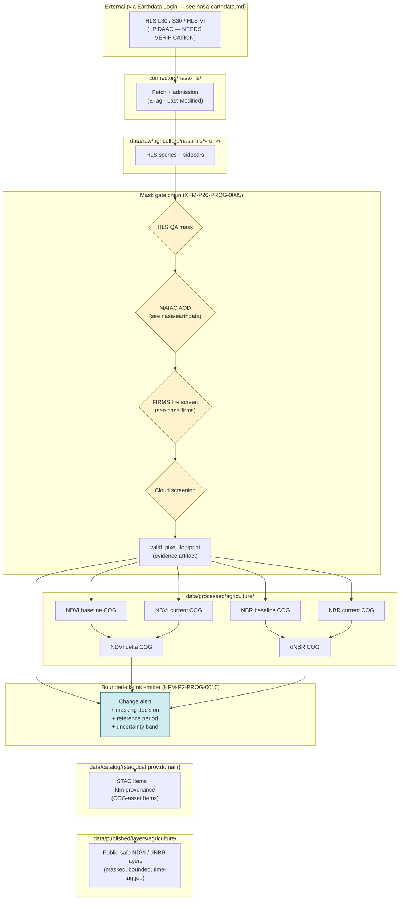

<!-- [KFM_META_BLOCK_V2]
doc_id: kfm://doc/docs-sources-catalog-nasa-nasa-hls
title: NASA HLS Harmonized Imagery
type: product-page
version: v0.2
status: draft
owners: <PLACEHOLDER — Docs steward + Source steward for nasa>
created: 2026-05-21
updated: 2026-05-22
policy_label: public
related:
  - docs/sources/catalog/nasa/README.md
  - docs/sources/catalog/nasa/nasa-earthdata.md
  - docs/sources/catalog/nasa/nasa-firms.md
  - docs/sources/catalog/nasa/nasa-smap.md
  - docs/sources/catalog/README.md
  - docs/sources/catalog/PROFILES.md
  - docs/sources/catalog/IDENTITY.md
  - docs/sources/catalog/RIGHTS-AND-SENSITIVITY-MAP.md
  - docs/sources/catalog/_template/SOURCE_PRODUCT_TEMPLATE.md
  - docs/doctrine/directory-rules.md
  - docs/adr/ADR-NNNN-nasa-source-family-promotion.md
tags: [kfm, docs, sources, catalog, nasa, hls, landsat, sentinel-2, ndvi, nbr, agriculture, vegetation]
notes:
  - "PROPOSED product-page scaffold. Framing as 'context layer, not field truth' grounded in KFM-P20-IDEA-0002 (bounded analytical claims) and KFM-P20-PROG-0005 (mask before claim). Cross-product mask dependency on MAIAC AOD + FIRMS is doctrinally central."
  - "v0.2: full presentation polish; mask gate chain, COG governance, burn-slice products, valid-pixel footprints as evidence, uncertainty envelope on alerts, acceptance section."
[/KFM_META_BLOCK_V2] -->

<a id="top"></a>

# NASA HLS Harmonized Imagery

> NASA **Harmonized Landsat–Sentinel-2** (HLS) surface-reflectance imagery and the **HLS-VI** vegetation-indices product. KFM ingests HLS for harmonized recent observations and pairs it with Landsat archives for historical depth. **HLS is a context layer, not field truth** — every analytical claim must carry an explicit cloud / aerosol / fire mask trail.

<!-- Badge row — all targets are PROPOSED placeholders; replace as CI/registry surfaces land. -->


<!-- TODO: replace with generated badges (KFM-P3-FEAT-0005): truth, gate, freshness, source-role -->

**Status:** PROPOSED — scaffold; family is **beyond `directory-rules.md` §7.3** (see family README and OPEN-DSC-14). · **Family:** [`nasa`](./README.md) · **Owners:** `<PLACEHOLDER — Docs steward + Source steward for nasa>` · **Last reviewed:** 2026-05-22

---

## Contents

- [Overview — context layer, not field truth](#overview--context-layer-not-field-truth)
- [Product inventory](#product-inventory)
- [Cadence & temporal posture](#cadence--temporal-posture)
- [Mask gate chain — required before any claim](#mask-gate-chain--required-before-any-claim)
- [Lifecycle & gate flow](#lifecycle--gate-flow)
- [Burn-slice and vegetation-change outputs](#burn-slice-and-vegetation-change-outputs)
- [Bounded-claims posture](#bounded-claims-posture)
- [COG governance](#cog-governance)
- [Source authority](#source-authority)
- [Auth & access](#auth--access)
- [Catalog profiles used](#catalog-profiles-used)
- [Collection identity](#collection-identity)
- [Provenance fields](#provenance-fields)
- [Temporal handling](#temporal-handling)
- [Geometry and projection](#geometry-and-projection)
- [Rights and sensitivity](#rights-and-sensitivity)
- [Validation and catalog closure](#validation-and-catalog-closure)
- [Related contracts and schemas](#related-contracts-and-schemas)
- [Related connectors and pipelines](#related-connectors-and-pipelines)
- [Examples](#examples)
- [Acceptance — when this product page is considered complete](#acceptance--when-this-product-page-is-considered-complete)
- [Open questions](#open-questions)
- [Related docs](#related-docs)
- [Appendix A — Evidence anchors](#appendix-a--evidence-anchors)

---

## Overview — context layer, not field truth

NASA's **Harmonized Landsat–Sentinel-2 (HLS)** product delivers surface-reflectance imagery and vegetation indices harmonized across Landsat 8/9 (L30) and Sentinel-2A/2B (S30). HLS-VI extends the line with derived vegetation indices.

In the KFM model, HLS is the **canonical satellite authority for vegetation-change context** (CONFIRMED, `KFM-P2-IDEA-0029`). It is **not** field truth — pixels say "what light came back from this footprint at this time," not "what is growing here." Every analytical claim derived from HLS MUST carry an explicit mask trail and an uncertainty envelope.

The doctrine reasons are cumulative:

- **`KFM-P20-IDEA-0002`** — "HLS vegetation indices, STAC-discoverable COGs, MAIAC/FIRMS masks, and QA masks should produce **only bounded analytical claims** with explicit cloud, aerosol, and fire-screening evidence."
- **`KFM-P20-PROG-0005`** — "**Mask HLS analytics** using quality masks, MAIAC aerosol context, FIRMS fire detections, and cloud-screening state **before** deriving vegetation change claims."
- **`KFM-P2-PROG-0010`** — vegetation-change alerts must "carry the masking decision, the reference period, and an uncertainty band. **Policy-safe defaults exclude alerts that fail mask QA or fall below an evidence-confidence threshold.**"

> [!IMPORTANT]
> **HLS without masks is not evidence.** A vegetation-change tile, an NDVI delta, or a "burn area" claim derived from raw HLS without the cloud / aerosol / fire mask gate chain is **drift**, not analysis. The masking decision is part of the evidence; releasing the derived raster without it bypasses the trust membrane.

[Back to top](#top)

---

## Product inventory

| HLS product | Source platforms | KFM use | Status |
|---|---|---|---|
| **HLS L30** | Landsat 8 / 9 OLI, ~30 m | Harmonized recent observations across the Landsat line; cross-platform analysis with S30. | CONFIRMED in `KFM-P2-IDEA-0029` |
| **HLS S30** | Sentinel-2A / 2B MSI, resampled to ~30 m | Harmonized recent observations across the Sentinel-2 line; cross-platform analysis with L30. | CONFIRMED in `KFM-P2-IDEA-0029` |
| **HLS-VI** | Derived from L30 + S30 | Vegetation indices (NDVI, NBR, others — NEEDS VERIFICATION of the full index list). | CONFIRMED in DOM-AG source-family table |
| Landsat archive *(sibling, not HLS)* | Landsat program (long history) | Historical depth for time-series work. Paired with HLS via crosswalks. | CONFIRMED in `KFM-P2-IDEA-0029` |

> [!NOTE]
> Resolution, band lists, and the full HLS-VI index inventory are PROPOSED placeholders consistent with the corpus. The **`SourceDescriptor` in [`data/registry/sources/`](../../../../data/registry/sources/)** is the authoritative anchor. If this table conflicts with the registry, the registry wins.

## Cadence & temporal posture

| Aspect | Posture |
|---|---|
| **Revisit cadence** | Sub-weekly over Kansas under nominal conditions (PROPOSED — confirm against current HLS documentation). |
| **Latency** | NRT and reprocessed variants exist; cadence-class label is required per the NRT-vs-reprocessed discipline applied family-wide (cross-reference `KFM-P2-PROG-0004`). |
| **Reference period** | Every vegetation-change alert MUST cite its reference period; "before / after" comparisons that elide the reference period are not bounded claims (`KFM-P2-PROG-0010`). |
| **Phenological caveat** | Smoke and cirrus can resemble vegetation change at certain phenological windows. The recipe prefers exclusion over false-positive publication (`KFM-P2-PROG-0010`). |

[Back to top](#top)

---

## Mask gate chain — required before any claim

> [!CAUTION]
> **CONFIRMED doctrine** (`KFM-P20-PROG-0005`): "Mask HLS analytics using quality masks, MAIAC aerosol context, FIRMS fire detections, and cloud-screening state **before** deriving vegetation change claims." The four masks below are not optional steps — they are the gate chain that makes HLS a usable evidence source.

| Mask | Source | What it screens | If absent or stale |
|---|---|---|---|
| **HLS QA mask** | HLS Fmask / scene QA bands | Per-pixel cloud, cloud shadow, snow, water, adjacency flags | Pixel **excluded** from claims |
| **MAIAC aerosol context** | [`./nasa-earthdata.md`](./nasa-earthdata.md) → MAIAC AOD product | Atmospheric aerosol load that biases surface reflectance | Tile **degraded** at AOD ≥ 0.5; **quarantined** at AOD ≥ 0.8 (per `ML-065-002` PROPOSED thresholds) |
| **FIRMS fire screen** | [`./nasa-firms.md`](./nasa-firms.md) | Active-fire detections within the analysis window | Tile **escalated** within 5 km of detection (per `ML-065-003`); fire pixels excluded from vegetation-change claims |
| **Cloud-screening state** | Pipeline-side scene classification | Residual cloud after QA mask (cirrus, edge effects) | Pixel **excluded** from claims; recorded in `valid_pixel_footprint` |

> [!WARNING]
> **Failed mask QA = no claim.** Per `KFM-P2-PROG-0010`, policy-safe defaults **exclude** alerts that fail mask QA or fall below an evidence-confidence threshold. A claim without a recorded masking decision is not eligible for promotion.

[Back to top](#top)

---

## Lifecycle & gate flow



**Gate chain anchors:** `KFM-P20-PROG-0005` (mask chain) · `KFM-P20-IDEA-0002` (bounded claims) · `KFM-P2-PROG-0010` (uncertainty envelope) · `ML-K-039` (valid-pixel footprint as evidence artifact) · `ML-K-068–070` (NDVI / NBR / dNBR COG outputs).

[Back to top](#top)

---

## Burn-slice and vegetation-change outputs

PROPOSED, grounded in `ML-K-068`, `ML-K-069`, `ML-K-070` (carried-forward EXPANDED cumulative ideas in *Master MapLibre Components-Functions-Features*):

| Output | Definition | Source anchor |
|---|---|---|
| **NDVI baseline COG** | NDVI raster for the pre-event reference period. | `ML-K-068` |
| **NDVI current COG** | NDVI raster for the post-event observation window. | `ML-K-068` |
| **NDVI delta COG** | Per-pixel change between baseline and current; emitted as a paired COG with optional GeoJSON alert overlay (per `ML-K-037`). | `ML-K-070`, `ML-K-037` |
| **NBR baseline COG** | Normalized Burn Ratio raster for the pre-event reference period. | `ML-K-069` |
| **NBR current COG** | NBR raster for the post-event observation window. | `ML-K-069` |
| **dNBR COG** | Per-pixel NBR delta (Δ-NBR); the canonical burn-severity proxy. | `ML-K-070` |
| **valid_pixel_footprint** | Geometry recording which pixels passed all four mask gates. Treated as an **evidence artifact**, not metadata (`ML-K-039`). | `ML-K-039` |

[Back to top](#top)

---

## Bounded-claims posture

Per `KFM-P2-PROG-0010` and `KFM-P20-IDEA-0002`, every vegetation-change alert emitted from HLS carries:

1. **Masking decision** — which masks fired, which pixels were excluded, AOD/FRP values at observation time.
2. **Reference period** — explicit before/after windows; no implicit "previous."
3. **Uncertainty band** — quantitative envelope on the change estimate.
4. **Evidence-confidence label** — alerts below the configured threshold are **excluded**, not published with caveats.

> [!NOTE]
> The uncertainty band is part of the evidence, not narrative seasoning. AI surfaces and public-facing copy that drop the uncertainty band are bypassing the trust membrane (a §13.5 anti-pattern candidate).

## COG governance

HLS-derived outputs are Cloud-Optimized GeoTIFFs (COGs) governed by the `K. Raster, COG, DEM, Terrain, Hillshade` rules in *Master MapLibre Components-Functions-Features*:

| Rule | Status | Anchor |
|---|---|---|
| HLS COG assets MUST be STAC-searchable | EXPANDED / CONFIRMED source evidence | `ML-K-036` |
| NDVI delta COGs pair with GeoJSON alerts | EXPANDED / CONFIRMED source evidence | `ML-K-037` |
| Equal-area grid snapping for raster statistics | EXPANDED / CONFIRMED source evidence | `ML-K-038` |
| Valid-pixel footprints are evidence artifacts (not metadata) | EXPANDED / CONFIRMED source evidence | `ML-K-039` |
| COG quick-checks are release gates | EXPANDED / CONFIRMED source evidence | `ML-K-040` |
| Raster outputs MUST retain STAC `ETag` and `Last-Modified` | EXPANDED / CONFIRMED source evidence | `ML-K-041` |
| COG outputs need internal tiling and overviews enabled | EXPANDED / CONFIRMED source evidence | `ML-K-071` |

[Back to top](#top)

---

## Source authority

See [`data/registry/sources/`](../../../../data/registry/sources/) for the authoritative `SourceDescriptor` (one per HLS product: L30, S30, HLS-VI). **Do not duplicate descriptor fields here.** Policy decisions live in [`policy/sources/`](../../../../policy/sources/); sensitivity tiers in [`policy/sensitivity/`](../../../../policy/sensitivity/).

## Auth & access

| Aspect | Status |
|---|---|
| Originating DAAC | LP DAAC (PROPOSED — NEEDS VERIFICATION) |
| Earthdata Login required? | **Yes** — see [`./nasa-earthdata.md`](./nasa-earthdata.md) for the shared auth surface |
| Public map dependency forbidden? | **CONFIRMED** — EDL tokens MUST NOT reach the browser (`ML-063-010`); MapLibre clients fetch only public-safe assets through the governed API |
| CMR discovery | **PROPOSED** — granule discovery via CMR per `KFM-P31-IDEA-0018` |
| HTTP validators | `ETag` + `Last-Modified` captured per `C3-01` and retained per `ML-K-041` |

[Back to top](#top)

---

## Catalog profiles used

| Profile | Lane | Used by this product? | Notes |
|---|---|---|---|
| STAC Items / Collections | `data/catalog/stac/` | **PROPOSED — Yes** | HLS COG assets are STAC-searchable per `ML-K-036`. Per-product Collections (L30, S30, HLS-VI) PROPOSED. |
| DCAT distribution | `data/catalog/dcat/` | **PROPOSED — Yes** | Dataset-level metadata per Collection. |
| PROV-O provenance | `data/catalog/prov/` | **PROPOSED — Yes** | Mask gate chain visible in `prov:wasGeneratedBy` activities; cross-references MAIAC + FIRMS as `prov:used`. |
| Domain projection | `data/catalog/domain/agriculture/` | **PROPOSED — Yes** (primary lane: agriculture) | Secondary cross-references in `domain/hazards/` (burn-slice / dNBR) and `domain/atmosphere/` (smoke context) are PROPOSED — NEEDS VERIFICATION. |

> [!NOTE]
> HLS / HLS-VI appears as a **key source family** in DOM-AG (Agriculture) per the *Kansas Frontier Matrix Domains v1.1 + Pass 23/32 Consolidated Atlas* (CONFIRMED). The burn-slice outputs (`dNBR`) inform Hazards but the primary projection MUST land in `agriculture/`; hazards-side references are cross-links, not duplicate ownership.

## Collection identity

PROPOSED Collection-id patterns (per [`../IDENTITY.md`](../IDENTITY.md)):

- `kfm-nasa-hls-l30`
- `kfm-nasa-hls-s30`
- `kfm-nasa-hls-vi`
- Derived: `kfm-nasa-hls-ndvi-delta` · `kfm-nasa-hls-dnbr` *(treated as research-derived artifacts per `KFM-P2-IDEA-0029` Open Question resolution)*

Namespace: `kfm:` — pin **UNRESOLVED**; see **OPEN-DSC-03**. Asset roles: **NEEDS VERIFICATION** against [`schemas/contracts/v1/source/`](../../../../schemas/contracts/v1/source/).

[Back to top](#top)

---

## Provenance fields

STAC `properties.kfm:provenance` block per `C4-01` (Pass-10 components atlas, CONFIRMED):

| Field | Value |
|---|---|
| `spec_hash` | `jcs:sha256:<hex>` — RFC 8785 JCS canonicalization + SHA-256 (per `C1-02`) |
| `evidence_bundle_ref` | `kfm://evidence/<digest>` — content-addressed JSON-LD bundle (per `C4-04`) |
| `run_record_ref` | `kfm://run/<run-id>` |
| `audit_ref` | `kfm://audit/<attestation-id>` |
| `policy_digest` | `sha256:<hex>` — policy bundle used at promotion |
| `http_validators` | `{etag, last_modified}` — retained per `ML-K-041` |
| `dataset_version` | HLS product version (L30 / S30 / HLS-VI per Item) |
| `cadence_class` | `nrt` \| `reprocessed` (PROPOSED vocabulary) |
| `mask_chain` | Recorded masking decision: `{hls_qa, maiac_aod, firms_fire, cloud_screen}` references + outcomes |
| `valid_pixel_footprint_ref` | Pointer to the footprint geometry artifact (per `ML-K-039`) |
| `reference_period` | `{start, end}` for delta products |
| `uncertainty_band` | Per-output uncertainty envelope (per `KFM-P2-PROG-0010`) |

Per-asset integrity: `file:checksum`.

[Back to top](#top)

---

## Temporal handling

Distinct **source / observed / valid / retrieval / release / correction** times stay separate where material (CONFIRMED doctrine):

| Time field | Source | Notes |
|---|---|---|
| `observed_time` | HLS Item `datetime` | Scene acquisition time (per granule) |
| `valid_time` | derived | Window of validity for derived products; alerts inherit from observation window |
| `reference_period` | reference policy | Explicit before/after windows for delta products (per `KFM-P2-PROG-0010`) |
| `retrieval_time` | run receipt | When KFM fetched the scene |
| `release_time` | release manifest | When the KFM artifact was released |
| `correction_time` | supersession | When a reprocessed scene replaces an NRT scene |

## Geometry and projection

| Aspect | Posture |
|---|---|
| Native CRS | HLS UTM tiles (PROPOSED — confirm Sentinel-2 MGRS tile system) |
| KFM output CRS | EPSG:4326 for catalog records (PROPOSED); equal-area projections for raster statistics per `ML-K-038`. **NEEDS VERIFICATION** in `data/published/layers/agriculture/`. |
| Generalization rules | None expected for raw COG assets; tile pyramids derive overviews per `ML-K-071`. |
| Scale support | COG internal tiling + overviews enabled; release-gate COG quick-checks per `ML-K-040`. |
| valid_pixel_footprint | Emitted alongside every derived COG (per `ML-K-039`) |

## Rights and sensitivity

**NEEDS VERIFICATION** — consult [`policy/sensitivity/`](../../../../policy/sensitivity/) and [`../RIGHTS-AND-SENSITIVITY-MAP.md`](../RIGHTS-AND-SENSITIVITY-MAP.md). The atlas marks this row as `rights and current terms NEEDS VERIFICATION; sensitive joins fail closed` (DOM-AG source-family table). **Do not restate policy here.**

[Back to top](#top)

---

## Validation and catalog closure

| Check | Anchor | Status |
|---|---|---|
| Mask gate chain (HLS QA → MAIAC → FIRMS → cloud) is applied before claim emission | `KFM-P20-PROG-0005` | **PROPOSED** |
| Bounded-claims emitter records masking decision + reference period + uncertainty band | `KFM-P2-PROG-0010`, `KFM-P20-IDEA-0002` | **PROPOSED** |
| Failed-mask alerts are **excluded**, not published with caveats | `KFM-P2-PROG-0010` | **PROPOSED** |
| Valid-pixel footprint emitted per derived COG | `ML-K-039` | **PROPOSED** |
| COG quick-checks pass as release gates | `ML-K-040` | **PROPOSED** |
| COG outputs retain STAC `ETag` and `Last-Modified` | `ML-K-041` | **PROPOSED** |
| COG internal tiling + overviews enabled | `ML-K-071` | **PROPOSED** |
| HLS COG assets are STAC-searchable | `ML-K-036` | **PROPOSED** |
| Equal-area grid snapping for raster statistics | `ML-K-038` | **PROPOSED** |
| Spec-hash gate (recomputed `jcs:sha256` matches claimed) | `C1-02` + `C5-04` | **PROPOSED** |
| Catalog closure before public release | `C4-04`; `KFM-P1-IDEA-0020` *(NEEDS VERIFICATION — confirm card id)* | **PROPOSED** |
| STAC Projection lint | `KFM-P27-FEAT-0003` *(NEEDS VERIFICATION — card body not directly inspected)* | **PROPOSED** |
| STAC checksum closure against `ReleaseManifest` digest | `KFM-P22-PROG-0037` *(NEEDS VERIFICATION — card body not directly inspected)* | **PROPOSED** |
| Supersession tombstones (NRT → reprocessed) | `C5-09` | **PROPOSED** |

## Related contracts and schemas

- [`contracts/`](../../../../contracts/) — vegetation-change / raster-asset object semantics; **NEEDS VERIFICATION**.
- [`schemas/contracts/v1/source/`](../../../../schemas/contracts/v1/source/) — machine shape for `SourceDescriptor` (per ADR-0001).

## Related connectors and pipelines

- [`connectors/nasa-hls/`](../../../../connectors/nasa-hls/) — connector folder (currently an empty stub per the family scaffolding pass).
- [`connectors/nasa-earthdata/`](../../../../connectors/nasa-earthdata/) — shared auth surface (EDL).
- Cross-product mask dependencies:
  - [`connectors/nasa-firms/`](../../../../connectors/nasa-firms/) → FIRMS fire screen
  - *(PROPOSED)* `connectors/nasa-maiac/` → MAIAC AOD context
- Pipelines: [`pipelines/ingest/`](../../../../pipelines/ingest/), [`pipelines/normalize/`](../../../../pipelines/normalize/), [`pipelines/validate/`](../../../../pipelines/validate/), [`pipelines/catalog/`](../../../../pipelines/catalog/).
- Pipeline specs: [`pipeline_specs/agriculture/`](../../../../pipeline_specs/agriculture/) *(primary)*; cross-references in `pipeline_specs/hazards/` (burn-slice) and `pipeline_specs/atmosphere/` (smoke context).

[Back to top](#top)

---

## Examples

*(Illustrative only — do not treat as authoritative; canonical Items live in `data/catalog/stac/`.)*

<details>
<summary>Minimal STAC Item shape for an HLS-derived NDVI delta COG (click to expand)</summary>

```json
{
  "type": "Feature",
  "stac_version": "1.0.0",
  "id": "kfm-nasa-hls-ndvi-delta-<tile>-<window>",
  "collection": "kfm-nasa-hls-ndvi-delta",
  "geometry": {"type": "Polygon", "coordinates": [[/* tile footprint */]]},
  "properties": {
    "datetime": "<observation-window-end-ISO8601>",
    "reference_period": {
      "start": "<baseline-start-ISO8601>",
      "end":   "<baseline-end-ISO8601>"
    },
    "kfm:provenance": {
      "spec_hash": "jcs:sha256:<hex>",
      "evidence_bundle_ref": "kfm://evidence/<digest>",
      "run_record_ref": "kfm://run/<run-id>",
      "audit_ref": "kfm://audit/<attestation-id>",
      "policy_digest": "sha256:<hex>",
      "http_validators": {"etag": "<etag>", "last_modified": "<lm>"},
      "dataset_version": "<hls-product-version>",
      "cadence_class": "reprocessed",
      "mask_chain": {
        "hls_qa":      {"applied": true,  "rule_id": "kfm:mask:hls_qa:v1"},
        "maiac_aod":   {"applied": true,  "rule_id": "kfm:mask:maiac:v1", "aod_p90": 0.32},
        "firms_fire":  {"applied": true,  "rule_id": "kfm:mask:firms:v1", "nearest_fire_km": 12.4},
        "cloud_screen":{"applied": true,  "rule_id": "kfm:mask:cloud:v1"}
      },
      "valid_pixel_footprint_ref": "kfm://artifact/<digest>",
      "uncertainty_band": {"method": "<bootstrap|per-pixel>", "p10": -0.04, "p90": 0.06}
    }
  },
  "assets": {
    "data": {
      "href": "<COG-uri>",
      "type": "image/tiff; application=geotiff; profile=cloud-optimized",
      "roles": ["data"],
      "file:checksum": "sha256:<hex>"
    },
    "valid_pixel_footprint": {
      "href": "<footprint-uri>",
      "type": "application/geo+json",
      "roles": ["metadata"],
      "file:checksum": "sha256:<hex>"
    },
    "alerts": {
      "href": "<alerts-uri>",
      "type": "application/geo+json",
      "roles": ["data"],
      "file:checksum": "sha256:<hex>"
    }
  },
  "links": [
    {"rel": "attestation", "href": "kfm://evidence/<digest>"},
    {"rel": "via", "href": "./nasa-earthdata.md"},
    {"rel": "derived_from", "href": "kfm://collection/kfm-nasa-hls-l30"},
    {"rel": "derived_from", "href": "kfm://collection/kfm-nasa-hls-s30"}
  ]
}
```

See also [`_examples/stac-item-example.json`](../_examples/stac-item-example.json) *(NEEDS VERIFICATION — path PROPOSED)*.

</details>

[Back to top](#top)

---

## Acceptance — when this product page is considered complete

> [!NOTE]
> Acceptance criteria follow the KFM doc template pattern (META / BADGES / DESCRIPTION / FILES / ACCEPTANCE) from `KFM-P7-PROG-0008`.

- [ ] ADR resolving **OPEN-DSC-14** is accepted; this page reflects the outcome.
- [ ] `SourceDescriptor` for HLS L30, S30, and HLS-VI exists in [`data/registry/sources/`](../../../../data/registry/sources/) and is linked here without duplication.
- [ ] LP DAAC distribution endpoints and EDL requirement CONFIRMED.
- [ ] Mask gate chain (HLS QA → MAIAC → FIRMS → cloud) is implemented in [`pipelines/`](../../../../pipelines/) with fixtures.
- [ ] Bounded-claims emitter records masking decision + reference period + uncertainty band for every derived alert.
- [ ] Failed-mask alerts are excluded in fixture tests (not merely flagged).
- [ ] Valid-pixel footprint is emitted per derived COG and surfaced as a STAC asset with `roles: [metadata]`.
- [ ] COG quick-checks (`ML-K-040`) are wired as release gates.
- [ ] COG outputs retain STAC `ETag` and `Last-Modified` (`ML-K-041`).
- [ ] COG internal tiling + overviews enabled (`ML-K-071`).
- [ ] Supersession tombstones implemented for NRT → reprocessed transitions (`C5-09`).
- [ ] MAIAC AOD source page exists (currently absent); HLS mask chain references resolve to it.
- [ ] Cross-references to [`./nasa-firms.md`](./nasa-firms.md) and `nasa-maiac.md` resolve.

[Back to top](#top)

---

## Open questions

- **OPEN** — confirm LP DAAC endpoints and EDL OAuth flow for HLS L30 / S30 / HLS-VI.
- **OPEN** — confirm full HLS-VI index inventory beyond NDVI and NBR.
- **OPEN** — confirm whether KFM splits Collections per product (L30, S30, HLS-VI) or operates a single harmonized Collection.
- **OPEN** — confirm whether derived products (`ndvi-delta`, `dnbr`) are first-class Collections or research-derived-artifact Collections per the `KFM-P2-IDEA-0029` Open Question resolution.
- **OPEN** — pin the evidence-confidence threshold used by the bounded-claims emitter (`KFM-P2-PROG-0010` notes it as configurable; confirm whether static or season/ecoregion-dependent).
- **OPEN** — confirm equal-area projection used for raster statistics per `ML-K-038` (Albers, EPSG:9311, or other).
- **OPEN** — confirm whether the `nasa-maiac.md` product page should be created as a sibling product in this family (currently referenced but absent).
- **OPEN-DSC-03** — namespace pin (`kfm:` vs. `ks-kfm:`) unresolved; affects collection-ids.
- **OPEN-DSC-14** — family is PROPOSED; see [`../OPEN-QUESTIONS.md`](../OPEN-QUESTIONS.md).

[Back to top](#top)

---

## Related docs

- [`./README.md`](./README.md) — NASA source family landing
- [`./nasa-earthdata.md`](./nasa-earthdata.md) — shared auth/access surface (EDL + CMR)
- [`./nasa-firms.md`](./nasa-firms.md) — FIRMS active fire (mask-chain dependency)
- *(planned)* `./nasa-maiac.md` — MAIAC AOD (mask-chain dependency; does not yet exist)
- [`./nasa-smap.md`](./nasa-smap.md) — SMAP soil moisture (sibling product)
- [`../PROFILES.md`](../PROFILES.md) · [`../IDENTITY.md`](../IDENTITY.md) · [`../RIGHTS-AND-SENSITIVITY-MAP.md`](../RIGHTS-AND-SENSITIVITY-MAP.md) · [`../OPEN-QUESTIONS.md`](../OPEN-QUESTIONS.md)
- [`../_template/SOURCE_PRODUCT_TEMPLATE.md`](../_template/SOURCE_PRODUCT_TEMPLATE.md)
- [`../../../doctrine/directory-rules.md`](../../../doctrine/directory-rules.md)
- `<TODO>` `docs/standards/STAC_KFM_PROFILE.md` — STAC profile (NEEDS VERIFICATION — confirm path)

---

## Appendix A — Evidence anchors

<details>
<summary>KFM idea-card and ML-component anchors that govern this page (click to expand)</summary>

| Anchor | Class | Status | What it establishes |
|---|---|---|---|
| `KFM-P2-IDEA-0029` — HLS / Landsat for vegetation change | idea | **CONFIRMED** normalized statement | HLS L30/S30 (harmonized) preferred for cross-platform analysis; Landsat preserved for historical depth. KFM-canonical satellite authority for vegetation change. |
| `KFM-P20-IDEA-0002` — Weekly HLS vegetation analytics need mask-aware evidence | idea | normalized PROPOSED; carry-forward CONFIRMED | HLS vegetation indices + COGs + MAIAC/FIRMS/QA masks produce **only bounded analytical claims** with explicit cloud/aerosol/fire-screening evidence. |
| `KFM-P20-PROG-0005` — MAIAC FIRMS cloud-and-smoke screen gate | programming | normalized PROPOSED; carry-forward CONFIRMED | **Mask HLS analytics using QA + MAIAC aerosol + FIRMS fire + cloud-screening state BEFORE deriving vegetation change claims.** Central HLS doctrine. |
| `KFM-P2-PROG-0010` — Satellite-driven vegetation change alerts (HLS / Landsat) | programming | PROPOSED | Alerts carry masking decision, reference period, uncertainty band. Policy-safe defaults **exclude** failed-mask or low-confidence alerts. Smoke vs phenology caveat. |
| `ML-K-036` — HLS COG assets are STAC-searchable raster | mapping | EXPANDED / CONFIRMED source evidence | COG outputs MUST be STAC-searchable. |
| `ML-K-037` — NDVI delta COG pairs with GeoJSON alerts | mapping | EXPANDED / CONFIRMED source evidence | Delta COGs ship with GeoJSON alert overlays. |
| `ML-K-038` — Equal-area grid snapping makes raster statistics | mapping | EXPANDED / CONFIRMED source evidence | Raster statistics on equal-area grids. |
| `ML-K-039` — Valid-pixel footprints are evidence artifacts | mapping | EXPANDED / CONFIRMED source evidence | Footprints are evidence, not decorative metadata. |
| `ML-K-040` — COG quick-checks are release gates | mapping | EXPANDED / CONFIRMED source evidence | Quick-checks gate promotion. |
| `ML-K-041` — Raster outputs must retain STAC `ETag` and `Last-Modified` | mapping | EXPANDED / CONFIRMED source evidence | HTTP validators preserved through the pipeline. |
| `ML-K-068` — HLS burn slice should emit baseline and current NDVI COGs | mapping | EXPANDED / CONFIRMED source evidence | Burn-slice NDVI outputs. |
| `ML-K-069` — HLS burn slice should emit baseline and current NBR COGs | mapping | EXPANDED / CONFIRMED source evidence | Burn-slice NBR outputs. |
| `ML-K-070` — HLS burn slice should emit delta NDVI and dNBR COGs | mapping | EXPANDED / CONFIRMED source evidence | Delta NDVI and dNBR outputs. |
| `ML-K-071` — COG outputs need internal tiling and overviews enabled | mapping | EXPANDED / CONFIRMED source evidence | COG internal layout. |
| `ML-065-002` — MAIAC AOD tile-health gates (cross-link) | mapping | NEW / CONFIRMED source evidence | AOD ≥ 0.5 degrades; AOD ≥ 0.8 quarantines — fed into HLS mask chain. |
| `ML-065-003` — FIRMS FRP proximity gates (cross-link) | mapping | NEW / CONFIRMED source evidence | FIRMS detections within 5 km / FRP ≥ 10 MW — fed into HLS mask chain. |
| `ML-063-010` — NASA/CMR auth tokens must not be public map dependencies | mapping | CONFIRMED | EDL tokens MUST NOT reach the browser. |
| *KFM Domains v1.1 + Pass 23/32 Consolidated Atlas* DOM-AG source-family table | atlas | CONFIRMED that NASA HLS / HLS-VI is a key source family in Agriculture | Primary domain projection MUST land in `agriculture/`. |
| `C1-02` — Deterministic `spec_hash` (RFC 8785 JCS + SHA-256) | component | CONFIRMED | Hash discipline applied to HLS records. |
| `C3-01` — Conditional GETs (ETag / If-None-Match) | component | CONFIRMED | HTTP validator capture. |
| `C4-01` — STAC Item with `kfm:provenance` Namespace | component | CONFIRMED | Provenance block on every HLS Item. |
| `C5-09` — Tombstones for Revocation | component | CONFIRMED | NRT → reprocessed supersession. |

</details>

---

**Last reviewed:** 2026-05-22 *(Claude session — v0.2: context-not-truth framing elevated; mask gate chain documented; COG governance, burn-slice outputs, bounded-claims posture, uncertainty envelope, valid-pixel footprint as evidence artifact; acceptance + evidence appendix.)*

[Back to top](#top)
