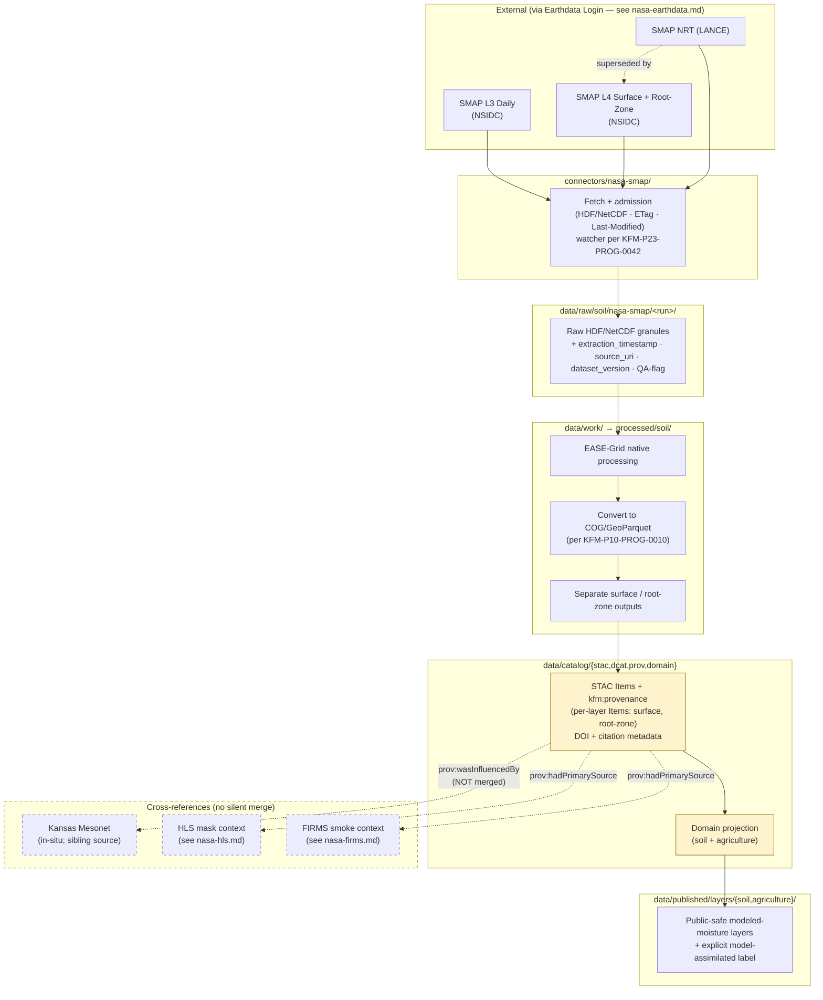

<!-- [KFM_META_BLOCK_V2]
doc_id: kfm://doc/docs-sources-catalog-nasa-nasa-smap
title: NASA SMAP Soil Moisture
type: product-page
version: v0.2
status: draft
owners: <PLACEHOLDER — Docs steward + Source steward for nasa>
created: 2026-05-21
updated: 2026-05-22
policy_label: public
related:
  - docs/sources/catalog/nasa/README.md
  - docs/sources/catalog/nasa/nasa-earthdata.md
  - docs/sources/catalog/nasa/nasa-firms.md
  - docs/sources/catalog/nasa/nasa-hls.md
  - docs/sources/catalog/README.md
  - docs/sources/catalog/PROFILES.md
  - docs/sources/catalog/IDENTITY.md
  - docs/sources/catalog/RIGHTS-AND-SENSITIVITY-MAP.md
  - docs/sources/catalog/_template/SOURCE_PRODUCT_TEMPLATE.md
  - docs/doctrine/directory-rules.md
  - docs/adr/ADR-NNNN-nasa-source-family-promotion.md
tags: [kfm, docs, sources, catalog, nasa, smap, soil-moisture, ldas, ease-grid, agriculture, soil]
notes:
  - "PROPOSED product-page scaffold. Framing as model-assimilated LDAS/EnKF reference product (not raw observation) grounded in KFM-P15-PROG-0010. Pair-with-Mesonet rule (no silent merge) grounded in KFM-P2-IDEA-0023."
  - "v0.2: full presentation polish; surface vs root-zone separation, NRT/reprocessed cadence, EASE-Grid + COG/GeoParquet pipeline, independent-comparator role, resolution-mismatch governance, acceptance section."
[/KFM_META_BLOCK_V2] -->

<a id="top"></a>

# NASA SMAP Soil Moisture

> NASA **Soil Moisture Active Passive** mission — L-band passive microwave retrievals plus model-assimilated Level-4 (LDAS/EnKF) reference products. KFM treats SMAP as the **canonical satellite-derived soil-moisture authority** and a **model-assimilated reference product**, not as raw observation truth. Surface and root-zone semantics stay separate.

<!-- Badge row — all targets are PROPOSED placeholders; replace as CI/registry surfaces land. -->


<!-- TODO: replace with generated badges (KFM-P3-FEAT-0005): truth, gate, freshness, source-role -->

**Status:** PROPOSED — scaffold; family is **beyond `directory-rules.md` §7.3** (see family README and OPEN-DSC-14). · **Family:** [`nasa`](./README.md) · **Owners:** `<PLACEHOLDER — Docs steward + Source steward for nasa>` · **Last reviewed:** 2026-05-22

---

## Contents

- [Overview — model-assimilated reference, not raw observation](#overview--model-assimilated-reference-not-raw-observation)
- [Product inventory](#product-inventory)
- [Surface vs root-zone semantics](#surface-vs-root-zone-semantics)
- [Cadence — NRT (LANCE) vs Standard Quality](#cadence--nrt-lance-vs-standard-quality)
- [Lifecycle & gate flow](#lifecycle--gate-flow)
- [Independent moisture comparator role](#independent-moisture-comparator-role)
- [Pair-with-Mesonet rule — no silent merge](#pair-with-mesonet-rule--no-silent-merge)
- [Resolution-mismatch governance](#resolution-mismatch-governance)
- [Format & grid handling](#format--grid-handling)
- [Source authority](#source-authority)
- [Auth & access](#auth--access)
- [Catalog profiles used](#catalog-profiles-used)
- [Collection identity](#collection-identity)
- [Provenance fields](#provenance-fields)
- [Temporal handling](#temporal-handling)
- [Geometry and projection](#geometry-and-projection)
- [Rights and sensitivity](#rights-and-sensitivity)
- [Validation and catalog closure](#validation-and-catalog-closure)
- [Related contracts and schemas](#related-contracts-and-schemas)
- [Related connectors and pipelines](#related-connectors-and-pipelines)
- [Examples](#examples)
- [Acceptance — when this product page is considered complete](#acceptance--when-this-product-page-is-considered-complete)
- [Open questions](#open-questions)
- [Related docs](#related-docs)
- [Appendix A — Evidence anchors](#appendix-a--evidence-anchors)

---

## Overview — model-assimilated reference, not raw observation

NASA's **Soil Moisture Active Passive (SMAP)** mission flies an L-band passive microwave radiometer that retrieves surface soil moisture. The **Level-4 (L4)** product extends that retrieval through a **Land Data Assimilation System (LDAS) with an Ensemble Kalman Filter (EnKF)** to produce **surface and root-zone soil-moisture** estimates at ~9 km nominal grid spacing, daily cadence (PROPOSED specifics — NEEDS VERIFICATION against the current SMAP documentation).

The doctrine for how KFM treats SMAP is unambiguous:

- **`KFM-P15-PROG-0010`** (PROPOSED stmt, CONFIRMED carry-forward) — "**SMAP Level-4 should be treated as a model-assimilated LDAS/EnKF reference product with separate surface and root-zone semantics, not as raw observation truth.**"
- **`KFM-P2-IDEA-0023`** (CONFIRMED normalized statement) — "NASA's SMAP (Soil Moisture Active Passive) L4 product is the **canonical satellite-derived soil moisture authority**; Kansas Mesonet provides in-situ atmospheric and soil observations for Kansas. Both are ingested with their **native temporal resolution preserved.**"
- **`KFM-P2-PROG-0004`** — SMAP L4 "underwrites soil moisture context for hazards and ecology; without a governed ingest path, derived layers (drought indicators, vegetation stress) cannot inherit citable provenance."

> [!IMPORTANT]
> **SMAP L4 is a modeled estimate, not a raw measurement.** Public copy, AI surfaces, and API responses MUST present SMAP values as "**modeled soil moisture**" or "**LDAS/EnKF reference moisture**" — never as "measured soil moisture" or "ground truth." The model component is part of the evidence; eliding it is a §13.5 anti-pattern candidate.

[Back to top](#top)

---

## Product inventory

| SMAP product | Type | KFM use | Status anchor |
|---|---|---|---|
| **SMAP L3 Daily** *(PROPOSED — confirm exact L3 variant)* | Passive microwave **observation** (Level-3 gridded composites) | Observation-class reference where raw-observation semantics are appropriate. | `KFM-P10-PROG-0010` |
| **SMAP L4 Surface** | **Model-assimilated** (LDAS/EnKF) surface soil moisture | Canonical KFM moisture authority for surface layer. | `KFM-P2-IDEA-0023`, `KFM-P15-PROG-0010` |
| **SMAP L4 Root-Zone** | **Model-assimilated** (LDAS/EnKF) root-zone soil moisture | Canonical KFM moisture authority for root-zone layer. | `KFM-P2-IDEA-0023`, `KFM-P15-PROG-0010` |
| **SMAP NRT (LANCE)** | Near-Real-Time products via NASA LANCE | NRT cadence-class for time-sensitive downstream gates; superseded by reprocessed Standard Quality. | `KFM-P23-PROG-0042` |

> [!NOTE]
> Specific dataset identifiers (e.g., `SPL4SMAU`, `SPL4SMGP`) and the precise L3 variant selected for KFM are **NEEDS VERIFICATION** against the `SourceDescriptor` in [`data/registry/sources/`](../../../../data/registry/sources/). If this table conflicts with the registry, the registry wins.

[Back to top](#top)

---

## Surface vs root-zone semantics

Per `KFM-P15-PROG-0010`: **surface and root-zone SMAP semantics stay separate.** They are different soil depths, with different physical meaning, different validity windows, and different uncertainty profiles. Treating them as interchangeable is drift.

| Layer | Approximate depth | Physical meaning | Typical KFM use |
|---|---|---|---|
| **Surface** | Top ~5 cm (PROPOSED — confirm SMAP documentation) | Soil-water content in the radiative-transfer-detectable layer | Rapid response signals; surface drying; smoke/fire context |
| **Root-zone** | ~0–100 cm (PROPOSED — confirm SMAP documentation) | Integrated soil-water content over the root profile | Crop-water context; drought indicators; vegetation stress baselines |

Each layer gets its own STAC Item/asset; they are NOT averaged or merged into a single "soil moisture" value at the catalog level. Cross-references between the two are explicit via `prov:wasInfluencedBy` edges in PROV-O.

[Back to top](#top)

---

## Cadence — NRT (LANCE) vs Standard Quality

Per `KFM-P2-PROG-0004` and `KFM-P23-PROG-0042`, SMAP has an **explicit publication cadence and a known reprocessing posture.** The ingest pipeline MUST capture and distinguish:

| Cadence class | Source / latency (PROPOSED) | Trust class | Supersession behavior |
|---|---|---|---|
| **NRT (LANCE)** | NASA LANCE near-real-time; latency ~3 h post-overpass (NEEDS VERIFICATION) | **Lower confidence**; downstream gates may consume but with `cadence_class: nrt` flag and policy-bound gates only. | **Superseded** by Standard Quality reprocessed products. |
| **Standard Quality (reprocessed)** | NSIDC under Earthdata Login; latency days to weeks (NEEDS VERIFICATION) | Higher confidence; canonical analytical lane. | Authoritative over NRT for the same observation window. Emit tombstone + replacement pointer per `C5-09`. |

> [!CAUTION]
> **NRT records are revisable.** The QA-flag block MUST record `preliminary-vs-reprocessed` status (per `KFM-P2-PROG-0004`). NRT records that get superseded MUST receive a tombstone with a replacement pointer (per `C5-09`); deleting them silently is forbidden.

[Back to top](#top)

---

## Lifecycle & gate flow



**Gate chain anchors:** `KFM-P2-PROG-0004` (NRT/reprocessed QA block) · `KFM-P10-PROG-0010` (NSIDC/Earthdata/OPeNDAP/S3; EASE-Grid native; COG/GeoParquet) · `KFM-P15-PROG-0010` (surface/root-zone separation) · `KFM-P2-IDEA-0023` (Mesonet pairing without merge) · `C5-09` (tombstones for NRT → reprocessed).

[Back to top](#top)

---

## Independent moisture comparator role

Per `KFM-P28-IDEA-0004` (PROPOSED stmt, CONFIRMED carry-forward): **"SMAP L4 should provide an independent moisture comparator for 48–96 hour environmental checks, with cadence and product-version metadata preserved."**

| Comparator use | Window | Required metadata |
|---|---|---|
| 48–96 hour environmental check | Rolling 48–96 h | `cadence_class`, `dataset_version`, `surface` vs `root-zone` layer label |
| Drought-indicator validation | Per indicator definition | SMAP L4 cited as one input; never the sole input for drought class assignments |
| Vegetation-stress baseline | Per HLS analytical window (see [`./nasa-hls.md`](./nasa-hls.md)) | SMAP L4 cited as cross-reference for soil-side context |

> [!NOTE]
> "Independent comparator" means SMAP L4 is consulted **alongside** other moisture sources (Mesonet, NRCS SCAN, NOAA USCRN, SSURGO/gNATSGO context) to check whether they agree — not to override them. Public outputs that present SMAP L4 as a single answer have collapsed the comparator pattern into a single source claim.

[Back to top](#top)

---

## Pair-with-Mesonet rule — no silent merge

> [!CAUTION]
> **CONFIRMED doctrine** (`KFM-P2-IDEA-0023` detailed explanation): "SMAP L4 provides spatially complete but **coarse-resolution** soil moisture; Mesonet provides **high-resolution in-situ observations at point locations.** Together they form a complementary picture. **The corpus is specific that the two should not be silently merged but should be available as parallel sources with explicit cross-referencing.**"

### Required posture

- **Two parallel STAC Collections**: `kfm-nasa-smap-l4-surface` / `kfm-nasa-smap-l4-root-zone` and a separate Mesonet Collection. **Never** a single merged collection.
- **Explicit cross-reference edges** via PROV-O: SMAP and Mesonet artifacts cite each other via `prov:wasInfluencedBy` for comparator analyses, not via merge.
- **Scale labels** preserved on every derived value: source resolution (e.g., SMAP ~9 km) and resampling method MUST be tagged on every cross-source product.
- **Derived "in-situ-validated SMAP" products**, if produced, are **research-derived artifacts** with caveats (per `KFM-P2-IDEA-0023` Open Question resolution) — not the canonical SMAP collection.

[Back to top](#top)

---

## Resolution-mismatch governance

Per the soil-domain corpus and `KFM-P2-IDEA-0023` tensions: **resolution mismatch is a recurring drift trap.** KFM's soil sources span four orders of resolution:

| Source | Approx. resolution | Class |
|---|---|---|
| SSURGO | ~10 m | High-resolution static |
| gNATSGO | ~30 m | Gridded national static |
| SoilGrids | ~250 m | Global gridded static |
| **SMAP L3** | ~9 km (PROPOSED — NEEDS VERIFICATION) | **Coarse-resolution dynamic** |
| **SMAP L4** | ~9 km native; resampled in distributed forms | **Coarse-resolution model-assimilated dynamic** |

> [!WARNING]
> **Silent resampling between resolution classes is forbidden.** The KFM convention (per the soil-domain Pass-10 dossier) is to **explicitly tag every derived value with the source resolution and the resampling method**, and to expose the tags in the catalog. A KFM product that resamples SMAP L4 to 30 m without surfacing the resampling step is drift.

[Back to top](#top)

---

## Format & grid handling

Per `KFM-P10-PROG-0010` (PROPOSED stmt, CONFIRMED carry-forward):

| Concern | Posture |
|---|---|
| Native source format | **HDF / NetCDF** (per `KFM-P23-PROG-0042`) |
| Access methods | NSIDC under Earthdata Login; OPeNDAP; S3 (NEEDS VERIFICATION per dataset) |
| Native grid | **EASE-Grid** (Equal-Area Scalable Earth Grid); KFM processes in native EASE-Grid where appropriate, only reprojecting when downstream products require it |
| KFM output formats | **COG** (Cloud-Optimized GeoTIFF) and **GeoParquet** for vectorized statistics |
| Catalog metadata | STAC + DCAT + PROV-O + DOI + citation metadata required (per `KFM-P10-PROG-0010`) |

[Back to top](#top)

---

## Source authority

See [`data/registry/sources/`](../../../../data/registry/sources/) for the authoritative `SourceDescriptor` — one per SMAP product variant (L3 Daily, L4 Surface, L4 Root-Zone, NRT/LANCE). **Do not duplicate descriptor fields here.** Policy decisions live in [`policy/sources/`](../../../../policy/sources/); sensitivity tiers in [`policy/sensitivity/`](../../../../policy/sensitivity/).

## Auth & access

| Aspect | Status |
|---|---|
| Originating DAAC | **NSIDC** (CONFIRMED in `KFM-P2-PROG-0004` for L4) |
| Earthdata Login required? | **Yes** — see [`./nasa-earthdata.md`](./nasa-earthdata.md) for the shared auth surface |
| Credential management | `.netrc` and/or `EARTHDATA_TOKEN` (PROPOSED per `KFM-P2-PROG-0004`); fail-closed governance |
| Public map dependency forbidden? | **CONFIRMED** — EDL tokens / API keys MUST NOT reach the browser (`ML-063-010`); MapLibre clients fetch only public-safe assets through the governed API |
| NRT access | **NASA LANCE** for near-real-time (per `KFM-P23-PROG-0042`) |
| HTTP validators | `ETag` + `Last-Modified` captured per `C3-01`; watcher events keyed to `spec_hash` / ETag / Last-Modified changes per `ML-065-005` |

[Back to top](#top)

---

## Catalog profiles used

| Profile | Lane | Used by this product? | Notes |
|---|---|---|---|
| STAC Items / Collections | `data/catalog/stac/` | **PROPOSED — Yes** | Per-layer Collections (surface, root-zone) and per-cadence-class variants (NRT, SQ). |
| DCAT distribution | `data/catalog/dcat/` | **PROPOSED — Yes** | Dataset-level metadata per Collection; **DOI** and **citation metadata** required per `KFM-P10-PROG-0010`. |
| PROV-O provenance | `data/catalog/prov/` | **PROPOSED — Yes** | LDAS/EnKF assimilation chain surfaced via `prov:wasDerivedFrom`; Mesonet pairing via `prov:wasInfluencedBy`. |
| Domain projection | `data/catalog/domain/soil/` and `data/catalog/domain/agriculture/` | **PROPOSED — Yes** (primary: soil; secondary: agriculture) | Cross-references to `domain/hazards/` (drought) and `domain/atmosphere/` (smoke context) are PROPOSED — NEEDS VERIFICATION. |

> [!NOTE]
> SMAP appears as a **key source family** in both **DOM-SOIL** and **DOM-AG** per the *Kansas Frontier Matrix Domains v1.1 + Pass 23/32 Consolidated Atlas* (CONFIRMED). Primary domain projection MUST land in `soil/`; agriculture-side projection is a sibling, not a duplicate ownership claim. Hazards-side drought-indicator references and atmosphere-side smoke-context references are cross-references, not duplicate projections.

## Collection identity

PROPOSED Collection-id patterns (per [`../IDENTITY.md`](../IDENTITY.md)):

- `kfm-nasa-smap-l3-daily`
- `kfm-nasa-smap-l4-surface`
- `kfm-nasa-smap-l4-root-zone`
- `kfm-nasa-smap-nrt-lance` *(or merged into the L4 collections via `cadence_class` tagging — see Open Questions)*

Namespace: `kfm:` — pin **UNRESOLVED**; see **OPEN-DSC-03**. Asset roles: **NEEDS VERIFICATION** against [`schemas/contracts/v1/source/`](../../../../schemas/contracts/v1/source/).

[Back to top](#top)

---

## Provenance fields

STAC `properties.kfm:provenance` block per `C4-01` (Pass-10 components atlas, CONFIRMED):

| Field | Value |
|---|---|
| `spec_hash` | `jcs:sha256:<hex>` — RFC 8785 JCS + SHA-256 (per `C1-02`) |
| `evidence_bundle_ref` | `kfm://evidence/<digest>` |
| `run_record_ref` | `kfm://run/<run-id>` |
| `audit_ref` | `kfm://audit/<attestation-id>` |
| `policy_digest` | `sha256:<hex>` |
| `http_validators` | `{etag, last_modified}` captured at fetch |
| `dataset_version` | SMAP product version (e.g., `SPL4SMAU.<version>` — NEEDS VERIFICATION) |
| `cadence_class` | `nrt` (LANCE) \| `sq` (Standard Quality reprocessed) |
| `qa_flags` | `{preliminary_or_reprocessed, spatial_qa, temporal_qa, ...}` per `KFM-P2-PROG-0004` |
| `layer` | `surface` \| `root_zone` (PROPOSED — required per `KFM-P15-PROG-0010`) |
| `assimilation` | `{model: "ldas_enkf", kind: "model-assimilated"}` (PROPOSED — required per `KFM-P15-PROG-0010`) |
| `source_resolution` | Native EASE-Grid resolution (per `KFM-P10-PROG-0010`); preserved through resampling |
| `resampling_method` | Required if reprojected from native EASE-Grid |
| `supersedes` | Optional `kfm:` id pointer when an SQ record replaces an NRT record |
| `doi` | DOI of source product (per `KFM-P10-PROG-0010`) |
| `citation` | Bibliographic citation metadata (per `KFM-P10-PROG-0010`) |

Per-asset integrity: `file:checksum`.

[Back to top](#top)

---

## Temporal handling

Distinct **source / observed / valid / retrieval / release / correction** times stay separate where material:

| Time field | Source | Notes |
|---|---|---|
| `observed_time` | SMAP granule | Native SMAP observation timestamp (preserved; NOT resampled per `KFM-P2-IDEA-0023`) |
| `valid_time` | derived | Validity window for comparator use (48–96 h per `KFM-P28-IDEA-0004`) |
| `retrieval_time` | run receipt | When KFM fetched the granule |
| `release_time` | release manifest | When the KFM artifact was released |
| `correction_time` | supersession | When SQ reprocessed replaces NRT |
| `extraction_timestamp` | per `KFM-P2-PROG-0004` | Required field in the QA-flag block |

> [!IMPORTANT]
> Native temporal resolution MUST be preserved on ingest (per `KFM-P2-IDEA-0023`). Aggregation to daily/weekly composites is a derived-product step, not an ingest step; derived composites are separate STAC Items with `prov:wasDerivedFrom` edges.

## Geometry and projection

| Aspect | Posture |
|---|---|
| Native CRS | **EASE-Grid 2.0** (PROPOSED — confirm grid identifier against current SMAP documentation) |
| KFM processing | Native EASE-Grid where appropriate (per `KFM-P10-PROG-0010`) |
| Catalog CRS | EPSG:4326 for STAC Items (PROPOSED); reprojections recorded in `resampling_method` |
| Output formats | COG (raster) + GeoParquet (vectorized statistics) per `KFM-P10-PROG-0010` |
| Internal layout | COG internal tiling + overviews enabled per `ML-K-071` |
| Scale support | NEEDS VERIFICATION against `data/published/layers/soil/` |

## Rights and sensitivity

**NEEDS VERIFICATION** — consult [`policy/sensitivity/`](../../../../policy/sensitivity/) and [`../RIGHTS-AND-SENSITIVITY-MAP.md`](../RIGHTS-AND-SENSITIVITY-MAP.md). The atlas marks this row as `rights and current terms NEEDS VERIFICATION; sensitive joins fail closed` (DOM-SOIL and DOM-AG source-family tables). **Do not restate policy here.**

[Back to top](#top)

---

## Validation and catalog closure

| Check | Anchor | Status |
|---|---|---|
| Surface and root-zone treated as separate layers | `KFM-P15-PROG-0010` | **PROPOSED** |
| LDAS/EnKF model-assimilated label surfaced in catalog | `KFM-P15-PROG-0010` | **PROPOSED** |
| QA-flag block records preliminary-vs-reprocessed status | `KFM-P2-PROG-0004` | **PROPOSED** |
| `extraction_timestamp`, `source_uri`, `dataset_version` captured per granule | `KFM-P2-PROG-0004` | **PROPOSED** |
| Native temporal resolution preserved on ingest | `KFM-P2-IDEA-0023` | **PROPOSED** |
| Source resolution + resampling method tagged on every derived value | `KFM-P2-IDEA-0023` tensions; soil-domain Pass-10 dossier | **PROPOSED** |
| Mesonet pair = parallel collections, not merged | `KFM-P2-IDEA-0023` | **PROPOSED** |
| Watcher events keyed to `spec_hash` / ETag / Last-Modified | `ML-065-005`, `KFM-P23-PROG-0042` | **PROPOSED** |
| Independent-comparator window (48–96 h) honored | `KFM-P28-IDEA-0004` | **PROPOSED** |
| Native EASE-Grid processing → COG/GeoParquet outputs | `KFM-P10-PROG-0010` | **PROPOSED** |
| DOI + citation metadata in DCAT distribution | `KFM-P10-PROG-0010` | **PROPOSED** |
| Supersession tombstones (NRT → SQ) | `C5-09` | **PROPOSED** |
| COG quick-checks as release gates | `ML-K-040` | **PROPOSED** |
| Spec-hash gate (recomputed `jcs:sha256` matches claimed) | `C1-02` + `C5-04` | **PROPOSED** |
| Catalog closure before public release | `C4-04`; `KFM-P1-IDEA-0020` *(NEEDS VERIFICATION — card body)* | **PROPOSED** |
| STAC Projection lint | `KFM-P27-FEAT-0003` *(NEEDS VERIFICATION — card body)* | **PROPOSED** |
| STAC checksum closure against `ReleaseManifest` digest | `KFM-P22-PROG-0037` *(NEEDS VERIFICATION — card body)* | **PROPOSED** |

## Related contracts and schemas

- [`contracts/`](../../../../contracts/) — soil-moisture / raster-asset object semantics; **NEEDS VERIFICATION**.
- [`schemas/contracts/v1/source/`](../../../../schemas/contracts/v1/source/) — machine shape for `SourceDescriptor` (per ADR-0001).

## Related connectors and pipelines

- [`connectors/nasa-smap/`](../../../../connectors/nasa-smap/) — connector folder (currently an empty stub per the family scaffolding pass).
- [`connectors/nasa-earthdata/`](../../../../connectors/nasa-earthdata/) — shared auth surface (EDL).
- *(planned)* `connectors/kansas-mesonet/` — sibling in-situ source (Kansas Mesonet); cross-referenced, not merged.
- Pipelines: [`pipelines/ingest/`](../../../../pipelines/ingest/), [`pipelines/normalize/`](../../../../pipelines/normalize/), [`pipelines/validate/`](../../../../pipelines/validate/), [`pipelines/catalog/`](../../../../pipelines/catalog/).
- Pipeline specs: [`pipeline_specs/soil/`](../../../../pipeline_specs/soil/) *(primary)*; cross-references in `pipeline_specs/agriculture/`, `pipeline_specs/hazards/` (drought indicators), `pipeline_specs/atmosphere/` (smoke moisture context).
- Sibling scaffold referenced by `KFM-P2-PROG-0004`: `connectors/pipelines/soil/soils_ingest.py` *(PROPOSED — confirm canonical home is under `pipelines/`, not `connectors/`, per `directory-rules.md` §7.3 vs §7.4 boundary)*.

[Back to top](#top)

---

## Examples

*(Illustrative only — do not treat as authoritative; canonical Items live in `data/catalog/stac/`.)*

<details>
<summary>Minimal STAC Item shape for an SMAP L4 Root-Zone granule (click to expand)</summary>

```json
{
  "type": "Feature",
  "stac_version": "1.0.0",
  "id": "kfm-nasa-smap-l4-root-zone-<granule>",
  "collection": "kfm-nasa-smap-l4-root-zone",
  "geometry": {"type": "Polygon", "coordinates": [[/* granule footprint in EPSG:4326 */]]},
  "properties": {
    "datetime": "<observed-time-ISO8601>",
    "kfm:provenance": {
      "spec_hash": "jcs:sha256:<hex>",
      "evidence_bundle_ref": "kfm://evidence/<digest>",
      "run_record_ref": "kfm://run/<run-id>",
      "audit_ref": "kfm://audit/<attestation-id>",
      "policy_digest": "sha256:<hex>",
      "http_validators": {"etag": "<etag>", "last_modified": "<lm>"},
      "dataset_version": "<smap-l4-version>",
      "cadence_class": "sq",
      "layer": "root_zone",
      "assimilation": {"model": "ldas_enkf", "kind": "model-assimilated"},
      "qa_flags": {
        "preliminary_or_reprocessed": "reprocessed",
        "spatial_qa": "<smap-qa-summary>",
        "temporal_qa": "<smap-qa-summary>"
      },
      "source_resolution": {"grid": "EASE-Grid-2.0", "cell_km": 9.0},
      "extraction_timestamp": "<ISO8601>",
      "doi": "<source-doi>",
      "citation": "<bibliographic-citation>"
    }
  },
  "assets": {
    "data": {
      "href": "<COG-uri>",
      "type": "image/tiff; application=geotiff; profile=cloud-optimized",
      "roles": ["data"],
      "file:checksum": "sha256:<hex>"
    },
    "source_granule": {
      "href": "<HDF-or-NetCDF-uri>",
      "type": "application/x-hdf5",
      "roles": ["source"],
      "file:checksum": "sha256:<hex>"
    }
  },
  "links": [
    {"rel": "attestation", "href": "kfm://evidence/<digest>"},
    {"rel": "via", "href": "./nasa-earthdata.md"},
    {"rel": "derived_from", "href": "<source-smap-l4-doi-or-uri>"}
  ]
}
```

See also [`_examples/stac-item-example.json`](../_examples/stac-item-example.json) *(NEEDS VERIFICATION — path PROPOSED)*.

</details>

[Back to top](#top)

---

## Acceptance — when this product page is considered complete

> [!NOTE]
> Acceptance criteria follow the KFM doc template pattern (META / BADGES / DESCRIPTION / FILES / ACCEPTANCE) from `KFM-P7-PROG-0008`.

- [ ] ADR resolving **OPEN-DSC-14** is accepted; this page reflects the outcome.
- [ ] `SourceDescriptor` for each SMAP variant (L3 Daily, L4 Surface, L4 Root-Zone, NRT/LANCE) exists in [`data/registry/sources/`](../../../../data/registry/sources/) and is linked here without duplication.
- [ ] NSIDC endpoints and EDL OAuth flow CONFIRMED.
- [ ] Surface and root-zone Collections are separate; UI / API surfaces preserve the distinction.
- [ ] `assimilation` block ("model-assimilated, LDAS/EnKF") visible in every L4 STAC Item.
- [ ] QA-flag block records `preliminary_or_reprocessed` per granule.
- [ ] Native temporal resolution preserved on ingest (no silent daily aggregation at the ingest stage).
- [ ] `source_resolution` + `resampling_method` tagged on every derived value.
- [ ] Mesonet pair is rendered as parallel Collections; no merge.
- [ ] Watcher events keyed to `spec_hash` / ETag / Last-Modified are implemented and tested.
- [ ] Native EASE-Grid → COG/GeoParquet conversion pipeline implemented in [`pipelines/`](../../../../pipelines/).
- [ ] DOI + citation metadata in DCAT distributions.
- [ ] Supersession tombstones from NRT → SQ visible in `release/changelog/`.
- [ ] Independent-comparator window (48–96 h) honored in downstream gates.

[Back to top](#top)

---

## Open questions

- **OPEN** — confirm exact SMAP dataset identifiers (`SPL4SMAU`, `SPL4SMGP`, L3 variant) and current versions against NSIDC documentation.
- **OPEN** — confirm whether NRT (LANCE) gets its own Collection (`kfm-nasa-smap-nrt-lance`) or whether NRT and SQ share a Collection differentiated by `cadence_class` field.
- **OPEN** — confirm whether KFM publishes a derived **in-situ-validated SMAP** product. Per `KFM-P2-IDEA-0023` Open Question, "**Probably yes as a research-derived artifact.**" Resolution requires policy review.
- **OPEN** — confirm the exact 48–96 hour window for independent-comparator use per `KFM-P28-IDEA-0004`; is it configurable or fixed?
- **OPEN** — confirm SMAP L3 variant selection (e.g., `SPL3SMP`, `SPL3SMP_E`) and whether KFM ingests one or both.
- **OPEN** — confirm canonical home for the `soils_ingest.py` scaffold referenced by `KFM-P2-PROG-0004`: under `connectors/` (admission) or `pipelines/` (orchestration) per `directory-rules.md` §7.3 vs §7.4 boundary.
- **OPEN** — confirm SMAP downstream consumption: which KFM derived layers (drought, vegetation stress, hazard) consume SMAP L4 and how they handle the preliminary-vs-reprocessed transition (per `KFM-P2-PROG-0004` Open Question).
- **OPEN-DSC-03** — namespace pin (`kfm:` vs. `ks-kfm:`) unresolved; affects collection-ids.
- **OPEN-DSC-14** — family is PROPOSED; see [`../OPEN-QUESTIONS.md`](../OPEN-QUESTIONS.md).

[Back to top](#top)

---

## Related docs

- [`./README.md`](./README.md) — NASA source family landing
- [`./nasa-earthdata.md`](./nasa-earthdata.md) — shared auth/access surface (EDL + CMR)
- [`./nasa-hls.md`](./nasa-hls.md) — HLS / HLS-VI (sibling agriculture-domain product)
- [`./nasa-firms.md`](./nasa-firms.md) — FIRMS active fire (sibling hazards-domain product)
- *(planned)* sibling product page for Kansas Mesonet (in-situ soil moisture; **pair, do not merge**)
- [`../PROFILES.md`](../PROFILES.md) · [`../IDENTITY.md`](../IDENTITY.md) · [`../RIGHTS-AND-SENSITIVITY-MAP.md`](../RIGHTS-AND-SENSITIVITY-MAP.md) · [`../OPEN-QUESTIONS.md`](../OPEN-QUESTIONS.md)
- [`../_template/SOURCE_PRODUCT_TEMPLATE.md`](../_template/SOURCE_PRODUCT_TEMPLATE.md)
- [`../../../doctrine/directory-rules.md`](../../../doctrine/directory-rules.md)
- `<TODO>` `docs/standards/STAC_KFM_PROFILE.md` — STAC profile (NEEDS VERIFICATION — confirm path)

---

## Appendix A — Evidence anchors

<details>
<summary>KFM idea-card and ML-component anchors that govern this page (click to expand)</summary>

| Anchor | Class | Status | What it establishes |
|---|---|---|---|
| `KFM-P2-IDEA-0023` — NASA SMAP L4 for soil moisture; Kansas Mesonet for in-situ climate | idea | **CONFIRMED** normalized statement | SMAP L4 is canonical satellite-derived soil-moisture authority; paired with Mesonet; **"the two should not be silently merged but should be available as parallel sources with explicit cross-referencing."** Native temporal resolution preserved. |
| `KFM-P15-PROG-0010` — SMAP L4 as model-assimilated LDAS/EnKF reference | programming | normalized PROPOSED; carry-forward CONFIRMED | **"SMAP Level-4 should be treated as a model-assimilated LDAS/EnKF reference product with separate surface and root-zone semantics, not as raw observation truth."** Dominant framing of this page. |
| `KFM-P2-PROG-0004` — SMAP L4 ingest with CI-friendly QA | programming | normalized PROPOSED; carry-forward CONFIRMED | NSIDC under Earthdata Login; surface + root-zone; `extraction_timestamp` + `source_uri` + `dataset_version` + QA-flag block recording **preliminary-vs-reprocessed status**. Underwrites drought / vegetation-stress derived layers. |
| `KFM-P10-PROG-0010` — SMAP L3/L4 soil moisture raster ETL | programming | normalized PROPOSED; carry-forward EXPANDED | NSIDC / Earthdata / OPeNDAP / S3 access; **native EASE-Grid processing**; convert to **COG/GeoParquet**; cataloged with **DOI + citation metadata**. |
| `KFM-P23-PROG-0042` — SMAP watcher descriptor | programming | PROPOSED | SMAP watcher for satellite **HDF/NetCDF** or **LANCE near-real-time** products with Earthdata auth notes. |
| `KFM-P28-IDEA-0004` — SMAP L4 independent moisture comparator | idea | normalized PROPOSED; carry-forward CONFIRMED | SMAP L4 provides **independent moisture comparator for 48–96 hour environmental checks** with cadence and product-version metadata preserved. |
| `ML-K-011` — Soil-moisture map outputs split point time | mapping | EXPANDED / CONFIRMED source evidence | Soil-moisture map outputs preserve temporal distinctions in their structure. |
| `ML-063-010` — NASA/CMR auth tokens not public map dependencies | mapping | CONFIRMED | EDL tokens MUST NOT reach the browser. |
| `ML-065-005` — Watcher events keyed to `spec_hash` / ETag / Last-Modified | mapping | NEW / CONFIRMED source evidence | Watcher events emitted only on `kfm:spec_hash`, ETag, or Last-Modified changes. |
| *KFM Domains v1.1 + Pass 23/32 Consolidated Atlas* DOM-SOIL source-family table | atlas | CONFIRMED that NASA SMAP is a key source family in Soil | Primary domain projection MUST land in `soil/`. |
| *KFM Domains v1.1 + Pass 23/32 Consolidated Atlas* DOM-AG source-family table | atlas | CONFIRMED that NASA SMAP is a key source family in Agriculture | Sibling projection in `agriculture/` for crop-water context. |
| *KFM Components Pass 10 Idea Index* soil-domain dossier | atlas | CONFIRMED | SSURGO (10m) / gNATSGO (30m) / SoilGrids (250m) / SMAP (~1km) resolution mismatch; warns against silent resampling; KFM convention is to tag every derived value with source resolution and resampling method. |
| `C1-02` — Deterministic `spec_hash` (RFC 8785 JCS + SHA-256) | component | CONFIRMED | Hash discipline applied to SMAP records. |
| `C3-01` — Conditional GETs (ETag / If-None-Match) | component | CONFIRMED | HTTP validator capture. |
| `C4-01` — STAC Item with `kfm:provenance` Namespace | component | CONFIRMED | Provenance block on every SMAP Item. |
| `C4-04` — Evidence-Bundle JSON-LD with Content Addressing | component | CONFIRMED | EvidenceBundle resolution for SMAP claims. |
| `C5-04` — Spec-Hash-Match Gate | component | CONFIRMED | Recomputed hash gates promotion. |
| `C5-09` — Tombstones for Revocation | component | CONFIRMED | NRT → SQ supersession emits tombstone + replacement pointer. |
| `ML-K-040` — COG quick-checks are release gates | mapping | EXPANDED / CONFIRMED source evidence | COG release-gate discipline applied to SMAP COG outputs. |
| `ML-K-071` — COG outputs need internal tiling and overviews enabled | mapping | EXPANDED / CONFIRMED source evidence | COG internal layout for SMAP outputs. |

</details>

---

**Last reviewed:** 2026-05-22 *(Claude session — v0.2: model-assimilated framing elevated; surface vs root-zone separation, NRT vs SQ cadence, EASE-Grid → COG/GeoParquet pipeline, independent-comparator role, pair-with-Mesonet-no-merge rule, resolution-mismatch governance, acceptance + evidence appendix.)*

[Back to top](#top)
