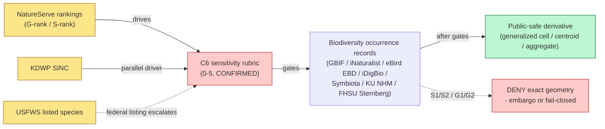
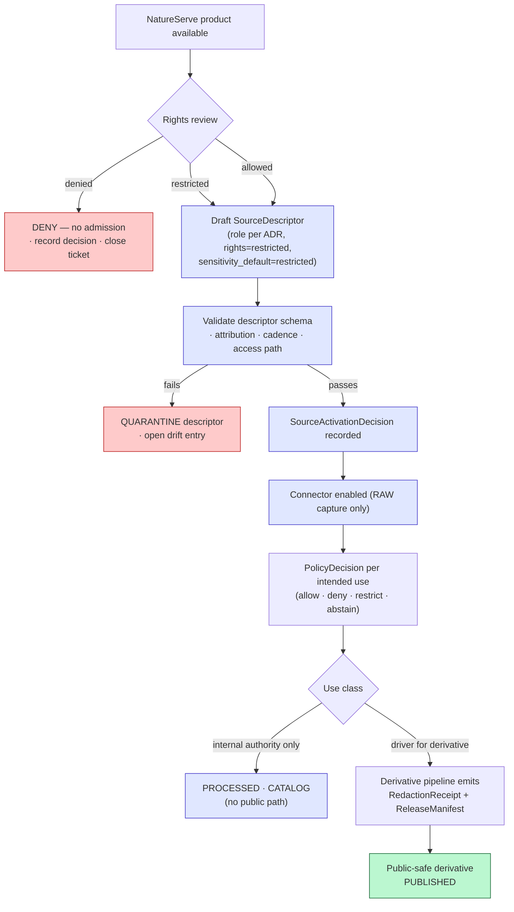

<!-- [KFM_META_BLOCK_V2]
doc_id: kfm://doc/sources/catalog/natureserve
title: NatureServe — Source Profile
type: standard
version: v1
status: draft
owners: [PLACEHOLDER — biodiversity-source steward · source-registry steward · rights steward; CODEOWNERS NEEDS VERIFICATION]
created: 2026-05-20
updated: 2026-05-22
policy_label: restricted
related:
  - docs/sources/README.md
  - docs/sources/catalog/ebird.md
  - docs/sources/catalog/inaturalist.md
  - docs/domains/fauna/README.md
  - docs/domains/flora/README.md
  - docs/doctrine/directory-rules.md
  - docs/doctrine/truth-posture.md
  - docs/doctrine/trust-membrane.md
  - docs/doctrine/lifecycle-law.md
  - docs/standards/SENSITIVITY_RUBRIC.md
  - docs/standards/REDACTION_DETERMINISM.md
  - docs/runbooks/fauna/SOURCE_REFRESH_RUNBOOK.md
  - schemas/contracts/v1/source/source_descriptor.schema.json
  - policy/sensitivity/
  - policy/rights/
  - control_plane/registries/source_authority_register.yaml
tags: [kfm, source-profile, biodiversity, fauna, flora, conservation-status, natureserve, restricted-use, authority, sensitive-data, sensitivity-driver]
notes:
  - "NatureServe products are restricted-by-default per corpus (KFM Flora watcher card tensions, KFM-P25-PROG-0023). Full licensing-and-distribution control is not fully specified in doctrine and MUST be settled by rights-steward review before any connector activation. CONFIRMED tension; PROPOSED admission posture."
  - "Path docs/sources/catalog/natureserve.md uses the docs/sources/ root (CONFIRMED in Directory Rules §6.1 as 'source-descriptor standards, source families'). The catalog/ sub-segment is being established by precedent (sibling profiles for eBird and iNaturalist, CONFIRMED authored prior session, NEEDS VERIFICATION in repo). The sub-segment itself is NOT in Directory Rules and NEEDS VERIFICATION against an ADR."
  - "Filename casing follows the lowercase convention used for prior-session-authored source profiles (ebird.md, inaturalist.md); contrast with docs/standards/ which uses UPPERCASE-WITH-HYPHENS (§6.1.a). docs/sources/ filename convention NEEDS VERIFICATION against a per-root README or ADR."
  - "Canonical SourceDescriptor schema home is schemas/contracts/v1/source/<filename> per Directory Rules §7.4 and ADR-0001. The corpus references both source-descriptor.json (hyphen) and source_descriptor.schema.json (underscore + .schema.json suffix) at different points; the .schema.json form is used here for consistency with KFM's JSON Schema naming. NEEDS VERIFICATION against mounted-repo evidence."
  - "All repo-state claims herein remain PROPOSED until verified against mounted-repo evidence; no repository was mounted in this session."
[/KFM_META_BLOCK_V2] -->

# 🌿 NatureServe — Source Profile

> KFM-side governance profile of **NatureServe / Natural Heritage Network** as a conservation-status authority and sensitivity-driver source family. Defines source identity, role, rights posture, sensitivity linkage, admission flow, lifecycle placement, and verification backlog. This document **explains**; it does not admit, activate, or publish anything.

<!-- Badge row — Shields.io placeholders; replace targets once owners, CI, and policies land -->


| Field | Value |
|---|---|
| **Status** | Draft — pending source-steward & rights-steward review |
| **Owners** | `PLACEHOLDER` — biodiversity-source steward · source-registry steward · rights steward (CODEOWNERS NEEDS VERIFICATION) |
| **Last reviewed** | 2026-05-22 |
| **Default release class** | `restricted` — deny-by-default until rights, sensitivity, and lifecycle placement are settled |
| **Doctrine basis** | Pass 10 §C10-06 (Biodiversity Stack); §C6-01 (Sensitivity Rubric 0–5); §C6-02 (Named Redaction Profiles); §C7-10 (Kansas-First Domain Authorities); KFM-P25-PROG-0023; KFM-P1-PROG-0035; KFM-P24-IDEA-0002; KFM-P19-PROG-0014; KFM-P2-PROG-0002; Directory Rules §6.1, §6.1.a, §7.4 |

---

## Contents

1. [At a glance](#1-at-a-glance)
2. [Source identity and role](#2-source-identity-and-role)
3. [Why NatureServe matters in KFM](#3-why-natureserve-matters-in-kfm)
4. [Rights posture (restricted-use)](#4-rights-posture-restricted-use)
5. [Sensitivity and C6 redaction mapping](#5-sensitivity-and-c6-redaction-mapping)
6. [Lifecycle placement (the open question)](#6-lifecycle-placement-the-open-question)
7. [Admission flow and `SourceDescriptor` shape](#7-admission-flow-and-sourcedescriptor-shape)
8. [Watcher, cadence, and pipeline notes](#8-watcher-cadence-and-pipeline-notes)
9. [Public-safe derivatives — what KFM may and may not publish](#9-public-safe-derivatives--what-kfm-may-and-may-not-publish)
10. [Cross-references to parallel authorities](#10-cross-references-to-parallel-authorities)
11. [Verification backlog](#11-verification-backlog)
12. [Open questions register](#12-open-questions-register)
13. [Related docs](#13-related-docs)
14. [Appendix — Fauna / Flora object touchpoints](#14-appendix--fauna--flora-object-touchpoints)

---

## 1. At a glance

NatureServe — the U.S./Canadian conservation-data network operating with state Natural Heritage Programs — publishes **conservation-status rankings**: the global (G-rank) and subnational (S-rank) values that classify species and ecological communities from `G1/S1` (critically imperiled) through `G5/S5` (secure). KFM uses those rankings as one of two principal **drivers of the C6 sensitivity rubric** for biodiversity data — the other being the Kansas Department of Wildlife and Parks **SINC** (Species in Need of Conservation) list.

> [!IMPORTANT]
> **CONFIRMED doctrine, Pass 10 §C10-06:** *"The KFM convention is to anchor every occurrence to ITIS TSN (or GBIF Backbone where ITIS is silent), preserve the originating institution, and apply C6 redaction for any species that NatureServe or KDWP SINC ranks at S1/S2 sensitivity."* NatureServe is therefore a **sensitivity-driver source** as much as a data source: its rankings change what other sources' records are allowed to do downstream.

> [!CAUTION]
> **CONFIRMED corpus tension (Flora watcher card, Pass 23 KFM-P2-PROG-0002):** *"NatureServe products are restricted; the corpus does not fully specify the licensing-and-distribution control for NatureServe ingest."* This profile is therefore **deny-by-default** until a rights review settles terms.

> [!WARNING]
> **NEEDS VERIFICATION (corpus open question, KFM-P2-PROG-0002):** *"Where exactly does NatureServe data sit in the lifecycle, and how is it distributed (or denied) to consumers?"* This profile **records the question and constrains the answer**; it does not resolve it.

[↑ back to top](#-natureserve--source-profile)

---

## 2. Source identity and role

> Authoritative identity belongs in the machine-readable `SourceDescriptor`. The fields below describe what that descriptor should encode for NatureServe. Field names and the canonical schema home (`schemas/contracts/v1/source/source_descriptor.schema.json` per Directory Rules §7.4 and ADR-0001) remain **PROPOSED** until mounted-repo evidence verifies them.

### Source-role enum reminder (CONFIRMED doctrine)

The canonical `source_role` enum is `observed | regulatory | modeled | aggregate | administrative | candidate | synthetic` (CONFIRMED, KFM Pass 32 §24.1.3). NatureServe rankings are **not observations**, **not models** in the KFM `modeled` sense, and **not regulatory** in the legal-listing sense (federal listing is USFWS/ESA, state listing is KDWP). They are expert-network conservation assessments. The closest fit in the existing enum is **`regulatory`** treated broadly (rankings drive policy gates with regulatory-like force) — but per **KFM-P19-PROG-0014** the corpus proposes registering *"controlled NatureServe records, NatureServe habitat model dashboards, and USGS GAP products as distinct source-role families"*. Resolving this is ADR-class.

> [!NOTE]
> The original informal label `authority` used in earlier drafts is **not** a member of the canonical enum. `authority` is a *concept* (an issuing body) carried in the descriptor's `role_authority` field (CONFIRMED), separate from the `source_role` enum slot. This profile treats NatureServe's `source_role` assignment as **PROPOSED** and open to ADR resolution.

### Descriptor shape for NatureServe (PROPOSED)

| Field (PROPOSED shape) | Intended value for NatureServe | Truth label |
|---|---|---|
| `source_id` | `natureserve` (or namespaced: `kfm:source:natureserve`) | PROPOSED — concrete id NEEDS VERIFICATION against `data/registry/sources/` |
| `source_role` | `regulatory` (closest fit in canonical enum) — *or* extend enum per KFM-P19-PROG-0014 | PROPOSED; resolution is ADR-class |
| `role_authority` | NatureServe (network of state Natural Heritage Programs); Kansas partner: **Kansas Biological Survey** Natural Heritage Inventory (KBS-NHI) | CONFIRMED role concept (`role_authority` field exists per §24.1.3); PROPOSED that KBS-NHI is the KS partner of record per §C7-10 |
| `rights / license` | Restricted; concrete terms NEEDS VERIFICATION (per product, per jurisdiction) | NEEDS VERIFICATION — current license text and version unverified; do **not** fabricate |
| `sensitivity_default` | `restricted` for any S1/S2/G1/G2 record; `watchlist` for S3/G3; `public-eligible` for S4/S5/G4/G5 — subject to per-record steward flag | PROPOSED mapping; consistent with CONFIRMED §C6-01 rubric; exact threshold table NEEDS VERIFICATION |
| `cadence` | Irregular external publication; rankings revised on heritage-program review cycles | PROPOSED; concrete polling/watcher cadence NEEDS VERIFICATION |
| `attribution` | Required; canonical citation format NEEDS VERIFICATION against current NatureServe terms | NEEDS VERIFICATION |
| `access_method` | Network membership / data-use agreement / portal access (varies by product) | NEEDS VERIFICATION |
| `freshness_expectation` | Months-to-quarter; never treat S-ranks as live observation data | CONFIRMED doctrine (rankings ≠ occurrences) |
| `role_aggregation_unit` | Not applicable (rankings attach to taxa, not geometry-scope) | PROPOSED |

### Source-role positioning (PROPOSED)



> **Diagram label:** `NEEDS VERIFICATION` of the exact threshold mapping (S-rank → KFM `sensitivity_rank` → required redaction profile). The doctrine that S1/S2 triggers C6 redaction is CONFIRMED; the precise rank-to-profile table is PROPOSED.

[↑ back to top](#-natureserve--source-profile)

---

## 3. Why NatureServe matters in KFM

NatureServe is the **sensitivity-rank backbone** of KFM biodiversity governance. It does three jobs at once that no other source can substitute for:

1. **Authority for conservation status.** *Conservation Status* is a named object family in the Fauna domain (CONFIRMED, KFM Atlas Fauna spine §7-B). NatureServe G-ranks and S-ranks are the prevailing source of those values for the U.S./Canada-aligned biota of Kansas — complementary to federal USFWS listings and parallel to KDWP SINC for Kansas-specific rankings.
2. **Driver of C6 redaction obligations.** Per Pass 10 §C10-06 and §C6-01, *any* occurrence — from any source family — for a species that NatureServe (or KDWP SINC) ranks at S1/S2 inherits a C6 redaction obligation. NatureServe rankings therefore propagate sensitivity outward across the entire biodiversity stack.
3. **Anchor for sensitive-taxa lists.** Per KFM-P26-PROG-0022 (`sensitive_taxa_sample.txt`, PROPOSED), a sensitive-taxa list gates exact-geometry outputs and forces `public_safe_geometry`. NatureServe rankings are the canonical input that *builds* such a list.

> [!NOTE]
> **Authority anchoring rule (CONFIRMED, Pass 10 §C10-06):** Every biodiversity occurrence anchors to **ITIS TSN** (or GBIF Backbone where ITIS is silent). NatureServe sits *on top of* that taxonomic spine; it does not replace it. A rank without a stable taxon anchor is not actionable.

[↑ back to top](#-natureserve--source-profile)

---

## 4. Rights posture (restricted-use)

> [!CAUTION]
> NatureServe products are **restricted by default**. KFM doctrine explicitly flags this as an open licensing-and-distribution question (KFM-P2-PROG-0002 Flora/Fauna watcher tensions). No connector activation, no admission past `RAW`, and no derivative publication should proceed until a rights review concludes.

### What the doctrine actually says

| Claim | Truth label | Source |
|---|---|---|
| NatureServe data should require *access controls, redaction, license checks, and public-safe derivative rules*. | PROPOSED | KFM-P25-PROG-0023 ("NatureServe rare data access gate") |
| Rare-species occurrence outputs should carry **public-safe transforms and receipts** that document generalization, suppression, or access control. | PROPOSED | KFM-P1-PROG-0035 |
| Fauna occurrence records for sensitive taxa should **default to DENY or ABSTAIN** until redaction, aggregation, or role-gated access is explicitly approved. | PROPOSED (deny-by-default posture) | KFM-P24-IDEA-0002 |
| OPA policy should return `ABSTAIN` or `DENY` for sensitive fauna unless spatial generalization, aggregation, or access gating obligations are satisfied. | PROPOSED | KFM-P24-PROG-0013 |
| The corpus *does not fully specify* the licensing-and-distribution control for NatureServe ingest. | CONFIRMED tension in corpus | KFM-P2-PROG-0002 (Flora watcher card) |
| A `license_map.json` should map `CC0 \| CC-BY \| restricted \| unknown \| attribution-required` to allowed flags and evidence obligations. | PROPOSED | KFM-P26-PROG-0021 |
| Kansas occurrence ETL should apply license mapping and protected-taxa sensitivity checks **before publication**, with redactions recorded in evidence. | PROPOSED | KFM-P26-IDEA-0013 |

### What this profile commits to (PROPOSED)

- **Admission-gate rule.** No NatureServe-derived value flows past the trust membrane without a `SourceDescriptor` whose `rights` field is populated and a `PolicyDecision` recording `allow`, `deny`, `restrict`, or `abstain` for the intended use.
- **Cite-or-abstain.** Any KFM claim that depends on a NatureServe ranking resolves an `EvidenceRef` to an `EvidenceBundle` carrying the descriptor; if the descriptor is unverified or expired, the answering surface **abstains** rather than asserting. (CONFIRMED doctrine, KFM-P1-IDEA-0012, KFM-P26-IDEA-0006.)
- **Public-safe-derivative-only.** KFM SHOULD NOT publish the *raw NatureServe data product* (a ranking export or comprehensive species list) on a public surface. KFM MAY publish **derivative effects** of NatureServe rankings — e.g., a generalized public-safe geometry layer where the redaction obligation was *driven by* an S1/S2 ranking — provided the derivative satisfies its own release gates and the descriptor's attribution rules.

> Rights review MUST settle: (a) which NatureServe products are admissible (rankings vs. exact occurrence locations vs. element occurrence records); (b) which derivative classes are publishable; (c) attribution wording; (d) embargo and revocation behavior; (e) downstream propagation when a rank changes.

[↑ back to top](#-natureserve--source-profile)

---

## 5. Sensitivity and C6 redaction mapping

The C6 rubric (CONFIRMED, Pass 10 §C6-01) ranks records `0` (public/open) through `5` (sacred/critical, fail-closed). NatureServe rankings are translated into that rubric — and then the rubric drives the *named redaction profile* (CONFIRMED, §C6-02).

### PROPOSED mapping (NatureServe rank → KFM `sensitivity_rank` → default redaction profile)

| NatureServe rank | KFM `sensitivity_rank` | Default profile (corpus-named) | Public exposure | Notes |
|---|---|---|---|---|
| G5/S5 (secure) | `0` — public/open | `kfm:redact:none` | Allowed *— rights still apply* | Common; not driven by NatureServe |
| G4/S4 (apparently secure) | `0–1` | `kfm:redact:none` or coarse summary | Allowed *— rights still apply* | Per-record steward flag may upgrade |
| G3/S3 (vulnerable) | `2` — watchlist | Named generalization profile (e.g., `point_10km_hex_seeded_v1`) | Generalized only | PROPOSED |
| **S2 (imperiled)** / G2 | **`3–4` — SINC/locally sensitive → threatened/rare** | `profile:sinc-obscure-10km` (corpus default) **or stricter** | **Generalized cell or centroid; exact DENY** | CONFIRMED doctrine triggers redaction at S1/S2 |
| **S1 (critically imperiled)** / G1 | **`4–5`** | Strict mask or embargo; fail-closed for `5` | **DENY exact; aggregate-only or fail-closed** | CONFIRMED doctrine triggers redaction at S1/S2 |
| `SH` / `SX` (historical / extirpated) | Steward review | Profile per residual exposure | Case-by-case | NEEDS VERIFICATION |
| `SU` / `SNR` (unranked / unrankable) | Default to upper bound of nearest neighbor | Conservative profile | Generalized only | PROPOSED |

> **CONFIRMED doctrine (Pass 10 §C6-01) — `sensitivity_rank` semantics:** `0` public/open · `1` common non-sensitive · `2` watchlist · `3` SINC/locally sensitive (default `profile:sinc-obscure-10km`) · `4` threatened/rare (strict mask or embargo) · `5` sacred/critical (fail-closed; no map or timeline exposure).

> **CONFIRMED doctrine (Pass 10 §C6-02 — Named Redaction Profiles):** Canonical profiles include `point_10km_hex_seeded_v1`, `point_3km_jitter_v1`, `centroid_1km_v1`, plus `kfm:redact:none`. Profile identifiers MUST be versioned; profile changes are *breaking* for any record produced under the old profile.

### Geoprivacy & determinism rules (CONFIRMED doctrine, summarized)

> [!IMPORTANT]
> - **Display jitter is not privacy.** Seeded reproducible jitter (`§C6-03`) is for *display obfuscation only*, not a privacy guarantee.
> - **Grid generalization is the primary transform** for biodiversity occurrences (`§C6-04`) — H3 hex preferred for hex grids; PostGIS `ST_SnapToGrid` for square grids.
> - **Differential privacy applies to aggregates only** (`§C6-05`) — never to raw points. Epsilons are recorded in receipts.
> - **k-anonymity** (`§C6-06`) is the constraint for living-people overlays; for biodiversity, density-aware checks still apply at render time.

### Required receipts

Any release of a NatureServe-driven public-safe derivative MUST emit a `RedactionReceipt` carrying:

```text
policy_ref, redaction_method, kept_fields, removed_fields, geometry_transform, reviewer
```

A NatureServe-driven sensitive layer that ships without a `RedactionReceipt` is a **severe drift event** and MUST be rolled back, not patched downstream.

[↑ back to top](#-natureserve--source-profile)

---

## 6. Lifecycle placement (the open question)

> [!WARNING]
> **Corpus open question, NEEDS VERIFICATION (KFM-P2-PROG-0002):** *"Where exactly does NatureServe data sit in the lifecycle, and how is it distributed (or denied) to consumers?"* This section **states the question and constrains the answer**; settling it is rights-steward + ADR work, not author's work here.

### Constraints any answer MUST satisfy (CONFIRMED invariants)

1. **Lifecycle invariant.** `RAW → WORK/QUARANTINE → PROCESSED → CATALOG/TRIPLET → PUBLISHED`. Promotion is a *governed state transition, not a file move* (CONFIRMED, KFM-P1-IDEA-0006).
2. **Watcher-as-non-publisher.** Workers and watchers emit `RunReceipt` and candidate decisions; they **never** publish or rewrite catalog (CONFIRMED, Directory Rules §13.5).
3. **Trust membrane.** Public clients and normal UI surfaces consume governed APIs and released public-safe artifacts only — never `RAW`, `WORK`, `QUARANTINE`, candidates, or canonical/internal stores (CONFIRMED, Pass 32 §24.6.2).
4. **Cite-or-abstain.** A claim that resolves through a NatureServe descriptor whose rights are unverified, expired, or restricted-to-derivatives-only **abstains** rather than answering (CONFIRMED, KFM-P26-IDEA-0008 composed-claim all-or-abstain rule).

### PROPOSED lifecycle placement

| Phase | What happens (PROPOSED) | Public exposure |
|---|---|---|
| `RAW` | Immutable copy of the admitted NatureServe payload (or signed reference to it) with checksum and source-time. Never public. | DENY |
| `WORK` / `QUARANTINE` | Normalization to KFM `Conservation Status` and (where applicable) sensitive-taxa list shape. Quarantine for any ambiguous rights or unverified descriptor. | DENY |
| `PROCESSED` | Canonical conservation-status records keyed by taxon anchor (ITIS TSN / GBIF Backbone); evidence-bundled with NatureServe `SourceDescriptor`. | DENY (canonical/internal; not the public path) |
| `CATALOG` / `TRIPLET` | STAC/DCAT/PROV records and graph triples. Internal. | DENY (canonical) |
| `PUBLISHED` | **Public-safe derivatives only.** Derived sensitive-taxa flags, generalized public geometries gated *by* NatureServe rankings, and KFM-authored aggregate views. **Not** the raw NatureServe product. | Allow only with passing release gates + `RedactionReceipt` + attribution |

### Required gate artifacts per transition (mapped to CONFIRMED Pass 32 §24.6 gate matrix)

| Gate | NatureServe-specific requirement | Failure-closed outcome |
|---|---|---|
| Admission (— → `RAW`) | `SourceDescriptor` with role, authority, rights, sensitivity, cadence; payload hash; `SourceActivationDecision` | Source not admitted; logged as candidate awaiting steward |
| Normalization (`RAW` → `WORK` / `QUARANTINE`) | `TransformReceipt`; `ValidationReport`; `PolicyDecision` honoring rights and S-rank-derived sensitivity | Quarantine with reason; never silently promotes |
| Validation (`WORK` → `PROCESSED`) | `ValidationReport` pass; `RedactionReceipt` if sensitivity applies | Stay in `WORK`; structured FAIL |
| Catalog closure (`PROCESSED` → `CATALOG` / `TRIPLET`) | `CatalogMatrix` entry; `EvidenceBundle` with resolved descriptor + attribution; graph projection | Hold at `PROCESSED`; no public edge |
| Release (`CATALOG` → `PUBLISHED`) | `ReleaseManifest`; rollback target; `ReviewRecord` (required for sensitive lanes) | Hold at `CATALOG`; no public surface change |
| Correction / Rollback | `CorrectionNotice`; `RollbackCard`; downstream derivative invalidation | Stale-state announcement; no silent edit |

### Acceptance criteria for closing the lifecycle question (PROPOSED)

- Rights review concludes with a written `SourceActivationDecision` (`allowed | restricted | denied | needs-review`).
- `license_map.json` entry for NatureServe is populated and points at a citation block (per KFM-P26-PROG-0021).
- Sensitive-taxa list (KFM-P26-PROG-0022) is populated from NatureServe rankings and published into the **policy bundle**, not the data bundle.
- An ADR amends Directory Rules §6 / §7 only if lifecycle placement requires a placement rule that the current Rules do not already supply.

[↑ back to top](#-natureserve--source-profile)

---

## 7. Admission flow and `SourceDescriptor` shape



> **Diagram status:** PROPOSED. The flow is consistent with CONFIRMED doctrine on source admission (`SourceActivationDecision`, KFM-P1-PROG-0007), trust membrane, watcher-as-non-publisher, and cite-or-abstain. Concrete route names, file paths, and tool names are intentionally not asserted.

### `SourceDescriptor` field expectations for NatureServe (PROPOSED)

| Descriptor field | Expected value | Notes |
|---|---|---|
| `source_id` | `natureserve` (or namespaced equivalent) | Resolve against `data/registry/sources/` convention |
| `source_role` | `regulatory` (closest fit in canonical enum) — *or* per-ADR extension per KFM-P19-PROG-0014 | Never `observed` (rankings are not observations) |
| `role_authority` | `NatureServe` (network); state partner `KBS-NHI` for Kansas | Disambiguates downstream cite text |
| `rights` | structured: `{ license, version, terms_url, attribution, embargo }` — all values NEEDS VERIFICATION | Restricted by default |
| `sensitivity_default` | `restricted` | Upgrade per-record by rank |
| `cadence` | `irregular`; recheck cadence per heritage-program publication patterns | NEEDS VERIFICATION |
| `access_method` | per current NatureServe access posture | NEEDS VERIFICATION |
| `freshness_expectation` | months-to-quarter | Rankings change on review cycles |
| `attribution` | required; per current NatureServe terms | NEEDS VERIFICATION |

> **NEEDS VERIFICATION:** implementation of these fields in the mounted `SourceDescriptor` schema. Canonical home: `schemas/contracts/v1/source/source_descriptor.schema.json` per Directory Rules §7.4 and ADR-0001. The corpus shows both `source-descriptor.json` (hyphen, no `.schema.json`) and `source_descriptor.schema.json` at different points — this filename variance is itself NEEDS VERIFICATION and may warrant a one-line ADR.

[↑ back to top](#-natureserve--source-profile)

---

## 8. Watcher, cadence, and pipeline notes

> [!NOTE]
> NatureServe is unlike GBIF, iNaturalist, or eBird in that **a NatureServe watcher does not produce occurrence records** — it produces *ranking-change events* and (where rights permit) reference lists. The watcher's primary output is therefore an evidence-laden change record, not a stream of occurrences.

### Pipeline placement (PROPOSED)

- **Watcher.** A NatureServe watcher SHOULD emit `SourceIntakeRecord` and `DriftSummary` only — never a `PromotionDecision`. (CONFIRMED watcher-as-non-publisher invariant, Directory Rules §13.5.)
- **Diff-friendly sync.** Rankings change infrequently; small change records propagate large sensitivity consequences. Each diff MUST produce a receipt naming the affected taxon anchors so downstream derivative pipelines can recompute redaction obligations.
- **Cadence.** PROPOSED: weekly or monthly metadata checks; full refresh on each NatureServe publication event (heritage-program-driven, irregular). Concrete values NEEDS VERIFICATION.
- **Cross-domain trigger.** A NatureServe rank change for a Kansas taxon SHOULD trigger reconsideration of every cataloged occurrence keyed to that taxon anchor — fauna, flora, and any habitat layer that depends on the rank.

> [!IMPORTANT]
> A rank *downgrade* (e.g., `S1` → `S2`) does **not** automatically reduce the redaction obligation on already-released derivatives. Released derivatives are governed by the rank in effect at release time and may require a `CorrectionNotice` to reflect a change. Rank *upgrades* (toward greater concern) MAY require immediate `embargo` and rollback of previously released exact-geometry derivatives.

[↑ back to top](#-natureserve--source-profile)

---

## 9. Public-safe derivatives — what KFM may and may not publish

### MAY publish (PROPOSED, pending rights review)

- **Derivative sensitive-taxa flags** on KFM-authored records keyed to taxon anchor (ITIS TSN / GBIF Backbone) — *the flag itself*, not the underlying NatureServe product.
- **Generalized public geometries** whose redaction obligation was *driven by* a NatureServe ranking — e.g., an H3 cell of sufficient coarseness for an S2 species, accompanied by a `RedactionReceipt`.
- **Aggregate views** (counts per cell, county roll-ups) accompanied by an `AggregationReceipt` pinning the geometry scope and the aggregation method.
- **Attribution** of the NatureServe ranking as authority for the conservation-status determination, per NatureServe terms (wording NEEDS VERIFICATION).

### MUST NOT publish (CONFIRMED posture)

- The raw NatureServe data product (ranking export, comprehensive species list, exact element occurrence records) on a public surface absent explicit license permission.
- An exact-geometry public layer for any S1/S2 or G1/G2 taxon, regardless of which source family supplied the occurrence point.
- A NatureServe-derived claim that bypasses the trust membrane (e.g., direct popup-only display without `EvidenceBundle` resolution).
- An AI/Focus Mode answer that asserts a NatureServe ranking without a resolved `EvidenceRef → EvidenceBundle` and an `AIReceipt`.

### Trust-membrane reminder (CONFIRMED doctrine)

Public clients consume **governed APIs** and **released public-safe artifacts**. They do not reach `RAW`, `WORK`, `QUARANTINE`, candidates, canonical/internal stores, graph internals, vector indexes, source APIs, or direct model runtimes. A NatureServe surface that bypasses this is **drift**, not a feature.

[↑ back to top](#-natureserve--source-profile)

---

## 10. Cross-references to parallel authorities

NatureServe is one node in a small network of conservation-status and biodiversity authorities that KFM uses *in parallel*. The network is small on purpose — each node has a distinct role, and KFM does not collapse them.

| Authority | Role in KFM | Relationship to NatureServe |
|---|---|---|
| **KDWP SINC** (Kansas Department of Wildlife and Parks — Species in Need of Conservation) | Kansas-specific sensitivity-driver; CONFIRMED parallel driver to NatureServe in §C10-06 / §C6-01; controlling Kansas regulatory source family per KFM-P19-IDEA-0005 | Co-equal; either trigger sets the C6 obligation |
| **USFWS** (federal listed species, critical habitat, ECOS/IPaC) | Regulatory authority for ESA-listed species; CONFIRMED federal source family | Federal listing usually escalates sensitivity beyond any S-rank |
| **ITIS TSN** | CONFIRMED U.S.-canonical taxonomic authority (§C7-07); required occurrence anchor | NatureServe rank attaches *to* the taxon anchor; ITIS resolves the anchor |
| **GBIF Backbone Taxonomy** | CONFIRMED international taxonomic crosswalk (§C7-08); ITIS fallback | Anchor of last resort where ITIS is silent |
| **KU Biodiversity Institute / FHSU Sternberg / KBS-NHI** | Kansas-first collections and heritage inventory; CONFIRMED Kansas-first authority family (§C7-10) | KBS Natural Heritage Inventory is the state Natural Heritage Program — the local NatureServe network partner |
| **GBIF / iNaturalist / eBird EBD / iDigBio / Symbiota** | Occurrence sources (observed / aggregate) | All inherit C6 obligations from NatureServe + KDWP SINC rankings on their species |
| **USGS GAP** | Habitat models and species range products (per KFM-P19-PROG-0014) | Registered as a distinct source-role family alongside NatureServe controlled records |

> **Authority-ladder rule (PROPOSED):** Where a species carries both a USFWS listing and a NatureServe rank, the **stricter** sensitivity obligation wins. Where NatureServe and KDWP SINC differ, the **stricter** obligation wins. The "stricter wins" rule is consistent with the corpus deny-by-default posture but is not yet pinned in an ADR.

[↑ back to top](#-natureserve--source-profile)

---

## 11. Verification backlog

| # | Item | Status | Owner | Resolution path |
|---|---|---|---|---|
| V1 | Concrete licensing terms (per product, per jurisdiction) for NatureServe data accessible to KFM | NEEDS VERIFICATION | Rights steward | Direct review of current NatureServe terms; record in `license_map.json` (PROPOSED, KFM-P26-PROG-0021) |
| V2 | Exact lifecycle placement of NatureServe payloads (KFM-P2-PROG-0002 open question) | NEEDS VERIFICATION | Source-registry steward + biodiversity-source steward | `SourceActivationDecision` + ADR if Directory Rules amendment needed |
| V3 | Canonical schema home and filename for `SourceDescriptor` — variance between corpus references `source-descriptor.json` and `source_descriptor.schema.json` | NEEDS VERIFICATION | Schema steward | Mounted-repo inspection; ADR-0001 confirmation or one-line follow-on ADR for filename |
| V4 | S-rank → `sensitivity_rank` → named redaction profile table (concrete defaults per rank) | PROPOSED | Sensitivity steward | Author the table in `docs/standards/SENSITIVITY_RUBRIC.md` (PROPOSED, not yet authored — Directory Rules §18 OPEN-DR-05) |
| V5 | KBS-NHI access posture — state Natural Heritage Program partner of record for Kansas | NEEDS VERIFICATION | Kansas-first authority steward | Per §C7-10 corpus guidance; produce a Kansas-Authority Compatibility Report entry |
| V6 | Attribution wording per current NatureServe terms | NEEDS VERIFICATION | Rights steward | Pin in `SourceDescriptor.attribution`; carry through `EvidenceBundle` to release surfaces |
| V7 | Behavior on rank change — propagation across released derivatives | PROPOSED | Release steward + correction-notice owner | Cross-pipeline correction discipline; pin in derivative pipeline runbook |
| V8 | Sensitive-taxa list (`KFM-P26-PROG-0022`) sourced from NatureServe rankings | PROPOSED | Sensitivity steward | Generate list as machine-readable asset under the **policy bundle**; not under the data bundle |
| V9 | Whether `docs/sources/catalog/` sub-segment is canonical or NEEDS VERIFICATION against an ADR | NEEDS VERIFICATION | Docs steward | Sub-segment is established by precedent (eBird, iNaturalist) but not in Directory Rules §6.1; freeze with an ADR consistent with §6.1.a-style discipline |
| V10 | Whether `source_role` for NatureServe should fit the canonical enum (`regulatory` is closest) or trigger an enum extension per KFM-P19-PROG-0014 | NEEDS VERIFICATION | Source-role taxonomy steward | ADR-class decision per Pass 32 §24.1.3 |
| V11 | `SENSITIVITY_RUBRIC.md` and `REDACTION_DETERMINISM.md` are PROPOSED-not-yet-authored per Directory Rules §18 OPEN-DR-05; this profile references them | NEEDS VERIFICATION | Sensitivity steward + docs steward | Author both standards docs |

[↑ back to top](#-natureserve--source-profile)

---

## 12. Open questions register

> Surfaced for triage. Each item maps to existing corpus cards where possible; the rest are local to this profile.

| # | Question | Maps to | Notes |
|---|---|---|---|
| Q1 | Where exactly does NatureServe data sit in the lifecycle, and how is it distributed (or denied) to consumers? | KFM-P2-PROG-0002 | This profile constrains the answer in §6 but does not settle it. |
| Q2 | What is the licensing-and-distribution control for NatureServe ingest? | KFM-P2-PROG-0002 (tension); KFM-P26-PROG-0021 (`license_map.json` PROPOSED) | Rights review owns this. |
| Q3 | Are there other restricted-use biodiversity datasets the corpus has not yet cataloged? | Pass 10 §C10-06 (Biodiversity Stack) open question | KFM should build a biodiversity restricted-use registry as a machine-readable asset under the policy bundle. |
| Q4 | What is the right cell size for `profile:sinc-obscure-10km` and the strict-mask profile for S1/S2 in Kansas density terms? | Pass 10 §C6-04 (Grid Generalization) open question | Tune cell sizes per density; document defaults and exceptions. |
| Q5 | Should NatureServe-derived sensitive-taxa flags travel with the published artifact or be looked up dynamically at render time? | New to this profile | Static-with-receipt is more reproducible; dynamic is more responsive to revocation. ADR-class. |
| Q6 | How is a NatureServe rank revocation/correction propagated to already-released KFM derivatives? | Builds on Pass 10 §C5-09 (Tombstones) and §C6-08 (Revocation Endpoints + Embargo Cache Invalidation) | `CorrectionNotice` + cache invalidation. |
| Q7 | Does `source_role` for NatureServe fit the canonical enum, or is an extension needed? | KFM-P19-PROG-0014; Pass 32 §24.1.3 | ADR-class. |

[↑ back to top](#-natureserve--source-profile)

---

## 13. Related docs

> Targets are placeholders or PROPOSED until mounted-repo verification. Files marked **CONFIRMED authored (prior session)** were authored in earlier work but remain NEEDS VERIFICATION in repo.

- [`docs/sources/README.md`](../README.md) — source-catalog landing (TODO author)
- [`docs/sources/catalog/ebird.md`](./ebird.md) — sibling profile, CONFIRMED authored (prior session); NEEDS VERIFICATION in repo
- [`docs/sources/catalog/inaturalist.md`](./inaturalist.md) — sibling profile, CONFIRMED authored (prior session); NEEDS VERIFICATION in repo
- [`docs/domains/fauna/README.md`](../../domains/fauna/README.md) — Fauna domain index
- [`docs/domains/flora/README.md`](../../domains/flora/README.md) — Flora domain index
- [`docs/doctrine/directory-rules.md`](../../doctrine/directory-rules.md) — Directory Rules (governs placement)
- [`docs/doctrine/truth-posture.md`](../../doctrine/truth-posture.md) — cite-or-abstain doctrine
- [`docs/doctrine/trust-membrane.md`](../../doctrine/trust-membrane.md) — public-path rules
- [`docs/doctrine/lifecycle-law.md`](../../doctrine/lifecycle-law.md) — `RAW → … → PUBLISHED` invariant
- [`docs/standards/SENSITIVITY_RUBRIC.md`](../../standards/SENSITIVITY_RUBRIC.md) — PROPOSED, not yet authored (Directory Rules §18 OPEN-DR-05)
- [`docs/standards/REDACTION_DETERMINISM.md`](../../standards/REDACTION_DETERMINISM.md) — PROPOSED, not yet authored (Directory Rules §18 OPEN-DR-05)
- [`docs/runbooks/fauna/SOURCE_REFRESH_RUNBOOK.md`](../../runbooks/fauna/SOURCE_REFRESH_RUNBOOK.md) — CONFIRMED authored (prior session); NEEDS VERIFICATION in repo
- `schemas/contracts/v1/source/source_descriptor.schema.json` — canonical schema home per Directory Rules §7.4 / ADR-0001 (NEEDS VERIFICATION; filename variance noted in §11 V3)
- `policy/sensitivity/` — sensitive-taxa policy bundle (NEEDS VERIFICATION)
- `policy/rights/` — license-map bundle host for `license_map.json` (NEEDS VERIFICATION)
- `control_plane/registries/source_authority_register.yaml` — operational register (NEEDS VERIFICATION)

[↑ back to top](#-natureserve--source-profile)

---

## 14. Appendix — Fauna / Flora object touchpoints

<details>
<summary><strong>Where NatureServe rankings attach in the KFM object spine (CONFIRMED object families; PROPOSED attachment specifics)</strong></summary>

### Fauna domain (CONFIRMED object-family spine per Atlas §7-B)

NatureServe rankings attach primarily to:

- **Conservation Status** — direct attachment; the ranking *is* the value.
- **Taxon / Taxon Crosswalk** — indirect; the ranking is anchored to the taxon, not the occurrence.
- **Occurrence Restricted / Occurrence Public / Occurrence Evidence** — indirect; the ranking *gates* what each occurrence may become at release.
- **SensitiveSite** — indirect; sensitivity flags on the underlying taxa propagate to sensitive-site logic.
- **RangePolygon / SeasonalRange / MigrationRoute** — indirect; range geometries may inherit redaction obligations from the constituent taxa.

### Flora domain (CONFIRMED object-family spine per Atlas §8-B)

NatureServe and KDWP SINC rankings attach to:

- **Plant Taxon / FloraTaxon Crosswalk** — anchor for the ranking.
- **Rare Plant Record** — explicit object family that captures rarity per ranking authority.
- **Flora Occurrence / SpecimenRecord** — gated by the ranking on the parent taxon.
- **Vegetation Community / Habitat Association** — community-level rankings (NatureServe ranks ecological communities, not just species) may attach here. PROPOSED — community-level ranking handling NEEDS VERIFICATION against KFM Habitat domain conventions.

### Cross-domain propagation rule (PROPOSED)

A rank change on a taxon anchor MUST trigger a recompute of:

1. Conservation Status records keyed to that anchor (direct).
2. Sensitivity flags on every occurrence keyed to that anchor (across Fauna and Flora).
3. Public-safe derivatives that consumed those occurrences (with `CorrectionNotice` where already released).

This is a *governed state transition*, not a file move, and is owned by the release/correction discipline (CONFIRMED doctrine in Pass 10 §C5-09 and §C6-08).

</details>

<details>
<summary><strong>Doctrine-citation index for this profile</strong></summary>

| Citation | Status | Where used |
|---|---|---|
| Pass 10 §C10-06 (Biodiversity Stack) | CONFIRMED | §1, §3, §10 |
| Pass 10 §C6-01 (Sensitivity Rubric 0–5) | CONFIRMED | §5 |
| Pass 10 §C6-02 (Named Redaction Profiles) | CONFIRMED | §5 |
| Pass 10 §C6-03 (Seeded Reproducible Jitter) | CONFIRMED | §5 |
| Pass 10 §C6-04 (Grid Generalization) | CONFIRMED | §5, §12 |
| Pass 10 §C6-05 (DP for Aggregates Only) | CONFIRMED | §5 |
| Pass 10 §C6-08 (Revocation + Embargo Cache Invalidation) | CONFIRMED | §12 |
| Pass 10 §C7-07 (ITIS TSN) | CONFIRMED | §3, §10 |
| Pass 10 §C7-08 (GBIF Backbone) | CONFIRMED | §10 |
| Pass 10 §C7-10 (Kansas-First Domain Authorities) | CONFIRMED | §2, §10 |
| Pass 32 §24.1.3 (Source-role enum & SourceDescriptor fields) | CONFIRMED enum; PROPOSED field implementation | §2, §7 |
| Pass 32 §24.6 (Master Pipeline Gate Reference) | CONFIRMED | §6 |
| KFM-P1-IDEA-0006 (Canonical lifecycle) | PROPOSED card; CONFIRMED doctrine | §6 |
| KFM-P1-IDEA-0012 (EvidenceBundle outranks generated language) | CONFIRMED doctrine | §4 |
| KFM-P1-PROG-0007 (SourceDescriptors and source-role registry) | PROPOSED | §7 |
| KFM-P2-PROG-0002 (Fauna/Flora watcher tensions; NatureServe lifecycle open question) | CONFIRMED tension; NEEDS VERIFICATION resolution | §1, §6, §12 |
| KFM-P19-PROG-0014 (NatureServe / KU / GAP source-role registry) | PROPOSED | §2, §10 |
| KFM-P19-IDEA-0005 (KDWP listing status as canonical regulatory context) | PROPOSED | §10 |
| KFM-P24-IDEA-0002 (Sensitive species deny-by-default) | PROPOSED | §4 |
| KFM-P24-PROG-0013 (Sensitive taxa redaction policy) | PROPOSED | §4 |
| KFM-P25-PROG-0023 (NatureServe rare data access gate) | PROPOSED | §4 |
| KFM-P26-IDEA-0006 (Runtime resolver as trust membrane) | PROPOSED | §4 |
| KFM-P26-IDEA-0008 (Composed claim all-or-abstain) | PROPOSED | §6 |
| KFM-P26-IDEA-0013 (License and sensitivity map before publication) | PROPOSED | §4 |
| KFM-P26-PROG-0021 (`license_map.json`) | PROPOSED | §4, §6, §11 |
| KFM-P26-PROG-0022 (`sensitive_taxa_sample.txt`) | PROPOSED | §3, §6, §11 |
| Directory Rules §6.1 (`docs/` tree) | CONFIRMED | meta block, §11 V9 |
| Directory Rules §6.1.a (`docs/standards/` placement) | CONFIRMED v1.1 | §11 V11 |
| Directory Rules §7.4 + ADR-0001 (schema-home rule) | CONFIRMED | §2, §7, §11 V3 |
| Directory Rules §13.5 (anti-patterns; watcher-as-non-publisher) | CONFIRMED | §6, §8 |
| Directory Rules §18 OPEN-DR-05 (`docs/standards/` population backlog) | CONFIRMED open item | §11 V11 |

</details>

[↑ back to top](#-natureserve--source-profile)

---

<!-- Footer -->

**Related docs:** [`docs/sources/README.md`](../README.md) · [`docs/sources/catalog/ebird.md`](./ebird.md) · [`docs/sources/catalog/inaturalist.md`](./inaturalist.md) · [`docs/doctrine/directory-rules.md`](../../doctrine/directory-rules.md) · [`docs/standards/SENSITIVITY_RUBRIC.md`](../../standards/SENSITIVITY_RUBRIC.md) *(PROPOSED, not yet authored)* · [`docs/standards/REDACTION_DETERMINISM.md`](../../standards/REDACTION_DETERMINISM.md) *(PROPOSED, not yet authored)*

**Last updated:** 2026-05-22 · **Status:** draft · **Default release class:** restricted · **Doc id:** `kfm://doc/sources/catalog/natureserve`

[↑ back to top](#-natureserve--source-profile)
