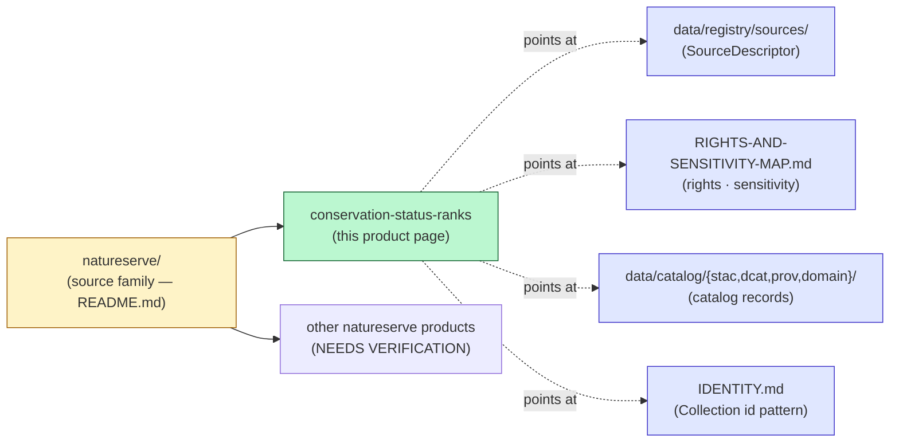

<!-- [KFM_META_BLOCK_V2]
doc_id: kfm://doc/docs-sources-catalog-natureserve-conservation-status-ranks
title: NatureServe Conservation Status Ranks
type: product-page
version: v0.1
status: draft
owners: [PLACEHOLDER — Docs steward + Source steward for natureserve; CODEOWNERS NEEDS VERIFICATION]
created: 2026-05-20
updated: 2026-05-22
policy_label: public
related:
  - docs/sources/catalog/natureserve/README.md
  - docs/sources/catalog/README.md
  - docs/sources/catalog/IDENTITY.md
  - docs/sources/catalog/RIGHTS-AND-SENSITIVITY-MAP.md
  - docs/doctrine/directory-rules.md
  - docs/doctrine/trust-membrane.md
  - docs/standards/SENSITIVITY_RUBRIC.md
  - data/registry/sources/
  - schemas/contracts/v1/source/
  - policy/sensitivity/
  - policy/rights/
tags: [kfm, docs, sources, catalog, natureserve, product-page, stac, dcat, prov, conservation-status]
notes:
  - "PROPOSED product-page scaffold for the NatureServe Conservation Status Ranks data product. Sibling-link presence was verified in a Claude Code session but remains NEEDS VERIFICATION against the mounted repo."
  - "policy_label: public describes THIS PAGE only. The underlying NatureServe product is restricted-by-default (see RIGHTS-AND-SENSITIVITY-MAP.md and the family README at ./README.md). The page is public because it documents catalog shape, identity, and provenance fields — it does NOT restate restricted product data."
  - "Path uses the natureserve/ subfolder under docs/sources/catalog/ (sibling files: README.md, products, _examples/). Sub-segment convention NEEDS VERIFICATION against an ADR (Directory Rules §6.1 does not yet pin docs/sources/catalog/<source>/ subfolder structure)."
  - "All repo-state claims herein remain PROPOSED until verified against mounted-repo evidence."
[/KFM_META_BLOCK_V2] -->

# 🌿 NatureServe Conservation Status Ranks

> Product-page scaffold for the **NatureServe Conservation Status Ranks** data product — global (G-rank) and subnational (S-rank) rankings that drive KFM's C6 sensitivity rubric.

<!-- Badge row — Shields.io placeholders; replace targets once owners, CI, and policies land -->


| Field | Value |
|---|---|
| **Status** | PROPOSED — scaffold only |
| **Family** | [`natureserve`](./README.md) |
| **Owners** | `PLACEHOLDER` — Docs steward + Source steward for `natureserve` (CODEOWNERS NEEDS VERIFICATION) |
| **Last reviewed** | 2026-05-22 |
| **This page** | Public — documents catalog shape, identity, and provenance fields |
| **Underlying product** | **Restricted-by-default** — see [`../RIGHTS-AND-SENSITIVITY-MAP.md`](../RIGHTS-AND-SENSITIVITY-MAP.md) and family README |

---

## What this page is — and is not

> [!IMPORTANT]
> This is a **product-page scaffold**, not a source-profile or a policy document. It documents the catalog presence of one data product within the `natureserve` source family. It deliberately does **not** restate fields that live elsewhere.

| This page does | This page does NOT |
|---|---|
| Name the data product and its scope at a high level | Restate `SourceDescriptor` fields — those live under [`data/registry/sources/`](../../../../data/registry/sources/) |
| Point at the catalog profiles used (STAC / DCAT / PROV / domain projection) | Restate rights or sensitivity policy — those live under [`../RIGHTS-AND-SENSITIVITY-MAP.md`](../RIGHTS-AND-SENSITIVITY-MAP.md) and [`policy/sensitivity/`](../../../../policy/sensitivity/) |
| Document the `kfm:provenance` field set the product uses (CONFIRMED doctrine, Pass-10 §C4-01) | Assert lifecycle placement, runtime routes, or implementation status — those are governed by the source profile and ADR work |
| Track open questions specific to this product | Decide ADR-class questions — those need an ADR, not a product page |

[↑ back to top](#-natureserve-conservation-status-ranks)

---

## Overview

PROPOSED scaffold. The **Conservation Status Ranks** product publishes NatureServe G-rank and S-rank values for species and ecological communities; in KFM these rankings are *sensitivity drivers* (Pass-10 §C10-06, CONFIRMED) more than they are an end-user dataset. The page exists so downstream catalog consumers can find the product's STAC / DCAT / PROV surface without having to read the full source profile.

**NEEDS VERIFICATION** for this product, against the family `SourceDescriptor`: scope, cadence, geographic coverage, current endpoint URL, rights status, and license terms.

> [!CAUTION]
> The product is **restricted-by-default** per the family rights posture (CONFIRMED corpus tension, KFM-P2-PROG-0002; PROPOSED admission posture, KFM-P25-PROG-0023). No connector activation, no admission past `RAW`, and no derivative publication should proceed until a rights review concludes — see the family [`README.md`](./README.md).

[↑ back to top](#-natureserve-conservation-status-ranks)

---

## Where this product sits



> **Diagram status:** PROPOSED. Sibling presence (`./README.md`, `../IDENTITY.md`, `../RIGHTS-AND-SENSITIVITY-MAP.md`, `../_examples/`) was verified in a Claude Code session but remains NEEDS VERIFICATION in the mounted repo.

[↑ back to top](#-natureserve-conservation-status-ranks)

---

## Source authority

See [`data/registry/sources/`](../../../../data/registry/sources/) for the authoritative `SourceDescriptor` (canonical schema home: `schemas/contracts/v1/source/source_descriptor.schema.json` per Directory Rules §7.4 + ADR-0001). **Do not duplicate descriptor fields here.** If a field appears both here and in the descriptor and they disagree, the descriptor wins.

[↑ back to top](#-natureserve-conservation-status-ranks)

---

## Catalog profiles used

| Profile | Lane | Used by this product? | Doctrine |
|---|---|---|---|
| STAC | [`data/catalog/stac/`](../../../../data/catalog/stac/) | PROPOSED — Yes / No (NEEDS VERIFICATION) | Pass-10 §C4-01 (CONFIRMED) |
| DCAT | [`data/catalog/dcat/`](../../../../data/catalog/dcat/) | PROPOSED — Yes / No (NEEDS VERIFICATION) | Pass-10 §C4-05 (CONFIRMED) |
| PROV-O | [`data/catalog/prov/`](../../../../data/catalog/prov/) | PROPOSED — Yes / No (NEEDS VERIFICATION) | Pass-10 §C8-03 (CONFIRMED) |
| Domain projection | `data/catalog/domain/<domain>/` | PROPOSED — Yes / No (NEEDS VERIFICATION) | Per-domain projection (PROPOSED) |

> [!NOTE]
> Conservation Status Ranks attach to **taxa**, not to spatiotemporal observations. Whether the product warrants its own STAC Collection (versus living as a DCAT-only dataset because its "spatial extent" is implicit through the taxa it ranks) is an **open question** for this product — see [§ Open questions](#open-questions).

[↑ back to top](#-natureserve-conservation-status-ranks)

---

## Collection identity

- PROPOSED Collection id pattern: `kfm-<org>-<product>` — see [`../IDENTITY.md`](../IDENTITY.md).
- PROPOSED namespace: `kfm:` *(see [Pass-10 §C4-01 open question — `kfm:` vs `ks-kfm:`](#open-questions); also flagged locally as **OPEN-DSC-03**, NEEDS VERIFICATION against the project's open-issue naming convention)*.
- Asset roles: NEEDS VERIFICATION — confirm against [`schemas/contracts/v1/source/`](../../../../schemas/contracts/v1/source/) and any product-level asset-role enum.

[↑ back to top](#-natureserve-conservation-status-ranks)

---

## Provenance fields

**CONFIRMED doctrine** (Pass-10 §C4-01) — STAC Items carry an `item.properties.kfm:provenance` block. The fields below are the doctrinally required set; the *product's adoption of them* is PROPOSED until catalog records are verified.

- `spec_hash` — sha256 of the canonical record (RFC 8785 JCS canonicalization; CONFIRMED, Pass-10 §C1-02).
- `evidence_bundle_ref` — `kfm://evidence/<digest>` resolver target.
- `run_record_ref` — `kfm://run/<run-id>` resolver target.
- `audit_ref` — `kfm://audit/<attestation-id>` resolver target.
- `policy_digest` — sha256 of the policy bundle applied at promotion.

Per-asset integrity: `file:checksum` on every asset entry (CONFIRMED, Pass-10 §C4-01).

> [!TIP]
> The STAC attestation hook (KFM-P7-PROG-0001, PROPOSED) recommends a `rel: attestation` link from the STAC Item to its `EvidenceBundle`. If this product adopts catalog publication, the attestation hook SHOULD travel with each Item.

[↑ back to top](#-natureserve-conservation-status-ranks)

---

## Temporal handling

PROPOSED — keep distinct: **source time** / **observed time** / **valid time** / **retrieval time** / **release time** / **correction time** where material (CONFIRMED doctrine pattern across Atlas Fauna §7-E, Flora §8-E). NEEDS VERIFICATION for this specific product.

> NatureServe rankings revise on heritage-program review cycles (irregular). They are *not* observation timestamps and MUST NOT be treated as freshness indicators for occurrences (CONFIRMED, family source profile).

[↑ back to top](#-natureserve-conservation-status-ranks)

---

## Geometry and projection

PROPOSED — Conservation Status Ranks are *taxon-anchored*, not feature-anchored; geometry is typically inherited from the ranked taxon's range or community polygon rather than carried by the ranking record itself. Confirm CRS, generalization rules, and scale support against `data/catalog/` artifacts. NEEDS VERIFICATION.

> [!NOTE]
> STAC Projection fields (`proj:code`, `proj:bbox`, `proj:geometry`, `proj:shape`, `proj:transform`) MAY apply if rankings are paired with a range or community geometry asset. Where they apply, the **STAC Projection lint** (KFM-P27-FEAT-0003, PROPOSED) and the **STAC Projection front-matter gate** (KFM-P27-IDEA-0009 / KFM-P27-PROG-0011, PROPOSED) cover them.

[↑ back to top](#-natureserve-conservation-status-ranks)

---

## Rights and sensitivity

NEEDS VERIFICATION — see [`policy/sensitivity/`](../../../../policy/sensitivity/) and [`../RIGHTS-AND-SENSITIVITY-MAP.md`](../RIGHTS-AND-SENSITIVITY-MAP.md). **Do not restate policy here.**

| Concern | Where it lives |
|---|---|
| License + SPDX + license-map mapping | `policy/rights/` + `license_map.json` (PROPOSED, KFM-P26-PROG-0021) |
| Sensitive-taxa list driven by S1/S2 ranks | `policy/sensitivity/` + `sensitive_taxa_*.txt` (PROPOSED, KFM-P26-PROG-0022) |
| Per-rank → sensitivity_rank → redaction-profile mapping | [`docs/standards/SENSITIVITY_RUBRIC.md`](../../../../docs/standards/SENSITIVITY_RUBRIC.md) *(PROPOSED, not yet authored — Directory Rules §18 OPEN-DR-05)* |
| Deny-by-default posture for sensitive taxa | Family source profile + KFM-P24-IDEA-0002, KFM-P24-PROG-0013 (PROPOSED) |

[↑ back to top](#-natureserve-conservation-status-ranks)

---

## Validation and catalog closure

- **Catalog closure required before public release** (PROPOSED, KFM-P1-IDEA-0020). Closure links evidence, source role, policy, proof, release state, and rollback target; it SHOULD fail if any of those is missing.
- **STAC Projection lint** (PROPOSED, KFM-P27-FEAT-0003) — lint `proj:code`, `proj:bbox`, `proj:geometry`, `proj:shape`, `proj:transform`.
- **STAC checksum closure against the `ReleaseManifest` digest** (PROPOSED, KFM-P22-PROG-0037) — validate STAC item identifiers and asset checksums.
- **Catalog QA result surface** (PROPOSED, KFM-P27-FEAT-0004) — surface missing license, providers, `stac_extensions`, broken links, JSON errors, and warning/fail outcomes.
- **Catalog closure writers** (PROPOSED, KFM-P26-PROG-0025) — emit DCAT, STAC, and PROV entries with dataset DOI, harvest date, dataset version, license, `rightsHolder`, `datasetID`, and `EvidenceBundle` references.
- **SPDX license guard** (PROPOSED, KFM-P10-PROG-0014) — PRs fail when STAC/DCAT license fields lack valid SPDX identifiers or accepted license IRIs.

[↑ back to top](#-natureserve-conservation-status-ranks)

---

## Related contracts and schemas

- [`contracts/`](../../../../contracts/) — semantic contract for `ConservationStatus` and related object families (NEEDS VERIFICATION).
- [`schemas/contracts/v1/source/`](../../../../schemas/contracts/v1/source/) — per Directory Rules §7.4 + ADR-0001.
- `schemas/contracts/v1/fauna/` and `schemas/contracts/v1/flora/` — where rank values may surface in domain schemas (PROPOSED placement; NEEDS VERIFICATION).

[↑ back to top](#-natureserve-conservation-status-ranks)

---

## Related connectors and pipelines

- [`connectors/natureserve/`](../../../../connectors/natureserve/) — source-specific fetch and admission logic.
- [`pipelines/ingest/`](../../../../pipelines/ingest/), [`pipelines/normalize/`](../../../../pipelines/normalize/), [`pipelines/validate/`](../../../../pipelines/validate/), [`pipelines/catalog/`](../../../../pipelines/catalog/) — lifecycle stages.
- `pipeline_specs/<domain>/` — declarative specs per domain (PROPOSED; NEEDS VERIFICATION which domain owns this product's spec).

> [!IMPORTANT]
> **Watcher-as-non-publisher** (CONFIRMED, Directory Rules §13.5): A NatureServe watcher MUST emit `RunReceipt` and candidate decisions only — never write directly to `data/catalog/` or `data/published/`.

[↑ back to top](#-natureserve-conservation-status-ranks)

---

## Examples

*(Illustrative only — do not treat as authoritative. Sample shape from Pass-10 §C4-01 doctrine; product-specific fields are PROPOSED.)*

See [`../_examples/stac-item-example.json`](../_examples/stac-item-example.json) for the minimal STAC + `kfm:provenance` shape.

<details>
<summary><strong>Sketch of the expected <code>kfm:provenance</code> block (illustrative)</strong></summary>

```json
{
  "type": "Feature",
  "stac_version": "1.0.0",
  "id": "kfm-natureserve-conservation-status-<rank-id>",
  "properties": {
    "datetime": "<release-time>",
    "kfm:provenance": {
      "spec_hash": "sha256:<jcs-canonical>",
      "evidence_bundle_ref": "kfm://evidence/<digest>",
      "run_record_ref": "kfm://run/<run-id>",
      "audit_ref": "kfm://audit/<attestation-id>",
      "policy_digest": "sha256:<policy-bundle-digest>"
    }
  },
  "links": [
    { "rel": "attestation", "href": "<bundle-url>", "type": "application/ld+json" }
  ],
  "assets": {
    "<asset-key>": {
      "href": "<asset-url>",
      "file:checksum": "1220<sha256-bytes>"
    }
  }
}
```

This sketch is PROPOSED and illustrative. Fields, identifiers, and link relations all NEED VERIFICATION against the canonical example under [`../_examples/`](../_examples/) and against current STAC extension behavior.

</details>

[↑ back to top](#-natureserve-conservation-status-ranks)

---

## Open questions

- **OPEN — cadence and endpoint.** Confirm cadence and current endpoint URL for this product. (NEEDS VERIFICATION.)
- **OPEN — rights and CARE.** Confirm rights status, license terms, attribution wording, and CARE applicability. Goes to the family rights review. (NEEDS VERIFICATION; KFM-P2-PROG-0002.)
- **OPEN — Collection scope.** Confirm whether this product warrants its own STAC Collection or shares one with sibling `natureserve` products. (NEEDS VERIFICATION.)
- **OPEN — STAC vs DCAT canonical placement.** Rankings are taxon-anchored, not spatiotemporal in the standard STAC sense. Pass-10 §C4-05 notes that DCAT/STAC overlap is unresolved for non-spatiotemporal datasets. (NEEDS VERIFICATION.)
- **OPEN — namespace choice.** `kfm:` (KFM-global) vs `ks-kfm:` (Kansas-scoped). Pass-10 §C4-01 records this as an open question. The local reference **OPEN-DSC-03** is itself NEEDS VERIFICATION against the project's open-issue naming convention (not located in the indexed corpus).
- **OPEN — sub-segment ADR.** Whether `docs/sources/catalog/<source>/` is the canonical subfolder structure for source-family product pages. Directory Rules §6.1 does not yet pin this. (NEEDS VERIFICATION; ADR-class.)

[↑ back to top](#-natureserve-conservation-status-ranks)

---

## Last reviewed

2026-05-22 — scaffold revision; corpus cross-references tightened; truth labels on Pass-10 references sharpened (doctrine CONFIRMED; product-level application PROPOSED).

---

<!-- Footer -->

**Related docs:** [`./README.md`](./README.md) *(family)* · [`../README.md`](../README.md) *(catalog)* · [`../IDENTITY.md`](../IDENTITY.md) · [`../RIGHTS-AND-SENSITIVITY-MAP.md`](../RIGHTS-AND-SENSITIVITY-MAP.md) · [`../../../doctrine/directory-rules.md`](../../../doctrine/directory-rules.md)

**Last updated:** 2026-05-22 · **Status:** draft scaffold · **Page policy:** public · **Underlying product policy:** restricted · **Doc id:** `kfm://doc/docs-sources-catalog-natureserve-conservation-status-ranks`

[↑ back to top](#-natureserve-conservation-status-ranks)
