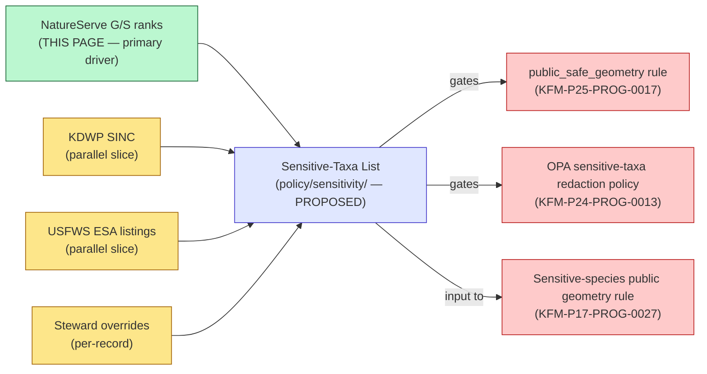

<!-- [KFM_META_BLOCK_V2]
doc_id: kfm://doc/docs-sources-catalog-natureserve-sensitive-taxa-list
title: NatureServe-Driven Sensitive-Taxa List
type: product-page
version: v0.1
status: draft
owners: [PLACEHOLDER — Docs steward + Sensitivity steward + Source steward for natureserve; CODEOWNERS NEEDS VERIFICATION]
created: 2026-05-20
updated: 2026-05-22
policy_label: public
related:
  - docs/sources/catalog/natureserve/README.md
  - docs/sources/catalog/natureserve/conservation-status-ranks.md
  - docs/sources/catalog/README.md
  - docs/sources/catalog/IDENTITY.md
  - docs/sources/catalog/RIGHTS-AND-SENSITIVITY-MAP.md
  - docs/doctrine/directory-rules.md
  - docs/doctrine/trust-membrane.md
  - docs/standards/SENSITIVITY_RUBRIC.md
  - policy/sensitivity/
  - policy/rights/
  - data/registry/sources/
  - schemas/contracts/v1/source/
tags: [kfm, docs, sources, catalog, natureserve, product-page, sensitive-taxa, policy-bundle, sensitivity-driver]
notes:
  - "PROPOSED product-page scaffold for the NatureServe-driven slice of the KFM Sensitive-Taxa List. Sibling-link presence verified in a Claude Code session; mounted-repo presence NEEDS VERIFICATION."
  - "KEY DIFFERENCE FROM SIBLING PRODUCT (conservation-status-ranks): This list is a KFM-authored DERIVATIVE policy artifact (CONFIRMED corpus category — KFM-P26-PROG-0022 is in POL: Policy-as-Code, Sensitivity, Rights, Sovereignty), not a NatureServe-published dataset. Its canonical home is policy/sensitivity/, not data/catalog/. The STAC/DCAT/PROV catalog section below is therefore mostly inapplicable or describes a thin policy-bundle distribution surface only."
  - "policy_label: public describes THIS PAGE only. The list itself MAY contain entries that are themselves sensitive (e.g., sacred/critical taxa at sensitivity_rank 5 may have list-membership obscured per fail-closed posture); list-level publication discipline NEEDS VERIFICATION."
  - "The list has multiple drivers — NatureServe (primary), KDWP SINC (Kansas-specific), USFWS ESA listings (federal). This page documents the NatureServe-driven slice. Whether the canonical list lives at one path with multiple input-source-keyed views, or as a single merged artifact assembled from many drivers, is ADR-class and NEEDS VERIFICATION."
  - "All repo-state claims herein remain PROPOSED until verified against mounted-repo evidence."
[/KFM_META_BLOCK_V2] -->

# 🌿 NatureServe-Driven Sensitive-Taxa List

> Product-page scaffold for the **NatureServe-driven slice** of the KFM Sensitive-Taxa List — a policy-bundle artifact that gates exact-geometry biodiversity outputs.

<!-- Badge row — Shields.io placeholders; replace targets once owners, CI, and policies land -->


| Field | Value |
|---|---|
| **Status** | PROPOSED — scaffold only |
| **Artifact class** | **Policy-bundle artifact** (CONFIRMED corpus category, KFM-P26-PROG-0022 in POL) |
| **Canonical home** | [`policy/sensitivity/`](../../../../policy/sensitivity/) — *not* `data/catalog/` |
| **Family slice** | NatureServe-driven (primary driver); parallel slices: **KDWP SINC**, **USFWS ESA listings** |
| **Owners** | `PLACEHOLDER` — Docs steward + Sensitivity steward + Source steward for `natureserve` (CODEOWNERS NEEDS VERIFICATION) |
| **Last reviewed** | 2026-05-22 |

---

## What this page is — and is not

> [!IMPORTANT]
> This page documents the **NatureServe-driven slice** of a KFM-authored derivative policy artifact. It is **not** a NatureServe data product like the sibling [`conservation-status-ranks`](./conservation-status-ranks.md) page. The two products share a parent source family but have different lifecycle homes.

| This page does | This page does NOT |
|---|---|
| Document how NatureServe G-rank / S-rank values drive entries in the KFM Sensitive-Taxa List | Restate the full SINC or USFWS contribution — those belong on their own family slices |
| Point at the policy-bundle home ([`policy/sensitivity/`](../../../../policy/sensitivity/)) and the enforcement contract | Restate `SourceDescriptor` fields for NatureServe — those live under [`data/registry/sources/`](../../../../data/registry/sources/) |
| Identify the validators and gates that consume the list | Restate the C6 sensitivity rubric — that lives in [`docs/standards/SENSITIVITY_RUBRIC.md`](../../../../docs/standards/SENSITIVITY_RUBRIC.md) *(PROPOSED, not yet authored)* |
| Track open questions specific to the NatureServe contribution | Decide ADR-class questions (e.g., whether the list is one merged artifact or multiple input-keyed views) |

[↑ back to top](#-natureserve-driven-sensitive-taxa-list)

---

## Overview

PROPOSED scaffold. The **Sensitive-Taxa List** is a KFM-authored policy artifact (CONFIRMED corpus category POL, KFM-P26-PROG-0022) that *gates exact-geometry outputs*, *requires `public_safe_geometry`* on records for listed taxa, and *records redaction/generalization reasons* on the resulting public-safe derivatives. This page documents the **NatureServe-driven contribution** to that list.

> [!NOTE]
> **CONFIRMED doctrine (Pass 10 §C10-06):** *"the KFM convention is … to apply C6 redaction for any species that NatureServe or KDWP SINC ranks at S1/S2 sensitivity."* This list is the operational realization of that doctrine for the NatureServe input.

> [!CAUTION]
> The list **may itself be sensitive in part.** Sacred/critical taxa at `sensitivity_rank 5` (CONFIRMED, Pass 10 §C6-01) are fail-closed for map and timeline exposure. Whether list *membership* for rank-5 taxa is public is an open question — see [§ Open questions](#open-questions).

[↑ back to top](#-natureserve-driven-sensitive-taxa-list)

---

## Where this product sits



> **Diagram status:** PROPOSED. The drivers, the policy-bundle home, and the downstream gates are all consistent with CONFIRMED Pass-10 doctrine and the PROPOSED cards cited. Concrete file paths and validator names are not asserted.

[↑ back to top](#-natureserve-driven-sensitive-taxa-list)

---

## Source authority (this slice)

See [`data/registry/sources/`](../../../../data/registry/sources/) for the authoritative NatureServe `SourceDescriptor` (canonical schema home: `schemas/contracts/v1/source/source_descriptor.schema.json` per Directory Rules §7.4 + ADR-0001). **Do not duplicate descriptor fields here.**

This page documents only the NatureServe-driven entries in the list. Parallel slices (KDWP SINC, USFWS) have their own descriptors and their own product pages (PROPOSED; NEEDS VERIFICATION).

[↑ back to top](#-natureserve-driven-sensitive-taxa-list)

---

## Inputs (NatureServe slice)

| Input | Role | Truth label |
|---|---|---|
| NatureServe **G-rank** (global) | Adds taxon to list when `G1` or `G2` (PROPOSED threshold; mapping CONFIRMED at S1/S2 only by §C6-01) | PROPOSED |
| NatureServe **S-rank** (subnational, Kansas-relevant) | Adds taxon when `S1` (critically imperiled) or `S2` (imperiled) — CONFIRMED doctrine (Pass 10 §C10-06) | CONFIRMED rank trigger; PROPOSED implementation |
| NatureServe **community ranks** | Adds ecological community when imperiled (PROPOSED — community-level handling NEEDS VERIFICATION against KFM Habitat domain) | PROPOSED |
| `SH` / `SX` (historical / extirpated) | Steward review for residual exposure | NEEDS VERIFICATION |
| `SU` / `SNR` (unranked / unrankable) | Default to conservative upper bound | PROPOSED |

> [!IMPORTANT]
> **Authority anchoring (CONFIRMED, Pass 10 §C10-06):** Every entry MUST anchor to an **ITIS TSN** (or **GBIF Backbone** where ITIS is silent). A rank without a stable taxon anchor is not actionable and MUST NOT be added to the list.

[↑ back to top](#-natureserve-driven-sensitive-taxa-list)

---

## List shape and format

PROPOSED list shape per KFM-P26-PROG-0022 (`sensitive_taxa_sample.txt`):

- **Format:** plain-text or structured file (corpus card name uses `.txt`; production format NEEDS VERIFICATION — JSON / YAML / CSV are plausible alternatives).
- **Per-entry fields (PROPOSED):**
  - `taxon_anchor` — ITIS TSN or GBIF Backbone key (required).
  - `taxon_label` — accepted scientific name at list-publish time (advisory).
  - `driver` — `natureserve` | `kdwp_sinc` | `usfws_esa` | `steward_override`.
  - `driver_rank` — e.g., `S1`, `S2`, `G2`, `SINC`, `LE` (depending on driver).
  - `sensitivity_rank` — KFM `sensitivity_rank` value 0–5 (CONFIRMED rubric, §C6-01).
  - `required_redaction_profile` — named profile id, e.g., `profile:sinc-obscure-10km` (CONFIRMED profile registry, §C6-02).
  - `evidence_ref` — `EvidenceRef` to the driving `SourceDescriptor` snapshot.
  - `effective_date` — date the entry became effective.
  - `correction_lineage` — pointer to prior entry where rank changed.

> [!NOTE]
> The corpus does not pin the canonical file format. The `.txt` extension in KFM-P26-PROG-0022 likely reflects the *sample* nature of the card; the production list will probably be machine-readable JSON or YAML under the policy bundle. Confirm in ADR.

[↑ back to top](#-natureserve-driven-sensitive-taxa-list)

---

## Catalog profiles used

> [!WARNING]
> **This product is a policy-bundle artifact, not a catalog data product.** The STAC/DCAT/PROV/domain-projection profiles table is largely **N/A**. The list MAY appear as a DCAT distribution of the policy bundle for discoverability — but it is not natively spatiotemporal and SHOULD NOT have a STAC Item shape.

| Profile | Lane | Used by this product? | Notes |
|---|---|---|---|
| STAC | [`data/catalog/stac/`](../../../../data/catalog/stac/) | **PROPOSED — likely No** (list is taxon-anchored, not spatiotemporal) | Pass-10 §C4-01 CONFIRMED for spatiotemporal datasets; not the right home for a policy list |
| DCAT | [`data/catalog/dcat/`](../../../../data/catalog/dcat/) | **PROPOSED — possibly Yes** as a DCAT Distribution of the policy bundle (Pass-10 §C4-05, CONFIRMED for non-spatial catalog records) | NEEDS VERIFICATION |
| PROV-O | [`data/catalog/prov/`](../../../../data/catalog/prov/) | **PROPOSED — Yes** for the derivation chain (NatureServe rank → list entry → enforcement) (Pass-10 §C8-03 CONFIRMED for provenance) | NEEDS VERIFICATION |
| Domain projection | `data/catalog/domain/<domain>/` | **PROPOSED — No** (cross-domain artifact; not owned by a single domain) | NEEDS VERIFICATION |

> [!IMPORTANT]
> **Canonical home is the policy bundle**, not the data catalog. The list is *referenced from* sensitivity policies and *consumed by* OPA rules / validators / pipelines. Treating it as a catalog dataset risks placing enforcement input in the wrong root.

[↑ back to top](#-natureserve-driven-sensitive-taxa-list)

---

## Collection identity *(thin)*

This section is intentionally thin because the list is a policy artifact, not a STAC Collection.

- PROPOSED policy-bundle id pattern: see [`../IDENTITY.md`](../IDENTITY.md) and any policy-bundle naming convention in [`policy/sensitivity/`](../../../../policy/sensitivity/) (NEEDS VERIFICATION).
- PROPOSED namespace: `kfm:` — *(see [Pass-10 §C4-01 open question — `kfm:` vs `ks-kfm:`](#open-questions); also flagged locally as **OPEN-DSC-03**, NEEDS VERIFICATION against the project's open-issue naming convention)*.
- Asset roles: **N/A** — the list does not have STAC asset roles.

[↑ back to top](#-natureserve-driven-sensitive-taxa-list)

---

## Provenance fields

**CONFIRMED doctrine** (Pass-10 §C4-01 for STAC; the same provenance fields apply by extension to DCAT distributions of the policy bundle): every list publication carries a `kfm:provenance` block:

- `spec_hash` — sha256 of the canonical list (RFC 8785 JCS canonicalization; CONFIRMED, Pass-10 §C1-02).
- `evidence_bundle_ref` — `kfm://evidence/<digest>` resolver target enumerating each entry's driving rank evidence.
- `run_record_ref` — `kfm://run/<run-id>` resolver target for the list-build run.
- `audit_ref` — `kfm://audit/<attestation-id>` resolver target.
- `policy_digest` — sha256 of the policy bundle at list-publish time.

Per-entry integrity: each entry SHOULD carry an `EvidenceRef` to the originating NatureServe `SourceDescriptor` snapshot.

> [!TIP]
> Because the list is enforcement input, **STAC attestation hook** (KFM-P7-PROG-0001, PROPOSED — `rel: attestation`) is especially valuable: any downstream consumer that fetches the list can resolve back to the `EvidenceBundle` that justifies each entry.

[↑ back to top](#-natureserve-driven-sensitive-taxa-list)

---

## Temporal handling

PROPOSED — keep distinct, where material: **source time** (when NatureServe published the rank) / **observed time** (N/A — rankings are not observations) / **valid time** (period the entry is in effect) / **retrieval time** (when KFM ingested the rank) / **release time** (when this version of the list was published) / **correction time** (when an entry was changed).

> [!IMPORTANT]
> **Rank changes propagate as governance events, not file edits** (CONFIRMED doctrine via Pass 10 §C5-09 tombstones, §C6-08 revocation, and the family source profile). A rank *upgrade* (toward greater concern) MAY require immediate `embargo` and rollback of previously released exact-geometry derivatives keyed to the affected taxon. A rank *downgrade* does **not** automatically reduce obligations on already-released derivatives — released derivatives are governed by the rank in effect at release time.

[↑ back to top](#-natureserve-driven-sensitive-taxa-list)

---

## Geometry and projection

**N/A** — the list itself carries no geometry; it is taxon-anchored.

> Downstream gates *consume* the list and *emit* generalized geometry on records keyed to listed taxa (PROPOSED — KFM-P17-PROG-0027 Sensitive species public geometry rule; KFM-P25-PROG-0017 fauna occurrence geoprivacy conditional schema). Generalized geometry is governed by named redaction profiles (CONFIRMED, Pass 10 §C6-02: `point_10km_hex_seeded_v1`, `point_3km_jitter_v1`, `centroid_1km_v1`, `kfm:redact:none`).

[↑ back to top](#-natureserve-driven-sensitive-taxa-list)

---

## Rights and sensitivity

NEEDS VERIFICATION — see [`policy/sensitivity/`](../../../../policy/sensitivity/) and [`../RIGHTS-AND-SENSITIVITY-MAP.md`](../RIGHTS-AND-SENSITIVITY-MAP.md). **Do not restate policy here.**

| Concern | Where it lives |
|---|---|
| Whether list **membership** for `sensitivity_rank 5` taxa is itself published | [`../RIGHTS-AND-SENSITIVITY-MAP.md`](../RIGHTS-AND-SENSITIVITY-MAP.md) (NEEDS VERIFICATION); fail-closed posture (CONFIRMED §C6-01) suggests possible obscuring |
| NatureServe attribution wording on the list | [`policy/rights/`](../../../../policy/rights/) + `license_map.json` (PROPOSED, KFM-P26-PROG-0021) |
| Per-rank → sensitivity_rank → redaction-profile mapping | [`docs/standards/SENSITIVITY_RUBRIC.md`](../../../../docs/standards/SENSITIVITY_RUBRIC.md) *(PROPOSED, not yet authored — Directory Rules §18 OPEN-DR-05)* |
| Deny-by-default posture for sensitive taxa | Family source profile + KFM-P24-IDEA-0002, KFM-P24-PROG-0013 (PROPOSED) |
| eBird-specific protected-taxa policy intersection | KFM-P27-PROG-0006 (PROPOSED) |

> [!CAUTION]
> NatureServe products are **restricted by default** per family rights posture (CONFIRMED corpus tension, KFM-P2-PROG-0002). Whether the *derived list* (KFM-authored, derivative effect of NatureServe rankings) inherits the same restriction or qualifies as a publishable public-safe derivative is a rights-review question and NEEDS VERIFICATION.

[↑ back to top](#-natureserve-driven-sensitive-taxa-list)

---

## Validation and enforcement

The list is **enforcement input**, not just discovery data. The relevant gates and validators (all PROPOSED unless otherwise noted):

- **Sensitive-taxa list contract** (PROPOSED, KFM-P26-PROG-0022) — list MUST gate exact-geometry outputs, require `public_safe_geometry`, and record redaction/generalization reasons.
- **Fauna occurrence geoprivacy conditional schema** (PROPOSED, KFM-P25-PROG-0017) — fauna occurrence schema MUST require `public_safe_geometry` when `geoprivacy_status` is `obscured`, `private`, or `generalized`.
- **OPA sensitive-taxa redaction policy** (PROPOSED, KFM-P24-PROG-0013) — OPA returns `ABSTAIN` or `DENY` for sensitive fauna unless spatial generalization, aggregation, or access gating obligations are satisfied.
- **Sensitive species public geometry rule** (PROPOSED, KFM-P17-PROG-0027) — outputs store generalized public geometry, generalized radius, restrictive rights labels, and pass OPA public-export checks.
- **Sensitive species deny-by-default** (PROPOSED, KFM-P24-IDEA-0002) — fauna occurrence records for sensitive taxa default to `DENY` or `ABSTAIN` until redaction, aggregation, or role-gated access is explicitly approved.
- **NatureServe rare data access gate** (PROPOSED, KFM-P25-PROG-0023) — NatureServe rare-species data SHOULD require access controls, redaction, license checks, and public-safe derivative rules.
- **Catalog closure** (PROPOSED, KFM-P1-IDEA-0020) — if the list is exposed via a DCAT distribution, catalog closure (linking evidence, source role, policy, proof, release state, rollback target) applies before public release.

> [!IMPORTANT]
> **Watcher-as-non-publisher** (CONFIRMED, Directory Rules §13.5): A NatureServe watcher emits `SourceIntakeRecord` and `DriftSummary` only — it never writes to the policy bundle. List updates flow through a governed `PromotionDecision`, not a file move.

[↑ back to top](#-natureserve-driven-sensitive-taxa-list)

---

## Related contracts and schemas

- [`contracts/`](../../../../contracts/) — semantic contract for the Sensitive-Taxa List (NEEDS VERIFICATION; likely under `contracts/governance/` or `contracts/policy/`).
- [`schemas/contracts/v1/source/`](../../../../schemas/contracts/v1/source/) — `SourceDescriptor` schema per Directory Rules §7.4 + ADR-0001.
- `schemas/contracts/v1/policy/sensitive_taxa.schema.json` — list-shape schema (PROPOSED placement; NEEDS VERIFICATION).
- `schemas/contracts/v1/fauna/` and `schemas/contracts/v1/flora/` — conditional `public_safe_geometry` requirement schemas (KFM-P25-PROG-0017, PROPOSED).

[↑ back to top](#-natureserve-driven-sensitive-taxa-list)

---

## Related connectors and pipelines

- [`connectors/natureserve/`](../../../../connectors/natureserve/) — source-specific fetch and admission logic.
- [`pipelines/ingest/`](../../../../pipelines/ingest/) → [`pipelines/normalize/`](../../../../pipelines/normalize/) → [`pipelines/validate/`](../../../../pipelines/validate/) → list-build pipeline (PROPOSED; specific stage NEEDS VERIFICATION — list build may sit closer to `pipelines/catalog/` or `pipelines/publish/` depending on policy-bundle vs catalog-bundle treatment).
- `pipeline_specs/policy/` *(PROPOSED, NEEDS VERIFICATION)* — declarative spec for the list-build pipeline.

> [!NOTE]
> The list-build pipeline's correct lane (under `pipelines/`) is itself an open question. The list is policy output, not data output; this may warrant a `pipelines/policy/` lane that does not yet exist (NEEDS VERIFICATION).

[↑ back to top](#-natureserve-driven-sensitive-taxa-list)

---

## Examples

*(Illustrative only — do not treat as authoritative.)*

See [`../_examples/`](../_examples/) for any minimal example shapes (NEEDS VERIFICATION that a sensitive-taxa-list example exists).

<details>
<summary><strong>Sketch of one list entry (illustrative)</strong></summary>

```yaml
# illustrative — shape PROPOSED, not authoritative
- taxon_anchor: "ITIS-TSN:174356"           # example only
  taxon_label: "Notropis topeka"            # example only
  driver: "natureserve"
  driver_rank: "S1"
  sensitivity_rank: 4                       # CONFIRMED rubric, §C6-01
  required_redaction_profile: "point_10km_hex_seeded_v1"  # CONFIRMED profile registry, §C6-02
  evidence_ref: "kfm://evidence/<digest>"
  effective_date: "2026-05-22"
  correction_lineage: null
```

The sketch above is PROPOSED and illustrative. Field names, identifiers, taxon, rank, profile, and identifiers all NEED VERIFICATION. Listed taxon is **example only** and does not assert KFM has actually classified that taxon — confirm the real list against the canonical policy bundle.

</details>

[↑ back to top](#-natureserve-driven-sensitive-taxa-list)

---

## Open questions

- **OPEN — list-membership exposure for `sensitivity_rank 5` taxa.** Sacred/critical taxa fail closed for map and timeline exposure (CONFIRMED §C6-01). Whether the *list itself* exposes those taxa, or obscures their membership, is unsettled. (NEEDS VERIFICATION; high-stakes.)
- **OPEN — list assembly model.** One canonical merged list assembled from multiple drivers (NatureServe + KDWP SINC + USFWS + steward overrides), or one list per driver with merge-at-runtime? ADR-class. (NEEDS VERIFICATION.)
- **OPEN — file format.** Per KFM-P26-PROG-0022 the corpus card uses `.txt`. Production format is likely JSON or YAML; pin in ADR or policy-bundle README. (NEEDS VERIFICATION.)
- **OPEN — pipelines lane.** Whether a `pipelines/policy/` lane exists or list-build sits under `pipelines/catalog/` or `pipelines/publish/`. (NEEDS VERIFICATION.)
- **OPEN — rights inheritance.** Does the KFM-authored derivative list inherit NatureServe's restricted rights, or qualify as a publishable public-safe derivative? Goes to the family rights review. (NEEDS VERIFICATION; KFM-P2-PROG-0002.)
- **OPEN — community-rank handling.** NatureServe ranks ecological communities as well as species. How those map into the list (and into KFM Habitat domain) is unsettled. (NEEDS VERIFICATION; PROPOSED in family appendix.)
- **OPEN — namespace choice.** `kfm:` (KFM-global) vs `ks-kfm:` (Kansas-scoped). Pass-10 §C4-01 records this as an open question. Local reference **OPEN-DSC-03** is itself NEEDS VERIFICATION against the project's open-issue naming convention (not located in the indexed corpus).
- **OPEN — sub-segment ADR.** Whether `docs/sources/catalog/<source>/` is the canonical subfolder structure for source-family product pages. Directory Rules §6.1 does not yet pin this. (NEEDS VERIFICATION; ADR-class.)

[↑ back to top](#-natureserve-driven-sensitive-taxa-list)

---

## Last reviewed

2026-05-22 — scaffold revision; reshaped to reflect policy-bundle artifact class (not catalog data product); cross-references tightened against Pass-10 doctrine and Pass-32 policy-as-code cards.

---

<!-- Footer -->

**Related docs:** [`./README.md`](./README.md) *(family)* · [`./conservation-status-ranks.md`](./conservation-status-ranks.md) *(sibling product)* · [`../README.md`](../README.md) *(catalog)* · [`../IDENTITY.md`](../IDENTITY.md) · [`../RIGHTS-AND-SENSITIVITY-MAP.md`](../RIGHTS-AND-SENSITIVITY-MAP.md) · [`../../../doctrine/directory-rules.md`](../../../doctrine/directory-rules.md) · [`../../../standards/SENSITIVITY_RUBRIC.md`](../../../standards/SENSITIVITY_RUBRIC.md) *(PROPOSED, not yet authored)*

**Last updated:** 2026-05-22 · **Status:** draft scaffold · **Artifact class:** policy-bundle · **Page policy:** public · **Doc id:** `kfm://doc/docs-sources-catalog-natureserve-sensitive-taxa-list`

[↑ back to top](#-natureserve-driven-sensitive-taxa-list)
