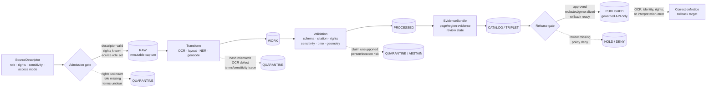

<!-- [KFM_META_BLOCK_V2]
doc_id: kfm://doc/sources-catalog-newspapers
title: Newspapers Source Catalog Profile
type: source_catalog_profile
version: v0.1
status: draft
owners: <PLACEHOLDER — Source steward · Docs steward · Catalog profile owner · Privacy reviewer>
created: 2026-06-12
updated: 2026-06-12
policy_label: public
related:
  - docs/sources/catalog/README.md
  - docs/sources/catalog/INDEX.md
  - docs/sources/catalog/PROFILES.md
  - docs/sources/catalog/CROSSWALKS.md
  - docs/sources/catalog/IDENTITY.md
  - docs/sources/catalog/GLOSSARY.md
  - docs/sources/catalog/OPEN-QUESTIONS.md
  - docs/sources/catalog/RIGHTS-AND-SENSITIVITY-MAP.md
  - docs/sources/catalog/newspapers/README.md
  - docs/sources/source-roles.md
  - docs/sources/SOURCE_DESCRIPTOR_STANDARD.md
  - docs/doctrine/directory-rules.md
  - docs/doctrine/trust-membrane.md
  - docs/doctrine/lifecycle-law.md
  - docs/doctrine/truth-posture.md
  - docs/governance/separation-of-duties.md
  - docs/standards/STAC.md
  - docs/standards/DCAT.md
  - docs/standards/PROV.md
  - schemas/contracts/v1/source/
tags: [kfm, sources, catalog, newspapers, chronicling-america, loc, ocr, archives, historical-sources, privacy, consent, focus-mode]
notes:
  - "v0.1 — Replaces flat stub at docs/sources/catalog/newspapers.md with a governed newspaper source-catalog profile."
  - "This profile describes source use. It does not authorize direct public-client reads from newspaper archives, LOC, vendor archives, local institutions, or OCR services."
  - "CONFLICTED / NEEDS VERIFICATION: repo also contains docs/sources/catalog/newspapers/README.md. This flat file follows the requested target path and sibling flat-profile pattern; reconcile flat-vs-folder authority through the catalog-lane ADR or OPEN-QUESTIONS entry."
  - "Chronicling America access and rights statements require source-refresh verification before connector activation or release."
  - "The Focus Mode consent pattern is PROPOSED. Consent can narrow private/session handling; it cannot override rights, sensitivity, evidence, release, or review gates."
] -->

# Newspapers Source Catalog Profile

Path: `docs/sources/catalog/newspapers.md`

## 1. Purpose

This document defines the Kansas Frontier Matrix (KFM) source-catalog profile for the **newspapers** source family.

Newspapers are useful to KFM for historical reporting, public notices, obituaries, advertisements, editorials, photographs, local event accounts, community memory, legal-publication traces, names, places, institutions, transportation references, hazard recollections, land notices, and frontier-era temporal context.

Within KFM, newspaper material must be treated as governed upstream documentary source material that enters the lifecycle through source descriptors, ingestion receipts, validation, rights review, sensitivity review, EvidenceBundles, catalog records, triplets, graph records, tile or UI derivatives where allowed, and released artifacts.

This profile prevents newspaper text, OCR, clipping metadata, page images, extracted entities, summaries, and map pins from becoming unreviewed truth.

> [!IMPORTANT]
> A newspaper page can support a claim about **what appeared in a publication**. It does not automatically prove that the reported event, identity, location, legal status, ownership, emergency condition, or biographical detail is true.

---

## 2. Source identity

| Field | Value |
|---|---|
| Source family | Documentary, archival, periodical, OCR, historical-text, and page-image source |
| Steward organization | Mixed: Library of Congress, state archives, university libraries, local historical societies, publishers, vendors, and private repositories |
| Common handles | Chronicling America, Kansas Digital Newspapers, Kansas Memory, local newspaper archives, university special collections, county historical society collections, commercial newspaper databases |
| KFM source profile id | `source-profile:newspapers` |
| Recommended source id prefix | `source:newspapers:` |
| Primary KFM domains | `sources`, `catalog`, `history`, `people`, `land`, `settlements`, `roads`, `rail`, `hazards`, `culture`, `archives`, `evidence` |
| Main access modes | Archive landing pages, loc.gov API, source-native search, bulk OCR datasets, IIIF manifests where available, page-image downloads, metadata exports, institutional catalogs, vendor portals |
| Public-client access posture | Public clients may use only KFM released artifacts, governed APIs, redacted drawer payloads, and policy-safe runtime envelopes. They must not read raw newspaper endpoints directly. |

---

## 3. KFM authority posture

Newspapers can be authoritative for the fact that a particular item was published in a particular newspaper, issue, page, column, edition, and date when the page-level citation and source integrity are verified.

Newspapers are not automatically authoritative for identity, title, ownership, legal rights, current address, current conditions, exact sensitive locations, emergency warnings, public-health guidance, archaeological disclosure, tribal/cultural-resource facts, or living-person claims.

### 3.1 Use newspapers as `primary` when

Use newspapers as primary evidence only for claims within newspaper authority, such as:

- A specific article, notice, advertisement, editorial, photograph, illustration, masthead, or clipping appeared in a named issue.
- A public legal notice was published in a named newspaper on a named date.
- A newspaper issue contains a named page image, OCR text, or bibliographic record.
- A historical phrase, headline, quote, or announcement appears in the cited page region.
- A newspaper’s own publication metadata supports title, issue date, edition, page, or publisher context.
- A page image supports visual evidence about layout, headline, advertisement, illustration, or photograph presence.

Primary does **not** mean publishable by default. Rights, sensitivity, OCR quality, provenance, and review gates still apply.

### 3.2 Use newspapers as `corroborating` when

Use newspapers as corroborating support when the final claim depends on stronger or different authority, including:

- Biographical claims about people.
- Place-name or settlement-history claims.
- Reports of storms, floods, fires, crimes, epidemics, road closures, bridge failures, rail events, or infrastructure failures.
- Land-sale, sheriff-sale, tax-sale, probate, or title-related claims.
- Archaeological, sacred-site, burial, tribal, or cultural-resource claims.
- Local memory claims that need cross-checking against archives, agency records, maps, deeds, court records, official notices, or steward review.
- County Focus Mode claims involving ownership, access, legal authority, current status, or precise location.

### 3.3 Use newspapers as `context` when

Use newspapers as contextual background when the item helps users understand a time, place, community, or narrative but does not prove the final claim, including:

- Editorials, opinion columns, letters to the editor, advertisements, serialized histories, society notes, and community columns.
- Context for frontier settlement, rail expansion, school openings, business directories, civic rituals, weather memory, or agricultural conditions.
- Historical language that requires careful contextualization.
- Newspaper excerpts used to explain why a claim is being investigated.

### 3.4 Use newspapers as `restricted` or fail closed when

Treat newspaper-derived material as restricted, redacted, generalized, quarantined, or denied when it includes or implies:

- Living-person details, addresses, family relationships, health information, criminal allegations, children, or private household facts.
- Obituaries, marriage notices, divorce notices, court columns, birth announcements, school notes, or photos involving living or near-living persons.
- Archaeological, burial, sacred, tribal, ceremonial, cultural-resource, cave, fossil, or artifact-site locations.
- Sensitive ecological locations or collection-site details.
- Private landowner-sensitive facts, field locations, farm-operation details, or access routes.
- Current or still-exploitable infrastructure vulnerability details.
- Emergency-warning, hazard, health, road-closure, or public-safety information that could be mistaken for an official current notice.
- Rights-uncertain page images, OCR, clippings, vendor materials, or institutional terms.

> [!CAUTION]
> Newspaper age does not remove KFM obligations. Public-domain status, institutional access, OCR availability, and search visibility do not equal public-release approval.

---

## 4. Kansas relevance

KFM is Kansas-centered. Newspaper sources are especially relevant for Kansas county Focus Mode because Kansas history is heavily documented through county weeklies, regional dailies, settlement papers, ethnic and community newspapers, legal notices, railroad and agricultural reporting, school columns, and local memory.

Newspapers are useful to KFM for:

- Settlement timelines, townsite references, post-office openings, school consolidation, rail arrival, bridge construction, courthouse moves, and business directories.
- Frontier-era names, aliases, organizations, institutions, and community networks.
- Legal-publication traces such as sheriff’s sales, estate notices, election notices, land notices, and municipal ordinances.
- Historical hazard reports such as storms, floods, fires, drought, grasshopper years, blizzards, epidemics, and disaster recovery narratives.
- Agricultural market context, crop conditions, livestock reports, fair results, and rural life.
- Cultural-history context, public ceremonies, dedication events, anniversaries, and local commemoration.
- Candidate evidence for historic maps, property records, court records, census records, land-office records, and archival collections.

Newspapers should not be treated as a replacement for:

- Kansas county Register of Deeds records.
- Court records.
- Vital records.
- County parcel, assessor, or tax systems.
- Official road and bridge authorities.
- KDOT, KDHE, KDWP, KDA, KSHS, FEMA, NOAA, USGS, or other source-native agency records.
- Tribal, cultural-resource, or steward-held sensitive records.
- Field verification.

For Kansas county Focus Mode, newspapers usually serve one of these roles:

1. **Documentary source** for what was publicly reported or printed.
2. **Candidate-discovery source** for names, places, events, and leads.
3. **Corroborating source** for timelines and local context.
4. **Context source** for historical interpretation.
5. **Restricted source** when living-person, cultural, ecological, landowner, rights, or exact-location risk is present.

---

## 5. Canonical access points

The following access points are recognized by this profile. Their availability, endpoint behavior, terms, rights posture, and metadata structure must be verified during each source refresh.

| Handle | Use | KFM treatment |
|---|---|---|
| `loc:chronicling-america` | Library of Congress Chronicling America collection for digitized historic newspaper pages and metadata. | Prefer for open discovery, public-domain candidate material, page-level citation, title metadata, and OCR-backed recall. |
| `loc:chronicling-america-api` | loc.gov API access for Chronicling America after the legacy dedicated API migration. | Use only in governed ingestion jobs with request receipts, rate/terms checks, endpoint-version notes, and content hashes. |
| `loc:chronicling-america-datasets` | Bulk OCR and dataset access for research and external services. | Use for batch ingestion only when rights, checksum, batch identity, and OCR provenance are receipted. |
| `loc:directory-us-newspapers` | Directory of U.S. Newspapers in American Libraries and title metadata. | Use for title identity, LCCN, holdings, and catalog context. Not a claim source for article contents. |
| `kshs:kansas-digital-newspapers` | Kansas newspaper portal or partner access path. | NEEDS VERIFICATION before activation. Use as Kansas-first documentary discovery where source terms permit. |
| `kshs:kansas-memory` | Curated Kansas archival items, including newspaper-related materials where present. | Prefer as Kansas-first curated archive context when item-level provenance exists. |
| `institution:<local-archive>` | University libraries, county historical societies, museums, special collections, microfilm holdings, or local digital portals. | Treat as institution-specific descriptors. Terms and permissions are per institution. |
| `vendor:<newspaper-archive>` | Commercial or subscription newspaper databases. | Restricted by default. Use only when license, redistribution, automated access, derivative-use, and citation terms are explicitly documented. |
| `manual:local-clipping` | User-submitted clipping, scan, photo, transcription, or citation. | Local-upload/manual-curation path. Quarantine until rights, provenance, source role, sensitivity, and authenticity are reviewed. |

> [!WARNING]
> Do not scrape viewer state, bypass paywalls, reuse subscription content, or store restricted page images merely because text is visible to an authenticated user. Vendor and institutional terms must be captured as source evidence before admission.

---

## 6. Newspaper material types

Newspaper ingestion should preserve material type. Do not collapse everything into “article text.”

| Material type | KFM treatment | Notes |
|---|---|---|
| Page image | Source image evidence | Hash original image or source pointer. Preserve page, issue, title, and rights basis. |
| OCR text | Transform output | OCR is not the page. Store OCR engine/source, confidence where available, batch identity, and output hash. |
| ALTO / METS / layout metadata | Transform or source-native structural metadata | Preserve coordinates, region types, text blocks, reading order, and extraction limits. |
| Article segmentation | Derived transform | Requires transform receipt; may be wrong on historical columns. |
| Headline | Page-level textual feature | Must retain page coordinate or region reference when possible. |
| Photograph / illustration / map / advertisement | Visual content evidence | Rights may differ from article text. Treat captions separately from image evidence. |
| Named entity extraction | Modeled or analyst-derived output | Never blend with source text. Requires model/tool receipt and review state. |
| Geocoded place | Derived spatial interpretation | Requires place authority, uncertainty, precision, and reviewer state. |
| Summary | Generated derivative | Never evidence. Must resolve back to cited EvidenceBundle. |

---

## 7. Identity and citation requirements

A newspaper-derived EvidenceRef should be page-level or article-region-level when possible.

Minimum identity fields:

| Field | Requirement |
|---|---|
| `source_profile_id` | `source-profile:newspapers` |
| `source_id` | Stable source descriptor id, such as `source:newspapers:loc:chronicling-america` |
| `newspaper_title` | Required |
| `title_lccn` | Required when available |
| `publisher` | Required when available |
| `place_of_publication` | Required when available |
| `issue_date` | Required |
| `edition` | Required when applicable |
| `page_number` | Required for page evidence |
| `column_or_region` | Required when the claim depends on a specific part of the page |
| `article_title_or_headline` | Required when available |
| `source_url` | Required for web-accessed material |
| `retrieved_at` | Required |
| `source_time` | Publication date/time |
| `event_time` | Separate from publication date; unknown unless supported |
| `ocr_text_hash` | Required when OCR text is used |
| `page_image_hash` | Required when page image is stored or transformed |
| `rights_basis` | Required before release |
| `sensitivity_flags` | Required |
| `review_state` | Required before catalog or release |

> [!IMPORTANT]
> Publication date is **source time**. It is not automatically the event time, observation time, legal-effective time, retrieval time, release time, or correction time.

---

## 8. Catalog and evidence obligations

Newspaper material may produce STAC, DCAT, PROV, domain catalog, and graph/triplet records only after the material survives rights, sensitivity, evidence, validation, and release gates.

| Object family | Newspaper-specific obligation |
|---|---|
| `SourceDescriptor` | Declares source role, steward/institution, access mode, rights, sensitivity, cadence, and allowed use. |
| `IngestReceipt` | Captures request, endpoint, retrieval time, payload hash, status, and source terms observed during retrieval. |
| `TransformReceipt` | Required for OCR, article segmentation, NER, geocoding, translation, LLM extraction, summarization, or layout analysis. |
| `EvidenceBundle` | Binds page/region evidence, rights basis, source role, time basis, citation, and review state. |
| `CatalogRecord` | Carries source identity, checksums, provenance, rights, sensitivity, and release eligibility. |
| `TripletRecord` | Allowed only after claim type, evidence, uncertainty, and sensitivity are resolved. |
| `ReviewRecord` | Required for living-person, rights-uncertain, cultural, archaeological, ecological, exact-location, or legal/title-adjacent claims. |
| `ReleaseManifest` | Required before public exposure; must include rollback target and correction path. |
| `CorrectionNotice` | Required when OCR, identity, rights, geocoding, or interpretation errors are discovered after release. |

---

## 9. Lifecycle posture



This diagram is descriptive. It does not prove connector code, validators, policy bundles, or release tooling exist.

---

## 10. Focus Mode consent pattern for newspaper-derived personal claims

This section is **PROPOSED** implementation guidance for KFM Focus Mode.

Newspapers often surface personal details that were legally or socially public at the time of publication but are sensitive in modern context. Consent can reduce harm in a private research workflow, but it cannot override KFM doctrine.

### 10.1 What the pattern is

Use a lightweight `ConsentEnvelope` before Focus Mode reveals, stores, exports, or summarizes newspaper-derived personal details involving living or near-living people.

The consent interaction should answer four questions:

1. **Scope** — Is this private workspace use, steward review, or public release?
2. **Purpose** — Is the user doing personal research, source review, correction, or publication?
3. **Exposure level** — Is the result redacted, summarized, cited, exported, or exact?
4. **Policy outcome** — Does policy still allow the requested exposure?

### 10.2 Why it is safe

This pattern does not bend KFM doctrine because:

- Consent is recorded as a **review-supporting object**, not evidence.
- Consent does not become a SourceDescriptor, EvidenceBundle, CatalogRecord, or ReleaseManifest.
- Consent does not prove the underlying claim.
- Consent does not authorize public release by itself.
- Consent does not bypass living-person, rights, sensitivity, source-role, or review gates.
- Consent is scoped, revocable, minimized, and tied to a specific interaction.
- Public clients still receive only governed, policy-safe payloads.

> [!CAUTION]
> A user clicking “continue” is not permission to publish. It is only a scoped interaction record. Public release still requires evidence, rights, sensitivity, review, release, rollback, and correction support.

### 10.3 What to implement

Implement a small Focus Mode gate before revealing sensitive newspaper-derived details.

```json
{
  "object_type": "ConsentEnvelope",
  "version": "v0.1-PROPOSED",
  "scope": "private_workspace | steward_review | public_release_request",
  "surface": "focus_mode",
  "source_profile_id": "source-profile:newspapers",
  "evidence_ref": "kfm://evidence/NEEDS-VERIFICATION",
  "claim_ref": "kfm://claim/NEEDS-VERIFICATION",
  "risk_flags": [
    "living_person_possible",
    "newspaper_ocr",
    "identity_uncertain"
  ],
  "requested_action": "view_redacted | view_exact | save_private_note | request_review | export",
  "allowed_action": "view_redacted",
  "denied_actions": [
    "public_export",
    "authoritative_summary",
    "exact_identity_merge"
  ],
  "consent_text_hash": "sha256:NEEDS-VERIFICATION",
  "decision_ref": "kfm://policy-decision/NEEDS-VERIFICATION",
  "expires_at": "YYYY-MM-DDTHH:MM:SSZ",
  "revocation_ref": null,
  "notes": [
    "Consent is not evidence.",
    "Consent does not override policy or release state."
  ]
}
```

### 10.4 Focus Mode UI behavior

| User request | Default Focus Mode response | Required gate |
|---|---|---|
| “Show me newspaper mentions of this person.” | Show redacted count, date range, source titles, and citation availability first. | ConsentEnvelope before exact names/details if living-person risk exists. |
| “Add this obituary to my private research notes.” | Allow private note only if rights and sensitivity permit private workspace retention. | ConsentEnvelope + rights check + private-storage marker. |
| “Map every address from this newspaper article.” | Deny exact public mapping by default. Offer generalized or reviewer-only route. | PolicyDecision + sensitivity review. |
| “Publish this as a Focus Mode fact.” | Abstain or hold until EvidenceBundle, review, release, and rollback exist. | Release gate, not just consent. |
| “Summarize all names in this article.” | Redacted summary by default; exact list requires review and purpose scope. | ConsentEnvelope + living-person check + AIReceipt if model used. |

### 10.5 Consent storage rules

- Store the smallest useful record.
- Prefer hashed consent text and enum choices over raw free-form personal explanations.
- Do not store relationship narratives unless a policy explicitly requires them.
- Expire private consent envelopes.
- Support revocation.
- Link consent to evidence and decision references, not to raw pages exposed in public payloads.
- Keep consent out of public catalog outputs unless a release profile explicitly allows a non-identifying audit pointer.

---

## 11. OCR, extraction, and AI discipline

OCR, NER, geocoding, entity resolution, article segmentation, translation, image-caption extraction, and LLM summaries are transforms. They are not the newspaper itself.

Every transform must preserve:

- source input reference;
- source input hash or immutable pointer;
- transform tool name;
- tool version;
- model version where applicable;
- prompt/config reference where applicable;
- output hash;
- confidence/quality signals where available;
- page/region linkage;
- error handling;
- review state;
- downstream artifact references.

> [!WARNING]
> AI-assisted extraction creates generated derivatives. It must not be cited as the source. A generated summary may point to an EvidenceBundle; it may not replace one.

---

## 12. Rights, attribution, and licensing

Newspaper rights are fragmented across underlying copyright, page scans, OCR text, metadata, captions, photographs, advertisements, institutional terms, vendor terms, and derivative outputs.

KFM default posture:

| Rights signal | Admission | Public release |
|---|---|---|
| Public domain evidence confirmed | Allowed into RAW with receipt | Still requires sensitivity and release review |
| Public domain claimed but not evidenced | Quarantine | Deny release |
| Institutional license documented | Allowed only under terms | Release according to documented terms |
| Vendor/subscription source | Restricted by default | Deny unless license explicitly allows KFM use |
| Unknown rights | Quarantine or deny | Deny |
| Conflicting rights signals | Review required | Deny until resolved |

Required rights fields:

- rights basis;
- source terms URL or citation;
- license/SPDX where applicable;
- rights holder or steward where known;
- permitted uses;
- prohibited uses;
- attribution string;
- redistribution limits;
- derivative-use limits;
- public-display status;
- review state.

---

## 13. Sensitivity defaults

Newspaper material must fail closed where harm risk outruns evidence or review.

| Sensitive class | Newspaper pattern | Default |
|---|---|---|
| Living persons | names, addresses, health, crime, school, family, obituary, court, and photo-caption details | Redact, restrict, or deny exact public output |
| Near-living genealogy | family trees, descendants, addresses, obituaries, birth/marriage notices | Private/reviewer route unless cleared |
| Archaeology and burial sites | site names, artifact locations, “mounds,” graves, farm locations | Deny exact public location |
| Tribal and sacred sites | cultural place names, ceremonies, burial context, oral tradition fragments | Deny until steward review |
| Private property | farm names, landowner details, access routes, legal notices | Generalize or restrict unless release basis exists |
| Critical infrastructure | historic facility details with modern analogue risk | Generalize, redact, or restrict |
| Emergency/public safety | historical hazard reporting mistaken as current alert | Deny life-safety framing |
| Rights-uncertain images | photos, illustrations, clippings, advertisements | Quarantine until rights review |

---

## 14. Catalog profile guidance

| Catalog profile | Newspaper mapping |
|---|---|
| STAC | Page images, OCR bundles, scans, and derived spatial-temporal assets may map to STAC only when geometry/time/asset checks are explicit. |
| DCAT | Collections, batches, datasets, OCR downloads, and public distributions may map to DCAT with license, rights, checksum, distribution, and provenance fields. |
| PROV | Ingest, OCR, NER, geocoding, review, redaction, release, and correction activities should map to PROV entities/activities/agents. |
| Domain catalog | People, places, hazards, roads, land, archaeology, and settlement claims require domain-specific evidence and policy gates. |
| Triplet / graph | Triplets must carry uncertainty, source role, evidence reference, review state, and release state. |

Catalog records must never imply that a page image, OCR token, model extraction, graph edge, or Focus Mode summary has been approved for public release unless a release object says so.

---

## 15. Validation checklist

Before newspaper-derived material supports a published claim:

- [ ] SourceDescriptor exists and declares source role.
- [ ] Source access terms are captured.
- [ ] Rights basis is known and reviewable.
- [ ] Source page, issue, title, date, page, and region are citable.
- [ ] Payload or pointer hash is captured.
- [ ] OCR or extraction transforms have receipts.
- [ ] Source time and event time are distinct.
- [ ] Geocoding uncertainty is declared.
- [ ] Living-person risk has been evaluated.
- [ ] Cultural, archaeological, burial, sacred-site, ecology, private-property, and infrastructure risks have been evaluated.
- [ ] EvidenceBundle resolves before claim publication.
- [ ] Generated summaries are downstream and evidence-subordinate.
- [ ] Public UI uses governed APIs and released artifacts only.
- [ ] ReleaseManifest includes rollback and correction path.
- [ ] Any post-release correction updates downstream derivatives.

---

## 16. Failure patterns

| Failure pattern | Outcome |
|---|---|
| OCR text treated as source image evidence | DENY publication; require TransformReceipt and page citation |
| Newspaper report treated as direct observation | ABSTAIN or downgrade to corroborating/context |
| Obituary treated as identity proof | DENY authoritative identity merge without stronger evidence |
| Legal notice treated as title truth | DENY; route to legal/land-record authority |
| Article geocoded to exact sensitive site | DENY public precision; steward review required |
| Vendor archive copied into public artifact | DENY; rights review required |
| AI summary cited as evidence | DENY; require EvidenceBundle |
| Consent click used as public-release approval | DENY; consent is review-supporting only |
| Source endpoint read directly by public UI | DENY; violates trust membrane |
| Rights unknown but “old newspaper” assumed public domain | QUARANTINE / DENY release |

---

## 17. Evidence ledger

| Source | Status | Supports | Limits |
|---|---|---|---|
| `docs/sources/catalog/README.md` | CONFIRMED repo doc | Catalog lane purpose, docs-companion authority, trust membrane, relation to data catalog and governed APIs | Does not prove connector implementation or source activation |
| `docs/sources/catalog/PROFILES.md` | CONFIRMED repo doc | Profile/register split, STAC/DCAT/PROV pointer posture, schema/policy ownership boundaries | Does not define per-source newspaper rights or endpoints |
| `docs/sources/source-roles.md` | CONFIRMED repo doc | Source-role vocabulary, fail-closed behavior, historical-source requirements | Does not define newspaper-specific connector behavior |
| `docs/sources/catalog/newspapers.md` prior stub | CONFIRMED repo file | Existing flat file path, stub status, canonical-home pointers | Stub content is intentionally thin and superseded by this profile draft |
| `docs/sources/catalog/newspapers/README.md` | CONFIRMED repo file | Existing fuller newspaper-family material and flat-vs-folder conflict | Creates placement conflict that needs catalog-lane reconciliation |
| Library of Congress Chronicling America pages | EXTERNAL / NEEDS REFRESH | API migration, collection scope, rights posture, OCR/dataset availability, public-domain/no-known-restrictions statement | Does not authorize KFM release by itself; item-level rights review remains required |

---

## 18. Open questions

- **OPEN-NEWSPAPERS-01 — Flat vs folder authority.** Should `docs/sources/catalog/newspapers.md` remain the source profile, or should `docs/sources/catalog/newspapers/README.md` become canonical with this flat file converted to a redirect/bridge?
- **OPEN-NEWSPAPERS-02 — Source-family admission.** Should `newspapers` be admitted into the authoritative source-family axis, or remain a PROPOSED additional family pending ADR?
- **OPEN-NEWSPAPERS-03 — LOC connector scope.** Should Chronicling America be modeled under `source:newspapers:loc:chronicling-america`, `source:loc:chronicling-america`, or both with one alias?
- **OPEN-NEWSPAPERS-04 — OCR rights split.** What exact rights fields distinguish page image, OCR text, metadata, article segmentation, and generated derivatives?
- **OPEN-NEWSPAPERS-05 — ConsentEnvelope home.** Does the Focus Mode consent object belong under `contracts/privacy/`, `contracts/runtime/`, `contracts/focus_mode/`, or another accepted authority root?
- **OPEN-NEWSPAPERS-06 — Living-person time window.** What policy threshold defines near-living newspaper exposure for KFM?
- **OPEN-NEWSPAPERS-07 — Vendor archives.** Are commercial archives allowed for citation-only discovery, private research, or governed ingestion under negotiated terms?
- **OPEN-NEWSPAPERS-08 — Kansas-first source order.** Which Kansas archival sources outrank national recall sources for county Focus Mode?

---

## 19. Related docs

- [`README.md`](./README.md) — source-to-catalog documentation lane.
- [`INDEX.md`](./INDEX.md) — source catalog lane index.
- [`PROFILES.md`](./PROFILES.md) — STAC/DCAT/PROV profile register.
- [`RIGHTS-AND-SENSITIVITY-MAP.md`](./RIGHTS-AND-SENSITIVITY-MAP.md) — rights and sensitivity coordination.
- [`OPEN-QUESTIONS.md`](./OPEN-QUESTIONS.md) — lane open-question register.
- [`GLOSSARY.md`](./GLOSSARY.md) — source-catalog terminology.
- [`../source-roles.md`](../source-roles.md) — source-role vocabulary and fail-closed rules.
- [`../../doctrine/trust-membrane.md`](../../doctrine/trust-membrane.md) — public-path discipline.
- [`../../doctrine/lifecycle-law.md`](../../doctrine/lifecycle-law.md) — lifecycle invariant.
- [`../../doctrine/truth-posture.md`](../../doctrine/truth-posture.md) — cite-or-abstain posture.
- [`../../standards/STAC.md`](../../standards/STAC.md) — STAC profile guidance.
- [`../../standards/DCAT.md`](../../standards/DCAT.md) — DCAT profile guidance.
- [`../../standards/PROV.md`](../../standards/PROV.md) — PROV profile guidance.
- [`../../../schemas/contracts/v1/source/`](../../../schemas/contracts/v1/source/) — source schema lane.
- [`../../../policy/rights/`](../../../policy/rights/) — rights policy lane.
- [`../../../policy/sensitivity/`](../../../policy/sensitivity/) — sensitivity policy lane.

---

## 20. Changelog

| Version | Date | Change |
|---|---:|---|
| v0.1 | 2026-06-12 | Replaced flat stub with governed newspaper source-catalog profile; preserved stub canonical-home pointers; added authority posture, rights/sensitivity gates, OCR discipline, catalog obligations, and PROPOSED Focus Mode consent pattern. |