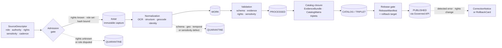

<!-- [KFM_META_BLOCK_V2]
doc_id: kfm://doc/sources/catalog/newspapers
title: Newspapers — Source Family
type: standard
version: v0.1
status: draft
owners: docs-steward + sources-steward  # assignees: TODO confirm in CODEOWNERS
created: 2026-05-13
updated: 2026-05-13
policy_label: public
related:
  - docs/sources/SOURCE_DESCRIPTOR_STANDARD.md   # PROPOSED — named in expansion report
  - docs/doctrine/directory-rules.md             # CONFIRMED doctrine
  - docs/doctrine/lifecycle-law.md               # PROPOSED canonical home
  - docs/doctrine/truth-posture.md               # PROPOSED canonical home
  - docs/doctrine/trust-membrane.md              # PROPOSED canonical home
  - schemas/contracts/v1/source/source_descriptor.schema.json  # PROPOSED per ADR-0001 default
  - control_plane/source_authority_register.yaml # CONFIRMED canonical operational register
  - contracts/source/source_descriptor.md        # PROPOSED — semantic Markdown home
  - docs/domains/archaeology/README.md           # PROPOSED — primary downstream domain
  - docs/domains/people-dna-land/README.md       # PROPOSED — obituaries / land notices
  - docs/domains/hazards/README.md               # PROPOSED — historical hazard sourcing
tags: [kfm, sources, source-family, archives, newspapers, ocr, multi-domain]
notes:
  - "Placement PROPOSED: docs/sources/catalog/. See §Repo fit for the caveat about the `catalog/` segment overlapping the `data/catalog/` truth surface."
  - "Content is explanatory. docs/ explains; it does not decide. Canonical decisions live in contracts/, schemas/, policy/, control_plane/, and accepted ADRs."
  - "Per-source rights, freshness, and admission status are NEEDS VERIFICATION against the mounted repo and the source authority register."
[/KFM_META_BLOCK_V2] -->

# Newspapers — Source Family

> Doctrine-aware orientation for **newspapers** as a Kansas Frontier Matrix (KFM) source family: how newspaper material enters the trust spine, what source roles it can legitimately play, what rights and sensitivity gates apply, and where the canonical operational homes live. This doc **explains**; it does not **decide**.

[](#status)
[](#status)
[](#rights-attribution-and-licensing)
[](#lifecycle-posture--raw--published-for-newspaper-material)
[](#cross-domain-use)
[](#)

| Field | Value |
|---|---|
| **Status** | Draft — placement PROPOSED, content PROPOSED |
| **Owners** | Docs steward + Sources steward — *assignees TODO in CODEOWNERS* |
| **Last updated** | 2026-05-13 |
| **Authority of this doc** | Explanatory. Canonical decisions live in `contracts/`, `schemas/`, `policy/`, `control_plane/`, and accepted ADRs. *(CONFIRMED — `directory-rules.md` §6.1.)* |
| **Operational source register** | `control_plane/source_authority_register.yaml` *(CONFIRMED canonical home; content NOT asserted here.)* |
| **Lifecycle invariant** | RAW → WORK / QUARANTINE → PROCESSED → CATALOG / TRIPLET → PUBLISHED *(CONFIRMED — `directory-rules.md` §0.)* |
| **Truth posture** | Cite-or-abstain. EvidenceBundle outranks generated language. *(CONFIRMED — encyclopedia §3 / governed-AI rule.)* |

---

## Contents

1. [Scope](#scope)
2. [Repo fit](#repo-fit)
3. [What this doc is — and is not](#what-this-doc-is--and-is-not)
4. [Source roles for newspapers](#source-roles-for-newspapers)
5. [Rights, attribution, and licensing](#rights-attribution-and-licensing)
6. [Sensitivity and deny-by-default touchpoints](#sensitivity-and-deny-by-default-touchpoints)
7. [Lifecycle posture — RAW → PUBLISHED](#lifecycle-posture--raw--published-for-newspaper-material)
8. [SourceDescriptor field guidance](#sourcedescriptor-field-guidance-for-newspapers)
9. [Authority anchors](#authority-anchors-for-newspaper-material)
10. [Cross-domain use](#cross-domain-use)
11. [OCR, full-text, and transform discipline](#ocr-full-text-and-transform-discipline)
12. [Validation and gate guidance](#validation-and-gate-guidance)
13. [Open questions and verification backlog](#open-questions-and-verification-backlog)
14. [Related docs](#related-docs)
15. [Appendix — illustrative SourceDescriptor](#appendix--illustrative-sourcedescriptor)

---

## Scope

Newspapers — daily, weekly, county, ethnic, tribal, trade, university, and special-interest periodicals — are a heterogeneous source family that touches nearly every KFM domain. In KFM they are admitted, processed, and published under the same lifecycle invariant as any other source. **Promotion is a governed state transition, not a file move.** *(CONFIRMED — `directory-rules.md` §0.)*

This document does three things:

1. Names the **source roles** a newspaper item can legitimately play in KFM evidence.
2. Names the **rights, sensitivity, and OCR** gates that govern admission and promotion.
3. Points readers at the **canonical operational homes** for descriptors, registers, schemas, policy, and connectors.

It does **not** declare any specific newspaper, issue, or institution admitted, allowed, restricted, or denied. Those are operational decisions made in `control_plane/`, `policy/`, and accepted ADRs.

---

## Repo fit

The newspaper source family is referenced — but not isolated — in current KFM doctrine. The encyclopedia lists `historic maps / plats / land records / newspapers` as a single key source family in the **Archaeology and Cultural Heritage** domain *(CONFIRMED — `kfm_encyclopedia.pdf`, Appendix D / DOM-ARCH source families)*. The **Archives Stack (C10-07)** records the institutional carriers that hold most Kansas newspaper material: KSHS Kansas Memory, KU Spencer Research Library, KSU Special Collections, WSU Special Collections, county historical societies, LOC IIIF, and SNAC/EAC-CPF as the cross-archive authority layer *(CONFIRMED — Pass 10 §C10-07)*.

This document is a *human-facing orientation* sitting under `docs/sources/`. Directory Rules confirm `docs/sources/` as the home for "source-descriptor standards, source families" *(CONFIRMED — `directory-rules.md` §6.1)*. The `catalog/` segment in this doc's path is **PROPOSED**: it names a docs-side index of source-family explainers and is **not** the canonical `data/catalog/` truth surface.

| Layer | Canonical home | Authority status |
|---|---|---|
| Human explanation (this doc) | `docs/sources/catalog/newspapers.md` | **PROPOSED** placement (see callout below) |
| Source-descriptor standard | `docs/sources/SOURCE_DESCRIPTOR_STANDARD.md` | PROPOSED *(named in Whole-UI + Governed-AI expansion report)* |
| Source descriptor schema | `schemas/contracts/v1/source/source_descriptor.schema.json` | PROPOSED per ADR-0001 default; **NEEDS VERIFICATION** against mounted repo |
| Source-descriptor contract (meaning) | `contracts/source/source_descriptor.md` | CONFIRMED canonical home class *(directory-rules §6.3)*; specific file UNKNOWN |
| Operational source register | `control_plane/source_authority_register.yaml` | CONFIRMED canonical home; content NOT asserted |
| Per-source descriptors and registry | `data/registry/sources/<domain>/`, `data/registry/source_descriptors/` | CONFIRMED canonical homes *(directory-rules §9.1)* |
| Policy bundles | `policy/rights/`, `policy/sensitivity/`, `policy/promotion/` | CONFIRMED canonical homes *(directory-rules §6.5)* |
| Connectors (institution-specific) | `connectors/<institution>/…` (e.g., `connectors/kshs/`, `connectors/loc/`) | PROPOSED layout |
| RAW lifecycle | `data/raw/<domain>/<source_id>/<run_id>/` | CONFIRMED lifecycle layout *(directory-rules §7.3, §9.1)* |

> [!IMPORTANT]
> The `catalog/` segment in `docs/sources/catalog/` is **not** the KFM canonical `data/catalog/` truth surface. It is a documentation-side index. Do not promote this doc, or anything under `docs/`, into the operational lineage chain. *(CONFIRMED — `directory-rules.md` §13.5 "Documentation as truth" anti-pattern: "Promote to ADR or `control_plane/` register. `docs/` explains; it doesn't decide alone.")*

---

## What this doc is — and is not

> [!NOTE]
> **Doctrine reminder.** `docs/` explains; it does not decide. A path under `docs/sources/catalog/` is not a SourceDescriptor, not a CatalogRecord, not a PolicyDecision, and not authoritative for admission, validation, or release. Canonical decisions land in `contracts/`, `schemas/`, `policy/`, `control_plane/`, and accepted ADRs. *(CONFIRMED — `directory-rules.md` §6.1, §2.5, §13.)*

**This doc is appropriate for:** orienting contributors; naming source-role pitfalls; listing typical authorities and gates; pointing at canonical homes; recording open questions.

**This doc is not appropriate for:** declaring a specific newspaper source admitted; claiming a source descriptor exists at any path; asserting rights status for any issue; describing actual connector behavior; substituting for an ADR.

[Back to top](#contents)

---

## Source roles for newspapers

KFM doctrine treats `source_role` as a **MUST** field on every SourceDescriptor and explicitly forbids inferring a role from convenience. *(CONFIRMED — "source role cannot be inferred from convenience," `KFM_Unified_Implementation_Architecture_Build_Manual.pdf` §3.6.)* The PROPOSED canonical vocabulary is `observed | regulatory | modeled | aggregate | administrative | candidate | synthetic`. *(PROPOSED — `KFM_Domains_Culmination_Atlas_v1_1.pdf` §24.1.3; tracks open ADR backlog item **ADR-S-04** "Source-role vocabulary v1".)*

Newspapers are a mixed-role family. **The item matters — not the publication.** The same masthead and date can carry items playing different source roles. Default to `administrative` or `aggregate` when in doubt; promotion gates fail closed.

| Typical newspaper item | Suggested `source_role` (PROPOSED) | Why this role | Typical evidenced object |
|---|---|---|---|
| Public legal notice (land patent, sheriff's sale, election proclamation) | `regulatory` or `administrative` (depending on issuing body) | The paper is the legally required publication surface; the *authority* is the government, not the paper. | `LandOfficeRecord`, `PublicLandRecord`, `LifeEvent` (admin trace) |
| Classified ad (estate sale, runaway notice) | `administrative` | Paper is the public-record carrier for a private declaration. | candidate / context only |
| Eyewitness storm / flood / fire account by a named reporter | `observed` only if the reporter was present; otherwise `administrative` | Most "news of an event" is compilation, not observation. | `HazardEvent` *context* — never an alert/advisory replacement *(CONFIRMED Hazards boundary)* |
| Wire-service or syndicated story | `aggregate` | Compiled from multiple upstream sources. | context only |
| Obituary | `administrative` (assertion-class, not observation) | Family-submitted notice, edited by paper. | `PersonAssertion` *candidate*; never definitive identity proof |
| Editorial, opinion, op-ed | `candidate` or context | Opinion is not observation. | story-node context only |
| Historical-society serialized history columns | `aggregate` or `administrative` | Compiled secondary narrative. | context / lineage only |
| Reprint of another paper's article | `aggregate` | Compilation of an upstream item. | trace to upstream `source_id` |
| Photograph published in a paper | `observed` (the image) wrapped in `administrative` (the paper) | Two source-roles in one item — declare both, with separate descriptors. | image evidence under photo rights |

> [!WARNING]
> A newspaper article *reporting on* a tornado is not an observation of the tornado in KFM source-role terms. It is an `administrative` or `aggregate` carrier of someone else's observation. Tagging it `observed` is the canonical deny pattern **"Administrative compilation cited as observation"** *(CONFIRMED — `KFM_Domains_Culmination_Atlas_v1_1.pdf` cross-lane denial register)*. Use the article as **evidence support** for a candidate `HazardObservation`; never as the observation itself.

[Back to top](#contents)

---

## Rights, attribution, and licensing

KFM admission is **deny-by-default on unknown rights** *(CONFIRMED — `kfm_encyclopedia.pdf` Appendix E "Rights and terms checks: Unknown rights fail closed"; §13 sensitive register, "Source-rights-limited records: DENY public release until terms resolved")*. Newspapers are unusually rights-fragmented:

- **U.S. public-domain corpus.** Many pre-1929 U.S. newspapers are public domain; many 1929–1963 are public domain through non-renewal but require an evidence trail; many later are not. *(PROPOSED summary; **NEEDS VERIFICATION** before any specific issue is treated as PD.)* KFM SHOULD NOT collapse this into "old = free."
- **Image vs. text vs. metadata.** Digitized page images, OCR-derived text, and bibliographic metadata can carry different terms even when sourced from the same partner. Track them separately.
- **Institutional terms.** Partner-supplied digitizations often travel with institutional terms (attribution, redistribution limits, derivative-use restrictions). These ride **on top of** any underlying copyright status. Cite the institutional terms exactly.
- **Unknown rights.** Default outcome is QUARANTINE; promotion fails closed *(CONFIRMED — `KFM_Domains_Culmination_Atlas_v1_1.pdf` §24.6.1 lifecycle gates)*.

| Rights signal | Admission outcome | Required artifact (PROPOSED minimum) |
|---|---|---|
| Public domain — evidence in hand | ALLOW admission to RAW | `SourceDescriptor` with `rights` populated and evidence pointer |
| Public domain — claim but no evidence | QUARANTINE pending rights review | `SourceDescriptor` + `QuarantineRecord` with reason `rights_unverified` |
| Institutional license — terms documented | ALLOW admission under terms | `SourceDescriptor` + license excerpt or pointer + attribution string |
| Institutional license — terms not documented | QUARANTINE | `SourceDescriptor` + `QuarantineRecord` |
| Unknown rights | DENY public release; QUARANTINE | `QuarantineRecord` with reason `rights_unknown` |
| Asserted rights conflict with upstream | DENY release; needs-review | `ReviewRecord` + `RightsDecision` |

> [!CAUTION]
> The "public domain" determination for a specific newspaper issue is a research finding, not a default. KFM treats unverified PD assertions like any other unknown-rights record — quarantined, not published. Cite the *evidence* of PD status, not the assumption.

[Back to top](#contents)

---

## Sensitivity and deny-by-default touchpoints

Newspapers regularly intersect the sensitive-class register *(CONFIRMED — `kfm_encyclopedia.pdf` §13 "Sensitive / Deny-by-Default Register")*:

| Sensitive class | Newspaper exposure pattern | Default outcome | Required controls |
|---|---|---|---|
| Living persons | Names, addresses, biographical detail in obituaries, court reports, classifieds, photo captions | DENY public exact/identifying output unless legal basis and review prove release state | Privacy review; redaction; aggregation; staged access |
| Archaeology | Site coordinates; "Indian mound on so-and-so's farm" notes | DENY exact public location by default | Cultural/steward review; suppression/generalization |
| Sacred / culturally sensitive | Burial reports, ceremonial-site descriptions, oral-tradition transcripts | DENY until steward review | Consultation record; sensitivity transform |
| Private landowner-sensitive | Field locations, farm operations, ownership | DENY exact/public if private or rights unclear | Aggregation; permissions; policy review |
| Critical infrastructure (historical proxy) | Bridge, depot, mill, telegraph-office detail in dated reporting | RESTRICT public precision where modern analog remains sensitive | Public-safe aggregation; role-based access |
| Emergency-warning misuse | Historical storm/fire/flood reporting reused as current advisory | DENY life-safety replacement | "Not-for-life-safety" disclaimer; official-source redirection |

> [!IMPORTANT]
> Newspapers from a few decades ago routinely name living people in ways that do not pass modern privacy review. Promotion gates **MUST** check living-person exposure before any newspaper-derived assertion is published, regardless of the article's public-domain status. *(CONFIRMED — `kfm_encyclopedia.pdf` §13 "Living persons"; `KFM_Domains_Culmination_Atlas_v1_1.pdf` §24.7 separation-of-duties for sensitive lanes.)*

[Back to top](#contents)

---

## Lifecycle posture — RAW → PUBLISHED for newspaper material



> [!NOTE]
> This diagram is **illustrative**, not a code path. It re-states the KFM lifecycle invariant *(CONFIRMED — `directory-rules.md` §0; `KFM_Domains_Culmination_Atlas_v1_1.pdf` §24.6.1 lifecycle gates)* with newspaper-specific touchpoints (OCR, citation/attribution, living-person redaction). Per-gate artifact names below are CONFIRMED at the doctrine level; their **mounted-repo implementation is NEEDS VERIFICATION**.

| Gate | Trigger | Minimum artifacts (PROPOSED) | Failure-closed outcome |
|---|---|---|---|
| Admission *(— → RAW)* | New issue, page, or article enters scope | `SourceDescriptor`; payload-or-pointer hash; `rights` populated | Logged as candidate awaiting steward; not admitted |
| Normalization *(RAW → WORK / QUARANTINE)* | OCR, geocoding, identity attempted | `TransformReceipt`; `PolicyDecision`; QUARANTINE for failures | Quarantine with structured reason |
| Validation *(WORK → PROCESSED)* | Schema, geometry, time, identity, evidence, rights, sensitivity | `ValidationReport`; `RedactionReceipt` if sensitivity applies; `AggregationReceipt` if applies | Stay in WORK; structured FAIL outcome |
| Catalog closure *(PROCESSED → CATALOG / TRIPLET)* | `EvidenceRef` resolves; matrix digests close | `CatalogMatrix` entry; `EvidenceBundle`; graph/triplet projections if applicable | HOLD at PROCESSED; no public edge |
| Release *(CATALOG / TRIPLET → PUBLISHED)* | Review state met; release authority distinct from author when materiality applies | `ReleaseManifest`; rollback target; correction path; `ReviewRecord` where required | HOLD at CATALOG; no public surface change |
| Correction *(PUBLISHED → PUBLISHED′)* | Detected error or new evidence; downstream derivatives identified | `CorrectionNotice`; optional `RollbackCard` | Public claim explicitly marked corrected or rolled back |

*(Gate names and pre-conditions CONFIRMED — `KFM_Domains_Culmination_Atlas_v1_1.pdf` §24.6.1.)*

[Back to top](#contents)

---

## SourceDescriptor field guidance for newspapers

The PROPOSED canonical SourceDescriptor surface *(`KFM_Domains_Culmination_Atlas_v1_1.pdf` §24.1.3)* requires `source_role` and several role-conditioned fields. For newspapers the practical guidance is:

| Field | Required when | Newspaper guidance |
|---|---|---|
| `source_role` | always | One of the enum values above. Default to `administrative` if uncertain. |
| `role_authority` | role ∈ {`regulatory`, `modeled`, `aggregate`} | The legal issuer for public notices; the wire service for syndicated reports; the historical-society editor for serialized columns. |
| `role_aggregation_unit` | role = `aggregate` | Compilation scope (e.g., `county-week`, `state-year`). Prevents geometry-scope drift on join. |
| `role_model_run_ref` | role = `modeled` | Rare for newspapers; applies to LLM/NER-assisted extraction that was treated as modeled rather than observed. Resolves to a `ModelRunReceipt`. |
| `role_candidate_disposition` | role = `candidate` | `pending` until merged into a verified assertion or rejected. **PUBLISHED edge forbidden until `merged`.** |
| Identity fields *(issue date, masthead, page, column, article id)* | always | Publication date is **source time**, never observed time of the underlying event. Keep source-time and observed-time strictly distinct *(CONFIRMED — `kfm_encyclopedia.pdf` "Temporal modeling")*. |
| `rights` | always | PD-evidence pointer, institutional license excerpt, or `unknown` → quarantine. |
| Sensitivity flags | always | Living-person, sacred-place, exact-archaeology, infrastructure-precision markers. |
| OCR / transform receipts | when OCR or layout transforms applied | OCR is a `TransformReceipt`; capture engine, version, and confidence. |
| `cadence` | always | `daily` / `weekly` / `monthly` / `one_off` / `historical_retrospective`. |

> [!NOTE]
> **NEEDS VERIFICATION:** the field names above mirror the PROPOSED descriptor surface in Domains Atlas §24.1.3. The mounted `schemas/contracts/v1/source/source_descriptor.schema.json` may use different names. Verify before use. *(Schema-home rule confirmed by ADR-0001 default — `directory-rules.md` §7.4.)*

[Back to top](#contents)

---

## Authority anchors for newspaper material

Newspaper records routinely need to anchor to KFM's authority ladder *(CONFIRMED — `KFM_Components_Pass_10_Idea_Index_Category_Atlas_and_Expansion_Dossier.pdf` §6.7 Authority and Identity Anchoring)*:

| Anchor | When | Status |
|---|---|---|
| **LCNAF** *(Library of Congress Name Authority File)* | Named editors, named persons of cataloging interest | CONFIRMED canonical for U.S. names |
| **VIAF / ISNI** | International, or fallback when LCNAF absent | CONFIRMED — used in fallback order |
| **Wikidata QID** | Crosswalk substrate; parallel to upstream IRI | CONFIRMED as identifier router; **NOT** factual source |
| **GNIS** | U.S. place names referenced in articles | CONFIRMED standard place anchor |
| **Getty TGN** | Historical, vernacular, abandoned, pre-statehood, Indigenous place names that GNIS misses | PROPOSED domain-specific anchor *(C7-05)* |
| **SNAC / EAC-CPF** | Archival creator/agent records across partner institutions | CONFIRMED cross-archive authority |
| **KSHS / KHRI** | Kansas-first place and resource authorities | CONFIRMED Kansas-first cluster |

The authority ladder for U.S. persons is `LCNAF → VIAF → ISNI → Wikidata → local`, with Wikidata stored in **parallel** as the routing anchor rather than as truth. *(CONFIRMED — C7-01, C7-02, C7-04, Pass 10 Idea Index.)*

[Back to top](#contents)

---

## Cross-domain use

Newspapers feed many KFM domains, but the legitimate source role and evidence weight differ by domain. The table below is **INFERRED** from CONFIRMED domain-boundary statements in `kfm_encyclopedia.pdf` Chapter 7 and `KFM_Domains_Culmination_Atlas_v1_1.pdf` per-domain D-tables.

| KFM domain | Typical newspaper contribution | Typical role | Promotion guidance |
|---|---|---|---|
| **Archaeology and Cultural Heritage** | Site mentions, "found while plowing" reports, dedication ceremonies | `administrative` or `aggregate` | DENY exact location; treat as `CandidateFeature` with steward review |
| **People, Genealogy, DNA, and Land Ownership** | Obituaries, marriage notices, sheriff's sales, land-patent notices | `administrative` | `PersonAssertion` candidate, not identity proof; living-person redaction enforced |
| **Roads, Rail, and Trade Routes** | Railroad arrival/dedication notices, trail dispatches, bridge openings | `administrative` | Narrative ≠ surveyed alignment *(CONFIRMED domain boundary)* |
| **Settlements, Cities, and Infrastructure** | Annexation announcements, townsite plats, ghost-town reports | `administrative` or `regulatory` | Pair with GNIS / Census / historical-map cross-evidence |
| **Hazards** | Storm, flood, fire, drought reports | `administrative` or `aggregate` | Hazard-event *candidate*; **never** a life-safety advisory; deny advisory replacement *(CONFIRMED Hazards boundary)* |
| **Atmosphere, Air, and Climate** | Smoke events, dust storms, climate retrospectives | `administrative` | Context only; never replaces observation or model |
| **Agriculture** | Crop reports, market columns, county-fair coverage | `aggregate` | County-level aggregation; field-level detail denied by default |
| **Fauna / Flora** | Bird arrival/departure notes, hunting reports, "last seen" species accounts | `candidate` | Geoprivacy applies; not a substitute for occurrence data |
| **Frontier Demography, Economy, Settlement, Land, and Time Matrix** | Population mentions, county histories, rail/road access narratives | `aggregate` or `administrative` | County-year panel evidence only when paired with structured sources |

[Back to top](#contents)

---

## OCR, full-text, and transform discipline

OCR of newspaper pages is a transform that **materially changes evidence quality**. Every OCR pass MUST emit a `TransformReceipt` that records, at minimum:

- engine *(e.g., Tesseract, ABBYY, commercial, custom)*;
- engine version and language-model version;
- input image source-id and content hash;
- output content hash;
- confidence statistics where available;
- whether layout analysis was applied *(column, headline, caption segmentation)*;
- whether named-entity recognition, geocoding, or LLM-assisted extraction was applied — **each as its own modeled-source-role-tagged transform**.

*(CONFIRMED — `kfm_encyclopedia.pdf` Appendix E "Normalization: Record transform and loss"; Pass 10 §C5-08 "Lineage Required: every published asset must have OpenLineage trail back to receipts.")*

> [!WARNING]
> LLM-assisted extraction (entity linking, place disambiguation, summarization) creates **modeled** outputs. These MUST be tagged `source_role: modeled` with a `role_model_run_ref` to a `ModelRunReceipt`, **not** blended into the original `administrative` material. Treating model-derived assertions as if they came from the newspaper is the deny pattern **"AI text treated as evidence"** *(CONFIRMED — `KFM_Domains_Culmination_Atlas_v1_1.pdf` §24.1: "DENY publication; ABSTAIN at Focus Mode; AIReceipt mandatory")*.

[Back to top](#contents)

---

## Validation and gate guidance

The validator-suite expectation for a newspaper-derived `DatasetVersion` *(PROPOSED minimums, mapped from `KFM_Domains_Culmination_Atlas_v1_1.pdf` §24.6.1)*:

- **Schema validator** — `SourceDescriptor` present and well-formed; `TransformReceipt`(s) present for any OCR / NER / geocoding step.
- **Rights validator** — `rights` field non-null; institutional license recorded; unknown rights → fail closed.
- **Sensitivity validator** — living-person exposure scan; sensitive-class register check; `RedactionReceipt` where required.
- **Temporal validator** — source time = publication date; observed time (if any) distinct from source time; valid time (if any) declared.
- **Geometry validator** — any geocoded place anchored to GNIS / TGN / Wikidata QID with crosswalk provenance; precision and uncertainty class declared.
- **Evidence validator** — every published claim resolves to an `EvidenceBundle` before publication *(CONFIRMED cite-or-abstain default)*.

> [!NOTE]
> **NEEDS VERIFICATION** against any mounted `tools/validators/source_descriptor/` and `tools/validators/domains/<domain>/`. Validator names and paths above are PROPOSED, not asserted to exist.

[Back to top](#contents)

---

## Open questions and verification backlog

> [!NOTE]
> These items are open against current project knowledge. They should not be answered in this doc; they are recorded here so the appropriate ADR or `docs/registers/VERIFICATION_BACKLOG.md` entry can pick them up.

- **Source-role enum stability.** Newspaper material exercises the source-role enum harder than most families *(administrative vs. aggregate vs. observed vs. candidate)*. Tracks open ADR backlog item **ADR-S-04** "Source-role vocabulary v1" *(CONFIRMED open — `KFM_Domains_Culmination_Atlas_v1_1.pdf` §24.12)*.
- **`docs/sources/catalog/` naming.** The `catalog/` segment overlaps the `data/catalog/` truth surface. **PROPOSED rename to consider:** `docs/sources/families/` to avoid term collision. Worth a small ADR note before this pattern spreads across docs.
- **U.S. public-domain workflow.** What evidence is sufficient for a U.S. newspaper-issue PD determination? **UNKNOWN** within current project knowledge.
- **Living-person scan tooling.** What scanner does KFM use for living-person mentions in OCR text? **UNKNOWN**; needs Source-steward decision.
- **OCR engine selection and versioning policy.** **UNKNOWN**; would be an OCR-pipeline ADR.
- **Chronicling America / NDNP integration.** The National Digital Newspaper Program is the largest open U.S. newspaper corpus and is **not named in current project knowledge by source-id**. Treat as a PROPOSED candidate source pending the source activation flow *(CONFIRMED activation flow — `KFM_Unified_Implementation_Architecture_Build_Manual.pdf` §3.6)*.
- **Per-institution access patterns.** Which Kansas partners publish OAI-PMH, IIIF v3, or only PDF/CSV? Pass 10 C10-07 confirms the *spread* of patterns; per-partner specifics are **NEEDS VERIFICATION**.

[Back to top](#contents)

---

## Related docs

- `docs/sources/SOURCE_DESCRIPTOR_STANDARD.md` — PROPOSED — standard for the SourceDescriptor surface across all source families.
- `docs/doctrine/directory-rules.md` — CONFIRMED — placement law; this doc lives under §6.1 `docs/sources/`.
- `docs/doctrine/lifecycle-law.md` — PROPOSED canonical home — RAW → PUBLISHED invariant.
- `docs/doctrine/truth-posture.md` — PROPOSED canonical home — cite-or-abstain default.
- `docs/doctrine/trust-membrane.md` — PROPOSED canonical home — public clients use governed APIs only.
- `docs/domains/archaeology/README.md` — TODO link target — primary downstream of newspaper material.
- `docs/domains/people-dna-land/README.md` — TODO link target — obituaries, land notices, marriage records.
- `docs/domains/hazards/README.md` — TODO link target — historical hazard-event sourcing.
- `contracts/source/source_descriptor.md` — PROPOSED — semantic definition of SourceDescriptor.
- `control_plane/source_authority_register.yaml` — CONFIRMED canonical operational register *(not a doc)*.

[Back to top](#contents)

---

## Appendix — illustrative SourceDescriptor

<details>
<summary><strong>Click to expand: illustrative SourceDescriptor for a historical newspaper item (PROPOSED, ILLUSTRATIVE)</strong></summary>

> **PROPOSED, illustrative only.** Field names mirror the PROPOSED descriptor surface in `KFM_Domains_Culmination_Atlas_v1_1.pdf` §24.1.3. Actual schema field names and types are **NEEDS VERIFICATION** against `schemas/contracts/v1/source/source_descriptor.schema.json` in the mounted repo. Do **not** use the example below as a fixture.

```json
{
  "source_id": "kfm:source:newspaper:kshs:example-county-reporter:1873-09-04:p2",
  "source_role": "administrative",
  "role_authority": "Example County, Kansas — Sheriff's Office",
  "role_aggregation_unit": null,
  "role_model_run_ref": null,
  "role_candidate_disposition": null,
  "title": "Sheriff's Sale Notice",
  "publication": "Example County Reporter",
  "issue_date": "1873-09-04",
  "page": 2,
  "column": null,
  "rights": {
    "status": "public_domain",
    "evidence_ref": "kfm:evidence:rights:us-pd-pre-1929:<hash>"
  },
  "sensitivity": {
    "living_person": false,
    "sacred_place": false,
    "exact_archaeology": false,
    "infrastructure_precision": false
  },
  "carrier": {
    "institution": "Kansas State Historical Society — Kansas Memory",
    "access_method": "IIIF v3",
    "fetched_at": "<iso8601>"
  },
  "transforms": [
    {
      "kind": "ocr",
      "transform_receipt_ref": "kfm:receipt:transform:ocr:<hash>"
    }
  ],
  "cadence": "historical_retrospective",
  "hash": {
    "payload_sha256": "<hex>"
  }
}
```

</details>

[Back to top](#contents)

---

**Related docs:** see [§Related docs](#related-docs).
**Last updated:** 2026-05-13.
**Doctrine basis:** `directory-rules.md` §0, §6.1, §7.3, §9.1, §13.5 *(CONFIRMED)*; `kfm_encyclopedia.pdf` §13, Appendix D, Appendix E *(CONFIRMED)*; `KFM_Domains_Culmination_Atlas_v1_1.pdf` §24.1.3, §24.6.1, §24.7, §24.12 *(CONFIRMED doctrine; PROPOSED field surfaces)*; `KFM_Components_Pass_10_Idea_Index_Category_Atlas_and_Expansion_Dossier.pdf` §C7, §C10-07 *(CONFIRMED)*; `KFM_Whole_UI_Governed_AI_Expansion_Report.pdf` Appendix A *(PROPOSED tree)*; `KFM_Unified_Implementation_Architecture_Build_Manual.pdf` §3.6 *(CONFIRMED source-role rule)*.
[Back to top](#newspapers--source-family)
