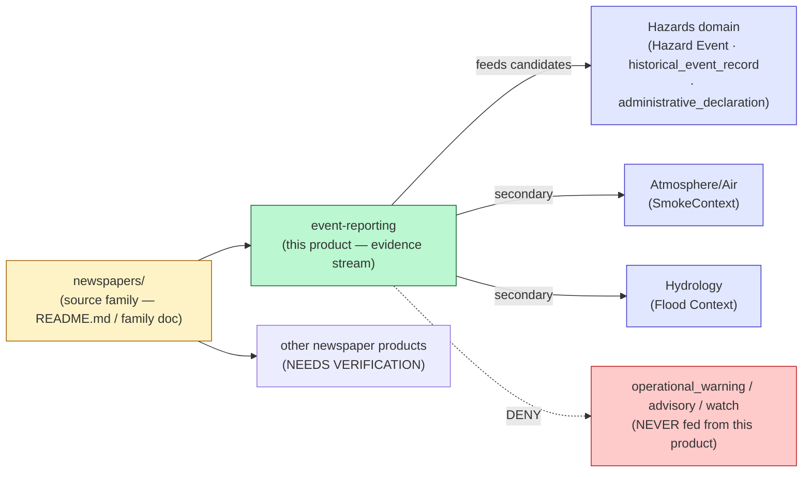

<!-- [KFM_META_BLOCK_V2]
doc_id: kfm://doc/docs-sources-catalog-newspapers-event-reporting
title: Newspaper Event Reporting
type: product-page
version: v0.2
status: draft
owners: [PLACEHOLDER — Docs steward + Source steward for newspapers + Hazards domain steward; CODEOWNERS NEEDS VERIFICATION]
created: 2026-05-20
updated: 2026-05-22
policy_label: public
related:
  - docs/sources/catalog/newspapers/README.md
  - docs/sources/catalog/newspapers.md
  - docs/sources/catalog/README.md
  - docs/sources/catalog/IDENTITY.md
  - docs/sources/catalog/RIGHTS-AND-SENSITIVITY-MAP.md
  - docs/doctrine/directory-rules.md
  - docs/doctrine/trust-membrane.md
  - docs/domains/hazards/README.md
  - docs/domains/atmosphere/README.md
  - docs/domains/hydrology/README.md
  - docs/standards/SENSITIVITY_RUBRIC.md
  - data/registry/sources/
  - schemas/contracts/v1/source/
  - policy/sensitivity/
  - policy/rights/
tags: [kfm, docs, sources, catalog, newspapers, product-page, evidence-stream, hazards, cross-domain, ocr, ner, candidate-evidence]
notes:
  - "PROPOSED product-page scaffold for the Newspaper Event Reporting cross-domain evidence product. Sibling-link presence verified in a Claude Code session; mounted-repo presence NEEDS VERIFICATION."
  - "CRITICAL DOCTRINE: KFM Hazards is NOT an emergency alert system and must not provide life-safety instructions (CONFIRMED — Pass 32 §24.5 Deny-by-Default Register; Domains Atlas §12-B Hazards scope-and-boundary). Newspaper event reporting feeds Hazards as candidate/historical evidence ONLY — never as alerts, advisories, watches, or life-safety instructions."
  - "CRITICAL SOURCE-ROLE RULE: A newspaper article reporting on a tornado/flood/fire is NOT an `observed` source in KFM terms — it is `administrative` or `aggregate` (CONFIRMED parent doc; CONFIRMED cross-lane denial register 'Administrative compilation cited as observation'). The parent newspapers family doc carries this rule; this product page MUST NOT relax it."
  - "Structural inconsistency NEEDS VERIFICATION: this product page sits at docs/sources/catalog/newspapers/event-reporting.md (subfolder layout, matching the natureserve sibling pattern), but the parent newspapers family doc was authored at docs/sources/catalog/newspapers.md (flat layout). The ADR resolving flat-vs-subfolder for source-family pages is open. New work SHOULD follow whichever pattern the eventual ADR pins; until then, BOTH this product page's ./README.md target and the family-page placement are PROPOSED."
  - "policy_label: public describes THIS PAGE only. The page documents structure and governance; it does not restate restricted policy or expose sensitive content."
  - "All repo-state claims herein remain PROPOSED until verified against mounted-repo evidence."
[/KFM_META_BLOCK_V2] -->

# 📰 Newspaper Event Reporting

> Product-page scaffold for **Newspaper Event Reporting** — eyewitness and reported accounts of storms, floods, fires, droughts, and other hazards as **candidate / historical** evidence feeding the KFM Hazards domain. **Never** as alerts, advisories, watches, or life-safety instructions.

<!-- Badge row — Shields.io placeholders -->


| Field | Value |
|---|---|
| **Status** | PROPOSED — scaffold only |
| **Artifact class** | **Evidence stream** — candidate `Hazard Event` / `historical_event_record` / `administrative_declaration` evidence |
| **Source family** | [`newspapers`](./README.md) *(family doc at parent — see meta block note about flat-vs-subfolder layout)* |
| **Consuming domain** | [Hazards](../../../domains/hazards/README.md) (primary); [Atmosphere/Air](../../../domains/atmosphere/README.md) and [Hydrology](../../../domains/hydrology/README.md) (secondary, for smoke/dust and flood reports) |
| **Owners** | `PLACEHOLDER` — Docs steward + Source steward for `newspapers` + Hazards domain steward (CODEOWNERS NEEDS VERIFICATION) |
| **Last reviewed** | 2026-05-22 |

---

## ⚠️ Hazards boundary — the rule that overrides every other rule

> [!CAUTION]
> **CONFIRMED corpus doctrine (Pass 32 §24.5 Deny-by-Default Register; Domains Atlas §12-B Hazards scope-and-boundary):** *"KFM Hazards is not an emergency alert system and must not provide life-safety instructions."* The Deny-by-Default Register flags **emergency instructions or KFM as alert authority** as **not allowed as KFM authority**.

> [!CAUTION]
> **CONFIRMED corpus doctrine (Pass 32 Hazards §I publication posture):** *"Operational warning products are contextual only and not for life safety; unknown source roles are quarantined; expired operational context cannot appear as current warning state."*

This product feeds Hazards as **candidate** evidence and as `historical_event_record` (CONFIRMED Hazards ubiquitous-language term). It MUST NOT feed `operational_warning`, `operational_advisory`, or `operational_watch` (also CONFIRMED Hazards terms) — those slots are reserved for current, authoritative operational sources owned by other domains and lanes.

[↑ back to top](#-newspaper-event-reporting)

---

## What this page is — and is not

> [!IMPORTANT]
> This is a **product-page scaffold**, not a source-profile or a policy document. It documents one evidence-product slice of the `newspapers` source family — specifically, the hazard-event-related material. It deliberately does **not** restate fields that live elsewhere.

| This page does | This page does NOT |
|---|---|
| Map newspaper hazard items to CONFIRMED Hazards ubiquitous-language terms | Restate the Hazards domain ontology — see [`docs/domains/hazards/README.md`](../../../domains/hazards/README.md) |
| Document the source-role anti-collapse rule for newspaper hazard reports | Restate `SourceDescriptor` fields — those live under [`data/registry/sources/`](../../../../data/registry/sources/) |
| Name the OCR / NER / LLM-extraction discipline this product depends on | Restate the C6 sensitivity rubric — see [`docs/standards/SENSITIVITY_RUBRIC.md`](../../../standards/SENSITIVITY_RUBRIC.md) *(PROPOSED, not yet authored)* |
| Track open questions specific to this product | Decide ADR-class questions (e.g., flat-vs-subfolder family layout) |

[↑ back to top](#-newspaper-event-reporting)

---

## Overview

PROPOSED scaffold. **Newspaper Event Reporting** is the KFM evidence stream produced from newspaper coverage of hazards: storm and tornado accounts, flood reporting, wildfire reports, drought columns, dust-storm and smoke events, earthquake notices, and disaster declarations published in print. It is a **cross-domain product**: the `newspapers` source family produces it, the **Hazards** domain consumes it (with secondary consumption by Atmosphere/Air for smoke/dust and by Hydrology for flood reports).

The product exists because newspaper hazard reporting is a historically rich body of evidence that no other Kansas-relevant source family can replace — and because, *if mishandled*, it is the single fastest way to violate the Hazards boundary by leaking historical reporting into a current-warning surface.

> [!NOTE]
> **Three-layer evidence strategy (CONFIRMED, KFM-P17-IDEA-0004):** This product follows the parent newspapers family doctrine — *Kansas Memory primary / HathiTrust context / Chronicling America recall*. The three layers stay distinct in evidence references; collapsing them is drift.

[↑ back to top](#-newspaper-event-reporting)

---

## Where this product sits



> **Diagram status:** PROPOSED. The DENY edge to `operational_warning / advisory / watch` is CONFIRMED doctrine (Pass 32 §24.5 Deny-by-Default Register; Hazards §I publication posture).

[↑ back to top](#-newspaper-event-reporting)

---

## Hazards object families this product feeds

The Hazards domain has a CONFIRMED ubiquitous-language vocabulary (Atlas §12-C). Newspaper Event Reporting feeds the following terms — and *only* the following terms:

| Newspaper item | CONFIRMED Hazards term it feeds | KFM `source_role` (PROPOSED) | Note |
|---|---|---|---|
| Storm / tornado / hail account | `Hazard Event` (candidate); `historical_event_record` | `administrative` (default); `observed` ONLY if a named reporter was present and the account is first-person | Source-role anti-collapse rule applies |
| Flood report | `Flood Context` (candidate); `Hazard Event`; `historical_event_record` | `administrative` or `aggregate` | Cross-domain: also feeds Hydrology |
| Wildfire / prairie-fire report | `Wildfire Detection` (candidate); `Hazard Event` | `administrative` | Pair with remote-sensing detection where available |
| Drought column or season recap | `Drought Indicator` (candidate); `historical_event_record` | `aggregate` | County-week / county-season aggregation typical |
| Smoke / dust event | `SmokeContext` (candidate); `Hazard Event` | `administrative` | Cross-domain: also feeds Atmosphere/Air |
| Earthquake notice | `Earthquake Event` (candidate); `historical_event_record` | `administrative` | Pair with USGS for any seismic observation |
| Heat / cold wave coverage | `Heat Cold Event` (candidate); `historical_event_record` | `aggregate` | Often only inferable from coverage volume |
| Disaster declaration notice (governor / federal) | `administrative_declaration` (CONFIRMED term) | `regulatory` (the authority is the government); paper is the publication surface | Treat the *declaration* as the artifact; the newspaper carries it |
| LLM/NER-extracted hazard event from OCR text | `modeled_derivative` (CONFIRMED term) | `modeled` with `role_model_run_ref` to `ModelRunReceipt` | MUST NOT be blended with the original `administrative` material |
| Hazard item not yet classified | `unknown_unclassified` (CONFIRMED term) | `candidate` with `role_candidate_disposition: pending` | Holds in WORK until classified |

> [!WARNING]
> **Source-role anti-collapse (CONFIRMED parent-doc rule; CONFIRMED Pass 32 Hazards §K validator: "Source-role anti-collapse tests").** Tagging a newspaper hazard report as `observed` when the reporter was compiling someone else's account is the canonical deny pattern **"Administrative compilation cited as observation"** (CONFIRMED — cross-lane denial register). Default to `administrative` or `aggregate`; promotion gates fail closed on misclassification.

[↑ back to top](#-newspaper-event-reporting)

---

## Source authority

See [`data/registry/sources/`](../../../../data/registry/sources/) for the authoritative newspaper-publication `SourceDescriptor` (canonical schema home: `schemas/contracts/v1/source/source_descriptor.schema.json` per Directory Rules §7.4 + ADR-0001; filename variance noted in the parent family doc). **Do not duplicate descriptor fields here.**

Each newspaper *item* feeding this product also needs its own descriptor (per the per-item rule in the parent newspapers family doc: "The item matters — not the publication"). Item-level descriptors carry the role-conditioned fields appropriate to the specific hazard report — not the publication-wide role.

[↑ back to top](#-newspaper-event-reporting)

---

## Catalog profiles used

| Profile | Lane | Used by this product? | Notes |
|---|---|---|---|
| STAC | [`data/catalog/stac/`](../../../../data/catalog/stac/) | **PROPOSED — likely Yes** for items with resolvable spatial + temporal extent | Pass-10 §C4-01 CONFIRMED for spatiotemporal datasets; hazard events are inherently spatiotemporal |
| DCAT | [`data/catalog/dcat/`](../../../../data/catalog/dcat/) | **PROPOSED — possibly Yes** for collection-level metadata distributions | Pass-10 §C4-05 CONFIRMED for non-spatial catalog records |
| PROV-O | [`data/catalog/prov/`](../../../../data/catalog/prov/) | **PROPOSED — Yes** for derivation chain (publication → OCR → NER → candidate event) | Pass-10 §C8-03 CONFIRMED for provenance |
| Domain projection | `data/catalog/domain/hazards/` | **PROPOSED — Yes** as a Hazards-domain projection | Per-domain projection; PROPOSED placement |

> [!NOTE]
> Hazard candidate events from this product MAY appear as STAC Items where they have resolvable geometry (from geocoded place names) and a defensible observation/source window. Items SHOULD carry the **STAC Projection** fields (CONFIRMED extension; KFM-P27-FEAT-0003 lint and KFM-P27-IDEA-0009 / KFM-P27-PROG-0011 front-matter, all PROPOSED) when geometry is precise enough to warrant them. Items SHOULD carry the **STAC attestation hook** (`rel: attestation`, KFM-P7-PROG-0001 PROPOSED) pointing at the `EvidenceBundle` that justifies the candidate event.

[↑ back to top](#-newspaper-event-reporting)

---

## Collection identity

- PROPOSED Collection id pattern: `kfm-<org>-<product>` — see [`../IDENTITY.md`](../IDENTITY.md).
- PROPOSED namespace: `kfm:` *(see Pass-10 §C4-01 open question on `kfm:` vs `ks-kfm:`; locally flagged as **OPEN-DSC-03**, NEEDS VERIFICATION against the project's open-issue naming convention)*.
- Asset roles: NEEDS VERIFICATION — confirm against [`schemas/contracts/v1/source/`](../../../../schemas/contracts/v1/source/) and any product-level asset-role enum.

[↑ back to top](#-newspaper-event-reporting)

---

## Provenance fields

**CONFIRMED doctrine** (Pass-10 §C4-01) — STAC Items carry an `item.properties.kfm:provenance` block; the *product's adoption* is PROPOSED until catalog records are verified.

- `spec_hash` — sha256 of the canonical record (CONFIRMED RFC 8785 JCS via §C1-02).
- `evidence_bundle_ref` — `kfm://evidence/<digest>` (must resolve before render; CONFIRMED cite-or-abstain via KFM-P1-PROG-0013).
- `run_record_ref` — `kfm://run/<run-id>` for the candidate-event-build run.
- `audit_ref` — `kfm://audit/<attestation-id>`.
- `policy_digest` — sha256 of the policy bundle (must include the emergency-alert-boundary policy).

Per-asset integrity: `file:checksum` on every asset entry.

### OCR / NER / LLM-extraction-specific provenance

Newspaper Event Reporting *always* involves at least one and usually several transforms beyond the underlying scan. Each transform MUST emit its own `TransformReceipt` (CONFIRMED parent-doc rule; CONFIRMED Pass-10 §C5-08 OpenLineage). Minimum recorded for any LLM/NER-assisted extraction:

- engine, engine version, model version, language pack;
- input image source-id and content hash;
- output content hash;
- confidence statistics;
- whether layout, NER, geocoding, or summarization were applied — **each as its own modeled-source-role-tagged transform**;
- the candidate `Hazard Event` (or other Hazards term) the extraction emitted.

> [!WARNING]
> LLM-assisted extraction MUST be tagged `source_role: modeled` with a `role_model_run_ref` to a `ModelRunReceipt`. Treating model-derived hazard assertions as if they came directly from the newspaper is the canonical deny pattern **"AI text treated as evidence"** (CONFIRMED — Pass 32 §24.1 deny register: "DENY publication; ABSTAIN at Focus Mode; AIReceipt mandatory").

[↑ back to top](#-newspaper-event-reporting)

---

## Temporal handling

**CRITICAL** — Newspaper Event Reporting is the product where temporal-role separation is most likely to fail under pressure. Keep **strictly distinct**:

| Time | What it means here | Example |
|---|---|---|
| **source time** | Publication date of the newspaper item | 1879-06-12 (issue date) |
| **observed time** | When the underlying hazard happened | 1879-06-10 (when the tornado actually occurred) |
| **valid time** | Duration the hazard was active, if known | 1879-06-10 18:00 → 1879-06-10 21:00 (UTC offset NEEDS VERIFICATION) |
| **retrieval time** | When KFM ingested the scan or OCR output | 2026-05-22T...Z |
| **release time** | When this version of the candidate event was published by KFM | 2026-06-01T...Z |
| **correction time** | When an entry was changed | populated only on correction |

*(CONFIRMED doctrine — source, observed, valid, retrieval, release, correction times stay distinct where material, per Atlas Fauna §7-E, Flora §8-E, Hazards §H per-domain conventions.)*

> [!IMPORTANT]
> **Operational expiry rule (CONFIRMED Hazards §I):** *"Expired operational context cannot appear as current warning state."* For newspaper event reporting, this means an 1879 tornado account CANNOT render in any UI surface that a reader could mistake for a current tornado warning. The release-time and observed-time gap is itself a publication-safety signal: when it's measured in decades, the item is `historical_event_record`; when it's measured in days, the item still feeds `historical_event_record` and never `operational_warning`.

[↑ back to top](#-newspaper-event-reporting)

---

## Geometry and projection

PROPOSED — Hazard events from newspaper reporting carry geometry derived from geocoded place names in the text. Required disciplines:

- **Geocoding anchor.** Every geocoded place anchors to GNIS, Getty TGN, or Wikidata QID with crosswalk provenance (CONFIRMED parent-doc rule; CONFIRMED Pass-10 §C7-09 GNIS; §C7-05 TGN).
- **Precision and uncertainty.** Every event carries a precision class and an uncertainty buffer; "town of X" is not the same as "Section 17 of Township Y." Uncertainty class NEEDS VERIFICATION against the Hazards domain `ImpactArea` shape.
- **STAC Projection compliance.** Where geometry warrants it: `proj:code`, `proj:bbox`, `proj:geometry`, `proj:shape`, `proj:transform` (CONFIRMED STAC Projection; KFM-P27-FEAT-0003 lint PROPOSED).
- **Sensitivity check at geometry.** Even historical hazard locations can become sensitive when they reveal living-person residences, archaeological sites, or critical infrastructure — see [§ Rights and sensitivity](#rights-and-sensitivity).

[↑ back to top](#-newspaper-event-reporting)

---

## Rights and sensitivity

NEEDS VERIFICATION — see [`policy/sensitivity/`](../../../../policy/sensitivity/) and [`../RIGHTS-AND-SENSITIVITY-MAP.md`](../RIGHTS-AND-SENSITIVITY-MAP.md). **Do not restate policy here.**

Newspaper hazard reporting concentrates several sensitivity classes:

| Concern | Where it lives |
|---|---|
| Living-person exposure (victim names, witness names, property owners named in storm reports) | [`policy/sensitivity/`](../../../../policy/sensitivity/); CONFIRMED parent-doc rule + Pass-10 §C6-06 k-anonymity for living-people overlays |
| Public-domain status of source publication | [`policy/rights/`](../../../../policy/rights/) + `license_map.json` (PROPOSED, KFM-P26-PROG-0021); deny-by-default on unknown rights |
| Archaeological exposure (sites named in storm-uncovering or excavation reports) | Parent-doc table; CONFIRMED domain rule (Archaeology: exact site coords DENY) |
| Critical-infrastructure precision (historical bridge / depot / mill detail in dated reporting) | Parent-doc table; CONFIRMED Settlements/Infrastructure rule |
| Per-rank → sensitivity_rank → redaction-profile mapping | [`docs/standards/SENSITIVITY_RUBRIC.md`](../../../standards/SENSITIVITY_RUBRIC.md) *(PROPOSED, not yet authored — Directory Rules §18 OPEN-DR-05)* |

> [!IMPORTANT]
> Newspaper reports from a few decades ago routinely name living people (storm victims, accident witnesses, property owners) in ways that do not pass modern privacy review. Promotion gates **MUST** check living-person exposure before any candidate hazard event derived from those reports is published — regardless of the issue's public-domain status. *(CONFIRMED parent-doc rule.)*

[↑ back to top](#-newspaper-event-reporting)

---

## Validation and gate guidance

The product feeds the Hazards domain validator suite. CONFIRMED Hazards validators (Pass 32 §12-K) that apply to every release of this product:

- **Source-role anti-collapse tests** (CONFIRMED) — fail if a newspaper item with `source_role: administrative` was promoted as if it were `observed`.
- **Temporal-role validators** (CONFIRMED) — fail if `source time`, `observed time`, and `valid time` collapse into one field, or if the source-time-to-observed-time gap is unexplained.
- **Emergency-alert denial** (CONFIRMED) — fail if any candidate event ends up routed to an `operational_warning`, `operational_advisory`, or `operational_watch` slot.
- **Operational expiry / freshness tests** (CONFIRMED) — fail if a historical event appears in a UI context that suggests current warning state.
- **Catalog closure tests** (CONFIRMED + KFM-P1-IDEA-0020 PROPOSED) — fail if `EvidenceRef → EvidenceBundle` does not resolve, or if `ReleaseManifest` / rollback target is missing.
- **Evidence Drawer disclaimer tests** (CONFIRMED) — fail if the Evidence Drawer does not surface the "historical reporting, not life-safety" disclaimer.
- **UI no-direct-source tests** (CONFIRMED) — fail if a public surface reaches the underlying scan, OCR output, or raw NER output instead of the released `EvidenceBundle`.

Additional product-specific validators (PROPOSED):

- **OCR-confidence floor** — fail if an extracted hazard claim depends on OCR text below a defined confidence threshold (PROPOSED; threshold NEEDS VERIFICATION).
- **LLM-extraction-as-evidence guard** — fail if any released claim relies on an LLM-extracted assertion without a corresponding `ModelRunReceipt` and `AIReceipt`.
- **Living-person exposure scan** — fail if any candidate event names a likely-living person without privacy review.

> [!IMPORTANT]
> **Watcher-as-non-publisher** (CONFIRMED, Directory Rules §13.5): A newspaper watcher emits `SourceIntakeRecord`, `RunReceipt`, and candidate decisions only — never writes directly to `data/catalog/`, `data/published/`, or the Hazards domain projection. All promotion of newspaper-derived candidate events flows through a governed `PromotionDecision`.

[↑ back to top](#-newspaper-event-reporting)

---

## Related contracts and schemas

- [`contracts/`](../../../../contracts/) — semantic contracts for `Hazard Event`, `historical_event_record`, `administrative_declaration`, `modeled_derivative` (CONFIRMED domain ontology; placement NEEDS VERIFICATION).
- [`schemas/contracts/v1/source/`](../../../../schemas/contracts/v1/source/) — `SourceDescriptor` schema per Directory Rules §7.4 + ADR-0001 (filename variance noted in parent doc).
- `schemas/contracts/v1/hazards/` — Hazards-domain object schemas (PROPOSED placement; NEEDS VERIFICATION).
- `schemas/contracts/v1/governance/transform_receipt.schema.json` — `TransformReceipt` schema (PROPOSED placement; NEEDS VERIFICATION).
- `schemas/contracts/v1/governance/model_run_receipt.schema.json` — `ModelRunReceipt` schema (PROPOSED placement; NEEDS VERIFICATION).

[↑ back to top](#-newspaper-event-reporting)

---

## Related connectors and pipelines

- [`connectors/newspapers/`](../../../../connectors/newspapers/) — newspaper fetch / admission logic (institution-keyed sub-connectors: KSHS, LOC, Chronicling America, HathiTrust per parent-doc three-layer strategy).
- [`pipelines/ingest/`](../../../../pipelines/ingest/) → [`pipelines/normalize/`](../../../../pipelines/normalize/) (OCR + NER + geocoding) → [`pipelines/validate/`](../../../../pipelines/validate/) → [`pipelines/catalog/`](../../../../pipelines/catalog/) → Hazards-domain projection.
- `pipeline_specs/hazards/` — Hazards-domain declarative specs (PROPOSED placement; NEEDS VERIFICATION).
- `pipeline_specs/newspapers/` — newspaper-source declarative specs (PROPOSED placement; NEEDS VERIFICATION).

> [!NOTE]
> This product crosses the newspapers / Hazards seam, so the pipeline likely cuts across both `pipeline_specs/newspapers/` and `pipeline_specs/hazards/`. Whether one canonical spec lives under one lane (with a cross-reference) or whether parallel specs sit in both lanes is an open question — ADR-class.

[↑ back to top](#-newspaper-event-reporting)

---

## Examples

*(Illustrative only — do not treat as authoritative. Sample shape from Pass-10 §C4-01 doctrine; product-specific fields are PROPOSED.)*

See [`../_examples/stac-item-example.json`](../_examples/stac-item-example.json) for the minimal STAC + `kfm:provenance` shape.

<details>
<summary><strong>Sketch of one candidate Hazard Event from a newspaper item (illustrative)</strong></summary>

```json
{
  "type": "Feature",
  "stac_version": "1.0.0",
  "id": "kfm-hazard-event-newspapers-example-1879-06-10-tornado",
  "properties": {
    "datetime": "1879-06-10T18:00:00Z",
    "kfm:hazards_object_family": "Hazard Event",
    "kfm:hazards_record_type": "historical_event_record",
    "kfm:source_role": "administrative",
    "kfm:role_authority": "Example County Reporter, 1879-06-12 issue, p.2",
    "kfm:candidate_disposition": "pending",
    "kfm:provenance": {
      "spec_hash": "sha256:<jcs-canonical>",
      "evidence_bundle_ref": "kfm://evidence/<digest>",
      "run_record_ref": "kfm://run/<run-id>",
      "audit_ref": "kfm://audit/<attestation-id>",
      "policy_digest": "sha256:<policy-bundle-digest-including-emergency-alert-boundary>"
    },
    "kfm:transforms": [
      { "kind": "ocr", "transform_receipt_ref": "kfm://receipt/transform/ocr/<hash>" },
      { "kind": "ner", "transform_receipt_ref": "kfm://receipt/transform/ner/<hash>", "model_run_ref": "kfm://run/model/<hash>" }
    ],
    "kfm:disclaimer": "Historical newspaper reporting; not a life-safety advisory."
  },
  "links": [
    { "rel": "attestation", "href": "<bundle-url>", "type": "application/ld+json" }
  ]
}
```

This sketch is PROPOSED and illustrative. Field names, namespaces, identifiers, and date/time values are placeholders. The 1879 tornado is **example only** and does not assert that KFM has actually catalogued such an event. Confirm shape against canonical examples under [`../_examples/`](../_examples/) and against the Hazards domain object schemas.

</details>

[↑ back to top](#-newspaper-event-reporting)

---

## Open questions

- **OPEN — flat-vs-subfolder layout for source-family pages.** This product page sits at `docs/sources/catalog/newspapers/event-reporting.md` (subfolder); the parent family doc was authored at `docs/sources/catalog/newspapers.md` (flat). ADR-class. (NEEDS VERIFICATION.)
- **OPEN — OCR-confidence floor for hazard extraction.** What is the minimum OCR confidence for a candidate hazard event to leave QUARANTINE? UNKNOWN.
- **OPEN — LLM-extraction governance.** Which models, prompts, and `AIReceipt` shapes are permitted for hazard extraction? UNKNOWN.
- **OPEN — pipeline lane seam.** Whether `pipeline_specs/` for this product lives under `newspapers/`, `hazards/`, or both (with cross-references). NEEDS VERIFICATION.
- **OPEN — Hazards-domain projection shape.** How exactly do candidate `Hazard Event` records project into the Hazards domain layer (specifically `ImpactArea` and `Hazard Timeline` shapes)? NEEDS VERIFICATION.
- **OPEN — Disaster-declaration source-role.** A newspaper publishing a governor's disaster declaration: is `source_role: regulatory` correct (with `role_authority` = governor's office), or `administrative` (with the paper as administrative carrier)? Parent doc favours `regulatory` for legal notices; ADR-class.
- **OPEN — Cross-domain consumption split.** Smoke/dust events feed both Hazards and Atmosphere/Air; flood reports feed both Hazards and Hydrology. Whether the product emits one record consumed by multiple domains, or per-domain records, is unsettled. NEEDS VERIFICATION.
- **OPEN — namespace choice.** `kfm:` (KFM-global) vs `ks-kfm:` (Kansas-scoped). Pass-10 §C4-01 records this as an open question. Local reference **OPEN-DSC-03** is itself NEEDS VERIFICATION against the project's open-issue naming convention.
- **OPEN — Cadence and endpoint.** Confirm per-institution cadence (Kansas Memory / Chronicling America / HathiTrust / county societies) and current endpoint URLs. NEEDS VERIFICATION.

[↑ back to top](#-newspaper-event-reporting)

---

## Last reviewed

2026-05-22 — scaffold revision; reshaped to foreground the Hazards-domain boundary; mapped newspaper items to CONFIRMED Hazards ubiquitous-language terms; added cross-domain consumption framing; tightened source-role anti-collapse and emergency-alert denial language.

---

<!-- Footer -->

**Related docs:** [`./README.md`](./README.md) *(newspapers family — flat-vs-subfolder layout NEEDS VERIFICATION)* · [`../README.md`](../README.md) *(catalog landing)* · [`../IDENTITY.md`](../IDENTITY.md) · [`../RIGHTS-AND-SENSITIVITY-MAP.md`](../RIGHTS-AND-SENSITIVITY-MAP.md) · [`../../../doctrine/directory-rules.md`](../../../doctrine/directory-rules.md) · [`../../../domains/hazards/README.md`](../../../domains/hazards/README.md) · [`../../../standards/SENSITIVITY_RUBRIC.md`](../../../standards/SENSITIVITY_RUBRIC.md) *(PROPOSED, not yet authored)*

**Last updated:** 2026-05-22 · **Status:** draft scaffold · **Artifact class:** evidence stream · **Page policy:** public · **NEVER an alert authority** · **Doc id:** `kfm://doc/docs-sources-catalog-newspapers-event-reporting`

[↑ back to top](#-newspaper-event-reporting)
