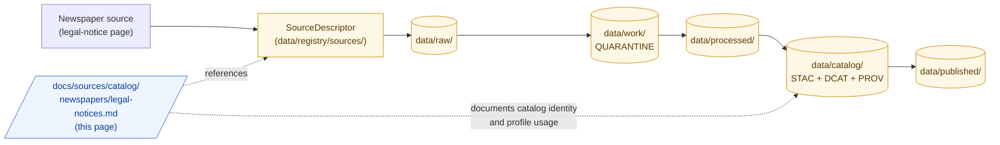

<!-- [KFM_META_BLOCK_V2]
doc_id: kfm://doc/docs-sources-catalog-newspapers-legal-notices
title: Newspaper Public Legal Notices
type: product-page
version: v0.2
status: draft
owners: <PLACEHOLDER — Docs steward + Source steward for newspapers>
created: 2026-05-20
updated: 2026-05-22
policy_label: public
related:
  - docs/sources/catalog/newspapers/README.md
  - docs/sources/catalog/README.md
  - docs/sources/catalog/newspapers/IDENTITY.md
  - docs/sources/catalog/newspapers/RIGHTS-AND-SENSITIVITY-MAP.md
  - docs/doctrine/directory-rules.md
  - docs/standards/PROV.md
  - docs/adr/ADR-0001-schema-home.md
tags: [kfm, docs, sources, catalog, newspapers, product-page]
notes:
  - "PROPOSED product-page scaffold; sibling-link presence and repo path NEEDS VERIFICATION."
  - "PROPOSED path under docs/sources/catalog/newspapers/ — placement basis docs/doctrine/directory-rules.md §6.1."
[/KFM_META_BLOCK_V2] -->

# Newspaper Public Legal Notices

> Land patents, sheriff's sales, and election proclamations published in newspapers as the legally required notice surface — modeled as governed evidence, not as map labels.

[](#status)
[](#status)
[](#rights-and-sensitivity)
[](./README.md)
[](../../../doctrine/directory-rules.md)
<!-- TODO: replace placeholder Shields.io targets once CI/badge generation is wired (see KFM-P3-FEAT-0005). -->

**Status:** PROPOSED — scaffold only · **Family:** [`newspapers`](./README.md) · **Owners:** *PLACEHOLDER — Docs steward + Source steward for newspapers* · **Last reviewed:** 2026-05-22

---

## Quick jump

- [Overview](#overview)
- [Repo fit](#repo-fit)
- [Source authority](#source-authority)
- [Catalog profiles used](#catalog-profiles-used)
- [Collection identity](#collection-identity)
- [Provenance fields](#provenance-fields)
- [Temporal handling](#temporal-handling)
- [Geometry and projection](#geometry-and-projection)
- [Rights and sensitivity](#rights-and-sensitivity)
- [Validation and catalog closure](#validation-and-catalog-closure)
- [Related contracts and schemas](#related-contracts-and-schemas)
- [Related connectors and pipelines](#related-connectors-and-pipelines)
- [Examples](#examples)
- [Open questions](#open-questions)
- [Related docs](#related-docs)

---

## Overview

> [!NOTE]
> **PROPOSED scaffold.** This page describes a candidate product slice of the `newspapers` source family. Scope, cadence, geographic coverage, current endpoint URLs, rights terms, and license status are **NEEDS VERIFICATION** and must be settled against `data/registry/sources/` and current source endpoints before any catalog promotion.

**Product slice.** *Newspaper Public Legal Notices* are the legally required notice surface published in newspapers of record — the channel through which land patents, sheriff's sales, foreclosure notices, election proclamations, probate notices, and similar instruments became publicly findable before centralized digital registries existed. They are a **distinct evidence role** within the newspaper family, and they should not collapse into general newspaper OCR.

PROPOSED — three doctrinal anchors apply:

- **Source-role separation.** Per KFM-P17-IDEA-0004 (provenance-first historical source strategy), curated state collections, contextual monographs, and page-level newspapers are kept as **distinct evidence roles** so monographs, newspapers, and archival items do not collapse into one undifferentiated citation bucket.
- **Land patents as temporal assertions.** Per KFM-P29-IDEA-0016, GLO land patents — frequently published as notices — are modeled as **evidence-bound temporal land assertions**, not as map labels.
- **Catalog admission, not direct publication.** Per the lifecycle invariant (`RAW → WORK/QUARANTINE → PROCESSED → CATALOG/TRIPLET → PUBLISHED`), legal-notice items enter through `SourceDescriptor` admission and reach public surfaces only after catalog closure and `ReleaseManifest`.

This page is a **product-page**: it describes the slice's *catalog identity*, *profile usage*, *provenance fields*, *rights posture*, and *validation gates*. It is **not** a duplicate of the `SourceDescriptor`, the policy bundle, or the rights map — those live in their respective responsibility roots and are linked from here.

---

## Repo fit

> [!IMPORTANT]
> **PROPOSED path.** This file is authored at `docs/sources/catalog/newspapers/legal-notices.md`. Per `docs/doctrine/directory-rules.md` §6.1, `docs/sources/` is the home for source-descriptor standards and source-family documentation; the per-family `catalog/<family>/<product>.md` shape is **PROPOSED** and **NEEDS VERIFICATION** against current repo evidence and any per-family README convention.

| Direction | Neighbor | Relationship |
|---|---|---|
| **Upstream (parent)** | [`README.md`](./README.md) | Family-level orientation; this product is one slice of `newspapers`. |
| **Sibling** | [`IDENTITY.md`](./IDENTITY.md) | Collection-id and namespace rules for the family. |
| **Sibling** | [`RIGHTS-AND-SENSITIVITY-MAP.md`](./RIGHTS-AND-SENSITIVITY-MAP.md) | Family rights / sensitivity decisions; this page does **not** restate policy. |
| **Sibling** | [`_examples/`](./_examples/) | Illustrative STAC + `kfm:provenance` examples. |
| **Upstream (root)** | [`../README.md`](../README.md) | Catalog landing page. |
| **Cross-root** | [`data/registry/sources/`](../../../../data/registry/sources/) | Authoritative `SourceDescriptor` home; not duplicated here. |
| **Doctrine** | [`docs/doctrine/directory-rules.md`](../../../doctrine/directory-rules.md) | Placement authority and lifecycle law. |



> [!NOTE]
> Diagram reflects the **lifecycle invariant** (CONFIRMED doctrine) and the **documented** location of this product-page within `docs/sources/`. Specific subpaths (`data/catalog/`, `data/registry/sources/`, etc.) are PROPOSED until mounted-repo inspection confirms presence.

[↑ back to top](#newspaper-public-legal-notices)

---

## Source authority

The authoritative `SourceDescriptor` for any legal-notice corpus lives in [`data/registry/sources/`](../../../../data/registry/sources/) (PROPOSED path per Directory Rules §6).

> [!WARNING]
> **Do not duplicate descriptor fields here.** This page references identity, role, rights, sensitivity, and cadence — it does not own them. If a field appears to disagree with the `SourceDescriptor`, the descriptor wins, and a drift entry should open in `docs/registers/DRIFT_REGISTER.md`.

PROPOSED — the descriptor for this slice should at minimum carry:

- `source_id` — stable identifier (e.g., title + jurisdiction + retrieval class)
- `source_role` — `authority` for the published notice itself; `observation` for the OCR/extracted text; `context` for surrounding pages (see KFM-P3-IDEA-0004, source-role separation)
- `authority` — publisher + jurisdiction + legal-notice-of-record status
- `rights` — license, redistribution terms, attribution requirements
- `sensitivity` — tier per [`RIGHTS-AND-SENSITIVITY-MAP.md`](./RIGHTS-AND-SENSITIVITY-MAP.md)
- `cadence` — publication frequency and last-known-fresh date
- `ingest_hash` — content-addressable digest of the admitted payload

NEEDS VERIFICATION: actual `SourceDescriptor` schema field names and required-vs-optional status against `schemas/contracts/v1/source/` (per ADR-0001).

---

## Catalog profiles used

PROPOSED — legal-notice items map across the standard KFM-STAC / DCAT / PROV-O profile triad (per KFM-P1-PROG-0021 and KFM-P32-IDEA-0005). Which lanes this product actually emits is **NEEDS VERIFICATION**.

| Profile | Lane | Used by this product? | Notes |
|---|---|---|---|
| STAC 1.1 | `data/catalog/stac/` | PROPOSED — Yes (NEEDS VERIFICATION) | Page-level Items with `kfm:provenance`; Collection per [`IDENTITY.md`](./IDENTITY.md). |
| DCAT | `data/catalog/dcat/` | PROPOSED — Yes / No (NEEDS VERIFICATION) | Distribution mapping for downloadable corpora; see KFM-P26-PROG-0025. |
| PROV-O | `data/catalog/prov/` | PROPOSED — Yes (NEEDS VERIFICATION) | Captures `wasGeneratedBy`, `wasDerivedFrom`, `wasAttributedTo` for OCR + extraction steps. |
| Domain projection | `data/catalog/domain/people-dna-land/` | PROPOSED — partial | Land-patent notices project into the `people-dna-land` domain; other notice types may not. |

> [!TIP]
> KFM-namespaced STAC extension fields (`kfm:run_receipt_ref`, `kfm:proof_ref`, `kfm:trust_class`, `kfm:source_role`) carry trust-membrane context across profiles. See KFM-P3-IDEA-0004 and `kfm-stac-extension.md` (PROPOSED).

---

## Collection identity

- **PROPOSED Collection ID pattern.** `kfm-<org>-<product>` — e.g., `kfm-<publisher-or-jurisdiction>-legal-notices`. See sibling [`IDENTITY.md`](./IDENTITY.md) for the family-level rule.
- **PROPOSED namespace.** `kfm:` — pending resolution of *OPEN-DSC-03* (namespace canonicalization). NEEDS VERIFICATION.
- **PROPOSED Item ID rule.** Deterministic basis: `source_id + page_locator + temporal_scope + normalized_digest` (per the identity pattern recorded for evidence-bound objects in the People/DNA/Land domain).
- **Asset roles.** NEEDS VERIFICATION — confirm against `schemas/contracts/v1/source/`. Candidate roles: `image` (page raster), `ocr` (extracted text), `iiif` (IIIF manifest), `metadata` (legal-notice structured fields), `thumbnail`.

---

## Provenance fields

STAC `properties.kfm:provenance` block (PROPOSED — Pass-10 C4-01 / KFM-P3-IDEA-0004):

| Field | Resolves to | Required when | Notes |
|---|---|---|---|
| `spec_hash` | sha256 of the canonical record (JCS+SHA-256) | always | Anchors record identity. |
| `evidence_bundle_ref` | `kfm://evidence/<digest>` | claim-bearing items | Resolves to the EvidenceBundle backing any non-trivial assertion. |
| `run_record_ref` | `kfm://run/<run-id>` | always | Pins the orchestrated run that produced the artifact. |
| `audit_ref` | `kfm://audit/<attestation-id>` | promoted items | DSSE / Cosign attestation; surfaces under `kfm:proof_ref`. |
| `policy_digest` | sha256 of the policy bundle in force at promotion | promoted items | Lets reviewers reproduce the gate. |
| `source_role` | enum: `authority` \| `observation` \| `context` \| `model` \| `candidate` \| `synthetic` | always | Anti-collapse rule for newspapers; legal-notice records typically `authority` (published notice) or `observation` (OCR). |

Per-asset integrity: STAC `file:checksum`.

> [!NOTE]
> NEEDS VERIFICATION — exact field names, requiredness, and the precise relationship between `kfm:provenance` (item-level) and `kfm:run_receipt_ref` / `kfm:proof_ref` (extension-level) need to be reconciled against the live `kfm-stac-extension.md` if one exists in the repo.

[↑ back to top](#newspaper-public-legal-notices)

---

## Temporal handling

PROPOSED — legal-notice items must keep the standard KFM time roles **distinct where material** (CONFIRMED doctrine; per-product realization PROPOSED):

| Time role | Meaning for a legal notice | Status |
|---|---|---|
| `source_time` | Date printed on the page / issue date of the paper | PROPOSED |
| `observed_time` | Event date stated *within* the notice (e.g., sale date, election date) | PROPOSED |
| `valid_time` | Period the notice was legally in effect | PROPOSED |
| `retrieval_time` | When KFM ingested the source artifact | PROPOSED |
| `release_time` | When the catalog item was promoted | PROPOSED |
| `correction_time` | Time of any post-release correction | PROPOSED |

Collapsing `source_time` and `observed_time` is a known failure mode for newspaper sources (the issue date is not the event date). NEEDS VERIFICATION — confirm time-role tests exist or are PROPOSED in `tests/`.

---

## Geometry and projection

PROPOSED — most legal notices do not carry intrinsic geometry, but **land-patent notices** anchor to PLSS via township / range / section parsing (per KFM-P17-PROG-0014, GLO legal description normalization). Geometry comes from joining against the cadastral spine (BLM CadNSDI + GLO; KFM-P2-PROG-0011), not from the notice itself.

| Concern | Posture | Status |
|---|---|---|
| CRS | Inherits CRS from the joined cadastral / settlement layer | NEEDS VERIFICATION |
| Generalization | Notice **text** has no geometry; **joined** geometry follows the layer's generalization rules | PROPOSED |
| Scale support | Inherits from the joined layer; legal-notice items themselves are scale-agnostic | PROPOSED |
| Raw legal description retention | **MUST** retain the raw legal-description string for audit, even after normalization | CONFIRMED doctrine (KFM-P17-PROG-0014); PROPOSED realization |

NEEDS VERIFICATION — confirm against `data/catalog/` artifacts and any cadastral-join contracts.

---

## Rights and sensitivity

> [!IMPORTANT]
> **Do not restate policy here.** Sensitivity tier, redaction rules, and consent / reveal posture are decided in [`policy/sensitivity/`](../../../../policy/sensitivity/) and summarized in the sibling [`RIGHTS-AND-SENSITIVITY-MAP.md`](./RIGHTS-AND-SENSITIVITY-MAP.md). This section names the *kinds of risks* the product introduces, not the *decisions* taken against them.

PROPOSED risk surfaces — NEEDS VERIFICATION per product:

| Risk surface | Why it matters | Default posture |
|---|---|---|
| **Living-person mentions** | Notices may name living individuals (probate, debtor names, parties to sales). | DENY / generalize per People/DNA/Land deny-default; NEEDS VERIFICATION. |
| **Title-truth confusion** | A sheriff's-sale notice is not a title determination; assessor / probate data is not title truth. | ABSTAIN on title claims; surface as evidence, not adjudication. |
| **Precise location exposure** | Land-patent T/R/S can resolve to a specific parcel. | Generalize for sensitive lanes; route through the same gate as parcel geometry. |
| **OCR error propagation** | Names, dates, and dollar amounts are common OCR failure points. | Retain raw page reference; abstain on uncertain transcription. |
| **Stale source posture** | Endpoint URLs and source rights drift; legal-notice corpora may be archived, paywalled, or removed. | Freshness badge + `STALE_SOURCE` reason code where applicable. |

CONFIRMED doctrine: *Unclear rights, unresolved source role, missing evidence, unresolved sensitivity, or absent release state blocks public promotion.* PROPOSED — this rule applies in full to legal-notice items.

[↑ back to top](#newspaper-public-legal-notices)

---

## Validation and catalog closure

PROPOSED gates that apply to this product before public release:

- **Catalog closure required before public release** — DCAT, STAC, and PROV records must trace bundle identity, inputs, artifacts, checks, producer, and promotion metadata (per Pass-10 / KFM-P26-IDEA-0007, *Catalog closure across DCAT STAC PROV*). PROPOSED.
- **STAC Projection lint** — `proj:code`, `proj:bbox`, `proj:geometry`, `proj:shape`, `proj:transform` compliance (per KFM-P27-FEAT-0003). PROPOSED.
- **STAC checksum closure** — `file:checksum` values must match the ReleaseManifest digest (per KFM-P22-PROG-0037). PROPOSED.
- **Source-role anti-collapse test** — items declaring `source_role: authority` must not silently re-emit OCR observation text as the authoritative claim (per KFM-P17-IDEA-0004). PROPOSED.
- **Time-role separation test** — `source_time` ≠ `observed_time` for at least one notice in the corpus (negative-collapse fixture). PROPOSED.

NEEDS VERIFICATION — confirm which of these are realized in `tests/`, `pipelines/validate/`, or CI workflows.

---

## Related contracts and schemas

| Artifact | PROPOSED path | Status |
|---|---|---|
| Source descriptor schema | `schemas/contracts/v1/source/` | NEEDS VERIFICATION — per ADR-0001. |
| STAC extension reference | `docs/standards/PROV.md`, `kfm-stac-extension.md` | PROPOSED — *PROV.md* vs *PROVENANCE.md* pending ADR (Directory Rules §18 OPEN-DR-01). |
| Family-level contract notes | `contracts/sources/newspapers/` (PROPOSED) | NEEDS VERIFICATION. |
| Policy bundle | `policy/sensitivity/` + `policy/sources/newspapers/` (PROPOSED) | NEEDS VERIFICATION — owned by policy/, not this page. |

---

## Related connectors and pipelines

PROPOSED — typical wiring (NEEDS VERIFICATION per product):

- **Connector**: `connectors/newspapers/` (e.g., Chronicling America / IIIF connector; see KFM-P15-PROG-0033, Chronicling America OCR/IIIF event source).
- **Pipelines**: `pipelines/ingest/`, `pipelines/normalize/`, `pipelines/validate/`, `pipelines/catalog/`.
- **Pipeline spec**: `pipeline_specs/newspapers/` or `pipeline_specs/people-dna-land/` for the land-patent slice.

> [!CAUTION]
> The watcher / connector **never publishes**. Source watchers emit `SourceIntakeRecord` or `DriftSummary`; `PromotionDecision` is what publishes. No watcher path may bypass the trust membrane.

---

## Examples

<details>
<summary><strong>Minimal STAC Item shape (illustrative, not authoritative)</strong></summary>

> [!NOTE]
> Illustrative only. Do **not** treat as the live schema. See [`_examples/stac-item-example.json`](../_examples/stac-item-example.json) for the canonical minimal shape once it lands. NEEDS VERIFICATION.

```json
{
  "type": "Feature",
  "stac_version": "1.1.0",
  "id": "kfm-<org>-legal-notices/<page-locator>/<digest>",
  "collection": "kfm-<org>-legal-notices",
  "properties": {
    "datetime": "<source_time>",
    "kfm:provenance": {
      "spec_hash": "sha256:<...>",
      "evidence_bundle_ref": "kfm://evidence/<digest>",
      "run_record_ref": "kfm://run/<run-id>",
      "audit_ref": "kfm://audit/<attestation-id>",
      "policy_digest": "sha256:<...>",
      "source_role": "authority"
    },
    "kfm:trust_class": "catalog"
  },
  "assets": {
    "image": { "href": "...", "type": "image/jp2", "roles": ["image"] },
    "ocr":   { "href": "...", "type": "text/plain", "roles": ["data"] }
  },
  "links": [
    { "rel": "collection", "href": "../collection.json" },
    { "rel": "derived_from", "href": "kfm://source/<source_id>" }
  ]
}
```

</details>

<details>
<summary><strong>Illustrative source-role mapping for a sheriff's-sale notice</strong></summary>

| Element | `source_role` | Rationale |
|---|---|---|
| The printed notice itself (page raster) | `authority` | Published legal notice of record. |
| OCR text extracted from the page | `observation` | Reading of the authority, not the authority itself. |
| Geocoded parcel (joined via T/R/S) | `context` | Derived from the cadastral spine; not the notice's own claim. |
| AI-summarized "what happened" | `model` or `synthetic` | Never the root truth; requires Reality Boundary Note. |

</details>

---

## Open questions

- **OPEN-LN-01** — Confirm cadence (continuous? episodic? per-newspaper?) and current endpoint URL(s).
- **OPEN-LN-02** — Confirm rights status (public-domain age threshold; redistribution terms) and CARE applicability where Indigenous community names appear.
- **OPEN-LN-03** — Confirm whether this product warrants its **own** STAC Collection or shares one with sibling products in `newspapers/`.
- **OPEN-LN-04** — Confirm join key strategy when legal-description parsing fails (fractional sections, resurveys, irregular townships) — propagate ambiguity to `quarantined` rather than silently dropping.
- **OPEN-LN-05** — Confirm whether **election proclamations** belong here at all, or in a sibling `elections-and-proclamations.md` product-page — election content has different rights and freshness profiles than land/sheriff notices.
- **OPEN-LN-06** — Inherits **OPEN-DSC-03** (namespace canonicalization) from family-level.
- **OPEN-LN-07** — Resolve `PROV.md` vs `PROVENANCE.md` reference target (Directory Rules §18 OPEN-DR-01).

---

## Related docs

- [`./README.md`](./README.md) — `newspapers` family landing page.
- [`./IDENTITY.md`](./IDENTITY.md) — Collection-id and namespace rules.
- [`./RIGHTS-AND-SENSITIVITY-MAP.md`](./RIGHTS-AND-SENSITIVITY-MAP.md) — Family rights / sensitivity decisions.
- [`./_examples/stac-item-example.json`](./_examples/stac-item-example.json) — Minimal STAC + `kfm:provenance` shape (illustrative).
- [`../README.md`](../README.md) — Catalog root.
- [`../../../doctrine/directory-rules.md`](../../../doctrine/directory-rules.md) — Placement authority, lifecycle law, drift register.
- [`../../../standards/PROV.md`](../../../standards/PROV.md) — W3C PROV-O / PAV profile (naming reconciliation pending).
- [`../../../adr/ADR-0001-schema-home.md`](../../../adr/ADR-0001-schema-home.md) — Schema home rule.
- *TODO* — link to the `newspapers` connector README once authored.
- *TODO* — link to `kfm-stac-extension.md` once authored.

---

**Last reviewed:** 2026-05-22 *(Claude Code product-page revision session; v0.2 polish pass.)*
**Version:** v0.2 · **Status:** PROPOSED — scaffold only · **Owners:** *PLACEHOLDER*

[↑ back to top](#newspaper-public-legal-notices)
