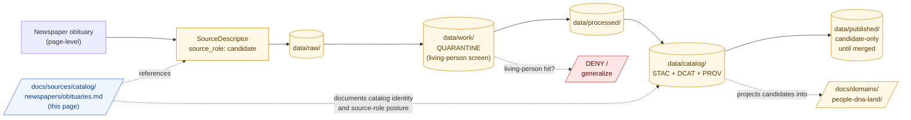

<!-- [KFM_META_BLOCK_V2]
doc_id: kfm://doc/docs-sources-catalog-newspapers-obituaries
title: Newspaper Obituaries
type: product-page
version: v0.2
status: draft
owners: <PLACEHOLDER — Docs steward + Source steward for newspapers>
created: 2026-05-20
updated: 2026-05-22
policy_label: public
related:
  - docs/sources/catalog/newspapers/README.md
  - docs/sources/catalog/README.md
  - docs/sources/catalog/newspapers/IDENTITY.md
  - docs/sources/catalog/newspapers/RIGHTS-AND-SENSITIVITY-MAP.md
  - docs/sources/catalog/newspapers/legal-notices.md
  - docs/doctrine/directory-rules.md
  - docs/domains/people-dna-land/README.md
  - docs/standards/PROV.md
  - docs/adr/ADR-0001-schema-home.md
tags: [kfm, docs, sources, catalog, newspapers, product-page, people-dna-land]
notes:
  - "PROPOSED product-page scaffold; sibling-link presence and repo path NEEDS VERIFICATION."
  - "PROPOSED path under docs/sources/catalog/newspapers/ — placement basis docs/doctrine/directory-rules.md §6.1."
  - "Default source_role is candidate (not authority) — obituaries are family-submitted, not vital-record evidence."
[/KFM_META_BLOCK_V2] -->

# Newspaper Obituaries

> Family-submitted obituary notices admitted as **administrative person-assertion candidates** — not as primary vital evidence, and never as authority for death, birth, or relationship claims.

[](#status)
[](#status)
[](#source-role-posture)
[](../../../domains/people-dna-land/README.md)
[](#rights-and-sensitivity)
[](../../../doctrine/directory-rules.md)
<!-- TODO: replace placeholder Shields.io targets once CI/badge generation is wired (see KFM-P3-FEAT-0005). -->

**Status:** PROPOSED — scaffold only · **Family:** [`newspapers`](./README.md) · **Default `source_role`:** `candidate` · **Owners:** *PLACEHOLDER — Docs steward + Source steward for newspapers* · **Last reviewed:** 2026-05-22

---

## Quick jump

- [Overview](#overview)
- [Source-role posture](#source-role-posture)
- [Repo fit](#repo-fit)
- [Source authority](#source-authority)
- [Catalog profiles used](#catalog-profiles-used)
- [Collection identity](#collection-identity)
- [Provenance fields](#provenance-fields)
- [Temporal handling](#temporal-handling)
- [Geometry and projection](#geometry-and-projection)
- [Rights and sensitivity](#rights-and-sensitivity)
- [Extraction targets and what they are not](#extraction-targets-and-what-they-are-not)
- [Validation and catalog closure](#validation-and-catalog-closure)
- [Related contracts and schemas](#related-contracts-and-schemas)
- [Related connectors and pipelines](#related-connectors-and-pipelines)
- [Examples](#examples)
- [Open questions](#open-questions)
- [Related docs](#related-docs)

---

## Overview

> [!NOTE]
> **PROPOSED scaffold.** This page describes a candidate product slice of the `newspapers` source family. Scope, cadence, geographic coverage, current endpoint URLs, rights terms, and license status are **NEEDS VERIFICATION** and must be settled against `data/registry/sources/` and current source endpoints before any catalog promotion.

**Product slice.** *Newspaper Obituaries* are family-submitted death notices and longer-form obituaries published in newspapers. They are biographical narratives prepared by relatives or funeral homes and printed largely as submitted; they are **not** vital records, not coroner determinations, and not parish or cemetery registers.

PROPOSED — three doctrinal anchors apply (CONFIRMED doctrine; PROPOSED implementation):

- **Source-role separation.** Per KFM-P17-IDEA-0004 (provenance-first historical source strategy), curated state collections, contextual monographs, and page-level newspapers are kept as **distinct evidence roles** so monographs, newspapers, and archival items do not collapse into one undifferentiated citation bucket. Obituaries are the *most fragile* end of the newspaper family — they must not collapse into vital-record authority.
- **Administrative compilation ≠ observation.** Per the Atlas master deny lane *"administrative compilation cited as observation,"* DENY publication of compilation as observed event timeline; preserve source-role tag and named `LifeEvent` / `AdminEvent` types.
- **Living-person deny-default.** Per the People / DNA / Land domain rule, living-person output is **denied or restricted by default**; assessor / probate / obituary records are **not** title or vital truth. Surviving relatives named in an obit fall under this rule even when the decedent does not.

This page is a **product-page**: it describes the slice's *catalog identity*, *profile usage*, *provenance fields*, *rights posture*, *extraction targets*, and *validation gates*. It is **not** a duplicate of the `SourceDescriptor`, the policy bundle, or the rights map — those live in their respective responsibility roots and are linked from here.

[↑ back to top](#newspaper-obituaries)

---

## Source-role posture

> [!CAUTION]
> **Default `source_role` for obituary items is `candidate`** (per Atlas Ch. 24.1.3, source-role vocabulary). An obituary is family-submitted prose; it is not authoritative for the facts it states. Promotion of any extracted claim (death date, birthdate, parentage, spouse, children, residence) requires either (a) corroborating evidence from an authoritative vital source, **or** (b) explicit retention of the `candidate` posture in the released artifact with `role_candidate_disposition: pending`.

| `source_role` candidate | When it applies to an obituary | Promotion gate |
|---|---|---|
| `candidate` | **Default.** Any extracted `Person Assertion`, `LifeEvent`, `Genealogy Relationship`, or `FamilyGroup` derived from obit prose. | `role_candidate_disposition` must move from `pending` to `merged` only after corroboration; **PUBLISHED edge forbidden until merged**. |
| `observation` | The transcribed page text itself ("this is what the page literally says"). | Carries less weight than vital records; never re-tagged `authority` for the underlying fact. |
| `administrative` | Funeral-home-syndicated notice databases redistributing obit content. | Preserve source-role tag; named `AdminEvent` rather than `LifeEvent` until merged. |
| `authority` | **Not applicable.** A newspaper obituary is never authority for death, birth, or relationship facts; the underlying vital record is. | — |

**Anti-collapse rule** (CONFIRMED doctrine; PROPOSED realization): an obit's claim about a birth date is **not** a primary source; the underlying birth certificate would be. The catalog must preserve this distinction in `source_role` and in the trust-membrane badge surfaced to readers.

---

## Repo fit

> [!IMPORTANT]
> **PROPOSED path.** This file is authored at `docs/sources/catalog/newspapers/obituaries.md`. Per `docs/doctrine/directory-rules.md` §6.1, `docs/sources/` is the home for source-descriptor standards and source-family documentation; the per-family `catalog/<family>/<product>.md` shape is **PROPOSED** and **NEEDS VERIFICATION** against current repo evidence and any per-family README convention.

| Direction | Neighbor | Relationship |
|---|---|---|
| **Upstream (parent)** | [`README.md`](./README.md) | Family-level orientation; this product is one slice of `newspapers`. |
| **Sibling** | [`IDENTITY.md`](./IDENTITY.md) | Collection-id and namespace rules for the family. |
| **Sibling** | [`RIGHTS-AND-SENSITIVITY-MAP.md`](./RIGHTS-AND-SENSITIVITY-MAP.md) | Family rights / sensitivity decisions; this page does **not** restate policy. |
| **Sibling** | [`legal-notices.md`](./legal-notices.md) | Different newspaper product slice (default role `authority`; useful contrast). |
| **Sibling** | [`_examples/`](./_examples/) | Illustrative STAC + `kfm:provenance` examples. |
| **Upstream (root)** | [`../README.md`](../README.md) | Catalog landing page. |
| **Cross-root (data)** | [`data/registry/sources/`](../../../../data/registry/sources/) | Authoritative `SourceDescriptor` home; not duplicated here. |
| **Cross-root (domain)** | [`docs/domains/people-dna-land/`](../../../domains/people-dna-land/) | Domain that owns Person Assertion, LifeEvent, FamilyGroup semantics. |
| **Doctrine** | [`docs/doctrine/directory-rules.md`](../../../doctrine/directory-rules.md) | Placement authority and lifecycle law. |



> [!NOTE]
> Diagram reflects the **lifecycle invariant** (CONFIRMED doctrine), the **mandatory living-person screen at QUARANTINE**, and the **candidate-only publication posture** for unmerged claims. Specific subpaths are PROPOSED until mounted-repo inspection confirms presence.

[↑ back to top](#newspaper-obituaries)

---

## Source authority

The authoritative `SourceDescriptor` for any obituary corpus lives in [`data/registry/sources/`](../../../../data/registry/sources/) (PROPOSED path per Directory Rules §6).

> [!WARNING]
> **Do not duplicate descriptor fields here.** This page references identity, role, rights, sensitivity, and cadence — it does not own them. If a field appears to disagree with the `SourceDescriptor`, the descriptor wins, and a drift entry should open in `docs/registers/DRIFT_REGISTER.md`.

PROPOSED — the descriptor for this slice should at minimum carry:

- `source_id` — stable identifier (e.g., title + jurisdiction + retrieval class)
- `source_role` — `candidate` by default; `observation` for transcribed text; **never** `authority` (see [Source-role posture](#source-role-posture))
- `role_candidate_disposition` — `pending` | `merged` | `rejected` | `quarantined`
- `authority` — publisher + jurisdiction (the *publisher* has authority over what was printed; not over what the printed claims assert)
- `rights` — license, redistribution terms, attribution requirements (modern obit aggregators frequently have restrictive licenses)
- `sensitivity` — tier per [`RIGHTS-AND-SENSITIVITY-MAP.md`](./RIGHTS-AND-SENSITIVITY-MAP.md)
- `cadence` — publication frequency and last-known-fresh date
- `ingest_hash` — content-addressable digest of the admitted payload

NEEDS VERIFICATION: actual `SourceDescriptor` schema field names and required-vs-optional status against `schemas/contracts/v1/source/` (per ADR-0001).

---

## Catalog profiles used

PROPOSED — obituary items map across the standard KFM-STAC / DCAT / PROV-O profile triad (per KFM-P1-PROG-0021 and KFM-P32-IDEA-0005). Which lanes this product actually emits is **NEEDS VERIFICATION**.

| Profile | Lane | Used by this product? | Notes |
|---|---|---|---|
| STAC 1.1 | `data/catalog/stac/` | PROPOSED — Yes (NEEDS VERIFICATION) | Page-level Items with `kfm:provenance`; Collection per [`IDENTITY.md`](./IDENTITY.md). |
| DCAT | `data/catalog/dcat/` | PROPOSED — Yes / No (NEEDS VERIFICATION) | Distribution mapping for downloadable corpora; see KFM-P26-PROG-0025. |
| PROV-O | `data/catalog/prov/` | PROPOSED — Yes (NEEDS VERIFICATION) | Captures `wasGeneratedBy`, `wasDerivedFrom`, `wasAttributedTo` for OCR + extraction steps. |
| Domain projection | `data/catalog/domain/people-dna-land/` | PROPOSED — partial (candidate-only) | Person Assertion / LifeEvent / FamilyGroup *candidates*; PUBLISHED edge forbidden until merged. |

> [!TIP]
> KFM-namespaced STAC extension fields (`kfm:run_receipt_ref`, `kfm:proof_ref`, `kfm:trust_class`, `kfm:source_role`) carry trust-membrane context across profiles. For obituaries, `kfm:source_role` is the most important — it tells downstream consumers that the carried claims are candidates, not authority.

[↑ back to top](#newspaper-obituaries)

---

## Collection identity

- **PROPOSED Collection ID pattern.** `kfm-<org>-<product>` — e.g., `kfm-<publisher-or-jurisdiction>-obituaries`. See sibling [`IDENTITY.md`](./IDENTITY.md) for the family-level rule.
- **PROPOSED namespace.** `kfm:` — pending resolution of *OPEN-DSC-03* (namespace canonicalization). NEEDS VERIFICATION.
- **PROPOSED Item ID rule.** Deterministic basis: `source_id + page_locator + temporal_scope + normalized_digest` (per the identity pattern recorded for evidence-bound objects in the People/DNA/Land domain).
- **Asset roles.** NEEDS VERIFICATION — confirm against `schemas/contracts/v1/source/`. Candidate roles: `image` (page raster), `ocr` (extracted text), `iiif` (IIIF manifest), `extraction` (structured NER output), `thumbnail`.

---

## Provenance fields

STAC `properties.kfm:provenance` block (PROPOSED — Pass-10 C4-01 / KFM-P3-IDEA-0004):

| Field | Resolves to | Required when | Notes |
|---|---|---|---|
| `spec_hash` | sha256 of the canonical record (JCS+SHA-256) | always | Anchors record identity. |
| `evidence_bundle_ref` | `kfm://evidence/<digest>` | claim-bearing items | Resolves to the EvidenceBundle backing any non-trivial assertion. |
| `run_record_ref` | `kfm://run/<run-id>` | always | Pins the orchestrated run that produced the artifact. |
| `audit_ref` | `kfm://audit/<attestation-id>` | promoted items | DSSE / Cosign attestation; surfaces under `kfm:proof_ref`. |
| `policy_digest` | sha256 of the policy bundle in force at promotion | promoted items | Lets reviewers reproduce the gate (living-person screen, redaction rules, etc.). |
| `source_role` | enum: `candidate` \| `observation` \| `administrative` | always | **Default `candidate`.** Never `authority` for an obituary. |
| `role_candidate_disposition` | enum: `pending` \| `merged` \| `rejected` \| `quarantined` | when `source_role = candidate` | PUBLISHED edge forbidden until `merged`. |

Per-asset integrity: STAC `file:checksum`.

> [!NOTE]
> NEEDS VERIFICATION — exact field names, requiredness, and the precise relationship between `kfm:provenance` (item-level) and `kfm:run_receipt_ref` / `kfm:proof_ref` (extension-level) need to be reconciled against the live `kfm-stac-extension.md` if one exists in the repo.

---

## Temporal handling

PROPOSED — obituary items must keep the standard KFM time roles **distinct where material** (CONFIRMED doctrine; per-product realization PROPOSED). Time-role collapse is a documented failure mode for this product slice:

| Time role | Meaning for an obituary | Status |
|---|---|---|
| `source_time` | Date the obituary was *printed* | PROPOSED |
| `observed_time` | Death date *stated in* the obit text (often within a day or two of `source_time`, but not always) | PROPOSED |
| `valid_time` | Period during which the asserted facts are claimed to hold (e.g., asserted residence) | PROPOSED |
| `retrieval_time` | When KFM ingested the source artifact | PROPOSED |
| `release_time` | When the catalog item was promoted | PROPOSED |
| `correction_time` | Time of any post-release correction (common: errata, "corrections" notices in later issues) | PROPOSED |

> [!WARNING]
> **Do not collapse `source_time` into `observed_time`.** Obituaries are sometimes printed days, weeks, or even years after the death (memorial notices, late-arriving notices, anniversary obits). The print date is not the death date. A test should fail closed on any item where `source_time` is set but `observed_time` is missing or silently copied from it.

NEEDS VERIFICATION — confirm time-role tests exist or are PROPOSED in `tests/`.

[↑ back to top](#newspaper-obituaries)

---

## Geometry and projection

PROPOSED — most obituary items carry **no intrinsic geometry**. Place names (birthplace, residence, burial location, funeral-home address) are extracted text, not geometry, and gain location only by joining to authoritative gazetteers (GNIS, AHCB historical boundaries) or to cemetery / settlement layers.

| Concern | Posture | Status |
|---|---|---|
| CRS | Inherits CRS from joined gazetteer / cemetery layer | NEEDS VERIFICATION |
| Generalization | Most placename joins → settlement or county centroid; finer locations gated by sensitivity | PROPOSED |
| Cemetery coordinates | Treated as sensitive geometry; default DENY for precise coords pending review | PROPOSED |
| Funeral-home / service-venue addresses | **DENY by default** — operational current-event detail; not historical context | PROPOSED |
| Residence-at-death | Treated as living-person-adjacent (surviving spouse, household members); generalize or restrict | PROPOSED |

NEEDS VERIFICATION — confirm against `data/catalog/` artifacts and policy rules in `policy/sensitivity/`.

---

## Rights and sensitivity

> [!IMPORTANT]
> **Do not restate policy here.** Sensitivity tier, redaction rules, and consent / reveal posture are decided in [`policy/sensitivity/`](../../../../policy/sensitivity/) and summarized in the sibling [`RIGHTS-AND-SENSITIVITY-MAP.md`](./RIGHTS-AND-SENSITIVITY-MAP.md). This section names the *kinds of risks* the product introduces, not the *decisions* taken against them.

Obituaries are among the **highest-risk** newspaper product slices for KFM because they routinely surface living-person information and family relationships. CONFIRMED doctrine: living-person and DNA-derived outputs are **denied or restricted by default** in People/DNA/Land.

PROPOSED risk surfaces — NEEDS VERIFICATION per product:

| Risk surface | Why it matters | Default posture |
|---|---|---|
| **Surviving relatives named** | Children, grandchildren, siblings, spouse routinely named; many may still be living. | DENY / generalize / age-gate per living-person policy; NEEDS VERIFICATION. |
| **Cause of death** | Sometimes stated (illness, accident); may be sensitive even for the deceased and stigmatizing for descendants. | Default redact / mask; review-gated reveal. |
| **Funeral arrangements / service venues** | Time-and-place detail; operational, not historical. | DENY for items still within the freshness window; consider time-gated release after a defined interval. |
| **Cemetery and burial location** | Precise burial coordinates can enable disturbance; some communities treat as sacred. | Generalize; route through the same gate as archaeological / cultural sensitivity. |
| **Aggregator licensing** | Modern obit databases (e.g., funeral-home syndicates) often have restrictive redistribution terms. | License-deny lane until rights confirmed (per Master MapLibre ML-062-016, license-deny policy). |
| **CARE / Indigenous community names** | Tribal affiliation, ceremonial roles, or community-sensitive content may appear. | CARE review required before promotion; consent / authority-to-control field per ML-062-033. |
| **OCR error propagation** | Names, dates, ages, and relationship terms are common OCR failure points; an OCR'd "son" vs "grandson" can corrupt a graph. | Retain raw page reference; abstain on uncertain transcription; `role_candidate_disposition: pending`. |
| **Living-person via descendants** | Even when the decedent is long dead, an obit naming "grandson John, of Topeka" can identify a living person. | Same deny-default as direct living-person hits. |

> [!CAUTION]
> CONFIRMED doctrine: *Unclear rights, unresolved source role, missing evidence, unresolved sensitivity, or absent release state blocks public promotion.* For obituaries, that bar is reached **frequently**. ABSTAIN and DENY are not failures of the product; they are the product working as designed.

---

## Extraction targets and what they are not

PROPOSED — typical extraction targets from obit prose, each as a **candidate** in the People / DNA / Land domain:

| Extracted object | KFM type | Default `source_role` | What it is **not** |
|---|---|---|---|
| Decedent name | `NameAssertion` (candidate) | `candidate` | Not a `PersonCanonical`; merging requires corroboration. |
| Death date | `LifeEvent: Death` (candidate) | `candidate` | Not a death certificate; not authority for the date. |
| Birth date | `LifeEvent: Birth` (candidate) | `candidate` | Often calculated from "age N at death"; not a birth certificate. |
| Parents named | `Genealogy Relationship` (candidate) | `candidate` | Not a verified relationship; spelling errors common. |
| Spouse(s) named | `Genealogy Relationship` (candidate) | `candidate` | Not a marriage record; preceding spouses often omitted. |
| Children listed | `FamilyGroup` (candidate) | `candidate` | Order and completeness are not authoritative; estranged children often omitted. |
| Place of birth / residence | `Residence Event` (candidate) | `candidate` | Placename text, not geometry; join to gazetteer required. |
| Military service | `LifeEvent: Military` (candidate) | `candidate` | Not a service record; ranks and units routinely misreported. |
| Funeral home / cemetery | venue reference | `administrative` | Not a burial record; treated as sensitive geometry. |

**Anti-collapse rule.** None of these candidates may be re-emitted with `source_role: authority`. Promotion to `PersonCanonical` or a confirmed `LifeEvent` requires evidence from an **independent authoritative source** (vital record, military service file, deed, etc.) and explicit merge with a recorded disposition.

[↑ back to top](#newspaper-obituaries)

---

## Validation and catalog closure

PROPOSED gates that apply to this product before public release:

- **Catalog closure required before public release** — DCAT, STAC, and PROV records must trace bundle identity, inputs, artifacts, checks, producer, and promotion metadata (per Pass-10 / KFM-P26-IDEA-0007, *Catalog closure across DCAT STAC PROV*). PROPOSED.
- **STAC Projection lint** — `proj:code`, `proj:bbox`, `proj:geometry`, `proj:shape`, `proj:transform` compliance for any geometry-bearing item (per KFM-P27-FEAT-0003). PROPOSED.
- **STAC checksum closure** — `file:checksum` values must match the ReleaseManifest digest (per KFM-P22-PROG-0037). PROPOSED.
- **Living-person screen at QUARANTINE** — any extracted person with insufficient evidence of decease must DENY public publication. PROPOSED.
- **Source-role anti-collapse test** — items must not silently re-emit obit-derived claims as `authority` (per KFM-P17-IDEA-0004). PROPOSED.
- **`role_candidate_disposition` gate** — any item with `pending`, `rejected`, or `quarantined` disposition is **forbidden** to carry a PUBLISHED edge (per Atlas Ch. 24.1.3). PROPOSED.
- **Time-role separation test** — `source_time` ≠ `observed_time` for at least one item in the corpus (negative-collapse fixture). PROPOSED.
- **License-deny lane** — items whose `rights` field is unknown or whose redistribution terms are unresolved are blocked from contentful delta emission (per ML-062-016). PROPOSED.

NEEDS VERIFICATION — confirm which of these are realized in `tests/`, `pipelines/validate/`, or CI workflows.

---

## Related contracts and schemas

| Artifact | PROPOSED path | Status |
|---|---|---|
| Source descriptor schema | `schemas/contracts/v1/source/` | NEEDS VERIFICATION — per ADR-0001. |
| Person Assertion / LifeEvent / FamilyGroup contracts | `schemas/contracts/v1/people/` | NEEDS VERIFICATION — owned by People/DNA/Land. |
| Sensitivity policy | `policy/sensitivity/people/` | NEEDS VERIFICATION — owned by policy/, not this page. |
| STAC extension reference | `docs/standards/PROV.md`, `kfm-stac-extension.md` | PROPOSED — *PROV.md* vs *PROVENANCE.md* pending ADR (Directory Rules §18 OPEN-DR-01). |
| Family-level contract notes | `contracts/sources/newspapers/` (PROPOSED) | NEEDS VERIFICATION. |

---

## Related connectors and pipelines

PROPOSED — typical wiring (NEEDS VERIFICATION per product):

- **Connector**: `connectors/newspapers/` (e.g., Chronicling America / IIIF connector; see KFM-P15-PROG-0033, Chronicling America OCR/IIIF event source).
- **Pipelines**: `pipelines/ingest/`, `pipelines/normalize/`, `pipelines/validate/`, `pipelines/catalog/`.
- **Pipeline spec**: `pipeline_specs/newspapers/` and a cross-pipeline link to `pipeline_specs/people-dna-land/` for the candidate-extraction stage.

> [!CAUTION]
> The watcher / connector **never publishes**. Source watchers emit `SourceIntakeRecord` or `DriftSummary`; `PromotionDecision` is what publishes — and only after the living-person screen, source-role check, license check, and corroboration disposition all pass.

---

## Examples

<details>
<summary><strong>Minimal STAC Item shape (illustrative, not authoritative)</strong></summary>

> [!NOTE]
> Illustrative only. Do **not** treat as the live schema. See [`_examples/stac-item-example.json`](../_examples/stac-item-example.json) for the canonical minimal shape once it lands. NEEDS VERIFICATION.

```json
{
  "type": "Feature",
  "stac_version": "1.1.0",
  "id": "kfm-<org>-obituaries/<page-locator>/<digest>",
  "collection": "kfm-<org>-obituaries",
  "properties": {
    "datetime": "<source_time>",
    "kfm:provenance": {
      "spec_hash": "sha256:<...>",
      "evidence_bundle_ref": "kfm://evidence/<digest>",
      "run_record_ref": "kfm://run/<run-id>",
      "audit_ref": "kfm://audit/<attestation-id>",
      "policy_digest": "sha256:<...>",
      "source_role": "candidate",
      "role_candidate_disposition": "pending"
    },
    "kfm:trust_class": "catalog"
  },
  "assets": {
    "image":      { "href": "...", "type": "image/jp2",        "roles": ["image"] },
    "ocr":        { "href": "...", "type": "text/plain",       "roles": ["data"] },
    "extraction": { "href": "...", "type": "application/json", "roles": ["data", "metadata"] }
  },
  "links": [
    { "rel": "collection",  "href": "../collection.json" },
    { "rel": "derived_from", "href": "kfm://source/<source_id>" }
  ]
}
```

</details>

<details>
<summary><strong>Illustrative source-role mapping for a single obituary</strong></summary>

| Element | `source_role` | Rationale |
|---|---|---|
| The printed obituary (page raster) | `observation` | KFM observed the publisher published this text; not an authority claim about the underlying facts. |
| OCR text extracted from the page | `observation` | Reading of what was printed. |
| Extracted decedent `Person Assertion` | `candidate` | Awaits corroboration before any merge to `PersonCanonical`. |
| Extracted parent / spouse / child relationships | `candidate` | Same. Disposition `pending` until corroborated. |
| AI-generated narrative summary | `model` or `synthetic` | Never the root truth; requires Reality Boundary Note; AIReceipt mandatory. |
| Funeral-home aggregator redistribution metadata | `administrative` | Compilation, not observation; named `AdminEvent`. |

</details>

<details>
<summary><strong>Illustrative quarantine reasons</strong></summary>

| Reason code | When it fires |
|---|---|
| `LIVING_PERSON_HIT` | Extracted person fails the "demonstrably deceased" check. |
| `LICENSE_UNRESOLVED` | `rights` field unknown or restrictive aggregator terms. |
| `SOURCE_ROLE_COLLAPSE_RISK` | Downstream consumer attempting to read candidate as authority. |
| `OCR_LOW_CONFIDENCE` | Critical fields (name, date, age) below OCR confidence threshold. |
| `TIME_ROLE_COLLAPSE` | `observed_time` silently copied from `source_time` without evidence. |
| `CARE_REVIEW_REQUIRED` | Tribal affiliation, ceremonial role, or community-sensitive content present. |

</details>

---

## Open questions

- **OPEN-OB-01** — Confirm cadence (continuous? per-newspaper?) and current endpoint URL(s) for any specific corpus.
- **OPEN-OB-02** — Confirm rights status (public-domain age threshold; aggregator redistribution terms; modern obit content is frequently under restrictive license).
- **OPEN-OB-03** — Confirm the "demonstrably deceased" check for the living-person screen — age-since-publication threshold, or evidence-based check, or both? NEEDS VERIFICATION against `policy/sensitivity/people/`.
- **OPEN-OB-04** — Confirm whether `cause of death` should ever be exposed even when present in source, or always redacted by default.
- **OPEN-OB-05** — Confirm CARE applicability path for Indigenous-community-named obits — separate gate, or unified with archaeology-style cultural-sensitivity review?
- **OPEN-OB-06** — Confirm whether obit `candidate` items should be exposed to the public at all (with clear "unverified" badges) or held back entirely until merged.
- **OPEN-OB-07** — Confirm whether this product warrants its **own** STAC Collection or shares one with sibling products in `newspapers/`.
- **OPEN-OB-08** — Inherits **OPEN-DSC-03** (namespace canonicalization) from family-level.
- **OPEN-OB-09** — Resolve `PROV.md` vs `PROVENANCE.md` reference target (Directory Rules §18 OPEN-DR-01).

---

## Related docs

- [`./README.md`](./README.md) — `newspapers` family landing page.
- [`./IDENTITY.md`](./IDENTITY.md) — Collection-id and namespace rules.
- [`./RIGHTS-AND-SENSITIVITY-MAP.md`](./RIGHTS-AND-SENSITIVITY-MAP.md) — Family rights / sensitivity decisions.
- [`./legal-notices.md`](./legal-notices.md) — Sibling product slice (`authority` default; useful contrast).
- [`./_examples/stac-item-example.json`](./_examples/stac-item-example.json) — Minimal STAC + `kfm:provenance` shape (illustrative).
- [`../README.md`](../README.md) — Catalog root.
- [`../../../domains/people-dna-land/README.md`](../../../domains/people-dna-land/README.md) — Domain owner of Person Assertion / LifeEvent / FamilyGroup semantics.
- [`../../../doctrine/directory-rules.md`](../../../doctrine/directory-rules.md) — Placement authority, lifecycle law, drift register.
- [`../../../standards/PROV.md`](../../../standards/PROV.md) — W3C PROV-O / PAV profile (naming reconciliation pending).
- [`../../../adr/ADR-0001-schema-home.md`](../../../adr/ADR-0001-schema-home.md) — Schema home rule.
- *TODO* — link to the `newspapers` connector README once authored.
- *TODO* — link to `kfm-stac-extension.md` once authored.
- *TODO* — link to the living-person screen policy bundle README once authored.

---

**Last reviewed:** 2026-05-22 *(Claude Code product-page revision session; v0.2 polish pass.)*
**Version:** v0.2 · **Status:** PROPOSED — scaffold only · **Default `source_role`:** `candidate` · **Owners:** *PLACEHOLDER*

[↑ back to top](#newspaper-obituaries)
