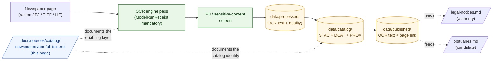

<!-- [KFM_META_BLOCK_V2]
doc_id: kfm://doc/docs-sources-catalog-newspapers-ocr-full-text
title: Newspaper OCR Full Text
type: product-page
version: v0.2
status: draft
owners: <PLACEHOLDER — Docs steward + Source steward for newspapers>
created: 2026-05-20
updated: 2026-05-22
policy_label: public
related:
  - docs/sources/catalog/newspapers/README.md
  - docs/sources/catalog/README.md
  - docs/sources/catalog/newspapers/IDENTITY.md
  - docs/sources/catalog/newspapers/RIGHTS-AND-SENSITIVITY-MAP.md
  - docs/sources/catalog/newspapers/legal-notices.md
  - docs/sources/catalog/newspapers/obituaries.md
  - docs/doctrine/directory-rules.md
  - docs/standards/PROV.md
  - docs/adr/ADR-0001-schema-home.md
tags: [kfm, docs, sources, catalog, newspapers, product-page, ocr, model-run]
notes:
  - "PROPOSED product-page scaffold; sibling-link presence and repo path NEEDS VERIFICATION."
  - "PROPOSED path under docs/sources/catalog/newspapers/ — placement basis docs/doctrine/directory-rules.md §6.1."
  - "Default source_role is observation (with mandatory ModelRunReceipt) — OCR text is a model's reading of the page, not the page itself."
[/KFM_META_BLOCK_V2] -->

# Newspaper OCR Full Text

> OCR-derived full text of newspaper pages — admitted as **observation of the page via a model run**, with a mandatory `ModelRunReceipt` pinning engine identity, version, parameters, and uncertainty for every pass.

[](#status)
[](#status)
[](#source-role-posture)
[-informational)](#receipts-and-transforms)
[](#reality-boundary)
[](../../../doctrine/directory-rules.md)
<!-- TODO: replace placeholder Shields.io targets once CI/badge generation is wired (see KFM-P3-FEAT-0005). -->

**Status:** PROPOSED — scaffold only · **Family:** [`newspapers`](./README.md) · **Default `source_role`:** `observation` (with `ModelRunReceipt`) · **Owners:** *PLACEHOLDER — Docs steward + Source steward for newspapers* · **Last reviewed:** 2026-05-22

---

## Quick jump

- [Overview](#overview)
- [Source-role posture](#source-role-posture)
- [Reality boundary](#reality-boundary)
- [Repo fit](#repo-fit)
- [Source authority](#source-authority)
- [Catalog profiles used](#catalog-profiles-used)
- [Collection identity](#collection-identity)
- [Provenance fields](#provenance-fields)
- [Receipts and transforms](#receipts-and-transforms)
- [Quality and uncertainty](#quality-and-uncertainty)
- [Temporal handling](#temporal-handling)
- [Geometry and projection](#geometry-and-projection)
- [Rights and sensitivity](#rights-and-sensitivity)
- [Downstream consumers](#downstream-consumers)
- [Validation and catalog closure](#validation-and-catalog-closure)
- [Related contracts and schemas](#related-contracts-and-schemas)
- [Related connectors and pipelines](#related-connectors-and-pipelines)
- [Examples](#examples)
- [Open questions](#open-questions)
- [Related docs](#related-docs)

---

## Overview

> [!NOTE]
> **PROPOSED scaffold.** This page describes a candidate product slice of the `newspapers` source family. Scope, cadence, geographic coverage, current endpoint URLs, rights terms, and license status are **NEEDS VERIFICATION** and must be settled against `data/registry/sources/` and current source endpoints before any catalog promotion.

**Product slice.** *Newspaper OCR Full Text* is the page-level transcribed text produced by running an Optical Character Recognition engine over a newspaper page raster. It is the **enabling layer** for every downstream extraction product in the `newspapers` family (legal notices, obituaries, named-entity events, full-text search), and as such carries the dominant share of upstream error budget.

PROPOSED — three doctrinal anchors apply (CONFIRMED doctrine; PROPOSED implementation):

- **OCR text is observation of the page via a model run.** Per KFM-P15-PROG-0033 (Chronicling America and LOC services admitted as OCR, image, IIIF, and visual-metadata source families *for NER-to-event extraction with rights propagation*), OCR is the upstream input to extraction. The text is what a model read; it is not the page, and it is not authority for any fact the text states.
- **`ModelRunReceipt` is mandatory.** Per Atlas Ch. 24.2.1, a `ModelRunReceipt` pins model identity, version, inputs, parameters, run time, uncertainty surface reference, and validation reference. CONFIRMED doctrine: *if no receipt exists, the operation did not happen in the governed sense.*
- **Rights propagate from the page.** OCR does not alter the copyright status of the underlying page. Public-domain pages produce publishable OCR; restricted pages produce restricted OCR. The OCR engine's own output terms are a separate (typically minor) layer to record.

This page is a **product-page**: it describes the slice's *catalog identity*, *profile usage*, *provenance fields*, *receipt requirements*, *quality posture*, *rights propagation*, and *validation gates*. It is **not** a duplicate of the `SourceDescriptor`, the policy bundle, or the rights map — those live in their respective responsibility roots and are linked from here.

[↑ back to top](#newspaper-ocr-full-text)

---

## Source-role posture

> [!CAUTION]
> **Default `source_role` for OCR items is `observation`** (per Atlas Ch. 24.1.3, source-role vocabulary). The OCR text observes what is on the page; it is not authority for the facts the page asserts. Downstream consumers that treat OCR text as authority — for a death date, a land patent boundary, an election result — violate the cite-or-abstain rule.

| `source_role` candidate | When it applies to an OCR item | Promotion gate |
|---|---|---|
| `observation` | **Default.** The OCR text itself — "this is what the model read on the page." | `ModelRunReceipt` present; quality threshold met; rights inherited from page. |
| `modeled` | The OCR pass treated as a modeled product (quality assessment, language detection, layout segmentation outputs). | `ModelRunReceipt` with `model_id`, `model_version`, `parameters`, `uncertainty_surface_ref`, `validation_ref`. |
| `candidate` | Anything **extracted from** the OCR text (NER results, structured fields, dates, names). | Handled by downstream product (e.g., [`obituaries.md`](./obituaries.md)); not this product. |
| `authority` | **Not applicable.** OCR text is never authority for an underlying-page fact; the page raster + the underlying source author are. | — |
| `synthetic` | **Not applicable.** OCR text is a reading of a real page, not a generated surface. (Compare: an AI-generated *summary* of the OCR text would be `synthetic`.) | — |

**Anti-collapse rule** (CONFIRMED doctrine; PROPOSED realization): OCR text must not be promoted to `authority`, and an extracted structured field must not be promoted to `observation` of the page. The catalog must preserve `kfm:source_role` across every derivation hop.

---

## Reality boundary

> [!IMPORTANT]
> **OCR text is not the page.** It is a model's reading of the page. Three common failure modes follow directly from this:
>
> 1. **Character-level errors** — `1865` mis-read as `1855`; `Sr.` as `St.`; `Wm.` as `Win.`. Years, ages, and initials are routinely wrong.
> 2. **Word- and layout-level errors** — columns merged across gutters; tables flattened into prose; captions injected into body text.
> 3. **Language- and script-level errors** — Fraktur, Spanish-language, Cherokee-syllabary, or hand-set 19th-century types degrade OCR accuracy non-trivially.
>
> Per the GLO field-notes workflow (KFM-P2-PROG-0011) the canonical KFM pattern is: **page raster → OCR → PII screen → structured extraction**. Each hop must carry its own receipt, and downstream consumers must read `kfm:trust_class` before citing.

CONFIRMED doctrine: *AI text treated as evidence → DENY publication; ABSTAIN at Focus Mode; AIReceipt mandatory.* OCR is not AI prose, but the same reality-boundary discipline applies — Focus Mode and Evidence Drawer surfaces must cite the **page** (with the OCR text as a reading aid), not the OCR text as if it were the page.

[↑ back to top](#newspaper-ocr-full-text)

---

## Repo fit

> [!IMPORTANT]
> **PROPOSED path.** This file is authored at `docs/sources/catalog/newspapers/ocr-full-text.md`. Per `docs/doctrine/directory-rules.md` §6.1, `docs/sources/` is the home for source-descriptor standards and source-family documentation; the per-family `catalog/<family>/<product>.md` shape is **PROPOSED** and **NEEDS VERIFICATION** against current repo evidence and any per-family README convention.

| Direction | Neighbor | Relationship |
|---|---|---|
| **Upstream (parent)** | [`README.md`](./README.md) | Family-level orientation; this product is one slice of `newspapers`. |
| **Sibling** | [`IDENTITY.md`](./IDENTITY.md) | Collection-id and namespace rules for the family. |
| **Sibling** | [`RIGHTS-AND-SENSITIVITY-MAP.md`](./RIGHTS-AND-SENSITIVITY-MAP.md) | Family rights / sensitivity decisions; this page does **not** restate policy. |
| **Sibling** | [`legal-notices.md`](./legal-notices.md) | Downstream consumer of OCR text (`authority` default). |
| **Sibling** | [`obituaries.md`](./obituaries.md) | Downstream consumer of OCR text (`candidate` default). |
| **Sibling** | [`_examples/`](./_examples/) | Illustrative STAC + `kfm:provenance` examples. |
| **Upstream (root)** | [`../README.md`](../README.md) | Catalog landing page. |
| **Cross-root (data)** | [`data/registry/sources/`](../../../../data/registry/sources/) | Authoritative `SourceDescriptor` home; not duplicated here. |
| **Doctrine** | [`docs/doctrine/directory-rules.md`](../../../doctrine/directory-rules.md) | Placement authority and lifecycle law. |



> [!NOTE]
> Diagram reflects the **canonical KFM OCR pattern** (page raster → OCR → PII screen → structured extraction; per KFM-P2-PROG-0011 GLO field-notes pattern). Specific subpaths are PROPOSED until mounted-repo inspection confirms presence.

[↑ back to top](#newspaper-ocr-full-text)

---

## Source authority

The authoritative `SourceDescriptor` for any OCR corpus lives in [`data/registry/sources/`](../../../../data/registry/sources/) (PROPOSED path per Directory Rules §6). For OCR specifically the descriptor is paired with — but does not replace — the underlying page-raster descriptor.

> [!WARNING]
> **Do not duplicate descriptor fields here.** This page references identity, role, rights, sensitivity, and cadence — it does not own them. If a field appears to disagree with the `SourceDescriptor`, the descriptor wins, and a drift entry should open in `docs/registers/DRIFT_REGISTER.md`.

PROPOSED — the descriptor for this slice should at minimum carry:

- `source_id` — stable identifier (e.g., title + jurisdiction + retrieval class + OCR engine version)
- `source_role` — `observation` by default; `modeled` for the quality-assessment layer; **never** `authority` for an underlying-page fact (see [Source-role posture](#source-role-posture))
- `role_model_run_ref` — `EvidenceRef → ModelRunReceipt` (**MUST** when role includes `modeled`; **SHOULD** for every `observation` produced by OCR to make the engine traceable)
- `authority` — the upstream page-raster source (the publisher) — *not* the OCR engine
- `rights` — license, redistribution terms, attribution requirements; OCR output inherits the page's rights (see [Rights and sensitivity](#rights-and-sensitivity))
- `sensitivity` — tier per [`RIGHTS-AND-SENSITIVITY-MAP.md`](./RIGHTS-AND-SENSITIVITY-MAP.md)
- `cadence` — re-OCR cadence (engine upgrades, parameter changes, rerun policy)
- `ingest_hash` — content-addressable digest of the admitted OCR output

NEEDS VERIFICATION: actual `SourceDescriptor` schema field names and required-vs-optional status against `schemas/contracts/v1/source/` (per ADR-0001).

---

## Catalog profiles used

PROPOSED — OCR items map across the standard KFM-STAC / DCAT / PROV-O profile triad (per KFM-P1-PROG-0021 and KFM-P32-IDEA-0005). Which lanes this product actually emits is **NEEDS VERIFICATION**.

| Profile | Lane | Used by this product? | Notes |
|---|---|---|---|
| STAC 1.1 | `data/catalog/stac/` | PROPOSED — Yes (NEEDS VERIFICATION) | Page-level Items pairing the page raster Asset with an `ocr` text Asset; `kfm:provenance` block carries the ModelRunReceipt ref. |
| DCAT | `data/catalog/dcat/` | PROPOSED — Yes / No (NEEDS VERIFICATION) | Distribution mapping for downloadable text corpora; see KFM-P26-PROG-0025. |
| PROV-O | `data/catalog/prov/` | PROPOSED — **Yes (required)** | PROV-O explicitly required: the OCR pass is a `prov:Activity` with `wasGeneratedBy` linking to the engine, `wasDerivedFrom` linking to the page raster, and `used` linking to the engine parameters. |
| Domain projection | `data/catalog/domain/<domain>/` | PROPOSED — **No** | OCR text itself is a cross-domain enabling layer; domain projection happens at the **extraction** stage, not here. |

> [!TIP]
> KFM-namespaced STAC extension fields (`kfm:run_receipt_ref`, `kfm:proof_ref`, `kfm:trust_class`, `kfm:source_role`) carry trust-membrane context across profiles. For OCR, `kfm:run_receipt_ref` is the most important — it resolves to the `ModelRunReceipt` for this OCR pass.

[↑ back to top](#newspaper-ocr-full-text)

---

## Collection identity

- **PROPOSED Collection ID pattern.** `kfm-<org>-<product>` — e.g., `kfm-<publisher-or-jurisdiction>-ocr-full-text`. See sibling [`IDENTITY.md`](./IDENTITY.md) for the family-level rule.
- **PROPOSED namespace.** `kfm:` — pending resolution of *OPEN-DSC-03* (namespace canonicalization). NEEDS VERIFICATION.
- **PROPOSED Item ID rule.** Deterministic basis: `source_id + page_locator + ocr_engine_version + parameters_digest + temporal_scope + normalized_digest`. The **engine version and parameters digest** are part of identity — re-OCR with a different engine or parameter set produces a **new Item**, not an updated one.
- **Asset roles.** NEEDS VERIFICATION — confirm against `schemas/contracts/v1/source/`. Candidate roles: `image` (page raster), `ocr` (extracted text, plain), `ocr-alto` (ALTO XML with coordinates), `ocr-hocr` (hOCR), `iiif` (IIIF manifest), `quality` (confidence scores), `thumbnail`.

---

## Provenance fields

STAC `properties.kfm:provenance` block (PROPOSED — Pass-10 C4-01 / KFM-P3-IDEA-0004):

| Field | Resolves to | Required when | Notes |
|---|---|---|---|
| `spec_hash` | sha256 of the canonical record (JCS+SHA-256) | always | Anchors record identity. |
| `evidence_bundle_ref` | `kfm://evidence/<digest>` | claim-bearing items | Resolves to the EvidenceBundle backing any non-trivial assertion. |
| `run_record_ref` | `kfm://run/<run-id>` | always | Pins the orchestrated run that produced the artifact. |
| `model_run_ref` | `kfm://model-run/<id>` → `ModelRunReceipt` | **always for OCR** | Pins the OCR engine identity, version, parameters, uncertainty, and validation. |
| `audit_ref` | `kfm://audit/<attestation-id>` | promoted items | DSSE / Cosign attestation; surfaces under `kfm:proof_ref`. |
| `policy_digest` | sha256 of the policy bundle in force at promotion | promoted items | Lets reviewers reproduce the gate (PII screen, language detection, etc.). |
| `source_role` | enum: `observation` \| `modeled` | always | **Default `observation`.** Never `authority` for an underlying-page fact. |

Per-asset integrity: STAC `file:checksum` for **every** asset (page raster, OCR text, ALTO/hOCR, quality, thumbnail).

> [!NOTE]
> NEEDS VERIFICATION — exact field names and the precise relationship between `kfm:provenance.model_run_ref` and the STAC-extension `kfm:run_receipt_ref` need to be reconciled against the live `kfm-stac-extension.md` if one exists in the repo.

---

## Receipts and transforms

CONFIRMED doctrine: *KFM uses receipts to make consequential transformations inspectable.* OCR is a consequential transformation. The mandatory receipt for an OCR pass is the `ModelRunReceipt` (per Atlas Ch. 24.2.1).

| Receipt | Triggered by | Required content (PROPOSED shape) |
|---|---|---|
| **`SourceDescriptor`** (anchor, not a receipt) | Source admission of the page-raster + OCR-corpus identity. | `source_id`, `source_role`, `authority`, `rights`, `sensitivity`, `cadence`, `ingest_hash`, `time`, `citation`. |
| **`ModelRunReceipt`** *(mandatory for OCR)* | Every OCR pass. | `model_id` (engine), `model_version`, `inputs[]` (page raster ref + parameters), `parameters` (DPI, language, deskew, layout-segmentation flags), `run_time`, `uncertainty_surface_ref` (per-page confidence), `validation_ref` (golden-page diff). |
| **`TransformReceipt`** | Image preprocessing applied to the page raster before OCR (deskew, denoise, color-normalize). | `input_geom_hash`, `output_geom_hash` (here: image hash), `transform`, `parameters`, `tolerance`, `timestamp`, `actor`. |
| **`RedactionReceipt`** | PII / sensitive-content removal from OCR text. | `policy_ref`, `redaction_method`, `kept_fields`, `removed_fields`, `geometry_transform` (n/a for text), `reviewer`. |
| **`ValidationReport`** | WORK → PROCESSED and PROCESSED → CATALOG transitions. | `validator_id`, `target`, `passes[]`, `failures[]`, `time`, `deterministic_inputs`. |

> [!CAUTION]
> A re-OCR pass with a different engine version, model parameters, or preprocessing transform **produces a new Item**, not an update. The `ModelRunReceipt` is part of the Item's identity; silently overwriting an OCR Asset with a different model's output violates the `source_role` anti-collapse rule.

---

## Quality and uncertainty

PROPOSED — OCR output carries quality metrics as first-class data, not as a soft hint. NEEDS VERIFICATION — exact field shapes against any existing quality schema.

| Metric | Granularity | Use |
|---|---|---|
| **Per-character confidence** | character | Downstream confidence-weighted search; flagging suspect tokens. |
| **Per-word confidence** | word | Token-level NER abstain gates. |
| **Per-line confidence** | line | Layout-failure detection. |
| **Per-page average confidence** | page | Page-level quality badge; re-OCR triggers. |
| **Layout segmentation rate** | page | Column/region success rate; tables vs. body. |
| **Language-detection confidence** | page / region | Routing to language-specific engines. |
| **Golden-page diff** | engine-version comparison | Validation against a fixed golden set; produces `validation_ref`. |

> [!TIP]
> Quality metrics drive a **freshness-style badge** (per KFM-P3-FEAT-0005, badge family for trust / gate / freshness / source-role) — but the badge says "this is how the *model read* the page," not "this is how reliable the underlying *page* is." Two distinct trust axes.

[↑ back to top](#newspaper-ocr-full-text)

---

## Temporal handling

PROPOSED — OCR items have a **simpler** temporal profile than legal notices or obituaries because the OCR pass observes the page rather than reporting an external event. The page's `source_time` (publication date) is what matters; `observed_time` typically does not apply at the OCR layer (it applies at the *extraction* layer).

| Time role | Meaning for an OCR item | Status |
|---|---|---|
| `source_time` | Date the **page** was printed | PROPOSED |
| `observed_time` | **Not applicable at OCR layer.** Events the page reports about have their own observed times, but those belong to extracted objects, not the OCR text. | PROPOSED (intentionally null) |
| `valid_time` | **Not applicable at OCR layer.** | PROPOSED (intentionally null) |
| `retrieval_time` | When KFM ingested the page raster | PROPOSED |
| `ocr_run_time` | **When the OCR pass ran** — distinct from retrieval; engine and parameters may have changed since retrieval | PROPOSED |
| `release_time` | When the OCR catalog item was promoted | PROPOSED |
| `correction_time` | Time of any post-release correction (re-OCR with corrected parameters, manual transcription override) | PROPOSED |

> [!WARNING]
> **Do not collapse `retrieval_time` and `ocr_run_time`.** A corpus may be retrieved once and re-OCR'd repeatedly as engines improve. Each OCR pass needs its own `ModelRunReceipt` and a distinct `ocr_run_time`.

NEEDS VERIFICATION — confirm time-role tests exist or are PROPOSED in `tests/`.

---

## Geometry and projection

PROPOSED — OCR text itself carries **no intrinsic geographic geometry**. Two distinct geometry-adjacent surfaces exist and should not be confused:

| Surface | What it is | Status |
|---|---|---|
| **Page coordinate geometry** (ALTO/hOCR bounding boxes) | Pixel- or layout-coordinate bounds for words and lines within the page raster | PROPOSED — useful for downstream extraction; not geographic. |
| **Geographic geometry** | Placename text extracted from OCR and joined to gazetteers (GNIS, AHCB) | PROPOSED — owned by the downstream **extraction** product, not OCR. |

| Concern | Posture | Status |
|---|---|---|
| Geographic CRS | **Not applicable at OCR layer.** | n/a |
| Page coordinate units | Pixels, IIIF coordinate space, or printer's-measure points | NEEDS VERIFICATION per engine. |
| IIIF coordinate alignment | OCR bounding boxes must align to the page raster IIIF coordinate system the downstream Asset uses | PROPOSED. |

NEEDS VERIFICATION — confirm against any ALTO/hOCR schema fixtures in `tests/` or `fixtures/`.

---

## Rights and sensitivity

> [!IMPORTANT]
> **Do not restate policy here.** Sensitivity tier, redaction rules, and consent / reveal posture are decided in [`policy/sensitivity/`](../../../../policy/sensitivity/) and summarized in the sibling [`RIGHTS-AND-SENSITIVITY-MAP.md`](./RIGHTS-AND-SENSITIVITY-MAP.md). This section names the *kinds of risks* the product introduces, not the *decisions* taken against them.

**Rights inherit from the page.** OCR does not change the copyright status of the underlying page. The OCR pipeline must propagate the page's rights into every OCR Asset (per KFM-P15-PROG-0033, "OCR, image, IIIF, and visual-metadata source families for NER-to-event extraction *with rights propagation*").

PROPOSED risk surfaces — NEEDS VERIFICATION per product:

| Risk surface | Why it matters | Default posture |
|---|---|---|
| **Page copyright inherits to OCR** | OCR of a still-in-copyright page is still subject to that copyright. | License-deny lane until rights confirmed (per Master MapLibre ML-062-016). |
| **PII surfaced by OCR** | Names, ages, addresses are routinely surfaced; OCR makes a previously hard-to-search corpus easily searchable. | Mandatory PII screen between OCR and downstream consumption (per KFM-P2-PROG-0011 GLO field-notes pattern). |
| **Errors propagating to downstream products** | An OCR error of `1855 → 1865` falsifies every downstream extracted date. | Confidence-gated extraction; abstain on low-confidence tokens. |
| **Aggregator output terms** | Some OCR engines / hosted services have their own output-use terms. | Record OCR engine output terms separately; rarely dominant, but never assumed away. |
| **CARE / Indigenous community names** | Tribal affiliations, ceremonial roles, or community-sensitive content surfaces via OCR; the page may have been considered "obscure" but is now searchable. | CARE review required before promotion of indexed text (per ML-062-033). |
| **Operationally current detail** | Modern newspapers carry addresses, phone numbers, current event detail. | Default DENY for items within a configurable freshness window. |

> [!CAUTION]
> CONFIRMED doctrine: *Unclear rights, unresolved source role, missing evidence, unresolved sensitivity, or absent release state blocks public promotion.* OCR text amplifies discoverability — sensitivity decisions made for unindexed pages may not survive OCR; **re-review** is warranted whenever a previously unindexed corpus enters the OCR lane.

---

## Downstream consumers

OCR text is the **upstream** to most other `newspapers` products. The catalog should make this lineage explicit via PROV-O links and via `kfm:source_role` propagation.

| Downstream product | What it extracts from OCR | Its default `source_role` |
|---|---|---|
| [`legal-notices.md`](./legal-notices.md) | Structured legal-notice records (land patents, sheriff's sales, election proclamations) | `authority` for the published notice; `observation` for the OCR'd text. |
| [`obituaries.md`](./obituaries.md) | Person assertions, life events, family groups | `candidate` (never `authority`). |
| *(future)* Full-text search index | Token / phrase index | `observation`; surfaced as a search affordance, not as a citation. |
| *(future)* NER-to-event extraction | Named entities (Persons, Places, Organizations, Events) | `candidate` until corroborated. |
| Focus Mode answers | Bounded evidence context | `AIReceipt` mandatory; cite the **page**, not the OCR text. |

[↑ back to top](#newspaper-ocr-full-text)

---

## Validation and catalog closure

PROPOSED gates that apply to this product before public release:

- **Catalog closure required before public release** — DCAT, STAC, and PROV records must trace bundle identity, inputs, artifacts, checks, producer, and promotion metadata (per Pass-10 / KFM-P26-IDEA-0007). PROPOSED.
- **STAC Projection lint** — applies only to any geometry-bearing companion Assets (e.g., page raster footprint), not to OCR text itself. PROPOSED.
- **STAC checksum closure** — `file:checksum` for every Asset must match the ReleaseManifest digest (per KFM-P22-PROG-0037). PROPOSED.
- **`ModelRunReceipt` presence test** — every OCR Item must carry a resolvable `model_run_ref`. Items with missing / dangling receipts fail closed. **PROPOSED, MANDATORY**.
- **Engine-version-in-identity test** — re-OCR with a different engine must produce a new Item; silent in-place asset overwrite fails closed. PROPOSED.
- **PII screen presence test** — published OCR text must be downstream of a `RedactionReceipt` or an explicit "no PII required" decision recorded in policy. PROPOSED.
- **Quality threshold test** — per-page confidence below a configurable threshold routes the Item to QUARANTINE rather than to PUBLISHED. PROPOSED.
- **Rights propagation test** — OCR Asset `rights` must match the page-raster Asset `rights`; mismatch fails closed. PROPOSED.
- **Source-role anti-collapse test** — items must not re-emit OCR-derived claims as `authority` (per KFM-P17-IDEA-0004). PROPOSED.
- **License-deny lane** — items whose `rights` field is unknown are blocked from contentful delta emission (per ML-062-016). PROPOSED.

NEEDS VERIFICATION — confirm which of these are realized in `tests/`, `pipelines/validate/`, or CI workflows.

---

## Related contracts and schemas

| Artifact | PROPOSED path | Status |
|---|---|---|
| Source descriptor schema | `schemas/contracts/v1/source/` | NEEDS VERIFICATION — per ADR-0001. |
| `ModelRunReceipt` schema | `schemas/contracts/v1/receipts/model-run-receipt.schema.json` | PROPOSED — per Atlas Ch. 24.2 default receipt home. |
| `TransformReceipt` schema | `schemas/contracts/v1/receipts/transform-receipt.schema.json` | PROPOSED. |
| `RedactionReceipt` schema | `schemas/contracts/v1/receipts/redaction-receipt.schema.json` | PROPOSED. |
| STAC extension reference | `docs/standards/PROV.md`, `kfm-stac-extension.md` | PROPOSED — *PROV.md* vs *PROVENANCE.md* pending ADR (Directory Rules §18 OPEN-DR-01). |
| Family-level contract notes | `contracts/sources/newspapers/` (PROPOSED) | NEEDS VERIFICATION. |

---

## Related connectors and pipelines

PROPOSED — typical wiring (NEEDS VERIFICATION per product):

- **Connector**: `connectors/newspapers/` (e.g., Chronicling America / IIIF connector; per KFM-P15-PROG-0033). The connector fetches **pages**, not OCR — OCR runs in pipelines.
- **OCR pipeline**: `pipelines/normalize/ocr/` (PROPOSED) — produces OCR text + ALTO/hOCR + quality, emits `ModelRunReceipt`.
- **PII screen pipeline**: `pipelines/validate/pii/` (PROPOSED) — emits `RedactionReceipt`.
- **Catalog pipeline**: `pipelines/catalog/` — produces STAC / DCAT / PROV records.
- **Pipeline spec**: `pipeline_specs/newspapers/ocr/` (PROPOSED).

> [!CAUTION]
> The watcher / connector **never publishes**. Source watchers emit `SourceIntakeRecord` or `DriftSummary`; `PromotionDecision` is what publishes — and only after `ModelRunReceipt` presence, PII screen, quality threshold, and rights propagation all pass.

---

## Examples

<details>
<summary><strong>Minimal STAC Item shape (illustrative, not authoritative)</strong></summary>

> [!NOTE]
> Illustrative only. Do **not** treat as the live schema. See [`_examples/stac-item-example.json`](../_examples/stac-item-example.json) for the canonical minimal shape once it lands. NEEDS VERIFICATION.

```json
{
  "type": "Feature",
  "stac_version": "1.1.0",
  "id": "kfm-<org>-ocr-full-text/<page-locator>/<engine-version>/<digest>",
  "collection": "kfm-<org>-ocr-full-text",
  "properties": {
    "datetime": "<source_time>",
    "kfm:provenance": {
      "spec_hash": "sha256:<...>",
      "evidence_bundle_ref": "kfm://evidence/<digest>",
      "run_record_ref": "kfm://run/<run-id>",
      "model_run_ref": "kfm://model-run/<id>",
      "audit_ref": "kfm://audit/<attestation-id>",
      "policy_digest": "sha256:<...>",
      "source_role": "observation"
    },
    "kfm:trust_class": "catalog",
    "kfm:ocr": {
      "engine": "<engine-id>",
      "engine_version": "<semver>",
      "language": "eng",
      "page_confidence_mean": 0.93,
      "layout_segmentation_rate": 0.98
    }
  },
  "assets": {
    "image":    { "href": "...", "type": "image/jp2",         "roles": ["image"] },
    "ocr":      { "href": "...", "type": "text/plain",        "roles": ["data"] },
    "ocr-alto": { "href": "...", "type": "application/xml",   "roles": ["data", "metadata"] },
    "quality":  { "href": "...", "type": "application/json",  "roles": ["metadata"] }
  },
  "links": [
    { "rel": "collection",  "href": "../collection.json" },
    { "rel": "derived_from", "href": "kfm://source/<page-source_id>" },
    { "rel": "via",          "href": "kfm://model-run/<id>" }
  ]
}
```

</details>

<details>
<summary><strong>Illustrative <code>ModelRunReceipt</code> shape for an OCR pass (PROPOSED)</strong></summary>

```json
{
  "receipt_class": "ModelRunReceipt",
  "model_id": "<ocr-engine-name>",
  "model_version": "<semver>",
  "inputs": [
    { "ref": "kfm://source/<page-source_id>", "asset_role": "image" }
  ],
  "parameters": {
    "language": "eng",
    "dpi": 400,
    "deskew": true,
    "layout_segmentation": "auto",
    "preprocessing": ["denoise", "color-normalize"]
  },
  "run_time": "<iso-8601>",
  "uncertainty_surface_ref": "kfm://artifact/<quality-json-digest>",
  "validation_ref": "kfm://artifact/<golden-diff-digest>"
}
```

</details>

<details>
<summary><strong>Illustrative quarantine reasons</strong></summary>

| Reason code | When it fires |
|---|---|
| `MODEL_RUN_RECEIPT_MISSING` | OCR Item lacks a resolvable `model_run_ref`. |
| `RIGHTS_PROPAGATION_MISMATCH` | OCR Asset `rights` ≠ page-raster Asset `rights`. |
| `PII_SCREEN_NOT_RUN` | Published OCR text is not downstream of a `RedactionReceipt` or an explicit no-PII decision. |
| `OCR_QUALITY_BELOW_THRESHOLD` | Per-page confidence below the configured threshold. |
| `LANGUAGE_DETECTION_FAILED` | Engine could not confidently identify the page language. |
| `LAYOUT_SEGMENTATION_FAILED` | Columns merged / tables flattened; routed for re-OCR or manual review. |
| `ENGINE_VERSION_OVERWRITE_ATTEMPT` | Item identity collision: a different engine version is attempting to overwrite an existing Item rather than create a new one. |
| `CARE_REVIEW_REQUIRED` | OCR surfaced Indigenous-community-sensitive content; routed to CARE review. |

</details>

---

## Open questions

- **OPEN-OCR-01** — Confirm cadence (per-corpus initial pass; re-OCR cadence on engine upgrades) and current endpoint URL(s) for any specific corpus.
- **OPEN-OCR-02** — Confirm rights propagation rule when the upstream page is public-domain but the OCR engine output carries its own terms (e.g., hosted-OCR providers).
- **OPEN-OCR-03** — Confirm the engine-version-in-identity rule: should `engine_version` be part of the STAC Item `id`, or part of `kfm:provenance`, or both?
- **OPEN-OCR-04** — Confirm CARE applicability for previously unindexed corpora that become searchable post-OCR — does OCR-as-discoverability-event itself trigger a CARE review?
- **OPEN-OCR-05** — Confirm the per-page confidence threshold for QUARANTINE routing and whether it varies by historical period (19th-century Fraktur and column layouts have lower expected baselines).
- **OPEN-OCR-06** — Confirm whether ALTO XML and hOCR should both be required Assets, or one canonical and the other optional.
- **OPEN-OCR-07** — Confirm whether this product warrants its **own** STAC Collection or shares one with sibling page-raster products in `newspapers/`.
- **OPEN-OCR-08** — Inherits **OPEN-DSC-03** (namespace canonicalization) from family-level.
- **OPEN-OCR-09** — Resolve `PROV.md` vs `PROVENANCE.md` reference target (Directory Rules §18 OPEN-DR-01).

---

## Related docs

- [`./README.md`](./README.md) — `newspapers` family landing page.
- [`./IDENTITY.md`](./IDENTITY.md) — Collection-id and namespace rules.
- [`./RIGHTS-AND-SENSITIVITY-MAP.md`](./RIGHTS-AND-SENSITIVITY-MAP.md) — Family rights / sensitivity decisions.
- [`./legal-notices.md`](./legal-notices.md) — Downstream consumer (`authority` default).
- [`./obituaries.md`](./obituaries.md) — Downstream consumer (`candidate` default).
- [`./_examples/stac-item-example.json`](./_examples/stac-item-example.json) — Minimal STAC + `kfm:provenance` shape (illustrative).
- [`../README.md`](../README.md) — Catalog root.
- [`../../../doctrine/directory-rules.md`](../../../doctrine/directory-rules.md) — Placement authority, lifecycle law, drift register.
- [`../../../standards/PROV.md`](../../../standards/PROV.md) — W3C PROV-O / PAV profile (naming reconciliation pending).
- [`../../../adr/ADR-0001-schema-home.md`](../../../adr/ADR-0001-schema-home.md) — Schema home rule.
- *TODO* — link to the `newspapers` connector README once authored.
- *TODO* — link to `kfm-stac-extension.md` once authored.
- *TODO* — link to the `ModelRunReceipt` schema README once authored.
- *TODO* — link to the PII screen pipeline README once authored.

---

**Last reviewed:** 2026-05-22 *(Claude Code product-page revision session; v0.2 polish pass.)*
**Version:** v0.2 · **Status:** PROPOSED — scaffold only · **Default `source_role`:** `observation` (with mandatory `ModelRunReceipt`) · **Owners:** *PLACEHOLDER*

[↑ back to top](#newspaper-ocr-full-text)
