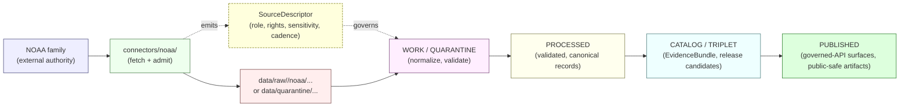

<!-- [KFM_META_BLOCK_V2]
doc_id: kfm://doc/sources-catalog-noaa
title: NOAA Source Family — Catalog Entry
type: standard
version: v1
status: draft
owners: TODO — Docs steward + Hazards domain steward + Atmosphere/Air/Climate domain steward
created: TODO-YYYY-MM-DD
updated: TODO-YYYY-MM-DD
policy_label: public
related:
  - docs/sources/SOURCE_DESCRIPTOR_STANDARD.md
  - docs/domains/hazards/README.md
  - docs/domains/atmosphere/README.md
  - docs/doctrine/lifecycle-law.md
  - docs/doctrine/trust-membrane.md
  - docs/doctrine/directory-rules.md
  - schemas/contracts/v1/source/source_descriptor.schema.json
  - connectors/noaa/README.md
  - policy/release/hazards/
tags: [kfm, sources, noaa, hazards, atmosphere, weather, climate, hms, nws, storm-events]
notes:
  - Path `docs/sources/catalog/` is PROPOSED — Directory Rules §6.1 lists `docs/sources/` for "source-descriptor standards, source families" but does not enumerate a `catalog/` subdirectory.
  - Confirm with Docs steward before merging; alternative homes include `docs/sources/families/noaa.md` or a flat `docs/sources/noaa.md`.
[/KFM_META_BLOCK_V2] -->

# NOAA Source Family — Catalog Entry

> Catalog entry for the **National Oceanic and Atmospheric Administration (NOAA)** source family as governed inside Kansas Frontier Matrix (KFM). Doctrine, source-role posture, domains served, sensitivity controls, and lifecycle obligations — not a connector, not a release, not an alert authority.


| Field | Value |
|---|---|
| **Document role** | Source-family catalog entry under `docs/sources/` |
| **Authority of these contents** | Reflects current KFM doctrine; specific paths and field names remain `PROPOSED` until verified in the mounted repo. |
| **Status** | `draft` |
| **Owners** | _TODO — Docs steward + Hazards domain steward + Atmosphere/Air/Climate domain steward._ |
| **Last updated** | _TODO — set on first review pass._ |
| **Path classification** | `PROPOSED` (see [§ Repo fit](#repo-fit) and Section 2 notes) |

> [!IMPORTANT]
> **KFM is not an emergency alerting system.** Per the Hazards domain and the Sensitive / Deny-by-Default Register, KFM publishes NOAA-derived material as **historical, analytical, or contextual evidence only**, with explicit redirection to official sources for any life-safety action. NWS warnings/advisories/watches enter KFM under a `contextual-only` posture, never as KFM-issued alerts.

---

## Quick navigation

- [1. Scope](#1-scope)
- [2. Repo fit](#repo-fit)
- [3. Inputs — sub-sources within the NOAA family](#3-inputs--sub-sources-within-the-noaa-family)
- [4. Exclusions](#4-exclusions)
- [5. Source-role assignments](#5-source-role-assignments)
- [6. Domains served](#6-domains-served)
- [7. Lifecycle posture (RAW → PUBLISHED)](#7-lifecycle-posture-raw--published)
- [8. Sensitivity, rights, and publication posture](#8-sensitivity-rights-and-publication-posture)
- [9. Required artifacts and governance hooks](#9-required-artifacts-and-governance-hooks)
- [10. Validators and tests](#10-validators-and-tests)
- [11. Open questions & verification backlog](#11-open-questions--verification-backlog)
- [12. Related docs](#12-related-docs)
- [Appendix A — Source-role field crosswalk](#appendix-a--source-role-field-crosswalk-proposed)
- [Appendix B — Glossary](#appendix-b--glossary)

---

## 1. Scope

NOAA covers a wide and heterogeneous family of products. In KFM, the NOAA family is treated as a **multi-role source family**, not a single source — different NOAA products carry different `source_role` assignments and feed different domains.

What this document is:

- A **catalog entry** describing what the NOAA family is, what KFM admits from it, and under what governance.
- A **pointer hub** to the canonical `SourceDescriptor` schema home, the connector, the relevant domain dossiers, and the policy lanes that govern NOAA-derived publication.
- A **doctrine restatement** so reviewers can recognize NOAA-specific failure modes (e.g., NWS advisories rebroadcast as KFM alerts; storm-event records misread as observed inundation; HMS smoke polygons published as emergency guidance).

What this document is **not**:

- Not a connector. The fetch-and-admit code lives under `connectors/noaa/` (CONFIRMED placement per Directory Rules §7.3; specific file presence is `PROPOSED` until repo-verified).
- Not the canonical `SourceDescriptor`. That schema's home defaults to `schemas/contracts/v1/source/source_descriptor.schema.json` per ADR-0001.
- Not a release manifest, layer descriptor, or policy bundle.
- Not an alert authority.

[Back to top ↑](#noaa-source-family--catalog-entry)

---

## Repo fit

> [!NOTE]
> Per **Directory Rules §6.1**, `docs/sources/` is the human-facing home for "source-descriptor standards, source families." A `catalog/` subdirectory under `docs/sources/` is **`PROPOSED`** — it is not explicitly enumerated in Directory Rules and should be confirmed (or relocated) before this entry is published. See Section 2 of the accompanying notes for migration options.

### Where NOAA lives across the repo (PROPOSED placements)

| Responsibility | Path | Status | Rule |
|---|---|---|---|
| Human-facing source-family catalog entry (this doc) | `docs/sources/catalog/noaa.md` | `PROPOSED` | Directory Rules §6.1 (extension) |
| Source-descriptor standard (cross-source) | `docs/sources/SOURCE_DESCRIPTOR_STANDARD.md` | `PROPOSED` | Directory Rules §6.1 |
| Canonical SourceDescriptor schema | `schemas/contracts/v1/source/source_descriptor.schema.json` | `PROPOSED` | ADR-0001 (schema-home) |
| Operational source register (per-family entries) | `data/registry/sources/<domain>/` and `data/registry/source_descriptors/` | `PROPOSED` | Directory Rules §7.4 / lifecycle phase rules |
| NOAA-specific fetch and admission | `connectors/noaa/` | `CONFIRMED` rule / `PROPOSED` presence | Directory Rules §7.3 |
| Source-family release/sensitivity policy | `policy/release/hazards/`, `policy/release/atmosphere/` (or per-source lanes) | `PROPOSED` | Directory Rules §6 / policy split |
| RAW lifecycle landing | `data/raw/<domain>/noaa/<run_id>/` or `data/quarantine/...` | `CONFIRMED` rule | Directory Rules §7.3 lifecycle invariant |
| Connector validators | `tools/validators/connector_gate/`, `tools/validators/source_descriptor/` | `PROPOSED` | Directory Rules §7.5 |

### Upstream / downstream



[Back to top ↑](#noaa-source-family--catalog-entry)

---

## 3. Inputs — sub-sources within the NOAA family

KFM admits NOAA inputs as **distinct sub-sources**, each with its own `SourceDescriptor`, source role, rights posture, sensitivity class, and freshness expectation. Lumping them into a single "NOAA" descriptor is a `SOURCE_ROLE_COLLAPSE` anti-pattern (see [§ 5](#5-source-role-assignments)).

The following sub-sources are named in KFM doctrine for the Hazards and Atmosphere/Air/Climate domains. Specific endpoint URLs, parameter shapes, and rate limits are **NEEDS VERIFICATION** and live under the connector, not here.

| Sub-source | Doctrinal label | Domains served | KFM source-role usage | Status in source ledger |
|---|---|---|---|---|
| NOAA Storm Events (NCEI-style records) | Historical severe-weather catalog | Hazards | **observed** (event records) with `regulatory_context` aside where applicable | `NEEDS VERIFICATION` rights/cadence |
| NWS API (forecasts, alerts, watches, warnings, advisories) | `EXT-NWS` in the external source ledger | Hazards, Atmosphere/Air/Climate | **contextual only** — warnings/advisories ingested as `AdvisoryContext` / `WarningContext`, **never** as KFM-issued alerts | `EXTERNALLY CHECKED` — supports forecast/alert/observation **context**; **cannot prove** KFM is an emergency alerting system |
| NOAA HMS Fire and Smoke | Operational fire/smoke analysis product | Hazards (smoke), Atmosphere/Air/Climate (smoke context) | **modeled / observed** (mixed; product-internal); cite-as-modeled when in doubt | `NEEDS VERIFICATION` rights/cadence |
| NOAA/NWS station observations & climate products (normals, anomalies, model fields) | Mesonet-adjacent network observations and gridded products | Atmosphere/Air/Climate | **observed** (stations) and **modeled** (model/reanalysis); **aggregate** for climate normals | `NEEDS VERIFICATION` per-product |
| (other NOAA products) | _e.g., precipitation-frequency atlases, drought monitor partners, radar mosaics_ | Hazards, Atmosphere/Air/Climate | Per-product; **must not be inferred from NOAA family alone** | `UNKNOWN` until admitted with a SourceDescriptor |

> [!CAUTION]
> The list above is **not exhaustive** and **not authoritative**. The authoritative inventory of admitted NOAA sub-sources is the `data/registry/sources/...` register, not this doc. If a NOAA product is not in the register with an active `SourceDescriptor`, it is not admitted, regardless of what this catalog entry mentions.

[Back to top ↑](#noaa-source-family--catalog-entry)

---

## 4. Exclusions

What does **not** belong here, and where it goes instead:

| If it's about… | Place it under |
|---|---|
| The shape of a SourceDescriptor field | `schemas/contracts/v1/source/source_descriptor.schema.json` (ADR-0001) |
| The standard governing all source families | `docs/sources/SOURCE_DESCRIPTOR_STANDARD.md` (`PROPOSED`) |
| Connector code, polling cadence, ETag logic, run receipts | `connectors/noaa/` + `data/receipts/...` |
| Admission decisions for a specific NOAA product | `data/registry/sources/<domain>/` (operational register) |
| Whether to release a NOAA-derived layer publicly | `policy/release/<domain>/` |
| Sensitivity/rights for a specific feature class | `policy/sensitivity/<domain>/` |
| Hazard domain doctrine (object families, map layers, AI behavior) | `docs/domains/hazards/` |
| Atmosphere/Air/Climate domain doctrine | `docs/domains/atmosphere/` |
| Tile generation, MapLibre styling, PMTiles output | `packages/maplibre/`, `pipelines/publish/`, `data/published/pmtiles/` |
| Run receipts, ingest receipts | `data/receipts/ingest/` |

[Back to top ↑](#noaa-source-family--catalog-entry)

---

## 5. Source-role assignments

KFM treats **source role as a first-class identity attribute**. An observed reading is not interchangeable with a modeled estimate; a regulatory determination is not interchangeable with an administrative compilation; an aggregate publication is not interchangeable with candidate evidence. The lifecycle and the governed API both fail closed when these roles are conflated.

NOAA is the family **most likely** to be misclassified across these boundaries because:

- NWS alerts can look like observations to a downstream renderer.
- HMS smoke polygons can look like observed smoke to a casual viewer.
- Climate normals can look like per-place values when joined to a county polygon.

### 5.1 Canonical source roles relevant to NOAA

| Role | NOAA-family example | KFM citation rule |
|---|---|---|
| **observed** | Storm Events records of a tornado touchdown; station temperature reading | Cite as observation; never relabel as regulatory or aggregate. |
| **regulatory-context** *(see note)* | NWS warnings/watches/advisories viewed as KFM evidence | Cite as **contextual only**, with official-source redirection. KFM never re-issues them. |
| **modeled** | NWS gridded forecast; smoke trajectory model; HMS-derived analysis | Cite with model identity + `ModelRunReceipt`; never labeled an observation. |
| **aggregate** | Climate normal (1991–2020), decadal anomaly | Cite with `AggregationReceipt`; never treated as a per-place record. |
| **candidate** | Unmerged or quarantined NOAA admission | Cite only in `WORK / QUARANTINE`; forbidden on `PUBLISHED`. |
| **synthetic** | _N/A for NOAA admissions._ Synthetic reconstructions are not NOAA outputs. | If anything synthetic is ever wrapped around a NOAA input, it requires a Reality Boundary Note and Representation Receipt. |

> [!NOTE]
> "Regulatory-context" above is shorthand. NWS advisories/watches/warnings are **issued by NWS as authoritative public-safety communications**. KFM neither rebroadcasts them as KFM-issued alerts nor treats them as KFM's own regulatory determinations. They enter KFM as `AdvisoryContext` / `WarningContext` evidence with `not-for-life-safety` posture and explicit official-source redirection.

### 5.2 Anti-collapse failures KFM denies for the NOAA family

| Collapse | Denied outcome | Required guardrail |
|---|---|---|
| NWS advisory rebroadcast as a KFM alert | `DENY` at trust membrane; UI fails closed | `not-for-life-safety` disclaimer; issue/expiry freshness; official-source redirect |
| Modeled forecast labeled as observed | `DENY` at publication; `ABSTAIN` at AI surface | `ModelRunReceipt` + uncertainty surface + role-preserving DTO field |
| HMS smoke analysis labeled as observed smoke | `DENY` at publication if role unverified | Source-role tag preserved; banner in UI; per-product source descriptor |
| Climate normal cited as a per-place truth | `DENY` join from aggregate cell to single record; `ABSTAIN` at AI | `AggregationReceipt` + geometry-scope guard |
| Storm Events record cited as observed flood inundation | `DENY` until separate flood-inundation evidence exists | Separate regulatory-layer and observed-event lanes; per-event evidence closure |

[Back to top ↑](#noaa-source-family--catalog-entry)

---

## 6. Domains served

NOAA inputs feed **two primary domains** in KFM doctrine, with adjacencies into Hydrology, Agriculture, and Habitat.

```mermaid
flowchart TD
    NOAA["NOAA source family"]
    HAZ["Hazards [DOM-HAZ]"]
    AIR["Atmosphere / Air / Climate [DOM-AIR]"]
    HYD["Hydrology<br/>(adjacency — joins)"]
    AG["Agriculture<br/>(adjacency — weather/drought)"]
    HAB["Habitat<br/>(adjacency — smoke/heat stress)"]

    NOAA -->|Storm Events, NWS<br/>warnings (context), HMS| HAZ
    NOAA -->|NWS station obs,<br/>forecasts, climate normals| AIR
    HAZ -.->|hazard-hydrology joins| HYD
    AIR -.->|weather → ag baselines| AG
    AIR -.->|smoke / heat context| HAB

    classDef noaa fill:#cdf,stroke:#247;
    classDef dom fill:#dfd,stroke:#272;
    classDef adj fill:#eee,stroke:#777,stroke-dasharray: 3 3;
    class NOAA noaa;
    class HAZ,AIR dom;
    class HYD,AG,HAB adj;
```

### 6.1 Per-domain object families NOAA evidence supports

| Domain | Object families fed by NOAA (CONFIRMED doctrine; specific schema presence `PROPOSED`) |
|---|---|
| Hazards | `HazardEvent`, `HazardObservation`, `WarningContext`, `AdvisoryContext`, `SmokeContext`, `WildfireDetection` (where HMS contributes), `HazardTimeline`, `ImpactArea` |
| Atmosphere / Air / Climate | `WeatherStation`, `WeatherObservation`, `WindField`, `PrecipitationObservation`, `TemperatureObservation`, `ClimateNormal`, `ClimateAnomaly`, `ForecastContext`, `AdvisoryContext`, `SmokeContext` |

[Back to top ↑](#noaa-source-family--catalog-entry)

---

## 7. Lifecycle posture (RAW → PUBLISHED)

The KFM lifecycle invariant is **governance, not storage organization**. Promotion is a governed state transition, not a file move. NOAA admissions follow the standard lifecycle.

| Phase | NOAA-specific handling | Gate (CONFIRMED rule / `PROPOSED` implementation) |
|---|---|---|
| `raw/` | Source-edge capture (e.g., raw NWS API response, raw Storm Events CSV/JSON, raw HMS shapefile/KMZ) with retrieval metadata (ETag, Last-Modified, request URL), checksums, and a SourceDescriptor. | `SourceDescriptor` exists; ingest receipt written. |
| `work/` / `quarantine/` | Normalize schema, geometry, time, units. Quarantine on unresolved rights, unresolved sensitivity, schema drift, over-precise geometry, or stale advisory state. Warning feeds default **disabled or contextual-only** in domain fixtures. | Validation + policy gate pass, or quarantine reason recorded. |
| `processed/` | Validated, canonical, role-tagged records: `HazardEvent`, `WeatherObservation`, `AdvisoryContext`, `SmokeContext`, etc. | `EvidenceRef`, `ValidationReport`, digest closure. |
| `catalog/` / `triplets/` | STAC/DCAT/PROV records, `EvidenceBundle`s, graph projections, release candidates. NOAA's role-mixing means catalog records must preserve `source_role` and (where modeled) `role_model_run_ref`. | Catalog/proof closure. |
| `published/` | Governed-API surfaces (`/api/v1/layers`, `/api/v1/evidence/{bundle_id}`, etc.), public-safe layer manifests, PMTiles. Public clients **must** consume governed APIs, **not** RAW or canonical stores directly. | `ReleaseManifest`, correction path, rollback target, review/policy state all exist. |

> [!TIP]
> The hazards domain's **"first credible thin slice"** is documented as a historical flood/severe-weather event fixture plus NFHL context and exposure summary, **with warning feeds disabled or contextual-only**. NOAA admissions for hazard-event evidence should follow that same pattern: lean on historical Storm Events records and explicit `AdvisoryContext` framing rather than on live-warning rebroadcast.

[Back to top ↑](#noaa-source-family--catalog-entry)

---

## 8. Sensitivity, rights, and publication posture

### 8.1 Rights

| Aspect | Posture |
|---|---|
| Distribution | NOAA products are generally U.S. government works in the public domain, but **per-product rights and current terms remain `NEEDS VERIFICATION`** in the KFM source register (doctrine: rights uncertainty blocks public release). |
| Attribution | Required per the source register's `attribution` field; renderer-side attribution display tests apply. |
| Sub-product caveats | Some NOAA products embed third-party data with separate terms. The connector must capture rights on a **per-sub-source** basis, not at the family level. |

### 8.2 Sensitivity classes (Sensitive / Deny-by-Default Register)

| Class triggered by NOAA admissions | Default outcome | Required controls |
|---|---|---|
| **Emergency warning misuse** (operational warnings, forecasts, hazard instructions) | `DENY` life-safety replacement; **contextual-only** with official-source redirection | `not-for-life-safety` disclaimer; issue/expiry freshness tracked |
| **Source-rights-limited records** (any NOAA-embedded record with uncertain terms) | `DENY` public release until terms resolved | rights register entry; attribution; no public derivative if barred |
| **Stale source / stale warning** | Stale source badge in Evidence Drawer; stale warning denial in hazards | Re-admit or supersede; mark dependent claims stale |

### 8.3 The doctrinal red line

> [!WARNING]
> **KFM does not act as an emergency alerting system.** This is doctrine, not preference. The Hazards mission explicitly excludes life-safety alerting; the Atmosphere/Air/Climate mission explicitly excludes replacing official advisories. The Sensitive / Deny-by-Default Register lists "Emergency warning misuse" as a `DENY` class. NOAA-derived layers that drift toward live-warning rebroadcast must be quarantined and a `CorrectionNotice` issued.

[Back to top ↑](#noaa-source-family--catalog-entry)

---

## 9. Required artifacts and governance hooks

Every admitted NOAA sub-source must produce or reference the following, before any `PUBLISHED` edge can exist for content derived from it.

<details>
<summary><strong>Required objects (click to expand)</strong></summary>

| Object | Purpose (CONFIRMED doctrine) | NOAA-specific note |
|---|---|---|
| `SourceDescriptor` | Records source identity, rights, role, sensitivity, cadence at admission. | One descriptor **per sub-source**, not one for the whole NOAA family. |
| `RunReceipt` / ingest receipt | Records the actual fetch operation (URL, request headers, ETag, Last-Modified, content-length, spec_hash). | Conditional GETs (ETag/If-None-Match) preferred. |
| `EvidenceRef` → `EvidenceBundle` | Resolves claims to source evidence. | Must resolve before any public claim authority. |
| `ValidationReport` | Schema, geometry, temporal, rights, sensitivity, evidence checks. | Per-sub-source validators; fails closed on high-risk ambiguity. |
| `PolicyDecision` | `ALLOW` / `RESTRICT` / `DENY` / `ABSTAIN` / `ERROR` for the operation. | `DENY` by default for live-warning rebroadcast. |
| `DecisionEnvelope` | Finite-outcome envelope at governed-API boundaries. | Required at every `/api/v1/...` boundary. |
| `LayerManifest` | Declares public-safe map layer, fields, styles, evidence hooks, policy badges. | Must carry `rights_statement`, `license_spdx`, `attribution`, review status. |
| `ReleaseManifest` + `RollbackCard` | Release decision and rollback target. | Per release, not per file. |
| `CorrectionNotice` | Public correction lineage linked to a claim/release. | Used when an NOAA-derived release is later found stale, mislabeled, or rights-limited. |
| `AggregationReceipt` | Pins geometry-scope when an aggregate (e.g., climate normal) is published. | MUST exist when `source_role = aggregate`. |
| `ModelRunReceipt` | Pins inputs, parameters, and version for any modeled product. | MUST exist when `source_role = modeled` (e.g., forecasts, model fields, HMS-derived analyses). |
| `RedactionReceipt` | Records public-safe transforms when sensitivity demands. | Less commonly triggered for NOAA than for archaeology/fauna/people; still required if KFM joins NOAA inputs against sensitive features. |

</details>

[Back to top ↑](#noaa-source-family--catalog-entry)

---

## 10. Validators and tests

Tests prove the doctrine is enforceable. The following are `PROPOSED` validator families required for any NOAA sub-source to reach `PUBLISHED`.

- Schema validation against `schemas/contracts/v1/source/source_descriptor.schema.json` (and the relevant domain schemas).
- Source-role-mismatch denial: an NWS advisory cited as observation, a model field cited as observation, a climate normal cited per-place — each must `DENY`.
- Stale-warning denial: an advisory past its issue/expiry window must not appear on a public surface as live.
- Rights-unknown blocks release: missing or unresolved rights fail closed at the policy gate.
- `not-for-life-safety` banner presence on any NOAA-derived warning/advisory context layer.
- Citation validation: every `EvidenceRef` in a published NOAA-derived claim must resolve to an admissible `EvidenceBundle`.
- No-network fixtures: a deterministic, offline NOAA fixture exists for each sub-source (no live calls in CI).
- Rollback drill: at least one rehearsed rollback per NOAA release lane.

> [!NOTE]
> Test homes live under `tests/` and `fixtures/` per Directory Rules §5; specific test paths are `NEEDS VERIFICATION` until the repo is mounted.

[Back to top ↑](#noaa-source-family--catalog-entry)

---

## 11. Open questions & verification backlog

| # | Question | Label | Owner placeholder |
|---|---|---|---|
| 1 | Is `docs/sources/catalog/` the correct home, or should this live at `docs/sources/families/noaa.md` or flat at `docs/sources/noaa.md`? | `NEEDS VERIFICATION` (Directory Rules) | Docs steward |
| 2 | What is the authoritative inventory of admitted NOAA sub-sources (Storm Events, NWS API, HMS, etc.) at the moment? | `UNKNOWN` until the source register is inspected | Hazards + Atmosphere stewards |
| 3 | Are the rights/current terms for each NOAA sub-source recorded with a rights statement and license SPDX, per release-gate requirement? | `NEEDS VERIFICATION` | Source-registry steward |
| 4 | Does the `connectors/noaa/` package currently implement conditional GETs (ETag / If-None-Match) for all NOAA sub-sources? | `NEEDS VERIFICATION` | Connector owner |
| 5 | Is there a per-sub-source `not-for-life-safety` banner test wired into the governed-API responses for NOAA-derived layers? | `PROPOSED` | UI / governed-API owner |
| 6 | Where do NOAA-derived `AggregationReceipt`s live for climate normals — under `data/receipts/` or `data/proofs/`? | `NEEDS VERIFICATION` | Catalog / release steward |
| 7 | Is there an ADR governing the `source_role` enum exactly as `observed | regulatory | modeled | aggregate | administrative | candidate | synthetic`, or are the field names still proposed? | `NEEDS VERIFICATION` (ADR-0001 covers schema home, not role enum specifically) | Schema steward |

[Back to top ↑](#noaa-source-family--catalog-entry)

---

## 12. Related docs

- `docs/sources/SOURCE_DESCRIPTOR_STANDARD.md` _(PROPOSED — cross-source descriptor standard)_
- `docs/domains/hazards/README.md` _(Hazards domain dossier)_
- `docs/domains/atmosphere/README.md` _(Atmosphere/Air/Climate domain dossier)_
- `docs/doctrine/directory-rules.md` _(this catalog entry's placement authority)_
- `docs/doctrine/lifecycle-law.md` _(RAW → … → PUBLISHED invariant)_
- `docs/doctrine/trust-membrane.md` _(public-API-only consumption rule)_
- `docs/doctrine/truth-posture.md` _(cite-or-abstain)_
- `docs/adr/ADR-0001-schema-home.md` _(schema-home convention)_
- `schemas/contracts/v1/source/source_descriptor.schema.json` _(PROPOSED — canonical SourceDescriptor)_
- `connectors/noaa/README.md` _(NOAA-specific connector docs)_
- `policy/release/hazards/` _(release policy for hazard-derived layers)_
- `policy/sensitivity/` _(deny-by-default register implementation)_

> [!NOTE]
> Anchors above assume the proposed `docs/sources/catalog/noaa.md` location. If this file lands elsewhere (`docs/sources/families/noaa.md`, `docs/sources/noaa.md`, etc.), inbound links from sibling docs and the registers will need to be updated together.

[Back to top ↑](#noaa-source-family--catalog-entry)

---

## Appendix A — Source-role field crosswalk (PROPOSED)

Excerpted from KFM Atlas v1.1 §24.1.3. Field names below are `PROPOSED` shape; actual SourceDescriptor field names are `NEEDS VERIFICATION` against the mounted schema. Names are reproduced verbatim to preserve KFM terminology.

| Field | Type / vocabulary | Required when | NOAA-family note |
|---|---|---|---|
| `source_role` | enum: `observed \| regulatory \| modeled \| aggregate \| administrative \| candidate \| synthetic` | always (MUST) | Set at admission; never edited in-place. NOAA family spans `observed`, `regulatory`, `modeled`, `aggregate`. |
| `role_authority` | string (issuing body / model identity / steward) | when role ∈ {regulatory, modeled, aggregate} | For NWS warnings, NWS is the issuing authority — KFM is not. |
| `role_aggregation_unit` | geometry-scope token (county, HUC, tract, year, decade, etc.) | when `source_role = aggregate` | Climate normals and decadal anomalies must pin a unit. |
| `role_model_run_ref` | `EvidenceRef` → `ModelRunReceipt` | when `source_role = modeled` | NWS forecast grids, HMS analyses, model fields. |
| `role_synthetic_basis` | structured `{ method, inputs, reality_boundary_note_ref }` | when `source_role = synthetic` | Not expected for NOAA admissions. |
| `role_candidate_disposition` | enum: `pending \| merged \| rejected \| quarantined` | when `source_role = candidate` | Used for NOAA records caught in quarantine before merge. |

[Back to top ↑](#noaa-source-family--catalog-entry)

---

## Appendix B — Glossary

| Term | Working definition (CONFIRMED doctrine) |
|---|---|
| `SourceDescriptor` | The admission record for a source: identity, role, rights, sensitivity, cadence, citation, ingest hash, time. Anchors every downstream receipt. |
| `EvidenceRef` / `EvidenceBundle` | Reference and its resolved evidence package. Public claims require both. |
| `AdvisoryContext` / `WarningContext` | KFM object families that wrap NWS-style advisories/warnings as **contextual** evidence, never as KFM-issued alerts. |
| `HazardEvent` / `HazardObservation` | Hazards-domain object families that receive NOAA Storm Events records (and similar) under `source_role = observed`. |
| `ClimateNormal` / `ClimateAnomaly` | Atmosphere/Air/Climate object families that receive NOAA climate products under `source_role = aggregate`, with `AggregationReceipt`. |
| `ModelRunReceipt` | Receipt pinning model identity, inputs, parameters, version when `source_role = modeled`. Required for NWS forecasts, HMS-derived analyses, and other model fields. |
| `AggregationReceipt` | Receipt pinning geometry-scope and aggregation method when `source_role = aggregate`. |
| Trust membrane | Doctrine that public clients consume only governed APIs and released payloads — never RAW, WORK, QUARANTINE, canonical stores, or unpublished candidates. |
| Lifecycle invariant | `RAW → WORK / QUARANTINE → PROCESSED → CATALOG / TRIPLET → PUBLISHED`. Promotion is a governed state transition, not a file move. |

[Back to top ↑](#noaa-source-family--catalog-entry)

---

**Related docs:** [hazards domain](../../domains/hazards/README.md) · [atmosphere domain](../../domains/atmosphere/README.md) · [source descriptor standard](../SOURCE_DESCRIPTOR_STANDARD.md) · [directory rules](../../doctrine/directory-rules.md)
**Last updated:** _TODO — set on first review pass._
[Back to top ↑](#noaa-source-family--catalog-entry)
