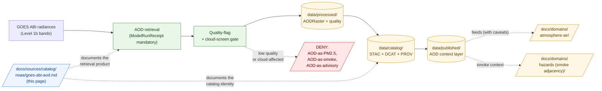

<!-- [KFM_META_BLOCK_V2]
doc_id: kfm://doc/docs-sources-catalog-noaa-goes-abi-aod
title: GOES ABI Aerosol Optical Depth
type: product-page
version: v0.2
status: draft
owners: <PLACEHOLDER — Docs steward + Source steward for noaa + Atmosphere/Air/Climate domain steward>
created: 2026-05-21
updated: 2026-05-22
policy_label: public
related:
  - docs/sources/catalog/noaa/README.md
  - docs/sources/catalog/noaa/IDENTITY.md
  - docs/sources/catalog/noaa/RIGHTS-AND-SENSITIVITY-MAP.md
  - docs/sources/catalog/README.md
  - docs/sources/catalog/newspapers/ocr-full-text.md
  - docs/domains/atmosphere/README.md
  - docs/domains/hazards/README.md
  - docs/doctrine/directory-rules.md
  - docs/standards/PROV.md
  - docs/adr/ADR-0001-schema-home.md
tags: [kfm, docs, sources, catalog, noaa, goes, abi, aod, atmosphere-air, modeled, satellite-retrieval]
notes:
  - "PROPOSED product-page scaffold; sibling-link presence and repo path NEEDS VERIFICATION."
  - "PROPOSED path under docs/sources/catalog/noaa/ — parallel to newspapers/<product>.md convention; resolves NOAA family entry OPEN-NOAA-08 in favor of per-family-folder layout."
  - "Default source_role is modeled (with mandatory ModelRunReceipt). GOES ABI AOD is a satellite retrieval, not a direct measurement."
  - "Dominant anti-collapse: AOD is not PM2.5 (CONFIRMED DOM-AIR doctrine; §I)."
[/KFM_META_BLOCK_V2] -->

# GOES ABI Aerosol Optical Depth

> Sub-hourly satellite **retrieval** of aerosol optical depth from the GOES Advanced Baseline Imager — admitted as a **modeled** column property with a mandatory `ModelRunReceipt`. **AOD is not PM2.5.**

[](#status)
[](#status)
[](#source-role-posture)
[](#repo-fit)
[](../../../domains/atmosphere/README.md)
[](#anti-collapse-aod-is-not-pm25)
[](../../../doctrine/directory-rules.md)
<!-- TODO: replace placeholder Shields.io targets once CI/badge generation is wired (see KFM-P3-FEAT-0005). -->

**Status:** PROPOSED — scaffold only · **Family:** [`noaa`](./README.md) · **Default `source_role`:** `modeled` (with `ModelRunReceipt`) · **Object family:** `AODRaster` (DOM-AIR) · **Owners:** *PLACEHOLDER — Docs steward + Source steward for noaa + Atmosphere/Air/Climate domain steward* · **Last reviewed:** 2026-05-22

---

## Quick jump

- [Overview](#overview)
- [Source-role posture](#source-role-posture)
- [Anti-collapse: AOD is not PM2.5](#anti-collapse-aod-is-not-pm25)
- [Repo fit](#repo-fit)
- [Source authority](#source-authority)
- [Catalog profiles used](#catalog-profiles-used)
- [Collection identity](#collection-identity)
- [Provenance fields](#provenance-fields)
- [Receipts and transforms](#receipts-and-transforms)
- [Quality and uncertainty](#quality-and-uncertainty)
- [Temporal handling](#temporal-handling)
- [Geometry and projection](#geometry-and-projection)
- [Rights and sensitivity](#rights-and-sensitivity)
- [Downstream consumers](#downstream-consumers)
- [Validation and catalog closure](#validation-and-catalog-closure)
- [Related contracts and schemas](#related-contracts-and-schemas)
- [Related connectors and pipelines](#related-connectors-and-pipelines)
- [Examples](#examples)
- [Open questions](#open-questions)
- [Related docs](#related-docs)

---

## Overview

> [!NOTE]
> **PROPOSED scaffold.** This page describes a candidate product slice of the `noaa` source family. Scope, cadence, geographic coverage, current endpoint URLs, rights terms, and license status are **NEEDS VERIFICATION** and must be settled against `data/registry/sources/` and current source endpoints before any catalog promotion.

**Product slice.** *GOES ABI Aerosol Optical Depth* (AOD) is a sub-hourly satellite **retrieval product** generated by the Advanced Baseline Imager on NOAA's geostationary GOES platform. It records the column-integrated extinction of solar radiation by aerosols — a measure of how much light is scattered or absorbed by the entire vertical atmospheric column above a pixel. It is **not** a surface-level air-quality measurement, **not** a smoke detection, and **not** a PM2.5 reading.

PROPOSED — four doctrinal anchors apply (CONFIRMED doctrine; PROPOSED implementation):

- **AOD is a retrieval, not an observation.** Per Atlas Ch. 24.1.3 source-role vocabulary, satellite retrievals carry `source_role: modeled` with a mandatory `role_model_run_ref → ModelRunReceipt` pinning the retrieval-algorithm identity, version, and parameters.
- **AOD is not PM2.5.** Per DOM-AIR §I (CONFIRMED doctrine): *"AQI is not concentration; AOD is not PM2.5; model fields are not observations."* This is the dominant anti-collapse for this product.
- **AOD-to-PM workflows need regional calibration with uncertainty.** Per KFM-P15-PROG-0012: *"Satellite AOD-to-surface PM workflows should use dynamic regional calibration and uncertainty accounting rather than fixed relationships."* Fixed AOD-to-PM ratios are quarantined.
- **AOD retrievals are cloud-sensitive.** Per KFM-P20-PROG-0005 (MAIAC FIRMS cloud-and-smoke screen gate): aerosol context must be cloud-screened before downstream use. Cloud-affected pixels fail closed at the quality gate.

This page is a **product-page**: it describes the slice's *catalog identity*, *profile usage*, *provenance fields*, *receipt requirements*, *quality posture*, *anti-collapse rules*, and *validation gates*. It is **not** a duplicate of the `SourceDescriptor`, the policy bundle, or the rights map — those live in their respective responsibility roots and are linked from here.

[↑ back to top](#goes-abi-aerosol-optical-depth)

---

## Source-role posture

> [!CAUTION]
> **Default `source_role` for GOES ABI AOD items is `modeled`** (per Atlas Ch. 24.1.3, source-role vocabulary). The AOD value is produced by a retrieval algorithm processing top-of-atmosphere radiances; it is not a direct measurement of any surface property. Downstream consumers that treat AOD as if it were an *observation* of PM2.5, smoke concentration, or surface aerosol violate both the source-role anti-collapse rule and the explicit DOM-AIR doctrine.

| `source_role` candidate | When it applies to a GOES ABI AOD item | Promotion gate |
|---|---|---|
| `modeled` | **Default.** The AOD retrieval itself — a model-derived column property. | `ModelRunReceipt` with `model_id`, `model_version`, `parameters`, `uncertainty_surface_ref`, `validation_ref`; quality threshold met. |
| `observation` | The raw ABI radiance bands the retrieval runs on (Level 1b radiances). | Documented as a separate upstream source; the AOD product **derives from** these, but is not them. |
| `aggregate` | Spatial or temporal aggregates (county-scale mean, hourly composite). | `AggregationReceipt` pinning geometry-scope and aggregation method. |
| `candidate` | Unmerged or low-quality retrievals routed to QUARANTINE pending review. | `role_candidate_disposition: pending`; PUBLISHED edge forbidden until `merged`. |
| `authority` | **Not applicable.** A satellite retrieval is never authority for surface aerosol or PM2.5; it is evidence about column AOD only. | — |
| `synthetic` | **Not applicable.** AOD retrievals describe a real (if model-derived) atmospheric measurement. (A synthetic AOD field generated for testing would be `synthetic` and would require a Reality Boundary Note.) | — |

**Anti-collapse rule** (CONFIRMED doctrine; PROPOSED realization): AOD retrievals must not be re-tagged `observation` of a surface property and must not be silently equated with PM2.5, smoke concentration, visibility, or air-quality indicators. The catalog must preserve `kfm:source_role: modeled` across every derivation hop.

[↑ back to top](#goes-abi-aerosol-optical-depth)

---

## Anti-collapse: AOD is not PM2.5

> [!WARNING]
> CONFIRMED DOM-AIR §I doctrine: ***"AQI is not concentration; AOD is not PM2.5; model fields are not observations; low-cost sensor public release requires correction, caveats, confidence, and limitations."***
>
> AOD is the **vertically integrated column extinction** above a pixel. PM2.5 is a **surface mass concentration** at breathing height. The relationship between them is regional, time-varying, vertically structured, and statistically uncertain. Treating AOD as if it were PM2.5 is a known doctrinal failure mode and is denied at multiple gates.

### What AOD *is*, and what it is *not*

| AOD **is** | AOD **is not** |
|---|---|
| A column-integrated measure of light extinction by aerosols across the full atmospheric column above a pixel. | A surface-layer concentration of PM2.5 or any other species. |
| A retrieval product computed from ABI radiance bands by a versioned algorithm. | A direct observation. |
| Useful for smoke-plume **context** (where smoke has been transported, layer-aloft signal). | A wildfire detection, an exposure determination, or actionable air-quality guidance. |
| Sensitive to cloud cover, surface brightness, and solar geometry. | Reliable under heavy cloud, bright snow/desert surfaces, or near-terminator conditions. |
| One input among many to regional AOD-to-PM modeling efforts (with their own uncertainties). | A substitute for ground-based PM2.5 monitors (AirNow, AQS, Mesonet). |

### Denied operations for this product (PROPOSED gates)

- **AOD-as-PM2.5 denial** *(CONFIRMED DOM-AIR validator)* — any join that maps AOD → PM2.5 via a fixed multiplier without `ModelRunReceipt` documenting regional calibration and uncertainty (per KFM-P15-PROG-0012) **fails closed**.
- **AOD-as-smoke denial** — AOD values published as if they were smoke detections **fail closed**. Smoke detection routes through HMS or other smoke-specific products.
- **Cloud-affected pixel pass-through** — pixels with low quality flags from cloud contamination **must not** reach `PUBLISHED` as if they were valid retrievals (per KFM-P20-PROG-0005, MAIAC FIRMS cloud-and-smoke screen gate).
- **Model-as-observed denial** *(CONFIRMED DOM-AIR validator)* — AOD relabeled as `source_role: observation` of any surface property **fails closed**.
- **AOD-as-air-quality-advisory denial** — AOD layers published or summarized as if they were actionable air-quality advisories **fail closed**; KFM is not an air-quality alert authority.

[↑ back to top](#goes-abi-aerosol-optical-depth)

---

## Repo fit

> [!IMPORTANT]
> **PROPOSED path.** This file is authored at `docs/sources/catalog/noaa/goes-abi-aod.md`. The per-family-folder layout (`docs/sources/catalog/<family>/<product>.md`) parallels the newspaper product-page series and resolves `OPEN-NOAA-08` from the NOAA family entry in favor of this convention. If the NOAA family entry (currently at `docs/sources/catalog/noaa.md`) needs to move to `docs/sources/catalog/noaa/README.md` to match, that should be tracked as a follow-up.

| Direction | Neighbor | Relationship |
|---|---|---|
| **Upstream (parent)** | [`README.md`](./README.md) | NOAA family-level orientation; this product is one slice. |
| **Sibling** | [`IDENTITY.md`](./IDENTITY.md) | Collection-id and namespace rules for the NOAA family. |
| **Sibling** | [`RIGHTS-AND-SENSITIVITY-MAP.md`](./RIGHTS-AND-SENSITIVITY-MAP.md) | Family rights / sensitivity decisions; this page does **not** restate policy. |
| **Cross-family sibling** | [`../newspapers/ocr-full-text.md`](../newspapers/ocr-full-text.md) | Structural parallel — also a `modeled`-flavored product with mandatory `ModelRunReceipt`. |
| **Upstream (root)** | [`../README.md`](../README.md) | Catalog landing page. |
| **Cross-root (data)** | [`data/registry/sources/`](../../../../data/registry/sources/) | Authoritative `SourceDescriptor` home; not duplicated here. |
| **Cross-root (domain)** | [`docs/domains/atmosphere/`](../../../domains/atmosphere/) | Domain that owns the `AODRaster` object family. |
| **Cross-root (domain, adjacent)** | [`docs/domains/hazards/`](../../../domains/hazards/) | Smoke / fire adjacency consumes AOD context. |
| **Doctrine** | [`docs/doctrine/directory-rules.md`](../../../doctrine/directory-rules.md) | Placement authority and lifecycle law. |



> [!NOTE]
> Diagram reflects the **canonical satellite-retrieval pattern** (radiances → retrieval → quality gate → catalog → published, with explicit denial paths for known collapses). Specific subpaths are PROPOSED until mounted-repo inspection confirms presence.

[↑ back to top](#goes-abi-aerosol-optical-depth)

---

## Source authority

The authoritative `SourceDescriptor` for any GOES ABI AOD corpus lives in [`data/registry/sources/`](../../../../data/registry/sources/) (PROPOSED path per Directory Rules §6).

> [!WARNING]
> **Do not duplicate descriptor fields here.** This page references identity, role, rights, sensitivity, and cadence — it does not own them. If a field appears to disagree with the `SourceDescriptor`, the descriptor wins, and a drift entry should open in `docs/registers/DRIFT_REGISTER.md`.

PROPOSED — the descriptor for this slice should at minimum carry:

- `source_id` — stable identifier (platform + instrument + product + retrieval algorithm + version)
- `source_role` — `modeled` by default (see [Source-role posture](#source-role-posture)); **never** `authority` for any surface aerosol property
- `role_model_run_ref` — `EvidenceRef → ModelRunReceipt` (**MUST**, per Atlas Ch. 24.1.3 when `source_role = modeled`)
- `role_authority` — the retrieval algorithm authority (NOAA NESDIS / STAR), distinct from the satellite platform owner
- `rights` — license, redistribution terms, attribution (GOES products are generally U.S. government works; per-product rights **NEEDS VERIFICATION**)
- `sensitivity` — tier per [`RIGHTS-AND-SENSITIVITY-MAP.md`](./RIGHTS-AND-SENSITIVITY-MAP.md)
- `cadence` — sub-hourly nominal cadence for full-disk and CONUS modes (per-mode **NEEDS VERIFICATION**)
- `ingest_hash` — content-addressable digest of the admitted product

NEEDS VERIFICATION: actual `SourceDescriptor` schema field names and required-vs-optional status against `schemas/contracts/v1/source/` (per ADR-0001).

[↑ back to top](#goes-abi-aerosol-optical-depth)

---

## Catalog profiles used

PROPOSED — AOD items map across the standard KFM-STAC / DCAT / PROV-O profile triad (per KFM-P1-PROG-0021 and KFM-P32-IDEA-0005). Which lanes this product actually emits is **NEEDS VERIFICATION**.

| Profile | Lane | Used by this product? | Notes |
|---|---|---|---|
| STAC 1.1 | `data/catalog/stac/` | PROPOSED — **Yes** (NEEDS VERIFICATION) | Per-scan Items; `kfm:provenance` block carries the `ModelRunReceipt` ref; geometry-bearing → STAC Projection extension required. |
| DCAT | `data/catalog/dcat/` | PROPOSED — Yes / No (NEEDS VERIFICATION) | Distribution mapping for downloadable raster archives; see KFM-P26-PROG-0025. |
| PROV-O | `data/catalog/prov/` | PROPOSED — **Yes (required)** | The retrieval is a `prov:Activity`; `wasDerivedFrom` links to L1b radiance bands; `used` links to the retrieval algorithm parameters; `wasAttributedTo` to NOAA NESDIS / STAR. |
| Domain projection | `data/catalog/domain/atmosphere-air/` | PROPOSED — **Yes (partial)** | Projects into the `AODRaster` object family (DOM-AIR); smoke-adjacency projection into Hazards as `SmokeContext` only with explicit role-preserving wrapper. |

> [!TIP]
> KFM-namespaced STAC extension fields (`kfm:run_receipt_ref`, `kfm:proof_ref`, `kfm:trust_class`, `kfm:source_role`) carry trust-membrane context across profiles. For GOES ABI AOD, **`kfm:run_receipt_ref` is mandatory** — it resolves to the `ModelRunReceipt` pinning the retrieval algorithm version.

[↑ back to top](#goes-abi-aerosol-optical-depth)

---

## Collection identity

- **PROPOSED Collection ID pattern.** `kfm-<org>-<product>` — e.g., `kfm-noaa-goes-abi-aod`. See sibling [`IDENTITY.md`](./IDENTITY.md) for the family-level rule.
- **PROPOSED namespace.** `kfm:` — pending resolution of *OPEN-DSC-03* (namespace canonicalization). NEEDS VERIFICATION.
- **PROPOSED Item ID rule.** Deterministic basis: `platform + instrument + retrieval_algorithm + algorithm_version + scan_mode + scan_time + tile_locator + normalized_digest`. The **retrieval algorithm and its version are part of identity** (parallel to the OCR-engine-version-in-identity rule for `ocr-full-text.md`) — re-retrieval with a new algorithm or version produces a **new Item**, not an update.
- **Asset roles.** NEEDS VERIFICATION — confirm against `schemas/contracts/v1/source/`. Candidate roles: `data` (the AOD raster itself, e.g., COG), `quality` (DQF / per-pixel quality flags), `uncertainty` (retrieval uncertainty surface, if separate), `metadata` (algorithm parameters, geometry), `thumbnail`.

[↑ back to top](#goes-abi-aerosol-optical-depth)

---

## Provenance fields

STAC `properties.kfm:provenance` block (PROPOSED — Pass-10 C4-01 / KFM-P3-IDEA-0004):

| Field | Resolves to | Required when | Notes |
|---|---|---|---|
| `spec_hash` | sha256 of the canonical record (JCS+SHA-256) | always | Anchors record identity. |
| `evidence_bundle_ref` | `kfm://evidence/<digest>` | claim-bearing items | Resolves to the EvidenceBundle backing any non-trivial assertion. |
| `run_record_ref` | `kfm://run/<run-id>` | always | Pins the orchestrated run that produced the artifact. |
| `model_run_ref` | `kfm://model-run/<id>` → `ModelRunReceipt` | **always for AOD** | Pins the retrieval algorithm identity, version, parameters, uncertainty, and validation. |
| `audit_ref` | `kfm://audit/<attestation-id>` | promoted items | DSSE / Cosign attestation; surfaces under `kfm:proof_ref`. |
| `policy_digest` | sha256 of the policy bundle in force at promotion | promoted items | Lets reviewers reproduce the gate (quality threshold, cloud-screen rule, etc.). |
| `source_role` | enum: `modeled` \| `aggregate` \| `candidate` | always | **Default `modeled`.** Never `observation` of a surface property; never `authority`. |

Per-asset integrity: STAC `file:checksum` for **every** asset (raster, DQF, uncertainty, metadata, thumbnail).

> [!NOTE]
> NEEDS VERIFICATION — exact field names and the precise relationship between `kfm:provenance.model_run_ref` and the STAC-extension `kfm:run_receipt_ref` need to be reconciled against the live `kfm-stac-extension.md` if one exists in the repo.

---

## Receipts and transforms

CONFIRMED doctrine: *KFM uses receipts to make consequential transformations inspectable.* A satellite retrieval is a consequential transformation. The mandatory receipt is the `ModelRunReceipt` (per Atlas Ch. 24.2.1).

| Receipt | Triggered by | Required content (PROPOSED shape) |
|---|---|---|
| **`SourceDescriptor`** (anchor, not a receipt) | Admission of GOES ABI AOD as a sub-source of the NOAA family. | `source_id`, `source_role`, `role_authority`, `rights`, `sensitivity`, `cadence`, `ingest_hash`, `time`, `citation`. |
| **`ModelRunReceipt`** *(mandatory for AOD)* | The retrieval pass that produced the AOD raster. | `model_id` (retrieval algorithm), `model_version`, `inputs[]` (L1b radiance band refs + algorithm parameters), `parameters` (cloud-mask thresholds, surface-brightness model, aerosol-type assumptions), `run_time`, `uncertainty_surface_ref` (per-pixel retrieval uncertainty), `validation_ref` (against ground-based AERONET or similar reference where available). |
| **`TransformReceipt`** | Reprojection, resampling, or generalization for downstream layers. | `input_geom_hash`, `output_geom_hash`, `transform`, `parameters`, `tolerance`, `timestamp`, `actor`. |
| **`AggregationReceipt`** | Any spatial/temporal aggregate (county-mean AOD, hourly composite). | `geometry_scope`, `time_scope`, `aggregation_method`, `input_source_refs`, `suppression_rule`, `output_unit`. |
| **`ValidationReport`** | WORK → PROCESSED and PROCESSED → CATALOG transitions. | `validator_id`, `target`, `passes[]`, `failures[]`, `time`, `deterministic_inputs`. |

> [!CAUTION]
> A re-run with a different retrieval algorithm version, cloud-mask threshold, or surface-brightness model **produces a new Item**, not an update. The `ModelRunReceipt` is part of the Item's identity; silently overwriting an AOD Asset with a different algorithm's output violates the `source_role` anti-collapse rule.

[↑ back to top](#goes-abi-aerosol-optical-depth)

---

## Quality and uncertainty

PROPOSED — AOD retrievals carry quality metrics as first-class data, not as a soft hint. NEEDS VERIFICATION — exact field shapes against any existing quality schema.

| Metric | Granularity | Use |
|---|---|---|
| **Data Quality Flag (DQF)** | per-pixel | Standard GOES ABI per-pixel quality classification; values below "high" routed to QUARANTINE or excluded from public surfaces. |
| **Cloud mask** | per-pixel | Cloud-affected pixels fail closed (per KFM-P20-PROG-0005). |
| **Retrieval uncertainty** | per-pixel | Per-pixel statistical uncertainty from the retrieval algorithm; surfaces as an Asset and as an Evidence Drawer badge. |
| **Surface-type classification** | per-pixel | Bright surfaces (snow, desert, sun-glint over water) have higher retrieval uncertainty; routed to caveat layer. |
| **Solar / view geometry** | per-scene | Near-terminator and high-zenith-angle pixels excluded. |
| **Validation against AERONET** | scene / domain | Comparison against ground-based AERONET stations; produces `validation_ref`. |
| **Per-tile coverage rate** | tile | Fraction of pixels usable after cloud-mask and DQF screening; drives per-tile freshness badge. |

> [!TIP]
> Quality metrics drive a **freshness-and-trust badge** (per KFM-P3-FEAT-0005, badge family for trust / gate / freshness / source-role). For AOD the badge says "this is how confident the *retrieval* is" — not "this is how reliable the underlying *atmospheric state* is." Two distinct trust axes; do not conflate.

---

## Temporal handling

PROPOSED — AOD retrievals must keep the standard KFM time roles **distinct where material** (CONFIRMED doctrine; per-product realization PROPOSED):

| Time role | Meaning for an AOD item | Status |
|---|---|---|
| `source_time` | Scan time of the ABI sweep that produced the radiances | PROPOSED |
| `observed_time` | Atmospheric state time (effectively equal to `source_time` for a single scan, but distinct for composites) | PROPOSED |
| `valid_time` | Period over which the AOD value is asserted to hold (essentially instantaneous for a single scan; window for aggregates) | PROPOSED |
| `retrieval_time` | When KFM ran the retrieval algorithm (may post-date `source_time`) | PROPOSED |
| `algorithm_run_time` | When the **retrieval algorithm** ran — distinct from `retrieval_time` when re-retrieval is performed on archived radiances with an updated algorithm | PROPOSED |
| `release_time` | When the catalog item was promoted | PROPOSED |
| `correction_time` | Time of any post-release correction (re-retrieval with updated parameters, validation correction) | PROPOSED |

> [!WARNING]
> **Do not collapse `source_time` and `release_time`.** A sub-hourly product is **not** a real-time feed; ingest, retrieval, validation, and promotion all add latency. Published AOD layers must surface their `source_time` next to any "current" framing in UI.
>
> **Do not collapse `retrieval_time` and `algorithm_run_time`.** Re-retrieval on archived radiances with an upgraded algorithm produces a new Item with a new `algorithm_run_time` — the original retrieval is not overwritten.

NEEDS VERIFICATION — confirm time-role tests exist or are PROPOSED in `tests/`.

[↑ back to top](#goes-abi-aerosol-optical-depth)

---

## Geometry and projection

PROPOSED — GOES ABI AOD is a **geostationary fixed-grid raster** product. Two distinct geometry concerns apply.

| Concern | Posture | Status |
|---|---|---|
| **Native CRS** | GOES-East / GOES-West geostationary projection (per-platform fixed grid) | NEEDS VERIFICATION — confirm exact projection definitions and EPSG codes used. |
| **Resampled CRS** | For Kansas-focused public layers, resampling to a regional projection (e.g., a Lambert Conformal Conic or Web Mercator) is expected; carries `TransformReceipt`. | PROPOSED. |
| **Scale support** | Pixel resolution varies with viewing geometry (degrades toward image limb); Kansas-area pixels are near the high-quality interior of the GOES-East footprint. | PROPOSED. |
| **Generalization** | None at retrieval; spatial aggregation (county-mean, watershed-mean) produces derived layers under `source_role: aggregate` with `AggregationReceipt`. | PROPOSED. |
| **STAC Projection extension** | Required (`proj:code`, `proj:bbox`, `proj:geometry`, `proj:shape`, `proj:transform`) per KFM-P27-FEAT-0003. | PROPOSED. |
| **Coverage masks** | Pixels outside the high-quality interior (limb, high zenith angle) must carry their geometry caveat as metadata, not as a silent exclusion. | PROPOSED. |

NEEDS VERIFICATION — confirm against `data/catalog/` artifacts and any GOES-projection fixtures in `tests/` or `fixtures/`.

---

## Rights and sensitivity

> [!IMPORTANT]
> **Do not restate policy here.** Sensitivity tier, redaction rules, and reveal posture are decided in [`policy/sensitivity/`](../../../../policy/sensitivity/) and summarized in the sibling [`RIGHTS-AND-SENSITIVITY-MAP.md`](./RIGHTS-AND-SENSITIVITY-MAP.md). This section names the *kinds of risks* the product introduces, not the *decisions* taken against them.

PROPOSED risk surfaces — NEEDS VERIFICATION per product:

| Risk surface | Why it matters | Default posture |
|---|---|---|
| **AOD-as-PM2.5 misuse** | The dominant doctrinal failure mode for this product. Members of the public reading AOD as if it were PM2.5 can over- or under-estimate exposure. | DENY any join from AOD → PM2.5 without `ModelRunReceipt` documenting regional calibration and uncertainty. |
| **AOD-as-smoke-detection misuse** | AOD elevations can indicate dust, urban pollution, smoke, or volcanic aerosols. Treating elevated AOD as "smoke is here" without confirming species is unsupported. | Smoke detection routes through HMS or other smoke-specific products; AOD provides context, not detection. |
| **AOD-as-air-quality-advisory misuse** | KFM is not an air-quality alerting authority (consistent with the NOAA family entry's life-safety red line). | DENY public publication as advisory; route to official sources (AirNow). |
| **Cloud-contaminated pixels** | Pixels under cloud cover return invalid AOD; if not screened, false elevations propagate downstream. | DENY pass-through; per-pixel cloud mask required. |
| **Surface-brightness errors** | Snow, desert, and sun-glint surfaces inflate retrieval uncertainty. | Caveat layer; mask or downweight in derived products. |
| **Calibration drift between platforms** | GOES-East and GOES-West retrievals may show systematic differences after platform transitions. | Cross-platform consistency check; document algorithm-version transitions in `CorrectionNotice`. |
| **License inheritance** | GOES products are generally U.S. government works in the public domain, but **per-product rights and current terms remain NEEDS VERIFICATION**. | License-deny lane until rights confirmed (per Master MapLibre ML-062-016). |

> [!CAUTION]
> CONFIRMED doctrine: *Unclear rights, unresolved source role, missing evidence, unresolved sensitivity, or absent release state blocks public promotion.* AOD products amplify discoverability of atmospheric anomalies; **re-review** is warranted whenever the retrieval algorithm version changes or a new GOES platform comes online.

[↑ back to top](#goes-abi-aerosol-optical-depth)

---

## Downstream consumers

AOD is **upstream context** for several products and surfaces. The catalog should make this lineage explicit via PROV-O links and via `kfm:source_role` propagation.

| Downstream consumer | What it derives from AOD | Its default `source_role` |
|---|---|---|
| Smoke-context layers (Hazards adjacency) | AOD elevations cross-referenced with HMS / FIRMS for smoke plume context | `modeled` — `SmokeContext`; never an authoritative smoke detection. |
| Atmosphere/Air AOD raster display | Direct rendering of `AODRaster` with quality and caveats | `modeled`; surfaced with the AOD ≠ PM2.5 caveat banner. |
| AOD-to-PM regional calibration products | Modeled surface PM estimates with regional calibration and uncertainty (per KFM-P15-PROG-0012) | `modeled`; **separate** `ModelRunReceipt` for the calibration model — not an inheritance from AOD's own receipt. |
| Vegetation-change masking (HLS / Landsat workflows) | AOD context for cloud-and-smoke screening (per KFM-P20-PROG-0005) | Used as a **mask input**; the downstream change alert carries its own receipts. |
| Focus Mode answers | Bounded evidence context for atmospheric questions | `AIReceipt` mandatory; cite AOD as **column extinction**, not as PM2.5. |

[↑ back to top](#goes-abi-aerosol-optical-depth)

---

## Validation and catalog closure

PROPOSED gates that apply to this product before public release:

- **Catalog closure required before public release** — DCAT, STAC, and PROV records must trace bundle identity, inputs, artifacts, checks, producer, and promotion metadata (per Pass-10 / KFM-P26-IDEA-0007). PROPOSED.
- **STAC Projection lint** — `proj:code`, `proj:bbox`, `proj:geometry`, `proj:shape`, `proj:transform` compliance (per KFM-P27-FEAT-0003). PROPOSED. **MANDATORY** for this raster product.
- **STAC checksum closure** — `file:checksum` for every Asset must match the ReleaseManifest digest (per KFM-P22-PROG-0037). PROPOSED.
- **`ModelRunReceipt` presence test** — every AOD Item must carry a resolvable `model_run_ref`. Items with missing / dangling receipts fail closed. **PROPOSED, MANDATORY**.
- **Algorithm-version-in-identity test** — re-retrieval with a different algorithm or version must produce a new Item; silent in-place asset overwrite fails closed. PROPOSED.
- **AOD-as-PM2.5 denial test** *(CONFIRMED DOM-AIR validator)* — joins from AOD → PM2.5 without a regional calibration `ModelRunReceipt` fail closed.
- **Model-as-observed denial test** *(CONFIRMED DOM-AIR validator)* — items relabeled as `observation` of a surface property fail closed.
- **AOD-as-smoke denial test** — items relabeled or summarized as smoke detection fail closed.
- **Cloud-screen gate test** *(per KFM-P20-PROG-0005)* — cloud-affected pixels above a configurable threshold route the Item to QUARANTINE.
- **Quality threshold test** — items with insufficient high-quality coverage route to QUARANTINE.
- **Rights propagation test** — `rights` field must be resolved before contentful delta emission (per ML-062-016). PROPOSED.
- **Source-role anti-collapse test** — items must not re-emit AOD as `authority` for any surface property (per KFM-P17-IDEA-0004). PROPOSED.
- **AOD ≠ air-quality-advisory test** — items must not be packaged as actionable advisories; carry the doctrinal red line from the NOAA family entry.

NEEDS VERIFICATION — confirm which of these are realized in `tests/`, `pipelines/validate/`, or CI workflows.

[↑ back to top](#goes-abi-aerosol-optical-depth)

---

## Related contracts and schemas

| Artifact | PROPOSED path | Status |
|---|---|---|
| Source descriptor schema | `schemas/contracts/v1/source/` | NEEDS VERIFICATION — per ADR-0001. |
| `AODRaster` object schema | `schemas/contracts/v1/atmosphere-air/aod-raster.schema.json` | PROPOSED — DOM-AIR §E object family. |
| `ModelRunReceipt` schema | `schemas/contracts/v1/receipts/model-run-receipt.schema.json` | PROPOSED — per Atlas Ch. 24.2 default receipt home. |
| `TransformReceipt` schema | `schemas/contracts/v1/receipts/transform-receipt.schema.json` | PROPOSED. |
| `AggregationReceipt` schema | `schemas/contracts/v1/receipts/aggregation-receipt.schema.json` | PROPOSED. |
| STAC extension reference | `docs/standards/PROV.md`, `kfm-stac-extension.md` | PROPOSED — *PROV.md* vs *PROVENANCE.md* pending ADR (Directory Rules §18 OPEN-DR-01). |
| Family-level contract notes | `contracts/sources/noaa/` (PROPOSED) | NEEDS VERIFICATION. |
| Family policy bundle | `policy/release/atmosphere/`, `policy/sensitivity/` | NEEDS VERIFICATION — owned by policy/, not this page. |

---

## Related connectors and pipelines

PROPOSED — typical wiring (NEEDS VERIFICATION per product):

- **Connector**: `connectors/goes_abi_aod/` (currently an empty stub per v0.1 draft) or under a unified `connectors/noaa/` (per the NOAA family entry's preferred layout). Confirm naming via OPEN-AOD-08.
- **AOD retrieval pipeline**: `pipelines/normalize/aod-retrieval/` (PROPOSED) — runs the retrieval algorithm over admitted L1b radiances; emits `ModelRunReceipt`.
- **Quality / cloud-screen pipeline**: `pipelines/validate/aod-quality/` (PROPOSED) — applies DQF and cloud mask; routes failures to QUARANTINE.
- **Catalog pipeline**: `pipelines/catalog/` — produces STAC / DCAT / PROV records.
- **Pipeline spec**: `pipeline_specs/noaa/goes-abi-aod/` (PROPOSED).

> [!CAUTION]
> The watcher / connector **never publishes**. Source watchers emit `SourceIntakeRecord` or `DriftSummary`; `PromotionDecision` is what publishes — and only after `ModelRunReceipt` presence, quality-gate pass, cloud-screen pass, and rights propagation all pass.

---

## Examples

<details>
<summary><strong>Minimal STAC Item shape (illustrative, not authoritative)</strong></summary>

> [!NOTE]
> Illustrative only. Do **not** treat as the live schema. See [`_examples/stac-item-example.json`](../_examples/stac-item-example.json) for the canonical minimal shape once it lands. NEEDS VERIFICATION.

```json
{
  "type": "Feature",
  "stac_version": "1.1.0",
  "stac_extensions": [
    "https://stac-extensions.github.io/projection/v1.1.0/schema.json"
  ],
  "id": "kfm-noaa-goes-abi-aod/<platform>/<algorithm>/<version>/<scan-time>/<tile>",
  "collection": "kfm-noaa-goes-abi-aod",
  "properties": {
    "datetime": "<scan_time>",
    "kfm:provenance": {
      "spec_hash": "sha256:<...>",
      "evidence_bundle_ref": "kfm://evidence/<digest>",
      "run_record_ref": "kfm://run/<run-id>",
      "model_run_ref": "kfm://model-run/<id>",
      "audit_ref": "kfm://audit/<attestation-id>",
      "policy_digest": "sha256:<...>",
      "source_role": "modeled"
    },
    "kfm:trust_class": "catalog",
    "kfm:aod": {
      "platform": "GOES-East",
      "instrument": "ABI",
      "scan_mode": "CONUS",
      "algorithm": "<retrieval-algorithm-id>",
      "algorithm_version": "<semver>",
      "high_quality_coverage_rate": 0.82,
      "cloud_fraction": 0.12
    },
    "proj:code": "<EPSG-or-WKT-for-GOES-fixed-grid>"
  },
  "assets": {
    "data":        { "href": "...", "type": "image/tiff; application=geotiff; profile=cloud-optimized", "roles": ["data"] },
    "quality":     { "href": "...", "type": "image/tiff; application=geotiff",                          "roles": ["data", "metadata"] },
    "uncertainty": { "href": "...", "type": "image/tiff; application=geotiff",                          "roles": ["data", "metadata"] },
    "metadata":    { "href": "...", "type": "application/json",                                         "roles": ["metadata"] }
  },
  "links": [
    { "rel": "collection",   "href": "../collection.json" },
    { "rel": "derived_from", "href": "kfm://source/<goes-l1b-radiance-source_id>" },
    { "rel": "via",          "href": "kfm://model-run/<id>" }
  ]
}
```

</details>

<details>
<summary><strong>Illustrative <code>ModelRunReceipt</code> shape for an AOD retrieval (PROPOSED)</strong></summary>

```json
{
  "receipt_class": "ModelRunReceipt",
  "model_id": "<retrieval-algorithm-id>",
  "model_version": "<semver>",
  "inputs": [
    { "ref": "kfm://source/<goes-l1b-radiance-source_id>", "asset_role": "radiance_bands" }
  ],
  "parameters": {
    "platform": "GOES-East",
    "scan_mode": "CONUS",
    "cloud_mask_threshold": "<value>",
    "surface_brightness_model": "<identifier>",
    "aerosol_type_assumptions": "<identifier>",
    "min_solar_zenith_angle": "<degrees>"
  },
  "run_time": "<iso-8601>",
  "uncertainty_surface_ref": "kfm://artifact/<uncertainty-cog-digest>",
  "validation_ref": "kfm://artifact/<aeronet-diff-digest>"
}
```

</details>

<details>
<summary><strong>Illustrative quarantine reasons</strong></summary>

| Reason code | When it fires |
|---|---|
| `MODEL_RUN_RECEIPT_MISSING` | AOD Item lacks a resolvable `model_run_ref`. |
| `AOD_AS_PM25_COLLAPSE` | Downstream artifact attempts to map AOD → PM2.5 without a regional-calibration `ModelRunReceipt`. |
| `AOD_AS_SMOKE_COLLAPSE` | Item relabeled or summarized as smoke detection. |
| `MODEL_AS_OBSERVED_COLLAPSE` | Item relabeled as `observation` of a surface property. |
| `CLOUD_AFFECTED_ABOVE_THRESHOLD` | Cloud-fraction exceeds configured threshold; routed for re-retrieval window or excluded. |
| `DQF_BELOW_THRESHOLD` | Insufficient high-quality coverage across the scene. |
| `SURFACE_BRIGHTNESS_HIGH_UNCERTAINTY` | Snow / desert / sun-glint surfaces — caveat layer required. |
| `RIGHTS_UNRESOLVED` | License terms not confirmed; license-deny lane. |
| `ALGORITHM_VERSION_OVERWRITE_ATTEMPT` | A different algorithm version is attempting to overwrite an existing Item rather than create a new one. |
| `AOD_AS_ADVISORY_ATTEMPT` | AOD layer packaged as an actionable air-quality advisory; carries the NOAA family life-safety red line. |

</details>

---

## Open questions

- **OPEN-AOD-01** — Confirm exact NESDIS / STAR retrieval algorithm identity and version range to be admitted (`ABI-L2-AODF`, `ABI-L2-AODC`, or other product designators) and current endpoint URL(s).
- **OPEN-AOD-02** — Confirm rights status. GOES products are generally U.S. government works in the public domain; per-product terms remain NEEDS VERIFICATION.
- **OPEN-AOD-03** — Confirm whether GOES-East and GOES-West AOD are admitted as **distinct sub-products** (likely yes, given different fixed-grid projections) or under one Collection with a `platform` discriminator.
- **OPEN-AOD-04** — Confirm the cloud-fraction threshold for QUARANTINE routing and whether it varies by use case (smoke context vs general AOD layer).
- **OPEN-AOD-05** — Confirm validation strategy. Atlas KFM-P15-PROG-0012 calls for "dynamic regional calibration and uncertainty accounting" — does KFM validate against AERONET, against MAIAC, against a different reference, or against several?
- **OPEN-AOD-06** — Resolve whether AOD-to-PM regional calibration products belong in `atmosphere-air` only, or whether they project into Hazards as `SmokeContext` candidates.
- **OPEN-AOD-07** — Confirm whether GOES-East / GOES-West algorithm-version transitions (post platform-replacement) should trigger automated `CorrectionNotice` issuance for downstream consumers.
- **OPEN-AOD-08** — Confirm the connector layout. v0.1 references `connectors/goes_abi_aod/` as an empty stub; the NOAA family entry favors `connectors/noaa/<sub-source>/`. Resolve before any code lands.
- **OPEN-AOD-09** — Inherits **OPEN-DSC-03** (namespace canonicalization) from family-level.
- **OPEN-AOD-10** — Resolve `PROV.md` vs `PROVENANCE.md` reference target (Directory Rules §18 OPEN-DR-01).
- **OPEN-AOD-11** — Resolve the NOAA family entry's path (`docs/sources/catalog/noaa.md` vs `docs/sources/catalog/noaa/README.md`) given this product-page uses the per-family-folder convention.

---

## Related docs

- [`./README.md`](./README.md) — NOAA family landing page.
- [`./IDENTITY.md`](./IDENTITY.md) — Collection-id and namespace rules.
- [`./RIGHTS-AND-SENSITIVITY-MAP.md`](./RIGHTS-AND-SENSITIVITY-MAP.md) — Family rights / sensitivity decisions.
- [`./_examples/stac-item-example.json`](./_examples/stac-item-example.json) — Minimal STAC + `kfm:provenance` shape (illustrative).
- [`../README.md`](../README.md) — Catalog root.
- [`../newspapers/ocr-full-text.md`](../newspapers/ocr-full-text.md) — Structural parallel (also `modeled`-flavored with mandatory `ModelRunReceipt`).
- [`../../../domains/atmosphere/README.md`](../../../domains/atmosphere/README.md) — Domain owner of `AODRaster` and DOM-AIR anti-collapse doctrine.
- [`../../../domains/hazards/README.md`](../../../domains/hazards/README.md) — Smoke / fire adjacency consumer.
- [`../../../doctrine/directory-rules.md`](../../../doctrine/directory-rules.md) — Placement authority, lifecycle law, drift register.
- [`../../../standards/PROV.md`](../../../standards/PROV.md) — W3C PROV-O / PAV profile (naming reconciliation pending).
- [`../../../adr/ADR-0001-schema-home.md`](../../../adr/ADR-0001-schema-home.md) — Schema home rule.
- *TODO* — link to the `noaa` connector README once authored.
- *TODO* — link to `kfm-stac-extension.md` once authored.
- *TODO* — link to the `ModelRunReceipt` schema README once authored.
- *TODO* — link to the `AODRaster` object-family contract once authored.
- *TODO* — link to any AOD-to-PM regional calibration product-page if/when split out from this one.

---

**Last reviewed:** 2026-05-22 *(Claude Code product-page revision session; v0.2 polish pass.)*
**Version:** v0.2 · **Status:** PROPOSED — scaffold only · **Default `source_role`:** `modeled` (with mandatory `ModelRunReceipt`) · **Object family:** `AODRaster` (DOM-AIR) · **Owners:** *PLACEHOLDER*

[↑ back to top](#goes-abi-aerosol-optical-depth)
