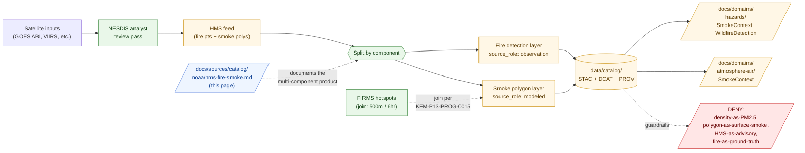

<!-- [KFM_META_BLOCK_V2]
doc_id: kfm://doc/docs-sources-catalog-noaa-hms-fire-smoke
title: NOAA HMS Fire and Smoke
type: product-page
version: v0.2
status: draft
owners: <PLACEHOLDER — Docs steward + Source steward for noaa + Hazards steward + Atmosphere/Air/Climate steward>
created: 2026-05-20
updated: 2026-05-22
policy_label: public
related:
  - docs/sources/catalog/noaa/README.md
  - docs/sources/catalog/noaa/IDENTITY.md
  - docs/sources/catalog/noaa/RIGHTS-AND-SENSITIVITY-MAP.md
  - docs/sources/catalog/noaa/goes-abi-aod.md
  - docs/sources/catalog/README.md
  - docs/domains/hazards/README.md
  - docs/domains/atmosphere/README.md
  - docs/doctrine/directory-rules.md
  - docs/standards/PROV.md
  - docs/adr/ADR-0001-schema-home.md
tags: [kfm, docs, sources, catalog, noaa, hms, fire, smoke, hazards, atmosphere-air, multi-role, analyst-augmented]
notes:
  - "PROPOSED product-page scaffold; sibling-link presence and repo path NEEDS VERIFICATION."
  - "PROPOSED path under docs/sources/catalog/noaa/ — per-family-folder convention, parallel to newspapers/<product>.md."
  - "HMS is a MULTI-COMPONENT product. Fire detection portion defaults to source_role: observation (analyst-confirmed satellite signal). Smoke polygon portion defaults to source_role: modeled (analyst-drawn interpretive boundaries). They MUST be tagged separately."
  - "HMS feeds BOTH Hazards (SmokeContext, WildfireDetection) and Atmosphere/Air (SmokeContext) — multi-domain product."
  - "Dominant anti-collapse stack: HMS smoke polygon ≠ surface smoke concentration; smoke density class ≠ PM2.5; fire detection ≠ ground-truth fire; HMS ≠ KFM alert."
[/KFM_META_BLOCK_V2] -->

# NOAA HMS Fire and Smoke

> **Analyst-augmented** operational analysis product from NOAA NESDIS — fire detections plus interpretive smoke polygons feeding **both** the Hazards and Atmosphere/Air/Climate domains. Smoke density classes are analyst categories, **not** concentration measurements; HMS is never a KFM-issued alert.

[](#status)
[](#status)
[](#source-role-posture)
[](#repo-fit)
[](#analyst-augmentation-and-its-provenance-burden)
[](#anti-collapse-stack-what-hms-is-not)
[](#rights-and-sensitivity)
[](../../../doctrine/directory-rules.md)
<!-- TODO: replace placeholder Shields.io targets once CI/badge generation is wired (see KFM-P3-FEAT-0005). -->

**Status:** PROPOSED — scaffold only · **Family:** [`noaa`](./README.md) · **Default `source_role`:** *multi-component* (see [§ Source-role posture](#source-role-posture)) · **Domains served:** `hazards` + `atmosphere-air` · **Owners:** *PLACEHOLDER* · **Last reviewed:** 2026-05-22

---

## Quick jump

- [Overview](#overview)
- [Source-role posture](#source-role-posture)
- [Anti-collapse stack: what HMS is not](#anti-collapse-stack-what-hms-is-not)
- [Analyst augmentation and its provenance burden](#analyst-augmentation-and-its-provenance-burden)
- [Repo fit](#repo-fit)
- [Source authority](#source-authority)
- [Catalog profiles used](#catalog-profiles-used)
- [Collection identity](#collection-identity)
- [Provenance fields](#provenance-fields)
- [Receipts and transforms](#receipts-and-transforms)
- [Cross-product joins (HMS ↔ FIRMS, HMS ↔ CAP)](#cross-product-joins-hms--firms-hms--cap)
- [Quality and uncertainty](#quality-and-uncertainty)
- [Temporal handling](#temporal-handling)
- [Geometry and projection](#geometry-and-projection)
- [Rights and sensitivity](#rights-and-sensitivity)
- [Downstream consumers](#downstream-consumers)
- [Validation and catalog closure](#validation-and-catalog-closure)
- [Related contracts and schemas](#related-contracts-and-schemas)
- [Related connectors and pipelines](#related-connectors-and-pipelines)
- [Examples](#examples)
- [Open questions](#open-questions)
- [Related docs](#related-docs)

---

## Overview

> [!NOTE]
> **PROPOSED scaffold.** This page describes a candidate product slice of the `noaa` source family. Scope, cadence, geographic coverage, current endpoint URLs, rights terms, and license status are **NEEDS VERIFICATION** and must be settled against `data/registry/sources/` and current source endpoints before any catalog promotion.

**Product slice.** *NOAA HMS Fire and Smoke* (Hazard Mapping System) is an operational fire and smoke analysis product produced by NOAA NESDIS. It combines automated satellite detections with **human-analyst review** to produce two distinct outputs that travel together in the same feed:

1. **Fire detection points** — satellite-detected fire signatures, refined and confirmed by analysts.
2. **Smoke polygons** — analyst-drawn vector outlines of visible smoke plumes, classified by **density category** (light / medium / heavy).

These two components have **different epistemic standing** and must be modeled separately in KFM.

PROPOSED — four doctrinal anchors apply (CONFIRMED doctrine; PROPOSED implementation):

- **HMS is analyst-augmented; its provenance must record the analyst pass.** Per Atlas Ch. 24.2.1, *if no receipt exists, the operation did not happen in the governed sense.* The analyst review is a consequential transformation and requires `ModelRunReceipt`-style accounting for analyst identity, pass time, and review parameters (see [§ Analyst augmentation](#analyst-augmentation-and-its-provenance-burden)).
- **Smoke polygon density classes are qualitative analyst categories, not concentration measurements.** This is the dominant anti-collapse for the smoke component (parallel to the AOD-is-not-PM2.5 rule documented in [`goes-abi-aod.md`](./goes-abi-aod.md)).
- **HMS feeds two domains, with the same record carrying different roles in each.** DOM-HAZ §D lists `NOAA HMS Fire and Smoke`; DOM-AIR §D lists `HMS smoke`. Both lanes consume HMS — but DOM-HAZ §I doctrine *("KFM Hazards is not an emergency alert system and must not provide life-safety instructions")* and DOM-AIR §I doctrine *("model fields are not observations")* both apply.
- **HMS smoke is joined to FIRMS hotspots with a defined spatial/temporal window.** Per **KFM-P13-PROG-0015** (CONFIRMED): *"Smoke pipelines should join FIRMS points to HMS plume buffers within 500 meters and six hours, tie CAP alerts by intersection or FIPS, and flag material change by IoU, area delta, or centroid shift."* This join is part of the canonical KFM smoke-context construction.

This page is a **product-page**: it describes the slice's *catalog identity*, *profile usage*, *provenance fields*, *receipt requirements*, *quality posture*, *anti-collapse rules*, *cross-product joins*, and *validation gates*. It is **not** a duplicate of the `SourceDescriptor`, the policy bundle, or the rights map — those live in their respective responsibility roots and are linked from here.

[↑ back to top](#noaa-hms-fire-and-smoke)

---

## Source-role posture

> [!CAUTION]
> **HMS is a multi-component product.** A single HMS feed delivery contains records of two distinct epistemic kinds. They **must not** be admitted under a single `source_role`. Lumping them is a `SOURCE_ROLE_COLLAPSE` anti-pattern (CONFIRMED doctrine — see NOAA family entry §5.2).

| HMS component | Default `source_role` | Required anchoring receipt | What it is **not** |
|---|---|---|---|
| **Fire detection point** | `observation` (analyst-confirmed satellite signal) | `SourceDescriptor` + `RunReceipt` + analyst-review provenance (see [§ Analyst augmentation](#analyst-augmentation-and-its-provenance-burden)) | Not ground-truth that a fire is currently burning; not an authority for ignition / containment. |
| **Smoke polygon (light / medium / heavy density class)** | `modeled` (analyst-drawn interpretive boundary) | `SourceDescriptor` + `ModelRunReceipt`-style receipt pinning analyst pass, satellite inputs, and density-classification basis | Not an observed surface smoke concentration; not PM2.5; not an exposure determination; not an advisory. |
| **Aggregated / re-projected derivatives** (county-mean polygon area, daily composite, etc.) | `aggregate` | `AggregationReceipt` pinning geometry-scope | Not a per-place truth; not a substitute for ground monitoring. |
| **Unmerged or quarantined HMS admission** | `candidate` | `SourceDescriptor` with `role_candidate_disposition: pending` | **Not** publishable. `PUBLISHED` edge forbidden until `merged`. |
| `authority` | **Not applicable.** HMS is never authority for life-safety, exposure, or air-quality determination. | — | — |
| `synthetic` | **Not applicable.** HMS interprets real satellite signals; it does not synthesize new ones. | — | — |

**Anti-collapse rule** (CONFIRMED doctrine; PROPOSED realization): the catalog must preserve `kfm:source_role` distinctly for the fire-detection layer and the smoke-polygon layer, even when both are delivered in the same upstream payload.

[↑ back to top](#noaa-hms-fire-and-smoke)

---

## Anti-collapse stack: what HMS is not

> [!WARNING]
> HMS sits at the intersection of three high-risk anti-collapse rules already in KFM doctrine. Each is enforced independently. This product carries the largest anti-collapse stack of any newspaper- or noaa-family product currently documented.

| # | The collapse | Why it fails | Required guardrail |
|---|---|---|---|
| **AC-1** | HMS smoke polygon → "smoke is here on the ground" | A smoke polygon indicates where smoke is **visible from satellite** (top-of-atmosphere signal). It does not localize smoke to the surface. | `source_role: modeled`; `SmokeContext` (not `SurfaceObservation`); banner in UI. |
| **AC-2** | HMS smoke density class → PM2.5 concentration | Density classes (light / medium / heavy) are **qualitative analyst categories**, not quantitative concentration bins. Parallel to AOD ≠ PM2.5 (CONFIRMED DOM-AIR §I doctrine). | DENY any join from density class → numeric concentration without a separately receipted regional calibration model. |
| **AC-3** | HMS smoke polygon → air-quality advisory or actionable exposure guidance | KFM is not an air-quality alerting authority; DOM-HAZ §B explicit non-ownership: *"KFM Hazards is not an emergency alert system and must not provide life-safety instructions."* | DENY public packaging as advisory; route to official sources (AirNow, NWS smoke products). |
| **AC-4** | HMS fire detection → confirmed active wildfire ground state | Detection is a satellite signature plus analyst review. Many detections are agricultural burns, controlled burns, industrial sources, or false-positive thermal anomalies. | `source_role: observation` of a *signal*, not of a *ground event*; never relabeled as `authority` for active-fire status. |
| **AC-5** | HMS analyst pass → independent ground truth | The analyst reviewed *what the satellites saw*. Analyst review reduces false positives; it does not introduce ground observation. | Analyst-review provenance recorded (see [§ Analyst augmentation](#analyst-augmentation-and-its-provenance-burden)); never re-tagged as field observation. |
| **AC-6** | HMS rebroadcast as a KFM alert | Inherits the NOAA family life-safety red line; HMS is operational at NESDIS but **not** a KFM-issued alert when it enters KFM. | `not-for-life-safety` disclaimer; freshness/expiry tracked; official-source redirect. |

[↑ back to top](#noaa-hms-fire-and-smoke)

---

## Analyst augmentation and its provenance burden

HMS is distinctive among NOAA satellite-derived products because it includes a **human analyst review pass** before publication. That pass is what makes HMS more reliable than raw satellite hot-spots — and also what makes its provenance burden heavier than a pure-automated retrieval.

> [!IMPORTANT]
> The analyst review is a **consequential transformation**. Per CONFIRMED Atlas Ch. 24.2 doctrine, every consequential transformation requires a receipt. Admitting HMS without recording the analyst pass would treat HMS as if it were raw satellite output — which it is not.

### Required analyst-augmentation provenance (PROPOSED)

The KFM `ModelRunReceipt` (or a `ReviewRecord` sibling) for an HMS pass must capture:

| Field | What it pins | Notes |
|---|---|---|
| `analyst_pass_id` | The HMS production pass identifier | Used to group fire detections and smoke polygons emitted together. |
| `analyst_pass_time` | When the analyst-augmented product was issued | Distinct from satellite scan time and from KFM `retrieval_time`. |
| `automated_input_refs[]` | Satellite inputs (GOES ABI, VIIRS, etc.) that fed the pass | EvidenceRefs to upstream sources. |
| `density_class_basis` | The analyst convention for light / medium / heavy density classes | NEEDS VERIFICATION — confirm against NESDIS HMS documentation. |
| `validation_ref` | Cross-checks against FIRMS, ground reports, or aerial observations where available | Optional but tracked when present. |

**Anti-fabrication rule.** KFM does **not** claim to know the identity of individual NESDIS analysts or their internal review parameters. The receipt records *that* a review pass happened and *which* identifiers HMS itself exposes (pass identifier, issue time), not invented details.

[↑ back to top](#noaa-hms-fire-and-smoke)

---

## Repo fit

> [!IMPORTANT]
> **PROPOSED path.** This file is authored at `docs/sources/catalog/noaa/hms-fire-smoke.md`. The per-family-folder layout (`docs/sources/catalog/<family>/<product>.md`) parallels the newspaper product-page series and the `goes-abi-aod.md` sibling, resolving the NOAA family entry's `OPEN-NOAA-08` in favor of this convention.

| Direction | Neighbor | Relationship |
|---|---|---|
| **Upstream (parent)** | [`README.md`](./README.md) | NOAA family-level orientation; this product is one slice. |
| **Sibling** | [`IDENTITY.md`](./IDENTITY.md) | Collection-id and namespace rules for the NOAA family. |
| **Sibling** | [`RIGHTS-AND-SENSITIVITY-MAP.md`](./RIGHTS-AND-SENSITIVITY-MAP.md) | Family rights / sensitivity decisions; this page does **not** restate policy. |
| **Sibling** | [`goes-abi-aod.md`](./goes-abi-aod.md) | NOAA-family sibling (also `modeled`-leaning; uses similar anti-collapse pattern). |
| **Cross-family sibling** | [`../newspapers/ocr-full-text.md`](../newspapers/ocr-full-text.md) | Structural parallel (mandatory `ModelRunReceipt`; engine/version-in-identity rule). |
| **Upstream (root)** | [`../README.md`](../README.md) | Catalog landing page. |
| **Cross-root (data)** | [`data/registry/sources/`](../../../../data/registry/sources/) | Authoritative `SourceDescriptor` home; not duplicated here. |
| **Cross-root (domain, primary)** | [`docs/domains/hazards/`](../../../domains/hazards/) | Domain owner of `SmokeContext`, `WildfireDetection`, `HazardEvent`. |
| **Cross-root (domain, co-primary)** | [`docs/domains/atmosphere/`](../../../domains/atmosphere/) | Domain owner of `SmokeContext` (atmosphere-side projection). |
| **Doctrine** | [`docs/doctrine/directory-rules.md`](../../../doctrine/directory-rules.md) | Placement authority and lifecycle law. |



> [!NOTE]
> Diagram reflects the **multi-component, analyst-augmented, multi-domain** nature of HMS. The split at admission (`SPLIT BY COMPONENT`) is a doctrinal requirement, not a styling choice. Specific subpaths are PROPOSED until mounted-repo inspection confirms presence.

[↑ back to top](#noaa-hms-fire-and-smoke)

---

## Source authority

The authoritative `SourceDescriptor` for any HMS admission lives in [`data/registry/sources/`](../../../../data/registry/sources/) (PROPOSED path per Directory Rules §6).

> [!WARNING]
> **Do not duplicate descriptor fields here.** This page references identity, role, rights, sensitivity, and cadence — it does not own them. If a field appears to disagree with the `SourceDescriptor`, the descriptor wins, and a drift entry should open in `docs/registers/DRIFT_REGISTER.md`.

PROPOSED — the descriptor(s) for this slice should at minimum carry:

- `source_id` — stable identifier; **separate descriptors recommended** for the fire-detection component and the smoke-polygon component (because they carry different roles).
- `source_role` — `observation` for the fire-detection component; `modeled` for the smoke-polygon component.
- `role_authority` — NOAA NESDIS (operational authority); distinct from KFM (which is **not** an alerting authority).
- `role_model_run_ref` *(required for the smoke-polygon component)* — `EvidenceRef → ModelRunReceipt`-style record of the analyst pass.
- `rights` — license, redistribution terms, attribution; HMS products are generally U.S. government works in the public domain, but per-product terms **NEEDS VERIFICATION**.
- `sensitivity` — tier per [`RIGHTS-AND-SENSITIVITY-MAP.md`](./RIGHTS-AND-SENSITIVITY-MAP.md).
- `cadence` — operational daily cadence (NEEDS VERIFICATION — confirm exact cadence and any sub-daily passes).
- `ingest_hash` — content-addressable digest of the admitted feed.

NEEDS VERIFICATION: actual `SourceDescriptor` schema field names and required-vs-optional status against `schemas/contracts/v1/source/` (per ADR-0001).

---

## Catalog profiles used

PROPOSED — HMS admissions map across the standard KFM-STAC / DCAT / PROV-O profile triad (per KFM-P1-PROG-0021 and KFM-P32-IDEA-0005). Which lanes this product actually emits is **NEEDS VERIFICATION**.

| Profile | Lane | Used by this product? | Notes |
|---|---|---|---|
| STAC 1.1 | `data/catalog/stac/` | PROPOSED — **Yes** (NEEDS VERIFICATION) | Per-pass Items; **separate Items recommended** for fire detections vs smoke polygons; `kfm:provenance` block carries the analyst-pass `model_run_ref` for the smoke component. |
| DCAT | `data/catalog/dcat/` | PROPOSED — Yes / No (NEEDS VERIFICATION) | Distribution mapping for downloadable archives. |
| PROV-O | `data/catalog/prov/` | PROPOSED — **Yes (required)** | The analyst pass is a `prov:Activity`; `wasDerivedFrom` links to satellite inputs; `wasAttributedTo` to NOAA NESDIS (the production authority, not individual analysts). |
| Domain projection | `data/catalog/domain/hazards/` and `data/catalog/domain/atmosphere-air/` | PROPOSED — **Yes (both)** | Smoke component projects into `SmokeContext` in both domains; fire-detection projects into `WildfireDetection` (Hazards). |

> [!TIP]
> KFM-namespaced STAC extension fields (`kfm:run_receipt_ref`, `kfm:proof_ref`, `kfm:trust_class`, `kfm:source_role`) carry trust-membrane context across profiles. For HMS, **`kfm:source_role` per-component preservation** is the most important — downstream consumers must be able to distinguish the fire-detection layer from the smoke-polygon layer at a glance.

[↑ back to top](#noaa-hms-fire-and-smoke)

---

## Collection identity

- **PROPOSED Collection ID pattern.** Two collections recommended:
  - `kfm-noaa-hms-fire-detections` (for the `observation`-role fire-point layer)
  - `kfm-noaa-hms-smoke-polygons` (for the `modeled`-role smoke-polygon layer)
  - See [OPEN-HMS-03](#open-questions) for the alternative single-collection model.
- **PROPOSED namespace.** `kfm:` — pending resolution of *OPEN-DSC-03* (namespace canonicalization). NEEDS VERIFICATION.
- **PROPOSED Item ID rule.** Deterministic basis: `product + component + analyst_pass_id + pass_time + tile_or_feature_locator + normalized_digest`. The `analyst_pass_id` and `pass_time` are part of identity — re-issuance after analyst revision produces a **new Item**, not an update (parallel to OCR engine-version and AOD algorithm-version rules).
- **Asset roles.** NEEDS VERIFICATION — confirm against `schemas/contracts/v1/source/`. Candidate roles for fire detections: `data` (point feature collection), `metadata`. For smoke polygons: `data` (polygon feature collection), `density_class` (light/medium/heavy classification), `metadata`, `thumbnail`.

---

## Provenance fields

STAC `properties.kfm:provenance` block (PROPOSED — Pass-10 C4-01 / KFM-P3-IDEA-0004):

| Field | Resolves to | Required when | Notes |
|---|---|---|---|
| `spec_hash` | sha256 of the canonical record (JCS+SHA-256) | always | Anchors record identity. |
| `evidence_bundle_ref` | `kfm://evidence/<digest>` | claim-bearing items | Resolves to the EvidenceBundle backing any non-trivial assertion. |
| `run_record_ref` | `kfm://run/<run-id>` | always | Pins the orchestrated KFM run that produced the catalog Item. |
| `model_run_ref` | `kfm://model-run/<id>` → analyst-pass receipt | **always for the smoke-polygon component** | Pins the analyst pass identity, pass time, and inputs. |
| `audit_ref` | `kfm://audit/<attestation-id>` | promoted items | DSSE / Cosign attestation; surfaces under `kfm:proof_ref`. |
| `policy_digest` | sha256 of the policy bundle in force at promotion | promoted items | Lets reviewers reproduce the gate (life-safety disclaimer, density-class anti-collapse, etc.). |
| `source_role` | enum: `observation` (fire) \| `modeled` (smoke) \| `aggregate` \| `candidate` | always | **Default differs by component.** Never `authority`. |
| `kfm:hms.component` | enum: `fire_detection` \| `smoke_polygon` | always for HMS items | Discriminates the two components; required because they carry different roles. |
| `kfm:hms.density_class` | enum: `light` \| `medium` \| `heavy` | required when `kfm:hms.component = smoke_polygon` | Qualitative analyst category; **not** a concentration. |

Per-asset integrity: STAC `file:checksum` for every asset.

> [!NOTE]
> NEEDS VERIFICATION — exact field names, especially the `kfm:hms.*` extension fields, need to be reconciled against the live `kfm-stac-extension.md` if one exists in the repo. The `density_class` enum values are reproduced verbatim from common NESDIS HMS usage; NEEDS VERIFICATION against authoritative documentation.

[↑ back to top](#noaa-hms-fire-and-smoke)

---

## Receipts and transforms

CONFIRMED doctrine: *KFM uses receipts to make consequential transformations inspectable.* HMS carries two consequential transformations: (1) the NESDIS analyst pass that produced the feed, and (2) any KFM-side transformation (reprojection, generalization).

| Receipt | Triggered by | Required content (PROPOSED shape) |
|---|---|---|
| **`SourceDescriptor`** (anchor, not a receipt) | Admission of HMS as a sub-source of the NOAA family. | Separate descriptors per component; `source_role`, `role_authority`, `rights`, `sensitivity`, `cadence`, `ingest_hash`, `time`, `citation`. |
| **`ModelRunReceipt`** *(mandatory for smoke-polygon component)* | The NESDIS analyst pass. | `model_id: "noaa-nesdis-hms-analyst-pass"`, `model_version`, `inputs[]` (satellite source refs), `parameters` (density-class basis as documented by NESDIS), `run_time`, `validation_ref`. |
| **`TransformReceipt`** | KFM-side reprojection, generalization, or buffer creation (the 500m buffer per KFM-P13-PROG-0015). | `input_geom_hash`, `output_geom_hash`, `transform`, `parameters` (e.g., `buffer_radius_m: 500`), `tolerance`, `timestamp`, `actor`. |
| **`AggregationReceipt`** | County-mean polygon area, daily composite, etc. | `geometry_scope`, `time_scope`, `aggregation_method`, `input_source_refs`, `suppression_rule`. |
| **`ValidationReport`** | WORK → PROCESSED and PROCESSED → CATALOG transitions. | `validator_id`, `target`, `passes[]`, `failures[]`, `time`, `deterministic_inputs`. |
| **`PolicyDecision`** | Trust-membrane evaluation. | `DENY` by default for any packaging as a KFM-issued alert (per AC-3, AC-6). |

> [!CAUTION]
> A re-issued HMS pass after analyst revision **produces a new Item**, not an update. The analyst-pass identity is part of the Item's identity; silently overwriting an HMS Asset with a revised pass violates the `source_role` anti-collapse rule and breaks downstream lineage.

[↑ back to top](#noaa-hms-fire-and-smoke)

---

## Cross-product joins (HMS ↔ FIRMS, HMS ↔ CAP)

HMS does not stand alone. It is canonically joined to two other source families per **CONFIRMED KFM-P13-PROG-0015**:

> *Smoke pipelines should join FIRMS points to HMS plume buffers within 500 meters and six hours, tie CAP alerts by intersection or FIPS, and flag material change by IoU, area delta, or centroid shift.*

| Join | Window / key | Purpose | Required guardrail |
|---|---|---|---|
| **HMS smoke polygon ↔ FIRMS hotspot point** | 500 m spatial buffer × 6 hr temporal window | Cross-validate smoke plume to a candidate fire source; supports `SmokeContext` evidence. | Each side carries its own `source_role`; the join does not blend them. The joined record records both refs as separate `EvidenceRef`s. |
| **HMS smoke polygon ↔ CAP alert** | Geometric intersection or matching FIPS code | Surface smoke polygons that overlap an active CAP-coded advisory area. | CAP alerts enter as `regulatory-context` *(contextual only)*; the join must **not** transform the HMS polygon into an alert. |
| **HMS polygon change detection** | IoU (Intersection over Union); area delta; centroid shift | Flag material change in plume extent between successive passes. | Change-detection receipts are emitted per the `TransformReceipt` pattern; flagged changes route to the catalog, not to a public alert surface. |

> [!TIP]
> The 500m / 6hr join window is **not** invented for this page — it is the KFM-canonical rule per the cited Pass-13 card. Implementations that diverge from these values must record the divergence in an ADR.

---

## Quality and uncertainty

PROPOSED — HMS items carry quality metrics as first-class data. NEEDS VERIFICATION — exact field shapes against any existing quality schema.

| Metric | Granularity | Use |
|---|---|---|
| **Analyst review confidence** | per-pass | Was the pass full-coverage analyst-augmented, or did automated detections survive without analyst review (e.g., during off-hours)? Drives a trust badge. |
| **Density class** *(smoke only)* | per-polygon | Qualitative `light` / `medium` / `heavy`; **not** a concentration bin. Surfaced with the AC-2 anti-collapse caveat. |
| **Pass coverage** | per-day | Whether the feed for a given UTC day is complete or partial. |
| **FIRMS join match rate** | per-pass | Fraction of smoke polygons with a co-located FIRMS hotspot per KFM-P13-PROG-0015. |
| **Area change vs prior pass** | per-polygon | IoU, area delta, centroid shift — flags material change. |
| **Source satellite mix** | per-pass | Which automated inputs the analyst worked from (GOES ABI mix, VIIRS, polar, etc.) — affects spatial / temporal resolution. |

> [!TIP]
> Quality metrics drive a **trust-and-freshness badge** (per KFM-P3-FEAT-0005). For HMS, the badge says *"this is how complete and reviewed the analyst pass was"* — not *"this is how reliable surface smoke conditions are."* Two distinct trust axes; do not conflate.

[↑ back to top](#noaa-hms-fire-and-smoke)

---

## Temporal handling

PROPOSED — HMS items must keep the standard KFM time roles **distinct where material**:

| Time role | Meaning for an HMS item | Status |
|---|---|---|
| `source_time` | The HMS pass issue time (when NESDIS published the analyst-augmented product) | PROPOSED |
| `observed_time` | The atmospheric/fire state time the pass represents (often a multi-hour window over the underlying satellite inputs) | PROPOSED |
| `valid_time` | The period over which the analyst's interpretation is asserted to hold (typically the pass window) | PROPOSED |
| `retrieval_time` | When KFM ingested the feed | PROPOSED |
| `analyst_pass_time` | When the analyst review ran (often equal to `source_time`, but distinct conceptually) | PROPOSED |
| `release_time` | When KFM promoted the catalog Item | PROPOSED |
| `correction_time` | Time of any post-release correction (re-issued pass, validation correction) | PROPOSED |

> [!WARNING]
> **Do not collapse `observed_time` and `source_time`.** A daily HMS pass synthesizes satellite observations from a multi-hour window; the pass issue time is not the same as the atmospheric state time. Public-facing displays that label HMS layers must surface the temporal window honestly.

NEEDS VERIFICATION — confirm time-role tests exist or are PROPOSED in `tests/`.

---

## Geometry and projection

PROPOSED — HMS delivers vector products in a defined CRS:

| Concern | Posture | Status |
|---|---|---|
| **Native CRS** | Geographic (WGS84 lat/lon) per common NESDIS practice | NEEDS VERIFICATION against authoritative HMS documentation. |
| **Smoke polygon generalization** | Analyst-drawn; resolution depends on the analyst pass; no fixed pixel resolution | PROPOSED. |
| **Fire detection points** | Point geometry with associated satellite-source attribution | PROPOSED. |
| **KFM reprojection** | For Kansas-focused public layers, reprojection to a regional CRS via `TransformReceipt`. | PROPOSED. |
| **Buffering** | The 500 m smoke-polygon buffer (per KFM-P13-PROG-0015) is a KFM-side transformation, recorded with `TransformReceipt`. | PROPOSED. |
| **STAC Projection extension** | Required (`proj:code`, `proj:bbox`, `proj:geometry`) per KFM-P27-FEAT-0003. | PROPOSED. |

NEEDS VERIFICATION — confirm against any HMS fixtures in `tests/` or `fixtures/`.

---

## Rights and sensitivity

> [!IMPORTANT]
> **Do not restate policy here.** Sensitivity tier, redaction rules, and reveal posture are decided in [`policy/sensitivity/`](../../../../policy/sensitivity/) and summarized in the sibling [`RIGHTS-AND-SENSITIVITY-MAP.md`](./RIGHTS-AND-SENSITIVITY-MAP.md). This section names the *kinds of risks* the product introduces, not the *decisions* taken against them.

PROPOSED risk surfaces — NEEDS VERIFICATION per product:

| Risk surface | Why it matters | Default posture |
|---|---|---|
| **HMS-as-alert misuse** | Inherits the NOAA family life-safety red line; HMS is *operational at NESDIS*, but **not** a KFM-issued alert. | `not-for-life-safety` disclaimer; freshness/expiry tracked; official-source redirect to NWS / AirNow. |
| **Smoke-density-as-PM2.5 misuse** | Density classes are qualitative; treating them as concentration over- or under-estimates exposure. | DENY any join from density class → numeric concentration without a separately receipted regional calibration. |
| **Polygon-as-surface-smoke misuse** | A satellite-visible smoke polygon does not mean smoke at breathing height in every location within it. | DENY public packaging as ground-level smoke; route through `SmokeContext` framing. |
| **Fire detection treated as ground truth** | Detection = a satellite-confirmed signal; controlled burns, industrial sources, and false positives still appear. | `source_role: observation` of a *signal*, not of a ground event. |
| **Indigenous / cultural-burn context** | Some detected fires are cultural / prescribed burns on sovereign or culturally significant lands. | CARE review path; do not present cultural burns as anomalous events without context. |
| **Operationally current detail** | Modern HMS passes carry near-real-time content; treating it as historical-only is also wrong. | Time-role surfacing; freshness badge. |
| **License inheritance** | HMS is generally a U.S. government public-domain work; per-product terms remain NEEDS VERIFICATION. | License-deny lane until rights confirmed (per Master MapLibre ML-062-016). |

> [!CAUTION]
> CONFIRMED doctrine: *Operational warning products are contextual only and not for life safety; unknown source roles are quarantined; expired operational context cannot appear as current warning state.* (DOM-HAZ §I.)

[↑ back to top](#noaa-hms-fire-and-smoke)

---

## Downstream consumers

HMS is upstream context for several products and surfaces. The catalog should make this lineage explicit via PROV-O links and via `kfm:source_role` propagation **per component**.

| Downstream consumer | What it derives from HMS | Its default `source_role` |
|---|---|---|
| Hazards `SmokeContext` layer | Smoke polygons rendered with density-class styling and AC-1/AC-2 caveats | `modeled`; **not** an observed surface smoke claim. |
| Hazards `WildfireDetection` layer | Fire-detection points combined with FIRMS and other detections | `observation` of *signals*; never the only source for a "fire is here" claim. |
| Atmosphere/Air `SmokeContext` layer | Smoke polygons consumed for smoke-context air-quality framing | `modeled`; paired with AirNow / AQS / Mesonet for surface PM. |
| AOD-to-PM regional calibration products | HMS smoke polygons used as a contextual mask alongside GOES ABI AOD | Used as a **mask input**; downstream model carries its own `ModelRunReceipt`. |
| Vegetation-change masking (HLS / Landsat) | HMS smoke polygons mask change detection (per KFM-P20-PROG-0005) | Used as a **mask input**; the downstream alert carries its own receipts. |
| Focus Mode answers | Bounded evidence context for fire/smoke questions | `AIReceipt` mandatory; cite HMS as **smoke polygon (analyst-reviewed)**, not as surface conditions or as an alert. |

[↑ back to top](#noaa-hms-fire-and-smoke)

---

## Validation and catalog closure

PROPOSED gates that apply to this product before public release:

- **Catalog closure required before public release** — DCAT, STAC, and PROV records must trace bundle identity, inputs, artifacts, checks, producer, and promotion metadata (per Pass-10 / KFM-P26-IDEA-0007). PROPOSED.
- **STAC Projection lint** — `proj:code`, `proj:bbox`, `proj:geometry`, `proj:shape`, `proj:transform` compliance (per KFM-P27-FEAT-0003). PROPOSED.
- **STAC checksum closure** — `file:checksum` for every Asset must match the ReleaseManifest digest (per KFM-P22-PROG-0037). PROPOSED.
- **Component-split test** — every HMS Item must carry `kfm:hms.component` ∈ {`fire_detection`, `smoke_polygon`}; items missing the discriminator fail closed. **PROPOSED, MANDATORY**.
- **Analyst-pass `ModelRunReceipt` presence test** — every smoke-polygon Item must carry a resolvable `model_run_ref` to the analyst pass. **PROPOSED, MANDATORY**.
- **Density-class anti-collapse test** *(AC-2)* — joins from `density_class` → numeric concentration without a regional-calibration `ModelRunReceipt` fail closed.
- **Polygon-as-surface-smoke denial test** *(AC-1)* — items relabeled or summarized as ground-level smoke fail closed.
- **HMS-as-advisory denial test** *(AC-3, AC-6)* — items packaged as actionable advisories fail closed; carries the doctrinal red line from the NOAA family entry.
- **Fire-as-ground-truth denial test** *(AC-4)* — items relabeled as `authority` for active-fire status fail closed.
- **HMS ↔ FIRMS join window test** *(per KFM-P13-PROG-0015)* — joins outside the 500m / 6hr window without an ADR override fail closed.
- **Material-change test** *(per KFM-P13-PROG-0015)* — IoU / area delta / centroid shift produce a `TransformReceipt`; un-receipted material changes fail closed.
- **Source-role anti-collapse test** *(per KFM-P17-IDEA-0004)* — items must not re-emit HMS as `authority`. PROPOSED.
- **Rights propagation test** — `rights` field must be resolved before contentful delta emission (per ML-062-016). PROPOSED.

NEEDS VERIFICATION — confirm which of these are realized in `tests/`, `pipelines/validate/`, or CI workflows.

---

## Related contracts and schemas

| Artifact | PROPOSED path | Status |
|---|---|---|
| Source descriptor schema | `schemas/contracts/v1/source/` | NEEDS VERIFICATION — per ADR-0001. |
| `SmokeContext` object schema | `schemas/contracts/v1/hazards/smoke-context.schema.json` and/or `schemas/contracts/v1/atmosphere-air/smoke-context.schema.json` | PROPOSED — DOM-HAZ and DOM-AIR both list `SmokeContext`. NEEDS VERIFICATION which domain owns the canonical home (likely Hazards). |
| `WildfireDetection` object schema | `schemas/contracts/v1/hazards/wildfire-detection.schema.json` | PROPOSED — DOM-HAZ §E object family. |
| `ModelRunReceipt` schema | `schemas/contracts/v1/receipts/model-run-receipt.schema.json` | PROPOSED — per Atlas Ch. 24.2. |
| `TransformReceipt` schema | `schemas/contracts/v1/receipts/transform-receipt.schema.json` | PROPOSED. |
| `AggregationReceipt` schema | `schemas/contracts/v1/receipts/aggregation-receipt.schema.json` | PROPOSED. |
| STAC extension reference | `docs/standards/PROV.md`, `kfm-stac-extension.md` | PROPOSED — *PROV.md* vs *PROVENANCE.md* pending ADR (Directory Rules §18 OPEN-DR-01). |
| Family policy bundle | `policy/release/hazards/`, `policy/release/atmosphere/`, `policy/sensitivity/` | NEEDS VERIFICATION — owned by policy/, not this page. |

---

## Related connectors and pipelines

PROPOSED — typical wiring (NEEDS VERIFICATION per product):

- **Connector**: `connectors/noaa/hms/` (PROPOSED) under the unified NOAA connector layout from the NOAA family entry.
- **HMS split pipeline**: `pipelines/normalize/hms-split/` (PROPOSED) — splits the upstream feed into the fire-detection component and the smoke-polygon component, emitting separate `SourceDescriptor`s.
- **HMS ↔ FIRMS join pipeline**: `pipelines/normalize/smoke-firms-join/` (PROPOSED) — implements the 500m / 6hr join per KFM-P13-PROG-0015.
- **Quality / freshness pipeline**: `pipelines/validate/hms-quality/` (PROPOSED).
- **Catalog pipeline**: `pipelines/catalog/` — produces STAC / DCAT / PROV records.
- **Pipeline spec**: `pipeline_specs/noaa/hms/` (PROPOSED).

> [!CAUTION]
> The watcher / connector **never publishes**. Source watchers emit `SourceIntakeRecord` or `DriftSummary`; `PromotionDecision` is what publishes — and only after the component split, the analyst-pass receipt presence check, the anti-collapse gates, and rights propagation all pass.

---

## Examples

<details>
<summary><strong>Minimal STAC Item shape — smoke-polygon component (illustrative, not authoritative)</strong></summary>

> [!NOTE]
> Illustrative only. Do **not** treat as the live schema. See [`_examples/stac-item-example.json`](../_examples/stac-item-example.json) for the canonical minimal shape once it lands. NEEDS VERIFICATION.

```json
{
  "type": "Feature",
  "stac_version": "1.1.0",
  "id": "kfm-noaa-hms-smoke-polygons/<analyst-pass-id>/<pass-time>/<polygon-id>",
  "collection": "kfm-noaa-hms-smoke-polygons",
  "properties": {
    "datetime": "<source_time>",
    "kfm:provenance": {
      "spec_hash": "sha256:<...>",
      "evidence_bundle_ref": "kfm://evidence/<digest>",
      "run_record_ref": "kfm://run/<run-id>",
      "model_run_ref": "kfm://model-run/<analyst-pass-id>",
      "audit_ref": "kfm://audit/<attestation-id>",
      "policy_digest": "sha256:<...>",
      "source_role": "modeled"
    },
    "kfm:trust_class": "catalog",
    "kfm:hms": {
      "component": "smoke_polygon",
      "density_class": "medium",
      "analyst_pass_time": "<iso-8601>",
      "automated_input_refs": ["kfm://source/<goes-abi-source_id>", "kfm://source/<viirs-source_id>"]
    }
  },
  "assets": {
    "data":     { "href": "...", "type": "application/geo+json",  "roles": ["data"] },
    "metadata": { "href": "...", "type": "application/json",      "roles": ["metadata"] }
  },
  "links": [
    { "rel": "collection",   "href": "../collection.json" },
    { "rel": "derived_from", "href": "kfm://source/<hms-feed-source_id>" },
    { "rel": "via",          "href": "kfm://model-run/<analyst-pass-id>" }
  ]
}
```

</details>

<details>
<summary><strong>Illustrative <code>ModelRunReceipt</code> shape for an HMS analyst pass (PROPOSED)</strong></summary>

```json
{
  "receipt_class": "ModelRunReceipt",
  "model_id": "noaa-nesdis-hms-analyst-pass",
  "model_version": "<pass-version-or-product-version>",
  "inputs": [
    { "ref": "kfm://source/<goes-abi-source_id>",  "asset_role": "automated_detection" },
    { "ref": "kfm://source/<viirs-source_id>",      "asset_role": "automated_detection" },
    { "ref": "kfm://source/<polar-source_id>",      "asset_role": "automated_detection" }
  ],
  "parameters": {
    "analyst_pass_id": "<id>",
    "density_class_basis": "<NESDIS-documented-convention>",
    "review_scope": "<full | partial>"
  },
  "run_time": "<analyst_pass_time iso-8601>",
  "validation_ref": "kfm://artifact/<firms-cross-check-digest>"
}
```

</details>

<details>
<summary><strong>Illustrative quarantine reasons</strong></summary>

| Reason code | When it fires |
|---|---|
| `HMS_COMPONENT_DISCRIMINATOR_MISSING` | HMS Item lacks `kfm:hms.component`. |
| `ANALYST_PASS_RECEIPT_MISSING` | Smoke-polygon Item lacks a resolvable `model_run_ref` to the analyst pass. |
| `DENSITY_AS_CONCENTRATION_COLLAPSE` | Downstream artifact attempts to map density class → numeric concentration without a regional-calibration `ModelRunReceipt`. |
| `POLYGON_AS_SURFACE_SMOKE_COLLAPSE` | Item relabeled or summarized as ground-level smoke. |
| `FIRE_AS_GROUND_TRUTH_COLLAPSE` | Fire-detection point relabeled as `authority` for active-fire status. |
| `HMS_AS_ADVISORY_ATTEMPT` | HMS packaged as an actionable advisory; carries the NOAA family life-safety red line. |
| `FIRMS_JOIN_WINDOW_VIOLATION` | Join outside the 500m / 6hr window without an ADR override. |
| `MATERIAL_CHANGE_NO_RECEIPT` | IoU / area delta / centroid shift exceeded threshold without a `TransformReceipt`. |
| `RIGHTS_UNRESOLVED` | License terms not confirmed; license-deny lane. |
| `ANALYST_PASS_OVERWRITE_ATTEMPT` | A re-issued pass is attempting to overwrite an existing Item rather than create a new one. |

</details>

---

## Open questions

- **OPEN-HMS-01** — Confirm exact HMS product endpoint(s) and cadence (daily nominal? sub-daily passes?). Distinct endpoints for fire vs smoke?
- **OPEN-HMS-02** — Confirm rights status. HMS is generally a U.S. government work in the public domain; per-product terms remain NEEDS VERIFICATION.
- **OPEN-HMS-03** — Confirm whether to emit **two separate STAC Collections** (`kfm-noaa-hms-fire-detections` and `kfm-noaa-hms-smoke-polygons`) or a single Collection with `kfm:hms.component` as the only discriminator. This page assumes the two-Collection model — likely ADR-class.
- **OPEN-HMS-04** — Confirm authoritative documentation for the `density_class` enum (`light` / `medium` / `heavy`) and whether NESDIS has revised it.
- **OPEN-HMS-05** — Confirm the `analyst_pass_id` shape — is there a stable NESDIS-issued identifier KFM can use directly, or does KFM compute one?
- **OPEN-HMS-06** — Confirm the cultural-burn / CARE pathway: should HMS detections over recognized cultural-burn jurisdictions carry a flag, and where does that policy live?
- **OPEN-HMS-07** — Confirm whether the 500m / 6hr HMS↔FIRMS join window is still the current KFM canonical (per KFM-P13-PROG-0015), or whether it has been revised by a later pass.
- **OPEN-HMS-08** — Confirm whether `SmokeContext` is owned in `domains/hazards/` or `domains/atmosphere/` for schema-home purposes. Both list it.
- **OPEN-HMS-09** — Confirm connector layout. Likely `connectors/noaa/hms/` under the unified NOAA connector per the family entry.
- **OPEN-HMS-10** — Inherits **OPEN-DSC-03** (namespace canonicalization) from family-level.
- **OPEN-HMS-11** — Resolve `PROV.md` vs `PROVENANCE.md` reference target (Directory Rules §18 OPEN-DR-01).

---

## Related docs

- [`./README.md`](./README.md) — NOAA family landing page.
- [`./IDENTITY.md`](./IDENTITY.md) — Collection-id and namespace rules.
- [`./RIGHTS-AND-SENSITIVITY-MAP.md`](./RIGHTS-AND-SENSITIVITY-MAP.md) — Family rights / sensitivity decisions.
- [`./goes-abi-aod.md`](./goes-abi-aod.md) — NOAA-family sibling (similar `modeled`-leaning posture and anti-collapse pattern).
- [`./_examples/stac-item-example.json`](./_examples/stac-item-example.json) — Minimal STAC + `kfm:provenance` shape (illustrative).
- [`../README.md`](../README.md) — Catalog root.
- [`../newspapers/ocr-full-text.md`](../newspapers/ocr-full-text.md) — Structural parallel for `ModelRunReceipt`-mandatory products.
- [`../../../domains/hazards/README.md`](../../../domains/hazards/README.md) — Co-primary domain (SmokeContext, WildfireDetection, HazardEvent).
- [`../../../domains/atmosphere/README.md`](../../../domains/atmosphere/README.md) — Co-primary domain (SmokeContext).
- [`../../../doctrine/directory-rules.md`](../../../doctrine/directory-rules.md) — Placement authority, lifecycle law, drift register.
- [`../../../standards/PROV.md`](../../../standards/PROV.md) — W3C PROV-O / PAV profile (naming reconciliation pending).
- [`../../../adr/ADR-0001-schema-home.md`](../../../adr/ADR-0001-schema-home.md) — Schema home rule.
- *TODO* — link to the `noaa/hms` connector README once authored.
- *TODO* — link to `kfm-stac-extension.md` once authored.
- *TODO* — link to the `SmokeContext` schema once owned-domain is decided (OPEN-HMS-08).
- *TODO* — link to a future `firms-active-fire.md` sibling product-page (HMS's join partner).
- *TODO* — link to a future `nws-warnings.md` sibling product-page (HMS↔CAP join partner; `regulatory-context` default).

---

**Last reviewed:** 2026-05-22 *(Claude Code product-page revision session; v0.2 polish pass.)*
**Version:** v0.2 · **Status:** PROPOSED — scaffold only · **Default `source_role`:** *multi-component (fire = `observation`; smoke = `modeled`)* · **Domains served:** `hazards` + `atmosphere-air` · **Owners:** *PLACEHOLDER*

[↑ back to top](#noaa-hms-fire-and-smoke)
