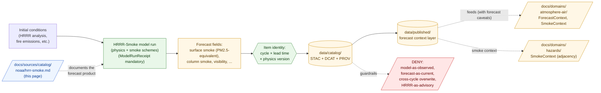

<!-- [KFM_META_BLOCK_V2]
doc_id: kfm://doc/docs-sources-catalog-noaa-hrrr-smoke
title: HRRR-Smoke Forecast
type: product-page
version: v0.2
status: draft
owners: <PLACEHOLDER — Docs steward + Source steward for noaa + Atmosphere/Air/Climate steward + Hazards steward>
created: 2026-05-21
updated: 2026-05-22
policy_label: public
related:
  - docs/sources/catalog/noaa/README.md
  - docs/sources/catalog/noaa/IDENTITY.md
  - docs/sources/catalog/noaa/RIGHTS-AND-SENSITIVITY-MAP.md
  - docs/sources/catalog/noaa/goes-abi-aod.md
  - docs/sources/catalog/noaa/hms-fire-smoke.md
  - docs/sources/catalog/README.md
  - docs/domains/atmosphere/README.md
  - docs/domains/hazards/README.md
  - docs/doctrine/directory-rules.md
  - docs/standards/PROV.md
  - docs/adr/ADR-0001-schema-home.md
tags: [kfm, docs, sources, catalog, noaa, hrrr-smoke, forecast, nwp, modeled, atmosphere-air, hazards]
notes:
  - "PROPOSED product-page scaffold; sibling-link presence and repo path NEEDS VERIFICATION."
  - "PROPOSED path under docs/sources/catalog/noaa/ — per-family-folder convention, parallel to other NOAA sub-products."
  - "Default source_role is modeled (with mandatory ModelRunReceipt). HRRR-Smoke is a numerical weather prediction with smoke physics — a FORECAST, not an observation or satellite retrieval."
  - "Forecast cycle and lead time are part of Item identity — re-runs produce new Items, not updates."
  - "Dominant anti-collapse: model fields are not observations (CONFIRMED DOM-AIR §I doctrine); modeled surface PM2.5 is not an observed PM2.5 reading."
[/KFM_META_BLOCK_V2] -->

# HRRR-Smoke Forecast

> NOAA's **HRRR-Smoke** numerical weather prediction — admitted as a **modeled forecast** with a mandatory `ModelRunReceipt` pinning cycle, lead time, and physics version. **Model fields are not observations.** A forecast surface PM2.5 value is not a measured PM2.5 reading.

[](#status)
[](#status)
[-purple)](#source-role-posture)
[](#repo-fit)
[](#anti-collapse-a-forecast-is-not-an-observation)
[](#rights-and-sensitivity)
[](../../../doctrine/directory-rules.md)
<!-- TODO: replace placeholder Shields.io targets once CI/badge generation is wired (see KFM-P3-FEAT-0005). -->

**Status:** PROPOSED — scaffold only · **Family:** [`noaa`](./README.md) · **Default `source_role`:** `modeled` (forecast, with mandatory `ModelRunReceipt`) · **Domains served:** `atmosphere-air` (primary) + `hazards` (adjacency) · **Owners:** *PLACEHOLDER* · **Last reviewed:** 2026-05-22

---

## Quick jump

- [Overview](#overview)
- [Source-role posture](#source-role-posture)
- [Anti-collapse: a forecast is not an observation](#anti-collapse-a-forecast-is-not-an-observation)
- [Repo fit](#repo-fit)
- [Source authority](#source-authority)
- [Catalog profiles used](#catalog-profiles-used)
- [Collection identity](#collection-identity)
- [Provenance fields](#provenance-fields)
- [Receipts and transforms](#receipts-and-transforms)
- [Forecast cycle, lead time, valid time](#forecast-cycle-lead-time-valid-time)
- [Output variables](#output-variables)
- [Quality and uncertainty](#quality-and-uncertainty)
- [Geometry and projection](#geometry-and-projection)
- [Rights and sensitivity](#rights-and-sensitivity)
- [Downstream consumers](#downstream-consumers)
- [Validation and catalog closure](#validation-and-catalog-closure)
- [Related contracts and schemas](#related-contracts-and-schemas)
- [Related connectors and pipelines](#related-connectors-and-pipelines)
- [Examples](#examples)
- [Open questions](#open-questions)
- [Related docs](#related-docs)

---

## Overview

> [!NOTE]
> **PROPOSED scaffold.** This page describes a candidate product slice of the `noaa` source family. Scope, cadence, geographic coverage, current endpoint URLs, rights terms, and license status are **NEEDS VERIFICATION** and must be settled against `data/registry/sources/` and current source endpoints before any catalog promotion.

**Product slice.** *HRRR-Smoke* is the smoke-enabled variant of NOAA's High-Resolution Rapid Refresh (HRRR) numerical weather prediction model. It is a **physics-based forecast** that adds smoke emissions, transport, and removal physics on top of the operational HRRR. Outputs include forecast surface smoke (often reported as a modeled PM2.5 equivalent), vertically integrated smoke, near-surface visibility under smoke loading, and related fields.

It is a **forecast**, not an observation. It is **not** a satellite retrieval. It is **not** an analyst-reviewed product. It is the output of a numerical model run against initial conditions and physics parameterizations, and every output value carries forecast uncertainty.

PROPOSED — four doctrinal anchors apply (CONFIRMED doctrine; PROPOSED implementation):

- **Model fields are not observations.** Per **DOM-AIR §I** (CONFIRMED doctrine, quoted verbatim): *"AQI is not concentration; AOD is not PM2.5; model fields are not observations; low-cost sensor public release requires correction, caveats, confidence, and limitations."* This is the dominant anti-collapse for HRRR-Smoke.
- **A `ModelRunReceipt` is mandatory.** Per Atlas Ch. 24.1.3 source-role vocabulary, `source_role: modeled` requires `role_model_run_ref → ModelRunReceipt`. Per Atlas Ch. 24.2: *if no receipt exists, the operation did not happen in the governed sense.*
- **Forecast cycle and lead time are part of identity.** A forecast issued at the 06Z cycle is a different artifact than the same valid-time forecast issued at the 12Z cycle. Cycle, lead time, and physics version must be part of the Item ID — parallel to engine-version-in-identity for OCR ([`ocr-full-text.md`](../newspapers/ocr-full-text.md)) and algorithm-version-in-identity for AOD ([`goes-abi-aod.md`](./goes-abi-aod.md)).
- **HRRR-Smoke is not an alert authority.** Inherits the NOAA family life-safety red line (CONFIRMED DOM-HAZ doctrine: *"KFM Hazards is not an emergency alert system and must not provide life-safety instructions"*). NOAA issues HRRR-Smoke operationally; **KFM** does not republish it as actionable guidance.

This page is a **product-page**: it describes the slice's *catalog identity*, *profile usage*, *provenance fields*, *receipt requirements*, *forecast time-role discipline*, *anti-collapse rules*, and *validation gates*. It is **not** a duplicate of the `SourceDescriptor`, the policy bundle, or the rights map — those live in their respective responsibility roots and are linked from here.

[↑ back to top](#hrrr-smoke-forecast)

---

## Source-role posture

> [!CAUTION]
> **Default `source_role` for HRRR-Smoke items is `modeled`** (per Atlas Ch. 24.1.3, source-role vocabulary). HRRR-Smoke produces forecast values from a physics-based model run; no output value is a measurement. Downstream consumers that treat HRRR-Smoke surface PM2.5 as if it were a PM2.5 observation violate both the source-role anti-collapse rule and the explicit DOM-AIR doctrine.

| `source_role` candidate | When it applies to an HRRR-Smoke item | Promotion gate |
|---|---|---|
| `modeled` | **Default.** Every HRRR-Smoke output field at every cycle and lead time. | `ModelRunReceipt` with `model_id: "noaa-hrrr-smoke"`, `model_version`, `parameters` (cycle, lead time, physics suite), `run_time`, `uncertainty_surface_ref` (if available), `validation_ref`. |
| `aggregate` | Spatial or temporal aggregates (county-mean forecast, hourly composite). | `AggregationReceipt` pinning geometry-scope and aggregation method. |
| `candidate` | Unmerged or quarantined HRRR-Smoke admission. | `role_candidate_disposition: pending`; PUBLISHED edge forbidden until `merged`. |
| `observation` | **Not applicable.** Forecast values are predictions; they are never observations of any surface or atmospheric state. | — |
| `authority` | **Not applicable.** A forecast is never authority for any actual condition; it is evidence about a predicted condition. | — |
| `synthetic` | **Not applicable.** HRRR-Smoke models a real atmospheric process; a synthetic field constructed *as* a HRRR-Smoke output would be `synthetic` and require a Reality Boundary Note. | — |

**Anti-collapse rule** (CONFIRMED doctrine; PROPOSED realization): the catalog must preserve `kfm:source_role: modeled` across every derivation hop. A HRRR-Smoke forecast value cannot be re-emitted as `observation` of any property the model predicts, no matter how confident the validation against ground truth has been historically.

[↑ back to top](#hrrr-smoke-forecast)

---

## Anti-collapse: a forecast is not an observation

> [!WARNING]
> CONFIRMED DOM-AIR §I doctrine: ***"AQI is not concentration; AOD is not PM2.5; model fields are not observations; low-cost sensor public release requires correction, caveats, confidence, and limitations."***
>
> The phrase *"model fields are not observations"* is direct doctrine. HRRR-Smoke is one of the products that phrase most clearly addresses: a physics-based forecast surface PM2.5 field is **not** a PM2.5 observation, even when it agrees with ground-based monitors during validation.

### What HRRR-Smoke *is*, and what it is *not*

| HRRR-Smoke **is** | HRRR-Smoke **is not** |
|---|---|
| A numerical weather prediction with added smoke emissions, transport, and removal physics. | A direct measurement of smoke, aerosol, or PM2.5. |
| A **forecast** — values at lead times beyond the analysis hour are predictions of a future state. | A nowcast of current ground conditions. |
| Produced on a defined regional grid at a defined horizontal resolution. | A pixel-accurate ground truth at any specific point within that grid. |
| Useful for forecast-window planning and smoke-context framing alongside observations. | A substitute for ground-based monitors (AirNow, AQS, Mesonet). |
| Calibrated against and evaluated against observations. | Itself an observation. The calibration target and the calibrated product are distinct artifacts. |
| Cycle- and lead-time-specific. | Re-runnable as if all cycles were equivalent. The 06Z cycle and the 12Z cycle for the same valid time are different forecasts and different Items. |

### Denied operations for this product (PROPOSED gates)

- **Model-as-observed denial** *(CONFIRMED DOM-AIR validator)* — items relabeled `source_role: observation` of any modeled field **fail closed**.
- **HRRR-Smoke surface PM2.5 cited as a PM2.5 reading** — joins or summaries that treat the modeled field as a measurement **fail closed**.
- **HRRR-Smoke cited as an air-quality advisory** — packaging as actionable advisory **fails closed**; KFM is not an air-quality alert authority. Same red line as the rest of the NOAA family (see [§ Rights and sensitivity](#rights-and-sensitivity)).
- **Forecast-as-current-state collapse** — a forecast item rendered as "this is what is happening now" without the lead-time and uncertainty caveats **fails closed**.
- **Cross-cycle overwrite** — a later cycle silently overwriting an earlier cycle's Item for the same valid time **fails closed** (the two are distinct artifacts; see [§ Forecast cycle, lead time, valid time](#forecast-cycle-lead-time-valid-time)).
- **HRRR-Smoke as observed smoke for HMS-style detection** — modeled smoke fields **fail closed** when re-tagged as observed smoke plumes (which is HMS's role; see [`hms-fire-smoke.md`](./hms-fire-smoke.md)).

[↑ back to top](#hrrr-smoke-forecast)

---

## Repo fit

> [!IMPORTANT]
> **PROPOSED path.** This file is authored at `docs/sources/catalog/noaa/hrrr-smoke.md`. The per-family-folder layout (`docs/sources/catalog/<family>/<product>.md`) parallels the newspaper product-page series and the NOAA-family siblings `goes-abi-aod.md` and `hms-fire-smoke.md`.

| Direction | Neighbor | Relationship |
|---|---|---|
| **Upstream (parent)** | [`README.md`](./README.md) | NOAA family-level orientation; this product is one slice. |
| **Sibling** | [`IDENTITY.md`](./IDENTITY.md) | Collection-id and namespace rules for the NOAA family. |
| **Sibling** | [`RIGHTS-AND-SENSITIVITY-MAP.md`](./RIGHTS-AND-SENSITIVITY-MAP.md) | Family rights / sensitivity decisions; this page does **not** restate policy. |
| **Sibling** | [`goes-abi-aod.md`](./goes-abi-aod.md) | Satellite-retrieval sibling (also `modeled`-default but retrieval, not forecast). |
| **Sibling** | [`hms-fire-smoke.md`](./hms-fire-smoke.md) | Analyst-augmented sibling; the *observed/analyst* smoke product to HRRR-Smoke's *forecast* smoke product. |
| **Cross-family sibling** | [`../newspapers/ocr-full-text.md`](../newspapers/ocr-full-text.md) | Structural parallel for `ModelRunReceipt`-mandatory products with version-in-identity. |
| **Upstream (root)** | [`../README.md`](../README.md) | Catalog landing page. |
| **Cross-root (data)** | [`data/registry/sources/`](../../../../data/registry/sources/) | Authoritative `SourceDescriptor` home; not duplicated here. |
| **Cross-root (domain, primary)** | [`docs/domains/atmosphere/`](../../../domains/atmosphere/) | Domain owner of `ForecastContext`, `SmokeContext`, `WindField`, and the *"model fields are not observations"* doctrine. |
| **Cross-root (domain, adjacency)** | [`docs/domains/hazards/`](../../../domains/hazards/) | Smoke / fire context consumer. |
| **Doctrine** | [`docs/doctrine/directory-rules.md`](../../../doctrine/directory-rules.md) | Placement authority and lifecycle law. |



> [!NOTE]
> Diagram reflects the **canonical forecast pattern** (initial conditions → model run → outputs identified by cycle × lead time × physics version → catalog → published, with explicit DENY paths). Specific subpaths are PROPOSED until mounted-repo inspection confirms presence.

[↑ back to top](#hrrr-smoke-forecast)

---

## Source authority

The authoritative `SourceDescriptor` for any HRRR-Smoke admission lives in [`data/registry/sources/`](../../../../data/registry/sources/) (PROPOSED path per Directory Rules §6).

> [!WARNING]
> **Do not duplicate descriptor fields here.** This page references identity, role, rights, sensitivity, and cadence — it does not own them. If a field appears to disagree with the `SourceDescriptor`, the descriptor wins, and a drift entry should open in `docs/registers/DRIFT_REGISTER.md`.

PROPOSED — the descriptor for this slice should at minimum carry:

- `source_id` — stable identifier (e.g., `noaa-hrrr-smoke-<version>` or similar); NEEDS VERIFICATION against any existing convention.
- `source_role` — `modeled` by default (see [§ Source-role posture](#source-role-posture)); **never** `observation` for any forecast field.
- `role_authority` — NOAA NCEP / ESRL / GSL (whichever is the current operational steward — NEEDS VERIFICATION).
- `role_model_run_ref` — `EvidenceRef → ModelRunReceipt` (**MUST**, per Atlas Ch. 24.1.3 when `source_role = modeled`).
- `rights` — license, redistribution terms, attribution. HRRR-Smoke is generally a U.S. government work in the public domain; per-product terms NEEDS VERIFICATION.
- `sensitivity` — tier per [`RIGHTS-AND-SENSITIVITY-MAP.md`](./RIGHTS-AND-SENSITIVITY-MAP.md).
- `cadence` — typically hourly cycles with sub-hourly forecast steps out to a finite lead time horizon; exact cadence NEEDS VERIFICATION against current NOAA documentation.
- `ingest_hash` — content-addressable digest of the admitted product.

NEEDS VERIFICATION: actual `SourceDescriptor` schema field names and required-vs-optional status against `schemas/contracts/v1/source/` (per ADR-0001).

[↑ back to top](#hrrr-smoke-forecast)

---

## Catalog profiles used

PROPOSED — HRRR-Smoke items map across the standard KFM-STAC / DCAT / PROV-O profile triad (per KFM-P1-PROG-0021 and KFM-P32-IDEA-0005). Which lanes this product actually emits is **NEEDS VERIFICATION**.

| Profile | Lane | Used by this product? | Notes |
|---|---|---|---|
| STAC 1.1 | `data/catalog/stac/` | PROPOSED — **Yes** (NEEDS VERIFICATION) | Per-cycle, per-lead-time, per-output-variable Items (or grouped where appropriate); STAC Projection extension required. |
| DCAT | `data/catalog/dcat/` | PROPOSED — Yes / No (NEEDS VERIFICATION) | Distribution mapping for downloadable forecast archives. |
| PROV-O | `data/catalog/prov/` | PROPOSED — **Yes (required)** | The model run is a `prov:Activity`; `wasDerivedFrom` links to initial conditions and emissions inventories; `used` links to model parameters; `wasAttributedTo` to NOAA NCEP / ESRL / GSL. |
| Domain projection | `data/catalog/domain/atmosphere-air/` (primary) and `data/catalog/domain/hazards/` (adjacency) | PROPOSED — **Yes (both)** | Projects into `ForecastContext` and `SmokeContext` (DOM-AIR); smoke adjacency feeds Hazards `SmokeContext` with the AC anti-collapse caveats. |

> [!TIP]
> For HRRR-Smoke the most important KFM-namespaced fields are `kfm:run_receipt_ref` (resolves to the `ModelRunReceipt` for the model cycle) and the proposed `kfm:hrrr_smoke.*` extension fields documenting cycle, lead time, and physics version.

[↑ back to top](#hrrr-smoke-forecast)

---

## Collection identity

- **PROPOSED Collection ID pattern.** `kfm-noaa-hrrr-smoke` for the unified product; per-variable sub-Collections (`kfm-noaa-hrrr-smoke-surface-pm`, `kfm-noaa-hrrr-smoke-column-smoke`, `kfm-noaa-hrrr-smoke-visibility`) are an option pending [OPEN-HRRR-04](#open-questions).
- **PROPOSED namespace.** `kfm:` — pending resolution of *OPEN-DSC-03* (namespace canonicalization). NEEDS VERIFICATION.
- **PROPOSED Item ID rule.** Deterministic basis: `product + physics_version + cycle (YYYYMMDDHH) + lead_time_hours + variable + tile_or_grid_locator + normalized_digest`. **Physics version, cycle, and lead time are part of identity** — re-runs produce new Items, not updates.
- **Asset roles.** NEEDS VERIFICATION — confirm against `schemas/contracts/v1/source/`. Candidate roles: `data` (the forecast raster, e.g., COG or GRIB-derived), `metadata` (run parameters), `uncertainty` (if uncertainty fields are available — NEEDS VERIFICATION), `thumbnail`.

[↑ back to top](#hrrr-smoke-forecast)

---

## Provenance fields

STAC `properties.kfm:provenance` block (PROPOSED — Pass-10 C4-01 / KFM-P3-IDEA-0004):

| Field | Resolves to | Required when | Notes |
|---|---|---|---|
| `spec_hash` | sha256 of the canonical record (JCS+SHA-256) | always | Anchors record identity. |
| `evidence_bundle_ref` | `kfm://evidence/<digest>` | claim-bearing items | Resolves to the EvidenceBundle backing any non-trivial assertion. |
| `run_record_ref` | `kfm://run/<run-id>` | always | Pins the orchestrated KFM run that ingested the artifact. |
| `model_run_ref` | `kfm://model-run/<id>` → `ModelRunReceipt` | **always for HRRR-Smoke** | Pins the model cycle, physics version, initial conditions, and lead time. |
| `audit_ref` | `kfm://audit/<attestation-id>` | promoted items | DSSE / Cosign attestation; surfaces under `kfm:proof_ref`. |
| `policy_digest` | sha256 of the policy bundle in force at promotion | promoted items | Lets reviewers reproduce the gate (forecast caveat banner, model-as-observed denial, etc.). |
| `source_role` | enum: `modeled` \| `aggregate` \| `candidate` | always | **Default `modeled`.** Never `observation` of any surface property. |
| `kfm:hrrr_smoke.cycle` | string (e.g., `2026-05-22T06:00:00Z`) | always | Forecast cycle issue time. |
| `kfm:hrrr_smoke.lead_time_hours` | integer | always | Lead time from cycle to the valid time of this Item. `0` for the analysis hour. |
| `kfm:hrrr_smoke.physics_version` | string (semver or NOAA-issued version tag) | always | Pins the physics suite; part of Item identity. |
| `kfm:hrrr_smoke.variable` | enum (e.g., `surface_pm25`, `column_smoke`, `near_surface_visibility`) | always | The forecast variable carried in this Item. |

Per-asset integrity: STAC `file:checksum` for every asset.

> [!NOTE]
> NEEDS VERIFICATION — exact field names, especially the `kfm:hrrr_smoke.*` extension fields, need to be reconciled against the live `kfm-stac-extension.md` if one exists in the repo. The `variable` enum values are illustrative; NEEDS VERIFICATION against authoritative NOAA HRRR-Smoke documentation.

[↑ back to top](#hrrr-smoke-forecast)

---

## Receipts and transforms

CONFIRMED doctrine: *KFM uses receipts to make consequential transformations inspectable.* An NWP forecast run is a consequential transformation par excellence. The mandatory receipt is the `ModelRunReceipt` (per Atlas Ch. 24.2.1).

| Receipt | Triggered by | Required content (PROPOSED shape) |
|---|---|---|
| **`SourceDescriptor`** (anchor, not a receipt) | Admission of HRRR-Smoke as a sub-source of the NOAA family. | `source_id`, `source_role`, `role_authority`, `rights`, `sensitivity`, `cadence`, `ingest_hash`, `time`, `citation`. |
| **`ModelRunReceipt`** *(mandatory for HRRR-Smoke)* | Each model cycle. | `model_id: "noaa-hrrr-smoke"`, `model_version` (physics suite version), `inputs[]` (initial conditions refs, emissions inventory refs, boundary conditions refs), `parameters` (cycle time, grid configuration, time-step, physics flags), `run_time`, `uncertainty_surface_ref` (if available), `validation_ref` (against AirNow / AQS / Mesonet where available). |
| **`TransformReceipt`** | KFM-side reprojection, generalization, or unit conversion for downstream layers. | `input_geom_hash`, `output_geom_hash`, `transform`, `parameters`, `tolerance`, `timestamp`, `actor`. |
| **`AggregationReceipt`** | County-mean forecast, daily-max forecast, multi-cycle ensemble (if KFM constructs one). | `geometry_scope`, `time_scope`, `aggregation_method`, `input_source_refs`, `suppression_rule`. |
| **`ValidationReport`** | WORK → PROCESSED and PROCESSED → CATALOG transitions. | `validator_id`, `target`, `passes[]`, `failures[]`, `time`, `deterministic_inputs`. |

> [!CAUTION]
> A re-run with a different physics version, a different initial-conditions configuration, or a different cycle **produces a new Item**, not an update. Silently overwriting a HRRR-Smoke Asset with a different cycle's output violates the `source_role` anti-collapse rule, breaks forecast verification (because the historical forecast cannot be retrieved), and obscures the very thing forecast users need: the as-issued forecast that was in force at any given past time.

[↑ back to top](#hrrr-smoke-forecast)

---

## Forecast cycle, lead time, valid time

> [!IMPORTANT]
> Forecasts make the standard KFM time-role distinctions **load-bearing** in a way most other products do not. A HRRR-Smoke Item's "when" is not a single timestamp — it is at least three timestamps. Collapsing any of them is a publication failure.

| Time concept | Definition for HRRR-Smoke | Examples |
|---|---|---|
| **Cycle (issue time)** | When the model was initialized and run. | `2026-05-22T06:00:00Z` (the 06Z cycle). |
| **Lead time** | Hours from cycle to the valid time of the forecast step. | `0` = analysis; `1` = 1-hour forecast; `18` = 18-hour forecast. |
| **Valid time** | The clock time the forecast describes. | `cycle + lead_time_hours`. |
| **Retrieval time** | When KFM ingested the cycle's output. | Distinct from `cycle`; ingest may post-date the cycle by minutes to hours. |
| **Release time** | When KFM promoted the catalog Item. | Distinct from `retrieval_time`; promotion adds latency. |

### Mapped to the standard KFM time-role table

| KFM time role | HRRR-Smoke meaning | Status |
|---|---|---|
| `source_time` | Cycle issue time | PROPOSED |
| `observed_time` | **Not applicable** — there is no observation at this layer. Forecasts predict; they do not observe. | PROPOSED (intentionally null) |
| `valid_time` | The atmospheric state time the forecast describes (`cycle + lead_time_hours`) | PROPOSED |
| `retrieval_time` | When KFM ingested the forecast | PROPOSED |
| `release_time` | When KFM promoted the Item | PROPOSED |
| `correction_time` | Time of any post-release correction (re-run with revised inputs, or supersession by a later cycle) | PROPOSED |

> [!WARNING]
> **Do not collapse `valid_time` and `source_time`.** A 12-hour HRRR-Smoke forecast issued at 00Z has `source_time = 00Z` and `valid_time = 12Z`. Surfacing only the cycle time on a public layer creates a "this is what is happening now" framing that is **false** — it is what was *predicted* to happen.
>
> **Do not silently supersede earlier cycles with later cycles.** The 06Z cycle's 12Z forecast and the 12Z cycle's 12Z analysis are different artifacts. Both have value (forecast verification, as-issued retrospection). Replacing one with the other in-place loses verifiable history.

NEEDS VERIFICATION — confirm time-role tests exist or are PROPOSED in `tests/`.

[↑ back to top](#hrrr-smoke-forecast)

---

## Output variables

HRRR-Smoke produces multiple output fields. KFM admits each as a distinct catalog Asset (or a distinct Item) so that downstream consumers can request only the variable they need and so that anti-collapse rules can be enforced per-variable.

PROPOSED variables (NEEDS VERIFICATION against authoritative NOAA HRRR-Smoke documentation):

| Variable | What it represents | Common downstream misuse to deny |
|---|---|---|
| Forecast surface smoke (often reported as a PM2.5-equivalent) | Modeled near-surface aerosol mass concentration from smoke | Cited as a PM2.5 reading; cited as an air-quality advisory. |
| Forecast vertically integrated (column) smoke | Modeled column-integrated smoke aerosol | Cited as a smoke detection (that role is HMS / FIRMS); cited as a surface concentration. |
| Forecast near-surface visibility under smoke loading | Modeled visibility | Cited as observed visibility; cited as transportation guidance. |
| Wind / temperature / humidity fields | Standard NWP fields from the underlying HRRR | Cited as observations (parallel `model-as-observed` collapse). |

> [!CAUTION]
> The `surface PM2.5-equivalent` framing is the highest-collapse-risk variable in this list. Display surfaces should label it as a *modeled forecast* — not as PM2.5 — and pair it with the actual PM2.5 observation stack (AirNow / AQS / Mesonet) when the user is asking an air-quality question.

[↑ back to top](#hrrr-smoke-forecast)

---

## Quality and uncertainty

PROPOSED — HRRR-Smoke items carry forecast quality and uncertainty information as first-class data. NEEDS VERIFICATION — exact field shapes against any existing quality schema.

| Metric | Granularity | Use |
|---|---|---|
| **Lead time** | per-Item | Forecast confidence generally degrades with lead time; downstream layers can stratify display by lead time. |
| **Physics version drift** | per-cycle | Major physics-suite version changes warrant a `CorrectionNotice` to downstream consumers. |
| **Initial-conditions provenance** | per-cycle | Which HRRR analysis cycle and which emissions inventory fed this run; surfaces as PROV-O `wasDerivedFrom` edges. |
| **Validation against ground monitors** | per-cycle or per-domain | Comparison of forecast surface smoke against AirNow / AQS / Mesonet; produces `validation_ref` when available. |
| **Forecast envelope / uncertainty** | per-pixel or per-variable | If HRRR-Smoke distributes uncertainty fields, KFM admits them as a separate Asset; otherwise, the absence is recorded. |

> [!TIP]
> Quality metrics drive a **trust-and-freshness badge** (per KFM-P3-FEAT-0005). For HRRR-Smoke the badge says *"this is how confident the forecast model is at this lead time"* — not *"this is how reliable the actual atmosphere is."* Two distinct trust axes; do not conflate.

---

## Geometry and projection

PROPOSED — HRRR-Smoke is delivered on a defined regional grid:

| Concern | Posture | Status |
|---|---|---|
| **Native CRS** | The HRRR Lambert Conformal Conic grid (CONUS extent) | NEEDS VERIFICATION — confirm exact projection definition and EPSG / WKT against current NOAA documentation. |
| **Horizontal resolution** | Typically 3 km nominal; NEEDS VERIFICATION against any current operational change. | PROPOSED. |
| **Resampled CRS** | For Kansas-focused public layers, resampling to a regional projection via `TransformReceipt`. | PROPOSED. |
| **Scale support** | The 3 km grid is appropriate for regional-to-county summaries; sub-county point claims need explicit caveats. | PROPOSED. |
| **Generalization** | None at the raw model output; spatial aggregation (county-mean, watershed-mean) produces derived layers under `source_role: aggregate` with `AggregationReceipt`. | PROPOSED. |
| **STAC Projection extension** | Required (`proj:code`, `proj:bbox`, `proj:geometry`, `proj:shape`, `proj:transform`) per KFM-P27-FEAT-0003. | PROPOSED. **MANDATORY** for this raster product. |

NEEDS VERIFICATION — confirm against `data/catalog/` artifacts and any HRRR fixtures in `tests/` or `fixtures/`.

---

## Rights and sensitivity

> [!IMPORTANT]
> **Do not restate policy here.** Sensitivity tier, redaction rules, and reveal posture are decided in [`policy/sensitivity/`](../../../../policy/sensitivity/) and summarized in the sibling [`RIGHTS-AND-SENSITIVITY-MAP.md`](./RIGHTS-AND-SENSITIVITY-MAP.md). This section names the *kinds of risks* the product introduces, not the *decisions* taken against them.

PROPOSED risk surfaces — NEEDS VERIFICATION per product:

| Risk surface | Why it matters | Default posture |
|---|---|---|
| **HRRR-as-advisory misuse** | Inherits the NOAA family life-safety red line; HRRR-Smoke is *operational at NCEP/ESRL/GSL*, but **not** a KFM-issued advisory or alert. | DENY public packaging as advisory; route to official sources (AirNow). |
| **Forecast-as-current-state collapse** | A forecast is not a nowcast. Public surfaces that omit the lead-time framing mislead. | Lead-time surfacing mandatory; "model fields are not observations" caveat. |
| **Surface-PM2.5-equivalent misuse** | The modeled surface PM field is the most easily mistaken for a PM2.5 reading. | DENY treatment as an observation; pair with the ground-monitor stack when the question is air quality. |
| **Cross-cycle overwrite** | Replacing earlier forecasts with later cycles loses verifiable history and breaks forecast-skill review. | Item identity includes cycle; later cycles produce new Items, not updates. |
| **Physics-version drift unnoticed** | A NCEP physics upgrade mid-archive creates a discontinuity that downstream comparisons must respect. | Physics version part of identity; `CorrectionNotice` issuance on major-version transitions. |
| **License inheritance** | HRRR-Smoke is generally a U.S. government work in the public domain; per-product terms remain NEEDS VERIFICATION. | License-deny lane until rights confirmed (per Master MapLibre ML-062-016). |

> [!CAUTION]
> CONFIRMED doctrine: *Operational warning products are contextual only and not for life safety; unknown source roles are quarantined; expired operational context cannot appear as current warning state.* (DOM-HAZ §I.) HRRR-Smoke is an operational forecast product; the same posture applies.

[↑ back to top](#hrrr-smoke-forecast)

---

## Downstream consumers

HRRR-Smoke is **forecast context** for several products and surfaces. The catalog should make this lineage explicit via PROV-O links and via `kfm:source_role` propagation.

| Downstream consumer | What it derives from HRRR-Smoke | Its default `source_role` |
|---|---|---|
| Atmosphere/Air `ForecastContext` layer | Direct rendering of HRRR-Smoke forecast fields with lead-time framing and forecast caveats | `modeled`; not an observation. |
| Atmosphere/Air `SmokeContext` (forecast side) | Modeled smoke fields paired with HMS observed smoke polygons | `modeled` for the HRRR-Smoke side; HMS smoke polygons remain their own `modeled` (analyst) artifact (see [`hms-fire-smoke.md`](./hms-fire-smoke.md)). |
| Hazards `SmokeContext` (adjacency) | Smoke-forecast context for hazards framing | `modeled`; never a hazards-domain authority for ground conditions. |
| Forecast-vs-observation comparison products | HRRR-Smoke surface PM next to AirNow / AQS / Mesonet observed PM (per Pass-10 C10-02 air-quality stack) | `modeled` for the HRRR side; `observed` for the monitor side; the comparison itself is a separate `aggregate`/derived artifact with its own receipts. |
| Vegetation-change masking | HRRR-Smoke surface or column smoke as a candidate masking input (alongside HMS, MAIAC; per KFM-P20-PROG-0005) | Used as a **mask input**; the downstream alert carries its own receipts. |
| Focus Mode answers | Bounded evidence context for forecast / smoke questions | `AIReceipt` mandatory; cite as **forecast** at a stated lead time, not as observed conditions. |

[↑ back to top](#hrrr-smoke-forecast)

---

## Validation and catalog closure

PROPOSED gates that apply to this product before public release:

- **Catalog closure required before public release** — DCAT, STAC, and PROV records must trace bundle identity, inputs, artifacts, checks, producer, and promotion metadata (per Pass-10 / KFM-P26-IDEA-0007). PROPOSED.
- **STAC Projection lint** — `proj:code`, `proj:bbox`, `proj:geometry`, `proj:shape`, `proj:transform` compliance (per KFM-P27-FEAT-0003). PROPOSED. **MANDATORY** for this raster product.
- **STAC checksum closure** — `file:checksum` for every Asset must match the ReleaseManifest digest (per KFM-P22-PROG-0037). PROPOSED.
- **`ModelRunReceipt` presence test** — every HRRR-Smoke Item must carry a resolvable `model_run_ref`. Items with missing / dangling receipts fail closed. **PROPOSED, MANDATORY**.
- **Cycle-and-lead-time-in-identity test** — re-runs with different cycle or lead time must produce new Items; silent in-place overwrite fails closed. **PROPOSED, MANDATORY**.
- **Model-as-observed denial test** *(CONFIRMED DOM-AIR validator)* — items relabeled `source_role: observation` of any modeled field fail closed.
- **Forecast-as-current-state denial test** — items rendered without lead-time framing fail closed at the publication gate.
- **Cross-cycle-overwrite denial test** — a later cycle attempting to overwrite an earlier cycle's Item for the same valid time fails closed.
- **HRRR-as-advisory denial test** — items packaged as actionable advisories fail closed; carries the doctrinal red line from the NOAA family entry.
- **Surface-PM-equivalent-as-observation denial test** — the most easily confused variable carries an explicit per-variable test.
- **Physics-version-transition test** — major physics-suite version changes trigger a `CorrectionNotice` to downstream consumers.
- **Rights propagation test** — `rights` field must be resolved before contentful delta emission (per ML-062-016). PROPOSED.
- **Source-role anti-collapse test** *(per KFM-P17-IDEA-0004)* — items must not re-emit HRRR-Smoke as `authority` or `observation`. PROPOSED.

NEEDS VERIFICATION — confirm which of these are realized in `tests/`, `pipelines/validate/`, or CI workflows.

---

## Related contracts and schemas

| Artifact | PROPOSED path | Status |
|---|---|---|
| Source descriptor schema | `schemas/contracts/v1/source/` | NEEDS VERIFICATION — per ADR-0001. |
| `ForecastContext` object schema | `schemas/contracts/v1/atmosphere-air/forecast-context.schema.json` | PROPOSED — DOM-AIR §E object family. |
| `SmokeContext` object schema | `schemas/contracts/v1/hazards/smoke-context.schema.json` or `schemas/contracts/v1/atmosphere-air/smoke-context.schema.json` | PROPOSED — domain ownership pending (OPEN-HMS-08 carried forward as OPEN-HRRR-08). |
| `ModelRunReceipt` schema | `schemas/contracts/v1/receipts/model-run-receipt.schema.json` | PROPOSED — per Atlas Ch. 24.2. |
| `TransformReceipt` schema | `schemas/contracts/v1/receipts/transform-receipt.schema.json` | PROPOSED. |
| `AggregationReceipt` schema | `schemas/contracts/v1/receipts/aggregation-receipt.schema.json` | PROPOSED. |
| STAC extension reference | `docs/standards/PROV.md`, `kfm-stac-extension.md` | PROPOSED — *PROV.md* vs *PROVENANCE.md* pending ADR (Directory Rules §18 OPEN-DR-01). |
| Family policy bundle | `policy/release/atmosphere/`, `policy/release/hazards/`, `policy/sensitivity/` | NEEDS VERIFICATION — owned by policy/, not this page. |

---

## Related connectors and pipelines

PROPOSED — typical wiring (NEEDS VERIFICATION per product):

- **Connector**: `connectors/noaa/hrrr-smoke/` (PROPOSED) under the unified NOAA connector layout from the NOAA family entry. v0.1 referenced a standalone `connectors/hrrr_smoke/` empty stub; resolve before code lands (OPEN-HRRR-09).
- **HRRR-Smoke ingest pipeline**: `pipelines/normalize/hrrr-smoke/` (PROPOSED) — admits each cycle, decodes the model output (typically GRIB-derived), emits `ModelRunReceipt`.
- **Variable-split pipeline**: `pipelines/normalize/hrrr-smoke-variables/` (PROPOSED) — splits the multi-variable output into per-variable Assets or Items.
- **Validation pipeline**: `pipelines/validate/hrrr-smoke-vs-monitors/` (PROPOSED) — comparison against AirNow / AQS / Mesonet where available; produces `validation_ref`.
- **Catalog pipeline**: `pipelines/catalog/` — produces STAC / DCAT / PROV records.
- **Pipeline spec**: `pipeline_specs/noaa/hrrr-smoke/` (PROPOSED).

> [!CAUTION]
> The watcher / connector **never publishes**. Source watchers emit `SourceIntakeRecord` or `DriftSummary`; `PromotionDecision` is what publishes — and only after `ModelRunReceipt` presence, cycle-and-lead-time-in-identity validation, anti-collapse gates, and rights propagation all pass.

---

## Examples

<details>
<summary><strong>Minimal STAC Item shape — single forecast variable / lead time (illustrative, not authoritative)</strong></summary>

> [!NOTE]
> Illustrative only. Do **not** treat as the live schema. See [`_examples/stac-item-example.json`](../_examples/stac-item-example.json) for the canonical minimal shape once it lands. NEEDS VERIFICATION.

```json
{
  "type": "Feature",
  "stac_version": "1.1.0",
  "stac_extensions": [
    "https://stac-extensions.github.io/projection/v1.1.0/schema.json"
  ],
  "id": "kfm-noaa-hrrr-smoke/<physics-version>/<cycle>/<lead-time>/<variable>/<tile>",
  "collection": "kfm-noaa-hrrr-smoke",
  "properties": {
    "datetime": "<valid_time>",
    "kfm:provenance": {
      "spec_hash": "sha256:<...>",
      "evidence_bundle_ref": "kfm://evidence/<digest>",
      "run_record_ref": "kfm://run/<run-id>",
      "model_run_ref": "kfm://model-run/<id>",
      "audit_ref": "kfm://audit/<attestation-id>",
      "policy_digest": "sha256:<...>",
      "source_role": "modeled"
    },
    "kfm:trust_class": "catalog",
    "kfm:hrrr_smoke": {
      "cycle": "<cycle-iso-8601>",
      "lead_time_hours": 12,
      "physics_version": "<semver-or-tag>",
      "variable": "surface_pm25"
    },
    "proj:code": "<EPSG-or-WKT-for-HRRR-LCC-grid>"
  },
  "assets": {
    "data":     { "href": "...", "type": "image/tiff; application=geotiff; profile=cloud-optimized", "roles": ["data"] },
    "metadata": { "href": "...", "type": "application/json",                                         "roles": ["metadata"] }
  },
  "links": [
    { "rel": "collection",   "href": "../collection.json" },
    { "rel": "derived_from", "href": "kfm://source/<hrrr-analysis-source_id>" },
    { "rel": "derived_from", "href": "kfm://source/<emissions-inventory-source_id>" },
    { "rel": "via",          "href": "kfm://model-run/<id>" }
  ]
}
```

</details>

<details>
<summary><strong>Illustrative <code>ModelRunReceipt</code> shape for an HRRR-Smoke cycle (PROPOSED)</strong></summary>

```json
{
  "receipt_class": "ModelRunReceipt",
  "model_id": "noaa-hrrr-smoke",
  "model_version": "<physics-suite-semver-or-tag>",
  "inputs": [
    { "ref": "kfm://source/<hrrr-analysis-source_id>",       "asset_role": "initial_conditions" },
    { "ref": "kfm://source/<emissions-inventory-source_id>", "asset_role": "emissions" },
    { "ref": "kfm://source/<boundary-conditions-source_id>", "asset_role": "boundary_conditions" }
  ],
  "parameters": {
    "cycle": "<cycle-iso-8601>",
    "grid": "HRRR-CONUS-3km",
    "time_step_s": "<value>",
    "lead_time_hours_max": "<value>",
    "physics_flags": "<NOAA-documented-flags>"
  },
  "run_time": "<cycle-iso-8601>",
  "validation_ref": "kfm://artifact/<airnow-aqs-mesonet-comparison-digest>"
}
```

</details>

<details>
<summary><strong>Illustrative quarantine reasons</strong></summary>

| Reason code | When it fires |
|---|---|
| `MODEL_RUN_RECEIPT_MISSING` | HRRR-Smoke Item lacks a resolvable `model_run_ref`. |
| `MODEL_AS_OBSERVED_COLLAPSE` | Item relabeled `source_role: observation` of any modeled field. |
| `FORECAST_AS_CURRENT_STATE_COLLAPSE` | Item rendered without lead-time framing. |
| `SURFACE_PM_AS_OBSERVATION_COLLAPSE` | The surface PM2.5-equivalent variable treated as a measured reading. |
| `CROSS_CYCLE_OVERWRITE_ATTEMPT` | A later cycle attempting to overwrite an existing Item for the same valid time. |
| `PHYSICS_VERSION_TRANSITION_NO_NOTICE` | Major physics-version change without a `CorrectionNotice`. |
| `HRRR_AS_ADVISORY_ATTEMPT` | Forecast packaged as actionable advisory; carries the NOAA family life-safety red line. |
| `LEAD_TIME_FRAMING_MISSING` | Public display surface omits lead time. |
| `RIGHTS_UNRESOLVED` | License terms not confirmed; license-deny lane. |
| `PHYSICS_VERSION_OVERWRITE_ATTEMPT` | A different physics version is attempting to overwrite an existing Item rather than create a new one. |

</details>

---

## Open questions

- **OPEN-HRRR-01** — Confirm authoritative endpoint(s), cadence (hourly cycles?), and forecast lead-time horizon for the current operational HRRR-Smoke product.
- **OPEN-HRRR-02** — Confirm the operational steward (NCEP / ESRL / GSL / other) for `role_authority`.
- **OPEN-HRRR-03** — Confirm rights status. HRRR-Smoke is generally a U.S. government work in the public domain; per-product terms remain NEEDS VERIFICATION.
- **OPEN-HRRR-04** — Confirm whether KFM emits a unified `kfm-noaa-hrrr-smoke` Collection with `kfm:hrrr_smoke.variable` as discriminator, or per-variable sub-Collections. Likely ADR-class.
- **OPEN-HRRR-05** — Confirm the authoritative variable list (`surface_pm25`, `column_smoke`, `near_surface_visibility`, etc.) and naming convention against current NOAA HRRR-Smoke documentation.
- **OPEN-HRRR-06** — Confirm uncertainty-field availability. Does HRRR-Smoke distribute per-pixel uncertainty, or only the deterministic forecast?
- **OPEN-HRRR-07** — Confirm the `physics_version` identifier shape — NOAA-issued tag, semver, or KFM-side derived hash?
- **OPEN-HRRR-08** — Inherits `SmokeContext` schema-home question from HMS sibling (OPEN-HMS-08).
- **OPEN-HRRR-09** — Confirm the connector layout. v0.1 references `connectors/hrrr_smoke/` (empty stub); the NOAA family entry favors `connectors/noaa/<sub-source>/`. Resolve before any code lands.
- **OPEN-HRRR-10** — Should historical HRRR-Smoke archives be admitted (for forecast-skill verification, retrospective analysis), or only the operational rolling window? Storage and rights implications.
- **OPEN-HRRR-11** — Inherits **OPEN-DSC-03** (namespace canonicalization) from family-level.
- **OPEN-HRRR-12** — Resolve `PROV.md` vs `PROVENANCE.md` reference target (Directory Rules §18 OPEN-DR-01).

---

## Related docs

- [`./README.md`](./README.md) — NOAA family landing page.
- [`./IDENTITY.md`](./IDENTITY.md) — Collection-id and namespace rules.
- [`./RIGHTS-AND-SENSITIVITY-MAP.md`](./RIGHTS-AND-SENSITIVITY-MAP.md) — Family rights / sensitivity decisions.
- [`./goes-abi-aod.md`](./goes-abi-aod.md) — Satellite-retrieval sibling (also `modeled`; algorithm-version-in-identity).
- [`./hms-fire-smoke.md`](./hms-fire-smoke.md) — Observed/analyst smoke product (paired with HRRR-Smoke for observation-vs-forecast framing).
- [`./_examples/stac-item-example.json`](./_examples/stac-item-example.json) — Minimal STAC + `kfm:provenance` shape (illustrative).
- [`../README.md`](../README.md) — Catalog root.
- [`../newspapers/ocr-full-text.md`](../newspapers/ocr-full-text.md) — Structural parallel for `ModelRunReceipt`-mandatory products with version-in-identity.
- [`../../../domains/atmosphere/README.md`](../../../domains/atmosphere/README.md) — Primary domain; owner of `ForecastContext`, `SmokeContext`, "model fields are not observations" doctrine.
- [`../../../domains/hazards/README.md`](../../../domains/hazards/README.md) — Adjacency domain consumer.
- [`../../../doctrine/directory-rules.md`](../../../doctrine/directory-rules.md) — Placement authority, lifecycle law, drift register.
- [`../../../standards/PROV.md`](../../../standards/PROV.md) — W3C PROV-O / PAV profile (naming reconciliation pending).
- [`../../../adr/ADR-0001-schema-home.md`](../../../adr/ADR-0001-schema-home.md) — Schema home rule.
- *TODO* — link to the `noaa/hrrr-smoke` connector README once authored.
- *TODO* — link to `kfm-stac-extension.md` once authored.
- *TODO* — link to the `ModelRunReceipt` schema README once authored.
- *TODO* — link to the `ForecastContext` object-family contract once authored.
- *TODO* — link to a future forecast-vs-observation comparison product-page if/when split out.

---

**Last reviewed:** 2026-05-22 *(Claude Code product-page revision session; v0.2 polish pass.)*
**Version:** v0.2 · **Status:** PROPOSED — scaffold only · **Default `source_role`:** `modeled` (forecast, with mandatory `ModelRunReceipt`) · **Domains served:** `atmosphere-air` (primary) + `hazards` (adjacency) · **Owners:** *PLACEHOLDER*

[↑ back to top](#hrrr-smoke-forecast)
