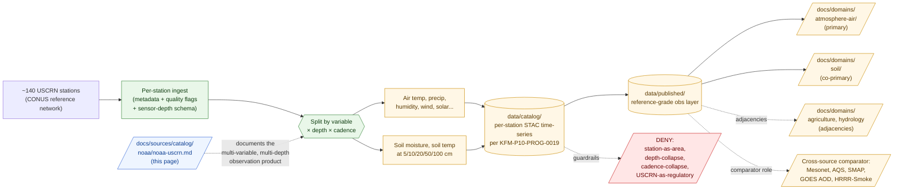

<!-- [KFM_META_BLOCK_V2]
doc_id: kfm://doc/docs-sources-catalog-noaa-noaa-uscrn
title: NOAA U.S. Climate Reference Network
type: product-page
version: v0.2
status: draft
owners: <PLACEHOLDER — Docs steward + Source steward for noaa + Atmosphere/Air/Climate steward + Soil domain steward>
created: 2026-05-21
updated: 2026-05-22
policy_label: public
related:
  - docs/sources/catalog/noaa/README.md
  - docs/sources/catalog/noaa/IDENTITY.md
  - docs/sources/catalog/noaa/RIGHTS-AND-SENSITIVITY-MAP.md
  - docs/sources/catalog/noaa/goes-abi-aod.md
  - docs/sources/catalog/noaa/hms-fire-smoke.md
  - docs/sources/catalog/noaa/hrrr-smoke.md
  - docs/sources/catalog/README.md
  - docs/domains/atmosphere/README.md
  - docs/domains/soil/README.md
  - docs/doctrine/directory-rules.md
  - docs/standards/PROV.md
  - docs/adr/ADR-0001-schema-home.md
tags: [kfm, docs, sources, catalog, noaa, uscrn, climate, reference-network, atmosphere-air, soil, observation, depth-aware]
notes:
  - "PROPOSED product-page scaffold; sibling-link presence and repo path NEEDS VERIFICATION."
  - "PROPOSED path under docs/sources/catalog/noaa/ — per-family-folder convention, parallel to other NOAA sub-products."
  - "Default source_role is observation — USCRN is the canonical reference-grade ground-station observation product. NO ModelRunReceipt required (parallel to legal-notices in that the receipt-class differs from modeled siblings; but unlike legal-notices, USCRN is observation, not authority)."
  - "Multi-domain: atmosphere-air (primary — temperature, precipitation, humidity, wind, solar radiation, surface temperature) + soil (secondary — multi-depth soil moisture and soil temperature). Adjacencies into agriculture and hydrology."
  - "Dominant anti-collapse stack: station ≠ area; depth N ≠ depth M; hourly ≠ daily; reference-grade ≠ regulatory determination; NOT life-safety."
  - "Anchored in KFM-P10-PROG-0019 (CONFIRMED): per-station STAC time-series Items, sensor-depth schema, timezone harmonization, quality flags."
[/KFM_META_BLOCK_V2] -->

# NOAA U.S. Climate Reference Network

> NOAA's **reference-grade** network of ~140 climate stations across the CONUS — admitted as the canonical **`observation`** product for ground-based temperature, precipitation, humidity, wind, solar radiation, and **multi-depth** soil moisture and soil temperature. A station reading is **not** a county truth; a 5 cm reading is **not** a 100 cm reading; an hourly value is **not** a daily value.

[](#status)
[](#status)
[-green)](#source-role-posture)
[](#repo-fit)
[](#multi-variable--multi-depth-output)
[](#spatial-sparseness-and-depth-distinctness)
[](#rights-and-sensitivity)
[](../../../doctrine/directory-rules.md)
<!-- TODO: replace placeholder Shields.io targets once CI/badge generation is wired (see KFM-P3-FEAT-0005). -->

**Status:** PROPOSED — scaffold only · **Family:** [`noaa`](./README.md) · **Default `source_role`:** `observation` (reference-grade ground sensor) · **Domains served:** `atmosphere-air` (primary) + `soil` (secondary) · **Owners:** *PLACEHOLDER* · **Last reviewed:** 2026-05-22

---

## Quick jump

- [Overview](#overview)
- [Source-role posture](#source-role-posture)
- [Spatial sparseness and depth distinctness](#spatial-sparseness-and-depth-distinctness)
- [Multi-variable / multi-depth output](#multi-variable--multi-depth-output)
- [Cross-source comparator role](#cross-source-comparator-role)
- [Repo fit](#repo-fit)
- [Source authority](#source-authority)
- [Catalog profiles used](#catalog-profiles-used)
- [Collection identity](#collection-identity)
- [Provenance fields](#provenance-fields)
- [Receipts and transforms](#receipts-and-transforms)
- [Temporal handling and aggregation](#temporal-handling-and-aggregation)
- [Geometry and projection](#geometry-and-projection)
- [Quality and uncertainty](#quality-and-uncertainty)
- [Rights and sensitivity](#rights-and-sensitivity)
- [Downstream consumers](#downstream-consumers)
- [Validation and catalog closure](#validation-and-catalog-closure)
- [Related contracts and schemas](#related-contracts-and-schemas)
- [Related connectors and pipelines](#related-connectors-and-pipelines)
- [Examples](#examples)
- [Open questions](#open-questions)
- [Related docs](#related-docs)

---

## Overview

> [!NOTE]
> **PROPOSED scaffold.** This page describes a candidate product slice of the `noaa` source family. Specific station counts, depths, cadence values, current endpoint URLs, rights terms, and license status are **NEEDS VERIFICATION** and must be settled against `data/registry/sources/` and current NOAA USCRN documentation before any catalog promotion.

**Product slice.** *NOAA USCRN* (U.S. Climate Reference Network) is a sparse network of high-quality, reference-grade climate stations operated by NOAA NCEI. Each station is engineered for long-term climate monitoring: redundant sensors, regular calibration, controlled siting, and minimal urban-heat-island contamination. Standard USCRN output includes air temperature, precipitation, relative humidity, wind, solar radiation, infrared surface temperature, and — distinctively — soil moisture and soil temperature at multiple depths (commonly 5, 10, 20, 50, and 100 cm; NEEDS VERIFICATION against current documentation).

USCRN is a **direct ground-based observation** product. It is **not** a satellite retrieval (unlike [`goes-abi-aod.md`](./goes-abi-aod.md)), **not** an analyst-augmented analysis (unlike [`hms-fire-smoke.md`](./hms-fire-smoke.md)), and **not** a forecast (unlike [`hrrr-smoke.md`](./hrrr-smoke.md)). It is what the other NOAA products are *forecasting toward, retrieving from, or being validated against*.

PROPOSED — five doctrinal anchors apply (CONFIRMED doctrine; PROPOSED implementation):

- **USCRN is the canonical observation product for ground-station climate variables.** Per **KFM-P10-PROG-0019** (CONFIRMED): *"NRCS AWDB/SCAN and NOAA USCRN should be normalized through station metadata, sensor-depth schema, timezone harmonization, quality flags, and per-station STAC time-series Items."* — this is the load-bearing implementation pattern for the product.
- **USCRN belongs to two domains simultaneously.** **DOM-AIR §D / §E** owns its weather variables (`WeatherStation`, `WeatherObservation`, `TemperatureObservation`, `PrecipitationObservation`, `ClimateNormal`); **DOM-SOIL §D** explicitly lists `NOAA USCRN` as a source family alongside SSURGO, gSSURGO, gNATSGO, Kansas Mesonet, NRCS SCAN, and NASA SMAP for its multi-depth soil observations.
- **Reference-grade ≠ ubiquitous coverage.** ~140 stations CONUS-wide means roughly ~2-3 stations per state on average. A USCRN reading at a specific station is **not** a county-level or regional truth (see [§ Spatial sparseness](#spatial-sparseness-and-depth-distinctness)).
- **Reference-grade ≠ regulatory determination.** USCRN is engineered for *scientific reference quality*, which is a different epistemic claim than *legally binding* (which AQS-style monitors carry for air quality). USCRN does not produce regulatory determinations.
- **USCRN is not an alert authority.** Inherits the NOAA family life-safety red line. Climate reference monitoring is fundamentally a retrospective and validation function, not a real-time warning function.

This page is a **product-page**: it describes the slice's *catalog identity*, *profile usage*, *provenance fields*, *receipt requirements*, *temporal-aggregation discipline*, *anti-collapse rules*, and *validation gates*. It is **not** a duplicate of the `SourceDescriptor`, the policy bundle, or the rights map — those live in their respective responsibility roots and are linked from here.

[↑ back to top](#noaa-us-climate-reference-network)

---

## Source-role posture

> [!CAUTION]
> **Default `source_role` for USCRN station observations is `observation`** (per Atlas Ch. 24.1.3, source-role vocabulary). This is the *first* product-page in the NOAA-family series where the default `observation` role applies in the canonical *"direct sensor reading"* sense — distinct from [`ocr-full-text.md`](../newspapers/ocr-full-text.md) (observation *of a page*) and from [`goes-abi-aod.md`](./goes-abi-aod.md) (modeled retrieval from satellite radiances).

| `source_role` candidate | When it applies to a USCRN item | Promotion gate |
|---|---|---|
| `observation` | **Default.** Each station/variable/timestamp record at native sub-hourly, hourly, or daily resolution. | `SourceDescriptor` + `RunReceipt` (ingest receipt); quality flags propagated; station metadata complete; sensor-depth schema preserved per KFM-P10-PROG-0019. |
| `aggregate` | KFM-derived spatial or temporal aggregates (multi-station mean, derived weekly/monthly/annual roll-ups, derived climate normals). | `AggregationReceipt` pinning geometry-scope, time-scope, and aggregation method. NOAA-issued climate normals are also `aggregate` — they are *aggregated by NOAA*, not by KFM, but the receipt requirement is the same. |
| `candidate` | Unmerged or quarantined USCRN admission (e.g., a station with unresolved metadata, suspect quality flags, or schema drift). | `role_candidate_disposition: pending`; PUBLISHED edge forbidden until `merged`. |
| `modeled` | **Not applicable** to native USCRN. Any KFM-side gap-fill, interpolation, or modeled extension *built on top of* USCRN data is a downstream artifact with its own `ModelRunReceipt`. | — |
| `authority` | **Not applicable.** USCRN provides reference-grade scientific observations; it does not issue regulatory determinations, legal records, or alerts. | — |
| `synthetic` | **Not applicable** to native USCRN. | — |

**Anti-collapse rule** (CONFIRMED doctrine; PROPOSED realization): a USCRN observation does not become more than a station-point reading by being re-projected or rendered as a raster surface. Any spatial interpolation or gap-fill is a separate `modeled` artifact with its own receipts; the original observation retains `source_role: observation`.

> [!IMPORTANT]
> **Reference-grade does NOT mean low-cost-sensor caveats apply in reverse.** Per **CONFIRMED DOM-AIR §I doctrine**: *"low-cost sensor public release requires correction, caveats, confidence, and limitations."* USCRN is the *opposite* of a low-cost sensor — it is the reference standard against which low-cost sensors are validated. The caveat-and-correction rule applies to PurpleAir-style consumer sensors; it does not apply to USCRN as a quality concern. (It does, however, apply *via USCRN* to anything KFM publishes that compares low-cost sensors to USCRN — see [§ Cross-source comparator role](#cross-source-comparator-role).)

[↑ back to top](#noaa-us-climate-reference-network)

---

## Spatial sparseness and depth distinctness

> [!WARNING]
> USCRN's dominant failure modes are not role-confusion (the issue for AOD, HMS, HRRR-Smoke). They are **scope collapses** — treating a point reading as an area truth, a single-depth reading as a soil-column truth, or an hourly value as a daily value. Each is denied at the publication gate.

### What USCRN *is*, and what it is *not*

| USCRN **is** | USCRN **is not** |
|---|---|
| A reference-grade direct sensor measurement at a specific station, time, and depth (where soil-depth applies). | A spatial surface, a county value, or a regional average. |
| Sparse: ~140 stations CONUS-wide (≈2-3 per state on average). | Dense coverage. Many counties have **zero** USCRN stations. |
| Multi-depth in the soil column. | Vertically integrated. Soil moisture at 5 cm and at 100 cm describe different physical things. |
| Multi-cadence — 5-minute / hourly / daily / monthly products, plus derived climate normals. | A single value per day or month. Each cadence is its own artifact. |
| The validation target for Kansas Mesonet, AirNow ground stations, regional satellite retrievals, and NWP analyses. | The validation *result* — that is the comparison artifact, not USCRN itself. |
| Engineered for the long-term climate record. | A real-time warning or hazard alert. |

### Denied operations for this product (PROPOSED gates)

- **Station-as-area collapse** — USCRN value rendered as if it were a county or regional value without an explicit `AggregationReceipt` (or `modeled` interpolation receipt) **fails closed**.
- **Depth-collapse** — soil moisture or temperature at one depth rendered as if it were the soil-column value, or one depth's value substituted for another's, **fails closed**.
- **Cadence-collapse** — hourly value rendered as if it were a daily value (or vice versa) without an `AggregationReceipt` recording the aggregation method **fails closed**.
- **Reference-as-regulatory collapse** — USCRN value cited as if it were a regulatory air-quality or compliance determination **fails closed**.
- **USCRN-as-coverage-claim** — a single station present in a county does not certify that any other location in that county has the same value; cross-station spatial generalization needs receipts.
- **USCRN-as-alert** — packaging as actionable advisory **fails closed**; same red line as the rest of the NOAA family.

[↑ back to top](#noaa-us-climate-reference-network)

---

## Multi-variable / multi-depth output

USCRN produces multiple variables per observation epoch, and the soil variables are reported at multiple depths. KFM admits each as a distinct catalog Asset (or distinct Item within a per-station time-series Collection) so that downstream consumers can request only the variable/depth they need and so that anti-collapse rules can be enforced per-variable and per-depth.

PROPOSED variables and depths (NEEDS VERIFICATION against current NOAA USCRN documentation):

| Variable | Cadence(s) | Depth(s) | Common downstream misuse to deny |
|---|---|---|---|
| Air temperature | 5-min / hourly / daily / monthly | n/a (standard screen height) | Cited as ground-surface temperature; cited as a county temperature without aggregation receipt. |
| Precipitation | 5-min / hourly / daily / monthly | n/a | Cited as areal precipitation; depth-collapsed with snow water equivalent without conversion receipt. |
| Relative humidity | 5-min / hourly / daily / monthly | n/a | Cited as dewpoint or as absolute humidity without unit/conversion receipt. |
| Wind speed (and direction, where reported) | 5-min / hourly | n/a (USCRN typical anemometer height — NEEDS VERIFICATION) | Cited as gust speed; cited as a regional wind value. |
| Solar radiation | 5-min / hourly | n/a | Cited as PAR or as a derived heat-flux without conversion receipt. |
| Infrared surface (skin) temperature | 5-min / hourly | n/a (surface) | Cited as air temperature; cited as soil-column temperature. |
| **Soil moisture** | sub-hourly / hourly / daily | **5, 10, 20, 50, 100 cm** *(common USCRN depths; NEEDS VERIFICATION)* | Depth-collapse; cited as a column-integrated quantity; cited as drought-stress indicator without an aggregation/derivation receipt. |
| **Soil temperature** | sub-hourly / hourly / daily | **5, 10, 20, 50, 100 cm** *(common USCRN depths; NEEDS VERIFICATION)* | Depth-collapse; substituted for air temperature; cited as a county average. |

> [!CAUTION]
> The multi-depth soil variables are the **highest-collapse-risk outputs** in the USCRN catalog. A "soil moisture" claim without a depth qualifier is not citing the same thing as a USCRN record — it is citing an under-qualified abstraction. The catalog Item must always carry `kfm:uscrn.depth_cm` (or equivalent) as a first-class field.

[↑ back to top](#noaa-us-climate-reference-network)

---

## Cross-source comparator role

USCRN is unusual in KFM's NOAA family: it is **upstream context** to most other Atmosphere/Air/Soil products in the sense that it is canonically the *thing they are validated against*.

| Comparator pairing | What USCRN provides | Receipt requirement |
|---|---|---|
| USCRN ↔ Kansas Mesonet (per **Pass-10 C10-01 Soil Stack**: *"Kansas Mesonet provides real-time sensor observations of soil moisture and temperature at four depths"*) | Reference-grade cross-check for Mesonet depths (Mesonet at 5/10/20/50 cm; USCRN at 5/10/20/50/100 cm — depth-match careful). | Comparison artifact gets its own `aggregate` or `modeled` receipt. |
| USCRN ↔ AirNow / AQS regulatory air monitors | Reference temperature, humidity, and wind context against which co-located air-quality monitors are interpreted. | USCRN is **not** an AQS substitute; the comparison is descriptive, not regulatory. |
| USCRN ↔ NASA SMAP satellite soil moisture | Ground-truth for SMAP retrievals (SMAP at 1 km daily surface; USCRN at point, multi-depth, sub-hourly). | Validation product gets its own receipts; resolution mismatch must be explicit. |
| USCRN ↔ GOES ABI AOD | Reference meteorological context for satellite-retrieval interpretation. | AOD's `ModelRunReceipt` may reference USCRN context but does not inherit USCRN's `observation` role. |
| USCRN ↔ HRRR-Smoke forecast | Reference observations for forecast-skill verification at co-located stations. | Verification artifact is `aggregate` / `modeled` with its own receipts. |

> [!TIP]
> When KFM publishes a comparison artifact, each side retains its own `source_role`. USCRN stays `observation`. The Mesonet/SMAP/HRRR side stays whatever it is. The comparison itself is a distinct derived artifact with its own receipt class. This is the core source-role anti-collapse rule applied to the comparator pattern.

[↑ back to top](#noaa-us-climate-reference-network)

---

## Repo fit

> [!IMPORTANT]
> **PROPOSED path.** This file is authored at `docs/sources/catalog/noaa/noaa-uscrn.md`. The per-family-folder layout (`docs/sources/catalog/<family>/<product>.md`) parallels the newspaper product-page series and the NOAA-family siblings. The `noaa-` prefix in the filename is mildly redundant with the parent folder (see OPEN-USCRN-09).

| Direction | Neighbor | Relationship |
|---|---|---|
| **Upstream (parent)** | [`README.md`](./README.md) | NOAA family-level orientation; this product is one slice. |
| **Sibling** | [`IDENTITY.md`](./IDENTITY.md) | Collection-id and namespace rules for the NOAA family. |
| **Sibling** | [`RIGHTS-AND-SENSITIVITY-MAP.md`](./RIGHTS-AND-SENSITIVITY-MAP.md) | Family rights / sensitivity decisions; this page does **not** restate policy. |
| **Sibling** | [`goes-abi-aod.md`](./goes-abi-aod.md) | Satellite-retrieval sibling (USCRN is one of its validation targets). |
| **Sibling** | [`hms-fire-smoke.md`](./hms-fire-smoke.md) | Analyst-augmented smoke sibling. |
| **Sibling** | [`hrrr-smoke.md`](./hrrr-smoke.md) | Forecast sibling (USCRN is one of its verification references). |
| **Upstream (root)** | [`../README.md`](../README.md) | Catalog landing page. |
| **Cross-root (data)** | [`data/registry/sources/`](../../../../data/registry/sources/) | Authoritative `SourceDescriptor` home; not duplicated here. |
| **Cross-root (domain, primary)** | [`docs/domains/atmosphere/`](../../../domains/atmosphere/) | Primary domain (DOM-AIR — temperature, precipitation, humidity, wind, solar). |
| **Cross-root (domain, co-primary)** | [`docs/domains/soil/`](../../../domains/soil/) | Co-primary domain (DOM-SOIL — multi-depth soil moisture and temperature). |
| **Cross-root (domain, adjacency)** | [`docs/domains/agriculture/`](../../../domains/agriculture/) and [`docs/domains/hydrology/`](../../../domains/hydrology/) | Agriculture (ag-weather baselines), Hydrology (precipitation forcing). |
| **Doctrine** | [`docs/doctrine/directory-rules.md`](../../../doctrine/directory-rules.md) | Placement authority and lifecycle law. |



> [!NOTE]
> Diagram reflects the **per-station time-series pattern** (~140 stations → per-station metadata + quality flags + sensor-depth schema → variable/depth/cadence split → per-station STAC time-series Items → catalog → published into two co-primary domains, with adjacencies and the comparator role). Anchored in CONFIRMED KFM-P10-PROG-0019. Specific subpaths are PROPOSED until mounted-repo inspection confirms presence.

[↑ back to top](#noaa-us-climate-reference-network)

---

## Source authority

The authoritative `SourceDescriptor` for USCRN admission lives in [`data/registry/sources/`](../../../../data/registry/sources/) (PROPOSED path per Directory Rules §6).

> [!WARNING]
> **Do not duplicate descriptor fields here.** This page references identity, role, rights, sensitivity, and cadence — it does not own them. If a field appears to disagree with the `SourceDescriptor`, the descriptor wins, and a drift entry should open in `docs/registers/DRIFT_REGISTER.md`.

PROPOSED — the descriptor(s) for this slice should at minimum carry:

- `source_id` — stable identifier (e.g., `noaa-uscrn` for the network as a source, with per-station identity carried in the catalog Item).
- `source_role` — `observation` by default (see [§ Source-role posture](#source-role-posture)); **never** `modeled`, `authority`, or `synthetic`.
- `role_authority` — NOAA NCEI (the operational steward; NEEDS VERIFICATION).
- `rights` — license, redistribution terms, attribution. USCRN is generally a U.S. government work in the public domain; per-product terms NEEDS VERIFICATION.
- `sensitivity` — tier per [`RIGHTS-AND-SENSITIVITY-MAP.md`](./RIGHTS-AND-SENSITIVITY-MAP.md).
- `cadence` — multi-cadence: native sub-hourly (typically 5-minute), with hourly / daily / monthly summary products; NEEDS VERIFICATION against current NOAA documentation.
- `station_metadata_ref` — per KFM-P10-PROG-0019, station metadata is a first-class admission requirement (siting, sensor types, sensor-depth schema, instrument history).
- `ingest_hash` — content-addressable digest of the admitted feed.

NEEDS VERIFICATION: actual `SourceDescriptor` schema field names and required-vs-optional status against `schemas/contracts/v1/source/` (per ADR-0001).

[↑ back to top](#noaa-us-climate-reference-network)

---

## Catalog profiles used

PROPOSED — USCRN items map across the standard KFM-STAC / DCAT / PROV-O profile triad. The distinctive structural choice (per CONFIRMED **KFM-P10-PROG-0019**) is **per-station STAC time-series Items**.

| Profile | Lane | Used by this product? | Notes |
|---|---|---|---|
| STAC 1.1 | `data/catalog/stac/` | PROPOSED — **Yes** (NEEDS VERIFICATION) | Per-station time-series Items (per KFM-P10-PROG-0019); STAC Datacube extension or Timeseries-style extension likely applicable (NEEDS VERIFICATION); station as the spatial anchor (point geometry); variable × depth × cadence as the Asset axes. |
| DCAT | `data/catalog/dcat/` | PROPOSED — Yes / No (NEEDS VERIFICATION) | Distribution mapping for downloadable USCRN archives (sub-hourly, hourly, daily, monthly). |
| PROV-O | `data/catalog/prov/` | PROPOSED — **Yes (required)** | Each station record is a `prov:Entity` with `wasAttributedTo` NOAA NCEI; station-level metadata (sensors, calibration history) as `prov:wasGeneratedBy` activities. |
| Domain projection | `data/catalog/domain/atmosphere-air/` (primary) and `data/catalog/domain/soil/` (co-primary) | PROPOSED — **Yes (both)** | Projects into `WeatherStation`, `WeatherObservation`, `TemperatureObservation`, `PrecipitationObservation`, `ClimateNormal` (DOM-AIR); also projects into Soil object families for the multi-depth soil variables. |

> [!TIP]
> The **per-station STAC time-series Item** pattern is explicit KFM doctrine for USCRN (per KFM-P10-PROG-0019). This is structurally different from per-scan Items used for satellite retrievals like GOES ABI AOD, and from per-cycle Items used for forecasts like HRRR-Smoke. The Item's spatial geometry is a single point (the station); the temporal extent is the time-series window the Item covers.

[↑ back to top](#noaa-us-climate-reference-network)

---

## Collection identity

- **PROPOSED Collection ID pattern.** Per-cadence Collections recommended (one for each native cadence so that downstream consumers can request only what they need):
  - `kfm-noaa-uscrn-subhourly` (e.g., 5-minute native)
  - `kfm-noaa-uscrn-hourly`
  - `kfm-noaa-uscrn-daily`
  - `kfm-noaa-uscrn-monthly`
  - `kfm-noaa-uscrn-normals` (NOAA-issued climate normals; `aggregate` role)
  - See [OPEN-USCRN-04](#open-questions) for the alternative unified-Collection model.
- **PROPOSED namespace.** `kfm:` — pending resolution of *OPEN-DSC-03* (namespace canonicalization). NEEDS VERIFICATION.
- **PROPOSED Item ID rule.** Deterministic basis: `product + station_id + cadence + variable + depth_cm (when applicable) + time_window + normalized_digest`. The per-station Items are time-series Items (per KFM-P10-PROG-0019), so the Item's `datetime` is best modeled as a span (start/end), not a single instant.
- **Asset roles.** NEEDS VERIFICATION — confirm against `schemas/contracts/v1/source/`. Candidate roles per Item: `data` (the time-series values), `quality` (quality flags), `metadata` (station metadata, sensor inventory, calibration history), `thumbnail` (per-station summary plot).

[↑ back to top](#noaa-us-climate-reference-network)

---

## Provenance fields

STAC `properties.kfm:provenance` block (PROPOSED — Pass-10 C4-01 / KFM-P3-IDEA-0004):

| Field | Resolves to | Required when | Notes |
|---|---|---|---|
| `spec_hash` | sha256 of the canonical record (JCS+SHA-256) | always | Anchors record identity. |
| `evidence_bundle_ref` | `kfm://evidence/<digest>` | claim-bearing items | Resolves to the EvidenceBundle backing any non-trivial assertion. |
| `run_record_ref` | `kfm://run/<run-id>` | always | Pins the orchestrated KFM run that ingested the artifact. |
| `audit_ref` | `kfm://audit/<attestation-id>` | promoted items | DSSE / Cosign attestation; surfaces under `kfm:proof_ref`. |
| `policy_digest` | sha256 of the policy bundle in force at promotion | promoted items | Lets reviewers reproduce the gate (depth-collapse denial, cadence-collapse denial, etc.). |
| `source_role` | enum: `observation` (default) \| `aggregate` (for normals / KFM aggregates) \| `candidate` | always | Default `observation`. Never `modeled`, `authority`, or `synthetic`. |
| `aggregation_receipt_ref` | `kfm://aggregation/<id>` | required when `source_role = aggregate` | NOAA-issued climate normals: cite NOAA as the aggregating authority. KFM-derived aggregates: cite KFM with the aggregation method. |
| `kfm:uscrn.station_id` | string (USCRN-issued station identifier) | always | Per-station identity per KFM-P10-PROG-0019. |
| `kfm:uscrn.variable` | enum (e.g., `air_temp`, `precip`, `rh`, `soil_moisture`, `soil_temp`, `solar_radiation`, `wind_speed`, `surface_temp`) | always | Per-variable identity. |
| `kfm:uscrn.depth_cm` | integer (e.g., 5, 10, 20, 50, 100) | required when `variable ∈ {soil_moisture, soil_temp}` | **First-class field.** Depth-collapse is denied if absent on soil variables. |
| `kfm:uscrn.cadence` | enum (`5min` \| `hourly` \| `daily` \| `monthly` \| `normal`) | always | Cadence-collapse is denied across cadences without an `AggregationReceipt`. |
| `kfm:uscrn.timezone_basis` | enum (`UTC` \| `LST`) per KFM-P10-PROG-0019 (timezone harmonization) | always | NEEDS VERIFICATION — exact USCRN native timezone basis. KFM publishes UTC; LST records carry the conversion in the receipt. |
| `kfm:uscrn.quality_flag` | enum / structured | always | Quality flag propagated from NOAA's published flag schema (per KFM-P10-PROG-0019). |

Per-asset integrity: STAC `file:checksum` for every asset.

> [!NOTE]
> NEEDS VERIFICATION — exact field names, especially the `kfm:uscrn.*` extension fields, need to be reconciled against the live `kfm-stac-extension.md` if one exists in the repo. The `variable` and `depth_cm` enums are illustrative; NEEDS VERIFICATION against authoritative NOAA USCRN documentation.

[↑ back to top](#noaa-us-climate-reference-network)

---

## Receipts and transforms

CONFIRMED doctrine: *KFM uses receipts to make consequential transformations inspectable.* For a direct-observation product like USCRN, the consequential transformations are KFM-side aggregations, unit conversions, timezone harmonization, and any spatial generalization. Native USCRN records do **not** require a `ModelRunReceipt` (this is one of the distinguishing features of `observation`-role admission vs. `modeled`-role admission).

| Receipt | Triggered by | Required content (PROPOSED shape) |
|---|---|---|
| **`SourceDescriptor`** (anchor, not a receipt) | Admission of USCRN as a sub-source of the NOAA family. | `source_id`, `source_role`, `role_authority`, `rights`, `sensitivity`, `cadence`, `station_metadata_ref`, `ingest_hash`, `time`, `citation`. |
| **`RunReceipt`** (ingest receipt) | Each ingest pass — pulling station data from NOAA NCEI endpoints. | Request URL, conditional-GET headers (ETag / If-Modified-Since where supported), content-length, content checksum, retrieval time. |
| **`TransformReceipt`** | Unit conversions, timezone harmonization (LST → UTC per KFM-P10-PROG-0019), reprojection. | `input_geom_hash` (where applicable), `output_geom_hash`, `transform`, `parameters`, `tolerance`, `timestamp`, `actor`. |
| **`AggregationReceipt`** | Any cross-station or cross-cadence aggregate (hourly → daily roll-up by KFM, multi-station spatial mean, derived climate metric). | `geometry_scope`, `time_scope`, `aggregation_method`, `input_source_refs`, `suppression_rule`. **MANDATORY** for `source_role: aggregate`. |
| **`ValidationReport`** | WORK → PROCESSED and PROCESSED → CATALOG transitions. | `validator_id`, `target`, `passes[]`, `failures[]`, `time`, `deterministic_inputs`. |
| **`ModelRunReceipt`** | **Not required for native USCRN.** Required only if a derived product (e.g., gap-fill, spatial interpolation, USCRN-vs-Mesonet calibration model) is built on top of USCRN data. | The downstream model carries the receipt; USCRN itself does not. |

> [!CAUTION]
> The most easily mis-handled transformations on USCRN are **timezone harmonization** and **temporal aggregation**. Both must carry receipts per KFM-P10-PROG-0019. The native USCRN timezone basis and the KFM publish timezone are explicit in the descriptor; conversion is an inspectable transformation, not a silent rewrite.

[↑ back to top](#noaa-us-climate-reference-network)

---

## Temporal handling and aggregation

PROPOSED — USCRN items must keep the standard KFM time roles **distinct where material**:

| Time role | Meaning for a USCRN item | Status |
|---|---|---|
| `source_time` | The native observation timestamp at the station (NOAA-issued, in the native timezone basis) | PROPOSED |
| `observed_time` | The atmospheric/soil state time the observation represents (typically equal to `source_time` for sub-hourly records; a window for aggregates) | PROPOSED |
| `valid_time` | The time period the observation asserts (instantaneous for sub-hourly; the aggregation window for hourly/daily/monthly) | PROPOSED |
| `retrieval_time` | When KFM ingested the record | PROPOSED |
| `release_time` | When KFM promoted the Item | PROPOSED |
| `correction_time` | Time of any post-release correction (re-ingest after NOAA-issued data correction, timezone-fix, quality-flag revision) | PROPOSED |

### Aggregation discipline

USCRN's native cadence is sub-hourly. KFM admits each cadence as a distinct Collection and treats roll-ups as governed transformations:

| Roll-up | Source-role of the result | Required receipt |
|---|---|---|
| Sub-hourly (native) | `observation` | `SourceDescriptor` + `RunReceipt` |
| NOAA-issued hourly product | `observation` (NOAA aggregated) | `SourceDescriptor` + `RunReceipt` + (NOAA-aggregation noted in metadata) |
| KFM-derived hourly from sub-hourly | `aggregate` | `AggregationReceipt` |
| NOAA-issued daily product | `observation` (NOAA aggregated) | `SourceDescriptor` + `RunReceipt` |
| KFM-derived daily from hourly | `aggregate` | `AggregationReceipt` |
| NOAA-issued climate normal | `aggregate` (NOAA aggregated long-term mean) | `SourceDescriptor` + `RunReceipt` + NOAA's normalization period documented |
| KFM-derived multi-station mean | `aggregate` | `AggregationReceipt` |

> [!WARNING]
> **Do not collapse cadences.** A USCRN hourly value is not interchangeable with a daily value, regardless of how the rendering layer labels it. Public surfaces displaying USCRN data must surface the cadence explicitly.

NEEDS VERIFICATION — confirm time-role tests and aggregation-receipt tests exist or are PROPOSED in `tests/`.

[↑ back to top](#noaa-us-climate-reference-network)

---

## Geometry and projection

PROPOSED — USCRN is a **point-station** observation network:

| Concern | Posture | Status |
|---|---|---|
| **Native geometry** | Point geometry per station (latitude, longitude, elevation). | NEEDS VERIFICATION — confirm exact siting precision and any deliberate location masking (cultural/security). |
| **Native CRS** | Geographic (WGS84 lat/lon) per common NOAA practice. | NEEDS VERIFICATION. |
| **Resampled CRS** | For Kansas-focused public layers, reprojection to a regional CRS via `TransformReceipt`. | PROPOSED. |
| **Scale support** | Station-point only. Public surfaces rendering USCRN at scales suggesting areal coverage must carry a per-station Thiessen-polygon or buffer caveat layer — **never** a silent raster surface. | PROPOSED. |
| **Generalization** | None at the point. Spatial aggregation produces derived layers under `source_role: aggregate` with `AggregationReceipt`. | PROPOSED. |
| **STAC Projection extension** | Required (`proj:code`, `proj:bbox`, `proj:geometry`) per KFM-P27-FEAT-0003. | PROPOSED. |
| **Soil-depth axis** | Depth is a non-spatial axis; carried as `kfm:uscrn.depth_cm`. Never folded into the spatial geometry. | PROPOSED. |

NEEDS VERIFICATION — confirm against `data/catalog/` artifacts and any USCRN fixtures in `tests/` or `fixtures/`.

[↑ back to top](#noaa-us-climate-reference-network)

---

## Quality and uncertainty

PROPOSED — USCRN items carry NOAA-issued quality flags as first-class data. NEEDS VERIFICATION — exact field shapes against any existing quality schema.

| Metric | Granularity | Use |
|---|---|---|
| **NOAA quality flag** | per-record (variable × time × depth where applicable) | Propagated verbatim from NOAA-issued flags per KFM-P10-PROG-0019. Records flagged as suspect or missing route to caveat layer or QUARANTINE. |
| **Station status (active / inactive / maintenance window)** | per-station | Stations under maintenance produce missing or low-confidence records; surfaced as a per-station freshness badge. |
| **Sensor calibration date** | per-station × per-sensor | Time since last calibration informs trust badge. |
| **Triple-redundancy agreement** *(where applicable)* | per-record | USCRN typically uses redundant sensors for key variables (NEEDS VERIFICATION); disagreement among redundant sensors is itself a quality signal. |
| **Cadence completeness** | per-period | Fraction of expected records present for an hour/day/month; drives a per-cadence freshness badge. |
| **Cross-station consistency** *(advisory only)* | per-region | Departure from neighboring stations; advisory metric, not a denial gate (real climate variability legitimately produces departures). |

> [!TIP]
> Reference-grade does **not** mean "no quality flags ever matter." NOAA still flags suspect records, maintenance windows, and sensor drift. USCRN's quality posture is *"NOAA-issued flags are authoritative, propagated verbatim, never silently overridden by KFM."*

[↑ back to top](#noaa-us-climate-reference-network)

---

## Rights and sensitivity

> [!IMPORTANT]
> **Do not restate policy here.** Sensitivity tier, redaction rules, and reveal posture are decided in [`policy/sensitivity/`](../../../../policy/sensitivity/) and summarized in the sibling [`RIGHTS-AND-SENSITIVITY-MAP.md`](./RIGHTS-AND-SENSITIVITY-MAP.md). This section names the *kinds of risks* the product introduces, not the *decisions* taken against them.

PROPOSED risk surfaces — NEEDS VERIFICATION per product:

| Risk surface | Why it matters | Default posture |
|---|---|---|
| **Station-as-area misuse** | A single station does not characterize a county; the sparse coverage of USCRN amplifies this risk. | DENY public packaging as areal coverage without an `AggregationReceipt` or `modeled`-interpolation receipt. |
| **Depth-collapse misuse** | A 5 cm soil-moisture reading is not a 100 cm reading; agriculture and hydrology consumers ask different depth questions. | `kfm:uscrn.depth_cm` is a first-class field for soil variables; absence fails closed. |
| **Cadence-collapse misuse** | Hourly value treated as daily (or vice versa). | DENY without `AggregationReceipt`. |
| **USCRN-as-regulatory misuse** | USCRN is reference-grade, but not a regulatory-monitoring substitute for AQS, EPA, or compliance determinations. | Reference-vs-regulatory framing carried in the Evidence Drawer; not packaged as a regulatory determination. |
| **USCRN-as-alert misuse** | Inherits the NOAA family life-safety red line. Climate reference monitoring is retrospective and validation-oriented, not alerting. | `not-for-life-safety` disclaimer; not used to issue advisories. |
| **Co-located-monitor confusion** | USCRN stations may be co-located with other networks; users may conflate USCRN with the co-located product. | Per-station metadata makes network identity explicit. |
| **License inheritance** | USCRN is generally a U.S. government work in the public domain; per-product terms remain NEEDS VERIFICATION. | License-deny lane until rights confirmed (per Master MapLibre ML-062-016). |

> [!CAUTION]
> CONFIRMED doctrine: *Unclear rights, unresolved source role, missing evidence, unresolved sensitivity, or absent release state blocks public promotion.* USCRN's reference-grade status is **not** a license to short-circuit the gate.

[↑ back to top](#noaa-us-climate-reference-network)

---

## Downstream consumers

USCRN is **reference context** for many KFM products. The catalog should make this lineage explicit via PROV-O links and via `kfm:source_role` propagation.

| Downstream consumer | What it derives from USCRN | Its default `source_role` |
|---|---|---|
| Atmosphere/Air `WeatherObservation` layer | Direct rendering of USCRN station readings with station-point geometry and quality-flag styling | `observation` (preserved). |
| Soil `SoilMoistureObservation` / `SoilTemperatureObservation` layers | Direct rendering of multi-depth USCRN readings; depth is a first-class faceted axis | `observation` (preserved). |
| Climate Normal layer | NOAA-issued climate normals (long-term aggregated means) | `aggregate` with `AggregationReceipt` (NOAA-aggregated). |
| KFM-derived multi-source comparator products | USCRN vs Kansas Mesonet (per Pass-10 C10-01 Soil Stack); USCRN vs AirNow / AQS context; USCRN vs SMAP; USCRN vs HRRR-Smoke verification | `aggregate` or `modeled` for the comparison artifact; USCRN itself stays `observation`. |
| AOD-to-PM regional calibration products | USCRN meteorological context for satellite-retrieval interpretation (per [`goes-abi-aod.md`](./goes-abi-aod.md)) | The calibration model carries `ModelRunReceipt`; USCRN inputs stay `observation`. |
| HRRR-Smoke forecast verification | USCRN observed values as the verification reference for HRRR-Smoke forecast surface temperature, humidity, precipitation, etc. | Verification artifact is `aggregate` / `modeled`; USCRN inputs stay `observation`. |
| Drought / fuel-moisture proxies (per KFM-P25-IDEA-0015) | USCRN soil moisture and precipitation feed governed soil-weather-air fabric for drought and fuel-moisture metrics | The downstream metric carries its own receipts; USCRN inputs stay `observation`. |
| Focus Mode answers | Bounded evidence context for climate questions | `AIReceipt` mandatory; cite USCRN at *station × variable × depth × cadence*, not as a regional truth. |

[↑ back to top](#noaa-us-climate-reference-network)

---

## Validation and catalog closure

PROPOSED gates that apply to this product before public release:

- **Catalog closure required before public release** — DCAT, STAC, and PROV records must trace bundle identity, inputs, artifacts, checks, producer, and promotion metadata (per Pass-10 / KFM-P26-IDEA-0007). PROPOSED.
- **STAC Projection lint** — `proj:code`, `proj:bbox`, `proj:geometry` compliance (per KFM-P27-FEAT-0003). PROPOSED.
- **STAC checksum closure** — `file:checksum` for every Asset must match the ReleaseManifest digest (per KFM-P22-PROG-0037). PROPOSED.
- **Per-station Item integrity test** *(per KFM-P10-PROG-0019)* — every USCRN Item must carry: station metadata ref, variable, cadence, quality-flag propagation, and (for soil variables) `depth_cm`. **PROPOSED, MANDATORY**.
- **Depth-required test** — soil-variable Items missing `kfm:uscrn.depth_cm` fail closed. **PROPOSED, MANDATORY**.
- **Timezone-conversion-receipt test** *(per KFM-P10-PROG-0019)* — LST → UTC conversions must carry a `TransformReceipt`; un-receipted timezone conversions fail closed.
- **Cadence-collapse denial test** — joins across cadences without `AggregationReceipt` fail closed.
- **Station-as-area denial test** — USCRN rendered as areal surface without an `AggregationReceipt` or downstream `modeled`-interpolation receipt fails closed.
- **Depth-collapse denial test** — soil moisture/temperature at one depth substituted for another's value fails closed.
- **Reference-as-regulatory denial test** — USCRN packaged as a regulatory determination fails closed.
- **USCRN-as-alert denial test** — items packaged as actionable advisories fail closed; carries the NOAA family life-safety red line.
- **Aggregation-receipt presence test** — Items with `source_role: aggregate` must carry an `AggregationReceipt`. **PROPOSED, MANDATORY**.
- **Quality-flag propagation test** — NOAA-issued flags must reach the catalog Item unchanged; silent flag overrides fail closed.
- **Rights propagation test** — `rights` field must be resolved before contentful delta emission (per ML-062-016). PROPOSED.

NEEDS VERIFICATION — confirm which of these are realized in `tests/`, `pipelines/validate/`, or CI workflows.

[↑ back to top](#noaa-us-climate-reference-network)

---

## Related contracts and schemas

| Artifact | PROPOSED path | Status |
|---|---|---|
| Source descriptor schema | `schemas/contracts/v1/source/` | NEEDS VERIFICATION — per ADR-0001. |
| `WeatherStation` object schema | `schemas/contracts/v1/atmosphere-air/weather-station.schema.json` | PROPOSED — DOM-AIR §E object family. |
| `WeatherObservation` object schema | `schemas/contracts/v1/atmosphere-air/weather-observation.schema.json` | PROPOSED. |
| `TemperatureObservation`, `PrecipitationObservation` schemas | `schemas/contracts/v1/atmosphere-air/` | PROPOSED. |
| `SoilMoistureObservation`, `SoilTemperatureObservation` schemas | `schemas/contracts/v1/soil/` | PROPOSED — DOM-SOIL §E object families (NEEDS VERIFICATION). |
| `ClimateNormal` schema | `schemas/contracts/v1/atmosphere-air/climate-normal.schema.json` | PROPOSED. |
| Sensor-depth schema | `schemas/contracts/v1/soil/sensor-depth.schema.json` | PROPOSED — per KFM-P10-PROG-0019 "sensor-depth schema." |
| `AggregationReceipt` schema | `schemas/contracts/v1/receipts/aggregation-receipt.schema.json` | PROPOSED. |
| `TransformReceipt` schema | `schemas/contracts/v1/receipts/transform-receipt.schema.json` | PROPOSED. |
| STAC extension reference | `docs/standards/PROV.md`, `kfm-stac-extension.md` | PROPOSED — *PROV.md* vs *PROVENANCE.md* pending ADR (Directory Rules §18 OPEN-DR-01). |
| Family policy bundle | `policy/release/atmosphere/`, `policy/release/soil/`, `policy/sensitivity/` | NEEDS VERIFICATION — owned by policy/, not this page. |

---

## Related connectors and pipelines

PROPOSED — typical wiring (NEEDS VERIFICATION per product):

- **Connector**: `connectors/noaa/uscrn/` (PROPOSED) under the unified NOAA connector layout from the NOAA family entry. v0.1 referenced a standalone `connectors/noaa-uscrn/` empty stub; resolve before code lands (OPEN-USCRN-09).
- **USCRN ingest pipeline**: `pipelines/normalize/noaa-uscrn/` (PROPOSED) — admits records, normalizes station metadata, applies sensor-depth schema, harmonizes timezones per KFM-P10-PROG-0019.
- **Per-station time-series builder**: `pipelines/catalog/uscrn-timeseries/` (PROPOSED) — produces per-station STAC time-series Items per KFM-P10-PROG-0019.
- **Multi-source comparator pipelines**: `pipelines/derive/mesonet-vs-uscrn/`, `pipelines/derive/smap-vs-uscrn/`, etc. (PROPOSED) — each is its own derived artifact with its own receipts.
- **Catalog pipeline**: `pipelines/catalog/` — produces STAC / DCAT / PROV records.
- **Pipeline spec**: `pipeline_specs/noaa/uscrn/` (PROPOSED).

> [!CAUTION]
> The watcher / connector **never publishes**. Source watchers emit `SourceIntakeRecord` or `DriftSummary`; `PromotionDecision` is what publishes — and only after per-station integrity, depth/cadence/timezone receipts, anti-collapse gates, and rights propagation all pass.

---

## Examples

<details>
<summary><strong>Minimal STAC Item shape — per-station time-series, soil-moisture variable, single depth (illustrative, not authoritative)</strong></summary>

> [!NOTE]
> Illustrative only. Do **not** treat as the live schema. See [`_examples/stac-item-example.json`](../_examples/stac-item-example.json) for the canonical minimal shape once it lands. NEEDS VERIFICATION.

```json
{
  "type": "Feature",
  "stac_version": "1.1.0",
  "stac_extensions": [
    "https://stac-extensions.github.io/projection/v1.1.0/schema.json"
  ],
  "id": "kfm-noaa-uscrn-hourly/<station-id>/soil_moisture/<depth-cm>/<time-window>",
  "collection": "kfm-noaa-uscrn-hourly",
  "geometry": { "type": "Point", "coordinates": ["<lon>", "<lat>"] },
  "properties": {
    "start_datetime": "<window-start-iso-8601-UTC>",
    "end_datetime":   "<window-end-iso-8601-UTC>",
    "kfm:provenance": {
      "spec_hash": "sha256:<...>",
      "evidence_bundle_ref": "kfm://evidence/<digest>",
      "run_record_ref": "kfm://run/<run-id>",
      "audit_ref": "kfm://audit/<attestation-id>",
      "policy_digest": "sha256:<...>",
      "source_role": "observation"
    },
    "kfm:trust_class": "catalog",
    "kfm:uscrn": {
      "station_id": "<USCRN-station-id>",
      "variable": "soil_moisture",
      "depth_cm": 20,
      "cadence": "hourly",
      "timezone_basis": "UTC",
      "quality_flag": "<NOAA-issued-flag>"
    }
  },
  "assets": {
    "data":     { "href": "...", "type": "application/json",  "roles": ["data"] },
    "metadata": { "href": "...", "type": "application/json",  "roles": ["metadata"] }
  },
  "links": [
    { "rel": "collection",   "href": "../collection.json" },
    { "rel": "derived_from", "href": "kfm://source/noaa-uscrn" }
  ]
}
```

</details>

<details>
<summary><strong>Illustrative <code>AggregationReceipt</code> shape for a KFM-derived daily roll-up (PROPOSED)</strong></summary>

```json
{
  "receipt_class": "AggregationReceipt",
  "method": "arithmetic_mean",
  "input_source_refs": [
    "kfm://source/noaa-uscrn",
    "kfm://collection/kfm-noaa-uscrn-hourly/<station-id>/air_temp"
  ],
  "geometry_scope": { "type": "Point", "coordinates": ["<lon>", "<lat>"] },
  "time_scope": { "start": "<day-start-iso-8601>", "end": "<day-end-iso-8601>" },
  "suppression_rule": "min_records_per_period: 20 of 24",
  "quality_flag_policy": "exclude flagged-suspect records",
  "timezone_basis": "UTC",
  "actor": "kfm-pipeline/uscrn-timeseries@<version>",
  "timestamp": "<iso-8601>"
}
```

</details>

<details>
<summary><strong>Illustrative quarantine reasons</strong></summary>

| Reason code | When it fires |
|---|---|
| `STATION_METADATA_MISSING` | USCRN Item lacks per-station metadata refs (per KFM-P10-PROG-0019). |
| `DEPTH_REQUIRED_MISSING` | Soil-variable Item missing `kfm:uscrn.depth_cm`. |
| `TIMEZONE_CONVERSION_NO_RECEIPT` | LST → UTC conversion without `TransformReceipt`. |
| `STATION_AS_AREA_COLLAPSE` | USCRN rendered as areal surface without aggregation/interpolation receipt. |
| `DEPTH_COLLAPSE_ATTEMPT` | One depth's value substituted for another's. |
| `CADENCE_COLLAPSE_ATTEMPT` | Cross-cadence join without `AggregationReceipt`. |
| `REFERENCE_AS_REGULATORY_COLLAPSE` | USCRN packaged as a regulatory determination. |
| `USCRN_AS_ADVISORY_ATTEMPT` | USCRN packaged as actionable advisory; NOAA family life-safety red line. |
| `AGGREGATION_RECEIPT_MISSING` | `source_role: aggregate` Item lacks `AggregationReceipt`. |
| `QUALITY_FLAG_OVERRIDE` | NOAA-issued quality flag silently overridden by KFM. |
| `RIGHTS_UNRESOLVED` | License terms not confirmed; license-deny lane. |

</details>

[↑ back to top](#noaa-us-climate-reference-network)

---

## Open questions

- **OPEN-USCRN-01** — Confirm authoritative endpoint(s), cadence offerings (sub-hourly / hourly / daily / monthly / normals), and station count for the current operational USCRN.
- **OPEN-USCRN-02** — Confirm rights status. USCRN is generally a U.S. government work in the public domain; per-product terms remain NEEDS VERIFICATION.
- **OPEN-USCRN-03** — Confirm authoritative soil depths (5/10/20/50/100 cm is illustrative). Are there station-specific deviations?
- **OPEN-USCRN-04** — Confirm Collection model: per-cadence Collections (this page's assumption) or a unified `kfm-noaa-uscrn` Collection with `kfm:uscrn.cadence` as discriminator? Likely ADR-class.
- **OPEN-USCRN-05** — Confirm the variable enum and naming (`air_temp` vs `air_temperature` vs `temperature_air`, etc.) against current NOAA USCRN documentation.
- **OPEN-USCRN-06** — Confirm the USCRN-native timezone basis. Per KFM-P10-PROG-0019, timezone harmonization is mandatory; KFM publishes UTC. Confirm whether USCRN sources distribute UTC, LST, or both.
- **OPEN-USCRN-07** — Confirm the NOAA-issued quality-flag enum and whether KFM preserves it verbatim or maps to a normalized KFM-side enum.
- **OPEN-USCRN-08** — Confirm where Soil object schemas live (`schemas/contracts/v1/soil/` proposed; NEEDS VERIFICATION against actual DOM-SOIL §E realization).
- **OPEN-USCRN-09** — Confirm filename convention. v0.1 uses `noaa-uscrn.md` (with `noaa-` prefix); sibling NOAA product-pages use unprefixed filenames (`goes-abi-aod.md`, `hms-fire-smoke.md`, `hrrr-smoke.md`). Resolve before publishing.
- **OPEN-USCRN-10** — Should KFM admit the **historical climate record** (full multi-decade archive) for retrospective and climate-trend uses, or only the operational rolling window? Storage and rights implications.
- **OPEN-USCRN-11** — Inherits **OPEN-DSC-03** (namespace canonicalization) from family-level.
- **OPEN-USCRN-12** — Resolve `PROV.md` vs `PROVENANCE.md` reference target (Directory Rules §18 OPEN-DR-01).
- **OPEN-USCRN-13** — Confirm whether `SoilMoistureObservation` / `SoilTemperatureObservation` are explicit DOM-SOIL §E object families, or whether they are realized as variants of more general `SoilObservation` objects.

---

## Related docs

- [`./README.md`](./README.md) — NOAA family landing page.
- [`./IDENTITY.md`](./IDENTITY.md) — Collection-id and namespace rules.
- [`./RIGHTS-AND-SENSITIVITY-MAP.md`](./RIGHTS-AND-SENSITIVITY-MAP.md) — Family rights / sensitivity decisions.
- [`./goes-abi-aod.md`](./goes-abi-aod.md) — Satellite-retrieval sibling (USCRN serves as a validation reference for AOD's retrieved meteorological context).
- [`./hms-fire-smoke.md`](./hms-fire-smoke.md) — Analyst-augmented smoke sibling.
- [`./hrrr-smoke.md`](./hrrr-smoke.md) — Forecast sibling (USCRN serves as a verification reference).
- [`./_examples/stac-item-example.json`](./_examples/stac-item-example.json) — Minimal STAC + `kfm:provenance` shape (illustrative).
- [`../README.md`](../README.md) — Catalog root.
- [`../../../domains/atmosphere/README.md`](../../../domains/atmosphere/README.md) — Primary domain.
- [`../../../domains/soil/README.md`](../../../domains/soil/README.md) — Co-primary domain.
- [`../../../domains/agriculture/README.md`](../../../domains/agriculture/README.md) — Adjacency.
- [`../../../domains/hydrology/README.md`](../../../domains/hydrology/README.md) — Adjacency.
- [`../../../doctrine/directory-rules.md`](../../../doctrine/directory-rules.md) — Placement authority, lifecycle law, drift register.
- [`../../../standards/PROV.md`](../../../standards/PROV.md) — W3C PROV-O / PAV profile (naming reconciliation pending).
- [`../../../adr/ADR-0001-schema-home.md`](../../../adr/ADR-0001-schema-home.md) — Schema home rule.
- *TODO* — link to the `noaa/uscrn` connector README once authored.
- *TODO* — link to `kfm-stac-extension.md` once authored.
- *TODO* — link to the `WeatherStation` / `WeatherObservation` schemas once authored.
- *TODO* — link to a future Kansas Mesonet sibling product-page (USCRN's depth-resolved comparator partner).
- *TODO* — link to a future SMAP sibling product-page (USCRN's satellite soil-moisture comparator partner).

---

**Last reviewed:** 2026-05-22 *(Claude Code product-page revision session; v0.2 polish pass.)*
**Version:** v0.2 · **Status:** PROPOSED — scaffold only · **Default `source_role`:** `observation` (reference-grade ground sensor) · **Domains served:** `atmosphere-air` (primary) + `soil` (co-primary) · **Owners:** *PLACEHOLDER*

[↑ back to top](#noaa-us-climate-reference-network)
