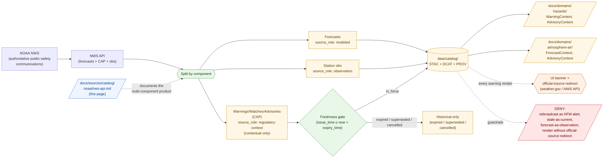

<!-- [KFM_META_BLOCK_V2]
doc_id: kfm://doc/docs-sources-catalog-noaa-nws-api
title: NOAA NWS API
type: product-page
version: v0.2
status: draft
owners: <PLACEHOLDER — Docs steward + Source steward for noaa + Hazards steward + Atmosphere/Air/Climate steward>
created: 2026-05-20
updated: 2026-05-22
policy_label: public
related:
  - docs/sources/catalog/noaa/README.md
  - docs/sources/catalog/noaa/IDENTITY.md
  - docs/sources/catalog/noaa/RIGHTS-AND-SENSITIVITY-MAP.md
  - docs/sources/catalog/noaa/goes-abi-aod.md
  - docs/sources/catalog/noaa/hms-fire-smoke.md
  - docs/sources/catalog/noaa/hrrr-smoke.md
  - docs/sources/catalog/noaa/noaa-uscrn.md
  - docs/sources/catalog/README.md
  - docs/domains/hazards/README.md
  - docs/domains/atmosphere/README.md
  - docs/doctrine/directory-rules.md
  - docs/standards/PROV.md
  - docs/adr/ADR-0001-schema-home.md
tags: [kfm, docs, sources, catalog, noaa, nws, alerts, advisories, warnings, watches, forecasts, hazards, atmosphere-air, regulatory-context, life-safety-sensitive]
notes:
  - "PROPOSED product-page scaffold; sibling-link presence and repo path NEEDS VERIFICATION."
  - "PROPOSED path under docs/sources/catalog/noaa/ — per-family-folder convention; filename `nws-api.md` uses the unprefixed convention (goes-abi-aod.md / hms-fire-smoke.md / hrrr-smoke.md) rather than `noaa-uscrn.md`'s prefixed convention. Consistency question carried to OPEN-NWS-13."
  - "MOST LIFE-SAFETY-SENSITIVE product in the KFM catalog. NWS is the actual public-safety authority; KFM is explicitly NOT. The doctrinal red line applies with the strictest enforcement here."
  - "MULTI-COMPONENT product. Default per component: forecasts = modeled; warnings/advisories/watches = regulatory-context (contextual only); station observations (where NWS API exposes them) = observation. Components MUST be admitted separately."
  - "Freshness state and issue/expiry windows are LOAD-BEARING — stale warnings cannot appear as live warnings (CONFIRMED DOM-HAZ §I doctrine)."
  - "CAP (Common Alerting Protocol) is the message format; CAP joins to other products per KFM-P13-PROG-0015 (HMS↔CAP)."
[/KFM_META_BLOCK_V2] -->

# NOAA NWS API

> NWS **forecasts**, **alerts/watches/warnings/advisories**, and station observations ingested as **contextual-only evidence**. KFM is not an emergency alerting system; NWS is. Warnings enter as `WarningContext`, never as KFM-issued alerts. Stale warnings cannot appear as current.

[](#status)
[](#status)
[](#source-role-posture)
[-orange)](#anti-collapse-nws-warnings-are-not-kfm-alerts)
[](#repo-fit)
[](#anti-collapse-nws-warnings-are-not-kfm-alerts)
[](#freshness-issue-and-expiry-are-load-bearing)
[](../../../doctrine/directory-rules.md)
<!-- TODO: replace placeholder Shields.io targets once CI/badge generation is wired (see KFM-P3-FEAT-0005). -->

**Status:** PROPOSED — scaffold only · **Family:** [`noaa`](./README.md) · **Default `source_role`:** *multi-component* (forecasts = `modeled`; warnings/advisories/watches = `regulatory-context`; observations = `observation`) · **Domains served:** `hazards` + `atmosphere-air` · **Owners:** *PLACEHOLDER* · **Last reviewed:** 2026-05-22

---

## Quick jump

- [Overview](#overview)
- [Source-role posture](#source-role-posture)
- [Anti-collapse: NWS warnings are not KFM alerts](#anti-collapse-nws-warnings-are-not-kfm-alerts)
- [Freshness, issue, and expiry are load-bearing](#freshness-issue-and-expiry-are-load-bearing)
- [Repo fit](#repo-fit)
- [Source authority](#source-authority)
- [Catalog profiles used](#catalog-profiles-used)
- [Collection identity](#collection-identity)
- [Provenance fields](#provenance-fields)
- [Receipts and transforms](#receipts-and-transforms)
- [CAP integration and cross-product joins](#cap-integration-and-cross-product-joins)
- [Temporal handling](#temporal-handling)
- [Geometry and projection](#geometry-and-projection)
- [Quality and uncertainty](#quality-and-uncertainty)
- [Rights and sensitivity](#rights-and-sensitivity)
- [Downstream consumers](#downstream-consumers)
- [Validation and catalog closure](#validation-and-catalog-closure)
- [Related contracts and schemas](#related-contracts-and-schemas)
- [Related connectors and pipelines](#related-connectors-and-pipelines)
- [Examples](#examples)
- [Open questions](#open-questions)
- [Related docs](#related-docs)

---

## Overview

> [!WARNING]
> This is the **most life-safety-sensitive product** in the KFM catalog. The doctrinal red line applies with its strictest enforcement here. Read [§ Anti-collapse](#anti-collapse-nws-warnings-are-not-kfm-alerts) and [§ Freshness](#freshness-issue-and-expiry-are-load-bearing) before any work on this product.

> [!NOTE]
> **PROPOSED scaffold.** This page describes a candidate product slice of the `noaa` source family. Specific endpoint URLs, rate limits, cadence values, message-format versions, and rights terms are **NEEDS VERIFICATION** and must be settled against `data/registry/sources/` and current NWS API documentation before any catalog promotion.

**Product slice.** The *NOAA NWS API* is the National Weather Service's public API surface. It exposes multiple kinds of content that travel through the same endpoint family but carry **different epistemic and policy standing**:

1. **Forecasts** — NWS-issued numerical or textual forecasts of future atmospheric state.
2. **Alerts / Watches / Warnings / Advisories** — operational public-safety communications, distributed in **CAP (Common Alerting Protocol)** format and addressed to defined geographic zones (typically NWS UGC zones).
3. **Station observations** — selected ground-station observations available through the API.

KFM admits each component separately. Lumping them under a single `source_role` is a doctrinal failure on the order of treating an analyst-drawn smoke polygon as a direct surface measurement (see [`hms-fire-smoke.md`](./hms-fire-smoke.md) for the parallel multi-component pattern).

PROPOSED — five doctrinal anchors apply (CONFIRMED doctrine; PROPOSED implementation):

- **KFM is not an emergency alerting system.** Per **DOM-HAZ §B** (CONFIRMED doctrine, quoted verbatim): *"KFM Hazards is not an emergency alert system and must not provide life-safety instructions."* This is the load-bearing constraint for this product.
- **Operational warning products are contextual only.** Per **DOM-HAZ §I** (CONFIRMED doctrine, quoted verbatim): *"Operational warning products are contextual only and not for life safety; unknown source roles are quarantined; expired operational context cannot appear as current warning state."* This sentence enumerates three independent gates (contextual-only role; quarantine on unknown role; expiry enforcement) that all apply to NWS warnings.
- **`regulatory-context` is the shorthand for NWS warnings/advisories/watches.** Per the NOAA family entry §5.1 (CONFIRMED doctrine restatement): *"NWS advisories/watches/warnings are issued by NWS as authoritative public-safety communications. KFM neither rebroadcasts them as KFM-issued alerts nor treats them as KFM's own regulatory determinations. They enter KFM as `AdvisoryContext` / `WarningContext` evidence with `not-for-life-safety` posture and explicit official-source redirection."*
- **NWS forecast components are modeled.** Forecasts produced by NWS are predictions, not observations. The DOM-AIR anti-collapse rule applies: *"model fields are not observations"* (CONFIRMED DOM-AIR §I).
- **CAP messages carry their own join doctrine.** Per **KFM-P13-PROG-0015** (CONFIRMED): *"Smoke pipelines should join FIRMS points to HMS plume buffers within 500 meters and six hours, tie CAP alerts by intersection or FIPS, and flag material change by IoU, area delta, or centroid shift."* CAP joins are by **intersection or FIPS** — never silently transformed into KFM-issued geometry.

This page is a **product-page**: it describes the slice's *catalog identity*, *profile usage*, *provenance fields*, *receipt requirements*, *freshness discipline*, *anti-collapse rules*, *CAP integration*, and *validation gates*. It is **not** a duplicate of the `SourceDescriptor`, the policy bundle, or the rights map — those live in their respective responsibility roots and are linked from here.

[↑ back to top](#noaa-nws-api)

---

## Source-role posture

> [!CAUTION]
> **NWS API is a multi-component product.** A single ingest pass against the NWS API exposes records of multiple distinct epistemic kinds. They **must not** be admitted under a single `source_role`. Lumping them is a `SOURCE_ROLE_COLLAPSE` anti-pattern (CONFIRMED doctrine — see NOAA family entry §5.2). The components diverge in `source_role`, freshness sensitivity, anti-collapse risks, and policy posture.

| NWS API component | Default `source_role` | Required anchoring receipt | What it is **not** |
|---|---|---|---|
| **Warnings / Watches / Advisories / Alerts (CAP)** | **`regulatory-context`** *(contextual only)* | `SourceDescriptor` + `RunReceipt` + `PolicyDecision (DENY rebroadcast)` + freshness state (`issue_time`, `expiry_time`) | **Not** a KFM-issued alert. **Not** actionable life-safety guidance. **Not** a KFM regulatory determination. |
| **Forecasts** (numerical grids, point forecasts, zone forecasts, text products) | `modeled` | `SourceDescriptor` + `ModelRunReceipt`-style record pinning forecast issue, cycle, lead time | Not an observation; not authority for "what is happening now"; not actionable guidance. |
| **Observations** (station obs available through the API) | `observation` | `SourceDescriptor` + `RunReceipt`; quality flags preserved | Not a regional truth; per-station, per-time; reference-grade alternatives are USCRN ([`noaa-uscrn.md`](./noaa-uscrn.md)). |
| **Aggregated / re-projected derivatives** (county-zone roll-ups, daily summaries) | `aggregate` | `AggregationReceipt` pinning geometry-scope | Not a per-place truth; not a substitute for the underlying component. |
| **Unmerged or quarantined NWS admission** | `candidate` | `SourceDescriptor` with `role_candidate_disposition: pending` | **Not** publishable. `PUBLISHED` edge forbidden until `merged`. |
| `authority` | **Not applicable to KFM-side admission.** NWS *is* the issuing authority for warnings, advisories, and forecasts; KFM is not. KFM admits NWS content under derived roles (`regulatory-context`, `modeled`, `observation`), never re-asserts authority itself. | — | — |
| `synthetic` | **Not applicable.** NWS issues real public-safety communications and real numerical forecasts. | — | — |

**Anti-collapse rule** (CONFIRMED doctrine; PROPOSED realization): the catalog must preserve `kfm:source_role` **distinctly per component**, even when components are delivered through the same NWS API endpoint or share a common envelope. A warning is not a forecast is not an observation.

[↑ back to top](#noaa-nws-api)

---

## Anti-collapse: NWS warnings are not KFM alerts

> [!WARNING]
> CONFIRMED DOM-HAZ §B doctrine, quoted verbatim: ***"KFM Hazards is not an emergency alert system and must not provide life-safety instructions."***
>
> NWS warnings are issued by NWS as authoritative public-safety communications. When KFM admits them, they remain **NWS's** warnings. They become **`WarningContext`** evidence in KFM — surfaced with their NWS identifier, issue time, expiry time, and an explicit redirect to the official source. KFM **never** packages NWS warnings as KFM-issued alerts.

### Six anti-collapse rules for NWS API

| # | The collapse | Why it fails | Required guardrail |
|---|---|---|---|
| **AC-1** | NWS warning → KFM-issued alert (rebroadcast) | KFM is not an alerting authority (CONFIRMED DOM-HAZ §B). | `PolicyDecision (DENY rebroadcast)` mandatory; `WarningContext` framing; `not-for-life-safety` disclaimer; official-source redirect to weather.gov / NWS API. |
| **AC-2** | Stale warning → current warning | An expired advisory cannot appear as live (CONFIRMED DOM-HAZ §I: *"expired operational context cannot appear as current warning state"*). | `issue_time` and `expiry_time` as first-class fields; freshness state computed at every render; stale records routed to historical-only surface or QUARANTINE. |
| **AC-3** | NWS forecast → observation | Forecasts predict; they don't observe. Standard model-as-observed denial (CONFIRMED DOM-AIR §I). | `source_role: modeled` for forecast component; never relabeled `observation`. |
| **AC-4** | NWS advisory → KFM regulatory determination | KFM does not issue regulatory determinations. NWS issues them; KFM cites them. | `role_authority: "NWS"` (not KFM); `regulatory-context` *shorthand* explicit in the catalog. |
| **AC-5** | Watch ≠ Warning | Watches and warnings are distinct urgency levels with distinct actionability. Treating them as interchangeable misleads downstream consumers. | `kfm:nws.event_type` and `kfm:nws.severity` (or equivalent) as first-class fields; never collapsed. |
| **AC-6** | KFM display ≠ official source | Any KFM-rendered NWS content must explicitly point users to the official source for life-safety decisions. | UI banner + `links: [{ rel: "official_source", href: "<weather.gov-or-NWS-API-canonical-URL>" }]` in every published Item. |

### Denied operations for this product (PROPOSED gates)

- **NWS warning rebroadcast as a KFM alert** — `DENY` at the trust membrane; UI fails closed (AC-1).
- **Expired advisory rendered as live** — `DENY` at the publication gate; surfaces as a stale-state badge or routes to historical-only (AC-2).
- **Forecast labeled as observation** — `DENY` at publication; `ABSTAIN` at AI surface (AC-3).
- **NWS content packaged as a KFM regulatory determination** — `DENY` at the policy gate (AC-4).
- **Watch / warning level conflation** — `DENY` at the source-role-anti-collapse test (AC-5).
- **Render without official-source redirect** — `DENY` at the publication gate; carries the doctrinal red line (AC-6).

[↑ back to top](#noaa-nws-api)

---

## Freshness, issue, and expiry are load-bearing

NWS warnings carry an **issue time** and an **expiry time** that define the window during which the warning is in force. Outside that window, the warning is historical, not operational.

> [!CAUTION]
> CONFIRMED DOM-HAZ §I doctrine, quoted verbatim: ***"Operational warning products are contextual only and not for life safety; unknown source roles are quarantined; expired operational context cannot appear as current warning state."***
>
> The sentence enumerates three independent gates. The third — **expired operational context cannot appear as current warning state** — is uniquely strict for NWS warnings: no other KFM product carries this exact obligation.

### Freshness states

PROPOSED freshness vocabulary for NWS warning/advisory/watch records:

| State | Definition | Public-surface treatment |
|---|---|---|
| `pre_issue` | NWS API exposes a future-tense product (rare; e.g., a hurricane forecast with embedded watch issuance). | Not rendered as a current warning; treated as forecast context. |
| `in_force` | Current time is between `issue_time` and `expiry_time` (inclusive of issue, exclusive of expiry per typical NWS convention; NEEDS VERIFICATION). | May surface as `WarningContext` with `not-for-life-safety` banner and official-source redirect. |
| `expired` | Current time is at or past `expiry_time`. | **Must not** surface as a current warning. Available only via historical query; surfaces with explicit "expired" framing. |
| `superseded` | A later NWS-issued warning explicitly supersedes this one (per NWS message linkage). | Same treatment as `expired`; the superseding record becomes the current `WarningContext`. |
| `cancelled` | NWS-issued cancellation message received. | Same treatment as `expired`; cancellation lineage preserved. |
| `unknown_freshness` | Issue or expiry time is missing or unparseable. | Routed to QUARANTINE per DOM-HAZ §I (*"unknown source roles are quarantined"* extended in spirit to unknown freshness). |

### Required time fields per warning Item

| Field | Source | Notes |
|---|---|---|
| `issue_time` | NWS-issued (`sent` or `effective` in CAP) | First-class field; required for `in_force` evaluation. |
| `expiry_time` | NWS-issued (`expires` in CAP) | First-class field; required for `expired` transition. |
| `onset_time` | NWS-issued (`onset` in CAP, when present) | Onset of the predicted hazard; distinct from issue time. |
| `effective_time` | NWS-issued (`effective` in CAP, when present) | When the warning becomes effective; distinct from issue time. |
| `retrieval_time` | KFM-side | When KFM ingested the warning. |
| `release_time` | KFM-side | When KFM promoted the Item. |
| `cancel_time` / `supersede_time` | NWS-issued (when present) | Lineage closure. |

> [!WARNING]
> **Do not infer freshness from `retrieval_time`.** A warning ingested moments before `expiry_time` is still operational; a warning ingested moments after is not. The decision must use the source-issued `issue_time` and `expiry_time`, not when KFM happened to fetch the record.

[↑ back to top](#noaa-nws-api)

---

## Repo fit

> [!IMPORTANT]
> **PROPOSED path.** This file is authored at `docs/sources/catalog/noaa/nws-api.md`. The per-family-folder layout (`docs/sources/catalog/<family>/<product>.md`) parallels the newspaper product-page series and the NOAA-family siblings `goes-abi-aod.md`, `hms-fire-smoke.md`, `hrrr-smoke.md`. The unprefixed filename follows those siblings (rather than `noaa-uscrn.md`'s prefixed convention) — see OPEN-NWS-13.

| Direction | Neighbor | Relationship |
|---|---|---|
| **Upstream (parent)** | [`README.md`](./README.md) | NOAA family-level orientation; this product is one slice. |
| **Sibling** | [`IDENTITY.md`](./IDENTITY.md) | Collection-id and namespace rules for the NOAA family. |
| **Sibling** | [`RIGHTS-AND-SENSITIVITY-MAP.md`](./RIGHTS-AND-SENSITIVITY-MAP.md) | Family rights / sensitivity decisions; this page does **not** restate policy. |
| **Sibling** | [`hms-fire-smoke.md`](./hms-fire-smoke.md) | Structural parallel — also multi-component, multi-role within a single feed. Cross-product join via CAP per KFM-P13-PROG-0015. |
| **Sibling** | [`hrrr-smoke.md`](./hrrr-smoke.md) | Forecast sibling (NWS forecasts share the `modeled` + `not-an-observation` framing). |
| **Sibling** | [`goes-abi-aod.md`](./goes-abi-aod.md) | Satellite-retrieval sibling. |
| **Sibling** | [`noaa-uscrn.md`](./noaa-uscrn.md) | Reference-grade observation sibling (the observation component of NWS API is conceptually adjacent but not reference-grade in the USCRN sense). |
| **Upstream (root)** | [`../README.md`](../README.md) | Catalog landing page. |
| **Cross-root (data)** | [`data/registry/sources/`](../../../../data/registry/sources/) | Authoritative `SourceDescriptor` home; not duplicated here. |
| **Cross-root (domain, primary)** | [`docs/domains/hazards/`](../../../domains/hazards/) | Domain owner of `WarningContext`, `AdvisoryContext`, `HazardEvent`, `HazardObservation`. |
| **Cross-root (domain, co-primary)** | [`docs/domains/atmosphere/`](../../../domains/atmosphere/) | Domain owner of `ForecastContext`, `AdvisoryContext` (atmosphere-side projection). |
| **Doctrine** | [`docs/doctrine/directory-rules.md`](../../../doctrine/directory-rules.md) | Placement authority and lifecycle law. |



> [!NOTE]
> Diagram reflects the **multi-component, freshness-gated, official-source-redirect** nature of NWS API. The freshness gate is unique to this product in the NOAA family — no other sibling has an issue/expiry contract from the source itself. Specific subpaths are PROPOSED until mounted-repo inspection confirms presence.

[↑ back to top](#noaa-nws-api)

---

## Source authority

The authoritative `SourceDescriptor` for any NWS API admission lives in [`data/registry/sources/`](../../../../data/registry/sources/) (PROPOSED path per Directory Rules §6).

> [!WARNING]
> **Do not duplicate descriptor fields here.** This page references identity, role, rights, sensitivity, and cadence — it does not own them. If a field appears to disagree with the `SourceDescriptor`, the descriptor wins, and a drift entry should open in `docs/registers/DRIFT_REGISTER.md`.

PROPOSED — the descriptor(s) for this slice should at minimum carry:

- `source_id` — stable identifier; **separate descriptors recommended** for the forecast, warning/advisory, and observation components (because they carry different roles and freshness obligations).
- `source_role` — `modeled` (forecasts), `regulatory-context` (warnings/advisories), or `observation` (station obs) per component.
- `role_authority` — **NOAA NWS** is the authoritative issuer; KFM is **not**. This distinction must be visible in every public-facing render.
- `rights` — license, redistribution terms, attribution. NWS API content is generally a U.S. government work in the public domain, but **per-product rights and current API terms of use remain NEEDS VERIFICATION**.
- `sensitivity` — tier per [`RIGHTS-AND-SENSITIVITY-MAP.md`](./RIGHTS-AND-SENSITIVITY-MAP.md); life-safety-sensitive class applies.
- `cadence` — near-real-time for alerts; routine cycles for forecasts; per-station for observations. NEEDS VERIFICATION.
- `ingest_hash` — content-addressable digest of the admitted feed.
- `official_source_url` — canonical NWS URL for redirect (AC-6 requirement).

NEEDS VERIFICATION: actual `SourceDescriptor` schema field names, required-vs-optional status, and any NWS API user-agent / attribution requirements against `schemas/contracts/v1/source/` (per ADR-0001) and current NWS API documentation.

[↑ back to top](#noaa-nws-api)

---

## Catalog profiles used

PROPOSED — NWS API admissions map across the standard KFM-STAC / DCAT / PROV-O profile triad (per KFM-P1-PROG-0021 and KFM-P32-IDEA-0005). Which lanes this product actually emits is **NEEDS VERIFICATION**.

| Profile | Lane | Used by this product? | Notes |
|---|---|---|---|
| STAC 1.1 | `data/catalog/stac/` | PROPOSED — **Yes** (NEEDS VERIFICATION) | **Separate Items recommended** per component (forecast / warning-CAP / observation); `kfm:provenance` block carries `issue_time` and `expiry_time` for the warning component. |
| DCAT | `data/catalog/dcat/` | PROPOSED — Yes / No (NEEDS VERIFICATION) | Distribution mapping for downloadable archives. |
| PROV-O | `data/catalog/prov/` | PROPOSED — **Yes (required)** | Each NWS issuance is a `prov:Activity`; `wasAttributedTo` to NWS (not to KFM); supersession and cancellation lineage modeled as `prov:wasRevisionOf` edges. |
| Domain projection | `data/catalog/domain/hazards/` and `data/catalog/domain/atmosphere-air/` | PROPOSED — **Yes (both)** | Warnings/advisories project into `WarningContext` / `AdvisoryContext` (Hazards primary; Atmosphere/Air co-primary); forecasts project into `ForecastContext` (Atmosphere/Air); observations project into `WeatherObservation` (Atmosphere/Air). |
| **CAP** (Common Alerting Protocol) | (treated as the message format, not a catalog profile) | **Mandatory for warning component** | NWS distributes alerts as CAP messages. The CAP envelope is preserved through admission and stored as an `original_message` asset. |

> [!TIP]
> KFM-namespaced STAC extension fields (`kfm:run_receipt_ref`, `kfm:proof_ref`, `kfm:trust_class`, `kfm:source_role`) carry trust-membrane context across profiles. For NWS API, **the per-component `kfm:source_role` preservation and the `kfm:nws.freshness_state` derivation** are the most important downstream-visible fields. The `links` array must always carry `rel: "official_source"` for warnings (AC-6).

[↑ back to top](#noaa-nws-api)

---

## Collection identity

- **PROPOSED Collection ID pattern.** Three collections recommended (one per component, so the regulatory-context vs modeled vs observation roles never share a catalog frame):
  - `kfm-noaa-nws-alerts` (for the `regulatory-context` warning/advisory/watch layer)
  - `kfm-noaa-nws-forecasts` (for the `modeled` forecast layer)
  - `kfm-noaa-nws-observations` (for the `observation` station-obs layer)
  - See [OPEN-NWS-04](#open-questions) for the alternative single-collection model.
- **PROPOSED namespace.** `kfm:` — pending resolution of *OPEN-DSC-03* (namespace canonicalization). NEEDS VERIFICATION.
- **PROPOSED Item ID rule.** Deterministic basis:
  - **Warnings**: `product + nws_event_type + nws_message_id + issue_time + zone_or_geometry_locator + normalized_digest`. NWS issuance message ID is part of identity — supersession / re-issuance produces new Items.
  - **Forecasts**: `product + forecast_type + issuance_cycle + valid_time_window + zone_or_geometry_locator + normalized_digest`.
  - **Observations**: `product + station_id + variable + observation_time + normalized_digest`.
- **Asset roles.** NEEDS VERIFICATION — confirm against `schemas/contracts/v1/source/`. Candidate roles for warnings: `data` (parsed CAP fields as GeoJSON / structured JSON), `original_message` (raw CAP XML / JSON envelope), `geometry` (UGC zone geometry), `metadata` (issuance metadata, supersession refs), `links` (official-source redirect URL).

[↑ back to top](#noaa-nws-api)

---

## Provenance fields

STAC `properties.kfm:provenance` block (PROPOSED — Pass-10 C4-01 / KFM-P3-IDEA-0004):

| Field | Resolves to | Required when | Notes |
|---|---|---|---|
| `spec_hash` | sha256 of the canonical record (JCS+SHA-256) | always | Anchors record identity. |
| `evidence_bundle_ref` | `kfm://evidence/<digest>` | claim-bearing items | Resolves to the EvidenceBundle backing any non-trivial assertion. |
| `run_record_ref` | `kfm://run/<run-id>` | always | Pins the orchestrated KFM run that ingested the artifact. |
| `audit_ref` | `kfm://audit/<attestation-id>` | promoted items | DSSE / Cosign attestation; surfaces under `kfm:proof_ref`. |
| `policy_digest` | sha256 of the policy bundle in force at promotion | promoted items | Lets reviewers reproduce the gate (DENY rebroadcast, expiry enforcement, official-source-redirect requirement). |
| `source_role` | enum: `regulatory-context` (warnings) \| `modeled` (forecasts) \| `observation` (obs) \| `aggregate` \| `candidate` | always | **Default differs by component.** Never `authority` (NWS is authority, KFM is not). |
| `kfm:nws.component` | enum: `warning_advisory_watch` \| `forecast` \| `observation` | always for NWS items | Discriminates the components. |
| `kfm:nws.event_type` | NWS event type vocabulary (e.g., `Severe Thunderstorm Warning`, `Tornado Watch`, `Heat Advisory`) | required when `component = warning_advisory_watch` | Watch ≠ Warning (AC-5). |
| `kfm:nws.severity` | enum from CAP severity vocabulary | required when `component = warning_advisory_watch` | Per CAP `severity` element. |
| `kfm:nws.urgency` | enum from CAP urgency vocabulary | required when `component = warning_advisory_watch` | Per CAP `urgency` element. |
| `kfm:nws.certainty` | enum from CAP certainty vocabulary | required when `component = warning_advisory_watch` | Per CAP `certainty` element. |
| `kfm:nws.issue_time` | ISO-8601 datetime | required when `component = warning_advisory_watch` | Load-bearing; see [§ Freshness](#freshness-issue-and-expiry-are-load-bearing). |
| `kfm:nws.expiry_time` | ISO-8601 datetime | required when `component = warning_advisory_watch` | Load-bearing; see [§ Freshness](#freshness-issue-and-expiry-are-load-bearing). |
| `kfm:nws.freshness_state` | enum: `pre_issue` \| `in_force` \| `expired` \| `superseded` \| `cancelled` \| `unknown_freshness` | required when `component = warning_advisory_watch` | KFM-derived from issue/expiry/lineage; not invented at render time. |
| `kfm:nws.message_id` | NWS-issued message identifier | required when `component = warning_advisory_watch` | Used for supersession / cancellation lineage. |
| `kfm:nws.supersedes_ref` | `EvidenceRef` to a prior NWS Item | required when supersession applies | Lineage closure. |
| `kfm:nws.official_source_url` | URL to weather.gov / NWS API canonical | required when `component = warning_advisory_watch` | AC-6 official-source redirect. |

Per-asset integrity: STAC `file:checksum` for every asset, including the `original_message` (raw CAP) asset.

> [!NOTE]
> NEEDS VERIFICATION — exact field names, especially the `kfm:nws.*` extension fields, need to be reconciled against the live `kfm-stac-extension.md` if one exists in the repo. The CAP-vocabulary enums (`severity`, `urgency`, `certainty`) are reproduced from common CAP usage; NEEDS VERIFICATION against the authoritative CAP specification version that NWS distributes.

[↑ back to top](#noaa-nws-api)

---

## Receipts and transforms

CONFIRMED doctrine: *KFM uses receipts to make consequential transformations inspectable.* NWS API admission produces multiple consequential transformations: CAP parsing, freshness-state derivation, supersession-lineage walking, and any KFM-side re-projection.

| Receipt | Triggered by | Required content (PROPOSED shape) |
|---|---|---|
| **`SourceDescriptor`** (anchor, not a receipt) | Admission of NWS API as a sub-source of the NOAA family. | Separate descriptors per component; `source_role`, `role_authority: "NWS"`, `rights`, `sensitivity`, `cadence`, `ingest_hash`, `time`, `citation`, `official_source_url`. |
| **`RunReceipt`** (ingest receipt) | Each ingest pass. | Request URL, conditional-GET headers (ETag / If-None-Match for forecasts and obs; CAP polling for alerts), content-length, content checksum, retrieval time, NWS-required `User-Agent` if applicable (NEEDS VERIFICATION). |
| **`ModelRunReceipt`-style record** | Forecast component issuance. | `model_id: "noaa-nws-forecast"`, `forecast_type`, `issuance_cycle`, `valid_time_window`, `inputs[]` (where NWS exposes upstream model identity), `parameters`, `validation_ref` if available. |
| **`PolicyDecision (DENY rebroadcast)`** | **MANDATORY** for every published warning Item. | `decision: DENY-rebroadcast`, `reason: "KFM-is-not-an-alerting-authority"`, `policy_digest`. |
| **`FreshnessReceipt`** *(PROPOSED new receipt class)* | Every warning render. | `current_time`, `issue_time`, `expiry_time`, `derived_state`, `derivation_rule`. **PROPOSED** addition to the receipt catalog; see OPEN-NWS-11. |
| **`TransformReceipt`** | CAP → KFM canonical form; UGC zone → standard geometry; reprojection. | `input_geom_hash`, `output_geom_hash`, `transform`, `parameters`, `tolerance`, `timestamp`, `actor`. |
| **`AggregationReceipt`** | County-zone roll-ups, daily summaries, multi-zone unions. | `geometry_scope`, `time_scope`, `aggregation_method`, `input_source_refs`, `suppression_rule`. |
| **`ValidationReport`** | WORK → PROCESSED and PROCESSED → CATALOG transitions. | `validator_id`, `target`, `passes[]`, `failures[]`, `time`, `deterministic_inputs`. |
| **`CorrectionNotice`** | When KFM-issued context for a now-superseded or now-cancelled NWS record needs correction downstream. | Lineage to the NWS supersession / cancellation message. |

> [!CAUTION]
> **`PolicyDecision (DENY rebroadcast)` is mandatory for every published warning Item.** This is the single strictest receipt requirement in the KFM product catalog; without it, the Item fails the trust-membrane gate. The decision is permanent — there is no operational mode in which KFM rebroadcasts NWS warnings as KFM alerts.

[↑ back to top](#noaa-nws-api)

---

## CAP integration and cross-product joins

NWS distributes warnings, watches, and advisories as **CAP (Common Alerting Protocol)** messages. CAP is a structured XML/JSON format with defined semantics for severity, urgency, certainty, geometry (zones, polygons), issuance lineage (supersession, cancellation), and parameters.

### CAP envelope discipline

| Concern | KFM posture | Notes |
|---|---|---|
| **Original CAP message preservation** | The raw CAP message (XML or JSON) is preserved as an `original_message` asset on every warning Item. | Anti-fabrication: KFM never paraphrases or summarizes the warning text in place of preserving the original. |
| **CAP field projection** | CAP fields (`sent`, `effective`, `onset`, `expires`, `severity`, `urgency`, `certainty`, `event`, `areaDesc`, etc.) project into `kfm:nws.*` provenance fields with verbatim values. | No semantic translation. NWS's vocabulary is preserved. |
| **CAP geometry handling** | UGC zone codes, polygons, and circles preserved as-issued; KFM-side reprojection records a `TransformReceipt`. | Geometry simplification is denied — operational geometry is exact for a reason. |
| **CAP supersession / cancellation lineage** | Modeled as `prov:wasRevisionOf` edges; `kfm:nws.supersedes_ref` carries the lineage. | Cancellation message preserved as its own Item, not as a deletion of the prior warning. |
| **Multi-language CAP `<info>` blocks** | All language variants preserved; KFM publishes whichever variants policy permits, with explicit language tags. | English-only rendering is a downstream choice, not an upstream filter. |

### Cross-product joins

Per CONFIRMED **KFM-P13-PROG-0015** (quoted): *"Smoke pipelines should join FIRMS points to HMS plume buffers within 500 meters and six hours, tie CAP alerts by intersection or FIPS, and flag material change by IoU, area delta, or centroid shift."*

| Join | Key | Purpose | Required guardrail |
|---|---|---|---|
| **NWS CAP ↔ HMS smoke polygon** (per KFM-P13-PROG-0015) | Geometric intersection or matching FIPS code | Surface smoke polygons that overlap an active CAP smoke-related advisory. | Each side carries its own `source_role`; the join does not collapse them. HMS smoke stays `modeled`; NWS CAP stays `regulatory-context`. |
| **NWS CAP ↔ county / zone polygon** | UGC zone code or FIPS | Render warnings on the canonical county / zone basemap. | Reprojection logged with `TransformReceipt`; zone boundaries preserved exactly. |
| **NWS CAP supersession** | NWS message ID linkage | Track lineage of repeated re-issuance of a warning. | Lineage `prov:wasRevisionOf` chain; never silent overwrite. |
| **NWS forecast ↔ USCRN observation** | Co-located station | Forecast-skill verification at reference stations. | Each side keeps its role; the comparison artifact has its own receipts. |

[↑ back to top](#noaa-nws-api)

---

## Temporal handling

PROPOSED — NWS API items must keep the standard KFM time roles **distinct where material**. For the warning component, time is the central operational property and has the most fields of any product in the catalog.

| Time role | Meaning for an NWS API item | Status |
|---|---|---|
| `source_time` | NWS-issued send time (CAP `sent`) | PROPOSED |
| `observed_time` | The atmospheric/hazard state time the warning describes (when applicable) | PROPOSED |
| `valid_time` | The period over which the warning is asserted to hold (typically `[effective, expires]`) | PROPOSED |
| `effective_time` | When the warning becomes operationally effective (CAP `effective`) | PROPOSED |
| `onset_time` | When the predicted hazard is expected to begin (CAP `onset`, where present) | PROPOSED |
| `expiry_time` | When the warning expires (CAP `expires`) | PROPOSED |
| `retrieval_time` | When KFM ingested the warning | PROPOSED |
| `release_time` | When KFM promoted the Item | PROPOSED |
| `supersede_time` / `cancel_time` | When a later NWS message superseded or cancelled this one | PROPOSED |
| `correction_time` | Time of any post-release correction | PROPOSED |

> [!WARNING]
> **Do not collapse `effective_time` / `onset_time` / `expiry_time`.** These have distinct operational meanings in NWS practice and CAP semantics. A "Heat Advisory in effect from 2 PM to 8 PM" has different `effective_time`, `onset_time`, and `expiry_time` than the `source_time` at which NWS issued it.
>
> **Do not infer freshness from `retrieval_time`.** See [§ Freshness](#freshness-issue-and-expiry-are-load-bearing).

NEEDS VERIFICATION — confirm time-role tests exist or are PROPOSED in `tests/`.

[↑ back to top](#noaa-nws-api)

---

## Geometry and projection

PROPOSED — NWS API warnings carry several geometry forms:

| Concern | Posture | Status |
|---|---|---|
| **UGC zones** | NWS County/Zone/Forecast/Marine codes; preserved verbatim; rendered against the canonical NWS zone basemap. | NEEDS VERIFICATION — confirm whether KFM stores zone polygons or references an external zone basemap. |
| **CAP polygons** | When CAP messages include `<polygon>` or `<circle>` elements (e.g., storm-based warnings), the geometry is preserved as-issued. | PROPOSED. |
| **County / FIPS geometry** | For FIPS-based joins (per KFM-P13-PROG-0015), county polygon from the canonical county basemap. | PROPOSED. |
| **Native CRS** | Geographic (WGS84 lat/lon) per common NWS practice. | NEEDS VERIFICATION. |
| **Resampled CRS** | For Kansas-focused public layers, reprojection via `TransformReceipt`. | PROPOSED. |
| **Generalization** | Forbidden for operational geometry — warning extents are operational claims. Generalization is allowed only for distinct derived layers under `source_role: aggregate` with `AggregationReceipt`. | PROPOSED. |
| **STAC Projection extension** | Required (`proj:code`, `proj:bbox`, `proj:geometry`) per KFM-P27-FEAT-0003. | PROPOSED. |

NEEDS VERIFICATION — confirm against `data/catalog/` artifacts and any NWS fixtures in `tests/` or `fixtures/`.

[↑ back to top](#noaa-nws-api)

---

## Quality and uncertainty

PROPOSED — NWS API items carry quality and confidence information that differs sharply by component. NEEDS VERIFICATION against current NWS API documentation.

| Metric | Component | Use |
|---|---|---|
| **CAP `severity` / `urgency` / `certainty`** | warnings | NWS-issued confidence-equivalent fields; preserved verbatim; first-class display. |
| **Supersession lineage depth** | warnings | A warning re-issued many times within a window may indicate evolving hazard; surfaced as a metadata cue, not as a denial. |
| **Forecast lead time** | forecasts | Standard NWP forecast skill degradation; parallel to HRRR-Smoke handling. |
| **Forecast issuance cycle** | forecasts | Which cycle produced the forecast; supersession by later cycles tracked. |
| **Station QC flags** | observations | Per-station quality flags; parallel to USCRN treatment (though typically lower-grade than USCRN's reference standard). |
| **Freshness state** | warnings | KFM-derived `in_force` / `expired` / `superseded` / `cancelled` / `unknown_freshness`. **MANDATORY** for every warning render. |
| **API freshness lag** | all components | Latency between NWS issuance and KFM retrieval; advisory metric for operational health. |

> [!TIP]
> Quality metrics drive a **trust-and-freshness badge** (per KFM-P3-FEAT-0005). For the warning component, the **freshness state is the single most important badge field** — more important than any confidence or completeness metric. A confident, complete, but expired warning is the wrong answer to any "what is happening" question.

---

## Rights and sensitivity

> [!IMPORTANT]
> **Do not restate policy here.** Sensitivity tier, redaction rules, and reveal posture are decided in [`policy/sensitivity/`](../../../../policy/sensitivity/) and summarized in the sibling [`RIGHTS-AND-SENSITIVITY-MAP.md`](./RIGHTS-AND-SENSITIVITY-MAP.md). This section names the *kinds of risks* the product introduces, not the *decisions* taken against them.

PROPOSED risk surfaces — NEEDS VERIFICATION per product. This is the **most life-safety-sensitive product** in the NOAA family.

| Risk surface | Why it matters | Default posture |
|---|---|---|
| **KFM-as-alerting-authority misuse** | The strictest red line. NWS issues warnings; KFM does not. Any drift toward KFM-issued alert framing is a category violation. | DENY rebroadcast (mandatory `PolicyDecision`); `WarningContext` framing; explicit official-source redirect to weather.gov / NWS API on every render. |
| **Stale-warning-as-current misuse** | An expired advisory rendered as live is a direct doctrinal failure (CONFIRMED DOM-HAZ §I). | Freshness state mandatory on every warning render; stale records routed to historical-only or QUARANTINE. |
| **Forecast-as-observation misuse** | NWS forecasts predict; same anti-collapse as HRRR-Smoke (CONFIRMED DOM-AIR §I). | `source_role: modeled` for forecast component; never relabeled `observation`. |
| **Watch / warning level conflation** | Different urgency levels carry different actionability. | First-class `event_type` and `severity` fields. |
| **Official-source redirect omitted** | KFM rendering without redirect to official sources creates an implicit "KFM is the authority" framing. | Every warning Item carries `links: [{ rel: "official_source", ... }]`; render-without-link fails closed at the publication gate. |
| **Multi-language fidelity** | NWS CAP messages can carry multiple language variants; dropping non-English variants is a fidelity loss for accessibility. | All language variants preserved; rendering choices documented. |
| **Stale archival use of CAP content** | Using long-archived CAP content as if it carried current operational weight is the historical version of AC-2. | Historical-only surface explicitly labels archived warnings; no "current warning" framing on archived records. |
| **License inheritance / API terms of use** | NWS API content is generally a U.S. government work in the public domain, but NWS publishes API terms (rate limits, User-Agent requirements, attribution). NEEDS VERIFICATION. | License-deny lane until rights and API terms confirmed (per Master MapLibre ML-062-016). |

> [!CAUTION]
> CONFIRMED doctrine: *Operational warning products are contextual only and not for life safety; unknown source roles are quarantined; expired operational context cannot appear as current warning state.* (DOM-HAZ §I.)

[↑ back to top](#noaa-nws-api)

---

## Downstream consumers

NWS API content is **upstream context** for several products and surfaces. The catalog should make this lineage explicit via PROV-O links and via `kfm:source_role` propagation **per component**.

| Downstream consumer | What it derives from NWS API | Its default `source_role` |
|---|---|---|
| Hazards `WarningContext` / `AdvisoryContext` layers | Warnings, advisories, watches rendered with NWS-issued geometry, severity styling, official-source redirect, and freshness state | `regulatory-context` (preserved); `not-for-life-safety` framing mandatory. |
| Atmosphere/Air `ForecastContext` layer | NWS forecasts rendered with lead-time framing and forecast caveats | `modeled` (preserved); parallel to HRRR-Smoke handling. |
| Atmosphere/Air `WeatherObservation` layer | NWS station observations rendered with quality flags | `observation` (preserved); reference-grade alternative is USCRN. |
| Hazards `HazardEvent` derivation | Historical warning lineage used to construct retrospective hazard event records | Derived artifact carries its own role (typically `aggregate`); original NWS Items preserve their roles. |
| Smoke-context joins (per KFM-P13-PROG-0015) | NWS smoke-related CAP advisories joined to HMS plume polygons by intersection or FIPS | Each side keeps its role; the joined record records both refs. |
| Focus Mode answers | Bounded evidence context for hazards/weather questions | `AIReceipt` mandatory; warnings always cited with freshness state, severity, and official-source redirect. AI **never** writes new advisory language. |

[↑ back to top](#noaa-nws-api)

---

## Validation and catalog closure

PROPOSED gates that apply to this product before public release. Several are MANDATORY rather than PROPOSED, reflecting the life-safety-sensitive class.

- **Catalog closure required before public release** — DCAT, STAC, and PROV records must trace bundle identity, inputs, artifacts, checks, producer, and promotion metadata (per Pass-10 / KFM-P26-IDEA-0007). PROPOSED.
- **STAC Projection lint** — `proj:code`, `proj:bbox`, `proj:geometry` compliance (per KFM-P27-FEAT-0003). PROPOSED.
- **STAC checksum closure** — `file:checksum` for every Asset must match the ReleaseManifest digest (per KFM-P22-PROG-0037). PROPOSED.
- **Component-split test** — every NWS API Item must carry `kfm:nws.component` ∈ {`warning_advisory_watch`, `forecast`, `observation`}; missing discriminator fails closed. **PROPOSED, MANDATORY**.
- **`PolicyDecision (DENY rebroadcast)` presence test** — every warning Item must carry a resolvable `policy_decision_ref` to a `DENY rebroadcast` decision. **PROPOSED, MANDATORY**.
- **Freshness-state derivation test** — every warning Item must carry a derivable `kfm:nws.freshness_state` from `issue_time` and `expiry_time` against `current_time`; missing or unparseable times route to QUARANTINE (per DOM-HAZ §I unknown-source-role analogue). **PROPOSED, MANDATORY**.
- **Stale-as-current denial test** *(AC-2; CONFIRMED DOM-HAZ §I)* — warning Items with `freshness_state ∈ {expired, superseded, cancelled}` rendered as current warning state fail closed. **PROPOSED, MANDATORY**.
- **Rebroadcast-as-alert denial test** *(AC-1)* — warning packaged as a KFM-issued alert fails closed. **PROPOSED, MANDATORY**.
- **Official-source-redirect presence test** *(AC-6)* — warning render without `links: [{ rel: "official_source", ... }]` fails closed at the publication gate. **PROPOSED, MANDATORY**.
- **Forecast-as-observation denial test** *(AC-3; CONFIRMED DOM-AIR validator)* — forecast Items relabeled `source_role: observation` fail closed.
- **Regulatory-determination denial test** *(AC-4)* — NWS content packaged as a KFM regulatory determination fails closed.
- **Watch / warning conflation denial test** *(AC-5)* — `event_type` or `severity` substitution across distinct NWS levels fails closed.
- **Supersession-lineage integrity test** — supersession / cancellation messages must link back via `kfm:nws.supersedes_ref` to the prior Item; broken lineage fails closed.
- **Original-CAP-message preservation test** — every warning Item must carry an `original_message` asset with checksum closure; missing or modified raw CAP fails closed.
- **CAP-join window test** *(per KFM-P13-PROG-0015)* — CAP joins by intersection or FIPS; joins outside this rule require an ADR override.
- **Source-role anti-collapse test** *(per KFM-P17-IDEA-0004)* — items must not re-emit NWS content as `authority` (NWS is the authority, KFM is not).
- **Rights propagation test** — `rights` field and any API terms of use must be resolved before contentful delta emission (per ML-062-016). PROPOSED.

NEEDS VERIFICATION — confirm which of these are realized in `tests/`, `pipelines/validate/`, or CI workflows.

[↑ back to top](#noaa-nws-api)

---

## Related contracts and schemas

| Artifact | PROPOSED path | Status |
|---|---|---|
| Source descriptor schema | `schemas/contracts/v1/source/` | NEEDS VERIFICATION — per ADR-0001. |
| `WarningContext` / `AdvisoryContext` object schemas | `schemas/contracts/v1/hazards/warning-context.schema.json`, `.../advisory-context.schema.json` | PROPOSED — DOM-HAZ §E object families. |
| `ForecastContext` object schema | `schemas/contracts/v1/atmosphere-air/forecast-context.schema.json` | PROPOSED — DOM-AIR §E. |
| `WeatherObservation` object schema | `schemas/contracts/v1/atmosphere-air/weather-observation.schema.json` | PROPOSED — DOM-AIR §E. |
| `HazardEvent` / `HazardObservation` schemas | `schemas/contracts/v1/hazards/` | PROPOSED — DOM-HAZ §E. |
| `ModelRunReceipt` schema | `schemas/contracts/v1/receipts/model-run-receipt.schema.json` | PROPOSED — per Atlas Ch. 24.2. |
| `PolicyDecision` schema | `schemas/contracts/v1/receipts/policy-decision.schema.json` | PROPOSED. |
| `FreshnessReceipt` schema *(PROPOSED new class)* | `schemas/contracts/v1/receipts/freshness-receipt.schema.json` | PROPOSED — see OPEN-NWS-11. |
| CAP schema reference | External CAP specification (OASIS); KFM admits as-is. | NEEDS VERIFICATION — confirm CAP version (v1.1, v1.2, NWS profile). |
| STAC extension reference | `docs/standards/PROV.md`, `kfm-stac-extension.md` | PROPOSED — *PROV.md* vs *PROVENANCE.md* pending ADR (Directory Rules §18 OPEN-DR-01). |
| Family policy bundle | `policy/release/hazards/`, `policy/release/atmosphere/`, `policy/sensitivity/` | NEEDS VERIFICATION — owned by policy/, not this page. |

---

## Related connectors and pipelines

PROPOSED — typical wiring (NEEDS VERIFICATION per product):

- **Connector**: `connectors/noaa/nws-api/` (PROPOSED) under the unified NOAA connector layout from the NOAA family entry.
- **NWS split pipeline**: `pipelines/normalize/nws-split/` (PROPOSED) — splits the upstream feed into the warning/forecast/observation components, emitting separate `SourceDescriptor`s and per-component receipts.
- **CAP parser pipeline**: `pipelines/normalize/nws-cap-parse/` (PROPOSED) — parses CAP envelopes; preserves the raw message as an asset; projects CAP fields into `kfm:nws.*`.
- **Freshness-state pipeline**: `pipelines/derive/nws-freshness/` (PROPOSED) — derives `kfm:nws.freshness_state` at every catalog refresh; emits `FreshnessReceipt`; routes expired/superseded/cancelled records to historical-only surface.
- **Catalog pipeline**: `pipelines/catalog/` — produces STAC / DCAT / PROV records.
- **Pipeline spec**: `pipeline_specs/noaa/nws-api/` (PROPOSED).

> [!CAUTION]
> The watcher / connector **never publishes**. Source watchers emit `SourceIntakeRecord` or `DriftSummary`; `PromotionDecision` is what publishes — and only after the component split, the `PolicyDecision (DENY rebroadcast)` presence check, the freshness-state derivation, the official-source-redirect presence check, and rights propagation all pass.

---

## Examples

<details>
<summary><strong>Minimal STAC Item shape — warning component (illustrative, not authoritative)</strong></summary>

> [!NOTE]
> Illustrative only. Do **not** treat as the live schema. See [`_examples/stac-item-example.json`](../_examples/stac-item-example.json) for the canonical minimal shape once it lands. NEEDS VERIFICATION.

```json
{
  "type": "Feature",
  "stac_version": "1.1.0",
  "id": "kfm-noaa-nws-alerts/<event-type>/<nws-message-id>/<issue-time>/<zone>",
  "collection": "kfm-noaa-nws-alerts",
  "geometry": "<CAP-issued-polygon-or-UGC-zone-geometry>",
  "properties": {
    "start_datetime": "<effective_time>",
    "end_datetime":   "<expiry_time>",
    "kfm:provenance": {
      "spec_hash": "sha256:<...>",
      "evidence_bundle_ref": "kfm://evidence/<digest>",
      "run_record_ref": "kfm://run/<run-id>",
      "audit_ref": "kfm://audit/<attestation-id>",
      "policy_digest": "sha256:<...>",
      "source_role": "regulatory-context"
    },
    "kfm:trust_class": "catalog",
    "kfm:nws": {
      "component": "warning_advisory_watch",
      "event_type": "<NWS-issued-event-type>",
      "severity": "<CAP-severity>",
      "urgency": "<CAP-urgency>",
      "certainty": "<CAP-certainty>",
      "issue_time": "<sent-iso-8601>",
      "effective_time": "<effective-iso-8601>",
      "expiry_time": "<expires-iso-8601>",
      "freshness_state": "in_force",
      "message_id": "<NWS-message-id>",
      "official_source_url": "<weather.gov-canonical-URL>"
    }
  },
  "assets": {
    "data":             { "href": "...", "type": "application/geo+json", "roles": ["data"] },
    "original_message": { "href": "...", "type": "application/cap+xml",  "roles": ["data", "metadata"] },
    "metadata":         { "href": "...", "type": "application/json",     "roles": ["metadata"] }
  },
  "links": [
    { "rel": "collection",     "href": "../collection.json" },
    { "rel": "official_source", "href": "<weather.gov-canonical-URL>", "title": "Official NWS source" },
    { "rel": "derived_from",   "href": "kfm://source/<noaa-nws-api-source_id>" },
    { "rel": "via",            "href": "kfm://policy-decision/<deny-rebroadcast-id>" }
  ]
}
```

</details>

<details>
<summary><strong>Illustrative <code>PolicyDecision (DENY rebroadcast)</code> for a warning Item (PROPOSED)</strong></summary>

```json
{
  "receipt_class": "PolicyDecision",
  "decision": "DENY",
  "scope": "rebroadcast_as_kfm_alert",
  "reason": "KFM-is-not-an-alerting-authority (DOM-HAZ §B)",
  "policy_digest": "sha256:<...>",
  "applied_to": "kfm://item/<warning-item-id>",
  "actor": "kfm-policy-engine@<version>",
  "timestamp": "<iso-8601>",
  "links": [
    { "rel": "doctrine", "href": "kfm://doctrine/dom-haz-b-not-an-alert-system" },
    { "rel": "official_source", "href": "<weather.gov-canonical-URL>" }
  ]
}
```

</details>

<details>
<summary><strong>Illustrative <code>FreshnessReceipt</code> for a warning at render time (PROPOSED new class)</strong></summary>

```json
{
  "receipt_class": "FreshnessReceipt",
  "applied_to": "kfm://item/<warning-item-id>",
  "current_time": "<iso-8601>",
  "issue_time": "<sent-iso-8601>",
  "effective_time": "<effective-iso-8601>",
  "expiry_time": "<expires-iso-8601>",
  "derived_state": "in_force",
  "derivation_rule": "effective_time <= current_time < expiry_time AND no supersession",
  "supersedes_chain": [],
  "actor": "kfm-freshness-engine@<version>",
  "timestamp": "<iso-8601>"
}
```

</details>

<details>
<summary><strong>Illustrative quarantine reasons</strong></summary>

| Reason code | When it fires |
|---|---|
| `NWS_COMPONENT_DISCRIMINATOR_MISSING` | NWS API Item lacks `kfm:nws.component`. |
| `DENY_REBROADCAST_DECISION_MISSING` | Warning Item lacks `PolicyDecision (DENY rebroadcast)`. **The single strictest gate in the catalog.** |
| `FRESHNESS_STATE_UNDERIVABLE` | Issue or expiry time missing or unparseable; `kfm:nws.freshness_state` cannot be derived. |
| `STALE_AS_CURRENT_ATTEMPT` | Warning with `freshness_state ∈ {expired, superseded, cancelled}` rendered as current. |
| `REBROADCAST_AS_ALERT_ATTEMPT` | Warning packaged as KFM-issued alert. |
| `OFFICIAL_SOURCE_REDIRECT_MISSING` | Warning Item lacks `links: [{ rel: "official_source", ... }]`. |
| `FORECAST_AS_OBSERVATION_COLLAPSE` | NWS forecast relabeled `observation`. |
| `REGULATORY_DETERMINATION_COLLAPSE` | NWS content packaged as KFM regulatory determination. |
| `WATCH_WARNING_CONFLATION` | `event_type` or `severity` substituted across distinct NWS levels. |
| `SUPERSESSION_LINEAGE_BROKEN` | Supersession message missing `kfm:nws.supersedes_ref`. |
| `ORIGINAL_CAP_MESSAGE_MODIFIED` | Raw CAP asset checksum mismatch. |
| `RIGHTS_OR_API_TERMS_UNRESOLVED` | License or API terms of use not confirmed. |

</details>

---

## Open questions

- **OPEN-NWS-01** — Confirm authoritative NWS API endpoint(s), CAP version (v1.1, v1.2, NWS profile), cadence offerings, and rate-limit / `User-Agent` requirements.
- **OPEN-NWS-02** — Confirm rights status and the current NWS API terms of use (attribution, rate limits, User-Agent format). NWS API has historically had specific access requirements.
- **OPEN-NWS-03** — Confirm authoritative `event_type` vocabulary (NWS Product Subtype list).
- **OPEN-NWS-04** — Confirm Collection model: per-component Collections (this page's assumption) or unified `kfm-noaa-nws-api` with `kfm:nws.component` as discriminator? **Likely ADR-class** given the role differences.
- **OPEN-NWS-05** — Confirm the canonical official-source URL pattern (weather.gov by zone? NWS API endpoint? Both?) for AC-6 redirects.
- **OPEN-NWS-06** — Confirm how KFM handles **forecast-component supersession**: typical NWS forecast cycles re-issue regularly. Each cycle as a new Item (parallel to HRRR-Smoke cycle-in-identity) or supersession-chained?
- **OPEN-NWS-07** — Confirm how the NWS API station-observation component differs from USCRN ([`noaa-uscrn.md`](./noaa-uscrn.md)) — are these distinct admission lanes, or do they overlap?
- **OPEN-NWS-08** — Confirm whether multi-language CAP `<info>` blocks are admitted in full or filtered at ingest.
- **OPEN-NWS-09** — Confirm how the freshness gate runs operationally: per-render? Periodic catalog refresh? Both? Performance implications.
- **OPEN-NWS-10** — Confirm whether KFM admits the **historical CAP archive** (all past warnings) for retrospective analysis, or only the operational rolling window.
- **OPEN-NWS-11** — `FreshnessReceipt` is a **PROPOSED new receipt class** in the KFM receipt catalog. Either formalize it via ADR or fold it into `PolicyDecision`. Likely ADR-class.
- **OPEN-NWS-12** — Inherits **OPEN-DSC-03** (namespace canonicalization) from family-level.
- **OPEN-NWS-13** — Filename convention. This file uses `nws-api.md` (unprefixed); `noaa-uscrn.md` uses the `noaa-` prefix. Resolve family-wide for consistency (inherits OPEN-USCRN-09).
- **OPEN-NWS-14** — Resolve `PROV.md` vs `PROVENANCE.md` reference target (Directory Rules §18 OPEN-DR-01).
- **OPEN-NWS-15** — Confirm whether `WarningContext` and `AdvisoryContext` are owned in `domains/hazards/` or `domains/atmosphere/` (DOM-HAZ §E and DOM-AIR §E both list `AdvisoryContext`). Inherits OPEN-HMS-08 family of questions.

---

## Related docs

- [`./README.md`](./README.md) — NOAA family landing page.
- [`./IDENTITY.md`](./IDENTITY.md) — Collection-id and namespace rules.
- [`./RIGHTS-AND-SENSITIVITY-MAP.md`](./RIGHTS-AND-SENSITIVITY-MAP.md) — Family rights / sensitivity decisions.
- [`./hms-fire-smoke.md`](./hms-fire-smoke.md) — Multi-component structural sibling; CAP-join partner per KFM-P13-PROG-0015.
- [`./hrrr-smoke.md`](./hrrr-smoke.md) — Forecast sibling.
- [`./goes-abi-aod.md`](./goes-abi-aod.md) — Satellite-retrieval sibling.
- [`./noaa-uscrn.md`](./noaa-uscrn.md) — Reference-grade observation sibling.
- [`./_examples/stac-item-example.json`](./_examples/stac-item-example.json) — Minimal STAC + `kfm:provenance` shape (illustrative).
- [`../README.md`](../README.md) — Catalog root.
- [`../../../domains/hazards/README.md`](../../../domains/hazards/README.md) — Primary domain (WarningContext, AdvisoryContext, HazardEvent, HazardObservation; life-safety red line).
- [`../../../domains/atmosphere/README.md`](../../../domains/atmosphere/README.md) — Co-primary domain (ForecastContext, AdvisoryContext, WeatherObservation).
- [`../../../doctrine/directory-rules.md`](../../../doctrine/directory-rules.md) — Placement authority, lifecycle law, drift register.
- [`../../../standards/PROV.md`](../../../standards/PROV.md) — W3C PROV-O / PAV profile (naming reconciliation pending).
- [`../../../adr/ADR-0001-schema-home.md`](../../../adr/ADR-0001-schema-home.md) — Schema home rule.
- *TODO* — link to the `noaa/nws-api` connector README once authored.
- *TODO* — link to `kfm-stac-extension.md` once authored.
- *TODO* — link to the `WarningContext` / `AdvisoryContext` schemas once domain-home decided (OPEN-NWS-15).
- *TODO* — link to a future `FreshnessReceipt` ADR (OPEN-NWS-11).
- *TODO* — link to NWS API attribution / terms-of-use confirmation once recorded.

---

**Last reviewed:** 2026-05-22 *(Claude Code product-page revision session; v0.2 polish pass.)*
**Version:** v0.2 · **Status:** PROPOSED — scaffold only · **Default `source_role`:** *multi-component (warnings = `regulatory-context`; forecasts = `modeled`; obs = `observation`)* · **Domains served:** `hazards` + `atmosphere-air` · **Owners:** *PLACEHOLDER*

[↑ back to top](#noaa-nws-api)
