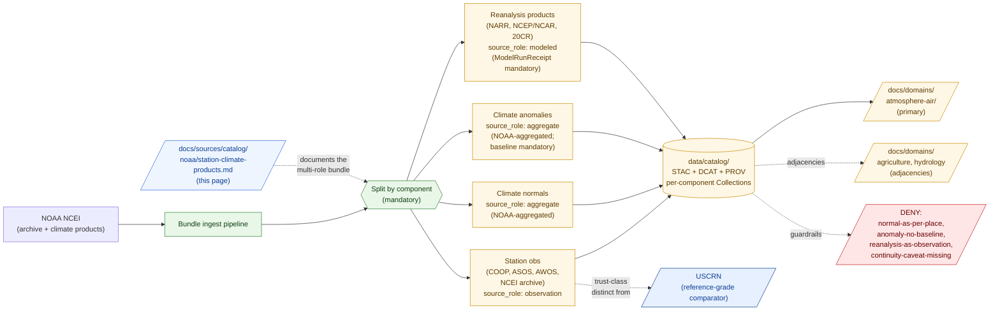

<!-- [KFM_META_BLOCK_V2]
doc_id: kfm://doc/docs-sources-catalog-noaa-station-climate-products
title: NOAA/NWS Station Observations and Climate Products
type: product-page
version: v0.2
status: draft
owners: <PLACEHOLDER — Docs steward + Source steward for noaa + Atmosphere/Air/Climate steward>
created: 2026-05-20
updated: 2026-05-22
policy_label: public
related:
  - docs/sources/catalog/noaa/README.md
  - docs/sources/catalog/noaa/IDENTITY.md
  - docs/sources/catalog/noaa/RIGHTS-AND-SENSITIVITY-MAP.md
  - docs/sources/catalog/noaa/noaa-uscrn.md
  - docs/sources/catalog/noaa/nws-api.md
  - docs/sources/catalog/noaa/hrrr-smoke.md
  - docs/sources/catalog/noaa/goes-abi-aod.md
  - docs/sources/catalog/noaa/hms-fire-smoke.md
  - docs/sources/catalog/README.md
  - docs/domains/atmosphere/README.md
  - docs/domains/agriculture/README.md
  - docs/domains/hydrology/README.md
  - docs/doctrine/directory-rules.md
  - docs/standards/PROV.md
  - docs/adr/ADR-0001-schema-home.md
tags: [kfm, docs, sources, catalog, noaa, ncei, coop, asos, awos, station-observations, climate-normals, climate-anomalies, reanalysis, atmosphere-air, multi-role]
notes:
  - "PROPOSED product-page scaffold; sibling-link presence and repo path NEEDS VERIFICATION."
  - "PROPOSED path under docs/sources/catalog/noaa/ — per-family-folder convention; unprefixed filename follows goes-abi-aod.md / hms-fire-smoke.md / hrrr-smoke.md / nws-api.md."
  - "MOST MULTI-ROLE PRODUCT in the catalog. Defaults span three distinct source_roles in one bundle: observation (stations) + modeled (reanalyses) + aggregate (climate normals, anomalies). Components MUST be admitted separately."
  - "Dominant anti-collapse: climate normal cited as per-place truth (CONFIRMED — NOAA family entry §5.2). Plus all DOM-AIR §I anti-collapses apply at least partially across components."
  - "Bundle scope is broad — likely candidate for future split into separate product-pages per component (OPEN-STN-04). v0.2 polish preserves the bundle framing while making the splits inspectable."
  - "Distinguish from USCRN (reference-grade), NWS API (operational), HRRR-Smoke (active-forecast). This product covers Mesonet-adjacent / non-reference station obs + historical archive + derived climate products."
[/KFM_META_BLOCK_V2] -->

# NOAA/NWS Station Observations and Climate Products

> A **bundle product** spanning NOAA/NCEI/NWS station observations (COOP, ASOS, AWOS, historical archive), **climate normals** and **anomalies**, and **reanalysis** model fields (e.g., NARR). Three default `source_role`s — `observation`, `aggregate`, `modeled` — in one product slice. A 30-year climate normal is **not** "what the temperature is today"; a reanalysis grid is **not** an observation.

[](#status)
[](#status)
[](#source-role-posture)
[](#repo-fit)
[](#anti-collapse-stack-three-roles-three-failure-modes)
[](#source-role-posture)
[](#rights-and-sensitivity)
[](../../../doctrine/directory-rules.md)
<!-- TODO: replace placeholder Shields.io targets once CI/badge generation is wired (see KFM-P3-FEAT-0005). -->

**Status:** PROPOSED — scaffold only · **Family:** [`noaa`](./README.md) · **Default `source_role`:** *multi-role bundle* (stations = `observation`; normals/anomalies = `aggregate`; reanalysis = `modeled`) · **Domains served:** `atmosphere-air` (primary), `agriculture` and `hydrology` (adjacencies) · **Owners:** *PLACEHOLDER* · **Last reviewed:** 2026-05-22

---

## Quick jump

- [Overview](#overview)
- [Source-role posture](#source-role-posture)
- [Anti-collapse stack: three roles, three failure modes](#anti-collapse-stack-three-roles-three-failure-modes)
- [Climate normals and anomalies](#climate-normals-and-anomalies)
- [Reanalysis products](#reanalysis-products)
- [Repo fit](#repo-fit)
- [Source authority](#source-authority)
- [Catalog profiles used](#catalog-profiles-used)
- [Collection identity](#collection-identity)
- [Provenance fields](#provenance-fields)
- [Receipts and transforms](#receipts-and-transforms)
- [Temporal handling and aggregation](#temporal-handling-and-aggregation)
- [Geometry and projection](#geometry-and-projection)
- [Quality and uncertainty](#quality-and-uncertainty)
- [Rights and sensitivity](#rights-and-sensitivity)
- [Downstream consumers](#downstream-consumers)
- [Validation and catalog closure](#validation-and-catalog-closure)
- [Related contracts and schemas](#related-contracts-and-schemas)
- [Related connectors and pipelines](#related-connectors-and-pipelines)
- [Examples](#examples)
- [Open questions](#open-questions)
- [Related docs](#related-docs)

---

## Overview

> [!NOTE]
> **PROPOSED scaffold.** This page describes a candidate **bundle** product of the `noaa` source family. Specific endpoint URLs, station counts, normal periods, reanalysis identifiers, cadence values, and rights terms are **NEEDS VERIFICATION** and must be settled against `data/registry/sources/` and current NOAA documentation before any catalog promotion.

> [!CAUTION]
> **This is a bundle.** A single product-page covers three doctrinally distinct things that NOAA/NCEI distributes through related (but not identical) pipelines:
>
> 1. **Station observations** — historical and operational ground-station data from networks like NWS COOP, ASOS, AWOS, and the NCEI archive. *`source_role: observation`.*
> 2. **Climate normals and anomalies** — multi-decade aggregated means (e.g., 1991–2020 normals) and deviations from those normals. *`source_role: aggregate`.*
> 3. **Reanalysis products** — gridded model fields that assimilate historical observations to produce gap-filled atmospheric estimates (e.g., NARR, NCEP/NCAR Reanalysis, 20CR). *`source_role: modeled`.*
>
> Components **MUST** be admitted separately. A future refactor will likely split this page into three product-pages (see [OPEN-STN-04](#open-questions)).

**Product slice.** *NOAA/NWS Station Observations and Climate Products* covers the long tail of NOAA-distributed climate-and-weather content **outside** the three sub-products that already have their own pages:

| Already separate | This bundle covers |
|---|---|
| [`noaa-uscrn.md`](./noaa-uscrn.md) — reference-grade ground stations | All other NOAA/NWS station networks (Mesonet-adjacent: COOP / ASOS / AWOS / NCEI historical archive) |
| [`nws-api.md`](./nws-api.md) — operational forecasts, alerts, watches, warnings | Climate normals, anomalies, and NCEI-archive-distributed station data |
| [`hrrr-smoke.md`](./hrrr-smoke.md) — active-forecast NWP with smoke physics | Reanalysis products (post-hoc model fields, not active forecasts) |

PROPOSED — five doctrinal anchors apply (CONFIRMED doctrine; PROPOSED implementation):

- **Roles must stay separate.** Per Atlas Ch. 24.1.3 source-role vocabulary, `observation`, `aggregate`, and `modeled` carry different receipt requirements and different anti-collapse rules. A bundle pipeline does not justify a unified `source_role`.
- **Climate normal ≠ per-place truth.** Per **NOAA family entry §5.2** (CONFIRMED doctrine restatement): *"Climate normal cited as a per-place truth → DENY join from aggregate cell to single record; ABSTAIN at AI → AggregationReceipt + geometry-scope guard."* This is the load-bearing anti-collapse for the aggregate component.
- **Reanalysis is modeled, not observed.** Per **CONFIRMED DOM-AIR §I doctrine**: *"AQI is not concentration; AOD is not PM2.5; model fields are not observations; low-cost sensor public release requires correction, caveats, confidence, and limitations."* Reanalyses *assimilate* observations into a model framework — they are model output, not measurement.
- **Station heterogeneity is real.** Per CONFIRMED **KFM-P10-PROG-0019** *(quoted verbatim)*: *"NRCS AWDB/SCAN and NOAA USCRN should be normalized through station metadata, sensor-depth schema, timezone harmonization, quality flags, and per-station STAC time-series Items."* — the same per-station normalization pattern applies to non-USCRN station networks, with additional heterogeneity gates because these networks span many decades, instrument generations, and quality grades.
- **Bundle is not life-safety.** Inherits the NOAA family life-safety red line. None of these components — historical station obs, climate normals, anomalies, reanalyses — is a real-time alerting product.

This page is a **product-page**: it describes the slice's *catalog identity*, *profile usage*, *provenance fields*, *receipt requirements*, *aggregation discipline*, *anti-collapse rules*, and *validation gates*. It is **not** a duplicate of the `SourceDescriptor`, the policy bundle, or the rights map — those live in their respective responsibility roots and are linked from here.

[↑ back to top](#noaanws-station-observations-and-climate-products)

---

## Source-role posture

> [!CAUTION]
> **This is the most multi-role product in the KFM catalog.** Three distinct `source_role`s apply by default across the bundle's components, and at least one form of `aggregate` is *NOAA-aggregated* (climate normals) versus *KFM-aggregated* (any downstream multi-station mean) — a distinction that has its own receipt obligations. Components **must not** be admitted under a single `source_role`. Lumping is a `SOURCE_ROLE_COLLAPSE` anti-pattern (CONFIRMED doctrine — see NOAA family entry §5.2).

| Bundle component | Default `source_role` | Required anchoring receipt | What it is **not** |
|---|---|---|---|
| **Station observations** (COOP, ASOS, AWOS, NCEI archive) | `observation` | `SourceDescriptor` + `RunReceipt`; station metadata; quality flags propagated per KFM-P10-PROG-0019 | Not a regional truth; not reference-grade (that's USCRN); not interchangeable with reference-grade station obs in trust-class displays. |
| **Climate normals** (e.g., 1991–2020 30-year means) | `aggregate` (NOAA-aggregated) | `SourceDescriptor` + `RunReceipt` + NOAA-issued aggregation period and method documented in metadata | Not a per-place truth; not a per-day expectation; not "today's weather". |
| **Climate anomalies** (deviation from a stated baseline) | `aggregate` (NOAA-aggregated; **baseline reference required**) | `SourceDescriptor` + `RunReceipt` + baseline citation as a first-class field | Not meaningful without a baseline; not interpretable as an absolute value. |
| **Reanalysis products** (NARR, NCEP/NCAR Reanalysis, 20CR, etc.) | `modeled` | `SourceDescriptor` + **`ModelRunReceipt`** *(MUST)*; assimilation inputs documented | Not an observation; not "what was measured"; not interchangeable with raw station obs even at co-located grid cells. |
| **KFM-derived aggregates** (multi-station means, derived regional summaries) | `aggregate` (KFM-aggregated) | `SourceDescriptor` + `AggregationReceipt` (KFM-side) | Not interchangeable with NOAA-issued aggregates; the receipt documents the KFM-side method. |
| **Unmerged or quarantined admission** | `candidate` | `SourceDescriptor` with `role_candidate_disposition: pending` | **Not** publishable. `PUBLISHED` edge forbidden until `merged`. |
| `authority` | **Not applicable.** None of these components issues regulatory determinations. | — | — |
| `regulatory-context` | **Not applicable.** That's NWS API ([`nws-api.md`](./nws-api.md)). | — | — |
| `synthetic` | **Not applicable.** All components describe real atmospheric phenomena (even reanalyses are constrained by real observations). | — | — |

**Anti-collapse rule** (CONFIRMED doctrine; PROPOSED realization): the catalog must preserve `kfm:source_role` **distinctly per component**, and the discriminator field `kfm:station_climate.component` must be present on every Item. A station observation is not a normal is not an anomaly is not a reanalysis.

[↑ back to top](#noaanws-station-observations-and-climate-products)

---

## Anti-collapse stack: three roles, three failure modes

> [!WARNING]
> This product sits at the intersection of three CONFIRMED DOM-AIR §I anti-collapse rules. Each applies to a different bundle component. Crossing them is the dominant failure mode.

### Six anti-collapse rules

| # | The collapse | Why it fails | Required guardrail |
|---|---|---|---|
| **AC-1** | **Climate normal cited as a per-place truth** | Normals are 30-year (or longer) aggregated means computed over many days/years. They describe *climatology*, not weather. Treating a "January normal high of 38°F" as a "today's high is 38°F" claim is a category error. | DENY join from aggregate cell to single-day record; `AggregationReceipt` + geometry-scope guard; AI ABSTAINS at this question. *(CONFIRMED — NOAA family entry §5.2.)* |
| **AC-2** | **Climate anomaly without baseline citation** | An anomaly is *defined relative to a baseline period*. "+2°F anomaly" is meaningless without "+2°F compared to which baseline?" 1901–2000 anomalies and 1991–2020 anomalies look different and carry different meanings. | Baseline period must be a first-class field on every anomaly record; missing baseline routes to QUARANTINE. |
| **AC-3** | **Reanalysis cited as observation** | Reanalyses are *model outputs* that assimilate observations. They smooth, interpolate, and infer over gaps. Citing a NARR grid cell value as "what the temperature was at that location" overstates the epistemic claim. | `source_role: modeled` for reanalysis; `ModelRunReceipt` mandatory; DOM-AIR §I model-as-observed denial test applies. *(CONFIRMED DOM-AIR §I doctrine — "model fields are not observations".)* |
| **AC-4** | **Station obs treated as reference-grade** | Mesonet-adjacent station networks (COOP, ASOS, AWOS) have varying instrument quality, varying siting standards, and varying calibration discipline compared to USCRN. They are **observations**, but they are not USCRN-grade reference observations. | Trust-class display: NOAA non-reference station obs render with a different badge than USCRN obs ([`noaa-uscrn.md`](./noaa-uscrn.md)); KFM-side comparison products document the heterogeneity. |
| **AC-5** | **Long-term archive treated as continuous series at a fixed location** | Stations move, close, and change instruments over decades. A "Topeka temperature record since 1888" may comprise multiple station sites and many instrument changes. | Per-station provenance must include station relocation history and instrument changes; long-period series carry a `kfm:station_climate.continuity_caveat` field. |
| **AC-6** | **Bundle pipeline → unified source-role** | A single ingest pipeline does not justify a unified `source_role`. The bundle's pipeline architecture is a KFM-side optimization; the epistemic role of each component is upstream. | Per-component `source_role` mandatory; lumping is `SOURCE_ROLE_COLLAPSE` (CONFIRMED — NOAA family entry §5.2). |

### Denied operations for this product (PROPOSED gates)

- **Climate-normal-as-current-weather collapse** *(AC-1)* — render of a normal as if it were today's weather **fails closed**.
- **Anomaly without baseline** *(AC-2)* — anomaly Items lacking baseline-period field **fail closed**.
- **Reanalysis-as-observation collapse** *(AC-3; CONFIRMED DOM-AIR validator)* — reanalysis Items relabeled `source_role: observation` **fail closed**.
- **Non-reference station obs displayed as reference-grade** *(AC-4)* — display surface conflating non-reference networks with USCRN **fails closed**; trust-class badge required.
- **Continuity-caveat omission** *(AC-5)* — multi-decade series displayed without continuity caveats **fail closed**.
- **Source-role collapse across bundle components** *(AC-6)* — Items missing `kfm:station_climate.component` **fail closed**.

[↑ back to top](#noaanws-station-observations-and-climate-products)

---

## Climate normals and anomalies

The aggregate component of this bundle carries doctrine that does not apply elsewhere in the KFM catalog. A climate normal is a *governance object*, not merely a value.

### Climate normals

A climate normal is the **arithmetic mean of an atmospheric variable over a defined multi-decade baseline period** (typically 30 years), computed by NOAA for a defined geographic unit (a specific station, a defined grid cell, a defined administrative area).

| Concern | KFM posture | Notes |
|---|---|---|
| **Baseline period as identity** | The baseline period is part of Item identity, **not** a metadata afterthought. Re-issuance with a new baseline (e.g., 1981–2010 → 1991–2020) produces new Items. | Parallel to the engine-version / algorithm-version / cycle-in-identity rule applied to other modeled products. |
| **Geometry scope as identity** | The geographic unit of the normal (station, grid cell, county, climate division) is part of Item identity. | Different geometry scopes are different artifacts even when they share a baseline period. |
| **Cadence / day-of-year discipline** | Normals are typically published per calendar day, per month, per season, per year. Each cadence is distinct. | Cadence-collapse applies (same rule as USCRN's cadence discipline). |
| **NOAA-aggregated vs KFM-aggregated** | NOAA-issued normals are `aggregate` with NOAA documented as the aggregating authority; the receipt notes the NOAA-published method. KFM-derived multi-station means are `aggregate` with KFM-side `AggregationReceipt`. | The two receipt families must be distinct. |
| **Public-facing framing** | Normals must be displayed with *"30-year average for this period — not a forecast or current condition"*-style framing. | AC-1 anti-collapse: normal ≠ per-place truth for today. |

### Climate anomalies

A climate anomaly is the **deviation of a measured or modeled value from a stated baseline normal**.

| Concern | KFM posture | Notes |
|---|---|---|
| **Baseline reference mandatory** | Every anomaly Item must carry an explicit `kfm:station_climate.baseline_ref` resolving to the normal it is computed against. Missing baseline routes to QUARANTINE. | AC-2 anti-collapse. |
| **Anomaly cadence matches normal cadence** | A "January 2026 temperature anomaly" is computed relative to a "January normal across the baseline period." Mismatched cadences are nonsensical. | Catalog test: anomaly Item cadence must equal its baseline normal's cadence. |
| **Sign and unit explicit** | Anomalies are signed (positive = above baseline; negative = below). Units must match the underlying variable. | Conventional but worth surfacing — silent sign flips are publication-grade failures. |

> [!TIP]
> NOAA periodically updates the standard normal baseline (most recently 1981–2010 → 1991–2020 in 2021). KFM admissions of pre-update vs post-update normals must be carried as **distinct Collections**; cross-baseline comparison products are downstream artifacts with their own receipts.

[↑ back to top](#noaanws-station-observations-and-climate-products)

---

## Reanalysis products

Reanalyses are **gridded climate datasets** produced by running a numerical model retrospectively, with historical observations assimilated to constrain the model state. Common examples: NCEP/NCAR Reanalysis, NARR (North American Regional Reanalysis), 20CR (20th Century Reanalysis). Each has its own identifier, version, spatial grid, temporal coverage, and assimilation strategy.

| Concern | KFM posture | Notes |
|---|---|---|
| **Source-role** | `modeled` *(always)*. Reanalyses are not observations even when they assimilate observations. | AC-3 anti-collapse — CONFIRMED DOM-AIR §I. |
| **Receipt requirement** | `ModelRunReceipt` mandatory. Pins reanalysis identity, version, assimilation strategy, grid, temporal coverage, validation. | Parallel to HRRR-Smoke ([`hrrr-smoke.md`](./hrrr-smoke.md)) receipt requirements. |
| **Version-in-identity** | Reanalysis version is part of Item identity. NARR v2 and a hypothetical NARR v3 are distinct artifacts. | Parallel to algorithm-version-in-identity (AOD) and engine-version-in-identity (OCR). |
| **Spatial / temporal grid heterogeneity** | Each reanalysis has its own native grid (NARR ~32 km, NCEP/NCAR ~210 km, etc.) and its own temporal cadence. | STAC Projection extension mandatory. |
| **Variables produced** | Reanalyses produce many variables (temperature, precipitation, humidity, geopotential height, wind, etc.). Each admitted as a distinct Asset or Item. | Multi-variable handling parallels HRRR-Smoke. |
| **Reanalysis vs forecast** | Distinct from active forecasts like HRRR-Smoke. Reanalyses run retrospectively over a known past period; forecasts run forward from a known initial state. Both are `modeled`, but the *purpose* is different. | Surface in the trust badge: "retrospective reanalysis" vs "active forecast". |

> [!CAUTION]
> The most common collapse for reanalysis products is **treating a NARR grid cell value as "what the temperature was at that location."** This is wrong: NARR cells are model-derived estimates, smoothed across the assimilation framework. A co-located USCRN station observation is the actual measurement; the NARR cell is an inferred estimate. Both have value, but they are not interchangeable.

[↑ back to top](#noaanws-station-observations-and-climate-products)

---

## Repo fit

> [!IMPORTANT]
> **PROPOSED path.** This file is authored at `docs/sources/catalog/noaa/station-climate-products.md`. The per-family-folder layout and the unprefixed filename follow the sibling NOAA product-pages (`goes-abi-aod.md`, `hms-fire-smoke.md`, `hrrr-smoke.md`, `nws-api.md`). The future-split question is tracked as [OPEN-STN-04](#open-questions).

| Direction | Neighbor | Relationship |
|---|---|---|
| **Upstream (parent)** | [`README.md`](./README.md) | NOAA family-level orientation. |
| **Sibling** | [`IDENTITY.md`](./IDENTITY.md) | Collection-id and namespace rules for the NOAA family. |
| **Sibling** | [`RIGHTS-AND-SENSITIVITY-MAP.md`](./RIGHTS-AND-SENSITIVITY-MAP.md) | Family rights / sensitivity decisions; this page does **not** restate policy. |
| **Sibling — directly adjacent** | [`noaa-uscrn.md`](./noaa-uscrn.md) | USCRN is the **reference-grade** subset; this bundle covers the **non-reference** station networks plus aggregates plus reanalyses. AC-4 anti-collapse trades on the difference. |
| **Sibling — partial overlap** | [`nws-api.md`](./nws-api.md) | NWS API exposes some operational station obs; this bundle covers the NCEI archive of historical station obs. Overlap question tracked as OPEN-NWS-07 (carried forward as OPEN-STN-05). |
| **Sibling — forecast comparator** | [`hrrr-smoke.md`](./hrrr-smoke.md) | HRRR-Smoke is `modeled` forecast; reanalyses in this bundle are `modeled` retrospective. The trust badge distinction matters. |
| **Sibling** | [`goes-abi-aod.md`](./goes-abi-aod.md), [`hms-fire-smoke.md`](./hms-fire-smoke.md) | Other NOAA-family slices. |
| **Upstream (root)** | [`../README.md`](../README.md) | Catalog landing page. |
| **Cross-root (data)** | [`data/registry/sources/`](../../../../data/registry/sources/) | Authoritative `SourceDescriptor` home; not duplicated here. |
| **Cross-root (domain, primary)** | [`docs/domains/atmosphere/`](../../../domains/atmosphere/) | Owns `WeatherStation`, `WeatherObservation`, `TemperatureObservation`, `PrecipitationObservation`, `ClimateNormal`, `ClimateAnomaly`. |
| **Cross-root (domain, adjacency)** | [`docs/domains/agriculture/`](../../../domains/agriculture/) | Ag-weather baselines, growing-degree-day computations, frost-date normals. |
| **Cross-root (domain, adjacency)** | [`docs/domains/hydrology/`](../../../domains/hydrology/) | Precipitation observations, normals, and reanalysis precipitation forcing. |
| **Doctrine** | [`docs/doctrine/directory-rules.md`](../../../doctrine/directory-rules.md) | Placement authority and lifecycle law. |



> [!NOTE]
> Diagram reflects the **mandatory four-way split** at admission (stations / normals / anomalies / reanalyses), the per-component Collection routing, the trust-class distinction from USCRN, and the four canonical DENY paths. Specific subpaths are PROPOSED until mounted-repo inspection confirms presence.

[↑ back to top](#noaanws-station-observations-and-climate-products)

---

## Source authority

The authoritative `SourceDescriptor`s for this bundle live in [`data/registry/sources/`](../../../../data/registry/sources/) (PROPOSED path per Directory Rules §6).

> [!WARNING]
> **Do not duplicate descriptor fields here.** Per the multi-role discipline, **separate descriptors are recommended per component** (one for station obs, one for normals, one for anomalies, one for each admitted reanalysis product) because each carries a different `source_role` and different receipt obligations. If a field appears to disagree, the descriptor wins, and a drift entry should open in `docs/registers/DRIFT_REGISTER.md`.

PROPOSED — each descriptor should at minimum carry:

- `source_id` — stable identifier per component (e.g., `noaa-ncei-coop`, `noaa-ncei-asos`, `noaa-ncei-normals-1991-2020`, `noaa-narr`).
- `source_role` — per component (`observation` / `aggregate` / `modeled`).
- `role_authority` — NOAA NCEI for archive products and normals; NWS for operational network obs; the specific reanalysis project (NCEP/NCAR, NCEP, ECMWF, etc.) for reanalyses.
- `role_model_run_ref` *(required for reanalysis component)* — `EvidenceRef → ModelRunReceipt`.
- `rights` — generally U.S. government works in the public domain; per-product terms NEEDS VERIFICATION.
- `sensitivity` — tier per [`RIGHTS-AND-SENSITIVITY-MAP.md`](./RIGHTS-AND-SENSITIVITY-MAP.md).
- `cadence` — per-station for station obs; periodic re-publication for normals (when NOAA issues a new normal baseline); per-product for reanalyses.
- `station_metadata_ref` *(required for station component)* — per KFM-P10-PROG-0019.
- `baseline_period` *(required for normals and anomalies)* — first-class field.
- `ingest_hash` — content-addressable digest per admission.

NEEDS VERIFICATION: actual `SourceDescriptor` schema field names and required-vs-optional status against `schemas/contracts/v1/source/` (per ADR-0001).

---

## Catalog profiles used

PROPOSED — the bundle maps across the standard KFM-STAC / DCAT / PROV-O profile triad (per KFM-P1-PROG-0021 and KFM-P32-IDEA-0005). Which lanes each component emits is **NEEDS VERIFICATION**.

| Profile | Lane | Used by this product? | Notes |
|---|---|---|---|
| STAC 1.1 | `data/catalog/stac/` | PROPOSED — **Yes** (NEEDS VERIFICATION) | **Per-component Collections.** Station obs: per-station time-series Items (per KFM-P10-PROG-0019). Normals/anomalies: per-station-or-grid-cell Items keyed by baseline period and cadence. Reanalyses: per-cycle (or per-time-window) Items keyed by reanalysis identity and version. |
| DCAT | `data/catalog/dcat/` | PROPOSED — Yes / No (NEEDS VERIFICATION) | Distribution mapping for downloadable archives. |
| PROV-O | `data/catalog/prov/` | PROPOSED — **Yes (required)** | Aggregation activities documented as `prov:Activity` with `wasDerivedFrom` to underlying station obs; reanalysis runs documented as `prov:Activity` with `wasDerivedFrom` to assimilation inputs. `wasAttributedTo` to NOAA NCEI / specific reanalysis project. |
| Domain projection | `data/catalog/domain/atmosphere-air/` | PROPOSED — **Yes (primary)** | Stations project into `WeatherStation` / `WeatherObservation` / `TemperatureObservation` / `PrecipitationObservation`. Normals project into `ClimateNormal`. Anomalies project into `ClimateAnomaly`. Reanalyses project into `WeatherObservation`-shaped objects with `source_role: modeled` (or a dedicated `ReanalysisField` object family if doctrine adds one — see OPEN-STN-10). |

[↑ back to top](#noaanws-station-observations-and-climate-products)

---

## Collection identity

- **PROPOSED Collection ID pattern.** Per-component Collections, with sub-IDs as needed:
  - Station obs: `kfm-noaa-ncei-coop`, `kfm-noaa-ncei-asos`, `kfm-noaa-ncei-awos`, `kfm-noaa-ncei-archive-historical`
  - Normals: `kfm-noaa-ncei-normals-1991-2020` *(per-baseline; older baselines as separate Collections)*
  - Anomalies: `kfm-noaa-ncei-anomalies-monthly`, `kfm-noaa-ncei-anomalies-annual`, etc.
  - Reanalyses: `kfm-noaa-narr`, `kfm-noaa-ncep-ncar-reanalysis`, `kfm-noaa-20cr`, etc.
  - See [OPEN-STN-06](#open-questions) for the alternative unified-Collection model.
- **PROPOSED namespace.** `kfm:` — pending resolution of *OPEN-DSC-03* (namespace canonicalization). NEEDS VERIFICATION.
- **PROPOSED Item ID rules** *(per component)*:
  - Station obs: `product + station_id + variable + cadence + time_window + normalized_digest` (parallel to USCRN pattern).
  - Normals: `product + station_or_grid_locator + variable + cadence + baseline_period + normalized_digest`. **Baseline period is part of identity.**
  - Anomalies: `product + station_or_grid_locator + variable + cadence + observation_period + baseline_ref_digest + normalized_digest`. **Baseline reference is part of identity.**
  - Reanalyses: `product + reanalysis_id + version + variable + time_window + grid_locator + normalized_digest`. **Version is part of identity.**
- **Asset roles.** NEEDS VERIFICATION — candidate roles vary by component: `data` (the values), `quality` (flags), `metadata` (station / grid metadata), `baseline` (for anomalies — reference to the baseline normal Item), `thumbnail`.

[↑ back to top](#noaanws-station-observations-and-climate-products)

---

## Provenance fields

STAC `properties.kfm:provenance` block (PROPOSED — Pass-10 C4-01 / KFM-P3-IDEA-0004):

| Field | Resolves to | Required when | Notes |
|---|---|---|---|
| `spec_hash` | sha256 of the canonical record | always | Anchors record identity. |
| `evidence_bundle_ref` | `kfm://evidence/<digest>` | claim-bearing items | Resolves to the EvidenceBundle backing any non-trivial assertion. |
| `run_record_ref` | `kfm://run/<run-id>` | always | Pins the orchestrated KFM run. |
| `model_run_ref` | `kfm://model-run/<id>` → `ModelRunReceipt` | **always for reanalysis component** | Pins reanalysis identity, version, assimilation inputs. |
| `audit_ref` | `kfm://audit/<attestation-id>` | promoted items | DSSE / Cosign attestation. |
| `policy_digest` | sha256 of the policy bundle in force | promoted items | Reproducible gate state. |
| `source_role` | enum: `observation` \| `aggregate` \| `modeled` \| `candidate` | always | **Per component.** Never `authority`, `regulatory-context`, or `synthetic` for this bundle. |
| `kfm:station_climate.component` | enum: `station_obs` \| `climate_normal` \| `climate_anomaly` \| `reanalysis` | always for bundle items | First-class discriminator. AC-6 fails closed without this. |
| `kfm:station_climate.station_id` | string | required when `component = station_obs` | Per-station identity (per KFM-P10-PROG-0019). |
| `kfm:station_climate.station_network` | enum (`coop` \| `asos` \| `awos` \| `nws_other` \| `ncei_archive`) | required when `component = station_obs` | Network heterogeneity is doctrinal — AC-4 anti-collapse. |
| `kfm:station_climate.variable` | enum (e.g., `air_temp_max`, `air_temp_min`, `precip`, `rh`, etc.) | always | Per-variable identity. |
| `kfm:station_climate.cadence` | enum (`daily` \| `monthly` \| `annual` \| `hourly` \| `subhourly` per cadence offered) | always | Cadence-collapse fails closed across cadences without `AggregationReceipt`. |
| `kfm:station_climate.baseline_period` | structured `{ start: YYYY, end: YYYY }` | required when `component ∈ { climate_normal, climate_anomaly }` | AC-2 anti-collapse. |
| `kfm:station_climate.baseline_ref` | `EvidenceRef → climate_normal Item` | required when `component = climate_anomaly` | Resolves to the specific normal the anomaly is computed against. |
| `kfm:station_climate.reanalysis_id` | string (`narr` \| `ncep-ncar-reanalysis` \| `20cr` \| etc.) | required when `component = reanalysis` | Reanalysis product identity. |
| `kfm:station_climate.reanalysis_version` | string (semver or NOAA-issued version tag) | required when `component = reanalysis` | Part of Item identity. |
| `kfm:station_climate.timezone_basis` | enum (`UTC` \| `LST`) per KFM-P10-PROG-0019 | required for station component | Timezone harmonization. |
| `kfm:station_climate.quality_flag` | enum / structured | required for station component | NOAA-issued flag propagated verbatim. |
| `kfm:station_climate.continuity_caveat` | structured (relocation history, instrument changes) | required for multi-decade station series | AC-5 anti-collapse. |

Per-asset integrity: STAC `file:checksum` for every asset.

> [!NOTE]
> NEEDS VERIFICATION — exact field names, especially the `kfm:station_climate.*` extension fields, need to be reconciled against the live `kfm-stac-extension.md` if one exists in the repo. The reanalysis identifier enum is illustrative; NEEDS VERIFICATION against the authoritative list of admitted reanalyses.

[↑ back to top](#noaanws-station-observations-and-climate-products)

---

## Receipts and transforms

CONFIRMED doctrine: *KFM uses receipts to make consequential transformations inspectable.* This bundle requires the broadest receipt-class coverage of any product-page in the catalog — three default `source_role`s, each with its own receipt obligations.

| Receipt | Triggered by | Required content (PROPOSED shape) |
|---|---|---|
| **`SourceDescriptor`** (anchor) | Admission of any bundle component. | Separate per component; `source_role`, `role_authority`, `rights`, `sensitivity`, `cadence`, `ingest_hash`, `time`, `citation`. |
| **`RunReceipt`** (ingest receipt) | Each ingest pass. | Request URL, conditional-GET headers, content checksum, retrieval time. |
| **`ModelRunReceipt`** *(mandatory for reanalysis component)* | Each reanalysis admission. | `model_id` (reanalysis identifier), `model_version`, `inputs[]` (assimilation inputs), `parameters` (grid, time window, assimilation strategy), `run_time` (publication or computation time), `validation_ref`. |
| **`AggregationReceipt`** *(mandatory for KFM-derived aggregates)* | Any KFM-side spatial / temporal aggregate. | `geometry_scope`, `time_scope`, `aggregation_method`, `input_source_refs`, `suppression_rule`. NOAA-issued normals are documented in `SourceDescriptor` metadata rather than KFM-issued `AggregationReceipt`. |
| **`TransformReceipt`** | Timezone conversion, unit conversion, reprojection, generalization. | `input_geom_hash`, `output_geom_hash`, `transform`, `parameters`, `tolerance`, `timestamp`, `actor`. |
| **`ValidationReport`** | WORK → PROCESSED and PROCESSED → CATALOG. | `validator_id`, `target`, `passes[]`, `failures[]`. |

> [!CAUTION]
> A reanalysis re-issued with a different version **produces a new Item**, not an update. A normal re-issued with a different baseline period **produces a new Collection**, not an update. Silent in-place overwrites violate the source-role anti-collapse and break the climate-versioning record.

[↑ back to top](#noaanws-station-observations-and-climate-products)

---

## Temporal handling and aggregation

PROPOSED — bundle items keep the standard KFM time roles **distinct where material**:

| Time role | Meaning across bundle components | Status |
|---|---|---|
| `source_time` | Station component: native observation timestamp. Normals/anomalies: NOAA publication time. Reanalysis: model-output valid time. | PROPOSED |
| `observed_time` | Station: same as `source_time` (instantaneous). Normals: window across the baseline period. Anomalies: the observation period being compared to the baseline. Reanalysis: the reanalysis valid time. | PROPOSED |
| `valid_time` | The period the value asserts (sub-hourly to monthly for station obs; the entire baseline period for normals; the comparison period for anomalies; the reanalysis time step for reanalyses). | PROPOSED |
| `baseline_period` | **Component-specific.** First-class structured field for normals and anomalies. | PROPOSED |
| `retrieval_time` | When KFM ingested. | PROPOSED |
| `release_time` | When KFM promoted. | PROPOSED |
| `correction_time` | Post-release correction. | PROPOSED |

### Aggregation discipline

| Roll-up | Source-role of the result | Required receipt |
|---|---|---|
| Native station obs | `observation` | `SourceDescriptor` + `RunReceipt` |
| NOAA-issued daily / monthly station summary | `observation` (NOAA-aggregated) | `SourceDescriptor` + NOAA-aggregation metadata |
| KFM-derived daily / monthly from sub-daily | `aggregate` | `AggregationReceipt` |
| NOAA-issued climate normal | `aggregate` (NOAA-aggregated, multi-decade) | `SourceDescriptor` + NOAA's normalization period documented |
| KFM-derived multi-station mean | `aggregate` | `AggregationReceipt` |
| NOAA-issued climate anomaly | `aggregate` (NOAA-aggregated; baseline-referenced) | `SourceDescriptor` + baseline ref + NOAA-aggregation method |
| Reanalysis grid cell | `modeled` | `ModelRunReceipt` (per reanalysis identity and version) |

> [!WARNING]
> **NOAA-aggregated** and **KFM-aggregated** are distinct cases that must not be conflated. NOAA-aggregated normals carry NOAA's published method as descriptor metadata; KFM-aggregated values carry KFM's `AggregationReceipt`. Both are `aggregate` role, but their authority and provenance differ.

NEEDS VERIFICATION — confirm time-role tests and aggregation-receipt tests exist or are PROPOSED in `tests/`.

[↑ back to top](#noaanws-station-observations-and-climate-products)

---

## Geometry and projection

PROPOSED — the bundle spans **two distinct geometry families**:

| Concern | Posture | Status |
|---|---|---|
| **Station-point geometry** (station obs, normals at stations) | Point per station; per-station Items per KFM-P10-PROG-0019. | NEEDS VERIFICATION — confirm USCRN-parallel handling. |
| **Gridded geometry** (gridded normals, gridded anomalies, reanalyses) | Native grid per product (NARR ~32 km, NCEP/NCAR ~210 km, etc.). | NEEDS VERIFICATION per reanalysis. |
| **Native CRS** | Station: Geographic (WGS84). Gridded: per-product (often Lambert Conformal Conic for North America-focused products). | NEEDS VERIFICATION per product. |
| **Resampled CRS** | For Kansas-focused public layers, reprojection via `TransformReceipt`. | PROPOSED. |
| **Scale support** | Station data appropriate at site / regional scale; gridded reanalyses appropriate at their native resolution; coarser reanalyses (e.g., NCEP/NCAR ~210 km) inappropriate for sub-state claims. | PROPOSED — scale-appropriateness gate per product. |
| **STAC Projection extension** | Required (`proj:code`, `proj:bbox`, `proj:geometry`, `proj:shape`, `proj:transform`) per KFM-P27-FEAT-0003. | PROPOSED. |

NEEDS VERIFICATION — confirm against `data/catalog/` artifacts and any fixtures in `tests/` or `fixtures/`.

---

## Quality and uncertainty

PROPOSED — quality and uncertainty handling varies sharply by component.

| Metric | Component | Use |
|---|---|---|
| **NOAA-issued station quality flag** | station_obs | Propagated verbatim per KFM-P10-PROG-0019. |
| **Station network grade** | station_obs | COOP / ASOS / AWOS / NCEI archive — each carries different instrument and siting standards (AC-4). |
| **Station continuity caveat** | station_obs (long-period) | Relocation history, instrument changes (AC-5). |
| **Baseline period coverage completeness** | climate_normal | Fraction of the baseline period with sufficient observations to compute the normal. |
| **Anomaly baseline-period currency** | climate_anomaly | Newer baselines (1991–2020) carry different reference state than older ones (1971–2000). Surface in the badge. |
| **Reanalysis assimilation density** | reanalysis | Where and when assimilated observations are sparse, reanalysis uncertainty rises — particularly in earlier decades or sparse-data regions. |
| **Reanalysis grid resolution vs claim scale** | reanalysis | A NCEP/NCAR ~210 km grid is inappropriate for county-scale claims; AC-3-adjacent scale-appropriateness check. |
| **Cadence completeness** | all | Fraction of expected records present; drives a per-cadence freshness badge. |

> [!TIP]
> The most-collapse-risk badge is the **continuity caveat** for multi-decade station series. A "Topeka temperature since 1888" claim is only honest if it surfaces the relocation and instrument-change history. The badge is not optional for long series; it is the only way the historical record can be displayed without misleading.

[↑ back to top](#noaanws-station-observations-and-climate-products)

---

## Rights and sensitivity

> [!IMPORTANT]
> **Do not restate policy here.** Sensitivity tier, redaction rules, and reveal posture are decided in [`policy/sensitivity/`](../../../../policy/sensitivity/) and summarized in the sibling [`RIGHTS-AND-SENSITIVITY-MAP.md`](./RIGHTS-AND-SENSITIVITY-MAP.md). This section names the *kinds of risks* the product introduces, not the *decisions* taken against them.

PROPOSED risk surfaces — NEEDS VERIFICATION per product:

| Risk surface | Why it matters | Default posture |
|---|---|---|
| **Climate-normal-as-current-weather misuse** *(AC-1)* | A 30-year average is not a forecast or current condition. | DENY rendering of normals as "what to expect today" without explicit aggregation framing. |
| **Anomaly without baseline citation** *(AC-2)* | Anomaly values are meaningless without their baseline. | Baseline period as a first-class display field; missing baseline routes to QUARANTINE. |
| **Reanalysis-as-observation misuse** *(AC-3)* | The most epistemically subtle anti-collapse in the catalog. | `source_role: modeled`; `ModelRunReceipt` mandatory; AC-3 anti-collapse test. |
| **Non-reference station obs displayed as reference-grade** *(AC-4)* | Mesonet-adjacent station networks have varying quality vs USCRN's reference standard. | Trust-class badge distinct from USCRN renders. |
| **Continuity-caveat omission** *(AC-5)* | Multi-decade series obscure station moves, closures, and instrument changes. | Continuity caveat as a mandatory first-class field for long-period series. |
| **Bundle source-role collapse** *(AC-6)* | Unifying the four bundle components under one `source_role` violates the role-separation rule. | Component discriminator mandatory on every Item. |
| **Historical-record-as-causation misuse** | Climate trend claims drawn from this product carry the standard climate-science epistemic caveats; KFM is not a climate-science publisher. | Trend claims must be receipted as derived artifacts with their own methods. |
| **License inheritance** | NOAA NCEI products are generally U.S. government works in the public domain; reanalysis products may have project-specific attribution. | License-deny lane until rights confirmed (per Master MapLibre ML-062-016). |

> [!CAUTION]
> CONFIRMED doctrine: *Unclear rights, unresolved source role, missing evidence, unresolved sensitivity, or absent release state blocks public promotion.* The bundle's multi-role nature increases the risk of one component's role being unresolved while others are clean; per-component release gates apply.

[↑ back to top](#noaanws-station-observations-and-climate-products)

---

## Downstream consumers

The bundle is broad context for many KFM products. The catalog should make this lineage explicit via PROV-O links and via `kfm:source_role` propagation **per component**.

| Downstream consumer | What it derives | Its default `source_role` |
|---|---|---|
| Atmosphere/Air `WeatherObservation` layer | Direct rendering of station observations | `observation` (preserved); trust-class badge distinguishes from USCRN. |
| `ClimateNormal` display layer | NOAA-issued normals rendered with explicit baseline-period framing | `aggregate` (preserved). |
| `ClimateAnomaly` display layer | NOAA-issued anomalies rendered with baseline-reference link | `aggregate` (preserved); AC-2 framing mandatory. |
| Reanalysis-derived gridded fields | Direct rendering of reanalysis cells with model-version framing | `modeled` (preserved); parallel to HRRR-Smoke handling. |
| KFM-derived cross-source comparator products | Station-obs vs USCRN; reanalysis vs station-obs; reanalysis vs reanalysis (cross-product) | Comparison artifact is `aggregate` or `modeled` with its own receipts; the inputs preserve their roles. |
| Climate-trend products | Multi-decade trend computations from station or normal data | The trend is a downstream `aggregate` or `modeled` artifact with its own methods. |
| Agriculture domain GDD / frost-date products | Daily station obs and normals feed agriculture domain growing-degree-day and frost-date computations | Downstream artifact carries its own role; station obs and normals preserve theirs. |
| Hydrology precipitation forcing | Precipitation observations and reanalysis precipitation feed hydrology models | Downstream model carries `ModelRunReceipt`; inputs preserve their roles. |
| Focus Mode answers | Bounded evidence context for climate questions | `AIReceipt` mandatory; AI must cite normals with their baseline period and anomalies with their baseline reference. AI **never** treats a normal as a forecast. |

[↑ back to top](#noaanws-station-observations-and-climate-products)

---

## Validation and catalog closure

PROPOSED gates that apply to this bundle before public release:

- **Catalog closure required before public release** — DCAT, STAC, and PROV records must trace bundle identity, inputs, artifacts, checks, producer, and promotion metadata (per Pass-10 / KFM-P26-IDEA-0007). PROPOSED.
- **STAC Projection lint** — required per KFM-P27-FEAT-0003. PROPOSED.
- **STAC checksum closure** — `file:checksum` for every Asset must match the ReleaseManifest digest (per KFM-P22-PROG-0037). PROPOSED.
- **Component-split test** *(AC-6)* — every bundle Item must carry `kfm:station_climate.component`; missing discriminator fails closed. **PROPOSED, MANDATORY**.
- **Climate-normal-as-current denial test** *(AC-1)* — normal Items rendered as current-weather state fail closed. **PROPOSED, MANDATORY**.
- **Anomaly-baseline-required test** *(AC-2)* — anomaly Items missing `kfm:station_climate.baseline_period` or `baseline_ref` fail closed. **PROPOSED, MANDATORY**.
- **Reanalysis-as-observation denial test** *(AC-3; CONFIRMED DOM-AIR validator)* — reanalysis Items relabeled `source_role: observation` fail closed. **PROPOSED, MANDATORY**.
- **Reanalysis `ModelRunReceipt` presence test** — every reanalysis Item must carry a resolvable `model_run_ref`. **PROPOSED, MANDATORY**.
- **Reanalysis-version-in-identity test** — re-runs with different reanalysis identity or version must produce new Items; silent overwrite fails closed.
- **Station-network discrimination test** *(AC-4)* — station Items missing `kfm:station_climate.station_network` fail closed.
- **Continuity-caveat presence test** *(AC-5)* — multi-decade station series Items missing continuity caveat fail closed.
- **Per-station integrity test** *(per KFM-P10-PROG-0019)* — station Items must carry station metadata, variable, cadence, timezone basis, quality flag.
- **NOAA-aggregated vs KFM-aggregated distinction test** — `aggregate` Items must carry either NOAA-aggregation metadata or a KFM `AggregationReceipt`; missing both fails closed.
- **Baseline-cadence-match test** — anomaly Item cadence must equal its baseline normal Item cadence.
- **Scale-appropriateness gate for reanalyses** — coarse-grid reanalyses (e.g., NCEP/NCAR) used for sub-grid claims fail closed.
- **Rights propagation test** — `rights` field must be resolved before contentful delta emission. PROPOSED.

NEEDS VERIFICATION — confirm which of these are realized in `tests/`, `pipelines/validate/`, or CI workflows.

[↑ back to top](#noaanws-station-observations-and-climate-products)

---

## Related contracts and schemas

| Artifact | PROPOSED path | Status |
|---|---|---|
| Source descriptor schema | `schemas/contracts/v1/source/` | NEEDS VERIFICATION — per ADR-0001. |
| `WeatherStation` / `WeatherObservation` schemas | `schemas/contracts/v1/atmosphere-air/` | PROPOSED — DOM-AIR §E. |
| `ClimateNormal` schema | `schemas/contracts/v1/atmosphere-air/climate-normal.schema.json` | PROPOSED — DOM-AIR §E. |
| `ClimateAnomaly` schema | `schemas/contracts/v1/atmosphere-air/climate-anomaly.schema.json` | PROPOSED — DOM-AIR §E. |
| Reanalysis field schema *(possibly new — OPEN-STN-10)* | `schemas/contracts/v1/atmosphere-air/reanalysis-field.schema.json` | PROPOSED. |
| `ModelRunReceipt` schema | `schemas/contracts/v1/receipts/model-run-receipt.schema.json` | PROPOSED. |
| `AggregationReceipt` schema | `schemas/contracts/v1/receipts/aggregation-receipt.schema.json` | PROPOSED. |
| `TransformReceipt` schema | `schemas/contracts/v1/receipts/transform-receipt.schema.json` | PROPOSED. |
| STAC extension reference | `docs/standards/PROV.md`, `kfm-stac-extension.md` | PROPOSED — *PROV.md* vs *PROVENANCE.md* pending ADR (Directory Rules §18 OPEN-DR-01). |
| Family policy bundle | `policy/release/atmosphere/`, `policy/sensitivity/` | NEEDS VERIFICATION. |

---

## Related connectors and pipelines

PROPOSED — typical wiring (NEEDS VERIFICATION per component):

- **Connector**: `connectors/noaa/ncei/` and `connectors/noaa/reanalysis/` (PROPOSED) under the unified NOAA connector layout from the NOAA family entry.
- **Bundle split pipeline**: `pipelines/normalize/ncei-bundle-split/` (PROPOSED) — splits incoming feeds into station / normals / anomalies / reanalysis components, emitting separate `SourceDescriptor`s.
- **Station ingest pipeline**: `pipelines/normalize/ncei-stations/` (PROPOSED) — applies KFM-P10-PROG-0019 normalization.
- **Normals / anomalies pipeline**: `pipelines/normalize/ncei-climate-products/` (PROPOSED) — handles baseline-period identity and the NOAA-aggregated metadata.
- **Reanalysis ingest pipeline**: `pipelines/normalize/reanalysis/` (PROPOSED) — per-reanalysis-product handling; emits `ModelRunReceipt`.
- **Catalog pipeline**: `pipelines/catalog/` — produces STAC / DCAT / PROV records.
- **Pipeline spec**: `pipeline_specs/noaa/station-climate-products/` (PROPOSED).

> [!CAUTION]
> The watcher / connector **never publishes**. Source watchers emit `SourceIntakeRecord` or `DriftSummary`; `PromotionDecision` is what publishes — and only after the component split, the per-component receipt presence checks, the anti-collapse gates, and rights propagation all pass.

---

## Examples

<details>
<summary><strong>Minimal STAC Item shape — station observation component (illustrative)</strong></summary>

```json
{
  "type": "Feature",
  "stac_version": "1.1.0",
  "id": "kfm-noaa-ncei-coop/<station-id>/air_temp_min/daily/<time-window>",
  "collection": "kfm-noaa-ncei-coop",
  "geometry": { "type": "Point", "coordinates": ["<lon>", "<lat>"] },
  "properties": {
    "start_datetime": "<window-start-iso-8601-UTC>",
    "end_datetime":   "<window-end-iso-8601-UTC>",
    "kfm:provenance": {
      "spec_hash": "sha256:<...>",
      "evidence_bundle_ref": "kfm://evidence/<digest>",
      "run_record_ref": "kfm://run/<run-id>",
      "audit_ref": "kfm://audit/<attestation-id>",
      "policy_digest": "sha256:<...>",
      "source_role": "observation"
    },
    "kfm:trust_class": "catalog",
    "kfm:station_climate": {
      "component": "station_obs",
      "station_id": "<COOP-station-id>",
      "station_network": "coop",
      "variable": "air_temp_min",
      "cadence": "daily",
      "timezone_basis": "UTC",
      "quality_flag": "<NOAA-issued-flag>",
      "continuity_caveat": {
        "relocations": [],
        "instrument_changes": []
      }
    }
  },
  "assets": {
    "data":     { "href": "...", "type": "application/json",  "roles": ["data"] },
    "metadata": { "href": "...", "type": "application/json",  "roles": ["metadata"] }
  },
  "links": [
    { "rel": "collection",   "href": "../collection.json" },
    { "rel": "derived_from", "href": "kfm://source/noaa-ncei-coop" }
  ]
}
```

</details>

<details>
<summary><strong>Minimal STAC Item shape — climate anomaly component (illustrative)</strong></summary>

```json
{
  "type": "Feature",
  "stac_version": "1.1.0",
  "id": "kfm-noaa-ncei-anomalies-monthly/<station-or-grid>/air_temp/<observation-month>/<baseline-period>",
  "collection": "kfm-noaa-ncei-anomalies-monthly",
  "properties": {
    "start_datetime": "<observation-month-start>",
    "end_datetime":   "<observation-month-end>",
    "kfm:provenance": {
      "spec_hash": "sha256:<...>",
      "run_record_ref": "kfm://run/<run-id>",
      "policy_digest": "sha256:<...>",
      "source_role": "aggregate"
    },
    "kfm:trust_class": "catalog",
    "kfm:station_climate": {
      "component": "climate_anomaly",
      "variable": "air_temp",
      "cadence": "monthly",
      "baseline_period": { "start": 1991, "end": 2020 },
      "baseline_ref": "kfm://item/kfm-noaa-ncei-normals-1991-2020/<...>"
    }
  },
  "assets": {
    "data":     { "href": "...", "type": "application/json", "roles": ["data"] },
    "baseline": { "href": "...", "type": "application/json", "roles": ["metadata"] }
  }
}
```

</details>

<details>
<summary><strong>Minimal STAC Item shape — reanalysis component (illustrative)</strong></summary>

```json
{
  "type": "Feature",
  "stac_version": "1.1.0",
  "id": "kfm-noaa-narr/<version>/air_temp/<valid-time>/<grid-locator>",
  "collection": "kfm-noaa-narr",
  "properties": {
    "datetime": "<valid-time>",
    "kfm:provenance": {
      "spec_hash": "sha256:<...>",
      "run_record_ref": "kfm://run/<run-id>",
      "model_run_ref": "kfm://model-run/<id>",
      "policy_digest": "sha256:<...>",
      "source_role": "modeled"
    },
    "kfm:trust_class": "catalog",
    "kfm:station_climate": {
      "component": "reanalysis",
      "reanalysis_id": "narr",
      "reanalysis_version": "<NOAA-issued-version>",
      "variable": "air_temp",
      "cadence": "<reanalysis-native-cadence>"
    },
    "proj:code": "<EPSG-or-WKT-for-NARR-grid>"
  },
  "assets": {
    "data":     { "href": "...", "type": "image/tiff; application=geotiff", "roles": ["data"] },
    "metadata": { "href": "...", "type": "application/json",                "roles": ["metadata"] }
  }
}
```

</details>

<details>
<summary><strong>Illustrative quarantine reasons</strong></summary>

| Reason code | When it fires |
|---|---|
| `BUNDLE_COMPONENT_DISCRIMINATOR_MISSING` | Bundle Item lacks `kfm:station_climate.component`. |
| `NORMAL_AS_CURRENT_WEATHER_COLLAPSE` | Climate-normal Item rendered as current-weather state. |
| `ANOMALY_BASELINE_MISSING` | Anomaly Item lacks `baseline_period` or `baseline_ref`. |
| `REANALYSIS_AS_OBSERVATION_COLLAPSE` | Reanalysis Item relabeled `source_role: observation`. |
| `REANALYSIS_MODEL_RUN_RECEIPT_MISSING` | Reanalysis Item lacks `model_run_ref`. |
| `REANALYSIS_VERSION_OVERWRITE_ATTEMPT` | A different reanalysis version attempts to overwrite an existing Item. |
| `STATION_NETWORK_MISSING` | Station Item lacks `station_network` enum. |
| `STATION_NETWORK_AS_REFERENCE_COLLAPSE` | Non-reference station network rendered as reference-grade. |
| `CONTINUITY_CAVEAT_MISSING` | Multi-decade station series Item lacks continuity caveat. |
| `NOAA_AGG_VS_KFM_AGG_AMBIGUOUS` | `aggregate` Item has neither NOAA-aggregation metadata nor `AggregationReceipt`. |
| `BASELINE_CADENCE_MISMATCH` | Anomaly Item cadence ≠ its baseline normal's cadence. |
| `SCALE_INAPPROPRIATE_REANALYSIS` | Coarse-grid reanalysis used for finer-scale claims. |
| `RIGHTS_UNRESOLVED` | License terms not confirmed. |

</details>

---

## Open questions

- **OPEN-STN-01** — Confirm authoritative endpoint(s), cadence offerings, and exact product list for each component (NCEI station archive: COOP, ASOS, AWOS, other; normals: which baseline periods are admitted; reanalyses: which projects are admitted).
- **OPEN-STN-02** — Confirm rights status per component. Generally U.S. government works in the public domain, but reanalysis projects may have specific attribution requirements.
- **OPEN-STN-03** — Confirm baseline period(s) currently admitted (1981–2010 and 1991–2020 both? earlier baselines for historical comparison?).
- **OPEN-STN-04** — **Should this bundle product-page be split into separate product-pages per component?** Recommendation: yes, eventually — `station-observations-coop.md`, `station-observations-asos.md`, `climate-normals.md`, `climate-anomalies.md`, `reanalysis-narr.md`, etc. This is **likely ADR-class**. v0.2 preserves the bundle framing; the split is the right next step.
- **OPEN-STN-05** — Inherits OPEN-NWS-07 — NWS API station obs vs this bundle's NCEI archive — distinct lanes or overlapping?
- **OPEN-STN-06** — Confirm Collection model: per-product Collections (this page's assumption) or unified `kfm-noaa-station-climate` with `kfm:station_climate.component` as discriminator? Likely ADR-class.
- **OPEN-STN-07** — Confirm the authoritative variable enum (`air_temp_max`, `air_temp_min`, etc.) against current NOAA NCEI documentation. Conventions differ across networks.
- **OPEN-STN-08** — Confirm the authoritative reanalysis product list (NARR, NCEP/NCAR, 20CR, others) and their current versions.
- **OPEN-STN-09** — Confirm how station continuity caveats are sourced — NOAA-published metadata? KFM-side reconstruction? Both?
- **OPEN-STN-10** — Should KFM define a dedicated `ReanalysisField` object family in DOM-AIR §E, or fold reanalysis Items into existing `WeatherObservation`-shaped objects with `source_role: modeled`? Doctrinal — likely an ADR.
- **OPEN-STN-11** — Confirm how cross-baseline anomaly comparisons are governed (e.g., comparing 1971–2000-based anomalies with 1991–2020-based anomalies).
- **OPEN-STN-12** — Confirm the connector layout — likely `connectors/noaa/ncei/` and `connectors/noaa/reanalysis/` under the unified NOAA layout from the NOAA family entry.
- **OPEN-STN-13** — Inherits **OPEN-DSC-03** (namespace canonicalization) from family-level.
- **OPEN-STN-14** — Resolve `PROV.md` vs `PROVENANCE.md` reference target (Directory Rules §18 OPEN-DR-01).
- **OPEN-STN-15** — Inherits `WarningContext` / `AdvisoryContext` schema-home question family (carried via OPEN-NWS-15 / OPEN-HMS-08). For this product, the question is whether `ClimateNormal` and `ClimateAnomaly` schemas live in `domains/atmosphere/` (likely) or elsewhere.

---

## Related docs

- [`./README.md`](./README.md) — NOAA family landing page.
- [`./IDENTITY.md`](./IDENTITY.md) — Collection-id and namespace rules.
- [`./RIGHTS-AND-SENSITIVITY-MAP.md`](./RIGHTS-AND-SENSITIVITY-MAP.md) — Family rights / sensitivity decisions.
- [`./noaa-uscrn.md`](./noaa-uscrn.md) — Reference-grade station sibling (this bundle's non-reference station component is doctrinally distinct).
- [`./nws-api.md`](./nws-api.md) — Operational NWS API sibling (partial overlap on station obs).
- [`./hrrr-smoke.md`](./hrrr-smoke.md) — Active-forecast `modeled` sibling (reanalyses in this bundle are retrospective `modeled`).
- [`./goes-abi-aod.md`](./goes-abi-aod.md), [`./hms-fire-smoke.md`](./hms-fire-smoke.md) — Other NOAA-family slices.
- [`./_examples/stac-item-example.json`](./_examples/stac-item-example.json) — Minimal STAC + `kfm:provenance` shape (illustrative).
- [`../README.md`](../README.md) — Catalog root.
- [`../../../domains/atmosphere/README.md`](../../../domains/atmosphere/README.md) — Primary domain.
- [`../../../domains/agriculture/README.md`](../../../domains/agriculture/README.md) — Adjacency.
- [`../../../domains/hydrology/README.md`](../../../domains/hydrology/README.md) — Adjacency.
- [`../../../doctrine/directory-rules.md`](../../../doctrine/directory-rules.md) — Placement authority.
- [`../../../standards/PROV.md`](../../../standards/PROV.md) — W3C PROV-O / PAV profile.
- [`../../../adr/ADR-0001-schema-home.md`](../../../adr/ADR-0001-schema-home.md) — Schema home rule.
- *TODO* — link to the `noaa/ncei` and `noaa/reanalysis` connector READMEs once authored.
- *TODO* — link to `kfm-stac-extension.md` once authored.
- *TODO* — link to the `ClimateNormal` / `ClimateAnomaly` / `WeatherObservation` schemas once authored.
- *TODO* — link to the bundle-split ADR (OPEN-STN-04) when filed.
- *TODO* — link to a future Kansas Mesonet sibling product-page (related station network outside NOAA).

---

**Last reviewed:** 2026-05-22 *(Claude Code product-page revision session; v0.2 polish pass.)*
**Version:** v0.2 · **Status:** PROPOSED — scaffold only · **Default `source_role`:** *multi-role bundle (stations = `observation`; normals/anomalies = `aggregate`; reanalysis = `modeled`)* · **Domains served:** `atmosphere-air` (primary); `agriculture` and `hydrology` (adjacencies) · **Owners:** *PLACEHOLDER*

[↑ back to top](#noaanws-station-observations-and-climate-products)
