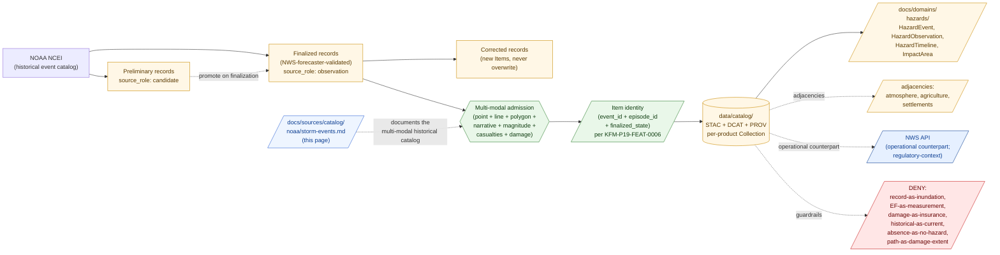

<!-- [KFM_META_BLOCK_V2]
doc_id: kfm://doc/docs-sources-catalog-noaa-storm-events
title: NOAA Storm Events
type: product-page
version: v0.2
status: draft
owners: <PLACEHOLDER — Docs steward + Source steward for noaa + Hazards steward>
created: 2026-05-20
updated: 2026-05-22
policy_label: public
related:
  - docs/sources/catalog/noaa/README.md
  - docs/sources/catalog/noaa/IDENTITY.md
  - docs/sources/catalog/noaa/RIGHTS-AND-SENSITIVITY-MAP.md
  - docs/sources/catalog/noaa/nws-api.md
  - docs/sources/catalog/noaa/station-climate-products.md
  - docs/sources/catalog/noaa/noaa-uscrn.md
  - docs/sources/catalog/noaa/hrrr-smoke.md
  - docs/sources/catalog/noaa/hms-fire-smoke.md
  - docs/sources/catalog/noaa/goes-abi-aod.md
  - docs/sources/catalog/README.md
  - docs/domains/hazards/README.md
  - docs/domains/atmosphere/README.md
  - docs/doctrine/directory-rules.md
  - docs/standards/PROV.md
  - docs/adr/ADR-0001-schema-home.md
tags: [kfm, docs, sources, catalog, noaa, ncei, storm-events, hazards, severe-weather, historical, event-catalog, tornado, hail, flash-flood, multi-modal]
notes:
  - "PROPOSED product-page scaffold; sibling-link presence and repo path NEEDS VERIFICATION."
  - "PROPOSED path under docs/sources/catalog/noaa/ — per-family-folder convention; unprefixed filename follows other NOAA siblings."
  - "Default source_role is observation — Storm Events records are NWS-forecaster-compiled observed event records. Distinct from NWS API (operational/regulatory-context) and HRRR-Smoke/AOD/HMS (modeled / analyst-augmented)."
  - "First true HISTORICAL EVENT CATALOG product-page in the series. Each record is a discrete, identified severe-weather event with multi-modal geometry (point + line + polygon), narrative text, magnitude, casualties, damage."
  - "Dominant anti-collapse: Storm Events record ≠ observed flood inundation (CONFIRMED from NOAA family entry §5.2). Plus: damage report ≠ wind/hail measurement; historical record ≠ current event; reporting bias means absence ≠ no hazard."
  - "Anchored in KFM-P19-FEAT-0006 (CONFIRMED): tornado path overlays with event IDs, episode IDs, checksums, source-file evidence refs."
  - "Event ID and episode ID are part of Item identity — re-issuance or correction produces new Items per the version-in-identity pattern."
[/KFM_META_BLOCK_V2] -->

# NOAA Storm Events

> Historical severe-weather **event catalog** from NCEI — NWS-forecaster-compiled observed event records for tornadoes, hail, severe winds, flash floods, lightning, ice storms, and related hazards. Each record is a **multi-modal artifact** (point + line + polygon + narrative + magnitude + casualties + damage). A Storm Events record is **not** a wind-speed measurement; an EF-scale rating is **not** a measured value; a flash-flood event record is **not** observed flood inundation.

[](#status)
[](#status)
[-green)](#source-role-posture)
[](#repo-fit)
[](#overview)
[](#anti-collapse-stack-event-records-are-not-measurements)
[](#rights-and-sensitivity)
[](../../../doctrine/directory-rules.md)
<!-- TODO: replace placeholder Shields.io targets once CI/badge generation is wired (see KFM-P3-FEAT-0005). -->

**Status:** PROPOSED — scaffold only · **Family:** [`noaa`](./README.md) · **Default `source_role`:** `observation` (event record, NWS-forecaster-compiled) · **Domain served:** `hazards` (primary) · **Owners:** *PLACEHOLDER* · **Last reviewed:** 2026-05-22

---

## Quick jump

- [Overview](#overview)
- [Source-role posture](#source-role-posture)
- [Anti-collapse stack: event records are not measurements](#anti-collapse-stack-event-records-are-not-measurements)
- [Multi-modal record structure](#multi-modal-record-structure)
- [Event ID and episode ID as identity](#event-id-and-episode-id-as-identity)
- [Repo fit](#repo-fit)
- [Source authority](#source-authority)
- [Catalog profiles used](#catalog-profiles-used)
- [Collection identity](#collection-identity)
- [Provenance fields](#provenance-fields)
- [Receipts and transforms](#receipts-and-transforms)
- [Temporal handling](#temporal-handling)
- [Geometry and projection](#geometry-and-projection)
- [Narrative text and sensitivity](#narrative-text-and-sensitivity)
- [Casualties and damage estimates](#casualties-and-damage-estimates)
- [Quality, uncertainty, and reporting bias](#quality-uncertainty-and-reporting-bias)
- [Rights and sensitivity](#rights-and-sensitivity)
- [Downstream consumers](#downstream-consumers)
- [Validation and catalog closure](#validation-and-catalog-closure)
- [Related contracts and schemas](#related-contracts-and-schemas)
- [Related connectors and pipelines](#related-connectors-and-pipelines)
- [Examples](#examples)
- [Open questions](#open-questions)
- [Related docs](#related-docs)

---

## Overview

> [!NOTE]
> **PROPOSED scaffold.** This page describes a candidate product slice of the `noaa` source family. Specific endpoint URLs, current cadence values, message-format versions, and rights terms are **NEEDS VERIFICATION** and must be settled against `data/registry/sources/` and current NOAA NCEI documentation before any catalog promotion.

**Product slice.** *NOAA Storm Events* is the historical severe-weather event catalog maintained by NOAA NCEI. Each record describes a discrete severe-weather event — tornado, hail, severe wind, flash flood, lightning, ice storm, wildfire (in some categorizations), etc. — compiled and validated by NWS forecasters from spotter reports, damage surveys, radar observations, and other inputs.

It is a **historical catalog**, not an operational feed. Records are finalized over weeks to months after the event itself, after NWS forecasters review reports and assemble the official record. Distinct from:

| Already separate | Storm Events covers |
|---|---|
| [`nws-api.md`](./nws-api.md) — operational alerts/warnings/advisories (real-time, `regulatory-context`) | The **historical record** of severe-weather events after the warning lifecycle has closed. |
| [`station-climate-products.md`](./station-climate-products.md) — NCEI station obs and climate aggregates | Discrete, identified **event records** — not continuous-time measurements. |
| [`noaa-uscrn.md`](./noaa-uscrn.md) — reference-grade ground stations | Event-driven records, not station time series. |

PROPOSED — five doctrinal anchors apply (CONFIRMED doctrine; PROPOSED implementation):

- **Storm Events records are NWS-forecaster-compiled observations of *events*.** The catalog admits `source_role: observation`, but the observed object is **the event record itself** — not a direct measurement of wind speed, hail diameter, or rainfall. An EF-3 rating is an inferred classification from damage survey; it is not a measured wind speed.
- **Storm Events record ≠ observed flood inundation.** Per **NOAA family entry §5.2** (CONFIRMED doctrine restatement): *"Storm Events record cited as observed flood inundation → DENY until separate flood-inundation evidence exists → Separate regulatory-layer and observed-event lanes; per-event evidence closure."* This is the load-bearing anti-collapse for Storm Events.
- **Tornado path overlays are part of doctrine.** Per CONFIRMED **KFM-P19-FEAT-0006**: *"NCEI Storm Events should support tornado path line and buffered polygon overlays with event IDs, episode IDs, checksums, and source-file evidence refs."* The multi-modal record structure (point + line + polygon) is anchored in KFM doctrine.
- **Event ID and episode ID are part of identity.** NCEI-issued event identifiers and episode identifiers anchor every record. Re-issuance or correction produces new Items, parallel to the version-in-identity rules for OCR, AOD, HMS, HRRR-Smoke, and reanalyses.
- **Historical ≠ life-safety.** Inherits the NOAA family life-safety red line. Storm Events records describe events that have already occurred; they are not warnings or advisories for current or future events. (That role belongs to [`nws-api.md`](./nws-api.md).)

This page is a **product-page**: it describes the slice's *catalog identity*, *profile usage*, *provenance fields*, *receipt requirements*, *multi-modal record structure*, *anti-collapse rules*, *narrative-text sensitivity*, *casualty/damage handling*, and *validation gates*. It is **not** a duplicate of the `SourceDescriptor`, the policy bundle, or the rights map — those live in their respective responsibility roots and are linked from here.

[↑ back to top](#noaa-storm-events)

---

## Source-role posture

> [!CAUTION]
> **Default `source_role` for Storm Events records is `observation`** (per Atlas Ch. 24.1.3, source-role vocabulary). The observed object is **the event record itself** — the NCEI-validated documentary fact that a severe-weather event of a stated type occurred at a stated location and time, with a stated magnitude, damage, and casualty count. The role is *not* a claim that any specific scalar value in the record (wind speed, hail diameter, damage dollars) is a direct measurement.

| `source_role` candidate | When it applies to a Storm Events item | Promotion gate |
|---|---|---|
| `observation` | **Default.** Each event record at its NCEI-finalized state. | `SourceDescriptor` + `RunReceipt`; event ID and episode ID part of identity (per KFM-P19-FEAT-0006); NWS-forecaster-validated metadata preserved. |
| `aggregate` | KFM-derived spatial / temporal aggregates (events per county per year, multi-event timelines, regional summaries). | `AggregationReceipt` pinning geometry-scope and time-scope. |
| `candidate` | Pending NCEI finalization — Storm Events records typically appear in preliminary form first, then are finalized after NWS forecaster review. | `role_candidate_disposition: pending`; PUBLISHED edge forbidden for preliminary records until `merged` (i.e., until NCEI finalizes). |
| `modeled` | **Not applicable.** Storm Events records are documentary, not modeled. *(Magnitudes inferred from damage survey are still part of the *observation*; the survey is the observed input.)* | — |
| `authority` | **Not applicable.** NCEI compiles and publishes the catalog as authoritative documentary record, but Storm Events records are not regulatory determinations. KFM admits them under `observation`, not `authority`. | — |
| `regulatory-context` | **Not applicable.** That's NWS API ([`nws-api.md`](./nws-api.md)). | — |
| `synthetic` | **Not applicable.** Real events. | — |

**Anti-collapse rule** (CONFIRMED doctrine; PROPOSED realization): the catalog must preserve `kfm:source_role: observation` across every derivation hop. A Storm Events record cannot be re-emitted as `authority` for any specific scalar value it contains; the *record* is the observation, not the values within it.

### Preliminary vs finalized state

Storm Events records have a lifecycle:

| State | Meaning | KFM posture |
|---|---|---|
| **Preliminary** | NCEI exposes a record shortly after the event, before NWS forecaster finalization. | `source_role: candidate` with `role_candidate_disposition: pending`. Not promoted to `PUBLISHED`. |
| **Finalized** | NCEI publishes the record as final after NWS forecaster review and validation. | `source_role: observation`. Eligible for promotion. |
| **Corrected** | NCEI issues a correction to a finalized record (rare but happens). | Re-ingestion produces a **new Item**, not an in-place update. Lineage preserved via `kfm:storm_events.supersedes_ref`. |

[↑ back to top](#noaa-storm-events)

---

## Anti-collapse stack: event records are not measurements

> [!WARNING]
> Storm Events sits at the intersection of multiple anti-collapse rules. The *record* of an event is admitted as observation; the *scalar values within the record* are not measurements in the strict sense. Treating an EF-3 rating as "3-second gust of 158 mph" or a flash-flood Storm Events record as "inundation extent and depth" is a category error.

### Seven anti-collapse rules

| # | The collapse | Why it fails | Required guardrail |
|---|---|---|---|
| **AC-1** | Storm Events record → observed flood inundation | Flash-flood Storm Events records describe *that flooding occurred*, not *where the water reached*. Inundation extent requires separate evidence (NFHL, observed high-water marks, post-event imagery). | DENY join from event record → inundation extent without separate evidence; per-event evidence closure. *(CONFIRMED — NOAA family entry §5.2.)* |
| **AC-2** | EF-scale (or F-scale) rating → measured wind speed | EF ratings are damage-based classifications. A rating is an *inferred upper-bound estimate*, not a measurement. The EF scale is explicitly designed as a damage proxy, not a wind anemometry value. | EF/F rating preserved as classification field; never displayed as a wind-speed measurement; conversion to numeric wind speed requires a separately receipted derivation. |
| **AC-3** | Hail diameter "max reported" → ground-truth maximum hail | Hail diameters are typically reports from observers (spotters, public, NWS staff) at specific points. The "max reported" diameter is the largest among reports, not the actual maximum hail that fell. | "Max reported" framing preserved verbatim; never re-rendered as "the maximum hail size that fell". |
| **AC-4** | Damage estimate ($ property, $ crops) → insurance settlement or formal disaster declaration | Storm Events damage estimates are *event-time field estimates*, often by NWS forecasters working from reports and partial data. They are not actuarially validated, not FEMA-declared, and not legally adjudicated. | Damage estimates surfaced with their estimation basis; never cited as compensation, insurance, or formal disaster-declaration values. |
| **AC-5** | Storm Events absence → "no hazard occurred" | Reporting bias: events get reported more in populated areas and during active spotter networks. A blank cell in a sparse-population county does not mean no events occurred — it may mean none were reported. | Absence rendered as "no Storm Events records present" — not as "no events occurred". Population density caveat available in metadata. |
| **AC-6** | Historical record → current event | Storm Events records describe events that have already happened. Rendering a recent Storm Events record as if it were a current operational warning collapses the historical/operational boundary. | Storm Events Items always carry their event-time; UI display surfaces "Historical event from <date>" framing, never "current". |
| **AC-7** | Tornado path → tornado damage extent | The tornado path *line* (begin point to end point) is a track, not a damage extent. Tornado damage extends to varying widths along the track and varies in severity. Buffered polygons per KFM-P19-FEAT-0006 are an *approximation*, not a survey result. | Per KFM-P19-FEAT-0006, *"tornado path line and buffered polygon overlays"* — both admitted, both distinct, both linked via the same event ID; buffered polygons explicitly tagged as derived. |

### Denied operations for this product (PROPOSED gates)

- **Record-as-inundation collapse** *(AC-1)* — Storm Events Items cited as inundation extent without separate evidence **fail closed**.
- **EF-as-measurement collapse** *(AC-2)* — EF/F ratings displayed or summarized as measured wind speeds **fail closed**.
- **Max-reported-as-actual collapse** *(AC-3)* — hail diameter or other "max reported" values relabeled as ground-truth maximums **fail closed**.
- **Damage-as-insurance collapse** *(AC-4)* — damage estimates cited as compensation, insurance settlements, or formal disaster-declaration figures **fail closed**.
- **Absence-as-no-hazard collapse** *(AC-5)* — empty cells in low-population areas rendered as "no events occurred" **fail closed**.
- **Historical-as-current collapse** *(AC-6)* — recent Storm Events records displayed without explicit historical framing **fail closed**.
- **Path-as-damage-extent collapse** *(AC-7)* — tornado path lines rendered as damage footprints without the buffered-polygon distinction **fail closed**.

[↑ back to top](#noaa-storm-events)

---

## Multi-modal record structure

A Storm Events record is **multi-modal** — point, line, polygon, narrative, magnitude, casualties, damage all travel together for a single event. KFM admits each modality as a first-class field or asset so anti-collapse rules can be enforced per-modality.

PROPOSED record modalities (NEEDS VERIFICATION against current NCEI documentation):

| Modality | Examples | KFM treatment |
|---|---|---|
| **Point geometry** | `begin_location` (lat/lon, place name) and `end_location` (for events with extent like tornadoes) | First-class field; preserved as NCEI-issued. |
| **Line geometry** | Tornado track (begin point → end point) | First-class asset per KFM-P19-FEAT-0006: *"tornado path line"*. |
| **Polygon geometry** | Buffered tornado path; affected-county polygon; affected-zone polygon | First-class asset per KFM-P19-FEAT-0006: *"buffered polygon overlays"*. Buffering parameters carried in `TransformReceipt`. |
| **Narrative text** | NWS-forecaster-written event description | First-class asset; sensitivity gate applies (see [§ Narrative text and sensitivity](#narrative-text-and-sensitivity)). |
| **Magnitude** | EF-scale (tornado), hail diameter (in), wind speed (mph), etc. | First-class structured field; AC-2 / AC-3 anti-collapse applies. |
| **Casualties** | Direct injuries, indirect injuries, direct deaths, indirect deaths | First-class structured field; aggregation discipline applies (see [§ Casualties and damage estimates](#casualties-and-damage-estimates)). |
| **Damage** | Property damage ($), crop damage ($) | First-class structured field; AC-4 anti-collapse applies. |
| **Event type** | Tornado, Hail, Thunderstorm Wind, Flash Flood, etc. (NCEI vocabulary) | First-class enum; the vocabulary is part of identity (you cannot interconvert event types). |

> [!TIP]
> The multi-modal nature means a *single Storm Events Item* in the KFM catalog carries multiple Assets and multiple typed fields. The catalog must allow downstream consumers to request only the modality they need — tornado-path-line-only renders, narrative-text-only Focus Mode citations, magnitude-only statistical summaries — without forcing them to load the entire record.

[↑ back to top](#noaa-storm-events)

---

## Event ID and episode ID as identity

Per CONFIRMED **KFM-P19-FEAT-0006**, every Storm Events record carries an **event ID** and an **episode ID** issued by NCEI. These identifiers are part of Item identity, parallel to the engine-version (OCR), algorithm-version (AOD), cycle (HRRR-Smoke), analyst-pass-id (HMS), and reanalysis-version (station-climate products) identity rules.

| Identifier | Meaning | Role in identity |
|---|---|---|
| **Event ID** | NCEI-issued unique identifier for a single event record (one tornado, one hail report, one flash flood, etc.). | Part of Item identity. Re-issuance after correction → new Item. |
| **Episode ID** | NCEI-issued identifier grouping related events that occurred during the same weather episode (e.g., a single supercell that produced multiple tornadoes, hail, and wind events). | Part of Item identity, but **shared across multiple events**. Episode boundaries are NCEI-defined; KFM preserves them verbatim. |
| **Checksum** | KFM-side content hash. | Anchors record digest; per KFM-P19-FEAT-0006 *"checksums"*. |
| **Source-file evidence ref** | Reference to the original NCEI-distributed source file. | Per KFM-P19-FEAT-0006 *"source-file evidence refs"*. |

> [!CAUTION]
> The episode ID is **not** an event ID. Multiple Items share an episode ID; each Item has its own event ID. A Storm Events display that filters by episode ID returns multiple events; a display that filters by event ID returns one. Conflating them is a category error.

PROPOSED Item ID rule (per KFM-P19-FEAT-0006 verbatim requirements):

`product + episode_id + event_id + event_type + begin_time + finalized_state + normalized_digest`

Where `finalized_state ∈ { preliminary, finalized, corrected_v<n> }` — `preliminary` and successive `corrected_v<n>` states are distinct Items, never updates of the `finalized` Item.

[↑ back to top](#noaa-storm-events)

---

## Repo fit

> [!IMPORTANT]
> **PROPOSED path.** This file is authored at `docs/sources/catalog/noaa/storm-events.md`. The per-family-folder layout and unprefixed filename follow the NOAA siblings.

| Direction | Neighbor | Relationship |
|---|---|---|
| **Upstream (parent)** | [`README.md`](./README.md) | NOAA family-level orientation. |
| **Sibling** | [`IDENTITY.md`](./IDENTITY.md) | Collection-id and namespace rules for the NOAA family. |
| **Sibling** | [`RIGHTS-AND-SENSITIVITY-MAP.md`](./RIGHTS-AND-SENSITIVITY-MAP.md) | Family rights / sensitivity decisions; this page does **not** restate policy. |
| **Sibling — operational counterpart** | [`nws-api.md`](./nws-api.md) | NWS API issues **operational** warnings (`regulatory-context`); Storm Events is the **historical record** of events after the warning lifecycle. Both feed Hazards but at different lifecycle stages. |
| **Sibling — adjacent observation** | [`station-climate-products.md`](./station-climate-products.md) | Both NCEI-distributed; Storm Events is event-keyed while station-climate is station-keyed. Cross-product comparison products possible (e.g., severe-weather events overlaid on station climate context). |
| **Sibling — reference observation** | [`noaa-uscrn.md`](./noaa-uscrn.md) | Continuous station obs vs discrete event records — fundamentally different record structure. |
| **Sibling — forecast counterpart** | [`hrrr-smoke.md`](./hrrr-smoke.md) | Forecasts predict; Storm Events documents what actually happened. Trust-class distinction. |
| **Sibling** | [`hms-fire-smoke.md`](./hms-fire-smoke.md), [`goes-abi-aod.md`](./goes-abi-aod.md) | Other NOAA-family slices. |
| **Upstream (root)** | [`../README.md`](../README.md) | Catalog landing page. |
| **Cross-root (data)** | [`data/registry/sources/`](../../../../data/registry/sources/) | Authoritative `SourceDescriptor` home. |
| **Cross-root (domain, primary)** | [`docs/domains/hazards/`](../../../domains/hazards/) | Owns `HazardEvent`, `HazardObservation`, `HazardTimeline`, `ImpactArea`. |
| **Cross-root (domain, adjacency)** | [`docs/domains/atmosphere/`](../../../domains/atmosphere/) | Climate-of-severe-weather analyses. |
| **Cross-root (domain, adjacency)** | [`docs/domains/agriculture/`](../../../domains/agriculture/) | Crop-damage records for ag-impact context. |
| **Cross-root (domain, adjacency)** | [`docs/domains/settlements/`](../../../domains/settlements/) | Property-damage records in the built environment. |
| **Doctrine** | [`docs/doctrine/directory-rules.md`](../../../doctrine/directory-rules.md) | Placement authority. |



> [!NOTE]
> Diagram reflects the **preliminary-to-finalized lifecycle**, the **multi-modal admission** of each record, the **event-ID-and-episode-ID-as-identity** rule per KFM-P19-FEAT-0006, and the seven canonical DENY paths. Specific subpaths are PROPOSED until mounted-repo inspection confirms presence.

[↑ back to top](#noaa-storm-events)

---

## Source authority

The authoritative `SourceDescriptor` for Storm Events lives in [`data/registry/sources/`](../../../../data/registry/sources/) (PROPOSED path per Directory Rules §6).

> [!WARNING]
> **Do not duplicate descriptor fields here.** This page references identity, role, rights, sensitivity, and cadence — it does not own them. If a field appears to disagree, the descriptor wins, and a drift entry should open in `docs/registers/DRIFT_REGISTER.md`.

PROPOSED — the descriptor should at minimum carry:

- `source_id` — stable identifier (e.g., `noaa-ncei-storm-events`).
- `source_role` — `observation` by default for finalized records; `candidate` for preliminary records.
- `role_authority` — NOAA NCEI (the operational catalog steward); NWS forecasters as the validating reviewers.
- `rights` — license, redistribution terms, attribution. Storm Events is generally a U.S. government work in the public domain; per-product terms and any narrative-text redistribution caveats NEEDS VERIFICATION.
- `sensitivity` — tier per [`RIGHTS-AND-SENSITIVITY-MAP.md`](./RIGHTS-AND-SENSITIVITY-MAP.md); narrative-text and casualty fields warrant attention.
- `cadence` — NCEI typically updates Storm Events on a multi-month cycle as forecasters finalize records; NEEDS VERIFICATION against current NCEI documentation.
- `event_id_basis` — NCEI-issued event identifier scheme (per KFM-P19-FEAT-0006).
- `episode_id_basis` — NCEI-issued episode identifier scheme.
- `ingest_hash` — content-addressable digest of the admitted source file (per KFM-P19-FEAT-0006 *"source-file evidence refs"* and *"checksums"*).

NEEDS VERIFICATION: actual `SourceDescriptor` schema field names against `schemas/contracts/v1/source/` (per ADR-0001).

[↑ back to top](#noaa-storm-events)

---

## Catalog profiles used

PROPOSED — Storm Events maps across the standard KFM-STAC / DCAT / PROV-O profile triad (per KFM-P1-PROG-0021 and KFM-P32-IDEA-0005).

| Profile | Lane | Used by this product? | Notes |
|---|---|---|---|
| STAC 1.1 | `data/catalog/stac/` | PROPOSED — **Yes** (NEEDS VERIFICATION) | Per-event Items keyed by `event_id` and `episode_id`; multi-modal Assets per Item (point, line, polygon, narrative, structured fields); STAC Projection extension required. |
| DCAT | `data/catalog/dcat/` | PROPOSED — Yes / No (NEEDS VERIFICATION) | Distribution mapping for downloadable Storm Events archives. |
| PROV-O | `data/catalog/prov/` | PROPOSED — **Yes (required)** | Each event compilation is a `prov:Activity` with `wasAttributedTo` to NWS forecasters (network attribution, not individual); preliminary → finalized → corrected lineage modeled as `prov:wasRevisionOf` edges. |
| Domain projection | `data/catalog/domain/hazards/` | PROPOSED — **Yes (primary)** | Projects into `HazardEvent`, `HazardObservation`, `HazardTimeline`, `ImpactArea` (DOM-HAZ §E). Adjacency projections into atmosphere-air (climate-of-severe-weather), agriculture (crop damage), settlements (property damage). |

> [!TIP]
> The multi-modal nature of Storm Events makes the **Asset role taxonomy** unusually important. A single Item carries `data` (structured fields), `narrative` (text asset), `path_line` (line geometry where applicable), `path_polygon_buffered` (derived polygon per KFM-P19-FEAT-0006), `affected_zone` (county or UGC zone polygon where applicable), `metadata` — each requiring distinct role tagging.

[↑ back to top](#noaa-storm-events)

---

## Collection identity

- **PROPOSED Collection ID pattern.** `kfm-noaa-ncei-storm-events` for the unified historical catalog; per-event-type sub-Collections (`...-tornado`, `...-hail`, `...-flash-flood`) are an option pending [OPEN-SE-04](#open-questions).
- **PROPOSED namespace.** `kfm:` — pending resolution of *OPEN-DSC-03* (namespace canonicalization). NEEDS VERIFICATION.
- **PROPOSED Item ID rule** (per KFM-P19-FEAT-0006 verbatim requirements): `product + episode_id + event_id + event_type + begin_time + finalized_state + normalized_digest`. Event ID, episode ID, and finalized state are part of identity.
- **Asset roles.** NEEDS VERIFICATION — confirm against `schemas/contracts/v1/source/`. Candidate roles per Item:
  - `data` (structured event fields)
  - `narrative` (NWS-forecaster-written description; sensitivity gate applies)
  - `path_line` (tornado track or other linear-event line; per KFM-P19-FEAT-0006)
  - `path_polygon_buffered` (KFM-derived buffered polygon; per KFM-P19-FEAT-0006 — `TransformReceipt` documents the buffer width)
  - `affected_zone` (county or UGC-zone polygon for events with extent)
  - `casualties` (structured casualty fields)
  - `damage` (structured damage fields)
  - `metadata` (event/episode metadata, supersession refs)

[↑ back to top](#noaa-storm-events)

---

## Provenance fields

STAC `properties.kfm:provenance` block (PROPOSED — Pass-10 C4-01 / KFM-P3-IDEA-0004):

| Field | Resolves to | Required when | Notes |
|---|---|---|---|
| `spec_hash` | sha256 of the canonical record | always | Anchors record identity. |
| `evidence_bundle_ref` | `kfm://evidence/<digest>` | claim-bearing items | EvidenceBundle backing any non-trivial assertion. |
| `run_record_ref` | `kfm://run/<run-id>` | always | KFM-side run identifier. |
| `audit_ref` | `kfm://audit/<attestation-id>` | promoted items | DSSE / Cosign attestation. |
| `policy_digest` | sha256 of the policy bundle in force | promoted items | Reproducible gate state. |
| `source_role` | enum: `observation` (finalized) \| `candidate` (preliminary) \| `aggregate` (KFM-derived) | always | Default `observation` for finalized; `candidate` for preliminary. Never `modeled`, `authority`, `regulatory-context`, `synthetic`. |
| `source_file_ref` | KFM evidence ref to the original NCEI source file | always | Per KFM-P19-FEAT-0006 *"source-file evidence refs"*. |
| `kfm:storm_events.event_id` | string (NCEI-issued) | always | Per KFM-P19-FEAT-0006. |
| `kfm:storm_events.episode_id` | string (NCEI-issued) | always | Per KFM-P19-FEAT-0006. |
| `kfm:storm_events.event_type` | enum (NCEI vocabulary: `Tornado`, `Hail`, `Thunderstorm Wind`, `Flash Flood`, `Lightning`, `Ice Storm`, etc.) | always | Vocabulary preserved verbatim. |
| `kfm:storm_events.finalized_state` | enum: `preliminary` \| `finalized` \| `corrected_v<n>` | always | Lifecycle state; `preliminary` and `corrected_v<n>` are distinct Items, never updates. |
| `kfm:storm_events.magnitude` | structured (varies by event type: `ef_scale`, `f_scale`, `hail_diameter_in`, `wind_speed_mph_estimated`, etc.) | when present in source | AC-2 / AC-3 anti-collapse applies; never displayed as direct measurement. |
| `kfm:storm_events.casualties` | structured `{ direct_injuries, indirect_injuries, direct_deaths, indirect_deaths }` | when present in source | First-class field; aggregation discipline applies. |
| `kfm:storm_events.damage` | structured `{ property_usd, crops_usd }` | when present in source | AC-4 anti-collapse applies; never cited as compensation/insurance. |
| `kfm:storm_events.supersedes_ref` | `EvidenceRef` to prior Item | required when corrected | Lineage closure for `corrected_v<n>` states. |
| `kfm:storm_events.episode_ref` | `EvidenceRef` to shared episode-level Item or summary | optional | Cross-link to the multi-event episode context. |
| `kfm:storm_events.narrative_sensitivity_flag` | enum: `unreviewed` \| `cleared` \| `redacted_in_narrative` \| `narrative_suppressed` | required if `narrative` asset present | See [§ Narrative text and sensitivity](#narrative-text-and-sensitivity). |

Per-asset integrity: STAC `file:checksum` for **every** asset, including narrative, path_line, path_polygon_buffered (per KFM-P19-FEAT-0006 *"checksums"*).

> [!NOTE]
> NEEDS VERIFICATION — exact field names, especially the `kfm:storm_events.*` extension fields, need to be reconciled against the live `kfm-stac-extension.md` if one exists in the repo. The `event_type` enum is illustrative; NEEDS VERIFICATION against the authoritative NCEI Storm Events vocabulary.

[↑ back to top](#noaa-storm-events)

---

## Receipts and transforms

CONFIRMED doctrine: *KFM uses receipts to make consequential transformations inspectable.* For Storm Events, the consequential transformations are (a) the NCEI compilation itself (recorded as upstream attribution, not as a KFM-side receipt), (b) any KFM-side buffering of tornado tracks per KFM-P19-FEAT-0006, (c) preliminary-to-finalized state transitions, and (d) corrections.

| Receipt | Triggered by | Required content (PROPOSED shape) |
|---|---|---|
| **`SourceDescriptor`** (anchor) | Admission of Storm Events as a sub-source of the NOAA family. | `source_id`, `source_role`, `role_authority: "NOAA NCEI / NWS forecasters"`, `rights`, `sensitivity`, `cadence`, `event_id_basis`, `episode_id_basis`, `ingest_hash`, `time`, `citation`. |
| **`RunReceipt`** (ingest receipt) | Each ingest pass. | Request URL, conditional-GET headers, content checksum, retrieval time, source-file evidence ref per KFM-P19-FEAT-0006. |
| **`TransformReceipt`** *(mandatory for buffered-polygon derivation)* | KFM-side buffering of tornado tracks into polygon overlays (per KFM-P19-FEAT-0006). | `input_geom_hash` (path line), `output_geom_hash` (buffered polygon), `transform: "buffer"`, `parameters: { buffer_width_m: <value> }`, `tolerance`, `timestamp`, `actor`. Buffer width as a KFM-side choice must be documented and inspectable. |
| **`TransformReceipt`** | Reprojection, unit conversion, geometry generalization. | Standard transform-receipt fields. |
| **`AggregationReceipt`** | KFM-derived spatial / temporal aggregates (events per county per year, multi-event timelines, etc.). | `geometry_scope`, `time_scope`, `aggregation_method`, `input_source_refs`, `suppression_rule` (especially relevant for casualty aggregations — see [§ Casualties and damage estimates](#casualties-and-damage-estimates)). |
| **`ValidationReport`** | WORK → PROCESSED and PROCESSED → CATALOG transitions. | `validator_id`, `target`, `passes[]`, `failures[]`. |
| **`CorrectionNotice`** | NCEI-issued corrections to finalized records. | Lineage to the original Item; new Item supersedes via `kfm:storm_events.supersedes_ref`. |
| **`RedactionReceipt`** | Narrative-text sensitivity transforms. | See [§ Narrative text and sensitivity](#narrative-text-and-sensitivity). |
| **`ModelRunReceipt`** | **Not required for Storm Events native admission.** Required if KFM builds derived modeled products on top (e.g., event-density models, hazard-recurrence estimates). | Downstream model carries the receipt; Storm Events itself does not. |

> [!CAUTION]
> A corrected Storm Events record from NCEI **produces a new Item** with `finalized_state: corrected_v<n>`, not an in-place update of the prior Item. Silent overwrites violate the source-role anti-collapse rule, break supersession lineage, and obscure NCEI's correction history.

[↑ back to top](#noaa-storm-events)

---

## Temporal handling

PROPOSED — Storm Events items must keep the standard KFM time roles **distinct where material**:

| Time role | Meaning for a Storm Events item | Status |
|---|---|---|
| `source_time` | Event begin time (NCEI-issued) | PROPOSED |
| `observed_time` | The event time itself (typically equal to `source_time` for the begin or a span for the duration) | PROPOSED |
| `valid_time` | The event's duration (`begin_time` to `end_time` when both present) | PROPOSED |
| `event_begin_time` | NCEI-issued event begin | PROPOSED |
| `event_end_time` | NCEI-issued event end (where applicable) | PROPOSED |
| `finalization_time` | When NCEI finalized the record (preliminary → finalized transition) | PROPOSED |
| `retrieval_time` | When KFM ingested the record | PROPOSED |
| `release_time` | When KFM promoted the Item | PROPOSED |
| `correction_time` | NCEI-issued correction time for `corrected_v<n>` Items | PROPOSED |

> [!WARNING]
> **Do not infer the event from `release_time` or `retrieval_time`.** Storm Events records are *historical* by design — they describe events that have already happened, often months ago. Public surfaces displaying Storm Events must always carry the event_begin_time prominently to avoid the historical-as-current collapse (AC-6).

> [!IMPORTANT]
> **Finalization latency is real.** NCEI finalizes Storm Events records on a delay — typically weeks to months after the event itself. Items admitted at `source_role: candidate` (preliminary) are not promoted to `source_role: observation` (finalized) until NCEI publishes the finalized record. KFM tests must verify this transition explicitly.

NEEDS VERIFICATION — confirm time-role tests exist or are PROPOSED in `tests/`.

[↑ back to top](#noaa-storm-events)

---

## Geometry and projection

PROPOSED — Storm Events records carry multi-modal geometry:

| Concern | Posture | Status |
|---|---|---|
| **Point geometry** (`begin_location`, `end_location`) | Preserved as NCEI-issued (lat/lon, place name). | NEEDS VERIFICATION — confirm CRS (likely WGS84). |
| **Line geometry** (tornado track) | Preserved as the NCEI begin-point → end-point line per KFM-P19-FEAT-0006 *"tornado path line"*. | PROPOSED. |
| **Polygon geometry — buffered tornado path** | KFM-side derivation per KFM-P19-FEAT-0006 *"buffered polygon overlays"*; buffer width as a documented `TransformReceipt` parameter. | PROPOSED. |
| **Polygon geometry — affected county / UGC zone** | When NCEI assigns events to county or UGC zones, the canonical zone polygon is the geometry. | PROPOSED. |
| **Native CRS** | Geographic (WGS84) per common NCEI practice. | NEEDS VERIFICATION. |
| **Resampled CRS** | For Kansas-focused public layers, reprojection via `TransformReceipt`. | PROPOSED. |
| **Generalization** | Operational geometry (path lines and zone polygons) is preserved exactly. Generalization is allowed only for distinct derived layers under `source_role: aggregate`. | PROPOSED. |
| **STAC Projection extension** | Required (`proj:code`, `proj:bbox`, `proj:geometry`) per KFM-P27-FEAT-0003. | PROPOSED. |

NEEDS VERIFICATION — confirm against `data/catalog/` artifacts and any Storm Events fixtures in `tests/` or `fixtures/`.

[↑ back to top](#noaa-storm-events)

---

## Narrative text and sensitivity

Storm Events records typically include a **narrative description** written by an NWS forecaster. The narrative is one of the most informative parts of the record — and one of the most sensitivity-prone.

| Sensitivity concern | Why it matters | Default posture |
|---|---|---|
| **Specific address / business naming** | Narratives may mention specific addresses or businesses ("a barn at 1234 County Road N was destroyed", "the [Named Restaurant] sign was carried half a mile"). Public display of these details may infringe on privacy or property-owner sensitivity. | `kfm:storm_events.narrative_sensitivity_flag` carried per Item; flag determines whether narrative renders verbatim, with redactions, or is suppressed in public display. |
| **Casualty identification** | Older or rural narratives sometimes name casualties or describe identifying circumstances. | Stewarded redaction path; living-person and recent-casualty content gets the strictest handling. See [§ Casualties and damage estimates](#casualties-and-damage-estimates). |
| **Cultural / sacred site references** | Narratives may describe damage to culturally significant sites; KFM's CARE pathway applies. | Stewarded redaction path; OPEN-SE-09 flags the CARE workflow. |
| **Defamation risk** | Narratives are NWS-forecaster-written, not legally vetted; verbatim public republication of older narratives may carry residual defamation risk for surviving subjects. | Default verbatim preservation in the catalog; rendering decisions deferred to policy. |

PROPOSED `narrative_sensitivity_flag` lifecycle:

| Flag value | Meaning | Public-surface treatment |
|---|---|---|
| `unreviewed` | Narrative has not been reviewed against the sensitivity register. | Default to suppression in public display until reviewed. |
| `cleared` | Reviewed and approved for full public display. | Verbatim narrative shown. |
| `redacted_in_narrative` | Reviewed; specific phrases redacted but narrative still displayed. | Redacted narrative shown with a redaction indicator and `RedactionReceipt` link. |
| `narrative_suppressed` | Reviewed; the entire narrative is policy-suppressed for public display. | Narrative not displayed publicly; structured fields still available. |

> [!CAUTION]
> KFM preserves the **original narrative** in the catalog regardless of the flag — anti-fabrication discipline requires it. The flag governs **public display**, not catalog retention. Policy-suppressed narratives remain inspectable through governed-API paths that policy permits (e.g., research access with appropriate review).

[↑ back to top](#noaa-storm-events)

---

## Casualties and damage estimates

Casualty and damage fields are the most epistemically and ethically loaded structured fields in Storm Events records.

### Casualty discipline

| Concern | KFM posture |
|---|---|
| **Casualty figures as-issued** | NCEI-issued `direct_injuries`, `indirect_injuries`, `direct_deaths`, `indirect_deaths` preserved verbatim as first-class fields. |
| **Casualty aggregation suppression** | Small-cell suppression policy applies — aggregations that would expose individual casualties through inference (e.g., a single-fatality event in a small county for a recent year) require `AggregationReceipt` with explicit suppression rules. |
| **Identifying details in narrative** | Handled by `narrative_sensitivity_flag` (see [§ Narrative text and sensitivity](#narrative-text-and-sensitivity)). |
| **Recent vs historical casualties** | Recent casualties (within a defined recency window per policy) carry stricter handling than older historical ones. Recency window defined in policy, not here. |

### Damage estimate discipline

| Concern | KFM posture |
|---|---|
| **Damage figures as-issued** | NCEI-issued `property_usd` and `crops_usd` preserved verbatim as first-class fields. |
| **AC-4 anti-collapse** | Damage estimates **never** displayed or summarized as insurance settlements, compensation values, or formal disaster-declaration figures. AC-4 fails closed if attempted. |
| **Estimation basis preserved** | Where NCEI provides estimation basis (point estimate vs range, source of estimate), KFM preserves it. |
| **Currency-year disclosure** | Damage figures are typically in nominal dollars at event-time; KFM surfaces the event year so the figure can be interpreted; inflation-adjusted figures are downstream derived artifacts with their own receipts. |

> [!CAUTION]
> The dollar figures in Storm Events are NCEI/NWS-forecaster-estimated values for the historical record — they are **not** insurance, FEMA, or legal-adjudicated figures. Treating them as compensation values would be incorrect. KFM's role is to preserve and display them honestly with their estimation framing, not to convert them into authoritative dollar claims.

[↑ back to top](#noaa-storm-events)

---

## Quality, uncertainty, and reporting bias

PROPOSED — Storm Events records carry quality and uncertainty information that includes some uniquely doctrinal concerns about *coverage*.

| Metric | Granularity | Use |
|---|---|---|
| **Finalized state** | per-Item | `preliminary` carries lower confidence than `finalized`; `corrected_v<n>` carries supersession lineage. |
| **NWS forecaster attribution** | per-Item or per-episode (where NCEI exposes it) | Network-level attribution to NWS forecasters; KFM does not claim to know individual reviewers. |
| **Magnitude estimation basis** | per-Item | EF/F ratings from damage survey vs from radar; hail diameter "max reported" vs "measured"; wind speed estimated vs anemometry. |
| **Casualty / damage estimation basis** | per-Item | Whether estimates are from on-scene survey, post-event report, or insurance-industry inputs (where NCEI distinguishes). |
| **Reporting density / spotter network coverage** | per-region / per-time | Reporting bias varies by region (population density), time (older records have less coverage), and event type (spectacular events get reported more). AC-5 anti-collapse. |
| **Episode coherence** | per-episode | Multiple events in a single episode should share consistent timing and geometry; outliers may indicate data-entry errors. |

> [!TIP]
> The **reporting-bias caveat** is unique to Storm Events among the NOAA-family products. USCRN's coverage is deliberate and sparse; HRRR-Smoke's grid is uniform; AOD has cloud-affected pixel flags. Storm Events has *reporting bias* — a function of human reporting infrastructure, not instrument design. The badge for Storm Events should surface this — for instance, "low-population areas under-represented" as a caveat layer.

[↑ back to top](#noaa-storm-events)

---

## Rights and sensitivity

> [!IMPORTANT]
> **Do not restate policy here.** Sensitivity tier, redaction rules, and reveal posture are decided in [`policy/sensitivity/`](../../../../policy/sensitivity/) and summarized in the sibling [`RIGHTS-AND-SENSITIVITY-MAP.md`](./RIGHTS-AND-SENSITIVITY-MAP.md). This section names the *kinds of risks* the product introduces, not the *decisions* taken against them.

PROPOSED risk surfaces — NEEDS VERIFICATION per product:

| Risk surface | Why it matters | Default posture |
|---|---|---|
| **Record-as-inundation misuse** *(AC-1)* | Flash-flood Storm Events records do not provide inundation extent. | DENY join from event record → inundation extent without separate evidence. *(CONFIRMED — NOAA family entry §5.2.)* |
| **EF-as-measurement misuse** *(AC-2)* | EF ratings are damage-based classifications, not measurements. | EF rating preserved as classification; never displayed as wind speed. |
| **Damage-as-compensation misuse** *(AC-4)* | Storm Events damage figures are estimates, not insurance/legal values. | Display framing surfaces estimation basis; AC-4 anti-collapse. |
| **Casualty identification** | Older narratives may identify casualties or surviving families. | `narrative_sensitivity_flag` + small-cell suppression. |
| **Reporting-bias misuse** *(AC-5)* | Absence of records in low-population areas does not mean no hazards. | "No records" framing on absence; population-density caveat. |
| **Historical-as-current misuse** *(AC-6)* | Recent Storm Events records can look operational. | Event-time framing mandatory on every display. |
| **Cultural-site context** | Damage to culturally significant sites needs CARE-aware handling. | Stewarded review path (OPEN-SE-09). |
| **License inheritance** | Storm Events is generally a U.S. government work in the public domain; narrative-text redistribution may carry separate considerations. | License-deny lane until rights confirmed (per Master MapLibre ML-062-016). |

> [!CAUTION]
> CONFIRMED doctrine: *Unclear rights, unresolved source role, missing evidence, unresolved sensitivity, or absent release state blocks public promotion.* Storm Events' multi-modal nature increases the surface area: the narrative may be sensitive even when the structured fields are public-safe.

[↑ back to top](#noaa-storm-events)

---

## Downstream consumers

Storm Events is foundational context for hazards-domain work in KFM. The catalog should make this lineage explicit via PROV-O links and via `kfm:source_role` propagation.

| Downstream consumer | What it derives from Storm Events | Its default `source_role` |
|---|---|---|
| Hazards `HazardEvent` layer | Direct rendering of Storm Events records with event-time framing, multi-modal geometry, and AC-1 through AC-7 caveats | `observation` (preserved). |
| Hazards `HazardObservation` layer | Per-event observation records with multi-modal Assets | `observation` (preserved). |
| Hazards `HazardTimeline` layer | Multi-event chronologies grouped by region, season, episode, or hazard type | Downstream `aggregate` with `AggregationReceipt`; the original Storm Events Items preserve their `observation` role. |
| Hazards `ImpactArea` layer | Affected-zone polygons and buffered tornado paths per KFM-P19-FEAT-0006 | `observation` for source polygons; `aggregate` or `modeled` for derived impact-extent products. |
| Climate-of-severe-weather products (atmosphere adjacency) | Multi-decade Storm Events records used for severe-weather climatology | Downstream `aggregate` with its own receipts; Storm Events Items preserve their role. |
| Agriculture crop-damage context | Crop-damage fields aggregated by region/year | Downstream `aggregate`; AC-4 anti-collapse applies to displayed figures. |
| Settlements property-damage context | Property-damage fields aggregated by built-environment context | Downstream `aggregate`. |
| Tornado-path overlays (per KFM-P19-FEAT-0006) | Path lines + buffered polygons rendered on map | Both Assets preserve their relationship to the source Storm Events Item. |
| Operational comparison products | Historical Storm Events events overlaid on NWS API warnings of the same time period (forecast-skill verification, warning-effectiveness review) | Cross-product derived artifact with its own receipts; each input preserves its role (Storm Events `observation`; NWS warnings `regulatory-context`). |
| Focus Mode answers | Bounded evidence context for hazards questions | `AIReceipt` mandatory; AI must cite Storm Events records with their event_time, finalized_state, and any AC caveats. AI **never** treats a historical Storm Events record as current. |

[↑ back to top](#noaa-storm-events)

---

## Validation and catalog closure

PROPOSED gates that apply to this product before public release:

- **Catalog closure required before public release** — DCAT, STAC, and PROV records must trace bundle identity, inputs, artifacts, checks, producer, and promotion metadata (per Pass-10 / KFM-P26-IDEA-0007). PROPOSED.
- **STAC Projection lint** — required per KFM-P27-FEAT-0003. PROPOSED.
- **STAC checksum closure** — `file:checksum` for every Asset must match the ReleaseManifest digest (per KFM-P22-PROG-0037). PROPOSED.
- **Event-ID-and-episode-ID-in-identity test** *(per KFM-P19-FEAT-0006)* — every Storm Events Item must carry `kfm:storm_events.event_id` and `kfm:storm_events.episode_id`; missing identifiers fail closed. **PROPOSED, MANDATORY**.
- **Source-file evidence-ref test** *(per KFM-P19-FEAT-0006)* — every Storm Events Item must carry `source_file_ref` to the original NCEI source file. **PROPOSED, MANDATORY**.
- **Finalized-state test** — every Storm Events Item must carry `kfm:storm_events.finalized_state`; promotion to `PUBLISHED` requires `finalized_state = finalized` (preliminary records remain `candidate` source_role).
- **Record-as-inundation denial test** *(AC-1; CONFIRMED — NOAA family entry §5.2)* — joins from Storm Events records → inundation extent without separate evidence fail closed. **PROPOSED, MANDATORY**.
- **EF-as-measurement denial test** *(AC-2)* — EF/F ratings displayed as wind-speed measurements fail closed.
- **Max-reported-as-actual denial test** *(AC-3)* — `max_reported` fields relabeled as ground-truth maxima fail closed.
- **Damage-as-insurance denial test** *(AC-4)* — damage estimates cited as insurance / compensation / disaster-declaration values fail closed.
- **Absence-as-no-hazard denial test** *(AC-5)* — empty cells in low-population areas rendered as "no events occurred" fail closed; absence framing required.
- **Historical-as-current denial test** *(AC-6)* — Storm Events Items displayed without event-time framing fail closed.
- **Path-as-damage-extent denial test** *(AC-7; per KFM-P19-FEAT-0006)* — tornado path lines rendered as damage footprints without the buffered-polygon distinction fail closed.
- **Buffered-polygon `TransformReceipt` test** *(per KFM-P19-FEAT-0006)* — KFM-derived buffered polygons must carry a resolvable `TransformReceipt` documenting buffer width.
- **Supersession-lineage integrity test** — `corrected_v<n>` Items must link to the prior Item via `kfm:storm_events.supersedes_ref`; broken lineage fails closed.
- **Narrative-sensitivity flag presence test** — Items with a `narrative` Asset must carry `kfm:storm_events.narrative_sensitivity_flag`; missing flag routes narrative to suppression.
- **Casualty-small-cell suppression test** — aggregations exposing individual casualties via small-cell inference fail closed without an `AggregationReceipt` with explicit suppression rules.
- **Rights propagation test** — `rights` field must be resolved before contentful delta emission (per ML-062-016). PROPOSED.

NEEDS VERIFICATION — confirm which of these are realized in `tests/`, `pipelines/validate/`, or CI workflows.

[↑ back to top](#noaa-storm-events)

---

## Related contracts and schemas

| Artifact | PROPOSED path | Status |
|---|---|---|
| Source descriptor schema | `schemas/contracts/v1/source/` | NEEDS VERIFICATION — per ADR-0001. |
| `HazardEvent` / `HazardObservation` / `HazardTimeline` / `ImpactArea` schemas | `schemas/contracts/v1/hazards/` | PROPOSED — DOM-HAZ §E. |
| `TransformReceipt` schema | `schemas/contracts/v1/receipts/transform-receipt.schema.json` | PROPOSED — mandatory for buffered-polygon derivation. |
| `AggregationReceipt` schema | `schemas/contracts/v1/receipts/aggregation-receipt.schema.json` | PROPOSED. |
| `RedactionReceipt` schema | `schemas/contracts/v1/receipts/redaction-receipt.schema.json` | PROPOSED — applies to narrative-text redaction. |
| `CorrectionNotice` schema | `schemas/contracts/v1/receipts/correction-notice.schema.json` | PROPOSED — applies to NCEI-issued corrections. |
| STAC extension reference | `docs/standards/PROV.md`, `kfm-stac-extension.md` | PROPOSED — *PROV.md* vs *PROVENANCE.md* pending ADR (Directory Rules §18 OPEN-DR-01). |
| Family policy bundle | `policy/release/hazards/`, `policy/sensitivity/` | NEEDS VERIFICATION. |

---

## Related connectors and pipelines

PROPOSED — typical wiring (NEEDS VERIFICATION per product):

- **Connector**: `connectors/noaa/ncei-storm-events/` (PROPOSED) under the unified NOAA connector layout from the NOAA family entry.
- **Storm Events ingest pipeline**: `pipelines/normalize/storm-events/` (PROPOSED) — admits records, applies finalized-state discipline, emits per-event Items.
- **Multi-modal geometry pipeline**: `pipelines/derive/storm-events-geometry/` (PROPOSED) — builds tornado path lines from begin/end points, derives buffered polygons per KFM-P19-FEAT-0006, emits `TransformReceipt` per derivation.
- **Narrative sensitivity pipeline**: `pipelines/review/storm-events-narrative/` (PROPOSED) — applies narrative sensitivity-flag workflow.
- **Catalog pipeline**: `pipelines/catalog/` — produces STAC / DCAT / PROV records.
- **Pipeline spec**: `pipeline_specs/noaa/storm-events/` (PROPOSED).

> [!CAUTION]
> The watcher / connector **never publishes**. Source watchers emit `SourceIntakeRecord` or `DriftSummary`; `PromotionDecision` is what publishes — and only after the event-ID and episode-ID identity check, the source-file evidence-ref check, the finalized-state gate, the seven anti-collapse gates, narrative sensitivity review, and rights propagation all pass.

---

## Examples

<details>
<summary><strong>Minimal STAC Item shape — tornado event (illustrative, not authoritative)</strong></summary>

> [!NOTE]
> Illustrative only. Do **not** treat as the live schema. NEEDS VERIFICATION.

```json
{
  "type": "Feature",
  "stac_version": "1.1.0",
  "stac_extensions": [
    "https://stac-extensions.github.io/projection/v1.1.0/schema.json"
  ],
  "id": "kfm-noaa-ncei-storm-events/<episode-id>/<event-id>/tornado/<begin-time>/finalized",
  "collection": "kfm-noaa-ncei-storm-events",
  "geometry": "<NCEI-issued-point-or-line-or-polygon>",
  "properties": {
    "start_datetime": "<begin-time-iso-8601>",
    "end_datetime":   "<end-time-iso-8601>",
    "kfm:provenance": {
      "spec_hash": "sha256:<...>",
      "evidence_bundle_ref": "kfm://evidence/<digest>",
      "run_record_ref": "kfm://run/<run-id>",
      "source_file_ref": "kfm://evidence/<ncei-source-file-digest>",
      "audit_ref": "kfm://audit/<attestation-id>",
      "policy_digest": "sha256:<...>",
      "source_role": "observation"
    },
    "kfm:trust_class": "catalog",
    "kfm:storm_events": {
      "event_id": "<NCEI-event-id>",
      "episode_id": "<NCEI-episode-id>",
      "event_type": "Tornado",
      "finalized_state": "finalized",
      "magnitude": {
        "ef_scale": "<EF-rating>"
      },
      "casualties": {
        "direct_injuries": "<int>",
        "indirect_injuries": "<int>",
        "direct_deaths": "<int>",
        "indirect_deaths": "<int>"
      },
      "damage": {
        "property_usd": "<int>",
        "crops_usd": "<int>"
      },
      "narrative_sensitivity_flag": "cleared"
    }
  },
  "assets": {
    "data":                  { "href": "...", "type": "application/json",        "roles": ["data"] },
    "narrative":             { "href": "...", "type": "text/plain",              "roles": ["data", "metadata"] },
    "path_line":             { "href": "...", "type": "application/geo+json",    "roles": ["data"] },
    "path_polygon_buffered": { "href": "...", "type": "application/geo+json",    "roles": ["data"] },
    "metadata":              { "href": "...", "type": "application/json",        "roles": ["metadata"] }
  },
  "links": [
    { "rel": "collection",   "href": "../collection.json" },
    { "rel": "derived_from", "href": "kfm://source/noaa-ncei-storm-events" },
    { "rel": "via",          "href": "kfm://transform-receipt/<buffered-polygon-derivation-id>" }
  ]
}
```

</details>

<details>
<summary><strong>Illustrative <code>TransformReceipt</code> for buffered-polygon derivation (per KFM-P19-FEAT-0006)</strong></summary>

```json
{
  "receipt_class": "TransformReceipt",
  "applied_to": "kfm://item/<storm-events-item-id>",
  "transform": "buffer",
  "input_geom_hash": "sha256:<path-line-digest>",
  "output_geom_hash": "sha256:<buffered-polygon-digest>",
  "parameters": {
    "buffer_width_m": "<value>",
    "buffer_basis": "documented-tornado-damage-survey-width-convention"
  },
  "tolerance": "<value>",
  "actor": "kfm-pipeline/storm-events-geometry@<version>",
  "timestamp": "<iso-8601>",
  "links": [
    { "rel": "doctrine", "href": "kfm://doctrine/kfm-p19-feat-0006-tornado-path-overlays" }
  ]
}
```

</details>

<details>
<summary><strong>Illustrative quarantine reasons</strong></summary>

| Reason code | When it fires |
|---|---|
| `EVENT_ID_OR_EPISODE_ID_MISSING` | Storm Events Item lacks `event_id` or `episode_id` (KFM-P19-FEAT-0006 requirement). |
| `SOURCE_FILE_REF_MISSING` | Storm Events Item lacks `source_file_ref` (KFM-P19-FEAT-0006 requirement). |
| `FINALIZED_STATE_PRELIMINARY_PROMOTION_ATTEMPT` | Preliminary Item attempting promotion to PUBLISHED. |
| `RECORD_AS_INUNDATION_COLLAPSE` | Flash-flood record cited as inundation extent without separate evidence. |
| `EF_AS_MEASUREMENT_COLLAPSE` | EF rating displayed as wind-speed measurement. |
| `MAX_REPORTED_AS_ACTUAL_COLLAPSE` | "Max reported" value relabeled as ground-truth maximum. |
| `DAMAGE_AS_INSURANCE_COLLAPSE` | Damage estimate cited as insurance / compensation value. |
| `ABSENCE_AS_NO_HAZARD_COLLAPSE` | Empty cell rendered as "no events occurred". |
| `HISTORICAL_AS_CURRENT_COLLAPSE` | Storm Events Item displayed without event-time framing. |
| `PATH_AS_DAMAGE_EXTENT_COLLAPSE` | Tornado path line rendered as damage footprint. |
| `BUFFERED_POLYGON_TRANSFORM_RECEIPT_MISSING` | Buffered polygon Asset without a `TransformReceipt`. |
| `SUPERSESSION_LINEAGE_BROKEN` | `corrected_v<n>` Item missing `supersedes_ref`. |
| `NARRATIVE_SENSITIVITY_FLAG_MISSING` | Narrative Asset present without `narrative_sensitivity_flag`. |
| `CASUALTY_AGGREGATION_SMALL_CELL_VIOLATION` | Casualty aggregation exposes individuals through small-cell inference. |
| `RIGHTS_UNRESOLVED` | License terms not confirmed. |

</details>

---

## Open questions

- **OPEN-SE-01** — Confirm authoritative NCEI Storm Events endpoint(s) and current cadence (typically multi-month for finalization).
- **OPEN-SE-02** — Confirm rights status for narrative text. Narrative-text redistribution may have considerations distinct from the structured-field public-domain status.
- **OPEN-SE-03** — Confirm the authoritative event_type vocabulary against the current NCEI Storm Events documentation.
- **OPEN-SE-04** — Confirm Collection model: unified `kfm-noaa-ncei-storm-events` Collection (this page's assumption) or per-event-type sub-Collections (`...-tornado`, `...-hail`, `...-flash-flood`). Likely ADR-class.
- **OPEN-SE-05** — Confirm the canonical buffer-width convention for tornado-path buffered polygons (per KFM-P19-FEAT-0006). NCEI does not distribute a buffer; KFM derives one. The choice of buffer width is a KFM-side doctrinal decision.
- **OPEN-SE-06** — Confirm the preliminary-to-finalized lifecycle timing — typical finalization latency at NCEI today (weeks? months?).
- **OPEN-SE-07** — Confirm whether Storm Events records sometimes embed casualty identification details that warrant the strictest narrative-sensitivity handling, and what the policy review pipeline looks like.
- **OPEN-SE-08** — Confirm the canonical recency window for stricter casualty handling (e.g., last 5 years? last 10? last decade?).
- **OPEN-SE-09** — Confirm the CARE / cultural-site review pathway for Storm Events narratives that reference culturally significant locations.
- **OPEN-SE-10** — Confirm how `corrected_v<n>` supersession is canonically tracked — by NCEI message ID? By NCEI-issued correction note? By KFM-side diff detection?
- **OPEN-SE-11** — Confirm the relationship between Storm Events records and the NWS API operational warnings ([`nws-api.md`](./nws-api.md)) for the same severe-weather episodes. Storm Events events typically correspond to one or more NWS warnings; the catalog should expose this lineage.
- **OPEN-SE-12** — Confirm the connector layout — likely `connectors/noaa/ncei-storm-events/` under the unified NOAA layout.
- **OPEN-SE-13** — Inherits **OPEN-DSC-03** (namespace canonicalization) from family-level.
- **OPEN-SE-14** — Resolve `PROV.md` vs `PROVENANCE.md` reference target (Directory Rules §18 OPEN-DR-01).
- **OPEN-SE-15** — Should casualty-rendering policy be expressed at the schema level (with redaction directly in the Asset graph) or at the policy level (with `PolicyDecision` gating the public surface)? Likely both, but the seam should be clear.

---

## Related docs

- [`./README.md`](./README.md) — NOAA family landing page.
- [`./IDENTITY.md`](./IDENTITY.md) — Collection-id and namespace rules.
- [`./RIGHTS-AND-SENSITIVITY-MAP.md`](./RIGHTS-AND-SENSITIVITY-MAP.md) — Family rights / sensitivity decisions.
- [`./nws-api.md`](./nws-api.md) — Operational counterpart (`regulatory-context` warnings to Storm Events' historical observation).
- [`./station-climate-products.md`](./station-climate-products.md) — Adjacent NCEI-distributed product (station obs and climate aggregates).
- [`./noaa-uscrn.md`](./noaa-uscrn.md) — Reference-grade station obs (different record structure entirely).
- [`./hrrr-smoke.md`](./hrrr-smoke.md) — Forecast counterpart (predicts; Storm Events documents what occurred).
- [`./hms-fire-smoke.md`](./hms-fire-smoke.md), [`./goes-abi-aod.md`](./goes-abi-aod.md) — Other NOAA-family slices.
- [`./_examples/stac-item-example.json`](./_examples/stac-item-example.json) — Minimal STAC + `kfm:provenance` shape (illustrative).
- [`../README.md`](../README.md) — Catalog root.
- [`../../../domains/hazards/README.md`](../../../domains/hazards/README.md) — Primary domain (HazardEvent, HazardObservation, HazardTimeline, ImpactArea).
- [`../../../domains/atmosphere/README.md`](../../../domains/atmosphere/README.md) — Adjacency (climate-of-severe-weather).
- [`../../../domains/agriculture/README.md`](../../../domains/agriculture/README.md) — Adjacency (crop damage).
- [`../../../domains/settlements/README.md`](../../../domains/settlements/README.md) — Adjacency (property damage in built environment).
- [`../../../doctrine/directory-rules.md`](../../../doctrine/directory-rules.md) — Placement authority.
- [`../../../standards/PROV.md`](../../../standards/PROV.md) — W3C PROV-O / PAV profile.
- [`../../../adr/ADR-0001-schema-home.md`](../../../adr/ADR-0001-schema-home.md) — Schema home rule.
- *TODO* — link to the `noaa/ncei-storm-events` connector README once authored.
- *TODO* — link to `kfm-stac-extension.md` once authored.
- *TODO* — link to the `HazardEvent` / `HazardObservation` / `HazardTimeline` / `ImpactArea` schemas once authored.
- *TODO* — link to the tornado-path-buffer-width ADR (OPEN-SE-05) when filed.
- *TODO* — link to the casualty-rendering policy ADR (OPEN-SE-15) when filed.

---

**Last reviewed:** 2026-05-22 *(Claude Code product-page revision session; v0.2 polish pass.)*
**Version:** v0.2 · **Status:** PROPOSED — scaffold only · **Default `source_role`:** `observation` (event record, NWS-forecaster-compiled) · **Domain served:** `hazards` (primary) · **Owners:** *PLACEHOLDER*

[↑ back to top](#noaa-storm-events)
