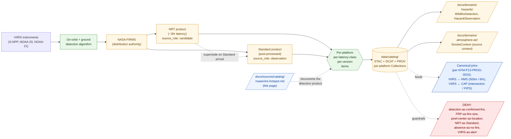

<!-- [KFM_META_BLOCK_V2]
doc_id: kfm://doc/docs-sources-catalog-noaa-viirs-hotspot
title: VIIRS Fire Hotspot
type: product-page
version: v0.2
status: draft
owners: <PLACEHOLDER — Docs steward + Source steward for noaa + Hazards steward + Atmosphere/Air/Climate steward>
created: 2026-05-21
updated: 2026-05-22
policy_label: public
related:
  - docs/sources/catalog/noaa/README.md
  - docs/sources/catalog/noaa/IDENTITY.md
  - docs/sources/catalog/noaa/RIGHTS-AND-SENSITIVITY-MAP.md
  - docs/sources/catalog/noaa/hms-fire-smoke.md
  - docs/sources/catalog/noaa/goes-abi-aod.md
  - docs/sources/catalog/noaa/hrrr-smoke.md
  - docs/sources/catalog/noaa/storm-events.md
  - docs/sources/catalog/noaa/nws-api.md
  - docs/sources/catalog/noaa/noaa-uscrn.md
  - docs/sources/catalog/noaa/station-climate-products.md
  - docs/sources/catalog/README.md
  - docs/domains/hazards/README.md
  - docs/domains/atmosphere/README.md
  - docs/doctrine/directory-rules.md
  - docs/standards/PROV.md
  - docs/adr/ADR-0001-schema-home.md
tags: [kfm, docs, sources, catalog, noaa, viirs, firms, hotspot, active-fire, frp, hazards, atmosphere-air, observation, satellite, multi-platform]
notes:
  - "PROPOSED product-page scaffold; sibling-link presence and repo path NEEDS VERIFICATION."
  - "PROPOSED path under docs/sources/catalog/noaa/ — but distribution-authority is mixed: VIIRS instruments fly on NOAA satellites (S-NPP, NOAA-20, NOAA-21); FIRMS active-fire products are distributed by NASA. Catalog placement question carried as OPEN-VIIRS-01."
  - "Default source_role is observation — VIIRS detects thermal anomalies. The detection IS the observation; the interpretation (active wildfire vs industrial source vs false positive) is downstream."
  - "Dominant anti-collapse: detection is not confirmation. A VIIRS fire pixel is a thermal-anomaly detection that meets algorithm thresholds, NOT a confirmation that a wildfire is burning at that location."
  - "Canonical cross-product join doctrine: per KFM-P13-PROG-0015 (CONFIRMED), VIIRS/FIRMS points join HMS plume buffers within 500m and 6hr."
  - "Multi-platform (S-NPP, NOAA-20, NOAA-21) and multi-latency (NRT ~3hr vs Standard finalized) admission requires per-platform / per-latency-class Items."
[/KFM_META_BLOCK_V2] -->

# VIIRS Fire Hotspot

> VIIRS active-fire and thermal-hotspot detections (distributed via NASA FIRMS) — single-pixel thermal-anomaly detections from NOAA-owned satellites (S-NPP, NOAA-20, NOAA-21). **A detection is not a confirmation.** A hotspot pixel is a thermal-anomaly above an algorithm threshold; whether it is a wildfire, a controlled burn, an industrial heat source, or a false positive requires separate evidence.

[](#status)
[](#status)
[-green)](#source-role-posture)
[](#repo-fit)
[](#source-authority)
[](#anti-collapse-stack-a-detection-is-not-a-confirmation)
[](#nrt-vs-standard-products)
[](#rights-and-sensitivity)
[](../../../doctrine/directory-rules.md)
<!-- TODO: replace placeholder Shields.io targets once CI/badge generation is wired (see KFM-P3-FEAT-0005). -->

**Status:** PROPOSED — scaffold only · **Family:** [`noaa`](./README.md) · **Default `source_role`:** `observation` (thermal-anomaly detection; **not** wildfire confirmation) · **Domains served:** `hazards` (primary) + `atmosphere-air` (co-primary, smoke-source context) · **Owners:** *PLACEHOLDER* · **Last reviewed:** 2026-05-22

---

## Quick jump

- [Overview](#overview)
- [Source-role posture](#source-role-posture)
- [Anti-collapse stack: a detection is not a confirmation](#anti-collapse-stack-a-detection-is-not-a-confirmation)
- [NRT vs Standard products](#nrt-vs-standard-products)
- [Multi-platform and overpass timing](#multi-platform-and-overpass-timing)
- [Fire Radiative Power (FRP) and detection metadata](#fire-radiative-power-frp-and-detection-metadata)
- [Pixel footprint and geolocation](#pixel-footprint-and-geolocation)
- [Cross-product joins (VIIRS ↔ HMS, VIIRS ↔ CAP)](#cross-product-joins-viirs--hms-viirs--cap)
- [Repo fit](#repo-fit)
- [Source authority](#source-authority)
- [Catalog profiles used](#catalog-profiles-used)
- [Collection identity](#collection-identity)
- [Provenance fields](#provenance-fields)
- [Receipts and transforms](#receipts-and-transforms)
- [Temporal handling](#temporal-handling)
- [Geometry and projection](#geometry-and-projection)
- [Quality, uncertainty, and detection caveats](#quality-uncertainty-and-detection-caveats)
- [Rights and sensitivity](#rights-and-sensitivity)
- [Downstream consumers](#downstream-consumers)
- [Validation and catalog closure](#validation-and-catalog-closure)
- [Related contracts and schemas](#related-contracts-and-schemas)
- [Related connectors and pipelines](#related-connectors-and-pipelines)
- [Examples](#examples)
- [Open questions](#open-questions)
- [Related docs](#related-docs)

---

## Overview

> [!NOTE]
> **PROPOSED scaffold.** This page describes a candidate product slice currently filed under the `noaa` source family. Distribution authority is **mixed** — VIIRS instruments fly on NOAA-owned satellites (S-NPP, NOAA-20, NOAA-21), but the active-fire products are distributed by **NASA FIRMS**. Whether VIIRS belongs under `docs/sources/catalog/noaa/` or `docs/sources/catalog/nasa/` (or under a dedicated `firms/` family entry) is **NEEDS VERIFICATION** — see [OPEN-VIIRS-01](#open-questions). The current draft preserves the v0.1 NOAA placement pending that decision.

> [!NOTE]
> Specific endpoint URLs, current cadence values, NRT-vs-Standard latency, rate-limit / API-key requirements, dataset-version identifiers, and rights terms are **NEEDS VERIFICATION** and must be settled against `data/registry/sources/` and current NASA FIRMS documentation before any catalog promotion.

**Product slice.** *VIIRS Fire Hotspot* is the collection of active-fire and thermal-hotspot point detections produced by the **VIIRS** (Visible Infrared Imaging Radiometer Suite) instrument on multiple polar-orbiting satellites (Suomi NPP, NOAA-20/JPSS-1, NOAA-21/JPSS-2). The detections are distributed primarily through **NASA FIRMS** (Fire Information for Resource Management System) in both Near-Real-Time (NRT, ~3-hour latency) and Standard (post-processed, finalized) forms.

Each VIIRS hotspot detection is a **single-pixel point** with attached metadata: pixel center latitude/longitude, brightness temperature, **Fire Radiative Power (FRP)**, day/night flag, confidence field, satellite platform, scan time. The pixel itself represents roughly 375 m × 375 m on the ground (for I-band-derived products) or 750 m × 750 m (for M-band-derived products).

PROPOSED — six doctrinal anchors apply (CONFIRMED doctrine; PROPOSED implementation):

- **VIIRS hotspots are thermal-anomaly detections, not wildfire confirmations.** The on-orbit algorithm flags pixels exceeding thermal thresholds against background brightness temperatures. Interpretation as "wildfire" requires additional evidence (e.g., HMS analyst review, ground reports, fire-incident management data). This is the **dominant anti-collapse** for the product.
- **VIIRS feeds the canonical KFM smoke-pipeline join.** Per **KFM-P13-PROG-0015** (CONFIRMED, quoted verbatim): *"Smoke pipelines should join FIRMS points to HMS plume buffers within 500 meters and six hours, tie CAP alerts by intersection or FIPS, and flag material change by IoU, area delta, or centroid shift."* The 500m / 6hr join window is KFM-canonical.
- **FRP is a contextual signal, not a fire-size measurement.** Per **KFM-P28-IDEA-0003** (PROPOSED): *"FIRMS proximity and Fire Radiative Power checks should act as contextual smoke/fire signals tied to query windows and dataset-version tags."* FRP measures radiated thermal power (in megawatts), not fire area or volume.
- **NRT and Standard are distinct admission lanes.** Lifecycle parallels Storm Events' preliminary-vs-finalized: NRT detections carry `source_role: candidate` until the Standard product supersedes them. The NRT product has higher false-positive rates by design (lower thresholds, less rigorous filtering).
- **Multi-platform admission requires per-platform Items.** VIIRS on S-NPP, NOAA-20, and NOAA-21 produces distinct datasets at distinct overpass times. They are not interchangeable.
- **VIIRS hotspots are not life-safety alerts.** Inherits the NOAA family life-safety red line (CONFIRMED DOM-HAZ §B doctrine: *"KFM Hazards is not an emergency alert system and must not provide life-safety instructions"*). NASA FIRMS is **operational** at NASA; **KFM** publishes VIIRS as historical / analytical context only.

This page is a **product-page**: it describes the slice's *catalog identity*, *profile usage*, *provenance fields*, *receipt requirements*, *NRT-vs-Standard lifecycle*, *multi-platform discipline*, *anti-collapse rules*, *cross-product joins*, and *validation gates*. It is **not** a duplicate of the `SourceDescriptor`, the policy bundle, or the rights map — those live in their respective responsibility roots and are linked from here.

[↑ back to top](#viirs-fire-hotspot)

---

## Source-role posture

> [!CAUTION]
> **Default `source_role` for VIIRS hotspots is `observation`** (per Atlas Ch. 24.1.3, source-role vocabulary). The observed object is **the thermal-anomaly detection event itself** — the algorithm-output point with its metadata. The role is *not* a claim that any specific interpretation (active wildfire, controlled burn, industrial source) is the observed fact.

| `source_role` candidate | When it applies to a VIIRS hotspot item | Promotion gate |
|---|---|---|
| `observation` | **Default for Standard product.** Each finalized hotspot detection. | `SourceDescriptor` + `RunReceipt`; platform, scan time, FRP, confidence, day/night flag, and dataset version preserved per KFM-P28-IDEA-0003. |
| `candidate` | **Default for NRT product** (~3-hour latency). | `role_candidate_disposition: pending`; eligible for promotion to `observation` when the Standard product supersedes it. |
| `aggregate` | KFM-derived spatial / temporal aggregates (hotspot density by region/time, multi-platform clustered events, fire-event reconstructions). | `AggregationReceipt` pinning geometry-scope and time-scope. |
| `modeled` | **Not applicable.** VIIRS hotspots are direct algorithm outputs from satellite thermal-band radiances — not model outputs. *(The on-orbit detection algorithm is the algorithm; the algorithm is part of the SourceDescriptor's `role_authority`, not a separate ModelRunReceipt.)* | — |
| `authority` | **Not applicable.** NASA FIRMS distributes VIIRS hotspots as scientific reference, not as a regulatory or alerting determination. KFM admits them under `observation`, not `authority`. | — |
| `regulatory-context` | **Not applicable.** That's NWS API ([`nws-api.md`](./nws-api.md)). | — |
| `synthetic` | **Not applicable.** Real thermal detections. | — |

**Anti-collapse rule** (CONFIRMED doctrine; PROPOSED realization): the catalog must preserve `kfm:source_role: observation` (or `candidate` for NRT) across every derivation hop. A VIIRS hotspot cannot be re-emitted as `authority` for wildfire occurrence at the pixel location; the *detection* is the observation, not the wildfire interpretation.

[↑ back to top](#viirs-fire-hotspot)

---

## Anti-collapse stack: a detection is not a confirmation

> [!WARNING]
> The dominant failure mode for VIIRS hotspots is treating a single-pixel thermal detection as if it were a confirmed wildfire at that exact location. This is wrong on three independent axes: **interpretation** (thermal anomalies have many sources), **geometry** (pixel center ≠ fire center), and **coverage** (clouds block thermal detection).

### Eight anti-collapse rules

| # | The collapse | Why it fails | Required guardrail |
|---|---|---|---|
| **AC-1** | VIIRS hotspot → confirmed wildfire | Thermal anomalies can come from controlled burns, agricultural burns, industrial sources (refineries, gas flares, steel mills), hot bare ground, sun glint over water, or genuine false positives. The detection records the thermal anomaly; interpretation is downstream. | `source_role: observation` of a *detection*, not of a *fire*. Wildfire confirmation requires additional evidence (HMS analyst review, ground reports, fire-incident management). |
| **AC-2** | VIIRS hotspot → smoke observation | Smoke detection is HMS's role ([`hms-fire-smoke.md`](./hms-fire-smoke.md)); VIIRS detects thermal radiation from combustion, not optical smoke signal. The two products co-occur but are not interchangeable. | VIIRS Items stay in their own catalog Collection; cross-product framing through documented joins (per KFM-P13-PROG-0015). |
| **AC-3** | FRP → fire size | FRP (Fire Radiative Power) is radiated thermal power in megawatts. A 100 MW FRP detection is more intense than a 10 MW one, but FRP does not directly translate to fire area, fire volume, or burned acreage. *(FRP can be used in derived models of fire emissions and area; those derivations are separate artifacts with their own receipts.)* | FRP preserved as a first-class field with units; never displayed as area or acreage; KFM-P28-IDEA-0003 contextual-signal framing carried into UI. |
| **AC-4** | Pixel center → exact fire location | A VIIRS I-band pixel is ~375 m on a side (~0.14 km²); the M-band pixel is ~750 m on a side (~0.56 km²). The fire could be anywhere within the pixel, and may extend across multiple pixels. The center coordinate is **not** the fire's location. | Pixel footprint as a first-class field (or derived polygon Asset); UI display distinguishes "pixel center" from "fire location"; sub-pixel localization claims fail closed. |
| **AC-5** | NRT detection → Standard-quality fact | NRT (Near-Real-Time, ~3hr latency) products have intentionally relaxed thresholds for early detection and accept higher false-positive rates. Standard (post-processed) products carry better quality control. | NRT items carry `source_role: candidate`; never promoted to `observation` until the Standard product confirms (see [§ NRT vs Standard products](#nrt-vs-standard-products)). |
| **AC-6** | Detection absence → no fire | Clouds block thermal IR. Polar-orbiting satellites have revisit gaps (typically 1-2 overpasses per day from each platform, more from the constellation). A pixel without a VIIRS detection during a given window may have had a fire that was: cloud-obscured, below the detection threshold, missed during a coverage gap, or genuinely absent. | "No detection in window" framing on absence rendering; revisit-gap caveat available in metadata; cloud-cover Asset where applicable. |
| **AC-7** | VIIRS hotspot → life-safety alert | Inherits NOAA family life-safety red line. NASA FIRMS is operational at NASA; KFM is not an alerting authority. | DENY rebroadcast as KFM-issued alert; `WarningContext`-style framing for any active-fire display; official-source redirect to FIRMS / NWS for life-safety. |
| **AC-8** | Single-platform → comprehensive coverage | A single VIIRS platform (e.g., S-NPP only) sees the Earth at fixed local solar times. Multi-platform admission (S-NPP + NOAA-20 + NOAA-21) gives better temporal coverage but still has gaps. Citing single-platform data as "all VIIRS detections" misses the other platforms' observations. | Multi-platform admission encouraged; per-platform Items so platform identity is preserved; cross-platform aggregations require `AggregationReceipt`. |

### Denied operations for this product (PROPOSED gates)

- **Hotspot-as-wildfire collapse** *(AC-1)* — VIIRS Items cited as confirmed wildfires without supporting evidence **fail closed**.
- **Hotspot-as-smoke collapse** *(AC-2)* — VIIRS Items relabeled as smoke observations **fail closed**.
- **FRP-as-fire-size collapse** *(AC-3)* — FRP values displayed or summarized as fire area, acreage, or volume **fail closed**.
- **Pixel-center-as-location collapse** *(AC-4)* — sub-pixel claims on VIIRS pixel-center coordinates **fail closed**.
- **NRT-as-Standard collapse** *(AC-5)* — NRT Items rendered as if they were Standard-quality without the latency-class disclosure **fail closed**.
- **Absence-as-no-fire collapse** *(AC-6)* — empty cells in cloud-affected or revisit-gap periods rendered as "no fires occurred" **fail closed**.
- **VIIRS-as-alert collapse** *(AC-7)* — packaging as actionable advisory **fails closed**.
- **Single-platform-as-comprehensive collapse** *(AC-8)* — single-platform queries rendered as full VIIRS-constellation coverage **fail closed**.

[↑ back to top](#viirs-fire-hotspot)

---

## NRT vs Standard products

VIIRS FIRMS distributes detections through **two parallel pipelines** with different quality / latency tradeoffs. KFM admits them as distinct lifecycle states, parallel to Storm Events' preliminary-vs-finalized pattern.

| Product class | Latency | Algorithm rigor | Default `source_role` | Promotion path |
|---|---|---|---|---|
| **NRT (Near-Real-Time)** | ~3 hours | Lower thresholds; faster pipeline; higher false-positive rate by design | `candidate` (`role_candidate_disposition: pending`) | Eligible for promotion when the Standard product supersedes |
| **Standard (post-processed)** | Days to weeks (per NASA FIRMS practice; NEEDS VERIFICATION) | Full QC; final-quality detections | `observation` | Eligible for promotion to PUBLISHED |

### Lifecycle states

| State | Meaning | KFM posture |
|---|---|---|
| `nrt_pending` | NRT detection ingested; Standard not yet available. | `source_role: candidate`; PUBLISHED gates restricted (e.g., no AI-summary support, distinct trust badge). |
| `nrt_superseded_standard` | NRT detection has been superseded by the Standard product (which may or may not preserve the detection). | NRT Item retained for historical record; Standard Item is the canonical reference. |
| `nrt_orphaned` | NRT detection has no corresponding Standard detection (false-positive removed in QC). | NRT Item retained with `orphaned` flag; this is signal about NRT false-positive rates, not a hidden record. |
| `standard_finalized` | Standard detection finalized by NASA. | `source_role: observation`; eligible for full PUBLISHED treatment. |
| `corrected_v<n>` | NASA-issued correction to a Standard detection (rare). | New Item produced; supersession via `kfm:viirs.supersedes_ref`. |

> [!IMPORTANT]
> **The NRT and Standard products are not interchangeable.** A KFM display that mixes NRT and Standard detections without distinguishing them collapses the trust class. Cross-class aggregation (e.g., "all VIIRS detections last 24 hours" combining NRT and Standard) requires explicit disclosure of which detections fall in which class.

[↑ back to top](#viirs-fire-hotspot)

---

## Multi-platform and overpass timing

VIIRS flies on multiple polar-orbiting satellites; each platform sees a given location at distinct local solar times. KFM admits each platform as its own dataset variant.

| Platform | Common name | Orbit characteristics (NEEDS VERIFICATION) |
|---|---|---|
| **Suomi NPP (S-NPP)** | First VIIRS platform | Sun-synchronous polar orbit; mid-afternoon and mid-night overpasses |
| **NOAA-20 / JPSS-1** | Second VIIRS platform | Offset from S-NPP; complementary overpass coverage |
| **NOAA-21 / JPSS-2** | Third VIIRS platform | Continuing the constellation |

### Per-platform discipline

| Concern | KFM posture |
|---|---|
| **Per-platform Items** | Each platform's detection set is admitted as its own Collection (e.g., `kfm-noaa-viirs-snpp-active-fire`, `kfm-noaa-viirs-noaa20-active-fire`). Cross-platform aggregations are downstream derived artifacts. |
| **Overpass-time framing** | Display surfaces surface the platform and local-solar-time framing so users know when the snapshot was taken. A "no fire detected at 2pm" reading does not imply "no fire at 2am" (when a different platform may have passed over). |
| **Constellation aggregation** | Multi-platform aggregations require `AggregationReceipt` documenting which platforms contributed. |
| **Platform-retirement transitions** | When NASA retires a platform, KFM-side `CorrectionNotice` to downstream consumers; historical-archive admission preserved per Collection. |

> [!TIP]
> Diurnal fire behavior is real — fires typically grow during afternoon heat and recede overnight. A 1:30 PM detection and a 1:30 AM detection at the same location are observations of *the same fire at different intensities*, not interchangeable readings.

[↑ back to top](#viirs-fire-hotspot)

---

## Fire Radiative Power (FRP) and detection metadata

VIIRS hotspot records carry several structured fields that are doctrinally important. The most-misused is **FRP**.

| Field | What it is | What it is **not** | KFM posture |
|---|---|---|---|
| **FRP (Fire Radiative Power)** | Radiated thermal power in megawatts at the pixel; estimated from the difference between fire-pixel and background brightness temperature. | Not fire area; not burned acreage; not fire volume; not heat output of the fire (radiated power is a fraction of total heat output). | First-class field with units (MW); AC-3 anti-collapse; KFM-P28-IDEA-0003 contextual-signal framing. |
| **Brightness temperature** | Per-band thermal-IR temperature reading at the pixel. | Not air temperature; not the fire's actual temperature (radiometric signal). | First-class field; rendering surfaces the band. |
| **Confidence** | Algorithm-assigned confidence rating (low / nominal / high or numeric, depending on product). | Not a probabilistic statement about wildfire presence; not interchangeable across VIIRS product versions. | First-class enum or numeric field; preserved verbatim. |
| **Day/Night flag** | Whether the detection occurred during daytime or nighttime overpass. | Not an indicator of fire visibility or severity. | First-class field; affects algorithm behavior; carried into UI for filtering. |
| **Satellite platform** | S-NPP, NOAA-20, NOAA-21, etc. | Not interchangeable across platforms (different overpass times, sensor calibrations). | First-class field; part of identity. |
| **Scan time** | Acquisition time of the satellite scan. | Not the detection-publication time (NRT pipeline adds ~3hr latency). | First-class field; time-role discipline applies (see [§ Temporal handling](#temporal-handling)). |
| **Dataset version** | Algorithm / product version per KFM-P28-IDEA-0003 *"dataset-version tags"*. | Not interchangeable across versions. | Part of identity per the version-in-identity pattern. |
| **Type / category** | Some VIIRS products distinguish "presumed vegetation fire" from "other static land source"; on-orbit algorithm decision. | Not a confirmed classification of the fire type. | First-class enum; preserved verbatim. |

> [!CAUTION]
> The most common doctrinal failure in VIIRS-derived rendering is **summing or averaging FRP across pixels as if it were an additive intensity measure** without preserving the underlying physical meaning. A 100 MW summed FRP over 5 pixels is not "a 100 MW fire" — it is "5 thermal anomalies whose individually-estimated radiated powers sum to 100 MW, with uncertainties on each, and likely covering related but distinct combustion areas." Aggregations require explicit `AggregationReceipt` documenting the method.

[↑ back to top](#viirs-fire-hotspot)

---

## Pixel footprint and geolocation

VIIRS hotspot detections are commonly distributed as **points at pixel-center coordinates**, but the underlying observation is a **pixel-area thermal-anomaly detection**. KFM preserves both representations.

| Concern | KFM posture |
|---|---|
| **Point coordinate** | Pixel-center latitude/longitude preserved as NASA-FIRMS-issued (typically WGS84). |
| **Pixel footprint** | Derived polygon Asset (~375 m × 375 m for I-band; ~750 m × 750 m for M-band; varies with scan angle) — KFM-side derivation with `TransformReceipt` documenting the footprint estimation. |
| **Scan-angle effects** | At off-nadir scan angles, pixel footprints elongate. KFM preserves the scan-angle or accepts NASA's footprint metadata when available. |
| **Cluster polygons** | KFM-derived spatial clusters of co-temporal hotspots are downstream `aggregate` artifacts with their own `AggregationReceipt`. Never silently displayed in place of the underlying point detections. |
| **Pixel-to-point ambiguity** | UI must distinguish "pixel center" from "fire location" — clicking a hotspot point in the map should surface "this is the center of a ~375m pixel with a thermal anomaly; the actual fire location is unknown within the pixel." |

> [!WARNING]
> A pixel-center point is **not** the fire's location. AC-4 anti-collapse: sub-pixel claims on VIIRS pixel-center coordinates fail closed. This matters most for proximity claims ("the fire was at exactly X,Y") and for damage-assessment overlays at fine resolution.

[↑ back to top](#viirs-fire-hotspot)

---

## Cross-product joins (VIIRS ↔ HMS, VIIRS ↔ CAP)

VIIRS hotspots do not stand alone. They are canonical inputs to KFM's smoke-and-fire context pipelines.

Per CONFIRMED **KFM-P13-PROG-0015** (quoted verbatim): *"Smoke pipelines should join FIRMS points to HMS plume buffers within 500 meters and six hours, tie CAP alerts by intersection or FIPS, and flag material change by IoU, area delta, or centroid shift."*

| Join | Key | Purpose | Required guardrail |
|---|---|---|---|
| **VIIRS ↔ HMS smoke polygon** *(per KFM-P13-PROG-0015 — quoted)* | 500m spatial buffer × 6hr temporal window | Cross-validate VIIRS thermal detections to HMS analyst-reviewed smoke polygons; the join provides smoke-source context for HMS smoke. | Each side keeps its `source_role`. VIIRS stays `observation` of detection; HMS smoke stays `modeled` (analyst polygon). The join is a derived `aggregate` artifact, not a collapse of either side. |
| **VIIRS ↔ NWS CAP alert** *(per KFM-P13-PROG-0015 — quoted)* | Geometric intersection or matching FIPS code | Surface VIIRS detections that overlap an active CAP fire-weather or red-flag advisory. | VIIRS stays `observation`; CAP stays `regulatory-context`. The join provides cross-product situational context, never a KFM-issued alert. |
| **VIIRS ↔ HMS fire-detection point** | Co-located detections within a defined window | Cross-platform / cross-product fire-detection consensus. | Both `observation`-role; the join is documentary, not promotion-grade. |
| **VIIRS ↔ Storm Events** | Co-temporal severe-weather episodes that produced lightning or fire-weather conditions | Historical context for fire-related Storm Events. | Storm Events stays `observation` (historical event record); VIIRS stays `observation` (detection). The join supports retrospective analysis. |
| **VIIRS material-change detection** | IoU, area delta, centroid shift across successive detections | Flag material change in detection density or location over time. | Change-detection receipts emitted per `TransformReceipt`; flagged changes route to the catalog, not to a public alert surface. |

> [!TIP]
> The 500m / 6hr VIIRS↔HMS join window is **not invented for this page** — it is the KFM-canonical rule per KFM-P13-PROG-0015. Implementations that diverge from these values must record the divergence in an ADR.

[↑ back to top](#viirs-fire-hotspot)

---

## Repo fit

> [!IMPORTANT]
> **PROPOSED path with open distribution-authority question.** This file is currently authored at `docs/sources/catalog/noaa/viirs-hotspot.md`. The per-family-folder layout and unprefixed filename follow the NOAA siblings. But VIIRS Fire Hotspot is distributed by **NASA FIRMS**, raising a placement question: should this product-page live under `docs/sources/catalog/noaa/` (because the satellites are NOAA-owned) or under `docs/sources/catalog/nasa/` (because the distribution authority is NASA) or under a dedicated `docs/sources/catalog/firms/` family entry? See [OPEN-VIIRS-01](#open-questions).

| Direction | Neighbor | Relationship |
|---|---|---|
| **Upstream (parent)** | [`README.md`](./README.md) | NOAA family-level orientation (pending distribution-authority resolution). |
| **Sibling** | [`IDENTITY.md`](./IDENTITY.md) | Collection-id and namespace rules. |
| **Sibling** | [`RIGHTS-AND-SENSITIVITY-MAP.md`](./RIGHTS-AND-SENSITIVITY-MAP.md) | Family rights / sensitivity decisions; this page does **not** restate policy. |
| **Sibling — canonical join partner** | [`hms-fire-smoke.md`](./hms-fire-smoke.md) | The 500m/6hr join from KFM-P13-PROG-0015 — VIIRS thermal detection points join HMS smoke polygons and HMS fire detections. |
| **Sibling — forecast counterpart** | [`hrrr-smoke.md`](./hrrr-smoke.md) | VIIRS detections are observations; HRRR-Smoke predicts smoke transport. Verification products possible. |
| **Sibling — satellite-retrieval comparator** | [`goes-abi-aod.md`](./goes-abi-aod.md) | GOES ABI AOD is `modeled` retrieval; VIIRS active-fire is `observation` (algorithm output). Different epistemic standing. |
| **Sibling — historical-event counterpart** | [`storm-events.md`](./storm-events.md) | Storm Events is finalized historical record; VIIRS NRT is near-real-time detection. Both end up in Hazards but at different lifecycle stages. |
| **Sibling — operational counterpart** | [`nws-api.md`](./nws-api.md) | NWS API operational warnings join with VIIRS detections per KFM-P13-PROG-0015 CAP rule. |
| **Sibling** | [`noaa-uscrn.md`](./noaa-uscrn.md), [`station-climate-products.md`](./station-climate-products.md) | Other NOAA-family slices. |
| **Upstream (root)** | [`../README.md`](../README.md) | Catalog landing page. |
| **Cross-root (data)** | [`data/registry/sources/`](../../../../data/registry/sources/) | Authoritative `SourceDescriptor` home. |
| **Cross-root (domain, primary)** | [`docs/domains/hazards/`](../../../domains/hazards/) | Owns `WildfireDetection`, `HazardObservation`. |
| **Cross-root (domain, co-primary)** | [`docs/domains/atmosphere/`](../../../domains/atmosphere/) | Owns `SmokeContext`; VIIRS contributes smoke-source context. |
| **Cross-root (domain, adjacency)** | [`docs/domains/flora/`](../../../domains/flora/), [`docs/domains/habitat/`](../../../domains/habitat/), [`docs/domains/agriculture/`](../../../domains/agriculture/) | Post-fire vegetation context; controlled-burn context. |
| **Doctrine** | [`docs/doctrine/directory-rules.md`](../../../doctrine/directory-rules.md) | Placement authority. |



> [!NOTE]
> Diagram reflects the **multi-platform, multi-latency-class, multi-version admission pattern**, the NRT-to-Standard supersession lifecycle, the canonical KFM-P13-PROG-0015 joins (VIIRS↔HMS and VIIRS↔CAP), and the six canonical DENY paths. Specific subpaths are PROPOSED until mounted-repo inspection confirms presence.

[↑ back to top](#viirs-fire-hotspot)

---

## Source authority

The authoritative `SourceDescriptor` for VIIRS Fire Hotspot lives in [`data/registry/sources/`](../../../../data/registry/sources/) (PROPOSED path per Directory Rules §6).

> [!WARNING]
> **Do not duplicate descriptor fields here.** Per the multi-platform discipline, **separate descriptors are recommended per platform and per latency class** (e.g., `noaa-viirs-snpp-nrt-active-fire`, `noaa-viirs-snpp-standard-active-fire`, `noaa-viirs-noaa20-nrt-active-fire`, etc.). If a field appears to disagree, the descriptor wins, and a drift entry should open in `docs/registers/DRIFT_REGISTER.md`.

PROPOSED — each descriptor should at minimum carry:

- `source_id` — stable identifier per platform / latency class.
- `source_role` — `observation` for Standard; `candidate` for NRT.
- `role_authority` — **distribution authority is NASA FIRMS; platform authority is NOAA / NASA jointly**. Both surfaced in metadata. The `role_authority` field captures the **distribution authority** (NASA FIRMS); the platform/sensor authority lives in a separate metadata field (`platform_authority`).
- `rights` — VIIRS active-fire products are generally distributed by NASA FIRMS under open terms; per-product attribution and any FIRMS API key requirements **NEEDS VERIFICATION**.
- `sensitivity` — tier per [`RIGHTS-AND-SENSITIVITY-MAP.md`](./RIGHTS-AND-SENSITIVITY-MAP.md).
- `cadence` — sub-daily per platform (a few overpasses per location per day from each platform); NEEDS VERIFICATION.
- `platform` — `s-npp` | `noaa-20` | `noaa-21` | etc.
- `latency_class` — `nrt` | `standard`.
- `dataset_version` — per KFM-P28-IDEA-0003 *"dataset-version tags"*.
- `ingest_hash` — content-addressable digest of the admitted file.

NEEDS VERIFICATION: actual `SourceDescriptor` schema field names and required-vs-optional status against `schemas/contracts/v1/source/` (per ADR-0001) and current NASA FIRMS API documentation.

[↑ back to top](#viirs-fire-hotspot)

---

## Catalog profiles used

PROPOSED — VIIRS Fire Hotspot maps across the standard KFM-STAC / DCAT / PROV-O profile triad. Which lanes each platform/latency-class combination emits is **NEEDS VERIFICATION**.

| Profile | Lane | Used by this product? | Notes |
|---|---|---|---|
| STAC 1.1 | `data/catalog/stac/` | PROPOSED — **Yes** (NEEDS VERIFICATION) | **Per-platform Collections**; per-detection Items keyed by platform, scan_time, pixel coordinates, dataset_version, and latency_class. STAC Projection extension required. |
| DCAT | `data/catalog/dcat/` | PROPOSED — Yes / No (NEEDS VERIFICATION) | Distribution mapping for downloadable VIIRS detection archives. |
| PROV-O | `data/catalog/prov/` | PROPOSED — **Yes (required)** | Each detection's `wasAttributedTo` includes both NASA FIRMS (distribution) and NOAA/NASA (platform / sensor); the on-orbit detection algorithm is a `prov:SoftwareAgent`. |
| Domain projection | `data/catalog/domain/hazards/` (primary) and `data/catalog/domain/atmosphere-air/` (co-primary) | PROPOSED — **Yes (both)** | Projects into `WildfireDetection` and `HazardObservation` (Hazards); `SmokeContext` (Atmosphere/Air — smoke-source context). |

> [!TIP]
> KFM-namespaced STAC extension fields (`kfm:run_receipt_ref`, `kfm:proof_ref`, `kfm:trust_class`, `kfm:source_role`, and the novel `kfm:viirs.*` family documented below) carry trust-membrane context across profiles. The **per-platform** and **per-latency-class** discriminators are the most important — downstream consumers must be able to distinguish S-NPP-NRT from NOAA-20-Standard at a glance.

[↑ back to top](#viirs-fire-hotspot)

---

## Collection identity

- **PROPOSED Collection ID pattern.** Per-platform × per-latency-class Collections:
  - `kfm-noaa-viirs-snpp-nrt-active-fire`
  - `kfm-noaa-viirs-snpp-standard-active-fire`
  - `kfm-noaa-viirs-noaa20-nrt-active-fire`
  - `kfm-noaa-viirs-noaa20-standard-active-fire`
  - `kfm-noaa-viirs-noaa21-nrt-active-fire`
  - `kfm-noaa-viirs-noaa21-standard-active-fire`
  - *(I-band 375m vs M-band 750m as sub-Collections or as a discriminator field — see [OPEN-VIIRS-04](#open-questions))*
- **PROPOSED namespace.** `kfm:` — pending resolution of *OPEN-DSC-03* (namespace canonicalization). NEEDS VERIFICATION.
- **PROPOSED Item ID rule.** Deterministic basis: `product + platform + latency_class + dataset_version + scan_time + pixel_lat + pixel_lon + normalized_digest`. **Platform, latency class, dataset version, and scan time are part of identity** — re-issuance with a new dataset version or supersession from NRT to Standard produces new Items (per KFM-P28-IDEA-0003 *"dataset-version tags"*).
- **Asset roles.** NEEDS VERIFICATION — confirm against `schemas/contracts/v1/source/`. Candidate roles: `data` (the point detection with structured fields), `pixel_footprint` (derived polygon Asset), `metadata` (platform / scan / algorithm metadata), `quality` (confidence and quality flags).

[↑ back to top](#viirs-fire-hotspot)

---

## Provenance fields

STAC `properties.kfm:provenance` block (PROPOSED — Pass-10 C4-01 / KFM-P3-IDEA-0004):

| Field | Resolves to | Required when | Notes |
|---|---|---|---|
| `spec_hash` | sha256 of the canonical record | always | Anchors record identity. |
| `evidence_bundle_ref` | `kfm://evidence/<digest>` | claim-bearing items | Resolves to the EvidenceBundle backing any non-trivial assertion. |
| `run_record_ref` | `kfm://run/<run-id>` | always | Pins the orchestrated KFM run. |
| `audit_ref` | `kfm://audit/<attestation-id>` | promoted items | DSSE / Cosign attestation. |
| `policy_digest` | sha256 of the policy bundle in force | promoted items | Reproducible gate state. |
| `source_role` | enum: `observation` (Standard) \| `candidate` (NRT) \| `aggregate` (KFM-derived) | always | Default differs by latency class. Never `modeled`, `authority`, `regulatory-context`, `synthetic`. |
| `kfm:viirs.platform` | enum: `s-npp` \| `noaa-20` \| `noaa-21` \| etc. | always | First-class discriminator; part of identity. |
| `kfm:viirs.latency_class` | enum: `nrt` \| `standard` | always | First-class discriminator; AC-5 anti-collapse. |
| `kfm:viirs.lifecycle_state` | enum: `nrt_pending` \| `nrt_superseded_standard` \| `nrt_orphaned` \| `standard_finalized` \| `corrected_v<n>` | always | Lifecycle state per [§ NRT vs Standard products](#nrt-vs-standard-products). |
| `kfm:viirs.dataset_version` | string | always | Per KFM-P28-IDEA-0003; part of identity. |
| `kfm:viirs.scan_time` | ISO-8601 datetime | always | Acquisition time of the satellite scan (distinct from publication time). |
| `kfm:viirs.frp_mw` | number (megawatts) | when present in source | Fire Radiative Power; AC-3 anti-collapse applies. |
| `kfm:viirs.brightness_temp_k` | number (Kelvin) | when present in source | Per-band brightness temperature. |
| `kfm:viirs.confidence` | enum or number per product | when present in source | Algorithm confidence; preserved verbatim. |
| `kfm:viirs.day_night_flag` | enum: `day` \| `night` | always | Affects algorithm behavior. |
| `kfm:viirs.pixel_band` | enum: `i-band-375m` \| `m-band-750m` | always | I-band vs M-band identity; affects footprint. |
| `kfm:viirs.pixel_footprint_ref` | `EvidenceRef` to derived polygon Asset | optional | Derived pixel-footprint polygon (KFM-side, with `TransformReceipt`). |
| `kfm:viirs.type` | enum (per product: `presumed_vegetation_fire` \| `other_static_land_source` \| etc.) | when present in source | Algorithm-assigned type; preserved verbatim. |
| `kfm:viirs.supersedes_ref` | `EvidenceRef` to prior NRT Item | required when `lifecycle_state = nrt_superseded_standard` or `corrected_v<n>` | Lineage closure. |

Per-asset integrity: STAC `file:checksum` for every asset.

> [!NOTE]
> NEEDS VERIFICATION — exact field names, especially the `kfm:viirs.*` extension fields, need to be reconciled against the live `kfm-stac-extension.md` if one exists in the repo. The confidence enum values, type enum values, and exact band-vs-resolution naming are illustrative; NEEDS VERIFICATION against authoritative NASA FIRMS / VIIRS documentation.

[↑ back to top](#viirs-fire-hotspot)

---

## Receipts and transforms

CONFIRMED doctrine: *KFM uses receipts to make consequential transformations inspectable.* VIIRS Fire Hotspot consequential transformations include: pixel-footprint polygon derivation, multi-platform/multi-version aggregation, NRT-to-Standard supersession, and any cross-product joins per KFM-P13-PROG-0015.

| Receipt | Triggered by | Required content (PROPOSED shape) |
|---|---|---|
| **`SourceDescriptor`** (anchor) | Admission of each platform × latency class as a sub-source of the NOAA family. | `source_id`, `source_role`, `role_authority: "NASA FIRMS"`, `platform_authority`, `rights`, `sensitivity`, `cadence`, `platform`, `latency_class`, `dataset_version`, `ingest_hash`, `time`, `citation`. |
| **`RunReceipt`** (ingest receipt) | Each FIRMS API pull. | Request URL, conditional-GET headers (where supported), API-key header reference (per FIRMS practice, NEEDS VERIFICATION), content-length, content checksum, retrieval time. |
| **`TransformReceipt`** *(for pixel-footprint derivation)* | KFM-side computation of pixel-footprint polygons. | `input_geom_hash` (point), `output_geom_hash` (polygon), `transform: "viirs_pixel_footprint"`, `parameters` (band, scan_angle when available), `tolerance`, `timestamp`, `actor`. |
| **`TransformReceipt`** | Reprojection, unit conversion. | Standard transform-receipt fields. |
| **`AggregationReceipt`** *(mandatory for any aggregation)* | Hotspot density by region/time; multi-platform aggregations; FRP-based cluster aggregations. | `geometry_scope`, `time_scope`, `aggregation_method`, `input_source_refs`, `suppression_rule`. |
| **`ValidationReport`** | WORK → PROCESSED and PROCESSED → CATALOG transitions. | `validator_id`, `target`, `passes[]`, `failures[]`. |
| **`CorrectionNotice`** | NASA-issued correction to a Standard product (rare); NRT-to-Standard supersession (routine). | New Item produced; supersession via `kfm:viirs.supersedes_ref`. |
| **`ModelRunReceipt`** | **Not required for native VIIRS admission.** The on-orbit detection algorithm is documented in the `SourceDescriptor` `role_authority` / `dataset_version`, not as a separate `ModelRunReceipt`. Required if KFM builds downstream modeled products (e.g., fire-spread models, emissions models) on top of VIIRS detections. | Downstream model carries the receipt; VIIRS itself does not. |

> [!CAUTION]
> An NRT detection superseded by the Standard product **produces a new Item** at the Standard level, with the NRT Item linked via `supersedes_ref` and retained in the catalog. Silent overwrites violate the source-role anti-collapse rule and obscure the NRT false-positive rate (which is itself useful information).

[↑ back to top](#viirs-fire-hotspot)

---

## Temporal handling

PROPOSED — VIIRS items must keep the standard KFM time roles **distinct where material**:

| Time role | Meaning for a VIIRS hotspot item | Status |
|---|---|---|
| `source_time` | NASA FIRMS distribution time (when FIRMS published the detection) | PROPOSED |
| `observed_time` | Satellite scan time — when the platform observed the thermal anomaly | PROPOSED |
| `valid_time` | Effectively instantaneous (the moment of the satellite scan) | PROPOSED |
| `scan_time` | Satellite scan time (same as `observed_time` for VIIRS) — first-class field per [§ FRP and detection metadata](#fire-radiative-power-frp-and-detection-metadata) | PROPOSED |
| `nrt_publish_time` | When the NRT product became available (~3hr after scan; NEEDS VERIFICATION) | PROPOSED |
| `standard_publish_time` | When the Standard product superseded (days-to-weeks after scan; NEEDS VERIFICATION) | PROPOSED |
| `retrieval_time` | When KFM ingested the record | PROPOSED |
| `release_time` | When KFM promoted the Item | PROPOSED |
| `correction_time` | NASA-issued correction time | PROPOSED |
| `supersedes_time` | When supersession occurred (typically `standard_publish_time` for NRT→Standard) | PROPOSED |

> [!WARNING]
> **Do not collapse `scan_time` and `nrt_publish_time`.** A VIIRS detection observed at 14:00 UTC and published at the NRT level at 17:00 UTC has two distinct timestamps. Public surfaces displaying VIIRS detections must surface the scan time prominently — the publication time tells the user when the data arrived, not when the fire was observed.

> [!IMPORTANT]
> **NRT latency is real.** Even the NRT product has ~3-hour latency between satellite scan and availability. KFM is not a real-time fire-detection system; the very fastest VIIRS-derived signal is ~3 hours stale by the time it reaches downstream consumers.

NEEDS VERIFICATION — confirm time-role tests exist or are PROPOSED in `tests/`.

[↑ back to top](#viirs-fire-hotspot)

---

## Geometry and projection

PROPOSED — VIIRS hotspots are **point detections** with a deterministic pixel footprint:

| Concern | Posture | Status |
|---|---|---|
| **Native point geometry** | Pixel-center latitude/longitude per NASA FIRMS (typically WGS84). | NEEDS VERIFICATION. |
| **Derived pixel-footprint polygon** | KFM-side derivation per band (I-band ~375m, M-band ~750m); scan-angle adjustment where data permits. `TransformReceipt` documents the derivation. | PROPOSED. |
| **Native CRS** | Geographic (WGS84) per common NASA FIRMS practice. | NEEDS VERIFICATION. |
| **Resampled CRS** | For Kansas-focused public layers, reprojection via `TransformReceipt`. | PROPOSED. |
| **Scan-angle effects** | Off-nadir pixels are larger and more elongated than nadir pixels. KFM preserves NASA-provided scan-angle or derives footprint estimates appropriately. | PROPOSED. |
| **Cluster polygons** | Spatial clusters of co-temporal hotspots are downstream `aggregate` artifacts with their own `AggregationReceipt`. | PROPOSED. |
| **Generalization** | None at the point level. Aggregations produce `source_role: aggregate`. | PROPOSED. |
| **STAC Projection extension** | Required (`proj:code`, `proj:bbox`, `proj:geometry`) per KFM-P27-FEAT-0003. | PROPOSED. |

NEEDS VERIFICATION — confirm against `data/catalog/` artifacts and any VIIRS fixtures in `tests/` or `fixtures/`.

[↑ back to top](#viirs-fire-hotspot)

---

## Quality, uncertainty, and detection caveats

PROPOSED — VIIRS hotspots carry quality and uncertainty information that doctrinally must be propagated through every derivation.

| Metric | Granularity | Use |
|---|---|---|
| **Algorithm confidence** | per-detection | NASA-issued confidence rating; preserved verbatim; first-class field. |
| **Day/Night flag** | per-detection | Algorithm behavior differs day vs night; tracked. |
| **Latency class** | per-detection | NRT vs Standard; AC-5 anti-collapse. |
| **Cloud-cover gap** | per-platform / per-region / per-time | Cloud-affected scans yield reduced detection coverage; AC-6 anti-collapse. |
| **Revisit-gap window** | per-platform / per-region | Polar-orbit platforms have characteristic revisit cadence; gaps acknowledged in metadata. |
| **Scan-angle quality** | per-detection | Off-nadir pixels have larger footprints and lower geolocation accuracy; surfaced as a quality cue. |
| **False-positive history** | per-region / per-type | Industrial sources (refineries, gas flares, steel mills) produce persistent false-positive thermal anomalies. Known persistent sources can be flagged in a downstream artifact. |
| **Dataset version drift** | per-time | Major dataset-version transitions warrant `CorrectionNotice` to downstream consumers (per KFM-P28-IDEA-0003 *"dataset-version tags"*). |
| **NRT false-positive rate** *(advisory)* | per-region / per-time | NRT products carry intentionally higher false-positive rates; can be quantified retrospectively against Standard supersession. |

> [!TIP]
> Quality metrics drive a **trust-and-freshness badge** (per KFM-P3-FEAT-0005). For VIIRS, the **latency class** (NRT vs Standard) is the most important badge field — it directly governs how much confidence to place in the detection.

[↑ back to top](#viirs-fire-hotspot)

---

## Rights and sensitivity

> [!IMPORTANT]
> **Do not restate policy here.** Sensitivity tier, redaction rules, and reveal posture are decided in [`policy/sensitivity/`](../../../../policy/sensitivity/) and summarized in the sibling [`RIGHTS-AND-SENSITIVITY-MAP.md`](./RIGHTS-AND-SENSITIVITY-MAP.md). This section names the *kinds of risks* the product introduces, not the *decisions* taken against them.

PROPOSED risk surfaces — NEEDS VERIFICATION per product:

| Risk surface | Why it matters | Default posture |
|---|---|---|
| **Detection-as-confirmation misuse** *(AC-1)* | The dominant doctrinal failure mode — treating a thermal-anomaly detection as a confirmed wildfire. | DENY any rendering that asserts fire presence without supporting evidence (HMS, ground reports). |
| **FRP-as-fire-size misuse** *(AC-3)* | FRP is power (MW), not area. | DENY display of FRP as fire-area, acreage, or volume claim. |
| **Pixel-center-as-location misuse** *(AC-4)* | Sub-pixel claims on VIIRS pixel-center coordinates. | DENY sub-pixel proximity claims; UI distinguishes "pixel center" from "fire location". |
| **NRT-as-Standard misuse** *(AC-5)* | NRT products are higher false-positive by design. | DENY mixing NRT and Standard without latency-class disclosure. |
| **Absence-as-no-fire misuse** *(AC-6)* | Cloud-cover and revisit gaps mask detections. | "No detection in window" framing on absence. |
| **VIIRS-as-alert misuse** *(AC-7)* | NOAA family life-safety red line. | DENY rebroadcast as KFM-issued alert; official-source redirect to FIRMS / NWS. |
| **Indigenous / cultural-burn context** | Some detected fires are cultural / prescribed burns on sovereign or culturally significant lands. | CARE-aware review path; do not present cultural burns as anomalous events without context. |
| **Industrial false-positive exposure** | Persistent industrial heat sources (refineries, flares) appear as "fires" — public rendering may expose facility operations or proprietary information unintentionally. | Industrial false-positive registry; downstream filter (with `TransformReceipt`) before public rendering. |
| **License inheritance** | NASA FIRMS distributes VIIRS active-fire products under defined terms; NASA / FIRMS attribution required; per-product API terms NEEDS VERIFICATION. | License-deny lane until rights confirmed (per Master MapLibre ML-062-016). |

> [!CAUTION]
> CONFIRMED doctrine: *Unclear rights, unresolved source role, missing evidence, unresolved sensitivity, or absent release state blocks public promotion.* VIIRS's mixed distribution authority (NOAA satellite, NASA FIRMS distribution) and per-product API terms make rights propagation non-trivial.

[↑ back to top](#viirs-fire-hotspot)

---

## Downstream consumers

VIIRS Fire Hotspot is **upstream context** for several KFM products. The catalog should make this lineage explicit via PROV-O links and via `kfm:source_role` propagation.

| Downstream consumer | What it derives from VIIRS | Its default `source_role` |
|---|---|---|
| Hazards `WildfireDetection` layer | Direct rendering of VIIRS detections with point geometry, FRP styling, confidence framing, and latency-class badge | `observation` (preserved); NRT items carry `candidate` until supersession. |
| Hazards `HazardObservation` layer | Per-event observation records | `observation` (preserved). |
| Atmosphere/Air `SmokeContext` (source-context side) | VIIRS detections used as smoke-source context for HMS smoke polygons and HRRR-Smoke forecasts | `observation` (preserved); the smoke product is its own artifact. |
| KFM-P13-PROG-0015 VIIRS↔HMS join product | 500m / 6hr join between VIIRS points and HMS smoke polygons | Each side keeps its role; the join is `aggregate`. |
| KFM-P13-PROG-0015 VIIRS↔CAP join product | Intersection / FIPS join between VIIRS detections and CAP fire-weather advisories | Each side keeps its role; the join is `aggregate`. |
| Fire-emission inventories | FRP-based emission estimates for atmosphere-air / smoke modeling | Downstream `modeled` artifact with its own `ModelRunReceipt`; VIIRS inputs preserve `observation`. |
| Burned-area products | VIIRS detections combined with multi-temporal vegetation-change products (HLS, Landsat) to identify burned areas | Downstream `modeled` or `aggregate` artifact with its own receipts. |
| Vegetation-change masking (HLS / Landsat) | VIIRS as a fire-context mask input per KFM-P20-PROG-0005 (MAIAC FIRMS cloud-and-smoke screen gate) | Used as a **mask input**; downstream alert carries its own receipts. |
| Storm Events cross-context | Historical Storm Events events overlaid with VIIRS detections for retrospective analysis | Storm Events stays `observation` (historical event record); VIIRS stays `observation` (detection); the cross-product comparison has its own receipts. |
| Focus Mode answers | Bounded evidence context for fire questions | `AIReceipt` mandatory; AI must cite VIIRS detections with their platform, latency class, scan time, confidence, and AC caveats. AI **never** treats a single VIIRS detection as confirmed wildfire. |

[↑ back to top](#viirs-fire-hotspot)

---

## Validation and catalog closure

PROPOSED gates that apply to this product before public release:

- **Catalog closure required before public release** — DCAT, STAC, and PROV records must trace bundle identity, inputs, artifacts, checks, producer, and promotion metadata (per Pass-10 / KFM-P26-IDEA-0007). PROPOSED.
- **STAC Projection lint** — required per KFM-P27-FEAT-0003. PROPOSED.
- **STAC checksum closure** — `file:checksum` for every Asset must match the ReleaseManifest digest (per KFM-P22-PROG-0037). PROPOSED.
- **Platform / latency-class / version-in-identity test** *(per KFM-P28-IDEA-0003)* — every VIIRS Item must carry `kfm:viirs.platform`, `kfm:viirs.latency_class`, `kfm:viirs.dataset_version`; missing any fails closed. **PROPOSED, MANDATORY**.
- **Lifecycle-state test** — every VIIRS Item must carry `kfm:viirs.lifecycle_state`. **PROPOSED, MANDATORY**.
- **NRT-as-Standard denial test** *(AC-5)* — joins across NRT and Standard without latency-class disclosure fail closed.
- **Detection-as-confirmed-fire denial test** *(AC-1)* — VIIRS Items rendered as confirmed wildfires without supporting evidence fail closed. **PROPOSED, MANDATORY**.
- **FRP-as-fire-size denial test** *(AC-3)* — FRP displayed or summarized as fire area / acreage / volume fails closed.
- **Pixel-center-as-location denial test** *(AC-4)* — sub-pixel proximity claims fail closed.
- **Absence-as-no-fire denial test** *(AC-6)* — empty cells rendered as "no fires occurred" fail closed; revisit-gap and cloud-cover framing required.
- **VIIRS-as-alert denial test** *(AC-7)* — items packaged as actionable advisories fail closed; carries the NOAA family life-safety red line.
- **Single-platform-as-comprehensive denial test** *(AC-8)* — single-platform queries rendered as full constellation coverage fail closed.
- **Pixel-footprint `TransformReceipt` test** — derived pixel-footprint polygon Assets must carry a resolvable `TransformReceipt` documenting band, scan-angle handling.
- **NRT-supersession lineage test** — `nrt_superseded_standard` Items must link to the Standard Item via `supersedes_ref`; broken lineage fails closed.
- **Dataset-version transition test** *(per KFM-P28-IDEA-0003)* — major NASA dataset-version transitions trigger a `CorrectionNotice` to downstream consumers.
- **VIIRS ↔ HMS join window test** *(per KFM-P13-PROG-0015)* — joins outside the 500m / 6hr window without an ADR override fail closed.
- **Rights propagation test** — `rights` field and FIRMS API terms (if applicable) must be resolved before contentful delta emission (per ML-062-016). PROPOSED.

NEEDS VERIFICATION — confirm which of these are realized in `tests/`, `pipelines/validate/`, or CI workflows.

[↑ back to top](#viirs-fire-hotspot)

---

## Related contracts and schemas

| Artifact | PROPOSED path | Status |
|---|---|---|
| Source descriptor schema | `schemas/contracts/v1/source/` | NEEDS VERIFICATION — per ADR-0001. |
| `WildfireDetection` object schema | `schemas/contracts/v1/hazards/wildfire-detection.schema.json` | PROPOSED — DOM-HAZ §E. |
| `HazardObservation` object schema | `schemas/contracts/v1/hazards/hazard-observation.schema.json` | PROPOSED — DOM-HAZ §E. |
| `SmokeContext` object schema | `schemas/contracts/v1/hazards/smoke-context.schema.json` *or* `schemas/contracts/v1/atmosphere-air/smoke-context.schema.json` | PROPOSED — domain-home pending (OPEN-HMS-08 family). |
| `TransformReceipt` schema | `schemas/contracts/v1/receipts/transform-receipt.schema.json` | PROPOSED — applies to pixel-footprint derivation. |
| `AggregationReceipt` schema | `schemas/contracts/v1/receipts/aggregation-receipt.schema.json` | PROPOSED. |
| `CorrectionNotice` schema | `schemas/contracts/v1/receipts/correction-notice.schema.json` | PROPOSED — applies to NRT-to-Standard supersession and dataset-version transitions. |
| STAC extension reference | `docs/standards/PROV.md`, `kfm-stac-extension.md` | PROPOSED — *PROV.md* vs *PROVENANCE.md* pending ADR (Directory Rules §18 OPEN-DR-01). |
| Family policy bundle | `policy/release/hazards/`, `policy/release/atmosphere/`, `policy/sensitivity/` | NEEDS VERIFICATION. |

---

## Related connectors and pipelines

PROPOSED — typical wiring (NEEDS VERIFICATION per product):

- **Connector**: `connectors/noaa/viirs-firms/` *(if VIIRS stays under NOAA family)* or `connectors/nasa/firms/` *(if reorganized under NASA family per OPEN-VIIRS-01)*. v0.1 references `connectors/viirs_hotspot/` (empty stub); resolve before code lands.
- **VIIRS ingest pipeline**: `pipelines/normalize/viirs-firms/` (PROPOSED) — admits detections per platform and latency class; emits per-detection Items with metadata preserved.
- **Pixel-footprint derivation pipeline**: `pipelines/derive/viirs-pixel-footprint/` (PROPOSED) — derives pixel-footprint polygons per band; emits `TransformReceipt`.
- **NRT-to-Standard supersession pipeline**: `pipelines/derive/viirs-nrt-supersession/` (PROPOSED) — tracks NRT detections, marks supersession when Standard arrives.
- **VIIRS ↔ HMS join pipeline**: `pipelines/derive/viirs-hms-join/` (PROPOSED) — implements the KFM-P13-PROG-0015 500m / 6hr join.
- **Catalog pipeline**: `pipelines/catalog/` — produces STAC / DCAT / PROV records.
- **Pipeline spec**: `pipeline_specs/noaa/viirs-firms/` (PROPOSED).

> [!CAUTION]
> The watcher / connector **never publishes**. Source watchers emit `SourceIntakeRecord` or `DriftSummary`; `PromotionDecision` is what publishes — and only after platform / latency-class / version identity checks, lifecycle-state validation, anti-collapse gates, and rights propagation all pass.

---

## Examples

<details>
<summary><strong>Minimal STAC Item shape — VIIRS hotspot, S-NPP, NRT (illustrative, not authoritative)</strong></summary>

> [!NOTE]
> Illustrative only. Do **not** treat as the live schema. NEEDS VERIFICATION.

```json
{
  "type": "Feature",
  "stac_version": "1.1.0",
  "stac_extensions": [
    "https://stac-extensions.github.io/projection/v1.1.0/schema.json"
  ],
  "id": "kfm-noaa-viirs-snpp-nrt-active-fire/<dataset-version>/<scan-time>/<pixel-lat>_<pixel-lon>",
  "collection": "kfm-noaa-viirs-snpp-nrt-active-fire",
  "geometry": { "type": "Point", "coordinates": ["<lon>", "<lat>"] },
  "properties": {
    "datetime": "<scan-time-iso-8601>",
    "kfm:provenance": {
      "spec_hash": "sha256:<...>",
      "evidence_bundle_ref": "kfm://evidence/<digest>",
      "run_record_ref": "kfm://run/<run-id>",
      "audit_ref": "kfm://audit/<attestation-id>",
      "policy_digest": "sha256:<...>",
      "source_role": "candidate"
    },
    "kfm:trust_class": "catalog",
    "kfm:viirs": {
      "platform": "s-npp",
      "latency_class": "nrt",
      "lifecycle_state": "nrt_pending",
      "dataset_version": "<NASA-issued-version>",
      "scan_time": "<scan-time-iso-8601>",
      "frp_mw": "<value>",
      "brightness_temp_k": "<value>",
      "confidence": "<low|nominal|high or numeric>",
      "day_night_flag": "<day|night>",
      "pixel_band": "i-band-375m",
      "type": "<algorithm-assigned-type>"
    }
  },
  "assets": {
    "data":             { "href": "...", "type": "application/json",     "roles": ["data"] },
    "pixel_footprint":  { "href": "...", "type": "application/geo+json", "roles": ["data", "metadata"] },
    "metadata":         { "href": "...", "type": "application/json",     "roles": ["metadata"] }
  },
  "links": [
    { "rel": "collection",   "href": "../collection.json" },
    { "rel": "derived_from", "href": "kfm://source/noaa-viirs-snpp-nrt-active-fire" }
  ]
}
```

</details>

<details>
<summary><strong>Illustrative <code>TransformReceipt</code> for pixel-footprint polygon derivation</strong></summary>

```json
{
  "receipt_class": "TransformReceipt",
  "applied_to": "kfm://item/<viirs-item-id>",
  "transform": "viirs_pixel_footprint",
  "input_geom_hash": "sha256:<point-digest>",
  "output_geom_hash": "sha256:<polygon-digest>",
  "parameters": {
    "pixel_band": "i-band-375m",
    "scan_angle_handling": "<nominal|nasa-issued|nadir-assumed>",
    "footprint_method": "<documented-method>"
  },
  "tolerance": "<value>",
  "actor": "kfm-pipeline/viirs-pixel-footprint@<version>",
  "timestamp": "<iso-8601>"
}
```

</details>

<details>
<summary><strong>Illustrative quarantine reasons</strong></summary>

| Reason code | When it fires |
|---|---|
| `PLATFORM_OR_LATENCY_CLASS_MISSING` | VIIRS Item lacks `kfm:viirs.platform` or `kfm:viirs.latency_class`. |
| `DATASET_VERSION_MISSING` | VIIRS Item lacks `kfm:viirs.dataset_version` (KFM-P28-IDEA-0003 requirement). |
| `LIFECYCLE_STATE_MISSING` | VIIRS Item lacks `kfm:viirs.lifecycle_state`. |
| `DETECTION_AS_CONFIRMED_FIRE_COLLAPSE` | VIIRS Item rendered as confirmed wildfire without supporting evidence (AC-1). |
| `FRP_AS_FIRE_SIZE_COLLAPSE` | FRP displayed or summarized as fire area / acreage / volume (AC-3). |
| `PIXEL_CENTER_AS_LOCATION_COLLAPSE` | Sub-pixel proximity claim on pixel-center coordinates (AC-4). |
| `NRT_AS_STANDARD_COLLAPSE` | NRT mixed with Standard without latency-class disclosure (AC-5). |
| `ABSENCE_AS_NO_FIRE_COLLAPSE` | Empty cell rendered as "no fires occurred" (AC-6). |
| `VIIRS_AS_ALERT_ATTEMPT` | VIIRS Item packaged as actionable advisory (AC-7). |
| `SINGLE_PLATFORM_AS_COMPREHENSIVE_COLLAPSE` | Single-platform query rendered as full constellation coverage (AC-8). |
| `PIXEL_FOOTPRINT_TRANSFORM_RECEIPT_MISSING` | Derived pixel-footprint polygon Asset without `TransformReceipt`. |
| `NRT_SUPERSESSION_LINEAGE_BROKEN` | `nrt_superseded_standard` Item missing `supersedes_ref`. |
| `DATASET_VERSION_OVERWRITE_ATTEMPT` | A different dataset version attempts to overwrite an existing Item. |
| `RIGHTS_OR_FIRMS_API_TERMS_UNRESOLVED` | License or FIRMS API terms not confirmed. |

</details>

---

## Open questions

- **OPEN-VIIRS-01** — **Catalog placement and family attribution.** VIIRS instruments fly on NOAA-owned satellites (S-NPP, NOAA-20, NOAA-21), but the active-fire products are distributed by **NASA FIRMS**. Should this product-page live under `docs/sources/catalog/noaa/` (current), under `docs/sources/catalog/nasa/`, or under a dedicated `docs/sources/catalog/firms/` family entry? **Likely ADR-class.**
- **OPEN-VIIRS-02** — Confirm authoritative NASA FIRMS endpoint(s), API key requirements, rate limits, and cadence for both NRT and Standard products.
- **OPEN-VIIRS-03** — Confirm rights status. NASA FIRMS is generally distributed under open terms but with attribution and (often) API key requirements; per-product terms remain NEEDS VERIFICATION.
- **OPEN-VIIRS-04** — Confirm Collection model: per-platform × per-latency-class × per-band Collections (this page's leaning) or a more consolidated model? Likely ADR-class.
- **OPEN-VIIRS-05** — Confirm the authoritative dataset-version naming for each VIIRS product variant per KFM-P28-IDEA-0003 *"dataset-version tags"* requirement.
- **OPEN-VIIRS-06** — Confirm the canonical pixel-footprint derivation method — does KFM derive footprints from band + scan-angle, accept NASA-provided footprint metadata, or use nominal-band-only footprints?
- **OPEN-VIIRS-07** — Confirm the NRT latency in practice (~3 hours nominal; varies by location and product version).
- **OPEN-VIIRS-08** — Confirm whether KFM admits the **historical VIIRS archive** (full multi-year record) for retrospective fire analysis, or only the operational rolling window.
- **OPEN-VIIRS-09** — Confirm the CARE / cultural-burn review pathway for VIIRS detections over recognized cultural-burn jurisdictions.
- **OPEN-VIIRS-10** — Confirm the industrial-false-positive registry approach — does KFM maintain a known-industrial-source filter, and if so where does it live (data/registry/? policy/?)?
- **OPEN-VIIRS-11** — Confirm whether the I-band 375m and M-band 750m products are admitted as distinct sub-Collections or as a discriminator field within unified Collections.
- **OPEN-VIIRS-12** — Confirm the connector layout — `connectors/noaa/viirs-firms/` or `connectors/nasa/firms/`. Depends on OPEN-VIIRS-01.
- **OPEN-VIIRS-13** — Confirm whether other FIRMS-distributed fire products (e.g., MODIS active fire, Landsat fire) belong as sibling product-pages under the same family-entry decision as OPEN-VIIRS-01.
- **OPEN-VIIRS-14** — Inherits **OPEN-DSC-03** (namespace canonicalization) from family-level.
- **OPEN-VIIRS-15** — Resolve `PROV.md` vs `PROVENANCE.md` reference target (Directory Rules §18 OPEN-DR-01).
- **OPEN-VIIRS-16** — Confirm how the `pixel_band` enum integrates with the I-band vs M-band Collection-split decision (OPEN-VIIRS-11).

---

## Related docs

- [`./README.md`](./README.md) — NOAA family landing page.
- [`./IDENTITY.md`](./IDENTITY.md) — Collection-id and namespace rules.
- [`./RIGHTS-AND-SENSITIVITY-MAP.md`](./RIGHTS-AND-SENSITIVITY-MAP.md) — Family rights / sensitivity decisions.
- [`./hms-fire-smoke.md`](./hms-fire-smoke.md) — Canonical join partner per KFM-P13-PROG-0015 (500m/6hr).
- [`./goes-abi-aod.md`](./goes-abi-aod.md) — Satellite-retrieval sibling (different epistemic standing — modeled retrieval vs detection observation).
- [`./hrrr-smoke.md`](./hrrr-smoke.md) — Forecast sibling.
- [`./storm-events.md`](./storm-events.md) — Historical event catalog sibling.
- [`./nws-api.md`](./nws-api.md) — Operational counterpart; KFM-P13-PROG-0015 CAP join partner.
- [`./noaa-uscrn.md`](./noaa-uscrn.md), [`./station-climate-products.md`](./station-climate-products.md) — Other NOAA-family slices.
- [`./_examples/stac-item-example.json`](./_examples/stac-item-example.json) — Minimal STAC + `kfm:provenance` shape (illustrative).
- [`../README.md`](../README.md) — Catalog root.
- [`../../../domains/hazards/README.md`](../../../domains/hazards/README.md) — Primary domain.
- [`../../../domains/atmosphere/README.md`](../../../domains/atmosphere/README.md) — Co-primary domain (smoke-source context).
- [`../../../doctrine/directory-rules.md`](../../../doctrine/directory-rules.md) — Placement authority.
- [`../../../standards/PROV.md`](../../../standards/PROV.md) — W3C PROV-O / PAV profile.
- [`../../../adr/ADR-0001-schema-home.md`](../../../adr/ADR-0001-schema-home.md) — Schema home rule.
- *TODO* — link to the `viirs-firms` connector README once authored.
- *TODO* — link to `kfm-stac-extension.md` once authored.
- *TODO* — link to the `WildfireDetection` schema once authored.
- *TODO* — link to a future MODIS Fire product-page (parallel FIRMS-distributed sibling).
- *TODO* — link to the catalog-placement ADR (OPEN-VIIRS-01) once filed.

---

**Last reviewed:** 2026-05-22 *(Claude Code product-page revision session; v0.2 polish pass.)*
**Version:** v0.2 · **Status:** PROPOSED — scaffold only · **Default `source_role`:** `observation` (Standard) / `candidate` (NRT); thermal-anomaly detection, **not** wildfire confirmation · **Domains served:** `hazards` (primary) + `atmosphere-air` (co-primary) · **Owners:** *PLACEHOLDER*

[↑ back to top](#viirs-fire-hotspot)
