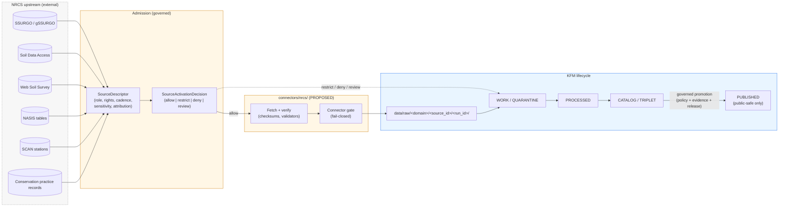

<!-- [KFM_META_BLOCK_V2]
doc_id: kfm://doc/sources-catalog-nrcs
title: NRCS — Source Catalog Entry
type: standard
version: v0.1
status: draft
owners: TODO — Source registry steward + Soil domain steward + Agriculture domain steward
created: TODO-YYYY-MM-DD
updated: TODO-YYYY-MM-DD
policy_label: public
related:
  - docs/sources/SOURCE_DESCRIPTOR_STANDARD.md
  - docs/doctrine/directory-rules.md
  - docs/domains/soil/README.md
  - docs/domains/agriculture/README.md
  - connectors/nrcs/README.md
  - schemas/contracts/v1/source/source-descriptor.schema.json
tags: [kfm, sources, soil, agriculture, nrcs, ssurgo, scan]
notes:
  - This is a human-readable catalog entry. It does NOT decide source admission.
  - Admission and activation live in the source registry and policy/, not in docs/.
[/KFM_META_BLOCK_V2] -->

# 🌱 NRCS — Source Catalog Entry

> Human-readable catalog page describing the **USDA Natural Resources Conservation Service** as a source family for the Kansas Frontier Matrix. It documents intent, roles, governance posture, and domain links. It is not a `SourceDescriptor` record, not a `SourceActivationDecision`, and not authority for any specific release.

| Field | Value |
|---|---|
| **Status** | `draft` (PROPOSED). Not yet reviewed by source registry steward. |
| **Owners** | _TODO_ — Source registry steward + Soil domain steward + Agriculture domain steward |
| **Last updated** | _TODO-YYYY-MM-DD_ |
| **Doc class** | Standard reference doc (per source-family catalog entry) |
| **Authority level** | Documentation. Explains intent; does not decide admission, rights, sensitivity, or release. |

---

### Quick jump

- [§0 — Status & Authority](#0--status--authority)
- [§1 — Purpose & Scope](#1--purpose--scope)
- [§2 — Repo Fit & Authority Placement](#2--repo-fit--authority-placement)
- [§3 — NRCS Source Families](#3--nrcs-source-families)
- [§4 — Source Roles at Admission](#4--source-roles-at-admission)
- [§5 — Rights, Sensitivity & Public-Safe Posture](#5--rights-sensitivity--public-safe-posture)
- [§6 — Cadence & Freshness Expectations](#6--cadence--freshness-expectations)
- [§7 — Domain Links](#7--domain-links)
- [§8 — Admission Flow](#8--admission-flow)
- [§9 — Object Families Touched](#9--object-families-touched)
- [§10 — Anti-Patterns to Watch For](#10--anti-patterns-to-watch-for)
- [§11 — Open Verification Items](#11--open-verification-items)
- [§12 — Related Docs](#12--related-docs)

---

## 0 — Status & Authority

| Field | Value | Label |
|---|---|---|
| **Document type** | Per-source catalog entry under `docs/sources/catalog/` | PROPOSED |
| **Proposed canonical home** | `docs/sources/catalog/nrcs.md` | PROPOSED — `docs/sources/` appears in the Whole-UI Expansion proposed tree; the `catalog/` subfolder is an additional structuring choice |
| **Authority of this document** | Explanatory. Refines but cannot contradict doctrine, ADRs, or the source registry | CONFIRMED doctrine |
| **Authority of any specific path quoted here** | PROPOSED until verified against mounted-repo evidence | PROPOSED |
| **Owner** | Source registry steward (co-owners: Soil domain steward, Agriculture domain steward) | PROPOSED |
| **Source registry record** | _TODO_ — anchor `SourceDescriptor` record(s) under `data/registry/sources/<domain>/` | NEEDS VERIFICATION |
| **Connector home** | `connectors/nrcs/` per Directory Rules §7.3 (proposed connector tree) | PROPOSED |
| **Primary domain** | Soil (`[DOM-SOIL]`) | CONFIRMED doctrine |
| **Secondary domains** | Agriculture (`[DOM-AG]`); adjacency to Hydrology (`[DOM-HYD]`), Habitat (`[DOM-HAB]`) | CONFIRMED doctrine |
| **Lifecycle invariant** | RAW → WORK / QUARANTINE → PROCESSED → CATALOG / TRIPLET → PUBLISHED | CONFIRMED doctrine |
| **Truth posture** | Cite-or-abstain. `EvidenceBundle` outranks generated language. | CONFIRMED doctrine |
| **Implementation maturity** | No mounted-repo evidence in this session — paths, schemas, validators, and connector code are unverified | UNKNOWN / NEEDS VERIFICATION |

---

## 1 — Purpose & Scope

NRCS — the **U.S. Department of Agriculture Natural Resources Conservation Service** — is one of the most consequential upstream source families for KFM's Soil and Agriculture lanes. It supplies the canonical U.S. soil survey, a national soil-climate observation network, and conservation-practice records that downstream KFM lanes (Soil, Agriculture, and adjacent Hydrology / Habitat surfaces) depend on.

This document records:

- **what NRCS products KFM intends to admit**, by name and role,
- **how those products map to KFM domains and object families**,
- **what governance constraints apply** (rights, sensitivity, cadence, public-safe posture),
- **what is doctrine vs. what is unverified** in the current session.

> [!IMPORTANT]
> This catalog entry is **documentation**, not admission. It does not allow, deny, restrict, or abstain. A KFM workflow must not treat this page as the source registry. The authoritative records are `SourceDescriptor` instances and the `SourceActivationDecision` for each NRCS product, held under the source registry — not here.

The scope is intentionally narrow: this page describes NRCS as a **source family** for KFM ingest planning. It does not describe NRCS soil science, does not republish NRCS schemas, and does not stand in for upstream NRCS documentation.

---

## 2 — Repo Fit & Authority Placement

### 2.1 Where this file lives

`docs/sources/catalog/nrcs.md` is **PROPOSED**. The placement basis is:

1. `docs/` is the canonical responsibility root for human-readable explanation (Directory Rules §3 & §4 Step 1: *Explains something to humans → `docs/`*).
2. `docs/sources/` already appears as a proposed sub-area in the Whole-UI + Governed AI Expansion proposed tree (`docs/sources/SOURCE_DESCRIPTOR_STANDARD.md`).
3. Adding `catalog/` as a per-source-family subfolder keeps individual source pages off the `docs/sources/` root and makes room for cross-cutting standards documents (e.g., the source descriptor standard) alongside them.

> [!NOTE]
> The `catalog/` subdirectory choice is **PROPOSED**, not doctrine. If the mounted repo or an ADR establishes a different convention (for example, flat `docs/sources/<name>.md`, or per-domain `docs/domains/<domain>/sources/<name>.md`), follow that convention and log the discrepancy in `docs/registers/DRIFT_REGISTER.md` rather than letting two homes evolve in parallel.

### 2.2 What this doc IS and IS NOT

| Aspect | This doc | Authoritative home (CONFIRMED responsibility roots) |
|---|---|---|
| Human explanation of NRCS in KFM | ✅ This file | `docs/` |
| Source identity, role, rights, cadence, sensitivity record | ❌ | `SourceDescriptor` under the source registry (proposed schema home: `schemas/contracts/v1/source/source-descriptor.schema.json`) |
| Decision: admit / restrict / quarantine / deny / hold | ❌ | `SourceActivationDecision` (policy + steward review) |
| Machine shape of object families | ❌ | `schemas/contracts/v1/...` |
| Allow/deny/abstain logic | ❌ | `policy/` |
| Fetch + admission code | ❌ | `connectors/nrcs/` |
| Lifecycle data | ❌ | `data/raw/<domain>/<source_id>/<run_id>/`, then governed promotion |

If any of the right-hand cells in this table conflict with this catalog entry, the right-hand cell wins. Catalog entries refine; they do not decide.

---

## 3 — NRCS Source Families

The table below enumerates the NRCS-issued data products KFM intends to treat as in-scope source candidates. Inclusion in this table is **not** activation — each row requires its own `SourceDescriptor`, rights review, and `SourceActivationDecision` before any connector is enabled.

| Product (CONFIRMED upstream) | Short ref | Primary KFM domain | Proposed `source_role` at admission | Implementation maturity |
|---|---|---|---|---|
| SSURGO (Soil Survey Geographic Database) — vector map units + tabular soil properties | `nrcs.ssurgo` | Soil | `observed` (with authority characteristics for canonical soil mapping) | UNKNOWN — no mounted connector evidence |
| gSSURGO — gridded raster version of SSURGO | `nrcs.gssurgo` | Soil | `observed` (derived raster of canonical survey) | UNKNOWN |
| Soil Data Access (SDA) — programmatic SSURGO/NASIS access | `nrcs.sda` | Soil | `observed` (access surface for SSURGO/NASIS-derived rows) | UNKNOWN |
| Web Soil Survey — interactive download portal for SSURGO | `nrcs.wss` | Soil | `observed` (manual download path; same underlying authority as SSURGO) | UNKNOWN |
| NASIS-derived component / horizon / pedon tables | `nrcs.nasis` | Soil | `observed` for survey observations; `modeled` where interpretations are layered | UNKNOWN |
| SCAN — Soil Climate Analysis Network (automated stations, hourly) | `nrcs.scan` | Soil (joins to Atmosphere/Air, Agriculture) | `observed` (station readings) | UNKNOWN |
| Conservation practice records (NRCS field implementation records) | `nrcs.conservation` | Agriculture (links to Soil) | `administrative` (compilation of agency-implemented practice records) | UNKNOWN |
| Soil suitability and erosion-risk ratings derived from SSURGO/SDA | `nrcs.suitability` | Soil (consumer: Agriculture) | `modeled` (interpretation layered on observations; requires `role_model_run_ref`) | UNKNOWN |

> [!CAUTION]
> The `source_role` column is **PROPOSED at admission time only**. Per the Source-Role Anti-Collapse rule, source role is fixed when a `SourceDescriptor` is admitted; promotion never upgrades it (e.g., `modeled` does not become `observed`). Corrections produce a new descriptor and a `CorrectionNotice`.

[↥ Back to top](#-nrcs--source-catalog-entry)

---

## 4 — Source Roles at Admission

The KFM source-role vocabulary (`observed | regulatory | modeled | aggregate | administrative | candidate | synthetic`) is intentionally rigid, because the public meaning of a layer depends on its role. The table below makes explicit which NRCS products map to which roles, and what each role requires.

| Role | NRCS products that use it | Required descriptor fields at admission (PROPOSED) | Why this matters |
|---|---|---|---|
| `observed` | SSURGO, gSSURGO, SDA results, NASIS observations, SCAN readings | `source_role` | A SSURGO map unit is an observation of soil mapping; it must not be re-cited as a regulatory determination. |
| `modeled` | SSURGO/SDA-derived suitability ratings, erosion-risk derivatives | `role_model_run_ref → ModelRunReceipt` | Interpretations carry assumptions; the model run must be pinned (inputs, parameters, version). |
| `administrative` | Conservation practice records (compilations of agency program activity) | `role_authority` | These are agency records of activity, not direct soil observations. They must never be cited as observed soil events. |
| `aggregate` | County-/HUC-/decade-level rollups of any NRCS product (e.g., county SSURGO summaries for the Frontier Matrix) | `role_aggregation_unit` | Aggregates require an explicit geometry-scope token to prevent matrix-cell-to-single-record join drift. |

> [!WARNING]
> A `modeled` derivative of SSURGO never becomes `observed` because it was useful. If a public surface needs to present a suitability rating as if it were an observed soil property, the answer is **abstain** or **redesign**, not role-collapse.

---

## 5 — Rights, Sensitivity & Public-Safe Posture

### 5.1 Rights posture (general, NEEDS VERIFICATION per product)

Most NRCS soil products are produced by a U.S. federal agency; project-knowledge material describes SSURGO and gSSURGO as openly downloadable data products. KFM doctrine, however, is explicit that **unknown rights fail closed** — including the case where rights look obviously public but have not been recorded in a `SourceDescriptor` and confirmed by a steward.

> [!IMPORTANT]
> Apparent public-domain status is **not** a substitute for a recorded rights decision. Until each NRCS product has a verified rights field in its `SourceDescriptor` and a corresponding `SourceActivationDecision`, KFM treats it as **not yet activated**. Do not connect a connector ahead of activation.

For SCAN station data specifically, project-knowledge material notes that ingest terms and any required attribution should be confirmed before storage and re-distribution. This catalog page records that requirement; it does not resolve it.

### 5.2 Sensitivity posture (Soil + Agriculture lanes)

NRCS source products as such are not inherently sensitive, but the **joins** they enable are:

| Risk | Default outcome | Required controls |
|---|---|---|
| Private agricultural **field-level** detail (boundaries, owner identity, operations) joined onto SSURGO | DENY public exact / public if private or rights unclear | Aggregation (county / HUC / grid thresholds); `AggregationReceipt`; field-level details denied by default per Agriculture lane doctrine |
| Person–parcel joins (private landowner-sensitive data) | DENY by default | Permissions; policy review; fail-closed join policy |
| Single-record cite from an aggregated matrix cell | DENY join from aggregate cell to single record; ABSTAIN at AI | `AggregationReceipt`; geometry-scope guard; matrix-cell semantics |
| SCAN station observation cited as life-safety / regulatory advisory | DENY life-safety replacement | Not-for-life-safety disclaimer; redirection to the official source |

> [!NOTE]
> Public-safe Agriculture surfaces aggregate to county / HUC / grid thresholds and deny field-level detail by default. NRCS-sourced layers must respect that posture even when the underlying NRCS product would technically permit finer resolution.

### 5.3 Attribution

Attribution requirements per NRCS product are **NEEDS VERIFICATION**. They belong in the `SourceDescriptor` for each product, not in this catalog page. Public-facing surfaces should consult the descriptor and the released `LayerManifest`, not this document, for citation text.

[↥ Back to top](#-nrcs--source-catalog-entry)

---

## 6 — Cadence & Freshness Expectations

Cadence drives stale-state markers. When a product's declared cadence elapses without a new admission, the Evidence Drawer shows a **stale source** badge, and dependent claims may become stale (without becoming wrong).

| Product | Expected cadence character | Stale-state marker basis | Status |
|---|---|---|---|
| SSURGO | Survey-area-driven; updates released by soil survey area; not synchronized nationwide | `source_freshness_expired` when survey-area cadence passes without new admission | NEEDS VERIFICATION per area |
| gSSURGO | Tracks SSURGO; raster release cycle | Inherits SSURGO cadence | NEEDS VERIFICATION |
| SDA | API-side; canonical content tracks SSURGO/NASIS | Inherits underlying SSURGO/NASIS cadence | NEEDS VERIFICATION |
| Web Soil Survey | Same underlying release cycle as SSURGO | Inherits SSURGO cadence | NEEDS VERIFICATION |
| NASIS-derived tables | Variable; periodic compilation | Per-table cadence in descriptor | NEEDS VERIFICATION |
| SCAN | Hourly station observations | Heartbeat freshness; "no new readings within tolerance" → stale | NEEDS VERIFICATION |
| Conservation practice records | Agency-program-driven; variable | Per-program cadence in descriptor | NEEDS VERIFICATION |
| Suitability / erosion derivatives | Tied to underlying SSURGO release + model version | Stale when either underlying SSURGO or pinned model run goes stale | NEEDS VERIFICATION |

> [!TIP]
> Where the upstream publisher exposes a checksums manifest (project-knowledge material notes USDA-NRCS does so for SSURGO), a manifest checksum verification step belongs in the connector gate. Recording manifest availability in the `SourceDescriptor` (`has_manifest`) surfaces it in the catalog and supports refusing promotion when bytes do not match.

---

## 7 — Domain Links

NRCS sits across the KFM domain lattice. The **primary** domain is Soil; **secondary** is Agriculture. Adjacencies extend to Hydrology and Habitat through governed relationships, never through informal data sharing.

| KFM domain | Relationship to NRCS | Citation (CONFIRMED doctrine) |
|---|---|---|
| **Soil** (`[DOM-SOIL]`) | Primary. NRCS SSURGO/gSSURGO/SDA/NASIS/SCAN feed `SoilMapUnit`, `SoilComponent`, `Horizon`, `SoilProperty`, `HydrologicSoilGroup`, `SoilMoistureObservation`. | Encyclopedia §7.3 (Soil) |
| **Agriculture** (`[DOM-AG]`) | Secondary. NRCS conservation practice data plus SSURGO suitability ratings feed `ConservationPractice`, `SoilCropSuitability`, and crop-soil-weather views — **never** field-level publication by default. | Encyclopedia §7.7 (Agriculture) |
| **Hydrology** (`[DOM-HYD]`) | Adjacent. Hydrologic soil groups (HSG) flow from Soil to Hydrology for governed joins. | Encyclopedia §7.2 / §7.3 |
| **Habitat** (`[DOM-HAB]`) | Adjacent. SSURGO appears in the Habitat lane's context-layer source family. | Encyclopedia §7.4 (Habitat) |

> [!NOTE]
> Cross-lane joins are inference-risk multipliers. Any join from an NRCS-sourced soil layer onto a People/Land or Archaeology layer must pass the cross-lane join policy and the trust membrane before becoming public.

[↥ Back to top](#-nrcs--source-catalog-entry)

---

## 8 — Admission Flow

The diagram below sketches how NRCS source material is expected to move through the KFM lifecycle. It reflects **doctrine** (the lifecycle invariant, watcher-as-non-publisher, cite-or-abstain). It does **not** assert that any specific connector or pipeline currently exists in the mounted repository.

> [!IMPORTANT]
> Connectors MUST emit to `data/raw/...` or `data/quarantine/...` only. A connector that writes under `data/processed/`, `data/catalog/`, or `data/published/` violates the watcher-as-non-publisher invariant. Promotion is a governed state transition, not a file move.

---

## 9 — Object Families Touched

NRCS source admission flows into the following KFM canonical object families. Object meanings live in `contracts/`; machine shape lives in `schemas/contracts/v1/...` (default schema home per ADR-0001).

<strong>Soil domain — object families fed by NRCS</strong>

| Object family | NRCS contribution |
|---|---|
| `SoilMapUnit` | SSURGO / gSSURGO map units (polygon + grid) |
| `SoilComponent` | NASIS-derived component records inside a map unit |
| `Horizon` | NASIS horizon depth intervals and properties |
| `SoilProperty` | Texture, chemistry, physical/hydraulic properties from SSURGO/NASIS |
| `HydrologicSoilGroup` | HSG attribute joined to map units (downstream consumer: Hydrology) |
| `SoilMoistureObservation` | SCAN hourly soil moisture / soil temperature readings |
| `ErosionRisk` | `modeled` — derived from SSURGO + erosion model |
| `SuitabilityRating` | `modeled` — derived from SSURGO + interpretive model |
| `Pedon` | Pedon database records (NASIS-derived) |
| `SoilProfileView` | Composite view of components + horizons |
| `ComponentHorizonJoin` | Join object pinning component-to-horizon linkage |
| `SoilTimeCaveat` | Temporal caveat object for static survey data |

(Object family list per Encyclopedia §7.3 / Soil; field shape is `NEEDS VERIFICATION` against any mounted schema.)

<strong>Agriculture domain — object families fed by NRCS</strong>

| Object family | NRCS contribution |
|---|---|
| `ConservationPractice` | NRCS conservation practice records (`administrative` role; never an instruction to land managers) |
| `SoilCropSuitability` | SSURGO-derived suitability ratings (`modeled`) used in agriculture crop-soil-weather views |
| `AggregationReceipt` | Mandatory when NRCS-derived data is aggregated to county / HUC / grid for public surfaces |
| `CropObservation` (joined context) | NRCS layers may provide soil context to crop-year panels (public-safe aggregation only) |
| `FieldCandidate` | NRCS layers may be joined to field candidates **only inside the trust membrane**; field-level publication denied by default |

(Object family list per Encyclopedia §7.7 / Agriculture; field shape is `NEEDS VERIFICATION` against any mounted schema.)

---

## 10 — Anti-Patterns to Watch For

> [!WARNING]
> The patterns below have all been called out in project doctrine and source-role anti-collapse material. Each one degrades trust in a way that is hard to recover from after public release. A PR that lands one of these warrants a refusal at code review or a rollback drill.

| Anti-pattern | Symptom | Required fix |
|---|---|---|
| Role collapse: SSURGO suitability rating cited as observed soil property | A public surface labels a `modeled` derivative as `observed` | Preserve `source_role`; require `role_model_run_ref`; AI ABSTAIN if role missing |
| Connector publishes | `connectors/nrcs/` writes under `data/processed/`, `data/catalog/`, or `data/published/` | Move output to `data/raw/<domain>/<source_id>/<run_id>/`; connectors do not publish |
| Lifecycle skip | A pipeline writes directly to `data/published/` from `data/raw/` | All lifecycle phases run; promotion is a governed state transition |
| Aggregate cited as per-place truth | A county SSURGO-derived value is cited as a single-field observation | DENY join from aggregate cell to single record; `AggregationReceipt`; geometry-scope guard |
| Private field-level publication | A field boundary, owner identity, or operation detail is exposed via an NRCS-context layer | DENY by default; aggregation; permissions; policy review |
| Manifest skip | Promotion proceeds when upstream checksums do not match | Connector gate refuses promotion; record manifest availability in `SourceDescriptor` |
| Stale source masked | A public layer renders without surfacing that SSURGO/SCAN cadence has expired | Stale source badge in Evidence Drawer; cadence captured in `SourceDescriptor` |
| Rights-unknown promotion | An NRCS product reaches PUBLISHED before its rights field and `SourceActivationDecision` are confirmed | Fail closed; quarantine; rights register entry first |
| AI rendering NRCS-derived text as evidence | AI/Focus Mode answer cites NRCS material without an `EvidenceBundle` | `EvidenceBundle` outranks AI text; AI ABSTAIN if `EvidenceRef` does not resolve |
| Watcher publishes | A SCAN watcher writes promotion decisions directly | Watcher-as-non-publisher: emit observations, receipts, and candidate decisions only |

[↥ Back to top](#-nrcs--source-catalog-entry)

---

## 11 — Open Verification Items

| # | Item | Owner (PROPOSED) | Label |
|---|---|---|---|
| V1 | Canonical access URLs / endpoints for SSURGO, gSSURGO, SDA, Web Soil Survey, NASIS, SCAN, conservation practice data (URLs intentionally not pinned here) | Source registry steward | NEEDS VERIFICATION |
| V2 | Current rights / licensing / attribution per NRCS product | Source registry steward + legal review | NEEDS VERIFICATION |
| V3 | SCAN ingest-and-store terms; any written-consent requirements | Source registry steward | NEEDS VERIFICATION |
| V4 | Manifest / checksum availability per product (`has_manifest` flag in `SourceDescriptor`) | Source registry steward + connector author | NEEDS VERIFICATION |
| V5 | Cadence values per product (declared freshness window) | Source registry steward + Soil domain steward | NEEDS VERIFICATION |
| V6 | Connector home: does `connectors/nrcs/` exist in the mounted repository, and what does it currently contain? | Connector steward | UNKNOWN |
| V7 | `SourceDescriptor` schema presence at `schemas/contracts/v1/source/source-descriptor.schema.json` | Schema steward | NEEDS VERIFICATION |
| V8 | `SourceActivationDecision` per NRCS product — drafted / approved / denied state | Source registry steward + reviewer | UNKNOWN |
| V9 | Validator coverage for the role-pair `(modeled, observed)` specifically for SSURGO suitability vs. SSURGO map unit | Validator steward | UNKNOWN |
| V10 | Per-product fixtures (valid + invalid) under `tests/fixtures/...` | Test steward | UNKNOWN |
| V11 | Whether `docs/sources/catalog/` is the correct home, or whether a flat `docs/sources/nrcs.md`, a per-domain `docs/domains/<domain>/sources/`, or a registry-side README is preferred | Docs steward | PROPOSED |
| V12 | Whether this page should be split per NRCS product (e.g., `nrcs/ssurgo.md`, `nrcs/scan.md`) once activation grows | Docs steward | PROPOSED |

> [!NOTE]
> Items V1–V5 are deliberately not resolved by external research from this catalog page. They belong in the per-product `SourceDescriptor` records — that's where they can be reviewed, signed, and stale-checked.

---

## 12 — Related Docs

- `docs/sources/SOURCE_DESCRIPTOR_STANDARD.md` _(PROPOSED — source descriptor field and admission standard)_
- `docs/doctrine/directory-rules.md` _(canonical placement and lifecycle doctrine)_
- `docs/domains/soil/README.md` _(PROPOSED — Soil domain README)_
- `docs/domains/agriculture/README.md` _(PROPOSED — Agriculture domain README)_
- `docs/architecture/contract-schema-policy-split.md` _(PROPOSED — split between meaning, shape, and decision)_
- `connectors/nrcs/README.md` _(PROPOSED — per-connector README per Directory Rules §7.3)_
- `schemas/contracts/v1/source/source-descriptor.schema.json` _(PROPOSED — `SourceDescriptor` schema)_
- `docs/registers/DRIFT_REGISTER.md` _(log discrepancies between this catalog and mounted-repo reality here)_
- `docs/registers/VERIFICATION_BACKLOG.md` _(if V1–V12 above need register entries)_

---

**Status:** draft (PROPOSED). **Owners:** _TODO_. **Last updated:** _TODO-YYYY-MM-DD_. This file is human-readable catalog documentation and does not decide source admission. For activation, see the source registry.

[↥ Back to top](#-nrcs--source-catalog-entry)
