<!-- [KFM_META_BLOCK_V2]
doc_id: kfm://doc/docs-sources-catalog-nrcs-gssurgo
title: gSSURGO
type: product-page
version: v0.2
status: draft
owners: <PLACEHOLDER — Docs steward + Source steward for nrcs>
created: 2026-05-20
updated: 2026-05-22
policy_label: public
related:
  - docs/sources/catalog/nrcs/README.md
  - docs/sources/catalog/nrcs/ssurgo.md
  - docs/sources/catalog/nrcs/gnatsgo.md
  - docs/sources/catalog/README.md
  - docs/sources/catalog/IDENTITY.md
  - docs/sources/catalog/RIGHTS-AND-SENSITIVITY-MAP.md
  - docs/doctrine/directory-rules.md
  - docs/domains/soil/README.md
  - docs/domains/agriculture/README.md
  - connectors/nrcs/README.md
  - schemas/contracts/v1/source/source-descriptor.schema.json
  - data/registry/sources/soil/
  - data/registry/source_descriptors/
  - policy/sensitivity/
tags: [kfm, docs, sources, catalog, nrcs, soil, agriculture, observed, raster, ssurgo, gssurgo, mukey]
notes:
  - "PROPOSED product-page scaffold; sibling-link presence verified in Claude Code session."
  - "Source role at admission is observed (gridded raster of the canonical SSURGO survey)."
  - "Annual refresh expectation tracks SSURGO release cycle (per Idea Index card KFM-P24-PROG-0004)."
  - "Silent resampling that conflates resolutions across gSSURGO / gNATSGO / SoilGrids / SMAP is a named anti-pattern."
[/KFM_META_BLOCK_V2] -->

# 🌱 gSSURGO

> Gridded raster version of the SSURGO soil survey — an **observed** source family that preserves SSURGO map-unit mapping in raster form, joined back to SSURGO tabular attributes by `MUKEY`.

| Field | Value |
|---|---|
| **Status** | PROPOSED — scaffold only |
| **Family** | [`nrcs`](./README.md) |
| **Short ref** | `nrcs.gssurgo` |
| **Form** | Raster (gridded derivative of SSURGO) |
| **Proposed `source_role`** | `observed` (gridded raster of canonical SSURGO survey) |
| **Primary domain** | Soil (`[DOM-SOIL]`) |
| **Secondary domain** | Agriculture (`[DOM-AG]`) (joins via `SoilMapUnit` and suitability ratings) |
| **Joins back to** | SSURGO tabular via `MUKEY` (CONFIRMED Agriculture term) |
| **Sibling products** | [`ssurgo`](./ssurgo.md) (vector form) · [`gnatsgo`](./gnatsgo.md) (national-scale grid) |
| **Owners** | _PLACEHOLDER — Docs steward + Source steward for nrcs_ |
| **Last reviewed** | 2026-05-22 |

---

### Quick jump

- [§0 — Status & Authority](#0--status--authority)
- [§1 — Overview](#1--overview)
- [§2 — Source authority](#2--source-authority)
- [§3 — Source role at admission (observed)](#3--source-role-at-admission-observed)
- [§4 — Catalog profiles used](#4--catalog-profiles-used)
- [§5 — Collection identity](#5--collection-identity)
- [§6 — Provenance fields](#6--provenance-fields)
- [§7 — Temporal handling](#7--temporal-handling)
- [§8 — Geometry, projection, and resolution](#8--geometry-projection-and-resolution)
- [§9 — Rights and sensitivity](#9--rights-and-sensitivity)
- [§10 — Admission flow](#10--admission-flow)
- [§11 — Object families fed](#11--object-families-fed)
- [§12 — Validation and catalog closure](#12--validation-and-catalog-closure)
- [§13 — Anti-patterns to watch for](#13--anti-patterns-to-watch-for)
- [§14 — Related contracts and schemas](#14--related-contracts-and-schemas)
- [§15 — Related connectors and pipelines](#15--related-connectors-and-pipelines)
- [§16 — Examples](#16--examples)
- [§17 — Open questions](#17--open-questions)

---

## 0 — Status & Authority

| Aspect | This product page | Authoritative home |
|---|---|---|
| Human explanation of `nrcs.gssurgo` in KFM | ✅ This file | `docs/` |
| Source identity, role, rights, cadence, sensitivity record | ❌ | `SourceDescriptor` under `data/registry/sources/soil/` + `data/registry/source_descriptors/` (Directory Rules §9.1 / §12) |
| Admission decision (allow / restrict / deny / hold) | ❌ | `SourceActivationDecision` under `policy/sources/` |
| Machine shape | ❌ | `schemas/contracts/v1/...` (ADR-0001) |
| Fetch + admission code | ❌ | `connectors/nrcs/` (Directory Rules §7.3) |
| Lifecycle data | ❌ | `data/raw/soil/nrcs.gssurgo/<run_id>/` |
| Vector counterpart | ❌ | [`./ssurgo.md`](./ssurgo.md) |
| National-scale gridded counterpart | ❌ | [`./gnatsgo.md`](./gnatsgo.md) |

> [!NOTE]
> This is a **product page**, not a `SourceDescriptor`. The family-level overview lives in [`./README.md`](./README.md); identity rules in [`../IDENTITY.md`](../IDENTITY.md); rights and sensitivity guidance in [`../RIGHTS-AND-SENSITIVITY-MAP.md`](../RIGHTS-AND-SENSITIVITY-MAP.md). Do not duplicate descriptor or policy fields here.

---

## 1 — Overview

gSSURGO is USDA-NRCS's gridded raster derivative of the SSURGO (Soil Survey Geographic) database. It preserves SSURGO map-unit mapping in raster form, joined back to SSURGO's tabular soil-property attributes by the `MUKEY` (map-unit key). Where SSURGO is published as vector polygons by soil survey area, gSSURGO carries the same authority as a national raster product on a single cadence.

PROPOSED scaffold. **NEEDS VERIFICATION**: exact cadence per release, current endpoint URL, rights status, license terms, native CRS, native cell size, attribute manifest.

> [!NOTE]
> The KFM project-knowledge corpus notes a documented **resolution-mismatch concern** across the soil stack: SSURGO, gSSURGO, gNATSGO, SoilGrids, and SMAP do not share a native grid, and the corpus explicitly warns against silent resampling that conflates resolutions. This product page reflects that warning in §8 and §13.

### 1.1 What this product IS

- A **gridded raster** of SSURGO map units, suitable for raster overlay, COG/PMTiles publication, and modelled-derivative inputs.
- An `observed` source for `SoilMapUnit` mapping, with `MUKEY` per cell as the join key back to SSURGO tabular components.
- A source whose **cadence tracks SSURGO** (annual-refresh character per Idea Index card `KFM-P24-PROG-0004`).

### 1.2 What this product IS NOT

- ❌ Not a finer-than-survey observation. A gSSURGO cell preserves SSURGO's mapping precision; it does not promise sub-map-unit detail.
- ❌ Not a regulatory determination.
- ❌ Not a soil-moisture or soil-condition product. Soil moisture comes from SCAN / SMAP / Kansas Mesonet; soil condition is `SoilMoistureObservation`.
- ❌ Not a substitute for SSURGO when tabular component / horizon attributes are needed at full fidelity — those join via `MUKEY` from the SSURGO/SDA product family.
- ❌ Not a national-scale gridded soil product where SSURGO is absent — that is **gNATSGO** (see [`./gnatsgo.md`](./gnatsgo.md)).

[↥ Back to top](#-gssurgo)

---

## 2 — Source authority

See [`data/registry/sources/soil/`](../../../../data/registry/sources/soil/) and [`data/registry/source_descriptors/`](../../../../data/registry/source_descriptors/) for the authoritative `SourceDescriptor`. **Do not duplicate** descriptor fields here.

> [!IMPORTANT]
> Per Directory Rules §8.3 (*Compatibility roots are not parallel authority*), this document MUST NOT evolve descriptor-shaped content independently of the registry. The descriptor is the canonical record for `source_role`, `role_authority`, rights, sensitivity, cadence, attribution, native CRS, native cell size, and `has_manifest`.

Per the Atlas Idea Index card `KFM-P24-PROG-0004` (SSURGO / gSSURGO source descriptor — PROPOSED shape), the descriptor for this family should record:

- `mukey`, mapunit symbol, component, horizon attributes
- hydrologic group
- geometry (here: raster grid, CRS, cell size)
- `source_uri`
- annual refresh expectation

Implementation status of that card is **UNKNOWN** until mounted-repo evidence is inspected.

---

## 3 — Source role at admission (observed)

| Field | Value (PROPOSED at admission) |
|---|---|
| `source_role` | `observed` |
| `role_authority` | USDA-NRCS (canonical soil-survey authority; per-survey-area attribution NEEDS VERIFICATION) |
| Allowed downstream cite | "SSURGO map-unit mapping (gridded form). Observed soil mapping at the precision of the source survey." |
| Forbidden downstream cite | "Observation at sub-map-unit precision" · "Soil moisture / condition reading" · "Regulatory designation" · "Modelled suitability rating presented as observed soil property" |
| `SoilTimeCaveat` | REQUIRED on join — gSSURGO inherits SSURGO's source-survey vintage; not all survey areas are on the same release cycle |

> [!CAUTION]
> **Anti-collapse rule (CONFIRMED doctrine).** Modelled derivatives of gSSURGO (suitability rasters, erosion-risk surfaces) are `modeled`, **not** `observed`. The role is fixed at admission and cannot be upgraded by promotion. A modelled derivative MUST carry `role_model_run_ref → ModelRunReceipt`; a public surface that presents a gSSURGO-derived suitability raster as observed soil property has collapsed `modeled` into `observed` and must be rejected at the trust membrane (Atlas §24.1.2).

> [!WARNING]
> **Precision-anti-collapse rule.** gSSURGO is a *gridded* product, but its mapping precision is the underlying SSURGO survey. Citing a gSSURGO cell at a precision finer than the source survey supports — for example, treating a 10 m cell as a per-point soil observation — is a precision-claim collapse. Preserve `SoilTimeCaveat` and surface source-survey vintage when rendering.

[↥ Back to top](#-gssurgo)

---

## 4 — Catalog profiles used

| Profile | Lane | Used by this product? |
|---|---|---|
| STAC | `data/catalog/stac/` | PROPOSED — Yes (raster item per release / area); NEEDS VERIFICATION |
| DCAT | `data/catalog/dcat/` | PROPOSED — Yes (dataset-level description); NEEDS VERIFICATION |
| PROV-O | `data/catalog/prov/` | PROPOSED — Yes (admission, refresh, and derivative lineage); NEEDS VERIFICATION |
| Domain projection | `data/catalog/domain/soil/` | PROPOSED — Yes (projection of `SoilMapUnit` carrying `MUKEY` join); NEEDS VERIFICATION |

> [!TIP]
> A Pass-10 corpus convention reads: *publish a STAC Collection per source plus a unified soil-condition view that cites all four [SSURGO, gSSURGO, Mesonet, SMAP]*. Per-source Collections keep cadence and lineage clean; the cross-source view is governed separately.

---

## 5 — Collection identity

- PROPOSED Collection id pattern: `kfm-nrcs-gssurgo` (see [`../IDENTITY.md`](../IDENTITY.md)).
- PROPOSED namespace: `kfm:` *(see OPEN-DSC-03)*.
- PROPOSED per-product short ref: `nrcs.gssurgo`.
- Asset roles: NEEDS VERIFICATION — confirm against [`schemas/contracts/v1/source/`](../../../../schemas/contracts/v1/source/).

> [!NOTE]
> Whether `kfm-nrcs-gssurgo` is its own Collection or shares one with `kfm-nrcs-ssurgo` is **OPEN** (see §17). Sharing simplifies the Idea Index `KFM-P24-PROG-0004` descriptor (which treats SSURGO/gSSURGO as one descriptor) but couples the cadence of two distinct release forms.

---

## 6 — Provenance fields

STAC `properties.kfm:provenance` block (PROPOSED — Pass-10 C4-01):

- `spec_hash` — sha256 of the canonical record.
- `evidence_bundle_ref` — `kfm://evidence/<digest>`.
- `run_record_ref` — `kfm://run/<run-id>`.
- `audit_ref` — `kfm://audit/<attestation-id>`.
- `policy_digest` — sha256 of the policy bundle.

Per-asset integrity: `file:checksum`.

PROPOSED gSSURGO-specific provenance additions (subject to descriptor confirmation):

- `mukey_join_target` — pointer to the SSURGO tabular Collection the raster joins back to.
- `source_survey_areas` — list of contributing SSURGO survey-area identifiers and their vintages (drives `SoilTimeCaveat`).
- `resampling_method` — `none | nearest | bilinear | …` for any KFM-side reprojection; **`none` is the default; non-`none` must be justified** (see §13).
- `native_cell_size` and `native_crs` — must match the upstream release; NEEDS VERIFICATION.

[↥ Back to top](#-gssurgo)

---

## 7 — Temporal handling

PROPOSED — distinct **source**, **observed**, **valid**, **retrieval**, **release**, and **correction** times where material. NEEDS VERIFICATION per product.

For gSSURGO the temporal columns each carry a specific meaning:

| Temporal column | Salience for `nrcs.gssurgo` | Notes |
|---|---|---|
| **Source time** | gSSURGO release version | High salience — annual refresh cycle (per `KFM-P24-PROG-0004`) |
| **Observed time** | SSURGO survey acquisition window per source area | High salience — varies per area; never a single date for the whole national grid |
| **Valid time** | "As-of" period the survey is intended to characterize | Medium — survey vintage matters more in long-changed landscapes |
| **Retrieval time** | When KFM admitted the release | High salience |
| **Release time** | When KFM published derived layers | High salience |
| **Correction time** | When NRCS re-released or KFM superseded | High salience |

> [!IMPORTANT]
> Because the underlying SSURGO surveys are released **per area, not synchronously**, the gSSURGO national raster has heterogeneous `observed_time` across its cells. The `SoilTimeCaveat` object family exists to make this caveat visible — do not collapse it into a single "national survey year" attribute.

---

## 8 — Geometry, projection, and resolution

PROPOSED — confirm CRS, generalization rules, and scale support against `data/catalog/` artifacts. NEEDS VERIFICATION per release.

> [!CAUTION]
> Project-knowledge material flags a documented **resolution-mismatch concern** across the soil stack — gSSURGO, gNATSGO, SoilGrids, and SMAP each live on different native grids. The corpus explicitly warns against **silent resampling that conflates resolutions**. KFM's posture is to record native CRS and cell size in the `SourceDescriptor`, declare any KFM-side resampling in provenance, and refuse promotion when a resampling step is undeclared.

Posture for gSSURGO:

| Topic | Posture |
|---|---|
| **Native CRS** | NEEDS VERIFICATION (typically a USA-projected raster CRS per upstream release) |
| **Native cell size** | NEEDS VERIFICATION (corpus indicates SSURGO-aligned grid — value not pinned here) |
| **KFM-side reprojection** | PROPOSED-default = `none` (preserve native CRS); any non-`none` step MUST declare `resampling_method` in provenance and pass `resolution-non-conflation` validation |
| **Generalization for public layers** | PROPOSED — generalize only via governed transform; emit `RepresentationReceipt` if visual fidelity differs from evidence fidelity |
| **PMTiles / COG publication** | PROPOSED — COG with overviews and explicit CRS retention; PMTiles only via governed promotion (per Atlas §24.9 trust-membrane) |
| **Scale-of-use guidance** | Do not render below the source survey's mapping scale; honor `SoilTimeCaveat` |

[↥ Back to top](#-gssurgo)

---

## 9 — Rights and sensitivity

NEEDS VERIFICATION — see [`policy/sensitivity/`](../../../../policy/sensitivity/) and [`../RIGHTS-AND-SENSITIVITY-MAP.md`](../RIGHTS-AND-SENSITIVITY-MAP.md). **Do not restate policy here.**

gSSURGO itself is not inherently sensitive (it is a federal soil-mapping raster product), but the **joins** it enables can be:

| Concern | Default outcome | Why |
|---|---|---|
| Unknown rights at admission | Fail closed (no admission, no publication) | KFM rights-unknown-fails-closed posture, even where the upstream looks obviously public |
| Field-level operator-identifiable join (gSSURGO + field boundary + operator) | DENY public exact / public-if-private-or-unclear | Agriculture lane: field-level publication denied by default; aggregation required for public surfaces |
| Person–parcel join via soil context | DENY by default | Person / parcel privacy; cross-lane join policy |
| Single-cell cite from an aggregated public surface | DENY join from aggregate to single record; ABSTAIN at AI | Aggregate-to-single-record is a matrix-cell collapse; `AggregationReceipt` mandatory |
| Citation as life-safety or regulatory advisory | DENY | Soil-mapping raster is neither warning nor regulation |

> [!NOTE]
> Public-safe Agriculture surfaces aggregate to county / HUC / grid thresholds. A gSSURGO-informed layer on a public Agriculture surface must respect that posture even where the upstream raster would technically permit finer resolution.

---

## 10 — Admission flow

The flow below reflects **doctrine**; it does not assert that any connector or pipeline currently exists in the mounted repository.

```mermaid
flowchart LR
  UPSTREAM[(NRCS gSSURGO<br/>annual raster release)]
  subgraph ADMISSION["Admission (governed)"]
    DESC["SourceDescriptor<br/>(role=observed,<br/>rights, cadence,<br/>native CRS / cell size,<br/>sensitivity, attribution)"]
    ACT["SourceActivationDecision<br/>(allow | restrict | deny | review)"]
  end
  subgraph CONNECTOR["connectors/nrcs/ (PROPOSED — connectors do not publish)"]
    FETCH["Fetch + verify<br/>(checksums, manifest)"]
    CGATE["Connector gate<br/>(fail-closed;<br/>no silent resample)"]
  end
  subgraph LIFECYCLE["KFM lifecycle"]
    RAW["data/raw/soil/<br/>nrcs.gssurgo/&lt;run_id&gt;/"]
    WQ["WORK / QUARANTINE<br/>(reprojection declared,<br/>not silent)"]
    PROC["PROCESSED<br/>(SoilMapUnit raster +<br/>MUKEY join keys)"]
    CAT["CATALOG / TRIPLET"]
    PUB["PUBLISHED<br/>(COG / PMTiles via<br/>governed promotion)"]
  end

  UPSTREAM --> DESC --> ACT
  ACT -->|allow| FETCH
  ACT -.->|restrict / deny / review| WQ
  FETCH --> CGATE --> RAW --> WQ --> PROC --> CAT
  CAT -->|"governed promotion<br/>(policy + evidence + release)"| PUB

  classDef extern fill:#f7f7f7,stroke:#888,stroke-dasharray: 3 3;
  classDef gov fill:#fff7e6,stroke:#cc7a00;
  classDef life fill:#e9f5ff,stroke:#1f6feb;
  class UPSTREAM extern;
  class ADMISSION,CONNECTOR gov;
  class LIFECYCLE life;
```

> [!IMPORTANT]
> Connectors MUST emit to `data/raw/...` or `data/quarantine/...` only. A connector that writes under `data/processed/`, `data/catalog/`, or `data/published/` violates the watcher-as-non-publisher invariant. **Reprojection or resampling is a declared transform**, not an admission silently performed by the fetcher — fail closed if `resampling_method` is missing.

[↥ Back to top](#-gssurgo)

---

## 11 — Object families fed

NRCS gSSURGO flows into the following canonical KFM object families. Object **meaning** lives in `contracts/`; machine **shape** lives in `schemas/contracts/v1/...`.

| Object family | Domain | Contribution from gSSURGO | Notes |
|---|---|---|---|
| `SoilMapUnit` | Soil | Primary feed — raster grid carrying `MUKEY` per cell | CONFIRMED canonical (Encyclopedia §7.3) |
| `SoilComponent` | Soil | Joined via `MUKEY` to SSURGO tabular components | Cross-product join through SSURGO/SDA |
| `Horizon` | Soil | Joined via `MUKEY` → component → horizon chain | Cross-product join |
| `SoilProperty` | Soil | Joined attributes (texture, depth-to-restriction, etc.) | Cross-product join |
| `HydrologicSoilGroup` | Soil | HSG raster attribute (downstream consumer: Hydrology) | CONFIRMED canonical |
| `SoilTimeCaveat` | Soil | REQUIRED — captures heterogeneous survey vintages across the raster | CONFIRMED canonical; not optional |
| `ErosionRisk` | Soil | `modeled` — derived from gSSURGO + erosion model | Requires `role_model_run_ref` |
| `SuitabilityRating` | Soil | `modeled` — derived from gSSURGO + interpretive model | Requires `role_model_run_ref` |
| `SoilCropSuitability` (downstream) | Agriculture | `modeled` view of suitability ratings used in crop-soil context | Public-safe aggregation required |
| `AggregationReceipt` | Agriculture | Mandatory when gSSURGO-derived attributes are aggregated for public surfaces | CONFIRMED canonical |

Field shape for every entry is **NEEDS VERIFICATION** against any mounted schema.

[↥ Back to top](#-gssurgo)

---

## 12 — Validation and catalog closure

- Catalog closure required before public release (Pass-10 / `KFM-P1-IDEA-0020`).
- STAC Projection lint (`KFM-P27-FEAT-0003`) — PROPOSED.
- STAC checksum closure against the `ReleaseManifest` digest (`KFM-P22-PROG-0037`) — PROPOSED.
- **Annual refresh distinction test** — PROPOSED. Per `KFM-P14-PROG-0034`, pipelines MUST distinguish SDA live tabular queries from gSSURGO annual raster composites with separate receipts and cadence rules.
- **MUKEY join-key presence test** — PROPOSED. Every raster cell carries a `MUKEY` that resolves to a SSURGO/SDA tabular component; releases without a resolvable join target fail closed.
- **Resolution-non-conflation test** — PROPOSED. Any cross-source join with gNATSGO, SoilGrids, or SMAP MUST declare resampling method and target resolution; silent resampling fails closed.
- **Role-tag preservation test** — PROPOSED. A validator MUST refuse a release whose published surface re-tags a gSSURGO-derived `modeled` product (suitability, erosion) as `observed` (Atlas §24.1.2).
- **SoilTimeCaveat surfacing test** — PROPOSED. Public renderings of gSSURGO MUST carry the survey-vintage caveat; release without it fails closed.

---

## 13 — Anti-patterns to watch for

> [!WARNING]
> Each pattern below has been called out in KFM doctrine, the source-role anti-collapse register, or the Pass 10 soil-stack dossier. A PR that lands one warrants a refusal at code review.

| Anti-pattern | Symptom | Required fix |
|---|---|---|
| **Silent resampling** that conflates resolutions across gSSURGO / gNATSGO / SoilGrids / SMAP | A composite view joins layers at different native cell sizes without declaring resampling | Record `resampling_method` and target resolution in provenance; fail closed if undeclared |
| **Sub-map-unit precision claim** | A gSSURGO cell cited as a per-point soil observation | Preserve mapping precision of the source survey; surface `SoilTimeCaveat` |
| **Role collapse: gSSURGO-derived suitability cited as observed soil** | A public layer labels a `modeled` raster as `observed` | Preserve `source_role`; require `role_model_run_ref`; AI ABSTAIN if role missing |
| **Connector publishes** | `connectors/nrcs/` writes under `data/processed/`, `data/catalog/`, or `data/published/` | Move output to `data/raw/soil/nrcs.gssurgo/<run_id>/`; connectors do not publish |
| **Lifecycle skip** | A pipeline writes to `data/published/` directly from `data/raw/` | All lifecycle phases run; promotion is a governed state transition |
| **Aggregate cited as per-place truth** | A county-aggregated gSSURGO attribute is cited as a single-field observation | DENY join from aggregate cell to single record; `AggregationReceipt`; geometry-scope guard |
| **Private field-level publication** | gSSURGO joined to operator-identifiable field detail and published | DENY by default; aggregation; permissions; policy review |
| **Manifest skip** | Promotion proceeds when upstream checksums do not match | Connector gate refuses promotion; record manifest availability in `SourceDescriptor` |
| **Stale source masked** | A public layer renders without surfacing that the annual refresh has lapsed for one or more survey areas | Stale source badge in Evidence Drawer; per-area cadence captured in descriptor |
| **Rights-unknown promotion** | gSSURGO reaches PUBLISHED before its rights field and `SourceActivationDecision` are confirmed | Fail closed; quarantine; rights register entry first |
| **AI rendering gSSURGO as evidence without an EvidenceBundle** | Focus Mode answer cites a gSSURGO cell without a resolved `EvidenceBundle` | `EvidenceBundle` outranks AI text; AI ABSTAIN if `EvidenceRef` does not resolve |
| **Two homes for the same authority** | A second gSSURGO source registry mirror appears under `docs/sources/registry/` or similar | Compatibility roots are not parallel authority (Directory Rules §8.3); ADR + migration plan required |

[↥ Back to top](#-gssurgo)

---

## 14 — Related contracts and schemas

- [`contracts/`](../../../../contracts/) — NEEDS VERIFICATION (object meaning lives here).
- [`schemas/contracts/v1/source/`](../../../../schemas/contracts/v1/source/) — per ADR-0001; default `SourceDescriptor` schema home.
- [`schemas/contracts/v1/receipts/`](../../../../schemas/contracts/v1/receipts/) — PROPOSED home for `ModelRunReceipt`, `AggregationReceipt`, and `RepresentationReceipt` shapes (Atlas §24.2).

## 15 — Related connectors and pipelines

- [`connectors/nrcs/`](../../../../connectors/nrcs/).
- [`pipelines/ingest/`](../../../../pipelines/ingest/), [`pipelines/normalize/`](../../../../pipelines/normalize/), [`pipelines/validate/`](../../../../pipelines/validate/), [`pipelines/catalog/`](../../../../pipelines/catalog/).
- [`pipeline_specs/soil/`](../../../../pipeline_specs/soil/) (PROPOSED — domain segment per Directory Rules §12; pipeline distinction per `KFM-P14-PROG-0034`).

## 16 — Examples

*(Illustrative only — do not treat as authoritative.)*

See [`../_examples/stac-item-example.json`](../_examples/stac-item-example.json) for the minimal STAC + `kfm:provenance` shape.

[↥ Back to top](#-gssurgo)

---

## 17 — Open questions

| # | Item | Label |
|---|---|---|
| Q1 | Confirm cadence per release (annual? per survey area? hybrid?) and current endpoint URL | OPEN — NEEDS VERIFICATION |
| Q2 | Confirm rights status, license, and attribution requirements | OPEN — NEEDS VERIFICATION |
| Q3 | Confirm whether this product warrants its own STAC Collection (`kfm-nrcs-gssurgo`) or shares one with `nrcs.ssurgo` | OPEN |
| Q4 | Confirm native CRS and native cell size at the upstream release | OPEN — NEEDS VERIFICATION |
| Q5 | Confirm the canonical KFM-side resampling default (recommended: `none`) and the validator that refuses undeclared resampling | OPEN |
| Q6 | Confirm presence of upstream checksum manifest (`has_manifest` flag in `SourceDescriptor`) | OPEN — NEEDS VERIFICATION |
| Q7 | Confirm whether SSURGO and gSSURGO share a single `SourceDescriptor` (per `KFM-P24-PROG-0004` shape) or are separated | OPEN |
| Q8 | Confirm survey-area-to-vintage map for `SoilTimeCaveat` surfacing | OPEN — NEEDS VERIFICATION |
| Q9 | Confirm the canonical KFM Idea Index cards that govern this product family (`KFM-P24-PROG-0004`, `KFM-P14-PROG-0034`, others?) | OPEN — NEEDS VERIFICATION |
| Q10 | Confirm whether modelled derivatives of gSSURGO (suitability, erosion-risk) are catalogued as separate product pages or as receipts under this page | OPEN |

---

**Status:** draft (PROPOSED, v0.2). **Owners:** _PLACEHOLDER — Docs steward + Source steward for nrcs_. **Last reviewed:** 2026-05-22 *(Claude Code product-page scaffold session)*. This file is human-readable product-page documentation and does not decide source admission. For activation, see the source registry.

[↥ Back to top](#-gssurgo)
