<!-- [KFM_META_BLOCK_V2]
doc_id: kfm://doc/docs-sources-catalog-nrcs-scan-soil-climate
title: NRCS SCAN (Soil Climate Analysis Network)
type: product-page
version: v0.2
status: draft
owners: <PLACEHOLDER — Docs steward + Source steward for nrcs>
created: 2026-05-20
updated: 2026-05-22
policy_label: public
related:
  - docs/sources/catalog/nrcs/README.md
  - docs/sources/catalog/nrcs/ssurgo.md
  - docs/sources/catalog/nrcs/gssurgo.md
  - docs/sources/catalog/README.md
  - docs/sources/catalog/IDENTITY.md
  - docs/sources/catalog/RIGHTS-AND-SENSITIVITY-MAP.md
  - docs/doctrine/directory-rules.md
  - docs/domains/soil/README.md
  - docs/domains/atmosphere/README.md
  - docs/domains/agriculture/README.md
  - connectors/nrcs/README.md
  - schemas/contracts/v1/source/source-descriptor.schema.json
  - data/registry/sources/soil/
  - data/registry/source_descriptors/
  - policy/sensitivity/
tags: [kfm, docs, sources, catalog, nrcs, soil, atmosphere, agriculture, observed, station, watcher, scan, awdb, soil-moisture]
notes:
  - "PROPOSED product-page scaffold; sibling-link presence verified in Claude Code session."
  - "Source role at admission is observed (station readings); watcher signals at Pre-RAW are candidate, not published."
  - "Heartbeat freshness: no new readings within tolerance → stale source."
  - "SCAN is NOT a life-safety / regulatory advisory; redirect to official authority for emergencies."
[/KFM_META_BLOCK_V2] -->

# 📡 NRCS SCAN (Soil Climate Analysis Network)

> Automated NRCS soil-climate stations producing hourly soil moisture and temperature readings at multiple sensor depths — an **observed** station source whose watcher emits **candidate** signals at Pre-RAW and whose freshness is measured by station heartbeat, not survey cadence.

| Field | Value |
|---|---|
| **Status** | PROPOSED — scaffold only |
| **Family** | [`nrcs`](./README.md) |
| **Short ref** | `nrcs.scan` |
| **Upstream API family** | NRCS AWDB (Air-Water Database) — NEEDS VERIFICATION per current endpoint |
| **Form** | Station time-series (hourly observations across multiple sensor depths) |
| **Proposed `source_role`** | `observed` (station readings); watcher emits `candidate` signals at Pre-RAW |
| **Primary domain** | Soil (`[DOM-SOIL]`) |
| **Secondary domains** | Atmosphere / Air (`[DOM-AIR]`) — air temperature, ancillary climate readings · Agriculture (`[DOM-AG]`) — soil-condition context |
| **Canonical KFM term** | `station_soil_moisture` (CONFIRMED Soil-domain ubiquitous-language term) |
| **Sibling products** | [`ssurgo`](./ssurgo.md), [`gssurgo`](./gssurgo.md) — static soil mapping; cross-source fusion governed separately |
| **Owners** | _PLACEHOLDER — Docs steward + Source steward for nrcs_ |
| **Last reviewed** | 2026-05-22 |

---

### Quick jump

- [§0 — Status & Authority](#0--status--authority)
- [§1 — Overview](#1--overview)
- [§2 — Source authority](#2--source-authority)
- [§3 — Source role at admission (observed + watcher candidate)](#3--source-role-at-admission-observed--watcher-candidate)
- [§4 — Catalog profiles used](#4--catalog-profiles-used)
- [§5 — Collection identity](#5--collection-identity)
- [§6 — Provenance fields](#6--provenance-fields)
- [§7 — Temporal handling](#7--temporal-handling)
- [§8 — Geometry, projection, and station metadata](#8--geometry-projection-and-station-metadata)
- [§9 — Rights and sensitivity](#9--rights-and-sensitivity)
- [§10 — Admission flow](#10--admission-flow)
- [§11 — Object families fed](#11--object-families-fed)
- [§12 — Validation and catalog closure](#12--validation-and-catalog-closure)
- [§13 — Anti-patterns to watch for](#13--anti-patterns-to-watch-for)
- [§14 — Related contracts and schemas](#14--related-contracts-and-schemas)
- [§15 — Related connectors and pipelines](#15--related-connectors-and-pipelines)
- [§16 — Examples](#16--examples)
- [§17 — Open questions](#17--open-questions)

---

## 0 — Status & Authority

| Aspect | This product page | Authoritative home |
|---|---|---|
| Human explanation of `nrcs.scan` in KFM | ✅ This file | `docs/` |
| Source identity, role, rights, cadence, sensitivity record | ❌ | `SourceDescriptor` under `data/registry/sources/soil/` + `data/registry/source_descriptors/` (Directory Rules §9.1 / §12) |
| Admission decision (allow / restrict / deny / hold) | ❌ | `SourceActivationDecision` under `policy/sources/` |
| Watcher descriptor (cadence, timezone, pulls) | ❌ | Idea Index card `KFM-P23-PROG-0040`; runtime home `pipelines/` (Directory Rules §7.4) |
| Soil-moisture validator stack (rules, fixtures, envelope, API, tests) | ❌ | Idea Index cards `KFM-P23-PROG-0044`…`KFM-P23-PROG-0050`; runtime homes `pipelines/`, `tests/`, `apps/governed-api/` |
| Machine shape | ❌ | `schemas/contracts/v1/...` (ADR-0001) |
| Fetch + admission code | ❌ | `connectors/nrcs/` (Directory Rules §7.3) |
| Lifecycle data | ❌ | `data/raw/soil/nrcs.scan/<run_id>/` |

> [!NOTE]
> This is a **product page**, not a `SourceDescriptor`. The family-level overview lives in [`./README.md`](./README.md); identity rules in [`../IDENTITY.md`](../IDENTITY.md); rights and sensitivity guidance in [`../RIGHTS-AND-SENSITIVITY-MAP.md`](../RIGHTS-AND-SENSITIVITY-MAP.md). Do not duplicate descriptor or policy fields here.

[↥ Back to top](#-nrcs-scan-soil-climate-analysis-network)

---

## 1 — Overview

The NRCS Soil Climate Analysis Network is a set of automated stations operated by USDA-NRCS that report soil moisture, soil temperature, and ancillary climate variables at multiple sensor depths on an hourly (and in some cases daily-aggregated) cadence. SCAN is part of NRCS's broader **AWDB** (Air-Water Database) data family, which also carries USCRN-adjacent and SNOTEL data; this page covers SCAN specifically.

PROPOSED scaffold. **NEEDS VERIFICATION**: current endpoint URL, rights status, license terms, station roster within Kansas / region of interest, sensor depth schema, timezone harmonization rules, QA-flag vocabulary.

> [!IMPORTANT]
> The Pass 10 corpus convention reads: *publish a STAC Collection per source plus a unified soil-condition view that cites all four [SSURGO, gSSURGO/gNATSGO, Kansas Mesonet, SMAP — and SCAN/USCRN as station tier]*. SCAN feeds the real-time station tier; it does not replace static soil mapping (SSURGO/gSSURGO) and is not equivalent to satellite (SMAP) or state-network (Kansas Mesonet) readings — each enters under its own descriptor with its own cadence, depth schema, and QA discipline (per Idea Index card `KFM-P15-PROG-0009`).

### 1.1 What this product IS

- A **real-time station network** of soil moisture and temperature observations.
- An `observed` source for `SoilMoistureObservation` (per the Soil-domain canonical object family list).
- A `candidate` producer at the **Pre-RAW** stage: the SCAN watcher emits signals ("new reading available", "station offline") that enter the lifecycle as candidate evidence, never as published truth.
- A source whose freshness is a **heartbeat**: "no new readings within tolerance" → stale.

### 1.2 What this product IS NOT

- ❌ Not a life-safety service. SCAN is not a flood alert, drought advisory, or emergency information system.
- ❌ Not a regulatory determination.
- ❌ Not a static-soil-mapping product. Map units, components, horizons live in SSURGO / gSSURGO / NASIS — see [`./ssurgo.md`](./ssurgo.md) and [`./gssurgo.md`](./gssurgo.md).
- ❌ Not an area-wide soil-moisture surface. A SCAN reading is a point observation at a single station and sensor depth; it must not be cited as area-wide truth without an aggregation receipt and clear interpolation methodology.
- ❌ Not interchangeable with Kansas Mesonet, NOAA USCRN, or SMAP. Sensor-depth schema, cadence, QA flags, and rights differ.

[↥ Back to top](#-nrcs-scan-soil-climate-analysis-network)

---

## 2 — Source authority

See [`data/registry/sources/soil/`](../../../../data/registry/sources/soil/) and [`data/registry/source_descriptors/`](../../../../data/registry/source_descriptors/) for the authoritative `SourceDescriptor`. **Do not duplicate** descriptor fields here.

> [!IMPORTANT]
> Per Directory Rules §8.3 (*Compatibility roots are not parallel authority*), this document MUST NOT evolve descriptor-shaped content independently of the registry. The descriptor is the canonical record for `source_role`, `role_authority`, rights, sensitivity, cadence, attribution, sensor-depth schema, timezone behavior, and QA-flag vocabulary.

Per Idea Index card `KFM-P10-PROG-0019` (SCAN/AWDB and USCRN soil-station ingest — PROPOSED), the descriptor and pipelines for this family should record:

- **Station metadata** (station id, location, install/decommission dates).
- **Sensor-depth schema** (canonical depths reported per station; SCAN historically reports multiple depths — exact set NEEDS VERIFICATION).
- **Timezone harmonization** (per Idea Index card `KFM-P23-PROG-0040`, "source timezone behavior" is an explicit watcher concern).
- **Quality flags** (preliminary vs final; per Pass 23 watcher pattern `KFM-P2-PROG-0003`).
- **Per-station STAC time-series Items**.

Implementation status of those cards is **UNKNOWN** until mounted-repo evidence is inspected.

[↥ Back to top](#-nrcs-scan-soil-climate-analysis-network)

---

## 3 — Source role at admission (observed + watcher candidate)

| Stage | Role | Notes |
|---|---|---|
| **Pre-RAW (watcher signal)** | `candidate` | A SCAN watcher emits `event_envelope` + `event_run_receipt`. The signal is candidate evidence only; it must not appear in PUBLISHED. |
| **RAW (admitted station record)** | `observed` | A station reading admitted under a `SourceDescriptor` is `observed`. The role is fixed at admission and never edited in place. |
| **Modelled derivative** (e.g., a SMAP/SCAN/Mesonet fusion product) | `modeled` | Carries `role_model_run_ref → ModelRunReceipt`; never re-labelled `observed`. |
| **Aggregated public surface** (e.g., county-mean soil moisture from SCAN + Mesonet) | `aggregate` | Carries `role_aggregation_unit` + `AggregationReceipt`. Aggregate cells cannot be joined back to single stations. |

> [!CAUTION]
> **Watcher-as-non-publisher rule (CONFIRMED doctrine).** Per the Connected-Dots Architecture Brief, *watchers and drift detectors should be treated as candidate producers, not publishers. A watcher can say "something changed" and emit receipts; it cannot make a public release true by itself.* A pipeline that promotes a SCAN watcher signal directly into a PUBLISHED layer violates this rule and must fail closed at the promotion gate.

> [!WARNING]
> **Anti-collapse rule (Atlas §24.1.2).** Modelled fusion of SCAN with SMAP / Mesonet remains `modeled`; promotion does not upgrade a `modeled` fusion product to `observed`. A public surface that presents a fusion raster as an observed station reading has collapsed `modeled` into `observed` and must be rejected at the trust membrane.

> [!IMPORTANT]
> Source role is **set at admission and never edited in place**. Corrections produce a new `SourceDescriptor` + `CorrectionNotice` — not an in-place role change.

[↥ Back to top](#-nrcs-scan-soil-climate-analysis-network)

---

## 4 — Catalog profiles used

| Profile | Lane | Used by this product? |
|---|---|---|
| STAC | `data/catalog/stac/` | PROPOSED — **Yes**, per-station time-series Items (per `KFM-P10-PROG-0019`); NEEDS VERIFICATION on Collection grouping |
| DCAT | `data/catalog/dcat/` | PROPOSED — Yes (dataset-level description); NEEDS VERIFICATION |
| PROV-O | `data/catalog/prov/` | PROPOSED — Yes (admission, watcher trigger, validator, promotion lineage); NEEDS VERIFICATION |
| Domain projection | `data/catalog/domain/soil/` | PROPOSED — Yes (projection of `SoilMoistureObservation` per station / depth / time); NEEDS VERIFICATION |

[↥ Back to top](#-nrcs-scan-soil-climate-analysis-network)

---

## 5 — Collection identity

- PROPOSED Collection id pattern: `kfm-nrcs-scan` (see [`../IDENTITY.md`](../IDENTITY.md)).
- PROPOSED namespace: `kfm:` *(see OPEN-DSC-03)*.
- PROPOSED per-product short ref: `nrcs.scan`.
- PROPOSED per-station Item id pattern: `kfm-nrcs-scan-<station_id>-<year>` *(NEEDS VERIFICATION against IDENTITY.md conventions)*.
- Asset roles: NEEDS VERIFICATION — confirm against [`schemas/contracts/v1/source/`](../../../../schemas/contracts/v1/source/).

> [!NOTE]
> Whether SCAN, USCRN, and Kansas Mesonet share a station-network Collection or each holds its own is **OPEN** (see §17). Idea Index card `KFM-P10-PROG-0019` treats SCAN/AWDB and USCRN together for ingest normalization, which suggests a shared station-tier Collection is plausible — but the descriptors remain distinct per source authority.

---

## 6 — Provenance fields

STAC `properties.kfm:provenance` block (PROPOSED — Pass-10 C4-01):

- `spec_hash` — sha256 of the canonical record.
- `evidence_bundle_ref` — `kfm://evidence/<digest>`.
- `run_record_ref` — `kfm://run/<run-id>`.
- `audit_ref` — `kfm://audit/<attestation-id>`.
- `policy_digest` — sha256 of the policy bundle.

Per-asset integrity: `file:checksum`.

PROPOSED SCAN-specific provenance additions (per the watcher pattern `KFM-P2-PROG-0003` and the SCAN watcher card `KFM-P23-PROG-0040`):

- `station_id` and `station_authority` — the NRCS station identifier and authority record.
- `sensor_depth_schema` — the canonical depths reported for this station (e.g., 2 in, 4 in, 8 in, 20 in, 40 in — exact set NEEDS VERIFICATION).
- `source_timezone` and `timezone_harmonization_rule` — explicit per Idea Index card `KFM-P23-PROG-0040`.
- `qa_flag_vocabulary` and `qa_state` (preliminary | final | suspect | missing) — per `KFM-P2-PROG-0003` and `KFM-P10-PROG-0019`.
- `cadence_class` — `hourly | daily | irregular`.
- `heartbeat_status` — `live | stale-within-tolerance | stale | offline`.
- `watcher_event_ref` — pointer to the watcher event envelope that triggered admission.

[↥ Back to top](#-nrcs-scan-soil-climate-analysis-network)

---

## 7 — Temporal handling

PROPOSED — distinct **source**, **observed**, **valid**, **retrieval**, **release**, and **correction** times where material. NEEDS VERIFICATION per product.

For SCAN the temporal columns carry station-network-specific meaning:

| Temporal column | Salience for `nrcs.scan` | Notes |
|---|---|---|
| **Source time** | Upstream record timestamp at NRCS | High salience |
| **Observed time** | Hourly station reading timestamp (after timezone harmonization) | **Critical** — must be unambiguous after timezone normalization |
| **Valid time** | Observation interval (e.g., the hour) | Medium — implicit in hourly cadence |
| **Retrieval time** | When KFM admitted the reading | High salience |
| **Release time** | When KFM published an aggregated or normalized public surface | High salience |
| **Correction time** | When NRCS updated a preliminary reading to final or KFM re-admitted | **Critical** — preliminary → final transitions are first-class events |

> [!CAUTION]
> **Preliminary vs final.** Per Pass 23 watcher pattern (`KFM-P2-PROG-0003`), preliminary station readings can be re-issued as final. A KFM surface that cites preliminary as if final has lost a QA distinction — preserve `qa_state` and surface it in the Evidence Drawer.

> [!IMPORTANT]
> **Heartbeat freshness.** Unlike SSURGO (where staleness is "survey-area refresh lapsed"), SCAN staleness is **heartbeat**: if no new reading arrives within the per-station tolerance window, the source is stale even though the descriptor itself is unchanged. Public surfaces MUST badge stale stations.

---

## 8 — Geometry, projection, and station metadata

PROPOSED — confirm CRS, generalization rules, and scale support against `data/catalog/` artifacts. NEEDS VERIFICATION per release.

SCAN is a **point-station network**, not a raster or polygon source. Geometry handling differs from gSSURGO accordingly:

| Topic | Posture |
|---|---|
| **Geometry type** | Point per station (station location); NOT an area-wide surface |
| **Native CRS** | NEEDS VERIFICATION (typically WGS84 station lat/long) |
| **Sensor-depth schema** | Multi-depth per station; canonical depths NEEDS VERIFICATION |
| **Area-wide interpolation** | PROPOSED — DENIED by default for public surfaces; allowed only via governed `modeled` derivative with `role_model_run_ref` |
| **Cross-network fusion (SMAP / Mesonet / SCAN)** | PROPOSED — governed by Idea Index card `KFM-P15-PROG-0009`; alignment by cadence, depth, grid, QA, and output format; **silent fusion forbidden** |
| **PMTiles / COG publication** | PMTiles point overlays via governed promotion; rasterized "soil-moisture surface" derived from SCAN points is `modeled`, not `observed` |

> [!WARNING]
> **Silent fusion / silent resampling.** The KFM corpus repeatedly warns that combining station readings (SCAN, Mesonet) with gridded sources (SMAP, gSSURGO) without declaring methodology is a published anti-pattern. A SCAN-informed soil-moisture surface MUST carry a `ModelRunReceipt` describing the fusion / interpolation, the inputs (which station depths, which grid), and the assumptions. Surfaces without this receipt fail closed at promotion.

[↥ Back to top](#-nrcs-scan-soil-climate-analysis-network)

---

## 9 — Rights and sensitivity

NEEDS VERIFICATION — see [`policy/sensitivity/`](../../../../policy/sensitivity/) and [`../RIGHTS-AND-SENSITIVITY-MAP.md`](../RIGHTS-AND-SENSITIVITY-MAP.md). **Do not restate policy here.**

SCAN itself is not inherently sensitive (federal soil-climate station readings), but the **uses** matter:

| Concern | Default outcome | Why |
|---|---|---|
| Unknown rights at admission | Fail closed (no admission, no publication) | KFM rights-unknown-fails-closed posture |
| Ingest-and-store terms / attribution | Verify before storage and re-distribution | Project-knowledge note: SCAN ingest terms require confirmation |
| **Citation as life-safety / emergency advisory** | **DENY** | SCAN is not a flood / drought / fire warning service; redirect to official authority |
| Citation as regulatory determination | DENY | Station reading is observed, not regulatory |
| Single-station extrapolation to area-wide claim | DENY (or require `modeled` derivative + `ModelRunReceipt`) | One station is not an area; matrix-cell semantics enforced |
| AI / Focus Mode answer rendering a SCAN reading as authoritative current-conditions advisory | DENY at AI; ABSTAIN if `EvidenceRef` unresolved | Cite-or-abstain; `AIReceipt` mandatory; "not-for-life-safety" disclaimer |
| Sensor-downtime not surfaced | DENY public render without stale badge | Heartbeat freshness; surface stale state in Evidence Drawer |

> [!CAUTION]
> The "**not for life-safety**" disclaimer is the most consequential public-facing posture for SCAN. KFM is a research and history platform, not an emergency service; a Focus Mode answer that uses SCAN to advise on imminent conditions is out-of-scope use. AI must redirect to the official current source.

[↥ Back to top](#-nrcs-scan-soil-climate-analysis-network)

---

## 10 — Admission flow

The flow below reflects **doctrine** (Pre-RAW watcher, watcher-as-candidate-producer, hourly cadence, validator stack); it does not assert that any specific connector or pipeline currently exists in the mounted repository.

```mermaid
flowchart LR
  UPSTREAM[(NRCS SCAN stations<br/>via AWDB API)]

  subgraph PRERAW["Pre-RAW (watcher — candidate producer only)"]
    EVT["event_envelope<br/>+ event_run_receipt<br/>(per KFM-P23-PROG-0040)"]
  end

  subgraph ADMISSION["Admission (governed)"]
    DESC["SourceDescriptor<br/>(role=observed,<br/>rights, cadence,<br/>sensor depths,<br/>timezone, QA vocab)"]
    ACT["SourceActivationDecision<br/>(allow | restrict | deny | review)"]
  end

  subgraph CONNECTOR["connectors/nrcs/ (PROPOSED — connectors do not publish)"]
    FETCH["Fetch + verify<br/>(HEAD-first; If-None-Match;<br/>delta manifest)"]
    CGATE["Connector gate<br/>(fail-closed;<br/>QA vocab honored)"]
  end

  subgraph LIFECYCLE["KFM lifecycle"]
    RAW["data/raw/soil/<br/>nrcs.scan/&lt;run_id&gt;/"]
    WQ["WORK / QUARANTINE<br/>(timezone harmonized,<br/>QA flags resolved)"]
    VAL["Validator stack<br/>(rules → orchestration →<br/>finite outcomes:<br/>PASS / FAIL / ABSTAIN / ERROR)"]
    PROC["PROCESSED<br/>(SoilMoistureObservation)"]
    CAT["CATALOG / TRIPLET"]
    PUB["PUBLISHED<br/>(public-safe; never life-safety;<br/>stale badges surfaced)"]
  end

  UPSTREAM --> EVT --> DESC --> ACT
  ACT -->|allow| FETCH
  ACT -.->|restrict / deny / review| WQ
  FETCH --> CGATE --> RAW --> WQ --> VAL --> PROC --> CAT
  CAT -->|"governed promotion<br/>(policy + evidence + release)"| PUB

  classDef extern fill:#f7f7f7,stroke:#888,stroke-dasharray: 3 3;
  classDef preraw fill:#f3e8ff,stroke:#8b5cf6;
  classDef gov fill:#fff7e6,stroke:#cc7a00;
  classDef life fill:#e9f5ff,stroke:#1f6feb;
  class UPSTREAM extern;
  class PRERAW preraw;
  class ADMISSION,CONNECTOR gov;
  class LIFECYCLE life;
```

> [!IMPORTANT]
> Connectors MUST emit to `data/raw/...` or `data/quarantine/...` only. The watcher emits `event_envelope` + `event_run_receipt` at Pre-RAW — those are candidate evidence, not published truth. The validator stack returns finite outcomes (`PASS | FAIL | ABSTAIN | ERROR`) per `KFM-P23-PROG-0045`; promotion proceeds only on `PASS`.

[↥ Back to top](#-nrcs-scan-soil-climate-analysis-network)

---

## 11 — Object families fed

NRCS SCAN flows into the following canonical KFM object families. Object **meaning** lives in `contracts/`; machine **shape** lives in `schemas/contracts/v1/...`.

| Object family | Domain | Contribution from SCAN | Notes |
|---|---|---|---|
| `SoilMoistureObservation` | Soil | Primary feed — hourly station readings keyed by station / depth / time | CONFIRMED canonical (Encyclopedia §7.3) |
| `Pedon` (via station metadata) | Soil | Station soil profile reference where available | Cross-network reference |
| `SoilTimeCaveat` | Soil | Captures station downtime / vintage caveat | Required on join |
| `WeatherObservation` (joined context) | Atmosphere / Air | Air temperature and ancillary climate variables (when reported by station) | Cross-domain join |
| `AggregationReceipt` | Agriculture / Soil | Required when SCAN is aggregated into county / HUC / grid public surfaces | CONFIRMED canonical |
| `ModelRunReceipt` (downstream) | Soil / Atmosphere | Required for any fusion / interpolation that turns point readings into surfaces | Anti-collapse: `modeled`, not `observed` |
| `UncertaintySurface` (downstream) | Habitat / Modelled lanes | Carries uncertainty for any SCAN-fed modelled surface | CONFIRMED canonical |
| `event_envelope` + `event_run_receipt` (Pre-RAW) | Cross-cutting (governance) | Watcher signal evidence; candidate-only | Per `KFM-P23-PROG-0040` |

Field shape for every entry is **NEEDS VERIFICATION** against any mounted schema.

[↥ Back to top](#-nrcs-scan-soil-climate-analysis-network)

---

## 12 — Validation and catalog closure

- Catalog closure required before public release (Pass-10 / `KFM-P1-IDEA-0020`).
- STAC Projection lint (`KFM-P27-FEAT-0003`) — PROPOSED.
- STAC checksum closure against the `ReleaseManifest` digest (`KFM-P22-PROG-0037`) — PROPOSED.
- **Soil-moisture validation rules layer** (`KFM-P23-PROG-0044`) — PROPOSED. Pure rules layer over admitted SCAN records.
- **Soil-moisture validator orchestration** (`KFM-P23-PROG-0045`) — PROPOSED. Wraps the rules layer in a validator entrypoint returning `PASS | FAIL | ABSTAIN | ERROR` with reason codes.
- **Soil-moisture fixture grammar** (`KFM-P23-PROG-0046`) — PROPOSED. Valid / invalid fixture pairs under `tests/fixtures/...`.
- **Soil-moisture runtime response envelope** (`KFM-P23-PROG-0047`) — PROPOSED. Finite-outcome shape for governed API answers using SCAN evidence.
- **Soil-moisture API request handler / FastAPI route wrapper** (`KFM-P23-PROG-0048`, `KFM-P23-PROG-0049`) — PROPOSED. Governed API surface; AI never root truth.
- **Soil-moisture route-level tests** (`KFM-P23-PROG-0050`) — PROPOSED. No-network proof fixture for hourly SCAN cadence.
- **Watcher-as-non-publisher test** — PROPOSED. A validator MUST refuse any release whose lineage shows a SCAN watcher signal short-circuited into PUBLISHED.
- **Timezone harmonization test** — PROPOSED. Per `KFM-P23-PROG-0040`; observed timestamps must resolve to a single canonical timezone after normalization.
- **QA-state preservation test** — PROPOSED. Preliminary readings MUST NOT lose their `qa_state` flag during catalog projection.
- **Heartbeat / stale-source test** — PROPOSED. Stations whose last reading exceeds the per-station tolerance MUST surface a stale badge.
- **Role-tag preservation test** — PROPOSED. Fusion of SCAN with SMAP / Mesonet remains `modeled`; no upgrade to `observed`.

---

## 13 — Anti-patterns to watch for

> [!WARNING]
> Each pattern below has been called out in KFM doctrine, the source-role anti-collapse register, or the Pass 23 soil-moisture stack of cards. A PR that lands one warrants a refusal at code review.

| Anti-pattern | Symptom | Required fix |
|---|---|---|
| **Watcher publishes** | A SCAN watcher signal at Pre-RAW is short-circuited into a PUBLISHED layer | Watcher emits candidate signals only; promotion requires policy + evidence + release |
| **SCAN cited as life-safety / emergency advisory** | A public surface treats SCAN station data as a flood / drought / fire warning | DENY; redirect to official current authority; "not-for-life-safety" disclaimer mandatory |
| **Single-station as area-wide truth** | A SCAN reading cited as "soil moisture at <county / region>" | DENY; require `modeled` derivative + `ModelRunReceipt`, or aggregation + `AggregationReceipt` |
| **Silent fusion** with SMAP / Mesonet | A composite "soil-moisture surface" combines SCAN with gridded sources without declaring methodology | Per `KFM-P15-PROG-0009`, fusion must declare cadence, depth, grid, QA, and output format; receipts mandatory |
| **Role collapse: SCAN-fed fusion cited as observed** | Public surface labels a modelled fusion raster as an observed station reading | Preserve `source_role`; require `role_model_run_ref`; AI ABSTAIN if role missing |
| **Connector publishes** | `connectors/nrcs/` writes under `data/processed/`, `data/catalog/`, or `data/published/` | Move output to `data/raw/soil/nrcs.scan/<run_id>/`; connectors do not publish |
| **Lifecycle skip** | A pipeline writes to `data/published/` directly from `data/raw/` | All lifecycle phases run including the validator stack; promotion is a governed state transition |
| **Timezone misalignment** | Hourly reading attributed to the wrong hour because source timezone was not harmonized | Per `KFM-P23-PROG-0040`, declare and harmonize `source_timezone` at admission |
| **Preliminary cited as final** | A preliminary reading is published or cited without its `qa_state` flag | Preserve `qa_state` through admission and catalog projection; surface in Evidence Drawer |
| **Sensor downtime masked** | A public layer renders without surfacing that a station has not reported within tolerance | Heartbeat freshness; stale badge mandatory; per-station tolerance in descriptor |
| **Sensor-depth conflation** | A reading at 2-inch depth is rendered alongside a 40-inch reading without distinction | Preserve `sensor_depth_schema`; depth-by-depth rendering |
| **Rights-unknown promotion** | SCAN reaches PUBLISHED before its rights field and `SourceActivationDecision` are confirmed | Fail closed; quarantine; rights register entry first |
| **AI rendering SCAN as evidence without EvidenceBundle** | Focus Mode answer cites a SCAN reading without a resolved `EvidenceBundle` | `EvidenceBundle` outranks AI text; AI ABSTAIN if `EvidenceRef` does not resolve |

[↥ Back to top](#-nrcs-scan-soil-climate-analysis-network)

---

## 14 — Related contracts and schemas

- [`contracts/`](../../../../contracts/) — NEEDS VERIFICATION (object meaning lives here).
- [`schemas/contracts/v1/source/`](../../../../schemas/contracts/v1/source/) — per ADR-0001; default `SourceDescriptor` schema home.
- [`schemas/contracts/v1/receipts/`](../../../../schemas/contracts/v1/receipts/) — PROPOSED home for `ModelRunReceipt`, `AggregationReceipt` (Atlas §24.2).
- `schemas/contracts/v1/watcher/` — PROPOSED home for `event_envelope` and `event_run_receipt` shapes (per `KFM-P23-PROG-0040`); presence NEEDS VERIFICATION.

## 15 — Related connectors and pipelines

- [`connectors/nrcs/`](../../../../connectors/nrcs/) — fetch + admission code (per Directory Rules §7.3; connectors do not publish).
- [`pipelines/ingest/`](../../../../pipelines/ingest/), [`pipelines/normalize/`](../../../../pipelines/normalize/), [`pipelines/validate/`](../../../../pipelines/validate/), [`pipelines/catalog/`](../../../../pipelines/catalog/).
- [`pipelines/watchers/`](../../../../pipelines/watchers/) — PROPOSED home for the SCAN watcher per `KFM-P23-PROG-0040`; presence NEEDS VERIFICATION.
- [`pipeline_specs/soil/`](../../../../pipeline_specs/soil/) — PROPOSED — domain segment per Directory Rules §12.
- Idea Index cards governing this product: `KFM-P23-PROG-0040` (watcher descriptor), `KFM-P10-PROG-0019` (SCAN/AWDB/USCRN normalization), `KFM-P15-PROG-0009` (SMAP/SCAN/Mesonet fusion), `KFM-P23-PROG-0044`…`KFM-P23-PROG-0050` (rules / orchestration / fixtures / runtime envelope / API handler / route wrapper / route tests), `KFM-P2-PROG-0003` (poll-based watcher pattern).

## 16 — Examples

*(Illustrative only — do not treat as authoritative.)*

See [`../_examples/stac-item-example.json`](../_examples/stac-item-example.json) for the minimal STAC + `kfm:provenance` shape. A per-station SCAN time-series Item would extend that shape with `station_id`, `sensor_depth_schema`, `source_timezone`, `qa_state`, and `heartbeat_status` (per §6).

[↥ Back to top](#-nrcs-scan-soil-climate-analysis-network)

---

## 17 — Open questions

| # | Item | Label |
|---|---|---|
| Q1 | Confirm current SCAN / AWDB endpoint URL and authentication posture | OPEN — NEEDS VERIFICATION |
| Q2 | Confirm rights status, license, attribution, and any ingest-and-store terms requiring written consent | OPEN — NEEDS VERIFICATION |
| Q3 | Confirm canonical sensor-depth schema for SCAN stations of interest (typically 2 in, 4 in, 8 in, 20 in, 40 in — but per-station variation is real) | OPEN — NEEDS VERIFICATION |
| Q4 | Confirm canonical hourly / sub-hourly cadence per station, and the per-station heartbeat-tolerance window for stale-source detection | OPEN — NEEDS VERIFICATION |
| Q5 | Confirm `source_timezone` behavior and harmonization rule (per `KFM-P23-PROG-0040`) | OPEN — NEEDS VERIFICATION |
| Q6 | Confirm the SCAN QA-flag vocabulary and the preliminary → final transition cadence | OPEN — NEEDS VERIFICATION |
| Q7 | Confirm whether SCAN, USCRN, and Kansas Mesonet share a station-tier STAC Collection or each holds its own | OPEN |
| Q8 | Confirm the canonical fusion methodology (or set of methodologies) for SMAP / SCAN / Mesonet under `KFM-P15-PROG-0009` | OPEN |
| Q9 | Confirm whether `pipelines/watchers/` exists and where the SCAN watcher entrypoint lives | UNKNOWN |
| Q10 | Confirm the canonical "not-for-life-safety" disclaimer text and where it is enforced (UI, Focus Mode, API envelope) | OPEN |
| Q11 | Confirm presence of the Pass 23 soil-moisture validator / runtime / API stack (`KFM-P23-PROG-0044`…`KFM-P23-PROG-0050`) in the mounted repo | UNKNOWN |

---

**Status:** draft (PROPOSED, v0.2). **Owners:** _PLACEHOLDER — Docs steward + Source steward for nrcs_. **Last reviewed:** 2026-05-22 *(Claude Code product-page scaffold session)*. This file is human-readable product-page documentation and does not decide source admission. KFM is not a life-safety service; for emergencies, consult the official authority. For activation, see the source registry.

[↥ Back to top](#-nrcs-scan-soil-climate-analysis-network)
