<!-- [KFM_META_BLOCK_V2]
doc_id: kfm://doc/docs-sources-catalog-nrcs-ssurgo
title: SSURGO (Soil Survey Geographic Database)
type: product-page
version: v0.2
status: draft
owners: <PLACEHOLDER — Docs steward + Source steward for `nrcs`>
created: 2026-05-20
updated: 2026-05-22
policy_label: public
related:
  - docs/sources/catalog/nrcs/README.md
  - docs/sources/catalog/nrcs/SOIL-DATA-ACCESS.md
  - docs/sources/catalog/nrcs/GSSURGO.md
  - docs/sources/catalog/README.md
  - docs/sources/catalog/IDENTITY.md
  - docs/sources/catalog/RIGHTS-AND-SENSITIVITY-MAP.md
  - docs/doctrine/directory-rules.md
  - data/registry/sources/
  - policy/sensitivity/
tags: [kfm, docs, sources, catalog, nrcs, soil, ssurgo, mukey, asr]
notes:
  - "PROPOSED product-page scaffold; sibling-link presence verified in a Claude Code session, not in a mounted repo."
  - "Path `docs/sources/catalog/nrcs/SSURGO.md` is PROPOSED; Directory Rules treat `docs/sources/` as a documentation lane and `data/registry/sources/` as the authoritative SourceDescriptor home."
  - "SSURGO is the canonical static vector source; the sibling SOIL-DATA-ACCESS.md page covers the SDA API surface."
[/KFM_META_BLOCK_V2] -->

<a id="top"></a>

# SSURGO (Soil Survey Geographic Database)

> Product page for the **USDA NRCS Soil Survey Geographic Database (SSURGO)** — the canonical, county-scale **static vector soil survey** (polygon map units plus relational tabular attributes). SSURGO is the *source-of-record* for KFM's `authoritative_static_soil` lane. This page is a **reader-oriented orientation** to the product; it does **not** replace the authoritative `SourceDescriptor` in `data/registry/sources/`.


<!-- TODO: replace placeholder Shields.io badges with generator-emitted trust / gate / freshness / source-role badges per KFM-P3-FEAT-0005. -->

**Status:** PROPOSED — scaffold only ·
**Family:** [`nrcs`](./README.md) ·
**Sibling products:** [`SOIL-DATA-ACCESS.md`](./SOIL-DATA-ACCESS.md) (API surface) · [`GSSURGO.md`](./GSSURGO.md) *(gridded derivative — PROPOSED sibling)* ·
**Domain segment:** `soil` (per Directory Rules §4 Step 3) ·
**Owners:** *PLACEHOLDER — Docs steward + Source steward for `nrcs`* ·
**Last reviewed:** 2026-05-22

---

## Mini-TOC

1. [Scope](#1-scope)
2. [Repo fit and sibling map](#2-repo-fit-and-sibling-map)
3. [Source authority — single source of truth](#3-source-authority--single-source-of-truth)
4. [Pipeline shape (diagram)](#4-pipeline-shape-diagram)
5. [Object families served](#5-object-families-served)
6. [Source role, freshness, and watcher cadence](#6-source-role-freshness-and-watcher-cadence)
7. [Catalog profiles used (STAC · DCAT · PROV-O)](#7-catalog-profiles-used-stac--dcat--prov-o)
8. [Collection identity](#8-collection-identity)
9. [Provenance fields](#9-provenance-fields)
10. [Temporal handling — SoilTimeCaveat](#10-temporal-handling--soiltimecaveat)
11. [Geometry, formats, and projection](#11-geometry-formats-and-projection)
12. [Rights and sensitivity](#12-rights-and-sensitivity)
13. [Validation and catalog closure](#13-validation-and-catalog-closure)
14. [Related contracts and schemas](#14-related-contracts-and-schemas)
15. [Related connectors and pipelines](#15-related-connectors-and-pipelines)
16. [Illustrative examples](#16-illustrative-examples)
17. [Open questions](#17-open-questions)
18. [Related docs](#18-related-docs)

---

## 1. Scope

> [!NOTE]
> This product page is a **PROPOSED** scaffold. Cadence anchors are CONFIRMED from KFM doctrine; specific endpoint URLs, current product vintages, license text, and rights status are **NEEDS VERIFICATION** until checked against the operating `SourceDescriptor` and live publisher behavior.

**SSURGO** is the USDA NRCS **county-scale** soil survey product. KFM treats SSURGO as the **`authoritative_static_soil`** lane within the soil domain — the source-of-record for `SoilMapUnit`, `SoilComponent`, and their joined attribute taxonomy. <sup>CONFIRMED source-family membership and lane label per `[DOM-SOIL]` in the KFM Domains v1.1 + Pass 23/32 Consolidated Atlas; `authoritative_static_soil` is a CONFIRMED term in the soil ubiquitous language.</sup>

SSURGO is **distinct** from two closely related siblings — keep them un-collapsed:

| Product | Surface / form | KFM lane | This page |
|---|---|---|---|
| **SSURGO** *(this page)* | Static vector polygons + relational tabular attributes; county-scale (~1:24,000 mapping scale) | `authoritative_static_soil` | **Yes** |
| **SDA (Soil Data Access)** | Programmatic SQL / REST API surface over SSURGO + STATSGO2 | API surface over `authoritative_static_soil` | See [`SOIL-DATA-ACCESS.md`](./SOIL-DATA-ACCESS.md) |
| **gSSURGO** | Gridded raster derivative of SSURGO | `gridded_derivative_soil` | See [`GSSURGO.md`](./GSSURGO.md) *(PROPOSED sibling)* |

<sup>Lane labels `authoritative_static_soil` and `gridded_derivative_soil` are CONFIRMED terms in `[DOM-SOIL]` §C; the API-versus-snapshot split is enforced per `KFM-P14-PROG-0034`.</sup>

[↑ Back to top](#top)

---

## 2. Repo fit and sibling map

**Proposed home:** `docs/sources/catalog/nrcs/SSURGO.md` — a **PROPOSED** documentation lane.

> [!IMPORTANT]
> Per **Directory Rules** §4 Steps 1–5, the *human-facing description* of this product belongs under `docs/`; the *machine-actionable `SourceDescriptor`* belongs under `data/registry/sources/`; the *connector* belongs under `connectors/`; the *pipeline logic* belongs under `pipelines/`. **Do not duplicate descriptor fields here.** When the descriptor and this page disagree, the descriptor wins and this page MUST be updated. <sup>CONFIRMED doctrine per `docs/doctrine/directory-rules.md` §4, §5, §7.</sup>

| Upstream / authority | This page | Downstream consumers |
|---|---|---|
| `data/registry/sources/` — authoritative `SourceDescriptor` for SSURGO (CONFIRMED rule / PROPOSED path) | `docs/sources/catalog/nrcs/SSURGO.md` — reader-oriented product page | `connectors/nrcs/`, `pipelines/ingest/`, `pipelines/catalog/`, `data/catalog/{stac,dcat,prov}/`, `data/published/layers/soil/` (PROPOSED paths) |

**What belongs on this page**

- Plain-English explanation of *what* SSURGO is, *what role* it plays as `authoritative_static_soil`, and how it differs from SDA and gSSURGO.
- Cross-references to the authoritative descriptor, the catalog profiles, identity rules, and rights map.
- Object families served by SSURGO and the MUKEY join key.
- Annual Soils Refresh (ASR) cadence vs. SDA live-query cadence.

**What does NOT belong here**

- Machine-checkable `SourceDescriptor` fields (live under `data/registry/sources/`).
- Schema / contract definitions (live under `schemas/contracts/v1/source/` per ADR-0001).
- Policy allow/deny rules (live under `policy/`).
- SDA endpoint specifics or gSSURGO raster pipeline (live in sibling product pages).
- Connector secrets, credentials, or pipeline configuration.

[↑ Back to top](#top)

---

## 3. Source authority — single source of truth

See [`data/registry/sources/`](../../../../data/registry/sources/) for the authoritative `SourceDescriptor` (PROPOSED path per Directory Rules §3 / §4). The descriptor records identity, source role, rights posture, update cadence, authority scope, and verification obligations. <sup>CONFIRMED doctrine; specific file presence is NEEDS VERIFICATION pending mounted-repo evidence.</sup>

The descriptor scope for SSURGO is recorded as **`SSURGO static soil descriptor`** per `KFM-P23-PROG-0043` — "for SDA SQL/WFS/WMS vectors and tabular joins used in soil context layers." <sup>PROPOSED card content.</sup>

> [!CAUTION]
> **Do not** copy descriptor fields into this product page. Duplication creates a **parallel-authority anti-pattern** (Directory Rules §13). If you need a field here for narrative clarity, **link to the descriptor** and paraphrase — do not mirror the field verbatim. <sup>CONFIRMED anti-pattern per Directory Rules §13.</sup>

[↑ Back to top](#top)

---

## 4. Pipeline shape (diagram)

The shape below describes the **PROPOSED** lifecycle for an SSURGO-derived product from admission to publication. It reflects the KFM lifecycle invariant `RAW → WORK/QUARANTINE → PROCESSED → CATALOG/TRIPLET → PUBLISHED` (CONFIRMED doctrine); concrete file homes, route names, and CI behavior are PROPOSED.

```mermaid
flowchart LR
    A[USDA NRCS SSURGO<br/>Soil Survey Geographic DB<br/><i>FGDB / SHP / GeoPackage</i>]:::ext
    A -->|HEAD / ETag / Last-Modified<br/>+ product version + SDA micro-snapshot| W[Watcher<br/>connectors/nrcs/<br/><b>PROPOSED</b>]
    W -->|EventRunReceipt<br/>+ delta_manifest| RAW[(data/raw/soil/ssurgo/<br/><b>PROPOSED</b>)]
    RAW -->|extract FGDB · normalize tables| WORK[(data/work/soil/<br/><b>PROPOSED</b>)]
    WORK -->|join MUKEY · component-weighted<br/>property rollup| PROC[(data/processed/soil/<br/>GeoPackage · Parquet · COG<br/><b>PROPOSED</b>)]
    PROC -->|STAC + DCAT + PROV-O<br/>+ SoilTimeCaveat| CAT[(data/catalog/stac · dcat · prov/<br/><b>PROPOSED</b>)]
    CAT -->|PromotionDecision<br/>+ ReleaseManifest| PUB[(data/published/layers/soil/<br/><b>PROPOSED</b>)]
    PUB --> API[apps/governed-api/<br/><i>trust membrane</i>]:::api
    API --> Client[Public client<br/>· MapLibre layer<br/>· EvidenceDrawer]

    classDef ext fill:#fef3c7,stroke:#92400e,stroke-width:1px
    classDef api fill:#dbeafe,stroke:#1e40af,stroke-width:1.5px
```



> [!NOTE]
> The diagram is **illustrative**. Nodes map to canonical responsibility roots (Directory Rules §5) and the KFM lifecycle law, but each concrete path is PROPOSED until verified against mounted-repo evidence. The transform chain `FGDB → GeoPackage → Parquet · COG` is PROPOSED per `KFM-P24-PROG-0023` and `KFM-P20-PROG-0006`. <sup>NEEDS VERIFICATION per the Working Method §4.</sup>

[↑ Back to top](#top)

---

## 5. Object families served

SSURGO serves the static, polygon-and-table half of the soil object spine. The following families are owned by the soil domain and natively populated by SSURGO ingest:

| Object family | What SSURGO provides | Status |
|---|---|---|
| **`SoilMapUnit`** | Polygon map units keyed by **MUKEY**; symbol + name + area + dominant-component summary | CONFIRMED term per `[DOM-SOIL]` §C |
| **`SoilComponent`** | Component rows with **component percentage**, mukey ↔ cokey join | CONFIRMED term |
| **`Horizon`** | Horizon-level (sub-component) property rows | CONFIRMED term |
| **`SoilProperty`** | Texture, organic matter, depth-to-water-table, etc. | CONFIRMED term |
| **`Hydrologic Soil Group`** | NRCS hydrologic group (A/B/C/D + dual classes) | CONFIRMED term |
| **`Pedon`** *(where present)* | Pedon descriptions where survey provides them | CONFIRMED term |
| **`ErosionRisk`** | Interpretive layer derived from SSURGO attributes | CONFIRMED term |
| **`SuitabilityRating`** | Interpretive suitability layers | CONFIRMED term |
| **`SoilTimeCaveat`** | Required caveat object when SSURGO source vintage matters | CONFIRMED term |

<sup>All object-family names are CONFIRMED terms in the soil ubiquitous language per `[DOM-SOIL]` §C; concrete schema realization is PROPOSED.</sup>

**Out of scope** (do **not** publish from SSURGO):

- Crop and yield claims → **Agriculture** domain.
- Streamflow, groundwater, flood context → **Hydrology / Hazards**.
- Lithology, boreholes, stratigraphy → **Geology**.
- Real-time soil moisture → **Kansas Mesonet / NRCS SCAN / NASA SMAP** (separate source families).

<sup>CONFIRMED non-ownership per `[DOM-SOIL]` §B.</sup>

[↑ Back to top](#top)

---

## 6. Source role, freshness, and watcher cadence

| Field | Value | Status | Basis |
|---|---|---|---|
| Source family | `nrcs` (USDA NRCS) | CONFIRMED | `[DOM-SOIL]`, `[DOM-AG]` Atlas v1.1 |
| KFM lane | **`authoritative_static_soil`** | CONFIRMED term | `[DOM-SOIL]` §C |
| Primary `source_role` | **`authority`** (NRCS is the authoritative publisher) | PROPOSED | Atlas source-role enum |
| Allowed secondary roles | `observation` (pedon descriptions); `context` (joined attribute lookups); `model` is **out of scope** (gSSURGO is the gridded *derivative*, but SSURGO itself is not a model) | PROPOSED | Atlas source-role anti-collapse register §24.1 |
| Rights status | NEEDS VERIFICATION against live publisher terms | NEEDS VERIFICATION | `[DOM-SOIL]`: "rights and current terms NEEDS VERIFICATION; sensitive joins fail closed" |
| Default sensitivity tier | **T0 — Open** (public-safe with no required transforms) | PROPOSED | `kfm_unified_doctrine_synthesis.md` §16: "Soil — SSURGO / gNATSGO public layers — T0" |
| Watcher cadence (metadata) | **Weekly** HEAD / ETag check (`KFM-P29-PROG-0005`: "weekly SSURGO watcher contract with raw metadata, geometry diffs, and county aggregate outputs") | PROPOSED | `KFM-P2-PROG-0003`, `KFM-P21-PROG-0001`, `KFM-P29-PROG-0005` |
| Watcher cadence (canonical refresh) | **Annual Soils Refresh (ASR)** — aligned to the NRCS **Oct 1** SSURGO cycle | PROPOSED | `KFM-P2-PROG-0003`, `KFM-P14-PROG-0034` |
| HTTP validators | Persist `ETag` + `Last-Modified` + **product version** + **SDA micro-snapshot**; use `If-None-Match` / `If-Modified-Since` | PROPOSED | `KFM-P21-PROG-0001`, `KFM-P21-PROG-0017`, `KFM-P23-PROG-0033`, Pass-10 `C3-01` |
| Receipt-envelope split | **SSURGO ASR snapshots** and **SDA live tabular queries** MUST emit **separate receipts** under separate cadence rules | PROPOSED — required | `KFM-P14-PROG-0034` |
| Materiality triggers | Source version change · centroid shift · polygon area delta · numeric median change | PROPOSED | `ML-063-014` (MapLibre Master v2.1) |

> [!TIP]
> All KFM remote-data watchers are **conditional pollers** by default. A blind refetch without HEAD/ETag/Last-Modified preflight is a documented anti-pattern. <sup>CONFIRMED doctrine per `KFM-P21-IDEA-0005`.</sup>

> [!WARNING]
> **Never** collapse SSURGO ASR snapshots and SDA live queries into a single receipt envelope. They have different cadence rules, different freshness semantics, and different correction paths. <sup>PROPOSED rule per `KFM-P14-PROG-0034`.</sup>

[↑ Back to top](#top)

---

## 7. Catalog profiles used (STAC · DCAT · PROV-O)

KFM threads three catalog profiles through every promoted dataset family: **STAC** for spatiotemporal assets, **DCAT** for dataset-level metadata, and **PROV-O** for lineage. **Catalog closure** across all three is a promotion gate, not a discovery feature. <sup>CONFIRMED doctrine per `kfm_unified_doctrine_synthesis.md` and Pass-10 `C4-01..C4-05`, `KFM-P26-IDEA-0007`.</sup>

| Profile | Lane (PROPOSED path) | Used by this product? | Reference |
|---|---|---|---|
| **STAC 1.1** | `data/catalog/stac/` | PROPOSED — Yes (per-state or per-county Items under a single SSURGO Collection) | Pass-10 `C4-01` / `C4-02`; `KFM-P31-PROG-0004` |
| **DCAT** | `data/catalog/dcat/` | PROPOSED — Yes (tabular-component CSV / Parquet distributions) | Pass-10 `C4-05`; `KFM-P32-IDEA-0005` |
| **PROV-O / PROV-JSON-LD** | `data/catalog/prov/` | PROPOSED — Yes (lineage from FGDB → GeoPackage → Parquet → publish) | Pass-10 `C8-03`; `KFM-P10-PROG-0003` |
| **Domain projection** | `data/catalog/domain/soil/` | PROPOSED — Yes | Directory Rules §4 Step 3 |

> [!IMPORTANT]
> Asset roles, media types, and STAC extension set are **NEEDS VERIFICATION** — confirm against `schemas/contracts/v1/source/` and the resolved STAC profile pinning in `docs/standards/STAC.md` (or equivalent). <sup>PROPOSED per `KFM-P31-PROG-0004`.</sup>

[↑ Back to top](#top)

---

## 8. Collection identity

| Field | PROPOSED value | Status | Reference |
|---|---|---|---|
| Collection id pattern | `kfm-nrcs-ssurgo` (per `kfm-<org>-<product>` convention) | PROPOSED | Pass-10 `C4-02` Expansion |
| Provenance namespace | `kfm:` *(vs. `ks-kfm:` — see Open Questions)* | PROPOSED — UNRESOLVED | Pass-10 `C4-01` "Tensions"; original scaffold notes `OPEN-DSC-03` (NEEDS VERIFICATION of that ID) |
| Identity key | **MUKEY** (map-unit key); component join via **cokey** | CONFIRMED term per `[DOM-AG]` §C | Atlas v1.1 |
| Asset roles | `data` (vector), `data` (tabular), `metadata`, `thumbnail`, `evidence`, `proof` (illustrative) | NEEDS VERIFICATION | confirm against `schemas/contracts/v1/source/` |
| Identity rule | `source id + object role + temporal scope + normalized digest` (PROPOSED deterministic basis) | PROPOSED | Atlas v1.1 §E (SoilMapUnit, SoilComponent) |

> [!NOTE]
> Collection ids are the **stable handle** that Items reference. Renaming a Collection breaks links throughout the catalog. <sup>CONFIRMED design caution per Pass-10 `C4-02`.</sup> Pin the id at admission; route renames through ADR + supersession, not silent edits.

See [`IDENTITY.md`](../IDENTITY.md) for the cross-product identity contract (PROPOSED sibling; NEEDS VERIFICATION of file presence).

[↑ Back to top](#top)

---

## 9. Provenance fields

Each STAC Item carries a `properties.kfm:provenance` block. Per-asset integrity is recorded via `file:checksum`. <sup>CONFIRMED schema shape per Pass-10 `C4-01`.</sup>

| Field | Type | Resolves to | Status |
|---|---|---|---|
| `spec_hash` | `sha256` of canonical (JCS) record | content-addressed identity | CONFIRMED field per `C4-01` / PROPOSED implementation |
| `evidence_bundle_ref` | `kfm://evidence/<digest>` | `EvidenceBundle` (JSON-LD) | CONFIRMED field per `C4-01` |
| `run_record_ref` | `kfm://run/<run-id>` | `RunReceipt` | CONFIRMED field per `C4-01` |
| `audit_ref` | `kfm://audit/<attestation-id>` | SLSA / OPA attestation | CONFIRMED field per `C4-01` |
| `policy_digest` | `sha256` of the policy bundle used at promotion | `PolicyDecision` lineage | CONFIRMED field per `C4-01` |
| *(per-asset)* `file:checksum` | per-file integrity hash | STAC `file` extension | CONFIRMED field per `C4-01` |

**KFM-namespaced STAC extension fields** (also carried, per `KFM-P3-IDEA-0004`):

- `kfm:run_receipt_ref` — link to the receipt that produced the artifact.
- `kfm:proof_ref` — link to the DSSE proof when one exists.
- `kfm:trust_class` — one of `receipt`, `proof`, `catalog`, `publication`.
- `kfm:source_role` — the source role declared at ingestion (see §6 above).

**MUKEY-aware EvidenceDrawer payload** (per `KFM-P20-FEAT-0002`): the soil layer SHOULD expose, per clicked feature, **MUKEY**, **hydrologic group**, **hydric-flag freshness**, **product version**, **source URI**, **`spec_hash`**, and **component-weighting evidence**. <sup>PROPOSED feature card.</sup>

[↑ Back to top](#top)

---

## 10. Temporal handling — SoilTimeCaveat

KFM keeps **source**, **observed**, **valid**, **retrieval**, **release**, and **correction** times distinct where material. The soil domain defines a dedicated **`SoilTimeCaveat`** object that MUST accompany any SSURGO product where the reader could otherwise conflate vintages. <sup>CONFIRMED term per `[DOM-SOIL]` §C; CONFIRMED time-distinction rule per Atlas §E.</sup>

| Time class | Meaning for SSURGO | Status |
|---|---|---|
| Source time | NRCS publication/version date for the SSURGO Soil Survey Area (SSA) | NEEDS VERIFICATION per product |
| Observed time | Date the underlying field investigation / pedon description was recorded | NEEDS VERIFICATION per product (often unrecorded at survey vintage) |
| Valid time | Period the soil map unit description is asserted to apply | PROPOSED (often unbounded; revised via ASR) |
| Retrieval time | When KFM fetched the snapshot | CONFIRMED requirement |
| Release time | When KFM promoted the derived product | CONFIRMED requirement |
| Correction time | When a `CorrectionNotice` was issued (if any) | CONFIRMED requirement |

> [!WARNING]
> Soil maps are **revised on the NRCS Oct 1 cycle**. Historical readers must see the slice they are reading, **not** a silently refreshed current. A `SoilTimeCaveat` and an explicit `CorrectionNotice` path are required when sources are revised. <sup>PROPOSED per the SSURGO/gNATSGO yearly-diff capability card.</sup>

[↑ Back to top](#top)

---

## 11. Geometry, formats, and projection

**Native publisher formats:** ESRI File Geodatabase (FGDB) or Shapefile + Microsoft Access tabular tables. **KFM canonical processed formats:** GeoPackage (vector) + Parquet (tabular) + COG (where rasterized derivatives are needed). <sup>PROPOSED per `KFM-P24-PROG-0023`, `KFM-P20-PROG-0006`.</sup>

| Concern | PROPOSED handling | Status |
|---|---|---|
| Mapping scale | County-scale; nominal ~1:24,000 (varies by SSA) | NEEDS VERIFICATION per SSA |
| Vector format | Native FGDB / SHP → canonical **GeoPackage** | PROPOSED per `KFM-P24-PROG-0023` |
| Tabular format | Native Access DB → canonical **Parquet** / CSV | PROPOSED per `KFM-P20-PROG-0006` |
| Tiled delivery | **PMTiles** derived from canonical GeoParquet (GeoParquet is vector truth) | PROPOSED per `ML-063-012`, `ML-063-013` |
| CRS | Confirm per SSA against `data/catalog/` artifacts | NEEDS VERIFICATION |
| Generalization | Scale-band rules; resampling method tagged on every derived value | PROPOSED per Pass-10 `C10-01` |
| Materiality gates | Centroid drift · polygon-area delta · numeric-median delta | PROPOSED per `ML-063-014` |

> [!CAUTION]
> **Do not silently resample.** SSURGO (~10m), gNATSGO (30m), SoilGrids (250m), and SMAP (1km) are NOT interchangeable. Every derived value MUST be tagged with its source resolution and the resampling method used. <sup>CONFIRMED design caution per Pass-10 `C10-01`.</sup>

[↑ Back to top](#top)

---

## 12. Rights and sensitivity

> [!CAUTION]
> **Do not restate policy here.** Policy lives under `policy/`. This page **links** to the policy surface; it does **not** define rules. Defining rules in `docs/` is a documented anti-pattern (Directory Rules §13: *Documentation as truth*).

- **Default sensitivity tier:** **T0 — Open** for public SSURGO layers. <sup>PROPOSED per sensitivity matrix in `kfm_unified_doctrine_synthesis.md` §16.</sup>
- **Fail-closed posture:** sensitive joins (e.g., private-farm operator × parcel joins for agricultural use) **deny** by default. <sup>CONFIRMED doctrine per Atlas `[DOM-AG]` §I.</sup>
- **Rights status:** **NEEDS VERIFICATION** against live publisher terms. The `SourceDescriptor` is the authoritative location for the rights field.

See [`policy/sensitivity/`](../../../../policy/sensitivity/) and [`RIGHTS-AND-SENSITIVITY-MAP.md`](../RIGHTS-AND-SENSITIVITY-MAP.md) (PROPOSED siblings; NEEDS VERIFICATION of presence).

[↑ Back to top](#top)

---

## 13. Validation and catalog closure

| Check | Status | Reference |
|---|---|---|
| Catalog closure across STAC + DCAT + PROV before public release | PROPOSED — required | `KFM-P26-IDEA-0007`; Pass-10 `C5-01..C5-04` Gate Matrix |
| STAC Projection extension lint | PROPOSED | `KFM-P27-FEAT-0003` (NEEDS VERIFICATION of card ID) |
| STAC checksum closure against `ReleaseManifest` digest | PROPOSED | `KFM-P22-PROG-0037` (NEEDS VERIFICATION of card ID) |
| Spec-hash-match gate (`spec_hash` recomputation) | PROPOSED | Pass-10 `C5-04` |
| Default-deny promotion | PROPOSED — required | Pass-10 `C5-02` |
| OpenLineage required | PROPOSED — required | Pass-10 `C5-08` |
| MUKEY join validity (mukey ↔ cokey ↔ chorizon integrity) | PROPOSED — soil-specific validator | per `[DOM-AG]` §K "PROPOSED: SSURGO/SDA lineage tests" |
| Component-weighting evidence preserved | PROPOSED — soil-specific validator | per `KFM-P20-PROG-0006` |

> [!IMPORTANT]
> **Promotion is a governed state transition, not a file move.** No `PUBLISHED` state without `PromotionDecision`, `EvidenceBundle`, `PolicyDecision`, and `ReleaseManifest` closure. <sup>CONFIRMED doctrine per `directory-rules.md` §0 and the doctrine synthesis.</sup>

[↑ Back to top](#top)

---

## 14. Related contracts and schemas

| Artifact | PROPOSED home | Status |
|---|---|---|
| `SourceDescriptor` (semantic contract) | `contracts/source/` | NEEDS VERIFICATION |
| `SourceDescriptor` schema (machine shape) | `schemas/contracts/v1/source/source-descriptor.json` | PROPOSED — canonical home per **ADR-0001** |
| `EvidenceBundle` schema | `schemas/contracts/v1/evidence/evidence_bundle.schema.json` | PROPOSED per `KFM-P26-PROG-0004` |
| `EvidenceRef` schema | `schemas/contracts/v1/evidence/evidence_ref.schema.json` | PROPOSED per `KFM-P26-PROG-0005` |
| KFM-STAC profile contract | `schemas/contracts/v1/catalog/stac/` | PROPOSED per `KFM-P31-PROG-0004` |
| `SoilTimeCaveat` contract | `contracts/domains/soil/` | PROPOSED |
| Soil-domain object schemas (`SoilMapUnit`, `SoilComponent`, `Horizon`, `SoilProperty`, `Hydrologic Soil Group`, `Pedon`, `ErosionRisk`, `SuitabilityRating`) | `schemas/contracts/v1/domains/soil/` | PROPOSED |

<sup>All paths PROPOSED until verified against mounted-repo evidence per Directory Rules §0 and §4 Step 4.</sup>

[↑ Back to top](#top)

---

## 15. Related connectors and pipelines

| Surface | PROPOSED path | Status |
|---|---|---|
| Connector (source-specific fetcher) | `connectors/nrcs/` | PROPOSED |
| Ingest pipeline | `pipelines/ingest/` | PROPOSED |
| Normalize pipeline (FGDB → GeoPackage; tables → Parquet) | `pipelines/normalize/` | PROPOSED per `KFM-P24-PROG-0023`, `KFM-P20-PROG-0006` |
| Validate pipeline (MUKEY integrity, component weighting) | `pipelines/validate/` | PROPOSED |
| Catalog pipeline (STAC + DCAT + PROV closure) | `pipelines/catalog/` | PROPOSED |
| Declarative pipeline spec | `pipeline_specs/soil/` | PROPOSED |
| Soil watcher (canonical entry) | `tools/ingest/watchers/http_stac_watcher.py` *(illustrative)* | PROPOSED per Pass-10 `C3-01` expansion |

[↑ Back to top](#top)

---

## 16. Illustrative examples

> [!NOTE]
> Examples below are **illustrative**. They are not authoritative fixtures and MUST NOT be treated as proof of implementation. The canonical example sibling is [`docs/sources/catalog/_examples/stac-item-example.json`](../_examples/stac-item-example.json) (PROPOSED; NEEDS VERIFICATION of file presence).

<details>
<summary><strong>Minimal STAC Item shape for an SSURGO SSA with <code>kfm:provenance</code></strong> · click to expand</summary>

```json
{
  "type": "Feature",
  "stac_version": "1.1.0",
  "id": "kfm-nrcs-ssurgo-<ssa-symbol>-<asr-vintage>-<digest>",
  "collection": "kfm-nrcs-ssurgo",
  "properties": {
    "datetime": "<retrieval_time>",
    "kfm:provenance": {
      "spec_hash": "sha256:<...>",
      "evidence_bundle_ref": "kfm://evidence/<digest>",
      "run_record_ref": "kfm://run/<run-id>",
      "audit_ref": "kfm://audit/<attestation-id>",
      "policy_digest": "sha256:<...>"
    },
    "kfm:run_receipt_ref": "kfm://run/<run-id>",
    "kfm:proof_ref": "kfm://proof/<dsse-id>",
    "kfm:trust_class": "publication",
    "kfm:source_role": "authority",
    "kfm:soil_lane": "authoritative_static_soil",
    "kfm:asr_vintage": "<YYYY>",
    "kfm:soil_time_caveat_ref": "kfm://caveat/soil/<id>"
  },
  "assets": {
    "vector_geopackage": {
      "href": "<...>.gpkg",
      "type": "application/geopackage+sqlite3",
      "roles": ["data"],
      "file:checksum": "<multihash>"
    },
    "tabular_parquet": {
      "href": "<...>.parquet",
      "type": "application/x-parquet",
      "roles": ["data"],
      "file:checksum": "<multihash>"
    }
  },
  "links": [
    { "rel": "collection",  "href": "../collection.json" },
    { "rel": "attestation", "href": "kfm://evidence/<digest>" }
  ]
}
```

<sup>Shape is illustrative; field set follows Pass-10 `C4-01` and `KFM-P3-IDEA-0004`. The custom `kfm:soil_lane`, `kfm:asr_vintage`, and `kfm:soil_time_caveat_ref` properties are PROPOSED and not yet pinned in a STAC extension. The `rel: "attestation"` link is PROPOSED per `KFM-P7-PROG-0001` and not a registered STAC link relation.</sup>

</details>

<details>
<summary><strong>MUKEY EvidenceDrawer payload — illustrative shape</strong> · click to expand</summary>

```json
{
  "feature_id": "ssurgo:mukey:<MUKEY>",
  "mukey": "<MUKEY>",
  "musym": "<symbol>",
  "muname": "<map-unit-name>",
  "hydrologic_group": "B",
  "hydric_flag": "yes|no|unknown",
  "hydric_freshness": { "source_vintage": "<YYYY-MM-DD>", "retrieval_time": "<...>" },
  "product_version": "SSURGO-ASR-<YYYY>",
  "source_uri": "<...>",
  "spec_hash": "sha256:<...>",
  "component_evidence": [
    { "cokey": "<...>", "comp_pct": 65, "compname": "<...>", "weighted": true },
    { "cokey": "<...>", "comp_pct": 20, "compname": "<...>", "weighted": true }
  ],
  "evidence_bundle_ref": "kfm://evidence/<digest>",
  "soil_time_caveat_ref": "kfm://caveat/soil/<id>"
}
```

<sup>Field set tracks `KFM-P20-FEAT-0002`: "MUKEY, hydrologic group, hydric flag freshness, product version, source URI, `spec_hash`, and component weighting evidence." Concrete field names are PROPOSED.</sup>

</details>

<details>
<summary><strong>Watcher contract — weekly HEAD + product-version sketch</strong> · click to expand</summary>

```text
# PROPOSED SSURGO watcher contract (illustrative pseudocode)
# Reference: KFM-P21-PROG-0001, KFM-P29-PROG-0005, KFM-P2-PROG-0003, Pass-10 C3-01

# Weekly metadata check (HEAD-first, validator-bearing)
HEAD <ssurgo_ssa_uri>
  If-None-Match: "<stored_etag>"
  If-Modified-Since: "<stored_last_modified>"

if status == 304:
    emit EventRunReceipt {
        result: "no_change",
        validators_checked: ["etag", "last_modified", "product_version"]
    }
elif status == 200:
    fetch_metadata()
    if product_version == stored_product_version:
        emit EventRunReceipt { result: "byte_change_no_version_change" }
    else:
        emit EventRunReceipt {
            result: "version_change_detected",
            new_product_version: "<...>",
            new_etag: "<...>",
            new_last_modified: "<...>",
            triggers_asr: bool   # true on Oct-1 cycle alignment
        }

# Annual Soils Refresh (separate receipt envelope per KFM-P14-PROG-0034)
# Runs in October aligned to NRCS Oct-1 SSURGO cycle.
```

<sup>Pseudocode; not a runnable recipe. Real implementation lives in `connectors/nrcs/` and `tools/ingest/watchers/` (PROPOSED).</sup>

</details>

[↑ Back to top](#top)

---

## 17. Open questions

- **OPEN — `nrcs:` / `kfm:` / `ks-kfm:` provenance namespace.** Pass-10 `C4-01` flags this as unresolved; pinning is needed before SSURGO Collection promotion. *(Original scaffold referenced `OPEN-DSC-03` — that ID is NEEDS VERIFICATION; the underlying question is CONFIRMED open per Pass-10.)*
- **OPEN — Canonical SSURGO snapshot acquisition surface.** Whether KFM pulls SSURGO via the SDA SQL surface, the Soil Survey Geographic Database direct downloads, or the WSS export portal (or all three) is unresolved at the descriptor level.
- **OPEN — ASR snapshot cadence and reconciliation against partial SSA updates.** Some SSAs update off-cycle; the watcher's reconciliation logic against the canonical Oct-1 anchor is not documented in current project knowledge.
- **OPEN — Resolution-tagging convention for SSURGO-derived rasters.** Per `KFM-P10-PROG-0007` and Pass-10 `C10-01`, every derived value MUST be tagged with its source resolution and resampling method; whether to expose those tags in STAC `properties` or in a sidecar is unresolved.
- **OPEN — Canonical resolution for derived KFM soil products.** Pass-10 `C10-01` asks: 30-meter (gNATSGO-aligned) or finer? Does it depend on use case?
- **OPEN — MUKEY-to-cokey-to-chorizon join validator scope.** What level of integrity checking belongs in the validator pipeline vs. promotion gates is unresolved.
- **OPEN — Rights status and CARE applicability.** Confirm against live publisher terms.
- **OPEN — Verification placeholders.** Several card IDs referenced above (`KFM-P1-IDEA-0020`, `KFM-P22-PROG-0037`, `KFM-P27-FEAT-0003`) are recorded but NEEDS VERIFICATION against the live Idea Index Master.

[↑ Back to top](#top)

---

## 18. Related docs

- [`./README.md`](./README.md) — `nrcs` family README *(sibling)*
- [`./SOIL-DATA-ACCESS.md`](./SOIL-DATA-ACCESS.md) — SDA product page *(API surface over SSURGO + STATSGO2)*
- [`./GSSURGO.md`](./GSSURGO.md) — gSSURGO product page *(PROPOSED sibling; gridded raster derivative)*
- [`../README.md`](../README.md) — `docs/sources/catalog/README.md` parent
- [`../IDENTITY.md`](../IDENTITY.md) — catalog-wide identity contract *(PROPOSED)*
- [`../RIGHTS-AND-SENSITIVITY-MAP.md`](../RIGHTS-AND-SENSITIVITY-MAP.md) — catalog-wide rights map *(PROPOSED)*
- [`../_examples/stac-item-example.json`](../_examples/stac-item-example.json) — canonical STAC + `kfm:provenance` example *(PROPOSED)*
- [`../../../doctrine/directory-rules.md`](../../../doctrine/directory-rules.md) — Directory Rules v1.2
- [`../../../domains/soil/README.md`](../../../domains/soil/README.md) — Soil domain doctrine *(NEEDS VERIFICATION of path)*
- [`../../../standards/STAC.md`](../../../standards/STAC.md) — KFM-STAC profile *(NEEDS VERIFICATION of path)*
- [`../../../standards/PROV.md`](../../../standards/PROV.md) — KFM provenance profile *(NEEDS VERIFICATION of path; PROV.md vs PROVENANCE.md naming under ADR review per Directory Rules §13.5 v1.1)*
- [`../../../adr/ADR-0001-schema-home.md`](../../../adr/ADR-0001-schema-home.md) — schema-home ADR *(NEEDS VERIFICATION of path)*

> [!NOTE]
> All sibling paths in this section are **PROPOSED** until verified against mounted-repo evidence. Anchor breakage risk is **moderate** if `docs/sources/catalog/` is restructured by ADR before this draft is published.

---

**Last reviewed:** 2026-05-22 *(Claude Code product-page revision session; full-polish pass against KFM doctrine and Atlas v1.1 + Pass 23/32).*

[↑ Back to top](#top)
