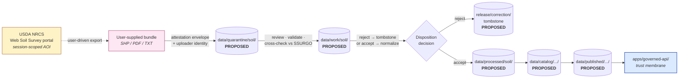

<!-- [KFM_META_BLOCK_V2]
doc_id: kfm://doc/docs-sources-catalog-nrcs-web-soil-survey
title: NRCS Web Soil Survey (WSS)
type: product-page
version: v0.2
status: draft
owners: <PLACEHOLDER — Docs steward + Source steward for `nrcs`>
created: 2026-05-20
updated: 2026-05-22
policy_label: public
related:
  - docs/sources/catalog/nrcs/README.md
  - docs/sources/catalog/nrcs/SSURGO.md
  - docs/sources/catalog/nrcs/SOIL-DATA-ACCESS.md
  - docs/sources/catalog/README.md
  - docs/sources/catalog/IDENTITY.md
  - docs/sources/catalog/RIGHTS-AND-SENSITIVITY-MAP.md
  - docs/doctrine/directory-rules.md
  - data/registry/sources/
  - policy/sensitivity/
tags: [kfm, docs, sources, catalog, nrcs, soil, wss, web-soil-survey]
notes:
  - "PROPOSED product-page scaffold; sibling-link presence verified in a Claude Code session, not in a mounted repo."
  - "Path `docs/sources/catalog/nrcs/WEB-SOIL-SURVEY.md` is PROPOSED; Directory Rules treat `docs/sources/` as a documentation lane and `data/registry/sources/` as the authoritative SourceDescriptor home."
  - "WSS is NOT currently listed as a recognized KFM source family in [DOM-SOIL] §D (which lists NRCS SSURGO, USDA NRCS Soil Data Access, NRCS gSSURGO, NRCS gNATSGO, Kansas Mesonet, NRCS SCAN, NOAA USCRN, NASA SMAP). KFM disposition for WSS is UNRESOLVED and OPEN for ADR. This page documents the question, not a confirmed ingest."
[/KFM_META_BLOCK_V2] -->

# NRCS Web Soil Survey (WSS)

> Product page for the **USDA NRCS Web Soil Survey (WSS)** — the *user-facing, AOI-driven, session-scoped web portal* for browsing and exporting SSURGO/STATSGO soil data. **WSS is NOT currently listed among KFM's recognized soil source families.** This page records the **open disposition question** for WSS, the candidate dispositions, and the cross-references reviewers will need to settle it.

<!-- TODO: replace placeholder Shields.io badges with generator-emitted trust / gate / freshness / source-role badges per KFM-P3-FEAT-0005 — but only after disposition resolves. -->

**Status:** PROPOSED — scaffold only · **disposition UNRESOLVED** ·
**Family:** [`nrcs`](./README.md) ·
**Sibling products:** [`SSURGO.md`](./SSURGO.md) *(canonical static vector)* · [`SOIL-DATA-ACCESS.md`](./SOIL-DATA-ACCESS.md) *(programmatic API)* ·
**Domain segment:** `soil` (per Directory Rules §4 Step 3) ·
**Owners:** *PLACEHOLDER — Docs steward + Source steward for `nrcs`* ·
**Last reviewed:** 2026-05-22

> [!CAUTION]
> **WSS does not appear in `[DOM-SOIL]` §D source-family table.** The recognized NRCS soil source families per Atlas v1.1 are **NRCS SSURGO**, **USDA NRCS Soil Data Access (SDA)**, **NRCS gSSURGO**, and **NRCS gNATSGO** (alongside non-NRCS soil families). Treating WSS as a KFM ingest target without an ADR would create a **PROPOSED-as-PUBLISHED anti-pattern**. Resolve the disposition (§4) **before** writing a `SourceDescriptor` for WSS. CONFIRMED absence per Atlas v1.1 + Pass 23/32 `[DOM-SOIL]` §D.

---

## Mini-TOC

1. [Scope and the disposition question](#1-scope-and-the-disposition-question)
2. [Repo fit](#2-repo-fit)
3. [How WSS relates to SSURGO and SDA](#3-how-wss-relates-to-ssurgo-and-sda)
4. [Disposition options for review (ADR-class)](#4-disposition-options-for-review-adr-class)
5. [If ingested — pipeline shape (conditional diagram)](#5-if-ingested--pipeline-shape-conditional-diagram)
6. [Catalog profiles used (conditional)](#6-catalog-profiles-used-conditional)
7. [Collection identity (conditional)](#7-collection-identity-conditional)
8. [Provenance and citation handling](#8-provenance-and-citation-handling)
9. [Rights and sensitivity](#9-rights-and-sensitivity)
10. [Validation and catalog closure (conditional)](#10-validation-and-catalog-closure-conditional)
11. [Related contracts and schemas](#11-related-contracts-and-schemas)
12. [Open questions](#12-open-questions)
13. [Related docs](#13-related-docs)

---

## 1. Scope and the disposition question

**WSS** (USDA NRCS Web Soil Survey) is an **interactive web portal** that lets a human user define an Area of Interest (AOI), browse soil information for that AOI, and export interpretive reports and data extracts in PDF and tabular/spatial form. The portal's underlying soil records derive from the **same SSURGO source-of-record** that the `SSURGO` and `SOIL-DATA-ACCESS` sibling products describe. NEEDS VERIFICATION of current portal capabilities, endpoint URL, export formats, session limits, and acceptable-use terms.

> [!IMPORTANT]
> The **central question** this page exists to surface is: **does KFM treat WSS as a source family at all?** Three honest answers are possible: (a) treat as a recognized ingest source with its own `SourceDescriptor`, (b) treat as a **reference / link-out surface only** with no descriptor, or (c) treat as a **candidate-evidence intake** for user-supplied AOI exports. Each disposition has different repo, catalog, and policy consequences (§4).

Until the disposition is resolved, **everything in this page is PROPOSED**, including whether the page itself should remain.

[↑ Back to top](#top)

---

## 2. Repo fit

**Proposed home:** `docs/sources/catalog/nrcs/WEB-SOIL-SURVEY.md` — a **PROPOSED** documentation lane. The path is appropriate for *documenting a question*; it does **not** assert WSS as a source family.

> [!IMPORTANT]
> Per **Directory Rules** §4 Steps 1–5, the *human-facing description* of an `nrcs` surface belongs under `docs/`; an authoritative `SourceDescriptor` belongs under `data/registry/sources/`. **No `SourceDescriptor` for WSS should be written until §4 disposition resolves.** Documentation existing in `docs/` does **not** by itself create an ingest pact (Directory Rules §13: *Documentation as truth* anti-pattern). CONFIRMED doctrine per `docs/doctrine/directory-rules.md` §4, §13.

[↑ Back to top](#top)

---

## 3. How WSS relates to SSURGO and SDA

WSS is best understood as a **third surface over the SSURGO source-of-record**, alongside the static bulk product (SSURGO) and the programmatic API (SDA). Each surface has a different *intended audience*, different *cadence semantics*, and different *fit-for-ingest* posture.

| Surface | Intended audience | Form | Cadence semantics | KFM ingest posture |
|---|---|---|---|---|
| **SSURGO** *(canonical static)* | Programmatic consumers | FGDB / SHP / GeoPackage bulk; tabular tables | NRCS Oct-1 annual refresh (ASR) + weekly metadata | **CONFIRMED** source family ([`SSURGO.md`](./SSURGO.md)) |
| **SDA** *(programmatic API)* | Programmatic consumers | SQL / REST query surface | Live query against the Soil Data Mart | **CONFIRMED** source family ([`SOIL-DATA-ACCESS.md`](./SOIL-DATA-ACCESS.md)) |
| **WSS** *(this page)* | **Human users** in a browser session | Interactive map UI + on-demand PDF reports + SHP/tab exports | **Session-scoped**; AOI-derived; not a polling target | **UNRESOLVED** — see §4 |

SSURGO and SDA presence in `[DOM-SOIL]` §D is CONFIRMED; the absence of WSS from that table is CONFIRMED.

> [!NOTE]
> WSS's session-scoped, AOI-driven nature is qualitatively different from SSURGO and SDA. A KFM watcher cannot meaningfully poll WSS in the same way it polls SSURGO bulk endpoints or SDA queries: there is no canonical artifact to HEAD-check across calendar time. This is the central operational reason the disposition is open. PROPOSED reasoning; NEEDS VERIFICATION against any future WSS programmatic affordances.

[↑ Back to top](#top)

---

## 4. Disposition options for review (ADR-class)

The disposition decision is **ADR-class** because it determines whether WSS gets a `SourceDescriptor`, what `source_role` it would carry, and whether it has a connector at all. PROPOSED ADR scope; cf. Directory Rules §2.4(1)/(5) on canonical-root and registry decisions.

> [!WARNING]
> **Do not pick a disposition silently in code.** Adding a `SourceDescriptor` row for WSS, or a `connectors/nrcs/wss/` module, without the ADR creates a parallel authority and is a documented anti-pattern (Directory Rules §13: *Source-proposed root layout quarantine*). CONFIRMED pattern per `KFM-P18-PROG-0042` quarantine card.

### Option A — Reference / link-out surface (no `SourceDescriptor`)

- **What it means.** WSS is documented for KFM readers who may want to use the portal **outside KFM**; KFM itself does **not** ingest from WSS.
- **Repo consequences.** This page stays under `docs/`; **no** entry in `data/registry/sources/`; **no** connector; **no** STAC Collection.
- **Pros.** Honors the absence of WSS from `[DOM-SOIL]` §D; avoids creating a duplicate surface that overlaps SSURGO and SDA; smallest blast radius.
- **Cons.** Loses the option to cite a WSS-generated PDF as evidence in a downstream claim.
- **Truth label.** PROPOSED — *currently the best-supported default*.

### Option B — Candidate-evidence intake (user-supplied AOI exports)

- **What it means.** KFM accepts user-supplied WSS export bundles as **candidate evidence** that lands in `data/quarantine/` and is reviewed before promotion. The portal itself is not polled.
- **Repo consequences.** A narrow `SourceDescriptor` with `source_role` ∈ `{candidate, observation, context}` and `role_candidate_disposition: pending`; a quarantine intake path; **no** programmatic connector; tight policy gates for user-supplied data.
- **Pros.** Captures the legitimate use case where a researcher attaches a WSS export to a claim and needs traceable provenance.
- **Cons.** Materially extends the trust membrane to user-supplied bundles; needs explicit policy and review tooling for candidate intake (Directory Rules §13: *Candidate record exposed on a public surface*).
- **Truth label.** PROPOSED — *viable but adds attack surface*.
- **Reference.** `source_role = candidate` and `role_candidate_disposition: pending` per Atlas §24.1.3 SourceDescriptor surface.

### Option C — First-class ingest source (full `SourceDescriptor` + connector)

- **What it means.** WSS is treated as a recognized source family parallel to SSURGO and SDA.
- **Repo consequences.** A full `SourceDescriptor`, a `connectors/nrcs/wss/` module, a STAC Collection, watcher cadence rules.
- **Pros.** Symmetry with SSURGO/SDA at the registry level.
- **Cons.** **Likely redundant** with SSURGO + SDA, which already cover the underlying SSURGO source-of-record. Risks the **source-role anti-collapse** rule by giving the *interactive presentation layer* equal weight with the canonical bulk and API surfaces.
- **Truth label.** PROPOSED — *not recommended without strong justification*.
- **Reference.** Atlas §24.1 source-role anti-collapse register; `KFM-P14-PROG-0034` separate-receipts rule.

[↑ Back to top](#top)

---

## 5. If ingested — pipeline shape (conditional diagram)

The diagram below applies **only if Option B or Option C is selected** in §4. It is presented for reviewer reference, **not** as a publishing commitment. PROPOSED illustration.

> [!NOTE]
> The diagram emphasizes the **quarantine-first** posture that user-supplied evidence demands. Rejected bundles become tombstones, not silent deletions, per `C5-09` Tombstones for Revocation. CONFIRMED doctrine per Pass-10 `C5-09`.

[↑ Back to top](#top)

---

## 6. Catalog profiles used (conditional)

> [!NOTE]
> This table applies **only if Option B or Option C is selected**. If Option A is chosen, **no catalog rows are created** for WSS.

| Profile | Lane (PROPOSED path) | Used by this product? | Reference |
|---|---|---|---|
| **STAC 1.1** | `data/catalog/stac/` | UNRESOLVED — depends on §4 | Pass-10 `C4-01` / `C4-02`; `KFM-P31-PROG-0004` |
| **DCAT** | `data/catalog/dcat/` | UNRESOLVED — depends on §4 | Pass-10 `C4-05` |
| **PROV-O / PROV-JSON-LD** | `data/catalog/prov/` | UNRESOLVED — depends on §4 | Pass-10 `C8-03`; `KFM-P10-PROG-0003` |
| **Domain projection** | `data/catalog/domain/soil/` | UNRESOLVED — depends on §4 | Directory Rules §4 Step 3 |

[↑ Back to top](#top)

---

## 7. Collection identity (conditional)

> [!NOTE]
> This section applies **only if Option C is selected**. Under Option A, there is no Collection. Under Option B, candidate exports live inside the SSURGO-or-soil candidate-evidence registry, not in their own Collection.

| Field | PROPOSED value | Status | Reference |
|---|---|---|---|
| Collection id pattern (Option C only) | `kfm-nrcs-wss` (per `kfm-<org>-<product>` convention) | PROPOSED — conditional | Pass-10 `C4-02` Expansion |
| Provenance namespace | `kfm:` *(vs. `ks-kfm:` — see Open Questions)* | PROPOSED — UNRESOLVED | Pass-10 `C4-01` "Tensions"; original scaffold notes `OPEN-DSC-03` (NEEDS VERIFICATION of that ID) |
| Identity rule | `source id + object role + temporal scope + normalized digest` | PROPOSED | Atlas v1.1 §E |
| Asset roles | NEEDS VERIFICATION; would need a *session-export* asset class not currently in Pass-10 `C4-01` | NEEDS VERIFICATION | confirm against `schemas/contracts/v1/source/` |

[↑ Back to top](#top)

---

## 8. Provenance and citation handling

If any KFM claim ever cites a WSS-derived artifact (a downloaded PDF report, an AOI-exported shapefile), the **citation chain** MUST traverse: `EvidenceRef → EvidenceBundle → SSURGO source-of-record + uploader identity + AOI definition + retrieval-time + WSS portal version`. The portal itself is **not** the authority; the underlying SSURGO snapshot is. PROPOSED chain; aligned with source-role anti-collapse rule (Atlas §24.1).

Standard `kfm:provenance` fields (per Pass-10 `C4-01`) still apply if any Item is ever created:

- `spec_hash` — sha256 of canonical record.
- `evidence_bundle_ref` — `kfm://evidence/<digest>`.
- `run_record_ref` — `kfm://run/<run-id>`.
- `audit_ref` — `kfm://audit/<attestation-id>`.
- `policy_digest` — sha256 of the policy bundle used at promotion.
- Per-asset `file:checksum`.

**Additional fields required for user-supplied bundles** (PROPOSED for Option B):

- `uploader_identity_ref` — link to the steward-attested uploader identity.
- `aoi_definition` — geometry + symbol + creation-time describing the user's Area of Interest.
- `wss_session_metadata` — portal version, session id (if any), retrieval timestamp.
- `source_role` — almost certainly `candidate` until reviewed.
- `role_candidate_disposition` — `pending` / `merged` / `rejected` / `quarantined`.

PROPOSED fields, not yet pinned in `schemas/contracts/v1/source/`. NEEDS VERIFICATION before adoption.

[↑ Back to top](#top)

---

## 9. Rights and sensitivity

> [!CAUTION]
> **Do not restate policy here.** Policy lives under `policy/`. This page **links** to the policy surface; it does **not** define rules. Defining rules in `docs/` is a documented anti-pattern (Directory Rules §13: *Documentation as truth*).

- **Default sensitivity tier (if ever ingested):** **T0 — Open** for the underlying SSURGO public layers (same as `SSURGO.md`). PROPOSED per sensitivity matrix in `kfm_unified_doctrine_synthesis.md` §16.
- **Fail-closed posture:** sensitive joins (e.g., private-farm operator × parcel joins) **deny** by default. CONFIRMED doctrine per Atlas `[DOM-AG]` §I.
- **User-supplied-bundle policy (Option B only):** user-supplied AOI exports require uploader identity, attestation, and steward review **before** any field they contain can be cited. PROPOSED; aligned with Atlas §24.1 candidate-disposition rules.
- **Rights status of the WSS portal itself:** **NEEDS VERIFICATION** against live NRCS terms. Common-sense expectation is `T0` since the underlying data is public, but the **interactive-export medium may carry additional terms** that the `SourceDescriptor` MUST capture explicitly.

See [`policy/sensitivity/`](../../../../policy/sensitivity/) and [`RIGHTS-AND-SENSITIVITY-MAP.md`](../RIGHTS-AND-SENSITIVITY-MAP.md) (PROPOSED siblings; NEEDS VERIFICATION of presence).

[↑ Back to top](#top)

---

## 10. Validation and catalog closure (conditional)

> [!NOTE]
> This table applies **only if Option B or Option C is selected**.

| Check | Status | Reference |
|---|---|---|
| Catalog closure across STAC + DCAT + PROV before public release | PROPOSED — required | `KFM-P26-IDEA-0007`; Pass-10 `C5-01..C5-04` Gate Matrix |
| Default-deny promotion for user-supplied candidates | PROPOSED — **required** | Pass-10 `C5-02` |
| Spec-hash-match gate (`spec_hash` recomputation) | PROPOSED | Pass-10 `C5-04` |
| Source-role anti-collapse: WSS-derived export MUST NOT be relabeled as authoritative SSURGO | PROPOSED — **required** | Atlas §24.1 |
| Cross-check vs. canonical SSURGO snapshot at the AOI | PROPOSED | derived from `[DOM-AG]` §K "PROPOSED: SSURGO/SDA lineage tests" |
| Tombstone-on-rejection for user-supplied bundles | PROPOSED — required | Pass-10 `C5-09` |
| OpenLineage required | PROPOSED — required | Pass-10 `C5-08` |

> [!IMPORTANT]
> **Promotion is a governed state transition, not a file move.** No `PUBLISHED` state without `PromotionDecision`, `EvidenceBundle`, `PolicyDecision`, and `ReleaseManifest` closure. CONFIRMED doctrine per `directory-rules.md` §0 and the doctrine synthesis.

[↑ Back to top](#top)

---

## 11. Related contracts and schemas

| Artifact | PROPOSED home | Status |
|---|---|---|
| `SourceDescriptor` (semantic contract) | `contracts/source/` | **Not created until §4 resolves** |
| `SourceDescriptor` schema (machine shape) | `schemas/contracts/v1/source/source-descriptor.json` | PROPOSED — canonical home per **ADR-0001** |
| `EvidenceBundle` schema | `schemas/contracts/v1/evidence/evidence_bundle.schema.json` | PROPOSED per `KFM-P26-PROG-0004` |
| `EvidenceRef` schema | `schemas/contracts/v1/evidence/evidence_ref.schema.json` | PROPOSED per `KFM-P26-PROG-0005` |
| Candidate-disposition fields (Option B) | `schemas/contracts/v1/source/source-descriptor.json` (extends) | PROPOSED — `role_candidate_disposition`, `uploader_identity_ref` per Atlas §24.1.3 |

All paths PROPOSED until verified against mounted-repo evidence per Directory Rules §0 and §4 Step 4.

[↑ Back to top](#top)

---

## 12. Open questions

- **OPEN — Disposition (Option A / B / C).** This is the primary blocker; nothing else in this page should advance until disposition resolves. Default-recommended: **Option A** (reference / link-out), pending an explicit use case for Option B (candidate intake).
- **OPEN — Should WSS appear in `[DOM-SOIL]` §D at all?** Atlas v1.1 §D does not list it; whether to add it is itself the disposition question.
- **OPEN — Current WSS endpoint URL, session model, and export formats.** NEEDS VERIFICATION against live publisher behavior.
- **OPEN — `nrcs:` / `kfm:` / `ks-kfm:` provenance namespace.** Pass-10 `C4-01` flags this as unresolved; pinning needed before any Collection promotion. *(Original scaffold referenced `OPEN-DSC-03` — that ID is NEEDS VERIFICATION; the underlying question is CONFIRMED open per Pass-10.)*
- **OPEN — Rights status and CARE applicability of WSS-portal exports** (distinct from the underlying SSURGO terms).
- **OPEN — If Option B is chosen, what is the minimum uploader-identity attestation?** This intersects ADR-S-09 *Reviewer role separation* and would likely need its own ADR.
- **OPEN — Verification placeholders.** Card IDs from the original scaffold (`KFM-P1-IDEA-0020`, `KFM-P22-PROG-0037`, `KFM-P27-FEAT-0003`) are recorded but NEEDS VERIFICATION against the live Idea Index Master.

[↑ Back to top](#top)

---

## 13. Related docs

- [`./README.md`](./README.md) — `nrcs` family README *(sibling)*
- [`./SSURGO.md`](./SSURGO.md) — SSURGO product page *(canonical static vector source-of-record)*
- [`./SOIL-DATA-ACCESS.md`](./SOIL-DATA-ACCESS.md) — SDA product page *(programmatic API surface)*
- [`../README.md`](../README.md) — `docs/sources/catalog/README.md` parent
- [`../IDENTITY.md`](../IDENTITY.md) — catalog-wide identity contract *(PROPOSED)*
- [`../RIGHTS-AND-SENSITIVITY-MAP.md`](../RIGHTS-AND-SENSITIVITY-MAP.md) — catalog-wide rights map *(PROPOSED)*
- [`../_examples/stac-item-example.json`](../_examples/stac-item-example.json) — canonical STAC + `kfm:provenance` example *(PROPOSED; only relevant if Option B/C is selected)*
- [`../../../doctrine/directory-rules.md`](../../../doctrine/directory-rules.md) — Directory Rules v1.2
- [`../../../domains/soil/README.md`](../../../domains/soil/README.md) — Soil domain doctrine *(NEEDS VERIFICATION of path)*
- [`../../../standards/STAC.md`](../../../standards/STAC.md) — KFM-STAC profile *(NEEDS VERIFICATION of path)*
- [`../../../standards/PROV.md`](../../../standards/PROV.md) — KFM provenance profile *(NEEDS VERIFICATION of path; PROV.md vs PROVENANCE.md naming under ADR review per Directory Rules §13.5 v1.1)*
- [`../../../adr/`](../../../adr/) — ADR directory *(an ADR is REQUIRED before progressing this page past disposition; see §4)*

> [!NOTE]
> All sibling paths in this section are **PROPOSED** until verified against mounted-repo evidence. Anchor breakage risk is **moderate** if `docs/sources/catalog/` is restructured by ADR before this draft is published.

---

**Last reviewed:** 2026-05-22 *(Claude Code product-page revision session; full-polish pass against KFM doctrine and Atlas v1.1 + Pass 23/32. Truth-label discipline: disposition surfaced as UNRESOLVED; no `SourceDescriptor` proposed in advance of ADR.)*

[↑ Back to top](#top)
