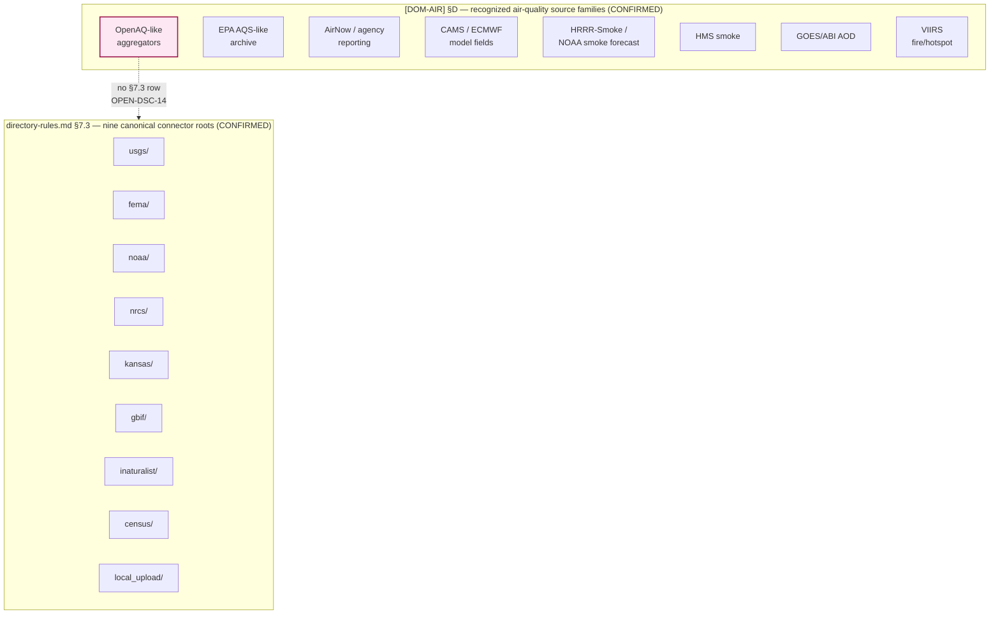

<!-- [KFM_META_BLOCK_V2]
doc_id: kfm://doc/docs-sources-catalog-openaq-readme
title: OpenAQ source family
type: readme
version: v0.2
status: draft
owners: <PLACEHOLDER — Docs steward + Source steward for `openaq`>
created: 2026-05-21
updated: 2026-05-22
policy_label: public
related:
  - docs/sources/catalog/README.md
  - docs/sources/catalog/openaq/openaq.md
  - docs/sources/catalog/IDENTITY.md
  - docs/sources/catalog/PROFILES.md
  - docs/sources/catalog/RIGHTS-AND-SENSITIVITY-MAP.md
  - docs/sources/catalog/OPEN-QUESTIONS.md
  - docs/sources/catalog/_template/SOURCE_PRODUCT_TEMPLATE.md
  - docs/doctrine/directory-rules.md
  - data/registry/sources/
  - connectors/openaq/
  - policy/sensitivity/
tags: [kfm, docs, sources, catalog, openaq, air-quality, aggregator]
notes:
  - "Family scaffolded from the connectors/ inventory; descriptions grounded in [DOM-AIR] §D and Atlas idea cards. Sibling-link presence verified in a Claude Code session, not in a mounted repo."
  - "DUAL STATUS: CONFIRMED in [DOM-AIR] §D (listed as 'OpenAQ-like aggregators'); NOT in directory-rules.md §7.3 nine canonical connector roots (`usgs/ fema/ noaa/ nrcs/ kansas/ gbif/ inaturalist/ census/ local_upload/`). Promotion of `connectors/openaq/` to §7.3 is ADR-class — see OPEN-DSC-14."
  - "OpenAQ source_role is `aggregate` per Atlas §24.1 source-role anti-collapse register; MUST NOT be relabeled as `observed` regulatory data. See §10 below."
[/KFM_META_BLOCK_V2] -->

# `openaq` source family

> Source-oriented catalog documentation for the **OpenAQ** family — an open-data platform aggregating global air-quality measurements from government and community sensors. This family folder is **CONFIRMED in `[DOM-AIR]` §D** as a recognized air-quality source family, but its connector home is **NOT in `directory-rules.md` §7.3** and awaits ADR ratification (see `OPEN-DSC-14`).

<!-- TODO: replace placeholder Shields.io badges with generator-emitted trust / gate / freshness / source-role badges per KFM-P3-FEAT-0005 once §7.3 disposition resolves. -->

**Status:** draft — PROPOSED beyond `directory-rules.md` §7.3 ·
**Owners:** *PLACEHOLDER — Docs steward + Source steward for `openaq`* ·
**Last reviewed:** 2026-05-22

> [!IMPORTANT]
> The `connectors/openaq/` folder reportedly exists as **empty stubs**; that **does not** by itself create a recognized connector family under Directory Rules. Per `SourceActivationDecision`, *"Connectors stay inactive until activation decision, fixtures, validators, and policy gates exist."* Do not light up an OpenAQ ingest pipeline until `OPEN-DSC-14` resolves. CONFIRMED doctrine per `connected-dots-architecture-brief.md` §6 and Atlas §24.1.3 SourceDescriptor surface.

---

## Mini-TOC

1. [Scope](#1-scope)
2. [Where this family fits in the repo](#2-where-this-family-fits-in-the-repo)
3. [Product pages](#3-product-pages)
4. [Family fit map (diagram)](#4-family-fit-map-diagram)
5. [The §7.3 disposition question (`OPEN-DSC-14`)](#5-the-73-disposition-question-open-dsc-14)
6. [Source authority](#6-source-authority)
7. [Source-role posture — aggregate, not authority](#7-source-role-posture--aggregate-not-authority)
8. [Catalog profiles](#8-catalog-profiles)
9. [Identity & namespaces](#9-identity--namespaces)
10. [Anti-collapse rules](#10-anti-collapse-rules)
11. [Rights & sensitivity](#11-rights--sensitivity)
12. [Validation](#12-validation)
13. [Related contracts & schemas](#13-related-contracts--schemas)
14. [Related connectors & pipelines](#14-related-connectors--pipelines)
15. [Open questions](#15-open-questions)
16. [Related docs](#16-related-docs)

---

## 1. Scope

OpenAQ is an open-data platform aggregating global air-quality measurements from government and community sensor networks. In KFM, the family is **CONFIRMED** as a recognized `[DOM-AIR]` source family but plays an **aggregator** role — it is **not** a regulatory authority and **not** a producer of authoritative AQI. Its readings derive from upstream publishers (regulatory monitors, low-cost networks) whose original source-role MUST be preserved through the catalog. CONFIRMED listing per `[DOM-AIR]` §D ("OpenAQ-like aggregators"); CONFIRMED role-disambiguation per `KFM-P13-PROG-0032` and `KFM-P13-PROG-0006`.

**What belongs in this folder**

- Family-level README (this file) describing the family, its disposition status, and its anti-collapse rules.
- Per-product pages (one Markdown file per distinct OpenAQ surface).
- Family-scope open questions linking back to `../OPEN-QUESTIONS.md`.

**What does NOT belong in this folder**

- Authoritative `SourceDescriptor` rows — those live in [`data/registry/sources/`](../../../../data/registry/sources/).
- JSON Schemas — those live under [`schemas/contracts/v1/source/`](../../../../schemas/contracts/v1/source/) per ADR-0001.
- Policy allow/deny rules — those live under [`policy/`](../../../../policy/).
- Connector code or pipeline configuration — those live under `connectors/openaq/` and `pipelines/` respectively.

[↑ Back to top](#top)

---

## 2. Where this family fits in the repo

**Proposed home:** `docs/sources/catalog/openaq/README.md` — a **PROPOSED** documentation lane.

> [!IMPORTANT]
> Per **Directory Rules** §4 Steps 1–5, the *human-facing description* of a source family belongs under `docs/`; the *authoritative `SourceDescriptor`* belongs under `data/registry/sources/`; the *connector* belongs under `connectors/<family>/` — but only after the family is named in §7.3 *or* an accepted ADR adds it. Documentation existing in `docs/` does **not** by itself create a recognized connector family (Directory Rules §13: *Documentation as truth* anti-pattern). CONFIRMED doctrine per `docs/doctrine/directory-rules.md` §4, §7.3, §13.

| Upstream / authority | This README | Downstream consumers |
|---|---|---|
| `[DOM-AIR]` §D (source-family recognition) + `data/registry/sources/` (authoritative descriptor) | `docs/sources/catalog/openaq/README.md` — family landing page | Product pages in this folder; future `connectors/openaq/`; pipelines in `pipelines/ingest/`, `pipelines/normalize/`, etc. (PROPOSED paths) |

[↑ Back to top](#top)

---

## 3. Product pages

| Page | Product | Status |
|---|---|---|
| [`openaq.md`](./openaq.md) | OpenAQ Air Quality Aggregator (primary surface) | PROPOSED — scaffold pending |

The product-page list will grow as additional OpenAQ surfaces are documented (historical archive, real-time API, station metadata). Each new page MUST conform to [`../_template/SOURCE_PRODUCT_TEMPLATE.md`](../_template/SOURCE_PRODUCT_TEMPLATE.md) (PROPOSED template; NEEDS VERIFICATION of file presence).

[↑ Back to top](#top)

---

## 4. Family fit map (diagram)

The diagram below situates `openaq` against the **nine canonical §7.3 connector roots** (CONFIRMED list per `directory-rules.md` §7.3) and the **`[DOM-AIR]` source families** (CONFIRMED list per Atlas v1.1 + Pass 23/32). It shows why the family is recognized at the *domain* layer but ungraduated at the *connector-home* layer.

The dotted edge represents the disposition gap: OpenAQ appears in the **domain** registry but has no canonical **connector** root. Resolution requires an ADR (§5).

[↑ Back to top](#top)

---

## 5. The §7.3 disposition question (`OPEN-DSC-14`)

The `directory-rules.md` §7.3 canonical connector roots are: **`usgs/ fema/ noaa/ nrcs/ kansas/ gbif/ inaturalist/ census/ local_upload/`** — nine families. CONFIRMED list per `directory-rules.md` §7.3. OpenAQ is **not** in this list. Three honest dispositions are possible:

| Option | What it means | Repo consequences | Truth label |
|---|---|---|---|
| **A — Promote `openaq` to §7.3** via ADR | Add `openaq/` as a tenth canonical connector root. | `connectors/openaq/` becomes a first-class home; `SourceDescriptor` written; product pages light up. | PROPOSED — *most consistent with `[DOM-AIR]` §D recognition.* |
| **B — Reparent OpenAQ under an existing §7.3 root** | Place the connector under a related canonical root (e.g., as `connectors/local_upload/openaq/` for user-supplied snapshots, or under a future `epa/` root *if* that were added). OpenAQ is not EPA, so `connectors/noaa/openaq/` or `connectors/usgs/openaq/` would mis-label the publishing authority. | Avoids adding a §7.3 entry; risks publisher-misattribution if the host root implies wrong authority. | PROPOSED — *operationally awkward; not recommended without a strong reason.* |
| **C — Defer ingest entirely; treat as reference only** | No connector, no descriptor; the family folder documents the OpenAQ surface for KFM readers but KFM does not ingest from it. | This README stays; **no** `SourceDescriptor`; **no** product-page implementation work beyond reference scaffolds. | PROPOSED — *honors the §7.3 absence but loses a recognized `[DOM-AIR]` source.* |

> [!WARNING]
> **Do not silently adopt** any of these options by adding files to `connectors/openaq/` or `data/registry/sources/`. The source-proposed root-layout quarantine pattern (`KFM-P18-PROG-0042` / `KFM-P19-PROG-0042` / `KFM-P22-PROG-0053`) explicitly says: source-proposed homes wait for Directory Rules / ADR review. CONFIRMED pattern per the quarantine cards.

**Recommendation (PROPOSED):** Option A — promote `openaq/` to §7.3 via ADR. Rationale: OpenAQ is already recognized in `[DOM-AIR]` §D, and reparenting under a misaligned root would either confuse publishing authority (Option B) or strand a recognized source family (Option C). The promotion ADR should reference both `[DOM-AIR]` §D recognition and the `KFM-P13-PROG-0032` source-role package.

See [`OPEN-QUESTIONS.md`](../OPEN-QUESTIONS.md) `OPEN-DSC-14` for the canonical question record.

[↑ Back to top](#top)

---

## 6. Source authority

Authoritative `SourceDescriptor` rows live in [`data/registry/sources/`](../../../../data/registry/sources/). **Do not duplicate descriptor fields in this README.** Until `OPEN-DSC-14` resolves, **no** `SourceDescriptor` for OpenAQ should be added to the registry — the source-proposed root-layout quarantine pattern applies. CONFIRMED rule per Directory Rules §13: *Documentation as truth* anti-pattern; CONFIRMED quarantine pattern per `KFM-P18-PROG-0042`.

[↑ Back to top](#top)

---

## 7. Source-role posture — `aggregate`, not authority

OpenAQ is an **aggregator** of upstream observations, not an authoritative publisher. Per Atlas §24.1.3 SourceDescriptor surface, the canonical `source_role` enum values are `observed | regulatory | modeled | aggregate | administrative | candidate | synthetic`. The correct value for OpenAQ is **`aggregate`**. PROPOSED role per Atlas §24.1; CONFIRMED role-disambiguation discipline per `KFM-P13-PROG-0032`.

| Required descriptor field | Value for OpenAQ | Status | Basis |
|---|---|---|---|
| `source_role` | **`aggregate`** | PROPOSED | Atlas §24.1.3 enum + `KFM-P13-PROG-0032` |
| `role_authority` | The original upstream publisher (per record), **not** OpenAQ | PROPOSED — required when `source_role = aggregate` | Atlas §24.1.3: *"Disambiguates the authoring authority for downstream cite text."* |
| `role_aggregation_unit` | Per-station, per-pollutant, per-time-window (record-level) | PROPOSED — required when `source_role = aggregate` | Atlas §24.1.3: *"Prevents geometry-scope drift on join."* |
| Rights status | NEEDS VERIFICATION against live OpenAQ terms | NEEDS VERIFICATION | `[DOM-AIR]` §D |
| Default sensitivity tier | **T0 — Open** (public air-quality observations) | PROPOSED | `kfm_unified_doctrine_synthesis.md` §16: "Atmosphere / Air — observed — T0/T1" |

> [!TIP]
> The `aggregate` role-tag is the discipline that **forces** every OpenAQ record to carry its original upstream publisher in `role_authority`. Without that field, a downstream consumer cannot tell whether a PM2.5 reading came from an EPA AQS regulatory monitor or a community PurpleAir sensor — a distinction that materially affects fitness-for-use. CONFIRMED design rule per Atlas §24.1.3.

[↑ Back to top](#top)

---

## 8. Catalog profiles

PROPOSED — see [`PROFILES.md`](../PROFILES.md). The KFM catalog spine is **STAC + DCAT + PROV-O** with **catalog closure** as a promotion gate (per `KFM-P26-IDEA-0007`). Per-product specifics confirm in each product page.

| Profile | Lane (PROPOSED path) | Likely usage for OpenAQ | Reference |
|---|---|---|---|
| **STAC 1.1** | `data/catalog/stac/` | PROPOSED — Yes (per-station Items under an OpenAQ Collection) | Pass-10 `C4-01` / `C4-02` |
| **DCAT** | `data/catalog/dcat/` | PROPOSED — Yes (tabular observation distributions) | Pass-10 `C4-05` |
| **PROV-O / PROV-JSON-LD** | `data/catalog/prov/` | PROPOSED — Yes (lineage to upstream publisher) | Pass-10 `C8-03` |
| **Domain projection** | `data/catalog/domain/atmosphere-air/` | PROPOSED — Yes | Directory Rules §4 Step 3 |

Asset roles, media types, and STAC extension set NEEDS VERIFICATION against `schemas/contracts/v1/source/` and the resolved STAC profile pinning.

[↑ Back to top](#top)

---

## 9. Identity & namespaces

Collection-id and namespace conventions follow [`IDENTITY.md`](../IDENTITY.md). The namespace pin (`kfm:` vs. `ks-kfm:`) is **unresolved** — see `OPEN-DSC-03` in [`OPEN-QUESTIONS.md`](../OPEN-QUESTIONS.md). CONFIRMED open question per Pass-10 `C4-01` Tensions.

**Proposed Collection-id pattern** (only after `OPEN-DSC-14` resolves to Option A): `kfm-openaq-<product>` per `kfm-<org>-<product>` convention. PROPOSED per Pass-10 `C4-02` Expansion.

[↑ Back to top](#top)

---

## 10. Anti-collapse rules

Per Atlas §24.1 source-role anti-collapse register, KFM keeps observation, regulatory, modeled, aggregate, administrative, candidate, and synthetic source roles **un-collapsed**. For OpenAQ specifically:

> [!CAUTION]
> **Do not relabel OpenAQ aggregator data as observed regulatory data.** Per `KFM-P13-PROG-0032`: *"Air-quality source packages should distinguish OpenAQ raw observations, AirNow AQI/forecast/NowCast health communications, PurpleAir low-cost raw sensors, and corrected analytical products."* Per `KFM-P13-PROG-0006`: *"KFM air-quality ingestion should keep raw PurpleAir measurements separate from EPA-corrected values, NowCast estimates, AirNow health indices, OpenAQ raw observations, and AQS validated records."* CONFIRMED rule statements per the cited cards.

| Anti-pattern | What to do instead | Authority |
|---|---|---|
| Treat an OpenAQ-relayed reading as if it were an EPA AQS regulatory observation | Preserve `role_authority` = original upstream publisher; tag `source_role = aggregate` | `KFM-P13-PROG-0032` |
| Mix OpenAQ raw observations with AirNow NowCast AQI in one publish layer | Separate layers per source role; reconciliation is a downstream derived view, not a source | `KFM-P13-PROG-0006` |
| Treat OpenAQ as an AQI authority | OpenAQ relays observations, not AQI determinations | `[DOM-AIR]` §I: *"AQI is not concentration"* |
| Skip Barkjohn-style correction when relaying PurpleAir through OpenAQ | Apply documented correction; record the correction version in the run receipt | Pass-10 `C10-02`: *"the Barkjohn correction is a published regression and is itself versioned; the version in use must be recorded in the receipt"* |
| Conflate observed_time and ingested_time | Keep both distinct on every record | `KFM-P2-IDEA-0022`: *"observed_time vs. ingested_time distinction"* |

> [!IMPORTANT]
> **Timestamp normalization MUST be deterministic across AQS, OpenAQ, and PurpleAir.** Inconsistent timestamp handling silently produces phantom "spikes" or "lulls" at the join layer. CONFIRMED concern per MapLibre Master `ML-061-091`.

[↑ Back to top](#top)

---

## 11. Rights & sensitivity

> [!CAUTION]
> **Do not restate policy here.** Policy lives under `policy/`. This README **links** to the policy surface; it does **not** define rules. Defining rules in `docs/` is a documented anti-pattern (Directory Rules §13: *Documentation as truth*).

- **Default sensitivity tier:** **T0 — Open** for public air-quality observations; stale-state badge + operational disclaimer per `kfm_unified_doctrine_synthesis.md` §16. PROPOSED.
- **Fail-closed posture:** sensitive joins fail closed per `[DOM-AIR]` §D ("sensitive joins fail closed"). CONFIRMED doctrine.
- **Aggregator-specific rights:** OpenAQ's *redistribution terms* (per its publisher) may differ from the upstream original publishers' terms. The `SourceDescriptor` rights field MUST capture **both** the aggregator terms and the upstream terms. PROPOSED requirement; NEEDS VERIFICATION against live OpenAQ terms.

See [`RIGHTS-AND-SENSITIVITY-MAP.md`](../RIGHTS-AND-SENSITIVITY-MAP.md) and [`policy/sensitivity/`](../../../../policy/sensitivity/) (PROPOSED siblings; NEEDS VERIFICATION of presence).

[↑ Back to top](#top)

---

## 12. Validation

| Check | Status | Reference |
|---|---|---|
| Markdown lint on this file | NEEDS VERIFICATION — workflow not yet wired | — |
| Link integrity against repo-relative targets | PROPOSED | — |
| Per-product page conformance to [`_template/SOURCE_PRODUCT_TEMPLATE.md`](../_template/SOURCE_PRODUCT_TEMPLATE.md) | PROPOSED | — |
| Catalog closure across STAC + DCAT + PROV before any OpenAQ promotion | PROPOSED — required (only after §7.3 disposition resolves) | `KFM-P26-IDEA-0007`; Pass-10 `C5-01..C5-04` |
| AQI-as-concentration denial test | PROPOSED — required | `[DOM-AIR]` §K |
| AOD-as-PM2.5 denial test | PROPOSED — required | `[DOM-AIR]` §K |
| model-as-observed denial test | PROPOSED — required | `[DOM-AIR]` §K |
| Low-cost sensor caveat tests (where OpenAQ relays community sensors) | PROPOSED — required | `[DOM-AIR]` §K |
| Timestamp-normalization determinism across AQS/OpenAQ/PurpleAir | PROPOSED — required | `ML-061-091` |
| Default-deny promotion | PROPOSED — required | Pass-10 `C5-02` |

[↑ Back to top](#top)

---

## 13. Related contracts & schemas

| Artifact | PROPOSED home | Status |
|---|---|---|
| `SourceDescriptor` (semantic contract) | `contracts/source/` | NEEDS VERIFICATION; **not authored until §7.3 disposition resolves** |
| `SourceDescriptor` schema (machine shape) | `schemas/contracts/v1/source/source-descriptor.json` | PROPOSED — canonical home per **ADR-0001** |
| `EvidenceBundle` schema | `schemas/contracts/v1/evidence/evidence_bundle.schema.json` | PROPOSED per `KFM-P26-PROG-0004` |
| `EvidenceRef` schema | `schemas/contracts/v1/evidence/evidence_ref.schema.json` | PROPOSED per `KFM-P26-PROG-0005` |
| Air-domain object schemas (`AirStation`, `AirObservation`, `PM2.5 Observation`, `Ozone Observation`, etc.) | `schemas/contracts/v1/domains/atmosphere-air/` | PROPOSED |

All paths PROPOSED until verified against mounted-repo evidence per Directory Rules §0 and §4 Step 4.

[↑ Back to top](#top)

---

## 14. Related connectors & pipelines

> [!NOTE]
> The original scaffold reports `connectors/openaq/` exists as **empty stubs**. Empty stubs do **not** create a §7.3 family entitlement; per `SourceActivationDecision`, the connector remains inactive until activation decision, fixtures, validators, and policy gates exist. CONFIRMED rule per `connected-dots-architecture-brief.md` §6.

| Surface | PROPOSED path | Status |
|---|---|---|
| Connector (source-specific fetcher) | `connectors/openaq/` | **Empty stub**; inactive until `OPEN-DSC-14` resolves and activation decision lands |
| Ingest pipeline | [`pipelines/ingest/`](../../../../pipelines/ingest/) | PROPOSED |
| Normalize pipeline (timestamp / units / role disambiguation) | [`pipelines/normalize/`](../../../../pipelines/normalize/) | PROPOSED per `ML-061-091`, `KFM-P13-PROG-0032` |
| Validate pipeline (role anti-collapse, AQI-as-concentration denial) | [`pipelines/validate/`](../../../../pipelines/validate/) | PROPOSED per `[DOM-AIR]` §K |
| Catalog pipeline (STAC + DCAT + PROV closure) | [`pipelines/catalog/`](../../../../pipelines/catalog/) | PROPOSED |
| Declarative pipeline spec | `pipeline_specs/atmosphere-air/` | PROPOSED per Directory Rules §7.4 |
| Watcher (HEAD-first conditional poller) | `tools/ingest/watchers/` *(illustrative)* | PROPOSED per Pass-10 `C3-01` |

[↑ Back to top](#top)

---

## 15. Open questions

- **`OPEN-DSC-14` — §7.3 promotion.** Should `openaq/` be added to the `directory-rules.md` §7.3 canonical connector roots via ADR? Recommended: yes (Option A in §5). Blocks: nothing in this family lights up until this resolves.
- **`OPEN-DSC-03` — namespace.** `kfm:` vs `ks-kfm:` is unresolved per Pass-10 `C4-01`. Blocks: Collection-id assignment.
- **OPEN — Rights status.** Confirm OpenAQ aggregator terms + upstream-publisher passthrough terms.
- **OPEN — Endpoint and cadence.** Confirm current OpenAQ endpoint URL(s), authentication posture, and recommended polling cadence.
- **OPEN — Per-product split.** Should OpenAQ surfaces be modeled as one product (current scaffold) or split (e.g., live observations, historical archive, station metadata)?
- **OPEN — Crosswalk to AQS / AirNow / PurpleAir.** Reconciliation views that join across these sources are downstream **derived** products; they MUST NOT be relabeled as authoritative OpenAQ output. CONFIRMED rule per `KFM-P13-PROG-0006`.
- **OPEN — Kansas-first coverage.** The Pass-10 `C10-02` Kansas air-quality stack names AirNow, AQS, KDHE, PurpleAir+Barkjohn, and HRRR-Smoke — **not** OpenAQ. Confirm whether OpenAQ adds Kansas coverage beyond what those sources provide, or whether OpenAQ serves a different (e.g., comparison or global-context) purpose.
- See [`OPEN-QUESTIONS.md`](../OPEN-QUESTIONS.md) for lane-wide `OPEN-DSC-*` items.

[↑ Back to top](#top)

---

## 16. Related docs

- [`./openaq.md`](./openaq.md) — OpenAQ primary product page *(PROPOSED scaffold pending)*
- [`../README.md`](../README.md) — `docs/sources/catalog/` parent
- [`../IDENTITY.md`](../IDENTITY.md) — catalog-wide identity contract *(PROPOSED)*
- [`../PROFILES.md`](../PROFILES.md) — catalog-wide profile mapping *(PROPOSED)*
- [`../RIGHTS-AND-SENSITIVITY-MAP.md`](../RIGHTS-AND-SENSITIVITY-MAP.md) — catalog-wide rights map *(PROPOSED)*
- [`../OPEN-QUESTIONS.md`](../OPEN-QUESTIONS.md) — lane-wide open question register *(includes `OPEN-DSC-03`, `OPEN-DSC-14`)*
- [`../_template/SOURCE_PRODUCT_TEMPLATE.md`](../_template/SOURCE_PRODUCT_TEMPLATE.md) — product-page template *(PROPOSED)*
- [`../../../doctrine/directory-rules.md`](../../../doctrine/directory-rules.md) — Directory Rules v1.2 *(§7.3 canonical connector roots; §13 anti-patterns)*
- [`../../../domains/atmosphere-air/README.md`](../../../domains/atmosphere-air/README.md) — atmosphere/air domain doctrine *(NEEDS VERIFICATION of path)*
- [`../../../standards/STAC.md`](../../../standards/STAC.md) — KFM-STAC profile *(NEEDS VERIFICATION of path)*
- [`../../../standards/PROV.md`](../../../standards/PROV.md) — KFM provenance profile *(NEEDS VERIFICATION of path; PROV.md vs PROVENANCE.md naming under ADR review per Directory Rules §13.5 v1.1)*
- [`../../../adr/`](../../../adr/) — ADR directory *(an ADR is REQUIRED before §7.3 promotion; see §5)*

> [!NOTE]
> All sibling paths in this section are **PROPOSED** until verified against mounted-repo evidence. Anchor breakage risk is **moderate** if `docs/sources/catalog/` is restructured by ADR before this draft is published.

---

**Last reviewed:** 2026-05-22 *(Claude Code family-README revision session; full-polish pass against KFM doctrine and Atlas v1.1 + Pass 23/32. Truth-label discipline: dual status surfaced — CONFIRMED in `[DOM-AIR]` §D, NOT in §7.3; no `SourceDescriptor` proposed in advance of ADR.)*

[↑ Back to top](#top)
