<!-- [KFM_META_BLOCK_V2]
doc_id: kfm://doc/docs-sources-catalog-openaq-openaq
title: OpenAQ Air Quality Aggregator
type: product-page
version: v0.2
status: draft
owners: <PLACEHOLDER — Docs steward + Source steward for `openaq`>
created: 2026-05-21
updated: 2026-05-22
policy_label: public
related:
  - docs/sources/catalog/openaq/README.md
  - docs/sources/catalog/README.md
  - docs/sources/catalog/IDENTITY.md
  - docs/sources/catalog/RIGHTS-AND-SENSITIVITY-MAP.md
  - docs/sources/catalog/OPEN-QUESTIONS.md
  - docs/doctrine/directory-rules.md
  - data/registry/sources/
  - connectors/openaq/
  - policy/sensitivity/
tags: [kfm, docs, sources, catalog, openaq, air-quality, aggregator]
notes:
  - "PROPOSED product-page scaffold; description grounded in [DOM-AIR] §D and Atlas idea cards (KFM-P13-PROG-0032, KFM-P13-PROG-0006, KFM-P2-IDEA-0022). Sibling-link presence verified in a Claude Code session, not in a mounted repo."
  - "OpenAQ source_role is `aggregate` per Atlas §24.1.3 — NOT `observed` and NOT `regulatory`. Anti-collapse rules apply throughout (§7)."
  - "Family-level §7.3 disposition (OPEN-DSC-14) is OPEN; until it resolves, no SourceDescriptor or connector activation should land. See the family README §5."
[/KFM_META_BLOCK_V2] -->

<a id="top"></a>

# OpenAQ Air Quality Aggregator

> Product page for the **OpenAQ open air-quality aggregator**, which relays government and community sensor measurements from many upstream publishers. OpenAQ's KFM `source_role` is **`aggregate`**, not `observed` and not `regulatory` — the original upstream publisher MUST be preserved on every record. This page is a reader-oriented orientation; it does **not** replace the authoritative `SourceDescriptor` in `data/registry/sources/`.


<!-- TODO: replace placeholder Shields.io badges with generator-emitted trust / gate / freshness / source-role badges per KFM-P3-FEAT-0005 once §7.3 disposition resolves. -->

**Status:** PROPOSED — scaffold only ·
**Family:** [`openaq`](./README.md) ·
**Domain segment:** `atmosphere-air` (per Directory Rules §4 Step 3) ·
**Owners:** *PLACEHOLDER — Docs steward + Source steward for `openaq`* ·
**Last reviewed:** 2026-05-22

> [!CAUTION]
> **Family-level disposition is unresolved.** OpenAQ is **CONFIRMED** in `[DOM-AIR]` §D as a recognized source family but **NOT** in `directory-rules.md` §7.3 canonical connector roots. Promotion of `connectors/openaq/` to §7.3 is **ADR-class** — tracked as `OPEN-DSC-14`. Empty connector stubs do **not** create entitlement; per `SourceActivationDecision`, connectors stay inactive until activation decision + fixtures + validators + policy gates exist. **See [`./README.md`](./README.md) §5 before lighting up any ingest.** <sup>CONFIRMED dual status per Atlas `[DOM-AIR]` §D + Directory Rules §7.3.</sup>

---

## Mini-TOC

1. [Scope](#1-scope)
2. [Repo fit](#2-repo-fit)
3. [Pipeline shape (diagram)](#3-pipeline-shape-diagram)
4. [Source role, cadence, and watcher posture](#4-source-role-cadence-and-watcher-posture)
5. [Anti-collapse rules](#5-anti-collapse-rules)
6. [Catalog profiles used](#6-catalog-profiles-used)
7. [Collection identity](#7-collection-identity)
8. [Provenance fields](#8-provenance-fields)
9. [Temporal handling](#9-temporal-handling)
10. [Geometry and projection](#10-geometry-and-projection)
11. [Rights and sensitivity](#11-rights-and-sensitivity)
12. [Validation and catalog closure](#12-validation-and-catalog-closure)
13. [Related contracts and schemas](#13-related-contracts-and-schemas)
14. [Related connectors and pipelines](#14-related-connectors-and-pipelines)
15. [Illustrative examples](#15-illustrative-examples)
16. [Open questions](#16-open-questions)
17. [Related docs](#17-related-docs)

---

## 1. Scope

OpenAQ is an open-data platform that aggregates global air-quality measurements from government regulatory monitors, agency reporting feeds, and community sensor networks. Inside KFM, OpenAQ's role is **aggregator** — it is **not** a regulatory authority and **not** the original observer. Its readings derive from upstream publishers whose original source-role MUST be preserved through ingest, normalize, catalog, and publish. <sup>CONFIRMED listing per `[DOM-AIR]` §D ("OpenAQ-like aggregators"); CONFIRMED role-disambiguation per `KFM-P13-PROG-0032` and `KFM-P13-PROG-0006`.</sup>

> [!NOTE]
> OpenAQ is **not** in the Pass-10 `C10-02` Kansas air-quality stack (AirNow, AQS, KDHE, PurpleAir+Barkjohn, HRRR-Smoke). Whether OpenAQ adds meaningful Kansas coverage beyond that stack, or serves a different (global-context / comparison / fill-in) purpose, is an OPEN question — see §16. <sup>CONFIRMED stack composition per Pass-10 `C10-02`.</sup>

[↑ Back to top](#top)

---

## 2. Repo fit

**Proposed home:** `docs/sources/catalog/openaq/openaq.md` — a **PROPOSED** documentation lane under the family folder.

> [!IMPORTANT]
> Per **Directory Rules** §4 Steps 1–5, the *human-facing description* of this product belongs under `docs/`; the *machine-actionable `SourceDescriptor`* belongs under `data/registry/sources/`; the *connector* belongs under `connectors/openaq/` (**only after §7.3 disposition resolves**); the *pipeline logic* belongs under `pipelines/`. **Do not duplicate descriptor fields here.** When the descriptor and this page disagree, the descriptor wins and this page MUST be updated. <sup>CONFIRMED doctrine per `docs/doctrine/directory-rules.md` §4, §5, §7, §13.</sup>

| Upstream / authority | This page | Downstream consumers |
|---|---|---|
| Original upstream publishers (regulatory monitors, agency feeds, community networks) → OpenAQ aggregator → `data/registry/sources/` (authoritative descriptor, only after §7.3 disposition) | `docs/sources/catalog/openaq/openaq.md` — reader-oriented product page | `connectors/openaq/` (empty stub today), `pipelines/ingest/`, `pipelines/normalize/`, `pipelines/catalog/`, `data/catalog/{stac,dcat,prov}/` (PROPOSED paths) |

**What belongs on this page**

- Plain-English explanation of OpenAQ as an aggregator surface within KFM.
- Cross-references to the family README, IDENTITY map, rights map, and OPEN-QUESTIONS register.
- The aggregator-specific anti-collapse rules.
- Cadence and watcher posture once the §7.3 disposition resolves.

**What does NOT belong here**

- Machine-checkable `SourceDescriptor` fields (live under `data/registry/sources/`).
- Schema / contract definitions (live under `schemas/contracts/v1/source/` per ADR-0001).
- Policy allow/deny rules (live under `policy/`).
- §7.3 promotion deliberation — that lives in the **family README** (`./README.md` §5).

[↑ Back to top](#top)

---

## 3. Pipeline shape (diagram)

```mermaid
flowchart LR
    UP1[EPA AQS-like<br/>monitors]:::ups
    UP2[Agency feeds<br/>AirNow-class]:::ups
    UP3[Community<br/>sensor networks]:::ups
    UP1 --> A[OpenAQ aggregator<br/><i>federates upstream</i>]:::ext
    UP2 --> A
    UP3 --> A
    A -->|HEAD / ETag<br/>conditional poll| W[Watcher<br/>connectors/openaq/<br/><b>PROPOSED · inactive</b>]
    W -->|EventRunReceipt<br/>+ role_authority<br/>preserved per record| RAW[(data/raw/atmosphere-air/<br/>openaq/<br/><b>PROPOSED</b>)]
    RAW -->|normalize timestamps<br/>+ units · validate role| WORK[(data/work/atmosphere-air/<br/><b>PROPOSED</b>)]
    WORK -->|anti-collapse checks<br/>AQI != concentration<br/>model != observed| PROC[(data/processed/atmosphere-air/<br/><b>PROPOSED</b>)]
    PROC -->|STAC + DCAT + PROV-O| CAT[(data/catalog/.../<br/><b>PROPOSED</b>)]
    CAT -->|PromotionDecision<br/>+ ReleaseManifest| PUB[(data/published/layers/<br/>atmosphere-air/<br/><b>PROPOSED</b>)]
    PUB --> API[apps/governed-api/<br/><i>trust membrane</i>]:::api

    classDef ups fill:#fef9c3,stroke:#854d0e,stroke-width:1px
    classDef ext fill:#fef3c7,stroke:#92400e,stroke-width:1.5px
    classDef api fill:#dbeafe,stroke:#1e40af,stroke-width:1.5px
```

The shape below is **PROPOSED** and applies **only after `OPEN-DSC-14` resolves to a connector-bearing disposition**. It emphasizes the aggregator-specific obligation: every record carries forward its **original upstream publisher** in `role_authority`. <sup>PROPOSED illustration; concrete repo paths are PROPOSED per Directory Rules §4 Step 4.</sup>



> [!NOTE]
> The diagram intentionally shows **three** upstream-publisher nodes feeding the aggregator. This is the aggregator-specific shape that distinguishes OpenAQ from a source-of-record like SSURGO. The pipeline's job is to **preserve** that publisher distinction, not erase it. <sup>CONFIRMED design rule per Atlas §24.1.3 `role_authority` field for `source_role = aggregate`.</sup>

[↑ Back to top](#top)

---

## 4. Source role, cadence, and watcher posture

| Field | Value | Status | Basis |
|---|---|---|---|
| Source family | `openaq` (recognized as "OpenAQ-like aggregators") | CONFIRMED | `[DOM-AIR]` §D Atlas v1.1 |
| §7.3 connector root | **Not in §7.3**; promotion ADR-class (`OPEN-DSC-14`) | CONFIRMED absence | `directory-rules.md` §7.3 |
| `source_role` | **`aggregate`** | PROPOSED — required | Atlas §24.1.3 enum + `KFM-P13-PROG-0032` |
| `role_authority` | The **original upstream publisher** per record (not OpenAQ) | PROPOSED — **MUST when `source_role = aggregate`** | Atlas §24.1.3 |
| `role_aggregation_unit` | per-station × per-pollutant × per-time-window | PROPOSED — **MUST when `source_role = aggregate`** | Atlas §24.1.3 |
| Rights status | Aggregator terms + upstream-publisher passthrough terms | NEEDS VERIFICATION | `[DOM-AIR]` §D |
| Default sensitivity tier | **T0/T1 — Open** (with stale-state badge + operational disclaimer) | PROPOSED | `kfm_unified_doctrine_synthesis.md` §16 |
| Watcher cadence (real-time class) | If relaying AirNow-class NowCast: **5–15 min** | PROPOSED | `KFM-P2-PROG-0003` for the analogous AirNow cadence |
| Watcher cadence (validated class) | If relaying AQS-class finalized data: **daily metadata, monthly finalized** | PROPOSED | `KFM-P2-PROG-0003` for the analogous AQS cadence |
| HTTP validators | Persist `ETag` + `Last-Modified`; use `If-None-Match` / `If-Modified-Since` | PROPOSED | Pass-10 `C3-01`; `KFM-P21-IDEA-0005` |
| Materiality triggers | Source version change · station roster delta · per-pollutant numeric-median delta | PROPOSED | derived from `ML-063-014` materiality pattern |

> [!TIP]
> The `aggregate` role-tag is the discipline that **forces** every OpenAQ record to carry its original upstream publisher in `role_authority`. Without that field, a downstream consumer cannot tell whether a PM2.5 reading came from an EPA AQS regulatory monitor or a community PurpleAir sensor — a distinction that materially affects fitness-for-use. <sup>CONFIRMED design rule per Atlas §24.1.3.</sup>

> [!WARNING]
> **Real-time and validated cadences MUST emit separate receipts.** Mixing AirNow-class preliminary readings (relayed via OpenAQ) with AQS-class finalized readings (also relayed via OpenAQ) in one receipt envelope hides the preliminary-vs-final distinction. <sup>PROPOSED per the analogous `KFM-P14-PROG-0034` SDA-vs-ASR receipt-envelope split.</sup>

[↑ Back to top](#top)

---

## 5. Anti-collapse rules

Per Atlas §24.1 source-role anti-collapse register, KFM keeps `observed`, `regulatory`, `modeled`, `aggregate`, `administrative`, `candidate`, and `synthetic` source roles **un-collapsed**. OpenAQ is especially exposed to collapse risk because it relays records that *look like* observed data but were originally published by different authorities with different fitness-for-use claims.

> [!CAUTION]
> **Do not relabel OpenAQ aggregator data as observed regulatory data.** Per `KFM-P13-PROG-0032`: *"Air-quality source packages should distinguish OpenAQ raw observations, AirNow AQI/forecast/NowCast health communications, PurpleAir low-cost raw sensors, and corrected analytical products."* Per `KFM-P13-PROG-0006`: *"KFM air-quality ingestion should keep raw PurpleAir measurements separate from EPA-corrected values, NowCast estimates, AirNow health indices, OpenAQ raw observations, and AQS validated records."* <sup>CONFIRMED rule statements per the cited cards.</sup>

| Anti-pattern | What to do instead | Authority |
|---|---|---|
| Treat an OpenAQ-relayed PM2.5 reading as an EPA AQS regulatory observation | Preserve `role_authority` = original upstream publisher; tag `source_role = aggregate` | `KFM-P13-PROG-0032` |
| Mix OpenAQ raw observations with AirNow NowCast AQI in one publish layer | Separate layers per source role; reconciliation is a downstream **derived** view, not a source | `KFM-P13-PROG-0006` |
| Treat OpenAQ as an AQI authority | OpenAQ relays observations, not AQI determinations | `[DOM-AIR]` §I: *"AQI is not concentration"* |
| Skip Barkjohn-style correction when relaying PurpleAir through OpenAQ | Apply documented correction; record the correction version in the run receipt | Pass-10 `C10-02` |
| Treat OpenAQ-relayed AOD as PM2.5 | `[DOM-AIR]` §I: *"AOD is not PM2.5"* — never substitute | `[DOM-AIR]` §I |
| Treat a CAMS-class model field relayed through OpenAQ as an observed reading | `[DOM-AIR]` §I: *"model fields are not observations"* | `[DOM-AIR]` §I |
| Conflate `observed_time` and `ingested_time` | Keep both distinct on every record | `KFM-P2-IDEA-0022` |

> [!IMPORTANT]
> **Timestamp normalization MUST be deterministic across AQS, OpenAQ, and PurpleAir.** Inconsistent timestamp handling silently produces phantom "spikes" or "lulls" at the join layer. <sup>CONFIRMED concern per MapLibre Master `ML-061-091`.</sup>

[↑ Back to top](#top)

---

## 6. Catalog profiles used

KFM threads three catalog profiles through every promoted dataset family: **STAC** for spatiotemporal assets, **DCAT** for dataset-level metadata, and **PROV-O** for lineage. **Catalog closure** across all three is a promotion gate, not a discovery feature. <sup>CONFIRMED doctrine per `kfm_unified_doctrine_synthesis.md` and Pass-10 `C4-01..C4-05`, `KFM-P26-IDEA-0007`.</sup>

| Profile | Lane (PROPOSED path) | Used by this product? | Reference |
|---|---|---|---|
| **STAC 1.1** | `data/catalog/stac/` | PROPOSED — Yes (per-station Items under an OpenAQ Collection) | Pass-10 `C4-01` / `C4-02`; `KFM-P31-PROG-0004` |
| **DCAT** | `data/catalog/dcat/` | PROPOSED — Yes (tabular observation distributions) | Pass-10 `C4-05`; `KFM-P32-IDEA-0005` |
| **PROV-O / PROV-JSON-LD** | `data/catalog/prov/` | PROPOSED — Yes (lineage to original upstream publisher) | Pass-10 `C8-03`; `KFM-P10-PROG-0003` |
| **Domain projection** | `data/catalog/domain/atmosphere-air/` | PROPOSED — Yes | Directory Rules §4 Step 3 |

> [!IMPORTANT]
> The **PROV-O lineage chain** for any OpenAQ-relayed record MUST trace: `KFM record → OpenAQ → original upstream publisher (e.g., EPA AQS, AirNow, PurpleAir)`. A two-step lineage that collapses OpenAQ into "the source" is an anti-collapse violation. <sup>PROPOSED rule; CONFIRMED basis per Atlas §24.1.3 `role_authority` discipline.</sup>

[↑ Back to top](#top)

---

## 7. Collection identity

| Field | PROPOSED value | Status | Reference |
|---|---|---|---|
| Collection id pattern (post-§7.3 disposition) | `kfm-openaq-observations` (per `kfm-<org>-<product>` convention) | PROPOSED — conditional | Pass-10 `C4-02` Expansion |
| Provenance namespace | `kfm:` *(vs. `ks-kfm:` — see Open Questions)* | PROPOSED — UNRESOLVED | Pass-10 `C4-01` "Tensions"; `OPEN-DSC-03` |
| Identity rule | `source id + role_authority + object role + temporal scope + normalized digest` (PROPOSED deterministic basis; **note `role_authority` inclusion**) | PROPOSED | Atlas §24.1.3; aggregator-specific |
| Asset roles | NEEDS VERIFICATION — confirm against `schemas/contracts/v1/source/` | NEEDS VERIFICATION | — |

> [!NOTE]
> Collection ids are the **stable handle** that Items reference. Renaming a Collection breaks links throughout the catalog. Pin the id at admission; route renames through ADR + supersession. <sup>CONFIRMED design caution per Pass-10 `C4-02`.</sup>

See [`IDENTITY.md`](../IDENTITY.md) for the cross-product identity contract (PROPOSED sibling; NEEDS VERIFICATION of file presence).

[↑ Back to top](#top)

---

## 8. Provenance fields

Each STAC Item carries a `properties.kfm:provenance` block. Per-asset integrity is recorded via `file:checksum`. <sup>CONFIRMED schema shape per Pass-10 `C4-01`.</sup>

| Field | Type | Resolves to | Status |
|---|---|---|---|
| `spec_hash` | `sha256` of canonical (JCS) record | content-addressed identity | CONFIRMED field per `C4-01` / PROPOSED implementation |
| `evidence_bundle_ref` | `kfm://evidence/<digest>` | `EvidenceBundle` (JSON-LD) | CONFIRMED field per `C4-01` |
| `run_record_ref` | `kfm://run/<run-id>` | `RunReceipt` | CONFIRMED field per `C4-01` |
| `audit_ref` | `kfm://audit/<attestation-id>` | SLSA / OPA attestation | CONFIRMED field per `C4-01` |
| `policy_digest` | `sha256` of the policy bundle used at promotion | `PolicyDecision` lineage | CONFIRMED field per `C4-01` |
| *(per-asset)* `file:checksum` | per-file integrity hash | STAC `file` extension | CONFIRMED field per `C4-01` |

**KFM-namespaced STAC extension fields** (also carried, per `KFM-P3-IDEA-0004`):

- `kfm:run_receipt_ref` — link to the receipt that produced the artifact.
- `kfm:proof_ref` — link to the DSSE proof when one exists.
- `kfm:trust_class` — one of `receipt`, `proof`, `catalog`, `publication`.
- `kfm:source_role` — `aggregate` for OpenAQ (see §4).

**Aggregator-specific additional fields** (PROPOSED — required when `source_role = aggregate`):

- `kfm:role_authority` — original upstream publisher per record (e.g., `EPA-AQS`, `AirNow`, `PurpleAir`).
- `kfm:role_aggregation_unit` — per-station × per-pollutant × per-time-window descriptor.
- `kfm:aggregator_relay_metadata` — OpenAQ portal/API version, retrieval timestamp, station id at OpenAQ.
- `kfm:correction_version` — when relaying corrected community-sensor data (e.g., Barkjohn correction version applied to PurpleAir relays). <sup>PROPOSED per Pass-10 `C10-02`: *"the Barkjohn correction is a published regression and is itself versioned; the version in use must be recorded in the receipt."*</sup>

<sup>PROPOSED extensions not yet pinned in `schemas/contracts/v1/source/`. NEEDS VERIFICATION before adoption.</sup>

[↑ Back to top](#top)

---

## 9. Temporal handling

KFM keeps **source**, **observed**, **valid**, **retrieval**, **release**, and **correction** times distinct where material. For OpenAQ, the **`observed_time` vs. `ingested_time`** distinction is especially important because the aggregator may relay records hours after the upstream publisher recorded them. <sup>CONFIRMED rule per `KFM-P2-IDEA-0022`: *"Both are ingested with explicit observed_time vs. ingested_time distinction."*</sup>

| Time class | Meaning for OpenAQ-relayed records | Status |
|---|---|---|
| Source time | Original upstream publisher's publication/version date | NEEDS VERIFICATION per upstream feed |
| Observed time | The instant the upstream sensor recorded the reading | CONFIRMED requirement per `KFM-P2-IDEA-0022` |
| Valid time | The averaging window the reading represents (1-hour, 24-hour, etc.) | PROPOSED — required for AQS-class aggregates |
| Retrieval time | When KFM fetched the relay from OpenAQ | CONFIRMED requirement |
| Ingested time | When OpenAQ ingested the upstream reading into its aggregator | NEEDS VERIFICATION — distinct from KFM retrieval |
| Release time | When KFM promoted the derived product | CONFIRMED requirement |
| Correction time | When a `CorrectionNotice` was issued (if any) | CONFIRMED requirement |

> [!WARNING]
> **Real-time AirNow-class relays may be revised** when AQS-class finalized data lands. Track revisions explicitly with `supersedes` pointers; do not silently overwrite. <sup>CONFIRMED rule per `KFM-P2-IDEA-0022` Tensions: *"AirNow real-time data may be revised in subsequent AQS publications; the corpus directs that revisions be tracked explicitly with supersedes pointers."*</sup>

[↑ Back to top](#top)

---

## 10. Geometry and projection

OpenAQ records are **point observations** at station coordinates. Concrete CRS, generalization rules, and scale-band behavior NEEDS VERIFICATION against live publisher behavior and `data/catalog/` artifacts.

- **Station coordinates** carry uncertainty inherited from the upstream publisher. Document the uncertainty class in the `SourceDescriptor` rather than assuming sub-meter precision. <sup>PROPOSED.</sup>
- **Materiality gates** apply to station-roster delta (new / moved / removed stations) and per-pollutant numeric-median delta. <sup>PROPOSED per `ML-063-014` materiality pattern.</sup>
- **No silent resampling** of point observations onto a grid — gridded outputs MUST tag the source resolution and aggregation method. <sup>CONFIRMED design caution per Pass-10 `C10-01` (the analogous rule for the multi-resolution soil stack).</sup>

[↑ Back to top](#top)

---

## 11. Rights and sensitivity

> [!CAUTION]
> **Do not restate policy here.** Policy lives under `policy/`. This page **links** to the policy surface; it does **not** define rules. Defining rules in `docs/` is a documented anti-pattern (Directory Rules §13: *Documentation as truth*).

- **Default sensitivity tier:** **T0/T1 — Open** for public air-quality observations; stale-state badge + operational disclaimer required per `kfm_unified_doctrine_synthesis.md` §16. <sup>PROPOSED.</sup>
- **Fail-closed posture:** sensitive joins fail closed per `[DOM-AIR]` §D: *"sensitive joins fail closed."* <sup>CONFIRMED doctrine.</sup>
- **Aggregator-specific rights:** OpenAQ's **redistribution terms** (per its publisher) may differ from upstream publishers' terms. The `SourceDescriptor` rights field MUST capture **both** the aggregator terms and the upstream terms. A redistribution-permitted aggregator does **not** grant the user redistribution rights on every upstream feed it relays. <sup>PROPOSED requirement; NEEDS VERIFICATION against live OpenAQ terms.</sup>
- **Rights status of OpenAQ itself:** NEEDS VERIFICATION against live publisher terms; record this in the `SourceDescriptor` only after `OPEN-DSC-14` resolves.

See [`policy/sensitivity/`](../../../../policy/sensitivity/) and [`RIGHTS-AND-SENSITIVITY-MAP.md`](../RIGHTS-AND-SENSITIVITY-MAP.md) (PROPOSED siblings; NEEDS VERIFICATION of presence).

[↑ Back to top](#top)

---

## 12. Validation and catalog closure

| Check | Status | Reference |
|---|---|---|
| Catalog closure across STAC + DCAT + PROV before public release | PROPOSED — required | `KFM-P26-IDEA-0007`; Pass-10 `C5-01..C5-04` |
| Default-deny promotion | PROPOSED — required | Pass-10 `C5-02` |
| Spec-hash-match gate (`spec_hash` recomputation) | PROPOSED | Pass-10 `C5-04` |
| OpenLineage required | PROPOSED — required | Pass-10 `C5-08` |
| **Source-role anti-collapse: OpenAQ relay MUST NOT be relabeled `observed`/`regulatory`** | PROPOSED — **required** | Atlas §24.1; `KFM-P13-PROG-0032` |
| **`role_authority` non-null when `source_role = aggregate`** | PROPOSED — **required** | Atlas §24.1.3 |
| AQI-as-concentration denial test | PROPOSED — required | `[DOM-AIR]` §K |
| AOD-as-PM2.5 denial test | PROPOSED — required | `[DOM-AIR]` §K |
| Model-as-observed denial test | PROPOSED — required | `[DOM-AIR]` §K |
| Low-cost sensor caveat tests (when OpenAQ relays community sensors) | PROPOSED — required | `[DOM-AIR]` §K |
| Timestamp-normalization determinism across AQS/OpenAQ/PurpleAir | PROPOSED — required | `ML-061-091` |
| `observed_time` vs `ingested_time` distinction preserved | PROPOSED — required | `KFM-P2-IDEA-0022` |
| `supersedes` pointer on revised real-time relays | PROPOSED — required | `KFM-P2-IDEA-0022` Tensions |
| Barkjohn-correction version pinned in receipt (when relaying PurpleAir) | PROPOSED — required | Pass-10 `C10-02` |

> [!IMPORTANT]
> **Promotion is a governed state transition, not a file move.** No `PUBLISHED` state without `PromotionDecision`, `EvidenceBundle`, `PolicyDecision`, and `ReleaseManifest` closure. <sup>CONFIRMED doctrine per `directory-rules.md` §0 and the doctrine synthesis.</sup>

[↑ Back to top](#top)

---

## 13. Related contracts and schemas

| Artifact | PROPOSED home | Status |
|---|---|---|
| `SourceDescriptor` (semantic contract) | `contracts/source/` | **Not authored until `OPEN-DSC-14` resolves** |
| `SourceDescriptor` schema (machine shape) | `schemas/contracts/v1/source/source-descriptor.json` | PROPOSED — canonical home per **ADR-0001** |
| `EvidenceBundle` schema | `schemas/contracts/v1/evidence/evidence_bundle.schema.json` | PROPOSED per `KFM-P26-PROG-0004` |
| `EvidenceRef` schema | `schemas/contracts/v1/evidence/evidence_ref.schema.json` | PROPOSED per `KFM-P26-PROG-0005` |
| KFM-STAC profile contract | `schemas/contracts/v1/catalog/stac/` | PROPOSED per `KFM-P31-PROG-0004` |
| Air-domain object schemas (`AirStation`, `AirObservation`, `PM2.5 Observation`, `Ozone Observation`) | `schemas/contracts/v1/domains/atmosphere-air/` | PROPOSED |
| Aggregator-extension descriptor fields (`role_authority`, `role_aggregation_unit`, `aggregator_relay_metadata`) | `schemas/contracts/v1/source/source-descriptor.json` (extends) | PROPOSED per Atlas §24.1.3 |

<sup>All paths PROPOSED until verified against mounted-repo evidence per Directory Rules §0 and §4 Step 4.</sup>

[↑ Back to top](#top)

---

## 14. Related connectors and pipelines

> [!NOTE]
> `connectors/openaq/` reportedly exists as **empty stubs**. Empty stubs do **not** create a §7.3 family entitlement; per `SourceActivationDecision`, the connector remains inactive until activation decision + fixtures + validators + policy gates exist. **Do not light up the connector before `OPEN-DSC-14` resolves.** <sup>CONFIRMED rule per `connected-dots-architecture-brief.md` §6.</sup>

| Surface | PROPOSED path | Status |
|---|---|---|
| Connector (source-specific fetcher) | `connectors/openaq/` | **Empty stub**; inactive until activation decision |
| Ingest pipeline | `pipelines/ingest/` | PROPOSED |
| Normalize pipeline (timestamps, units, **role-authority preservation**) | `pipelines/normalize/` | PROPOSED per `ML-061-091`, `KFM-P13-PROG-0032` |
| Validate pipeline (role anti-collapse, AQI/AOD/model denials) | `pipelines/validate/` | PROPOSED per `[DOM-AIR]` §K |
| Catalog pipeline (STAC + DCAT + PROV closure) | `pipelines/catalog/` | PROPOSED |
| Declarative pipeline spec | `pipeline_specs/atmosphere-air/` | PROPOSED per Directory Rules §7.4 |
| Watcher (HEAD-first conditional poller) | `tools/ingest/watchers/` *(illustrative)* | PROPOSED per Pass-10 `C3-01` |

[↑ Back to top](#top)

---

## 15. Illustrative examples

> [!NOTE]
> Examples below are **illustrative**. They are not authoritative fixtures and MUST NOT be treated as proof of implementation. The canonical example sibling is [`docs/sources/catalog/_examples/stac-item-example.json`](../_examples/stac-item-example.json) (PROPOSED; NEEDS VERIFICATION of file presence).

<details>
<summary><strong>Minimal STAC Item shape for an OpenAQ-relayed observation</strong> · click to expand</summary>

```json
{
  "type": "Feature",
  "stac_version": "1.1.0",
  "id": "kfm-openaq-<station-id>-<pollutant>-<observed-ts>-<digest>",
  "collection": "kfm-openaq-observations",
  "properties": {
    "datetime": "<observed_time>",
    "kfm:provenance": {
      "spec_hash": "sha256:<...>",
      "evidence_bundle_ref": "kfm://evidence/<digest>",
      "run_record_ref": "kfm://run/<run-id>",
      "audit_ref": "kfm://audit/<attestation-id>",
      "policy_digest": "sha256:<...>"
    },
    "kfm:run_receipt_ref": "kfm://run/<run-id>",
    "kfm:proof_ref": "kfm://proof/<dsse-id>",
    "kfm:trust_class": "publication",
    "kfm:source_role": "aggregate",
    "kfm:role_authority": "EPA-AQS",
    "kfm:role_aggregation_unit": "station=<id>,pollutant=pm25,window=1h",
    "kfm:aggregator_relay_metadata": {
      "aggregator": "OpenAQ",
      "aggregator_station_id": "<...>",
      "retrieval_time": "<...>",
      "ingested_time_at_aggregator": "<...>"
    },
    "kfm:correction_version": null,
    "kfm:observed_time": "<...>",
    "kfm:ingested_time": "<...>",
    "kfm:supersedes": null
  },
  "assets": {
    "observations_parquet": {
      "href": "<...>.parquet",
      "type": "application/x-parquet",
      "roles": ["data"],
      "file:checksum": "<multihash>"
    }
  },
  "links": [
    { "rel": "collection",  "href": "../collection.json" },
    { "rel": "attestation", "href": "kfm://evidence/<digest>" }
  ]
}
```

<sup>Shape is illustrative; field set follows Pass-10 `C4-01` and `KFM-P3-IDEA-0004`. Aggregator-specific properties (`kfm:role_authority`, `kfm:role_aggregation_unit`, `kfm:aggregator_relay_metadata`, `kfm:correction_version`, `kfm:observed_time`, `kfm:ingested_time`, `kfm:supersedes`) are PROPOSED and not yet pinned in a STAC extension. The `rel: "attestation"` link is PROPOSED per `KFM-P7-PROG-0001` and not a registered STAC link relation.</sup>

</details>

<details>
<summary><strong>Anti-collapse denial — illustrative validator output</strong> · click to expand</summary>

```text
# PROPOSED validator decision-envelope shape (illustrative)
# References: Atlas §24.1, KFM-P13-PROG-0032, [DOM-AIR] §K

validation_report:
  - check: source_role_anti_collapse
    result: DENY
    reason: "candidate record sets source_role=observed for OpenAQ relay; required source_role=aggregate"
    inputs:
      stac_id: "kfm-openaq-<...>"
      source_role_claimed: "observed"
      source_role_required: "aggregate"
    obligation: "rewrite source_role and populate role_authority from upstream publisher"
    target_lifecycle_state: "QUARANTINE"

  - check: role_authority_non_null
    result: DENY
    reason: "role_authority is null on aggregate-role record"
    inputs:
      stac_id: "kfm-openaq-<...>"
    obligation: "populate role_authority from upstream publisher metadata"
    target_lifecycle_state: "QUARANTINE"

  - check: aqi_as_concentration_denial
    result: ALLOW
    reason: "candidate carries concentration units, not AQI bucket"

  - check: observed_vs_ingested_time
    result: ABSTAIN
    reason: "ingested_time_at_aggregator missing; cannot prove distinction"
    target_lifecycle_state: "HOLD"
```

<sup>Pseudocode; not a runnable validator output. Real implementation lives in `pipelines/validate/` and `tools/validators/` (PROPOSED). Decision-envelope finite outcomes (`ALLOW`/`DENY`/`ABSTAIN`/`ERROR`) per Atlas §24.1.</sup>

</details>

<details>
<summary><strong>Watcher cadence — conditional poll sketch</strong> · click to expand</summary>

```text
# PROPOSED OpenAQ watcher contract (illustrative pseudocode)
# References: KFM-P21-IDEA-0005, Pass-10 C3-01, KFM-P2-PROG-0003

# Real-time class (when OpenAQ relays AirNow-class NowCast): 5-15 min cadence
HEAD <openaq_endpoint>
  If-None-Match: "<stored_etag>"
  If-Modified-Since: "<stored_last_modified>"

if status == 304:
    emit EventRunReceipt {
        result: "no_change",
        validators_checked: ["etag", "last_modified"]
    }
elif status == 200:
    fetch_payload()
    # ALWAYS preserve role_authority per record
    for record in payload:
        record.role_authority = upstream_publisher_of(record)
        record.observed_time = record.upstream_observed_time
        record.ingested_time_at_aggregator = record.openaq_ingested_time
    emit EventRunReceipt {
        result: "change_detected",
        validators_checked: ["etag", "last_modified"],
        records_relayed: len(payload),
        role_authorities_seen: distinct(r.role_authority for r in payload)
    }

# Validated class (when OpenAQ relays AQS-class finalized data): daily metadata, monthly finalized
# Emit SEPARATE receipts under SEPARATE cadence rules
```

<sup>Pseudocode; not a runnable recipe. The real-time-vs-validated receipt-envelope split mirrors the SDA-vs-ASR split rule from `KFM-P14-PROG-0034`.</sup>

</details>

[↑ Back to top](#top)

---

## 16. Open questions

- **OPEN — `OPEN-DSC-14` family disposition.** Promote `openaq/` to `directory-rules.md` §7.3? See [`./README.md`](./README.md) §5. **Nothing in this product page proceeds until this resolves.**
- **OPEN — Kansas-first relevance.** OpenAQ is **not** in the Pass-10 `C10-02` Kansas air-quality stack (AirNow, AQS, KDHE, PurpleAir+Barkjohn, HRRR-Smoke). Confirm whether OpenAQ adds Kansas coverage beyond that stack, or serves a different purpose (global comparison, fill-in for stations missing from AirNow/AQS).
- **OPEN — `OPEN-DSC-03` namespace.** `kfm:` vs `ks-kfm:` is unresolved per Pass-10 `C4-01` Tensions.
- **OPEN — Endpoint URL(s), authentication posture, recommended polling cadence.** NEEDS VERIFICATION against live publisher behavior. Defer until `OPEN-DSC-14` resolves.
- **OPEN — Rights status and CARE applicability.** Aggregator terms + per-upstream-publisher passthrough terms.
- **OPEN — Per-upstream `role_authority` vocabulary.** A controlled list of allowed `role_authority` values (e.g., `EPA-AQS`, `AirNow`, `PurpleAir`, `KDHE`, etc.) should be pinned to prevent free-text drift. Where does this vocabulary live? <sup>PROPOSED — likely `control_plane/` or `contracts/source/`.</sup>
- **OPEN — Real-time vs validated receipt-envelope split.** Confirm whether OpenAQ's mixed real-time + validated relay model should be split at the connector layer or at the catalog layer.
- **OPEN — Correction-version vocabulary.** When OpenAQ relays PurpleAir, which corrections (Barkjohn or other) does it apply server-side, and which must KFM apply post-relay?
- **OPEN — Verification placeholders.** Card IDs from the original scaffold (`KFM-P1-IDEA-0020`, `KFM-P22-PROG-0037`, `KFM-P27-FEAT-0003`) are recorded but NEEDS VERIFICATION against the live Idea Index Master.

[↑ Back to top](#top)

---

## 17. Related docs

- [`./README.md`](./README.md) — `openaq` family README *(parent; see §5 for §7.3 disposition discussion)*
- [`../README.md`](../README.md) — `docs/sources/catalog/` parent
- [`../IDENTITY.md`](../IDENTITY.md) — catalog-wide identity contract *(PROPOSED)*
- [`../RIGHTS-AND-SENSITIVITY-MAP.md`](../RIGHTS-AND-SENSITIVITY-MAP.md) — catalog-wide rights map *(PROPOSED)*
- [`../OPEN-QUESTIONS.md`](../OPEN-QUESTIONS.md) — lane-wide open question register *(`OPEN-DSC-03`, `OPEN-DSC-14`)*
- [`../_examples/stac-item-example.json`](../_examples/stac-item-example.json) — canonical STAC + `kfm:provenance` example *(PROPOSED)*
- [`../../../doctrine/directory-rules.md`](../../../doctrine/directory-rules.md) — Directory Rules v1.2 *(§7.3 canonical connector roots; §13 anti-patterns)*
- [`../../../domains/atmosphere-air/README.md`](../../../domains/atmosphere-air/README.md) — atmosphere/air domain doctrine *(NEEDS VERIFICATION of path)*
- [`../../../standards/STAC.md`](../../../standards/STAC.md) — KFM-STAC profile *(NEEDS VERIFICATION of path)*
- [`../../../standards/PROV.md`](../../../standards/PROV.md) — KFM provenance profile *(NEEDS VERIFICATION of path; PROV.md vs PROVENANCE.md naming under ADR review per Directory Rules §13.5 v1.1)*
- [`../../../adr/ADR-0001-schema-home.md`](../../../adr/ADR-0001-schema-home.md) — schema-home ADR *(NEEDS VERIFICATION of path)*
- [`../../../adr/`](../../../adr/) — ADR directory *(an ADR is REQUIRED before §7.3 promotion; see family README §5)*

> [!NOTE]
> All sibling paths in this section are **PROPOSED** until verified against mounted-repo evidence. Anchor breakage risk is **moderate** if `docs/sources/catalog/` is restructured by ADR before this draft is published.

---

**Last reviewed:** 2026-05-22 *(Claude Code product-page revision session; full-polish pass against KFM doctrine and Atlas v1.1 + Pass 23/32. Truth-label discipline: aggregator source-role surfaced; anti-collapse rules enumerated; no `SourceDescriptor` proposed in advance of `OPEN-DSC-14`.)*

[↑ Back to top](#top)
