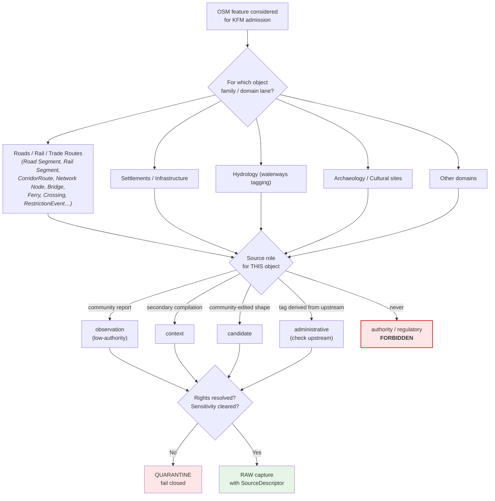
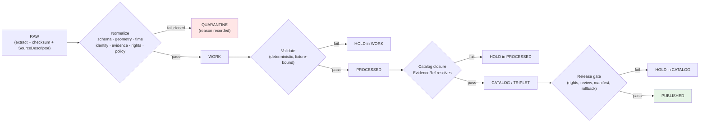

<!-- [KFM_META_BLOCK_V2]
doc_id: kfm://doc/source-family/openstreetmap
title: OpenStreetMap (Source Family)
type: standard
version: v1.1
status: draft
owners: Docs steward + Source steward (Roads/Rail domain steward as co-reviewer)
created: 2026-05-13
updated: 2026-05-22
policy_label: public
related:
  - docs/sources/README.md
  - docs/sources/SOURCE_DESCRIPTOR_STANDARD.md
  - docs/doctrine/directory-rules.md
  - docs/doctrine/lifecycle-law.md
  - docs/doctrine/trust-membrane.md
  - docs/doctrine/truth-posture.md
  - docs/domains/roads-rail-trade/README.md
  - docs/domains/settlements-infrastructure/README.md
  - docs/domains/hydrology/README.md
  - docs/domains/archaeology/README.md
  - schemas/contracts/v1/source/source-descriptor.schema.json
  - connectors/osm/README.md
  - control_plane/source_authority_register.yaml
tags: [kfm, source-family, openstreetmap, osm, valhalla, rights, governance, roads-rail-trade]
notes:
  - "OSM is CONFIRMED in [DOM-ROADS] §D as a recognized source family alongside Census TIGER/Line, FHWA HPMS/NHFN, WZDx, KDOT/KanPlan/KanDrive/Kansas GIS, county/state bridge data, and GNIS names. Source role is set per object-family at admission, not pre-assigned."
  - "Rights, attribution, and share-alike posture for KFM use remain NEEDS VERIFICATION until a SourceActivationDecision is recorded in control_plane/source_authority_register.yaml."
  - "This document is a source-family standard. It is NOT a SourceDescriptor instance."
  - "Any specific path quoted here is PROPOSED until verified against mounted-repo evidence."
[/KFM_META_BLOCK_V2] -->

<a id="top"></a>

# 🗺️ OpenStreetMap — Source Family Standard

> Governance, rights posture, and lifecycle treatment for OpenStreetMap (OSM) inputs in the Kansas Frontier Matrix.


<!-- Shields targets are placeholders; replace once badge endpoints are decided. -->

| Field | Value |
|---|---|
| **Status** | Draft (review pending) |
| **Owners** | Docs steward · Source steward · Roads/Rail domain steward (co-reviewer) |
| **Updated** | 2026-05-22 |
| **Authority of this document** | CONFIRMED — KFM doctrine + project source-family list (`[DOM-ROADS]` §D) |
| **Authority of OSM rights claims herein** | NEEDS VERIFICATION until a `SourceActivationDecision` is recorded |
| **Lifecycle invariant** | RAW → WORK / QUARANTINE → PROCESSED → CATALOG / TRIPLET → PUBLISHED |

---

## Contents

1. [Scope and purpose](#1-scope-and-purpose)
2. [Source identity at a glance](#2-source-identity-at-a-glance)
3. [Source role — decision, not default](#3-source-role--decision-not-default)
4. [Rights, license, and attribution](#4-rights-license-and-attribution)
5. [Sensitivity posture and deny-by-default cases](#5-sensitivity-posture-and-deny-by-default-cases)
6. [Freshness, cadence, and stale-state](#6-freshness-cadence-and-stale-state)
7. [Retrieval methods and admission boundary](#7-retrieval-methods-and-admission-boundary)
8. [Lifecycle and gates](#8-lifecycle-and-gates)
9. [Domain applicability matrix](#9-domain-applicability-matrix)
10. [Downstream derived artifacts — the Valhalla case](#10-downstream-derived-artifacts--the-valhalla-case)
11. [Anti-patterns — what OSM is NOT](#11-anti-patterns--what-osm-is-not)
12. [Illustrative SourceDescriptor fields](#12-illustrative-sourcedescriptor-fields)
13. [Open questions and verification backlog](#13-open-questions-and-verification-backlog)
14. [Related docs](#14-related-docs)

---

## 1. Scope and purpose

OpenStreetMap is a community-maintained, global, structured geographic database. KFM project doctrine **CONFIRMS** OSM as a source family in `[DOM-ROADS]` §D (Roads, Rail, and Trade Routes) — listed alongside Census TIGER/Line, FHWA HPMS, FHWA National Highway Freight Network, WZDx feeds, KDOT/KanPlan/KanDrive/Kansas GIS, county/state bridge and restriction data, and GNIS names — with explicit cautions that source role, rights, and current terms are **NEEDS VERIFICATION** and that sensitive joins must **fail closed**. <sup>CONFIRMED listing per `[DOM-ROADS]` §D Atlas v1.1 + Pass 23/32.</sup>

This document records how KFM admits, governs, and bounds OSM-derived evidence so that:

- OSM data enters the lifecycle through the same gates as any other source family.
- OSM's source role is set by **decision**, not by convenience or analogy.
- Rights, attribution, and share-alike obligations are resolved **before** any released artifact carries OSM-derived geometry, attribution, or claims.
- OSM is never silently elevated into an authoritative role it does not hold for a given object family.

> [!IMPORTANT]
> This file is a **standards / governance note** for a source family. It is **not** a `SourceDescriptor` instance. The canonical home for `SourceDescriptor` records defaults to `schemas/contracts/v1/source/source-descriptor.json` per Directory Rules §7.4 / ADR-0001; PROPOSED until verified.

[Back to top](#contents)

---

## 2. Source identity at a glance

| Attribute | Value | Truth label |
|---|---|---|
| Source family name | OpenStreetMap | CONFIRMED in `[DOM-ROADS]` §D |
| Common short name | OSM | CONFIRMED |
| Source kind | Community-edited geographic database | EXTERNAL (general knowledge) |
| KFM source ID | `src-osm` (suggested) | PROPOSED |
| Watcher kind | `file` / `api` / `tile` per access method | PROPOSED |
| Default policy posture | Deny-by-default until activation; quarantine on rights ambiguity | CONFIRMED doctrine |
| Default source role | **Not pre-assigned** — set per object family at admission | CONFIRMED rule per Atlas §24.1.3 (`source_role` is set at admission, never edited in place) |
| Public release class | Restricted pending `SourceActivationDecision` | PROPOSED |
| Authority position vs. authoritative state/federal data | **Lower** — observation / context / candidate, never substitutes for KDOT, TIGER, GNIS, FHWA, county/state bridge data as authority | PROPOSED policy, derived from `[DOM-ROADS]` §D source-family ordering |

> [!NOTE]
> KFM doctrine treats `source_role` as a **descriptor field set at admission, never edited in place**. Corrections must produce a new descriptor and a `CorrectionNotice`. <sup>CONFIRMED rule per Atlas §24.1.3.</sup>

[Back to top](#contents)

---

## 3. Source role — decision, not default

KFM enumerates source roles in the SourceDescriptor as: **`observed | regulatory | modeled | aggregate | administrative | candidate | synthetic`** per Atlas §24.1.3. The role is set at admission and cannot be inferred from convenience or an upstream copy. <sup>CONFIRMED enum and rule per Atlas §24.1.3.</sup>

OSM is **none of these by default**. Each KFM use of OSM data must specify the role the project is admitting it under, for the specific object family involved.



> [!CAUTION]
> Even when OSM-tagged data appears to be sourced from an authoritative upstream (e.g., a TIGER import, a KDOT shapefile, a USGS layer), the KFM-side ingestion **must** point at the upstream authority directly. Inheriting authority from a copy is the **role-collapse anti-pattern** (`ROLE_COLLAPSE` / `ROLE_DOWNCAST_FORBIDDEN`). <sup>CONFIRMED doctrine per Atlas §24.1 source-role anti-collapse register.</sup>

[Back to top](#contents)

---

## 4. Rights, license, and attribution

### 4.1 Project posture (CONFIRMED)

The Roads/Rail dossier records OSM with the following rights status: *"rights and current terms NEEDS VERIFICATION; sensitive joins fail closed."* That posture binds every domain that consumes OSM until a `SourceActivationDecision` records otherwise. <sup>CONFIRMED per `[DOM-ROADS]` §D.</sup>

KFM doctrine requires `LayerManifest` to carry `attribution`, `license_spdx`, `rights_statement`, and review status before any public release; rights-unknown blocks release. <sup>CONFIRMED.</sup>

MapLibre Master also flags OSM rights explicitly as part of the multi-source attribution and rights surface: *"KGS, SSURGO/gNATSGO, SoilGrids, WZDx, OSM/Valhalla, air-quality sources and Story Node assets require rights."* <sup>CONFIRMED per `Master_MapLibre_Components-Functions-Features_v2.1` attribution section.</sup>

### 4.2 Generally known OSM license posture (EXTERNAL)

For working context only — **not** a substitute for a recorded `SourceActivationDecision`:

| Item | Generally known posture | Treatment in KFM |
|---|---|---|
| Data license | Open Database License (ODbL 1.0) — *EXTERNAL, NEEDS VERIFICATION for current effective text and any region-specific overlays* | Resolve before activation; record SPDX in LayerManifest |
| Tile / cartographic style license | Separate from data license; OSM Foundation tile cartography is published under its own terms — *EXTERNAL, NEEDS VERIFICATION* | KFM should not assume tile-style and database licenses are interchangeable |
| Attribution requirement | "© OpenStreetMap contributors" attribution is the project's standing convention — *EXTERNAL* | LayerManifest attribution string and Evidence Drawer citation must carry this when activated |
| Share-alike (derivative database) | ODbL imposes share-alike obligations on **derivative databases**; produced works are treated differently — *EXTERNAL, version-sensitive* | Treat any KFM-emitted database (catalog tables, GeoParquet, tile derivatives, **routing-graph tiles** — see §10) as potentially share-alike until reviewed |

> [!WARNING]
> ODbL's share-alike obligation interacts with KFM's lifecycle in ways that **require legal/steward review** before publication. Catalog tables, GeoParquet exports, PMTiles, COGs, **Valhalla routing-graph tiles**, and graph projections derived from OSM may constitute a derivative database. Do not publish OSM-derived database artifacts without an activation decision that explicitly addresses this. <sup>CONFIRMED MapLibre concern: *"Valhalla publication: OSM source terms, build determinism, route test fixtures and catalog semantics need verification"* (`Master_MapLibre_Components-Functions-Features_v2.1`).</sup>

### 4.3 KFM release requirements that bind regardless of license

CONFIRMED doctrine: before public or semi-public release of any OSM-derived layer or claim, KFM requires identity, rights, sensitivity, validation, provenance, integrity, receipts, policy checks, review state, release state, correction path, and rollback path — appropriate to the significance of the claim.

[Back to top](#contents)

---

## 5. Sensitivity posture and deny-by-default cases

CONFIRMED doctrine: when rights, sovereignty, cultural sensitivity, living-person data, DNA/genomic data, rare-species locations, archaeology, infrastructure, or precise location exposure are unclear, KFM prefers **quarantine, redaction, generalization, staged access, delayed publication, or denial** — and records the transforms and reasons.

OSM-specific sensitivity surfaces:

| OSM content class | Default posture in KFM | Reason |
|---|---|---|
| Culturally sensitive corridors, sacred routes, Indigenous trade alignments | **DENY** exact public exposure | Roads/Rail dossier explicitly forbids exposing culturally sensitive corridors; Atlas §24.4.11: *"Historical corridor reconstructions cited as context only; exact archaeological coordinates denied."* |
| Exact archaeological points (sites tagged `historic=archaeological_site` or similar) | **DENY** exact public exposure | Archaeology domain blanket rule |
| Critical infrastructure precision (power, water, telecom nodes) | **RESTRICT / DENY** | Settlements/Infrastructure default; Atlas §24.4.12: *"Critical-infrastructure exposure context with default deny on public detail."* |
| Private landowner-sensitive geometry (e.g., field boundaries, residential addresses) | **DENY** exact public exposure if rights or owner identity are unclear | Sensitive register default |
| Rare species occurrence points (when present in OSM via `species=` or similar) | **DENY** exact location | Fauna/Flora rare-species default |
| OSM-tagged "legal status" claims (e.g., `legal_status=*` on roads, lands, restrictions) | **DENY** as authoritative; admit as `candidate` at best | `[DOM-ROADS]` §K PROPOSED validator: *"OSM/GNIS legal-status denial"* |
| Standard roads, settlements, place names, hydrography | Eligible for processing through normal gates | Subject to source-role assignment per §3 |

> [!IMPORTANT]
> Sensitivity must be **detected before publication**, not after. Style-level hiding (e.g., a MapLibre filter that simply doesn't draw a layer) is **not** a sensitivity control. CONFIRMED doctrine: "relying on style filters for sensitive geometry" is an anti-pattern.

[Back to top](#contents)

---

## 6. Freshness, cadence, and stale-state

OSM is **continuously edited**; in KFM lifecycle terms this means:

- **Source freshness** is defined per snapshot or per extract, not for "OSM" in the abstract. A `SourceDescriptor` must record the snapshot or extract timestamp it represents.
- **Cadence** is set in the `SourceDescriptor` and tracked by a watcher. Once the cadence elapses without a new admission, the Evidence Drawer must surface a *stale source* badge.
- **Watcher-as-non-publisher** invariant applies: an OSM watcher detects material change and opens a reviewed PR or review packet; it never publishes refreshed artifacts directly. <sup>CONFIRMED watcher invariant per Directory Rules §13.</sup>
- **Conditional GET discipline** applies (HEAD-first, `If-None-Match` / `If-Modified-Since`, fallback to manifest checksum) per Pass-10 `C3-01`.

> [!TIP]
> Prefer **regional extract snapshots** (e.g., a state-level extract published on a known schedule) over live API scraping for the canonical RAW capture. Snapshot identity is easier to hash, cite, and roll back. The `OSM sha256` then becomes the deterministic input to downstream artifacts (see §10). <sup>CONFIRMED pattern per MapLibre Master `ML-057-041`: *"Valhalla tile metadata records OSM sha256."*</sup>

[Back to top](#contents)

---

## 7. Retrieval methods and admission boundary

EXTERNAL summary (general working knowledge — **not** a KFM endorsement; live use requires `SourceActivationDecision`):

| Retrieval method | Typical use | KFM admission notes |
|---|---|---|
| Regional extracts (state/country-level snapshots, e.g., from third-party redistributors) | Canonical RAW capture for KFM bulk processing | Preferred; snapshot timestamp + checksum form deterministic source identity |
| Planet-level dump | Full-extent processing | Heavyweight; only when state/regional extracts are insufficient |
| Read-only query API (Overpass) | Targeted feature queries during normalization | Use cautiously; rate-limit and politeness budgets per project watcher doctrine (PROPOSED) |
| Live editing API | **Not used by KFM** for read paths | KFM is a consumer, not a contributor pipeline |
| Pre-rendered raster tiles from OSMF infrastructure | Visual reference only, never as evidence | Tile use carries separate terms; treat as context layer only |
| Third-party hosted PMTiles / MVT mirrors | Visualization context | SourceDescriptor required; downstream carrier, not authority |

CONFIRMED doctrine (Directory Rules §7.3): connector output **must** go to `data/raw/<domain>/<source_id>/<run_id>/` or `data/quarantine/...`, with source descriptors, checksums, and ingest receipts. Connectors **must not** publish, mutate canonical truth, or write under `data/processed/`, `data/catalog/`, or `data/published/`.

> [!NOTE]
> OSM is **not** in the `directory-rules.md` §7.3 canonical connector roots (`usgs/ fema/ noaa/ nrcs/ kansas/ gbif/ inaturalist/ census/ local_upload/`). Promotion of `connectors/osm/` to §7.3 is **ADR-class** — open a `source-proposed root layout quarantine` review (per `KFM-P18-PROG-0042` / `KFM-P19-PROG-0042` / `KFM-P22-PROG-0053`) before treating `connectors/osm/` as a canonical home. <sup>CONFIRMED §7.3 list and quarantine pattern.</sup>

Proposed connector home (PROPOSED, NEEDS VERIFICATION against mounted repo and ADR):

```text
connectors/
└── osm/
    ├── README.md           # references this source-family standard
    ├── source-descriptor.yaml  # PROPOSED — instance lives per ADR-0001 schema home
    ├── extract_fetch.py    # PROPOSED — regional-extract retrieval
    ├── overpass_query.py   # PROPOSED — bounded Overpass admission
    └── fixtures/           # no-network fixtures for connector tests
```

[Back to top](#contents)

---

## 8. Lifecycle and gates

OSM-derived material follows the universal lifecycle invariant. CONFIRMED doctrine; specific implementation **PROPOSED** until a mounted repo verifies it.



Gate-specific consequences for OSM:

| Gate | OSM-specific fail-closed reason codes (PROPOSED) | Recovery path |
|---|---|---|
| Admission | `RIGHTS_UNKNOWN` (no `SourceActivationDecision`); `SOURCE_ROLE_UNSET`; `§7.3_HOME_UNRATIFIED` | Record rights resolution; steward review; open §7.3 promotion ADR |
| Normalization | `SCHEMA_MISMATCH` on OSM tag heterogeneity; `SENSITIVITY_UNRESOLVED` on cultural/archaeological tags; `LEGAL_STATUS_TAG_DETECTED` | Tag normalization rules; sensitivity tagging; quarantine ambiguous cases; downgrade legal-status tags to `candidate` |
| Validation | `EVIDENCE_INSUFFICIENT` if claim depends on a single OSM edit with no corroboration; `OSM_GNIS_LEGAL_STATUS_DENIED` | Cross-check authoritative source; downgrade role; abstain |
| Catalog closure | `ATTRIBUTION_MISSING`; `LICENSE_NOT_SPECIFIED`; `OSM_SHA256_MISSING_ON_DERIVED_ARTIFACT` (see §10) | Populate `LayerManifest.attribution` / `license_spdx`; refresh manifest; recompute and pin OSM sha256 |
| Release | `REVIEW_NEEDED` for any sensitive lane; `ROLLBACK_TARGET_MISSING`; `SHARE_ALIKE_REVIEW_INCOMPLETE` | Run steward review; bind rollback target; complete legal/steward share-alike review |

<sup>The `OSM/GNIS legal-status denial` validator at the validation gate is PROPOSED per `[DOM-ROADS]` §K.</sup>

[Back to top](#contents)

---

## 9. Domain applicability matrix

OSM intersects multiple KFM domain lanes. The Roads/Rail/Trade Routes domain owns the **Road Segment**, **Rail Segment**, **CorridorRoute**, **RouteMembership**, **Network Node**, **Crossing**, **Bridge**, **Ferry**, **TransportFacility**, **RestrictionEvent**, **Historic Route**, **Depot**, **Siding**, **Yard**, **River Crossing**, **Freight Corridor**, **Route Event**, **Operator Status**, **Access Restriction**, **Network Edge**, and **Movement Story Node** object families per `[DOM-ROADS]` §B / §E. <sup>CONFIRMED object families per `[DOM-ROADS]`.</sup>

PROPOSED applicability (informational; binding per-lane in the relevant domain dossier):

| Domain lane | Typical OSM contribution | Default KFM role posture | Notes |
|---|---|---|---|
| Roads, Rail, and Trade Routes | Modern roads, rail alignments, historic-tagged routes | **context / candidate** — *never* primary authority; KDOT / TIGER / GNIS / FHWA take authority | OSM CONFIRMED in `[DOM-ROADS]` §D |
| Settlements, Cities, Infrastructure | Place names, settlement footprints, points of interest | **context / candidate** — secondary to TIGER, GNIS, state/local GIS | Atlas §24.4.11: *"Network nodes and crossings anchor settlement connectivity; facility identity is settlement-owned."* — facility identity is NOT OSM's to assign |
| Hydrology | Waterways, dams, bridges-over-water tagging | **context** — NHDPlus HR / WBD / authoritative state hydro datasets take authority | Bridge/ferry tagging may corroborate Roads/Rail |
| Archaeology | Sites tagged `historic=archaeological_site` and similar | **Default DENY exact** — sensitivity rules dominate | Generalized public view only; steward review required; cultural-corridor exposure forbidden |
| Hazards | Crowdsourced damage reports, road closures (rare) | **observation (low-authority)** — not for life-safety routing | Not-for-life-safety disclaimer applies |
| Atmosphere / Air | Not applicable in normal use | — | — |
| People / DNA / Land | Not applicable; OSM does not carry person-level data | — | — |

> [!IMPORTANT]
> A single OSM feature can legitimately be admitted into multiple lanes with **different roles** (e.g., a railway as `context` for Roads/Rail and as `candidate` corroborating evidence for a historical Settlement claim). Each admission is a separate `SourceDescriptor` instance.

[Back to top](#contents)

---

## 10. Downstream derived artifacts — the Valhalla case

OSM is one of the few KFM source families that frequently appears as the upstream input to a **complex derived artifact**: a routing graph. MapLibre Master records this pattern explicitly. <sup>CONFIRMED pattern per `ML-057-039`, `ML-057-040`, `ML-057-041`.</sup>

**`ML-057-039`** — *Valhalla routing graph tiles are versioned derived artifacts.* The Valhalla pattern builds OSM-derived graph tiles/tar files plus a STAC carrier manifest; routing graph artifacts MUST be treated as **downstream derived artifacts with checks before exposure**, never promoted without verification.

**`ML-057-040`** — *Build smoke tests required.* Valhalla builds require route smoke tests and a derived manifest; do not promote without them.

**`ML-057-041`** — *Valhalla tile metadata records OSM sha256.* The build writes metadata with `built_at` and **`OSM sha256`** — source snapshot identity must travel with the routing graph build time and format.

| Concrete requirement for OSM-derived derived artifacts | Rule | Authority |
|---|---|---|
| Routing graph tiles MUST carry the `OSM sha256` of the source extract in their metadata | `kfm:source_digest = sha256(<osm-extract>)` | `ML-057-041` |
| Routing graph tiles MUST carry `built_at` | timestamp pinned in metadata | `ML-057-041` |
| Routing graph builds MUST run **route smoke tests** before publication | smoke test = first-class gate, not optional | `ML-057-040`; MapLibre attribution + rights surface |
| Routing graph tiles are **carrier artifacts, not authority** | Treat as downstream carrier; do not promote without checks | `ML-057-039` |
| Share-alike review MUST address routing-graph publication explicitly | ODbL derivative-database review | §4.2; `Master_MapLibre_Components-Functions-Features_v2.1` *"Valhalla publication: OSM source terms, build determinism, route test fixtures and catalog semantics need verification."* |

> [!WARNING]
> A routing graph that ships **without** a pinned `OSM sha256` is non-reproducible, non-auditable, and not eligible for KFM promotion. This is a hard requirement, not a style preference. <sup>CONFIRMED per `ML-057-041`.</sup>

> [!NOTE]
> The Valhalla case is the **prototype** for OSM-derived database artifacts. The same discipline (source digest pinned in metadata, build smoke tests, downstream-carrier-not-authority framing, share-alike review) applies to **any** OSM-derived GeoParquet, PMTiles, COG, or graph projection. <sup>PROPOSED generalization; CONFIRMED prototype.</sup>

[Back to top](#contents)

---

## 11. Anti-patterns — what OSM is NOT

> [!CAUTION]
> The following anti-patterns are **forbidden** by KFM doctrine. Several are restatements of universal rules; they are listed here because they recur specifically around community-edited spatial data.

| Anti-pattern | What it looks like | Why it is forbidden |
|---|---|---|
| **Authority laundering** | Treating an OSM feature as authoritative because it was imported from TIGER years ago | Source role cannot be inferred from an intermediary copy; `ROLE_COLLAPSE` |
| **Style-hidden sensitivity** | "It's only sensitive if it's rendered" — a MapLibre filter hiding a sensitive layer | Style is not a policy control; sensitive geometry must be removed or generalized upstream |
| **Live API as canonical** | Using Overpass as the canonical RAW source for catalogued artifacts | Snapshots are auditable; API results drift; live API is not deterministic |
| **Released-without-attribution** | A LayerManifest, tile, or evidence drawer payload that omits attribution | Public release requires source rights, attribution, and license metadata |
| **Share-alike-blind publication** | Publishing OSM-derived GeoParquet/PMTiles/Valhalla tiles without addressing derivative-database obligations | Treats license as solved when it has not been reviewed |
| **OSM/GNIS legal-status as authority** | Treating an OSM `legal_status=*` or similar tag as a regulatory determination | `[DOM-ROADS]` §K PROPOSED validator denies this; legal status is a regulatory-role finding, not a community-edited tag |
| **AI-as-evidence** | Letting a Focus Mode answer say "OSM shows…" without resolving the underlying EvidenceBundle | AI text is never evidence; cite-or-abstain applies |
| **Tile-as-truth** | Treating an OSM raster tile (or a Valhalla routing tile) as proof of a fact | Tiles are downstream carriers, not sovereign truth |
| **Routing-graph without source digest** | Publishing a Valhalla build that does not pin `OSM sha256` | Non-reproducible, non-auditable; `OSM_SHA256_MISSING_ON_DERIVED_ARTIFACT` |
| **One-PR roll-up** | A single PR that fetches, normalizes, catalogs, and releases OSM data in one step | Lifecycle skip; promotion is a governed state transition, not a file move |

[Back to top](#contents)

---

## 12. Illustrative SourceDescriptor fields

> [!NOTE]
> This block is **illustrative** and **PROPOSED**. It is not the canonical schema. The canonical schema home defaults to `schemas/contracts/v1/source/source-descriptor.schema.json` per Directory Rules §7.4 / ADR-0001 — actual file presence and field names are NEEDS VERIFICATION.

<details>
<summary>Click to expand — illustrative OSM SourceDescriptor (PROPOSED, not authoritative)</summary>

```yaml
# docs/sources/openstreetmap/examples/osm-extract-kansas.yaml  (PROPOSED — illustrative only)
source_id: src-osm-kansas-extract-2026-04
source_family: openstreetmap
provider: third_party_redistributor   # PROPOSED enum value
provider_terms_ref: docs/sources/openstreetmap/openstreetmap.md#4-rights-license-and-attribution
endpoint:
  kind: file
  url_template: "<provider-extract-url>"   # PROPOSED — fill at activation
  snapshot_timestamp: "2026-04-01T00:00:00Z"
  checksum_algorithm: sha256
  checksum_value: "<sha256-of-extract>"
retrieval:
  method: regional_extract
  watcher_kind: file
  cadence: monthly
  politeness_budget_ref: docs/standards/connector-rate-limits.md   # PROPOSED
rights:
  status: NEEDS_VERIFICATION
  license_spdx: ODbL-1.0                # EXTERNAL working assumption; verify
  attribution: "© OpenStreetMap contributors"
  share_alike_review_ref: docs/governance/osm-sharealike-review.md   # PROPOSED
sensitivity:
  default_tier: T2                      # PROPOSED — see sensitivity tier doctrine
  domain_overrides:
    archaeology: T4
    settlements_infrastructure_critical: T3
  tag_denylist_ref: policy/sensitivity/osm-tag-denylist.yaml   # PROPOSED
source_role:
  # MUST be set per object family at admission. No default.
  by_object_family:
    road_segment: context
    rail_segment: context
    settlement: context
    historic_route_claim: candidate
    legal_status_claim: denied            # per [DOM-ROADS] §K
authority_class: secondary              # Not authoritative for KFM publication
release_class: restricted_until_activation
derived_artifact_policy:
  valhalla_routing_tiles:
    requires_source_digest: true        # OSM sha256 per ML-057-041
    requires_built_at: true             # per ML-057-041
    requires_route_smoke_tests: true    # per ML-057-040
    share_alike_review_required: true   # per §4.2 and §10
steward: source-steward@kfm.example     # PROPOSED placeholder
notes:
  - "Source-role per object family must be reaffirmed on every refresh."
  - "Sensitive-tag filter must run before any catalog closure."
  - "Legal-status tags are denied as authoritative; admit as candidate at best."
  - "Any OSM-derived derived artifact (Valhalla tiles, GeoParquet, PMTiles, COG, graph) MUST pin OSM sha256 in its metadata."
```

</details>

[Back to top](#contents)

---

## 13. Open questions and verification backlog

| # | Question | Label | Resolution path |
|---|---|---|---|
| 1 | Has a `SourceActivationDecision` been issued for OSM in any KFM lane? | UNKNOWN | Inspect `control_plane/source_authority_register.yaml` once mounted |
| 2 | Does the repo currently host `connectors/osm/`? Has `connectors/osm/` been promoted into `directory-rules.md` §7.3 by ADR? | NEEDS VERIFICATION | Verify against mounted repo; open §7.3 promotion ADR if needed |
| 3 | What SPDX identifier and effective version best represents OSM's current data license terms for KFM purposes? | NEEDS VERIFICATION (EXTERNAL informational baseline only) | Steward + legal review |
| 4 | Does any KFM-derived database artifact (catalog table, GeoParquet, PMTiles, COG, **Valhalla routing tiles**, graph projection) constitute a derivative database under share-alike obligations? | NEEDS VERIFICATION | Per-artifact review during release gate; **routing-graph case is the prototype** |
| 5 | Which OSM tag patterns trigger sensitive-class denial (cultural corridors, archaeology, critical infrastructure, private landowner data, **legal-status claims**)? | PROPOSED | Author a sensitive-tag denylist in policy lane; legal-status denial per `[DOM-ROADS]` §K |
| 6 | What is the canonical extract provider and cadence for KFM's RAW captures of OSM Kansas data? | UNKNOWN | Source steward decision; record in SourceDescriptor |
| 7 | How does an OSM watcher distinguish a *material* change from churn? | NEEDS VERIFICATION | Define material-property allowlist per project watcher doctrine |
| 8 | Where does OSM-specific tag normalization logic live? | PROPOSED | `pipelines/normalize/osm/` (PROPOSED) per Directory Rules §7.4 |
| 9 | Does any KFM artifact (Valhalla tiles, PMTiles, GeoParquet) currently lack a pinned `OSM sha256` in its metadata? | NEEDS VERIFICATION | Inventory derived artifacts; fail-closed any that lack it |
| 10 | Are route smoke tests in place for any Valhalla build path? | NEEDS VERIFICATION | Per `ML-057-040`; required before publication |

[Back to top](#contents)

---

## 14. Related docs

> Placeholders are linked relative to repo root. Some targets are **PROPOSED** and may not yet exist.

- [`docs/sources/README.md`](../../README.md) — index of source families
- [`docs/sources/SOURCE_DESCRIPTOR_STANDARD.md`](../../SOURCE_DESCRIPTOR_STANDARD.md) — descriptor field standard
- [`docs/doctrine/directory-rules.md`](../../../doctrine/directory-rules.md) — placement law (§7.3 canonical connector roots; §7.4 schema home)
- [`docs/doctrine/lifecycle-law.md`](../../../doctrine/lifecycle-law.md) — RAW → PUBLISHED invariant
- [`docs/doctrine/trust-membrane.md`](../../../doctrine/trust-membrane.md) — public-surface boundary
- [`docs/doctrine/truth-posture.md`](../../../doctrine/truth-posture.md) — cite-or-abstain
- [`docs/domains/roads-rail-trade/README.md`](../../../domains/roads-rail-trade/README.md) — primary consuming domain (CONFIRMED `[DOM-ROADS]` §D listing)
- [`docs/domains/settlements-infrastructure/README.md`](../../../domains/settlements-infrastructure/README.md) — secondary consuming domain
- [`docs/domains/hydrology/README.md`](../../../domains/hydrology/README.md) — secondary consuming domain
- [`docs/domains/archaeology/README.md`](../../../domains/archaeology/README.md) — sensitivity-dominant domain
- [`docs/adr/`](../../../adr/) — ADR index (e.g., ADR-0001 schema home; pending §7.3 promotion ADR for `connectors/osm/`)
- [`control_plane/source_authority_register.yaml`](../../../../control_plane/source_authority_register.yaml) — `SourceActivationDecision` register
- [`connectors/osm/`](../../../../connectors/osm/) — connector home (PROPOSED; pending §7.3 promotion ADR)
- [`schemas/contracts/v1/source/source-descriptor.schema.json`](../../../../schemas/contracts/v1/source/source-descriptor.schema.json) — canonical schema home

---

<sub>**Last updated:** 2026-05-22 · **Document version:** v1.1 (draft) · **Authority:** doctrine + project source-family list (CONFIRMED via `[DOM-ROADS]` §D) · Specific paths quoted herein are PROPOSED until verified against mounted-repo evidence. · [Back to top](#-openstreetmap--source-family-standard)</sub>
