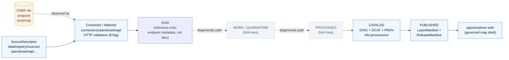

<!-- [KFM_META_BLOCK_V2]
doc_id: kfm://doc/docs-sources-catalog-openstreetmap-osm-tiles
title: OpenStreetMap Pre-rendered Tiles
type: product-page
version: v0.2
status: draft
owners: <PLACEHOLDER — Docs steward + Source steward for openstreetmap>
created: 2026-05-20
updated: 2026-05-22
policy_label: public
related:
  - docs/sources/catalog/openstreetmap/README.md
  - docs/sources/catalog/README.md
  - docs/doctrine/directory-rules.md
  - docs/doctrine/lifecycle-law.md
  - docs/doctrine/trust-membrane.md
  - docs/standards/STAC.md
  - docs/standards/DCAT.md
  - docs/standards/PROV.md
tags: [kfm, docs, sources, catalog, openstreetmap, basemap, tiles]
notes:
  - "PROPOSED product-page scaffold; sibling-link presence verified in Claude Code session."
  - "Pre-rendered raster tiles are a derived carrier and a reference-context layer only — never analytic evidence."
  - "OPEN: docs/sources/catalog/ subtree is a PROPOSED extension of the docs/sources/ tree defined in directory-rules.md §6.1."
[/KFM_META_BLOCK_V2] -->

# OpenStreetMap Pre-rendered Tiles

> Pre-rendered raster tiles from OSMF infrastructure used as **visual reference context only** — never as analytic evidence, source authority, or sovereign truth.

[](#)
[](#)
[](./README.md)
[](../../../doctrine/authority-ladder.md)
[](#rights-and-sensitivity)
[](#last-reviewed)

**Status:** PROPOSED — product-page scaffold · **Family:** [`openstreetmap`](./README.md) · **Owners:** *PLACEHOLDER — Docs steward + Source steward for openstreetmap* · **Last reviewed:** 2026-05-22

---

## Contents

- [Overview](#overview)
- [Doctrinal posture](#doctrinal-posture)
- [Source authority](#source-authority)
- [Lifecycle and catalog flow (PROPOSED)](#lifecycle-and-catalog-flow-proposed)
- [Catalog profiles used](#catalog-profiles-used)
- [Collection identity](#collection-identity)
- [Provenance fields](#provenance-fields)
- [Temporal handling](#temporal-handling)
- [Geometry and projection](#geometry-and-projection)
- [Rights and sensitivity](#rights-and-sensitivity)
- [Validation and catalog closure](#validation-and-catalog-closure)
- [Related contracts and schemas](#related-contracts-and-schemas)
- [Related connectors and pipelines](#related-connectors-and-pipelines)
- [Examples](#examples)
- [Anti-patterns](#anti-patterns)
- [Open questions](#open-questions)
- [Related docs](#related-docs)
- [Last reviewed](#last-reviewed)

---

## Overview

**PROPOSED scaffold.** This product page describes the **OpenStreetMap Pre-rendered Tiles** product as a candidate KFM catalog entry. **NEEDS VERIFICATION** for scope, cadence, geographic coverage, current endpoint URL, rights status, license terms, and per-product validation gates.

The product family is "OSMF-hosted pre-rendered raster tiles" — i.e., pixel-baked tile images served from OpenStreetMap Foundation infrastructure. The intent is to use these tiles **only as visual reference context** in the KFM map shell, not as a source of features, attributes, or analytic claims.

> [!IMPORTANT]
> Within KFM doctrine, pre-rendered raster tiles are **derived carriers**, not sovereign truth (per Pass-32 idea family on PMTiles/COG/GeoParquet as derived carriers). They share the renderer-side governance posture of WMS/WMTS-style external map services: SourceDescriptor, rights, attribution, and cache policy must be visible to gates before public exposure.

[↑ Back to top](#openstreetmap-pre-rendered-tiles)

---

## Doctrinal posture

| KFM doctrine point | Application to this product |
|---|---|
| Source-role anti-collapse | This product carries the `context` role; it MUST NOT be cited as observation, model, regulatory, or authority evidence. NEEDS VERIFICATION on whether `context` is the descriptor enum value (see [`schemas/contracts/v1/source/`](../../../../schemas/contracts/v1/source/)). |
| Tiles are derived carriers | Raster tiles are downstream rendered artifacts. They depend on upstream OSM data and on OSMF rendering pipelines that KFM does not control. PROPOSED. |
| Cite-or-abstain | A KFM claim "X is here because OSM tile pixel shows it" is **not** an admissible citation. Feature-level evidence requires the OSM **data** lane (PBF, Overpass, etc.), not the pre-rendered tile lane. PROPOSED. |
| Public client uses governed interface | The map shell consumes these tiles via a released `LayerManifest` / `StyleManifest`, not via hard-coded raw URLs. PROPOSED. |
| Sensitive geometry not hidden by style | Pre-rendered raster tiles are not a place to *hide* sensitive geometry — the OSMF tile pipeline is outside KFM's redaction surface. Sensitive overlays MUST be generalized or denied **before** they ever interact with this product. PROPOSED. |

> [!NOTE]
> The doctrinal posture above is grounded in the *Master MapLibre Components-Functions-Features v2.1* report (raster tiles as basemap-style rendering, never analytic source) and in the Pass-23/32 Consolidated Atlas (tiles, rasters, and PMTiles as downstream derived carriers). It is PROPOSED until reconciled against the live source descriptor, layer manifest, and policy bundle for `openstreetmap`.

[↑ Back to top](#openstreetmap-pre-rendered-tiles)

---

## Source authority

See [`data/registry/sources/`](../../../../data/registry/sources/) for the authoritative SourceDescriptor (CONFIRMED canonical location per `directory-rules.md §7.3` / connectors-output relation; per-source presence NEEDS VERIFICATION). **Do not duplicate** descriptor fields here. This page **points at** that descriptor; it does not redefine identity, role, rights, cadence, authority scope, or verification obligations.

Default SourceDescriptor schema home is `schemas/contracts/v1/source/` per **ADR-0001**. NEEDS VERIFICATION for actual file presence in the mounted repository.

[↑ Back to top](#openstreetmap-pre-rendered-tiles)

---

## Lifecycle and catalog flow (PROPOSED)

The diagram below is a **PROPOSED** illustration of how this product threads through the KFM lifecycle invariant. Boxes marked *(N/A here)* indicate phases that are degenerate for a pure reference-context tile product (no normalized rows, no triplet projections). **NEEDS VERIFICATION** against the live `connectors/openstreetmap/`, `pipelines/`, `data/catalog/`, and `release/` artifacts.



> [!WARNING]
> The diagram above does **not** assert that any of these paths, connectors, or manifests exist in the mounted repository. It is a PROPOSED structural posture only.

[↑ Back to top](#openstreetmap-pre-rendered-tiles)

---

## Catalog profiles used

| Profile | Default lane (PROPOSED) | Used by this product? |
|---|---|---|
| STAC | `data/catalog/stac/` | PROPOSED — Yes / No (NEEDS VERIFICATION). A reference-only basemap product MAY warrant a minimal STAC Collection rather than per-tile Items. |
| DCAT | `data/catalog/dcat/` | PROPOSED — Yes / No (NEEDS VERIFICATION). A DCAT distribution may carry rights/attribution metadata. |
| PROV-O | `data/catalog/prov/` | PROPOSED — Yes / No (NEEDS VERIFICATION). Provenance closure is light because rendering happens outside KFM. |
| Domain projection | `data/catalog/domain/<domain>/` | PROPOSED — Yes / No (NEEDS VERIFICATION). A reference basemap is cross-domain; a Spatial Foundation domain projection may apply. |

[↑ Back to top](#openstreetmap-pre-rendered-tiles)

---

## Collection identity

- **PROPOSED Collection id pattern:** `kfm-<org>-<product>` (from Pass-10 C4-02; see [`IDENTITY.md`](../IDENTITY.md)). Worked candidate: `kfm-osmf-pre-rendered-tiles` (PROPOSED; needs naming review).
- **PROPOSED namespace:** `kfm:` *(per Pass-10 C4-01; see open question OPEN-DSC-03 — namespace choice between `kfm:` and `ks-kfm:` is not yet settled in the corpus).*
- **Asset roles:** NEEDS VERIFICATION — confirm against [`schemas/contracts/v1/source/`](../../../../schemas/contracts/v1/source/) and any STAC asset-role enumeration the catalog enforces.

[↑ Back to top](#openstreetmap-pre-rendered-tiles)

---

## Provenance fields

STAC `properties.kfm:provenance` block (CONFIRMED shape per Pass-10 C4-01; PROPOSED population for this product):

| Field | Meaning | Source-of-truth |
|---|---|---|
| `spec_hash` | sha256 of the canonical record (JCS+SHA-256 baseline). | CONFIRMED shape; PROPOSED computation for this product. |
| `evidence_bundle_ref` | `kfm://evidence/<digest>` resolving to a content-addressed EvidenceBundle. | CONFIRMED shape; sparse for a reference basemap (no per-feature evidence). |
| `run_record_ref` | `kfm://run/<run-id>` for the catalog-build run. | CONFIRMED shape. |
| `audit_ref` | `kfm://audit/<attestation-id>` for SLSA / cosign / DSSE attestation. | CONFIRMED shape; PROPOSED for this product (no in-house rendering means upstream attestations are absent). |
| `policy_digest` | sha256 of the policy bundle used at promotion. | CONFIRMED shape. |

Per-asset integrity: `file:checksum`. **NEEDS VERIFICATION** for this product — pre-rendered tiles fetched on demand from OSMF are not byte-stable across time, so the per-tile checksum approach used for PMTiles / COG / GeoParquet does not apply. The KFM-side `LayerManifest` for this product captures **endpoint identity** (URL template, attribution, version pin) rather than per-tile digests.

[↑ Back to top](#openstreetmap-pre-rendered-tiles)

---

## Temporal handling

PROPOSED — record distinct source / observed / valid / retrieval / release / correction times where material. NEEDS VERIFICATION per product. For a continuously updated OSMF endpoint, the relevant time stamps are typically:

| Time | Applies here? | Notes |
|---|---|---|
| `source_time` | NEEDS VERIFICATION | The underlying OSM data is continuously updated; a single "source time" is fictional unless pinned to a snapshot. |
| `observed_time` | PROPOSED | When the KFM watcher last verified endpoint headers (ETag / Last-Modified). |
| `valid_time` | PROPOSED | The currency window the KFM `LayerManifest` is willing to assert. |
| `retrieval_time` | PROPOSED | Time of catalog-record build, not time of tile fetch. |
| `release_time` | PROPOSED | When the `LayerManifest` for this product was promoted. |
| `correction_time` | PROPOSED | When a CorrectionNotice was issued (e.g., attribution change). |

[↑ Back to top](#openstreetmap-pre-rendered-tiles)

---

## Geometry and projection

PROPOSED — confirm CRS, generalization rules, and scale support against `data/catalog/` artifacts. NEEDS VERIFICATION.

For OSMF pre-rendered tiles the typical posture (PROPOSED, NEEDS VERIFICATION) is:

- Web Mercator (EPSG:3857) tile-pyramid CRS.
- Generalization is **upstream** (in the OSMF rendering pipeline) and not in KFM's control.
- Scale support follows the published z/x/y range; the KFM `LayerManifest` should pin a min/max zoom that the map shell will honor.

> [!CAUTION]
> Because generalization is upstream, KFM cannot make any analytic claim about feature presence/absence from a tile pixel. The `Public-safe tiles vs restricted/internal tiles` analysis in the *Master MapLibre Components-Functions-Features* report applies: sensitive geometry must never be hidden only by upstream styling.

[↑ Back to top](#openstreetmap-pre-rendered-tiles)

---

## Rights and sensitivity

NEEDS VERIFICATION — see [`policy/sensitivity/`](../../../../policy/sensitivity/) and [`RIGHTS-AND-SENSITIVITY-MAP.md`](../RIGHTS-AND-SENSITIVITY-MAP.md). **Do not restate policy here.**

The KFM corpus lists OpenStreetMap among source families whose "rights and current terms" are explicitly **NEEDS VERIFICATION**, with sensitive joins required to fail closed. That posture applies here.

> [!WARNING]
> **Do not assume** the OSMF tile endpoint may be used in this KFM deployment merely because OSM **data** is openly licensed. The tile-server usage terms are a separate operational posture from the data license, and both must be resolved by the source steward and rights reviewer before the corresponding `LayerManifest` is promoted to `PUBLISHED`. Until resolved, treat this product as **NEEDS VERIFICATION** for both license and operational use.

[↑ Back to top](#openstreetmap-pre-rendered-tiles)

---

## Validation and catalog closure

- Catalog closure required before public release (Pass-10 / KFM-P1-IDEA-0020). CONFIRMED doctrine.
- STAC Projection lint (KFM-P27-FEAT-0003) — PROPOSED for this product.
- STAC checksum closure against the ReleaseManifest digest (KFM-P22-PROG-0037) — PROPOSED.
- HTTP-validator receipts (ETag, Last-Modified, content-length, manifest checksums) — PROPOSED per `connectors/` README contract (CONFIRMED in `directory-rules.md §7.3`; per-source application NEEDS VERIFICATION).
- Rights-text presence check — PROPOSED (attribution text MUST be embedded literally in the layer manifest, analogous to ML-064-079).
- `LayerManifest` denies `addLayer` until release and policy allow — PROPOSED.

[↑ Back to top](#openstreetmap-pre-rendered-tiles)

---

## Related contracts and schemas

| Object | Default home (PROPOSED) | Status |
|---|---|---|
| SourceDescriptor | `schemas/contracts/v1/source/` per ADR-0001 | NEEDS VERIFICATION for actual file presence. |
| LayerManifest | `schemas/contracts/v1/map/` or `contracts/map/` (PROPOSED) | NEEDS VERIFICATION. |
| StyleManifest | same as above | NEEDS VERIFICATION. |
| TileArtifactManifest | same as above; PROPOSED to be **omitted or sparse** for this product, since tiles are not KFM-built artifacts. | NEEDS VERIFICATION. |
| Contract semantics | `contracts/` | NEEDS VERIFICATION. |

[↑ Back to top](#openstreetmap-pre-rendered-tiles)

---

## Related connectors and pipelines

- `connectors/openstreetmap/` — PROPOSED canonical home per `directory-rules.md §7.3`. NEEDS VERIFICATION for current presence and source-alias normalization.
- `pipelines/ingest/`, `pipelines/normalize/`, `pipelines/validate/`, `pipelines/catalog/` — PROPOSED stages; most are degenerate for a reference-context tile product (see [Lifecycle and catalog flow](#lifecycle-and-catalog-flow-proposed)).
- `pipeline_specs/<domain>/` — PROPOSED declarative spec home; NEEDS VERIFICATION whether OSMF tile cadence sits under `pipeline_specs/spatial_foundation/` or another segment.

[↑ Back to top](#openstreetmap-pre-rendered-tiles)

---

## Examples

*(Illustrative only — do not treat as authoritative.)*

See [`_examples/stac-item-example.json`](../_examples/stac-item-example.json) for the minimal STAC + `kfm:provenance` shape used across this catalog. Sibling-link presence verified in a Claude Code session; mounted-repo presence remains **NEEDS VERIFICATION**.

<details>
<summary><strong>Illustrative <code>kfm:provenance</code> sketch for this product (PROPOSED)</strong></summary>

```jsonc
// Illustrative only — NOT a real record. PROPOSED shape per Pass-10 C4-01.
// Truth labels: every value here is PROPOSED or NEEDS VERIFICATION.
{
  "id": "kfm-osmf-pre-rendered-tiles-2026-05-22",                 // PROPOSED collection-level id
  "type": "Collection",                                            // PROPOSED — Collection, not Item
  "stac_version": "1.0.0",                                         // NEEDS VERIFICATION
  "description": "OSMF pre-rendered raster tiles, reference context only — derived carrier, not analytic evidence.",
  "license": "NEEDS-VERIFICATION",                                 // do not invent a license string
  "extent": { "spatial": { "bbox": [[-180, -85.05, 180, 85.05]] },
              "temporal": { "interval": [["NEEDS-VERIFICATION", null]] } },
  "summaries": {
    "kfm:namespace": "kfm",                                        // PROPOSED — pending OPEN-DSC-03
    "kfm:source_role": "context"                                   // PROPOSED enum
  },
  "properties": {
    "kfm:provenance": {                                            // CONFIRMED shape per C4-01
      "spec_hash": "sha256:<NEEDS-VERIFICATION>",
      "evidence_bundle_ref": "kfm://evidence/<NEEDS-VERIFICATION>",
      "run_record_ref": "kfm://run/<NEEDS-VERIFICATION>",
      "audit_ref": "kfm://audit/<NEEDS-VERIFICATION>",
      "policy_digest": "sha256:<NEEDS-VERIFICATION>"
    }
  }
}
```

</details>

[↑ Back to top](#openstreetmap-pre-rendered-tiles)

---

## Anti-patterns

The KFM corpus names these failure modes explicitly. They all apply here:

| Anti-pattern | Why it fails for this product | Counter-rule |
|---|---|---|
| Treating tiles as sovereign truth | Pre-rendered tiles are derived carriers; their pixels are not evidence. | All consequential claims route through Evidence Drawer / Focus Mode with cite-or-abstain. |
| Hard-coding raw OSMF tile URLs into the map shell | Bypasses governed `LayerManifest` and the release / rollback path. | Map shell consumes only released `LayerManifest` references. |
| Hiding sensitive geometry behind upstream style filters | KFM does not control OSMF rendering; sensitive overlays can re-emerge. | Sensitive geometry is generalized/redacted/denied **before** any tile interaction. |
| Citing a tile pixel as feature-level evidence | The pixel is several lossy transforms removed from the underlying OSM record. | Use the OSM **data** lane (e.g., Overpass / PBF) for feature-level claims. |
| Treating attribution as optional | Attribution and any rendering-service terms are gates on public exposure. | Attribution text is embedded literally in the `LayerManifest`. |

[↑ Back to top](#openstreetmap-pre-rendered-tiles)

---

## Open questions

- **OPEN** — confirm cadence (cron / event-driven / on-demand) and current endpoint URL.
- **OPEN** — confirm rights status (data license, tile-service terms) and CARE applicability (CARE is unlikely to apply to a global basemap; document the determination either way).
- **OPEN** — confirm whether this product warrants its own STAC Collection or shares one with sibling products under `openstreetmap`.
- **OPEN-DSC-03 (inherited)** — namespace choice (`kfm:` vs `ks-kfm:`) for the `kfm:provenance` block.
- **OPEN — path placement** — `docs/sources/catalog/openstreetmap/` is a PROPOSED extension of the `docs/sources/` tree defined in `directory-rules.md §6.1`. The canonical `docs/sources/` enumeration lists `standards/`, `security/`, `governance/`, `intake/`, `archive/`, `reports/`, `atlases/`, and `brand/` — no `catalog/`. NEEDS VERIFICATION via ADR or Directory Rules update before this path is treated as canonical.
- **OPEN** — whether `LayerManifest` for an externally-rendered tile product needs a stripped-down schema variant (no per-asset digests), or whether the canonical `TileArtifactManifest` accommodates this via optional fields.

[↑ Back to top](#openstreetmap-pre-rendered-tiles)

---

## Related docs

- [`openstreetmap/README.md`](./README.md) — source-family overview.
- [`../README.md`](../README.md) — catalog index.
- [`../IDENTITY.md`](../IDENTITY.md) — collection-id pattern and namespace policy.
- [`../RIGHTS-AND-SENSITIVITY-MAP.md`](../RIGHTS-AND-SENSITIVITY-MAP.md) — rights/sensitivity classification.
- [`../../doctrine/directory-rules.md`](../../../doctrine/directory-rules.md) — placement and authority rules.
- [`../../doctrine/lifecycle-law.md`](../../../doctrine/lifecycle-law.md) — RAW → PUBLISHED invariant.
- [`../../doctrine/trust-membrane.md`](../../../doctrine/trust-membrane.md) — public-client / canonical-store separation.
- [`../../standards/STAC.md`](../../../standards/STAC.md) — STAC + `kfm:provenance` profile.
- [`../../standards/DCAT.md`](../../../standards/DCAT.md) — DCAT profile.
- [`../../standards/PROV.md`](../../../standards/PROV.md) — provenance profile (see OPEN-DR-01 on `PROV.md` vs `PROVENANCE.md`).
- *TODO* — `connectors/openstreetmap/README.md` (path PROPOSED; presence NEEDS VERIFICATION).

[↑ Back to top](#openstreetmap-pre-rendered-tiles)

---

## Last reviewed

**2026-05-22** *(Claude Code product-page polish session; revised from the 2026-05-20 scaffold.)*

[↑ Back to top](#openstreetmap-pre-rendered-tiles)
