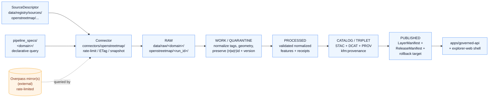

<!-- [KFM_META_BLOCK_V2]
doc_id: kfm://doc/docs-sources-catalog-openstreetmap-overpass-api
title: OpenStreetMap Overpass API
type: product-page
version: v0.2
status: draft
owners: <PLACEHOLDER — Docs steward + Source steward for openstreetmap>
created: 2026-05-20
updated: 2026-05-22
policy_label: public
related:
  - docs/sources/catalog/openstreetmap/README.md
  - docs/sources/catalog/openstreetmap/osm-tiles.md
  - docs/sources/catalog/README.md
  - docs/doctrine/directory-rules.md
  - docs/doctrine/lifecycle-law.md
  - docs/doctrine/trust-membrane.md
  - docs/standards/STAC.md
  - docs/standards/DCAT.md
  - docs/standards/PROV.md
tags: [kfm, docs, sources, catalog, openstreetmap, overpass, query-api, normalization]
notes:
  - "PROPOSED product-page scaffold; sibling-link presence verified in Claude Code session."
  - "Overpass is a query API returning actual OSM feature data — unlike pre-rendered tiles, the lifecycle is fully active (not degenerate)."
  - "OPEN: docs/sources/catalog/ subtree is a PROPOSED extension of the docs/sources/ tree defined in directory-rules.md §6.1."
[/KFM_META_BLOCK_V2] -->

# OpenStreetMap Overpass API

> Read-only query API for targeted OSM feature queries during normalization — feature-bearing, rate-limited, snapshot-pinned.

[](#)
[](#)
[](./README.md)
[](../../../doctrine/authority-ladder.md)
[](#rights-and-sensitivity)
[](#last-reviewed)

**Status:** PROPOSED — product-page scaffold · **Family:** [`openstreetmap`](./README.md) · **Owners:** *PLACEHOLDER — Docs steward + Source steward for openstreetmap* · **Last reviewed:** 2026-05-22

---

## Contents

- [Overview](#overview)
- [Doctrinal posture](#doctrinal-posture)
- [Source authority](#source-authority)
- [Lifecycle and catalog flow (PROPOSED)](#lifecycle-and-catalog-flow-proposed)
- [Catalog profiles used](#catalog-profiles-used)
- [Collection identity](#collection-identity)
- [Provenance fields](#provenance-fields)
- [Temporal handling](#temporal-handling)
- [Geometry and projection](#geometry-and-projection)
- [Rights and sensitivity](#rights-and-sensitivity)
- [Query, rate-limit, and snapshot discipline](#query-rate-limit-and-snapshot-discipline)
- [Validation and catalog closure](#validation-and-catalog-closure)
- [Related contracts and schemas](#related-contracts-and-schemas)
- [Related connectors and pipelines](#related-connectors-and-pipelines)
- [Examples](#examples)
- [Anti-patterns](#anti-patterns)
- [Open questions](#open-questions)
- [Related docs](#related-docs)
- [Last reviewed](#last-reviewed)

---

## Overview

**PROPOSED scaffold.** This product page describes the **OpenStreetMap Overpass API** as a candidate KFM catalog entry. **NEEDS VERIFICATION** for scope, cadence, geographic coverage, current endpoint URL(s), rights status, license terms, and per-query rate-limit posture.

Unlike OSMF pre-rendered raster tiles (see [`osm-tiles.md`](./osm-tiles.md)), Overpass returns **actual OSM feature data** — nodes, ways, and relations with their tags and version metadata — typically as JSON or XML. KFM uses Overpass during **normalization** to perform targeted, bounded queries against OSM: pulling specific features by tag/bbox, enriching existing records, or resolving OSM identifiers that appear in other source families.

> [!IMPORTANT]
> Because Overpass yields feature-level data, the full KFM lifecycle is active here: **RAW → WORK/QUARANTINE → PROCESSED → CATALOG/TRIPLET → PUBLISHED** all participate. This product **is** an evidence-bearing source. That makes source-role, snapshot pinning, and OSM-id preservation more consequential than for the pre-rendered-tiles product.

[↑ Back to top](#openstreetmap-overpass-api)

---

## Doctrinal posture

| KFM doctrine point | Application to this product |
|---|---|
| Source-role anti-collapse | This product carries `observation` or `context` source role depending on use. PROPOSED. Never `regulatory` or `authority` — OSM is community-edited, not authoritative for legal/regulatory claims. The source steward MUST set the role at admission per the SourceDescriptor (NEEDS VERIFICATION on enum values). |
| Cite-or-abstain | OSM features may be cited as evidence **with** their `(n\|w\|r)id` + `version` + retrieval snapshot. A claim sourced from "OSM" without a pinned snapshot is not an admissible citation. PROPOSED. |
| Snapshot pinning | Overpass queries are run against a continuously-edited live database. A normalization run MUST record the **retrieval time** and ideally the **OSM data timestamp** returned by the Overpass server in the response metadata. PROPOSED. |
| Sensitive geometry handling | OSM may contain crowd-sourced data for archaeological sites, rare-species locations, infrastructure, or other sensitive geometry. KFM sensitivity policy applies to Overpass-derived features **after** retrieval; sensitive geometry MUST be generalized, redacted, or denied before public release. NEEDS VERIFICATION on per-domain sensitivity treatment. |
| Public client uses governed interface | The map shell and governed API consume **released** features derived from Overpass via a `LayerManifest` or feature endpoint — never the raw Overpass response. PROPOSED. |
| Rate-limit discipline | Overpass has documented usage policy (rate limits, query timeouts, mirror selection). KFM connectors MUST respect them, analogous to the eBird rate-limit handling pattern (KFM-P2-IDEA-0020 / KFM-P2-PROG-0005). PROPOSED. |

> [!NOTE]
> The doctrinal posture above draws on Pass-23/32 source-role anti-collapse rules, the eBird connector pattern as a precedent for rate-limit-aware ingestion, the CSV-to-GeoJSON starter-lane pattern (KFM-P17-IDEA-0003) for `spec_hash` / `geometry_hash` / `run_receipt` behavior, and the OSM listing in the Roads/Rail source family with rights NEEDS VERIFICATION. It is PROPOSED until reconciled against the live source descriptor, connector, and pipeline-spec for `openstreetmap`.

[↑ Back to top](#openstreetmap-overpass-api)

---

## Source authority

See [`data/registry/sources/`](../../../../data/registry/sources/) for the authoritative SourceDescriptor (CONFIRMED canonical location per `directory-rules.md §7.3`; per-source presence NEEDS VERIFICATION). **Do not duplicate** descriptor fields here. This page **points at** the descriptor; it does not redefine identity, role, rights, cadence, authority scope, or verification obligations.

Default SourceDescriptor schema home is `schemas/contracts/v1/source/` per **ADR-0001**. NEEDS VERIFICATION for actual file presence.

The descriptor MUST capture (PROPOSED minimum):

| Field | Why it matters here |
|---|---|
| `source_id` | Disambiguates the Overpass endpoint family from other OSM products. |
| `source_role` | `observation` for feature-bearing queries; `context` when the query supports a basemap-like reference. NEEDS VERIFICATION on enum values. |
| `endpoint(s)` | One or more Overpass mirror URLs (NEEDS VERIFICATION). |
| `rights_text` | Embedded literally — attribution and usage policy (ML-064-079 analog). |
| `cadence` | Query-driven, not bulk; this is a *demand-paced* source, not a periodic refresh. |
| `rate_limit` | Per-mirror rate-limit posture and KFM's compliance commitment. |
| `sensitivity_default` | Default sensitivity tier for incoming features (e.g., T0 baseline with per-domain overrides). NEEDS VERIFICATION. |
| `citation_rules` | How OSM features are to be cited in EvidenceBundles (`(n\|w\|r)id` + `version` + snapshot time). |

[↑ Back to top](#openstreetmap-overpass-api)

---

## Lifecycle and catalog flow (PROPOSED)

The diagram below is a **PROPOSED** illustration of how this product threads through the KFM lifecycle invariant. Unlike the pre-rendered tiles product, **every phase is active** because Overpass returns feature data that is admitted, normalized, validated, cataloged, and (when policy allows) published as a derived layer. **NEEDS VERIFICATION** against the live `connectors/openstreetmap/`, `pipelines/`, `data/catalog/`, and `release/` artifacts.



> [!WARNING]
> The diagram does **not** assert that any of these paths, connectors, or manifests exist in the mounted repository. It is a PROPOSED structural posture only.

[↑ Back to top](#openstreetmap-overpass-api)

---

## Catalog profiles used

| Profile | Default lane (PROPOSED) | Used by this product? |
|---|---|---|
| STAC | `data/catalog/stac/` | PROPOSED — **Yes** (NEEDS VERIFICATION). Each promoted Overpass-derived feature set or snapshot is expected to register as STAC Item(s) under a product-level Collection. |
| DCAT | `data/catalog/dcat/` | PROPOSED — **Yes** (NEEDS VERIFICATION). DCAT distributions carry license/attribution and access metadata. |
| PROV-O | `data/catalog/prov/` | PROPOSED — **Yes** (NEEDS VERIFICATION). Provenance closure is richer here than for tiles: Overpass query string, mirror used, response timestamp, and downstream normalization steps form a complete provenance chain. |
| Domain projection | `data/catalog/domain/<domain>/` | PROPOSED — **Often Yes** (NEEDS VERIFICATION). Overpass-derived features typically project into a specific domain (Roads/Rail, Settlements/Infrastructure, Hydrology, etc.) depending on the query. |

[↑ Back to top](#openstreetmap-overpass-api)

---

## Collection identity

- **PROPOSED Collection id pattern:** `kfm-<org>-<product>` (from Pass-10 C4-02; see [`IDENTITY.md`](../IDENTITY.md)). Worked candidate: `kfm-osm-overpass` (PROPOSED; per-domain Collections may be needed if scope grows, e.g., `kfm-osm-overpass-roads`, `kfm-osm-overpass-hydrology` — NEEDS VERIFICATION).
- **PROPOSED namespace:** `kfm:` *(per Pass-10 C4-01; see open question OPEN-DSC-03 — namespace choice between `kfm:` and `ks-kfm:` is not yet settled in the corpus).*
- **Asset roles:** NEEDS VERIFICATION — confirm against [`schemas/contracts/v1/source/`](../../../../schemas/contracts/v1/source/) and any STAC asset-role enumeration the catalog enforces. Likely candidates: `data` for the JSON/XML response, `derived` for normalized GeoJSON, `metadata` for query-spec sidecar.

[↑ Back to top](#openstreetmap-overpass-api)

---

## Provenance fields

STAC `properties.kfm:provenance` block (CONFIRMED shape per Pass-10 C4-01; PROPOSED population for this product):

| Field | Meaning | Source-of-truth |
|---|---|---|
| `spec_hash` | sha256 of the canonical record (JCS+SHA-256 baseline). For Overpass, the canonical record includes the query string, target endpoint, and normalization parameters — but **excludes** retrieval_time, analogous to the USDA PLANTS identity pattern (KFM-P2-PROG-0006). | CONFIRMED shape; PROPOSED canonicalization rule. |
| `evidence_bundle_ref` | `kfm://evidence/<digest>` resolving to a content-addressed EvidenceBundle containing the query, response snapshot, validation report, and per-feature `(n\|w\|r)id` + `version`. | CONFIRMED shape; PROPOSED population. |
| `run_record_ref` | `kfm://run/<run-id>` for the connector + normalization run. | CONFIRMED shape. |
| `audit_ref` | `kfm://audit/<attestation-id>` for SLSA / cosign / DSSE attestation over the catalog build artifacts. | CONFIRMED shape; PROPOSED for this product. |
| `policy_digest` | sha256 of the policy bundle used at promotion. | CONFIRMED shape. |

Per-asset integrity: `file:checksum` (CONFIRMED). The Overpass response payload, the normalized GeoJSON, and the query-spec sidecar all SHOULD carry a checksum. This is meaningfully more applicable here than for the externally-rendered tile product, because KFM **does** control the artifact bytes once they land in `data/raw/`.

[↑ Back to top](#openstreetmap-overpass-api)

---

## Temporal handling

PROPOSED — distinct source / observed / valid / retrieval / release / correction times where material. NEEDS VERIFICATION per product. For Overpass, the relevant time stamps are (PROPOSED):

| Time | Notes |
|---|---|
| `source_time` | The OSM **data timestamp** returned by the Overpass server in the response (often labeled `osm_base` or similar). PROPOSED to capture verbatim. |
| `observed_time` | When the KFM connector executed the query. PROPOSED. |
| `valid_time` | The currency window the KFM `LayerManifest` is willing to assert for the derived feature set. PROPOSED. |
| `retrieval_time` | Equivalent to `observed_time` here; PROPOSED to use one or the other consistently. **Excluded from `spec_hash`** to keep identity stable across re-queries with the same canonical inputs. |
| `release_time` | When the LayerManifest / ReleaseManifest was promoted. PROPOSED. |
| `correction_time` | When a CorrectionNotice was issued (e.g., upstream OSM edit invalidates a published feature). PROPOSED. |

Per-feature temporal handling is also active: each OSM element carries its own `version` and `timestamp` from the OSM history, which MUST be preserved alongside the KFM-side times.

[↑ Back to top](#openstreetmap-overpass-api)

---

## Geometry and projection

PROPOSED — confirm CRS, generalization rules, and scale support against `data/catalog/` artifacts. NEEDS VERIFICATION.

Typical posture (PROPOSED, NEEDS VERIFICATION):

- Native OSM coordinates are **WGS84 (EPSG:4326)** decimal degrees. Store geometry in 4326 at admission. Per ML-061-096, **keep analysis CRS separate from web-delivery CRS**: re-project to EPSG:5070 (or equivalent) for analysis where needed and to EPSG:3857 only for web tile delivery, with both projections recorded in the manifest.
- Geometry normalization MUST record the CRS tag in receipts (KFM-P24-PROG-0025, PROPOSED).
- Geometry validity (closed rings, non-self-intersecting polygons, etc.) and a deterministic `geometry_hash` (analogous to KFM-P17-IDEA-0003) are required for `EvidenceBundle` closure.
- Generalization rules are KFM-side, not upstream. Apply per-domain rules to the normalized features before any public release.

[↑ Back to top](#openstreetmap-overpass-api)

---

## Rights and sensitivity

NEEDS VERIFICATION — see [`policy/sensitivity/`](../../../../policy/sensitivity/) and [`RIGHTS-AND-SENSITIVITY-MAP.md`](../RIGHTS-AND-SENSITIVITY-MAP.md). **Do not restate policy here.**

The KFM corpus lists OpenStreetMap among source families whose "rights and current terms" are explicitly **NEEDS VERIFICATION**, with sensitive joins required to fail closed. That posture applies here.

> [!WARNING]
> **OSM data license and Overpass usage policy are separate operational concerns.** Both must be resolved by the source steward and rights reviewer before any feature derived from Overpass is promoted to `PUBLISHED`. Attribution text MUST be embedded literally in the `LayerManifest` (ML-064-079 analog). Until resolved, treat this product as **NEEDS VERIFICATION** for both license and operational use.

Sensitive-geometry concerns are non-trivial for Overpass-derived features:

- Crowd-sourced OSM data can contain archaeological site coordinates, rare-species locations, critical-infrastructure detail, or culturally sensitive geometry. The KFM sensitivity rubric applies **after** retrieval; sensitive features MUST be generalized, redacted, delayed, or denied per the policy bundle before public release.
- KFM cannot rely on upstream redaction in OSM — sensitivity classification is a KFM responsibility once features enter `data/raw/`.

[↑ Back to top](#openstreetmap-overpass-api)

---

## Query, rate-limit, and snapshot discipline

This section captures concerns that the pre-rendered-tiles product does not face. All items here are PROPOSED.

| Concern | Required posture (PROPOSED) |
|---|---|
| Mirror selection | The SourceDescriptor MUST enumerate accepted Overpass mirror endpoints; the connector MUST record which mirror served each query in the RunReceipt. |
| Rate limits | The connector MUST respect documented Overpass usage policy (rate-limit handling discipline; see eBird precedent, KFM-P2-PROG-0005). Excess pressure MUST trigger backoff, not retry-flood. |
| Query timeouts | Each query MUST declare a server-side timeout. Queries that exceed it are admission failures and route to `data/quarantine/...` with a reason recorded. |
| Snapshot pinning | The Overpass response includes a data timestamp. The connector MUST capture this verbatim into the EvidenceBundle. Re-runs against the same canonical query that return a *newer* snapshot MUST be treated as material-change events, not silent updates. |
| Query reproducibility | The exact Overpass QL query string MUST be stored in `pipeline_specs/<domain>/` (declarative, what to run) and referenced from the connector RunReceipt (executable, how it ran). |
| Pagination / size limits | Large bbox queries that exceed practical response sizes MUST be tiled or split with deterministic ordering, and the splitting strategy recorded in the spec. |
| OSM id + version preservation | Every normalized feature MUST preserve the OSM `type` (node/way/relation), `id`, and `version` so that downstream Evidence Drawer can resolve back to the source element. |

[↑ Back to top](#openstreetmap-overpass-api)

---

## Validation and catalog closure

- Catalog closure required before public release (Pass-10 / KFM-P1-IDEA-0020). CONFIRMED doctrine.
- STAC Projection lint (KFM-P27-FEAT-0003) — PROPOSED.
- STAC checksum closure against the ReleaseManifest digest (KFM-P22-PROG-0037) — PROPOSED.
- HTTP-validator receipts (ETag, Last-Modified, content-length, manifest checksums) — PROPOSED per `connectors/` README contract (CONFIRMED in `directory-rules.md §7.3`; per-source application NEEDS VERIFICATION). Overpass commonly returns cache-aware headers; the connector SHOULD use them to avoid redundant load on mirrors.
- Rights-text presence check — PROPOSED (attribution text MUST be embedded literally; ML-064-079 analog).
- OSM-id schema check — PROPOSED. A normalized feature missing `type` / `id` / `version` is an admission failure.
- Query-spec hash check — PROPOSED. The canonical `spec_hash` of the query must round-trip cleanly under JCS+SHA-256.
- Snapshot-monotonicity check — PROPOSED. A re-query returning an *older* snapshot than a prior accepted snapshot is a quarantine trigger.

[↑ Back to top](#openstreetmap-overpass-api)

---

## Related contracts and schemas

| Object | Default home (PROPOSED) | Status |
|---|---|---|
| SourceDescriptor | `schemas/contracts/v1/source/` per ADR-0001 | NEEDS VERIFICATION. |
| QuerySpec (Overpass QL + parameters) | `schemas/contracts/v1/source/` or `pipeline_specs/<domain>/` (PROPOSED) | NEEDS VERIFICATION. |
| RunReceipt | `schemas/contracts/v1/runtime/` (PROPOSED) | NEEDS VERIFICATION. |
| EvidenceBundle / EvidenceRef | per Pass-26 PROG-0004 / PROG-0005 (PROPOSED) | NEEDS VERIFICATION. |
| LayerManifest | `schemas/contracts/v1/map/` or `contracts/map/` (PROPOSED) | NEEDS VERIFICATION. |
| Contract semantics | `contracts/` | NEEDS VERIFICATION. |

[↑ Back to top](#openstreetmap-overpass-api)

---

## Related connectors and pipelines

- `connectors/openstreetmap/` — PROPOSED canonical home per `directory-rules.md §7.3`. NEEDS VERIFICATION for current presence and source-alias normalization. Output MUST land in `data/raw/<domain>/openstreetmap/<run_id>/` (or `data/quarantine/...` on failure) per the connectors README contract.
- `pipelines/ingest/`, `pipelines/normalize/`, `pipelines/validate/`, `pipelines/catalog/` — PROPOSED stages; **all active** for this product.
- `pipeline_specs/<domain>/` — PROPOSED declarative spec home. The Overpass QL query string, target tag predicates, bbox, and timeout MUST live here, not in connector code (separation of declarative *what* from executable *how*, per `directory-rules.md §7.4`).

[↑ Back to top](#openstreetmap-overpass-api)

---

## Examples

*(Illustrative only — do not treat as authoritative.)*

See [`_examples/stac-item-example.json`](../_examples/stac-item-example.json) for the minimal STAC + `kfm:provenance` shape used across this catalog. Sibling-link presence verified in a Claude Code session; mounted-repo presence remains **NEEDS VERIFICATION**.

<details>
<summary><strong>Illustrative <code>kfm:provenance</code> sketch for an Overpass-derived Item (PROPOSED)</strong></summary>

```jsonc
// Illustrative only — NOT a real record. PROPOSED shape per Pass-10 C4-01.
// Truth labels: every value here is PROPOSED or NEEDS-VERIFICATION.
{
  "type": "Feature",                                               // STAC Item is GeoJSON Feature
  "stac_version": "1.0.0",                                         // NEEDS VERIFICATION
  "id": "kfm-osm-overpass-2026-05-22-<run-id>",                    // PROPOSED id pattern
  "collection": "kfm-osm-overpass",                                // PROPOSED collection id
  "geometry": { "type": "Polygon", "coordinates": ["<bbox-as-polygon>"] },
  "properties": {
    "datetime": "<observed_time>",                                 // PROPOSED — connector run time
    "kfm:source_role": "observation",                              // PROPOSED enum
    "kfm:query": {                                                 // PROPOSED — query-spec sidecar
      "endpoint": "<NEEDS-VERIFICATION mirror url>",
      "overpass_ql": "<canonical query string>",
      "timeout_s": 25,
      "osm_base": "<source_time from Overpass response>"
    },
    "kfm:provenance": {                                            // CONFIRMED shape per C4-01
      "spec_hash": "sha256:<NEEDS-VERIFICATION>",                  // JCS+SHA-256 of canonical record
      "evidence_bundle_ref": "kfm://evidence/<NEEDS-VERIFICATION>",
      "run_record_ref": "kfm://run/<NEEDS-VERIFICATION>",
      "audit_ref": "kfm://audit/<NEEDS-VERIFICATION>",
      "policy_digest": "sha256:<NEEDS-VERIFICATION>"
    }
  },
  "assets": {
    "raw_response": {
      "href": "<NEEDS-VERIFICATION>",
      "type": "application/json",
      "roles": ["data"],
      "file:checksum": "sha256:<NEEDS-VERIFICATION>"               // CONFIRMED shape
    },
    "normalized_geojson": {
      "href": "<NEEDS-VERIFICATION>",
      "type": "application/geo+json",
      "roles": ["derived"],
      "file:checksum": "sha256:<NEEDS-VERIFICATION>"
    },
    "query_spec": {
      "href": "<NEEDS-VERIFICATION>",
      "type": "application/json",
      "roles": ["metadata"],
      "file:checksum": "sha256:<NEEDS-VERIFICATION>"
    }
  }
}
```

</details>

[↑ Back to top](#openstreetmap-overpass-api)

---

## Anti-patterns

The KFM corpus names these failure modes explicitly. They all apply here:

| Anti-pattern | Why it fails for this product | Counter-rule |
|---|---|---|
| Running ad-hoc Overpass queries from app code | Bypasses governed `pipeline_specs/`, `RunReceipt`, and snapshot pinning. | All Overpass queries flow through `connectors/openstreetmap/` driven by a declarative `pipeline_specs/<domain>/` entry. |
| Citing an OSM feature without `(n\|w\|r)id` + `version` + snapshot time | Cite-or-abstain is violated; the citation does not resolve to a reproducible source state. | Every normalized feature preserves OSM type/id/version; EvidenceBundle records the snapshot timestamp. |
| Treating a live re-query as a silent update | Silently overwriting prior derived features hides material change and breaks rollback. | A re-query that returns a newer snapshot is a material-change event with explicit promotion / rollback path. |
| Ignoring Overpass rate-limit / usage policy | Operational anti-pattern; risks endpoint blocking and undermines KFM's standing as a good-faith consumer. | Connector implements backoff and respects per-mirror policy; rate-limit posture is recorded in the SourceDescriptor. |
| Treating OSM as a regulatory or legal-authority source | OSM is community-edited; source-role collapse risks false legal claims. | `source_role` for Overpass is `observation` or `context`, never `regulatory` or `authority`. |
| Hiding sensitive geometry behind a query filter | KFM does not control what OSM contains; sensitive geometry can re-emerge in any retrieval. | Sensitive-geometry generalization/redaction/denial happens **after** admission, by KFM policy. |
| Treating Overpass output as canonical truth | Overpass returns a *snapshot of an editable database*; the snapshot is evidence, not truth. | Public claims route through Evidence Drawer / Focus Mode with cite-or-abstain. |

[↑ Back to top](#openstreetmap-overpass-api)

---

## Open questions

- **OPEN** — confirm cadence policy (event-triggered, per-domain refresh schedule, or on-demand only) and the set of accepted mirror endpoints.
- **OPEN** — confirm rights status (data license, Overpass usage policy compliance) and CARE applicability per domain (CARE may apply for crowd-sourced features overlapping sovereign territories — NEEDS VERIFICATION per `policy/sensitivity/`).
- **OPEN** — confirm whether one `kfm-osm-overpass` Collection holds all Overpass-derived Items, or whether per-domain Collections (`kfm-osm-overpass-roads`, `kfm-osm-overpass-hydrology`, etc.) are preferred.
- **OPEN-DSC-03 (inherited)** — namespace choice (`kfm:` vs `ks-kfm:`) for the `kfm:provenance` block.
- **OPEN — path placement** — `docs/sources/catalog/openstreetmap/` is a PROPOSED extension of the `docs/sources/` tree defined in `directory-rules.md §6.1`. The canonical `docs/sources/` enumeration lists `standards/`, `security/`, `governance/`, `intake/`, `archive/`, `reports/`, `atlases/`, and `brand/` — no `catalog/`. NEEDS VERIFICATION via ADR or Directory Rules update before this path is treated as canonical.
- **OPEN** — schema home for the QuerySpec object (Overpass QL + parameters): does it sit in `schemas/contracts/v1/source/` alongside SourceDescriptor, or in `pipeline_specs/` as a declarative spec? An ADR is likely needed.
- **OPEN** — how to represent OSM history `version` numbers across re-queries that pick up new edits without overwriting prior cited evidence (rollback vs supersession).

[↑ Back to top](#openstreetmap-overpass-api)

---

## Related docs

- [`openstreetmap/README.md`](./README.md) — source-family overview.
- [`openstreetmap/osm-tiles.md`](./osm-tiles.md) — sibling product page (pre-rendered raster tiles; reference-context only).
- [`../README.md`](../README.md) — catalog index.
- [`../IDENTITY.md`](../IDENTITY.md) — collection-id pattern and namespace policy.
- [`../RIGHTS-AND-SENSITIVITY-MAP.md`](../RIGHTS-AND-SENSITIVITY-MAP.md) — rights/sensitivity classification.
- [`../../doctrine/directory-rules.md`](../../../doctrine/directory-rules.md) — placement and authority rules.
- [`../../doctrine/lifecycle-law.md`](../../../doctrine/lifecycle-law.md) — RAW → PUBLISHED invariant.
- [`../../doctrine/trust-membrane.md`](../../../doctrine/trust-membrane.md) — public-client / canonical-store separation.
- [`../../standards/STAC.md`](../../../standards/STAC.md) — STAC + `kfm:provenance` profile.
- [`../../standards/DCAT.md`](../../../standards/DCAT.md) — DCAT profile.
- [`../../standards/PROV.md`](../../../standards/PROV.md) — provenance profile (see OPEN-DR-01 on `PROV.md` vs `PROVENANCE.md`).
- *TODO* — `connectors/openstreetmap/README.md` (path PROPOSED; presence NEEDS VERIFICATION).
- *TODO* — `pipeline_specs/<domain>/openstreetmap-overpass.yaml` or equivalent declarative spec (path PROPOSED; presence NEEDS VERIFICATION).

[↑ Back to top](#openstreetmap-overpass-api)

---

## Last reviewed

**2026-05-22** *(Claude Code product-page polish session; revised from the 2026-05-20 scaffold.)*

[↑ Back to top](#openstreetmap-overpass-api)
