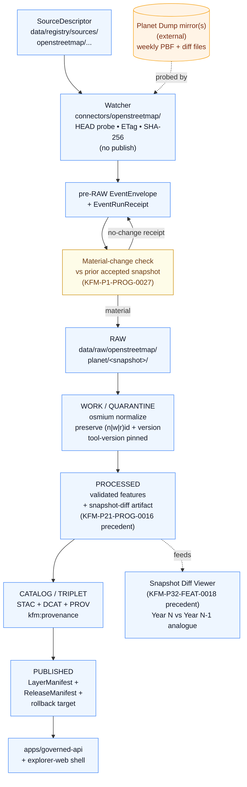

<!-- [KFM_META_BLOCK_V2]
doc_id: kfm://doc/docs-sources-catalog-openstreetmap-planet-dump
title: OpenStreetMap Planet Dump
type: product-page
version: v0.2
status: draft
owners: <PLACEHOLDER — Docs steward + Source steward for openstreetmap>
created: 2026-05-20
updated: 2026-05-22
policy_label: public
related:
  - docs/sources/catalog/openstreetmap/README.md
  - docs/sources/catalog/openstreetmap/osm-tiles.md
  - docs/sources/catalog/openstreetmap/overpass-api.md
  - docs/sources/catalog/README.md
  - docs/doctrine/directory-rules.md
  - docs/doctrine/lifecycle-law.md
  - docs/doctrine/trust-membrane.md
  - docs/standards/STAC.md
  - docs/standards/DCAT.md
  - docs/standards/PROV.md
tags: [kfm, docs, sources, catalog, openstreetmap, planet, pbf, bulk, snapshot-diff]
notes:
  - "PROPOSED product-page scaffold; sibling-link presence verified in Claude Code session."
  - "Bulk path: weekly cadence, snapshot + diff discipline, deterministic PBF processing. Distinct from Overpass (query/demand) and OSMF tiles (rendered/reference)."
  - "OPEN: docs/sources/catalog/ subtree is a PROPOSED extension of the docs/sources/ tree defined in directory-rules.md §6.1."
[/KFM_META_BLOCK_V2] -->

# OpenStreetMap Planet Dump

> Full-extent OSM planet-level dump for full-coverage processing — weekly snapshot cadence, deterministic PBF inputs, snapshot-and-diff discipline.

[](#)
[](#)
[](./README.md)
[](#cadence-and-snapshot-diff-discipline)
[](../../../doctrine/authority-ladder.md)
[](#rights-and-sensitivity)
[](#last-reviewed)

**Status:** PROPOSED — product-page scaffold · **Family:** [`openstreetmap`](./README.md) · **Owners:** *PLACEHOLDER — Docs steward + Source steward for openstreetmap* · **Last reviewed:** 2026-05-22

---

## Contents

- [Overview](#overview)
- [Doctrinal posture](#doctrinal-posture)
- [Position among sibling OSM products](#position-among-sibling-osm-products)
- [Source authority](#source-authority)
- [Lifecycle and catalog flow (PROPOSED)](#lifecycle-and-catalog-flow-proposed)
- [Catalog profiles used](#catalog-profiles-used)
- [Collection identity](#collection-identity)
- [Provenance fields](#provenance-fields)
- [Temporal handling](#temporal-handling)
- [Geometry and projection](#geometry-and-projection)
- [Rights and sensitivity](#rights-and-sensitivity)
- [Cadence and snapshot-diff discipline](#cadence-and-snapshot-diff-discipline)
- [Storage, processing, and tooling concerns](#storage-processing-and-tooling-concerns)
- [Validation and catalog closure](#validation-and-catalog-closure)
- [Related contracts and schemas](#related-contracts-and-schemas)
- [Related connectors and pipelines](#related-connectors-and-pipelines)
- [Examples](#examples)
- [Anti-patterns](#anti-patterns)
- [Open questions](#open-questions)
- [Related docs](#related-docs)
- [Last reviewed](#last-reviewed)

---

## Overview

**PROPOSED scaffold.** This product page describes the **OpenStreetMap Planet Dump** as a candidate KFM catalog entry. **NEEDS VERIFICATION** for scope, cadence, geographic coverage, current endpoint URL(s), rights status, license terms, and per-snapshot validation gates.

A Planet Dump is the full OSM database serialized as a single bulk artifact — typically in **PBF** (Protocol Buffer Binary Format), with XML available as a secondary option. KFM uses Planet Dumps (or regional extracts derived from them) for **full-coverage processing** that cannot be served by a query API: bulk geometry/tag normalization, downstream graph builds (e.g., the Valhalla routing graph pattern in KFM-P10-PROG-0008), and reproducible snapshot baselines for diff comparisons.

> [!IMPORTANT]
> Like the Overpass product but unlike the pre-rendered tiles product, the Planet Dump is **feature-bearing** — the full lifecycle (RAW → WORK/QUARANTINE → PROCESSED → CATALOG/TRIPLET → PUBLISHED) is active. Unlike Overpass, the Planet Dump is **cadence-driven** (weekly snapshots) rather than demand-driven, which makes snapshot-and-diff discipline a first-class concern.

[↑ Back to top](#openstreetmap-planet-dump)

---

## Doctrinal posture

| KFM doctrine point | Application to this product |
|---|---|
| Source-role anti-collapse | `observation` or `context`; never `regulatory` or `authority` (OSM is community-edited). PROPOSED. |
| Cite-or-abstain | OSM features cited from Planet Dumps MUST carry their `(n\|w\|r)id` + `version` + the **dump's source timestamp** (the `osmosis_replication_timestamp` in PBF headers, or equivalent). PROPOSED. |
| Snapshot pinning | Each accepted Planet Dump is a **content-addressed snapshot** identified by the SHA-256 of the PBF bytes plus the PBF header's replication timestamp. The Valhalla precedent (ML-057-041) explicitly records OSM SHA-256 in derived metadata. |
| Diff-first cadence | Weekly snapshots are not silently overwritten. Each accepted snapshot produces a structured diff against the prior accepted snapshot (analogous to HUC12 snapshot diff in KFM-P21-PROG-0016 and the SSURGO yearly diff viewer in KFM-P32-FEAT-0018). |
| Material-change watcher | New snapshots emit pre-RAW events that are checked against materiality rules before scheduling downstream processing (KFM-P1-PROG-0027). Below-threshold churn is a no-op receipt, not a republication. |
| Deterministic processing | Bulk PBF processing MUST pin tool versions (osmium-tool, osmpbf reader, etc.) in the RunReceipt; same input + same tool versions + same params SHOULD yield byte-identical output (Valhalla precedent KFM-P10-PROG-0008). |
| Watcher-as-non-publisher | The watcher detects new planet snapshots, validates headers/checksums, and emits receipts. It MUST NOT publish (`directory-rules.md §7.3`, `directory-rules.md §7.4`, Build Manual §8.3). |
| Sensitive geometry handling | Bulk extracts can sweep in archaeological coordinates, rare-species locations, critical infrastructure detail. KFM sensitivity policy applies post-admission; sensitive geometry MUST be generalized / redacted / denied before public release. |

> [!NOTE]
> The doctrinal posture above is grounded in: (a) the Valhalla routing graph build pattern (KFM-P10-PROG-0008) and its OSM-SHA-256 propagation rule (ML-057-041); (b) the snapshot-diff precedents (KFM-P21-PROG-0016 HUC12, KFM-P32-FEAT-0018 SSURGO); (c) the material-change watcher validation pattern (KFM-P1-PROG-0027); (d) the SourceDescriptor minimum-fields template in the *Unified Implementation Architecture Build Manual* §8.2 with `cadence: "weekly"`; (e) the material-change sidecar guidance for high-churn sources in §8.4. All implementation-level claims remain PROPOSED until verified against the live repository.

[↑ Back to top](#openstreetmap-planet-dump)

---

## Position among sibling OSM products

| Product | Returns | Cadence model | Lifecycle (KFM) | Typical use |
|---|---|---|---|---|
| [`osm-tiles.md`](./osm-tiles.md) — Pre-rendered tiles | Rendered raster pixels | On-demand, externally rendered | Mostly degenerate (reference-context) | Visual basemap reference only. |
| [`overpass-api.md`](./overpass-api.md) — Overpass API | Targeted OSM features (live DB snapshot) | Demand-driven, rate-limited | **Fully active** | Targeted normalization-time queries. |
| **this page** — Planet Dump | Bulk OSM features (full database) | **Cadence-driven (weekly)** | **Fully active** | Bulk processing, graph builds, snapshot baselines. |

> [!TIP]
> Choose Planet Dump when the query would be wider than Overpass should sensibly carry (full-coverage rebuilds, downstream graph artifacts, deterministic snapshot baselines). Choose Overpass for narrow per-feature retrievals. Choose pre-rendered tiles only as a visual reference layer, never as feature evidence.

[↑ Back to top](#openstreetmap-planet-dump)

---

## Source authority

See [`data/registry/sources/`](../../../../data/registry/sources/) for the authoritative SourceDescriptor (CONFIRMED canonical location per `directory-rules.md §7.3`; per-source presence NEEDS VERIFICATION). **Do not duplicate** descriptor fields here. This page **points at** the descriptor; it does not redefine identity, role, rights, cadence, authority scope, or verification obligations.

Default SourceDescriptor schema home is `schemas/contracts/v1/source/` per **ADR-0001**. NEEDS VERIFICATION for actual file presence.

The descriptor SHOULD capture (PROPOSED, mapped to Build Manual §8.2 minimum fields):

| Field | Why it matters here |
|---|---|
| `source_id` | Disambiguates the Planet Dump source family from Overpass and from pre-rendered tiles. |
| `source_role` | `observation` for feature-bearing use; `context` when only present as a baseline. NEEDS VERIFICATION on enum values. |
| `source_family` | `openstreetmap` (or domain-specific where the extract is domain-scoped). |
| `rights.license` / `rights.terms_url` / `rights.attribution_required` | License and attribution posture; NEEDS VERIFICATION. |
| `rights.public_release_allowed` | Default posture for derivative public release; NEEDS VERIFICATION. |
| `update.cadence` | `weekly` (PROPOSED, matching the documented planet-dump release schedule pattern; NEEDS VERIFICATION). |
| `update.watcher_allowed` | `true` (PROPOSED). |
| `update.materiality_rule_id` | Reference to the policy rule that defines when a new snapshot warrants downstream processing. PROPOSED. |
| `sensitivity.default_access` | PROPOSED default (`public` with per-domain overrides). NEEDS VERIFICATION. |
| `verification.status` | `NEEDS_VERIFICATION` (matches the template default in Build Manual §8.2). |

[↑ Back to top](#openstreetmap-planet-dump)

---

## Lifecycle and catalog flow (PROPOSED)

The diagram below is a **PROPOSED** illustration of how this product threads through the KFM lifecycle. All phases are active. The watcher path on the left is distinct from the processing path on the right — the watcher emits pre-RAW events and receipts but never publishes (Build Manual §8.3; `directory-rules.md §7.3`). **NEEDS VERIFICATION** against the live `connectors/openstreetmap/`, `pipelines/`, `data/catalog/`, and `release/` artifacts.



> [!WARNING]
> The diagram does **not** assert that any of these paths, connectors, manifests, or viewers exist in the mounted repository. It is a PROPOSED structural posture only.

[↑ Back to top](#openstreetmap-planet-dump)

---

## Catalog profiles used

| Profile | Default lane (PROPOSED) | Used by this product? |
|---|---|---|
| STAC | `data/catalog/stac/` | PROPOSED — **Yes** (NEEDS VERIFICATION). Each accepted snapshot is expected to register as an STAC Item (or Items, where regionally split) under a product-level Collection. |
| DCAT | `data/catalog/dcat/` | PROPOSED — **Yes** (NEEDS VERIFICATION). DCAT distributions carry license/attribution and access metadata. |
| PROV-O | `data/catalog/prov/` | PROPOSED — **Yes** (NEEDS VERIFICATION). Provenance closure is rich: snapshot identity (SHA-256 + replication timestamp), mirror used, watcher receipt, normalization run, downstream derived layers. |
| Domain projection | `data/catalog/domain/<domain>/` | PROPOSED — **Often Yes** (NEEDS VERIFICATION). Planet-derived features typically project into domains (Roads/Rail, Settlements/Infrastructure, Hydrology, etc.). |

[↑ Back to top](#openstreetmap-planet-dump)

---

## Collection identity

- **PROPOSED Collection id pattern:** `kfm-<org>-<product>` (from Pass-10 C4-02; see [`IDENTITY.md`](../IDENTITY.md)). Worked candidates: `kfm-osm-planet` (PROPOSED for full planet) or `kfm-osm-planet-<region>` (e.g., `kfm-osm-planet-kansas`) when a regional extract is the working scope. NEEDS VERIFICATION.
- **PROPOSED namespace:** `kfm:` *(per Pass-10 C4-01; OPEN-DSC-03 namespace question between `kfm:` and `ks-kfm:` is not yet settled in the corpus).*
- **Asset roles:** NEEDS VERIFICATION — confirm against [`schemas/contracts/v1/source/`](../../../../schemas/contracts/v1/source/) and the STAC asset-role enumeration the catalog enforces. Likely candidates: `data` for the PBF, `derived` for normalized GeoParquet/GeoJSON, `metadata` for the diff sidecar, `documentation` for the dump's manifest/replication header.

[↑ Back to top](#openstreetmap-planet-dump)

---

## Provenance fields

STAC `properties.kfm:provenance` block (CONFIRMED shape per Pass-10 C4-01; PROPOSED population for this product):

| Field | Meaning | Source-of-truth |
|---|---|---|
| `spec_hash` | sha256 of the canonical record (JCS+SHA-256 baseline). For Planet Dumps the canonical record includes the source endpoint, the target snapshot identifier, and normalization parameters — but excludes retrieval_time. | CONFIRMED shape; PROPOSED canonicalization rule. |
| `evidence_bundle_ref` | `kfm://evidence/<digest>` resolving to a content-addressed EvidenceBundle that includes the PBF SHA-256, the PBF header replication timestamp, the watcher receipt, the normalization RunReceipt, and the diff artifact reference. | CONFIRMED shape. |
| `run_record_ref` | `kfm://run/<run-id>` for the connector + normalization run; MUST include pinned tool versions (osmium, osmpbf, etc.). | CONFIRMED shape. |
| `audit_ref` | `kfm://audit/<attestation-id>` for SLSA / cosign / DSSE attestation over the snapshot artifacts. | CONFIRMED shape; PROPOSED. |
| `policy_digest` | sha256 of the policy bundle used at promotion. | CONFIRMED shape. |

Per-asset integrity: `file:checksum` (CONFIRMED) — fully applicable here. KFM controls the artifact bytes once they land in `data/raw/`, and the upstream PBF itself is byte-stable for a given snapshot, so the per-asset checksum is the strongest identity anchor in the OSM source family.

[↑ Back to top](#openstreetmap-planet-dump)

---

## Temporal handling

PROPOSED — distinct source / observed / valid / retrieval / release / correction times where material. NEEDS VERIFICATION per product. For Planet Dumps the relevant time stamps are:

| Time | Notes |
|---|---|
| `source_time` | The PBF header's replication timestamp (`osmosis_replication_timestamp` or equivalent). PROPOSED to capture verbatim. This is the most reliable "as-of" time for the snapshot. |
| `observed_time` | When the watcher last verified mirror availability and headers. PROPOSED. |
| `valid_time` | The currency window the `LayerManifest` is willing to assert. PROPOSED to default to one release cycle (PROPOSED: 7 days) unless overridden per domain. |
| `retrieval_time` | When the connector finished downloading the PBF bytes. **Excluded from `spec_hash`** to keep canonical-record identity stable. |
| `release_time` | When the LayerManifest / ReleaseManifest for the derived layer was promoted. PROPOSED. |
| `correction_time` | When a CorrectionNotice was issued (e.g., upstream OSM revert invalidated downstream features). PROPOSED. |

Per-feature temporal handling: each OSM element carries its own `version` and `timestamp` from the OSM history; both MUST be preserved alongside KFM-side times.

[↑ Back to top](#openstreetmap-planet-dump)

---

## Geometry and projection

PROPOSED — confirm CRS, generalization rules, and scale support against `data/catalog/` artifacts. NEEDS VERIFICATION.

Typical posture (PROPOSED):

- Native OSM coordinates are **WGS84 (EPSG:4326)** decimal degrees. Store geometry in 4326 at admission.
- Per ML-061-096, **keep analysis CRS separate from web-delivery CRS**: re-project to EPSG:5070 (or equivalent) for analysis where needed and to EPSG:3857 only for web tile delivery, with both projections recorded in the manifest.
- Geometry normalization MUST record the CRS tag in receipts (KFM-P24-PROG-0025, PROPOSED).
- Geometry validity (closed rings, non-self-intersecting polygons) and a deterministic `geometry_hash` (analogous to KFM-P17-IDEA-0003) are required for `EvidenceBundle` closure.
- Generalization rules are KFM-side, not upstream. Apply per-domain rules to the normalized features before any public release.

[↑ Back to top](#openstreetmap-planet-dump)

---

## Rights and sensitivity

NEEDS VERIFICATION — see [`policy/sensitivity/`](../../../../policy/sensitivity/) and [`RIGHTS-AND-SENSITIVITY-MAP.md`](../RIGHTS-AND-SENSITIVITY-MAP.md). **Do not restate policy here.**

The KFM corpus lists OpenStreetMap among source families whose "rights and current terms" are explicitly **NEEDS VERIFICATION**, with sensitive joins required to fail closed. That posture applies here.

> [!WARNING]
> **OSM data license and Planet Dump distribution terms are separate operational concerns** (mirror selection, attribution, derivative-share-alike obligations). Both must be resolved by the source steward and rights reviewer before any feature derived from a Planet Dump is promoted to `PUBLISHED`. Attribution text MUST be embedded literally in the `LayerManifest` (ML-064-079 analog). Until resolved, treat this product as **NEEDS VERIFICATION** for both license and operational use.

Sensitive-geometry concerns at planet scale are larger than at query scale:

- A full-coverage extract sweeps in **everything** that OSM contains, including crowd-sourced archaeological coordinates, rare-species locations, critical-infrastructure detail, and culturally sensitive geometry.
- KFM sensitivity classification is a post-admission responsibility; sensitive features MUST be generalized, redacted, delayed, or denied per the policy bundle before public release.
- A sensitive-geometry sweep gate (PROPOSED) SHOULD run as part of the WORK phase on each new snapshot, with a fail-closed quarantine path.

[↑ Back to top](#openstreetmap-planet-dump)

---

## Cadence and snapshot-diff discipline

This section captures concerns that distinguish the Planet Dump product from its siblings. All items are PROPOSED.

| Concern | Required posture (PROPOSED) |
|---|---|
| Release cadence | **Weekly** (PROPOSED, matching the documented OSM planet-dump release schedule pattern; NEEDS VERIFICATION). Recorded in the SourceDescriptor `update.cadence` field per Build Manual §8.2. |
| Watcher cadence | At least weekly probe of mirror headers (`HEAD` request + ETag/Last-Modified comparison); a new snapshot triggers a pre-RAW EventEnvelope per Build Manual §8.3. |
| Material-change gate | A new snapshot does **not** automatically schedule downstream processing. The materiality check (KFM-P1-PROG-0027) runs with threshold fixtures, no-op fixtures, and edge cases. Below-threshold churn produces a no-change receipt (KFM-P25-FEAT-0008 precedent). |
| Snapshot identity | Each accepted snapshot is identified by **(1)** the SHA-256 of the PBF bytes (Valhalla precedent ML-057-041), **(2)** the PBF header replication timestamp, and **(3)** the KFM-side snapshot label (PROPOSED format: `planet-<YYYYMMDD>-sha256-<short>`). |
| Snapshot-diff artifact | Each accepted snapshot produces a structured diff against the prior accepted snapshot — add / remove / geometry-change records, analogous to KFM-P21-PROG-0016 (HUC12). PROPOSED. |
| Diff viewer | A diff viewer comparing snapshot N vs N-1 is a downstream affordance (KFM-P32-FEAT-0018 SSURGO precedent). PROPOSED. |
| Friday weekly report participation | Snapshot acceptances, no-change receipts, and material-change events feed the Friday Material-Change Weekly Report (C14-03). PROPOSED. |
| Regional extract option | A regional extract (e.g., Kansas-bounded) is a valid alternative when full-planet processing is over-budget. The extract is itself a derived snapshot with its own SHA-256 and provenance. PROPOSED. |
| Replication-diff option | Replication change files (minutely / hourly / daily diffs) are an upstream pattern KFM **may** consume in addition to weekly planet dumps. NEEDS VERIFICATION on whether to enable. |

[↑ Back to top](#openstreetmap-planet-dump)

---

## Storage, processing, and tooling concerns

PROPOSED concerns specific to the bulk-dump nature of this product. NEEDS VERIFICATION on all numbers and tool choices.

| Concern | PROPOSED posture |
|---|---|
| Storage footprint | Full-planet PBF is large (multi-tens-of-GB, growing). `data/raw/openstreetmap/planet/<snapshot>/` SHOULD be content-addressed by SHA-256, with retention policy declared (e.g., last N accepted snapshots). |
| Regional extracts | Where the working scope is Kansas-only (or a small set of domains), a regional extract is preferred over the full planet to keep raw storage and processing budgets bounded. |
| Processing time | Bulk normalization is hours-scale. Pipeline-spec MUST declare an expected duration and a timeout; runs exceeding the timeout quarantine. |
| Tool version pinning | osmium-tool / osmpbf / pyosmium / pbf2osm / etc. — all tool versions used in normalization MUST be recorded in the RunReceipt (Valhalla precedent: "deterministic build scripts, metadata hashes"). |
| Deterministic output | Same PBF + same tool versions + same parameters SHOULD produce byte-identical normalized output, enabling reproducibility tests. PROPOSED. |
| Mirror selection | The SourceDescriptor MUST enumerate accepted Planet Dump mirrors (main OSMF + any regional mirrors permitted). The connector records which mirror served each snapshot. |
| Verification | After download, the PBF SHA-256 MUST be verified against the mirror-provided checksum (when available) before the bytes are accepted into `data/raw/`. |
| Quarantine handling | Truncated downloads, header mismatches, and replication-timestamp regressions are quarantine triggers, not silent retries. |

[↑ Back to top](#openstreetmap-planet-dump)

---

## Validation and catalog closure

- Catalog closure required before public release (Pass-10 / KFM-P1-IDEA-0020). CONFIRMED doctrine.
- STAC Projection lint (KFM-P27-FEAT-0003) — PROPOSED.
- STAC checksum closure against the ReleaseManifest digest (KFM-P22-PROG-0037) — PROPOSED.
- HTTP-validator receipts (ETag, Last-Modified, content-length, mirror-provided checksums) — PROPOSED per `connectors/` README contract (CONFIRMED in `directory-rules.md §7.3`).
- Rights-text presence check — PROPOSED (attribution text MUST be embedded literally; ML-064-079 analog).
- OSM-id schema check — PROPOSED. A normalized feature missing `type` / `id` / `version` is an admission failure.
- PBF integrity check — PROPOSED. The PBF MUST parse cleanly under the pinned reader before any feature is admitted.
- Replication-timestamp monotonicity check — PROPOSED. A new snapshot whose replication timestamp is older than the prior accepted snapshot is a quarantine trigger.
- Material-change gate — PROPOSED. Per KFM-P1-PROG-0027 fixture pattern (threshold + no-op + edge cases) before downstream scheduling.
- Diff-artifact closure — PROPOSED. Each promoted snapshot MUST link to its diff artifact against the prior accepted snapshot.

[↑ Back to top](#openstreetmap-planet-dump)

---

## Related contracts and schemas

| Object | Default home (PROPOSED) | Status |
|---|---|---|
| SourceDescriptor | `schemas/contracts/v1/source/` per ADR-0001 | NEEDS VERIFICATION. |
| EventEnvelope / EventRunReceipt | per Build Manual §8.3 watcher rule (PROPOSED) | NEEDS VERIFICATION. |
| RunReceipt (with pinned tool versions) | `schemas/contracts/v1/runtime/` (PROPOSED) | NEEDS VERIFICATION. |
| EvidenceBundle / EvidenceRef | per Pass-26 PROG-0004 / PROG-0005 (PROPOSED) | NEEDS VERIFICATION. |
| SnapshotDiff artifact schema | PROPOSED — analogous to HUC12 (KFM-P21-PROG-0016); schema home likely `schemas/contracts/v1/data/` or `schemas/contracts/v1/source/` | NEEDS VERIFICATION. |
| LayerManifest | `schemas/contracts/v1/map/` or `contracts/map/` (PROPOSED) | NEEDS VERIFICATION. |
| Contract semantics | `contracts/` | NEEDS VERIFICATION. |

[↑ Back to top](#openstreetmap-planet-dump)

---

## Related connectors and pipelines

- `connectors/openstreetmap/` — PROPOSED canonical home per `directory-rules.md §7.3`. NEEDS VERIFICATION. Output MUST land in `data/raw/openstreetmap/planet/<snapshot>/` (or `data/quarantine/...` on failure) per the connectors README contract.
- `pipelines/ingest/`, `pipelines/normalize/`, `pipelines/validate/`, `pipelines/catalog/` — PROPOSED stages; **all active** for this product.
- `pipeline_specs/<domain>/` — PROPOSED declarative spec home. The mirror selection, accepted file formats (PBF baseline; XML optional), expected cadence, materiality thresholds, and pinned tool versions live here, not in connector code (separation of declarative *what* from executable *how*, per `directory-rules.md §7.4`).
- Downstream derived-graph pipelines (e.g., a Valhalla-style routing graph build per KFM-P10-PROG-0008) MUST treat the accepted Planet snapshot as the input identity (record OSM SHA-256 in derived artifact metadata per ML-057-041).

[↑ Back to top](#openstreetmap-planet-dump)

---

## Examples

*(Illustrative only — do not treat as authoritative.)*

See [`_examples/stac-item-example.json`](../_examples/stac-item-example.json) for the minimal STAC + `kfm:provenance` shape used across this catalog. Sibling-link presence verified in a Claude Code session; mounted-repo presence remains **NEEDS VERIFICATION**.

<details>
<summary><strong>Illustrative <code>kfm:provenance</code> sketch for a Planet snapshot STAC Item (PROPOSED)</strong></summary>

```jsonc
// Illustrative only — NOT a real record. PROPOSED shape per Pass-10 C4-01.
// Truth labels: every value here is PROPOSED or NEEDS-VERIFICATION.
{
  "type": "Feature",                                                // STAC Item is GeoJSON Feature
  "stac_version": "1.0.0",                                          // NEEDS VERIFICATION
  "id": "kfm-osm-planet-<YYYYMMDD>-sha256-<short>",                 // PROPOSED id pattern
  "collection": "kfm-osm-planet",                                   // PROPOSED collection id (or regional variant)
  "geometry": { "type": "Polygon", "coordinates": ["<bbox-as-polygon>"] },
  "properties": {
    "datetime": "<source_time — PBF replication timestamp>",        // PROPOSED — verbatim from PBF header
    "kfm:source_role": "observation",                               // PROPOSED enum
    "kfm:snapshot": {                                               // PROPOSED — snapshot identity sidecar
      "mirror": "<NEEDS-VERIFICATION mirror url>",
      "pbf_sha256": "sha256:<NEEDS-VERIFICATION>",                  // Valhalla precedent ML-057-041
      "replication_timestamp": "<NEEDS-VERIFICATION>",
      "format": "pbf",                                              // PROPOSED canonical format
      "tool_versions": {                                            // PROPOSED — Valhalla precedent KFM-P10-PROG-0008
        "osmium": "<NEEDS-VERIFICATION>",
        "osmpbf": "<NEEDS-VERIFICATION>"
      }
    },
    "kfm:diff": {                                                   // PROPOSED — diff sidecar
      "prior_snapshot_id": "<NEEDS-VERIFICATION>",
      "diff_artifact_ref": "<NEEDS-VERIFICATION>",                  // HUC12 precedent KFM-P21-PROG-0016
      "add_count": "<int>",
      "remove_count": "<int>",
      "geometry_change_count": "<int>",
      "material": true
    },
    "kfm:provenance": {                                             // CONFIRMED shape per C4-01
      "spec_hash": "sha256:<NEEDS-VERIFICATION>",
      "evidence_bundle_ref": "kfm://evidence/<NEEDS-VERIFICATION>",
      "run_record_ref": "kfm://run/<NEEDS-VERIFICATION>",
      "audit_ref": "kfm://audit/<NEEDS-VERIFICATION>",
      "policy_digest": "sha256:<NEEDS-VERIFICATION>"
    }
  },
  "assets": {
    "pbf": {
      "href": "<NEEDS-VERIFICATION>",
      "type": "application/vnd.openstreetmap.data; format=pbf",     // PROPOSED media type
      "roles": ["data"],
      "file:checksum": "sha256:<NEEDS-VERIFICATION>"                // CONFIRMED shape
    },
    "normalized_geoparquet": {
      "href": "<NEEDS-VERIFICATION>",
      "type": "application/x-parquet",
      "roles": ["derived"],
      "file:checksum": "sha256:<NEEDS-VERIFICATION>"
    },
    "snapshot_diff": {
      "href": "<NEEDS-VERIFICATION>",
      "type": "application/json",
      "roles": ["metadata"],
      "file:checksum": "sha256:<NEEDS-VERIFICATION>"
    },
    "mirror_manifest": {
      "href": "<NEEDS-VERIFICATION>",
      "type": "text/plain",
      "roles": ["documentation"],
      "file:checksum": "sha256:<NEEDS-VERIFICATION>"
    }
  }
}
```

</details>

[↑ Back to top](#openstreetmap-planet-dump)

---

## Anti-patterns

The KFM corpus names these failure modes explicitly. They all apply here:

| Anti-pattern | Why it fails for this product | Counter-rule |
|---|---|---|
| Watcher publishes directly | Bypasses promotion gates and the trust membrane (Build Manual §8.3, `directory-rules.md §7.3`). | Watcher emits receipts and events only; the publish path runs through full lifecycle gates. |
| Silently overwriting prior snapshots | Snapshot identity collapses; downstream rollback is broken; the diff record is lost. | Each accepted snapshot is content-addressed by SHA-256 and produces a structured diff against the prior. |
| Treating below-threshold churn as a republication | Wastes pipeline cycles; floods the Friday report (C14-03); makes material change invisible. | Material-change gate (KFM-P1-PROG-0027) routes no-op runs to no-change receipts (KFM-P25-FEAT-0008 precedent). |
| Skipping tool-version pinning | Downstream artifacts become non-reproducible; the Valhalla pattern (KFM-P10-PROG-0008 + ML-057-041) is violated. | RunReceipt pins all tool versions; derived artifact metadata records the source OSM SHA-256. |
| Hiding sensitive geometry behind a planet-scale extract | A full-coverage extract sweeps in everything OSM contains, including sensitive geometry; style filters do not protect downstream consumers. | Sensitive-geometry generalization/redaction/denial happens in the WORK phase, fail-closed. |
| Treating OSM as a regulatory or legal-authority source | OSM is community-edited; source-role collapse risks false legal claims. | `source_role` is `observation` or `context`, never `regulatory` or `authority`. |
| Ad-hoc bulk downloads from app code | Bypasses governed connector + pipeline-spec; produces unreproducible runs. | All Planet Dump fetches flow through `connectors/openstreetmap/` driven by a declarative `pipeline_specs/<domain>/` entry. |
| Treating regional extract as separate identity from planet snapshot | Provenance chain breaks if the regional extract loses its link to the planet snapshot it was derived from. | A regional extract records the parent planet SHA-256 and replication timestamp in its own EvidenceBundle. |

[↑ Back to top](#openstreetmap-planet-dump)

---

## Open questions

- **OPEN** — confirm release cadence (PROPOSED: weekly), accepted mirror endpoints, and whether the working scope is full planet, regional extract, or both.
- **OPEN** — confirm rights status (data license, mirror distribution terms, derivative obligations) and CARE applicability per domain.
- **OPEN** — confirm whether one `kfm-osm-planet` Collection holds all snapshots, or whether regional/temporal Collections are preferred (e.g., `kfm-osm-planet-kansas`, or one Collection per year).
- **OPEN — replication diffs** — should KFM also consume upstream replication change files (minutely / hourly / daily diffs) as a complementary channel, or stay weekly-only?
- **OPEN — material-change thresholds** — are threshold values doctrine, policy config, or per-domain steward decisions (KFM-P1-PROG-0027 open question)?
- **OPEN — retention** — how many accepted snapshots are retained in `data/raw/` before older content is archived or deleted?
- **OPEN-DSC-03 (inherited)** — namespace choice (`kfm:` vs `ks-kfm:`) for the `kfm:provenance` block.
- **OPEN — path placement** — `docs/sources/catalog/openstreetmap/` is a PROPOSED extension of the `docs/sources/` tree defined in `directory-rules.md §6.1`. The canonical `docs/sources/` enumeration lists `standards/`, `security/`, `governance/`, `intake/`, `archive/`, `reports/`, `atlases/`, and `brand/` — no `catalog/`. NEEDS VERIFICATION via ADR or Directory Rules update.
- **OPEN — SnapshotDiff schema home** — should the diff artifact schema live under `schemas/contracts/v1/data/`, `schemas/contracts/v1/source/`, or a new lane? ADR likely needed.

[↑ Back to top](#openstreetmap-planet-dump)

---

## Related docs

- [`openstreetmap/README.md`](./README.md) — source-family overview.
- [`openstreetmap/osm-tiles.md`](./osm-tiles.md) — sibling product page (pre-rendered raster tiles; reference-context only).
- [`openstreetmap/overpass-api.md`](./overpass-api.md) — sibling product page (query API; demand-driven).
- [`../README.md`](../README.md) — catalog index.
- [`../IDENTITY.md`](../IDENTITY.md) — collection-id pattern and namespace policy.
- [`../RIGHTS-AND-SENSITIVITY-MAP.md`](../RIGHTS-AND-SENSITIVITY-MAP.md) — rights/sensitivity classification.
- [`../../doctrine/directory-rules.md`](../../../doctrine/directory-rules.md) — placement and authority rules.
- [`../../doctrine/lifecycle-law.md`](../../../doctrine/lifecycle-law.md) — RAW → PUBLISHED invariant.
- [`../../doctrine/trust-membrane.md`](../../../doctrine/trust-membrane.md) — public-client / canonical-store separation.
- [`../../standards/STAC.md`](../../../standards/STAC.md) — STAC + `kfm:provenance` profile.
- [`../../standards/DCAT.md`](../../../standards/DCAT.md) — DCAT profile.
- [`../../standards/PROV.md`](../../../standards/PROV.md) — provenance profile (see OPEN-DR-01 on `PROV.md` vs `PROVENANCE.md`).
- *TODO* — `connectors/openstreetmap/README.md` (path PROPOSED; presence NEEDS VERIFICATION).
- *TODO* — `pipeline_specs/<domain>/openstreetmap-planet.yaml` or equivalent declarative spec (path PROPOSED; presence NEEDS VERIFICATION).

[↑ Back to top](#openstreetmap-planet-dump)

---

## Last reviewed

**2026-05-22** *(Claude Code product-page polish session; revised from the 2026-05-20 scaffold.)*

[↑ Back to top](#openstreetmap-planet-dump)
