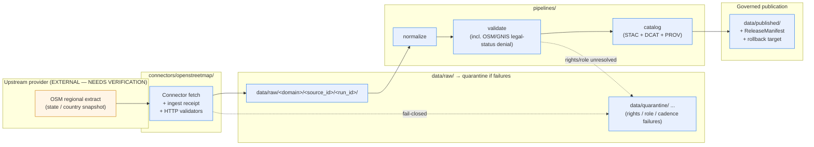

<!-- [KFM_META_BLOCK_V2]
doc_id: kfm://doc/docs-sources-catalog-openstreetmap-regional-extracts
title: OpenStreetMap Regional Extracts
type: product-page
version: v0.2
status: draft
owners: <PLACEHOLDER — Docs steward + Source steward for openstreetmap>
created: 2026-05-20
updated: 2026-05-22
policy_label: public
related:
  - docs/sources/catalog/openstreetmap/README.md
  - docs/sources/catalog/README.md
  - docs/doctrine/directory-rules.md
  - data/registry/sources/
  - policy/sensitivity/
tags: [kfm, docs, sources, catalog, openstreetmap, product-page]
notes:
  - "PROPOSED product-page scaffold; sibling-link presence asserted from a prior Claude Code session and remains NEEDS VERIFICATION until inspected in a mounted repo."
  - "OSM-specific rights posture (ODbL attribution/share-alike) is EXTERNAL until pinned in the SourceDescriptor and policy/sensitivity/."
[/KFM_META_BLOCK_V2] -->

# OpenStreetMap Regional Extracts

> State- and country-level OSM snapshot extracts proposed as the canonical RAW capture surface for bulk OpenStreetMap processing in KFM.

<a id="top"></a>


**Status:** PROPOSED — scaffold only · **Family:** [`openstreetmap`](./README.md) · **Owners:** *PLACEHOLDER — Docs steward + Source steward for `openstreetmap`* · **Last reviewed:** 2026-05-22

---

## Quick jump

- [1. Overview](#1-overview)
- [2. Source authority](#2-source-authority)
- [3. Lifecycle flow](#3-lifecycle-flow)
- [4. Catalog profiles used](#4-catalog-profiles-used)
- [5. Collection identity](#5-collection-identity)
- [6. Provenance fields (`kfm:provenance`)](#6-provenance-fields-kfmprovenance)
- [7. Temporal handling](#7-temporal-handling)
- [8. Geometry and projection](#8-geometry-and-projection)
- [9. Rights and sensitivity](#9-rights-and-sensitivity)
- [10. Validation and catalog closure](#10-validation-and-catalog-closure)
- [11. Related contracts and schemas](#11-related-contracts-and-schemas)
- [12. Related connectors and pipelines](#12-related-connectors-and-pipelines)
- [13. Illustrative example](#13-illustrative-example)
- [14. Open questions](#14-open-questions)
- [15. Related docs](#15-related-docs)

---

## 1. Overview

This page is a **PROPOSED product-page scaffold** for the OpenStreetMap regional-extracts product within the [`openstreetmap`](./README.md) source family. Its job is to name the product, anchor it to KFM doctrine, and route readers to the authoritative artifacts elsewhere in the tree — **not** to re-encode them.

The product is positioned as the **canonical RAW capture surface for bulk OSM processing in KFM**, scoped to state- and country-level snapshot extracts. Live OSM API queries (Overpass, Nominatim) are a different posture and are explicitly **out of scope** for this product page.

> [!NOTE]
> **PROPOSED scope; NEEDS VERIFICATION on specifics.** Cadence, exact geographic coverage, current endpoint URL, rights statement, and license terms have not been verified in a mounted repo or against current upstream provider state in this docs-only session. CONFIRMED in project knowledge: OpenStreetMap is recognized in the KFM Atlas as a source family in the Roads/Rail domain, with rights and current terms marked **NEEDS VERIFICATION** at the Atlas level.[DOM-ROADS]

> [!IMPORTANT]
> This page is **not** the SourceDescriptor. The descriptor in `data/registry/sources/` is the single source of truth for identity, role, rights, cadence, authority scope, and verification obligations per `KFM-P1-PROG-0007`. This page may **summarize** descriptor decisions but must not **duplicate** descriptor fields.

[↑ Back to top](#top)

---

## 2. Source authority

The authoritative SourceDescriptor for this product lives under [`data/registry/sources/`](../../../../data/registry/sources/) per Directory Rules §7.3 (connectors) and the descriptor doctrine in `KFM-P1-PROG-0007`. The descriptor records identity, source role, rights posture, update cadence, authority scope, and verification obligations.

| Authority concern | Where it lives (PROPOSED) | Status |
|---|---|---|
| SourceDescriptor identity, role, rights, cadence | [`data/registry/sources/`](../../../../data/registry/sources/) | PROPOSED location; field presence NEEDS VERIFICATION |
| Sensitivity tiers and redaction policy | [`policy/sensitivity/`](../../../../policy/sensitivity/) | PROPOSED; not restated here |
| Source-role vocabulary (`observed`, `aggregate`, etc.) | ADR-S-04 (referenced in `connectors/` README contract) | NEEDS VERIFICATION against mounted repo |
| OSM-specific legal-status validator | `pipelines/validate/` test suite | PROPOSED — see §10 |

> [!CAUTION]
> **Do not duplicate descriptor fields here.** A page that re-states descriptor content drifts the moment the descriptor changes. Link out to `data/registry/sources/` and let the descriptor remain the single edit point.

[↑ Back to top](#top)

---

## 3. Lifecycle flow

PROPOSED flow for OSM regional extracts through the KFM lifecycle invariant `RAW → WORK/QUARANTINE → PROCESSED → CATALOG/TRIPLET → PUBLISHED`. Boundaries and gate names are CONFIRMED doctrine; placement and validator names below are PROPOSED.



> [!NOTE]
> Diagram is a **structural placeholder**. Lifecycle phases and the connector / pipeline boundary reflect Directory Rules §7.3 and §7.4 (CONFIRMED). The exact validator names, source-domain segment, and quarantine routing rules are **PROPOSED** and require ADR / mounted-repo confirmation.

[↑ Back to top](#top)

---

## 4. Catalog profiles used

Catalog closure across STAC, DCAT, and PROV is **CONFIRMED doctrine** for public release per `KFM-P1-IDEA-0020`. Per-product participation in each profile below is **PROPOSED** until the product's catalog records are present in the mounted repo.

| Profile | Lane | Used by this product? | Doctrine anchor |
|---|---|---|---|
| **STAC** (with `kfm:provenance`) | `data/catalog/stac/` | PROPOSED — Yes / No (NEEDS VERIFICATION) | `C4-01` (Pass-10) |
| **DCAT** distribution | `data/catalog/dcat/` | PROPOSED — Yes / No (NEEDS VERIFICATION) | `C4-05` (Pass-10) |
| **PROV-O** provenance | `data/catalog/prov/` | PROPOSED — Yes / No (NEEDS VERIFICATION) | `ML-061-081` |
| **Domain projection** | `data/catalog/domain/<domain>/` | PROPOSED — Yes / No (NEEDS VERIFICATION) | Per-domain Atlas section |

> [!TIP]
> A product that publishes only STAC but not DCAT or PROV will not pass catalog closure. The closure check is the final discoverability and accountability gate before publication.

[↑ Back to top](#top)

---

## 5. Collection identity

- **PROPOSED Collection id pattern:** `kfm-<org>-<product>` (per `C4-02` Pass-10 expansion direction; documented in [`IDENTITY.md`](../IDENTITY.md)).
- **PROPOSED namespace:** `kfm:` — but the `kfm:` vs `ks-kfm:` choice is **an open project-level question** flagged in `C4-01` and tracked here as **OPEN-DSC-03**.
- **Asset roles:** NEEDS VERIFICATION — confirm allowed role values against `schemas/contracts/v1/source/` and the STAC asset-role lint.

> [!WARNING]
> Collection ids are the stable handle that STAC Items reference. **Renaming a Collection breaks links throughout the catalog.** Pin the id convention before the first PUBLISHED release for this product.

[↑ Back to top](#top)

---

## 6. Provenance fields (`kfm:provenance`)

CONFIRMED doctrine per `C4-01` (Pass-10): each STAC Item carries an `item.properties.kfm:provenance` block with the following fields, plus per-asset `file:checksum`.

| Field | Resolves to | Purpose |
|---|---|---|
| `spec_hash` | sha256 of the canonical record | Identity / tamper detection |
| `evidence_bundle_ref` | `kfm://evidence/<digest>` | Resolves to the content-addressed EvidenceBundle |
| `run_record_ref` | `kfm://run/<run-id>` | Pins the producing run |
| `audit_ref` | `kfm://audit/<attestation-id>` | SLSA / OPA attestation pointer |
| `policy_digest` | sha256 of the policy bundle | Records the policy set used at promotion |
| (per asset) `file:checksum` | sha256 of asset bytes | Per-asset integrity |

> [!NOTE]
> The fields above are CONFIRMED doctrine. **Whether this product currently emits them** is PROPOSED until verified against catalog records in `data/catalog/stac/`.

[↑ Back to top](#top)

---

## 7. Temporal handling

PROPOSED — keep these times distinct where material, per the CONFIRMED Atlas Roads/Rail temporal rule (object-family E):

- **source time** — provider's stated extract / snapshot time
- **observed time** — when underlying OSM features were tagged (often unknown for bulk extracts)
- **valid time** — period during which the feature claim is asserted to hold
- **retrieval time** — when KFM fetched the bytes
- **release time** — when KFM published a derivative
- **correction time** — when a correction supersedes a prior release

NEEDS VERIFICATION per product: which of these are actually populated for OSM extracts in this product's `kfm:provenance` and STAC `properties.datetime` fields.

[↑ Back to top](#top)

---

## 8. Geometry and projection

PROPOSED — confirm CRS, generalization rules, and scale support against `data/catalog/` artifacts and the STAC Projection lint (`KFM-P27-FEAT-0003`, which checks `proj:code`, `proj:bbox`, `proj:geometry`, `proj:shape`, `proj:transform` compliance). NEEDS VERIFICATION whether OSM regional extracts in this product require explicit reprojection vs. pass-through of upstream EPSG:4326 geometries.

[↑ Back to top](#top)

---

## 9. Rights and sensitivity

> [!WARNING]
> **OSM redistribution carries license obligations.** OpenStreetMap data is published under the Open Database License (ODbL) [EXTERNAL — NEEDS VERIFICATION against upstream provider terms in this session]. Attribution and share-alike provisions affect any KFM derivative that is publicly released. The authoritative posture for KFM lives in the SourceDescriptor and [`policy/sensitivity/`](../../../../policy/sensitivity/) — **not in this page**.

NEEDS VERIFICATION — see [`RIGHTS-AND-SENSITIVITY-MAP.md`](../RIGHTS-AND-SENSITIVITY-MAP.md) for the family-level rights map.

CONFIRMED Atlas doctrine for the Roads/Rail domain explicitly names an **"OSM/GNIS legal-status denial"** validator (Atlas v1.1 §K, Roads). This product MUST not assert legal road designation from OSM tags alone; that surface is gated by the validator.

| Concern | Default posture | Where enforced |
|---|---|---|
| Public attribution to OSM contributors | Required on any publicly released derivative | PROPOSED — STAC `attribution` + LayerManifest `attribution` |
| Share-alike on derivatives | NEEDS VERIFICATION per derivative | `policy/sensitivity/` + Release review |
| Legal-status claims from OSM tags | **DENY at validate** | `pipelines/validate/` — OSM/GNIS legal-status denial test |
| Sensitive geometry (e.g., archaeology) | Generalize or withhold | `policy/sensitivity/<domain>/` |

[↑ Back to top](#top)

---

## 10. Validation and catalog closure

- **Catalog closure** required before public release — CONFIRMED doctrine per `KFM-P1-IDEA-0020` ("Catalog closure before public release").
- **STAC Projection lint** per `KFM-P27-FEAT-0003` — PROPOSED participation for this product.
- **STAC checksum closure** against the ReleaseManifest digest per `KFM-P22-PROG-0037` — PROPOSED participation for this product.
- **OSM/GNIS legal-status denial** — CONFIRMED Atlas-level validator name for the Roads/Rail domain; PROPOSED implementation in `pipelines/validate/`.

> [!CAUTION]
> If any of: source attribution, rights status, PolicyDecision, ReleaseManifest, or rollback pointer is missing, **catalog closure fails closed**. PROPOSED enforcement per `KFM-P1-IDEA-0020`; NEEDS VERIFICATION that the relevant CI workflow gates exist in the mounted repo.

[↑ Back to top](#top)

---

## 11. Related contracts and schemas

- `contracts/` — meaning contracts for this product. NEEDS VERIFICATION.
- `schemas/contracts/v1/source/` — SourceDescriptor schema per ADR-0001 (referenced in Atlas Ch. 24.7 and Directory Rules §7.4).
- `schemas/contracts/v1/catalog/` — STAC / DCAT / PROV record shapes (PROPOSED home; NEEDS VERIFICATION).
- `schemas/contracts/v1/evidence/` — EvidenceBundle / EvidenceRef shapes.

> [!NOTE]
> Schema home placement is governed by Directory Rules §7.4 + ADR-0001. Do not create a parallel schema home under `docs/` or `contracts/` without an ADR.

[↑ Back to top](#top)

---

## 12. Related connectors and pipelines

| Lane | PROPOSED path | Notes |
|---|---|---|
| Connector | `connectors/openstreetmap/` | Source-specific fetch + admission per Directory Rules §7.3. **MUST NOT publish.** |
| Ingest pipeline | `pipelines/ingest/` | Lands bytes under `data/raw/<domain>/<source_id>/<run_id>/` |
| Normalize pipeline | `pipelines/normalize/` | Schema / geometry / time / identity normalization |
| Validate pipeline | `pipelines/validate/` | Includes OSM/GNIS legal-status denial test |
| Catalog pipeline | `pipelines/catalog/` | Emits STAC + DCAT + PROV records |
| Pipeline specs | `pipeline_specs/<domain>/` | Declarative configuration per Directory Rules §7.4 |

[↑ Back to top](#top)

---

## 13. Illustrative example

<details>
<summary><strong>Minimal STAC Item shape with <code>kfm:provenance</code> (illustrative — not authoritative)</strong></summary>

The shape below is illustrative and follows `C4-01` (Pass-10) CONFIRMED doctrine for the `kfm:provenance` field set. It is **not** a working catalog entry. The canonical example fixture lives at [`_examples/stac-item-example.json`](../_examples/stac-item-example.json) — NEEDS VERIFICATION.

```json
{
  "type": "Feature",
  "stac_version": "1.0.0",
  "id": "kfm-osm-kansas-regional-extract-2026-05-15",
  "collection": "kfm-osm-regional-extracts",
  "properties": {
    "datetime": "2026-05-15T00:00:00Z",
    "kfm:provenance": {
      "spec_hash": "sha256:<PLACEHOLDER>",
      "evidence_bundle_ref": "kfm://evidence/<PLACEHOLDER>",
      "run_record_ref": "kfm://run/<PLACEHOLDER>",
      "audit_ref": "kfm://audit/<PLACEHOLDER>",
      "policy_digest": "sha256:<PLACEHOLDER>"
    },
    "attribution": "© OpenStreetMap contributors (ODbL) — EXTERNAL, NEEDS VERIFICATION"
  },
  "assets": {
    "data": {
      "href": "<PROPOSED — confirm endpoint URL>",
      "type": "application/x-protobuf",
      "roles": ["data"],
      "file:checksum": "sha256:<PLACEHOLDER>"
    }
  },
  "links": []
}
```

</details>

[↑ Back to top](#top)

---

## 14. Open questions

| ID | Question | Status |
|---|---|---|
| OPEN-OSM-RE-01 | Confirm cadence and current endpoint URL for the upstream regional extract source. | UNKNOWN |
| OPEN-OSM-RE-02 | Confirm rights statement (ODbL attribution + share-alike) and CARE applicability. | NEEDS VERIFICATION |
| OPEN-OSM-RE-03 | Does this product warrant its own STAC Collection, or share one with sibling OSM products? | UNKNOWN |
| OPEN-DSC-03 | Project-level: `kfm:` vs `ks-kfm:` STAC namespace. (Tracked in `C4-01` Pass-10.) | OPEN |
| OPEN-OSM-RE-04 | Are there sibling OSM products (Overpass live, Nominatim, planet snapshots) that should be cross-linked from this page? | NEEDS VERIFICATION |
| OPEN-OSM-RE-05 | Confirm sibling-link presence (`./README.md`, `../IDENTITY.md`, `../RIGHTS-AND-SENSITIVITY-MAP.md`, `../_examples/stac-item-example.json`) once the repo is mounted. | NEEDS VERIFICATION |

[↑ Back to top](#top)

---

## 15. Related docs

- [`./README.md`](./README.md) — `openstreetmap` source family README *(NEEDS VERIFICATION of presence)*
- [`../README.md`](../README.md) — `docs/sources/catalog/` family index *(NEEDS VERIFICATION)*
- [`../IDENTITY.md`](../IDENTITY.md) — Collection-id and namespace conventions *(NEEDS VERIFICATION)*
- [`../RIGHTS-AND-SENSITIVITY-MAP.md`](../RIGHTS-AND-SENSITIVITY-MAP.md) — Family-level rights and sensitivity map *(NEEDS VERIFICATION)*
- [`../../../../data/registry/sources/`](../../../../data/registry/sources/) — Authoritative SourceDescriptor home
- [`../../../../policy/sensitivity/`](../../../../policy/sensitivity/) — Sensitivity policy bundles
- [`../../../../docs/doctrine/directory-rules.md`](../../../../docs/doctrine/directory-rules.md) — Directory Rules (responsibility roots and placement law)
- [`../../../standards/STAC_KFM_PROFILE.md`](../../../standards/STAC_KFM_PROFILE.md) — STAC + `kfm:provenance` profile *(NEEDS VERIFICATION — PROPOSED in `C4-01`)*

---

**Last reviewed:** 2026-05-22 *(scaffold revision pass)* · **Doc version:** v0.2 · [↑ Back to top](#top)
