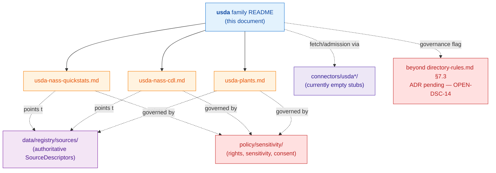

<!-- [KFM_META_BLOCK_V2]
doc_id: kfm://doc/docs-sources-catalog-usda-readme
title: USDA source family
type: readme
version: v0.2
status: draft
owners: <PLACEHOLDER — Docs steward + Source steward for usda>
created: 2026-05-21
updated: 2026-05-22
policy_label: public
related:
  - docs/sources/catalog/README.md
  - docs/doctrine/directory-rules.md
  - docs/sources/catalog/PROFILES.md
  - docs/sources/catalog/IDENTITY.md
  - docs/sources/catalog/RIGHTS-AND-SENSITIVITY-MAP.md
  - docs/sources/catalog/OPEN-QUESTIONS.md
  - docs/sources/catalog/_template/SOURCE_PRODUCT_TEMPLATE.md
tags: [kfm, docs, sources, catalog, usda]
notes:
  - "v0.2 polish revision: navigation, diagrams, and lifecycle anchors added; underlying evidence basis unchanged."
  - "Family scaffolded from the connectors/ inventory; descriptions grounded in docs/domains SOURCE_REGISTRY files."
  - "Beyond directory-rules.md §7.3 — see OPEN-DSC-14. nrcs/ is a §7.3 family and is a USDA sub-agency; the USDA family/sub-agency boundary is the substance of the open question."
[/KFM_META_BLOCK_V2] -->

<a id="top"></a>

# `usda` source family

> Source-oriented catalog documentation for the **U.S. Department of Agriculture** family — NASS QuickStats, NASS Cropland Data Layer (CDL), and the PLANTS Database.

[](#status)
[](../README.md)
[](../../../doctrine/directory-rules.md)
[](../OPEN-QUESTIONS.md)
[](../RIGHTS-AND-SENSITIVITY-MAP.md)
[](#last-reviewed)

**Status:** draft — **PROPOSED** (beyond `directory-rules.md` §7.3) · **Owners:** `<PLACEHOLDER — Docs steward + Source steward for usda>` · **Last reviewed:** 2026-05-22

---

## Contents

- [Overview](#overview)
- [Scope](#scope)
- [Repo fit](#repo-fit)
- [What belongs here](#what-belongs-here)
- [What does NOT belong here](#what-does-not-belong-here)
- [Directory tree](#directory-tree)
- [Family map](#family-map)
- [Product pages](#product-pages)
- [Source authority](#source-authority)
- [Lifecycle placement](#lifecycle-placement)
- [Catalog profiles](#catalog-profiles)
- [Identity & namespaces](#identity--namespaces)
- [Rights & sensitivity](#rights--sensitivity)
- [Validation](#validation)
- [Related contracts & schemas](#related-contracts--schemas)
- [Related connectors & pipelines](#related-connectors--pipelines)
- [Open questions](#open-questions)
- [FAQ](#faq)
- [Appendix](#appendix)
- [Related docs](#related-docs)
- [Last reviewed](#last-reviewed)

---

## Overview

The **USDA** (U.S. Department of Agriculture) source family aggregates documentation for the three USDA-published data products currently in scope for KFM: the **National Agricultural Statistics Service (NASS) QuickStats** survey aggregates, the **NASS Cropland Data Layer (CDL)** annual crop raster, and the **PLANTS Database** national plant checklist. Each product is documented on its own page using the lane's [`SOURCE_PRODUCT_TEMPLATE`](../_template/SOURCE_PRODUCT_TEMPLATE.md); this README is the family-level orientation, navigation hub, and governance flag.

> [!IMPORTANT]
> **This family is out-of-spine relative to `directory-rules.md` §7.3.**
> The §7.3 canonical connector spine lists `usgs/ fema/ noaa/ nrcs/ kansas/ gbif/ inaturalist/ census/ local_upload/` — **CONFIRMED** from `directory-rules.md` §7.3 (lines 569–574). `nrcs/` is a USDA sub-agency, so the USDA family/sub-agency boundary is genuinely ambiguous and is the substance of [`OPEN-DSC-14`](../OPEN-QUESTIONS.md). This folder is **PROPOSED** until ADR resolution; treat all paths and conventions here as reviewable, not canonical.

---

## Scope

**CONFIRMED in project knowledge / PROPOSED at the file-placement layer.**

The USDA family documents the three products below, each of which is named in the KFM atlas as a source family for Agriculture (NASS) or Flora (PLANTS):

- **USDA NASS QuickStats** — agricultural survey aggregates; identified in the atlas as `USDA NASS QuickStats / Crop Progress` under Agriculture (`[DOM-AG]`) with `rights and current terms NEEDS VERIFICATION; sensitive joins fail closed`.
- **USDA NASS Cropland Data Layer (CDL)** — annual crop-class raster; identified in the atlas alongside NLCD, LANDFIRE, and GAP as a land-cover authority (`KFM-P2-IDEA-0028`).
- **USDA PLANTS Database** — national plant checklist with state and county distributions; identified in the atlas as the federal taxonomic baseline for Flora (`KFM-P2-PROG-0006`, `KFM-P27-IDEA-0002`).

[↑ Back to top](#top)

---

## Repo fit

| Aspect | Value |
|---|---|
| **Path (PROPOSED)** | `docs/sources/catalog/usda/` |
| **Parent README** | [`docs/sources/catalog/README.md`](../README.md) |
| **Doctrine anchor** | [`docs/doctrine/directory-rules.md`](../../../doctrine/directory-rules.md) §6 (docs), §7.3 (connectors — out-of-spine), §15 (README contract) |
| **Authority class** | Documentation (compatibility / explanatory). This folder **explains**; it does **not** own SourceDescriptor truth or admission policy. |
| **Upstream of (links into)** | [`data/registry/sources/`](../../../../data/registry/sources/), [`connectors/usda*/`](../../../../connectors/), [`pipelines/ingest/`](../../../../pipelines/ingest/) |
| **Downstream from** | Atlas (`KFM_Domains_v1_1_*`), source registries, ADR backlog (pending ADR for OPEN-DSC-14) |

[↑ Back to top](#top)

---

## What belongs here

- **Product README pages** — one per USDA product, each authored from [`SOURCE_PRODUCT_TEMPLATE.md`](../_template/SOURCE_PRODUCT_TEMPLATE.md).
- **Family-level orientation, navigation, governance flags** (this README).
- **Pointers** into `SourceDescriptors`, contracts, schemas, policy, and pipelines — never inline copies.

## What does NOT belong here

- **`SourceDescriptor` records.** Authoritative descriptors live in [`data/registry/sources/`](../../../../data/registry/sources/) per ADR-0001 (schema home).
- **Schema definitions.** Schemas live in [`schemas/contracts/v1/source/`](../../../../schemas/contracts/v1/source/).
- **Connector code.** Source-fetch and admission code lives in `connectors/<source_family>/` per `directory-rules.md` §7.3.
- **Policy text.** Sensitivity, rights, and admission policy live in [`policy/`](../../../../policy/). Never restate policy here — always link.
- **`RAW`, `WORK`, `PROCESSED`, `CATALOG`, or `PUBLISHED` data.** Lifecycle data lives under `data/` per `directory-rules.md` §7; this is a docs lane.

> [!WARNING]
> If you're tempted to put a `SourceDescriptor`, a schema, a policy `.rego` file, a pipeline spec, or an ingested file here, **stop**. That's parallel-authority drift (`directory-rules.md` §3, §13). Link out instead.

[↑ Back to top](#top)

---

## Directory tree

**PROPOSED tree** — reflects the file references in v0.1 of this README; NEEDS VERIFICATION against the mounted repository.

```text
docs/sources/catalog/usda/
├── README.md                    ← this file (family orientation)
├── usda-nass-quickstats.md      PROPOSED  — NASS QuickStats product page
├── usda-nass-cdl.md             PROPOSED  — NASS Cropland Data Layer product page
└── usda-plants.md               PROPOSED  — PLANTS Database product page
```

[↑ Back to top](#top)

---

## Family map



> [!NOTE]
> The diagram is structural, not normative. Edges marked `-.points to.->` represent documentation references, not admission decisions. A `SourceDescriptor` is authoritative only when it actually exists in `data/registry/sources/` — **NEEDS VERIFICATION** per product.

[↑ Back to top](#top)

---

## Product pages

| Page | Product | Atlas anchor | Atlas role posture |
|---|---|---|---|
| [`usda-nass-quickstats.md`](./usda-nass-quickstats.md) | USDA NASS QuickStats | `KFM-P2-IDEA-0024`, `[DOM-AG]` | `aggregate` (per atlas source-role anti-collapse register) — **NEEDS VERIFICATION** |
| [`usda-nass-cdl.md`](./usda-nass-cdl.md) | USDA NASS Cropland Data Layer | `KFM-P2-IDEA-0028`, `[DOM-AG]` | `observation / model` (raster classification) — **NEEDS VERIFICATION** |
| [`usda-plants.md`](./usda-plants.md) | USDA PLANTS Database | `KFM-P2-PROG-0006`, `KFM-P27-IDEA-0002`, `[DOM-FLORA]` | `authority` (federal taxonomic baseline) — **NEEDS VERIFICATION** |

> Per-product `source_role` is set on the live `SourceDescriptor` at admission and is **never edited in place** (atlas §24.1.3, source-role anti-collapse). Atlas role postures above are documentation hints, not authoritative.

[↑ Back to top](#top)

---

## Source authority

Authoritative `SourceDescriptor` records live in [`data/registry/sources/`](../../../../data/registry/sources/). Do **not** duplicate descriptor fields in this folder — pages link out.

A live USDA `SourceDescriptor` MUST carry (per `directory-rules.md` and atlas §24.1.3):

- `source_role` — `observed | regulatory | modeled | aggregate | administrative | candidate | synthetic` (set at admission; corrections produce a new descriptor and a `CorrectionNotice`).
- `rights_status` — public domain expected for federal USDA products, but **NEEDS VERIFICATION** per product (terms can carry attribution or use restrictions that the atlas labels `NEEDS VERIFICATION`).
- `update_cadence` — annual for CDL and PLANTS county packages; mixed (monthly/quarterly/annual) for NASS QuickStats series — **NEEDS VERIFICATION** per product.
- `authority_scope`, `verification_obligations`, and (where applicable) `role_aggregation_unit` (county/HUC/state) for `aggregate` roles such as NASS QuickStats.

[↑ Back to top](#top)

---

## Lifecycle placement

CONFIRMED doctrine, PROPOSED implementation — products in this family flow through the canonical KFM lifecycle:

```text
RAW  →  WORK/QUARANTINE  →  PROCESSED  →  CATALOG/TRIPLET  →  PUBLISHED
```

Per the atlas (`KFM-P2-PROG-0006` detailed explanation), PLANTS lifecycle placement is **PROPOSED** as:

```text
data/raw/flora/usda_plants/<snapshot>/
data/work/
data/processed/flora/plants/<symbol>.json
data/receipts/flora/usda_plants/
data/proofs/flora/usda_plants/
data/published/flora/plants/release_manifest.json
```

Equivalent placements for NASS QuickStats and CDL are **NEEDS VERIFICATION** per the Agriculture atlas (`§N. Verification backlog`: *Verify NASS/QuickStats and Crop Progress activation*).

> [!CAUTION]
> Per `directory-rules.md` §7.3, **connectors MUST NOT publish** and MUST NOT write under `data/processed/`, `data/catalog/`, or `data/published/`. Watchers emit pre-RAW events and receipts; promotion is a governed state transition, never a file move.

[↑ Back to top](#top)

---

## Catalog profiles

**PROPOSED** — confirm per product which of `STAC`, `DCAT`, `PROV-O`, and the domain projections in [`data/catalog/`](../../../../data/catalog/) each product lands in. See [`PROFILES.md`](../PROFILES.md) for lane-wide profile conventions. Catalog closure is part of the `CATALOG/TRIPLET` gate (atlas `[DOM-AG] §I`).

[↑ Back to top](#top)

---

## Identity & namespaces

Collection-id and namespace conventions follow [`IDENTITY.md`](../IDENTITY.md). The lane-wide namespace pin (`kfm:` vs. `ks-kfm:`) is **UNRESOLVED** — see [`OPEN-DSC-03`](../OPEN-QUESTIONS.md). Identity construction uses **JCS canonicalization** with retrieval timestamp excluded from `spec_hash` (CONFIRMED doctrine; PROPOSED at field realization per `KFM-P2-PROG-0006`).

[↑ Back to top](#top)

---

## Rights & sensitivity

**NEEDS VERIFICATION per product.** See [`RIGHTS-AND-SENSITIVITY-MAP.md`](../RIGHTS-AND-SENSITIVITY-MAP.md) and [`policy/sensitivity/`](../../../../policy/sensitivity/). This file MUST NOT restate policy — link only.

Atlas posture (PROPOSED until per-product verification):

| Product | Expected rights | Sensitivity flag |
|---|---|---|
| NASS QuickStats | U.S. federal public domain (likely); attribution terms **NEEDS VERIFICATION** | Aggregate-only; atlas DENIES join from aggregate cell to single record (`[DOM-AG] §I`) |
| NASS CDL | U.S. federal public domain (likely); attribution terms **NEEDS VERIFICATION** | Land-cover raster; classification crosswalks are advisory, not authoritative (`KFM-P2-IDEA-0028`) |
| PLANTS | U.S. federal public domain (PROPOSED; treated by atlas as a "clean public-domain example exercising the rights flag") | Specimen-level data not in scope; checklist/distribution is public |

> [!IMPORTANT]
> "Likely public domain" is not the same as confirmed rights. Until a per-product `SourceDescriptor` carries `rights_status: public` with a verified attribution string, treat rights as **NEEDS VERIFICATION** and let the sensitive-join policy fail closed.

[↑ Back to top](#top)

---

## Validation

| Validator | What it checks | Status |
|---|---|---|
| Markdown lint | Repo-standard MD lint rules | **NEEDS VERIFICATION** — workflow not yet wired |
| Link integrity | Repo-relative link targets resolve | **PROPOSED** |
| Per-product template conformance | Pages conform to [`SOURCE_PRODUCT_TEMPLATE.md`](../_template/SOURCE_PRODUCT_TEMPLATE.md) | **PROPOSED** |
| Meta-block presence | Each product page carries a valid `[KFM_META_BLOCK_V2]` | **PROPOSED** |

This lane is **documentation**; it does **not** validate `SourceDescriptors`, schemas, or policies. Those validators live with their owning roots (`schemas/`, `policy/`, `connectors/`, `pipelines/validate/`).

[↑ Back to top](#top)

---

## Related contracts & schemas

- [`schemas/contracts/v1/source/`](../../../../schemas/contracts/v1/source/) — **canonical schema home for `SourceDescriptor`** per ADR-0001 (`directory-rules.md` §2.4(3)). USDA descriptors conform here.
- [`contracts/`](../../../../contracts/) — object families (Plant Taxon, Crop Observation, Field Candidate, etc.) that USDA products contribute to per atlas object-family tables.

[↑ Back to top](#top)

---

## Related connectors & pipelines

- **Connector folders.** `connectors/usda/`, `connectors/usda-nass/`, `connectors/usda-plants/` are described in v0.1 of this README as **currently empty stubs**. Re-verify against the mounted repo before authoring connector code.
- **Pipeline lanes.** [`pipelines/ingest/`](../../../../pipelines/ingest/), [`pipelines/normalize/`](../../../../pipelines/normalize/), [`pipelines/validate/`](../../../../pipelines/validate/), [`pipelines/catalog/`](../../../../pipelines/catalog/) — connector output lands in `data/raw/<domain>/<source_id>/<run_id>/` and is promoted through these lanes; **connectors MUST NOT publish** (`directory-rules.md` §7.3).

[↑ Back to top](#top)

---

## Open questions

| ID | Question | Status | Pointer |
|---|---|---|---|
| `OPEN-DSC-14` | Should USDA be a `directory-rules.md` §7.3 family in its own right, or are NASS and PLANTS reabsorbed into `nrcs/` (USDA's only sub-agency that *is* in §7.3)? | OPEN — **ADR required** before this folder is treated as canonical | [`OPEN-QUESTIONS.md`](../OPEN-QUESTIONS.md) |
| `OPEN-DSC-03` | Namespace pin: `kfm:` vs. `ks-kfm:` | OPEN — lane-wide | [`IDENTITY.md`](../IDENTITY.md) |
| Rights per product | Confirm per-product `rights_status`, attribution terms, sensitive-join policy | NEEDS VERIFICATION per product | [`RIGHTS-AND-SENSITIVITY-MAP.md`](../RIGHTS-AND-SENSITIVITY-MAP.md) |
| Cadence per product | Confirm per-product `update_cadence`, stale thresholds | NEEDS VERIFICATION per product | per-product page |
| Endpoints per product | Confirm per-product API endpoints, terms-of-use, credential posture | NEEDS VERIFICATION per product | per-product page |
| Lifecycle placement per product | Confirm `data/raw/<domain>/usda_<product>/...` paths against `directory-rules.md` §7 | NEEDS VERIFICATION per product | atlas `§I. Lifecycle` |

See [`OPEN-QUESTIONS.md`](../OPEN-QUESTIONS.md) for the full lane-wide `OPEN-DSC-*` index.

[↑ Back to top](#top)

---

## FAQ

<details>
<summary><strong>Q: Why isn't there a `connectors/usda/README.md` instead of a docs page?</strong></summary>

Because connector code does not exist yet (v0.1 of this README reports the folders as empty stubs), and because the §7.3 family question (`OPEN-DSC-14`) is still open. Documenting the products at the docs layer first lets us reason about role, rights, cadence, and identity *before* connector code commits to a placement. Once an ADR resolves `OPEN-DSC-14`, the docs pages here will keep their orientation role and the connectors will get their own per-connector READMEs per `directory-rules.md` §15.

</details>

<details>
<summary><strong>Q: Why not just put NASS and PLANTS under <code>connectors/nrcs/</code> since NRCS is USDA?</strong></summary>

NRCS (Natural Resources Conservation Service) is a USDA agency focused on soil and conservation; NASS (National Agricultural Statistics Service) and PLANTS sit under a different USDA mission area and a different authority/cadence profile. Collapsing them into `nrcs/` would let the §7.3 family name carry the wrong authority semantics. The atlas treats NASS, PLANTS, and SSURGO/NRCS as distinct source families. That said, the correct organizational shape is exactly the substance of `OPEN-DSC-14` — the ADR has to choose explicitly.

</details>

<details>
<summary><strong>Q: Can I add a fourth USDA product page without an ADR?</strong></summary>

A new product page within this folder follows the same conventions (template, meta block, link discipline) and does not require an ADR. Adding a **new source family directory** (a new sibling to `usda/`) that is also out-of-spine relative to §7.3 follows the same governance gap as this folder and should be flagged in `OPEN-QUESTIONS.md`. A new `connectors/<family>/` requires `directory-rules.md` §7.3 alignment and likely an ADR.

</details>

<details>
<summary><strong>Q: Where do I find the authoritative role/rights/cadence for a USDA product?</strong></summary>

On the live `SourceDescriptor` in [`data/registry/sources/`](../../../../data/registry/sources/), not in this folder. Pages here may reference atlas postures, but those are documentation hints. The descriptor is authoritative.

</details>

[↑ Back to top](#top)

---

## Appendix

<details>
<summary><strong>A1 — Atlas source-family table excerpt (Agriculture, NEEDS VERIFICATION)</strong></summary>

Excerpted/paraphrased from `KFM_Domains_v1_1_+_Pass_23/32 Consolidated Atlas`, `[DOM-AG] §D. Key source families`. All rights and freshness rows are atlas-labelled `NEEDS VERIFICATION`; nothing below is a live admission claim.

| Source family | Role | Rights / sensitivity | Freshness |
|---|---|---|---|
| USDA NASS QuickStats / Crop Progress | authority / observation / context / model as `source_role` requires | rights and current terms **NEEDS VERIFICATION**; sensitive joins fail closed | source-vintage or cadence specific |
| SSURGO / Soil Data Access | (NRCS family — out of scope here) | **NEEDS VERIFICATION** | source-vintage or cadence specific |

</details>

<details>
<summary><strong>A2 — Atlas card pointers</strong></summary>

| Card | Topic | Relevance |
|---|---|---|
| `KFM-P2-IDEA-0024` | USDA NASS, KGS, KDA, KDHE, KDWP as Kansas-specific authorities | Establishes NASS as a Kansas-relevant agricultural-statistics authority. |
| `KFM-P2-IDEA-0028` | USDA CDL, NLCD, LANDFIRE, GAP for land cover | Establishes CDL as a land-cover authority with classification preserved + crosswalks. |
| `KFM-P2-PROG-0006` | USDA PLANTS ingestion (flora taxonomy + state/county presence baseline) | Defines PROPOSED PLANTS lifecycle placement, mandatory mapping fields, identity rule. |
| `KFM-P27-IDEA-0002` | USDA PLANTS snapshot EvidenceBundle | Each PLANTS snapshot emits an EvidenceBundle with `source_uri`, `snapshot_date`, `rights_status`, `sensitivity`, `spec_hash`, source refs. |
| `KFM-P27-PROG-0002` | `plants.dataset.v1` schema | Required fields: `plants:symbol`, `scientificName` with author, `family`, distribution structures. |
| `KFM-P27-IDEA-0003` | PLANTS county FIPS normalization | County distribution rows normalize to 5-digit FIPS, retain presence + `first_observed`/null semantics for joins. |
| `KFM-P19-PROG-0036` | Crop status NASS baseline source lane | NASS crop-status signals modeled as agricultural baseline inputs with source descriptors, temporal grain, promotion gates. |
| `KFM-P29-FEAT-0002`, `KFM-P29-IDEA-0004` | PLANTS Delta Dashboard; taxon deltas as source events | Future UX hooks; not in scope for v0.2 of this README. |

</details>

<details>
<summary><strong>A3 — `directory-rules.md` §7.3 verbatim spine (CONFIRMED — lines 569–574)</strong></summary>

The §7.3 connector spine lists exactly these nine families:

```text
usgs/    fema/    noaa/    nrcs/    kansas/
gbif/    inaturalist/      census/   local_upload/
```

`usda` is not among them. `nrcs/` is (and is a USDA sub-agency). This is the boundary `OPEN-DSC-14` exists to resolve.

</details>

[↑ Back to top](#top)

---

## Related docs

- [`docs/sources/catalog/README.md`](../README.md) — lane index
- [`docs/doctrine/directory-rules.md`](../../../doctrine/directory-rules.md) — placement authority
- [`docs/sources/catalog/PROFILES.md`](../PROFILES.md) — catalog profile conventions
- [`docs/sources/catalog/IDENTITY.md`](../IDENTITY.md) — collection-id and namespace conventions
- [`docs/sources/catalog/RIGHTS-AND-SENSITIVITY-MAP.md`](../RIGHTS-AND-SENSITIVITY-MAP.md) — per-product rights & sensitivity index
- [`docs/sources/catalog/OPEN-QUESTIONS.md`](../OPEN-QUESTIONS.md) — lane open questions (`OPEN-DSC-*`)
- [`docs/sources/catalog/_template/SOURCE_PRODUCT_TEMPLATE.md`](../_template/SOURCE_PRODUCT_TEMPLATE.md) — product-page template
- [`data/registry/sources/`](../../../../data/registry/sources/) — authoritative `SourceDescriptors`
- [`schemas/contracts/v1/source/`](../../../../schemas/contracts/v1/source/) — schema home (ADR-0001)

---

## Last reviewed

**2026-05-22** — v0.2 polish revision (Claude Code session). No new repo-state claims introduced; v0.1 evidence basis preserved. Family scaffolded from the connectors/ inventory; descriptions grounded in `docs/domains` `SOURCE_REGISTRY` files and the consolidated atlas. Lifecycle anchors, family-map diagram, FAQ, and appendix added.

[↑ Back to top](#top)
