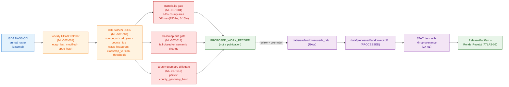

<!-- [KFM_META_BLOCK_V2]
doc_id: kfm://doc/docs-sources-catalog-usda-usda-nass-cdl
title: USDA NASS Cropland Data Layer
type: product-page
version: v0.2
status: draft
owners: <PLACEHOLDER — Docs steward + Source steward for usda>
created: 2026-05-21
updated: 2026-05-22
policy_label: public
related:
  - docs/sources/catalog/usda/README.md
  - docs/sources/catalog/README.md
  - docs/doctrine/directory-rules.md
  - docs/sources/catalog/PROFILES.md
  - docs/sources/catalog/IDENTITY.md
  - docs/sources/catalog/RIGHTS-AND-SENSITIVITY-MAP.md
  - docs/sources/catalog/OPEN-QUESTIONS.md
tags: [kfm, docs, sources, catalog, usda, landcover, raster]
notes:
  - "v0.2 polish revision: navigation, diagrams, watcher governance section, and atlas-card pointers added; underlying evidence basis unchanged."
  - "PROPOSED product-page scaffold; description grounded in docs/domains SOURCE_REGISTRY files and the consolidated atlas (KFM-P2-IDEA-0028, KFM-P1-PROG-0063, ML-067-001..042)."
  - "Out-of-spine relative to directory-rules.md §7.3 — see family README for OPEN-DSC-14 context."
[/KFM_META_BLOCK_V2] -->

<a id="top"></a>

# USDA NASS Cropland Data Layer

> USDA NASS Cropland Data Layer (CDL) — an **annual, crop-focused** satellite-derived land-cover raster covering the conterminous United States. **CONFIRMED in atlas** (`KFM-P2-IDEA-0028`); endpoint, cadence specifics, and rights status **NEEDS VERIFICATION** per product.

[](#status)
[](../_template/SOURCE_PRODUCT_TEMPLATE.md)
[](./README.md)
[-yellow)](#source-authority)
[](#rights-and-sensitivity)
[](#last-reviewed)

**Status:** PROPOSED — scaffold · **Family:** [`usda`](./README.md) · **Owners:** `<PLACEHOLDER — Docs steward + Source steward for usda>` · **Last reviewed:** 2026-05-22

---

## Contents

- [At a glance](#at-a-glance)
- [Overview](#overview)
- [Scope](#scope)
- [Source authority](#source-authority)
- [Lifecycle placement](#lifecycle-placement)
- [Pipeline flow](#pipeline-flow)
- [Catalog profiles used](#catalog-profiles-used)
- [Collection identity](#collection-identity)
- [Provenance fields](#provenance-fields)
- [Temporal handling](#temporal-handling)
- [Geometry and projection](#geometry-and-projection)
- [Rights and sensitivity](#rights-and-sensitivity)
- [Watcher and material-change governance](#watcher-and-material-change-governance)
- [Validation and catalog closure](#validation-and-catalog-closure)
- [Related contracts and schemas](#related-contracts-and-schemas)
- [Related connectors and pipelines](#related-connectors-and-pipelines)
- [Examples](#examples)
- [Open questions](#open-questions)
- [FAQ](#faq)
- [Appendix](#appendix)
- [Related docs](#related-docs)
- [Last reviewed](#last-reviewed)

---

## At a glance

| Field | Value | Label |
|---|---|---|
| **Product** | USDA NASS Cropland Data Layer | — |
| **Family** | [`usda`](./README.md) (out-of-spine relative to `directory-rules.md` §7.3 — see family README) | PROPOSED |
| **Product type** | Annual, crop-focused raster classification | CONFIRMED (atlas) |
| **Native classification** | Preserved; crosswalks advisory, **not authoritative** | CONFIRMED (atlas) |
| **Update cadence** | Annual (atlas); calendar specifics per release | CONFIRMED (annual) · NEEDS VERIFICATION (specifics) |
| **Geographic coverage** | CONUS (atlas-implied); confirm per release | NEEDS VERIFICATION |
| **Endpoint URL** | — | NEEDS VERIFICATION |
| **Rights** | U.S. federal product (likely public domain); attribution terms unconfirmed | NEEDS VERIFICATION |
| **Atlas role posture** | `observation / model` (raster classification) | PROPOSED |
| **Watcher pattern** | `ML-067-001` family (weekly HEAD + county histogram drift + PROPOSED work record) | PROPOSED implementation |
| **Public posture** | County/generalized products first; material-change watchers propose work only | CONFIRMED doctrine (`Build Manual §10.7`) |

[↑ Back to top](#top)

---

## Overview

The USDA NASS **Cropland Data Layer (CDL)** is identified in the KFM atlas (`KFM-P2-IDEA-0028`) as one of four land-cover authorities — alongside NLCD, LANDFIRE, and GAP — that KFM ingests with **native classification preserved** and **cross-walked to a common vocabulary where possible**. CDL is **annual and crop-focused**, in contrast to NLCD (multi-year, broad), LANDFIRE (fire-focused), and GAP (biodiversity-focused).

CDL flows through the canonical KFM lifecycle. Material change is detected via a **county-bounded class-histogram drift** trigger (`KFM-P1-PROG-0063`, watcher pattern `ML-067-001..015`); only material changes emit `PROPOSED_WORK_RECORD` entries. The watcher emits receipts; **it MUST NOT publish**.

> [!IMPORTANT]
> **Classification crosswalks are inherently lossy.** The atlas directs that CDL crosswalks be **advisory rather than authoritative**. Any joined land-cover product is derived; the per-source primary remains the authority for CDL claims.

[↑ Back to top](#top)

---

## Scope

| Question | Answer |
|---|---|
| What this page documents | The catalog-layer documentation for the USDA NASS Cropland Data Layer product as one source under the [`usda`](./README.md) family. |
| What this page does **not** document | Schema definitions, connector code, policy text, lifecycle data, or the live `SourceDescriptor` (each lives under its owning root per `directory-rules.md`). |
| Domain anchor | Agriculture (`[DOM-AG]`) and Landcover. Per `Build Manual §10.7`, coverage includes "cropland, CDL, PLANTS, crop history, landcover change, crop stress, irrigation context, field/county summaries." |
| Public posture (CONFIRMED doctrine) | "County/generalized products first; material-change watchers propose work only" (`Build Manual §10.7`). |

[↑ Back to top](#top)

---

## Source authority

The authoritative `SourceDescriptor` for CDL lives in [`data/registry/sources/`](../../../../data/registry/sources/) — **do not duplicate descriptor fields here**.

A live CDL `SourceDescriptor` MUST carry (per atlas §24.1.3 and `directory-rules.md` §7.3):

- `source_role` — atlas posture is `observation / model` (CDL is a satellite-derived classification, which sits between observation and model). Confirmed via descriptor at admission.
- `role_authority` — USDA NASS (set when role is `regulatory`, `modeled`, or `aggregate`).
- `rights_status` — U.S. federal public domain expected; attribution terms **NEEDS VERIFICATION**.
- `update_cadence` — `annual` (CONFIRMED in atlas detailed explanation of `KFM-P2-IDEA-0028`); calendar specifics per release **NEEDS VERIFICATION**.
- `classmap_version` — CDL native class IDs are versioned; classmap pinning is mandatory because **CDL class IDs can change meaning across years** (`ML-067-014`).
- `verification_obligations` — Gate D persists `sha256`, `etag`, `last_modified`, and `content_length` because sources may republish under similar URLs (`ML-067-013`).

> [!WARNING]
> `source_role` is set at admission and **never edited in place**. Corrections produce a **new descriptor and a `CorrectionNotice`** (atlas §24.1.3). Do not relabel `observation/model` → `regulatory` (or any other role) by editing — that's the source-role anti-collapse violation.

[↑ Back to top](#top)

---

## Lifecycle placement

**PROPOSED** — equivalent to the PLANTS pattern in `KFM-P2-PROG-0006`; per-product paths **NEEDS VERIFICATION** against `directory-rules.md` §7.

```text
data/raw/landcover/usda_cdl/<cdl_year>/<run_id>/        ← connector output (CONFIRMED rule: connectors write only here or to data/quarantine/)
data/work/landcover/usda_cdl/<run_id>/                  ← validation, normalization
data/processed/landcover/cdl/<cdl_year>/...             ← validated artifacts (PROPOSED layout)
data/catalog/{stac,dcat,prov,domain}/landcover/cdl/...  ← catalog records (Gate F)
data/receipts/landcover/usda_cdl/                       ← TransformReceipt, RunReceipt
data/proofs/landcover/usda_cdl/                         ← proof-pack outputs
data/published/landcover/cdl/release_manifest.json      ← release manifest (Gate G)
```

> [!CAUTION]
> Per `directory-rules.md` §7.3: **connectors MUST NOT publish** and MUST NOT write under `data/processed/`, `data/catalog/`, or `data/published/`. Per `ML-067-041`: source-watcher state, sidecars, outbox records, and render receipts remain **internal control-plane artifacts until released**. PMTiles generation is **not** promotion (`ML-067-038`).

[↑ Back to top](#top)

---

## Pipeline flow



> [!NOTE]
> The diagram is structural. `PROPOSED_WORK_RECORD` is a candidate signal, not a publication. Watcher and gate IDs (`ML-067-*`) are atlas references for the **watcher design family**, not confirmed implementation in the mounted repository.

[↑ Back to top](#top)

---

## Catalog profiles used

| Profile | Lane | Used by this product? | Reference |
|---|---|---|---|
| **STAC** with `kfm:provenance` | [`data/catalog/stac/`](../../../../data/catalog/stac/) | **PROPOSED — Yes** (raster spatiotemporal asset; matches C4-01 use case) | `C4-01` |
| **DCAT** distribution | [`data/catalog/dcat/`](../../../../data/catalog/dcat/) | PROPOSED — confirm whether CDL also publishes a DCAT distribution per `C4-05` | `C4-05` |
| **PROV-O** | [`data/catalog/prov/`](../../../../data/catalog/prov/) | PROPOSED — yes, per `KFM-P7-PROG-0001` STAC attestation hook (`rel: attestation` → EvidenceBundle) | `KFM-P7-PROG-0001` |
| **Domain projection** | [`data/catalog/domain/landcover/`](../../../../data/catalog/domain/landcover/) | PROPOSED — confirm landcover domain projection presence | atlas §F |

CDL is a spatiotemporal raster — **STAC is the primary catalog profile**, per `C4-01` (STAC Item with `kfm:provenance` namespace).

[↑ Back to top](#top)

---

## Collection identity

- **Collection id pattern (PROPOSED):** `kfm-usda-nass-cdl` (form: `kfm-<org>-<product>` — see [`IDENTITY.md`](../IDENTITY.md)).
- **Namespace pin:** **UNRESOLVED** — `kfm:` vs. `ks-kfm:` per [`OPEN-DSC-03`](../OPEN-QUESTIONS.md). The atlas (`C4-01`) explicitly flags this as a gap to close.
- **Identity rule:** JCS canonicalization with retrieval timestamp excluded from `spec_hash` (CONFIRMED doctrine via `KFM-P2-PROG-0006`; PROPOSED at field realization for CDL).
- **Asset roles:** **NEEDS VERIFICATION** — confirm against [`schemas/contracts/v1/source/`](../../../../schemas/contracts/v1/source/) per ADR-0001.

[↑ Back to top](#top)

---

## Provenance fields

STAC Item `properties.kfm:provenance` block (CONFIRMED per `C4-01`; field set unchanged from atlas):

```text
properties.kfm:provenance:
  spec_hash             # sha256 of the canonical record (JCS canonicalization, retrieval excluded)
  evidence_bundle_ref   # kfm://evidence/<digest>     — content-addressed JSON-LD bundle (C4-04)
  run_record_ref        # kfm://run/<run-id>          — TransformReceipt / RunReceipt pointer
  audit_ref             # kfm://audit/<attestation-id> — SLSA / cosign / Rekor attestation
  policy_digest         # sha256 of the policy bundle in effect at promotion
```

Per-asset integrity is recorded as `file:checksum` (per `C4-01` plus `ML-067-013` source-authenticity gate, which persists `sha256`, `etag`, `last_modified`, and `content_length`).

[↑ Back to top](#top)

---

## Temporal handling

| Time kind | CDL meaning | Label |
|---|---|---|
| `source_time` | When USDA NASS issued the CDL release | CONFIRMED kind / NEEDS VERIFICATION per release |
| `observed_time` | Growing-season window the CDL classification represents | CONFIRMED kind / NEEDS VERIFICATION per release |
| `valid_time` | Time interval over which the classification is treated as valid (typically the CDL year) | PROPOSED |
| `retrieval_time` | KFM fetch timestamp (excluded from `spec_hash` per JCS rule) | CONFIRMED doctrine |
| `release_time` | KFM publication timestamp on the published `ReleaseManifest` | CONFIRMED doctrine |
| `correction_time` | If a CorrectionNotice supersedes a prior release | CONFIRMED doctrine |

Source, observed, valid, retrieval, release, and correction times stay **distinct where material** (CONFIRMED — atlas object-family temporal rule).

[↑ Back to top](#top)

---

## Geometry and projection

**NEEDS VERIFICATION** per release.

- **Raster CRS** — confirm the native CRS USDA publishes against the published artifact (canonical USDA CDL has historically used a continental projection; verify per release rather than assuming).
- **County geometry hash** — `county_geometry_hash` MUST be persisted alongside class histograms (`ML-067-015`) so that materiality calculations distinguish source data change from boundary geometry change.
- **Generalization rules** — public layers favor county/generalized products per `Build Manual §10.7`; field-level claims are denied at the policy gate.
- **PMTiles delivery** — if CDL is published as PMTiles, a `RenderReceipt` is required on the `MapReleaseManifest` before promotion (`ATLAS-09`).

[↑ Back to top](#top)

---

## Rights and sensitivity

**NEEDS VERIFICATION** — see [`policy/sensitivity/`](../../../../policy/sensitivity/) and [`RIGHTS-AND-SENSITIVITY-MAP.md`](../RIGHTS-AND-SENSITIVITY-MAP.md). **Do not restate policy here.**

| Concern | Atlas posture | Label |
|---|---|---|
| Rights status | U.S. federal product; expected public domain with possible attribution; confirm in the live `SourceDescriptor` | NEEDS VERIFICATION |
| Private land inference | "Private land inference" is an explicit Agriculture/landcover risk (`Build Manual §10.7`) | CONFIRMED risk |
| Over-precise field-level claims | Public posture denies field-level CDL claims; aggregates to county/generalized | CONFIRMED doctrine |
| Source-drift false positives | Watcher emits material-change PROPOSED work records, not direct updates | CONFIRMED doctrine |
| Classmap ontology drift | Fail closed if CDL class IDs change meaning (`ML-067-014`) | CONFIRMED doctrine |

> [!IMPORTANT]
> "Likely public domain" is **not** confirmed rights. Until the CDL `SourceDescriptor` records `rights_status: public` with a verified attribution string, treat rights as **NEEDS VERIFICATION**. Sensitive-join policy fails closed by default.

[↑ Back to top](#top)

---

## Watcher and material-change governance

CDL is governed by the **CDL/PLANTS material-change watcher family** (`ML-067-001..015`). Key elements:

| ID | Element | Behavior |
|---|---|---|
| `ML-067-001` | CDL watcher | Weekly HEAD against CDL endpoint; reads sidecars; computes stable `spec_hash`; diffs county histograms; **emits PROPOSED work records only for material changes** |
| `ML-067-002` | CDL sidecar required fields | `source_url`, `etag`, `last_modified`, `cdl_year`, `county_fips`, `class_histogram`, `classmap_version`, `thresholds`, `spec_hash` |
| `ML-067-003` | Stable spec_hash | SHA-256 over canonicalized JSON (sorted keys, compact separators); volatile fields excluded |
| `ML-067-004` | Materiality defaults | Any class reclassification ≥ 2% of county area, OR net area change ≥ max(250 ha, 0.15% of county hectares) |
| `ML-067-013` | Source authenticity gate (Gate D) | Persist `sha256`, `etag`, `last_modified`, `content_length` (sources may republish under similar URLs) |
| `ML-067-014` | Classmap drift gate | Fail closed if CDL class IDs changed meaning, remapping table missing, or ontology drift unresolved |
| `ML-067-015` | County geometry drift gate | Persist `county_geometry_hash`; materiality must distinguish data change from boundary change |
| `ML-067-041` | Watcher state is internal | State files, sidecars, outbox records, render receipts are internal until released — never on public surfaces |
| `KFM-P1-PROG-0063` | Atlas anchor | CDL county histogram drift as controlled analytical trigger |

> [!WARNING]
> **Watcher-as-publisher is a core anti-pattern** (`ML-067-012`). The watcher's job is to emit governed candidate records and receipts — never to publish, mutate canonical truth, or write under `data/processed/`, `data/catalog/`, or `data/published/`.

Thresholds (`ML-067-004` defaults) are versioned **policy inputs**, not hard-coded map logic. Homes are PROPOSED under `policy/observations/` or `policy/sensitivity/agriculture/` per OPEN-DR-09 / OPEN-DR-10.

[↑ Back to top](#top)

---

## Validation and catalog closure

| Validator | What it checks | Atlas anchor | Status |
|---|---|---|---|
| Catalog closure | All catalog records (STAC/DCAT/PROV) closed before public release | `KFM-P1-IDEA-0020` (Pass-10) | PROPOSED |
| STAC Projection lint | STAC items conform to the Projection extension (CRS, geometry, bbox) | `KFM-P27-FEAT-0003` | PROPOSED |
| STAC checksum closure | STAC `file:checksum` matches `ReleaseManifest` digest | `KFM-P22-PROG-0037` | PROPOSED |
| STAC attestation hook | `rel: attestation` link from STAC Item → EvidenceBundle whose `spec_hash` certifies the item | `KFM-P7-PROG-0001` | PROPOSED |
| Source-authenticity gate (Gate D) | Persist `sha256`, `etag`, `last_modified`, `content_length` | `ML-067-013` | PROPOSED |
| Classmap drift fixtures | Fixtures for changed class meaning and missing remap | `ML-067-014` | PROPOSED |
| County geometry drift fixtures | Geometry hash change and denominator drift | `ML-067-015` | PROPOSED |
| Materiality boundary fixtures | At-threshold, below-threshold, and county-size scaling | `ML-067-004` | PROPOSED |
| PMTiles render verification | `RenderReceipt` required for PMTiles assets before promotion | `ATLAS-09` | PROPOSED |
| Spec-hash match gate | Recomputed `spec_hash` matches claimed `spec_hash` | `C5-04` | CONFIRMED doctrine |

[↑ Back to top](#top)

---

## Related contracts and schemas

- [`schemas/contracts/v1/source/`](../../../../schemas/contracts/v1/source/) — **canonical schema home** per ADR-0001 (`directory-rules.md` §2.4(3)). CDL `SourceDescriptor` conforms here.
- [`contracts/`](../../../../contracts/) — object families. CDL feeds Agriculture objects (`Crop Observation`, `Field Candidate`, `Crop Rotation`) and the landcover lane per atlas object-family table.
- `SourceDescriptor` / `DriftSummary` schemas should include source-head fields, classmap version, thresholds, and county scope (`ML-067-002` design proposal).

[↑ Back to top](#top)

---

## Related connectors and pipelines

- [`connectors/usda-nass/`](../../../../connectors/usda-nass/) — v0.1 of the family README reports this as **currently an empty stub**; re-verify before authoring connector code.
- Connectors write to [`data/raw/<domain>/<source_id>/<run_id>/`](../../../../data/raw/) or [`data/quarantine/`](../../../../data/quarantine/) only (`directory-rules.md` §7.3).
- Pipeline lanes: [`pipelines/ingest/`](../../../../pipelines/ingest/), [`pipelines/normalize/`](../../../../pipelines/normalize/), [`pipelines/validate/`](../../../../pipelines/validate/), [`pipelines/catalog/`](../../../../pipelines/catalog/).
- Pipeline specs: [`pipeline_specs/landcover/`](../../../../pipeline_specs/landcover/) (PROPOSED home; verify per `directory-rules.md` §7.4).

[↑ Back to top](#top)

---

## Examples

*Illustrative only — do not treat as authoritative. The canonical example file is referenced at [`../_examples/stac-item-example.json`](../_examples/stac-item-example.json) (PROPOSED — verify presence).*

<details>
<summary><strong>Illustrative STAC Item shape with <code>kfm:provenance</code> (PROPOSED)</strong></summary>

```json
{
  "type": "Feature",
  "stac_version": "1.0.0",
  "id": "kfm-usda-nass-cdl-2024-conus",
  "collection": "kfm-usda-nass-cdl",
  "properties": {
    "datetime": null,
    "start_datetime": "2024-01-01T00:00:00Z",
    "end_datetime": "2024-12-31T23:59:59Z",
    "cdl_year": 2024,
    "classmap_version": "<PLACEHOLDER — USDA CDL classmap version, e.g., 2024.1>",
    "kfm:provenance": {
      "spec_hash": "sha256:<PLACEHOLDER>",
      "evidence_bundle_ref": "kfm://evidence/<digest>",
      "run_record_ref": "kfm://run/<run-id>",
      "audit_ref": "kfm://audit/<attestation-id>",
      "policy_digest": "sha256:<PLACEHOLDER>"
    }
  },
  "links": [
    { "rel": "self", "href": "<PLACEHOLDER>" },
    { "rel": "collection", "href": "<PLACEHOLDER>" },
    { "rel": "attestation", "href": "kfm://evidence/<digest>" }
  ],
  "assets": {
    "raster": {
      "href": "<PLACEHOLDER — release artifact href, digest-pinned where OCI is used>",
      "type": "image/tiff; application=geotiff; profile=cloud-optimized",
      "file:checksum": "1220<sha256 multihash placeholder>",
      "roles": ["data"]
    }
  }
}
```

</details>

<details>
<summary><strong>Illustrative CDL sidecar shape (ML-067-002, PROPOSED)</strong></summary>

```json
{
  "source_url": "<PLACEHOLDER — NEEDS VERIFICATION>",
  "etag": "<PLACEHOLDER>",
  "last_modified": "<PLACEHOLDER>",
  "cdl_year": 2024,
  "county_fips": "20173",
  "class_histogram": { "1": 1234.5, "5": 678.9, "...": "..." },
  "classmap_version": "<PLACEHOLDER>",
  "thresholds": {
    "relative_pct": 0.02,
    "absolute_ha_floor": 250.0,
    "absolute_pct_of_county": 0.0015
  },
  "county_geometry_hash": "sha256:<PLACEHOLDER>",
  "content_length": 0,
  "spec_hash": "sha256:<PLACEHOLDER>"
}
```

</details>

[↑ Back to top](#top)

---

## Open questions

| ID / scope | Question | Status |
|---|---|---|
| Family-level (`OPEN-DSC-14`) | Is `usda` a §7.3 family in its own right, or absorbed into `nrcs/`? | OPEN — ADR required (see family README) |
| Namespace pin (`OPEN-DSC-03`) | `kfm:` vs. `ks-kfm:` | OPEN (lane-wide) |
| Cadence specifics | Calendar release dates and watcher HEAD cadence | NEEDS VERIFICATION |
| Endpoint URL | Current CDL endpoint URL(s) | NEEDS VERIFICATION |
| Rights & attribution | Exact attribution string and public-domain confirmation | NEEDS VERIFICATION |
| Collection scope | Does CDL warrant its own STAC Collection, or share one with sibling landcover products (NLCD, LANDFIRE, GAP)? | OPEN |
| First fixture | What CDL year/version and county geometry dataset is the first fixture source? | NEEDS VERIFICATION (`KFM-P1-PROG-0063`) |
| Classmap home | Where do `classmap_version` and remapping tables live in the repo? | NEEDS VERIFICATION |
| Threshold home | Where do materiality thresholds live (PROPOSED `policy/observations/` or `policy/sensitivity/agriculture/`)? | OPEN-DR-09 / OPEN-DR-10 |

[↑ Back to top](#top)

---

## FAQ

<details>
<summary><strong>Q: Why is CDL labeled <code>observation / model</code> rather than just <code>observation</code>?</strong></summary>

CDL is satellite-derived and **classified** by a USDA model pipeline. The pixel values are not raw observations — they're modeled class labels. Treating CDL as a pure `observation` source would let modeled classifications inherit observation authority, which is a source-role anti-collapse violation (atlas §24.1.3). The atlas role posture is a documentation hint; the live `SourceDescriptor` sets the authoritative role at admission.

</details>

<details>
<summary><strong>Q: Why does the watcher only emit <code>PROPOSED_WORK_RECORD</code> instead of just reprocessing?</strong></summary>

Because watcher-as-publisher is a core anti-pattern (`ML-067-012`, `directory-rules.md` §7.3). The watcher's job is to *detect* material change, not to *decide* publication. A `PROPOSED_WORK_RECORD` enters a governed promotion path; an unconditional reprocess would bypass review, evidence resolution, and policy gates.

</details>

<details>
<summary><strong>Q: Why is materiality measured per county instead of per scene?</strong></summary>

Per `Build Manual §10.7`, public CDL products are county/generalized — field-level claims are denied. The watcher measures change in the units the public product reports in, which makes drift signals interpretable and bounds noise from per-pixel reclassification. The atlas card `KFM-P1-PROG-0063` formalizes this as "county-level CDL class-histogram drift as a controlled analytical trigger."

</details>

<details>
<summary><strong>Q: What if CDL class IDs change meaning between years?</strong></summary>

The classmap drift gate (`ML-067-014`) fails closed if CDL class IDs change meaning, a remapping table is missing, or ontology drift is unresolved. Layer manifests pin `classmap_version` and reference remapping tables. Historical comparisons break when class semantics drift, so the gate forces an explicit remap decision rather than a silent comparison.

</details>

<details>
<summary><strong>Q: Can I publish a unified CDL + NLCD + LANDFIRE + GAP landcover layer?</strong></summary>

Per `KFM-P2-IDEA-0028` open question: "Should KFM produce a unified land-cover product, or only per-source artifacts with crosswalks? **Per-source primary; unified as a research-derived artifact with caveats.**" A unified layer is derived, not authoritative; crosswalks are advisory.

</details>

[↑ Back to top](#top)

---

## Appendix

<details>
<summary><strong>A1 — Atlas card pointers for CDL</strong></summary>

| Card | Topic | Relevance |
|---|---|---|
| `KFM-P2-IDEA-0028` | USDA CDL, NLCD, LANDFIRE, GAP for land cover | Establishes CDL as annual, crop-focused; native classification preserved; crosswalks advisory not authoritative. |
| `KFM-P1-PROG-0063` | CDL county histogram drift as controlled analytical trigger | County-level class-histogram drift triggers PROPOSED reprocessing; materiality thresholds and geometry versions explicit. |
| `KFM-P7-PROG-0001` | STAC attestation hook | STAC items expose `rel: attestation` link to EvidenceBundle. |
| `KFM-P22-PROG-0037` | STAC checksum closure | STAC `file:checksum` matches ReleaseManifest digest. |
| `KFM-P27-FEAT-0003` | STAC Projection lint | Projection extension conformance. |
| `KFM-P32-FEAT-0003` | STAC asset EvidenceDrawer | EvidenceDrawer exposes asset hrefs, ETags, thresholds, `spec_hash` for derived remote-sensing indicators. |
| `KFM-P32-IDEA-0004` | Referrers bind signatures and provenance | OCI referrers attach SBOM, PROV, signatures to artifacts. |
| `C4-01` | STAC Item with `kfm:provenance` | CONFIRMED block shape: `spec_hash`, `evidence_bundle_ref`, `run_record_ref`, `audit_ref`, `policy_digest`. |
| `C4-04` | Evidence-Bundle JSON-LD | Content-addressed bundle referenced from STAC properties. |
| `C5-04` | Spec-hash-match gate | Recomputed `spec_hash` matches claimed. |

</details>

<details>
<summary><strong>A2 — CDL/PLANTS watcher family (ML-067-001..015)</strong></summary>

The `ML-067-*` family was added in SRC-067 (New Ideas 5-15-26) and consolidated into the Master MapLibre Components Pass v2.1 corpus. It defines the design for the CDL and PLANTS material-change watchers as ingest-edge candidate generators, not publishers.

| ID | Element |
|---|---|
| `ML-067-001` | CDL and PLANTS material-change watcher |
| `ML-067-002` | CDL sidecar required fields |
| `ML-067-003` | Stable `spec_hash` from canonical JSON |
| `ML-067-004` | Relative and absolute CDL materiality (2% / max(250 ha, 0.15%)) |
| `ML-067-005` | County histogram comparison (pixel → hectare) |
| `ML-067-006` | `PROPOSED_WORK_RECORD` emission |
| `ML-067-012` | Watcher lane not authoritative truth (anti-pattern: watcher-as-publisher) |
| `ML-067-013` | Source authenticity gate (Gate D): persist `sha256`, `etag`, `last_modified`, `content_length` |
| `ML-067-014` | Classmap ontology drift gate: fail closed on semantic change |
| `ML-067-015` | County geometry drift gate: persist `county_geometry_hash` |
| `ML-067-038` | CDL/PLANTS PMTiles only after PROCESSED/CATALOG/PUBLISHED gates |
| `ML-067-039` | CDN behavior verification |
| `ML-067-040` | Cache invalidation tied to published manifest |
| `ML-067-041` | Watcher state remains internal until released |
| `ML-067-042` | Directory paths PROPOSED until verified |

All `ML-067-*` items carry **NEW / CONFIRMED source evidence / PROPOSED implementation** labels — they are design statements, not repo claims.

</details>

<details>
<summary><strong>A3 — Build Manual §10.7 verbatim posture (Agriculture and landcover)</strong></summary>

> **Coverage:** cropland, CDL, PLANTS, crop history, landcover change, crop stress, irrigation context, field/county summaries.
>
> **Risks:** noisy annual changes, source-drift false positives, private land inference, over-precise field-level claims.
>
> **Public posture:** county/generalized products first; material-change watchers propose work only.

— `KFM_Unified_Implementation_Architecture_Build_Manual.md §10.7`

</details>

[↑ Back to top](#top)

---

## Related docs

- [`docs/sources/catalog/usda/README.md`](./README.md) — `usda` family README (governance, OPEN-DSC-14)
- [`docs/sources/catalog/usda/usda-nass-quickstats.md`](./usda-nass-quickstats.md) — sibling product page (NASS QuickStats)
- [`docs/sources/catalog/usda/usda-plants.md`](./usda-plants.md) — sibling product page (PLANTS)
- [`docs/sources/catalog/README.md`](../README.md) — lane index
- [`docs/sources/catalog/PROFILES.md`](../PROFILES.md) — catalog profile conventions
- [`docs/sources/catalog/IDENTITY.md`](../IDENTITY.md) — collection-id and namespace conventions
- [`docs/sources/catalog/RIGHTS-AND-SENSITIVITY-MAP.md`](../RIGHTS-AND-SENSITIVITY-MAP.md) — per-product rights & sensitivity index
- [`docs/sources/catalog/OPEN-QUESTIONS.md`](../OPEN-QUESTIONS.md) — lane-wide `OPEN-DSC-*` index
- [`docs/sources/catalog/_template/SOURCE_PRODUCT_TEMPLATE.md`](../_template/SOURCE_PRODUCT_TEMPLATE.md) — product-page template
- [`docs/doctrine/directory-rules.md`](../../../doctrine/directory-rules.md) — placement authority
- [`data/registry/sources/`](../../../../data/registry/sources/) — authoritative `SourceDescriptors`
- [`schemas/contracts/v1/source/`](../../../../schemas/contracts/v1/source/) — schema home (ADR-0001)

---

## Last reviewed

**2026-05-22** — v0.2 polish revision (Claude Code session). No new repo-state claims introduced; v0.1 evidence basis preserved and extended with atlas-grounded CDL specifics (`KFM-P2-IDEA-0028`, `KFM-P1-PROG-0063`, `ML-067-001..015`, `Build Manual §10.7`, `C4-01`). Pipeline-flow diagram, watcher governance table, expanded validation table, FAQ, and atlas-card appendix added.

[↑ Back to top](#top)
