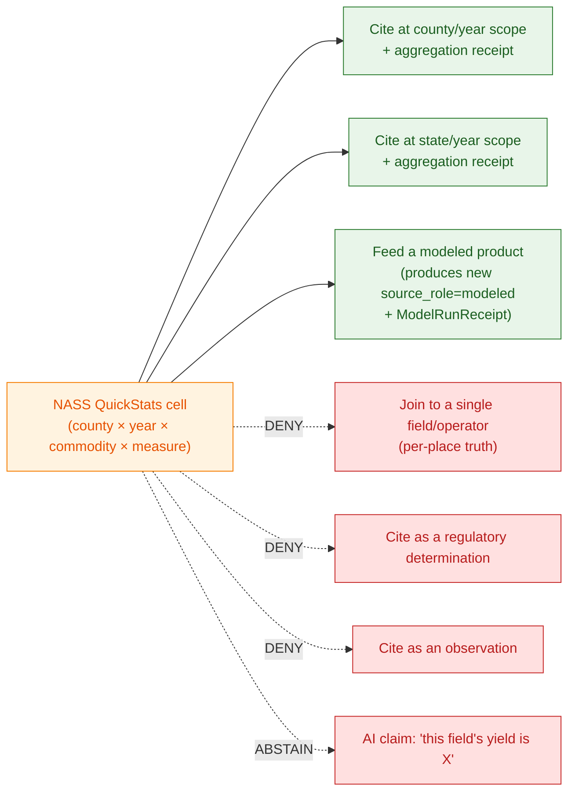

<!-- [KFM_META_BLOCK_V2]
doc_id: kfm://doc/docs-sources-catalog-usda-usda-nass-quickstats
title: USDA NASS QuickStats
type: product-page
version: v0.2
status: draft
owners: <PLACEHOLDER — Docs steward + Source steward for usda>
created: 2026-05-21
updated: 2026-05-22
policy_label: public
related:
  - docs/sources/catalog/usda/README.md
  - docs/sources/catalog/usda/usda-nass-cdl.md
  - docs/sources/catalog/usda/usda-plants.md
  - docs/sources/catalog/README.md
  - docs/doctrine/directory-rules.md
  - docs/sources/catalog/PROFILES.md
  - docs/sources/catalog/IDENTITY.md
  - docs/sources/catalog/RIGHTS-AND-SENSITIVITY-MAP.md
  - docs/sources/catalog/OPEN-QUESTIONS.md
tags: [kfm, docs, sources, catalog, usda, agriculture, aggregate, tabular]
notes:
  - "v0.2 polish revision: navigation, source-role anti-collapse callouts, atlas-card pointers, and aggregate-only governance section added; underlying evidence basis unchanged."
  - "PROPOSED product-page scaffold; description grounded in docs/domains SOURCE_REGISTRY files and the consolidated atlas (KFM-P2-IDEA-0024, atlas §24.1, [DOM-AG] §N)."
  - "QuickStats is the canonical 'aggregate' example in the atlas (atlas §24.1.1: 'USDA crop county totals'). Aggregate-cited-as-per-place-truth is an explicit DENY condition under atlas §24.1.2."
  - "Out-of-spine relative to directory-rules.md §7.3 — see family README for OPEN-DSC-14 context."
[/KFM_META_BLOCK_V2] -->

<a id="top"></a>

# USDA NASS QuickStats

> USDA National Agricultural Statistics Service (NASS) **QuickStats** — agricultural statistics aggregated by county, state, and year, admitted as **`aggregate`** source-role data only. **CONFIRMED in atlas** (`KFM-P2-IDEA-0024`); endpoint, cadence specifics, and rights status **NEEDS VERIFICATION** per release.

[](#status)
[](../_template/SOURCE_PRODUCT_TEMPLATE.md)
[](./README.md)
[](#source-authority)
[](#aggregate-only-governance)
[](#rights-and-sensitivity)
[](#last-reviewed)

**Status:** PROPOSED — scaffold · **Family:** [`usda`](./README.md) · **Owners:** `<PLACEHOLDER — Docs steward + Source steward for usda>` · **Last reviewed:** 2026-05-22

---

## Contents

- [At a glance](#at-a-glance)
- [Overview](#overview)
- [Scope](#scope)
- [Source authority](#source-authority)
- [Aggregate-only governance](#aggregate-only-governance)
- [Lifecycle placement](#lifecycle-placement)
- [Catalog profiles used](#catalog-profiles-used)
- [Collection identity](#collection-identity)
- [Provenance fields](#provenance-fields)
- [Temporal handling](#temporal-handling)
- [Geometry and projection](#geometry-and-projection)
- [Rights and sensitivity](#rights-and-sensitivity)
- [Watcher and material-change governance](#watcher-and-material-change-governance)
- [Validation and catalog closure](#validation-and-catalog-closure)
- [Related contracts and schemas](#related-contracts-and-schemas)
- [Related connectors and pipelines](#related-connectors-and-pipelines)
- [Examples](#examples)
- [Open questions](#open-questions)
- [FAQ](#faq)
- [Appendix](#appendix)
- [Related docs](#related-docs)
- [Last reviewed](#last-reviewed)

---

## At a glance

| Field | Value | Label |
|---|---|---|
| **Product** | USDA NASS QuickStats | — |
| **Family** | [`usda`](./README.md) (out-of-spine relative to `directory-rules.md` §7.3 — see family README) | PROPOSED |
| **Product type** | Tabular agricultural statistics; aggregated by county/state/year (also district, watershed, ag-region) | CONFIRMED (atlas) |
| **Source role** | `aggregate` — "USDA crop county totals" is the **canonical aggregate example** in atlas §24.1.1 | **CONFIRMED** (atlas) |
| **Anti-collapse posture** | DENY join from aggregate cell to single record; ABSTAIN at AI; field-level NASS claims denied | **CONFIRMED doctrine** (atlas §24.1.2; `[DOM-AG]` validator list) |
| **Update cadence** | Mixed (monthly/quarterly/annual depending on series) | NEEDS VERIFICATION per series |
| **Geographic coverage** | U.S. (national, state, district, county) | NEEDS VERIFICATION |
| **Endpoint URL** | — | NEEDS VERIFICATION |
| **Rights** | U.S. federal product (likely public domain); attribution terms unconfirmed | NEEDS VERIFICATION |
| **Primary catalog profile** | **DCAT** (per `C4-05`: "Non-spatial datasets are catalogued as DCAT Dataset and Distribution objects") | CONFIRMED doctrine |
| **Public posture** | County/generalized products first; material-change watchers propose work only | CONFIRMED doctrine (`Build Manual §10.7`) |

[↑ Back to top](#top)

---

## Overview

USDA NASS **QuickStats** is the National Agricultural Statistics Service's portal for survey- and census-derived agricultural statistics — area planted, area harvested, yield, production, prices, demographics — aggregated by **county**, **state**, **agricultural district**, **watershed**, **region**, or **national** unit and reported by **year** (or finer reporting period for some series).

The KFM atlas explicitly names NASS as one of the Kansas-specific agricultural authorities (`KFM-P2-IDEA-0024`): "USDA NASS (agricultural statistics) … ingested with its own watcher, license posture, and cadence." Critically, the atlas places QuickStats squarely in the **`aggregate`** source-role class — atlas §24.1.1 lists "USDA crop county totals" as the canonical example.

> [!IMPORTANT]
> **QuickStats is `aggregate` data, not observation data.** Aggregation is *irreversible loss of individual-record fidelity*. The atlas DENIES (atlas §24.1.2) any join from an aggregate cell to a single record, and AI surfaces must ABSTAIN. The Agriculture validator list (`[DOM-AG] §K`) explicitly includes "policy denial for field-level NASS claims" as a required test. This rule is the single most important constraint on how QuickStats is used downstream.

[↑ Back to top](#top)

---

## Scope

| Question | Answer |
|---|---|
| What this page documents | The catalog-layer documentation for the USDA NASS QuickStats product as one source under the [`usda`](./README.md) family. |
| What this page does **not** document | Schema definitions, connector code, policy text, lifecycle data, or the live `SourceDescriptor` (each lives under its owning root per `directory-rules.md`). |
| Domain anchor | Agriculture (`[DOM-AG]`). Per `Build Manual §10.7`: "field/county summaries" with **county/generalized products first** and field-level claims denied. |
| Public posture (CONFIRMED doctrine) | County/generalized products first; material-change watchers propose work only (`Build Manual §10.7`). |

[↑ Back to top](#top)

---

## Source authority

The authoritative `SourceDescriptor` for QuickStats lives in [`data/registry/sources/`](../../../../data/registry/sources/) — **do not duplicate descriptor fields here**.

A live QuickStats `SourceDescriptor` MUST carry (per atlas §24.1.3):

| Field | Value for QuickStats | Required? | Label |
|---|---|---|---|
| `source_role` | `aggregate` | **MUST** — set at admission; **never edited in place** | CONFIRMED (atlas §24.1.1) |
| `role_authority` | `USDA NASS` (issuing body) | MUST when role ∈ {regulatory, modeled, aggregate} | CONFIRMED requirement |
| `role_aggregation_unit` | One of `{county, state, district, watershed, ag_region, national, year}` per series | **MUST when `source_role = aggregate`** — prevents geometry-scope drift on join | CONFIRMED requirement |
| `rights_status` | Expected `public` (U.S. federal product); attribution terms **NEEDS VERIFICATION** | MUST | NEEDS VERIFICATION |
| `update_cadence` | Mixed per series (monthly survey series, annual Census of Agriculture, etc.) | MUST | NEEDS VERIFICATION per series |
| `authority_scope` | U.S. agricultural statistics | MUST | NEEDS VERIFICATION |
| `verification_obligations` | Source-head fields (`sha256`, `etag`, `last_modified`, `content_length`) per generic Gate D | MUST | CONFIRMED doctrine |

> [!WARNING]
> `source_role` is set at admission and **NEVER edited in place** (atlas §24.1.3, source-role anti-collapse). Corrections produce a **new descriptor and a `CorrectionNotice`**. Do not relabel `aggregate` → `observation` (or any other role) by editing — that is the source-role anti-collapse violation. Atlas §24.1.2 lists this as a DENY condition with required guardrails: **aggregation receipt; geometry-scope guard; matrix-cell semantics**.

[↑ Back to top](#top)

---

## Aggregate-only governance

This section consolidates the rules that flow from QuickStats's `aggregate` role. **CONFIRMED doctrine** at every line below — atlas §24.1.2 (anti-collapse failure modes) and `[DOM-AG] §K` (validators, tests, fixtures).

| Rule | What it requires | Source |
|---|---|---|
| **DENY join from aggregate cell to single record** | Promotion/governed-API DENY when an aggregate value is queried as a per-place truth | atlas §24.1.2 |
| **ABSTAIN at AI surface** | Focus Mode must `ABSTAIN` on requests that would express an aggregate cell as a per-place claim | atlas §24.1.2 |
| **Aggregation receipt required** | Each promoted record carries an aggregation receipt naming the aggregation unit and method | atlas §24.1.2 guardrail |
| **Geometry-scope guard** | The descriptor's `role_aggregation_unit` is checked against any spatial join geometry; mismatch fails closed | atlas §24.1.2 guardrail; atlas §24.1.3 |
| **Matrix-cell semantics** | The (unit × period) tuple is treated as the cell; values are never disaggregated by interpolation without a `modeled` source-role transition (which is itself governed) | atlas §24.1.2 guardrail |
| **Policy denial for field-level NASS claims** | Required validator in `[DOM-AG] §K` | atlas |
| **Private-sensitive joins fail closed** | Atlas §I: "farm/operator private data, proprietary yield, pesticide records, and private-sensitive joins fail closed" | atlas `[DOM-AG] §I` |
| **Aggregate cited as per-place truth (DENY)** | Anti-collapse failure mode for Agriculture; domain at risk includes Agriculture, People, Geology, Air | atlas §24.1.2 |



[↑ Back to top](#top)

---

## Lifecycle placement

**PROPOSED** — modeled on the PLANTS pattern (`KFM-P2-PROG-0006`); per-product paths **NEEDS VERIFICATION** against `directory-rules.md` §7.

```text
data/raw/agriculture/usda_nass_quickstats/<series>/<snapshot>/<run_id>/    ← connector output only
data/work/agriculture/usda_nass_quickstats/<run_id>/                       ← validation, normalization
data/processed/agriculture/nass_quickstats/<series>/<period>/...           ← validated tabular records (PROPOSED layout)
data/catalog/{dcat,prov,domain}/agriculture/nass_quickstats/...            ← DCAT-first catalog records (Gate F)
data/receipts/agriculture/usda_nass_quickstats/                            ← TransformReceipt, RunReceipt, AggregationReceipt
data/proofs/agriculture/usda_nass_quickstats/                              ← proof-pack outputs
data/published/agriculture/nass_quickstats/release_manifest.json           ← release manifest (Gate G)
```

> [!CAUTION]
> Per `directory-rules.md` §7.3, **connectors MUST NOT publish** and MUST NOT write under `data/processed/`, `data/catalog/`, or `data/published/`. Watcher state and outbox records remain **internal control-plane artifacts until released** (per `ML-067-041`).

[↑ Back to top](#top)

---

## Catalog profiles used

| Profile | Lane | Used by this product? | Reference |
|---|---|---|---|
| **DCAT** Dataset + Distribution | [`data/catalog/dcat/`](../../../../data/catalog/dcat/) | **PROPOSED — Yes (primary)**. QuickStats is non-spatial tabular data; `C4-05` is explicit: "Non-spatial datasets are catalogued as DCAT Dataset and Distribution objects." | `C4-05` |
| **STAC** with `kfm:provenance` | [`data/catalog/stac/`](../../../../data/catalog/stac/) | **PROPOSED — No** (not a spatiotemporal asset). May be mirrored via a STAC→DCAT bridge if dual-registration is needed (`KFM-P14-PROG-0008`, `KFM-P14-IDEA-0002`). | `C4-01`, `KFM-P14-PROG-0008` |
| **PROV-O** | [`data/catalog/prov/`](../../../../data/catalog/prov/) | PROPOSED — Yes; lineage tracking applies regardless of catalog vehicle | atlas §24.6 |
| **Domain projection** | [`data/catalog/domain/agriculture/`](../../../../data/catalog/domain/agriculture/) | PROPOSED — confirm Agriculture domain projection presence | atlas §F |

> [!NOTE]
> **DCAT is the primary profile for QuickStats**, not STAC. `C4-05` states the rule directly; `KFM-P14-IDEA-0002` proposes a STAC→DCAT bridge for cross-catalog discovery. STAC is reserved for spatiotemporal raster/vector assets (CDL is STAC-first; QuickStats is DCAT-first).

[↑ Back to top](#top)

---

## Collection identity

- **DCAT Dataset id pattern (PROPOSED):** `kfm-usda-nass-quickstats` (form: `kfm-<org>-<product>` — see [`IDENTITY.md`](../IDENTITY.md)).
- **Per-series Distribution ids (PROPOSED):** one DCAT Distribution per series + period (e.g., `kfm-usda-nass-quickstats/corn-yield-county/2024`).
- **Namespace pin:** **UNRESOLVED** — `kfm:` vs. `ks-kfm:` per [`OPEN-DSC-03`](../OPEN-QUESTIONS.md).
- **Identity rule:** JCS canonicalization with retrieval timestamp excluded from `spec_hash` (CONFIRMED doctrine; PROPOSED at field realization for QuickStats).
- **Asset roles:** **NEEDS VERIFICATION** — confirm against [`schemas/contracts/v1/source/`](../../../../schemas/contracts/v1/source/) per ADR-0001.

[↑ Back to top](#top)

---

## Provenance fields

DCAT Dataset + Distribution provenance pattern (CONFIRMED per `C4-05`; KFM extensions per `KFM-P14-PROG-0008`):

```text
Dataset:
  kfm:id                         # canonical id
  kfm:spec_hash                  # sha256 of the canonical record (JCS, retrieval excluded)
  kfm:source_role                # 'aggregate' (CONFIRMED — atlas §24.1)
  kfm:role_aggregation_unit      # 'county' | 'state' | 'district' | 'watershed' | 'national' | 'year' | …
  prov:wasGeneratedBy            # PROV activity reference
  dcat:distribution              # [→ Distribution(s)]

Distribution (one or more — typically one per series/period or one per byteSize):
  dcat:accessURL                 # URL to the tabular artifact (CSV/Parquet/JSON)
  dcat:mediaType                 # e.g., 'text/csv', 'application/parquet'
  dcat:byteSize                  # CONFIRMED per KFM-P14-PROG-0008
  spdx:checksum                  # per-distribution integrity (KFM-P14-PROG-0008)
  dcat:conformsTo                # → table schema (KFM-P14-PROG-0008)
  prov:wasDerivedFrom            # → upstream NASS source
  kfm:evidence_bundle_ref        # kfm://evidence/<digest>
  kfm:run_record_ref             # kfm://run/<run-id>
  kfm:audit_ref                  # kfm://audit/<attestation-id>
  kfm:policy_digest              # sha256 of the policy bundle at promotion
  kfm:aggregation_receipt_ref    # CONFIRMED required guardrail (atlas §24.1.2)
```

Per-distribution integrity uses `spdx:checksum` plus the source-authenticity gate fields (`sha256`, `etag`, `last_modified`, `content_length`) from the generic Gate D pattern.

[↑ Back to top](#top)

---

## Temporal handling

| Time kind | QuickStats meaning | Label |
|---|---|---|
| `source_time` | When USDA NASS issued the QuickStats release/refresh | CONFIRMED kind / NEEDS VERIFICATION per release |
| `observed_time` | Survey/reporting period the values represent (e.g., 2024 crop year, January 2026 survey) | CONFIRMED kind / NEEDS VERIFICATION |
| `valid_time` | Period over which the aggregate value is treated as the published figure | PROPOSED |
| `retrieval_time` | KFM fetch timestamp (excluded from `spec_hash` per JCS rule) | CONFIRMED doctrine |
| `release_time` | KFM publication timestamp on the published `ReleaseManifest` | CONFIRMED doctrine |
| `correction_time` | If a CorrectionNotice supersedes a prior NASS revision (NASS revises figures retrospectively — this is the key correction case for QuickStats) | CONFIRMED doctrine |

Source, observed, valid, retrieval, release, and correction times stay **distinct where material**.

> [!IMPORTANT]
> NASS routinely **revises** prior estimates as new survey data arrives. A QuickStats value for a given (commodity × geography × period) cell is **not immutable** — corrections happen. Treat retrospective revisions as `CorrectionNotice` events, not as silent overwrites.

[↑ Back to top](#top)

---

## Geometry and projection

QuickStats is **tabular**, not spatial. Geometry enters only through join keys to canonical geographies. **NEEDS VERIFICATION** per release.

- **Join keys (PROPOSED).** State (USPS 2-letter or 2-digit FIPS); County (5-digit FIPS — same scheme as PLANTS county distributions per `KFM-P27-IDEA-0003`); Agricultural District / Watershed (HUC) for series that report those units.
- **Geometry source.** Canonical geographies live in the relevant boundary lane (NEEDS VERIFICATION); QuickStats joins by **key only**, not by inline geometry.
- **Generalization rules.** Public layers favor county/generalized products per `Build Manual §10.7`; field-level joins are policy-denied.
- **No raster CRS.** QuickStats has no raster CRS; the CDL product page covers raster cases.

[↑ Back to top](#top)

---

## Rights and sensitivity

**NEEDS VERIFICATION** — see [`policy/sensitivity/`](../../../../policy/sensitivity/) and [`RIGHTS-AND-SENSITIVITY-MAP.md`](../RIGHTS-AND-SENSITIVITY-MAP.md). **Do not restate policy here.**

| Concern | Atlas posture | Label |
|---|---|---|
| Rights status | U.S. federal product; expected public domain with attribution; confirm in the live `SourceDescriptor` | NEEDS VERIFICATION |
| Field/operator private data | Atlas `[DOM-AG] §I`: "farm/operator private data, proprietary yield, pesticide records, and private-sensitive joins fail closed" | **CONFIRMED doctrine** |
| Aggregate-cited-as-per-place truth | DENY join from aggregate cell to single record; ABSTAIN at AI (atlas §24.1.2) | **CONFIRMED doctrine** |
| NASS suppression of low-count cells | NASS itself suppresses cells below disclosure thresholds to protect respondent confidentiality; KFM MUST preserve this suppression and never impute | NEEDS VERIFICATION (KFM-side enforcement); CONFIRMED upstream practice |
| k-Anonymity for re-publication of tabular sensitive data | Atlas `KFM-P2-IDEA-0015`: "k=5 default for KFM, k=10 for higher-sensitivity domains; quasi-identifiers enumerated; generalization hierarchies documented" | CONFIRMED doctrine (PROPOSED enforcement) |
| Private land inference / over-precise field claims | `Build Manual §10.7` risk register | **CONFIRMED risk** |

> [!CAUTION]
> NASS publishes already-aggregated data; the upstream is generally safe for republication. The **danger zone** for KFM is **downstream joins** — joining a QuickStats county cell to a parcel boundary, a farm operator record, or a private yield monitor reading. Those joins re-introduce identifiable detail and **must fail closed** at the policy gate.

[↑ Back to top](#top)

---

## Watcher and material-change governance

QuickStats does not fit the **CDL/PLANTS material-change watcher family** (`ML-067-001..015`) cleanly because QuickStats is tabular, not raster, and NASS revisions are themselves the principal change signal rather than histogram drift. A QuickStats-specific watcher pattern is **PROPOSED** and **NEEDS VERIFICATION**.

| Element | QuickStats analog | Status |
|---|---|---|
| HEAD/ETag check | Standard HTTP `ETag` / `Last-Modified` against the QuickStats endpoint per series | PROPOSED |
| Material-change signal | NASS-issued revision marker on a (commodity × geography × period) cell; new survey release adding a series | PROPOSED |
| Sidecar required fields | `source_url`, `etag`, `last_modified`, `series_id`, `commodity`, `geography_unit`, `period`, `value_revision_flag`, `spec_hash` | PROPOSED |
| `PROPOSED_WORK_RECORD` emission | Per `ML-067-006`: emit candidate work record on material change; watcher is **never** the publisher | CONFIRMED doctrine |
| Source-authenticity gate | Per `ML-067-013`: persist `sha256`, `etag`, `last_modified`, `content_length` | CONFIRMED doctrine |
| Aggregation-unit drift gate | Verify `role_aggregation_unit` consistency across snapshots; flag if NASS redefines a unit | PROPOSED (analog to `ML-067-015` county geometry drift) |
| Suppression-flag preservation | NASS suppression flags MUST round-trip into KFM records without imputation | PROPOSED |

> [!WARNING]
> **Watcher-as-publisher is a core anti-pattern** (`ML-067-012`, `Build Manual §8.3`). The Build Manual is explicit: watchers must not "commit directly to main," "move data to PUBLISHED," "rebuild public artifacts without gates," or "treat source changes as truth changes without materiality checks."

A Build Manual §8.4 sidecar template exists for the CDL case (`source:usda:cdl:2025:ks`); a parallel template for QuickStats is **NEEDS VERIFICATION**.

[↑ Back to top](#top)

---

## Validation and catalog closure

| Validator | What it checks | Atlas anchor | Status |
|---|---|---|---|
| **Policy denial for field-level NASS claims** | Required `[DOM-AG] §K` validator — DENY any field-level NASS claim | atlas `[DOM-AG] §K` | **CONFIRMED required** / PROPOSED implementation |
| **Crop progress aggregate-only tests** | Required `[DOM-AG] §K` validator — verify aggregate-only treatment | atlas `[DOM-AG] §K` | **CONFIRMED required** / PROPOSED implementation |
| Catalog closure | All catalog records (DCAT/PROV) closed before public release | `KFM-P1-IDEA-0020` | PROPOSED |
| STAC checksum closure | If a STAC mirror exists, `file:checksum` matches `ReleaseManifest` digest | `KFM-P22-PROG-0037` | PROPOSED — only if STAC mirroring is adopted |
| STAC Projection lint | Not applicable to non-spatial DCAT records | `KFM-P27-FEAT-0003` | N/A |
| **DCAT distribution conformance** | Distributions carry `byteSize`, `mediaType`, `checksum`, `conformsTo` (table schema), versions, PROV links | `KFM-P14-PROG-0008` | PROPOSED |
| **Aggregation-receipt presence** | Every promoted record references an `AggregationReceipt` naming unit + method | atlas §24.1.2 guardrail | PROPOSED |
| **Geometry-scope guard** | Reject joins where the geometry scope of the consumer doesn't match `role_aggregation_unit` | atlas §24.1.2 guardrail | PROPOSED |
| **k-Anonymity validator (when re-aggregating)** | k≥5 default; quasi-identifiers enumerated; generalization documented | `KFM-P2-IDEA-0015` | PROPOSED |
| Source-authenticity gate (Gate D) | Persist `sha256`, `etag`, `last_modified`, `content_length` | `ML-067-013` (generic) | PROPOSED |
| Suppression-flag preservation | NASS suppression flags carry through; imputation forbidden | atlas Agriculture posture | PROPOSED |
| Spec-hash match gate | Recomputed `spec_hash` matches claimed | `C5-04` | CONFIRMED doctrine |

[↑ Back to top](#top)

---

## Related contracts and schemas

- [`schemas/contracts/v1/source/`](../../../../schemas/contracts/v1/source/) — **canonical schema home** per ADR-0001 (`directory-rules.md` §2.4(3)). QuickStats `SourceDescriptor` conforms here.
- [`contracts/`](../../../../contracts/) — object families. QuickStats feeds Agriculture aggregate objects such as `Crop Observation` (when aggregated), `Crop Rotation` (aggregate context), and `Agricultural Economy Observation` per atlas object-family table.

[↑ Back to top](#top)

---

## Related connectors and pipelines

- [`connectors/usda-nass/`](../../../../connectors/usda-nass/) — v0.1 of the family README reports this as **currently an empty stub**; re-verify before authoring connector code.
- Connectors write to [`data/raw/<domain>/<source_id>/<run_id>/`](../../../../data/raw/) or [`data/quarantine/`](../../../../data/quarantine/) only (`directory-rules.md` §7.3).
- Pipeline lanes: [`pipelines/ingest/`](../../../../pipelines/ingest/), [`pipelines/normalize/`](../../../../pipelines/normalize/), [`pipelines/validate/`](../../../../pipelines/validate/), [`pipelines/catalog/`](../../../../pipelines/catalog/).
- Pipeline specs: [`pipeline_specs/agriculture/`](../../../../pipeline_specs/agriculture/) (PROPOSED home; verify per `directory-rules.md` §7.4).

[↑ Back to top](#top)

---

## Examples

*Illustrative only — do not treat as authoritative. The canonical example file is referenced at [`../_examples/stac-item-example.json`](../_examples/stac-item-example.json) (PROPOSED — verify presence). For QuickStats, a DCAT example is the primary illustrative shape; a STAC example is included only if a STAC mirror is adopted.*

<details>
<summary><strong>Illustrative DCAT Dataset + Distribution shape (PROPOSED)</strong></summary>

```json
{
  "@context": [
    "https://www.w3.org/ns/dcat.jsonld",
    { "kfm": "<PLACEHOLDER — OPEN-DSC-03>" }
  ],
  "@type": "dcat:Dataset",
  "@id": "kfm-usda-nass-quickstats/corn-yield-county",
  "dct:title": "USDA NASS QuickStats — Corn for grain, yield, county, annual",
  "dct:publisher": { "@id": "<PLACEHOLDER — USDA NASS publisher IRI>" },
  "dct:license": "<PLACEHOLDER — NEEDS VERIFICATION>",
  "kfm:source_role": "aggregate",
  "kfm:role_aggregation_unit": "county",
  "kfm:spec_hash": "sha256:<PLACEHOLDER>",
  "prov:wasGeneratedBy": "<PLACEHOLDER — PROV activity ref>",
  "dcat:distribution": [
    {
      "@type": "dcat:Distribution",
      "@id": "kfm-usda-nass-quickstats/corn-yield-county/2024",
      "dcat:accessURL": "<PLACEHOLDER — NEEDS VERIFICATION>",
      "dcat:mediaType": "text/csv",
      "dcat:byteSize": 0,
      "spdx:checksum": { "algorithm": "sha256", "checksumValue": "<PLACEHOLDER>" },
      "dcat:conformsTo": "<PLACEHOLDER — table schema URI>",
      "prov:wasDerivedFrom": "<PLACEHOLDER — upstream NASS source ref>",
      "kfm:evidence_bundle_ref": "kfm://evidence/<digest>",
      "kfm:run_record_ref": "kfm://run/<run-id>",
      "kfm:audit_ref": "kfm://audit/<attestation-id>",
      "kfm:policy_digest": "sha256:<PLACEHOLDER>",
      "kfm:aggregation_receipt_ref": "kfm://receipt/agg/<digest>"
    }
  ]
}
```

</details>

<details>
<summary><strong>Illustrative QuickStats sidecar shape (PROPOSED — analog to Build Manual §8.4)</strong></summary>

```json
{
  "schema": "kfm.source_watch_sidecar.v1",
  "source_id": "source:usda:nass:quickstats:corn-yield-county:2024",
  "source_url": "<PLACEHOLDER — NEEDS VERIFICATION>",
  "etag": "<PLACEHOLDER>",
  "last_modified": "<PLACEHOLDER>",
  "observed_at": "2026-05-22T00:00:00Z",
  "series_id": "CORN, GRAIN - YIELD, MEASURED IN BU / ACRE",
  "commodity": "CORN",
  "geography_unit": "county",
  "period": "2024",
  "value_revision_flag": false,
  "suppression_preserved": true,
  "content_length": 0,
  "spec_hash": "sha256:<PLACEHOLDER>",
  "decision": "NO_CHANGE | PROPOSED_WORK_RECORD | QUARANTINE | ERROR"
}
```

</details>

<details>
<summary><strong>Illustrative AggregationReceipt sketch (PROPOSED)</strong></summary>

```json
{
  "schema": "kfm.aggregation_receipt.v1",
  "source_role": "aggregate",
  "role_authority": "USDA NASS",
  "role_aggregation_unit": "county",
  "aggregation_period": "2024",
  "aggregation_method": "USDA NASS survey-derived county estimate (revised)",
  "suppression_thresholds_preserved": true,
  "spec_hash": "sha256:<PLACEHOLDER>"
}
```

</details>

[↑ Back to top](#top)

---

## Open questions

| ID / scope | Question | Status |
|---|---|---|
| Family-level (`OPEN-DSC-14`) | Is `usda` a §7.3 family in its own right, or absorbed into `nrcs/`? | OPEN — ADR required (see family README) |
| Namespace pin (`OPEN-DSC-03`) | `kfm:` vs. `ks-kfm:` | OPEN (lane-wide) |
| Cadence specifics | Per-series cadence (monthly survey vs. annual vs. Census of Agriculture every 5 years) | NEEDS VERIFICATION |
| Endpoint URL | Current QuickStats endpoint URL(s) (API and CSV download) | NEEDS VERIFICATION |
| Authentication | Whether the API requires a key, and how that key is managed (credential posture) | NEEDS VERIFICATION |
| Rights & attribution | Exact attribution string and public-domain confirmation | NEEDS VERIFICATION |
| Collection scope | Does QuickStats warrant a single DCAT Dataset with many Distributions, or one Dataset per series? | OPEN |
| Activation | Atlas `[DOM-AG] §N`: "Verify NASS/QuickStats and Crop Progress activation" | **NEEDS VERIFICATION** (atlas-flagged) |
| STAC mirror | Whether QuickStats should be dual-registered via a STAC→DCAT bridge per `KFM-P14-PROG-0008` | OPEN |
| k value for re-aggregation | Confirm k=5 default vs. k=10 for any KFM re-aggregation of QuickStats below NASS-native units | NEEDS VERIFICATION |
| Sidecar template adoption | Whether the QuickStats sidecar template above is adopted in `Build Manual §8.4` | NEEDS VERIFICATION |

[↑ Back to top](#top)

---

## FAQ

<details>
<summary><strong>Q: Why is QuickStats <code>aggregate</code> instead of <code>observation</code>?</strong></summary>

Because NASS publishes survey-derived **summaries over a unit** (county × year, state × year), not first-hand readings of individual fields. Atlas §24.1.1 defines `aggregate` as: "A published summary, total, or average over a unit (county, year, watershed); irreversible loss of individual record fidelity." NASS county totals are the **canonical example** in that table. Treating QuickStats as `observation` would let aggregate values inherit per-place authority — exactly the anti-collapse failure mode that atlas §24.1.2 DENIES.

</details>

<details>
<summary><strong>Q: Can I show a QuickStats county yield value on a parcel I'm hovering over?</strong></summary>

No. That's the canonical aggregate-cited-as-per-place-truth violation (atlas §24.1.2). The governed-API DENY rule fires; the AI surface ABSTAINS. You can show the value attached to **the county geometry** with an `AggregationReceipt` cite. The required guardrails are aggregation receipt, geometry-scope guard, and matrix-cell semantics.

</details>

<details>
<summary><strong>Q: Why DCAT instead of STAC?</strong></summary>

Because QuickStats is **non-spatial tabular** data. `C4-05` (CONFIRMED) is explicit: "Non-spatial datasets are catalogued as DCAT Dataset and Distribution objects, with the evidence bundle exposed as a `dcat:Distribution` …" STAC is reserved for spatiotemporal assets (CDL, PMTiles, COGs). A STAC→DCAT bridge for cross-catalog discovery is proposed in `KFM-P14-PROG-0008` but is not the primary surface for QuickStats.

</details>

<details>
<summary><strong>Q: NASS revises old county values when new survey data arrives. How does KFM handle that?</strong></summary>

Via `CorrectionNotice`. A revised NASS value supersedes the prior published value through the governed correction path, not a silent overwrite. The Distribution's `prov:wasDerivedFrom` and the `kfm:aggregation_receipt_ref` capture which NASS revision a given KFM value reflects. Downstream consumers can resolve the EvidenceBundle to see the lineage. The `correction_time` axis (atlas object-family temporal rule) keeps revision time distinct from original observation time.

</details>

<details>
<summary><strong>Q: NASS suppresses low-count cells to protect respondent confidentiality. Should KFM impute those?</strong></summary>

**No.** Suppression flags MUST round-trip into KFM records. Imputation would re-introduce the privacy risk that NASS deliberately removed. If KFM re-aggregates QuickStats to a different unit (e.g., custom regions), the k-Anonymity rule (`KFM-P2-IDEA-0015`: k≥5 default, k=10 for higher-sensitivity domains) applies and the validator must enumerate quasi-identifiers and document generalization hierarchies.

</details>

<details>
<summary><strong>Q: Can QuickStats feed a modeled product (e.g., a county-yield interpolation surface)?</strong></summary>

Yes — but the modeled product carries a **new `SourceDescriptor` with `source_role: modeled`** and a `role_model_run_ref` pointing to a `ModelRunReceipt`. The original QuickStats record remains `aggregate`. Promotion does not upgrade `aggregate` → `modeled`; those are separate governed transitions (atlas §24.1, reading note).

</details>

[↑ Back to top](#top)

---

## Appendix

<details>
<summary><strong>A1 — Atlas card pointers for NASS QuickStats</strong></summary>

| Card / Section | Topic | Relevance |
|---|---|---|
| `KFM-P2-IDEA-0024` | USDA NASS, KGS, KDA, KDHE, KDWP as Kansas-specific authorities | CONFIRMED that NASS is a Kansas-relevant agricultural-statistics authority ingested with its own watcher, license posture, and cadence. |
| atlas §24.1.1 | Canonical source-role classes table | Lists "USDA crop county totals" as the **canonical aggregate example**. |
| atlas §24.1.2 | Anti-collapse failure modes (DENY conditions) | DENY join from aggregate cell to single record; ABSTAIN at AI; required guardrails: aggregation receipt, geometry-scope guard, matrix-cell semantics. |
| atlas §24.1.3 | Source-role descriptor fields | `role_aggregation_unit` is **MUST when `source_role = aggregate`**. |
| `[DOM-AG] §D` | Key Agriculture source families | "USDA NASS QuickStats / Crop Progress" listed with `rights and current terms NEEDS VERIFICATION; sensitive joins fail closed`. |
| `[DOM-AG] §I` | Sensitivity, rights, publication posture | "Aggregate statistics and satellite products must not become field/operator truth; farm/operator private data, proprietary yield, pesticide records, and private-sensitive joins fail closed." |
| `[DOM-AG] §K` | Validators, tests, fixtures | "crop progress aggregate-only tests"; "policy denial for field-level NASS claims". |
| `[DOM-AG] §N` | Verification backlog | "Verify NASS/QuickStats and Crop Progress activation". |
| `KFM-P19-PROG-0036` | Crop status NASS baseline source lane | NASS crop-status signals modeled as agricultural baseline inputs with source descriptors, temporal grain, promotion gates. |
| `KFM-P2-IDEA-0015` | k-Anonymity for tabular sensitive data | k=5 default; k=10 for higher-sensitivity; quasi-identifiers enumerated; generalization documented. |
| `C4-05` | DCAT Dataset and Distribution for non-spatial catalog records | Primary catalog vehicle for QuickStats. |
| `KFM-P14-IDEA-0002` | STAC/DCAT/PROV distribution contract as harvest surface | DCAT Datasets and Distributions with checksums, versions, table schemas, provenance links. |
| `KFM-P14-PROG-0008` | STAC to DCAT JSON-LD emitter | Generate DCAT JSON-LD from STAC Collections with Distribution checksums, byteSize, mediaType, table schema conformity, versions, PROV links. |
| `C5-04` | Spec-hash-match gate | Recomputed `spec_hash` matches claimed. |

</details>

<details>
<summary><strong>A2 — Atlas §24.1.2 anti-collapse row for QuickStats (verbatim)</strong></summary>

> | Collapse pattern | Domains most at risk | Denied outcome | Required guardrail |
> |---|---|---|---|
> | Aggregate cited as a per-place truth. | Agriculture; People; Geology; Air | DENY join from aggregate cell to single record; ABSTAIN at AI. | Aggregation receipt; geometry-scope guard; matrix-cell semantics. |

— atlas §24.1.2, `[DOM-AG]` `[DOM-PEOPLE]` `[DOM-GEOL]` `[DOM-AIR]`

</details>

<details>
<summary><strong>A3 — Build Manual §10.7 verbatim posture (Agriculture and landcover)</strong></summary>

> **Coverage:** cropland, CDL, PLANTS, crop history, landcover change, crop stress, irrigation context, field/county summaries.
>
> **Risks:** noisy annual changes, source-drift false positives, private land inference, over-precise field-level claims.
>
> **Public posture:** county/generalized products first; material-change watchers propose work only.

— `KFM_Unified_Implementation_Architecture_Build_Manual.md §10.7`

</details>

<details>
<summary><strong>A4 — Build Manual §8.3 watcher prohibitions (CONFIRMED doctrine)</strong></summary>

> Watchers must not:
> - Commit directly to main.
> - Move data to PUBLISHED.
> - Rebuild public artifacts without gates.
> - Treat source changes as truth changes without materiality checks.
> - Publish AI-generated interpretation.

— `Build Manual §8.3`

</details>

[↑ Back to top](#top)

---

## Related docs

- [`docs/sources/catalog/usda/README.md`](./README.md) — `usda` family README (governance, OPEN-DSC-14)
- [`docs/sources/catalog/usda/usda-nass-cdl.md`](./usda-nass-cdl.md) — sibling product page (NASS CDL)
- [`docs/sources/catalog/usda/usda-plants.md`](./usda-plants.md) — sibling product page (PLANTS)
- [`docs/sources/catalog/README.md`](../README.md) — lane index
- [`docs/sources/catalog/PROFILES.md`](../PROFILES.md) — catalog profile conventions (STAC vs. DCAT)
- [`docs/sources/catalog/IDENTITY.md`](../IDENTITY.md) — collection-id and namespace conventions
- [`docs/sources/catalog/RIGHTS-AND-SENSITIVITY-MAP.md`](../RIGHTS-AND-SENSITIVITY-MAP.md) — per-product rights & sensitivity index
- [`docs/sources/catalog/OPEN-QUESTIONS.md`](../OPEN-QUESTIONS.md) — lane-wide `OPEN-DSC-*` index
- [`docs/sources/catalog/_template/SOURCE_PRODUCT_TEMPLATE.md`](../_template/SOURCE_PRODUCT_TEMPLATE.md) — product-page template
- [`docs/doctrine/directory-rules.md`](../../../doctrine/directory-rules.md) — placement authority
- [`data/registry/sources/`](../../../../data/registry/sources/) — authoritative `SourceDescriptors`
- [`schemas/contracts/v1/source/`](../../../../schemas/contracts/v1/source/) — schema home (ADR-0001)

---

## Last reviewed

**2026-05-22** — v0.2 polish revision (Claude Code session). No new repo-state claims introduced; v0.1 evidence basis preserved and extended with atlas-grounded QuickStats specifics (`KFM-P2-IDEA-0024`, atlas §24.1.1/§24.1.2/§24.1.3, `[DOM-AG] §D/§I/§K/§N`, `KFM-P2-IDEA-0015` k-Anonymity, `C4-05` DCAT primary, `KFM-P14-PROG-0008` STAC→DCAT bridge, `Build Manual §8.3/§8.4/§10.7`). Source-role anti-collapse diagram, aggregate-only governance section, expanded validation table, FAQ, and atlas-card appendix added.

[↑ Back to top](#top)
