<!-- [KFM_META_BLOCK_V2]
doc_id: kfm://doc/docs-sources-catalog-usda-usda-plants
title: USDA PLANTS Database
type: product-page
version: v0.2
status: draft
owners: <PLACEHOLDER — Docs steward + Source steward for usda>
created: 2026-05-21
updated: 2026-05-22
policy_label: public
related:
  - docs/sources/catalog/usda/README.md
  - docs/sources/catalog/usda/usda-nass-cdl.md
  - docs/sources/catalog/usda/usda-nass-quickstats.md
  - docs/sources/catalog/README.md
  - docs/doctrine/directory-rules.md
  - docs/sources/catalog/PROFILES.md
  - docs/sources/catalog/IDENTITY.md
  - docs/sources/catalog/RIGHTS-AND-SENSITIVITY-MAP.md
  - docs/sources/catalog/OPEN-QUESTIONS.md
tags: [kfm, docs, sources, catalog, usda, flora, taxonomy, checklist]
notes:
  - "v0.2 polish revision: navigation, lifecycle anchors, identity / EvidenceBundle / Evidence Drawer profile detail, sensitive-join callout, atlas-card pointers added; underlying evidence basis unchanged."
  - "PROPOSED product-page scaffold; description grounded in the consolidated atlas (KFM-P2-PROG-0006, KFM-P27-IDEA-0001..0004, KFM-P27-PROG-0002..0004, KFM-P27-FEAT-0001, KFM-P4-IDEA-0001, KFM-P29-FEAT-0002, KFM-P29-IDEA-0004, Build Manual §10.6)."
  - "Out-of-spine relative to directory-rules.md §7.3 — see family README for OPEN-DSC-14 context. Note: PLANTS sits under the Flora domain ([DOM-FLORA]); the [DOM-AG] / landcover coverage in Build Manual §10.7 is adjacent context only."
[/KFM_META_BLOCK_V2] -->

<a id="top"></a>

# USDA PLANTS Database

> USDA **PLANTS Database** — the federally authoritative U.S. plant checklist with taxonomy, scientific name with author, family, native status, growth habit, wetland status, and state + county distribution. **CONFIRMED in atlas** (`KFM-P27-IDEA-0001`); endpoint and cadence specifics **NEEDS VERIFICATION** per release.

[](#status)
[](../_template/SOURCE_PRODUCT_TEMPLATE.md)
[](./README.md)
[](#scope)
[-yellow)](#source-authority)
[](#rights-and-sensitivity)
[](#rights-and-sensitivity)
[](#last-reviewed)

**Status:** PROPOSED — scaffold · **Family:** [`usda`](./README.md) · **Owners:** `<PLACEHOLDER — Docs steward + Source steward for usda>` · **Last reviewed:** 2026-05-22

---

## Contents

- [At a glance](#at-a-glance)
- [Overview](#overview)
- [Scope](#scope)
- [Source authority](#source-authority)
- [Lifecycle placement](#lifecycle-placement)
- [Pipeline flow](#pipeline-flow)
- [Identity and taxonomy semantics](#identity-and-taxonomy-semantics)
- [Catalog profiles used](#catalog-profiles-used)
- [Collection identity](#collection-identity)
- [Provenance fields](#provenance-fields)
- [Temporal handling](#temporal-handling)
- [Geometry and projection](#geometry-and-projection)
- [Rights and sensitivity](#rights-and-sensitivity)
- [Watcher and material-change governance](#watcher-and-material-change-governance)
- [Evidence Drawer profile](#evidence-drawer-profile)
- [Validation and catalog closure](#validation-and-catalog-closure)
- [Related contracts and schemas](#related-contracts-and-schemas)
- [Related connectors and pipelines](#related-connectors-and-pipelines)
- [Examples](#examples)
- [Open questions](#open-questions)
- [FAQ](#faq)
- [Appendix](#appendix)
- [Related docs](#related-docs)
- [Last reviewed](#last-reviewed)

---

## At a glance

| Field | Value | Label |
|---|---|---|
| **Product** | USDA PLANTS Database — Complete Checklist + state + county distribution extracts | — |
| **Family** | [`usda`](./README.md) (out-of-spine relative to `directory-rules.md` §7.3 — see family README) | PROPOSED |
| **Domain** | Flora (`[DOM-FLORA]`) — Build Manual §10.6 | **CONFIRMED** |
| **Source role** | `authority` — "federally authoritative taxonomic backbone and state-presence scaffold" | **CONFIRMED** (atlas) |
| **Atlas anchor** | `KFM-P27-IDEA-0001` — "USDA PLANTS downloads should be treated as the authoritative federal source for U.S. plant checklist, state distribution, county distribution, symbol, and scientific-name fields" | CONFIRMED |
| **Canonical identifier** | `plants:symbol` (PROPOSED canonical id) | CONFIRMED (atlas) / PROPOSED at field realization |
| **Mandatory fields** | `plants:symbol`, `scientificName` with author, `family` | CONFIRMED (atlas `KFM-P27-PROG-0002`) |
| **Strongly expected fields** | `nationalCommonName`, `growthHabit` (array), `nativeStatus`, `wetlandStatus` | CONFIRMED (atlas `KFM-P2-PROG-0006`) |
| **County keys** | 5-digit FIPS; presence + `first_observed`/null semantics for joins | CONFIRMED (atlas `KFM-P27-IDEA-0003`) |
| **State keys** | USPS state codes | CONFIRMED (atlas `KFM-P2-PROG-0006`) |
| **Update cadence** | Snapshot-driven (PLANTS Complete Checklist + county packages refresh periodically) | NEEDS VERIFICATION |
| **Endpoint URL** | — | NEEDS VERIFICATION |
| **Rights** | U.S. federal public domain ("rights_status: public" — atlas describes PLANTS as a "clean public-domain example") | PROPOSED public · NEEDS VERIFICATION of attribution string |
| **Primary catalog profile** | DCAT (tabular dataset) + a domain projection for flora | PROPOSED |
| **Public posture** | Generalized public layers with steward review; **rare exact locations fail closed** | **CONFIRMED doctrine** (`Build Manual §10.6`) |

[↑ Back to top](#top)

---

## Overview

The **USDA PLANTS Database** is the federal U.S. plant checklist published by USDA NRCS, with national taxonomic identity (the `plants:symbol`), scientific names with author, family, vernacular common names, growth habit, native status, wetland status, and **state + county distribution** indicators.

KFM treats PLANTS as the **federally authoritative taxonomic backbone and state-presence scaffold** for any Flora work (`KFM-P27-IDEA-0001`, CONFIRMED). The atlas (`KFM-P2-PROG-0006`) specifies in detail how PLANTS is ingested: the lifecycle paths under `data/raw/flora/usda_plants/<snapshot>/`, the mandatory mapping fields, the JCS identity rule, and the EvidenceBundle attribution as U.S. federal public domain.

> [!IMPORTANT]
> **PLANTS sits under the Flora domain (`[DOM-FLORA]`), not Agriculture.** Build Manual §10.7 mentions PLANTS in passing under Agriculture/landcover context, but the canonical home is §10.6 Flora. This matters because the Flora public posture is "rare exact locations fail closed; generalized public layers with steward review" — distinct from the Agriculture posture.

[↑ Back to top](#top)

---

## Scope

| Question | Answer |
|---|---|
| What this page documents | Catalog-layer documentation for the USDA PLANTS Database product as one source under the [`usda`](./README.md) family. |
| What this page does **not** document | Schema definitions, connector code, policy text, lifecycle data, or the live `SourceDescriptor` (each lives under its owning root per `directory-rules.md`). |
| Domain anchor | Flora (`[DOM-FLORA]`) — Build Manual §10.6: "taxonomic identity, plant occurrences/specimens, rare plants, vegetation communities, invasive plants, phenology, remote-sensing vegetation indices." |
| Public posture (CONFIRMED doctrine) | Rare exact locations fail closed; generalized public layers with steward review (`Build Manual §10.6`). |

[↑ Back to top](#top)

---

## Source authority

The authoritative `SourceDescriptor` for PLANTS lives in [`data/registry/sources/`](../../../../data/registry/sources/) — **do not duplicate descriptor fields here**.

A live PLANTS `SourceDescriptor` MUST carry (per atlas §24.1.3):

| Field | Value for PLANTS | Required? | Label |
|---|---|---|---|
| `source_role` | `authority` — PLANTS is the "federally authoritative taxonomic backbone" (`KFM-P27-IDEA-0001`). Note: `authority` is the conventional descriptor for upstream taxonomic catalogs; the atlas's canonical source-role enum (§24.1.1) is `{observed, regulatory, modeled, aggregate, administrative, candidate, synthetic}`, so the live descriptor may map this as one of those — most plausibly `administrative` (a compiled checklist) — pending ADR. | **MUST** | CONFIRMED concept / **NEEDS VERIFICATION** of exact enum value |
| `role_authority` | `USDA NRCS PLANTS` (issuing body) | MUST when role ∈ {regulatory, modeled, aggregate} | CONFIRMED requirement |
| `rights_status` | `public` (U.S. federal public domain) — atlas describes PLANTS as the "clean public-domain example that exercises the rights flag end-to-end" | MUST | PROPOSED public · NEEDS VERIFICATION of attribution string |
| `update_cadence` | Snapshot-driven (Complete Checklist refresh + county packages); cadence specifics per release | MUST | NEEDS VERIFICATION |
| `authority_scope` | U.S. federal plant checklist + state/county distribution | MUST | CONFIRMED (atlas) |
| `verification_obligations` | Source-head fields (`sha256`, `etag`, `last_modified`, `content_length`) per generic Gate D | MUST | CONFIRMED doctrine |

> [!WARNING]
> `source_role` is set at admission and **NEVER edited in place** (atlas §24.1.3). Corrections produce a **new descriptor and a `CorrectionNotice`**. The atlas explicitly flags PLANTS taxonomy renames as an open identity question (`KFM-P2-PROG-0006`): "How are taxonomy renames represented in identity (does `spec_hash` change, and how is that reconciled with downstream Evidence Drawer attribution)?" — **NEEDS VERIFICATION** in the live descriptor schema.

[↑ Back to top](#top)

---

## Lifecycle placement

**PROPOSED — atlas-verbatim placement** from `KFM-P2-PROG-0006`. Per-path NEEDS VERIFICATION against `directory-rules.md` §7.

```text
data/raw/flora/usda_plants/<snapshot>/                       ← connector output (CONFIRMED: §7.3 rule limits connector writes to data/raw or data/quarantine)
data/work/                                                   ← normalization, validation
data/processed/flora/plants/<symbol>.json                    ← one canonical record per plants:symbol
data/receipts/flora/usda_plants/                             ← TransformReceipt, RunReceipt
data/proofs/flora/usda_plants/                               ← proof-pack outputs
data/published/flora/plants/release_manifest.json            ← release manifest (Gate G)
```

> [!CAUTION]
> Per `directory-rules.md` §7.3: **connectors MUST NOT publish** and MUST NOT write under `data/processed/`, `data/catalog/`, or `data/published/`. PLANTS PMTiles outputs (where used for distribution surfaces) may become PMTiles only after PROCESSED/CATALOG/PUBLISHED gates (`ML-067-038`).

[↑ Back to top](#top)

---

## Pipeline flow

```mermaid
flowchart LR
    classDef src fill:#e3f2fd,stroke:#1976d2,color:#0d47a1
    classDef watcher fill:#fff3e0,stroke:#f57c00,color:#e65100
    classDef gate fill:#ffe0e0,stroke:#c62828,color:#b71c1c
    classDef catalog fill:#f3e5f5,stroke:#7b1fa2,color:#4a148c
    classDef rel fill:#e8f5e9,stroke:#2e7d32,color:#1b5e20

    SRC["USDA PLANTS<br/>Complete Checklist +<br/>state + county packages"]:::src
    WATCHER["watcher<br/>etag · last_modified ·<br/>snapshot_date · spec_hash"]:::watcher
    DELTA["PLANTS taxon deltas<br/>(KFM-P29-IDEA-0004)<br/>additions / removals /<br/>status changes"]:::watcher

    GATE_FIELDS["mandatory-fields gate<br/>plants:symbol +<br/>scientificName (w/ author) +<br/>family"]:::gate
    GATE_FIPS["county FIPS normalization<br/>(KFM-P27-IDEA-0003)<br/>5-digit FIPS +<br/>presence + first_observed"]:::gate
    GATE_UNIQ["symbol uniqueness validator<br/>(KFM-P2-PROG-0006 dependency)"]:::gate
    GATE_SENS["sensitivity / rare-plant<br/>locations gate<br/>(rare exact = FAIL CLOSED)"]:::gate
    PWR["PROPOSED_WORK_RECORD<br/>(not a publication)"]:::rel

    RAW["data/raw/flora/usda_plants/<br/><snapshot>/<br/>(RAW)"]:::catalog
    PROCESSED["data/processed/flora/<br/>plants/<symbol>.json<br/>(PROCESSED)"]:::catalog
    DCAT_PROV["DCAT + PROV catalog records<br/>+ flora domain projection"]:::catalog
    EB["plants EvidenceBundle<br/>(KFM-P27-IDEA-0002,<br/>KFM-P27-PROG-0003)"]:::catalog
    RELEASE["data/published/flora/plants/<br/>release_manifest.json"]:::rel

    SRC --> WATCHER
    WATCHER --> DELTA
    DELTA --> PWR
    PWR -.review + promotion.-> RAW
    RAW --> GATE_FIELDS
    GATE_FIELDS --> GATE_UNIQ
    GATE_UNIQ --> GATE_FIPS
    GATE_FIPS --> GATE_SENS
    GATE_SENS --> PROCESSED
    PROCESSED --> EB
    EB --> DCAT_PROV
    DCAT_PROV --> RELEASE
```



> [!NOTE]
> The diagram is structural. `PROPOSED_WORK_RECORD` is a candidate signal, not a publication. Per `Build Manual §8.3`, watchers MUST NOT "commit directly to main," "move data to PUBLISHED," "rebuild public artifacts without gates," or "publish AI-generated interpretation."

[↑ Back to top](#top)

---

## Identity and taxonomy semantics

Identity uses **JCS canonicalization** with retrieval timestamp **excluded from `spec_hash`** (CONFIRMED doctrine per atlas `KFM-P2-PROG-0006`).

| Concern | Rule | Source |
|---|---|---|
| Canonical identifier | `plants:symbol` is the PROPOSED canonical identifier for a record | CONFIRMED (atlas) |
| Symbol uniqueness | A USDA symbol-uniqueness validator is a required dependency | CONFIRMED (atlas) |
| Scientific-name authority | `scientificName` MUST include the author string | CONFIRMED (atlas) |
| County keys | 5-digit FIPS; presence + `first_observed`/null semantics retained for joins | CONFIRMED (atlas `KFM-P27-IDEA-0003`) |
| State keys | USPS state codes (normalized) | CONFIRMED (atlas) |
| `spec_hash` exclusion | Retrieval timestamp excluded from hash; sorted keys, compact separators (per generic `ML-067-003` canonicalization rule) | CONFIRMED doctrine |
| Taxonomy renames | **OPEN identity question** — atlas explicitly flags: "How are taxonomy renames represented in identity (does `spec_hash` change, and how is that reconciled with downstream Evidence Drawer attribution)?" | **NEEDS VERIFICATION** (atlas-flagged) |

> [!WARNING]
> **USDA symbol semantics evolve.** Tracking historical taxonomy vs. current taxonomy is non-trivial; the corpus does not specify how to handle a symbol whose scientific name has changed across snapshots. Until the rename-handling ADR lands, treat any cross-snapshot symbol comparison as **NEEDS VERIFICATION** and surface the question in downstream Evidence Drawer rendering.

[↑ Back to top](#top)

---

## Catalog profiles used

| Profile | Lane | Used by this product? | Reference |
|---|---|---|---|
| **DCAT** Dataset + Distribution | [`data/catalog/dcat/`](../../../../data/catalog/dcat/) | **PROPOSED — Yes (primary)**. PLANTS is non-spatial tabular data; `C4-05`: "Non-spatial datasets are catalogued as DCAT Dataset and Distribution objects" | `C4-05` |
| **STAC** with `kfm:provenance` | [`data/catalog/stac/`](../../../../data/catalog/stac/) | **PROPOSED — No** (PLANTS itself is not a spatiotemporal asset). PLANTS-derived map distribution surfaces (PMTiles) may be cataloged via STAC if/when produced (`KFM-P29-FEAT-0002` PLANTS Delta Dashboard) | `C4-01` |
| **PROV-O** | [`data/catalog/prov/`](../../../../data/catalog/prov/) | PROPOSED — Yes; PLANTS snapshot lineage anchors via PROV regardless of catalog vehicle | atlas §24.6 |
| **Domain projection** (flora) | [`data/catalog/domain/flora/`](../../../../data/catalog/domain/flora/) | **PROPOSED — Yes**. Flora-specific projection carries `plants:symbol`, `scientificName`, `family`, distribution structures | atlas §F |

> [!NOTE]
> PLANTS is **tabular**, not spatiotemporal; DCAT is primary. PMTiles or COG distribution surfaces derived from PLANTS (e.g., a county-presence tile) would be cataloged via STAC, but the PLANTS Dataset itself is DCAT-first.

[↑ Back to top](#top)

---

## Collection identity

- **DCAT Dataset id pattern (PROPOSED):** `kfm-usda-plants` (form: `kfm-<org>-<product>` — see [`IDENTITY.md`](../IDENTITY.md)).
- **Per-snapshot Distribution ids (PROPOSED):** one DCAT Distribution per snapshot (e.g., `kfm-usda-plants/checklist/<snapshot>`, `kfm-usda-plants/county-distribution/<snapshot>`).
- **Namespace pin:** **UNRESOLVED** — `kfm:` vs. `ks-kfm:` per [`OPEN-DSC-03`](../OPEN-QUESTIONS.md). The `plants:` prefix is also an open namespace question (see FAQ).
- **Identity rule:** JCS canonicalization with retrieval timestamp excluded from `spec_hash` (**CONFIRMED doctrine** per `KFM-P2-PROG-0006`).
- **Asset roles:** **NEEDS VERIFICATION** — confirm against [`schemas/contracts/v1/source/`](../../../../schemas/contracts/v1/source/) per ADR-0001.

[↑ Back to top](#top)

---

## Provenance fields

### A. PLANTS EvidenceBundle (per `KFM-P27-IDEA-0002`, CONFIRMED required set)

Each PLANTS snapshot MUST emit an EvidenceBundle carrying:

| Field | Required? | Source |
|---|---|---|
| `source_uri` | MUST | `KFM-P27-IDEA-0002` |
| `snapshot_date` | MUST | `KFM-P27-IDEA-0002` |
| `rights_status` | MUST (PROPOSED `public` for PLANTS) | `KFM-P27-IDEA-0002` |
| `sensitivity` | MUST | `KFM-P27-IDEA-0002` |
| `spec_hash` | MUST | `KFM-P27-IDEA-0002` |
| `source_refs` | MUST | `KFM-P27-IDEA-0002` |

The broader flora EvidenceBundle schema (`KFM-P27-PROG-0003`) requires `bundle_id`, `domain`, `policy_label`, `rights_status`, `sensitivity`, `source_refs`, `spec_hash`, and provenance snapshot fields.

### B. DCAT Distribution provenance pattern (per `C4-05`; KFM extensions per `KFM-P14-PROG-0008`)

```text
Dataset:
  kfm:id                         # canonical id
  kfm:spec_hash                  # sha256 over canonical JSON (JCS, retrieval excluded)
  kfm:source_role                # PROPOSED — descriptor enum value, NEEDS VERIFICATION
  prov:wasGeneratedBy            # PROV activity reference
  dcat:distribution              # [→ Distribution(s)]

Distribution (per snapshot):
  dcat:accessURL                 # URL to the tabular artifact (CSV / JSON / Parquet)
  dcat:mediaType                 # e.g., 'text/csv', 'application/json'
  dcat:byteSize                  # per KFM-P14-PROG-0008
  spdx:checksum                  # per-distribution integrity
  dcat:conformsTo                # → plants.dataset.v1 table schema (KFM-P27-PROG-0002)
  prov:wasDerivedFrom            # → upstream USDA PLANTS source
  kfm:evidence_bundle_ref        # → plants EvidenceBundle
  kfm:run_record_ref             # kfm://run/<run-id>
  kfm:audit_ref                  # kfm://audit/<attestation-id>
  kfm:policy_digest              # sha256 of the policy bundle at promotion
```

[↑ Back to top](#top)

---

## Temporal handling

| Time kind | PLANTS meaning | Label |
|---|---|---|
| `source_time` | When USDA published the PLANTS snapshot | CONFIRMED kind / NEEDS VERIFICATION per release |
| `observed_time` | Period over which presence/absence is asserted (typically not a single moment — the checklist is a synthesis) | PROPOSED |
| `valid_time` | Period over which the snapshot is treated as the current published checklist | PROPOSED |
| `retrieval_time` | KFM fetch timestamp (**excluded from `spec_hash`** per JCS rule) | **CONFIRMED doctrine** |
| `release_time` | KFM publication timestamp on the released `ReleaseManifest` | CONFIRMED doctrine |
| `correction_time` | If a CorrectionNotice supersedes a prior PLANTS snapshot (e.g., taxonomy rename, county-distribution revision) | CONFIRMED doctrine |
| `first_observed` (county distribution row) | First-observed year for a taxon in a county, or `null` if unknown | **CONFIRMED** (atlas `KFM-P27-IDEA-0003`) |

Source, observed, valid, retrieval, release, and correction times stay **distinct where material** (CONFIRMED — atlas object-family temporal rule).

[↑ Back to top](#top)

---

## Geometry and projection

PLANTS itself is **tabular**, not spatial. Geometry enters only through join keys to canonical geographies.

- **County join key.** 5-digit FIPS — atlas `KFM-P27-IDEA-0003` is explicit: "County distribution rows from USDA PLANTS should normalize to five-digit FIPS and retain presence and `first_observed`/null semantics for joins" (PROPOSED at implementation, CONFIRMED as design rule).
- **State join key.** USPS state code (normalized from PLANTS state field).
- **Generalization rules.** Public flora layers favor generalized state/county presence; **rare exact occurrence locations fail closed** (`Build Manual §10.6`).
- **PMTiles surfaces.** PLANTS-derived PMTiles (e.g., the PLANTS Delta Dashboard, `KFM-P29-FEAT-0002`) require `RenderReceipt` on the `MapReleaseManifest` before promotion (`ATLAS-09`).

[↑ Back to top](#top)

---

## Rights and sensitivity

**NEEDS VERIFICATION per release** — see [`policy/sensitivity/`](../../../../policy/sensitivity/) and [`RIGHTS-AND-SENSITIVITY-MAP.md`](../RIGHTS-AND-SENSITIVITY-MAP.md). **Do not restate policy here.**

| Concern | Atlas / Build Manual posture | Label |
|---|---|---|
| Rights status (PLANTS Database itself) | Atlas describes PLANTS as the **"clean public-domain example that exercises the rights flag (`rights_status: public`) end-to-end, including in the Evidence Drawer"** — `KFM-P2-PROG-0006`, CONFIRMED design intent | PROPOSED `public` · NEEDS VERIFICATION of attribution |
| Rare exact plant locations | `Build Manual §10.6`: "rare exact locations fail closed; generalized public layers with steward review" | **CONFIRMED doctrine** |
| Atlas Deny-by-Default Register (Flora row) | "Flora: exact rare/protected/culturally sensitive plant locations — denied by default; allowed only when review + generalized/withheld geometry + Redaction Receipt" | **CONFIRMED doctrine** |
| Sensitive-join danger zone | Atlas `KFM-P4-IDEA-0001` explicitly warns: **"PLANTS becomes sensitive if joined with GBIF, iNaturalist, or heritage datasets."** Fail-closed geoprivacy applies on those joins | **CONFIRMED doctrine** |
| Status / listing intersections | PLANTS county package drift should track taxa intersections with governed species lists, **avoiding public exact occurrence exposure** (`KFM-P4-IDEA-0001`) | **CONFIRMED doctrine** |
| Cultural sensitivity | Some taxa carry cultural significance for Indigenous communities; CARE/locality posture applies | NEEDS VERIFICATION per release |

> [!CAUTION]
> **The PLANTS checklist by itself is safe to republish; the danger is downstream joins.** Joining PLANTS county-presence data to GBIF or iNaturalist exact occurrence points, herbarium specimen geometries, or rare-plant heritage records re-introduces precision the PLANTS dataset deliberately does not expose. Those joins **must fail closed** at the policy gate unless review + Redaction Receipt + generalized geometry are in place.

[↑ Back to top](#top)

---

## Watcher and material-change governance

PLANTS sits inside the **CDL/PLANTS material-change watcher family** (`ML-067-001..015`) — the same design that governs CDL, adapted for tabular checklist + county-distribution data.

| Element | PLANTS behavior | Source |
|---|---|---|
| Watcher | Periodically HEAD the PLANTS endpoint; read sidecar; compute stable `spec_hash`; compare to prior snapshot | `ML-067-001` |
| Material-change signal | Taxa additions/removals; status/listing changes; county-presence changes; `first_observed` changes — emit `PROPOSED_WORK_RECORD` only | `KFM-P29-IDEA-0004`, `KFM-P4-IDEA-0001`, `ML-067-006` |
| Source-authenticity gate | Persist `sha256`, `etag`, `last_modified`, `content_length` (Gate D) | `ML-067-013` |
| Sidecar required fields | `source_url`, `etag`, `last_modified`, `snapshot_date`, `taxa_count`, `county_change_summary`, `spec_hash` | PROPOSED (analog to CDL sidecar `ML-067-002`) |
| Taxa-delta surface | A PLANTS Delta Dashboard should show `species_count`, listed-taxa intersections, and status/listing changes by county | `KFM-P29-FEAT-0002` |
| Cataloging deltas | PLANTS county-package changes should be cataloged as **taxon-listing source events** when taxa or governed-status intersections change | `KFM-P29-IDEA-0004` |
| Watcher state | Internal control-plane only until released | `ML-067-041` |

> [!WARNING]
> **Watcher-as-publisher is a core anti-pattern** (`ML-067-012`, `Build Manual §8.3`). Watchers emit candidate records and receipts — never publish, mutate canonical truth, or write under `data/processed/`, `data/catalog/`, or `data/published/`.

[↑ Back to top](#top)

---

## Evidence Drawer profile

`KFM-P27-FEAT-0001` (CONFIRMED required, PROPOSED implementation) — the **Evidence Drawer PLANTS profile** displays:

| Field | Source |
|---|---|
| `plants:symbol` | atlas |
| `scientificName` (with author) | atlas |
| `family` | atlas |
| `nationalCommonName` | atlas |
| county/state presence (with `first_observed` where known) | atlas |
| `source_uri` | atlas EvidenceBundle |
| `snapshot_date` | atlas EvidenceBundle |
| `license` | atlas EvidenceBundle (PROPOSED `public` for PLANTS) |
| `spec_hash` | atlas EvidenceBundle |

Where rare-plant or culturally sensitive taxa are involved, the drawer surfaces redaction posture, review state, and (where applicable) `consent required` badges per atlas Consent/Reveal Controls (`ATLAS-07`).

[↑ Back to top](#top)

---

## Validation and catalog closure

| Validator | What it checks | Atlas anchor | Status |
|---|---|---|---|
| `plants.dataset.v1` schema | Requires `plants:symbol`, `scientificName` with author, `family`, and distribution structures; allows common-name and status fields | `KFM-P27-PROG-0002` | **CONFIRMED required** / PROPOSED implementation |
| Symbol-uniqueness validator | USDA symbol uniqueness across snapshot | `KFM-P2-PROG-0006` (dependency) | **CONFIRMED required** / PROPOSED |
| FIPS normalization helper | County rows normalize to 5-digit FIPS with presence + `first_observed`/null | `KFM-P27-IDEA-0003` | **CONFIRMED required** / PROPOSED |
| USPS state code map | State field normalized to USPS codes | `KFM-P2-PROG-0006` (dependency) | **CONFIRMED required** / PROPOSED |
| Mandatory-fields gate | Promotion blocked if `plants:symbol`, `scientificName`+author, or `family` missing | `KFM-P27-IDEA-0004` | PROPOSED |
| EvidenceBundle closure | Bundle carries `source_uri`, `snapshot_date`, `rights_status`, `sensitivity`, `spec_hash`, `source_refs` | `KFM-P27-IDEA-0002` | **CONFIRMED required** / PROPOSED |
| Sensitive-join policy | Joins to GBIF/iNaturalist/heritage datasets fail closed without review + redaction | `KFM-P4-IDEA-0001` | **CONFIRMED doctrine** / PROPOSED enforcement |
| Catalog closure | DCAT/PROV catalog records closed before public release | `KFM-P1-IDEA-0020` | PROPOSED |
| DCAT distribution conformance | `byteSize`, `mediaType`, `checksum`, `conformsTo` (`plants.dataset.v1`), versions, PROV links | `KFM-P14-PROG-0008` | PROPOSED |
| Source-authenticity gate (Gate D) | Persist `sha256`, `etag`, `last_modified`, `content_length` | `ML-067-013` | PROPOSED |
| Taxa-delta receipts | PLANTS county-package changes recorded as taxon-listing source events | `KFM-P29-IDEA-0004` | PROPOSED |
| Spec-hash match gate | Recomputed `spec_hash` matches claimed | `C5-04` | CONFIRMED doctrine |
| Rare-plant location redaction | Generalized or withheld geometry + Redaction Receipt for sensitive taxa | atlas §20.5 Deny-by-Default | **CONFIRMED doctrine** / PROPOSED enforcement |

[↑ Back to top](#top)

---

## Related contracts and schemas

- [`schemas/contracts/v1/source/`](../../../../schemas/contracts/v1/source/) — **canonical schema home** per ADR-0001. PLANTS `SourceDescriptor` conforms here.
- `plants.dataset.v1` schema (`KFM-P27-PROG-0002`, CONFIRMED required, PROPOSED at file presence) — requires `plants:symbol`, `scientificName` with author, `family`, and distribution structures.
- `plants` EvidenceBundle schema (`KFM-P27-PROG-0003`) — `bundle_id`, `domain`, `policy_label`, `rights_status`, `sensitivity`, `source_refs`, `spec_hash`, and provenance snapshot fields.
- [`contracts/`](../../../../contracts/) — object families. PLANTS feeds **`Plant Taxon`** (CONFIRMED `[DOM-FLORA]` term) and (via crosswalk) **`FloraTaxon Crosswalk`** per atlas Flora object-family table.

[↑ Back to top](#top)

---

## Related connectors and pipelines

- [`connectors/usda-plants/`](../../../../connectors/usda-plants/) — v0.1 of the family README reports this as **currently an empty stub**; re-verify before authoring connector code.
- Connectors write to [`data/raw/<domain>/<source_id>/<run_id>/`](../../../../data/raw/) or [`data/quarantine/`](../../../../data/quarantine/) only (`directory-rules.md` §7.3).
- Pipeline lanes: [`pipelines/ingest/`](../../../../pipelines/ingest/), [`pipelines/normalize/`](../../../../pipelines/normalize/), [`pipelines/validate/`](../../../../pipelines/validate/), [`pipelines/catalog/`](../../../../pipelines/catalog/).
- Pipeline specs: [`pipeline_specs/flora/`](../../../../pipeline_specs/flora/) (PROPOSED home; verify per `directory-rules.md` §7.4).
- Adjacent Flora watcher: `kansas_flora_watch` (`KFM-P2-PROG-0002`) — pulls DwC-A from KANU and KSC IPTs with GBIF and iDigBio as coverage/validation sources and **USDA PLANTS as the taxonomy + state-presence baseline**.

[↑ Back to top](#top)

---

## Examples

*Illustrative only — do not treat as authoritative. The canonical example file is referenced at [`../_examples/stac-item-example.json`](../_examples/stac-item-example.json) (PROPOSED — verify presence).*

<details>
<summary><strong>Illustrative <code>plants.dataset.v1</code> canonical record (PROPOSED, per <code>KFM-P27-PROG-0002</code>)</strong></summary>

```json
{
  "plants:symbol": "ANGE",
  "scientificName": "Andropogon gerardii Vitman",
  "family": "Poaceae",
  "nationalCommonName": "big bluestem",
  "growthHabit": ["Graminoid"],
  "nativeStatus": "<PLACEHOLDER — per snapshot, e.g., 'L48 (N)'>",
  "wetlandStatus": "<PLACEHOLDER — per region, e.g., 'GP FACU'>",
  "distributions": {
    "state": [
      { "code": "KS", "presence": true, "first_observed": null },
      { "code": "NE", "presence": true, "first_observed": null }
    ],
    "county": [
      { "fips": "20053", "presence": true, "first_observed": null },
      { "fips": "20091", "presence": true, "first_observed": null }
    ]
  },
  "kfm:spec_hash": "sha256:<PLACEHOLDER>"
}
```

</details>

<details>
<summary><strong>Illustrative PLANTS EvidenceBundle shape (per <code>KFM-P27-IDEA-0002</code>)</strong></summary>

```json
{
  "bundle_id": "kfm://evidence/<digest>",
  "domain": "flora",
  "policy_label": "public",
  "source_uri": "<PLACEHOLDER — NEEDS VERIFICATION>",
  "snapshot_date": "<PLACEHOLDER — PLANTS snapshot date>",
  "rights_status": "public",
  "sensitivity": "low",
  "source_refs": [
    { "ref_id": "<PLACEHOLDER>", "role": "authority", "spec_hash": "sha256:<PLACEHOLDER>" }
  ],
  "spec_hash": "sha256:<PLACEHOLDER>"
}
```

</details>

<details>
<summary><strong>Illustrative DCAT Dataset + Distribution shape (PROPOSED)</strong></summary>

```json
{
  "@context": [
    "https://www.w3.org/ns/dcat.jsonld",
    { "kfm": "<PLACEHOLDER — OPEN-DSC-03>", "plants": "<PLACEHOLDER — plants namespace>" }
  ],
  "@type": "dcat:Dataset",
  "@id": "kfm-usda-plants",
  "dct:title": "USDA PLANTS Database — Complete Checklist + State/County Distribution",
  "dct:publisher": { "@id": "<PLACEHOLDER — USDA NRCS PLANTS publisher IRI>" },
  "dct:license": "<PLACEHOLDER — NEEDS VERIFICATION; expected public domain>",
  "kfm:source_role": "<PLACEHOLDER — pending descriptor enum decision; NEEDS VERIFICATION>",
  "kfm:spec_hash": "sha256:<PLACEHOLDER>",
  "prov:wasGeneratedBy": "<PLACEHOLDER — PROV activity ref>",
  "dcat:distribution": [
    {
      "@type": "dcat:Distribution",
      "@id": "kfm-usda-plants/checklist/<snapshot>",
      "dcat:accessURL": "<PLACEHOLDER — NEEDS VERIFICATION>",
      "dcat:mediaType": "text/csv",
      "dcat:byteSize": 0,
      "spdx:checksum": { "algorithm": "sha256", "checksumValue": "<PLACEHOLDER>" },
      "dcat:conformsTo": "kfm://schema/plants.dataset.v1",
      "prov:wasDerivedFrom": "<PLACEHOLDER — upstream USDA PLANTS source>",
      "kfm:evidence_bundle_ref": "kfm://evidence/<digest>",
      "kfm:run_record_ref": "kfm://run/<run-id>",
      "kfm:audit_ref": "kfm://audit/<attestation-id>",
      "kfm:policy_digest": "sha256:<PLACEHOLDER>"
    },
    {
      "@type": "dcat:Distribution",
      "@id": "kfm-usda-plants/county-distribution/<snapshot>",
      "dcat:accessURL": "<PLACEHOLDER>",
      "dcat:mediaType": "text/csv",
      "spdx:checksum": { "algorithm": "sha256", "checksumValue": "<PLACEHOLDER>" },
      "dcat:conformsTo": "kfm://schema/plants.dataset.v1"
    }
  ]
}
```

</details>

<details>
<summary><strong>Illustrative PLANTS watcher sidecar (PROPOSED — analog to <code>ML-067-002</code> CDL sidecar)</strong></summary>

```json
{
  "schema": "kfm.source_watch_sidecar.v1",
  "source_id": "source:usda:plants:<snapshot>",
  "source_url": "<PLACEHOLDER — NEEDS VERIFICATION>",
  "etag": "<PLACEHOLDER>",
  "last_modified": "<PLACEHOLDER>",
  "snapshot_date": "<PLACEHOLDER>",
  "observed_at": "2026-05-22T00:00:00Z",
  "taxa_count": 0,
  "county_change_summary": {
    "taxa_added": 0,
    "taxa_removed": 0,
    "status_changed": 0
  },
  "content_length": 0,
  "spec_hash": "sha256:<PLACEHOLDER>",
  "decision": "NO_CHANGE | PROPOSED_WORK_RECORD | QUARANTINE | ERROR"
}
```

</details>

[↑ Back to top](#top)

---

## Open questions

| ID / scope | Question | Status |
|---|---|---|
| Family-level (`OPEN-DSC-14`) | Is `usda` a §7.3 family in its own right, or absorbed into `nrcs/`? (PLANTS is administered by USDA NRCS.) | OPEN — ADR required (see family README) |
| Namespace pin (`OPEN-DSC-03`) | `kfm:` vs. `ks-kfm:` lane-wide; also `plants:` prefix scope | OPEN |
| `source_role` enum mapping | PLANTS is described as `authority` in atlas prose; the canonical enum is `{observed, regulatory, modeled, aggregate, administrative, candidate, synthetic}` — which value applies? (Most plausibly `administrative`.) | NEEDS VERIFICATION / ADR-class |
| Taxonomy renames | "How are taxonomy renames represented in identity (does `spec_hash` change, and how is that reconciled with downstream Evidence Drawer attribution)?" | **NEEDS VERIFICATION** (atlas-flagged in `KFM-P2-PROG-0006`) |
| Cadence specifics | Snapshot release calendar for Complete Checklist + county packages | NEEDS VERIFICATION |
| Endpoint URL | Current PLANTS endpoint URL(s) for checklist and per-state/county packages | NEEDS VERIFICATION |
| Rights & attribution | Confirmed public-domain status and exact attribution string | PROPOSED public · NEEDS VERIFICATION |
| Collection scope | One DCAT Dataset with multiple Distributions per snapshot, or one Dataset per snapshot? | OPEN |
| PLANTS Delta Dashboard | Whether `KFM-P29-FEAT-0002` is in scope for the current product page or a separate surface | OPEN |
| Sidecar template | Whether a PLANTS-specific sidecar has been adopted in `Build Manual §8.4` | NEEDS VERIFICATION |

[↑ Back to top](#top)

---

## FAQ

<details>
<summary><strong>Q: Why does PLANTS sit under <code>[DOM-FLORA]</code> rather than <code>[DOM-AG]</code>, even though it's USDA?</strong></summary>

Because the data is about **plant taxonomy and distribution**, which is the Flora domain (`Build Manual §10.6`). USDA NRCS publishes PLANTS, but agency-of-origin doesn't set domain — content does. Build Manual §10.7 (Agriculture/landcover) mentions PLANTS in passing as adjacent context, but the canonical domain is §10.6 Flora. This matters because the Flora public posture ("rare exact locations fail closed; generalized public layers with steward review") differs from the Agriculture posture ("county/generalized products first; material-change watchers propose work only").

</details>

<details>
<summary><strong>Q: The atlas calls PLANTS an <code>authority</code> source, but the canonical source-role enum doesn't include <code>authority</code>. What gives?</strong></summary>

The atlas's `source-role` enum (§24.1.1) is `{observed, regulatory, modeled, aggregate, administrative, candidate, synthetic}`. The prose "authority" in `KFM-P27-IDEA-0001` is descriptive — PLANTS *is* the federally authoritative taxonomic backbone — but the live `SourceDescriptor` must use one of the enum values. The most natural fit is **`administrative`** (a compiled federal record produced by an agency for administration/registration), but this is an **ADR-class decision** because PLANTS-derived claims could also be cited as `authority` context for taxonomic identity in downstream products. Flagged as a NEEDS VERIFICATION row in the table above.

</details>

<details>
<summary><strong>Q: The atlas says PLANTS is a "clean public-domain example." Does that mean I can publish anything PLANTS-derived without review?</strong></summary>

No. The **PLANTS dataset itself** is the clean public-domain example. The Flora **domain posture** (`Build Manual §10.6`) requires steward review for rare-plant content regardless of upstream rights, and the atlas explicitly warns (`KFM-P4-IDEA-0001`) that **PLANTS becomes sensitive if joined with GBIF, iNaturalist, or heritage datasets**. The danger isn't republishing the PLANTS county-presence row; it's joining that row to a precise occurrence point that the PLANTS dataset never exposed.

</details>

<details>
<summary><strong>Q: USDA renames symbols and scientific names. How does KFM handle taxonomy drift?</strong></summary>

This is an **atlas-flagged open question** (`KFM-P2-PROG-0006`): "How are taxonomy renames represented in identity (does `spec_hash` change, and how is that reconciled with downstream Evidence Drawer attribution)?" Until an ADR resolves it, treat any cross-snapshot symbol comparison as **NEEDS VERIFICATION**. The PLANTS Delta Dashboard (`KFM-P29-FEAT-0002`) and the taxa-delta source-event design (`KFM-P29-IDEA-0004`) are the surfaces where this question will resolve operationally.

</details>

<details>
<summary><strong>Q: County-distribution rows from PLANTS — how do they join to KFM geographies?</strong></summary>

Via **5-digit FIPS county codes** (atlas `KFM-P27-IDEA-0003`). Presence is a boolean; `first_observed` is a year-or-null. Do not interpolate from "first observed in this county" to "first observed at this location" — that's the aggregate-to-per-place collapse pattern (atlas §24.1.2), and joining county-presence to a parcel polygon is the canonical example of the sensitive-join danger zone (`KFM-P4-IDEA-0001`).

</details>

<details>
<summary><strong>Q: What does the Evidence Drawer show for a PLANTS hit?</strong></summary>

Per `KFM-P27-FEAT-0001`: `plants:symbol`, `scientificName` with author, `family`, `nationalCommonName`, county/state presence, `source_uri`, `snapshot_date`, `license`, and `spec_hash`. Where rare or culturally sensitive taxa are involved, redaction posture / review state / consent badges are surfaced; exact geometry is **not** surfaced.

</details>

[↑ Back to top](#top)

---

## Appendix

<details>
<summary><strong>A1 — Atlas card pointers for USDA PLANTS</strong></summary>

| Card / Section | Topic | Relevance |
|---|---|---|
| `KFM-P27-IDEA-0001` | USDA PLANTS canonical flora source | **CONFIRMED**: "USDA PLANTS downloads should be treated as the authoritative federal source for U.S. plant checklist, state distribution, county distribution, symbol, and scientific-name fields in KFM flora intake." |
| `KFM-P2-PROG-0006` | USDA PLANTS ingestion as flora taxonomy and state/county presence baseline | Lifecycle paths, mandatory mapping fields, JCS identity rule, taxonomy-rename open question, public-domain rights flag. |
| `KFM-P27-IDEA-0002` | USDA PLANTS snapshot EvidenceBundle | Required bundle fields: `source_uri`, `snapshot_date`, `rights_status`, `sensitivity`, `spec_hash`, `source_refs`. |
| `KFM-P27-PROG-0002` | `plants.dataset.v1` schema | Required: `plants:symbol`, `scientificName` with author, `family`, distribution structures. |
| `KFM-P27-PROG-0003` | plants EvidenceBundle schema | `bundle_id`, `domain`, `policy_label`, `rights_status`, `sensitivity`, `source_refs`, `spec_hash`, provenance snapshot fields. |
| `KFM-P27-PROG-0004` | county distribution FIPS builder | County distribution rows → 5-digit FIPS + presence + `first_observed`/null. |
| `KFM-P27-IDEA-0003` | PLANTS county FIPS normalization | Join semantics for county-presence rows. |
| `KFM-P27-IDEA-0004` | Flora loader as governed pipeline | Loader fetches, normalizes, validates, emits receipts, blocks promotion if required fields missing. |
| `KFM-P27-FEAT-0001` | Evidence Drawer PLANTS profile | Drawer fields: symbol, scientific name + author, family, common name, county/state presence, source URI, snapshot date, license, spec_hash. |
| `KFM-P4-IDEA-0001` | PLANTS taxa drift analytically useful but sensitivity-prone | **CONFIRMED**: PLANTS becomes sensitive if joined with GBIF, iNaturalist, or heritage datasets. |
| `KFM-P29-FEAT-0002` | PLANTS Delta Dashboard | `species_count`, listed-taxa intersections, status/listing changes by county. |
| `KFM-P29-IDEA-0004` | PLANTS taxon deltas as source events | County-package changes cataloged as taxon-listing source events. |
| `KFM-P2-PROG-0002` | `kansas_flora_watch` blueprint | Adjacent flora watcher using PLANTS as the taxonomy + state-presence baseline. |
| `C4-05` | DCAT Dataset/Distribution for non-spatial catalog records | Primary catalog vehicle for PLANTS. |
| atlas §20.5 | Deny-by-Default Register | Flora row: "exact rare/protected/culturally sensitive plant locations — denied by default." |
| `Build Manual §10.6` | Flora coverage / risks / public posture | "Rare exact locations fail closed; generalized public layers with steward review." |

</details>

<details>
<summary><strong>A2 — Atlas Deny-by-Default Register row for Flora (verbatim)</strong></summary>

> | Domain/surface | Denied by default | Allowed only when | Citation |
> |---|---|---|---|
> | Flora | exact rare/protected/culturally sensitive plant locations | review + generalized/withheld geometry + Redaction Receipt | `[DOM-FLORA]` |

— atlas §20.5

</details>

<details>
<summary><strong>A3 — Atlas <code>KFM-P2-PROG-0006</code> verbatim lifecycle placement</strong></summary>

> Lifecycle placement is `data/raw/flora/usda_plants/<snapshot>/`, `data/work/`, `data/processed/flora/plants/<symbol>.json`, `data/receipts/flora/usda_plants/`, `data/proofs/flora/usda_plants/`, `data/published/flora/plants/release_manifest.json`. Mandatory mapping fields: `plants:symbol` (PROPOSED canonical identifier), `scientificName` with author, `family`. Strongly expected: `nationalCommonName`, `growthHabit` (array), `nativeStatus`, `wetlandStatus`. Distributions are structured as state and county arrays with presence and `first_observed` where available. Identity uses JCS canonicalization with retrieval timestamp excluded from the `spec_hash` computation.

— atlas `KFM-P2-PROG-0006`, detailed explanation

</details>

<details>
<summary><strong>A4 — Build Manual §10.6 verbatim posture (Flora)</strong></summary>

> **Coverage:** taxonomic identity, plant occurrences/specimens, rare plants, vegetation communities, invasive plants, phenology, remote-sensing vegetation indices.
>
> **Risks:** rare plant exact locations, community-science quality, herbarium record rights, model/observation confusion.
>
> **Public posture:** rare exact locations fail closed; generalized public layers with steward review.

— `KFM_Unified_Implementation_Architecture_Build_Manual.md §10.6`

</details>

[↑ Back to top](#top)

---

## Related docs

- [`docs/sources/catalog/usda/README.md`](./README.md) — `usda` family README (governance, OPEN-DSC-14)
- [`docs/sources/catalog/usda/usda-nass-cdl.md`](./usda-nass-cdl.md) — sibling product page (NASS CDL)
- [`docs/sources/catalog/usda/usda-nass-quickstats.md`](./usda-nass-quickstats.md) — sibling product page (NASS QuickStats)
- [`docs/sources/catalog/README.md`](../README.md) — lane index
- [`docs/sources/catalog/PROFILES.md`](../PROFILES.md) — catalog profile conventions (STAC vs. DCAT)
- [`docs/sources/catalog/IDENTITY.md`](../IDENTITY.md) — collection-id and namespace conventions
- [`docs/sources/catalog/RIGHTS-AND-SENSITIVITY-MAP.md`](../RIGHTS-AND-SENSITIVITY-MAP.md) — per-product rights & sensitivity index
- [`docs/sources/catalog/OPEN-QUESTIONS.md`](../OPEN-QUESTIONS.md) — lane-wide `OPEN-DSC-*` index
- [`docs/sources/catalog/_template/SOURCE_PRODUCT_TEMPLATE.md`](../_template/SOURCE_PRODUCT_TEMPLATE.md) — product-page template
- [`docs/doctrine/directory-rules.md`](../../../doctrine/directory-rules.md) — placement authority
- [`data/registry/sources/`](../../../../data/registry/sources/) — authoritative `SourceDescriptors`
- [`schemas/contracts/v1/source/`](../../../../schemas/contracts/v1/source/) — schema home (ADR-0001)

---

## Last reviewed

**2026-05-22** — v0.2 polish revision (Claude Code session). No new repo-state claims introduced; v0.1 evidence basis preserved and extended with atlas-grounded PLANTS specifics (`KFM-P2-PROG-0006` lifecycle + identity, `KFM-P27-IDEA-0001..0004`, `KFM-P27-PROG-0002..0004`, `KFM-P27-FEAT-0001` Evidence Drawer profile, `KFM-P4-IDEA-0001` sensitive-join warning, `KFM-P29-FEAT-0002` Delta Dashboard, `KFM-P29-IDEA-0004` taxon deltas, atlas §20.5 Deny-by-Default Flora row, `Build Manual §10.6`). Pipeline-flow diagram, identity-and-taxonomy section, sensitive-join callout, Evidence Drawer profile section, expanded validation table, FAQ, and atlas-card appendix added.

[↑ Back to top](#top)
