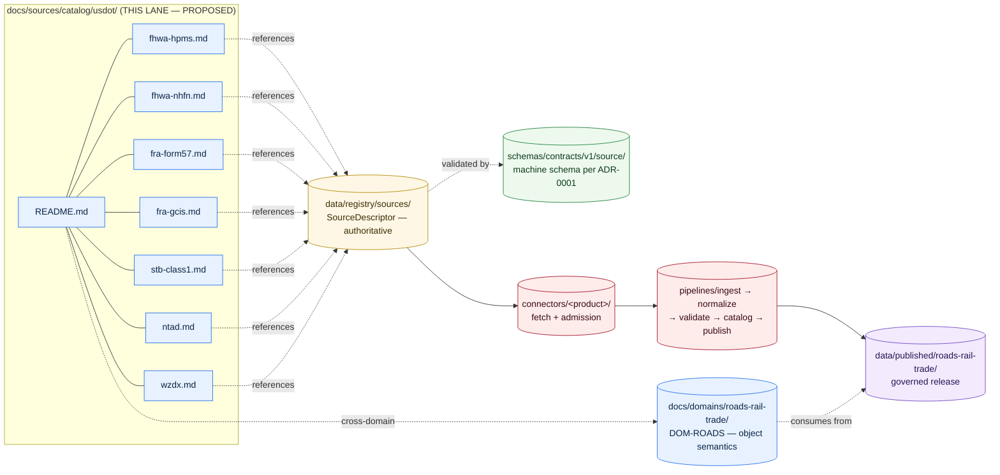

<!-- [KFM_META_BLOCK_V2]
doc_id: kfm://doc/docs-sources-catalog-usdot-readme
title: USDOT source family
type: readme
version: v0.2
status: draft
owners: <PLACEHOLDER — Docs steward + Source steward for usdot>
created: 2026-05-21
updated: 2026-05-23
policy_label: public
related:
  - docs/sources/catalog/README.md
  - docs/sources/catalog/OPEN-QUESTIONS.md
  - docs/sources/catalog/PROFILES.md
  - docs/sources/catalog/IDENTITY.md
  - docs/sources/catalog/RIGHTS-AND-SENSITIVITY-MAP.md
  - docs/sources/catalog/_template/SOURCE_PRODUCT_TEMPLATE.md
  - docs/doctrine/directory-rules.md
  - docs/domains/roads-rail-trade/
  - data/registry/sources/
  - schemas/contracts/v1/source/
  - connectors/
  - pipelines/
tags: [kfm, docs, sources, catalog, usdot, transportation, roads-rail-trade]
notes:
  - "Family scaffolded from the connectors/ inventory; descriptions grounded in docs/domains SOURCE_REGISTRY entries and Pass-10 C10-04 / C10-05."
  - "PROPOSED — beyond directory-rules.md §7.3 nine-family example list; awaits ADR ratification — see OPEN-DSC-14."
  - "All repo paths PROPOSED until verified against a mounted repository."
  - "STB administrative-housing relationship to USDOT is NEEDS VERIFICATION — see §6.3 below."
[/KFM_META_BLOCK_V2] -->

<a id="top"></a>

# `usdot` source family

> Source-oriented catalog documentation for the **USDOT** source family — federal transportation datasets feeding the **roads-rail-trade** domain.


**Status:** draft — **PROPOSED** (beyond `directory-rules.md` §7.3 nine-family example list) · **Owners:** `<PLACEHOLDER — Docs steward + Source steward for usdot>` · **Last reviewed:** 2026-05-23

> [!IMPORTANT]
> **This family is not in the `directory-rules.md` §7.3 example list of nine connector families** (`usgs`, `fema`, `noaa`, `nrcs`, `kansas`, `gbif`, `inaturalist`, `census`, `local_upload`). It was scaffolded because a `connectors/` companion inventory exists. Promotion to a §7.3-listed family is **ADR-class** per Directory Rules §2.4 and is tracked as **OPEN-DSC-14** in [`OPEN-QUESTIONS.md`](../OPEN-QUESTIONS.md). Until ratified, treat this folder as a **PROPOSED docs-only lane** that does not establish a new connector-root authority.

---

## Contents

- [1. Overview](#1-overview)
- [2. Repo fit](#2-repo-fit)
- [3. What belongs here · what does not](#3-what-belongs-here--what-does-not)
- [4. Directory layout](#4-directory-layout)
- [5. Family map](#5-family-map)
- [6. Product pages](#6-product-pages)
- [7. Source authority, identity, profiles](#7-source-authority-identity-profiles)
- [8. Rights and sensitivity](#8-rights-and-sensitivity)
- [9. Lifecycle position](#9-lifecycle-position)
- [10. Validation](#10-validation)
- [11. Related contracts, connectors, pipelines](#11-related-contracts-connectors-pipelines)
- [12. Open questions](#12-open-questions)
- [13. Related docs](#13-related-docs)
- [Appendix A — Product capsule summaries](#appendix-a--product-capsule-summaries)

---

## 1. Overview

The **USDOT source family** groups federal transportation datasets that feed the **`roads-rail-trade`** domain lane (see `[DOM-ROADS]` in the KFM Domains Atlas). The named publishers cover federally-administered highway, freight, and rail products, plus federally-sponsored standards that state DOTs implement:

| Publisher | Role within USDOT *(NEEDS VERIFICATION per product page)* | Products listed here |
|---|---|---|
| **FHWA** — Federal Highway Administration | Operating administration of USDOT | `fhwa-hpms`, `fhwa-nhfn` |
| **FRA** — Federal Railroad Administration | Operating administration of USDOT | `fra-form57`, `fra-gcis` |
| **BTS** — Bureau of Transportation Statistics | Statistical agency within USDOT; publishes NTAD | `ntad` |
| **STB** — Surface Transportation Board | **NEEDS VERIFICATION** — administratively housed within USDOT; *operationally independent* per its 1995 reauthorization. Inclusion in a "USDOT family" is a doctrine convenience, not an organizational fact. | `stb-class1` |
| **WZDx working group** | Federally-supported open standard (FHWA-sponsored); feeds are typically operated by **state DOTs** (e.g., KDOT KanDrive) | `wzdx` |

> [!NOTE]
> Two grouping decisions are intentional and surface tradeoffs:
>
> - **STB** is included here as a doctrine convenience but is *not* an operating administration of USDOT. If the ADR for OPEN-DSC-14 splits the family, STB should be considered for a separate `stb/` family or a `federal-transportation-independent/` lane.
> - **WZDx** is a *standard*, not a publisher. The wzdx.md product page documents how the family relates to that standard; the feed itself is normally a Kansas/KDOT product and may also be referenced from a `kansas/` family page.

[↑ Back to top](#top)

---

## 2. Repo fit

| Slot | Path | Status |
|---|---|---|
| **This README** | `docs/sources/catalog/usdot/README.md` | **PROPOSED** location (folder beyond §7.3 §7.3 example list) |
| **Lane parent (catalog landing)** | `docs/sources/catalog/README.md` | **PROPOSED** — see [`OPEN-QUESTIONS.md`](../OPEN-QUESTIONS.md) `OPEN-DSC-14` |
| **Product page template** | `docs/sources/catalog/_template/SOURCE_PRODUCT_TEMPLATE.md` | **PROPOSED** — referenced by every product page in §6 |
| **Authoritative source descriptors (machine)** | `data/registry/sources/` | **PROPOSED** per `directory-rules.md` §6.5 / §9.1; not duplicated here |
| **Machine schemas** | `schemas/contracts/v1/source/` *(per ADR-0001)* | **PROPOSED** schema home |
| **Connector code** | `connectors/<product>/` | **PROPOSED**; per-product folders enumerated in §11 |
| **Pipelines (ingest → catalog → publish)** | `pipelines/ingest/`, `pipelines/normalize/`, `pipelines/validate/`, `pipelines/catalog/`, `pipelines/publish/` | **PROPOSED** per `directory-rules.md` §7.4 |
| **Owning domain** | `docs/domains/roads-rail-trade/` *(`[DOM-ROADS]`)* | **PROPOSED** — domain owns object semantics; this family owns source-side documentation |

[↑ Back to top](#top)

---

## 3. What belongs here · what does not

> [!TIP]
> **Anchor:** this lane is *source-oriented documentation only*. Authority lives elsewhere; this folder *explains and links*.

**What belongs here**

- One product page per USDOT-grouped dataset, conforming to `_template/SOURCE_PRODUCT_TEMPLATE.md`.
- Family-level descriptions, scope, and tradeoffs (this README).
- Cross-references to authoritative homes: `data/registry/sources/`, `schemas/contracts/v1/source/`, `policy/sensitivity/`, `connectors/`, `pipelines/`.
- Open-question entries that name unresolved governance choices and link to the lane-wide [`OPEN-QUESTIONS.md`](../OPEN-QUESTIONS.md).

**What does not belong here**

- ❌ Authoritative `SourceDescriptor` content — lives in `data/registry/sources/`.
- ❌ JSON Schema for source descriptors — lives in `schemas/contracts/v1/source/` per ADR-0001.
- ❌ Sensitivity / rights policy — restated only in `policy/sensitivity/` and never duplicated.
- ❌ Connector implementation, fetch code, or admission logic — belongs in `connectors/<product>/` per `directory-rules.md` §7.3.
- ❌ Pipeline code, validators, or transformers — belongs in `pipelines/` and `tools/validators/` per §7.4 / §7.5.
- ❌ Catalog records (STAC / DCAT / PROV entries) — emitted into `data/catalog/` by pipelines, not authored here.
- ❌ Released artifacts, PMTiles, GeoParquet — belong in the `data/published/` lane after promotion.
- ❌ Release manifests, rollback cards, or promotion decisions — belong in `release/` per §9.2.

[↑ Back to top](#top)

---

## 4. Directory layout

> [!NOTE]
> The tree below is **PROPOSED** and reflects the seven product pages currently scaffolded under this family. Path presence on disk is **NEEDS VERIFICATION** until a mounted-repo inspection confirms it.

```text
docs/sources/catalog/usdot/
├── README.md                       # this file
├── fhwa-hpms.md                    # FHWA Highway Performance Monitoring System
├── fhwa-nhfn.md                    # FHWA National Highway Freight Network
├── fra-form57.md                   # FRA Form 57 Rail Incident Reports
├── fra-gcis.md                     # FRA Grade Crossing Inventory System
├── stb-class1.md                   # STB Class I Weekly Reports
├── ntad.md                         # National Transportation Atlas Database (BTS)
└── wzdx.md                         # Work Zone Data Exchange (FHWA-sponsored standard)
```

[↑ Back to top](#top)

---

## 5. Family map

The diagram below shows how this docs lane sits between **doctrine** (left) and the **lifecycle of the source it documents** (right). The family does *not* own data or schemas — it documents the source authority and points at the canonical homes.



> [!CAUTION]
> The arrows above describe **doctrine intent** (RAW → WORK / QUARANTINE → PROCESSED → CATALOG / TRIPLET → PUBLISHED). They are **not** evidence of working pipelines. Implementation maturity is **UNKNOWN** in this docs-only context.

[↑ Back to top](#top)

---

## 6. Product pages

Each product page conforms to [`_template/SOURCE_PRODUCT_TEMPLATE.md`](../_template/SOURCE_PRODUCT_TEMPLATE.md) and links downstream to the canonical SourceDescriptor in `data/registry/sources/`. The **Status** column reflects the corpus's [DOM-ROADS] source-family register.

| Page | Product | Publisher | Corpus status | Cadence *(NEEDS VERIFICATION)* |
|---|---|---|---|---|
| [`fhwa-hpms.md`](./fhwa-hpms.md) | FHWA Highway Performance Monitoring System | FHWA | **CONFIRMED** family member; rights NEEDS VERIFICATION | Annual reporting (state submission) |
| [`fhwa-nhfn.md`](./fhwa-nhfn.md) | FHWA National Highway Freight Network | FHWA | **CONFIRMED** family member; rights NEEDS VERIFICATION | Periodic federal designation update |
| [`fra-form57.md`](./fra-form57.md) | FRA Form 57 Rail Incident Reports | FRA | **CONFIRMED** family member *(Pass-10 C10-05)*; rights NEEDS VERIFICATION | Per-incident |
| [`fra-gcis.md`](./fra-gcis.md) | FRA Grade Crossing Inventory System | FRA | **CONFIRMED** family member *(Pass-10 C10-05)*; rights NEEDS VERIFICATION | Continuous updates |
| [`stb-class1.md`](./stb-class1.md) | STB Class I Weekly Reports | STB *(see §6.3 nuance)* | **CONFIRMED** family member *(Pass-10 C10-05)*; overlapping snapshot-weeks require de-duplication | Weekly |
| [`ntad.md`](./ntad.md) | National Transportation Atlas Database | BTS | **CONFIRMED** family member *(Pass-10 C10-05; HIFLD/NTAD pair)*; rights NEEDS VERIFICATION | Annual |
| [`wzdx.md`](./wzdx.md) | Work Zone Data Exchange | FHWA-sponsored standard; feed by state DOT | **CONFIRMED** as a standard *(Pass-10 C10-04; KFM-P8-PROG-0025)*; **WZDx v4 validator and transformer** required; version drift expected | Near-real-time |

> [!WARNING]
> Per `KFM-P8-PROG-0025` (atlas card), the **WZDx v4.x feed handler is a fail-closed schema gate**: the validator MUST NOT silently accept a malformed feed, and the transformer MUST keep downstream contracts stable across upstream version drift. Per `Pass-10 C10-05`, **STB Class I reports are weekly snapshots that overlap**; receipts MUST capture the snapshot-week precisely so downstream joins do not double-count.

[↑ Back to top](#top)

---

## 7. Source authority, identity, profiles

### 7.1 Source authority

Authoritative `SourceDescriptor` records live in [`data/registry/sources/`](../../../../data/registry/sources/). The docs lane **does not** duplicate descriptor fields. Each product page links to its descriptor by `source_id` (or marks **NEEDS VERIFICATION** until admitted).

> [!NOTE]
> Per `KFM-P1-PROG-0007`, every admitted source carries a descriptor recording **identity, role, rights posture, update cadence, authority scope, and verification obligations**. Descriptors are validated before fetch, before transformation, and before publication so source authority does not collapse into generic data availability.

### 7.2 Catalog profiles

Each product page declares which catalog profiles apply. The defaults below are **PROPOSED** until per-product confirmation:

| Profile | Typical applicability for this family | Reference |
|---|---|---|
| **STAC 1.1** with `kfm:provenance` extension | Most products (HPMS, NHFN, NTAD, GCIS) — spatiotemporal feature collections | Pass-10 C4-01; KFM-P31-PROG-0004 |
| **DCAT** distribution | Tabular reports (STB Class I, FRA Form 57) and dataset-level metadata | Pass-10 C4-05 |
| **PROV-O** | Lineage from upstream releases through KFM transforms | Pass-10 C8-03 |
| **Domain projection** in `data/catalog/domain/roads-rail-trade/` | Domain-shaped views for [DOM-ROADS] consumers | `directory-rules.md` §9.1 |

See [`PROFILES.md`](../PROFILES.md) for the lane-wide profile policy.

### 7.3 Identity & namespaces

Collection-id and namespace conventions follow [`IDENTITY.md`](../IDENTITY.md).

> [!IMPORTANT]
> The KFM namespace pin (**`kfm:`** vs. **`ks-kfm:`**) is **UNKNOWN** until ADR. Per Pass-10 §8.3 the corpus flags this explicitly: *"Should the namespace be `kfm:` (short, KFM-global) or `ks-kfm:` (Kansas-scoped)?"* Tracked as `OPEN-DSC-03` in [`OPEN-QUESTIONS.md`](../OPEN-QUESTIONS.md). Product pages SHOULD use **`<NS>:`** as a placeholder and SHOULD NOT pick a side.

[↑ Back to top](#top)

---

## 8. Rights and sensitivity

> [!CAUTION]
> Per `[DOM-ROADS]` of the Domains Atlas: **"Critical transport facilities require review"** and **"Indigenous trade and mobility corridors, oral history, treaty, cultural, and interpretive evidence default to steward review and generalized public geometry."** Rights and sensitivity for this family are **NEEDS VERIFICATION per product**.

| Product | Rights posture *(NEEDS VERIFICATION)* | Sensitivity considerations |
|---|---|---|
| `fhwa-hpms` | U.S. federal data, generally open | Sample-segment locations can be sensitive when joined to private-facility data |
| `fhwa-nhfn` | U.S. federal data, generally open | Freight corridor designations may flag critical-infrastructure dependencies |
| `fra-form57` | Federal report; redaction conventions exist | **Person/operator detail may be present**; rights-holder review NEEDS VERIFICATION |
| `fra-gcis` | Federal inventory, generally open | Crossing safety details; precision warrants review for public-vs-internal split |
| `stb-class1` | Aggregated Class-I metrics, generally open | Aggregation-receipt discipline required; minimum-cell suppression for sensitive joins |
| `ntad` | Public-domain federal GIS | Critical-infrastructure subsets may require generalization |
| `wzdx` | Per-feed publisher (typically state DOT) license | Live operational data; staleness/expiry rules apply |

Never restate policy here. Authoritative policy lives in [`policy/sensitivity/`](../../../../policy/sensitivity/) and [`policy/rights/`](../../../../policy/rights/). See [`RIGHTS-AND-SENSITIVITY-MAP.md`](../RIGHTS-AND-SENSITIVITY-MAP.md) for the lane-wide rights/sensitivity map.

[↑ Back to top](#top)

---

## 9. Lifecycle position

Per `directory-rules.md` §9.1 and `KFM-P1-IDEA-0006`, this family's products move through the canonical lifecycle:

```text
RAW  →  WORK / QUARANTINE  →  PROCESSED  →  CATALOG / TRIPLET  →  PUBLISHED
```

This docs lane explains the source side of `RAW`. The other stages are governed by the responsibility roots below.

| Stage | Owning root | This family's contribution |
|---|---|---|
| **(admission)** | `data/registry/sources/` | Authoritative `SourceDescriptor` per product *(linked from product page)* |
| **RAW** | `data/raw/roads-rail-trade/<source_id>/<run_id>/` | Connector output per `directory-rules.md` §7.3 |
| **WORK / QUARANTINE** | `data/work/`, `data/quarantine/` | Normalization + admission failures (fail-closed) |
| **PROCESSED** | `data/processed/roads-rail-trade/` | Validated normalized objects per [DOM-ROADS] contracts |
| **CATALOG / TRIPLET** | `data/catalog/`, `data/triplets/` | STAC/DCAT/PROV records + EvidenceBundle refs |
| **PUBLISHED** | `data/published/roads-rail-trade/` | Governed release after promotion + ReleaseManifest |

> [!IMPORTANT]
> Promotion is a **governed state transition**, not a file move. Per the operating-law invariant: **default-deny promotion**, **EvidenceBundle support required**, **public clients use governed APIs only**.

[↑ Back to top](#top)

---

## 10. Validation

Validation activities this family expects (all **PROPOSED** until workflows are wired):

| Validation | Owner | Status |
|---|---|---|
| Markdown lint (heading order, code-fence languages, link integrity) | Docs steward | **NEEDS VERIFICATION** — workflow not yet wired |
| Repo-relative link integrity for every `./*.md` and `../**/*` target | Docs steward | **NEEDS VERIFICATION** |
| Per-product page conformance to [`_template/SOURCE_PRODUCT_TEMPLATE.md`](../_template/SOURCE_PRODUCT_TEMPLATE.md) | Docs steward | **PROPOSED** template lint |
| KFM Meta Block v2 presence + valid placeholder set | Docs steward | **PROPOSED** |
| `source_id` cross-check against `data/registry/sources/` | Source steward | **PROPOSED** |
| WZDx v4.x schema-gate test fixtures *(valid + invalid)* | Pipeline owner | **PROPOSED** per `KFM-P8-PROG-0025` |
| STB snapshot-week de-duplication test | Pipeline owner | **PROPOSED** per Pass-10 C10-05 |

Per the **negative-state rule** (from `tools/README.md`): validators MUST exercise DENY / ABSTAIN / ERROR paths, not only success paths.

[↑ Back to top](#top)

---

## 11. Related contracts, connectors, pipelines

### 11.1 Contracts & schemas

- [`schemas/contracts/v1/source/`](../../../../schemas/contracts/v1/source/) — machine schema home per **ADR-0001** *(PROPOSED canonical schema home)*.
- [`contracts/source/`](../../../../contracts/source/) — semantic Markdown contracts for source-side object families.

### 11.2 Connector folders

> [!NOTE]
> Per `directory-rules.md` §7.3, connector folders MUST emit to `data/raw/<domain>/<source_id>/<run_id>/` or `data/quarantine/...` and MUST NOT publish, mutate canonical truth, or write under `data/processed/`, `data/catalog/`, or `data/published/`.

| Connector folder | Product | Status |
|---|---|---|
| `connectors/fhwa_hpms/` | FHWA HPMS | **PROPOSED** (currently an empty stub per inventory) |
| `connectors/fhwa_nhfn/` | FHWA NHFN | **PROPOSED** (currently an empty stub per inventory) |
| `connectors/fra_form57/` | FRA Form 57 | **PROPOSED** (currently an empty stub per inventory) |
| `connectors/fra_gcis/` | FRA GCIS | **PROPOSED** (currently an empty stub per inventory) |
| `connectors/stb_class1/` | STB Class I | **PROPOSED** (currently an empty stub per inventory) |
| `connectors/ntad/` | NTAD | **PROPOSED** (currently an empty stub per inventory) |
| `connectors/wzdx/` | WZDx | **PROPOSED** (currently an empty stub per inventory) |

### 11.3 Pipelines

- [`pipelines/ingest/`](../../../../pipelines/ingest/)
- [`pipelines/normalize/`](../../../../pipelines/normalize/)
- [`pipelines/validate/`](../../../../pipelines/validate/)
- [`pipelines/catalog/`](../../../../pipelines/catalog/)
- [`pipelines/publish/`](../../../../pipelines/publish/)

Watcher and material-change discipline: per `KFM-P32-FEAT-0016` and `KFM-P8-PROG-0025`, watchers MUST distinguish stable source availability from material schema/content changes that require a candidate work record.

[↑ Back to top](#top)

---

## 12. Open questions

| ID | Question | Class |
|---|---|---|
| **`OPEN-DSC-14`** | Should the USDOT family be promoted to a §7.3-listed family (or merged into a wider `federal-transportation/` family that splits off STB), or remain a docs-only convenience grouping? | **ADR-class** per `directory-rules.md` §2.4 |
| **`OPEN-DSC-03`** | Namespace pin: **`kfm:`** vs. **`ks-kfm:`** for catalog properties referenced by this family? | **ADR-class** |
| `OPEN-DSC-FAM-STB` *(PROPOSED tag)* | Is grouping STB under "USDOT" appropriate given STB's independent-agency status, or should STB get its own family? | Lane decision; documented here |
| `OPEN-DSC-FAM-WZDX` *(PROPOSED tag)* | Should `wzdx.md` live under `usdot/` (standard origin) or under `kansas/` (feed origin), or be cross-listed? | Lane decision; documented here |
| Per-product endpoints, cadence, rights | Confirm per product page against current source documentation | **NEEDS VERIFICATION** |

See [`OPEN-QUESTIONS.md`](../OPEN-QUESTIONS.md) for the full lane-wide `OPEN-DSC-*` register.

[↑ Back to top](#top)

---

## 13. Related docs

- [`../README.md`](../README.md) — `docs/sources/catalog/` landing
- [`../OPEN-QUESTIONS.md`](../OPEN-QUESTIONS.md) — lane-wide open questions
- [`../PROFILES.md`](../PROFILES.md) — catalog-profile policy (STAC / DCAT / PROV / domain)
- [`../IDENTITY.md`](../IDENTITY.md) — collection-id and namespace conventions
- [`../RIGHTS-AND-SENSITIVITY-MAP.md`](../RIGHTS-AND-SENSITIVITY-MAP.md) — lane-wide rights/sensitivity map
- [`../_template/SOURCE_PRODUCT_TEMPLATE.md`](../_template/SOURCE_PRODUCT_TEMPLATE.md) — product page template
- [`../../../doctrine/directory-rules.md`](../../../doctrine/directory-rules.md) — placement authority
- [`../../../domains/roads-rail-trade/`](../../../domains/roads-rail-trade/) — owning domain *(`[DOM-ROADS]`)*
- [`../../../../data/registry/sources/`](../../../../data/registry/sources/) — authoritative SourceDescriptor home
- [`../../../../schemas/contracts/v1/source/`](../../../../schemas/contracts/v1/source/) — machine schema home *(ADR-0001)*

---

## Appendix A — Product capsule summaries

These capsules paraphrase the corpus *(Pass-10 C10-04, C10-05; [DOM-ROADS] source-family register)*. They are **not** a substitute for the product page — they exist to orient a reader who lands on this README first.

<details>
<summary><strong>FHWA HPMS</strong> — Highway Performance Monitoring System</summary>

National statistical sample of highway condition and performance attributes, submitted by state DOTs to FHWA on an annual cadence. Sample-segment geometry can be sensitive when joined to private-facility data; rights posture is generally open but **NEEDS VERIFICATION** per the current source terms. Pass-10 [DOM-ROADS].
</details>

<details>
<summary><strong>FHWA NHFN</strong> — National Highway Freight Network</summary>

Federally-designated network of freight corridors, including Primary Highway Freight System routes and Critical Urban/Rural Freight Corridors. Updates are periodic (federal designation). Useful as a freight-corridor context layer in [DOM-ROADS]. Pass-10 [DOM-ROADS].
</details>

<details>
<summary><strong>FRA Form 57</strong> — Rail Incident Reports</summary>

Standardized rail incident report submitted by carriers to FRA. Per Pass-10 C10-05, ingest requires a Form 57 schema parser; person/operator detail may be present and rights-holder review for redaction is **NEEDS VERIFICATION**. Joins to GCIS provide a unified rail-incident view.
</details>

<details>
<summary><strong>FRA GCIS</strong> — Grade Crossing Inventory System</summary>

Canonical inventory of public and private highway-rail grade crossings with safety attributes per crossing. Per Pass-10 C10-05, GCIS is the anchoring inventory for cross-domain joins to Form 57 and STB; an open question (Pass-10 C10-05) asks the right policy when GCIS coordinates disagree with HIFLD/NTAD geometry for the same crossing.
</details>

<details>
<summary><strong>STB Class I Weekly Reports</strong></summary>

Weekly operational metrics for the seven Class I carriers, published by the Surface Transportation Board. Per Pass-10 C10-05, **STB reports are weekly snapshots that overlap**; the receipt MUST capture the snapshot-week precisely so downstream joins do not double-count. **STB-USDOT relationship note:** STB became operationally independent in 1995–96; its administrative housing within USDOT is **NEEDS VERIFICATION** for this README's grouping decision (see `OPEN-DSC-FAM-STB`).
</details>

<details>
<summary><strong>NTAD</strong> — National Transportation Atlas Database</summary>

BTS-published geospatial layers for transportation infrastructure — roads, rail lines, yards, structures, ports, airports. Per Pass-10 C10-05, NTAD pairs with HIFLD as the geospatial substrate for rail infrastructure. Annual cadence; public-domain federal GIS; critical-infrastructure subsets may require generalization.
</details>

<details>
<summary><strong>WZDx</strong> — Work Zone Data Exchange</summary>

Federally-supported open standard (FHWA-sponsored) for work-zone data interchange. Per Pass-10 C10-04 and `KFM-P8-PROG-0025`, WZDx feeds are validated and transformed by a fail-closed schema-gate pipeline; WZDx v4 is a moving target and the validator must not silently accept malformed feeds. The Kansas feed itself is normally a KDOT product (KanDrive); placement here documents the standard origin, with potential cross-listing under `kansas/`.
</details>

---

<sub>Last reviewed: **2026-05-23** *(Claude session — README revised to full presentation standard; family scaffolded from connector inventory; descriptions grounded in Pass-10 C10-04 / C10-05 and the [DOM-ROADS] source-family register; STB-USDOT nuance surfaced).* · Version: **v0.2** · Authority: **PROPOSED** (beyond `directory-rules.md` §7.3) · See `OPEN-DSC-14`.</sub>

[↑ Back to top](#top)
