<!-- [KFM_META_BLOCK_V2]
doc_id: kfm://doc/docs-sources-catalog-usdot-fhwa-hpms
title: FHWA Highway Performance Monitoring System
type: product-page
version: v0.2
status: draft
owners: <PLACEHOLDER — Docs steward + Source steward for usdot>
created: 2026-05-21
updated: 2026-05-23
policy_label: public
related:
  - docs/sources/catalog/usdot/README.md
  - docs/sources/catalog/README.md
  - docs/sources/catalog/OPEN-QUESTIONS.md
  - docs/sources/catalog/PROFILES.md
  - docs/sources/catalog/IDENTITY.md
  - docs/sources/catalog/RIGHTS-AND-SENSITIVITY-MAP.md
  - docs/sources/catalog/_template/SOURCE_PRODUCT_TEMPLATE.md
  - docs/sources/catalog/_examples/stac-item-example.json
  - docs/doctrine/directory-rules.md
  - docs/domains/roads-rail-trade/
  - data/registry/sources/
  - schemas/contracts/v1/source/
  - connectors/fhwa_hpms/
  - pipelines/
  - policy/sensitivity/
  - policy/rights/
tags: [kfm, docs, sources, catalog, usdot, fhwa, hpms, roads-rail-trade]
source_id_hint: fhwa_hpms
upstream_publisher: FHWA — Federal Highway Administration (a USDOT operating administration)
notes:
  - "PROPOSED product-page scaffold raised to full presentation standard; KFM treatment grounded in [DOM-ROADS] source-family register, Pass-10 C4-01 STAC kfm:provenance, KFM-P1-PROG-0007 SourceDescriptor doctrine."
  - "Generic description of the upstream HPMS dataset is at standard-knowledge rank; current endpoint URL, exact cadence, and current schema version are NEEDS VERIFICATION."
  - "Namespace pin (kfm: vs ks-kfm:) UNKNOWN — examples use <NS>: placeholder; see OPEN-DSC-03."
  - "All repo paths PROPOSED until verified against a mounted repository."
[/KFM_META_BLOCK_V2] -->

<a id="top"></a>

# FHWA Highway Performance Monitoring System

> Annual federal road-network reporting system administered by FHWA (a USDOT operating administration), feeding the **`roads-rail-trade`** domain lane.


**Status:** PROPOSED — scaffold raised to full presentation standard · **Family:** [`usdot`](./README.md) · **Owners:** `<PLACEHOLDER — Docs steward + Source steward for usdot>` · **Last reviewed:** 2026-05-23

> [!IMPORTANT]
> This page documents the **source side** of FHWA HPMS as it enters the KFM lifecycle. The authoritative `SourceDescriptor` lives in [`data/registry/sources/`](../../../../data/registry/sources/); **this page MUST NOT duplicate descriptor fields**. The lane in which this product participates (`usdot/`) is **PROPOSED beyond `directory-rules.md` §7.3** and is tracked as `OPEN-DSC-14`.

---

## Contents

- [1. Overview](#1-overview)
- [2. Lifecycle map](#2-lifecycle-map)
- [3. Source authority](#3-source-authority)
- [4. Catalog profiles](#4-catalog-profiles)
- [5. Collection identity](#5-collection-identity)
- [6. Provenance fields](#6-provenance-fields)
- [7. Temporal handling](#7-temporal-handling)
- [8. Geometry and projection](#8-geometry-and-projection)
- [9. Rights and sensitivity](#9-rights-and-sensitivity)
- [10. Validation and catalog closure](#10-validation-and-catalog-closure)
- [11. Related contracts, connectors, pipelines](#11-related-contracts-connectors-pipelines)
- [12. Cross-domain consumers](#12-cross-domain-consumers)
- [13. Examples](#13-examples)
- [14. Open questions](#14-open-questions)
- [15. Related docs](#15-related-docs)

---

## 1. Overview

> [!NOTE]
> **External-knowledge framing.** The generic description of what HPMS is (a federal road-network reporting system) is treated as stable standards knowledge. The **current** endpoint URL, exact cadence, schema version, and rights text are **version-sensitive** and are **NEEDS VERIFICATION per the descriptor in `data/registry/sources/`**.

The **Highway Performance Monitoring System (HPMS)** is a national-level highway information program administered by the U.S. Federal Highway Administration. State DOTs submit road-network data (extent, functional classification, condition, performance, use, and operating characteristics) to FHWA on an annual reporting cycle. The product is used for federal apportionment, condition reporting, and federal-aid policy analysis.

Within KFM, HPMS appears in the **`[DOM-ROADS]` source-family register** *(CONFIRMED at doctrine rank in Domains Atlas v1.1)* with the source-role posture: **authority / observation / context / model — as source role requires**; **rights and current terms NEEDS VERIFICATION; sensitive joins fail closed**; freshness is **source-vintage or cadence specific**.

| Attribute | Value | Status |
|---|---|---|
| **Upstream publisher** | FHWA (USDOT operating administration) | CONFIRMED at general-knowledge rank |
| **Source family** | [`usdot`](./README.md) | **PROPOSED** family — beyond `directory-rules.md` §7.3; see `OPEN-DSC-14` |
| **Owning KFM domain** | [`docs/domains/roads-rail-trade/`](../../../domains/roads-rail-trade/) — *`[DOM-ROADS]`* | CONFIRMED doctrine |
| **Source role posture** | authority / observation / context / model — as source role requires | CONFIRMED from `[DOM-ROADS]` register |
| **Geographic coverage** | U.S. nationwide; Kansas is the KFM-relevant slice | NEEDS VERIFICATION per descriptor |
| **Cadence** | Annual reporting cycle *(upstream)* | NEEDS VERIFICATION — confirm exact submission/release dates against current FHWA documentation |
| **Endpoint / access form** | UNKNOWN — confirm via the `SourceDescriptor` | NEEDS VERIFICATION |
| **Rights / license** | Federal U.S. data, generally open | NEEDS VERIFICATION per current terms |
| **Sensitivity flag** | Sample-segment locations can be sensitive when joined to private-facility data | PROPOSED per `[DOM-ROADS]` "sensitive joins fail closed" rule |
| **KFM `source_id` hint** | `fhwa_hpms` *(snake_case, matches `connectors/fhwa_hpms/`)* | **PROPOSED** identifier |

[↑ Back to top](#top)

---

## 2. Lifecycle map

> [!CAUTION]
> The diagram below describes **doctrine intent** (RAW → WORK / QUARANTINE → PROCESSED → CATALOG / TRIPLET → PUBLISHED, per `directory-rules.md` §9.1 and `KFM-P1-IDEA-0006`). It is **not** evidence of a working pipeline. Implementation maturity is **UNKNOWN** in this docs-only context.

```mermaid
flowchart LR
  classDef upstream fill:#eef9ee,stroke:#1a7f37,color:#0a3a17;
  classDef docs     fill:#e7f1ff,stroke:#1f6feb,color:#0b2545;
  classDef raw      fill:#fff7e6,stroke:#b08800,color:#3a2c00;
  classDef work     fill:#fdecea,stroke:#a40e26,color:#3a0a14;
  classDef catalog  fill:#f3eafe,stroke:#6f42c1,color:#2a1352;
  classDef publish  fill:#e6f7ff,stroke:#0969da,color:#0a2540;

  STATES["State DOTs<br/>annual submission"]:::upstream
  FHWA["FHWA HPMS<br/>federal release"]:::upstream

  THIS["docs/sources/catalog/usdot/fhwa-hpms.md<br/>(THIS PAGE — source-side documentation)"]:::docs
  DESC["data/registry/sources/fhwa_hpms<br/>SourceDescriptor — authoritative"]:::docs

  CONN["connectors/fhwa_hpms/<br/>fetch + admission"]:::raw
  RAW["data/raw/roads-rail-trade/fhwa_hpms/&lt;run_id&gt;/<br/>immutable payload"]:::raw

  WORK["data/work/ + data/quarantine/<br/>normalize · validate · gate"]:::work
  PROC["data/processed/roads-rail-trade/<br/>Road Segment · RouteMembership · TransportFacility"]:::work

  CAT["data/catalog/{stac,dcat,prov,domain}/<br/>STAC + DCAT + PROV-O entries · EvidenceBundle ref"]:::catalog

  PUB["data/published/roads-rail-trade/<br/>governed release · ReleaseManifest"]:::publish

  STATES --> FHWA
  FHWA   --> CONN
  THIS  -. cross-link .-> DESC
  DESC  -. validates .-> CONN
  CONN  --> RAW --> WORK --> PROC --> CAT --> PUB
```



[↑ Back to top](#top)

---

## 3. Source authority

Authoritative source identity lives in the registry; the docs lane only points at it.

> [!NOTE]
> Per `KFM-P1-PROG-0007`, every admitted source carries a `SourceDescriptor` recording **identity, role, rights posture, update cadence, authority scope, and verification obligations**. Descriptors are validated **before fetch, before transformation, and before publication** so source authority does not collapse into generic data availability.

- **Authoritative descriptor:** [`data/registry/sources/`](../../../../data/registry/sources/) *(file presence NEEDS VERIFICATION)*.
- **Machine schema:** [`schemas/contracts/v1/source/`](../../../../schemas/contracts/v1/source/) per **ADR-0001** *(PROPOSED canonical schema home)*.
- **Source-role enum** (per `ADR-S-04` PROPOSED vocabulary): `observed | regulatory | modeled | aggregate | administrative | candidate | synthetic`. HPMS is expected to register primarily as **`observed`** (state-submitted observations) with **`aggregate`** rollups available for some attributes — **PROPOSED**; confirm at admission.

> [!WARNING]
> **Anti-collapse rule.** Source role is **fixed at admission**; promotion never upgrades a role (e.g., `aggregate` → `observed`). If a downstream consumer needs a different role, a *new* descriptor + `CorrectionNotice` are required. Treating administratively-compiled HPMS rollups as if they were direct observed measurements is a source-role-collapse risk and a denied promotion path per the operating-law invariants.

[↑ Back to top](#top)

---

## 4. Catalog profiles

Per the family lane policy (see [`PROFILES.md`](../PROFILES.md)) and Pass-10 C4-01 / C4-02 / C4-05 / C8-03:

| Profile | Lane | Used by this product? | Notes |
|---|---|---|---|
| **STAC 1.1** with `<NS>:provenance` extension | `data/catalog/stac/` | **PROPOSED — Yes** | Spatial features (segment geometry, sample segments) fit STAC Items. See `KFM-P31-PROG-0004` for KFM-STAC profile contract. |
| **DCAT distribution** | `data/catalog/dcat/` | **PROPOSED — Yes** (dataset-level) | DCAT covers the dataset-as-a-whole; STAC covers the per-Item shape. |
| **PROV-O** | `data/catalog/prov/` | **PROPOSED — Yes** | Lineage from FHWA release → connector run → KFM transforms. Required for catalog closure per `KFM-P26-PROG-0025`. |
| **Domain projection** | `data/catalog/domain/roads-rail-trade/` | **PROPOSED — Yes** | `[DOM-ROADS]`-shaped view for domain consumers; per `directory-rules.md` §9.1. |
| **STAC × Darwin Core Hybrid** *(Pass-10 C4-03)* | — | **No** | Biodiversity-only; not applicable to HPMS. |

> [!IMPORTANT]
> **Catalog closure required before public release** *(per `KFM-P1-IDEA-0020` and `KFM-P26-FEAT-0004`)*. A "Catalog closure status page" surfaces DCAT / STAC / PROV closure state, missing fields, receipts, and proof-pack readiness for each promoted bundle. HPMS releases MUST pass closure before promotion to `data/published/`.

[↑ Back to top](#top)

---

## 5. Collection identity

> [!NOTE]
> The namespace pin (**`kfm:`** vs. **`ks-kfm:`**) is **UNKNOWN** until ADR. This page uses **`<NS>:`** as a placeholder. Tracked as `OPEN-DSC-03` in [`OPEN-QUESTIONS.md`](../OPEN-QUESTIONS.md). Per Pass-10 §8.3, the corpus flags this explicitly.

- **Collection id pattern:** `kfm-<org>-<product>` per [`IDENTITY.md`](../IDENTITY.md) — **PROPOSED** instantiation: `kfm-fhwa-hpms` *(stable; renames break links throughout the catalog per Pass-10 C4-02)*.
- **Namespace prefix:** `<NS>:` — placeholder pending `OPEN-DSC-03`.
- **Provenance namespace:** `<NS>:provenance` *(Pass-10 C4-01)* applied at STAC Item-properties level.
- **CARE namespace** (per Pass-10 C15-02): `<NS>:care` — **PROPOSED — No** for HPMS by default (CARE applies to sovereign/community-controlled data); confirm CARE-applicability at admission.
- **Asset roles:** **NEEDS VERIFICATION** — confirm against `schemas/contracts/v1/source/` and the descriptor.

[↑ Back to top](#top)

---

## 6. Provenance fields

Per **Pass-10 C4-01** *(CONFIRMED doctrine)*, STAC Items for KFM-governed catalog records carry an `item.properties.<NS>:provenance` block:

| Field | Type | Purpose |
|---|---|---|
| `spec_hash` | `sha256:…` | Canonical-record digest *(JCS default; URDNA2015 reserved for RDF semantics — Pass-10 C8-05)*. |
| `evidence_bundle_ref` | `<NS>://evidence/<digest>` | Resolves to content-addressed EvidenceBundle JSON-LD *(Pass-10 C4-04)*. |
| `run_record_ref` | `<NS>://run/<run-id>` | Pipeline run that produced the record. |
| `audit_ref` | `<NS>://audit/<attestation-id>` | SLSA / OPA attestation. |
| `policy_digest` | `sha256:…` | Hash of the policy bundle in force at promotion *(supports policy-parity per Pass-10 C5-03)*. |

**Per-asset integrity:** `file:checksum` *(STAC file extension)*.

**Receipt classes referenced** *(per Atlas v1.1 §24.2.1)*: `SourceDescriptor` (admission), `TransformReceipt` (projection / generalization), `AggregationReceipt` (for any rollup attributes), and — if any modeled fields are present — `ModelRunReceipt`.

> [!WARNING]
> **Cite-or-abstain rule.** A claim derived from this product that cannot resolve its `evidence_bundle_ref` at runtime MUST abstain. The public surface MUST NOT silently render a feature whose evidence link is broken; the public-surface caching path is an audited risk per Atlas v1.1 §24.10.

[↑ Back to top](#top)

---

## 7. Temporal handling

Per `[DOM-ROADS]` *(CONFIRMED doctrine)*: **source, observed, valid, retrieval, release, and correction times stay distinct where material**. HPMS records SHOULD carry each separately whenever they differ.

| Time | HPMS semantics *(PROPOSED instantiation)* | Notes |
|---|---|---|
| `source_time` | Reporting year submitted by the state DOT | Annual cycle |
| `observed_time` | Survey / measurement date of the underlying segment observation | May predate the reporting year |
| `valid_time` | Period over which the reported attribute is asserted to hold | Often the reporting year |
| `retrieval_time` | Timestamp when the KFM connector fetched the upstream release | Recorded in `RunReceipt` |
| `release_time` | Timestamp of the KFM `ReleaseManifest` that published the record | Required for PUBLISHED transitions |
| `correction_time` | Timestamp of any `CorrectionNotice` amending a prior PUBLISHED record | Triggers rollback discipline |

> [!NOTE]
> Late-arriving HPMS resubmissions are **acceptable in WORK**; they **cannot retroactively change `source_role` or release state** without a `CorrectionNotice`.

[↑ Back to top](#top)

---

## 8. Geometry and projection

| Aspect | Posture | Status |
|---|---|---|
| **Native CRS** | Upstream geometry (NEEDS VERIFICATION against current HPMS technical guidance) | NEEDS VERIFICATION |
| **KFM internal CRS** | Per [DOM-ROADS] / domain map manifest | NEEDS VERIFICATION per the `LayerManifest` for this layer |
| **Generalization** | Public-surface generalization may apply per the family's sensitivity posture | PROPOSED — emit a `TransformReceipt` (projection / generalization) for every transform |
| **Scale support** | Per the MapLibre `StyleManifest` | NEEDS VERIFICATION |
| **STAC Projection extension** | `proj:code`, `proj:bbox`, `proj:geometry`, `proj:shape`, `proj:transform` — lint per `KFM-P27-FEAT-0003` | PROPOSED |

[↑ Back to top](#top)

---

## 9. Rights and sensitivity

> [!CAUTION]
> Per `[DOM-ROADS]`, this family carries the rule **"rights and current terms NEEDS VERIFICATION; sensitive joins fail closed."** Sample-segment locations and any operator/owner attributes can become sensitive when joined to private-facility, critical-infrastructure, or person-parcel data.

- **Public-domain default:** Federal U.S. government data is generally public-domain, but the current license text and any redistribution caveats are **NEEDS VERIFICATION** at admission and again at material upstream change.
- **Sensitive-join discipline:** Per Atlas v1.1 §24.10 risk register, infrastructure-detail and person-parcel joins are high-risk lanes; the OPA gate MUST default-deny those joins until an explicit allow rule is satisfied.
- **Critical infrastructure:** Any HPMS-derived attribute that flags critical-facility location SHOULD pass through the family's critical-asset deny lane *(per `[DOM-SETTLE]` T2 critical-asset deny lane and `[DOM-ROADS]` review rule)*.
- **CARE applicability:** **PROPOSED — No** by default; confirm at admission per Pass-10 C15-01.

Authoritative policy lives in [`policy/sensitivity/`](../../../../policy/sensitivity/) and [`policy/rights/`](../../../../policy/rights/). The lane-wide rights/sensitivity map is in [`RIGHTS-AND-SENSITIVITY-MAP.md`](../RIGHTS-AND-SENSITIVITY-MAP.md). **Do not restate policy here.**

[↑ Back to top](#top)

---

## 10. Validation and catalog closure

| Check | Reference | Status |
|---|---|---|
| Catalog closure (DCAT / STAC / PROV completeness) before public release | `KFM-P1-IDEA-0020`, `KFM-P26-FEAT-0004` | **PROPOSED** |
| STAC checksum closure against the `ReleaseManifest` digest | `KFM-P22-PROG-0037` | **PROPOSED** |
| STAC Projection lint (`proj:*` fields) | `KFM-P27-FEAT-0003` | **PROPOSED** |
| Catalog QA result surface (missing license, providers, `stac_extensions`, broken links, JSON errors) | `KFM-P27-FEAT-0004` | **PROPOSED** |
| `SourceDescriptor` schema validation | per ADR-0001 schema home | **PROPOSED** |
| Source-role anti-collapse check | per Atlas v1.1 §3 supplement (Source-Role Anti-Collapse Register) | **PROPOSED** |
| Sensitive-join fail-closed test fixtures | `[DOM-ROADS]` "sensitive joins fail closed" rule | **PROPOSED** |
| Source-availability watchlist entry | `KFM-P32-FEAT-0016` — distinguish stable availability from material schema/content change | **PROPOSED** |
| Negative-state coverage (validators exercise DENY / ABSTAIN / ERROR, not only success) | per `tools/README.md` negative-state rule | **PROPOSED** |

> [!IMPORTANT]
> **No public-path bypass.** Per the trust-membrane invariant, public clients MUST consume governed APIs, never canonical or `data/raw/` stores. Promotion to `data/published/` is a **governed state transition**, not a file move; default-deny applies absent EvidenceBundle, ValidationReport, ReleaseManifest, and review state where required.

[↑ Back to top](#top)

---

## 11. Related contracts, connectors, pipelines

### 11.1 Contracts & schemas

- [`contracts/source/`](../../../../contracts/source/) — semantic Markdown contracts.
- [`schemas/contracts/v1/source/`](../../../../schemas/contracts/v1/source/) — machine schema home per **ADR-0001** *(PROPOSED)*.

### 11.2 Connector

- [`connectors/fhwa_hpms/`](../../../../connectors/fhwa_hpms/) — fetch + admission folder *(currently an empty stub per the family inventory)*.

> [!NOTE]
> Per `directory-rules.md` §7.3, the connector MUST emit to `data/raw/roads-rail-trade/fhwa_hpms/<run_id>/` (or `data/quarantine/...` on admission failure) and MUST NOT write under `data/processed/`, `data/catalog/`, or `data/published/`.

### 11.3 Pipelines

- [`pipelines/ingest/`](../../../../pipelines/ingest/)
- [`pipelines/normalize/`](../../../../pipelines/normalize/)
- [`pipelines/validate/`](../../../../pipelines/validate/)
- [`pipelines/catalog/`](../../../../pipelines/catalog/)
- [`pipelines/publish/`](../../../../pipelines/publish/)
- [`pipeline_specs/roads-rail-trade/`](../../../../pipeline_specs/roads-rail-trade/) — declarative spec home *(PROPOSED)*

[↑ Back to top](#top)

---

## 12. Cross-domain consumers

Per the `[DOM-ROADS]` object families, HPMS attributes typically feed:

| Object family | Use *(PROPOSED)* |
|---|---|
| **Road Segment** | Geometry, functional classification, jurisdiction |
| **RouteMembership** | Route designation membership (interstates, US routes, state routes) |
| **TransportFacility** | Selected facility attributes |
| **Network Node** | Intersection / interchange anchors (where present) |

Cross-lane relations from `[DOM-ROADS]` *(CONFIRMED / PROPOSED relation rule: must preserve ownership, source role, sensitivity, and `EvidenceBundle` support)*:

- **Settlements / Infrastructure** *(`[DOM-SETTLE]`)* — depots, crossings, facilities, dependencies.
- **Hydrology** *(`[DOM-HYD]`)* — bridge / ferry / ford / river crossing.
- **Hazards** *(`[DOM-HAZ]`)* — closure, detour, flood/fire/smoke exposure.
- **Archaeology / Cultural Heritage** *(`[DOM-ARCH]`)* — historic routes, Indigenous corridors, forts, missions.

[↑ Back to top](#top)

---

## 13. Examples

> [!NOTE]
> The block below is **illustrative only**. It is **not** an authoritative fixture and MUST NOT be cited as repo evidence. The canonical example fixture is referenced at [`../_examples/stac-item-example.json`](../_examples/stac-item-example.json) *(file presence NEEDS VERIFICATION)*. Namespace prefix shown as `<NS>:` per `OPEN-DSC-03`.

<details>
<summary><strong>Illustrative STAC Item shape</strong> (HPMS road-segment record) — click to expand</summary>

```json
{
  "type": "Feature",
  "stac_version": "1.1.0",
  "id": "kfm-fhwa-hpms-ks-<segment-id>-<reporting-year>",
  "collection": "kfm-fhwa-hpms",
  "geometry": { "type": "LineString", "coordinates": [ /* PROPOSED — confirm CRS */ ] },
  "bbox": [ /* … */ ],
  "properties": {
    "datetime": "<valid_time-or-null>",
    "start_datetime": "<valid_time-start>",
    "end_datetime": "<valid_time-end>",
    "<NS>:source_role": "observed",
    "<NS>:reporting_year": "<YYYY>",
    "<NS>:functional_class": "<class-code>",
    "<NS>:jurisdiction": "<state-or-locality>",
    "<NS>:provenance": {
      "spec_hash": "sha256:<…>",
      "evidence_bundle_ref": "<NS>://evidence/<digest>",
      "run_record_ref": "<NS>://run/<run-id>",
      "audit_ref": "<NS>://audit/<attestation-id>",
      "policy_digest": "sha256:<…>"
    },
    "proj:code": "EPSG:<code>"
  },
  "assets": {
    "data": {
      "href": "./data/processed/roads-rail-trade/fhwa_hpms/<run_id>/segments.parquet",
      "type": "application/vnd.apache.parquet",
      "roles": ["data"],
      "file:checksum": "1220<sha256-multihash>"
    }
  },
  "links": [
    { "rel": "self",       "href": "./<item-id>.json" },
    { "rel": "collection", "href": "./collection.json" },
    { "rel": "root",       "href": "../../../catalog.json" }
  ]
}
```

</details>

[↑ Back to top](#top)

---

## 14. Open questions

| ID | Question | Class |
|---|---|---|
| **`OPEN-DSC-14`** | Should the `usdot` family be promoted to a `directory-rules.md` §7.3-listed family (see [`./README.md`](./README.md))? | **ADR-class** |
| **`OPEN-DSC-03`** | Namespace pin: **`kfm:`** vs. **`ks-kfm:`**? | **ADR-class** |
| HPMS cadence and current endpoint URL | Confirm annual cycle date(s) and the current FHWA-published access form | **NEEDS VERIFICATION** at admission |
| Rights status and license text | Confirm current redistribution and attribution terms; record verbatim in the `SourceDescriptor` | **NEEDS VERIFICATION** |
| CARE applicability | Default **No**, but confirm against the curatorial SOP at admission | **PROPOSED — confirm** |
| Collection scope | Own STAC Collection (`kfm-fhwa-hpms`) or share one with sibling FHWA products? | **PROPOSED — decide before first PUBLISHED transition** |
| Sample-segment vs universe data | Are both included? Are sample-segment locations to be generalized for public release? | **NEEDS VERIFICATION** |
| Source-role decomposition | Some HPMS attributes are roll-ups; do those need a separate descriptor with `source_role = aggregate`? | **PROPOSED — review at admission** |

See [`OPEN-QUESTIONS.md`](../OPEN-QUESTIONS.md) for the full lane-wide register.

[↑ Back to top](#top)

---

## 15. Related docs

- [`./README.md`](./README.md) — `usdot` family README *(this product's home folder)*
- [`../README.md`](../README.md) — `docs/sources/catalog/` landing
- [`../OPEN-QUESTIONS.md`](../OPEN-QUESTIONS.md) — lane-wide open questions
- [`../PROFILES.md`](../PROFILES.md) — catalog-profile policy
- [`../IDENTITY.md`](../IDENTITY.md) — collection-id and namespace conventions
- [`../RIGHTS-AND-SENSITIVITY-MAP.md`](../RIGHTS-AND-SENSITIVITY-MAP.md) — lane-wide rights/sensitivity map
- [`../_template/SOURCE_PRODUCT_TEMPLATE.md`](../_template/SOURCE_PRODUCT_TEMPLATE.md) — the template this page conforms to
- [`../_examples/stac-item-example.json`](../_examples/stac-item-example.json) — canonical STAC + `<NS>:provenance` example *(NEEDS VERIFICATION)*
- [`../../../doctrine/directory-rules.md`](../../../doctrine/directory-rules.md) — placement authority
- [`../../../domains/roads-rail-trade/`](../../../domains/roads-rail-trade/) — owning domain *(`[DOM-ROADS]`)*
- [`../../../../data/registry/sources/`](../../../../data/registry/sources/) — authoritative `SourceDescriptor` home
- [`../../../../schemas/contracts/v1/source/`](../../../../schemas/contracts/v1/source/) — machine schema home *(ADR-0001)*
- [`../../../../connectors/fhwa_hpms/`](../../../../connectors/fhwa_hpms/) — connector folder

---

<sub>Last reviewed: **2026-05-23** *(Claude session — v0.1 scaffold raised to full presentation standard; description grounded in `[DOM-ROADS]` source-family register, Pass-10 C4-01 / C4-02 / C4-04 / C4-05, `KFM-P1-PROG-0007`, and Atlas v1.1 §24).* · Version: **v0.2** · Family authority: **PROPOSED** (beyond `directory-rules.md` §7.3) · Repo paths: **PROPOSED / NEEDS VERIFICATION**.</sub>

[↑ Back to top](#top)
