<!-- [KFM_META_BLOCK_V2]
doc_id: kfm://doc/docs-sources-catalog-usdot-fhwa-nhfn
title: FHWA National Highway Freight Network
type: product-page
version: v0.2
status: draft
owners: <PLACEHOLDER — Docs steward + Source steward for usdot>
created: 2026-05-21
updated: 2026-05-23
policy_label: public
related:
  - docs/sources/catalog/usdot/README.md
  - docs/sources/catalog/usdot/fhwa-hpms.md
  - docs/sources/catalog/README.md
  - docs/sources/catalog/OPEN-QUESTIONS.md
  - docs/sources/catalog/PROFILES.md
  - docs/sources/catalog/IDENTITY.md
  - docs/sources/catalog/RIGHTS-AND-SENSITIVITY-MAP.md
  - docs/sources/catalog/_template/SOURCE_PRODUCT_TEMPLATE.md
  - docs/sources/catalog/_examples/stac-item-example.json
  - docs/doctrine/directory-rules.md
  - docs/domains/roads-rail-trade/
  - data/registry/sources/
  - schemas/contracts/v1/source/
  - connectors/fhwa_nhfn/
  - pipelines/
  - policy/sensitivity/
  - policy/rights/
tags: [kfm, docs, sources, catalog, usdot, fhwa, nhfn, freight, roads-rail-trade]
source_id_hint: fhwa_nhfn
upstream_publisher: FHWA — Federal Highway Administration (a USDOT operating administration)
notes:
  - "PROPOSED product-page scaffold raised to full presentation standard; KFM treatment grounded in [DOM-ROADS] source-family register, the freight-specific cards KFM-P31-FEAT-0009 (Freight Dataset Source Hub) / KFM-P31-IDEA-0014 (freight six-domain intake) / ML-062-024 / ML-062-026 / ML-062-027, and Pass-10 C4-01."
  - "Generic description of the NHFN (PHFS + CRFC + CUFC + other Interstates per the FAST Act framework) is at standard-knowledge rank; current FHWA designation cycle, endpoints, and exact rights text are NEEDS VERIFICATION."
  - "NHFN source role is fundamentally regulatory/administrative (designation), NOT observed; this is the most important anti-collapse hazard for this product."
  - "Namespace pin (kfm: vs ks-kfm:) UNKNOWN — examples use <NS>: placeholder; see OPEN-DSC-03."
  - "All repo paths PROPOSED until verified against a mounted repository."
[/KFM_META_BLOCK_V2] -->

<a id="top"></a>

# FHWA National Highway Freight Network

> Federally-designated freight network — feeding the **freight-corridor context** view of the **`roads-rail-trade`** domain.


**Status:** PROPOSED — scaffold raised to full presentation standard · **Family:** [`usdot`](./README.md) · **Owners:** `<PLACEHOLDER — Docs steward + Source steward for usdot>` · **Last reviewed:** 2026-05-23

> [!IMPORTANT]
> This page documents the **source side** of the FHWA National Highway Freight Network (NHFN) as it enters the KFM lifecycle. The authoritative `SourceDescriptor` lives in [`data/registry/sources/`](../../../../data/registry/sources/); **this page MUST NOT duplicate descriptor fields**. The lane in which this product participates (`usdot/`) is **PROPOSED beyond `directory-rules.md` §7.3** and is tracked as `OPEN-DSC-14`.

> [!WARNING]
> **Anti-collapse warning specific to NHFN.** The NHFN is a **designation** — a regulatory/administrative assertion that certain corridors *qualify* under federal criteria. It is **not** an observation of freight flows or freight volumes. Treating an NHFN segment as observed freight evidence (rather than as a regulatory designation pointing at it) is a source-role-collapse hazard and a denied promotion path. The companion observed/modeled freight sources (e.g., FAF commodity-flow estimates) are separate descriptors with separate roles per `KFM-P1-IDEA-0073` and `ML-062-024`.

---

## Contents

- [1. Overview](#1-overview)
- [2. NHFN components](#2-nhfn-components)
- [3. Lifecycle map](#3-lifecycle-map)
- [4. Source authority](#4-source-authority)
- [5. Catalog profiles](#5-catalog-profiles)
- [6. Collection identity](#6-collection-identity)
- [7. Provenance fields](#7-provenance-fields)
- [8. Temporal handling](#8-temporal-handling)
- [9. Geometry and projection](#9-geometry-and-projection)
- [10. Rights and sensitivity](#10-rights-and-sensitivity)
- [11. Validation and catalog closure](#11-validation-and-catalog-closure)
- [12. Related contracts, connectors, pipelines](#12-related-contracts-connectors-pipelines)
- [13. Cross-domain consumers](#13-cross-domain-consumers)
- [14. Examples](#14-examples)
- [15. Open questions](#15-open-questions)
- [16. Related docs](#16-related-docs)

---

## 1. Overview

> [!NOTE]
> **External-knowledge framing.** The generic description of the NHFN (a federally-designated freight network with PHFS / CRFC / CUFC / other-Interstate components, established under the FAST Act framework) is treated as stable standards knowledge. The **current** redesignation cycle, the **current** endpoint URL, the **current** rights text, and the **current** mileage caps for CRFC/CUFC are **version-sensitive** and are **NEEDS VERIFICATION per the descriptor in `data/registry/sources/`**.

The **National Highway Freight Network (NHFN)** is a federally-designated freight network administered by the U.S. Federal Highway Administration. It is used for federal-aid freight planning, the National Highway Freight Program, and the identification of priority corridors for freight investment. The network is a **regulatory designation** — corridors are *designated as qualifying* under federal criteria, not *measured*. The constituent components are enumerated in §2.

Within KFM, the NHFN appears in the **`[DOM-ROADS]` source-family register** *(CONFIRMED at doctrine rank in Domains Atlas v1.1)* with the source-role posture: **authority / observation / context / model — as source role requires**; **rights and current terms NEEDS VERIFICATION; sensitive joins fail closed**; freshness is **source-vintage or cadence specific**. NHFN also fits the freight-domain framing of `KFM-P31-IDEA-0014` *(freight intake separates restriction, corridor, crossing, incident, flow, and facility/source families)*: NHFN is a **corridor source**, not a flow source.

| Attribute | Value | Status |
|---|---|---|
| **Upstream publisher** | FHWA (USDOT operating administration); state DOTs / MPOs for CRFC and CUFC designations | CONFIRMED at general-knowledge rank |
| **Source family** | [`usdot`](./README.md) | **PROPOSED** family — beyond `directory-rules.md` §7.3; see `OPEN-DSC-14` |
| **Owning KFM domain** | [`docs/domains/roads-rail-trade/`](../../../domains/roads-rail-trade/) — *`[DOM-ROADS]`* | CONFIRMED doctrine |
| **Freight-intake family** *(per `KFM-P31-IDEA-0014`)* | **corridor** | PROPOSED |
| **Source role posture** | **regulatory** (FHWA-designated components) + **administrative** (state/MPO-designated components) | **PROPOSED** per descriptor; see WARNING above on anti-collapse |
| **Geographic coverage** | U.S. nationwide; Kansas slice via state DOT participation | NEEDS VERIFICATION per descriptor |
| **Cadence** | Periodic federal redesignation (PHFS) + ongoing state designations (CRFC / CUFC) | NEEDS VERIFICATION — confirm current redesignation cycle |
| **Endpoint / access form** | UNKNOWN — confirm via the `SourceDescriptor` | NEEDS VERIFICATION |
| **Rights / license** | Federal U.S. data, generally open | NEEDS VERIFICATION per current terms |
| **Sensitivity flag** | Freight-corridor designation can flag critical-infrastructure dependencies | PROPOSED per `[DOM-ROADS]` "sensitive joins fail closed" + `[DOM-SETTLE]` critical-asset deny lane |
| **KFM `source_id` hint** | `fhwa_nhfn` *(snake_case, matches `connectors/fhwa_nhfn/`)* | **PROPOSED** identifier |

[↑ Back to top](#top)

---

## 2. NHFN components

> [!NOTE]
> The components below describe the **FAST Act framework** for the NHFN (general-knowledge rank). The **current** federal designation list, the **current** state-submitted CRFC/CUFC list, and the **current** statutory mileage caps are **NEEDS VERIFICATION** against current FHWA documentation.

| Component | Designator | KFM source-role *(PROPOSED)* | Notes |
|---|---|---|---|
| **PHFS** — Primary Highway Freight System | FHWA | `regulatory` | Federally-designated highest-priority freight corridors. |
| **Other Interstate not on PHFS** | Statutory | `regulatory` | Remaining Interstate System carried into the NHFN by statute. |
| **CRFC** — Critical Rural Freight Corridors | State DOT | `administrative` | State-designated; subject to federal mileage limits and criteria. |
| **CUFC** — Critical Urban Freight Corridors | State DOT / MPO | `administrative` | State- or MPO-designated in urbanized areas; subject to federal mileage limits. |

> [!IMPORTANT]
> If KFM ingests these four components as a **single dataset** with a single source role, that collapses the regulatory-vs-administrative distinction and the FHWA-vs-state-authorship distinction. The **PROPOSED descriptor decomposition** records the parent `fhwa_nhfn` descriptor plus per-component sub-descriptors (or, equivalently, a `component` attribute on each segment carrying the role authority). Confirm at admission per the source-role anti-collapse rule.

[↑ Back to top](#top)

---

## 3. Lifecycle map

> [!CAUTION]
> The diagram below describes **doctrine intent** (RAW → WORK / QUARANTINE → PROCESSED → CATALOG / TRIPLET → PUBLISHED, per `directory-rules.md` §9.1 and `KFM-P1-IDEA-0006`). It is **not** evidence of a working pipeline. Implementation maturity is **UNKNOWN** in this docs-only context.

```mermaid
flowchart LR
  classDef upstream fill:#eef9ee,stroke:#1a7f37,color:#0a3a17;
  classDef state    fill:#fff0e6,stroke:#bc5d00,color:#3a1e00;
  classDef docs     fill:#e7f1ff,stroke:#1f6feb,color:#0b2545;
  classDef raw      fill:#fff7e6,stroke:#b08800,color:#3a2c00;
  classDef work     fill:#fdecea,stroke:#a40e26,color:#3a0a14;
  classDef catalog  fill:#f3eafe,stroke:#6f42c1,color:#2a1352;
  classDef publish  fill:#e6f7ff,stroke:#0969da,color:#0a2540;
  classDef derived  fill:#f5f5f5,stroke:#57606a,color:#1f2328;

  FHWA["FHWA<br/>PHFS designation + statute"]:::upstream
  STATES["State DOTs / MPOs<br/>CRFC + CUFC designations"]:::state

  THIS["docs/sources/catalog/usdot/fhwa-nhfn.md<br/>(THIS PAGE — source-side documentation)"]:::docs
  DESC["data/registry/sources/fhwa_nhfn<br/>SourceDescriptor — authoritative"]:::docs

  CONN["connectors/fhwa_nhfn/<br/>fetch + admission"]:::raw
  RAW["data/raw/roads-rail-trade/fhwa_nhfn/&lt;run_id&gt;/<br/>immutable payload"]:::raw

  WORK["data/work/ + data/quarantine/<br/>normalize · validate · gate"]:::work
  PROC["data/processed/roads-rail-trade/<br/>CorridorRoute · RouteMembership · (component attribute)"]:::work

  CAT["data/catalog/{stac,dcat,prov,domain}/<br/>STAC + DCAT + PROV-O entries · EvidenceBundle ref"]:::catalog

  PUB["data/published/roads-rail-trade/<br/>governed release · ReleaseManifest"]:::publish

  GRAPH(["routable freight-graph projection<br/>derived product — never canonical"]):::derived

  FHWA   --> CONN
  STATES --> CONN
  THIS  -. cross-link .-> DESC
  DESC  -. validates .-> CONN
  CONN  --> RAW --> WORK --> PROC --> CAT --> PUB
  PUB   -. derived from .-> GRAPH
```



> [!WARNING]
> **`GRAPH` is a derived product** *(per `ML-062-027`)*. Graph overlays and routing aids do **not** replace canonical source records, and **no route claim is admissible without an EvidenceBundle**. The graph projection MUST link back through PROCESSED / CATALOG, not be authored independently.

[↑ Back to top](#top)

---

## 4. Source authority

Authoritative source identity lives in the registry; the docs lane only points at it.

> [!NOTE]
> Per `KFM-P1-PROG-0007`, every admitted source carries a `SourceDescriptor` recording **identity, role, rights posture, update cadence, authority scope, and verification obligations**. Descriptors are validated **before fetch, before transformation, and before publication** so source authority does not collapse into generic data availability.

- **Authoritative descriptor:** [`data/registry/sources/`](../../../../data/registry/sources/) *(file presence NEEDS VERIFICATION)*.
- **Machine schema:** [`schemas/contracts/v1/source/`](../../../../schemas/contracts/v1/source/) per **ADR-0001** *(PROPOSED canonical schema home)*.
- **Source-role enum** (per `ADR-S-04` PROPOSED vocabulary): `observed | regulatory | modeled | aggregate | administrative | candidate | synthetic`.
  - **PHFS + statutory other-Interstate** → **`regulatory`** (FHWA designation authority).
  - **CRFC + CUFC** → **`administrative`** (state DOT / MPO designation authority subject to federal criteria).
  - **`role_authority`** field MUST be set: `"FHWA"` for `regulatory`; `"<state-DOT>"` or `"<MPO>"` for `administrative`.

> [!WARNING]
> **Anti-collapse rule.** Source role is **fixed at admission**; promotion never upgrades a role (e.g., `regulatory` → `observed`). An NHFN segment MUST NOT be republished as evidence of freight flow; the corresponding observed source is **FAF (Freight Analysis Framework) commodity-flow estimates** or **state-level truck-flow estimates** — separate descriptors per `KFM-P1-IDEA-0073` and `ML-062-024`.

[↑ Back to top](#top)

---

## 5. Catalog profiles

Per the family lane policy (see [`PROFILES.md`](../PROFILES.md)) and Pass-10 C4-01 / C4-02 / C4-05 / C8-03:

| Profile | Lane | Used by this product? | Notes |
|---|---|---|---|
| **STAC 1.1** with `<NS>:provenance` extension | `data/catalog/stac/` | **PROPOSED — Yes** | Spatial features (corridor polylines, component attribution). Per `ML-062-026`, spatial logistics layers get STAC/DCAT/PROV records. |
| **DCAT distribution** | `data/catalog/dcat/` | **PROPOSED — Yes** (dataset-level) | DCAT covers the dataset-as-a-whole including license and distribution form. |
| **PROV-O** | `data/catalog/prov/` | **PROPOSED — Yes** | Lineage from FHWA designation actions + state designation submissions → connector run → KFM transforms. Required for catalog closure per `KFM-P26-PROG-0025`. |
| **Domain projection** | `data/catalog/domain/roads-rail-trade/` | **PROPOSED — Yes** | `[DOM-ROADS]`-shaped view: feeds the **freight-corridor context** map viewing product *(per `[DOM-ROADS]` Map and Viewing Products)*. |
| **STAC × Darwin Core Hybrid** *(Pass-10 C4-03)* | — | **No** | Biodiversity-only; not applicable. |

> [!IMPORTANT]
> **Catalog closure required before public release** *(per `KFM-P1-IDEA-0020` and `KFM-P26-FEAT-0004`)*. The catalog closure status page surfaces DCAT / STAC / PROV closure state, missing fields, receipts, and proof-pack readiness for each promoted bundle. Per `ML-062-024`, the **layer catalog must not collapse modeled flows, networks, carrier/safety registries, and incidents** — NHFN occupies the *networks* slot of the freight-intake split and MUST NOT be conflated with the others.

[↑ Back to top](#top)

---

## 6. Collection identity

> [!NOTE]
> The namespace pin (**`kfm:`** vs. **`ks-kfm:`**) is **UNKNOWN** until ADR. This page uses **`<NS>:`** as a placeholder. Tracked as `OPEN-DSC-03` in [`OPEN-QUESTIONS.md`](../OPEN-QUESTIONS.md).

- **Collection id pattern:** `kfm-<org>-<product>` per [`IDENTITY.md`](../IDENTITY.md) — **PROPOSED** instantiation: `kfm-fhwa-nhfn` *(stable; renames break links throughout the catalog per Pass-10 C4-02)*.
- **Namespace prefix:** `<NS>:` — placeholder pending `OPEN-DSC-03`.
- **Provenance namespace:** `<NS>:provenance` *(Pass-10 C4-01)* applied at STAC Item-properties level.
- **CARE namespace** (per Pass-10 C15-02): `<NS>:care` — **PROPOSED — No** for NHFN by default (federal regulatory data); confirm at admission.
- **Edge identity** *(per `ML-062-025`)*: deterministic edge ID based on **`source_id + segment_id + geometry fingerprint`**. Apply consistently for vector-tile `promoteId` and graph projections.
- **Freight canonical ID** *(per `KFM-P31-PROG-0011`, PROPOSED)*: confirm whether NHFN segments require a freight-domain canonical ID in addition to the road-segment ID.
- **Asset roles:** **NEEDS VERIFICATION** — confirm against `schemas/contracts/v1/source/` and the descriptor.

[↑ Back to top](#top)

---

## 7. Provenance fields

Per **Pass-10 C4-01** *(CONFIRMED doctrine)*, STAC Items for KFM-governed catalog records carry an `item.properties.<NS>:provenance` block:

| Field | Type | Purpose |
|---|---|---|
| `spec_hash` | `sha256:…` | Canonical-record digest *(JCS default; URDNA2015 reserved for RDF semantics — Pass-10 C8-05)*. |
| `evidence_bundle_ref` | `<NS>://evidence/<digest>` | Resolves to content-addressed EvidenceBundle JSON-LD *(Pass-10 C4-04)*. |
| `run_record_ref` | `<NS>://run/<run-id>` | Pipeline run that produced the record. |
| `audit_ref` | `<NS>://audit/<attestation-id>` | SLSA / OPA attestation. |
| `policy_digest` | `sha256:…` | Hash of the policy bundle in force at promotion *(supports policy-parity per Pass-10 C5-03)*. |

**Per-asset integrity:** `file:checksum` *(STAC file extension)*.

**Receipt classes referenced** *(per Atlas v1.1 §24.2.1)*: `SourceDescriptor` (admission, one per role-authority component), `TransformReceipt` (projection / generalization), `ReviewRecord` (where steward review is required for designations). **`AggregationReceipt`** is **not** required by default — NHFN is a designation, not an aggregation.

> [!WARNING]
> **Cite-or-abstain rule.** A claim derived from this product that cannot resolve its `evidence_bundle_ref` at runtime MUST abstain. A "this segment is on the NHFN" claim that cannot resolve the underlying designation evidence is exactly the kind of fluent-but-uncited answer the operating-law invariant forbids.

[↑ Back to top](#top)

---

## 8. Temporal handling

Per `[DOM-ROADS]` *(CONFIRMED doctrine)*: **source, observed, valid, retrieval, release, and correction times stay distinct where material**. NHFN records SHOULD carry each separately whenever they differ.

| Time | NHFN semantics *(PROPOSED instantiation)* | Notes |
|---|---|---|
| `source_time` | Federal Register publication date *(PHFS)* or state submission date *(CRFC / CUFC)* | Distinct per component |
| `observed_time` | **Generally not applicable** — NHFN is a designation, not an observation. Set to `null` or omit unless the descriptor argues otherwise. | Critical distinction from observed sources |
| `valid_time` | Period during which the designation is in effect *(start ← designation date; end ← supersession or redesignation)* | Required for time-aware UI |
| `retrieval_time` | Timestamp when the KFM connector fetched the upstream release | Recorded in `RunReceipt` |
| `release_time` | Timestamp of the KFM `ReleaseManifest` that published the record | Required for PUBLISHED transitions |
| `correction_time` | Timestamp of any `CorrectionNotice` amending a prior PUBLISHED record | Triggers rollback discipline |

> [!NOTE]
> Redesignations (PHFS) and additions/removals (CRFC / CUFC) produce a **new `valid_time` span** rather than amending the prior record in place. The historic `valid_time` is preserved for time-aware queries; the time-aware UI can show the network as it existed in a prior year.

[↑ Back to top](#top)

---

## 9. Geometry and projection

| Aspect | Posture | Status |
|---|---|---|
| **Native CRS** | Upstream geometry per current FHWA / state release | NEEDS VERIFICATION |
| **KFM internal CRS** | Per [DOM-ROADS] / domain map manifest | NEEDS VERIFICATION per the `LayerManifest` |
| **Generalization** | Display-side generalization may apply for the freight-corridor context view; emit a `TransformReceipt` for every transform | PROPOSED |
| **Scale support** | Per the MapLibre `StyleManifest`; freight-corridor context layer typically appears at mid-to-coarse zooms | NEEDS VERIFICATION |
| **STAC Projection extension** | `proj:code`, `proj:bbox`, `proj:geometry`, `proj:shape`, `proj:transform` — lint per `KFM-P27-FEAT-0003` | PROPOSED |
| **Edge fingerprint** *(per `ML-062-025`)* | `geometry_fingerprint` derived deterministically from the corridor polyline; used in edge ID and `promoteId` | PROPOSED |

[↑ Back to top](#top)

---

## 10. Rights and sensitivity

> [!CAUTION]
> Per `[DOM-ROADS]`, this family carries the rule **"rights and current terms NEEDS VERIFICATION; sensitive joins fail closed."** Although the designations themselves are public, **freight-corridor designations can flag critical-infrastructure dependencies** — and joining NHFN designations to specific facility, operator, shipment, or commodity data can rapidly enter sensitive territory.

- **Public-domain default:** Federal designations are generally public; state CRFC / CUFC submissions are generally public. Current license text and any redistribution caveats are **NEEDS VERIFICATION** at admission.
- **Critical-infrastructure cross-lane risk:** Per Atlas v1.1 §24.10 risk register and `[DOM-SETTLE]` T2 critical-asset deny lane, joins from NHFN designations to specific facility-level critical-infrastructure data SHOULD pass through a review gate.
- **Sensitive-join discipline:** The OPA gate MUST default-deny joins between NHFN designations and (a) operator / carrier ownership records, (b) commodity-specific flow estimates with low-cell counts, and (c) facility security profiles, until an explicit allow rule is satisfied.
- **CARE applicability:** **PROPOSED — No** by default; confirm at admission per Pass-10 C15-01.
- **Indigenous corridor consideration** *(per `[DOM-ROADS]` doctrine)*: If any NHFN-designated segment overlaps an Indigenous trade or mobility corridor, the `[DOM-ARCH]`-aware steward-review path applies; do **not** publish a generalized corridor representation that disregards that overlap.

Authoritative policy lives in [`policy/sensitivity/`](../../../../policy/sensitivity/) and [`policy/rights/`](../../../../policy/rights/). The lane-wide rights/sensitivity map is in [`RIGHTS-AND-SENSITIVITY-MAP.md`](../RIGHTS-AND-SENSITIVITY-MAP.md). **Do not restate policy here.**

[↑ Back to top](#top)

---

## 11. Validation and catalog closure

| Check | Reference | Status |
|---|---|---|
| Catalog closure (DCAT / STAC / PROV completeness) before public release | `KFM-P1-IDEA-0020`, `KFM-P26-FEAT-0004` | **PROPOSED** |
| STAC checksum closure against the `ReleaseManifest` digest | `KFM-P22-PROG-0037` | **PROPOSED** |
| STAC Projection lint (`proj:*` fields) | `KFM-P27-FEAT-0003` | **PROPOSED** |
| Catalog QA result surface (missing license, providers, `stac_extensions`, broken links, JSON errors) | `KFM-P27-FEAT-0004` | **PROPOSED** |
| `SourceDescriptor` schema validation (one per role-authority component) | per ADR-0001 schema home | **PROPOSED** |
| **Source-role anti-collapse check (NHFN-specific)** | Atlas v1.1 §3 supplement — designation MUST NOT be promoted as observation | **PROPOSED — high priority** |
| **Freight-intake split validation** *(networks vs flows vs incidents vs facilities)* | `ML-062-024`, `KFM-P31-IDEA-0014` | **PROPOSED** |
| **Network-edge identity** *(deterministic `source_id + segment_id + geometry_fingerprint`)* | `ML-062-025` | **PROPOSED** |
| Sensitive-join fail-closed test fixtures | `[DOM-ROADS]` "sensitive joins fail closed" rule | **PROPOSED** |
| Source-availability watchlist entry | `KFM-P32-FEAT-0016` — distinguish stable availability from material schema/content change | **PROPOSED** |
| **No route-claim without EvidenceBundle** *(for any derived routable graph)* | `ML-062-027` | **PROPOSED** |
| Negative-state coverage (validators exercise DENY / ABSTAIN / ERROR, not only success) | `tools/README.md` negative-state rule | **PROPOSED** |

> [!IMPORTANT]
> **No public-path bypass.** Per the trust-membrane invariant, public clients MUST consume governed APIs, never canonical or `data/raw/` stores. Promotion to `data/published/` is a **governed state transition**, not a file move; default-deny applies absent EvidenceBundle, ValidationReport, ReleaseManifest, and review state where required.

[↑ Back to top](#top)

---

## 12. Related contracts, connectors, pipelines

### 12.1 Contracts & schemas

- [`contracts/source/`](../../../../contracts/source/) — semantic Markdown contracts.
- [`schemas/contracts/v1/source/`](../../../../schemas/contracts/v1/source/) — machine schema home per **ADR-0001** *(PROPOSED)*.
- [`schemas/contracts/v1/transport/`](../../../../schemas/contracts/v1/transport/) — `[DOM-ROADS]`-shaped contracts for `CorridorRoute`, `RouteMembership`, etc. *(PROPOSED — confirm per Encyclopedia §5)*.

### 12.2 Connector

- [`connectors/fhwa_nhfn/`](../../../../connectors/fhwa_nhfn/) — fetch + admission folder *(currently an empty stub per the family inventory)*.

> [!NOTE]
> Per `directory-rules.md` §7.3, the connector MUST emit to `data/raw/roads-rail-trade/fhwa_nhfn/<run_id>/` (or `data/quarantine/...` on admission failure) and MUST NOT write under `data/processed/`, `data/catalog/`, or `data/published/`. Per `KFM-P31-FEAT-0009` (Freight Dataset Source Hub), the connector SHOULD expose source family, update cadence, canonical IDs, sensitivity rules, and publication metadata in its receipts.

### 12.3 Pipelines

- [`pipelines/ingest/`](../../../../pipelines/ingest/)
- [`pipelines/normalize/`](../../../../pipelines/normalize/)
- [`pipelines/validate/`](../../../../pipelines/validate/)
- [`pipelines/catalog/`](../../../../pipelines/catalog/)
- [`pipelines/publish/`](../../../../pipelines/publish/)
- [`pipeline_specs/roads-rail-trade/`](../../../../pipeline_specs/roads-rail-trade/) — declarative spec home *(PROPOSED)*

[↑ Back to top](#top)

---

## 13. Cross-domain consumers

Per the `[DOM-ROADS]` object families, NHFN designations typically feed:

| Object family | Use *(PROPOSED)* |
|---|---|
| **CorridorRoute** | Primary target — each PHFS / CRFC / CUFC segment becomes (or attaches to) a `CorridorRoute` |
| **RouteMembership** | Records that a given `Road Segment` participates in the NHFN with a component-typed designation |
| **TradeRouteCorridor** *(`[DOM-ROADS]` term)* | Modern freight-corridor context; not to be conflated with **historic** trade-route corridors |
| **Road Segment** | NHFN attaches a designation attribute; it does **not** author the segment geometry — TIGER / KDOT / HPMS authoritatively author segments |

Cross-lane relations from `[DOM-ROADS]` *(must preserve ownership, source role, sensitivity, and `EvidenceBundle` support)*:

- **Settlements / Infrastructure** *(`[DOM-SETTLE]`)* — depots, ports, intermodal facilities along corridors.
- **Hydrology** *(`[DOM-HYD]`)* — bridge / ferry / ford crossings on corridors.
- **Hazards** *(`[DOM-HAZ]`)* — corridor closures, detours, exposure to floods / fires / smoke.
- **Archaeology / Cultural Heritage** *(`[DOM-ARCH]`)* — historic-route and Indigenous-corridor overlaps; **steward-review path** required where present.

> [!NOTE]
> The map viewing product **"freight-corridor context"** is explicitly listed in `[DOM-ROADS]` G. Map and Viewing Products as a domain product. NHFN is the canonical input to that view.

[↑ Back to top](#top)

---

## 14. Examples

> [!NOTE]
> The block below is **illustrative only**. It is **not** an authoritative fixture and MUST NOT be cited as repo evidence. The canonical example fixture is referenced at [`../_examples/stac-item-example.json`](../_examples/stac-item-example.json) *(file presence NEEDS VERIFICATION)*. Namespace prefix shown as `<NS>:` per `OPEN-DSC-03`.

<details>
<summary><strong>Illustrative STAC Item shape</strong> (NHFN PHFS corridor segment) — click to expand</summary>

```json
{
  "type": "Feature",
  "stac_version": "1.1.0",
  "id": "kfm-fhwa-nhfn-phfs-ks-<segment-id>-<designation-year>",
  "collection": "kfm-fhwa-nhfn",
  "geometry": { "type": "LineString", "coordinates": [ /* PROPOSED — confirm CRS */ ] },
  "bbox": [ /* … */ ],
  "properties": {
    "datetime": null,
    "start_datetime": "<valid_time-start-designation-date>",
    "end_datetime": "<valid_time-end-supersession-or-null>",
    "<NS>:source_role": "regulatory",
    "<NS>:role_authority": "FHWA",
    "<NS>:nhfn_component": "PHFS",
    "<NS>:designation_year": "<YYYY>",
    "<NS>:geometry_fingerprint": "sha256:<…>",
    "<NS>:provenance": {
      "spec_hash": "sha256:<…>",
      "evidence_bundle_ref": "<NS>://evidence/<digest>",
      "run_record_ref": "<NS>://run/<run-id>",
      "audit_ref": "<NS>://audit/<attestation-id>",
      "policy_digest": "sha256:<…>"
    },
    "proj:code": "EPSG:<code>"
  },
  "assets": {
    "data": {
      "href": "./data/processed/roads-rail-trade/fhwa_nhfn/<run_id>/nhfn-phfs.parquet",
      "type": "application/vnd.apache.parquet",
      "roles": ["data"],
      "file:checksum": "1220<sha256-multihash>"
    }
  },
  "links": [
    { "rel": "self",       "href": "./<item-id>.json" },
    { "rel": "collection", "href": "./collection.json" },
    { "rel": "root",       "href": "../../../catalog.json" }
  ]
}
```

</details>

<details>
<summary><strong>Illustrative STAC Item shape</strong> (CRFC — state-designated component) — click to expand</summary>

```json
{
  "type": "Feature",
  "stac_version": "1.1.0",
  "id": "kfm-fhwa-nhfn-crfc-ks-<segment-id>-<designation-year>",
  "collection": "kfm-fhwa-nhfn",
  "geometry": { "type": "LineString", "coordinates": [ /* PROPOSED — confirm CRS */ ] },
  "properties": {
    "datetime": null,
    "start_datetime": "<valid_time-start-state-designation-date>",
    "end_datetime": "<valid_time-end-or-null>",
    "<NS>:source_role": "administrative",
    "<NS>:role_authority": "<state-DOT>",
    "<NS>:nhfn_component": "CRFC",
    "<NS>:designation_year": "<YYYY>",
    "<NS>:provenance": { /* same shape as above */ }
  }
}
```

</details>

> [!IMPORTANT]
> The two examples differ in **`<NS>:source_role`** (`regulatory` vs `administrative`) and **`<NS>:role_authority`**. Collapsing them into one role at admission would lose the FHWA-vs-state designation authority distinction and violate the source-role anti-collapse rule.

[↑ Back to top](#top)

---

## 15. Open questions

| ID | Question | Class |
|---|---|---|
| **`OPEN-DSC-14`** | Should the `usdot` family be promoted to a `directory-rules.md` §7.3-listed family (see [`./README.md`](./README.md))? | **ADR-class** |
| **`OPEN-DSC-03`** | Namespace pin: **`kfm:`** vs. **`ks-kfm:`**? | **ADR-class** |
| NHFN redesignation cycle and current endpoint URL | Confirm current PHFS redesignation cadence and the current FHWA-published access form (also confirm state CRFC / CUFC release form) | **NEEDS VERIFICATION** at admission |
| Rights status and license text | Confirm current redistribution and attribution terms; record verbatim in the `SourceDescriptor` | **NEEDS VERIFICATION** |
| **Source-role decomposition** | Single descriptor with `component` attribute, or per-component descriptors (PHFS / CRFC / CUFC / other-Interstate)? | **PROPOSED — decide at admission** |
| **Companion descriptors** | Confirm separate descriptors for FAF, state truck-flow estimates, and other observed/modeled freight sources — do **not** fold them under `fhwa_nhfn` | **PROPOSED — confirm at admission** |
| Routable graph projection | Does NHFN feed a routable-graph projection (per `ML-062-027`)? If yes, what EvidenceBundle does each derived route resolve to? | **PROPOSED** |
| Collection scope | Own STAC Collection (`kfm-fhwa-nhfn`) or share one with sibling FHWA products? | **PROPOSED — decide before first PUBLISHED transition** |
| Indigenous-corridor overlap policy | Where an NHFN-designated corridor overlaps an Indigenous trade or mobility corridor, what generalization / steward-review path applies? | **PROPOSED — confirm with `[DOM-ARCH]` steward** |
| CARE applicability | Default **No**, but confirm against the curatorial SOP at admission | **PROPOSED — confirm** |

See [`OPEN-QUESTIONS.md`](../OPEN-QUESTIONS.md) for the full lane-wide register.

[↑ Back to top](#top)

---

## 16. Related docs

- [`./README.md`](./README.md) — `usdot` family README *(this product's home folder)*
- [`./fhwa-hpms.md`](./fhwa-hpms.md) — sibling FHWA product page *(HPMS — observed road-network reporting)*
- [`../README.md`](../README.md) — `docs/sources/catalog/` landing
- [`../OPEN-QUESTIONS.md`](../OPEN-QUESTIONS.md) — lane-wide open questions
- [`../PROFILES.md`](../PROFILES.md) — catalog-profile policy
- [`../IDENTITY.md`](../IDENTITY.md) — collection-id and namespace conventions
- [`../RIGHTS-AND-SENSITIVITY-MAP.md`](../RIGHTS-AND-SENSITIVITY-MAP.md) — lane-wide rights/sensitivity map
- [`../_template/SOURCE_PRODUCT_TEMPLATE.md`](../_template/SOURCE_PRODUCT_TEMPLATE.md) — the template this page conforms to
- [`../_examples/stac-item-example.json`](../_examples/stac-item-example.json) — canonical STAC + `<NS>:provenance` example *(NEEDS VERIFICATION)*
- [`../../../doctrine/directory-rules.md`](../../../doctrine/directory-rules.md) — placement authority
- [`../../../domains/roads-rail-trade/`](../../../domains/roads-rail-trade/) — owning domain *(`[DOM-ROADS]`)*
- [`../../../../data/registry/sources/`](../../../../data/registry/sources/) — authoritative `SourceDescriptor` home
- [`../../../../schemas/contracts/v1/source/`](../../../../schemas/contracts/v1/source/) — machine schema home *(ADR-0001)*
- [`../../../../connectors/fhwa_nhfn/`](../../../../connectors/fhwa_nhfn/) — connector folder

---

<sub>Last reviewed: **2026-05-23** *(Claude session — v0.1 scaffold raised to full presentation standard; description grounded in `[DOM-ROADS]` source-family register, freight-specific cards `KFM-P31-FEAT-0009` / `KFM-P31-IDEA-0014` / `KFM-P31-PROG-0011` / `KFM-P1-IDEA-0073`, MapLibre freight intake cards `ML-062-024` / `ML-062-025` / `ML-062-026` / `ML-062-027`, Pass-10 C4-01, and Atlas v1.1 §24).* · Version: **v0.2** · Family authority: **PROPOSED** (beyond `directory-rules.md` §7.3) · Repo paths: **PROPOSED / NEEDS VERIFICATION**.</sub>

[↑ Back to top](#top)
