<!-- [KFM_META_BLOCK_V2]
doc_id: kfm://doc/docs-sources-catalog-usdot-fra-form57
title: FRA Form 57 Rail Incident Reports
type: product-page
version: v0.2
status: draft
owners: <PLACEHOLDER — Docs steward + Source steward for usdot>
created: 2026-05-21
updated: 2026-05-23
policy_label: public
related:
  - docs/sources/catalog/usdot/README.md
  - docs/sources/catalog/usdot/fra-gcis.md
  - docs/sources/catalog/usdot/fhwa-hpms.md
  - docs/sources/catalog/usdot/fhwa-nhfn.md
  - docs/sources/catalog/README.md
  - docs/sources/catalog/OPEN-QUESTIONS.md
  - docs/sources/catalog/PROFILES.md
  - docs/sources/catalog/IDENTITY.md
  - docs/sources/catalog/RIGHTS-AND-SENSITIVITY-MAP.md
  - docs/sources/catalog/_template/SOURCE_PRODUCT_TEMPLATE.md
  - docs/sources/catalog/_examples/stac-item-example.json
  - docs/doctrine/directory-rules.md
  - docs/domains/roads-rail-trade/
  - docs/domains/hazards/
  - docs/domains/people-genealogy-dna-land/
  - data/registry/sources/
  - schemas/contracts/v1/source/
  - connectors/fra_form57/
  - pipelines/
  - policy/sensitivity/
  - policy/redaction/
  - policy/rights/
tags: [kfm, docs, sources, catalog, usdot, fra, form57, incidents, sensitive, roads-rail-trade]
source_id_hint: fra_form57
upstream_publisher: FRA — Federal Railroad Administration (a USDOT operating administration)
notes:
  - "PROPOSED product-page scaffold raised to full presentation standard."
  - "KFM treatment grounded in [DOM-ROADS] source-family register (Form 57 cited via Pass-10 C10-05 rail stack), the freight-intake split (KFM-P31-IDEA-0014 separates incidents from networks, flows, facilities), MapLibre cards ML-062-024 / ML-062-026, Pass-10 C4-01, Atlas v1.1 §24 risk register, and the receipt family catalog (Atlas §24.2.1 — SourceDescriptor / TransformReceipt / RedactionReceipt / AggregationReceipt / ReviewRecord)."
  - "This is the highest-sensitivity product in the usdot family scaffolded so far — casualty fields, operator/crew detail, hazmat detail; multiple cross-domain joins."
  - "Exact form scope (Form 6180.57 covers what incident classes) is NEEDS VERIFICATION; FRA has multiple incident-related forms in the 6180.xx family."
  - "Namespace pin (kfm: vs ks-kfm:) UNKNOWN — examples use <NS>: placeholder; see OPEN-DSC-03."
  - "All repo paths PROPOSED until verified against a mounted repository."
[/KFM_META_BLOCK_V2] -->

<a id="top"></a>

# FRA Form 57 Rail Incident Reports

> FRA standardized rail incident reports (Form 6180.57) — **observed** incident events feeding the **`roads-rail-trade`**, **`hazards`**, and (where casualties are present) **`people-genealogy-dna-land`** domains.


**Status:** PROPOSED — scaffold raised to full presentation standard · **Family:** [`usdot`](./README.md) · **Owners:** `<PLACEHOLDER — Docs steward + Source steward for usdot>` · **Last reviewed:** 2026-05-23

> [!IMPORTANT]
> This page documents the **source side** of FRA Form 6180.57 Rail Incident Reports as they enter the KFM lifecycle. The authoritative `SourceDescriptor` lives in [`data/registry/sources/`](../../../../data/registry/sources/); **this page MUST NOT duplicate descriptor fields**. The lane in which this product participates (`usdot/`) is **PROPOSED beyond `directory-rules.md` §7.3** and is tracked as `OPEN-DSC-14`.

> [!CAUTION]
> **Highest sensitivity profile in the `usdot` family so far.** Form 57 reports can include **casualty fields** (fatalities, injuries — living-person data per `[DOM-PEOPLE]`), **operator / crew detail**, **hazardous-material content disclosure** (security-sensitive per Atlas v1.1 §24.10), and **precise incident location and time**. Sensitive joins fail closed by default. Public release requires `RedactionReceipt` discipline; aggregate publication requires `AggregationReceipt` with minimum-cell suppression.

---

## Contents

- [1. Overview](#1-overview)
- [2. Report scope](#2-report-scope)
- [3. Lifecycle map](#3-lifecycle-map)
- [4. Source authority](#4-source-authority)
- [5. Catalog profiles](#5-catalog-profiles)
- [6. Collection identity](#6-collection-identity)
- [7. Provenance and receipt fields](#7-provenance-and-receipt-fields)
- [8. Temporal handling](#8-temporal-handling)
- [9. Geometry and projection](#9-geometry-and-projection)
- [10. Rights and sensitivity](#10-rights-and-sensitivity)
- [11. Validation and catalog closure](#11-validation-and-catalog-closure)
- [12. Related contracts, connectors, pipelines](#12-related-contracts-connectors-pipelines)
- [13. Cross-domain consumers](#13-cross-domain-consumers)
- [14. Examples](#14-examples)
- [15. Open questions](#15-open-questions)
- [16. Related docs](#16-related-docs)

---

## 1. Overview

> [!NOTE]
> **External-knowledge framing.** That FRA publishes standardized rail incident reports under the 6180.xx form family is stable framework knowledge. The **exact scope of Form 6180.57** (which incident classes it covers vs. sibling forms such as 6180.54 grade-crossing accidents, 6180.55 injury/illness summaries) is **NEEDS VERIFICATION** against current FRA documentation; KFM's specific ingest scope is governed by the `SourceDescriptor`, not by this page.

**Form 6180.57** is a standardized FRA rail incident report submitted by carriers (railroads of record) to the Federal Railroad Administration. Per Pass-10 **C10-05** *(rail stack: FRA GCIS, FRA Form 57, STB Class I, HIFLD/NTAD)*, Form 57 is the **canonical rail incident report** in the KFM rail stack, and is intended to be ingested alongside FRA GCIS (the grade-crossing inventory) and STB Class I (weekly carrier operational metrics) to produce a unified rail-condition view that joins the three on geographic and operational keys.

Within KFM, FRA Form 57 occupies the **incidents slot** of the freight/logistics intake split *(per `KFM-P31-IDEA-0014`: "separate restriction, corridor, crossing, **incident**, flow, and facility/source families")* and the corpus's MapLibre intake rule *(per `ML-062-024`: "the logistics section separates modeled flows, highway/rail networks, carrier/safety registries, **incidents**, and KFM-only derived products")*. **Form 57 records are observations of past events**, not designations and not aggregations.

| Attribute | Value | Status |
|---|---|---|
| **Upstream publisher** | FRA (USDOT operating administration) | CONFIRMED at general-knowledge rank |
| **Upstream role authority (per record)** | Reporting carrier (railroad of record) | PROPOSED descriptor-level field |
| **Source family** | [`usdot`](./README.md) | **PROPOSED** family — beyond `directory-rules.md` §7.3; see `OPEN-DSC-14` |
| **Owning KFM domain (primary)** | [`docs/domains/roads-rail-trade/`](../../../domains/roads-rail-trade/) — *`[DOM-ROADS]`* | CONFIRMED doctrine |
| **Cross-domain (secondary)** | `[DOM-HAZ]` (hazard event); `[DOM-PEOPLE]` (casualty references); `[DOM-SETTLE]` (infrastructure damage) | CONFIRMED via Pass-10 / Atlas v1.1 cross-lane relations |
| **Freight-intake family** *(per `KFM-P31-IDEA-0014`)* | **incident** | CONFIRMED at doctrine rank |
| **Source role posture** | **`observed`** *(incident is an observation)* | PROPOSED per descriptor; see §4 for nuance |
| **Cadence** | Per-incident submission to FRA; periodic public release of accumulated reports | NEEDS VERIFICATION — confirm current FRA release cadence |
| **Geographic coverage** | U.S. nationwide; Kansas slice via incidents on Kansas track | NEEDS VERIFICATION per descriptor |
| **Endpoint / access form** | UNKNOWN — confirm via the `SourceDescriptor` | NEEDS VERIFICATION |
| **Rights / license** | Federal U.S. data; **redaction obligations** apply to casualty and other sensitive fields | NEEDS VERIFICATION per current FRA terms |
| **Sensitivity posture** | **HIGH** — casualty, operator, hazmat content; default-deny on sensitive joins | CONFIRMED per `[DOM-ROADS]` "sensitive joins fail closed" + `[DOM-PEOPLE]` living-person rules |
| **KFM `source_id` hint** | `fra_form57` *(snake_case, matches `connectors/fra_form57/`)* | **PROPOSED** identifier |

[↑ Back to top](#top)

---

## 2. Report scope

> [!NOTE]
> The exact incident classes covered by Form 6180.57 (as distinct from sibling FRA forms in the 6180.xx family) are **NEEDS VERIFICATION**. The matrix below captures what the corpus *requires* the descriptor and pipeline to handle for any incident class admitted under this descriptor; **the descriptor — not this page — is the source of truth**.

| Attribute class | Description *(corpus framing)* | KFM handling |
|---|---|---|
| **Incident occurrence** | When and where the incident occurred | `observed_time`, point geometry, geographic anchor *(`Crossing` / `Road Segment` / `Rail Segment` via cross-domain join)* |
| **Carrier / operator** | Reporting railroad and (where applicable) operating crew | `role_authority` per record; operator names redacted per `RedactionReceipt` |
| **Incident type and cause** | Classification of the incident *(derailment, collision, fire, hazmat release, etc.)* | Controlled-vocabulary attribute; mapping NEEDS VERIFICATION against current FRA codes |
| **Casualties** | Fatalities and injuries — counts and (where present) identifying detail | **Living-person data** per `[DOM-PEOPLE]`; default-deny on identifying detail; aggregate counts subject to minimum-cell suppression |
| **Hazardous material** | Hazmat involved, quantity, release, evacuation context | **Security-sensitive** per Atlas v1.1 §24.10; default-deny on facility-level join; aggregate-only public surface |
| **Property damage** | Estimated damage cost | Generally less sensitive; confirm at admission |
| **Operational context** | Train speed, consist, track class, signal state, weather | Generally less sensitive; record verbatim or normalize per descriptor |
| **Narrative** | Free-text incident description | **Default-deny on public surface** unless steward-reviewed and redacted; AI surfaces MUST treat as cite-or-abstain evidence |

[↑ Back to top](#top)

---

## 3. Lifecycle map

> [!CAUTION]
> The diagram below describes **doctrine intent** (RAW → WORK / QUARANTINE → PROCESSED → CATALOG / TRIPLET → PUBLISHED, per `directory-rules.md` §9.1 and `KFM-P1-IDEA-0006`). It is **not** evidence of a working pipeline. Implementation maturity is **UNKNOWN** in this docs-only context.

```mermaid
flowchart LR
  classDef upstream fill:#eef9ee,stroke:#1a7f37,color:#0a3a17;
  classDef carrier  fill:#fff0e6,stroke:#bc5d00,color:#3a1e00;
  classDef docs     fill:#e7f1ff,stroke:#1f6feb,color:#0b2545;
  classDef raw      fill:#fff7e6,stroke:#b08800,color:#3a2c00;
  classDef work     fill:#fdecea,stroke:#a40e26,color:#3a0a14;
  classDef redact   fill:#ffe4e1,stroke:#cf222e,color:#3a0a14;
  classDef catalog  fill:#f3eafe,stroke:#6f42c1,color:#2a1352;
  classDef publish  fill:#e6f7ff,stroke:#0969da,color:#0a2540;
  classDef denied   fill:#f5f5f5,stroke:#57606a,color:#57606a;

  CARRIERS["Class I + short-line carriers<br/>per-incident reports"]:::carrier
  FRA["FRA<br/>Form 6180.57 release"]:::upstream

  THIS["docs/sources/catalog/usdot/fra-form57.md<br/>(THIS PAGE — source-side documentation)"]:::docs
  DESC["data/registry/sources/fra_form57<br/>SourceDescriptor — authoritative"]:::docs

  CONN["connectors/fra_form57/<br/>fetch + admission"]:::raw
  RAW["data/raw/roads-rail-trade/fra_form57/&lt;run_id&gt;/<br/>immutable payload"]:::raw

  WORK["data/work/ + data/quarantine/<br/>schema parse · normalize · validate · gate"]:::work
  REDACT["RedactionReceipt + ReviewRecord<br/>casualty / operator / hazmat redaction"]:::redact
  PROC["data/processed/roads-rail-trade/<br/>IncidentEvent (PROPOSED) · join keys to GCIS / segments"]:::work

  CAT["data/catalog/{stac,dcat,prov,domain}/<br/>STAC + DCAT + PROV-O · EvidenceBundle ref"]:::catalog

  PUB_AGG["data/published/roads-rail-trade/aggregate/<br/>county-year rollups · AggregationReceipt"]:::publish
  PUB_PUB["data/published/roads-rail-trade/public/<br/>public-safe redacted incidents (where allowed)"]:::publish

  DENIED["DENIED public surface:<br/>identifying casualty / operator / hazmat detail"]:::denied

  CARRIERS --> FRA --> CONN
  THIS  -. cross-link .-> DESC
  DESC  -. validates .-> CONN
  CONN  --> RAW --> WORK
  WORK  -. sensitive fields .-> REDACT --> PROC
  WORK  --> PROC
  PROC  --> CAT
  CAT   --> PUB_AGG
  CAT   --> PUB_PUB
  CAT   -. fail-closed .-> DENIED
```



> [!WARNING]
> **Trust-membrane invariant.** No public client touches `data/raw/` or `data/work/`. The `DENIED` node at the bottom-right is **not** a path — it is the explicit fail-closed posture for fields that lack a `RedactionReceipt` or sufficient `ReviewRecord`. Public surfaces serve only what the policy bundle explicitly allows.

[↑ Back to top](#top)

---

## 4. Source authority

Authoritative source identity lives in the registry; the docs lane only points at it.

> [!NOTE]
> Per `KFM-P1-PROG-0007`, every admitted source carries a `SourceDescriptor` recording **identity, role, rights posture, update cadence, authority scope, and verification obligations**. Descriptors are validated **before fetch, before transformation, and before publication** so source authority does not collapse into generic data availability.

- **Authoritative descriptor:** [`data/registry/sources/`](../../../../data/registry/sources/) *(file presence NEEDS VERIFICATION)*.
- **Machine schema:** [`schemas/contracts/v1/source/`](../../../../schemas/contracts/v1/source/) per **ADR-0001** *(PROPOSED canonical schema home)*.
- **Source-role enum** (per `ADR-S-04` PROPOSED vocabulary): `observed | regulatory | modeled | aggregate | administrative | candidate | synthetic`.
  - **Role:** **`observed`** — the report is an observation of an incident that occurred. The fact that FRA *administers* the reporting form does not make the *observation itself* administrative.
  - **`role_authority`:** the **reporting carrier** at the per-record level (record-of-observation); **FRA** at the descriptor / dataset level (curator-of-record).

> [!WARNING]
> **Anti-collapse rule.** Source role is **fixed at admission**; promotion never upgrades or downcasts a role. Form 57 incidents are `observed` events; **do not relabel as `aggregate` upon county-year rollup** — instead, the aggregate is a **separate published product** under an `AggregationReceipt`, with the underlying observed records preserved at canonical truth and never overwritten.

[↑ Back to top](#top)

---

## 5. Catalog profiles

Per the family lane policy (see [`PROFILES.md`](../PROFILES.md)) and Pass-10 C4-01 / C4-02 / C4-05 / C8-03:

| Profile | Lane | Used by this product? | Notes |
|---|---|---|---|
| **STAC 1.1** with `<NS>:provenance` extension | `data/catalog/stac/` | **PROPOSED — Yes** | Per `ML-062-026`, **incidents as STAC Items** (point Feature with `datetime` set to `observed_time`). |
| **DCAT distribution** | `data/catalog/dcat/` | **PROPOSED — Yes** (dataset-level) | DCAT covers the dataset-as-a-whole including license, redaction obligations, and distribution form. |
| **PROV-O** | `data/catalog/prov/` | **PROPOSED — Yes** | Lineage from carrier reporting → FRA release → KFM transforms → redaction → publication. Required for catalog closure per `KFM-P26-PROG-0025`. |
| **Domain projection (primary)** | `data/catalog/domain/roads-rail-trade/` | **PROPOSED — Yes** | `[DOM-ROADS]`-shaped view: incidents joined to `Rail Segment` / `Crossing` keys. |
| **Domain projection (hazards)** | `data/catalog/domain/hazards/` | **PROPOSED — Yes** (for hazard-class incidents) | `[DOM-HAZ]` view: incident as `Hazard Event` for fires, hazmat releases, derailments with environmental consequences. |
| **STAC × Darwin Core Hybrid** *(Pass-10 C4-03)* | — | **No** | Biodiversity-only; not applicable. |

> [!IMPORTANT]
> **Catalog closure required before public release** *(per `KFM-P1-IDEA-0020` and `KFM-P26-FEAT-0004`)*. Per `ML-062-024`, the **layer catalog must not collapse modeled flows, networks, carrier/safety registries, and incidents** — Form 57 occupies the **incidents** slot and MUST NOT be conflated with flows (e.g., FAF), networks (e.g., NHFN / HPMS), or facilities. Each retains its own descriptor, source role, and sensitivity posture.

[↑ Back to top](#top)

---

## 6. Collection identity

> [!NOTE]
> The namespace pin (**`kfm:`** vs. **`ks-kfm:`**) is **UNKNOWN** until ADR. This page uses **`<NS>:`** as a placeholder. Tracked as `OPEN-DSC-03` in [`OPEN-QUESTIONS.md`](../OPEN-QUESTIONS.md).

- **Collection id pattern:** `kfm-<org>-<product>` per [`IDENTITY.md`](../IDENTITY.md) — **PROPOSED** instantiation: `kfm-fra-form57` *(stable; renames break links throughout the catalog per Pass-10 C4-02)*.
- **Item identity** *(per the DOM-ROADS identity rule: `source id + object role + temporal scope + normalized digest`)*: **PROPOSED** pattern `kfm-fra-form57-<report-id>` where `<report-id>` is FRA's stable report identifier *(NEEDS VERIFICATION — confirm FRA's report-ID stability across re-releases)*.
- **Namespace prefix:** `<NS>:` — placeholder pending `OPEN-DSC-03`.
- **Provenance namespace:** `<NS>:provenance` *(Pass-10 C4-01)* applied at STAC Item-properties level.
- **CARE namespace** *(per Pass-10 C15-02)*: **PROPOSED — No** by default for FRA-administered federal data; **confirm at admission** because incidents on tribal land may carry CARE applicability via the affected community as `authority_to_control`.
- **Edge identity for cross-joins** *(per `ML-062-025`)*: incident-to-segment / incident-to-crossing joins use the canonical `source_id + segment_id + geometry_fingerprint` rule from the joined-to source (GCIS / TIGER / KDOT).
- **Asset roles:** **NEEDS VERIFICATION** — confirm against `schemas/contracts/v1/source/` and the descriptor.

[↑ Back to top](#top)

---

## 7. Provenance and receipt fields

Per **Pass-10 C4-01** *(CONFIRMED doctrine)*, STAC Items for KFM-governed catalog records carry an `item.properties.<NS>:provenance` block:

| Field | Type | Purpose |
|---|---|---|
| `spec_hash` | `sha256:…` | Canonical-record digest *(JCS default; URDNA2015 reserved for RDF semantics — Pass-10 C8-05)*. |
| `evidence_bundle_ref` | `<NS>://evidence/<digest>` | Resolves to content-addressed EvidenceBundle JSON-LD *(Pass-10 C4-04)*. |
| `run_record_ref` | `<NS>://run/<run-id>` | Pipeline run that produced the record. |
| `audit_ref` | `<NS>://audit/<attestation-id>` | SLSA / OPA attestation. |
| `policy_digest` | `sha256:…` | Hash of the policy bundle in force at promotion *(supports policy-parity per Pass-10 C5-03)*. |

**Per-asset integrity:** `file:checksum` *(STAC file extension)*.

**Receipt classes referenced** *(per Atlas v1.1 §24.2.1)* — Form 57 is unusually receipt-heavy:

| Receipt | Purpose for Form 57 | Required when |
|---|---|---|
| `SourceDescriptor` | Anchors identity, role, rights, sensitivity, cadence at admission | Always |
| `TransformReceipt` | Records geometry / attribute transforms (e.g., projection, snap to nearest segment) | Always when applied |
| `RedactionReceipt` | Records removal / mask / fuzz / withholding of casualty, operator, hazmat, narrative detail | Always before public release of records that contain those fields |
| `AggregationReceipt` | Records the aggregation step for county-year (or other) rollups, with `geometry_scope`, `time_scope`, `aggregation_method`, `suppression_rule` | Always when publishing aggregate views |
| `ReviewRecord` | Records steward review of redaction / aggregation / publication decision | Always for living-person and hazmat lanes |
| `AIReceipt` | Records governed AI answers that draw on Form 57 evidence | Always when AI surface returns or summarizes Form 57 content |

> [!WARNING]
> **Cite-or-abstain rule.** A claim derived from this product that cannot resolve its `evidence_bundle_ref` at runtime MUST abstain. **No fluent generation** of incident detail is admissible without resolvable evidence; AI surfaces over Form 57 default to abstain when the supporting bundle is missing or when the policy bundle denies the requested detail level.

[↑ Back to top](#top)

---

## 8. Temporal handling

Per `[DOM-ROADS]` *(CONFIRMED doctrine)*: **source, observed, valid, retrieval, release, and correction times stay distinct where material**. For Form 57 — an incident-event source — the distinctions are unusually material.

| Time | Form 57 semantics *(PROPOSED instantiation)* | Notes |
|---|---|---|
| `source_time` | Date the carrier submitted (or FRA accepted) the Form 57 record | Submission can lag occurrence by days–weeks |
| `observed_time` | **Date and time the incident occurred** | **Highest-priority field for this product**; drives the time-aware UI |
| `valid_time` | Period over which the reported incident state is asserted to hold | Often a moment for collisions; can be a duration for derailments, fires, hazmat releases |
| `retrieval_time` | Timestamp when the KFM connector fetched the upstream release | Recorded in `RunReceipt` |
| `release_time` | Timestamp of the KFM `ReleaseManifest` that published the record | Required for PUBLISHED transitions |
| `correction_time` | Timestamp of any `CorrectionNotice` amending a prior PUBLISHED record | FRA periodically amends incident detail; **rollback discipline required** |

> [!NOTE]
> FRA amendments to prior incident records are common. KFM treats each amendment as a `CorrectionNotice` that lists invalidated derivatives (aggregate rollups that included the prior record) and supersedes the prior record — **not** as an in-place edit. The historic `release_time` and prior `spec_hash` are preserved for audit.

[↑ Back to top](#top)

---

## 9. Geometry and projection

| Aspect | Posture | Status |
|---|---|---|
| **Native geometry** | Point (incident location) | CONFIRMED at general-knowledge rank |
| **Native CRS** | Upstream coordinates per current FRA release | NEEDS VERIFICATION |
| **KFM internal CRS** | Per `[DOM-ROADS]` / domain map manifest | NEEDS VERIFICATION per the `LayerManifest` |
| **Generalization** | **Required for public release where precise location is sensitive** (e.g., precise hazmat-release sites near population centers); apply through named `RedactionProfile` per Pass-10 C6-02; emit a `TransformReceipt` for every transform | PROPOSED |
| **Scale support** | Per the MapLibre `StyleManifest`; incidents typically aggregate at lower zooms to avoid pin-clustering revealing density | NEEDS VERIFICATION |
| **STAC Projection extension** | `proj:code`, `proj:bbox`, `proj:geometry`, `proj:shape`, `proj:transform` — lint per `KFM-P27-FEAT-0003` | PROPOSED |
| **Geographic anchor (cross-join)** | Where the incident is at or near a grade crossing, anchor to FRA GCIS crossing id; where on track, anchor to the nearest `Rail Segment` per `ML-062-025` geometry fingerprint | PROPOSED |

> [!IMPORTANT]
> Per Pass-10 **C10-05** open question: *"What is the right policy when GCIS coordinates disagree with HIFLD/NTAD geometry for the same crossing?"* — **resolution applies here too**: when Form 57 cites a crossing and GCIS vs HIFLD/NTAD disagree on its coordinates, the descriptor MUST record which authority KFM treats as canonical for the join, and the disagreement MUST surface in the EvidenceBundle.

[↑ Back to top](#top)

---

## 10. Rights and sensitivity

> [!CAUTION]
> This is the **most consequential section of this page**. Form 57 carries multiple high-risk fields per Atlas v1.1 §24.10 (Master Risk Register). Default-deny is the operating posture; explicit allow paths require named `RedactionProfile`, `AggregationReceipt`, and `ReviewRecord`.

### 10.1 Sensitive field classes

| Class | Risk *(per Atlas v1.1 §24.10)* | KFM posture *(PROPOSED)* |
|---|---|---|
| **Casualty (identifying)** — name, age, role of injured / deceased | Living-person data exposure; inference via aggregate + context join | **DENY** at public surface; aggregate counts only, with **minimum-cell suppression** *(per `AggregationReceipt`)*; steward-review required for any per-incident detail |
| **Casualty (aggregate counts)** — fatalities/injuries by class | Inference risk if grouped at small geometry / time scope | **ALLOW** in aggregate only with suppression rule recorded; `AggregationReceipt.suppression_rule` MUST be set |
| **Operator / crew** — names, ranks, IDs | Person/operator detail | **DENY** at public surface unless redaction profile applied; steward-review |
| **Hazmat content** — substance, quantity, release detail | Critical-infrastructure / security side-channel | **DENY** at public surface for specific quantities and substances tied to a precise facility; **ALLOW** aggregate hazmat-class counts at coarse geometry; steward-review |
| **Precise incident location** | Pattern analysis / inference risk on repeated joins | Apply named `RedactionProfile` *(see `policy/redaction/profiles.yaml`)*; generalize to corridor or county for public surface where appropriate |
| **Free-text narrative** | Side-channel leakage of any of the above into AI summaries | **DENY** at public surface unless redacted; AI surfaces over Form 57 narrative MUST cite-or-abstain |

### 10.2 Cross-domain risk amplification

- **`[DOM-PEOPLE]`:** Casualty references intersect living-person privacy; person-parcel inference (combining incident + landowner record) is an Atlas v1.1 §24.10 **DENY-default** lane.
- **`[DOM-ARCH]`:** Incidents on segments overlapping Indigenous corridors require sovereignty-aware steward review *(per `[DOM-ROADS]` Indigenous-corridor rule)*.
- **`[DOM-SETTLE]`:** Hazmat-release incidents proximate to critical facilities trigger the T2 critical-asset deny lane.

### 10.3 Authority

Authoritative policy lives in [`policy/sensitivity/`](../../../../policy/sensitivity/), [`policy/redaction/`](../../../../policy/redaction/), and [`policy/rights/`](../../../../policy/rights/). The lane-wide rights/sensitivity map is in [`RIGHTS-AND-SENSITIVITY-MAP.md`](../RIGHTS-AND-SENSITIVITY-MAP.md). **Do not restate policy here.**

[↑ Back to top](#top)

---

## 11. Validation and catalog closure

| Check | Reference | Status |
|---|---|---|
| Catalog closure (DCAT / STAC / PROV completeness) before public release | `KFM-P1-IDEA-0020`, `KFM-P26-FEAT-0004` | **PROPOSED** |
| STAC checksum closure against the `ReleaseManifest` digest | `KFM-P22-PROG-0037` | **PROPOSED** |
| STAC Projection lint (`proj:*` fields) | `KFM-P27-FEAT-0003` | **PROPOSED** |
| Catalog QA result surface (missing license, providers, `stac_extensions`, broken links, JSON errors) | `KFM-P27-FEAT-0004` | **PROPOSED** |
| `SourceDescriptor` schema validation | per ADR-0001 schema home | **PROPOSED** |
| Source-role anti-collapse check | Atlas v1.1 §3 supplement (Source-Role Anti-Collapse Register) | **PROPOSED** |
| **Freight-intake split validation** *(incidents distinct from networks, flows, facilities)* | `ML-062-024`, `KFM-P31-IDEA-0014` | **PROPOSED — high priority** |
| **`RedactionReceipt` presence test** *(public-surface records carrying any sensitive class MUST have a resolvable `RedactionReceipt`)* | Atlas v1.1 §24.2.1 receipt family catalog | **PROPOSED — high priority** |
| **`AggregationReceipt` minimum-cell-suppression test** | Atlas v1.1 §24.10 (person-parcel and aggregate-cell risks) | **PROPOSED — high priority** |
| **`ReviewRecord` presence test** *(living-person / hazmat lanes require steward review before publication)* | Atlas v1.1 §24.7.2 separation-of-duties matrix | **PROPOSED — high priority** |
| Cross-source disagreement surfacing (GCIS / HIFLD / NTAD coordinate disagreement on cited crossings) | Pass-10 C10-05 open question | **PROPOSED** |
| Snapshot / amendment de-duplication test *(FRA amendments produce `CorrectionNotice`, not in-place edits)* | Pass-10 C10-05 STB-style snapshot warning, generalized to Form 57 amendments | **PROPOSED** |
| Sensitive-join fail-closed test fixtures | `[DOM-ROADS]` "sensitive joins fail closed" rule + Atlas v1.1 §24.10 | **PROPOSED** |
| **AI surface cite-or-abstain audit** *(AI must abstain when narrative evidence is denied)* | `AIReceipt` doctrine; Atlas v1.1 §24.11.4 | **PROPOSED** |
| Source-availability watchlist entry | `KFM-P32-FEAT-0016` | **PROPOSED** |
| Negative-state coverage (validators exercise DENY / ABSTAIN / ERROR, not only success) | `tools/README.md` negative-state rule | **PROPOSED** |

> [!IMPORTANT]
> **No public-path bypass.** Per the trust-membrane invariant, public clients MUST consume governed APIs, never canonical or `data/raw/` stores. Promotion to `data/published/` is a **governed state transition**, not a file move; default-deny applies absent EvidenceBundle, ValidationReport, `RedactionReceipt`, `ReviewRecord`, ReleaseManifest, and (for aggregate views) `AggregationReceipt`.

[↑ Back to top](#top)

---

## 12. Related contracts, connectors, pipelines

### 12.1 Contracts & schemas

- [`contracts/source/`](../../../../contracts/source/) — semantic Markdown contracts.
- [`schemas/contracts/v1/source/`](../../../../schemas/contracts/v1/source/) — machine schema home per **ADR-0001** *(PROPOSED)*.
- [`schemas/contracts/v1/transport/`](../../../../schemas/contracts/v1/transport/) — `[DOM-ROADS]`-shaped contracts *(PROPOSED — confirm per Encyclopedia §5)*.
- Hazards-side contracts under `[DOM-HAZ]` *(PROPOSED — confirm path)*.

### 12.2 Connector

- [`connectors/fra_form57/`](../../../../connectors/fra_form57/) — fetch + admission folder *(currently an empty stub per the family inventory)*.

> [!NOTE]
> Per `directory-rules.md` §7.3, the connector MUST emit to `data/raw/roads-rail-trade/fra_form57/<run_id>/` (or `data/quarantine/...` on admission failure) and MUST NOT write under `data/processed/`, `data/catalog/`, or `data/published/`. Per Pass-10 C10-05 dependency note, a **Form 57 schema parser** is a connector-level prerequisite. Per `KFM-P31-FEAT-0009` (Freight Dataset Source Hub), the connector SHOULD expose source family, update cadence, canonical IDs, and **sensitivity rules** in its receipts.

### 12.3 Pipelines

- [`pipelines/ingest/`](../../../../pipelines/ingest/)
- [`pipelines/normalize/`](../../../../pipelines/normalize/)
- [`pipelines/validate/`](../../../../pipelines/validate/)
- [`pipelines/catalog/`](../../../../pipelines/catalog/)
- [`pipelines/publish/`](../../../../pipelines/publish/)
- [`pipeline_specs/roads-rail-trade/`](../../../../pipeline_specs/roads-rail-trade/) — declarative spec home *(PROPOSED)*

[↑ Back to top](#top)

---

## 13. Cross-domain consumers

Form 57 is the **most cross-cutting product in the `usdot` family**.

### 13.1 Primary — `[DOM-ROADS]`

| Object family | Use *(PROPOSED)* |
|---|---|
| **`IncidentEvent`** *(PROPOSED new object; or use `RestrictionEvent` / `StatusEvent` per existing `[DOM-ROADS]` enumeration)* | Primary target — one incident → one event-shaped object |
| **`Crossing`** | Geographic anchor when the incident occurred at a grade crossing *(join to GCIS)* |
| **`Rail Segment`** | Geographic anchor when the incident occurred on track |
| **`RestrictionEvent`** | When the incident induced a service restriction or closure |
| **`StatusEvent`** | Operator status change resulting from the incident |
| **`OperatorAssignment`** | Carrier role assignment for the affected segment / facility |

### 13.2 Secondary — `[DOM-HAZ]`

| Object family | Use *(PROPOSED)* |
|---|---|
| **`Hazard Event`** | Hazmat releases, fires, derailments with environmental consequences |
| **`Hazard Observation`** | Per-incident measured/observed hazard attributes |
| **`Exposure Summary`** | Aggregate exposure when incidents cluster in space / time |

### 13.3 Tertiary — `[DOM-PEOPLE]`, `[DOM-SETTLE]`

| Domain | Use *(PROPOSED — DENY-default at public surface)* |
|---|---|
| **`[DOM-PEOPLE]`** | Casualty references **never** publish identifying detail by default; aggregate counts only with `AggregationReceipt` |
| **`[DOM-SETTLE]`** | Infrastructure damage to facilities along corridors; T2 critical-asset deny lane applies |

### 13.4 Cross-source joins *(per Pass-10 C10-05)*

The KFM rail stack joins **FRA GCIS + FRA Form 57 + STB Class I** on **geographic and operational keys**:

- **GCIS join:** When Form 57 cites a grade crossing → join on FRA GCIS crossing id. Coordinate disagreements between GCIS and HIFLD/NTAD MUST surface in the EvidenceBundle (Pass-10 C10-05 open question).
- **STB Class I join:** Form 57's reporting carrier joins to STB Class I operational metrics for the same carrier / week. Note the STB snapshot-week overlap discipline per the `usdot/` family README.
- **NTAD / HIFLD join:** Rail Segment / network geometry context.

[↑ Back to top](#top)

---

## 14. Examples

> [!NOTE]
> The block below is **illustrative only**. It is **not** an authoritative fixture and MUST NOT be cited as repo evidence. The canonical example fixture is referenced at [`../_examples/stac-item-example.json`](../_examples/stac-item-example.json) *(file presence NEEDS VERIFICATION)*. Namespace prefix shown as `<NS>:` per `OPEN-DSC-03`.

<details>
<summary><strong>Illustrative STAC Item shape</strong> (public-safe redacted Form 57 incident) — click to expand</summary>

```json
{
  "type": "Feature",
  "stac_version": "1.1.0",
  "id": "kfm-fra-form57-<report-id>",
  "collection": "kfm-fra-form57",
  "geometry": { "type": "Point", "coordinates": [ /* PROPOSED — confirm CRS; may be generalized */ ] },
  "bbox": [ /* … */ ],
  "properties": {
    "datetime": "<observed_time>",
    "<NS>:source_role": "observed",
    "<NS>:role_authority": "<carrier-code-or-FRA>",
    "<NS>:freight_intake_family": "incident",
    "<NS>:incident_type": "<vocabulary-term>",
    "<NS>:carrier": "<carrier-code>",
    "<NS>:casualty_counts": { "fatalities": 0, "injuries": 0, "<NS>:suppression_rule": "min-cell-5" },
    "<NS>:hazmat": { "<NS>:public_class_only": true },
    "<NS>:narrative": "<REDACTED — see RedactionReceipt>",
    "<NS>:redaction_receipt_ref": "<NS>://receipt/redaction/<id>",
    "<NS>:review_record_ref":    "<NS>://receipt/review/<id>",
    "<NS>:gcis_crossing_id":     "<id-if-grade-crossing-incident>",
    "<NS>:provenance": {
      "spec_hash": "sha256:<…>",
      "evidence_bundle_ref": "<NS>://evidence/<digest>",
      "run_record_ref": "<NS>://run/<run-id>",
      "audit_ref": "<NS>://audit/<attestation-id>",
      "policy_digest": "sha256:<…>"
    },
    "proj:code": "EPSG:<code>"
  },
  "assets": {
    "data": {
      "href": "./data/published/roads-rail-trade/public/fra_form57/<run_id>/incidents.parquet",
      "type": "application/vnd.apache.parquet",
      "roles": ["data"],
      "file:checksum": "1220<sha256-multihash>"
    }
  },
  "links": [
    { "rel": "self",       "href": "./<item-id>.json" },
    { "rel": "collection", "href": "./collection.json" },
    { "rel": "root",       "href": "../../../catalog.json" }
  ]
}
```

</details>

<details>
<summary><strong>Illustrative AggregationReceipt shape</strong> (county-year hazmat-class rollup) — click to expand</summary>

```json
{
  "receipt_type": "AggregationReceipt",
  "id": "<NS>://receipt/aggregation/<digest>",
  "geometry_scope": "county:KS-<county-fips>",
  "time_scope": "year:<YYYY>",
  "aggregation_method": "count-by-hazmat-class",
  "input_source_refs": [
    "<NS>://evidence/<form57-bundle-digest-1>",
    "<NS>://evidence/<form57-bundle-digest-2>"
  ],
  "suppression_rule": {
    "rule": "min-cell-5",
    "note": "Counts below 5 suppressed to '<5' to prevent inference"
  },
  "output_unit": "incidents",
  "reviewer_ref": "<NS>://receipt/review/<id>"
}
```

</details>

> [!IMPORTANT]
> Both examples show **public-safe shapes**. The unredacted records (containing identifying casualty / operator / hazmat detail) **remain in `data/processed/` and are never served on the public surface**. The trust-membrane invariant is exactly this: canonical truth is preserved; the public surface gets a governed projection.

[↑ Back to top](#top)

---

## 15. Open questions

| ID | Question | Class |
|---|---|---|
| **`OPEN-DSC-14`** | Should the `usdot` family be promoted to a `directory-rules.md` §7.3-listed family (see [`./README.md`](./README.md))? | **ADR-class** |
| **`OPEN-DSC-03`** | Namespace pin: **`kfm:`** vs. **`ks-kfm:`**? | **ADR-class** |
| **Exact Form 6180.57 scope** | Confirm which incident classes Form 6180.57 covers vs. sibling FRA forms (6180.54 grade-crossing, 6180.55 injury summary, etc.); confirm KFM's ingest scope | **NEEDS VERIFICATION** at admission |
| Cadence and current endpoint URL | Confirm current FRA release cadence and the current FRA-published access form | **NEEDS VERIFICATION** at admission |
| Rights status and redaction obligations | Confirm current redistribution and attribution terms; record verbatim in the `SourceDescriptor`; confirm which fields FRA pre-redacts vs. KFM-redacts | **NEEDS VERIFICATION** |
| **`IncidentEvent` object family** | Adopt as a new `[DOM-ROADS]` object family, or reuse `RestrictionEvent` / `StatusEvent`? | **PROPOSED — domain-steward decision** |
| **Casualty suppression threshold** | Pin minimum-cell suppression *(`min-cell-5`? `min-cell-3`?)* for aggregate published views | **PROPOSED — sensitivity-reviewer decision** |
| **Hazmat public-class taxonomy** | Pin a public-safe hazmat classification taxonomy that does not leak specific quantity / facility detail | **PROPOSED — sensitivity-reviewer decision** |
| GCIS / HIFLD / NTAD coordinate disagreement | Per Pass-10 C10-05 open question — pin a canonical authority for crossing geometry when sources disagree | **PROPOSED — ADR-class for the rail stack** |
| Form 57 amendment policy | Confirm `CorrectionNotice`-based supersession and the invalidated-derivatives rule for aggregate rollups | **PROPOSED — rail-pipeline decision** |
| Collection scope | Own STAC Collection (`kfm-fra-form57`) or share one with sibling FRA products? | **PROPOSED — decide before first PUBLISHED transition** |
| Indigenous-corridor overlap policy | Where an incident is on a segment overlapping an Indigenous trade or mobility corridor, what review path applies? | **PROPOSED — confirm with `[DOM-ARCH]` steward** |
| CARE applicability | Default **No** for federal data; revisit if incidents on tribal land surface `authority_to_control` | **PROPOSED — confirm at admission** |

See [`OPEN-QUESTIONS.md`](../OPEN-QUESTIONS.md) for the full lane-wide register.

[↑ Back to top](#top)

---

## 16. Related docs

- [`./README.md`](./README.md) — `usdot` family README *(this product's home folder)*
- [`./fra-gcis.md`](./fra-gcis.md) — **strongly coupled sibling** *(grade-crossing inventory; geographic anchor for crossing-class incidents)*
- [`./stb-class1.md`](./stb-class1.md) — sibling *(weekly carrier operational metrics; joined on carrier + week)*
- [`./fhwa-hpms.md`](./fhwa-hpms.md) — sibling *(observed road-network reporting)*
- [`./fhwa-nhfn.md`](./fhwa-nhfn.md) — sibling *(regulatory freight-network designation)*
- [`../README.md`](../README.md) — `docs/sources/catalog/` landing
- [`../OPEN-QUESTIONS.md`](../OPEN-QUESTIONS.md) — lane-wide open questions
- [`../PROFILES.md`](../PROFILES.md) — catalog-profile policy
- [`../IDENTITY.md`](../IDENTITY.md) — collection-id and namespace conventions
- [`../RIGHTS-AND-SENSITIVITY-MAP.md`](../RIGHTS-AND-SENSITIVITY-MAP.md) — lane-wide rights/sensitivity map
- [`../_template/SOURCE_PRODUCT_TEMPLATE.md`](../_template/SOURCE_PRODUCT_TEMPLATE.md) — the template this page conforms to
- [`../_examples/stac-item-example.json`](../_examples/stac-item-example.json) — canonical STAC + `<NS>:provenance` example *(NEEDS VERIFICATION)*
- [`../../../doctrine/directory-rules.md`](../../../doctrine/directory-rules.md) — placement authority
- [`../../../domains/roads-rail-trade/`](../../../domains/roads-rail-trade/) — primary owning domain *(`[DOM-ROADS]`)*
- [`../../../domains/hazards/`](../../../domains/hazards/) — secondary cross-domain *(`[DOM-HAZ]`)*
- [`../../../domains/people-genealogy-dna-land/`](../../../domains/people-genealogy-dna-land/) — tertiary cross-domain *(`[DOM-PEOPLE]`)*
- [`../../../../data/registry/sources/`](../../../../data/registry/sources/) — authoritative `SourceDescriptor` home
- [`../../../../schemas/contracts/v1/source/`](../../../../schemas/contracts/v1/source/) — machine schema home *(ADR-0001)*
- [`../../../../connectors/fra_form57/`](../../../../connectors/fra_form57/) — connector folder
- [`../../../../policy/sensitivity/`](../../../../policy/sensitivity/) — sensitivity policy
- [`../../../../policy/redaction/`](../../../../policy/redaction/) — redaction profiles

---

<sub>Last reviewed: **2026-05-23** *(Claude session — v0.1 scaffold raised to full presentation standard; description grounded in Pass-10 C10-05 rail stack, `[DOM-ROADS]` / `[DOM-HAZ]` / `[DOM-PEOPLE]` doctrine, freight-intake split cards `KFM-P31-IDEA-0014` / `ML-062-024` / `ML-062-026`, Atlas v1.1 §24.2.1 receipt family catalog, §24.10 risk register, §24.7.2 separation-of-duties matrix, and Pass-10 C4-01 / C6-02 / C15-02).* · Version: **v0.2** · Family authority: **PROPOSED** (beyond `directory-rules.md` §7.3) · Sensitivity: **HIGH — fail-closed default** · Repo paths: **PROPOSED / NEEDS VERIFICATION**.</sub>

[↑ Back to top](#top)
