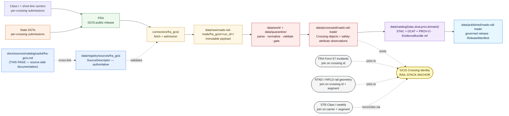

<!-- [KFM_META_BLOCK_V2]
doc_id: kfm://doc/docs-sources-catalog-usdot-fra-gcis
title: FRA Grade Crossing Inventory System
type: product-page
version: v0.2
status: draft
owners: <PLACEHOLDER — Docs steward + Source steward for usdot>
created: 2026-05-21
updated: 2026-05-23
policy_label: public
related:
  - docs/sources/catalog/usdot/README.md
  - docs/sources/catalog/usdot/fra-form57.md
  - docs/sources/catalog/usdot/stb-class1.md
  - docs/sources/catalog/usdot/ntad.md
  - docs/sources/catalog/usdot/fhwa-hpms.md
  - docs/sources/catalog/usdot/fhwa-nhfn.md
  - docs/sources/catalog/README.md
  - docs/sources/catalog/OPEN-QUESTIONS.md
  - docs/sources/catalog/PROFILES.md
  - docs/sources/catalog/IDENTITY.md
  - docs/sources/catalog/RIGHTS-AND-SENSITIVITY-MAP.md
  - docs/sources/catalog/_template/SOURCE_PRODUCT_TEMPLATE.md
  - docs/sources/catalog/_examples/stac-item-example.json
  - docs/doctrine/directory-rules.md
  - docs/domains/roads-rail-trade/
  - docs/domains/settlements-infrastructure/
  - data/registry/sources/
  - schemas/contracts/v1/source/
  - connectors/fra_gcis/
  - pipelines/
  - policy/sensitivity/
  - policy/rights/
tags: [kfm, docs, sources, catalog, usdot, fra, gcis, inventory, anchor, roads-rail-trade]
source_id_hint: fra_gcis
upstream_publisher: FRA — Federal Railroad Administration (a USDOT operating administration)
notes:
  - "PROPOSED product-page scaffold raised to full presentation standard."
  - "KFM treatment grounded in Pass-10 C10-05 (GCIS as the canonical rail-crossing inventory), Pass-10 C7-09 (GNIS as place authority for crossing names), the freight-intake split (KFM-P31-IDEA-0014 separates the crossing slot), MapLibre cards ML-062-024 / ML-062-025 / ML-062-026, Pass-10 C4-01, and Atlas v1.1 §24.10 (administrative-compilation-cited-as-observation risk)."
  - "GCIS is the canonical join anchor for the KFM rail stack — Pass-10 C10-05 unifies GCIS + Form 57 + STB Class I on geographic and operational keys."
  - "Source role is fundamentally administrative compilation (curated inventory), with per-attribute observation timestamps; the anti-collapse hazard is treating GCIS as if it were a per-crossing observation timeline."
  - "Coordinate disagreement between GCIS and HIFLD/NTAD is a CONFIRMED Pass-10 C10-05 open question and applies most acutely to this product."
  - "Namespace pin (kfm: vs ks-kfm:) UNKNOWN — examples use <NS>: placeholder; see OPEN-DSC-03."
  - "All repo paths PROPOSED until verified against a mounted repository."
[/KFM_META_BLOCK_V2] -->

<a id="top"></a>

# FRA Grade Crossing Inventory System

> The FRA canonical inventory of public and private highway-rail grade crossings — the **geographic anchor** for the KFM rail stack feeding **`roads-rail-trade`** and (for crossing-as-facility) **`settlements-infrastructure`**.


**Status:** PROPOSED — scaffold raised to full presentation standard · **Family:** [`usdot`](./README.md) · **Owners:** `<PLACEHOLDER — Docs steward + Source steward for usdot>` · **Last reviewed:** 2026-05-23

> [!IMPORTANT]
> This page documents the **source side** of the FRA Grade Crossing Inventory System (GCIS) as it enters the KFM lifecycle. The authoritative `SourceDescriptor` lives in [`data/registry/sources/`](../../../../data/registry/sources/); **this page MUST NOT duplicate descriptor fields**. The lane in which this product participates (`usdot/`) is **PROPOSED beyond `directory-rules.md` §7.3** and is tracked as `OPEN-DSC-14`.

> [!WARNING]
> **Anti-collapse warning specific to GCIS.** GCIS is an **administrative compilation** (a curated inventory of crossings) — it is **not** a per-crossing observation timeline. Per Atlas v1.1 §24.10 risk register, *"administrative compilation cited as observation"* is a **DENY-publication** path. The inventory's per-attribute survey or installation dates carry observation semantics; **do not promote the inventory itself to `observed` role on the strength of those attributes**. The inventory records *what KFM knows is at each crossing as of the inventory snapshot*; observations of *change at a crossing* are separate evidence.

---

## Contents

- [1. Overview](#1-overview)
- [2. Inventory scope](#2-inventory-scope)
- [3. Lifecycle map and rail-stack role](#3-lifecycle-map-and-rail-stack-role)
- [4. Source authority](#4-source-authority)
- [5. Catalog profiles](#5-catalog-profiles)
- [6. Collection and crossing identity](#6-collection-and-crossing-identity)
- [7. Provenance fields](#7-provenance-fields)
- [8. Temporal handling](#8-temporal-handling)
- [9. Geometry and projection](#9-geometry-and-projection)
- [10. Rights and sensitivity](#10-rights-and-sensitivity)
- [11. Validation and catalog closure](#11-validation-and-catalog-closure)
- [12. Related contracts, connectors, pipelines](#12-related-contracts-connectors-pipelines)
- [13. Cross-domain consumers](#13-cross-domain-consumers)
- [14. Examples](#14-examples)
- [15. Open questions](#15-open-questions)
- [16. Related docs](#16-related-docs)

---

## 1. Overview

> [!NOTE]
> **External-knowledge framing.** That FRA publishes a national grade-crossing inventory is stable framework knowledge. The **exact set of attributes** maintained in the current GCIS schema, the **current submission cadence**, the **current endpoint URL**, and **license text** are **NEEDS VERIFICATION** against current FRA documentation; KFM's specific ingest scope is governed by the `SourceDescriptor`, not by this page.

The **Grade Crossing Inventory System (GCIS)** is FRA's national inventory of public and private highway-rail grade crossings. Per Pass-10 **C10-05** *(rail stack: FRA GCIS, FRA Form 57, STB Class I, HIFLD/NTAD; CONFIRMED at doctrine rank)*, GCIS is the **canonical inventory** of crossings in the KFM rail stack — each crossing carries safety attributes (warning device type, traffic exposure, sight distance, etc.) plus geographic coordinates. The corpus describes the KFM rail stack as ingesting these on their native cadences and producing a **unified rail-condition view that joins GCIS, Form 57, and STB on geographic and operational keys**.

GCIS is, structurally, the **geographic anchor** for the entire KFM rail stack: Form 57 incidents at crossings join here; HIFLD/NTAD geometry context joins here; STB carrier operations are reconciled to the segments these crossings sit on. Within the freight-intake split of `KFM-P31-IDEA-0014` and `ML-062-024`, GCIS occupies the **crossing slot** *(distinct from incidents, networks, flows, and facilities)*.

| Attribute | Value | Status |
|---|---|---|
| **Upstream publisher** | FRA (USDOT operating administration); records sourced from carriers and states | CONFIRMED at general-knowledge rank |
| **Source family** | [`usdot`](./README.md) | **PROPOSED** family — beyond `directory-rules.md` §7.3; see `OPEN-DSC-14` |
| **Owning KFM domain (primary)** | [`docs/domains/roads-rail-trade/`](../../../domains/roads-rail-trade/) — *`[DOM-ROADS]`* | CONFIRMED doctrine |
| **Cross-domain (secondary)** | `[DOM-SETTLE]` (crossing-as-facility / infrastructure-asset framing) | CONFIRMED via `[DOM-ROADS]` cross-lane relations |
| **Freight-intake family** *(per `KFM-P31-IDEA-0014`)* | **crossing** | CONFIRMED at doctrine rank |
| **Source role posture** | **`administrative`** *(curated inventory)*; per-attribute observation timestamps preserved separately | **PROPOSED** per descriptor; see §4 |
| **Role in the KFM rail stack** | **Canonical join anchor** — Form 57, NTAD/HIFLD, STB joins reconcile to GCIS crossing identity | CONFIRMED per Pass-10 C10-05 |
| **Geographic coverage** | U.S. nationwide; Kansas slice via crossings on Kansas track | NEEDS VERIFICATION per descriptor |
| **Cadence** | Continuous updates from carriers/states; FRA periodic public release | NEEDS VERIFICATION — confirm current FRA release cadence |
| **Endpoint / access form** | UNKNOWN — confirm via the `SourceDescriptor` | NEEDS VERIFICATION |
| **Rights / license** | Federal U.S. data, generally open | NEEDS VERIFICATION per current FRA terms |
| **Sensitivity posture** | **MEDIUM** — crossings are publicly-visible features; joins to facility / operator / hazmat / casualty data can elevate to HIGH | CONFIRMED per `[DOM-ROADS]` "sensitive joins fail closed" |
| **KFM `source_id` hint** | `fra_gcis` *(snake_case, matches `connectors/fra_gcis/`)* | **PROPOSED** identifier |

[↑ Back to top](#top)

---

## 2. Inventory scope

> [!NOTE]
> The matrix below captures what the corpus *requires* the descriptor and pipeline to handle for crossings admitted under this descriptor; **the descriptor — not this page — is the source of truth**. The exact GCIS schema field names and code lists are **NEEDS VERIFICATION** against current FRA technical guidance.

| Attribute class | Description *(corpus framing)* | KFM handling |
|---|---|---|
| **Crossing identity** | FRA crossing inventory number — the stable join key for the rail stack | **Required.** Canonical identity per §6 |
| **Geometry** | Point coordinates of the crossing | Native CRS NEEDS VERIFICATION; `geometry_fingerprint` per `ML-062-025` for joins |
| **Public / private classification** | Public vs private crossing | Controlled-vocabulary attribute; determines policy posture for some downstream joins |
| **Crossing type and configuration** | At-grade / above-grade / below-grade; number of tracks; angle of crossing | Inventory state |
| **Warning devices** | Active (gates, flashing lights) vs passive (crossbucks, stop signs) | Inventory state; per-device installation dates carry observation semantics |
| **Traffic exposure** | Highway AADT × train count (or analogous metric) | Per-attribute observation timestamp; subject to source-role-anti-collapse rule (see §4) |
| **Operating railroad** | The carrier responsible for the crossing | Per-record `role_authority`; subject to operator-detail sensitivity |
| **State / county / road context** | Road name, street name, FIPS context | Controlled vocabulary; join to GNIS for names per Pass-10 C7-09 |
| **Sight distance, surface, illumination, surrounding land use** | Per-crossing safety attributes | Inventory state; per-attribute survey dates carry observation semantics |
| **Hazmat / passenger / school-bus indicators** | Special-use flags on the crossing | Generally less sensitive; confirm at admission whether any flag warrants restricted publication |

> [!IMPORTANT]
> The **safety-attribute fields are inventory state**, not observed events. The inventory says *"as of the last snapshot, this crossing has flashing lights and gates."* The fact that the gates were *installed* on a particular date is a separate `Observation` (or `InstallationEvent`) that — if it matters to the KFM model — needs its own evidence and a separate `source_role` than the inventory carrier.

[↑ Back to top](#top)

---

## 3. Lifecycle map and rail-stack role

> [!CAUTION]
> The diagram below describes **doctrine intent** (RAW → WORK / QUARANTINE → PROCESSED → CATALOG / TRIPLET → PUBLISHED, per `directory-rules.md` §9.1 and `KFM-P1-IDEA-0006`). It is **not** evidence of a working pipeline. Implementation maturity is **UNKNOWN** in this docs-only context.



> [!IMPORTANT]
> The `ANCHOR` node is **what makes GCIS structurally distinctive**. Other rail-stack products *reconcile to GCIS*; GCIS does not depend on them. A break in GCIS continuity (e.g., a re-ID of a crossing) is a **rail-stack-wide invalidation event** and MUST emit `CorrectionNotice` with the full invalidated-derivatives list per the rail-pipeline correction discipline.

[↑ Back to top](#top)

---

## 4. Source authority

Authoritative source identity lives in the registry; the docs lane only points at it.

> [!NOTE]
> Per `KFM-P1-PROG-0007`, every admitted source carries a `SourceDescriptor` recording **identity, role, rights posture, update cadence, authority scope, and verification obligations**. Descriptors are validated **before fetch, before transformation, and before publication** so source authority does not collapse into generic data availability.

- **Authoritative descriptor:** [`data/registry/sources/`](../../../../data/registry/sources/) *(file presence NEEDS VERIFICATION)*.
- **Machine schema:** [`schemas/contracts/v1/source/`](../../../../schemas/contracts/v1/source/) per **ADR-0001** *(PROPOSED canonical schema home)*.
- **Source-role enum** (per `ADR-S-04` PROPOSED vocabulary): `observed | regulatory | modeled | aggregate | administrative | candidate | synthetic`.
  - **Inventory itself:** **`administrative`** — GCIS is an FRA-administered compilation of crossings drawn from state and carrier submissions.
  - **`role_authority` (descriptor-level):** **`FRA`**.
  - **`role_authority` (per-record):** the **submitting carrier** for the crossing, where the descriptor decomposition supports it (PROPOSED).
  - **Per-attribute observation timestamps:** Some attributes (warning-device installation dates, survey dates, exposure measurements) carry **observed-time semantics** even though the carrier is administrative. These attributes SHOULD be modeled as separate `Observation` records linked to the `Crossing`, **not** elevated to change the inventory's own source role.

> [!WARNING]
> **Anti-collapse rule — restated for emphasis.** Source role is **fixed at admission**; promotion never upgrades or downcasts a role. Per Atlas v1.1 §24.10, *"administrative compilation cited as observation"* is a **DENY-publication** path. Do not produce a "per-crossing event timeline" *from the inventory alone*. If a per-crossing change history exists, it requires its own observed-role descriptor (e.g., warning-device installation observations) and explicit cross-source evidence.

[↑ Back to top](#top)

---

## 5. Catalog profiles

Per the family lane policy (see [`PROFILES.md`](../PROFILES.md)) and Pass-10 C4-01 / C4-02 / C4-05 / C8-03:

| Profile | Lane | Used by this product? | Notes |
|---|---|---|---|
| **STAC 1.1** with `<NS>:provenance` extension | `data/catalog/stac/` | **PROPOSED — Yes** | Point Feature per crossing. Per `ML-062-026`, spatial logistics layers and incidents get STAC/DCAT/PROV records. |
| **DCAT distribution** | `data/catalog/dcat/` | **PROPOSED — Yes** (dataset-level) | DCAT covers the dataset-as-a-whole including license and distribution form. |
| **PROV-O** | `data/catalog/prov/` | **PROPOSED — Yes** | Lineage from carrier/state submissions → FRA release → KFM transforms. Required for catalog closure per `KFM-P26-PROG-0025`. |
| **Domain projection (primary)** | `data/catalog/domain/roads-rail-trade/` | **PROPOSED — Yes** | `[DOM-ROADS]`-shaped view: `Crossing` object family; join key for Form 57 and NTAD/HIFLD. |
| **Domain projection (settlements)** | `data/catalog/domain/settlements-infrastructure/` | **PROPOSED — Yes** (selective) | `[DOM-SETTLE]` view: crossings as infrastructure assets where infrastructure framing is relevant. |
| **STAC × Darwin Core Hybrid** *(Pass-10 C4-03)* | — | **No** | Biodiversity-only; not applicable. |

> [!IMPORTANT]
> **Catalog closure required before public release** *(per `KFM-P1-IDEA-0020` and `KFM-P26-FEAT-0004`)*. Per `ML-062-024`, the **layer catalog must not collapse modeled flows, networks, carrier/safety registries, and incidents** — GCIS belongs to the **crossings** slot of the freight-intake split (a sub-class of carrier/safety registries) and MUST NOT be conflated with incidents (Form 57), networks (NTAD/HIFLD), flows (FAF), or facilities (NTAD facility classes).

[↑ Back to top](#top)

---

## 6. Collection and crossing identity

> [!NOTE]
> The namespace pin (**`kfm:`** vs. **`ks-kfm:`**) is **UNKNOWN** until ADR. This page uses **`<NS>:`** as a placeholder. Tracked as `OPEN-DSC-03` in [`OPEN-QUESTIONS.md`](../OPEN-QUESTIONS.md).

### 6.1 Collection identity

- **Collection id pattern:** `kfm-<org>-<product>` per [`IDENTITY.md`](../IDENTITY.md) — **PROPOSED** instantiation: `kfm-fra-gcis` *(stable; renames break links throughout the catalog per Pass-10 C4-02)*.
- **Namespace prefix:** `<NS>:` — placeholder pending `OPEN-DSC-03`.
- **Provenance namespace:** `<NS>:provenance` *(Pass-10 C4-01)* applied at STAC Item-properties level.
- **CARE namespace** *(per Pass-10 C15-02)*: **PROPOSED — No** by default for FRA-administered federal data.

### 6.2 Crossing identity (the rail-stack join key)

- **FRA Crossing Inventory Number** — the **canonical join key** for the rail stack. **PROPOSED** field on every emitted record: `<NS>:gcis_crossing_id`.
- Per the `[DOM-ROADS]` identity rule: `source id + object role + temporal scope + normalized digest`. The KFM Item id is **PROPOSED** to be `kfm-fra-gcis-<crossing-id>-<inventory-snapshot>` so that snapshots are time-distinguishable.
- **`geometry_fingerprint`** *(per `ML-062-025`)*: deterministic fingerprint of the crossing point geometry, used for cross-source geometry-disagreement detection (see §9).
- **GNIS anchor** *(per Pass-10 C7-09)*: crossing-name anchoring to USGS GNIS where the descriptor supports it. GNIS is the U.S.-canonical place authority; using it lets road / locality names attached to crossings cite a stable place identity rather than free-text.
- **Asset roles:** **NEEDS VERIFICATION** — confirm against `schemas/contracts/v1/source/` and the descriptor.

> [!IMPORTANT]
> **Renaming or re-ID-ing a crossing is a rail-stack-wide invalidation event.** Any change to a crossing's FRA ID MUST emit a `CorrectionNotice` listing every derivative product that joined to the prior id (Form 57 records, NTAD-joined geometry, STB-reconciled segments). The historic id is preserved; downstream join queries that need historical data resolve through the supersession record, not the live id.

[↑ Back to top](#top)

---

## 7. Provenance fields

Per **Pass-10 C4-01** *(CONFIRMED doctrine)*, STAC Items for KFM-governed catalog records carry an `item.properties.<NS>:provenance` block:

| Field | Type | Purpose |
|---|---|---|
| `spec_hash` | `sha256:…` | Canonical-record digest *(JCS default; URDNA2015 reserved for RDF semantics — Pass-10 C8-05)*. |
| `evidence_bundle_ref` | `<NS>://evidence/<digest>` | Resolves to content-addressed EvidenceBundle JSON-LD *(Pass-10 C4-04)*. |
| `run_record_ref` | `<NS>://run/<run-id>` | Pipeline run that produced the record. |
| `audit_ref` | `<NS>://audit/<attestation-id>` | SLSA / OPA attestation. |
| `policy_digest` | `sha256:…` | Hash of the policy bundle in force at promotion *(supports policy-parity per Pass-10 C5-03)*. |

**Per-asset integrity:** `file:checksum` *(STAC file extension)*.

**Receipt classes referenced** *(per Atlas v1.1 §24.2.1)*:

| Receipt | Purpose for GCIS | Required when |
|---|---|---|
| `SourceDescriptor` | Anchors identity, role, rights, sensitivity, cadence at admission | Always |
| `TransformReceipt` | Records geometry / attribute transforms (projection, snap-to-network) | Always when applied |
| `ReviewRecord` | Steward review for any joined-record sensitive lane (e.g., crossing × hazmat × population context) | When sensitivity-elevating joins are published |

`AggregationReceipt`, `RedactionReceipt`, `ModelRunReceipt`, and `AIReceipt` are **not** required by default for the inventory itself, but may be required by **downstream products** that reuse GCIS as a join anchor.

> [!WARNING]
> **Cite-or-abstain rule.** A claim derived from this product that cannot resolve its `evidence_bundle_ref` at runtime MUST abstain. AI surfaces over GCIS data MUST NOT *invent* attributes (e.g., warning-device type) — they MUST cite the inventory record or abstain.

[↑ Back to top](#top)

---

## 8. Temporal handling

Per `[DOM-ROADS]` *(CONFIRMED doctrine)*: **source, observed, valid, retrieval, release, and correction times stay distinct where material**. For an inventory product, the distinctions take a distinctive shape.

| Time | GCIS semantics *(PROPOSED instantiation)* | Notes |
|---|---|---|
| `source_time` | The FRA inventory snapshot date the record was harvested from | Inventory cadence |
| `observed_time` | **Generally not applicable to the inventory record itself** — the inventory is a state assertion, not a moment of observation. Per-attribute observation dates (e.g., warning-device install date, last survey date) belong on separate `Observation` records and SHOULD NOT be flattened onto the inventory `datetime`. | Critical distinction; see §4 anti-collapse rule |
| `valid_time` | Period over which the inventory state is asserted to hold *(start ← last snapshot; end ← next snapshot supersession)* | Required for time-aware UI |
| `retrieval_time` | Timestamp when the KFM connector fetched the upstream release | Recorded in `RunReceipt` |
| `release_time` | Timestamp of the KFM `ReleaseManifest` that published the record | Required for PUBLISHED transitions |
| `correction_time` | Timestamp of any `CorrectionNotice` amending a prior PUBLISHED record | Triggers rail-stack-wide invalidation per §6.2 |

> [!NOTE]
> The inventory is a **state assertion**, and a new snapshot **replaces** the prior `valid_time` span rather than amending it. Historic snapshots are preserved with their original `valid_time` so a time-aware UI can show the crossing as it appeared in a prior year — this is especially useful when joining to Form 57 incidents, where the crossing's inventory state *at the time of the incident* matters.

[↑ Back to top](#top)

---

## 9. Geometry and projection

| Aspect | Posture | Status |
|---|---|---|
| **Native geometry** | Point (crossing location) | CONFIRMED at general-knowledge rank |
| **Native CRS** | Upstream coordinates per current FRA release | NEEDS VERIFICATION |
| **KFM internal CRS** | Per `[DOM-ROADS]` / domain map manifest | NEEDS VERIFICATION per the `LayerManifest` |
| **Generalization** | Generally not required for public release (crossings are publicly-visible features). Generalization may apply when joined to sensitive context (e.g., hazmat or casualty inference); apply through named `RedactionProfile` per Pass-10 C6-02 when triggered; emit a `TransformReceipt` for every transform | PROPOSED |
| **Scale support** | Per the MapLibre `StyleManifest`; crossings typically appear at mid-to-fine zooms | NEEDS VERIFICATION |
| **STAC Projection extension** | `proj:code`, `proj:bbox`, `proj:geometry`, `proj:shape`, `proj:transform` — lint per `KFM-P27-FEAT-0003` | PROPOSED |
| **`geometry_fingerprint`** *(per `ML-062-025`)* | Deterministic fingerprint of the crossing point; used for cross-source disagreement detection | PROPOSED |

### 9.1 Cross-source coordinate disagreement *(CONFIRMED Pass-10 C10-05 open question)*

Pass-10 **C10-05** records the **open question**: *"What is the right policy when GCIS coordinates disagree with HIFLD geometry for the same crossing?"* This product is the **most acutely affected** by that question, because GCIS is the rail-stack anchor and HIFLD/NTAD provides geometry context.

> [!IMPORTANT]
> **Policy gap (CONFIRMED open question).** When GCIS coordinates and HIFLD/NTAD geometry disagree for the same crossing, KFM MUST:
> 1. **Surface the disagreement in the EvidenceBundle** — never silently pick one and discard the other.
> 2. **Record which authority KFM treats as canonical for the join** in the `SourceDescriptor` (`PROPOSED — GCIS, since it is the rail-stack identity anchor`).
> 3. **Emit a `TransformReceipt`** for any KFM-internal reconciliation (snap, average, etc.).
> 4. **Flag the disagreement to the `[DOM-ROADS]` steward** for review.
>
> The Pass-10 C10-05 open question is **ADR-class for the rail stack** and SHOULD be resolved before HIFLD/NTAD-joined products reach PUBLISHED.

[↑ Back to top](#top)

---

## 10. Rights and sensitivity

> [!CAUTION]
> Per `[DOM-ROADS]`, this family carries the rule **"rights and current terms NEEDS VERIFICATION; sensitive joins fail closed."** GCIS itself is moderate-sensitivity — crossings are publicly-visible infrastructure features — but **joins to other sources can rapidly elevate** the sensitivity profile.

### 10.1 Inventory itself

- **Public-domain default:** Federal U.S. inventory data is generally public; current license text is **NEEDS VERIFICATION** at admission.
- **Crossing-detail public posture:** Crossing identity, location, public/private classification, warning-device configuration, road context — generally publishable.
- **Operator-detail nuance:** The operating-railroad attribute can be sensitive when joined with operator commercial information; pass through review for products that surface operator detail at the per-crossing level.
- **CARE applicability:** **PROPOSED — No** by default; confirm at admission for any crossings on tribal land.

### 10.2 Sensitivity-elevating joins

The crossing record itself is mostly public, but joining GCIS to other sources can produce sensitive views. The OPA gate MUST default-deny these joins until explicit allow rules are satisfied:

| Join | Elevated sensitivity | Source-of-elevation |
|---|---|---|
| GCIS × **FRA Form 57** (incidents at crossing) | Casualty / operator / hazmat inference at crossing geometry | `[DOM-PEOPLE]` living-person rules + Atlas v1.1 §24.10 |
| GCIS × **STB Class I** (carrier operations) | Operator commercial detail at infrastructure scale | Operator-detail discipline |
| GCIS × **hazmat consist / facility data** | Critical-infrastructure dependency | `[DOM-SETTLE]` T2 critical-asset deny lane |
| GCIS × **person-parcel records** | Person-parcel inference | Atlas v1.1 §24.10 DENY-default lane |
| GCIS × **Indigenous corridor overlays** | Cultural-heritage / sovereignty review | `[DOM-ARCH]` + `[DOM-ROADS]` Indigenous-corridor rule |

### 10.3 Authority

Authoritative policy lives in [`policy/sensitivity/`](../../../../policy/sensitivity/) and [`policy/rights/`](../../../../policy/rights/). The lane-wide rights/sensitivity map is in [`RIGHTS-AND-SENSITIVITY-MAP.md`](../RIGHTS-AND-SENSITIVITY-MAP.md). **Do not restate policy here.**

[↑ Back to top](#top)

---

## 11. Validation and catalog closure

| Check | Reference | Status |
|---|---|---|
| Catalog closure (DCAT / STAC / PROV completeness) before public release | `KFM-P1-IDEA-0020`, `KFM-P26-FEAT-0004` | **PROPOSED** |
| STAC checksum closure against the `ReleaseManifest` digest | `KFM-P22-PROG-0037` | **PROPOSED** |
| STAC Projection lint (`proj:*` fields) | `KFM-P27-FEAT-0003` | **PROPOSED** |
| Catalog QA result surface (missing license, providers, `stac_extensions`, broken links, JSON errors) | `KFM-P27-FEAT-0004` | **PROPOSED** |
| `SourceDescriptor` schema validation | per ADR-0001 schema home | **PROPOSED** |
| **Source-role anti-collapse check (GCIS-specific)** | Atlas v1.1 §24.10 administrative-compilation-cited-as-observation; §3 supplement | **PROPOSED — high priority** |
| **Inventory-vs-observation split test** *(per-attribute observation timestamps not flattened onto inventory `datetime`)* | §4 + §8 above | **PROPOSED** |
| **Freight-intake split validation** *(crossings distinct from networks, flows, incidents, facilities)* | `ML-062-024`, `KFM-P31-IDEA-0014` | **PROPOSED** |
| **Crossing-identity invariance** *(crossing id stable across snapshots; re-IDs produce `CorrectionNotice` with full invalidated-derivatives list)* | §6.2 above; rail-stack correction discipline | **PROPOSED — high priority** |
| **Cross-source coordinate-disagreement surfacing** *(GCIS vs HIFLD / NTAD)* | Pass-10 C10-05 open question | **PROPOSED — ADR-class for the rail stack** |
| **GNIS-anchor lint** *(crossing road / locality names should cite GNIS where supported)* | Pass-10 C7-09 | **PROPOSED** |
| Sensitive-join fail-closed test fixtures | `[DOM-ROADS]` + §10.2 above | **PROPOSED** |
| Source-availability watchlist entry | `KFM-P32-FEAT-0016` | **PROPOSED** |
| Negative-state coverage (validators exercise DENY / ABSTAIN / ERROR, not only success) | `tools/README.md` negative-state rule | **PROPOSED** |

> [!IMPORTANT]
> **No public-path bypass.** Per the trust-membrane invariant, public clients MUST consume governed APIs, never canonical or `data/raw/` stores. Promotion to `data/published/` is a **governed state transition**, not a file move; default-deny applies absent EvidenceBundle, ValidationReport, ReleaseManifest, and review state where required.

[↑ Back to top](#top)

---

## 12. Related contracts, connectors, pipelines

### 12.1 Contracts & schemas

- [`contracts/source/`](../../../../contracts/source/) — semantic Markdown contracts.
- [`schemas/contracts/v1/source/`](../../../../schemas/contracts/v1/source/) — machine schema home per **ADR-0001** *(PROPOSED)*.
- [`schemas/contracts/v1/transport/`](../../../../schemas/contracts/v1/transport/) — `[DOM-ROADS]`-shaped contracts including the `Crossing` object family *(PROPOSED — confirm per Encyclopedia §5)*.
- `[DOM-SETTLE]` infrastructure-asset contracts where crossings are also surfaced as infrastructure *(PROPOSED — confirm path)*.

### 12.2 Connector

- [`connectors/fra_gcis/`](../../../../connectors/fra_gcis/) — fetch + admission folder *(currently an empty stub per the family inventory)*.

> [!NOTE]
> Per `directory-rules.md` §7.3, the connector MUST emit to `data/raw/roads-rail-trade/fra_gcis/<run_id>/` (or `data/quarantine/...` on admission failure) and MUST NOT write under `data/processed/`, `data/catalog/`, or `data/published/`. Per `KFM-P31-FEAT-0009` (Freight Dataset Source Hub), the connector SHOULD expose source family, update cadence, canonical IDs, sensitivity rules, and publication metadata in its receipts.

### 12.3 Pipelines

- [`pipelines/ingest/`](../../../../pipelines/ingest/)
- [`pipelines/normalize/`](../../../../pipelines/normalize/)
- [`pipelines/validate/`](../../../../pipelines/validate/)
- [`pipelines/catalog/`](../../../../pipelines/catalog/)
- [`pipelines/publish/`](../../../../pipelines/publish/)
- [`pipeline_specs/roads-rail-trade/`](../../../../pipeline_specs/roads-rail-trade/) — declarative spec home *(PROPOSED)*

[↑ Back to top](#top)

---

## 13. Cross-domain consumers

GCIS is the **structural anchor** for the KFM rail stack. Its consumers are correspondingly diverse.

### 13.1 Primary — `[DOM-ROADS]`

| Object family | Use *(PROPOSED)* |
|---|---|
| **`Crossing`** | Primary target — one crossing → one `Crossing` object (the `[DOM-ROADS]` enumeration explicitly lists `Crossing` as an object family) |
| **`Network Node`** | When the crossing functions as a network node (highway × rail intersection) |
| **`RestrictionEvent`** | Cross-product with carrier / state operational data when a crossing is restricted |
| **`StatusEvent`** | Cross-product with operational status sources |

### 13.2 Secondary — `[DOM-SETTLE]`

| Object family | Use *(PROPOSED)* |
|---|---|
| **`Infrastructure Asset`** | Crossing-as-infrastructure framing for the settlements domain |
| **`Facility`** | When the crossing is part of a facility complex |

### 13.3 Cross-source joins *(per Pass-10 C10-05; GCIS is the anchor)*

The KFM rail stack joins **FRA GCIS + FRA Form 57 + STB Class I** on **geographic and operational keys**:

- **Form 57 incidents at crossings** → join on `<NS>:gcis_crossing_id`.
- **NTAD / HIFLD rail geometry** → join on `<NS>:gcis_crossing_id` + segment context; **coordinate disagreement surfaces in EvidenceBundle per §9.1**.
- **STB Class I carrier metrics** → reconcile via the operating-railroad attribute on the crossing.

[↑ Back to top](#top)

---

## 14. Examples

> [!NOTE]
> The block below is **illustrative only**. It is **not** an authoritative fixture and MUST NOT be cited as repo evidence. The canonical example fixture is referenced at [`../_examples/stac-item-example.json`](../_examples/stac-item-example.json) *(file presence NEEDS VERIFICATION)*. Namespace prefix shown as `<NS>:` per `OPEN-DSC-03`.

<details>
<summary><strong>Illustrative STAC Item shape</strong> (GCIS crossing inventory record) — click to expand</summary>

```json
{
  "type": "Feature",
  "stac_version": "1.1.0",
  "id": "kfm-fra-gcis-<crossing-id>-<inventory-snapshot>",
  "collection": "kfm-fra-gcis",
  "geometry": { "type": "Point", "coordinates": [ /* PROPOSED — confirm CRS */ ] },
  "bbox": [ /* … */ ],
  "properties": {
    "datetime": null,
    "start_datetime": "<valid_time-start-snapshot-date>",
    "end_datetime": "<valid_time-end-next-snapshot-or-null>",
    "<NS>:source_role": "administrative",
    "<NS>:role_authority": "FRA",
    "<NS>:role_authority_per_record": "<submitting-carrier-code>",
    "<NS>:freight_intake_family": "crossing",
    "<NS>:gcis_crossing_id": "<crossing-id>",
    "<NS>:public_private": "public",
    "<NS>:warning_device_class": "<vocabulary-term>",
    "<NS>:geometry_fingerprint": "sha256:<…>",
    "<NS>:gnis_road_anchor": "<gnis-feature-id-where-supported>",
    "<NS>:provenance": {
      "spec_hash": "sha256:<…>",
      "evidence_bundle_ref": "<NS>://evidence/<digest>",
      "run_record_ref": "<NS>://run/<run-id>",
      "audit_ref": "<NS>://audit/<attestation-id>",
      "policy_digest": "sha256:<…>"
    },
    "proj:code": "EPSG:<code>"
  },
  "assets": {
    "data": {
      "href": "./data/processed/roads-rail-trade/fra_gcis/<run_id>/crossings.parquet",
      "type": "application/vnd.apache.parquet",
      "roles": ["data"],
      "file:checksum": "1220<sha256-multihash>"
    }
  },
  "links": [
    { "rel": "self",       "href": "./<item-id>.json" },
    { "rel": "collection", "href": "./collection.json" },
    { "rel": "root",       "href": "../../../catalog.json" }
  ]
}
```

</details>

<details>
<summary><strong>Illustrative cross-source disagreement record</strong> (GCIS vs HIFLD/NTAD coordinates for the same crossing) — click to expand</summary>

```json
{
  "record_type": "CrossSourceDisagreement",
  "id": "<NS>://disagreement/<digest>",
  "subject_crossing": {
    "<NS>:gcis_crossing_id": "<crossing-id>",
    "gcis_geometry":  { "type": "Point", "coordinates": [ /* gcis lon, lat */ ] },
    "hifld_geometry": { "type": "Point", "coordinates": [ /* hifld lon, lat */ ] },
    "ntad_geometry":  { "type": "Point", "coordinates": [ /* ntad lon, lat */ ] }
  },
  "canonical_authority_for_join": "GCIS",
  "canonical_basis": "rail-stack identity anchor per Pass-10 C10-05",
  "distance_m": "<computed>",
  "transform_receipt_ref": "<NS>://receipt/transform/<id>",
  "review_record_ref": "<NS>://receipt/review/<id>",
  "open_question_ref": "Pass-10 C10-05 open question",
  "evidence_bundle_ref": "<NS>://evidence/<digest>"
}
```

</details>

> [!IMPORTANT]
> The disagreement record is **not** a resolution — it is a *surfaced disagreement* that downstream consumers and stewards can act on. KFM does not silently average or pick one; the canonical authority for joins is declared and the alternate geometries are preserved.

[↑ Back to top](#top)

---

## 15. Open questions

| ID | Question | Class |
|---|---|---|
| **`OPEN-DSC-14`** | Should the `usdot` family be promoted to a `directory-rules.md` §7.3-listed family (see [`./README.md`](./README.md))? | **ADR-class** |
| **`OPEN-DSC-03`** | Namespace pin: **`kfm:`** vs. **`ks-kfm:`**? | **ADR-class** |
| **Pass-10 C10-05 coordinate-disagreement policy** | When GCIS coordinates disagree with HIFLD / NTAD geometry for the same crossing, what is the canonical-authority policy and reconciliation discipline? | **ADR-class — rail-stack-wide** |
| GCIS current schema and submission cadence | Confirm current GCIS attribute set, code lists, and FRA submission / release cadence | **NEEDS VERIFICATION** at admission |
| Rights status and license text | Confirm current redistribution and attribution terms; record verbatim in the `SourceDescriptor` | **NEEDS VERIFICATION** |
| **Inventory-vs-observation split** | Should warning-device installation dates, last-survey dates, and similar per-attribute timestamps be modeled as separate `Observation` records (observed-role descriptor) or carried as inventory metadata? | **PROPOSED — domain-steward decision** |
| **Per-record `role_authority`** | Confirm whether GCIS records consistently identify the submitting carrier at sufficient granularity to populate per-record `role_authority` | **PROPOSED** |
| **Crossing-id stability and re-ID discipline** | Confirm FRA crossing-id stability across snapshots; pin the rail-stack `CorrectionNotice` invalidated-derivatives discipline for re-IDs | **PROPOSED — high priority** |
| **GNIS anchoring coverage** | Where can crossing road / locality names be anchored to GNIS? Where they cannot, what fallback is acceptable? | **PROPOSED** |
| Collection scope | Own STAC Collection (`kfm-fra-gcis`) or share one with sibling FRA products? | **PROPOSED — decide before first PUBLISHED transition** |
| Indigenous-corridor overlap policy | Where a crossing sits on a segment overlapping an Indigenous trade or mobility corridor, what review path applies? | **PROPOSED — confirm with `[DOM-ARCH]` steward** |
| CARE applicability | Default **No** for federal data; revisit for crossings on tribal land | **PROPOSED — confirm at admission** |

See [`OPEN-QUESTIONS.md`](../OPEN-QUESTIONS.md) for the full lane-wide register.

[↑ Back to top](#top)

---

## 16. Related docs

- [`./README.md`](./README.md) — `usdot` family README *(this product's home folder)*
- [`./fra-form57.md`](./fra-form57.md) — **strongly coupled sibling** *(incidents at crossings; joins on `<NS>:gcis_crossing_id`)*
- [`./stb-class1.md`](./stb-class1.md) — sibling *(carrier operations; reconciled via operating-railroad attribute)*
- [`./ntad.md`](./ntad.md) — sibling *(geometry context; coordinate-disagreement surfacing per §9.1)*
- [`./fhwa-hpms.md`](./fhwa-hpms.md) — sibling *(observed road-network reporting)*
- [`./fhwa-nhfn.md`](./fhwa-nhfn.md) — sibling *(regulatory freight-network designation)*
- [`../README.md`](../README.md) — `docs/sources/catalog/` landing
- [`../OPEN-QUESTIONS.md`](../OPEN-QUESTIONS.md) — lane-wide open questions
- [`../PROFILES.md`](../PROFILES.md) — catalog-profile policy
- [`../IDENTITY.md`](../IDENTITY.md) — collection-id and namespace conventions
- [`../RIGHTS-AND-SENSITIVITY-MAP.md`](../RIGHTS-AND-SENSITIVITY-MAP.md) — lane-wide rights/sensitivity map
- [`../_template/SOURCE_PRODUCT_TEMPLATE.md`](../_template/SOURCE_PRODUCT_TEMPLATE.md) — the template this page conforms to
- [`../_examples/stac-item-example.json`](../_examples/stac-item-example.json) — canonical STAC + `<NS>:provenance` example *(NEEDS VERIFICATION)*
- [`../../../doctrine/directory-rules.md`](../../../doctrine/directory-rules.md) — placement authority
- [`../../../domains/roads-rail-trade/`](../../../domains/roads-rail-trade/) — primary owning domain *(`[DOM-ROADS]`)*
- [`../../../domains/settlements-infrastructure/`](../../../domains/settlements-infrastructure/) — secondary cross-domain *(`[DOM-SETTLE]`)*
- [`../../../../data/registry/sources/`](../../../../data/registry/sources/) — authoritative `SourceDescriptor` home
- [`../../../../schemas/contracts/v1/source/`](../../../../schemas/contracts/v1/source/) — machine schema home *(ADR-0001)*
- [`../../../../connectors/fra_gcis/`](../../../../connectors/fra_gcis/) — connector folder
- [`../../../../policy/sensitivity/`](../../../../policy/sensitivity/) — sensitivity policy

---

<sub>Last reviewed: **2026-05-23** *(Claude session — v0.1 scaffold raised to full presentation standard; description grounded in Pass-10 C10-05 rail stack and its GCIS-vs-HIFLD/NTAD open question, Pass-10 C7-09 GNIS as place authority, freight-intake split cards `KFM-P31-IDEA-0014` / `ML-062-024` / `ML-062-026`, deterministic edge-ID rule `ML-062-025`, Atlas v1.1 §24.10 administrative-compilation-cited-as-observation risk, §24.2.1 receipt family catalog, and Pass-10 C4-01).* · Version: **v0.2** · Family authority: **PROPOSED** (beyond `directory-rules.md` §7.3) · Role: **canonical join anchor of the rail stack** · Repo paths: **PROPOSED / NEEDS VERIFICATION**.</sub>

[↑ Back to top](#top)
