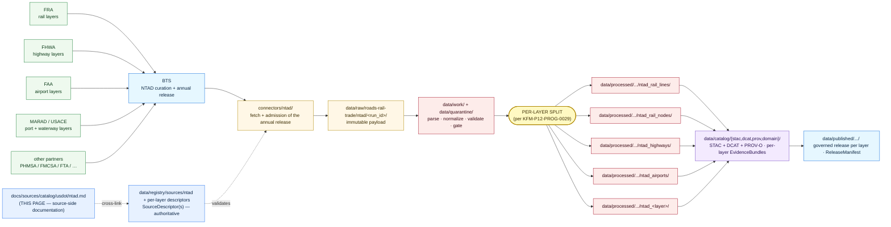

<!-- [KFM_META_BLOCK_V2]
doc_id: kfm://doc/docs-sources-catalog-usdot-ntad
title: National Transportation Atlas Database
type: product-page
version: v0.2
status: draft
owners: <PLACEHOLDER — Docs steward + Source steward for usdot>
created: 2026-05-21
updated: 2026-05-23
policy_label: public
related:
  - docs/sources/catalog/usdot/README.md
  - docs/sources/catalog/usdot/fra-gcis.md
  - docs/sources/catalog/usdot/fra-form57.md
  - docs/sources/catalog/usdot/fhwa-hpms.md
  - docs/sources/catalog/usdot/fhwa-nhfn.md
  - docs/sources/catalog/usdot/stb-class1.md
  - docs/sources/catalog/README.md
  - docs/sources/catalog/OPEN-QUESTIONS.md
  - docs/sources/catalog/PROFILES.md
  - docs/sources/catalog/IDENTITY.md
  - docs/sources/catalog/RIGHTS-AND-SENSITIVITY-MAP.md
  - docs/sources/catalog/_template/SOURCE_PRODUCT_TEMPLATE.md
  - docs/sources/catalog/_examples/stac-item-example.json
  - docs/doctrine/directory-rules.md
  - docs/domains/roads-rail-trade/
  - docs/domains/settlements-infrastructure/
  - data/registry/sources/
  - schemas/contracts/v1/source/
  - connectors/ntad/
  - pipelines/
  - policy/sensitivity/
  - policy/rights/
tags: [kfm, docs, sources, catalog, usdot, bts, ntad, multi-modal, layer-aggregator, roads-rail-trade]
source_id_hint: ntad
upstream_publisher: BTS — Bureau of Transportation Statistics (within USDOT)
notes:
  - "PROPOSED product-page scaffold raised to full presentation standard."
  - "KFM treatment grounded in Pass-10 C10-05 (NTAD pairs with HIFLD as the geospatial substrate for rail infrastructure), KFM-P12-PROG-0029 (transportation source packages should separate NTAD layers from siblings — the defining doctrine for this product's KFM handling), KFM-P31-IDEA-0014 (freight six-domain intake), Pass-10 C4-01, and Atlas v1.1 §24.10 (administrative-compilation-cited-as-observation risk)."
  - "NTAD is a LAYER AGGREGATOR — not a single dataset. The KFM-canonical handling per KFM-P12-PROG-0029 is per-layer separation with per-layer source-role assessment."
  - "Per-layer upstream agencies (FRA, FHWA, FAA, MARAD, etc.) provide the substantive content; BTS curates and republishes. Per-layer attribution to the actual upstream is required; do not collapse to a BTS-only attribution."
  - "Coordinate disagreement between NTAD geometry and FRA GCIS crossing coordinates is a CONFIRMED Pass-10 C10-05 open question — see fra-gcis.md §9.1 for the canonical-authority policy from the rail-stack side."
  - "Namespace pin (kfm: vs ks-kfm:) UNKNOWN — examples use <NS>: placeholder; see OPEN-DSC-03."
  - "All repo paths PROPOSED until verified against a mounted repository."
[/KFM_META_BLOCK_V2] -->

<a id="top"></a>

# National Transportation Atlas Database

> The BTS-published **aggregator** of national geospatial transportation layers — multi-modal, multi-domain, **per-layer-separated in KFM**.


**Status:** PROPOSED — scaffold raised to full presentation standard · **Family:** [`usdot`](./README.md) · **Owners:** `<PLACEHOLDER — Docs steward + Source steward for usdot>` · **Last reviewed:** 2026-05-23

> [!IMPORTANT]
> This page documents the **source side** of the National Transportation Atlas Database (NTAD) as it enters the KFM lifecycle. The authoritative `SourceDescriptor`(s) live in [`data/registry/sources/`](../../../../data/registry/sources/); **this page MUST NOT duplicate descriptor fields**. The lane in which this product participates (`usdot/`) is **PROPOSED beyond `directory-rules.md` §7.3** and is tracked as `OPEN-DSC-14`.

> [!WARNING]
> **NTAD is the only product in the `usdot` family that is itself an aggregator.** Per `KFM-P12-PROG-0029` *(CONFIRMED doctrine card)*: *"Transportation source packages should separate NTAD layers, NBI annual bridge snapshots, FHWA ASCII exports, Transitland/NTM GTFS feeds, KanPlan/KanDrive services, and STB rail-status sources."* The defining KFM-canonical handling for this product is therefore **per-layer separation** — not a single monolithic NTAD descriptor — with each layer's source role assessed against the **actual upstream agency** (FRA, FHWA, FAA, MARAD, etc.), not against BTS. Collapsing per-layer authorship into a single "NTAD" source is an anti-pattern.

---

## Contents

- [1. Overview](#1-overview)
- [2. Layer scope and per-layer decomposition](#2-layer-scope-and-per-layer-decomposition)
- [3. Lifecycle map](#3-lifecycle-map)
- [4. Source authority](#4-source-authority)
- [5. Catalog profiles](#5-catalog-profiles)
- [6. Collection and layer identity](#6-collection-and-layer-identity)
- [7. Provenance fields](#7-provenance-fields)
- [8. Temporal handling](#8-temporal-handling)
- [9. Geometry and projection](#9-geometry-and-projection)
- [10. Rights and sensitivity](#10-rights-and-sensitivity)
- [11. Validation and catalog closure](#11-validation-and-catalog-closure)
- [12. Related contracts, connectors, pipelines](#12-related-contracts-connectors-pipelines)
- [13. Cross-domain consumers](#13-cross-domain-consumers)
- [14. Examples](#14-examples)
- [15. Open questions](#15-open-questions)
- [16. Related docs](#16-related-docs)

---

## 1. Overview

> [!NOTE]
> **External-knowledge framing.** That NTAD is a BTS-curated, multi-modal collection of national transportation geospatial layers is stable framework knowledge. The **current** NTAD layer inventory, the **current** endpoint URL, the **current** release year and cadence, and the **current** license text per layer are **version-sensitive** and are **NEEDS VERIFICATION per the descriptor(s) in `data/registry/sources/`**.

The **National Transportation Atlas Database (NTAD)** is a multi-modal collection of national geospatial transportation layers, **curated and republished** by the **Bureau of Transportation Statistics (BTS)** within USDOT. The substantive content of NTAD layers originates upstream at the modal operating administrations and partner agencies — FRA for rail, FHWA for highways, FAA for aviation, MARAD for ports/maritime, FMCSA, and others — with BTS providing the harmonized, single-source distribution.

Within KFM, NTAD is named in the **`[DOM-ROADS]` source-family register** *(CONFIRMED at doctrine rank)* and paired with HIFLD in **Pass-10 C10-05** as the *geospatial substrate for rail infrastructure*. Beyond the rail framing, NTAD's broader role spans roads-rail-trade and settlements-infrastructure. Per **`KFM-P12-PROG-0029`**, NTAD is the most explicit case in the corpus of a product whose layers should be **separated** into per-upstream packages rather than ingested as a single dataset.

| Attribute | Value | Status |
|---|---|---|
| **Upstream publisher (curator)** | **BTS** (Bureau of Transportation Statistics, within USDOT) | CONFIRMED at general-knowledge rank |
| **Substantive upstream agencies (per layer)** | FRA, FHWA, FAA, MARAD, FMCSA, and partners | CONFIRMED at general-knowledge rank |
| **Source family** | [`usdot`](./README.md) | **PROPOSED** family — beyond `directory-rules.md` §7.3; see `OPEN-DSC-14` |
| **Owning KFM domain (primary)** | [`docs/domains/roads-rail-trade/`](../../../domains/roads-rail-trade/) — *`[DOM-ROADS]`* | CONFIRMED for rail-and-road layers |
| **Cross-domain (secondary)** | `[DOM-SETTLE]` (ports, intermodal facilities, airports as infrastructure assets) | CONFIRMED via cross-lane relations |
| **KFM-canonical handling** | **Per-layer separation** *(per `KFM-P12-PROG-0029`)* | **CONFIRMED at doctrine rank — defining specialization for this product** |
| **Source role posture (aggregator-level)** | **`administrative`** *(BTS curation/republication)* | PROPOSED per descriptor |
| **Source role posture (per layer)** | Variable — depends on upstream agency and layer character | **CONFIRMED requirement** — see §4 |
| **Cadence** | Generally annual release of the assembled atlas | NEEDS VERIFICATION per current BTS cycle |
| **Geographic coverage** | U.S. nationwide; Kansas slice from the relevant national layers | NEEDS VERIFICATION per layer |
| **Endpoint / access form** | UNKNOWN — confirm via the `SourceDescriptor` | NEEDS VERIFICATION |
| **Rights / license** | Federal U.S. data, generally public domain; per-layer variation possible | NEEDS VERIFICATION per layer |
| **Sensitivity posture** | **MIXED — per-layer**; most layers public, but some critical-infrastructure subsets warrant generalization | PROPOSED per `[DOM-ROADS]` "sensitive joins fail closed" + `[DOM-SETTLE]` T2 critical-asset deny lane |
| **KFM `source_id` hint** | `ntad` *(aggregator-level identifier)*; per-layer ids may follow `ntad_<layer-slug>` | **PROPOSED** |

[↑ Back to top](#top)

---

## 2. Layer scope and per-layer decomposition

> [!IMPORTANT]
> **This is the defining section for this product.** Per `KFM-P12-PROG-0029`, NTAD's KFM-canonical handling is **per-layer separation**. The matrix below illustrates the kind of per-layer treatment the descriptor must enable; the **specific layer inventory, layer slugs, source roles, sensitivity classes, and upstream attribution are all NEEDS VERIFICATION** per the current NTAD release and the descriptor(s).

### 2.1 Per-layer matrix (illustrative — confirm at admission)

| Layer slug *(PROPOSED)* | Modal focus | Substantive upstream agency | Likely source role *(PROPOSED)* | KFM primary domain |
|---|---|---|---|---|
| `ntad_rail_lines` | Rail | FRA | `administrative` (inventory geometry) | `[DOM-ROADS]` |
| `ntad_rail_nodes` | Rail | FRA | `administrative` | `[DOM-ROADS]` |
| `ntad_highways` | Highway | FHWA | `administrative` (republished from upstream HPMS-derived or NHS networks) | `[DOM-ROADS]` |
| `ntad_airports` | Aviation | FAA | `administrative` (facility inventory) | `[DOM-SETTLE]` (facility); `[DOM-ROADS]` (modal context) |
| `ntad_ports` | Maritime | MARAD / USACE | `administrative` | `[DOM-SETTLE]` |
| `ntad_intermodal_facilities` | Multi-modal | mixed | `administrative` | `[DOM-SETTLE]` |
| `ntad_pipelines` | Pipelines | DOT / PHMSA | `administrative` | `[DOM-SETTLE]` (T2 critical-asset deny lane may apply) |
| `ntad_transit_*` | Transit | mixed (FTA + partners) | `administrative` | `[DOM-ROADS]` |
| *(other modes — confirm against current NTAD release)* | — | — | — | — |

> [!NOTE]
> Cells in the matrix are **PROPOSED placeholders illustrating the per-layer pattern** required by `KFM-P12-PROG-0029`. The actual current NTAD layer inventory, the layer slugs in `data/registry/sources/`, the source-role assignment per layer, and the upstream-agency attribution are all **NEEDS VERIFICATION** at admission. **A reviewer should not treat any specific row as authoritative.**

### 2.2 Anti-collapse rules specific to NTAD

> [!WARNING]
> Two anti-collapse hazards apply with particular force to NTAD:
>
> 1. **Curator-vs-upstream attribution collapse.** Per `KFM-P1-PROG-0007` source-role doctrine and Atlas v1.1 §24.10, attributing an FRA-authored rail-lines layer as "from BTS" loses the substantive authority. Per-layer descriptors MUST record both **`role_authority = BTS`** (curator-of-record) and **per-layer `substantive_authority = FRA | FHWA | FAA | MARAD | …`** (record-of-record).
> 2. **Administrative-compilation-cited-as-observation.** Per Atlas v1.1 §24.10 risk register, *"administrative compilation cited as observation"* is a **DENY-publication** path. NTAD layers are inventory/republication state — **not** per-feature observations. Per-attribute observation timestamps (e.g., "facility surveyed on YYYY-MM-DD") SHOULD be modeled as separate `Observation` records, **not** elevated to make the layer itself `observed`.

[↑ Back to top](#top)

---

## 3. Lifecycle map

> [!CAUTION]
> The diagram below describes **doctrine intent** (RAW → WORK / QUARANTINE → PROCESSED → CATALOG / TRIPLET → PUBLISHED, per `directory-rules.md` §9.1 and `KFM-P1-IDEA-0006`) **with the per-layer split** applied at the WORK/PROCESSED boundary. It is **not** evidence of a working pipeline. Implementation maturity is **UNKNOWN** in this docs-only context.



> [!IMPORTANT]
> The **PER-LAYER SPLIT node** is the architecturally distinctive step for this product. Per `KFM-P12-PROG-0029`, the split is doctrine — not implementation discretion. Per-layer `SourceDescriptor` records (or a structured layer-list within a single aggregator descriptor) MUST exist *before* the split runs, so that each emitted layer carries its substantive-upstream attribution into PROCESSED and CATALOG.

[↑ Back to top](#top)

---

## 4. Source authority

Authoritative source identity lives in the registry; the docs lane only points at it.

> [!NOTE]
> Per `KFM-P1-PROG-0007`, every admitted source carries a `SourceDescriptor` recording **identity, role, rights posture, update cadence, authority scope, and verification obligations**. For NTAD, **descriptor decomposition is the central question** — see §4.2.

### 4.1 Authority chain

- **Aggregator-level descriptor:** `ntad` — `role_authority = BTS`; `source_role = administrative`; cadence reflects BTS release cycle.
- **Per-layer descriptors** *(PROPOSED required per `KFM-P12-PROG-0029`)*: one per NTAD layer or layer cluster, each recording:
  - `role_authority = BTS` *(curator-of-record)*
  - `<NS>:substantive_authority = FRA | FHWA | FAA | MARAD | …` *(record-of-record)*
  - per-layer `source_role` (typically `administrative`; some layers may justify `observed` for measured attributes — see §4.2 anti-collapse rule)
  - per-layer rights and sensitivity posture *(some layers may be public-domain while others carry critical-infrastructure obligations)*

### 4.2 Descriptor decomposition decision

> [!WARNING]
> Two PROPOSED decomposition patterns exist; the choice is **ADR-class** or at minimum a descriptor-author decision:
>
> - **Pattern A — One descriptor per layer.** Maximum per-layer governance. Highest descriptor count.
> - **Pattern B — One aggregator descriptor with a structured layer-list.** Lower descriptor count. The layer-list must carry the same fields per layer that Pattern A would carry per descriptor.
>
> **Either pattern can satisfy `KFM-P12-PROG-0029`** — what cannot satisfy it is **collapsing all NTAD layers into a single undifferentiated `ntad` descriptor with no per-layer fields**. That collapse is the explicit anti-pattern the card forbids.

### 4.3 Source-role anti-collapse

> [!WARNING]
> Per Atlas v1.1 §24.10, *"administrative compilation cited as observation"* is a **DENY-publication** path. Most NTAD layers are administrative compilations — even when the layer represents a measured facility, the layer itself is an inventory snapshot. If a per-feature observation history is needed, it requires a **separate observed-role descriptor** linked back to the NTAD layer feature.

- **Authoritative descriptor location:** [`data/registry/sources/`](../../../../data/registry/sources/) *(file presence NEEDS VERIFICATION)*.
- **Machine schema:** [`schemas/contracts/v1/source/`](../../../../schemas/contracts/v1/source/) per **ADR-0001** *(PROPOSED canonical schema home)*.
- **Source-role enum** (per `ADR-S-04` PROPOSED vocabulary): `observed | regulatory | modeled | aggregate | administrative | candidate | synthetic`. NTAD typically registers under **`administrative`** at both aggregator and per-layer levels, with the per-layer `substantive_authority` carrying the upstream agency.

[↑ Back to top](#top)

---

## 5. Catalog profiles

Per the family lane policy (see [`PROFILES.md`](../PROFILES.md)) and Pass-10 C4-01 / C4-02 / C4-05 / C8-03; Pass-27 addendum to `KFM-P12-PROG-0029` further requires *"STAC Projection fields, DCAT distributions, PROV lineage, GeoParquet/COG/PMTiles media types, H3 tile IDs, … and FIPS/HUC keys require profile validation"*.

| Profile | Lane | Used by this product? | Notes |
|---|---|---|---|
| **STAC 1.1** with `<NS>:provenance` extension | `data/catalog/stac/` | **PROPOSED — Yes**, per layer | Each NTAD layer SHOULD emit its own STAC Collection (or sub-Collection) with the substantive upstream in `providers`. |
| **DCAT distribution** | `data/catalog/dcat/` | **PROPOSED — Yes**, per layer | DCAT covers per-layer license, distribution form, and rights statement. |
| **PROV-O** | `data/catalog/prov/` | **PROPOSED — Yes** | Two-step lineage: substantive upstream → BTS curation → KFM transforms. Required for catalog closure per `KFM-P26-PROG-0025`. |
| **Domain projection (`[DOM-ROADS]`)** | `data/catalog/domain/roads-rail-trade/` | **PROPOSED — Yes** for road, rail, transit layers | Modal layers route here. |
| **Domain projection (`[DOM-SETTLE]`)** | `data/catalog/domain/settlements-infrastructure/` | **PROPOSED — Yes** for ports, airports, intermodal facilities | Facility-shaped layers route here. |
| **STAC × Darwin Core Hybrid** *(Pass-10 C4-03)* | — | **No** | Biodiversity-only; not applicable. |

> [!IMPORTANT]
> **Catalog closure required before public release** *(per `KFM-P1-IDEA-0020` and `KFM-P26-FEAT-0004`)*. Per `ML-062-024`, the **layer catalog must not collapse modeled flows, networks, carrier/safety registries, and incidents** — NTAD layers occupy the **networks / facilities** slots of the freight-intake split and MUST NOT be conflated with incidents (Form 57), flows (FAF), or carrier registries (STB).

[↑ Back to top](#top)

---

## 6. Collection and layer identity

> [!NOTE]
> The namespace pin (**`kfm:`** vs. **`ks-kfm:`**) is **UNKNOWN** until ADR. This page uses **`<NS>:`** as a placeholder. Tracked as `OPEN-DSC-03` in [`OPEN-QUESTIONS.md`](../OPEN-QUESTIONS.md).

### 6.1 Aggregator-level identity

- **Aggregator Collection id pattern:** `kfm-bts-ntad` *(PROPOSED — note `bts` as the curator org, not `usdot`, to reflect substantive authority)*.
- **Namespace prefix:** `<NS>:` — placeholder pending `OPEN-DSC-03`.
- **Provenance namespace:** `<NS>:provenance` *(Pass-10 C4-01)* applied at STAC Item-properties level.

### 6.2 Per-layer identity

- **Per-layer Collection id pattern:** `kfm-bts-ntad-<layer-slug>` *(PROPOSED)* — e.g., `kfm-bts-ntad-rail-lines`, `kfm-bts-ntad-airports`.
- **Per-layer STAC `providers`:** the substantive upstream MUST appear as a provider with the appropriate `roles` *(e.g., `producer`)*; BTS appears with role `processor`.
- **Per-record `<NS>:substantive_authority`:** echoes the per-layer descriptor field for fast filter / join.
- **Edge identity for cross-joins** *(per `ML-062-025`)*: deterministic `source_id + segment_id + geometry_fingerprint`. NTAD geometry routinely joins to GCIS crossings and to TIGER / KDOT road segments — see §9.1 on cross-source disagreement.
- **CARE namespace** *(per Pass-10 C15-02)*: **PROPOSED — No** by default; confirm at admission for any layer with tribal-land relevance.
- **Asset roles:** **NEEDS VERIFICATION** — confirm against `schemas/contracts/v1/source/` and the descriptor(s).

[↑ Back to top](#top)

---

## 7. Provenance fields

Per **Pass-10 C4-01** *(CONFIRMED doctrine)*, STAC Items carry an `item.properties.<NS>:provenance` block:

| Field | Type | Purpose |
|---|---|---|
| `spec_hash` | `sha256:…` | Canonical-record digest *(JCS default; URDNA2015 reserved for RDF semantics — Pass-10 C8-05)*. |
| `evidence_bundle_ref` | `<NS>://evidence/<digest>` | Resolves to content-addressed EvidenceBundle JSON-LD *(Pass-10 C4-04)*. |
| `run_record_ref` | `<NS>://run/<run-id>` | Pipeline run that produced the record. |
| `audit_ref` | `<NS>://audit/<attestation-id>` | SLSA / OPA attestation. |
| `policy_digest` | `sha256:…` | Hash of the policy bundle in force at promotion *(supports policy-parity per Pass-10 C5-03)*. |

**Per-asset integrity:** `file:checksum` *(STAC file extension)*.

**Receipt classes referenced** *(per Atlas v1.1 §24.2.1)*:

| Receipt | Purpose for NTAD | Required when |
|---|---|---|
| `SourceDescriptor` | Aggregator-level + per-layer (or aggregator-with-layer-list) | Always |
| `TransformReceipt` | Per-layer geometry / attribute transforms (projection, snap, generalization) | Always when applied |
| `RedactionReceipt` | Critical-infrastructure subsets requiring generalization or withholding (e.g., per `KFM-P2-PROG-0008`-style "pump stations, gate controls" pattern adapted to transport-infrastructure subsets) | Per-layer, where sensitivity-elevating |
| `ReviewRecord` | Steward review for any layer whose public release crosses sensitivity thresholds | Per-layer, where required |

`AggregationReceipt` is **not** required by default for the inventory layers themselves; it applies to **downstream rollups** that aggregate NTAD-derived features.

> [!WARNING]
> **Cite-or-abstain rule.** A claim derived from this product that cannot resolve its `evidence_bundle_ref` at runtime MUST abstain. Because NTAD is multi-upstream, every claim citing an NTAD layer SHOULD ultimately resolve to the **substantive upstream attribution** through the bundle, not stop at "BTS".

[↑ Back to top](#top)

---

## 8. Temporal handling

Per `[DOM-ROADS]` *(CONFIRMED doctrine)*: **source, observed, valid, retrieval, release, and correction times stay distinct where material**.

| Time | NTAD semantics *(PROPOSED instantiation)* | Notes |
|---|---|---|
| `source_time` | The BTS NTAD release date (typically annual) | Aggregator-level; per layer may differ if BTS uses different upstream vintages |
| **`source_time_substantive`** *(PROPOSED extension)* | The substantive upstream's source date for the layer *(distinct from BTS release)* | Captures the FRA / FHWA / FAA vintage embedded in the BTS release |
| `observed_time` | **Generally not applicable to the layer record itself** — layers are inventory state. Per-attribute observation dates belong on separate `Observation` records. | Per the §4.3 anti-collapse rule |
| `valid_time` | Period the layer state is asserted to hold *(start ← release; end ← next release)* | Required for time-aware UI |
| `retrieval_time` | Timestamp when the KFM connector fetched the upstream BTS release | Recorded in `RunReceipt` |
| `release_time` | Timestamp of the KFM `ReleaseManifest` that published the layer | Required for PUBLISHED transitions |
| `correction_time` | Timestamp of any `CorrectionNotice` amending a prior PUBLISHED record | Triggers per-layer rollback discipline |

> [!NOTE]
> The annual BTS release typically **replaces** the prior `valid_time` span rather than amending in place; historic releases are preserved with their original `valid_time` so a time-aware UI can show the layer as it appeared in a prior year. Per the §4.1 layer-list pattern, layer-by-layer `source_time_substantive` may diverge from the aggregator-level `source_time` — record both.

[↑ Back to top](#top)

---

## 9. Geometry and projection

| Aspect | Posture | Status |
|---|---|---|
| **Native geometry** | Per layer — points (facilities), lines (rail/road/transit), polygons (ports / port areas / urbanized areas) | CONFIRMED at general-knowledge rank |
| **Native CRS** | Upstream BTS publication CRS per current NTAD release | NEEDS VERIFICATION |
| **KFM internal CRS** | Per the per-layer `LayerManifest` and the domain map manifest | NEEDS VERIFICATION |
| **Generalization** | Per-layer — generally not required for public release, but **required for critical-infrastructure subsets** (per the `KFM-P2-PROG-0008` pattern: "sensitive infrastructure (pump stations, gate controls) generalized or marked restricted in line with policy agreements"). Apply through named `RedactionProfile` per Pass-10 C6-02; emit a `TransformReceipt` for every transform. | PROPOSED, per layer |
| **Scale support** | Per the MapLibre `StyleManifest`; NTAD layers serve varying zoom levels per modal context | NEEDS VERIFICATION |
| **STAC Projection extension** | `proj:code`, `proj:bbox`, `proj:geometry`, `proj:shape`, `proj:transform` — lint per `KFM-P27-FEAT-0003` | PROPOSED |
| **`geometry_fingerprint`** *(per `ML-062-025`)* | Per-feature deterministic fingerprint; used for cross-source disagreement detection and stable edge ID | PROPOSED |

### 9.1 Cross-source coordinate disagreement *(CONFIRMED Pass-10 C10-05 open question — NTAD side)*

Pass-10 **C10-05** records the open question: *"What is the right policy when GCIS coordinates disagree with HIFLD geometry for the same crossing?"* — and HIFLD pairs with NTAD as the geospatial substrate for rail infrastructure. This product is **one of the two products in the disagreement** (the other being `fra-gcis.md`).

> [!IMPORTANT]
> **Canonical-authority asymmetry.** Per the rail-stack handling articulated in [`fra-gcis.md` §9.1](./fra-gcis.md):
>
> - For **rail-stack identity / crossing-id join purposes**, **GCIS is canonical** *(it is the rail-stack identity anchor)*.
> - For **broader transport-geometry context** — geometric extent of rail lines, yards, structures, multi-modal node geometry — **NTAD itself is canonical**.
>
> Where the two disagree on a crossing's coordinates, KFM MUST:
> 1. **Surface the disagreement** in the EvidenceBundle (never silently pick).
> 2. **Declare the canonical authority for the specific join** — `GCIS` for crossing identity; `NTAD` for layer-level geometry.
> 3. **Emit a `TransformReceipt`** for any KFM-internal reconciliation.
> 4. **Flag the disagreement** to the `[DOM-ROADS]` steward.
>
> The Pass-10 C10-05 open question is **ADR-class for the rail stack** and SHOULD be resolved before HIFLD/NTAD-joined products reach PUBLISHED.

[↑ Back to top](#top)

---

## 10. Rights and sensitivity

> [!CAUTION]
> NTAD's sensitivity posture is **mixed and per-layer**. Most NTAD layers are public-domain federal data, but **critical-infrastructure subsets warrant generalization or selective withholding**. Per `[DOM-ROADS]` "sensitive joins fail closed" rule and the `KFM-P2-PROG-0008` pattern, the per-layer descriptor MUST record the layer's sensitivity class and the applicable redaction profile.

### 10.1 Per-layer sensitivity classes

| Layer class | Sensitivity posture *(PROPOSED, per `[DOM-SETTLE]` tiers)* | Notes |
|---|---|---|
| Rail lines / nodes | T0 (open public) | Publicly-visible infrastructure |
| Highways | T0 (open public) | Publicly-visible infrastructure |
| Public-use airports | T0 (open public) | Publicly-visible facilities |
| Ports / waterway facilities | **T1–T2** (review required for security-sensitive subsets) | Critical-infrastructure dependency |
| Intermodal facilities | T1 | Some operator-detail review |
| Pipelines | **T2 (critical-asset deny lane)** | Per `[DOM-SETTLE]` T2 + `KFM-P2-PROG-0008` "sensitive infrastructure generalized or marked restricted" pattern |
| Military / restricted-access airports *(if present)* | **T2–T3** | Steward-review required |

### 10.2 Sensitivity-elevating joins

| Join | Elevated sensitivity | Source-of-elevation |
|---|---|---|
| NTAD ports / pipelines × **specific operator / facility data** | Critical-infrastructure dependency | `[DOM-SETTLE]` T2 critical-asset deny lane |
| NTAD layers × **FRA Form 57 incident detail** | Incident attribution to publicly-named facility | `[DOM-PEOPLE]` living-person rules + Atlas v1.1 §24.10 |
| NTAD layers × **Indigenous corridor overlays** | Cultural-heritage / sovereignty review | `[DOM-ARCH]` + `[DOM-ROADS]` Indigenous-corridor rule |
| NTAD layers × **derived person-parcel join** | Person-parcel inference | Atlas v1.1 §24.10 DENY-default lane |

### 10.3 Authority

Authoritative policy lives in [`policy/sensitivity/`](../../../../policy/sensitivity/) and [`policy/rights/`](../../../../policy/rights/). The lane-wide rights/sensitivity map is in [`RIGHTS-AND-SENSITIVITY-MAP.md`](../RIGHTS-AND-SENSITIVITY-MAP.md). **Do not restate policy here.**

[↑ Back to top](#top)

---

## 11. Validation and catalog closure

| Check | Reference | Status |
|---|---|---|
| Catalog closure (DCAT / STAC / PROV completeness) before public release | `KFM-P1-IDEA-0020`, `KFM-P26-FEAT-0004` | **PROPOSED** |
| STAC checksum closure against the `ReleaseManifest` digest | `KFM-P22-PROG-0037` | **PROPOSED** |
| STAC Projection lint (`proj:*` fields) | `KFM-P27-FEAT-0003` | **PROPOSED** |
| Catalog QA result surface (missing license, providers, `stac_extensions`, broken links, JSON errors) | `KFM-P27-FEAT-0004` | **PROPOSED** |
| `SourceDescriptor` schema validation (aggregator + per-layer) | per ADR-0001 schema home | **PROPOSED** |
| **Per-layer split validation** *(per `KFM-P12-PROG-0029` — NTAD layers MUST be separated; no monolithic NTAD descriptor without per-layer fields)* | `KFM-P12-PROG-0029` | **PROPOSED — high priority** |
| **Substantive-upstream attribution test** *(every NTAD-derived record carries `<NS>:substantive_authority` referencing the actual upstream agency)* | §4.1 above | **PROPOSED — high priority** |
| **Curator-vs-upstream collapse check** *(BTS-only attribution is forbidden for layers with a substantive upstream)* | §2.2 anti-collapse rule | **PROPOSED — high priority** |
| Source-role anti-collapse check (administrative-vs-observed for inventory layers) | Atlas v1.1 §24.10; §3 supplement | **PROPOSED** |
| **Cross-source coordinate-disagreement surfacing (NTAD vs GCIS / HIFLD)** | Pass-10 C10-05 open question | **PROPOSED — ADR-class for the rail stack** |
| **Per-layer rights and sensitivity descriptor presence** | §10.1 above | **PROPOSED — high priority** |
| **Critical-infrastructure generalization for T2+ layers** *(pipelines, etc.)* | `KFM-P2-PROG-0008` generalization pattern; `[DOM-SETTLE]` T2 | **PROPOSED** |
| Sensitive-join fail-closed test fixtures | `[DOM-ROADS]` + §10.2 above | **PROPOSED** |
| Source-availability watchlist entry | `KFM-P32-FEAT-0016` | **PROPOSED** |
| Negative-state coverage (validators exercise DENY / ABSTAIN / ERROR, not only success) | `tools/README.md` negative-state rule | **PROPOSED** |

> [!IMPORTANT]
> **No public-path bypass.** Per the trust-membrane invariant, public clients MUST consume governed APIs, never canonical or `data/raw/` stores. Promotion to `data/published/` is a **governed state transition**, not a file move; default-deny applies absent EvidenceBundle, ValidationReport, ReleaseManifest, `RedactionReceipt` (where applicable), and review state where required.

[↑ Back to top](#top)

---

## 12. Related contracts, connectors, pipelines

### 12.1 Contracts & schemas

- [`contracts/source/`](../../../../contracts/source/) — semantic Markdown contracts.
- [`schemas/contracts/v1/source/`](../../../../schemas/contracts/v1/source/) — machine schema home per **ADR-0001** *(PROPOSED)*.
- [`schemas/contracts/v1/transport/`](../../../../schemas/contracts/v1/transport/) — `[DOM-ROADS]`-shaped contracts *(PROPOSED — confirm per Encyclopedia §5)*.
- `[DOM-SETTLE]` infrastructure-asset contracts for facility-shaped layers *(PROPOSED — confirm path)*.

### 12.2 Connector

- [`connectors/ntad/`](../../../../connectors/ntad/) — fetch + admission folder *(currently an empty stub per the family inventory)*.

> [!NOTE]
> Per `directory-rules.md` §7.3, the connector MUST emit to `data/raw/roads-rail-trade/ntad/<run_id>/` (or `data/quarantine/...` on admission failure) and MUST NOT write under `data/processed/`, `data/catalog/`, or `data/published/`. Per `KFM-P31-FEAT-0009` (Freight Dataset Source Hub), the connector SHOULD expose source family, update cadence, canonical IDs, and **per-layer sensitivity rules** in its receipts. Per `KFM-P12-PROG-0029`, the connector or the immediately-downstream normalize stage MUST emit the per-layer split.

### 12.3 Pipelines

- [`pipelines/ingest/`](../../../../pipelines/ingest/)
- [`pipelines/normalize/`](../../../../pipelines/normalize/) — **per-layer split stage** per `KFM-P12-PROG-0029`
- [`pipelines/validate/`](../../../../pipelines/validate/)
- [`pipelines/catalog/`](../../../../pipelines/catalog/) — per-layer STAC / DCAT / PROV emission
- [`pipelines/publish/`](../../../../pipelines/publish/)
- [`pipeline_specs/roads-rail-trade/`](../../../../pipeline_specs/roads-rail-trade/) — declarative spec home *(PROPOSED)*

[↑ Back to top](#top)

---

## 13. Cross-domain consumers

NTAD is **multi-domain by construction**. Each layer routes to its primary KFM domain consumer per §2.1.

### 13.1 Primary — `[DOM-ROADS]`

| Object family | NTAD layer(s) *(PROPOSED)* |
|---|---|
| **Road Segment** | `ntad_highways` |
| **Rail Segment** | `ntad_rail_lines` |
| **Network Node** | `ntad_rail_nodes`; multi-modal intermodal nodes |
| **CorridorRoute** | NHFN-related layers carried in NTAD (see [`./fhwa-nhfn.md`](./fhwa-nhfn.md)) |
| **Crossing** | Cross-join to `[fra-gcis.md`](./fra-gcis.md) — NTAD provides geometry context; GCIS is the identity anchor (see §9.1) |

### 13.2 Secondary — `[DOM-SETTLE]`

| Object family | NTAD layer(s) *(PROPOSED)* |
|---|---|
| **Infrastructure Asset** | `ntad_airports`, `ntad_ports`, `ntad_pipelines`, `ntad_intermodal_facilities` |
| **Facility** | Same as above, with facility-shaped framing |
| **Network Node** | Intermodal nodes serving as settlement-domain network points |

### 13.3 Tertiary — other domains (where applicable)

- **`[DOM-HAZ]`** — Some NTAD layers (e.g., hazmat-route designations, if present) may feed hazard context. **NEEDS VERIFICATION** per current layer inventory.
- **`[DOM-ARCH]`** — Indigenous-corridor overlaps with rail / highway layers — steward-review path applies.

### 13.4 Cross-source joins *(per Pass-10 C10-05)*

- **NTAD rail layers × FRA GCIS crossings** → geometry context; **coordinate-disagreement policy per §9.1**.
- **NTAD rail layers × FRA Form 57 incidents** → geographic anchor for incidents on track.
- **NTAD highway layers × FHWA HPMS / NHFN** → segment-attribute join.

[↑ Back to top](#top)

---

## 14. Examples

> [!NOTE]
> The blocks below are **illustrative only**. They are **not** authoritative fixtures and MUST NOT be cited as repo evidence. The canonical example fixture is referenced at [`../_examples/stac-item-example.json`](../_examples/stac-item-example.json) *(file presence NEEDS VERIFICATION)*. Namespace prefix shown as `<NS>:` per `OPEN-DSC-03`.

<details>
<summary><strong>Illustrative STAC Collection shape</strong> (per-layer NTAD Collection with substantive-upstream provider) — click to expand</summary>

```json
{
  "type": "Collection",
  "stac_version": "1.1.0",
  "id": "kfm-bts-ntad-rail-lines",
  "title": "NTAD — Rail Lines (KFM curated)",
  "description": "BTS-curated NTAD rail-lines layer with substantive upstream attribution to FRA, ingested per KFM-P12-PROG-0029 per-layer separation.",
  "license": "<verbatim-license-from-SourceDescriptor>",
  "providers": [
    {
      "name": "FRA",
      "roles": ["producer"],
      "<NS>:substantive_authority": true
    },
    {
      "name": "BTS",
      "roles": ["processor", "host"],
      "<NS>:curator_of_record": true
    },
    {
      "name": "KFM",
      "roles": ["processor"]
    }
  ],
  "extent": { /* spatial + temporal extent */ },
  "links": [
    { "rel": "self", "href": "./collection.json" },
    { "rel": "root", "href": "../../../catalog.json" }
  ]
}
```

</details>

<details>
<summary><strong>Illustrative STAC Item shape</strong> (rail-lines layer feature with curator-vs-substantive attribution) — click to expand</summary>

```json
{
  "type": "Feature",
  "stac_version": "1.1.0",
  "id": "kfm-bts-ntad-rail-lines-<feature-id>-<release-year>",
  "collection": "kfm-bts-ntad-rail-lines",
  "geometry": { "type": "LineString", "coordinates": [ /* PROPOSED — confirm CRS */ ] },
  "bbox": [ /* … */ ],
  "properties": {
    "datetime": null,
    "start_datetime": "<valid_time-start-release-date>",
    "end_datetime": "<valid_time-end-next-release-or-null>",
    "<NS>:source_role": "administrative",
    "<NS>:role_authority": "BTS",
    "<NS>:substantive_authority": "FRA",
    "<NS>:ntad_layer_slug": "rail_lines",
    "<NS>:source_time_substantive": "<FRA-vintage>",
    "<NS>:geometry_fingerprint": "sha256:<…>",
    "<NS>:provenance": {
      "spec_hash": "sha256:<…>",
      "evidence_bundle_ref": "<NS>://evidence/<digest>",
      "run_record_ref": "<NS>://run/<run-id>",
      "audit_ref": "<NS>://audit/<attestation-id>",
      "policy_digest": "sha256:<…>"
    },
    "proj:code": "EPSG:<code>"
  },
  "assets": {
    "data": {
      "href": "./data/processed/roads-rail-trade/ntad_rail_lines/<run_id>/rail-lines.parquet",
      "type": "application/vnd.apache.parquet",
      "roles": ["data"],
      "file:checksum": "1220<sha256-multihash>"
    }
  },
  "links": [
    { "rel": "self",       "href": "./<item-id>.json" },
    { "rel": "collection", "href": "./collection.json" },
    { "rel": "root",       "href": "../../../catalog.json" }
  ]
}
```

</details>

> [!IMPORTANT]
> Both examples demonstrate the **two-tier authority** pattern: `role_authority = BTS` (curator) + `substantive_authority = FRA` (record-of-record). Collapsing these into a single attribution would lose the substantive upstream and violate `KFM-P12-PROG-0029`.

[↑ Back to top](#top)

---

## 15. Open questions

| ID | Question | Class |
|---|---|---|
| **`OPEN-DSC-14`** | Should the `usdot` family be promoted to a `directory-rules.md` §7.3-listed family (see [`./README.md`](./README.md))? | **ADR-class** |
| **`OPEN-DSC-03`** | Namespace pin: **`kfm:`** vs. **`ks-kfm:`**? | **ADR-class** |
| **Descriptor decomposition pattern** | One descriptor per NTAD layer (Pattern A) vs. one aggregator descriptor with a structured layer-list (Pattern B)? | **PROPOSED — descriptor-author decision; may be ADR-class** |
| **Layer inventory and slugs** | Confirm current NTAD layer inventory and pin the `ntad_<layer-slug>` slug list against the current BTS release | **NEEDS VERIFICATION** at admission |
| **Substantive upstream attribution per layer** | Confirm the upstream agency for every admitted NTAD layer; record as `<NS>:substantive_authority` | **NEEDS VERIFICATION** at admission |
| **Per-layer rights / license text** | Confirm whether all NTAD layers share BTS public-domain license or per-layer variation applies | **NEEDS VERIFICATION** |
| **Per-layer sensitivity classification** | Pin T-tiers for every layer; identify critical-infrastructure subsets requiring generalization | **PROPOSED — sensitivity-reviewer decision** |
| **NTAD vs GCIS / HIFLD coordinate disagreement** | Per Pass-10 C10-05 open question — confirm the canonical-authority asymmetry articulated in §9.1 (GCIS for crossing identity; NTAD for layer geometry) | **PROPOSED — ADR-class for the rail stack** |
| **Cadence and current endpoint URL** | Confirm current BTS NTAD release cadence and the current public access form | **NEEDS VERIFICATION** at admission |
| **Two-step PROV lineage shape** | Pin the PROV-O shape that captures substantive-upstream → BTS curation → KFM transforms (vs. a single-step BTS-only lineage) | **PROPOSED** |
| Indigenous-corridor overlap policy | Where NTAD layers overlap Indigenous trade or mobility corridors, what review path applies? | **PROPOSED — confirm with `[DOM-ARCH]` steward** |
| CARE applicability | Default **No** for federal data; revisit for layers on tribal land | **PROPOSED — confirm at admission** |

See [`OPEN-QUESTIONS.md`](../OPEN-QUESTIONS.md) for the full lane-wide register.

[↑ Back to top](#top)

---

## 16. Related docs

- [`./README.md`](./README.md) — `usdot` family README *(this product's home folder)*
- [`./fra-gcis.md`](./fra-gcis.md) — **strongly coupled sibling** *(rail crossing inventory; canonical for crossing identity in cross-source disagreements)*
- [`./fra-form57.md`](./fra-form57.md) — sibling *(rail incidents anchored to NTAD-provided geometry)*
- [`./fhwa-hpms.md`](./fhwa-hpms.md) — sibling *(observed road-network reporting; complement to NTAD highway layers)*
- [`./fhwa-nhfn.md`](./fhwa-nhfn.md) — sibling *(regulatory freight designation; NHFN-related layers may also appear in NTAD)*
- [`./stb-class1.md`](./stb-class1.md) — sibling *(carrier operations on segments NTAD provides geometry for)*
- [`../README.md`](../README.md) — `docs/sources/catalog/` landing
- [`../OPEN-QUESTIONS.md`](../OPEN-QUESTIONS.md) — lane-wide open questions
- [`../PROFILES.md`](../PROFILES.md) — catalog-profile policy
- [`../IDENTITY.md`](../IDENTITY.md) — collection-id and namespace conventions
- [`../RIGHTS-AND-SENSITIVITY-MAP.md`](../RIGHTS-AND-SENSITIVITY-MAP.md) — lane-wide rights/sensitivity map
- [`../_template/SOURCE_PRODUCT_TEMPLATE.md`](../_template/SOURCE_PRODUCT_TEMPLATE.md) — the template this page conforms to
- [`../_examples/stac-item-example.json`](../_examples/stac-item-example.json) — canonical STAC + `<NS>:provenance` example *(NEEDS VERIFICATION)*
- [`../../../doctrine/directory-rules.md`](../../../doctrine/directory-rules.md) — placement authority
- [`../../../domains/roads-rail-trade/`](../../../domains/roads-rail-trade/) — primary owning domain *(`[DOM-ROADS]`)*
- [`../../../domains/settlements-infrastructure/`](../../../domains/settlements-infrastructure/) — secondary cross-domain *(`[DOM-SETTLE]`)*
- [`../../../../data/registry/sources/`](../../../../data/registry/sources/) — authoritative `SourceDescriptor` home
- [`../../../../schemas/contracts/v1/source/`](../../../../schemas/contracts/v1/source/) — machine schema home *(ADR-0001)*
- [`../../../../connectors/ntad/`](../../../../connectors/ntad/) — connector folder
- [`../../../../policy/sensitivity/`](../../../../policy/sensitivity/) — sensitivity policy

---

<sub>Last reviewed: **2026-05-23** *(Claude session — v0.1 scaffold raised to full presentation standard; description grounded in Pass-10 C10-05 rail stack, **`KFM-P12-PROG-0029`** transportation source packages — defining doctrine for NTAD layer separation, Pass-10 C4-01 / C4-02 / C4-05 / C8-03, Atlas v1.1 §24.10 and §24.2.1, `KFM-P2-PROG-0008`-pattern critical-infrastructure generalization, and the freight-intake split cards).* · Version: **v0.2** · Family authority: **PROPOSED** (beyond `directory-rules.md` §7.3) · Shape: **layer aggregator (per-layer separation required)** · Repo paths: **PROPOSED / NEEDS VERIFICATION**.</sub>

[↑ Back to top](#top)
