<!-- [KFM_META_BLOCK_V2]
doc_id: kfm://doc/docs-sources-catalog-usdot-stb-class1
title: STB Class I Weekly Reports
type: product-page
version: v0.2
status: draft
owners: <PLACEHOLDER — Docs steward + Source steward for usdot>
created: 2026-05-21
updated: 2026-05-23
policy_label: public
related:
  - docs/sources/catalog/usdot/README.md
  - docs/sources/catalog/usdot/fra-gcis.md
  - docs/sources/catalog/usdot/fra-form57.md
  - docs/sources/catalog/usdot/ntad.md
  - docs/sources/catalog/usdot/fhwa-hpms.md
  - docs/sources/catalog/usdot/fhwa-nhfn.md
  - docs/sources/catalog/README.md
  - docs/sources/catalog/OPEN-QUESTIONS.md
  - docs/sources/catalog/PROFILES.md
  - docs/sources/catalog/IDENTITY.md
  - docs/sources/catalog/RIGHTS-AND-SENSITIVITY-MAP.md
  - docs/sources/catalog/_template/SOURCE_PRODUCT_TEMPLATE.md
  - docs/doctrine/directory-rules.md
  - docs/domains/roads-rail-trade/
  - data/registry/sources/
  - schemas/contracts/v1/source/
  - connectors/stb_class1/
  - pipelines/
  - policy/sensitivity/
  - policy/rights/
tags: [kfm, docs, sources, catalog, usdot, stb, class1, weekly, tabular, operational-anchor, roads-rail-trade]
source_id_hint: stb_class1
upstream_publisher: STB — Surface Transportation Board (operationally independent agency; administratively housed within USDOT)
notes:
  - "PROPOSED product-page scaffold raised to full presentation standard."
  - "KFM treatment grounded in Pass-10 C10-05 (STB Class I weekly reports are snapshots that overlap; receipts MUST capture snapshot-week precisely so downstream joins do not double-count), KFM-P12-PROG-0029 (STB rail-status sources separated from NTAD/NBI/FHWA), Atlas v1.1 §24.2.1 receipt family catalog (AggregationReceipt), and Pass-10 C4-01/C4-05."
  - "DEFINING SPECIALIZATION: snapshot-week overlap discipline — this is the strongest single-product warning in the corpus for STB Class I."
  - "STRUCTURAL DISTINCTION 1: STB is operationally INDEPENDENT of USDOT (administrative-housing relationship only); grouping under usdot/ is a doctrine convenience flagged at the family README level."
  - "STRUCTURAL DISTINCTION 2: this is the ONLY non-geometry tabular product in the usdot family scaffolded so far — DCAT is the primary catalog profile; STAC has limited applicability."
  - "STRUCTURAL DISTINCTION 3: cadence is WEEKLY (only weekly product in the family) — implications for source-watch and material-change discipline."
  - "Two-tier source authority: STB as curator-of-record + reporting Class I carrier as record-of-record (similar pattern to NTAD's BTS/upstream split, but for observed-role data)."
  - "Namespace pin (kfm: vs ks-kfm:) UNKNOWN — examples use <NS>: placeholder; see OPEN-DSC-03."
  - "All repo paths PROPOSED until verified against a mounted repository."
[/KFM_META_BLOCK_V2] -->

<a id="top"></a>

# STB Class I Weekly Reports

> Surface Transportation Board weekly operational metrics from the Class I rail carriers — the **operational anchor** complement to GCIS's geographic anchor in the KFM rail stack.


**Status:** PROPOSED — scaffold raised to full presentation standard · **Family:** [`usdot`](./README.md) *(grouping-by-convenience — see §1.2 STB-USDOT nuance)* · **Owners:** `<PLACEHOLDER — Docs steward + Source steward for usdot>` · **Last reviewed:** 2026-05-23

> [!IMPORTANT]
> This page documents the **source side** of STB Class I Weekly Reports as they enter the KFM lifecycle. The authoritative `SourceDescriptor` lives in [`data/registry/sources/`](../../../../data/registry/sources/); **this page MUST NOT duplicate descriptor fields**. The lane in which this product participates (`usdot/`) is **PROPOSED beyond `directory-rules.md` §7.3** and is tracked as `OPEN-DSC-14`.

> [!WARNING]
> **Defining specialization for this product — snapshot-week overlap discipline.** Per Pass-10 **C10-05** *(CONFIRMED at doctrine rank)*: *"STB Class I reports are weekly snapshots that overlap; the corpus warns that the receipt must capture the snapshot-week precisely so that downstream joins do not double-count."* The corpus further proposes: *"Build a snapshot-week handler in the rail pipeline that explicitly de-duplicates across overlapping STB releases."* This is the **highest-priority KFM-canonical handling rule for STB Class I**: every emitted record MUST carry a precise `snapshot_week`, and downstream joins MUST de-duplicate across overlapping releases. Failing to do so produces silently double-counted operational metrics.

---

## Contents

- [1. Overview](#1-overview)
- [2. Reporting scope](#2-reporting-scope)
- [3. Lifecycle map and the snapshot-week handler](#3-lifecycle-map-and-the-snapshot-week-handler)
- [4. Source authority](#4-source-authority)
- [5. Catalog profiles](#5-catalog-profiles)
- [6. Collection and snapshot-week identity](#6-collection-and-snapshot-week-identity)
- [7. Provenance fields](#7-provenance-fields)
- [8. Temporal handling](#8-temporal-handling)
- [9. Geometry and projection](#9-geometry-and-projection)
- [10. Rights and sensitivity](#10-rights-and-sensitivity)
- [11. Validation and catalog closure](#11-validation-and-catalog-closure)
- [12. Related contracts, connectors, pipelines](#12-related-contracts-connectors-pipelines)
- [13. Cross-domain consumers and the rail-stack join role](#13-cross-domain-consumers-and-the-rail-stack-join-role)
- [14. Examples](#14-examples)
- [15. Open questions](#15-open-questions)
- [16. Related docs](#16-related-docs)

---

## 1. Overview

> [!NOTE]
> **External-knowledge framing.** That STB publishes weekly operational metrics from the Class I rail carriers is stable framework knowledge. The **current** set of Class I carriers, the **current** metric inventory and reporting schema, the **current** endpoint URL, the **current** release cadence within the weekly cycle, and the **current** rights text are **version-sensitive** and are **NEEDS VERIFICATION per the descriptor in `data/registry/sources/`**.

### 1.1 What STB Class I Weekly Reports are

The **STB Class I Weekly Reports** are weekly operational-metrics submissions from the **Class I rail carriers** (the largest U.S. freight railroads, designated by revenue threshold) to the **Surface Transportation Board (STB)**. Per **Pass-10 C10-05** *(CONFIRMED at doctrine rank)*, STB Class I weekly reports cover the *"seven Class I carriers' operational metrics"* and form one of four members of the KFM rail stack alongside FRA GCIS, FRA Form 57, and HIFLD/NTAD. The corpus describes the rail stack as ingesting each on native cadence and producing a **unified rail-condition view that joins GCIS, Form 57, and STB on geographic and operational keys**.

Within the freight-intake split of `KFM-P31-IDEA-0014` and `ML-062-024`, STB Class I occupies a **carrier-status / operational-metrics** slot, distinct from networks (NTAD/HPMS), corridors (NHFN), crossings (GCIS), and incidents (Form 57). Per `KFM-P12-PROG-0029`, STB rail-status sources are explicitly listed as a separate transportation source-role package from the FHWA / BTS / NTM siblings.

### 1.2 STB-USDOT relationship nuance

> [!IMPORTANT]
> **STB is operationally independent of USDOT.** STB became an operationally independent federal agency in the mid-1990s following the termination of the Interstate Commerce Commission; STB Board members are appointed by the President and confirmed by the Senate. STB is **administratively housed** within USDOT for budget and certain administrative purposes, but it is **not** an operating administration of USDOT in the same sense as FRA, FHWA, or BTS.
>
> Grouping STB under the `usdot/` family folder is a **doctrine convenience**, not an organizational fact. The family README ([`./README.md`](./README.md)) flags this as `OPEN-DSC-FAM-STB` *(PROPOSED tag)*. If the ADR resolving `OPEN-DSC-14` (family promotion) separates STB into its own `stb/` lane or a `federal-transportation-independent/` lane, this page and its sibling links MUST be updated accordingly.

### 1.3 At-a-glance

| Attribute | Value | Status |
|---|---|---|
| **Upstream publisher** | **STB** — Surface Transportation Board (operationally independent agency; administratively housed within USDOT) | CONFIRMED at general-knowledge rank; STB-USDOT relationship is administrative-housing only per §1.2 |
| **Upstream substantive reporters** | The Class I rail carriers (BNSF, CSX, NS, UP, CN, CP/CPKC, KCS — list NEEDS VERIFICATION at admission against current Class I designations) | NEEDS VERIFICATION — Class I roster has changed over time (e.g., CP/KCS merger) |
| **Source family** | [`usdot`](./README.md) | **PROPOSED** family — beyond `directory-rules.md` §7.3; grouping flagged as `OPEN-DSC-FAM-STB` per §1.2 |
| **Owning KFM domain** | [`docs/domains/roads-rail-trade/`](../../../domains/roads-rail-trade/) — *`[DOM-ROADS]`* | CONFIRMED doctrine |
| **Freight-intake family** *(per `KFM-P31-IDEA-0014`)* | **carrier / operational-status** | PROPOSED |
| **Source role posture** | **`observed`** at the per-carrier-per-metric-per-week level *(carrier-reported observations of operations)* | PROPOSED per descriptor |
| **Role in the KFM rail stack** | **Operational anchor** — joins on **carrier + reporting week**; the operational counterpart to GCIS's **geographic** anchor on crossing id | CONFIRMED per Pass-10 C10-05 unified-view framing |
| **Geographic coverage** | U.S. nationwide; Kansas slice through Class I segments operating in Kansas (BNSF, UP, and others) | NEEDS VERIFICATION |
| **Cadence** | **WEEKLY** *(snapshots overlap — see §3 and §8)* | CONFIRMED at doctrine rank; the only weekly product in the family |
| **Endpoint / access form** | UNKNOWN — confirm via the `SourceDescriptor` | NEEDS VERIFICATION |
| **Shape** | **Tabular, no native geometry** — joins to network geometry through carrier identity | CONFIRMED at general-knowledge rank |
| **Rights / license** | Federal U.S. data, generally open | NEEDS VERIFICATION per current STB terms |
| **Sensitivity posture** | **MEDIUM** — metrics are public-domain but commercially sensitive when joined to facility / shipment / commodity data | CONFIRMED per `[DOM-ROADS]` "sensitive joins fail closed" + operator-detail discipline |
| **KFM `source_id` hint** | `stb_class1` *(snake_case, matches `connectors/stb_class1/`)* | **PROPOSED** identifier |

[↑ Back to top](#top)

---

## 2. Reporting scope

> [!NOTE]
> The matrix below illustrates the kind of per-record treatment the descriptor and pipeline must enable; **the descriptor — not this page — is the source of truth**. The exact STB Class I metric inventory and current schema are **NEEDS VERIFICATION** against current STB documentation.

### 2.1 The seven Class I carriers

The corpus framing in Pass-10 C10-05 cites *"the seven Class I carriers' operational metrics."* **NEEDS VERIFICATION** that the count remains seven against the current Class I designation list — the roster has changed historically (mergers, divestitures) and the descriptor MUST record the carriers admitted at each snapshot. Two-tier authority pattern:

| Attribution tier | Identifier | Status |
|---|---|---|
| **Curator-of-record** | `role_authority = STB` | PROPOSED per descriptor |
| **Record-of-record (per row)** | `<NS>:reporting_carrier = <Class-I-code>` | PROPOSED extension field |

> [!WARNING]
> Treating an STB-published row as if STB itself observed the operational metric **collapses the carrier-vs-STB attribution**, similar to (but distinct from) the NTAD curator-vs-upstream collapse hazard. The carrier observed; STB curated and published. Per-record `reporting_carrier` MUST surface in the bundle so downstream cite-or-abstain queries can resolve to the substantive reporter.

### 2.2 Per-record attribute classes *(illustrative — confirm at admission)*

| Attribute class | Description *(general framing)* | KFM handling *(PROPOSED)* |
|---|---|---|
| **Reporting week** | The week-of-record (e.g., Friday-to-Friday, ISO-week, or STB's specific convention) | **`snapshot_week` — required field**; see §6.2 |
| **Reporting carrier** | The Class I carrier submitting the row | `<NS>:reporting_carrier`; per-record `role_authority` |
| **Operational metrics** *(velocity, dwell, terminal performance, etc.)* | Carrier-reported observations | Per-metric field; `source_role = observed` |
| **System / segment context** | Some metrics are system-wide; others are segment / terminal-specific | Join key to NTAD / GCIS where segment is named |
| **Employee counts / safety metrics** *(if present)* | Per-carrier-week counts | Subject to operator-detail and aggregation-suppression review |
| **Snapshot release timestamp** | When STB published this week's release | Distinct from `reporting_week`; recorded for replay |

[↑ Back to top](#top)

---

## 3. Lifecycle map and the snapshot-week handler

> [!CAUTION]
> The diagram below describes **doctrine intent** (RAW → WORK / QUARANTINE → PROCESSED → CATALOG / TRIPLET → PUBLISHED, per `directory-rules.md` §9.1 and `KFM-P1-IDEA-0006`) **with the snapshot-week handler** explicitly required by Pass-10 C10-05. It is **not** evidence of a working pipeline. Implementation maturity is **UNKNOWN** in this docs-only context.

```mermaid
flowchart LR
  classDef carrier  fill:#fff0e6,stroke:#bc5d00,color:#3a1e00;
  classDef upstream fill:#eef9ee,stroke:#1a7f37,color:#0a3a17;
  classDef docs     fill:#e7f1ff,stroke:#1f6feb,color:#0b2545;
  classDef raw      fill:#fff7e6,stroke:#b08800,color:#3a2c00;
  classDef work     fill:#fdecea,stroke:#a40e26,color:#3a0a14;
  classDef dedup    fill:#fff9c2,stroke:#b08800,color:#3a2c00,stroke-width:2px;
  classDef catalog  fill:#f3eafe,stroke:#6f42c1,color:#2a1352;
  classDef publish  fill:#e6f7ff,stroke:#0969da,color:#0a2540;

  CARRIERS["Class I carriers<br/>weekly operational submissions"]:::carrier
  STB["STB<br/>weekly Class I release"]:::upstream

  THIS["docs/sources/catalog/usdot/stb-class1.md<br/>(THIS PAGE — source-side documentation)"]:::docs
  DESC["data/registry/sources/stb_class1<br/>SourceDescriptor — authoritative"]:::docs

  CONN["connectors/stb_class1/<br/>fetch + admission of each weekly release"]:::raw
  RAW["data/raw/roads-rail-trade/stb_class1/&lt;run_id&gt;/<br/>immutable weekly payload"]:::raw

  WORK["data/work/ + data/quarantine/<br/>parse · normalize · validate"]:::work
  DEDUP(["SNAPSHOT-WEEK HANDLER<br/>(per Pass-10 C10-05)<br/>capture snapshot_week precisely;<br/>de-duplicate across overlapping releases"]):::dedup
  PROC["data/processed/roads-rail-trade/<br/>per-(carrier × snapshot_week × metric) records"]:::work

  CAT["data/catalog/{dcat,prov,domain}/<br/>DCAT primary · PROV-O · EvidenceBundle ref"]:::catalog
  PUB["data/published/roads-rail-trade/<br/>governed weekly release · ReleaseManifest"]:::publish

  CARRIERS --> STB --> CONN
  THIS  -. cross-link .-> DESC
  DESC  -. validates .-> CONN
  CONN  --> RAW --> WORK --> DEDUP --> PROC --> CAT --> PUB
```



> [!IMPORTANT]
> The **SNAPSHOT-WEEK HANDLER node** is the architecturally distinctive step for this product, **explicitly required by Pass-10 C10-05**. The corpus is unambiguous: *"the receipt must capture the snapshot-week precisely so that downstream joins do not double-count"* and *"build a snapshot-week handler in the rail pipeline that explicitly de-duplicates across overlapping STB releases."* This is the **highest-priority KFM-canonical handling rule for STB Class I** and is not implementation discretion.

[↑ Back to top](#top)

---

## 4. Source authority

Authoritative source identity lives in the registry; the docs lane only points at it.

> [!NOTE]
> Per `KFM-P1-PROG-0007`, every admitted source carries a `SourceDescriptor` recording **identity, role, rights posture, update cadence, authority scope, and verification obligations**. STB Class I has the **two-tier authority** pattern: STB as curator-of-record; the reporting carrier as record-of-record per row.

### 4.1 Authority chain

- **Descriptor-level:** `stb_class1` — `role_authority = STB`; `source_role = observed` *(carrier-reported observations curated and published weekly)*; cadence = weekly.
- **Per-record:** `<NS>:reporting_carrier = <Class-I-code>` — the substantive reporter of the row.
- **Aggregate-rollup descriptors** *(separate, if industry-wide STB-published aggregates are also ingested)*: would carry `source_role = aggregate` with `AggregationReceipt`; **PROPOSED — confirm at admission whether STB publishes such aggregates that KFM needs to ingest**.

### 4.2 Source-role anti-collapse

> [!WARNING]
> Three anti-collapse hazards apply:
>
> 1. **Carrier-vs-STB attribution collapse.** Don't attribute carrier-observed metrics to STB alone; record `<NS>:reporting_carrier` per row.
> 2. **Observed-vs-aggregate collapse.** Per-carrier-week metrics are `observed`; STB-published industry rollups (if any) are `aggregate`. **Different descriptors.** Atlas v1.1 §24.10 risk register: *"Aggregate cited as a per-place truth"* is a DENY-promotion path.
> 3. **Snapshot-overlap collapse.** Two STB releases reporting the same `(carrier, snapshot_week)` MUST be de-duplicated per Pass-10 C10-05; failing to do so silently double-counts every metric.

### 4.3 Authority and schema homes

- **Authoritative descriptor location:** [`data/registry/sources/`](../../../../data/registry/sources/) *(file presence NEEDS VERIFICATION)*.
- **Machine schema:** [`schemas/contracts/v1/source/`](../../../../schemas/contracts/v1/source/) per **ADR-0001** *(PROPOSED canonical schema home)*.
- **Source-role enum** (per `ADR-S-04` PROPOSED vocabulary): `observed | regulatory | modeled | aggregate | administrative | candidate | synthetic`. STB Class I per-carrier-week records register under **`observed`**.

[↑ Back to top](#top)

---

## 5. Catalog profiles

> [!NOTE]
> STB Class I is the **only non-geometry tabular product** in the `usdot` family scaffolded so far. The profile mix shifts accordingly: DCAT is primary; STAC has limited applicability and SHOULD be considered carefully rather than applied by default.

Per the family lane policy (see [`PROFILES.md`](../PROFILES.md)) and Pass-10 C4-01 / C4-02 / C4-05 / C8-03:

| Profile | Lane | Used by this product? | Notes |
|---|---|---|---|
| **DCAT distribution** | `data/catalog/dcat/` | **PROPOSED — YES, primary** | Tabular dataset-level metadata: license, distribution form, temporal coverage. DCAT is the natural fit for STB Class I. |
| **PROV-O** | `data/catalog/prov/` | **PROPOSED — Yes** | Two-step lineage: carrier reporting → STB curation → KFM transforms. Required for catalog closure per `KFM-P26-PROG-0025`. |
| **STAC 1.1** with `<NS>:provenance` extension | `data/catalog/stac/` | **PROPOSED — limited / optional** | STB Class I has **no native geometry**. Per `ML-062-026`, STAC applies to spatial logistics layers; STB rows have only carrier-identity-mediated geometry context. If used, STAC Items SHOULD represent carrier-week summaries with the carrier's national system as the implicit geometry envelope; otherwise omit STAC. |
| **Domain projection (primary)** | `data/catalog/domain/roads-rail-trade/` | **PROPOSED — Yes** | `[DOM-ROADS]`-shaped view: per-carrier-week operational metrics joining to network and crossing context. |
| **STAC × Darwin Core Hybrid** *(Pass-10 C4-03)* | — | **No** | Biodiversity-only; not applicable. |

> [!IMPORTANT]
> **Catalog closure required before public release** *(per `KFM-P1-IDEA-0020` and `KFM-P26-FEAT-0004`)*. Per `ML-062-024`, the **layer catalog must not collapse modeled flows, networks, carrier/safety registries, and incidents** — STB Class I occupies the **carrier-status** slot and MUST NOT be conflated with incidents (Form 57), inventory (GCIS), networks (NTAD/HPMS), or designations (NHFN).

[↑ Back to top](#top)

---

## 6. Collection and snapshot-week identity

> [!NOTE]
> The namespace pin (**`kfm:`** vs. **`ks-kfm:`**) is **UNKNOWN** until ADR. This page uses **`<NS>:`** as a placeholder. Tracked as `OPEN-DSC-03` in [`OPEN-QUESTIONS.md`](../OPEN-QUESTIONS.md).

### 6.1 Collection identity

- **Collection / Dataset id pattern:** `kfm-stb-class1` *(PROPOSED — note `stb` as the curator org, reflecting STB's organizational independence from USDOT operating administrations)*.
- **DCAT Dataset URI:** `<NS>://dataset/kfm-stb-class1` *(PROPOSED)*.
- **Namespace prefix:** `<NS>:` — placeholder pending `OPEN-DSC-03`.
- **Provenance namespace:** `<NS>:provenance` *(Pass-10 C4-01)* — applied even on DCAT-primary records via the corresponding PROV-O entity.
- **CARE namespace** *(per Pass-10 C15-02)*: **PROPOSED — No** by default for federal commercial-rail metrics.

### 6.2 Snapshot-week identity (the operational join key)

> [!IMPORTANT]
> **`snapshot_week` is the most consequential identifier on this product.** The corpus (Pass-10 C10-05) requires that *"the receipt must capture the snapshot-week precisely so that downstream joins do not double-count"*. The handling rules below operationalize that requirement.

- **`<NS>:snapshot_week`** — **REQUIRED** on every emitted record. **PROPOSED** canonical form: **ISO 8601 week-date format (`YYYY-Www`)**, with the descriptor recording STB's specific week-start convention if it differs. The descriptor MUST resolve any ambiguity (Friday-to-Friday vs ISO-week vs other) so KFM joins are deterministic.
- **`<NS>:snapshot_release_timestamp`** — the timestamp of the STB release that contained the record. **Distinct from `snapshot_week`** — a single release may carry one or more snapshot-weeks, and a snapshot-week may appear in multiple releases (overlap).
- **Per-record identity** *(per the DOM-ROADS rule: `source id + object role + temporal scope + normalized digest`)*: **PROPOSED** pattern `kfm-stb-class1-<carrier>-<snapshot_week>-<metric>` or `kfm-stb-class1-<carrier>-<snapshot_week>` with metrics as record attributes.
- **De-duplication key:** the tuple `(<NS>:reporting_carrier, <NS>:snapshot_week, <NS>:metric)` MUST be unique in PROCESSED. Conflicting values for the same key from overlapping releases MUST be resolved per the snapshot-week handler policy (PROPOSED: **last-release-wins** with the supersession recorded; **alternative**: most-recent-by-`snapshot_release_timestamp`).
- **Asset roles:** **NEEDS VERIFICATION** — confirm against `schemas/contracts/v1/source/`.

[↑ Back to top](#top)

---

## 7. Provenance fields

Per **Pass-10 C4-01** *(CONFIRMED doctrine)*, KFM-governed catalog records carry an `<NS>:provenance` block (in STAC Item properties where STAC is used; in the PROV-O entity record otherwise):

| Field | Type | Purpose |
|---|---|---|
| `spec_hash` | `sha256:…` | Canonical-record digest *(JCS default; URDNA2015 reserved for RDF semantics — Pass-10 C8-05)*. |
| `evidence_bundle_ref` | `<NS>://evidence/<digest>` | Resolves to content-addressed EvidenceBundle JSON-LD *(Pass-10 C4-04)*. |
| `run_record_ref` | `<NS>://run/<run-id>` | Pipeline run that produced the record. |
| `audit_ref` | `<NS>://audit/<attestation-id>` | SLSA / OPA attestation. |
| `policy_digest` | `sha256:…` | Hash of the policy bundle in force at promotion *(supports policy-parity per Pass-10 C5-03)*. |

**Per-asset integrity:** `file:checksum` *(STAC file extension)*.

**Receipt classes referenced** *(per Atlas v1.1 §24.2.1)*:

| Receipt | Purpose for STB Class I | Required when |
|---|---|---|
| `SourceDescriptor` | Anchors identity, role (STB curator + carrier reporter), cadence, snapshot-week convention | Always |
| **Snapshot-week-aware `RunReceipt`** *(Pass-10 C10-05 explicit requirement)* | Records `snapshot_week`, `snapshot_release_timestamp`, and the de-duplication decisions made when overlapping releases are reconciled | **Always — defining requirement for this product** |
| `TransformReceipt` | Records any normalization transform (unit conversion, code-list mapping) | Always when applied |
| `AggregationReceipt` | Required when KFM publishes **derived** aggregates (e.g., monthly rollups of weekly metrics, county-level network-effect estimates) | Per derived product |
| `ReviewRecord` | Steward review for any sensitivity-elevating join (operator detail × commodity / facility) | Where required |

> [!WARNING]
> **Cite-or-abstain rule.** A claim derived from this product that cannot resolve its `evidence_bundle_ref` at runtime MUST abstain. AI surfaces over STB Class I MUST cite **the precise `(reporting_carrier, snapshot_week)` tuple** rather than offering a generic "STB recently reported" — the snapshot-week precision is part of the citation, not a detail.

[↑ Back to top](#top)

---

## 8. Temporal handling

Per `[DOM-ROADS]` *(CONFIRMED doctrine)*: **source, observed, valid, retrieval, release, and correction times stay distinct where material**. STB Class I has the **most temporally-rich** treatment in the `usdot` family because of the weekly cadence and snapshot-overlap discipline.

| Time | STB Class I semantics *(PROPOSED instantiation)* | Notes |
|---|---|---|
| `source_time` | STB release date of the weekly publication | Distinct from `snapshot_week` |
| `observed_time` | The reporting week's operational period | When the carrier's metrics were measured/observed |
| **`snapshot_week`** | **The week-of-record for the reported metrics** | **Defining field — see §6.2 and the WARNING at top of page** |
| **`snapshot_release_timestamp`** | The timestamp of the specific STB release that contained the record *(distinct from `snapshot_week` per §6.2)* | Distinct from `source_time` because a single STB release date may contain records for multiple snapshot-weeks |
| `valid_time` | Period over which the reported metrics are asserted to hold *(typically the snapshot-week itself)* | Required for time-aware UI |
| `retrieval_time` | Timestamp when the KFM connector fetched the upstream release | Recorded in `RunReceipt` |
| `release_time` | Timestamp of the KFM `ReleaseManifest` that published the record | Required for PUBLISHED transitions |
| `correction_time` | Timestamp of any `CorrectionNotice` superseding a prior PUBLISHED record | STB amendments and re-releases trigger this; see §8.1 |

### 8.1 Snapshot-overlap and amendment handling

> [!IMPORTANT]
> **Overlap is the norm, not an exception.** Per Pass-10 C10-05, *"STB Class I reports are weekly snapshots that overlap."* Three operational patterns arise:
>
> 1. **Restatement** — a later release re-publishes the same `(carrier, snapshot_week)` with corrected values. Handle as a `CorrectionNotice`; the **de-duplication key in §6.2 ensures the prior record is superseded, not duplicated**.
> 2. **Late arrival** — a snapshot-week appears in a later release than expected. Acceptable in WORK; promotion uses the resolved snapshot-week record.
> 3. **Overlapping windows** — two releases each report the same week with identical values. De-duplicate to one canonical record; both source releases are preserved in the EvidenceBundle.

[↑ Back to top](#top)

---

## 9. Geometry and projection

| Aspect | Posture | Status |
|---|---|---|
| **Native geometry** | **None** — STB Class I rows are tabular per-carrier-week metrics | CONFIRMED at general-knowledge rank |
| **Geometry context via join** | Through `<NS>:reporting_carrier` → carrier's network from NTAD / HIFLD (see [`./ntad.md`](./ntad.md)) and segment / crossing context from GCIS (see [`./fra-gcis.md`](./fra-gcis.md)) | PROPOSED |
| **STAC Projection extension** | **Not applicable** to the tabular dataset itself | — |
| **Derived geometry products** *(e.g., per-segment performance heatmaps)* | Would be **separate derived products** with their own `ModelRunReceipt` and EvidenceBundle, not STB Class I records themselves | PROPOSED |
| **Map view in `[DOM-ROADS]` G. Map and Viewing Products** | STB metrics feed **restriction/status timeline** and the **derived graph/connectivity view** *(see `[DOM-ROADS]` map products)*; both are derived products, not STB primary records | PROPOSED |

> [!IMPORTANT]
> **Routable graph / corridor heatmap claims.** Per `ML-062-027` *(routable graph exports are derived products)*: any per-segment or per-corridor performance metric derived from STB Class I joined to network geometry is a **derived product** and follows the *"no route claim without EvidenceBundle"* rule. The route or segment-level metric MUST resolve to the underlying STB record(s) and the join's `TransformReceipt`.

[↑ Back to top](#top)

---

## 10. Rights and sensitivity

> [!CAUTION]
> Per `[DOM-ROADS]`, this family carries the rule **"rights and current terms NEEDS VERIFICATION; sensitive joins fail closed."** STB Class I metrics themselves are publicly published, but the **operator-detail** dimension and **sensitivity-elevating joins** require care.

### 10.1 Inventory itself

- **Public-domain default:** Federal U.S. data is generally public; current STB license text and any redistribution caveats are **NEEDS VERIFICATION** at admission.
- **Operator-detail nuance:** STB Class I metrics name the carrier in every row. While public, per-carrier metrics are commercially sensitive when used analytically; per the Atlas v1.1 §24.7.2 separation-of-duties matrix, sensitivity-elevating joins benefit from steward review even where each input is public.
- **Embargo windows:** **NEEDS VERIFICATION** whether STB applies any pre-release embargo to specific metrics.
- **CARE applicability:** **PROPOSED — No** by default for federal commercial-rail data.

### 10.2 Sensitivity-elevating joins

The metrics themselves are publishable, but joins can elevate sensitivity:

| Join | Elevated sensitivity | Source-of-elevation |
|---|---|---|
| STB Class I × **specific facility data** (intermodal terminals, ports) | Carrier × facility performance becomes commercial intelligence | `[DOM-SETTLE]` T2 critical-asset deny lane + operator-detail discipline |
| STB Class I × **FRA Form 57 incident attribution** | Carrier-named incident metrics | `[DOM-PEOPLE]` casualty-inference + Atlas v1.1 §24.10 |
| STB Class I × **commodity-specific shipment data** *(if such data is later ingested)* | Commodity-level commercial inference | Operator-detail + commodity-shipment discipline |
| STB Class I × **employee / labor data** | Workforce-level inference at carrier scale | Per `[DOM-PEOPLE]` living-person inference rules; aggregation-suppression required |
| STB Class I × **Indigenous corridor overlays** | Cultural-heritage / sovereignty review | `[DOM-ARCH]` + `[DOM-ROADS]` Indigenous-corridor rule |

### 10.3 Authority

Authoritative policy lives in [`policy/sensitivity/`](../../../../policy/sensitivity/) and [`policy/rights/`](../../../../policy/rights/). The lane-wide rights/sensitivity map is in [`RIGHTS-AND-SENSITIVITY-MAP.md`](../RIGHTS-AND-SENSITIVITY-MAP.md). **Do not restate policy here.**

[↑ Back to top](#top)

---

## 11. Validation and catalog closure

| Check | Reference | Status |
|---|---|---|
| Catalog closure (DCAT / PROV completeness) before public release | `KFM-P1-IDEA-0020`, `KFM-P26-FEAT-0004` | **PROPOSED** |
| **Snapshot-week handler test** *(de-duplication across overlapping STB releases; tuple `(reporting_carrier, snapshot_week, metric)` unique in PROCESSED)* | **Pass-10 C10-05 — defining requirement** | **PROPOSED — highest priority for this product** |
| **`snapshot_week` precision test** *(every emitted record carries an unambiguous `snapshot_week`; STB's specific week convention is resolved in the descriptor)* | Pass-10 C10-05 | **PROPOSED — high priority** |
| **Carrier-vs-STB attribution test** *(per-record `<NS>:reporting_carrier` set; descriptor-level `role_authority = STB`)* | §4.2 anti-collapse rule | **PROPOSED — high priority** |
| **Observed-vs-aggregate split test** *(per-carrier-week rows are `observed`; STB-published industry rollups are separate `aggregate` descriptors with `AggregationReceipt`)* | Atlas v1.1 §24.10 + §4.2 | **PROPOSED** |
| Source-availability watchlist entry *(WEEKLY cadence — material-change detection per `KFM-P32-FEAT-0016`)* | `KFM-P32-FEAT-0016` | **PROPOSED — high priority due to weekly cadence** |
| `SourceDescriptor` schema validation | per ADR-0001 schema home | **PROPOSED** |
| **Class I roster validation** *(roster has changed over time; descriptor records carriers admitted per snapshot)* | §2.1 above | **PROPOSED** |
| **Freight-intake split validation** *(carrier-status distinct from networks, flows, incidents, facilities)* | `ML-062-024`, `KFM-P31-IDEA-0014` | **PROPOSED** |
| **No-route-claim-without-EvidenceBundle** *(any derived per-segment / per-corridor metric resolves to underlying STB record + join TransformReceipt)* | `ML-062-027` | **PROPOSED** |
| Sensitive-join fail-closed test fixtures | `[DOM-ROADS]` + §10.2 | **PROPOSED** |
| **AI surface citation precision audit** *(AI MUST cite the `(reporting_carrier, snapshot_week)` tuple, not a generic "STB recently reported")* | §7 cite-or-abstain WARNING | **PROPOSED** |
| Negative-state coverage (validators exercise DENY / ABSTAIN / ERROR, not only success) | `tools/README.md` negative-state rule | **PROPOSED** |

> [!IMPORTANT]
> **No public-path bypass.** Per the trust-membrane invariant, public clients MUST consume governed APIs, never canonical or `data/raw/` stores. Promotion to `data/published/` is a **governed state transition**, not a file move; default-deny applies absent EvidenceBundle, ValidationReport, ReleaseManifest, the **snapshot-week-aware `RunReceipt`** *(defining requirement)*, and review state where required.

[↑ Back to top](#top)

---

## 12. Related contracts, connectors, pipelines

### 12.1 Contracts & schemas

- [`contracts/source/`](../../../../contracts/source/) — semantic Markdown contracts.
- [`schemas/contracts/v1/source/`](../../../../schemas/contracts/v1/source/) — machine schema home per **ADR-0001** *(PROPOSED)*.
- [`schemas/contracts/v1/transport/`](../../../../schemas/contracts/v1/transport/) — `[DOM-ROADS]`-shaped contracts *(PROPOSED — confirm per Encyclopedia §5)*.

### 12.2 Connector

- [`connectors/stb_class1/`](../../../../connectors/stb_class1/) — fetch + admission folder *(currently an empty stub per the family inventory)*.

> [!NOTE]
> Per `directory-rules.md` §7.3, the connector MUST emit to `data/raw/roads-rail-trade/stb_class1/<run_id>/` (or `data/quarantine/...` on admission failure) and MUST NOT write under `data/processed/`, `data/catalog/`, or `data/published/`. Per `KFM-P31-FEAT-0009` (Freight Dataset Source Hub), the connector SHOULD expose source family, update cadence, canonical IDs, and sensitivity rules in its receipts. **Critical for this connector:** the receipt MUST capture `snapshot_week` and `snapshot_release_timestamp` precisely per Pass-10 C10-05.

### 12.3 Pipelines

- [`pipelines/ingest/`](../../../../pipelines/ingest/)
- [`pipelines/normalize/`](../../../../pipelines/normalize/) — **snapshot-week handler stage** per Pass-10 C10-05
- [`pipelines/validate/`](../../../../pipelines/validate/)
- [`pipelines/catalog/`](../../../../pipelines/catalog/) — DCAT-primary catalog emission
- [`pipelines/publish/`](../../../../pipelines/publish/)
- [`pipeline_specs/roads-rail-trade/`](../../../../pipeline_specs/roads-rail-trade/) — declarative spec home *(PROPOSED)*

[↑ Back to top](#top)

---

## 13. Cross-domain consumers and the rail-stack join role

STB Class I is the **operational anchor** for the KFM rail stack — the operational counterpart to GCIS's geographic anchor.

### 13.1 Primary — `[DOM-ROADS]`

| Object family | Use *(PROPOSED)* |
|---|---|
| **`OperatorAssignment`** | Primary target — carrier assignment to segments and facilities at a given snapshot-week |
| **`StatusEvent`** | Per-week operational status assertions |
| **`RestrictionEvent`** | Cross-product when STB metrics indicate slowdowns / restrictions |
| **`CorridorRoute`** *(via join)* | Performance metrics attributed to corridors through carrier + segment join |

### 13.2 The rail-stack operational anchor role

Per **Pass-10 C10-05**, the KFM rail stack joins **FRA GCIS + FRA Form 57 + STB Class I (+ HIFLD/NTAD geometry)** on geographic and operational keys. STB Class I provides the **operational key — `(reporting_carrier, snapshot_week)`** — which complements GCIS's **geographic key — `gcis_crossing_id`**.

| Join | Key | Direction |
|---|---|---|
| **STB Class I × FRA Form 57 incidents** | `reporting_carrier` × incident-occurrence week → STB `snapshot_week` | Form 57 anchors to STB through carrier + incident date |
| **STB Class I × FRA GCIS crossings** | `reporting_carrier` × `gcis_crossing_id`'s operating-railroad attribute | STB performance attributed to crossings on the carrier's network at a snapshot-week |
| **STB Class I × NTAD rail layers** | `reporting_carrier` × NTAD rail-lines / rail-nodes carrier attribution | STB metrics attributed to NTAD network geometry at a snapshot-week |

### 13.3 Secondary cross-domain

- **`[DOM-SETTLE]`** — Intermodal-facility performance via carrier × facility joins (sensitivity-elevating per §10.2).
- **`[DOM-PEOPLE]`** — Workforce metrics (employee counts, hours) require aggregation-suppression and steward review per `[DOM-PEOPLE]` living-person inference rules.
- **`[DOM-ARCH]`** — Indigenous-corridor overlap review where carrier networks cross relevant corridors.

[↑ Back to top](#top)

---

## 14. Examples

> [!NOTE]
> The blocks below are **illustrative only**. They are **not** authoritative fixtures and MUST NOT be cited as repo evidence. Namespace prefix shown as `<NS>:` per `OPEN-DSC-03`.

<details>
<summary><strong>Illustrative DCAT Dataset shape</strong> (STB Class I as a DCAT-primary dataset) — click to expand</summary>

```json
{
  "@context": ["https://www.w3.org/ns/dcat.jsonld", { "<NS>": "https://kfm.example/ns#" }],
  "@type": "dcat:Dataset",
  "@id": "<NS>://dataset/kfm-stb-class1",
  "dct:title": "STB Class I Weekly Reports (KFM curated)",
  "dct:description": "STB-curated weekly operational metrics from the Class I rail carriers, ingested per Pass-10 C10-05 snapshot-week handler discipline.",
  "dct:publisher": { "@type": "foaf:Agent", "foaf:name": "STB — Surface Transportation Board" },
  "dct:license": "<verbatim-license-from-SourceDescriptor>",
  "dct:accrualPeriodicity": "dct:Weekly",
  "dct:temporal": {
    "dcat:startDate": "<earliest-snapshot-week>",
    "dcat:endDate":   "<latest-snapshot-week>"
  },
  "<NS>:role_authority": "STB",
  "<NS>:reporting_carriers_admitted": [ "<carrier-code>", "..." ],
  "<NS>:snapshot_week_convention": "<YYYY-Www | other — confirm at admission>",
  "<NS>:provenance": {
    "spec_hash": "sha256:<…>",
    "evidence_bundle_ref": "<NS>://evidence/<digest>",
    "run_record_ref": "<NS>://run/<run-id>",
    "policy_digest": "sha256:<…>"
  },
  "dcat:distribution": [
    {
      "@type": "dcat:Distribution",
      "dcat:mediaType": "application/vnd.apache.parquet",
      "dcat:accessURL": "<NS>://data/published/roads-rail-trade/stb_class1/<run_id>/weekly.parquet",
      "spdx:checksum": "sha256:<…>"
    }
  ]
}
```

</details>

<details>
<summary><strong>Illustrative per-(carrier × snapshot-week) record</strong> — click to expand</summary>

```json
{
  "id": "kfm-stb-class1-<carrier-code>-<YYYY-Www>",
  "<NS>:source_role": "observed",
  "<NS>:role_authority": "STB",
  "<NS>:reporting_carrier": "<carrier-code>",
  "<NS>:snapshot_week": "<YYYY-Www>",
  "<NS>:snapshot_release_timestamp": "<iso-8601-instant-of-STB-release>",
  "<NS>:metrics": {
    "<metric-id-1>": "<value>",
    "<metric-id-2>": "<value>"
  },
  "<NS>:dedup_key": ["<carrier-code>", "<YYYY-Www>", "<metric-id-1>"],
  "<NS>:supersedes_record_ref": "<NS>://record/<prior-record-id>",
  "<NS>:provenance": {
    "spec_hash": "sha256:<…>",
    "evidence_bundle_ref": "<NS>://evidence/<digest>",
    "run_record_ref": "<NS>://run/<run-id>",
    "policy_digest": "sha256:<…>"
  }
}
```

</details>

<details>
<summary><strong>Illustrative snapshot-week-aware RunReceipt fragment</strong> — click to expand</summary>

```json
{
  "receipt_type": "RunReceipt",
  "id": "<NS>://receipt/run/<run-id>",
  "source_descriptor_ref": "<NS>://source/stb_class1",
  "<NS>:snapshot_release_timestamp": "<iso-8601-instant-of-STB-release>",
  "<NS>:snapshot_weeks_present": ["<YYYY-Www-1>", "<YYYY-Www-2>"],
  "<NS>:dedup_decisions": [
    {
      "key": ["<carrier-code>", "<YYYY-Www>", "<metric-id>"],
      "policy": "last-release-wins",
      "winning_release_ref": "<NS>://release/<later>",
      "superseded_release_ref": "<NS>://release/<earlier>",
      "value_changed": true
    }
  ]
}
```

</details>

> [!IMPORTANT]
> The three illustrative blocks taken together operationalize the Pass-10 C10-05 requirement: **`snapshot_week` precision in identity (block 2)**, **`snapshot_release_timestamp` and dedup-decisions in receipts (block 3)**, and **`snapshot_week_convention` declared at the dataset level (block 1)**. Omitting any of these recreates the silent-double-counting failure mode the corpus explicitly warns against.

[↑ Back to top](#top)

---

## 15. Open questions

| ID | Question | Class |
|---|---|---|
| **`OPEN-DSC-14`** | Should the `usdot` family be promoted to a `directory-rules.md` §7.3-listed family (see [`./README.md`](./README.md))? | **ADR-class** |
| **`OPEN-DSC-03`** | Namespace pin: **`kfm:`** vs. **`ks-kfm:`**? | **ADR-class** |
| **`OPEN-DSC-FAM-STB`** *(PROPOSED tag from `usdot/README.md`)* | Should STB sit under `usdot/` (current grouping-by-convenience) or its own `stb/` lane reflecting STB's operational independence? | **PROPOSED — lane decision; may be ADR-class** |
| **Snapshot-week canonical form** | Pin the `<NS>:snapshot_week` canonical form (ISO 8601 `YYYY-Www`, STB's specific Friday-to-Friday convention, or other) and resolve any ambiguity in the descriptor | **PROPOSED — descriptor-author decision; high priority** |
| **De-duplication policy** | Pin the de-duplication policy when overlapping releases disagree on a `(carrier, snapshot_week, metric)` tuple — PROPOSED `last-release-wins` with supersession recorded; alternative `most-recent-by-snapshot_release_timestamp` | **PROPOSED — high priority** |
| **Class I roster admission** | Confirm current Class I designations and the descriptor's snapshot-by-snapshot roster handling *(roster changes historically — e.g., the CP/KCS merger)* | **NEEDS VERIFICATION** at each admission |
| **Aggregate descriptor** | Confirm whether STB publishes industry-wide aggregates that KFM should ingest as a **separate** `aggregate`-role descriptor | **PROPOSED** |
| **Current metric inventory** | Confirm the current STB Class I metric set, units, and code lists; pin the per-metric type and any controlled vocabularies | **NEEDS VERIFICATION** at admission |
| **Rights / license text** | Confirm current STB redistribution and attribution terms; record verbatim in the `SourceDescriptor`; confirm any pre-release embargo | **NEEDS VERIFICATION** |
| **STAC applicability** | Decide whether to emit STAC at all for STB Class I (per §5 — DCAT-primary; STAC limited applicability) | **PROPOSED — descriptor-author decision** |
| **Derived per-segment / per-corridor heatmaps** | If KFM derives spatial performance products from STB joined to network geometry, confirm the `ModelRunReceipt` and `no-route-claim-without-EvidenceBundle` discipline per `ML-062-027` | **PROPOSED** |
| Indigenous-corridor overlap policy | Where a Class I carrier's network overlaps an Indigenous corridor, what review path applies? | **PROPOSED — confirm with `[DOM-ARCH]` steward** |
| CARE applicability | Default **No** for federal commercial-rail data | **PROPOSED — confirm at admission** |

See [`OPEN-QUESTIONS.md`](../OPEN-QUESTIONS.md) for the full lane-wide register.

[↑ Back to top](#top)

---

## 16. Related docs

- [`./README.md`](./README.md) — `usdot` family README *(this product's home folder; STB-USDOT grouping nuance flagged as `OPEN-DSC-FAM-STB`)*
- [`./fra-gcis.md`](./fra-gcis.md) — **strongly coupled sibling** *(rail-stack geographic anchor; STB Class I is the operational anchor counterpart — see §13.2)*
- [`./fra-form57.md`](./fra-form57.md) — **strongly coupled sibling** *(rail incidents anchored through carrier + week to STB; see §13.2)*
- [`./ntad.md`](./ntad.md) — sibling *(network geometry context joined through `reporting_carrier`; see §13.2)*
- [`./fhwa-hpms.md`](./fhwa-hpms.md) — sibling *(observed road-network reporting; different mode)*
- [`./fhwa-nhfn.md`](./fhwa-nhfn.md) — sibling *(regulatory freight-network designation)*
- [`../README.md`](../README.md) — `docs/sources/catalog/` landing
- [`../OPEN-QUESTIONS.md`](../OPEN-QUESTIONS.md) — lane-wide open questions
- [`../PROFILES.md`](../PROFILES.md) — catalog-profile policy
- [`../IDENTITY.md`](../IDENTITY.md) — collection-id and namespace conventions
- [`../RIGHTS-AND-SENSITIVITY-MAP.md`](../RIGHTS-AND-SENSITIVITY-MAP.md) — lane-wide rights/sensitivity map
- [`../_template/SOURCE_PRODUCT_TEMPLATE.md`](../_template/SOURCE_PRODUCT_TEMPLATE.md) — the template this page conforms to
- [`../../../doctrine/directory-rules.md`](../../../doctrine/directory-rules.md) — placement authority
- [`../../../domains/roads-rail-trade/`](../../../domains/roads-rail-trade/) — primary owning domain *(`[DOM-ROADS]`)*
- [`../../../../data/registry/sources/`](../../../../data/registry/sources/) — authoritative `SourceDescriptor` home
- [`../../../../schemas/contracts/v1/source/`](../../../../schemas/contracts/v1/source/) — machine schema home *(ADR-0001)*
- [`../../../../connectors/stb_class1/`](../../../../connectors/stb_class1/) — connector folder
- [`../../../../policy/sensitivity/`](../../../../policy/sensitivity/) — sensitivity policy

---

<sub>Last reviewed: **2026-05-23** *(Claude session — v0.1 scaffold raised to full presentation standard; description grounded in **Pass-10 C10-05 snapshot-week overlap discipline (defining doctrine for this product)**, `KFM-P12-PROG-0029` STB rail-status source-role separation, Atlas v1.1 §24.2.1 receipt family catalog including `AggregationReceipt`, §24.10 aggregate-and-operator-detail risk register, §24.7.2 separation-of-duties matrix, Pass-10 C4-05 DCAT, `ML-062-024` / `ML-062-026` / `ML-062-027`).* · Version: **v0.2** · Family authority: **PROPOSED** (beyond `directory-rules.md` §7.3; STB-USDOT grouping flagged as `OPEN-DSC-FAM-STB`) · Shape: **tabular — DCAT primary** · Cadence: **WEEKLY — snapshots overlap** · Repo paths: **PROPOSED / NEEDS VERIFICATION**.</sub>

[↑ Back to top](#top)
