<!-- [KFM_META_BLOCK_V2]
doc_id: kfm://doc/docs-sources-catalog-usdot-wzdx
title: Work Zone Data Exchange
type: product-page
version: v0.2
status: draft
owners: <PLACEHOLDER — Docs steward + Source steward for usdot>
created: 2026-05-21
updated: 2026-05-23
policy_label: public
related:
  - docs/sources/catalog/usdot/README.md
  - docs/sources/catalog/usdot/ntad.md
  - docs/sources/catalog/usdot/fhwa-hpms.md
  - docs/sources/catalog/usdot/fhwa-nhfn.md
  - docs/sources/catalog/usdot/fra-form57.md
  - docs/sources/catalog/usdot/fra-gcis.md
  - docs/sources/catalog/usdot/stb-class1.md
  - docs/sources/catalog/README.md
  - docs/sources/catalog/OPEN-QUESTIONS.md
  - docs/sources/catalog/PROFILES.md
  - docs/sources/catalog/IDENTITY.md
  - docs/sources/catalog/RIGHTS-AND-SENSITIVITY-MAP.md
  - docs/sources/catalog/_template/SOURCE_PRODUCT_TEMPLATE.md
  - docs/doctrine/directory-rules.md
  - docs/domains/roads-rail-trade/
  - docs/domains/hazards/
  - data/registry/sources/
  - schemas/contracts/v1/source/
  - connectors/wzdx/
  - pipelines/
  - policy/sensitivity/
  - policy/rights/
tags: [kfm, docs, sources, catalog, usdot, fhwa, wzdx, near-real-time, schema-pinned, roadworks, roads-rail-trade]
source_id_hint: wzdx
upstream_publisher_standard: FHWA — Federal Highway Administration (sponsors the WZDx open standard)
upstream_publisher_feeds: state DOTs and MPOs (e.g., KDOT via KanDrive in Kansas)
spec_version_hint: WZDx v4.x — moving target per KFM-P8-PROG-0025
notes:
  - "PROPOSED product-page scaffold raised to full presentation standard."
  - "KFM treatment grounded in Pass-10 C10-04 (WZDx as federally-supported open standard alongside GTFS / GTFS-rt / KCATA / KanDrive in the Kansas transit stack); KFM-P8-PROG-0025 (WZDx v4.x validator and transformer — fail-closed schema gate; GeoParquet storage + PMTiles delivery; OPA lane-impact rules; registry lookup, JCS canonicalization, debounce windows); KFM-P12-PROG-0029 (transportation source packages should separate sources); Pass-10 C4-01."
  - "DEFINING SPECIALIZATION 1: WZDx is a STANDARD, not a publisher. Feeds are operated by state DOTs / MPOs. The descriptor admits feeds; the spec version pins the schema."
  - "DEFINING SPECIALIZATION 2: NEAR-REAL-TIME cadence — only sub-minute / minute-level product in the usdot family. Debounce windows are doctrine, not implementation discretion."
  - "DEFINING SPECIALIZATION 3: WZDx v4.x is an EXPLICIT MOVING TARGET per KFM-P8-PROG-0025 — schema-version pin and fail-closed schema-version gate are required."
  - "Grouping-by-convenience: WZDx-the-standard is FHWA/USDOT-sponsored; WZDx feeds in Kansas come from KDOT. Family README flags as OPEN-DSC-FAM-WZDX — cross-listing under kansas/ should be considered when that family is scaffolded."
  - "Delivery format pair: GeoParquet (storage) + PMTiles (delivery) per KFM-P8-PROG-0025."
  - "Open KFM-P8-PROG-0025 question: should the validator be Conftest/OPA or a dedicated WZDx schema validator?"
  - "Namespace pin (kfm: vs ks-kfm:) UNKNOWN — examples use <NS>: placeholder; see OPEN-DSC-03."
  - "All repo paths PROPOSED until verified against a mounted repository."
[/KFM_META_BLOCK_V2] -->

<a id="top"></a>

# Work Zone Data Exchange

> A **federally-sponsored open standard** for near-real-time work-zone data, with state-DOT-operated feeds — feeding **`roads-rail-trade`** as live roadworks events and (for significant closures) **`hazards`**.


**Status:** PROPOSED — scaffold raised to full presentation standard · **Family:** [`usdot`](./README.md) *(grouping-by-convenience — see §1.2 standard-vs-feed nuance)* · **Owners:** `<PLACEHOLDER — Docs steward + Source steward for usdot>` · **Last reviewed:** 2026-05-23

> [!IMPORTANT]
> This page documents the **source side** of the Work Zone Data Exchange (WZDx) as it enters the KFM lifecycle. The authoritative `SourceDescriptor`(s) live in [`data/registry/sources/`](../../../../data/registry/sources/); **this page MUST NOT duplicate descriptor fields**. The lane in which this product participates (`usdot/`) is **PROPOSED beyond `directory-rules.md` §7.3** and is tracked as `OPEN-DSC-14`. The decision to place WZDx under `usdot/` (standard origin) vs `kansas/` (feed origin) vs cross-list is tracked as `OPEN-DSC-FAM-WZDX`.

> [!WARNING]
> **WZDx v4.x is an EXPLICIT moving target.** Per **`KFM-P8-PROG-0025`** *(CONFIRMED at doctrine rank)*: *"The Work Zone Data Exchange v4.x feed is validated and transformed into GeoParquet (storage) and PMTiles (delivery) by a single pipeline with a fail-closed schema gate at the validation step. … WZDx v4 is a moving target; the validator ensures the pipeline never silently accepts a malformed feed."* The corpus further records the tension *"WZDx version drift is a continuous tax; the validator needs scheduled review."* The **fail-closed schema-version gate is the highest-priority KFM-canonical handling rule** for this product. Silently accepting a malformed or version-drifted feed is the explicit failure mode the corpus warns against.

---

## Contents

- [1. Overview](#1-overview)
- [2. Feed scope and standard-vs-feed framing](#2-feed-scope-and-standard-vs-feed-framing)
- [3. Lifecycle map and the schema gate](#3-lifecycle-map-and-the-schema-gate)
- [4. Source authority](#4-source-authority)
- [5. Catalog profiles](#5-catalog-profiles)
- [6. Collection, event, and version identity](#6-collection-event-and-version-identity)
- [7. Provenance and receipt fields](#7-provenance-and-receipt-fields)
- [8. Temporal handling](#8-temporal-handling)
- [9. Geometry and projection](#9-geometry-and-projection)
- [10. Rights and sensitivity](#10-rights-and-sensitivity)
- [11. Validation and catalog closure](#11-validation-and-catalog-closure)
- [12. Related contracts, connectors, pipelines](#12-related-contracts-connectors-pipelines)
- [13. Cross-domain consumers](#13-cross-domain-consumers)
- [14. Examples](#14-examples)
- [15. Open questions](#15-open-questions)
- [16. Related docs](#16-related-docs)

---

## 1. Overview

> [!NOTE]
> **External-knowledge framing.** That WZDx is a federally-supported open standard for work-zone data interchange administered through FHWA sponsorship is stable framework knowledge. The **current** WZDx specification version, the **current** participating-feeds roster, the **current** Kansas feed URL (typically through KanDrive), the **current** rights / license text per feed, and the **current** sub-minute polling cadence settings are **version-sensitive** and are **NEEDS VERIFICATION per the descriptor(s) in `data/registry/sources/`**.

### 1.1 What WZDx is

The **Work Zone Data Exchange (WZDx)** is a federally-supported open standard for sharing near-real-time work-zone activity data between work-zone operators (state DOTs, MPOs, contractors) and downstream consumers (navigation providers, traveler-information systems, freight/logistics platforms, governed knowledge systems like KFM). Per **Pass-10 C10-04** *(CONFIRMED at doctrine rank)*: *"WZDx is the federally-supported standard for work-zone data interchange"*, listed alongside GTFS, GTFS-rt, KCATA, and KanDrive in the Kansas transit stack.

Per **`KFM-P8-PROG-0025`** *(CONFIRMED at doctrine rank, EXPANDED through Pass 15 and Pass 23)*, KFM's WZDx ingest is defined by: a **WZDx v4.x roadworks validator and transformer**; **GeoParquet (storage) and PMTiles (delivery)** outputs; a **fail-closed schema gate at the validation step**; expanded handling for **registry lookup, JCS canonicalization, debounce windows, OPA lane-impact rules, receipts, catalogs, and PMTiles/GeoParquet outputs**. The corpus is unambiguous that *"the noise propagates downstream"* if a validator is absent — WZDx feeds are *"high-cadence and low-quality"* without one.

### 1.2 Standard-vs-feed framing

> [!IMPORTANT]
> **WZDx is a *standard*, not a publisher.** FHWA sponsors and maintains the WZDx specification; **the feeds themselves are operated by state DOTs and MPOs** that have chosen to publish WZDx-compliant data. In Kansas, the WZDx-compliant feed is typically operated by **KDOT through the KanDrive system** *(per Pass-10 C10-04: "KanDrive is KDOT's public traveler-information system")*.
>
> Grouping WZDx under the `usdot/` family folder is a **doctrine convenience** that reflects standard origin. Feed origin is at the state level. The family README ([`./README.md`](./README.md)) flags this as **`OPEN-DSC-FAM-WZDX`** *(PROPOSED tag)* — when a `kansas/` family is scaffolded, this product should be considered for **cross-listing**, where this page documents the standard-side framing and a `kansas/kandrive-wzdx.md` page documents the Kansas-specific feed.

### 1.3 At-a-glance

| Attribute | Value | Status |
|---|---|---|
| **Standard publisher** | **FHWA** (USDOT operating administration) | CONFIRMED at general-knowledge rank |
| **Feed publishers** | State DOTs and MPOs that publish WZDx-compliant data | CONFIRMED at general-knowledge rank |
| **Kansas-relevant feed** | **KDOT KanDrive** *(per Pass-10 C10-04)* | CONFIRMED at doctrine rank |
| **Source family** | [`usdot`](./README.md) | **PROPOSED** family — grouping-by-convenience; see `OPEN-DSC-FAM-WZDX` |
| **Owning KFM domain (primary)** | [`docs/domains/roads-rail-trade/`](../../../domains/roads-rail-trade/) — *`[DOM-ROADS]`* | CONFIRMED doctrine |
| **Cross-domain (secondary)** | `[DOM-HAZ]` (significant closures, hazmat-related work zones) | CONFIRMED via cross-lane relations |
| **Freight-intake family** *(per `KFM-P31-IDEA-0014`)* | **incident / restriction** *(near-real-time roadworks events)* | PROPOSED |
| **Source role posture** | **`observed`** at the per-event level *(work-zone operator's observation of an active or planned work zone)* | PROPOSED per descriptor |
| **Spec version** | **WZDx v4.x — moving target** *(per `KFM-P8-PROG-0025`)* | CONFIRMED at doctrine rank |
| **Cadence** | **NEAR-REAL-TIME** *(sub-minute / minute-level polling)* — only such product in the family | CONFIRMED at general-knowledge rank |
| **Geographic coverage (KFM scope)** | Kansas via KanDrive; expandable to other states' feeds | NEEDS VERIFICATION per feed |
| **Endpoint / access form** | Per-feed; UNKNOWN — confirm via the per-feed `SourceDescriptor` | NEEDS VERIFICATION |
| **Rights / license** | Per-feed; typically open public-sector terms | NEEDS VERIFICATION per feed |
| **Sensitivity posture** | **MIXED** — most events public; high-impact closures and hazmat-related work may elevate via joins | PROPOSED per `[DOM-ROADS]` "sensitive joins fail closed" |
| **Delivery format pair (per `KFM-P8-PROG-0025`)** | **GeoParquet** *(storage)* + **PMTiles** *(delivery)* | CONFIRMED at doctrine rank |
| **KFM `source_id` hint** | `wzdx` *(standard-level)*; per-feed ids may follow `wzdx_<feed-slug>` *(e.g., `wzdx_kandrive`)* | **PROPOSED** |

[↑ Back to top](#top)

---

## 2. Feed scope and standard-vs-feed framing

> [!IMPORTANT]
> **This is the defining structural section for this product.** Unlike the sibling USDOT products which are each a single dataset (HPMS, NHFN, Form 57, GCIS, STB Class I) or a curated multi-layer collection (NTAD), WZDx is a **specification** that admits **multiple independent feeds**. The KFM-canonical handling is **per-feed descriptors keyed to the spec version they implement**.

### 2.1 Two-tier descriptor pattern

| Tier | Identity | Status |
|---|---|---|
| **Standard tier** | The WZDx specification itself — pinned by spec version *(`WZDx v4.x` at this writing per `KFM-P8-PROG-0025`)* | CONFIRMED at doctrine rank |
| **Feed tier** | Each state-DOT or MPO feed operating a WZDx-compliant publication | Per-feed `SourceDescriptor` |

The spec version is a **schema authority** carried in every emitted record (`<NS>:wzdx_spec_version`). The feed identity is a **publication authority** (`<NS>:feed_id`). Both MUST appear so cite-or-abstain queries can resolve to the substantive feed operator and the schema in force at decode time.

### 2.2 Kansas-relevant feed inventory *(PROPOSED — confirm at admission)*

| Feed slug *(PROPOSED)* | Operator | Coverage | Spec version *(NEEDS VERIFICATION)* |
|---|---|---|---|
| `wzdx_kandrive` | **KDOT** — Kansas Department of Transportation, via KanDrive | Kansas state highway system | WZDx v4.x |
| *(adjacent-state or partner feeds)* | *(if KFM ingests for cross-border roadworks context)* | — | **PROPOSED — confirm at admission** |

> [!NOTE]
> The matrix above is **PROPOSED illustrative** — actual feed admission, slug naming, coverage extent, and spec version are **NEEDS VERIFICATION**. A reviewer should not treat any specific row as authoritative.

### 2.3 Per-event scope *(per WZDx framework — confirm against current spec)*

| Attribute class | Description *(general framework)* | KFM handling *(PROPOSED)* |
|---|---|---|
| **Event id** | Stable identifier per active work zone | `<NS>:wzdx_event_id`; join key for amendments |
| **Event type** | Work zone, detour, or related WZDx-defined event class | Controlled vocabulary per WZDx spec |
| **Event state** | Planned → active → completed (lifecycle within the feed) | Drives temporal handling in §8 |
| **Geometry** | LineString or MultiLineString along the affected roadway | See §9 |
| **Time window** | Planned start/end; actual start/end if known | See §8 |
| **Lane impact** | Number of lanes affected, direction, restriction type | **Subject to OPA lane-impact rules per `KFM-P8-PROG-0025` Pass-15 addendum** |
| **Roadway context** | Road name, direction, milepost / linear reference | Join key to NTAD highway layers and HPMS segments |
| **Vehicle restrictions** | Width, height, weight, vehicle-type restrictions | Subject to OPA lane-impact rules |
| **Workers present** | Indicator of active workers in zone | Generally less sensitive |
| **Reduced speed** | Posted reduced speed if any | Generally less sensitive |

[↑ Back to top](#top)

---

## 3. Lifecycle map and the schema gate

> [!CAUTION]
> The diagram below describes **doctrine intent** (RAW → WORK / QUARANTINE → PROCESSED → CATALOG / TRIPLET → PUBLISHED, per `directory-rules.md` §9.1 and `KFM-P1-IDEA-0006`) **with the fail-closed schema-version gate, debounce window, and OPA lane-impact rules** explicitly required by `KFM-P8-PROG-0025`. It is **not** evidence of a working pipeline. Implementation maturity is **UNKNOWN** in this docs-only context.

```mermaid
flowchart LR
  classDef feed     fill:#fff0e6,stroke:#bc5d00,color:#3a1e00;
  classDef standard fill:#eef9ee,stroke:#1a7f37,color:#0a3a17;
  classDef docs     fill:#e7f1ff,stroke:#1f6feb,color:#0b2545;
  classDef raw      fill:#fff7e6,stroke:#b08800,color:#3a2c00;
  classDef work     fill:#fdecea,stroke:#a40e26,color:#3a0a14;
  classDef gate     fill:#fff9c2,stroke:#b08800,color:#3a2c00,stroke-width:2px;
  classDef catalog  fill:#f3eafe,stroke:#6f42c1,color:#2a1352;
  classDef publish  fill:#e6f7ff,stroke:#0969da,color:#0a2540;
  classDef denied   fill:#f5f5f5,stroke:#57606a,color:#57606a;

  FHWA["FHWA<br/>maintains WZDx v4.x spec"]:::standard
  FEED1["KDOT KanDrive<br/>WZDx-compliant feed"]:::feed
  FEEDN["other state DOTs / MPOs<br/>(if admitted)"]:::feed

  THIS["docs/sources/catalog/usdot/wzdx.md<br/>(THIS PAGE — source-side documentation)"]:::docs
  DESC["data/registry/sources/wzdx + per-feed descriptors<br/>SourceDescriptor(s) — authoritative"]:::docs

  CONN["connectors/wzdx/<br/>poll · debounce · HTTP-validator receipt"]:::raw
  RAW["data/raw/roads-rail-trade/wzdx_&lt;feed&gt;/&lt;run_id&gt;/<br/>immutable per-poll payload"]:::raw

  WORK["data/work/<br/>JCS canonicalization · normalize"]:::work
  SCHEMA(["FAIL-CLOSED SCHEMA-VERSION GATE<br/>(per KFM-P8-PROG-0025)<br/>fail closed on schema-breaking change"]):::gate
  OPA(["OPA LANE-IMPACT GATE<br/>(per KFM-P8-PROG-0025 Pass-15 addendum)"]):::gate
  QUARANTINE["data/quarantine/<br/>schema-drift or policy-fail"]:::work

  PROC["data/processed/roads-rail-trade/<br/>WZDx events with stable event_id + spec_version"]:::work

  CAT["data/catalog/{stac,dcat,prov,domain}/<br/>STAC + DCAT + PROV-O · EvidenceBundle ref"]:::catalog
  STORE["data/published/.../wzdx_&lt;feed&gt;/<br/>GeoParquet (storage)"]:::publish
  TILES["data/published/.../wzdx_&lt;feed&gt;/<br/>PMTiles (delivery)"]:::publish

  FHWA  -. pins schema for .-> FEED1
  FHWA  -. pins schema for .-> FEEDN
  FEED1 --> CONN
  FEEDN --> CONN
  THIS  -. cross-link .-> DESC
  DESC  -. validates .-> CONN
  CONN  --> RAW --> WORK --> SCHEMA
  SCHEMA -. fail-closed .-> QUARANTINE
  SCHEMA --> OPA
  OPA    -. fail-closed .-> QUARANTINE
  OPA    --> PROC --> CAT
  CAT    --> STORE
  CAT    --> TILES
```



> [!IMPORTANT]
> Two architecturally-distinctive nodes for this product:
>
> 1. **FAIL-CLOSED SCHEMA-VERSION GATE** — per `KFM-P8-PROG-0025`, *"the validator must be tolerant of common drift but must fail closed on schema-breaking changes."* Schema-breaking feeds route to `data/quarantine/` with a quarantine reason, never silently to PROCESSED.
> 2. **OPA LANE-IMPACT GATE** — per `KFM-P8-PROG-0025` Pass-15 addendum, OPA rules govern lane-impact assertions. Policy-failing records also route to quarantine.
>
> Combined with the per-poll **HTTP-validator receipt** (ETag / Last-Modified / content-length per the family README's connector-row text) and the **debounce window** (per C3-04 + Pass-15 addendum), this is the most gate-heavy ingest pipeline in the family.

[↑ Back to top](#top)

---

## 4. Source authority

Authoritative source identity lives in the registry; the docs lane only points at it.

> [!NOTE]
> Per `KFM-P1-PROG-0007`, every admitted source carries a `SourceDescriptor` recording **identity, role, rights posture, update cadence, authority scope, and verification obligations**. WZDx has the **two-tier descriptor pattern** described in §2.1.

### 4.1 Authority chain

- **Standard-tier authority:** The WZDx specification — pinned by spec version *(currently `WZDx v4.x`)*. The spec itself is **schema authority**, not a publisher. KFM tracks the spec version on every record.
- **Feed-tier authority:** Each admitted feed carries its own `SourceDescriptor` with:
  - `role_authority = <state-DOT-or-MPO>` *(e.g., `KDOT` for KanDrive)*
  - `<NS>:feed_id = <feed-slug>` *(e.g., `wzdx_kandrive`)*
  - `<NS>:wzdx_spec_version = <pinned-version>` *(e.g., `4.2`)*
  - per-feed rights, cadence, sensitivity posture
- **Source-role:** **`observed`** at the per-event level — the feed operator observes the work zone they have planned or activated.

### 4.2 Source-role anti-collapse

> [!WARNING]
> Three anti-collapse hazards apply with particular force to WZDx:
>
> 1. **Standard-vs-publisher collapse.** Don't attribute KanDrive-published WZDx events to "FHWA" or to "WZDx" generically. FHWA maintains the **schema**; KDOT operates the **feed**. The schema-version pin and the feed `role_authority` are both required.
> 2. **Schema-version drift collapse.** A feed that silently transitions from WZDx v4.1 to v4.2 (or v5.0) MUST trigger the fail-closed schema-version gate — emitted records carry the **decode-time** spec version, not the latest published.
> 3. **Event-state collapse.** Per WZDx, an event has a lifecycle (planned → active → completed). Treating completed-state events as if they were currently active is a temporal-collapse failure; the descriptor and pipeline MUST distinguish.

### 4.3 Authority and schema homes

- **Authoritative descriptor location:** [`data/registry/sources/`](../../../../data/registry/sources/) *(file presence NEEDS VERIFICATION)*.
- **Machine schema:** [`schemas/contracts/v1/source/`](../../../../schemas/contracts/v1/source/) per **ADR-0001** *(PROPOSED canonical schema home)*.
- **WZDx spec-version registry:** PROPOSED — KFM SHOULD maintain a registry of admitted WZDx spec versions with decoders pinned per version *(parallel to the corpus's GTFS-rt schema-pinning discipline in Pass-10 C10-04: "schemas are pinned, decoders are versioned, and the receipt records the .proto schema version used at decode time")*.
- **Source-role enum** (per `ADR-S-04` PROPOSED vocabulary): `observed | regulatory | modeled | aggregate | administrative | candidate | synthetic`. WZDx per-event records register under **`observed`**.

[↑ Back to top](#top)

---

## 5. Catalog profiles

Per the family lane policy (see [`PROFILES.md`](../PROFILES.md)) and Pass-10 C4-01 / C4-02 / C4-05 / C8-03; Pass-27 addendum to `KFM-P12-PROG-0029` requires *"GeoParquet/COG/PMTiles media types"* profile validation — both apply here directly:

| Profile | Lane | Used by this product? | Notes |
|---|---|---|---|
| **STAC 1.1** with `<NS>:provenance` extension | `data/catalog/stac/` | **PROPOSED — Yes** | Per `ML-062-026`, **incidents as STAC Items** applies — each active WZDx event becomes a STAC Item. |
| **DCAT distribution** | `data/catalog/dcat/` | **PROPOSED — Yes** (per-feed dataset-level) | Per-feed license, distribution form, and `dct:accrualPeriodicity` reflecting the near-real-time cadence. |
| **PROV-O** | `data/catalog/prov/` | **PROPOSED — Yes** | Two-step lineage: feed operator → WZDx spec → KFM transforms. Required for catalog closure per `KFM-P26-PROG-0025`. |
| **Domain projection (primary)** | `data/catalog/domain/roads-rail-trade/` | **PROPOSED — Yes** | `[DOM-ROADS]`-shaped view: WZDx events as `RestrictionEvent` / `StatusEvent`. |
| **Domain projection (hazards)** | `data/catalog/domain/hazards/` | **PROPOSED — Selective** | For significant closures or hazmat-related work zones, `[DOM-HAZ]` view applies. |
| **STAC × Darwin Core Hybrid** *(Pass-10 C4-03)* | — | **No** | Biodiversity-only; not applicable. |

### 5.1 Delivery format pair *(per `KFM-P8-PROG-0025`)*

| Format | Role | Lane |
|---|---|---|
| **GeoParquet** | **Storage** — columnar, query-efficient, lossless | `data/published/roads-rail-trade/wzdx_<feed>/<run_id>/events.parquet` |
| **PMTiles** | **Delivery** — single-file tile archive for map clients | `data/published/roads-rail-trade/wzdx_<feed>/<run_id>/events.pmtiles` |

> [!IMPORTANT]
> **Catalog closure required before public release** *(per `KFM-P1-IDEA-0020` and `KFM-P26-FEAT-0004`)*. The GeoParquet ↔ PMTiles pair MUST stay consistent — a PMTiles delivery that does not match its GeoParquet storage source-of-truth is a closure failure. Per `ML-062-024`, the **layer catalog must not collapse modeled flows, networks, carrier/safety registries, and incidents** — WZDx events occupy the **incidents / restrictions** slot.

[↑ Back to top](#top)

---

## 6. Collection, event, and version identity

> [!NOTE]
> The namespace pin (**`kfm:`** vs. **`ks-kfm:`**) is **UNKNOWN** until ADR. This page uses **`<NS>:`** as a placeholder. Tracked as `OPEN-DSC-03` in [`OPEN-QUESTIONS.md`](../OPEN-QUESTIONS.md).

### 6.1 Collection identity

- **Per-feed Collection id pattern:** `kfm-<feed-org>-wzdx` — **PROPOSED** instantiations: `kfm-kdot-wzdx-kandrive` for the Kansas feed.
- **Namespace prefix:** `<NS>:` — placeholder pending `OPEN-DSC-03`.
- **CARE namespace** *(per Pass-10 C15-02)*: **PROPOSED — No** by default; confirm at admission.

### 6.2 Event identity

- **`<NS>:wzdx_event_id`** — **stable per-event identifier from the upstream feed**. The join key for amendments, lifecycle-state transitions, and supersession. **NEEDS VERIFICATION** that the feed operator's event id is genuinely stable across updates (vs being regenerated on every poll).
- **KFM Item id pattern:** `kfm-<feed-org>-wzdx-<event_id>-<observed_at>` *(PROPOSED)* — supersession-friendly with `observed_at` as a monotonic component.
- **Per-record identity** *(per the DOM-ROADS rule: `source id + object role + temporal scope + normalized digest`)*: the digest captures the spec-version, the event state at observation, and the geometry/attribute payload — so a change to *any* of those produces a new record without overwriting the prior.

### 6.3 Schema-version identity

- **`<NS>:wzdx_spec_version`** — **REQUIRED on every record** *(per `KFM-P8-PROG-0025` schema-pinning discipline)*. Records the WZDx spec version active **at decode time** — not the latest published WZDx version.
- **Pin convention:** **PROPOSED** semver-like form *(e.g., `4.2`, `4.2.1`)* matching the upstream WZDx versioning. Confirm against the WZDx spec's own versioning convention at admission.
- **Decoder registry:** the KFM connector or normalize stage SHOULD lookup the decoder for the declared spec version from a versioned registry; an unknown spec version MUST route to quarantine.

### 6.4 Edge identity for cross-source joins

Per `ML-062-025` deterministic edge ID: WZDx event-to-segment joins use the canonical `source_id + segment_id + geometry_fingerprint` rule from the joined-to source *(NTAD highways, HPMS segments)*. The WZDx event's own geometry fingerprint is recorded for change detection.

[↑ Back to top](#top)

---

## 7. Provenance and receipt fields

Per **Pass-10 C4-01** *(CONFIRMED doctrine)*, STAC Items carry an `item.properties.<NS>:provenance` block:

| Field | Type | Purpose |
|---|---|---|
| `spec_hash` | `sha256:…` | Canonical-record digest *(JCS default — required per `KFM-P8-PROG-0025` Pass-15 addendum)*. |
| `evidence_bundle_ref` | `<NS>://evidence/<digest>` | Resolves to content-addressed EvidenceBundle JSON-LD *(Pass-10 C4-04)*. |
| `run_record_ref` | `<NS>://run/<run-id>` | Pipeline run that produced the record. |
| `audit_ref` | `<NS>://audit/<attestation-id>` | SLSA / OPA attestation. |
| `policy_digest` | `sha256:…` | Hash of the policy bundle in force at promotion *(supports policy-parity per Pass-10 C5-03; for WZDx this includes the OPA lane-impact rules)*. |

**Per-asset integrity:** `file:checksum` *(STAC file extension)*.

**Receipt classes referenced** *(per Atlas v1.1 §24.2.1 + `KFM-P8-PROG-0025` extensions)* — WZDx is **the most receipt-intensive ingest in the family**:

| Receipt | Purpose for WZDx | Required when |
|---|---|---|
| `SourceDescriptor` | Per-feed identity, role, rights, sensitivity, cadence, **spec-version pin** | Always, per admitted feed |
| **HTTP-validator receipt** *(per the usdot/README.md connector row v0.2 framing)* | ETag, Last-Modified, content-length, manifest checksums per poll | **Always, per poll — defining requirement for high-cadence sources** |
| **Schema-version receipt** *(PROPOSED extension)* | Records the WZDx spec version active at decode time and the decoder identity | **Always — defining requirement per `KFM-P8-PROG-0025`** |
| **Debounce / coalesce receipt** *(PROPOSED extension)* | Records the debounce window and which raw polls were coalesced into a single PROCESSED record | When debounce applied |
| **OPA policy-decision receipt** *(per Pass-15 addendum OPA lane-impact rules)* | Records the OPA decision and reasoning for each event admitted or quarantined | **Always — defining requirement per Pass-15 OPA lane-impact rules** |
| `TransformReceipt` | Records geometry / attribute transforms (projection, GeoParquet serialization, PMTiles tiling) | Always when applied |
| `ReviewRecord` | Steward review for any sensitivity-elevating join (e.g., closure × hazmat × convoy-route) | When sensitivity-elevating joins are published |

> [!WARNING]
> **Cite-or-abstain rule.** A claim derived from this product that cannot resolve its `evidence_bundle_ref` at runtime MUST abstain. For WZDx, the bundle MUST resolve **all five** of: feed operator, spec version active at decode, polling `RunReceipt` with HTTP validators, OPA policy decision, and the event-state transition history. AI surfaces that summarize a "current work zone" without resolving the event-state and decode-time spec version are at high risk of presenting stale or version-drifted data as current.

[↑ Back to top](#top)

---

## 8. Temporal handling

Per `[DOM-ROADS]` *(CONFIRMED doctrine)*: **source, observed, valid, retrieval, release, and correction times stay distinct where material**. WZDx has the **richest temporal model** in the `usdot` family because of the near-real-time cadence and the event-state lifecycle.

| Time | WZDx semantics *(PROPOSED instantiation)* | Notes |
|---|---|---|
| `source_time` | Timestamp of the feed publication that contained this version of the event | Distinct from `observed_time` |
| `observed_time` | Timestamp of the feed-operator's most recent state observation for the event | Often == `source_time` for live feeds but not guaranteed |
| **`<NS>:event_planned_start`** | Planned start of the work zone *(from feed)* | Required field |
| **`<NS>:event_planned_end`** | Planned end of the work zone *(from feed)* | Required field |
| **`<NS>:event_actual_start`** | Actual start, where known | Becomes available once active |
| **`<NS>:event_actual_end`** | Actual end, where known | Becomes available once completed |
| **`<NS>:event_state`** | `planned` / `active` / `completed` / `cancelled` *(per WZDx vocabulary)* | Drives time-aware UI rendering |
| `valid_time` | The state-assertion's validity window — typically a brief window around `observed_time` for a near-real-time observation | Required for time-aware UI |
| `retrieval_time` | Timestamp when the KFM connector polled the upstream feed | Recorded in `RunReceipt` |
| `release_time` | Timestamp of the KFM `ReleaseManifest` that published the record | Required for PUBLISHED transitions |
| `correction_time` | Timestamp of any `CorrectionNotice` superseding a prior PUBLISHED record | Common for WZDx — feed amendments are routine |

### 8.1 Debounce window discipline

> [!IMPORTANT]
> Per **Pass-10 C3-04 (Debounce/Coalesce with Delta Manifests)** and **`KFM-P8-PROG-0025` Pass-15 addendum** *("debounce windows")*: WZDx feeds publish frequent minor updates that would produce per-poll records if ingested naively. The pipeline MUST debounce upstream change bursts into a coalesced delta per window, with the **debounce receipt** recording the window settings, the raw polls coalesced, and the canonical version emitted. Failing to debounce produces both excessive storage and downstream double-counting of identical state.

### 8.2 Event-state transitions

The event lifecycle is itself part of the temporal model. A single `<NS>:wzdx_event_id` may produce multiple records as its state transitions:

```text
planned ──► active ──► completed
   │           │
   └─► cancelled (terminal)
                  
                  ▲
                  │
       any state could be amended in place
       by a feed update; treat as CorrectionNotice
```

Each transition is a new record (per §6.2 identity rule) carrying the new state, preserving the prior records for audit. Public surfaces that show "active work zones" filter on `<NS>:event_state = active` at the **current** time — a stale cache that shows completed zones as active is the failure mode the trust-membrane invariant guards against.

[↑ Back to top](#top)

---

## 9. Geometry and projection

| Aspect | Posture | Status |
|---|---|---|
| **Native geometry** | Per WZDx spec — typically `LineString` or `MultiLineString` along affected roadway; potentially `Point` for point closures | NEEDS VERIFICATION against current WZDx v4.x spec |
| **Native CRS** | Per WZDx spec — typically WGS 84 *(EPSG:4326)* | NEEDS VERIFICATION |
| **KFM internal CRS** | Per `[DOM-ROADS]` / domain map manifest | NEEDS VERIFICATION per the `LayerManifest` |
| **Generalization** | Generally not required for public release (work zones are publicly-visible operational events); apply through named `RedactionProfile` per Pass-10 C6-02 only when sensitivity-elevating joins trigger generalization; emit a `TransformReceipt` for every transform | PROPOSED |
| **PMTiles tiling** | Per `KFM-P8-PROG-0025` — delivered as PMTiles; per-zoom generalization rules govern feature simplification | PROPOSED |
| **STAC Projection extension** | `proj:code`, `proj:bbox`, `proj:geometry`, `proj:shape`, `proj:transform` — lint per `KFM-P27-FEAT-0003` | PROPOSED |
| **`geometry_fingerprint`** *(per `ML-062-025`)* | Deterministic per-event fingerprint; used to detect geometry-only amendments and as a join key to network segments | PROPOSED |
| **Road network anchor** | Each event SHOULD resolve to one or more `Road Segment` objects via geometric intersection or upstream-provided linear reference | PROPOSED |

[↑ Back to top](#top)

---

## 10. Rights and sensitivity

> [!CAUTION]
> Per `[DOM-ROADS]`, this family carries the rule **"rights and current terms NEEDS VERIFICATION; sensitive joins fail closed."** WZDx events are generally publicly published operational data, but **sensitivity-elevating joins can still apply**.

### 10.1 Inventory itself

- **Public-domain default per feed:** State DOT WZDx feeds are typically published under open public-sector terms; current per-feed license text is **NEEDS VERIFICATION** at admission.
- **Verbatim license capture:** Per the source-descriptor doctrine, license text MUST be captured verbatim in the per-feed `SourceDescriptor`; do not paraphrase.
- **CARE applicability:** **PROPOSED — No** by default for state-DOT operational data.

### 10.2 Sensitivity-elevating joins

| Join | Elevated sensitivity | Source-of-elevation |
|---|---|---|
| WZDx × **hazmat-route designations** | Operational planning value to bad actors | `[DOM-SETTLE]` T2 critical-asset deny lane |
| WZDx × **convoy / military movement schedules** *(if such data is ever ingested)* | Critical-infrastructure / national security | Steward-review required; default-deny |
| WZDx × **FRA Form 57 incident detail** | Joining a closure event to an incident attribution | `[DOM-PEOPLE]` casualty-inference rules |
| WZDx × **Indigenous corridor overlays** | Cultural-heritage / sovereignty review | `[DOM-ARCH]` + `[DOM-ROADS]` Indigenous-corridor rule |
| WZDx × **person-level mobility data** *(any derivative)* | Person-mobility inference | Atlas v1.1 §24.10 DENY-default lane |

### 10.3 Authority

Authoritative policy lives in [`policy/sensitivity/`](../../../../policy/sensitivity/) and [`policy/rights/`](../../../../policy/rights/). The lane-wide rights/sensitivity map is in [`RIGHTS-AND-SENSITIVITY-MAP.md`](../RIGHTS-AND-SENSITIVITY-MAP.md). **Do not restate policy here.**

[↑ Back to top](#top)

---

## 11. Validation and catalog closure

| Check | Reference | Status |
|---|---|---|
| Catalog closure (DCAT / STAC / PROV completeness) before public release | `KFM-P1-IDEA-0020`, `KFM-P26-FEAT-0004` | **PROPOSED** |
| **Fail-closed WZDx v4.x schema-version gate** | **`KFM-P8-PROG-0025` — defining requirement** | **PROPOSED — highest priority for this product** |
| **Spec-version pin on every record** *(`<NS>:wzdx_spec_version` set at decode time)* | `KFM-P8-PROG-0025` schema-pinning | **PROPOSED — high priority** |
| **Decoder-registry lookup** *(unknown spec version routes to quarantine)* | `KFM-P8-PROG-0025` + §4.3 above | **PROPOSED — high priority** |
| **HTTP-validator receipt presence** *(ETag / Last-Modified / content-length per poll)* | usdot/README.md connector row v0.2 | **PROPOSED — high priority for high-cadence sources** |
| **Debounce window discipline** *(per `KFM-P8-PROG-0025` Pass-15 + Pass-10 C3-04)* | Pass-10 C3-04, Pass-15 addendum | **PROPOSED — high priority** |
| **OPA lane-impact policy gate** | `KFM-P8-PROG-0025` Pass-15 addendum | **PROPOSED — high priority** |
| **JCS canonicalization** *(per Pass-15 addendum)* | `KFM-P8-PROG-0025` Pass-15 + Pass-10 C8-05 | **PROPOSED** |
| **Event-state-transition consistency** *(planned → active → completed; no impossible transitions)* | §8.2 above | **PROPOSED** |
| **GeoParquet ↔ PMTiles consistency** *(delivery matches storage source-of-truth)* | `KFM-P8-PROG-0025` + Pass-27 addendum to `KFM-P12-PROG-0029` | **PROPOSED — high priority** |
| **PMTiles render verification** *(per `KFM-P12-PROG-0029` Pass-32 addendum)* | `KFM-P12-PROG-0029` Pass-32 | **PROPOSED** |
| STAC Projection lint (`proj:*` fields) | `KFM-P27-FEAT-0003` | **PROPOSED** |
| Catalog QA result surface (missing license, providers, `stac_extensions`, broken links, JSON errors) | `KFM-P27-FEAT-0004` | **PROPOSED** |
| `SourceDescriptor` schema validation (per-feed) | per ADR-0001 schema home | **PROPOSED** |
| **Source-availability watchlist entry** *(NEAR-REAL-TIME cadence — material-change detection)* | `KFM-P32-FEAT-0016` | **PROPOSED — high priority due to NRT cadence** |
| **AI surface staleness audit** *(AI must abstain or qualify when caching a near-real-time source; current-state claims must resolve to within an acceptable freshness window)* | §7 cite-or-abstain WARNING + Atlas v1.1 §24.11.4 | **PROPOSED** |
| Sensitive-join fail-closed test fixtures | `[DOM-ROADS]` + §10.2 | **PROPOSED** |
| Negative-state coverage (validators exercise DENY / ABSTAIN / ERROR, not only success) | `tools/README.md` negative-state rule | **PROPOSED** |

> [!IMPORTANT]
> **No public-path bypass.** Per the trust-membrane invariant, public clients MUST consume governed APIs and PMTiles deliveries, never canonical or `data/raw/` stores. Promotion to `data/published/` is a **governed state transition**, not a file move. For WZDx specifically, **default-deny applies absent**: EvidenceBundle, ValidationReport, the **schema-version receipt**, the **HTTP-validator receipt** per poll, the **OPA policy-decision receipt**, ReleaseManifest, and matched GeoParquet ↔ PMTiles digests.

[↑ Back to top](#top)

---

## 12. Related contracts, connectors, pipelines

### 12.1 Contracts & schemas

- [`contracts/source/`](../../../../contracts/source/) — semantic Markdown contracts.
- [`schemas/contracts/v1/source/`](../../../../schemas/contracts/v1/source/) — machine schema home per **ADR-0001** *(PROPOSED)*.
- [`schemas/contracts/v1/transport/`](../../../../schemas/contracts/v1/transport/) — `[DOM-ROADS]`-shaped contracts including `RestrictionEvent` / `StatusEvent` *(PROPOSED — confirm per Encyclopedia §5)*.
- **WZDx spec-version registry** *(PROPOSED location)* — `schemas/external/wzdx/<version>/` or analogous; the schema-pinning discipline requires a single home for admitted spec versions with their decoders.

### 12.2 Connector

- [`connectors/wzdx/`](../../../../connectors/wzdx/) — fetch + admission folder *(currently an empty stub per the family inventory)*.

> [!NOTE]
> Per `directory-rules.md` §7.3, the connector MUST emit to `data/raw/roads-rail-trade/wzdx_<feed>/<run_id>/` (or `data/quarantine/...` on admission failure) and MUST NOT write under `data/processed/`, `data/catalog/`, or `data/published/`. **Critical for this connector:** per `KFM-P8-PROG-0025` the connector MUST emit HTTP-validator receipts per poll, MUST apply debounce/coalesce windows, MUST route schema-drift and policy-fail records to quarantine, and MUST never silently accept a malformed feed.

### 12.3 Pipelines

- [`pipelines/ingest/`](../../../../pipelines/ingest/)
- [`pipelines/normalize/`](../../../../pipelines/normalize/) — **JCS canonicalization, debounce stage** per `KFM-P8-PROG-0025` Pass-15
- [`pipelines/validate/`](../../../../pipelines/validate/) — **fail-closed schema-version gate + OPA lane-impact gate**
- [`pipelines/catalog/`](../../../../pipelines/catalog/) — STAC + DCAT + PROV emission
- [`pipelines/publish/`](../../../../pipelines/publish/) — **GeoParquet + PMTiles paired delivery**
- [`pipeline_specs/roads-rail-trade/`](../../../../pipeline_specs/roads-rail-trade/) — declarative spec home *(PROPOSED)*

[↑ Back to top](#top)

---

## 13. Cross-domain consumers

### 13.1 Primary — `[DOM-ROADS]`

| Object family | Use *(PROPOSED)* |
|---|---|
| **`RestrictionEvent`** | Primary target — work-zone-induced restriction on a segment for a time window |
| **`StatusEvent`** | Per-segment operational status changes driven by active work zones |
| **`Road Segment` *(join)*** | WZDx event geometry anchors to one or more `Road Segment` objects |
| **`OperatorAssignment` *(join)*** | The state DOT or contractor operating the work zone |

### 13.2 Secondary — `[DOM-HAZ]`

| Object family | Use *(PROPOSED — selective)* |
|---|---|
| **`Hazard Event`** | When the work zone is significant enough to constitute a hazard *(major closures, detours involving hazmat routes, weather-amplified closures)* |
| **`Warning Context` / `Advisory Context`** | Public traveler-information overlays for active work zones |

### 13.3 Cross-source joins

| Join | Direction |
|---|---|
| **WZDx × NTAD / HPMS highway segments** | Geometry context — events resolve to canonical segments via `ML-062-025` edge-ID rule |
| **WZDx × NHFN freight corridors** | Freight-impact assessment for closures on designated freight corridors |
| **WZDx × FRA GCIS crossings** | Where a highway work zone affects a grade crossing — surface to the GCIS-anchored rail-stack join |
| **WZDx × hazmat-route designations** | **Sensitivity-elevating** — see §10.2 |

[↑ Back to top](#top)

---

## 14. Examples

> [!NOTE]
> The blocks below are **illustrative only**. They are **not** authoritative fixtures and MUST NOT be cited as repo evidence. Namespace prefix shown as `<NS>:` per `OPEN-DSC-03`.

<details>
<summary><strong>Illustrative STAC Item shape</strong> (active work-zone event from a Kansas WZDx feed) — click to expand</summary>

```json
{
  "type": "Feature",
  "stac_version": "1.1.0",
  "id": "kfm-kdot-wzdx-kandrive-<event_id>-<observed_at>",
  "collection": "kfm-kdot-wzdx-kandrive",
  "geometry": { "type": "LineString", "coordinates": [ /* PROPOSED — confirm CRS; typically EPSG:4326 */ ] },
  "bbox": [ /* … */ ],
  "properties": {
    "datetime": "<observed_at>",
    "<NS>:source_role": "observed",
    "<NS>:role_authority": "KDOT",
    "<NS>:feed_id": "wzdx_kandrive",
    "<NS>:wzdx_spec_version": "<e.g., 4.2>",
    "<NS>:wzdx_event_id": "<upstream-stable-event-id>",
    "<NS>:event_state": "active",
    "<NS>:event_planned_start": "<iso-8601>",
    "<NS>:event_planned_end":   "<iso-8601>",
    "<NS>:event_actual_start":  "<iso-8601-or-null>",
    "<NS>:event_actual_end":    null,
    "<NS>:lane_impact": {
      "lanes_affected": "<count-or-vocabulary>",
      "direction": "<vocabulary>",
      "<NS>:opa_policy_decision_ref": "<NS>://receipt/policy/<id>"
    },
    "<NS>:geometry_fingerprint": "sha256:<…>",
    "<NS>:provenance": {
      "spec_hash": "sha256:<…>",
      "evidence_bundle_ref": "<NS>://evidence/<digest>",
      "run_record_ref": "<NS>://run/<run-id>",
      "audit_ref": "<NS>://audit/<attestation-id>",
      "policy_digest": "sha256:<…>"
    },
    "proj:code": "EPSG:4326"
  },
  "assets": {
    "storage": {
      "href": "./data/published/roads-rail-trade/wzdx_kandrive/<run_id>/events.parquet",
      "type": "application/vnd.apache.parquet",
      "roles": ["data"],
      "file:checksum": "1220<sha256-multihash>"
    },
    "tiles": {
      "href": "./data/published/roads-rail-trade/wzdx_kandrive/<run_id>/events.pmtiles",
      "type": "application/vnd.pmtiles",
      "roles": ["visual"],
      "file:checksum": "1220<sha256-multihash>"
    }
  },
  "links": [
    { "rel": "self",       "href": "./<item-id>.json" },
    { "rel": "collection", "href": "./collection.json" },
    { "rel": "root",       "href": "../../../catalog.json" }
  ]
}
```

</details>

<details>
<summary><strong>Illustrative HTTP-validator receipt fragment</strong> (per-poll receipt for high-cadence ingest) — click to expand</summary>

```json
{
  "receipt_type": "HttpValidatorReceipt",
  "id": "<NS>://receipt/http/<poll-id>",
  "source_descriptor_ref": "<NS>://source/wzdx_kandrive",
  "poll_time": "<iso-8601>",
  "request": {
    "url": "<NS>:<feed-url>",
    "if_none_match": "<previous-etag-or-null>",
    "if_modified_since": "<previous-last-modified-or-null>"
  },
  "response": {
    "status": "<200-or-304-or-other>",
    "etag": "<server-etag>",
    "last_modified": "<server-last-modified>",
    "content_length": "<bytes>",
    "content_sha256": "sha256:<…>"
  },
  "debounce_window_ref": "<NS>://receipt/debounce/<window-id>",
  "next_poll_after": "<iso-8601>"
}
```

</details>

<details>
<summary><strong>Illustrative schema-version receipt</strong> (decode-time spec pin) — click to expand</summary>

```json
{
  "receipt_type": "SchemaVersionReceipt",
  "id": "<NS>://receipt/schema/<digest>",
  "source_descriptor_ref": "<NS>://source/wzdx_kandrive",
  "declared_spec_version": "<from-feed-payload, e.g., 4.2>",
  "decoder_used": {
    "name": "kfm-wzdx-decoder",
    "decoder_version": "<decoder-semver>",
    "decodes_wzdx_versions": ["4.0", "4.1", "4.2"]
  },
  "gate_decision": "pass",
  "gate_policy": "fail-closed on schema-breaking change per KFM-P8-PROG-0025",
  "registry_lookup_ref": "<NS>://schemas/external/wzdx/4.2/registry-entry"
}
```

</details>

> [!IMPORTANT]
> The three blocks taken together operationalize the `KFM-P8-PROG-0025` doctrine at three layers: **schema-version pin at the record level (block 1)**, **per-poll HTTP-validator discipline at the connector level (block 2)**, and **explicit decoder-and-gate documentation at the decode level (block 3)**. Omitting any of these reintroduces the silent-acceptance failure mode the corpus warns against.

[↑ Back to top](#top)

---

## 15. Open questions

| ID | Question | Class |
|---|---|---|
| **`OPEN-DSC-14`** | Should the `usdot` family be promoted to a `directory-rules.md` §7.3-listed family (see [`./README.md`](./README.md))? | **ADR-class** |
| **`OPEN-DSC-03`** | Namespace pin: **`kfm:`** vs. **`ks-kfm:`**? | **ADR-class** |
| **`OPEN-DSC-FAM-WZDX`** *(from the family README)* | Should `wzdx.md` live under `usdot/` (standard origin) or `kansas/` (feed origin), or be **cross-listed**? | **PROPOSED — lane decision** |
| **`KFM-P8-PROG-0025` validator question** | Should the WZDx validator be **Conftest / OPA**, or a **dedicated WZDx schema validator**? | **CONFIRMED open in the corpus — PROPOSED for resolution** |
| **WZDx spec-version registry home** | PROPOSED `schemas/external/wzdx/<version>/` — confirm path | **PROPOSED** |
| **Debounce window settings** | Pin the debounce window parameters per feed | **PROPOSED — descriptor-author decision** |
| **OPA lane-impact rule set** | Author the OPA lane-impact rule bundle for WZDx events; pin in `policy/` | **PROPOSED — policy-author decision** |
| **Per-feed admission roster** | Confirm which WZDx feeds KFM admits beyond `wzdx_kandrive`; confirm slug naming | **NEEDS VERIFICATION** at admission |
| **Event-id stability** | Confirm the upstream feed's `event_id` stability across updates *(some feeds regenerate ids on every poll — a failure mode for amendment tracking)* | **NEEDS VERIFICATION** per feed |
| **Cross-list with `kansas/`** | When the `kansas/` source family is scaffolded, decide whether to cross-list this page and author `kansas/kandrive-wzdx.md` | **PROPOSED — family-evolution decision** |
| **PMTiles per-zoom generalization rules** | Pin per-zoom generalization rules for the PMTiles delivery | **PROPOSED** |
| **Staleness threshold for "current" claims** | Pin the freshness window inside which a WZDx-derived claim can be presented as "current" before requiring an abstain | **PROPOSED — AI surface decision** |
| Indigenous-corridor overlap policy | Where a work zone is on a segment overlapping an Indigenous corridor, what review path applies? | **PROPOSED — confirm with `[DOM-ARCH]` steward** |
| CARE applicability | Default **No** for state-DOT operational data | **PROPOSED — confirm at admission** |

See [`OPEN-QUESTIONS.md`](../OPEN-QUESTIONS.md) for the full lane-wide register.

[↑ Back to top](#top)

---

## 16. Related docs

- [`./README.md`](./README.md) — `usdot` family README *(this product's home folder; `OPEN-DSC-FAM-WZDX` grouping question flagged there)*
- [`./ntad.md`](./ntad.md) — sibling *(network geometry context that WZDx events anchor to via `ML-062-025` edge-ID rule)*
- [`./fhwa-hpms.md`](./fhwa-hpms.md) — sibling *(observed road-network reporting; complementary observed evidence on the same network)*
- [`./fhwa-nhfn.md`](./fhwa-nhfn.md) — sibling *(freight-corridor designation; relevant for WZDx-on-NHFN closures)*
- [`./fra-gcis.md`](./fra-gcis.md) — sibling *(highway work zones near grade crossings touch GCIS)*
- [`./fra-form57.md`](./fra-form57.md) — sibling *(incident attribution if a work zone hosts a crash)*
- [`./stb-class1.md`](./stb-class1.md) — sibling *(rail operational metrics; cross-modal context)*
- [`../README.md`](../README.md) — `docs/sources/catalog/` landing
- [`../OPEN-QUESTIONS.md`](../OPEN-QUESTIONS.md) — lane-wide open questions
- [`../PROFILES.md`](../PROFILES.md) — catalog-profile policy
- [`../IDENTITY.md`](../IDENTITY.md) — collection-id and namespace conventions
- [`../RIGHTS-AND-SENSITIVITY-MAP.md`](../RIGHTS-AND-SENSITIVITY-MAP.md) — lane-wide rights/sensitivity map
- [`../_template/SOURCE_PRODUCT_TEMPLATE.md`](../_template/SOURCE_PRODUCT_TEMPLATE.md) — the template this page conforms to
- [`../../../doctrine/directory-rules.md`](../../../doctrine/directory-rules.md) — placement authority
- [`../../../domains/roads-rail-trade/`](../../../domains/roads-rail-trade/) — primary owning domain *(`[DOM-ROADS]`)*
- [`../../../domains/hazards/`](../../../domains/hazards/) — secondary cross-domain *(`[DOM-HAZ]`)*
- [`../../../../data/registry/sources/`](../../../../data/registry/sources/) — authoritative `SourceDescriptor` home
- [`../../../../schemas/contracts/v1/source/`](../../../../schemas/contracts/v1/source/) — machine schema home *(ADR-0001)*
- [`../../../../connectors/wzdx/`](../../../../connectors/wzdx/) — connector folder
- [`../../../../policy/sensitivity/`](../../../../policy/sensitivity/) — sensitivity policy

---

<sub>Last reviewed: **2026-05-23** *(Claude session — v0.1 scaffold raised to full presentation standard; description grounded in Pass-10 **C10-04** WZDx-as-federally-supported-standard framing, **`KFM-P8-PROG-0025`** WZDx v4.x validator/transformer with GeoParquet+PMTiles delivery and fail-closed schema gate — the defining doctrine for this product, Pass-15 addendum on OPA lane-impact rules / debounce / JCS / registry lookup, Pass-23 addendum on watcher-first connector checks and PMTiles delivery, Atlas v1.1 §24.2.1 receipt family catalog, Pass-10 C3-04 debounce/coalesce, Pass-10 C4-01/C4-05, and `ML-062-024` / `ML-062-026` / `ML-062-027`).* · Version: **v0.2** · Family authority: **PROPOSED** (beyond `directory-rules.md` §7.3; grouping flagged as `OPEN-DSC-FAM-WZDX`) · Shape: **near-real-time, schema-pinned, standard-and-feed-tiered** · Cadence: **NEAR-REAL-TIME — sub-minute** · Repo paths: **PROPOSED / NEEDS VERIFICATION**.</sub>

[↑ Back to top](#top)
