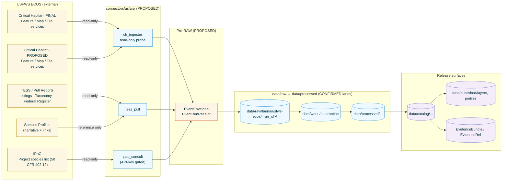
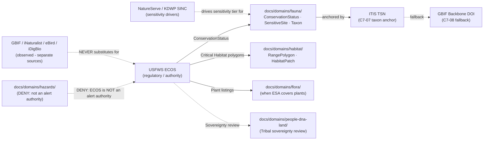

<!-- [KFM_META_BLOCK_V2]
doc_id: kfm://doc/source-catalog/usfws-ecos
title: USFWS ECOS — Source Catalog Entry
type: standard
version: v1.1
status: draft
owners: <OWNER:fauna-domain-steward>, <OWNER:habitat-domain-steward>, <OWNER:source-steward>
created: 2026-05-20
updated: 2026-05-23
policy_label: public
related:
  - docs/doctrine/directory-rules.md
  - docs/doctrine/lifecycle-law.md
  - docs/doctrine/trust-membrane.md
  - docs/standards/SENSITIVITY_RUBRIC.md
  - docs/standards/REDACTION_DETERMINISM.md
  - docs/runbooks/fauna/SOURCE_REFRESH_RUNBOOK.md
  - docs/domains/fauna/README.md
  - docs/domains/habitat/README.md
  - <PROPOSED> connectors/usfws/
  - <PROPOSED> data/registry/sources/usfws-ecos/
  - <PROPOSED> policy/sources/usfws/
  - <PROPOSED> policy/sensitivity/fauna/
adr_refs:
  - ADR-0001 (schema home)
  - <PROPOSED> ADR-S-04 (source-role vocabulary v1)
  - <PROPOSED> ADR-S-05 (sensitivity tier scheme T0–T4)
  - <PROPOSED> ADR-S-12 (connector cadence + quarantine recovery)
  - <PROPOSED> ADR-S-14 (cross-lane join policy)
tags: [kfm, source-catalog, fauna, habitat, federal-source, regulatory, esa, critical-habitat]
notes:
  - Path docs/sources/catalog/<source>.md is PROPOSED — catalog/ subfolder convention is not enumerated in Directory Rules §6.1 (see Open Questions Q-1).
  - Filename convention lowercase-with-hyphens is PROPOSED — docs/standards/ uses UPPERCASE-WITH-HYPHENS (Directory Rules §6.1.a). Q-2 remains open.
  - v1.1 — PROPOSED CORRECTION applied to fauna RangePolygon sensitivity tier per Atlas §24.5.2 + KFM-P20-PROG-0002 (T1 generalized public-safe is doctrine default; T0 was overclaimed in v1.0 of this page). See §6.2.
[/KFM_META_BLOCK_V2] -->

# USFWS ECOS — Source Catalog Entry

> KFM's source-catalog profile for the **U.S. Fish & Wildlife Service Environmental Conservation Online System (ECOS)** — the regulatory/authority anchor for federally listed threatened and endangered species, designated critical habitat, and project-consultation outputs that feed the **Fauna** and **Habitat** domains.

<!-- Top-of-file badge row. Placeholder targets — replace once badge generator (KFM-P3-FEAT-0005) is wired. -->

**Status:** `draft` &nbsp;·&nbsp; **Doc version:** `v1.1` &nbsp;·&nbsp; **Owners:** `<OWNER:fauna-domain-steward>`, `<OWNER:habitat-domain-steward>`, `<OWNER:source-steward>` &nbsp;·&nbsp; **Last updated:** 2026-05-23

> [!IMPORTANT]
> **The Federal Register rule is the legal source; ECOS is the carrier.** USFWS itself directs users to the textual description in the relevant final rule as the legal description of any designated critical habitat — not the ECOS mapper or its services. KFM ingests ECOS as a high-value **regulatory / authority** carrier, never as the sovereign description of a designation boundary. See [§7 Reality boundary](#7-reality-boundary-publication-rule).

> [!CAUTION]
> **PROPOSED CORRECTION from v1.0 of this page.** KFM Atlas §24.5.2 sets `Fauna — range polygon` default tier to **T1 (generalized public-safe)**, and `KFM-P20-PROG-0002` explicitly requires "geometry generalization and sensitivity labels before publication" for critical-habitat ingest. v1.0 of this page assigned **T0** to KFM-derived critical-habitat layers. v1.1 corrects this to **T1** (generalized public-safe) as the doctrine default, reserving T0 for direct ECOS-URL pass-through references that perform no transform. See [§6.2](#62-sensitivity-defaults). Final resolution belongs in **ADR-S-05** (sensitivity tier scheme).

---

## 📑 Contents

1. [Purpose & scope](#1-purpose--scope)
2. [Repo fit](#2-repo-fit)
3. [What ECOS is (one-screen brief)](#3-what-ecos-is-one-screen-brief)
4. [KFM source-role mapping](#4-kfm-source-role-mapping)
5. [In-scope ECOS surfaces](#5-in-scope-ecos-surfaces)
6. [Rights, sensitivity, and sovereignty](#6-rights-sensitivity-and-sovereignty)
7. [Reality boundary (publication rule)](#7-reality-boundary-publication-rule)
8. [Cadence & freshness posture](#8-cadence--freshness-posture)
9. [Pipeline shape (RAW → PUBLISHED)](#9-pipeline-shape-raw--published)
10. [SourceDescriptor profile (PROPOSED)](#10-sourcedescriptor-profile-proposed)
11. [Receipts, validators, and gate expectations](#11-receipts-validators-and-gate-expectations)
12. [Stale-state markers](#12-stale-state-markers)
13. [Cross-domain relations](#13-cross-domain-relations)
14. [Open questions](#14-open-questions)
15. [Related docs & ADR backlog](#15-related-docs--adr-backlog)
16. [Appendix A. External references](#appendix-a-external-references)

---

## 1. Purpose & scope

**CONFIRMED doctrine / PROPOSED implementation.** This page is KFM's source-catalog profile for the **USFWS Environmental Conservation Online System (ECOS)**: what role KFM assigns to ECOS, which ECOS surfaces are in scope, what source-role posture and sensitivity controls apply, what receipts and policy artifacts the ingest pipeline must emit, and what reality boundaries govern any ECOS-derived material before it reaches a public surface.

**In scope:**

- Species **listing**, **status**, and **taxonomy** records published through ECOS for federally listed species under the Endangered Species Act (ESA) — anchored in KFM to ITIS TSN with GBIF Backbone fallback (`C7-07`, `C7-08`).
- **Designated critical habitat** geometries (final and proposed) exposed via ECOS data services, ingested per `KFM-P20-PROG-0002` and operated read-only per `KFM-P22-PROG-0043`.
- **IPaC** (Information for Planning and Consultation) — official species lists associated with project locations, used as a regulatory cross-check; descriptor shape grounded in `KFM-P24-PROG-0002`.

**Out of scope** (each covered by a sibling source-catalog page, **PROPOSED**):

- NOAA Fisheries critical habitat (jointly administered ESA species; non-USFWS lead). → `<PROPOSED> docs/sources/catalog/noaa-fisheries-critical-habitat.md`
- NatureServe / state Natural Heritage rankings — sensitivity drivers, not regulatory authority. → `<PROPOSED> docs/sources/catalog/natureserve.md`
- KDWP state listings and SINC (Species in Need of Conservation). → `<PROPOSED> docs/sources/catalog/kdwp-tess.md`
- USFWS National Wetlands Inventory (NWI) — separate source family, separate catalog page. → `<PROPOSED> docs/sources/catalog/usfws-nwi.md`
- GBIF / iNaturalist / eBird / iDigBio occurrence aggregators — `observed` source role, not `regulatory`. → `<PROPOSED> docs/sources/catalog/gbif.md` and siblings.

[Back to top](#top)

---

## 2. Repo fit

> [!NOTE]
> All repo paths below are **PROPOSED** unless explicitly marked CONFIRMED. The mounted repo is not inspected in this session; placement claims are subject to `docs/doctrine/directory-rules.md` and any superseding ADR. The *KFM Repository Structure Guiding Document* (v0.2) confirms several canonical roots at commit `b6a27916…` but does not enumerate `docs/sources/catalog/`.

| Aspect | Value | Status |
|---|---|---|
| This file | `docs/sources/catalog/usfws-ecos.md` | **PROPOSED — `catalog/` subfolder convention is not enumerated in Directory Rules §6.1; see [Q-1](#14-open-questions).** |
| Sibling catalog pages | `docs/sources/catalog/<source>.md` | **PROPOSED** |
| Upstream doctrine | `docs/doctrine/directory-rules.md` · `docs/doctrine/lifecycle-law.md` · `docs/doctrine/trust-membrane.md` | **CONFIRMED doctrine references** (Directory Rules §6.1 lists `docs/doctrine/`); per-file presence **NEEDS VERIFICATION** in mounted repo. |
| Standards references | `docs/standards/SENSITIVITY_RUBRIC.md` · `docs/standards/REDACTION_DETERMINISM.md` | **PROPOSED in corpus** (Pass-10 C6-01, C6-03); not yet authored. |
| Downstream connector | `connectors/usfws/` | **PROPOSED — `connectors/` canonical root CONFIRMED at commit `b6a279…`** *(per KFM Repo Structure Guiding Document)*; **USFWS sub-path NEEDS VERIFICATION**. |
| Downstream pipeline | `pipelines/ingest/` · `pipelines/normalize/` · `pipelines/validate/` · `pipelines/catalog/` | **CONFIRMED canonical lanes** per Directory Rules §7.4; **PROPOSED** specific USFWS adapter homes. |
| Source-registry entry | `data/registry/sources/usfws-ecos/` | **PROPOSED** — registry path conforms to Directory Rules; presence **NEEDS VERIFICATION**. |
| Rights / sensitivity policy | `policy/sources/usfws/` · `policy/sensitivity/fauna/` | **PROPOSED** — per-source policy homes are PROPOSED in corpus; **NEEDS VERIFICATION**. |
| Schema home | `schemas/contracts/v1/source/source-descriptor.json` | **PROPOSED canonical home** per Directory Rules §7.4 / ADR-0001; **NEEDS VERIFICATION** of exact filename. |
| Domain readers | `docs/domains/fauna/` · `docs/domains/habitat/` | **CONFIRMED in Directory Rules §6.1 domain list**; per-domain README contents **NEEDS VERIFICATION**. |
| Runbook | `docs/runbooks/fauna/SOURCE_REFRESH_RUNBOOK.md` | **CONFIRMED authored (prior session)**; subfolder convention **NEEDS VERIFICATION** (Directory Rules §18 OPEN-DR-02). |

[Back to top](#top)

---

## 3. What ECOS is (one-screen brief)

**EXTERNAL.** ECOS (Environmental Conservation Online System) is the USFWS-operated gateway through which the Service publishes data about federally listed Threatened and Endangered (T&E) species and their critical habitat designations. The system provides a central point of access to data systems in the Endangered Species and Fisheries and Habitat Conservation program areas and to other FWS and government data sources, and distributes a variety of T&E-related reports. Critical-habitat distribution uses ESRI ArcGIS Feature / Map / Tile Services for both final and proposed designations; species, listing, and taxonomy data are served via Pull Reports and REST with HTML / XML / JSON / CSV export, and a Data Explorer permits joining, filtering, sorting, and export.

**EXTERNAL.** The IPaC tool — closely associated with ECOS — is the official mechanism for obtaining a project-scoped species list. USFWS directs project proponents to use the IPaC Initial Project Scoping tool to identify project location and receive an official species list pursuant to 50 CFR 402.12 of T&E species to be considered when evaluating potential impacts.

**KFM posture (CONFIRMED doctrine / PROPOSED implementation).** KFM treats ECOS as a **federal regulatory and authority** source family for the Fauna and Habitat domains — it carries the *legal status* of a species and the *designated geometry* of its critical habitat, both of which originate in Federal Register rules. ECOS is **not** an observation source (it does not record where individual animals were seen), and KFM does not let ECOS substitute for observed-occurrence sources (GBIF / iNaturalist / eBird / iDigBio) or for state heritage rankings (KDWP / NatureServe). This is the operational expression of `KFM-P20-IDEA-0001` — "USFWS ECOS, NatureServe, and GBIF should be modeled as distinct authoritative and corroborative source-role families for species, habitat, status, and occurrence evidence."

[Back to top](#top)

---

## 4. KFM source-role mapping

**CONFIRMED enum** (Atlas §24.1.1 canonical source-role classes; vocabulary stability governed by **ADR-S-04**):
`observed | regulatory | modeled | aggregate | administrative | candidate | synthetic`.

**PROPOSED** mapping of each in-scope ECOS surface into the KFM source-role vocabulary:

| ECOS surface | KFM `source_role` | `role_authority` | KFM evidence class | Sensitivity default (T0–T4) |
|---|---|---|---|---|
| ESA listing & status records (TESS / Pull Reports) | `regulatory` | `U.S. Fish & Wildlife Service` | `ConservationStatus` (Fauna; also Flora when applicable) | **T0** — status text is public regulatory metadata; no geometry sensitivity. |
| Designated critical habitat — **final** (Feature/Map/Tile) | `regulatory` | `U.S. Fish & Wildlife Service` | `RangePolygon` (Habitat domain owns) | **T1 — generalized public-safe** *(PROPOSED CORRECTION; see §6.2)*. Sensitive joins to precise rare-species occurrences fail closed at **T4**. |
| Designated critical habitat — **proposed** (Feature/Map/Tile) | `regulatory` (provisional) | `U.S. Fish & Wildlife Service` | `RangePolygon` flagged `proposed` | **T1** with a `provisional` badge and a Federal-Register-watcher hook. |
| IPaC project species list | `regulatory` | `U.S. Fish & Wildlife Service` (per-project consultation) | `ConsultationRecord` (**PROPOSED** object) referencing `ConservationStatus` items | **T2** by default — project-scoped lists may reveal sensitive project intent even when their constituents are public; promotion to T0 requires explicit policy review. |
| ECOS species profile narrative content | `administrative` | `U.S. Fish & Wildlife Service` | Text / link evidence in `EvidenceBundle` | **T0** for direct quotes / cited URLs. |
| Refined T&E range maps (USFWS SOP-bound derivative) | `regulatory` (derived authority) | `U.S. Fish & Wildlife Service` | `RangePolygon` flagged `refined` | **T1** with explicit SOP citation; never collapsed with raw critical-habitat polygons. |

> [!IMPORTANT]
> **Source-role is set at admission and never edited in place.** A corrected role produces a new `SourceDescriptor` and a `CorrectionNotice` per Atlas §24.1.3. Treating an ECOS regulatory layer as observation-grade evidence is a **DENIED** action at the runtime trust membrane — it is the canonical example of *"regulatory layer cited as a per-place truth"* called out in the Atlas anti-collapse register §24.1.2 (`DENY publication of regulatory layer as event evidence`).

[Back to top](#top)

---

## 5. In-scope ECOS surfaces

**PROPOSED diagram semantics.** Connectors are **read-only probes** (per `KFM-P22-PROG-0043` — "critical-habitat probes should operate read-only, fail closed for uncertain observations, and produce process memory rather than release proof"). Connectors emit **pre-RAW `EventEnvelope` / `EventRunReceipt`** *(v0.2 of the connector README contract)* before any data lands in `data/raw/`. Connectors **never** write to `data/processed/`, `data/catalog/`, or `data/published/` — that boundary is enforced by Directory Rules §7.3 and §9.

[Back to top](#top)

---

## 6. Rights, sensitivity, and sovereignty

### 6.1 Rights posture

- **EXTERNAL.** USFWS materials produced by federal employees in the course of their official duties are U.S. government works and are generally not subject to U.S. copyright (per 17 U.S.C. §105). KFM nevertheless preserves attribution to USFWS and to the controlling Federal Register citation for every regulatory artifact.
- **EXTERNAL.** USFWS explicitly disclaims warranty on the spatial data: the Service gives no warranty, expressed or implied, as to the accuracy, reliability, or completeness of these data and is not liable for improper or incorrect use. KFM carries this disclaimer forward verbatim on any derived public layer's metadata page.
- **NEEDS VERIFICATION.** API-key requirements and rate-limit terms for IPaC consultations (PROPOSED in `KFM-P24-PROG-0002`) must be confirmed against the current ECOS terms and any KFM-side credential management before the IPaC connector is enabled. The credential-management path itself is **PROPOSED** under `policy/sources/usfws/`.

### 6.2 Sensitivity defaults

> [!CAUTION]
> **PROPOSED CORRECTION (v1.1):** Atlas §24.5.2 sets the default tier for `Fauna — range polygon` to **T1 (generalized public-safe)**, and `KFM-P20-PROG-0002` requires "geometry generalization and sensitivity labels before publication" for critical-habitat ingest. v1.0 of this page assigned **T0** to KFM-derived critical-habitat layers; v1.1 corrects this to **T1**. T0 is reserved for direct ECOS-URL pass-through references (where KFM does not republish geometry and instead links to the upstream service). Final resolution belongs in **ADR-S-05** (sensitivity tier scheme).

| KFM object derived from ECOS | Default tier (v1.1) | Rationale | Required release artifact |
|---|---|---|---|
| `ConservationStatus` (federal listing record) | **T0** | Public regulatory text/list metadata; no geometry sensitivity. | Standard Gates A–G. |
| `RangePolygon` from **final** critical habitat (KFM-derived) | **T1** *(corrected from v1.0)* | Atlas §24.5.2 doctrine default for fauna range polygons; `KFM-P20-PROG-0002` requires generalization before publication. | Standard Gates A–G + `TransformReceipt` (projection/generalization) + USFWS no-warranty banner + Reality-Boundary Note. |
| `RangePolygon` from **proposed** critical habitat (KFM-derived) | **T1** with `provisional` badge | Same as above + provisional status; subject to change before final rule. | Standard Gates A–G + `provisional` UI affordance + Federal-Register-watcher hook; stale-state policy on rule supersession. |
| Direct ECOS-URL pass-through (no KFM republication) | **T0** | Link only; KFM performs no transform; user receives upstream rights/warranty in situ. | None KFM-specific beyond citation. |
| `ConsultationRecord` from IPaC | **T2** (default) | Project-scoped lists may reveal sensitive project intent; promote to lower tier only under explicit policy review. | `PolicyDecision` + (if downgraded) `RedactionReceipt`. |
| Join of `RangePolygon` × precise rare-species `Occurrence` | **T4** at the join | **Sensitive-occurrence join risk** — even when both inputs are public, the join can expose precise locations. | **Deny by default** per `KFM-P24-IDEA-0002`; geoprivacy generalization + `RedactionReceipt` + `ReviewRecord` to release any derivative; cross-lane join policy governed by **ADR-S-14**. |

> [!CAUTION]
> **"Sensitive joins fail closed" is the operative rule for every ECOS-derived layer.** The KFM Atlas (`Domains v1.1`, fauna §D and habitat §D) tags `USFWS ECOS / critical habitat services` and `USFWS ECOS-like federal sources` as families whose *"rights and current terms NEEDS VERIFICATION; sensitive joins fail closed."* That posture is binding here. Treat any join of an ECOS regulatory polygon with sensitive occurrence data as **T4 until explicitly approved**, regardless of how innocuous the join looks.

### 6.3 Tribal sovereignty considerations

> [!WARNING]
> **EXTERNAL.** The 2020 USFWS critical-habitat rule revision (Federal Register) explicitly engages Tribal sovereignty under Secretarial Order 3206 — *American Indian Tribal Rights, Federal-Tribal Trust Responsibilities, and the Endangered Species Act* (June 5, 1997) — which confirms trust responsibilities to Tribes, recognizes Tribal sovereign authority over Tribal lands, and directs FWS to consult with Tribes on a government-to-government basis. KFM derivatives that visualize critical habitat on or near Tribal lands must respect any sovereignty-related withholding decisions recorded against the parent rule. **PROPOSED:** a `sovereignty_review` flag in the `SourceDescriptor` that, when `true`, forces the policy runtime to route the layer through a steward review before publication (see [§10](#10-sourcedescriptor-profile-proposed)).

[Back to top](#top)

---

## 7. Reality boundary (publication rule)

> [!IMPORTANT]
> **The Federal Register rule is the legal description; ECOS is the carrier.** USFWS itself states that graphical representations provided by the use of these data do not represent a legal description of the critical habitat boundary; the user is referred to the critical-habitat textual description in the appropriate final rule for the species as published in the Federal Register. KFM enforces this as a **Reality Boundary** on every published critical-habitat artifact: the viewer surface must link to the Federal Register citation, and Focus-Mode AI answers about critical-habitat boundaries must **cite-or-abstain** to the Federal Register rule, never to the polygon alone.

> [!IMPORTANT]
> **ECOS mapper completeness caveat.** USFWS notes that the designated critical habitat displayed in the mapper does **not** represent all of the critical habitat designated by the Service — only digitized critical habitat submitted into the system is available. KFM treats absence in the ECOS feature service as **UNKNOWN**, not as "no critical habitat exists." Any "no critical habitat here" claim in a KFM surface requires a positive Federal-Register-backed negative finding, not the absence of an ECOS polygon.

[Back to top](#top)

---

## 8. Cadence & freshness posture

Cadence governance falls under **ADR-S-12 (Connector cadence and quarantine recovery)** for the connector lane and **ADR-S-10 (Stale-state propagation)** for downstream claims.

| Surface | Native cadence | KFM fetch cadence (PROPOSED) | Stale-state trigger | Required action on stale |
|---|---|---|---|---|
| Critical Habitat — final (Feature/Tile) | Rule-driven (changes when a final rule publishes) | Weekly watcher poll + Federal Register watcher | New final rule cites a species whose ECOS polygon has not refreshed | Re-admit; emit `CorrectionNotice` if dependent layers changed |
| Critical Habitat — proposed (Feature/Tile) | Rule-driven (proposed-rule publication) | Weekly watcher poll | Proposed → final transition without KFM refresh | Re-admit; rebind viewer badge from `provisional` to `final` |
| TESS / listing pull | Updated whenever the ESA list changes (irregular) | Daily watcher; refresh on Federal Register listing trigger | A species changes status (delisted, reclassified, newly listed) since the last admission | Re-admit; supersede `ConservationStatus` records |
| IPaC consultation | Per-project; no global cadence | On demand only (user-initiated consultations) | Stored consultation older than review-cycle tolerance | Re-consult before any project-grade publication |

> [!TIP]
> **PROPOSED `freshness_badge` behavior.** Per `KFM-P3-FEAT-0005`, the freshness badge on this page renders the timestamp of the most recent successful ingest run. While `connectors/usfws/` is unimplemented, the badge is a `TODO` placeholder; the doc itself is **not evidence** that an ingest has occurred.

> [!TIP]
> **HTTP-validator receipts.** Per the *KFM Repo Structure Guiding Document* (v0.2), connectors emit HTTP-validator receipt checks — ETag, Last-Modified, content-length, manifest checksums — as part of the connector-gate test set. ECOS-side ETag/Last-Modified semantics are **NEEDS VERIFICATION** before relying on them for conditional GETs.

[Back to top](#top)

---

## 9. Pipeline shape (RAW → PUBLISHED)

**CONFIRMED doctrine** (Directory Rules; lifecycle invariant `RAW → WORK/QUARANTINE → PROCESSED → CATALOG/TRIPLET → PUBLISHED`) **/ PROPOSED USFWS-specific application:**

| Stage | Handling | Gate | Status |
|---|---|---|---|
| **Pre-RAW (PROPOSED)** | Connector emits `EventEnvelope` + `EventRunReceipt` for each material-change event (ETag/Last-Modified watcher); receipts pin tool versions and HTTP validators. | `EventRunReceipt` written; no `data/raw/` write yet if no material change. | **PROPOSED** *(v0.2 connector contract)* |
| **RAW** | Capture immutable ECOS payload (feature-service GeoJSON, ESRI JSON, REST CSV/JSON) into `data/raw/fauna/usfws-ecos/<run_id>/` with citation, fetch time, source URI, response checksum, and `SourceDescriptor` reference. | `SourceDescriptor` exists (Gate A); ingest receipt emitted. | **PROPOSED** |
| **WORK / QUARANTINE** | Normalize schema, geometry (re-project to canonical CRS), time (admission vs. rule effective date), identity (species → ITIS TSN + GBIF Backbone crosswalk per `C7-07`/`C7-08`), and policy gates. Records with missing rule citation or unparseable geometry → quarantine with reason. | Validation + policy gate pass (Gates A–D), **or** quarantine reason recorded. | **PROPOSED** |
| **PROCESSED** | Emit validated normalized `ConservationStatus`, `RangePolygon`, and (where applicable) `ConsultationRecord` objects + `TransformReceipt` + public-safe candidates. | `EvidenceRef` resolvable (Gate E); `ValidationReport` closed; digest closure exists. | **PROPOSED** |
| **CATALOG / TRIPLET** | Emit catalog records (STAC item, DCAT distribution, PROV lineage), `EvidenceBundle`, graph/triplet projections, and release candidates. | Catalog closure passes (Gate F); bundle hashes recorded. | **PROPOSED** |
| **PUBLISHED** | Release public-safe layers (PMTiles, GeoParquet, API payloads) under `data/published/` only after `PromotionDecision` and `ReleaseManifest`. Sensitive joins denied at runtime. | `PromotionDecision` + `ReleaseManifest` + sensitivity policy pass (Gate G). | **PROPOSED** |

**Promotion Gates A–G** (per Atlas §24.6.1 and the *KFM Unified Implementation Architecture Build Manual* §6.2) apply uniformly. The USFWS-specific obligations are:

- **Reality Boundary check** at Gate F: every published critical-habitat polygon links to its Federal Register citation.
- **Mapper completeness banner** at Gate G: the viewer surface declares that *absence in ECOS ≠ absence in law*.
- **Provisional badge** at Gate G: proposed-designation layers carry a `provisional` UI affordance and a Federal-Register-watcher hook.
- **Sensitive-join deny** at Gate C: cross-lane joins with precise rare-species occurrences default to DENY pending **ADR-S-14**.

[Back to top](#top)

---

## 10. SourceDescriptor profile (PROPOSED)

**PROPOSED descriptor shape for ECOS source admissions.** This is illustrative — the canonical schema home defaults to `schemas/contracts/v1/source/source-descriptor.json` per Directory Rules §7.4 and ADR-0001, unless an accepted ADR relocates it. Field names below align with Atlas §24.1.3 (source-role-to-descriptor mapping) and are **PROPOSED** until verified against the mounted schema; the source-role vocabulary itself is governed by **ADR-S-04**.

<b>Click to expand — descriptor field set</b>

| Field | Type / vocabulary | Required? | USFWS ECOS value (PROPOSED) |
|---|---|---|---|
| `source_id` | string (kfm: namespace) | MUST | `kfm:src:usfws-ecos:<surface>:<run_id>` (e.g., `kfm:src:usfws-ecos:critical-habitat-final:2026-05-23T1200Z`) |
| `source_role` | enum (Atlas §24.1.1) | MUST | `regulatory` |
| `role_authority` | string | MUST when role ∈ {regulatory, modeled, aggregate} | `"U.S. Fish & Wildlife Service"` |
| `authority_uri` | URI | MUST | `https://ecos.fws.gov/ecp/` (gateway) + per-surface service URL |
| `rights` | structured | MUST | `{ jurisdiction: "US", basis: "17 U.S.C. §105 (federal work)", disclaimer: "<USFWS no-warranty text verbatim>" }` |
| `sensitivity` | enum (T0–T4 per Atlas §24.5.1) | MUST | Per [§6.2](#62-sensitivity-defaults) — default **T1** for KFM-derived CH layers; T0 for status text; T2 for IPaC; T4 at sensitive joins. |
| `cadence` | structured | MUST | `{ native: "rule-driven", kfm_fetch: "weekly + FR-trigger", tolerance: "<DURATION>" }` *(governed by ADR-S-12)* |
| `provenance` | structured (citation) | MUST | Federal Register citation for governing rule(s) + ECOS service URL + fetch timestamp |
| `ingest_hash` | hex string (BLAKE3 or SHA-256; per-family hash policy KFM-P4-PROG-0003) | MUST | Computed over the canonicalized response payload |
| `geometry_canonicalization` | structured | MUST when source emits geometry | `{ crs_in: "<source>", crs_out: "EPSG:4326", normalization: "JCS+round" }` |
| `taxon_anchor` | structured | MUST when source carries species | `{ primary: "ITIS TSN" (C7-07), fallback: "GBIF Backbone" (C7-08, DOI 10.15468/39omei) }` |
| `reality_boundary_note_ref` | EvidenceRef | MUST for critical-habitat surfaces | Link to a `RealityBoundaryNote` declaring the Federal Register rule as the legal source |
| `mapper_completeness_note` | string | MUST for critical-habitat surfaces | Verbatim USFWS caveat about the ECOS mapper not representing all designated critical habitat |
| `sovereignty_review` | boolean | MUST | `false` by default; `true` triggers Tribal-sovereignty review path per [§6.3](#63-tribal-sovereignty-considerations) |
| `superseded_by` | source_id or null | MUST | `null` at admission; populated when a later descriptor replaces this one |
| `pre_raw_event_ref` | EvidenceRef → `EventRunReceipt` | SHOULD | Pre-RAW change-event receipt for this admission *(v0.2 connector contract)* |

> [!NOTE]
> Field names above are **PROPOSED**. An ADR or accepted schema PR would be the authoritative resolution. This descriptor profile should be re-validated against any mounted `SourceDescriptor` schema before the connector emits live admissions.

[Back to top](#top)

---

## 11. Receipts, validators, and gate expectations

**CONFIRMED doctrine** (Atlas §24.2 Master Receipt Catalog) **/ PROPOSED USFWS application.** Every consequential operation against ECOS data emits a receipt; absence of the receipt means the operation did not happen in the governed sense.

| Receipt / artifact | Triggered by | Required content |
|---|---|---|
| `SourceDescriptor` | ECOS source admission | Fields per [§10](#10-sourcedescriptor-profile-proposed). |
| `EventEnvelope` / `EventRunReceipt` | Pre-RAW material-change event (ETag / Last-Modified change) | `source_uri`, change indicators, HTTP-validator state, tool versions. |
| `IngestReceipt` | Successful read-only fetch from any ECOS surface | `source_uri`, `fetch_time`, `response_checksum`, `run_id`, `gate_result`. |
| `TransformReceipt` (Projection / Generalization) | Re-projection of critical-habitat polygons; any geometry simplification | `input_geom_hash`, `output_geom_hash`, `transform`, `parameters`, `tolerance`. |
| `ValidationReport` | Validator suite run | Per-rule pass/fail; quarantine reasons; identity-anchor coverage (ITIS / GBIF). |
| `RedactionReceipt` | Any geoprivacy generalization when joining ECOS layers with sensitive occurrence sources | `policy_ref`, `redaction_method`, `kept_fields`, `removed_fields`, `geometry_transform`, `reviewer`. |
| `AggregationReceipt` | Roll-ups (county / HUC / ecoregion) over ECOS layers | `geometry_scope`, `aggregation_unit`, `denominator_basis`. |
| `RealityBoundaryNote` | Every critical-habitat catalog item | Federal Register citation + USFWS no-warranty text + mapper-completeness caveat. |
| `PolicyDecision` | Every promotion gate decision (especially sensitive joins) | `policy_id`, `decision` ∈ {ALLOW, DENY, RESTRICT, HOLD, ABSTAIN}, `reason_code`, `evidence_refs`. |
| `PromotionDecision` / `PromotionReceipt` | Promotion to PROCESSED, CATALOG, or PUBLISHED | Gate set passed, evidence refs, release/rollback target, steward and reviewer identities. |
| `ReleaseManifest` | Promotion to `data/published/` | Layer list + rollback target + signers per separation-of-duties matrix. |
| `AIReceipt` | Any Focus Mode answer that cites ECOS-derived material | Cite-or-abstain trace; `EvidenceBundle` references; reality-boundary check. |
| `CorrectionNotice` | Federal Register supersession; taxon authority drift; rights change | Prior state, new state, reason, downstream invalidation hooks. |

**PROPOSED validators** (would live under `tools/validators/source_descriptor/usfws/` and `tools/validators/connector_gate/usfws/`):

- `usfws_ecos_descriptor_present` — every admission has a complete `SourceDescriptor`.
- `usfws_critical_habitat_reality_boundary` — every CH polygon catalog item links to a Federal Register rule.
- `usfws_mapper_completeness_banner` — every published CH layer carries the mapper-completeness caveat.
- `usfws_sensitive_join_denied` — joins of CH polygons × precise rare-species occurrences default to DENY.
- `usfws_ipac_api_key_gate` — IPaC consultations require the documented credential path; raw consultations without an API-key trace are quarantined.
- `usfws_taxon_anchor_coverage` — every species record carries ITIS TSN, or GBIF Backbone with the documented fallback rationale (per `C7-07` / `C7-08`).
- `usfws_provisional_badge` — proposed-designation layers carry the `provisional` flag on the released `LayerManifest`.
- `usfws_no_warranty_banner` — every published layer's metadata page carries the USFWS no-warranty text verbatim.

> [!TIP]
> Per Directory Rules and the *KFM Repository Structure Guiding Document* §`tools/`, validators **must exercise the negative-state paths** (DENY / ABSTAIN / ERROR). A USFWS validator that only asserts "happy-path passes" is incomplete by KFM standards; required fixtures include a stale-source negative, a missing-rule-citation quarantine case, and a sensitive-join deny case.

[Back to top](#top)

---

## 12. Stale-state markers

Per Atlas §24.8.1, USFWS-derived claims become **stale** before they become **wrong**. Both states are visible and traceable.

| Marker | Triggered by | Required action |
|---|---|---|
| **Source freshness expired** | KFM fetch cadence (§8) passed without a new admission. | Re-admit or supersede; otherwise mark dependent claims stale. |
| **Federal Register rule supersession** | A final rule cites a species whose ECOS polygon has not refreshed. | Re-admit; emit `CorrectionNotice` if any dependent layer's geometry changes. |
| **Proposed → Final transition** | A proposed designation publishes as a final rule. | Re-admit; remove `provisional` badge; rebind dependent `EvidenceBundle`s. |
| **Taxon authority drift** | ITIS or GBIF Backbone updates a taxon that ECOS still references under an older name. | Refresh taxon crosswalk; reconcile or flag; do not silently rename in published layers. (Per `C7-07` open question: ITIS/GBIF tie-breaker policy is still **PROPOSED**.) |
| **GBIF Backbone DOI version bump** | A new GBIF Backbone snapshot is published (DOI 10.15468/39omei versions). | Pin new DOI; rerun crosswalk; emit `CorrectionNotice` only if higher classification changed. |
| **Rights / terms changed** | USFWS modifies access terms or disclaimers. | Re-evaluate sensitivity tier; potentially downgrade; emit `CorrectionNotice`. |
| **Review aged out** | `ReviewRecord` on a sensitive ECOS-derived layer older than the review-cycle tolerance. | Trigger steward review; possibly downgrade tier. |

[Back to top](#top)

---

## 13. Cross-domain relations

| Domain | Relation | Constraint |
|---|---|---|
| **Fauna** | Owns `ConservationStatus` records derived from ECOS listings; cross-references precise occurrences from `observed`-role sources. | Sensitive-occurrence joins fail closed (T4 default). |
| **Habitat** | Owns `RangePolygon` records derived from ECOS critical habitat (KFM-derived T1 default). | Federal Register is the legal source; ECOS is the carrier. |
| **Flora** | Owns plant `ConservationStatus` when ESA listing applies to plants. | Same reality-boundary rule. |
| **People / DNA / Land** | Receives sovereignty-review flag when CH overlaps Tribal lands. | Tribal data sovereignty (per S.O. 3206) governs review. |
| **Hazards** | **No relation.** ECOS is not a hazards-alert authority. | Any AI/UI surface that cites ECOS as an alert authority is **denied** at the trust membrane. |
| **NatureServe / KDWP SINC** | Drive *sensitivity tier* for fauna/flora species in KFM, not regulatory status. | Heritage rankings (S1/S2) → tier escalation; never substitute for ESA listing. |
| **GBIF / iNaturalist / eBird / iDigBio** | Provide `observed`-role occurrence evidence; cross-referenced for corroboration. | Observation roles never relabel as regulatory; aggregator restricted-use terms (e.g., eBird EBD) apply. |
| **ITIS TSN (C7-07)** | Primary taxon anchor for every fauna species record. | `taxon_anchor.primary` MUST resolve to ITIS or carry GBIF Backbone fallback rationale. |
| **GBIF Backbone (C7-08)** | International / fallback taxon anchor; versioned via DOI 10.15468/39omei. | Backbone DOI version pinned in the receipt; tie-breaker policy **PROPOSED** (`C7-07` open question). |

[Back to top](#top)

---

## 14. Open questions

> [!NOTE]
> Open questions belong in `docs/registers/VERIFICATION_BACKLOG.md` once that register is current. They are surfaced here so the source-catalog page itself remains the local index of unknowns.

| # | Question | Class | Suggested resolution |
|---|---|---|---|
| Q-1 | Is `docs/sources/catalog/` the right subfolder for per-source catalog pages, or should they live flat under `docs/sources/`? Directory Rules §6.1 lists `docs/sources/` but does not enumerate a `catalog/` child. | **NEEDS VERIFICATION** | ADR-class (Directory Rules §2.4(2)). Until resolved, this file is **PROPOSED** placement. |
| Q-2 | What is the canonical filename casing for source-catalog pages? `docs/standards/` uses UPPERCASE-WITH-HYPHENS per §6.1.a; this page uses lowercase-with-hyphens. | **NEEDS VERIFICATION** | Defer to the broader naming ADR (Directory Rules §18 OPEN-DR-04). |
| Q-3 | Should KFM cache or re-publish USFWS critical-habitat tile services, or always link to the upstream USFWS tile endpoint? | **PROPOSED** | Author an ADR comparing cache vs. live; default to live with a stale-tile fallback. Material to **ADR-S-12** scope. |
| Q-4 | What is the credential-management path for IPaC API keys? `kfm_repository_structure_guiding_document.md` references `data/registry/sources/` and `policy/sources/` but not credentials. | **NEEDS VERIFICATION** | Author a credentials policy under `policy/sources/usfws/` (PROPOSED) and reference it here. |
| Q-5 | Does the mounted repo already contain `connectors/usfws/` with any of: `ch_ingester`, `tess_pull`, `ipac_consult`? | **UNKNOWN** | Inspect repo; update the [§2 Repo fit](#2-repo-fit) table accordingly. |
| Q-6 | Should refined T&E range maps (USFWS SOP-bound derivative) be treated as a separate `source_role = regulatory` admission, or as a derivative of the underlying CH polygon? | **PROPOSED** | Decision belongs in an ADR on derivative-authority handling; defaulting to "separate admission with provenance link" until decided. |
| Q-7 | What is the policy when an ECOS species record references a taxon name that ITIS lacks but GBIF Backbone has? `C7-07` doctrine accepts GBIF fallback; this page should record the per-source fallback explicitly. | **NEEDS VERIFICATION** | Author the ITIS/GBIF tie-breaker policy (C7-07 expansion direction); reference from this page. |
| Q-8 | **(new in v1.1)** Is the corrected sensitivity tier for KFM-derived critical-habitat layers **T1** (per Atlas §24.5.2 + `KFM-P20-PROG-0002`) or **T0** (per the v1.0 reading of "polygon is already federal-public")? | **PROPOSED CORRECTION** | **ADR-S-05** (sensitivity tier scheme). v1.1 of this page assumes T1 default; ADR may confirm or amend. |
| Q-9 | **(new in v1.1)** Should the connector emit pre-RAW `EventEnvelope` / `EventRunReceipt` for ECOS surfaces, or fold material-change detection into the IngestReceipt? | **PROPOSED** | Aligns with v0.2 connector contract in the *KFM Repo Structure Guiding Document*; final shape pending **ADR-S-12**. |
| Q-10 | **(new in v1.1)** What is the cross-lane join policy for ECOS critical-habitat × occurrence joins? Default DENY is assumed here; ADR resolution may permit narrowly-scoped joins under steward review. | **PROPOSED** | **ADR-S-14** (cross-lane join policy). |

[Back to top](#top)

---

## 15. Related docs & ADR backlog

### 15.1 Related docs

> [!NOTE]
> Links below mix **CONFIRMED-authored** docs (prior session) with **PROPOSED-in-corpus** docs that are not yet authored. Anchors are best-effort; expect breakage on those marked `TODO`.

- [`docs/doctrine/directory-rules.md`](../../doctrine/directory-rules.md) — **CONFIRMED doctrine** for path placement.
- [`docs/doctrine/lifecycle-law.md`](../../doctrine/lifecycle-law.md) — **CONFIRMED in §6.1 docs/doctrine tree**; presence **NEEDS VERIFICATION**.
- [`docs/doctrine/trust-membrane.md`](../../doctrine/trust-membrane.md) — **CONFIRMED in §6.1 docs/doctrine tree**; presence **NEEDS VERIFICATION**.
- `docs/standards/SENSITIVITY_RUBRIC.md` — **PROPOSED in corpus** (Pass-10 `C6-01`); referenced for the T0–T4 tier framework.
- `docs/standards/REDACTION_DETERMINISM.md` — **PROPOSED in corpus** (Pass-10 `C6-03`); referenced for the geoprivacy machinery.
- [`docs/runbooks/fauna/SOURCE_REFRESH_RUNBOOK.md`](../../runbooks/fauna/SOURCE_REFRESH_RUNBOOK.md) — **CONFIRMED authored (prior session)**; refresh procedure for fauna sources including USFWS.
- `docs/domains/fauna/README.md` — **PROPOSED**; `ConservationStatus` & sensitive-occurrence semantics.
- `docs/domains/habitat/README.md` — **PROPOSED**; `RangePolygon` & critical-habitat semantics.
- `docs/sources/catalog/natureserve.md` — **TODO** (sibling source catalog).
- `docs/sources/catalog/kdwp-tess.md` — **TODO** (sibling source catalog).
- `docs/sources/catalog/gbif.md` — **TODO** (sibling source catalog).
- `docs/sources/catalog/usfws-nwi.md` — **TODO** (sibling source catalog for the National Wetlands Inventory).
- `docs/sources/catalog/noaa-fisheries-critical-habitat.md` — **TODO** (joint-ESA species lead by NOAA, not USFWS).

### 15.2 Relevant ADRs (open)

| ADR | Title (PROPOSED) | Why it matters here |
|---|---|---|
| ADR-0001 | Schema home (`schemas/contracts/v1/...`) | Source-descriptor canonical home. |
| ADR-S-04 | Source-role vocabulary v1 | Stability of the `regulatory` / `observed` / `aggregate` / `administrative` distinction this page depends on. |
| ADR-S-05 | Sensitivity tier scheme (T0–T4) | Resolves the T0-vs-T1 question for KFM-derived critical-habitat layers ([Q-8](#14-open-questions)). |
| ADR-S-12 | Connector cadence + quarantine recovery | Governs cadence and pre-RAW event policy for ECOS surfaces. |
| ADR-S-14 | Cross-lane join policy | Governs the sensitive-join DENY default for CH × occurrence ([Q-10](#14-open-questions)). |
| ADR-S-10 | Stale-state propagation | Governs downstream stale-state behavior when a Federal Register rule supersedes an ECOS polygon. |

### 15.3 Related KFM Idea-Index cards

| Stable ID | Statement (normalized) | Bearing on this page |
|---|---|---|
| `KFM-P20-IDEA-0001` | Biodiversity source hierarchy as source-role registry | Doctrinal basis for treating ECOS, NatureServe, and GBIF as distinct source-role families. |
| `KFM-P20-PROG-0001` | ECOS / NatureServe / GBIF source descriptor set | Doctrinal basis for the descriptor profile in [§10](#10-sourcedescriptor-profile-proposed). |
| `KFM-P20-PROG-0002` | Critical-habitat Feature Service ingester | Doctrinal basis for ingesting CH with **geometry generalization + sensitivity labels before publication** — drives the T1 default in [§6.2](#62-sensitivity-defaults). |
| `KFM-P22-PROG-0043` | USFWS critical-habitat read-only probe | Connectors operate read-only; fail closed for uncertain observations; produce process memory, not release proof. |
| `KFM-P24-PROG-0002` | USFWS IPaC source descriptor | API-key gating; consultation-id fields. |
| `KFM-P24-IDEA-0002` | Sensitive species deny-by-default posture | Justifies the T4-at-join default for CH × precise-occurrence. |
| `KFM-P25-IDEA-0006` | Sensitive fauna precision degradation | Geoprivacy generalization rule on which the redaction receipts depend. |
| `KFM-P1-IDEA-0051` | Knowledge-character labels (observed, modeled, regulatory…) | Source-role anti-collapse is a first-class identity attribute. |
| `C7-07` / `C7-08` | ITIS TSN / GBIF Backbone | Taxon anchor with documented fallback. |
| `C10-06` | Biodiversity stack (GBIF, iNaturalist, eBird, NatureServe, USFWS, iDigBio, Symbiota, KU NHM, FHSU Sternberg) | Names the surrounding source ecosystem this page sits inside. |

[Back to top](#top)

---

## Appendix A. External references

<b>Click to expand — external sources consulted (preserved from v1.0; re-verification this session NOT performed)</b>

All references below are **EXTERNAL** under the source-hierarchy rule; they inform generic facts about ECOS and are not used to make KFM-internal repo-state claims. These citations are **preserved from the v1.0 draft of this page**; web-based re-verification was **not performed in the v1.1 revision session**. URLs should be re-fetched and content re-confirmed before any T0 promotion of an ECOS-derived public layer.

- **USFWS — Environmental Conservation Online System (ECOS) landing**, `https://www.fws.gov/glossary/ecos` — gateway description and scope of ECOS.
- **USFWS — ECOS: Data Services**, `https://ecos.fws.gov/ecp/services` — enumerates Critical Habitat ArcGIS Feature/Map/Tile services and the species/listing/taxonomy Pull Reports / REST surface with HTML/XML/JSON/CSV exports.
- **USFWS — ECOS gateway**, `https://ecos.fws.gov/ecp/` — central access point with the IPaC Initial Project Scoping referral, the critical-habitat reports, and the mapper completeness caveat.
- **USFWS — ECOS: Species Reports**, `https://ecos.fws.gov/ecp/species-reports` — SOP references including "USFWS REFINED RANGE MAPS FOR THREATENED AND ENDANGERED SPECIES" and "Endangered Species Act Status Codes in ECOS".
- **USFWS — Critical Habitat (program page)**, `https://www.fws.gov/project/critical-habitat` — what critical habitat is, what it affects, and the role of the Federal Register.
- **USGS WFDSS — Critical Habitat help page**, `https://wfdss.usgs.gov/wfdss_help/WFDSSHelp_Critical_Habitat.html` — verbatim USFWS no-warranty text and the Federal-Register-as-legal-description statement.
- **Data.gov — FWS Critical Habitat dataset entry**, `https://catalog.data.gov/dataset/fws-critical-habitat-for-threatened-and-endangered-species-dataset` — confirms the dataset is published by USFWS / DOI; tags include Kansas.
- **Federal Register — Endangered and Threatened Wildlife and Plants; Regulations for Designating Critical Habitat (2020)**, `https://www.federalregister.gov/documents/2020/09/08/2020-19577/...` — Tribal sovereignty engagement via S.O. 3206.
- **USFWS — ECOSPHERE Privacy Impact Assessment (DOI)**, `https://www.doi.gov/sites/doi.gov/files/ecos-pia-final.pdf` — describes ECOS user base and the secure (account-gated) surfaces.
- **17 U.S.C. §105** — federal-work copyright exception applicable to USFWS materials.
- **50 CFR 402.12** — ESA Section 7 consultation requirements driving IPaC official species lists.
- **Secretarial Order 3206** (June 5, 1997) — *American Indian Tribal Rights, Federal-Tribal Trust Responsibilities, and the Endangered Species Act*.

[Back to top](#top)

---

> **Last updated:** 2026-05-23 &nbsp;·&nbsp; **Doc version:** v1.1 (draft) &nbsp;·&nbsp; **Maintainers:** Fauna domain steward · Habitat domain steward · Source steward &nbsp;·&nbsp; [Back to top](#top)
