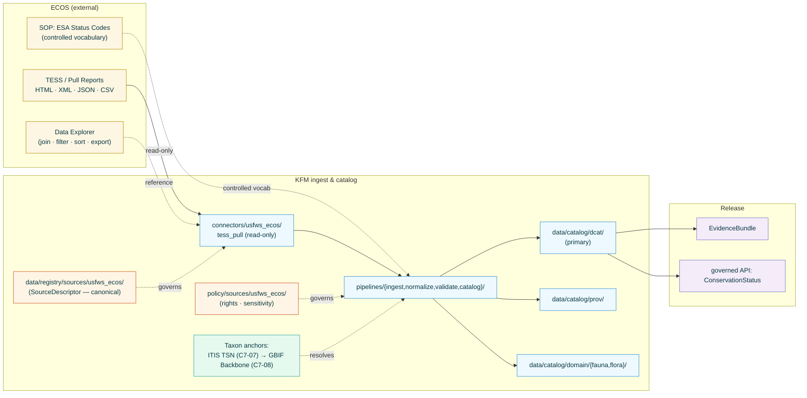

<!-- [KFM_META_BLOCK_V2]
doc_id: kfm://doc/docs-sources-catalog-usfws_ecos-esa-listing-status
title: USFWS ESA Listing and Status Records
type: product-page
version: v0.2
status: draft
owners: <PLACEHOLDER — Docs steward + Source steward for usfws_ecos>
created: 2026-05-20
updated: 2026-05-23
policy_label: public
related:
  - docs/sources/catalog/usfws_ecos/README.md
  - docs/sources/catalog/usfws_ecos/IDENTITY.md
  - docs/sources/catalog/usfws_ecos/RIGHTS-AND-SENSITIVITY-MAP.md
  - docs/sources/catalog/usfws_ecos/critical-habitat.md
  - docs/sources/catalog/usfws_ecos/ipac.md
  - docs/sources/catalog/README.md
  - docs/doctrine/directory-rules.md
  - docs/doctrine/lifecycle-law.md
  - docs/doctrine/trust-membrane.md
  - docs/standards/SENSITIVITY_RUBRIC.md
  - docs/standards/DCAT.md
  - docs/runbooks/fauna/SOURCE_REFRESH_RUNBOOK.md
  - data/registry/sources/usfws_ecos/
  - policy/sources/usfws_ecos/
  - schemas/contracts/v1/source/
  - connectors/usfws_ecos/
adr_refs:
  - ADR-0001 (schema home)
  - <PROPOSED> ADR-S-04 (source-role vocabulary v1)
  - <PROPOSED> ADR-S-05 (sensitivity tier scheme T0–T4)
  - <PROPOSED> ADR-S-12 (connector cadence + quarantine recovery)
tags: [kfm, docs, sources, catalog, usfws_ecos, esa, listings, taxonomy, fauna, flora, regulatory]
notes:
  - "PROPOSED product-page scaffold filled to v0.2; family folder docs/sources/catalog/usfws_ecos/ remains a nested convention not yet enumerated in Directory Rules §6.1 — see Open Questions Q-1."
  - "Naming variance: this page uses 'usfws_ecos' (snake_case folder) + kebab-case product filename. NEEDS VERIFICATION — see Open Questions Q-2."
  - "Non-spatial product. DCAT is the primary catalog profile here; STAC (if registered at all) would use the Records extension. This differs from the sibling critical-habitat product (STAC-primary)."
  - "ITIS/GBIF taxon anchor is the identity backbone for this product (C7-07, C7-08). Anchor-coverage validation is gate-blocking, not advisory."
[/KFM_META_BLOCK_V2] -->

<a id="top"></a>

# USFWS ESA Listing and Status Records

> Federal Endangered Species Act **listing**, **status**, and **taxonomy** records distributed via ECOS TESS and Pull Reports — the regulatory carrier for which species are listed, at what status, under which governing Federal Register rule.

<!-- Top-of-file badge row. Placeholder targets — replace once badge generator (KFM-P3-FEAT-0005) is wired. -->


**Status:** `PROPOSED — scaffold filled` &nbsp;·&nbsp; **Doc version:** `v0.2` &nbsp;·&nbsp; **Family:** [`usfws_ecos`](./README.md) &nbsp;·&nbsp; **Last reviewed:** 2026-05-23

> [!IMPORTANT]
> **The Federal Register rule is the legal description; ECOS is the carrier; this page is a pointer.** Authoritative descriptor fields live in [`data/registry/sources/usfws_ecos/`](../../../../data/registry/sources/usfws_ecos/). Rights and sensitivity decisions live in [`policy/sensitivity/fauna/`](../../../../policy/sensitivity/fauna/) and are summarized at the family level in [`RIGHTS-AND-SENSITIVITY-MAP.md`](./RIGHTS-AND-SENSITIVITY-MAP.md). **Do not duplicate descriptor or policy content on this product page.**

---

## 📑 Contents

1. [Overview](#1-overview)
2. [Product identity within the family](#2-product-identity-within-the-family)
3. [Source authority](#3-source-authority)
4. [Catalog profiles used](#4-catalog-profiles-used)
5. [Collection identity](#5-collection-identity)
6. [Provenance fields](#6-provenance-fields)
7. [Temporal handling](#7-temporal-handling)
8. [Identity and entity shape (no geometry)](#8-identity-and-entity-shape-no-geometry)
9. [Rights and sensitivity (pointer)](#9-rights-and-sensitivity-pointer)
10. [Reality boundary](#10-reality-boundary)
11. [Validation and catalog closure](#11-validation-and-catalog-closure)
12. [Related contracts and schemas](#12-related-contracts-and-schemas)
13. [Related connectors and pipelines](#13-related-connectors-and-pipelines)
14. [Example](#14-example)
15. [Open questions](#15-open-questions)
16. [Last reviewed](#16-last-reviewed)

---

## 1. Overview

This product page describes how KFM catalogs **USFWS ESA Listing and Status Records** — the global, federally-administered list of species under the Endangered Species Act, their current ESA status codes, and the controlling Federal Register citations. Records are distributed through the **TESS** (Threatened and Endangered Species System) Pull Reports / REST interface, with HTML / XML / JSON / CSV export formats and a Data Explorer that supports joining, filtering, sorting, and export.

> [!NOTE]
> **EXTERNAL** *(preserved without re-verification this session).* ECOS Pull Reports / REST serves species, listing, and taxonomy records. KFM ingests these as read-only probes (per `KFM-P22-PROG-0043`) and emits `ConservationStatus` records anchored to ITIS TSN with GBIF Backbone fallback. External claims about specific Pull Report endpoints remain **NEEDS VERIFICATION** until re-fetched in a session with web access.

> [!IMPORTANT]
> **Non-spatial product.** This product carries **no geometry**. The primary catalog profile is **DCAT** (per `C4-05`), not STAC. STAC registration, if any, would use the STAC Records extension for non-spatial assets and is not the default disposition here. This is the principal structural difference from the sibling [`critical-habitat.md`](./critical-habitat.md) product page.



[Back to top](#top)

---

## 2. Product identity within the family

> [!NOTE]
> This page is one **product** under the `usfws_ecos` source family. Sibling products include [`critical-habitat.md`](./critical-habitat.md) (geometry), [`ipac.md`](./ipac.md) (project-scoped consultation lists), and `species-profiles.md` (PROPOSED — narrative). Family-wide concerns — authority, identity convention, rights/sensitivity map, taxon anchoring — live at the **family level** and are not restated here.

| Attribute | Value | Status |
|---|---|---|
| Product name | USFWS ESA Listing and Status Records | **CONFIRMED EXTERNAL** (TESS / Pull Reports surface). |
| Source family | `usfws_ecos` | **PROPOSED** family-folder convention (snake_case); see Q-2. |
| KFM source-role | `regulatory` (Atlas §24.1.1 enum) | **CONFIRMED enum**; binding governed by ADR-S-04. |
| Domains served | **Fauna** (`ConservationStatus`); **Flora** (when ESA covers plants) | **CONFIRMED** in Atlas Domains v1.1 §D for both Fauna and Flora; per-domain README presence **NEEDS VERIFICATION**. |
| Primary upstream surface | TESS Pull Reports / REST · HTML/XML/JSON/CSV exports | **EXTERNAL — NEEDS VERIFICATION** of current endpoint and rate-limit terms. |
| Cardinal evidence object | `ConservationStatus` (Fauna §E object family) | **CONFIRMED** per Atlas Fauna §E. |
| Geometry | **None** (record-keyed by species). | **CONFIRMED N/A.** |

### 2.1 Disambiguation from sibling products

| If you want… | Use… | Not this page |
|---|---|---|
| Designated **geometry** for critical habitat | [`critical-habitat.md`](./critical-habitat.md) | — |
| **Project-scoped** species list for a specific AOI under 50 CFR 402.12 | [`ipac.md`](./ipac.md) (per `KFM-P24-PROG-0002`, `KFM-P24-PROG-0021`) | — |
| **State-level** Kansas listing context (KDWP / SINC) | `<PROPOSED> docs/sources/catalog/kdwp-tess/` (per `KFM-P19-IDEA-0005`, `KFM-P19-PROG-0012`) | — |
| **Marine / anadromous** ESA species (NOAA-lead) | `<PROPOSED> docs/sources/catalog/noaa-fisheries-listings/` | — |
| **Observation** evidence of a species occurrence | GBIF / iNaturalist / eBird / iDigBio product pages (`observed` source role) | — |

> [!CAUTION]
> **Some ESA species are jointly administered with NOAA Fisheries** (typically marine, anadromous, or sea-turtle species). This product covers the **USFWS-lead** species only. KFM derivatives that join USFWS-lead and NOAA-lead listings MUST flag joint-administration species and preserve which agency is the controlling authority for each status determination.

[Back to top](#top)

---

## 3. Source authority

See [`data/registry/sources/usfws_ecos/`](../../../../data/registry/sources/usfws_ecos/) for the authoritative `SourceDescriptor`. **Do not duplicate descriptor fields here.** Descriptor canonical schema home is `schemas/contracts/v1/source/source-descriptor.json` per Directory Rules §7.4 / ADR-0001 — **NEEDS VERIFICATION** of exact filename in mounted repo.

Doctrinal anchors for this product:

- `KFM-P20-PROG-0001` — ECOS / NatureServe / GBIF source descriptor set: *"Create source descriptors for ECOS species/status/critical habitat…"*
- `KFM-P20-IDEA-0001` — Biodiversity source hierarchy as source-role registry: USFWS ECOS, NatureServe, and GBIF modeled as **distinct authoritative and corroborative** source-role families for species, habitat, status, and occurrence evidence.
- `KFM-P1-IDEA-0051` — Knowledge-character labels for observed / modeled / regulatory / inferred / interpreted / fused / candidate. **Regulatory listings must carry the `regulatory` label and never collapse to `observed` or `aggregate`.**
- `KFM-P22-PROG-0043` — Read-only probe posture: *"operate read-only, fail closed for uncertain observations, and produce process memory rather than release proof."*
- `C7-07` — ITIS TSN as the U.S.-canonical taxonomic authority; required anchor for every species-level record.
- `C7-08` — GBIF Backbone Taxonomy (DOI `10.15468/39omei`) as the international crosswalk and fallback when ITIS coverage is incomplete.

[Back to top](#top)

---

## 4. Catalog profiles used

KFM's catalog layer projects each promoted product into multiple profiles. For **non-spatial** ESA listing & status records, the **PROPOSED** disposition is:

| Profile | Lane | Used by this product? | Basis |
|---|---|---|---|
| **DCAT** Dataset + Distribution (**primary**) | `data/catalog/dcat/` | **PROPOSED — Yes (primary)** | `C4-05`: DCAT covers what STAC does not; non-spatial datasets fit naturally into DCAT. `KFM-P14-IDEA-0002` makes STAC/DCAT/PROV a single harvest surface. |
| **STAC** (Records extension, if registered) | `data/catalog/stac/` | **PROPOSED — Optional / Maybe** | Vanilla STAC Items require spatiotemporal assets; the STAC Records extension permits non-spatial entries. Default = **not registered in STAC**; per-Collection decision belongs at family level. |
| **PROV-O / PAV** lineage | `data/catalog/prov/` | **PROPOSED — Yes** | `C8-03`; `KFM-P26-PROG-0025` (catalog writers emit DCAT/STAC/PROV with EvidenceBundle refs). |
| **Domain projection** (Fauna) | `data/catalog/domain/fauna/` | **PROPOSED — Yes** | `ConservationStatus` Fauna object family per Atlas Fauna §E. |
| **Domain projection** (Flora) | `data/catalog/domain/flora/` | **PROPOSED — Yes, when applicable** | ESA listings cover plants as well as animals; Flora `ConservationStatus` records emerge from the same TESS pull. |
| **STAC × Darwin Core hybrid** (`C4-03`) | — | **CONFIRMED No** | DwC hybridization applies to occurrence/observation records, not regulatory listings. |

> [!TIP]
> **DCAT-primary, STAC-secondary** is the structural inverse of the critical-habitat product. Cross-catalog discovery still benefits from a STAC-to-DCAT bridge per `C4-05` expansion direction, but for this product DCAT is the canonical lane and STAC participation is optional.

[Back to top](#top)

---

## 5. Collection identity

- **PROPOSED Collection id pattern:** `kfm-usfws_ecos-esa-listings` (DCAT Dataset). One Collection per controlling agency; status (E / T / EXPN / etc.) is a **per-record property**, not a Collection split.
- **PROPOSED namespace:** `kfm:` *(per `C4-01`; namespace `kfm:` vs `ks-kfm:` is an open question — see OPEN-DSC-03 / `C4-01` open question).*
- **Asset roles** (DCAT distribution roles): **NEEDS VERIFICATION** — confirm against [`schemas/contracts/v1/source/`](../../../../schemas/contracts/v1/source/). Likely roles: `data` (JSON/CSV), `metadata` (DCAT JSON-LD), `evidence_bundle` (`application/ld+json`), `taxon_anchor` (ITIS/GBIF crosswalk).
- **Collection description (PROPOSED):** Must declare the **deterministic build property**, **governance posture** (per `C4-02`), the **ESA Status Codes controlled vocabulary** as the conformance reference, the **Federal-Register-as-legal-source statement** ([§10](#10-reality-boundary)), and the **USFWS no-warranty banner** verbatim.

[Back to top](#top)

---

## 6. Provenance fields

**CONFIRMED shape** (per `C4-01`). For DCAT-primary catalog records, the `kfm:provenance` block is carried on `dcat:Dataset` / `dcat:Distribution` rather than on STAC Item properties, but the field set is identical. Per-product values are **NEEDS VERIFICATION** until the ingester is wired.

| Field | Type | Source / how computed |
|---|---|---|
| `spec_hash` | sha256 of the canonical record | `C1-02`; JCS-canonicalized record body. |
| `evidence_bundle_ref` | `kfm://evidence/<digest>` (or `oci://…` / `ipfs://…`) | `C4-04` content-addressed JSON-LD bundle. |
| `run_record_ref` | `kfm://run/<run-id>` | `C1-01` run receipt for this ingest. |
| `audit_ref` | `kfm://audit/<attestation-id>` | SLSA / OPA attestation pointer. |
| `policy_digest` | sha256 of the policy bundle used at promotion | Per `KFM-P22-PROG-0001` Gate A-G contract. |
| `taxon_anchor` | `{ primary: "ITIS TSN", fallback: "GBIF Backbone" + DOI version }` | `C7-07` / `C7-08`; **gate-blocking** (see [§11](#11-validation-and-catalog-closure)). |
| `kfm:provenance.reality_boundary_ref` | `kfm://realityboundary/federal-register/<rule-id>` *(PROPOSED — product-specific)* | Federal Register citation for the governing listing rule. |
| `kfm:provenance.fr_effective_date` | ISO date | Listing effective date from the controlling Federal Register rule. |

Per-asset integrity: **`file:checksum`** (SHA-256) on every published distribution (per `C3-02`).

> [!TIP]
> **DCAT attestation hook (parallel to STAC `KFM-P7-PROG-0001`).** DCAT records SHOULD expose `dct:conformsTo` pointing at the KFM evidence-bundle profile URI (per `C4-05`), and SHOULD attach the `EvidenceBundle` as a `dcat:Distribution` whose `mediaType` is `application/ld+json`. Whether to additionally adopt a `rel="attestation"` link on the DCAT side mirrors the open STAC question and should be resolved at family level.

[Back to top](#top)

---

## 7. Temporal handling

**CONFIRMED doctrine** (Atlas Fauna §E temporal-as-first-class-evidence, `KFM-P1-IDEA-0047`): distinct **source / observed / valid / retrieval / release / correction** times are preserved where material. For ESA listing & status records:

| Time | Meaning for this product | Status |
|---|---|---|
| `source_time` | When USFWS last edited the TESS record. | **EXTERNAL — NEEDS VERIFICATION** of upstream timestamp semantics. |
| `valid_from` | Effective date of the governing Federal Register listing rule. | **CONFIRMED-required.** |
| `valid_to` | Effective date of a delisting / reclassification / withdrawal rule, if any; `null` otherwise. | **CONFIRMED-required** (nullable). |
| `retrieval_time` | When KFM's connector fetched the payload. | **CONFIRMED-required** per `C1-01`. |
| `release_time` | When the KFM-derived `ConservationStatus` record was published. | **CONFIRMED-required** at Gate G. |
| `correction_time` | When a `CorrectionNotice` modifies the record (taxonomy update, status correction, agency-jurisdiction correction). | **CONFIRMED-required** when applicable. |
| `observed_time` | **Not applicable.** Listings are regulatory determinations, not observations. | **CONFIRMED N/A.** |

> [!IMPORTANT]
> **`valid_from` follows the Federal Register rule, not the TESS publication timing.** A status change may appear in TESS hours, days, or weeks after the rule's legal effective date. The catalog record MUST carry the rule's effective date as `valid_from`, never the TESS publication date. This is the same time-source discipline applied to the critical-habitat product, applied here to status changes instead of geometry changes.

> [!CAUTION]
> **Status transitions are events, not metadata edits.** A species moving from `T` (Threatened) to `E` (Endangered) is an `ESAStatusChangeEvent` (PROPOSED object) anchored to a Federal Register rule. KFM emits a new `ConservationStatus` record + a `CorrectionNotice` referencing the prior record; it does **not** mutate the prior record in place.

[Back to top](#top)

---

## 8. Identity and entity shape (no geometry)

This product replaces the geometry-and-projection section that appears in spatial sibling pages. ESA listing records are **species-keyed**, not place-keyed.

| Attribute | Value (PROPOSED) | Status |
|---|---|---|
| Cardinal identity | `(taxon_anchor, controlling_agency, fr_rule_id)` triple | **PROPOSED**; deterministic key per Fauna §E identity rule (*"source id + object role + temporal scope + normalized digest"*). |
| Taxon anchor — primary | **ITIS TSN** | **CONFIRMED required** per `C7-07`. |
| Taxon anchor — fallback | **GBIF Backbone Taxonomy** (DOI `10.15468/39omei`, version-pinned) | **CONFIRMED required** when ITIS lacks coverage, per `C7-08`. |
| Controlling agency | `U.S. Fish & Wildlife Service` (this product); also flag joint USFWS/NOAA species. | **CONFIRMED** for the USFWS-lead scope. |
| Status code | ESA Status Code (E, T, EXPN, EXPE, PE, PT, SAT, SAE, C, etc.) | **EXTERNAL controlled vocabulary** per the USFWS *"Endangered Species Act Status Codes in ECOS"* SOP. **NEEDS VERIFICATION** of the full enum and any updates. |
| FR citation | `https://www.federalregister.gov/documents/<rule-id>` | **CONFIRMED-required** per [§10](#10-reality-boundary). |
| Geometry | **None.** | **CONFIRMED N/A.** |
| CRS | **None.** | **CONFIRMED N/A.** |

> [!CAUTION]
> **Taxon-anchor coverage is gate-blocking.** A `ConservationStatus` record without an ITIS TSN AND without a GBIF Backbone fallback fails Gate A (source identity) and quarantines. The doctrinal basis is `C7-07` (*"required anchor for every species-level record"*) plus the corpus's open question on ITIS/GBIF tie-breaker (see Q-7 and `KFM-P1-IDEA-0020` open question).

[Back to top](#top)

---

## 9. Rights and sensitivity (pointer)

**Do not restate policy here.** See [`policy/sensitivity/fauna/`](../../../../policy/sensitivity/fauna/) and the family-level summary at [`RIGHTS-AND-SENSITIVITY-MAP.md`](./RIGHTS-AND-SENSITIVITY-MAP.md).

> [!NOTE]
> **Default tier: T0 (Open).** Per Atlas §24.5.1 / §24.5.2, public regulatory text/list metadata with no geometry sensitivity defaults to T0. ESA listings are themselves the *legal record* of a status determination; the record's existence and content are public by construction. This contrasts with the sibling critical-habitat product (T1 default per Atlas §24.5.2 + `KFM-P20-PROG-0002`) because that product carries geometry; this one does not. **The T0 default does NOT extend to cross-lane joins with sensitive occurrence data — see [§9.1](#91-cross-lane-join-cautions).**

### 9.1 Cross-lane join cautions

Even though the listing record itself is T0, **joins** of ESA-listing records with other data classes can re-introduce sensitivity:

| Join target | Resulting risk | Default posture |
|---|---|---|
| Precise rare-species `Occurrence` (`observed` role; GBIF / iNaturalist / eBird / iDigBio) | Reveals precise locations of listed species. | **T4 at the join** per `KFM-P24-IDEA-0002` *"sensitive species deny-by-default posture"* and `KFM-P25-IDEA-0006` *"sensitive fauna precision degradation"*. Geoprivacy generalization + `RedactionReceipt` + `ReviewRecord` required. |
| `RangePolygon` from critical habitat | Joining listing with regulatory geometry remains T1 (per the sibling product's default). | Standard Gates A–G; no extra obligation beyond CH-product defaults. |
| Tribal-land overlay | Sovereignty review per S.O. 3206. | `sovereignty_review` flag on resulting derivative. |
| KDWP / NatureServe sensitivity rankings | Heritage rankings (S1/S2) may **escalate** the tier of dependent occurrence derivatives but do not change the federal listing record itself. | Tier escalation applies to occurrence joins, not to this product's records. |

> [!CAUTION]
> **PROPOSED CORRECTION cross-reference.** The sensitivity tier for KFM-derived critical-habitat layers was corrected from T0 to T1 in the [`critical-habitat.md`](./critical-habitat.md) product page (per Atlas §24.5.2 + `KFM-P20-PROG-0002`). That correction does **not** apply to this product — ESA listing & status records remain T0 by default because they carry no geometry. The corrected family-level posture is documented in [`RIGHTS-AND-SENSITIVITY-MAP.md`](./RIGHTS-AND-SENSITIVITY-MAP.md); final tier scheme is governed by **ADR-S-05**.

[Back to top](#top)

---

## 10. Reality boundary

> [!IMPORTANT]
> **Federal Register as legal source.** The legal authority for an ESA listing, status change, or delisting is the controlling Federal Register rule, **not** the TESS record. Every KFM-published `ConservationStatus` record MUST link to its FR citation, and Focus-Mode AI answers MUST **cite-or-abstain** to the rule, never to the TESS record alone.

> [!IMPORTANT]
> **TESS reflects FR rules with lag.** A species that has been listed, delisted, or reclassified by a published rule may not appear in TESS with the new status for some time. Absence in TESS is **UNKNOWN**, not "no listing exists." Any claim that a species is **not** federally listed requires either (a) confirmation that no FR listing rule exists, or (b) confirmation that all FR listing rules have been superseded by a delisting / withdrawal — neither of which the absence of a TESS record alone supplies.

> [!IMPORTANT]
> **Joint USFWS/NOAA species** carry a *split* controlling-agency posture. The Federal Register rule itself is the source of truth for which agency leads which species; KFM must not infer agency jurisdiction from TESS membership alone.

[Back to top](#top)

---

## 11. Validation and catalog closure

- **Catalog closure required before public release** (Pass-10 / `KFM-P1-IDEA-0020`; lifecycle invariant per `docs/doctrine/lifecycle-law.md`).
- **Taxon-anchor coverage** (gate-blocking): every record carries ITIS TSN, **or** GBIF Backbone with documented fallback rationale (per `C7-07` / `C7-08`). Validator name: `usfws_esa_taxon_anchor_required`.
- **FR-citation presence** (gate-blocking): every record links to a resolvable Federal Register URL. Validator name: `usfws_esa_fr_citation_required`.
- **ESA status code enum compliance**: every record's status code matches the USFWS *"ESA Status Codes in ECOS"* controlled vocabulary. Validator name: `usfws_esa_status_code_enum_compliance`. *(Enum NEEDS VERIFICATION against the current SOP.)*
- **Listing effective-date alignment**: `valid_from` equals the controlling FR rule's effective date, not the TESS publication date. Validator name: `usfws_esa_valid_from_aligns_fr_rule`.
- **Joint-administration flag**: species jointly administered with NOAA Fisheries carry a `joint_usfws_noaa` flag. Validator name: `usfws_esa_joint_agency_flag`.
- **DCAT mirror closure** (`KFM-P14-IDEA-0002`, `KFM-P26-PROG-0025`): every promoted record emits a `dcat:Dataset` + `dcat:Distribution` with `kfm:provenance` block.
- **PROV-O closure** (`C8-03`): `prov:wasGeneratedBy` chain to the ingest run; `EvidenceBundle` `wasDerivedFrom` the source payload.
- **Catalog QA CI surface** (`KFM-P27-FEAT-0004`): missing license, missing providers, broken links, JSON errors must surface.
- **Promotion Gates A–G** (per Atlas §24.6.1 and `KFM-P22-PROG-0001`): every release passes all gates; Gate G requires `PromotionDecision` + `ReleaseManifest` + rollback target + correction path.
- **STAC Projection lint** (`KFM-P27-FEAT-0003`): **Not applicable** to this product (no geometry).

> [!TIP]
> **Validators must exercise negative-state paths.** Required negative fixtures for this product: a record missing the ITIS TSN with no GBIF fallback (Gate A quarantine); a record citing a non-existent FR rule (Gate F deny); a record whose status code is outside the enum (Gate D quarantine); a joint USFWS/NOAA species whose `joint_usfws_noaa` flag is missing (Gate D deny); a record whose `valid_from` differs from the FR effective date (Gate F deny).

[Back to top](#top)

---

## 12. Related contracts and schemas

| Surface | Path (PROPOSED unless noted) | Status |
|---|---|---|
| `SourceDescriptor` semantic contract | [`contracts/source/`](../../../../contracts/source/) | **PROPOSED** — `contracts/source/` listed as canonical family in *KFM Repo Structure Guiding Document* v0.2; presence **NEEDS VERIFICATION**. |
| `SourceDescriptor` machine schema | [`schemas/contracts/v1/source/`](../../../../schemas/contracts/v1/source/) | **PROPOSED canonical home** per Directory Rules §7.4 / ADR-0001. |
| `ConservationStatus` contract | [`contracts/data/fauna/`](../../../../contracts/data/fauna/) · [`contracts/data/flora/`](../../../../contracts/data/flora/) | **PROPOSED**. |
| `ConservationStatus` schema | [`schemas/contracts/v1/fauna/`](../../../../schemas/contracts/v1/fauna/) · [`schemas/contracts/v1/flora/`](../../../../schemas/contracts/v1/flora/) | **PROPOSED**. |
| `EvidenceBundle` schema | [`schemas/contracts/v1/evidence/`](../../../../schemas/contracts/v1/evidence/) | **PROPOSED** per `KFM-P26-PROG-0004`. |
| `EvidenceRef` schema | [`schemas/contracts/v1/evidence/`](../../../../schemas/contracts/v1/evidence/) | **PROPOSED** per `KFM-P26-PROG-0005`. |
| `RealityBoundaryNote` | [`schemas/contracts/v1/governance/`](../../../../schemas/contracts/v1/governance/) | **PROPOSED** — Atlas §24.1.3 implies this object class; schema home unverified. |
| Taxon-anchor crosswalk | [`contracts/data/biodiversity/taxon_crosswalk/`](../../../../contracts/data/biodiversity/) | **PROPOSED** lane; aligns with Fauna §E `Taxon Crosswalk` object family. |
| ESA Status Code enum (controlled vocabulary) | [`schemas/contracts/v1/source/usfws_esa_status_code.json`](../../../../schemas/contracts/v1/source/) | **PROPOSED** — enum values **NEEDS VERIFICATION** against USFWS SOP. |

[Back to top](#top)

---

## 13. Related connectors and pipelines

| Stage | Path (PROPOSED) | Notes |
|---|---|---|
| Connector | [`connectors/usfws_ecos/tess_pull/`](../../../../connectors/usfws_ecos/) | Read-only probe per `KFM-P22-PROG-0043`; emits pre-RAW `EventEnvelope` + `EventRunReceipt` per v0.2 connector contract; HTTP-validator receipt checks (ETag, Last-Modified, content-length, manifest checksums). |
| Ingest pipeline | [`pipelines/ingest/`](../../../../pipelines/ingest/) | RAW capture into `data/raw/<domain>/usfws_ecos/<run_id>/`. |
| Normalize pipeline | [`pipelines/normalize/`](../../../../pipelines/normalize/) | Status-code enum normalization; taxon resolution to ITIS TSN / GBIF Backbone (`C7-07`, `C7-08`); FR-rule extraction from each record. |
| Validate pipeline | [`pipelines/validate/`](../../../../pipelines/validate/) | Taxon-anchor coverage, FR-citation presence, status-code enum compliance, joint-administration flag, `valid_from` alignment. |
| Catalog pipeline | [`pipelines/catalog/`](../../../../pipelines/catalog/) | DCAT-primary catalog closure with PROV-O lineage; STAC-Records registration is optional. |
| Pipeline specs | [`pipeline_specs/fauna/`](../../../../pipeline_specs/fauna/) · [`pipeline_specs/flora/`](../../../../pipeline_specs/flora/) | Declarative configuration of the above. |
| Refresh runbook | [`docs/runbooks/fauna/SOURCE_REFRESH_RUNBOOK.md`](../../../runbooks/fauna/SOURCE_REFRESH_RUNBOOK.md) | **CONFIRMED authored** (prior session); covers USFWS refresh procedure. |
| Federal Register watcher | [`pipelines/watchers/federal_register/`](../../../../pipelines/watchers/) | **PROPOSED** — triggers re-admission when a new ESA listing / delisting / reclassification rule publishes. |

[Back to top](#top)

---

## 14. Example

*Illustrative only — not authoritative. The minimal STAC + `kfm:provenance` shape lives at [`_examples/stac-item-example.json`](./_examples/stac-item-example.json) (file presence **NEEDS VERIFICATION**); a DCAT-shaped example for this product belongs at `_examples/dcat-record-example.jsonld` (PROPOSED).*

<details>
<summary><b>Click to expand — minimal DCAT record sketch (illustrative, JSON-LD)</b></summary>

```json
{
  "@context": {
    "dcat": "http://www.w3.org/ns/dcat#",
    "dct": "http://purl.org/dc/terms/",
    "prov": "http://www.w3.org/ns/prov#",
    "kfm": "https://kfm.example/ns/kfm#"
  },
  "@type": "dcat:Dataset",
  "@id": "kfm:dataset/usfws_ecos-esa-listings",
  "dct:title": "USFWS ESA Listing and Status Records (Kansas Frontier Matrix derivative)",
  "dct:description": "Federal ESA listing, status, and taxonomy records; legal source is the controlling Federal Register rule per species. USFWS materials are U.S. federal works (17 U.S.C. §105) with no warranty as to accuracy, reliability, or completeness.",
  "dct:license": "<USFWS no-warranty / public domain notice>",
  "dct:conformsTo": "kfm://profile/evidence-bundle/v1",
  "dct:publisher": { "@id": "kfm:org/usfws" },
  "kfm:provenance": {
    "spec_hash": "<sha256 of canonical record body>",
    "evidence_bundle_ref": "kfm://evidence/<digest>",
    "run_record_ref": "kfm://run/<run-id>",
    "audit_ref": "kfm://audit/<attestation-id>",
    "policy_digest": "<sha256 of policy bundle used at promotion>",
    "reality_boundary_ref": "kfm://realityboundary/federal-register/<rule-id>",
    "fr_effective_date": "<ISO-date>",
    "taxon_anchor": {
      "primary": { "scheme": "ITIS-TSN", "value": "<tsn>" },
      "fallback": { "scheme": "GBIF-Backbone", "doi": "10.15468/39omei", "version": "<snapshot-id>", "key": "<backbone-key>" }
    },
    "esa_status_code": "<E | T | EXPN | EXPE | PE | PT | SAT | SAE | C | …>",
    "controlling_agency": "U.S. Fish & Wildlife Service",
    "joint_usfws_noaa": false
  },
  "dcat:distribution": [
    {
      "@type": "dcat:Distribution",
      "dct:title": "Record body (JSON)",
      "dcat:mediaType": "application/json",
      "dcat:accessURL": "...",
      "file:checksum": "..."
    },
    {
      "@type": "dcat:Distribution",
      "dct:title": "Evidence bundle (JSON-LD)",
      "dcat:mediaType": "application/ld+json",
      "dct:conformsTo": "kfm://profile/evidence-bundle/v1",
      "dcat:accessURL": "kfm://evidence/<digest>"
    }
  ],
  "dct:references": [
    "https://www.federalregister.gov/documents/<rule-id>"
  ]
}
```

</details>

[Back to top](#top)

---

## 15. Open questions

| # | Question | Class | Suggested resolution |
|---|---|---|---|
| Q-1 | Is `docs/sources/catalog/<source_family>/<product>.md` the right nesting, or should source-catalog content live as a flat single file per source? | **NEEDS VERIFICATION** | ADR-class (Directory Rules §2.4(2)); family-level decision. |
| Q-2 | Folder naming variance: `usfws_ecos` (snake_case) here vs `usfws-ecos` (kebab-case) in earlier single-file pattern. | **NEEDS VERIFICATION** | Defer to broader naming ADR (Directory Rules §18 OPEN-DR-04). |
| Q-3 | Should this product be registered in STAC via the Records extension, or stay DCAT-only? | **PROPOSED** | Default = DCAT-only; revisit if a STAC harvester adds the Records extension as a hard requirement. |
| Q-4 | One Collection for all listings, or one per controlling agency (USFWS / joint / NOAA)? | **PROPOSED** | Default = **one Collection per controlling agency**, with `joint_usfws_noaa` as a per-record property when joint. |
| Q-5 | Confirm cadence — daily watcher + Federal Register trigger? | **OPEN** | Resolve in `data/registry/sources/usfws_ecos/` descriptor + watcher config; material to **ADR-S-12**. |
| Q-6 | Confirm rights status and CARE applicability for KFM derivatives. | **OPEN** | Resolve in [`RIGHTS-AND-SENSITIVITY-MAP.md`](./RIGHTS-AND-SENSITIVITY-MAP.md). |
| Q-7 | **ITIS / GBIF tie-breaker policy** — per `C7-07` open question, the corpus does not yet codify what to do when ITIS and GBIF disagree on accepted name. Default (per `C7-07` suggested future work): ITIS for federal-data reconciliation, GBIF for international biodiversity queries. | **PROPOSED** | Author the tie-breaker policy under `policy/sources/usfws_ecos/` and reference here. |
| Q-8 | **ESA Status Code enum** — current full list and any recent additions (e.g., experimental-population variants) require fresh USFWS SOP verification. | **NEEDS VERIFICATION** | Pin enum in `schemas/contracts/v1/source/usfws_esa_status_code.json`; re-fetch SOP on each update. |
| Q-9 | **GBIF Backbone DOI version pinning** — when to bump? Per `C7-08`, long-running pipelines must tolerate a Backbone version change without invalidating prior receipts. | **OPEN** | Backbone-version-rotation playbook (per `C7-08` suggested future work). |
| Q-10 | **STAC namespace pin** (`kfm:` vs `ks-kfm:`, per `C4-01`). | **OPEN** | Pin at family / catalog level; reference from this page rather than restating. |
| Q-11 | **Joint USFWS/NOAA species** — should KFM emit a single record with `joint_usfws_noaa: true`, or two parallel records (one under each agency's product page)? | **PROPOSED** | Default = **single record with joint flag**; the NOAA-lead product page (`<PROPOSED> noaa-fisheries-listings/`) carries its own records for NOAA-lead species. |

[Back to top](#top)

---

## 16. Last reviewed

2026-05-23 *(scaffold filled; product-page polished against doctrine corpus; mounted repo not inspected this session).*

---

> **Doc version:** v0.2 (draft) &nbsp;·&nbsp; **Family:** [`usfws_ecos`](./README.md) &nbsp;·&nbsp; **Catalog root:** [`docs/sources/catalog/`](../README.md) &nbsp;·&nbsp; [Back to top](#top)
