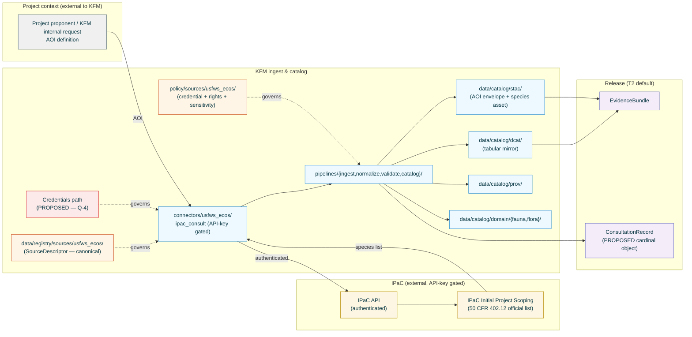

<!-- [KFM_META_BLOCK_V2]
doc_id: kfm://doc/docs-sources-catalog-usfws_ecos-ipac-project-lists
title: USFWS IPaC Project Species Lists
type: product-page
version: v0.2
status: draft
owners: <PLACEHOLDER — Docs steward + Source steward for usfws_ecos>
created: 2026-05-20
updated: 2026-05-23
policy_label: public
related:
  - docs/sources/catalog/usfws_ecos/README.md
  - docs/sources/catalog/usfws_ecos/IDENTITY.md
  - docs/sources/catalog/usfws_ecos/RIGHTS-AND-SENSITIVITY-MAP.md
  - docs/sources/catalog/usfws_ecos/critical-habitat.md
  - docs/sources/catalog/usfws_ecos/esa-listing-status.md
  - docs/sources/catalog/README.md
  - docs/doctrine/directory-rules.md
  - docs/doctrine/lifecycle-law.md
  - docs/doctrine/trust-membrane.md
  - docs/standards/SENSITIVITY_RUBRIC.md
  - docs/runbooks/fauna/SOURCE_REFRESH_RUNBOOK.md
  - data/registry/sources/usfws_ecos/
  - policy/sources/usfws_ecos/
  - policy/sensitivity/fauna/
  - schemas/contracts/v1/source/
  - connectors/usfws_ecos/
adr_refs:
  - ADR-0001 (schema home)
  - <PROPOSED> ADR-S-04 (source-role vocabulary v1)
  - <PROPOSED> ADR-S-05 (sensitivity tier scheme T0–T4)
  - <PROPOSED> ADR-S-12 (connector cadence + quarantine recovery)
  - <PROPOSED> ADR-S-14 (cross-lane join policy)
tags: [kfm, docs, sources, catalog, usfws_ecos, ipac, consultation, 402.12, project, regulatory, fauna]
notes:
  - "PROPOSED product-page scaffold filled to v0.2; family folder docs/sources/catalog/usfws_ecos/ remains a nested convention not yet enumerated in Directory Rules §6.1 — see Open Questions Q-1."
  - "Filename: ipac-project-lists.md (matches doc_id slug). Prior product-page disambiguation rows referred to the shorter 'ipac.md' — those references in critical-habitat.md and esa-listing-status.md need reconciliation when the family README is authored. NEEDS VERIFICATION."
  - "Hybrid spatial + tabular product: STAC carries the AOI envelope + species list asset; DCAT carries the tabular mirror. Different posture from the geometry-only critical-habitat product and the tabular-only esa-listing-status product."
  - "API-key gated. Per KFM-P24-PROG-0002, IPaC source descriptor must record API-key requirement; credential-management path is PROPOSED under policy/sources/usfws_ecos/ (Q-4)."
  - "T2 default sensitivity. Project-scoped lists may reveal project intent even when their constituent species records (sourced from ESA listings) are T0."
[/KFM_META_BLOCK_V2] -->

<a id="top"></a>

# USFWS IPaC Project Species Lists

> Official **project-scoped** species lists obtained through the **IPaC** (Information for Planning and Consultation) tool, satisfying the Endangered Species Act consultation requirement at **50 CFR 402.12**. Each list is a snapshot of which ESA-listed species and designated critical habitats may occur within a specified project Area of Interest at the time of consultation.

<!-- Top-of-file badge row. Placeholder targets — replace once badge generator (KFM-P3-FEAT-0005) is wired. -->


**Status:** `PROPOSED — scaffold filled` &nbsp;·&nbsp; **Doc version:** `v0.2` &nbsp;·&nbsp; **Family:** [`usfws_ecos`](./README.md) &nbsp;·&nbsp; **Last reviewed:** 2026-05-23

> [!IMPORTANT]
> **The Federal Register listing rule is the legal description; 50 CFR 402.12 is the procedural authority; IPaC is the carrier; this page is a pointer.** Authoritative descriptor fields live in [`data/registry/sources/usfws_ecos/`](../../../../data/registry/sources/usfws_ecos/). Rights, sensitivity, and credential policy live in [`policy/sources/usfws_ecos/`](../../../../policy/sources/usfws_ecos/) and [`policy/sensitivity/fauna/`](../../../../policy/sensitivity/fauna/), summarized at the family level in [`RIGHTS-AND-SENSITIVITY-MAP.md`](./RIGHTS-AND-SENSITIVITY-MAP.md). **Do not duplicate descriptor or policy content on this product page.**

> [!CAUTION]
> **Project intent disclosure risk.** An IPaC species list is **defined by an Area of Interest** submitted by a project proponent. The AOI itself can reveal what is being planned where — even when every constituent species record is public. Default sensitivity is **T2** (Reviewer); promotion to T0/T1 requires explicit policy review. Sensitive-occurrence joins remain **T4** (Denied) by default. See [§9](#9-rights-and-sensitivity-pointer).

---

## 📑 Contents

1. [Overview](#1-overview)
2. [Product identity within the family](#2-product-identity-within-the-family)
3. [Source authority](#3-source-authority)
4. [Catalog profiles used](#4-catalog-profiles-used)
5. [Collection identity](#5-collection-identity)
6. [Provenance fields](#6-provenance-fields)
7. [Temporal handling and consultation aging](#7-temporal-handling-and-consultation-aging)
8. [Geometry, AOI handling, and entity shape](#8-geometry-aoi-handling-and-entity-shape)
9. [Rights and sensitivity (pointer)](#9-rights-and-sensitivity-pointer)
10. [Reality boundary](#10-reality-boundary)
11. [Validation and catalog closure](#11-validation-and-catalog-closure)
12. [Related contracts and schemas](#12-related-contracts-and-schemas)
13. [Related connectors and pipelines](#13-related-connectors-and-pipelines)
14. [Example](#14-example)
15. [Open questions](#15-open-questions)
16. [Last reviewed](#16-last-reviewed)

---

## 1. Overview

This product page describes how KFM catalogs **IPaC project species lists** — official, project-scoped species lists obtained through the USFWS IPaC tool to satisfy ESA Section 7 consultation requirements at 50 CFR 402.12. Unlike the global ESA listing pull (see [`esa-listing-status.md`](./esa-listing-status.md)) and the global critical-habitat geometry (see [`critical-habitat.md`](./critical-habitat.md)), an IPaC list is the **intersection** of those two at a specific AOI, generated **on demand** for a specific consultation.

> [!NOTE]
> **EXTERNAL** *(preserved without re-verification this session).* USFWS directs project proponents to use the IPaC Initial Project Scoping tool to identify project location and receive an official species list pursuant to 50 CFR 402.12. IPaC pulls are parameterized by AOI or centroid and stored as project/species JSON with acquisition evidence (per `KFM-P24-PROG-0021`). External claims about specific IPaC endpoints, API-key terms, and rate-limit policy remain **NEEDS VERIFICATION** until re-fetched in a session with web access.

> [!IMPORTANT]
> **Hybrid spatial + tabular product.** The product carries **both** an AOI envelope (geometry input) and a species list (tabular output). STAC participates here (AOI as Item geometry, species list as JSON asset); DCAT participates as a tabular mirror. This is the principal structural difference from the geometry-only `critical-habitat.md` and the tabular-only `esa-listing-status.md` siblings.



[Back to top](#top)

---

## 2. Product identity within the family

> [!NOTE]
> This page is one **product** under the `usfws_ecos` source family. Sibling products include [`critical-habitat.md`](./critical-habitat.md) (geometry), [`esa-listing-status.md`](./esa-listing-status.md) (global listings), and `species-profiles.md` (PROPOSED — narrative). Family-wide concerns — authority, identity convention, rights/sensitivity map, taxon anchoring, credential management — live at the **family level** and are not restated here.

| Attribute | Value | Status |
|---|---|---|
| Product name | USFWS IPaC Project Species Lists | **CONFIRMED EXTERNAL** (IPaC tool name). |
| Source family | `usfws_ecos` | **PROPOSED** family-folder convention (snake_case); see Q-2. |
| KFM source-role | `regulatory` (Atlas §24.1.1 enum) | **CONFIRMED enum**; the consultation itself is a regulatory artifact per 50 CFR 402.12. Binding governed by ADR-S-04. |
| Domains served | **Fauna** (`ConservationStatus` + new `ConsultationRecord`); **Habitat** (when AOI intersects critical habitat); **Flora** (when ESA covers listed plants in the AOI) | **CONFIRMED in Atlas Domains v1.1 §D** for Fauna/Habitat; per-domain README presence **NEEDS VERIFICATION**. |
| Primary upstream surface | IPaC API + IPaC web UI | **EXTERNAL — NEEDS VERIFICATION** of current endpoint, API-key terms, rate-limit policy. |
| Authentication | **API-key required** | **CONFIRMED doctrine** per `KFM-P24-PROG-0002`; current key/terms **NEEDS VERIFICATION**. |
| Access pattern | **On-demand only** (no global cadence) | **CONFIRMED doctrine** per `KFM-P24-PROG-0021` (AOI- or centroid-parameterized). |
| Cardinal evidence object | `ConsultationRecord` (**PROPOSED object class**) referencing per-species `ConservationStatus` items and per-unit `RangePolygon` items. | **PROPOSED** — schema home unverified. |
| Geometry | **AOI envelope** (input) — polygon, multipolygon, or buffered point (centroid + radius). | **CONFIRMED structural per `KFM-P24-PROG-0021`**; precise format **NEEDS VERIFICATION**. |

### 2.1 Disambiguation from sibling products

| If you want… | Use… | Not this page |
|---|---|---|
| **Global** ESA listing & status records (every listed species) | [`esa-listing-status.md`](./esa-listing-status.md) | — |
| **Global** designated critical habitat geometry | [`critical-habitat.md`](./critical-habitat.md) | — |
| **State-level** Kansas listing context (KDWP / SINC), incl. county-level rosters | `<PROPOSED> docs/sources/catalog/kdwp-tess/` (per `KFM-P19-IDEA-0005`, `KFM-P19-PROG-0012`, `KFM-P24-PROG-0022` KDWP county list normalizer) | — |
| **NOAA Fisheries** project-scoped consultation (marine / anadromous species) | `<PROPOSED> docs/sources/catalog/noaa-fisheries-consultation/` | — |
| **Observed occurrence** records joined to a project AOI | GBIF / iNaturalist / eBird / iDigBio product pages with cross-lane join policy (Q-10; ADR-S-14) | — |
| The result of a **specific** consultation as a project artifact (the PDF / receipt the proponent received) | This page covers KFM's ingest of the consultation; the proponent-side artifact lives outside KFM. | — |

> [!CAUTION]
> **IPaC vs ECOS listings — what each authoritatively tells you.** ECOS listings (`esa-listing-status.md`) tell you *which species are listed nationally*. ECOS critical habitat (`critical-habitat.md`) tells you *where final/proposed designations are*. IPaC tells you *which listed species and critical habitats may occur within a specific AOI at the time of consultation*. The three are not interchangeable, and KFM derivatives that conflate them violate the source-role anti-collapse rule per `KFM-P1-IDEA-0051`.

[Back to top](#top)

---

## 3. Source authority

See [`data/registry/sources/usfws_ecos/`](../../../../data/registry/sources/usfws_ecos/) for the authoritative `SourceDescriptor`. **Do not duplicate descriptor fields here.** Descriptor canonical schema home is `schemas/contracts/v1/source/source-descriptor.json` per Directory Rules §7.4 / ADR-0001 — **NEEDS VERIFICATION** of exact filename in mounted repo.

Doctrinal anchors for this product:

- `KFM-P24-PROG-0002` — USFWS IPaC source descriptor: *"…should record Location API/project species fields, taxon_id, consultation identifiers, API-key requirement, and sensitivity defaults."*
- `KFM-P24-PROG-0021` — IPaC AOI species pull: *"IPaC pulls should be parameterized by AOI or centroid and stored as project/species JSON with acquisition evidence."*
- `KFM-P22-PROG-0043` — Read-only probe posture: *"…operate read-only, fail closed for uncertain observations, and produce process memory rather than release proof."*
- `KFM-P20-PROG-0001` — ECOS/NatureServe/GBIF source descriptor set: doctrinal basis for treating IPaC as a sibling within the ECOS family.
- `KFM-P24-IDEA-0002` — Sensitive species deny-by-default posture: applies at sensitive-occurrence joins involving IPaC AOIs.
- `KFM-P25-IDEA-0006` — Sensitive fauna precision degradation: applies when an IPaC AOI intersects rare-species precise locations.
- `C7-07` / `C7-08` — ITIS TSN primary, GBIF Backbone fallback for every taxon in the consultation result.

[Back to top](#top)

---

## 4. Catalog profiles used

KFM's catalog layer projects each promoted product into multiple profiles. For the **hybrid spatial + tabular** IPaC consultation record, the **PROPOSED** disposition is:

| Profile | Lane | Used by this product? | Basis |
|---|---|---|---|
| **STAC** Item + Collection with `kfm:provenance` | `data/catalog/stac/` | **PROPOSED — Yes** | STAC Item carries the AOI as geometry; species list attached as `application/json` asset. Aligned to `C4-01` / `C4-02`. |
| **DCAT** Dataset + Distribution (tabular mirror) | `data/catalog/dcat/` | **PROPOSED — Yes** | `C4-05`: DCAT covers the tabular species-list distribution; `KFM-P14-IDEA-0002` makes STAC/DCAT/PROV a single harvest surface. |
| **PROV-O / PAV** lineage | `data/catalog/prov/` | **PROPOSED — Yes** | `C8-03` (PROV-O + PAV); `KFM-P26-PROG-0025` (catalog writers emit DCAT/STAC/PROV with EvidenceBundle refs). The consultation lineage chain includes the requestor's AOI submission, the IPaC API call, and any post-hoc corrections. |
| **Domain projection** (Fauna) | `data/catalog/domain/fauna/` | **PROPOSED — Yes** | Per-species `ConservationStatus` items projected as Fauna domain records. |
| **Domain projection** (Habitat) | `data/catalog/domain/habitat/` | **PROPOSED — Yes** when AOI intersects critical habitat | Critical-habitat units relevant to the consultation projected as Habitat domain records. |
| **Domain projection** (Flora) | `data/catalog/domain/flora/` | **PROPOSED — Yes** when ESA-listed plants are present | When applicable. |
| **STAC × Darwin Core hybrid** (`C4-03`) | — | **CONFIRMED No** | DwC hybridization applies to occurrence records; IPaC consultation output is a regulatory list, not occurrence evidence. |

[Back to top](#top)

---

## 5. Collection identity

- **PROPOSED Collection id pattern:** `kfm-usfws_ecos-ipac-consultations`. Each consultation is a STAC Item within the Collection, keyed by `consultation_id`.
- **PROPOSED Item id pattern:** `kfm-usfws_ecos-ipac-<consultation_id>-<consultation_date>`. The `consultation_id` is provided by IPaC; KFM does not mint its own.
- **PROPOSED namespace:** `kfm:` *(per `C4-01`; namespace `kfm:` vs `ks-kfm:` is an open question — see Q-10 and `C4-01` open question).*
- **Asset roles:** **NEEDS VERIFICATION** — confirm against [`schemas/contracts/v1/source/`](../../../../schemas/contracts/v1/source/). Likely role set:
  - `aoi` — the project AOI geometry (`application/geo+json`)
  - `species-list` — the consultation result (`application/json`)
  - `metadata` — DCAT mirror (`application/ld+json`)
  - `evidence_bundle` — JSON-LD bundle (`application/ld+json`)
  - `acquisition_receipt` — IPaC acquisition evidence (`application/json`) per `KFM-P24-PROG-0021`
- **Collection description (PROPOSED):** Must declare the **deterministic build property**, **governance posture** (per `C4-02`), the **API-key gating requirement**, the **per-consultation aging policy** ([§7](#7-temporal-handling-and-consultation-aging)), the **T2 default sensitivity** ([§9](#9-rights-and-sensitivity-pointer)), the **reality-boundary statement** ([§10](#10-reality-boundary)), and the **USFWS no-warranty banner** verbatim.

[Back to top](#top)

---

## 6. Provenance fields

**CONFIRMED shape** (per `C4-01` STAC `properties.kfm:provenance` block). Per-product values are **NEEDS VERIFICATION** until the IPaC connector is wired.

| Field | Type | Source / how computed |
|---|---|---|
| `spec_hash` | sha256 of the canonical record | `C1-02`; JCS-canonicalized item body. |
| `evidence_bundle_ref` | `kfm://evidence/<digest>` (or `oci://…` / `ipfs://…`) | `C4-04` content-addressed JSON-LD bundle. |
| `run_record_ref` | `kfm://run/<run-id>` | `C1-01` run receipt for this consultation pull. |
| `audit_ref` | `kfm://audit/<attestation-id>` | SLSA / OPA attestation pointer. |
| `policy_digest` | sha256 of the policy bundle used at promotion | Per `KFM-P22-PROG-0001` Gate A-G contract. |
| `consultation_id` | IPaC-provided identifier | **CONFIRMED-required** per `KFM-P24-PROG-0002`. |
| `aoi_extent` | GeoJSON geometry (or content-addressed reference) | **CONFIRMED-required** per `KFM-P24-PROG-0021`. |
| `aoi_origin` | enum: `polygon | multipolygon | centroid_buffer | imported_shapefile | …` | **PROPOSED** — preserves whether the AOI was drawn, imported, or derived. |
| `requestor_attestation` | structured: requestor identity reference + consent flag + retention class | **PROPOSED — required** when consultation was initiated by an external requestor; pointer-only (no raw PII) per `ConsentMetadata` doctrine. |
| `api_key_ref` | reference to credentials manifest (NOT the key itself) | **CONFIRMED-required** per `KFM-P24-PROG-0002`. Raw key MUST NOT appear in any catalog record. |
| `taxon_anchor` | `{ primary: "ITIS TSN", fallback: "GBIF Backbone" + DOI version }` | `C7-07` / `C7-08`; gate-blocking. |
| `kfm:provenance.reality_boundary_ref` | `kfm://realityboundary/federal-register/<rule-id>` per species | **CONFIRMED-required** for every species in the list. |
| `kfm:provenance.consultation_basis` | `"50 CFR 402.12"` (string constant) | **CONFIRMED-required**. |

Per-asset integrity: **`file:checksum`** (SHA-256) on every published distribution (per `C3-02`).

> [!CAUTION]
> **API-key handling.** The `api_key_ref` MUST point to a credentials manifest — never to the raw key. The `KFM Repo Structure Guiding Document` §`connectors/` v0.2 contract names `data/registry/sources/` and `policy/sources/` as the relevant lanes, but the explicit credentials path is **PROPOSED** under `policy/sources/usfws_ecos/` and is an open question (Q-4). The credentials policy must include rotation cadence, scope, and audit.

[Back to top](#top)

---

## 7. Temporal handling and consultation aging

**CONFIRMED doctrine** (Atlas Fauna §E temporal-as-first-class-evidence, `KFM-P1-IDEA-0047`): distinct **source / observed / valid / retrieval / release / correction** times are preserved where material. For IPaC consultations the time semantics are uniquely strict because the consultation is a **snapshot at a moment in regulatory state**.

| Time | Meaning for this product | Status |
|---|---|---|
| `source_time` | When IPaC generated the consultation response. | **EXTERNAL — NEEDS VERIFICATION** of timestamp granularity. |
| `valid_from` | The consultation date (= `source_time` usually, but distinct fields are preserved). | **CONFIRMED-required.** |
| `valid_to` | The consultation's review-cycle expiry (per project-grade tolerance); `null` until re-consulted or superseded. | **PROPOSED-required.** |
| `retrieval_time` | When KFM's connector fetched the response (= `source_time` for live API; later for cached / file-imported consultations). | **CONFIRMED-required.** |
| `release_time` | When the KFM-derived `ConsultationRecord` was published. | **CONFIRMED-required** at Gate G. |
| `correction_time` | When a `CorrectionNotice` updates the record (e.g., a species in the list is later corrected to a different taxon, or a status change supersedes). | **CONFIRMED-required** when applicable. |
| `observed_time` | **Not applicable.** Consultations are regulatory determinations, not observations. | **CONFIRMED N/A.** |

> [!IMPORTANT]
> **Per-consultation aging is binding.** An IPaC list reflects regulatory state at the moment of consultation. If a species' status changes after the consultation (newly listed, delisted, reclassified) the consultation is **stale, not wrong** — it remains the authoritative record of *what was known at the time*. KFM marks aged consultations with a `stale_marker` and routes any project-grade use through re-consult or steward review.

> [!IMPORTANT]
> **Pre-RAW `EventEnvelope` precedes RAW write.** Per the v0.2 connector README contract, the IPaC connector emits a pre-RAW `EventEnvelope` + `EventRunReceipt` for each consultation request, capturing AOI, API-key-ref, request time, and response checksum **before** any RAW write occurs. This makes failed / denied / rate-limited consultations auditable even when no RAW payload lands.

[Back to top](#top)

---

## 8. Geometry, AOI handling, and entity shape

Unlike the sibling products (one geometry-only, one tabular-only), IPaC is **hybrid**: the consultation **input** is geometry (AOI), the consultation **output** is tabular (species list), and the entity tying them together is a `ConsultationRecord`.

### 8.1 AOI geometry

| Attribute | Value (PROPOSED) | Status |
|---|---|---|
| AOI format on submission | GeoJSON polygon / multipolygon, or `(centroid_lat, centroid_lon, buffer_m)` for centroid-derived AOIs | **EXTERNAL — NEEDS VERIFICATION** of accepted formats per current IPaC API. |
| Canonical KFM CRS | `EPSG:4326` (geographic) for catalog payloads | **PROPOSED**. |
| AOI generalization on KFM side | Allowed only when documented in a `TransformReceipt` (input geom hash, output geom hash, transform, parameters, tolerance) per the project-page invariant; default = **no generalization** for IPaC AOIs unless the AOI itself is sensitive. | **PROPOSED** — sensitive AOI handling belongs in [`RIGHTS-AND-SENSITIVITY-MAP.md`](./RIGHTS-AND-SENSITIVITY-MAP.md). |
| AOI sensitivity | **Variable.** Public infrastructure project AOI = T0 attribute; private-landowner AOI = T2+; critical-infrastructure AOI (energy, water, defense) = T4. | **PROPOSED** scheme; controlling policy lives at family level. |
| STAC `proj:*` fields on the Item | Required: `proj:code`, `proj:bbox`, `proj:geometry`, `proj:shape` (per `KFM-P27-FEAT-0003` STAC Projection lint). | **PROPOSED-required** when the consultation is registered in STAC. |

### 8.2 Entity shape — `ConsultationRecord`

The cardinal evidence object is a `ConsultationRecord` (**PROPOSED** object class):

| Field | Notes |
|---|---|
| `consultation_id` | IPaC-provided. |
| `consultation_date` | IPaC-provided. |
| `aoi_extent` | GeoJSON geometry or `kfm://...` content-address reference. |
| `species_list` | Array of `(taxon_anchor, esa_status_code, fr_citation, controlling_agency)` tuples — each is itself a `ConservationStatus` reference. |
| `critical_habitat_overlap` | Array of `RangePolygon` references when AOI intersects designated critical habitat (links into the sibling `critical-habitat.md` product). |
| `consultation_basis` | `"50 CFR 402.12"` constant. |
| `controlling_agency` | `U.S. Fish & Wildlife Service` (this product); joint USFWS/NOAA species flagged per-record. |
| `requestor_attestation` | Pointer-only consent metadata (no raw PII). |
| `acquisition_receipt` | Per `KFM-P24-PROG-0021`. |

> [!NOTE]
> **The `ConsultationRecord` is not a snapshot copy of the species list — it is a *governed pointer surface* into the live `ConservationStatus` records.** When an underlying `ConservationStatus` corrects (taxonomy update, status change), the consultation does not silently mutate. KFM emits a `CorrectionNotice` against the consultation, marks it stale, and surfaces the discrepancy through Evidence Drawer.

[Back to top](#top)

---

## 9. Rights and sensitivity (pointer)

**Do not restate policy here.** See [`policy/sensitivity/fauna/`](../../../../policy/sensitivity/fauna/) and the family-level summary at [`RIGHTS-AND-SENSITIVITY-MAP.md`](./RIGHTS-AND-SENSITIVITY-MAP.md).

> [!NOTE]
> **Default tier: T2 (Reviewer).** Per Atlas §24.5.1, T2 = *"Released only to authenticated reviewers or domain stewards; policy-bounded; correction path active."* Project-scoped lists may reveal sensitive project intent even when their **constituent species records** (sourced from ESA listings) are individually T0. Promotion of a specific consultation to T1 (generalized) or T0 (open) requires explicit policy review and a `PolicyDecision` plus, when transformed, a `RedactionReceipt`.

### 9.1 Per-attribute tier matrix (PROPOSED)

| Attribute of a ConsultationRecord | Default tier | Notes |
|---|---|---|
| The consultation envelope (the fact that consultation X happened on AOI Y on date Z) | **T2** | Reveals project intent. |
| AOI geometry — public-project AOI | **T0** or **T1** | If the project itself is publicly announced (e.g., named transportation corridor), the AOI may be public. |
| AOI geometry — private-landowner or unannounced project | **T2** or **T3** | Releasable only to authenticated reviewers or under named agreement. |
| AOI geometry — critical-infrastructure project (energy, water, defense, communications) | **T4** | Per Atlas §24.5.2 *"Infrastructure — critical asset detail"* row. |
| Constituent `ConservationStatus` records (from ESA listings) | **T0** | Public regulatory text; same as `esa-listing-status.md`. |
| Constituent `RangePolygon` (critical-habitat overlap) | **T1** | Per Atlas §24.5.2 fauna range-polygon default + `KFM-P20-PROG-0002` generalization. |
| Join with precise rare-species `Occurrence` | **T4** | Sensitive-occurrence join denied by default per `KFM-P24-IDEA-0002`, `KFM-P25-IDEA-0006`. |
| Requestor identity (when consultation initiated by named party) | **T3** or **T4** | Named-party data per privacy/consent gates; never auto-released. |

### 9.2 CARE applicability

CARE principles (Collective benefit, Authority to control, Responsibility, Ethics) apply when:

- The AOI overlaps Tribal lands → `sovereignty_review` flag triggers a Tribal-government review path per S.O. 3206 (carried forward from the family-level critical-habitat reality boundary).
- The consultation surfaces culturally sensitive species (e.g., species with named cultural significance recognized by a Tribe).
- The requestor is itself a Tribal authority — the consultation belongs to that authority and KFM holds it as steward, not publisher.

> [!CAUTION]
> **CARE applicability is gate-blocking when triggered.** A consultation flagged for Tribal sovereignty review cannot reach T1 or T0 release tiers without explicit Tribal-government concurrence recorded as a `ReviewRecord`.

[Back to top](#top)

---

## 10. Reality boundary

> [!IMPORTANT]
> **Two-layer reality boundary.** (1) The legal authority for any **species listing or designation** is the controlling Federal Register rule, not IPaC. (2) The procedural authority for an **official 402.12 species list** is 50 CFR 402.12 itself — IPaC is the carrier through which USFWS satisfies the procedural requirement. KFM Focus-Mode AI answers about a consultation MUST **cite-or-abstain** to both layers, never to the IPaC record alone.

> [!IMPORTANT]
> **Per-consultation freshness is binding.** An IPaC list reflects state at the consultation moment. Re-running the consultation later may produce a different list. The KFM record carries the consultation date as `valid_from`, and any project-grade use of the list at a later date requires a fresh consultation — KFM does not extrapolate.

> [!IMPORTANT]
> **Sufficiency vs. completeness.** A 402.12 list is the official list of *species to consider* for a project; it is not a guarantee that no other listed species could occur in the AOI. KFM derivatives that infer absence from list-non-membership are violating the consultation's purpose.

[Back to top](#top)

---

## 11. Validation and catalog closure

- **Catalog closure required before public release** (Pass-10 / `KFM-P1-IDEA-0020`; lifecycle invariant per `docs/doctrine/lifecycle-law.md`).
- **API-key gate** (gate-blocking) — `usfws_ipac_api_key_gate`: every IPaC pull requires a valid credentials reference in the run receipt; raw key MUST NOT appear in any payload. Per `KFM-P24-PROG-0002`. **Required negative fixture:** pull without `api_key_ref` → quarantine.
- **AOI present and well-formed** (gate-blocking) — `usfws_ipac_aoi_required`: every consultation has a parseable AOI (polygon, multipolygon, or centroid + buffer) per `KFM-P24-PROG-0021`.
- **Taxon-anchor coverage** (gate-blocking) — `usfws_ipac_taxon_anchor_required`: every species in the list carries ITIS TSN or GBIF Backbone fallback per `C7-07` / `C7-08`.
- **FR-citation presence per species** — `usfws_ipac_per_species_fr_citation_required`: each listed species in the consultation references its controlling Federal Register listing rule.
- **Consultation aging** — `usfws_ipac_freshness_required`: every published `ConsultationRecord` carries a `valid_from` and a `valid_to` (nullable, but explicitly set); stale consultations carry a `stale_marker`.
- **AOI sensitivity classification** — `usfws_ipac_aoi_sensitivity_classified`: every AOI carries a default sensitivity tier per [§9.1](#91-per-attribute-tier-matrix-proposed). Unclassified AOIs quarantine.
- **Sovereignty review trigger** — `usfws_ipac_sovereignty_review_when_tribal_overlap`: AOIs overlapping Tribal lands flagged for sovereignty review.
- **Sensitive-occurrence join deny** — `usfws_ipac_sensitive_join_denied`: joins to precise rare-species occurrences default to DENY per `KFM-P24-IDEA-0002`. Governed by **ADR-S-14**.
- **STAC Projection lint** (`KFM-P27-FEAT-0003`) — required for the AOI geometry on every STAC Item.
- **STAC × ReleaseManifest checksum closure** (`KFM-P22-PROG-0037`) — every STAC asset's `file:checksum` must close against the `ReleaseManifest` digest.
- **DCAT mirror closure** (`KFM-P14-IDEA-0002`, `KFM-P26-PROG-0025`) — every STAC Item emits a paired DCAT Distribution.
- **Catalog QA CI surface** (`KFM-P27-FEAT-0004`) — missing license, missing `providers`, broken links, JSON errors.
- **Promotion Gates A–G** (Atlas §24.6.1, `KFM-P22-PROG-0001`) — Gate G requires `PromotionDecision` + `ReleaseManifest` + rollback target + correction path. For T2 default, Gate C policy review is the binding gate.

> [!TIP]
> **Negative fixtures required for this product:** API-key absent (Gate A quarantine); AOI malformed (Gate D quarantine); taxon-anchor missing for one or more species (Gate A quarantine); consultation older than review-cycle tolerance without `stale_marker` (Gate F deny); AOI overlapping Tribal land without `sovereignty_review` flag (Gate C deny); sensitive-occurrence join attempted without `RedactionReceipt` (Gate C deny); consultation joined to a per-place observation as if equivalent (Gate F deny — source-role anti-collapse).

[Back to top](#top)

---

## 12. Related contracts and schemas

| Surface | Path (PROPOSED unless noted) | Status |
|---|---|---|
| `SourceDescriptor` semantic contract | [`contracts/source/`](../../../../contracts/source/) | **PROPOSED**. |
| `SourceDescriptor` machine schema | [`schemas/contracts/v1/source/`](../../../../schemas/contracts/v1/source/) | **PROPOSED canonical home** per Directory Rules §7.4 / ADR-0001. |
| `ConsultationRecord` contract | [`contracts/data/fauna/`](../../../../contracts/data/fauna/) | **PROPOSED** — new object class introduced by this product. |
| `ConsultationRecord` schema | [`schemas/contracts/v1/fauna/`](../../../../schemas/contracts/v1/fauna/) | **PROPOSED**. |
| `ConservationStatus` schema (referenced) | [`schemas/contracts/v1/fauna/`](../../../../schemas/contracts/v1/fauna/) | **PROPOSED** — shared with `esa-listing-status.md`. |
| `RangePolygon` schema (referenced when CH overlap) | [`schemas/contracts/v1/habitat/`](../../../../schemas/contracts/v1/habitat/) | **PROPOSED** — shared with `critical-habitat.md`. |
| `EvidenceBundle` / `EvidenceRef` schemas | [`schemas/contracts/v1/evidence/`](../../../../schemas/contracts/v1/evidence/) | **PROPOSED** per `KFM-P26-PROG-0004` / `KFM-P26-PROG-0005`. |
| `ConsentMetadata` / `ConsentReceiptPointer` | [`schemas/contracts/v1/governance/`](../../../../schemas/contracts/v1/governance/) | **PROPOSED** — pointer-only consent proof per `Master MapLibre Components v2.1`. |
| `RealityBoundaryNote` | [`schemas/contracts/v1/governance/`](../../../../schemas/contracts/v1/governance/) | **PROPOSED**. |
| Credentials manifest (API-key reference) | [`policy/sources/usfws_ecos/credentials/`](../../../../policy/sources/usfws_ecos/) | **PROPOSED** lane; Q-4 open. |

[Back to top](#top)

---

## 13. Related connectors and pipelines

| Stage | Path (PROPOSED) | Notes |
|---|---|---|
| Connector | [`connectors/usfws_ecos/ipac_consult/`](../../../../connectors/usfws_ecos/) | Read-only probe per `KFM-P22-PROG-0043`; API-key gated per `KFM-P24-PROG-0002`; emits pre-RAW `EventEnvelope` + `EventRunReceipt` per v0.2 connector contract. HTTP-validator receipt checks may not apply (POST-style request with body); receipt records the full request payload checksum + response payload checksum. |
| Ingest pipeline | [`pipelines/ingest/`](../../../../pipelines/ingest/) | RAW capture into `data/raw/fauna/usfws_ecos/ipac/<consultation_id>/`. |
| Normalize pipeline | [`pipelines/normalize/`](../../../../pipelines/normalize/) | AOI canonicalization to `EPSG:4326`; taxon resolution to ITIS TSN / GBIF Backbone; species → `ConservationStatus` reference linkage; CH-overlap → `RangePolygon` reference linkage. |
| Validate pipeline | [`pipelines/validate/`](../../../../pipelines/validate/) | All validators in [§11](#11-validation-and-catalog-closure). |
| Catalog pipeline | [`pipelines/catalog/`](../../../../pipelines/catalog/) | STAC Item (AOI envelope) + DCAT Distribution + PROV-O lineage + domain projections. |
| Pipeline specs | [`pipeline_specs/fauna/`](../../../../pipeline_specs/fauna/) | Declarative configuration. |
| Refresh runbook | [`docs/runbooks/fauna/SOURCE_REFRESH_RUNBOOK.md`](../../../runbooks/fauna/SOURCE_REFRESH_RUNBOOK.md) | **CONFIRMED authored** (prior session). |
| Federal Register watcher | [`pipelines/watchers/federal_register/`](../../../../pipelines/watchers/) | **PROPOSED** — flags stored consultations as stale when a listing rule changes a species in the list. |
| Per-consultation aging watcher | [`pipelines/watchers/ipac_aging/`](../../../../pipelines/watchers/) | **PROPOSED** — marks consultations stale when review-cycle tolerance expires. |

[Back to top](#top)

---

## 14. Example

*Illustrative only — not authoritative. The minimal STAC + `kfm:provenance` shape lives at [`_examples/stac-item-example.json`](./_examples/stac-item-example.json) (file presence **NEEDS VERIFICATION**); an IPaC-specific example sketch belongs at `_examples/ipac-consultation-example.json` (PROPOSED).*

<details>
<summary><b>Click to expand — minimal STAC Item sketch for an IPaC consultation (illustrative)</b></summary>

```json
{
  "type": "Feature",
  "stac_version": "1.0.0",
  "id": "kfm-usfws_ecos-ipac-<consultation_id>-<consultation_date>",
  "collection": "kfm-usfws_ecos-ipac-consultations",
  "geometry": {
    "type": "Polygon",
    "coordinates": [[ /* AOI vertices */ ]]
  },
  "bbox": [/* AOI bbox */],
  "properties": {
    "datetime": "<consultation_date ISO8601>",
    "proj:code": "EPSG:4326",
    "kfm:source_role": "regulatory",
    "kfm:role_authority": "U.S. Fish & Wildlife Service",
    "kfm:provenance": {
      "spec_hash": "<sha256 of canonical item body>",
      "evidence_bundle_ref": "kfm://evidence/<digest>",
      "run_record_ref": "kfm://run/<run-id>",
      "audit_ref": "kfm://audit/<attestation-id>",
      "policy_digest": "<sha256 of policy bundle used at promotion>",
      "consultation_id": "<ipac-provided id>",
      "aoi_origin": "polygon",
      "api_key_ref": "kfm://credentials/usfws_ecos/ipac/<key-ref>",
      "consultation_basis": "50 CFR 402.12",
      "taxon_anchor": {
        "primary_scheme": "ITIS-TSN",
        "fallback_scheme": "GBIF-Backbone",
        "backbone_doi": "10.15468/39omei",
        "backbone_version": "<snapshot-id>"
      },
      "requestor_attestation": {
        "consent_pointer": "kfm://consent/<consent-id>",
        "retention_class": "<class>"
      },
      "sovereignty_review_required": false,
      "aoi_sensitivity_tier": "T0"
    }
  },
  "assets": {
    "aoi": { "href": "...", "type": "application/geo+json", "roles": ["aoi"], "file:checksum": "..." },
    "species-list": { "href": "...", "type": "application/json", "roles": ["species-list"], "file:checksum": "..." },
    "acquisition_receipt": { "href": "...", "type": "application/json", "roles": ["acquisition_receipt"], "file:checksum": "..." },
    "evidence_bundle": { "href": "kfm://evidence/<digest>", "type": "application/ld+json", "roles": ["evidence_bundle"] }
  },
  "links": [
    { "rel": "self", "href": "..." },
    { "rel": "collection", "href": "..." },
    { "rel": "attestation", "href": "kfm://evidence/<digest>" },
    { "rel": "cite-as", "href": "https://www.ecfr.gov/current/title-50/chapter-IV/subchapter-A/part-402/section-402.12" },
    { "rel": "related", "href": "../esa-listing-status.md" },
    { "rel": "related", "href": "../critical-habitat.md" }
  ]
}
```

</details>

[Back to top](#top)

---

## 15. Open questions

| # | Question | Class | Suggested resolution |
|---|---|---|---|
| Q-1 | Is `docs/sources/catalog/<source_family>/<product>.md` the right nesting, or should source-catalog content live as a flat single file per source? | **NEEDS VERIFICATION** | ADR-class (Directory Rules §2.4(2)); family-level decision. |
| Q-2 | Folder naming variance: `usfws_ecos` (snake_case) here vs `usfws-ecos` (kebab-case) in earlier single-file pattern. Filename naming variance: this page is `ipac-project-lists.md`; prior product pages referred to `ipac.md`. | **NEEDS VERIFICATION** | Defer to broader naming ADR (Directory Rules §18 OPEN-DR-04); reconcile sibling references when family README is authored. |
| Q-3 | Should this product be registered in STAC as one Collection (per consultation = Item), or aggregated by project / requestor / year? | **PROPOSED** | Default = **one Item per consultation**, one Collection for all consultations. Aggregation deferred. |
| Q-4 | **Credentials-management path for IPaC API keys.** Where does the credentials manifest live, who rotates it, and how is the rotation audited? | **OPEN — gating** | Author credentials policy under `policy/sources/usfws_ecos/credentials/` (PROPOSED). Connector cannot operate without this resolved. |
| Q-5 | Confirm cadence — **on-demand only**, plus a Federal-Register-watcher trigger to mark stored consultations stale when listings change? | **OPEN** | Resolve in `data/registry/sources/usfws_ecos/` descriptor + watcher config; material to **ADR-S-12**. |
| Q-6 | Confirm rights status and CARE applicability for KFM derivatives, especially for AOIs overlapping Tribal lands. | **OPEN** | Resolve in [`RIGHTS-AND-SENSITIVITY-MAP.md`](./RIGHTS-AND-SENSITIVITY-MAP.md). |
| Q-7 | **AOI sensitivity classification.** What is the rubric for classifying an AOI as T0 / T1 / T2 / T3 / T4 at admission? `KFM-P25-PROG-0015` (fail-closed habitat assignment precision rule) is relevant; needs operational rubric. | **PROPOSED — gating** | Author AOI-sensitivity rubric under `policy/sources/usfws_ecos/`. Default to T2 if unclassified, per [§9.1](#91-per-attribute-tier-matrix-proposed). |
| Q-8 | **Review-cycle tolerance for consultation aging.** What is the maximum age at which a stored consultation is acceptable for project-grade use? | **PROPOSED — gating** | Author per-domain tolerance policy. Conservative default = re-consult if older than 90 days for project-grade use; consult-aware applications may use older for educational/research. |
| Q-9 | **Requestor identity handling.** When a project proponent submits an AOI through KFM (rather than directly to IPaC), does KFM retain the requestor identity? If so, under what consent terms? | **OPEN — gating** | Default = **pointer-only** consent metadata; raw requestor identity NEVER in published artifacts. |
| Q-10 | **STAC namespace pin** (`kfm:` vs `ks-kfm:`, per `C4-01`). | **OPEN** | Pin at family / catalog level. |
| Q-11 | **Joint USFWS/NOAA species in IPaC.** Does IPaC always return both agencies' species when an AOI overlaps both jurisdictions, or only USFWS-lead species? Documentation NEEDS VERIFICATION. | **NEEDS VERIFICATION** | Inspect current IPaC behavior; document in descriptor. |
| Q-12 | **Re-consult automation.** When a Federal Register rule changes a species in a stored consultation, should KFM auto-trigger a re-consult on the same AOI, or only mark the consultation stale and surface to a steward? | **PROPOSED** | Default = **mark stale + surface**; auto-re-consult requires explicit policy + credentials review. |

[Back to top](#top)

---

## 16. Last reviewed

2026-05-23 *(scaffold filled; product-page polished against doctrine corpus; mounted repo not inspected this session).*

---

> **Doc version:** v0.2 (draft) &nbsp;·&nbsp; **Family:** [`usfws_ecos`](./README.md) &nbsp;·&nbsp; **Catalog root:** [`docs/sources/catalog/`](../README.md) &nbsp;·&nbsp; [Back to top](#top)
