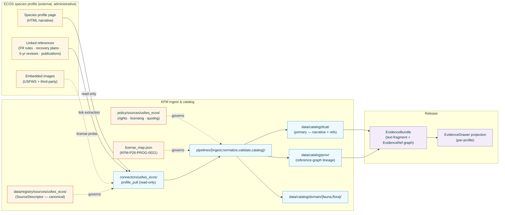
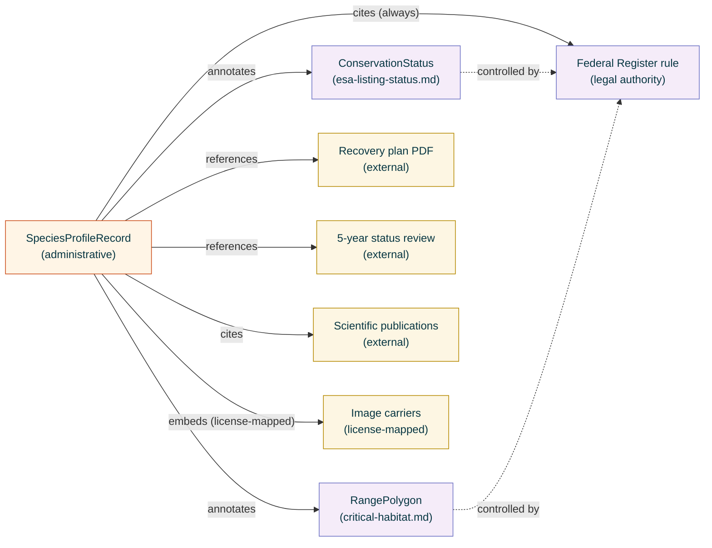

<!-- [KFM_META_BLOCK_V2]
doc_id: kfm://doc/docs-sources-catalog-usfws_ecos-species-profiles
title: USFWS ECOS Species Profiles
type: product-page
version: v0.2
status: draft
owners: <PLACEHOLDER — Docs steward + Source steward for usfws_ecos>
created: 2026-05-20
updated: 2026-05-23
policy_label: public
related:
  - docs/sources/catalog/usfws_ecos/README.md
  - docs/sources/catalog/usfws_ecos/IDENTITY.md
  - docs/sources/catalog/usfws_ecos/RIGHTS-AND-SENSITIVITY-MAP.md
  - docs/sources/catalog/usfws_ecos/critical-habitat.md
  - docs/sources/catalog/usfws_ecos/esa-listing-status.md
  - docs/sources/catalog/usfws_ecos/ipac-project-lists.md
  - docs/sources/catalog/README.md
  - docs/doctrine/directory-rules.md
  - docs/doctrine/lifecycle-law.md
  - docs/doctrine/trust-membrane.md
  - docs/standards/SENSITIVITY_RUBRIC.md
  - docs/standards/DCAT.md
  - docs/runbooks/fauna/SOURCE_REFRESH_RUNBOOK.md
  - data/registry/sources/usfws_ecos/
  - policy/sources/usfws_ecos/
  - policy/sensitivity/fauna/
  - schemas/contracts/v1/source/
  - schemas/contracts/v1/evidence/
  - connectors/usfws_ecos/
adr_refs:
  - ADR-0001 (schema home)
  - <PROPOSED> ADR-S-04 (source-role vocabulary v1)
  - <PROPOSED> ADR-S-05 (sensitivity tier scheme T0–T4)
  - <PROPOSED> ADR-S-12 (connector cadence + quarantine recovery)
tags: [kfm, docs, sources, catalog, usfws_ecos, species-profile, narrative, administrative, fauna, flora, reference-graph]
notes:
  - "PROPOSED product-page scaffold filled to v0.2; family folder docs/sources/catalog/usfws_ecos/ remains a nested convention not yet enumerated in Directory Rules §6.1 — see Open Questions Q-1."
  - "Source role is 'administrative' — distinct from the three sibling products (all 'regulatory'). Species profiles are USFWS-compiled explanatory narrative + reference graph, NOT the legal determination itself. The Federal Register rule remains the regulatory authority. See §4 and §10."
  - "Copyright / quoting discipline applies even though USFWS works are public-domain per 17 U.S.C. §105. KFM's own quote-sparingly / prefer-paraphrase rules govern reproduction in KFM derivatives. See §9."
  - "Editorial-revision cadence (not Federal-Register-rule cadence). Detection requires content-hash diff, not rule-watcher. See §7."
  - "Reference graph (PDFs / FR rules / recovery plans / publications) is a first-class evidence shape for this product. See §8."
[/KFM_META_BLOCK_V2] -->

<a id="top"></a>

# USFWS ECOS Species Profiles

> Per-species **narrative content** and **external reference graph** (5-year reviews, recovery plans, scientific publications, news, image carriers) compiled by USFWS staff and published through ECOS species-profile pages — KFM's `administrative`-role explanatory carrier alongside the regulatory sibling products in this family.

<!-- Top-of-file badge row. Placeholder targets — replace once badge generator (KFM-P3-FEAT-0005) is wired. -->


**Status:** `PROPOSED — scaffold filled` &nbsp;·&nbsp; **Doc version:** `v0.2` &nbsp;·&nbsp; **Family:** [`usfws_ecos`](./README.md) &nbsp;·&nbsp; **Last reviewed:** 2026-05-23

> [!IMPORTANT]
> **The Federal Register rule is the legal description; ECOS species profiles are explanatory; this page is a pointer.** Authoritative descriptor fields live in [`data/registry/sources/usfws_ecos/`](../../../../data/registry/sources/usfws_ecos/). Rights and sensitivity decisions live in [`policy/sources/usfws_ecos/`](../../../../policy/sources/usfws_ecos/) and [`policy/sensitivity/fauna/`](../../../../policy/sensitivity/fauna/), summarized at the family level in [`RIGHTS-AND-SENSITIVITY-MAP.md`](./RIGHTS-AND-SENSITIVITY-MAP.md). **Do not duplicate descriptor or policy content on this product page.**

> [!CAUTION]
> **Narrative content reproduction discipline.** USFWS materials are U.S. federal works not subject to U.S. copyright (per 17 U.S.C. §105), but **KFM's own quoting and paraphrasing discipline still applies** to every narrative fragment ingested from a species profile. Direct quotes are capped at fewer than 15 words and limited to one per source within a single response; longer reproductions must be paraphrased and attributed. Whole-paragraph copies and displacive summaries are denied at Gate C. AI/Focus-Mode answers about a species cite the profile and either quote sparingly or abstain — the cite-or-abstain rule applies to narrative as strictly as it applies to data. See [§9](#9-rights-and-sensitivity-pointer) and [§11](#11-validation-and-catalog-closure).

---

## 📑 Contents

1. [Overview](#1-overview)
2. [Product identity within the family](#2-product-identity-within-the-family)
3. [Source authority](#3-source-authority)
4. [Catalog profiles used](#4-catalog-profiles-used)
5. [Collection identity](#5-collection-identity)
6. [Provenance fields](#6-provenance-fields)
7. [Temporal handling and editorial revision tracking](#7-temporal-handling-and-editorial-revision-tracking)
8. [Identity, entity shape, and reference graph (no geometry)](#8-identity-entity-shape-and-reference-graph-no-geometry)
9. [Rights and sensitivity (pointer)](#9-rights-and-sensitivity-pointer)
10. [Reality boundary](#10-reality-boundary)
11. [Validation and catalog closure](#11-validation-and-catalog-closure)
12. [Related contracts and schemas](#12-related-contracts-and-schemas)
13. [Related connectors and pipelines](#13-related-connectors-and-pipelines)
14. [Example](#14-example)
15. [Open questions](#15-open-questions)
16. [Last reviewed](#16-last-reviewed)

---

## 1. Overview

This product page describes how KFM catalogs **USFWS ECOS species profiles** — the per-species narrative pages published through ECOS that describe a listed species in plain language and link out to controlling documents (Federal Register listing rules, recovery plans, 5-year status reviews, critical-habitat designations, scientific references, news posts, and image carriers). Profiles are KFM's **`administrative`** carrier for ECOS: they explain, contextualize, and link — they do not determine.

> [!NOTE]
> **EXTERNAL** *(preserved without re-verification this session).* USFWS species profile pages are reached from the ECOS gateway. KFM ingests profile content as read-only probes (per `KFM-P22-PROG-0043`) and emits paired evidence: a **narrative-fragment record** (with content hash) and a **reference-graph record** linking out to controlling Federal Register rules, recovery plans, and other carriers. External claims about specific profile-page URLs and content layout remain **NEEDS VERIFICATION** until re-fetched in a session with web access.

> [!IMPORTANT]
> **Narrative + reference graph product.** Unlike the three sibling products (regulatory geometry, regulatory tabular, regulatory project-scoped), this product is **explanatory text plus a graph of external references**. The cardinal evidence is narrative content paired with `EvidenceRef` entries pointing to the *real* authoritative sources — the FR rule for status, the recovery plan PDF for recovery actions, scientific publications for life-history claims, and so on.



[Back to top](#top)

---

## 2. Product identity within the family

> [!NOTE]
> This page is the **fourth** product under the `usfws_ecos` source family, and the **only one** whose source role is `administrative` rather than `regulatory`. Family-wide concerns — authority, identity convention, rights/sensitivity map, taxon anchoring, credential management — live at the **family level** and are not restated here.

| Attribute | Value | Status |
|---|---|---|
| Product name | USFWS ECOS Species Profiles | **CONFIRMED EXTERNAL** (ECOS surface name). |
| Source family | `usfws_ecos` | **PROPOSED** family-folder convention (snake_case); see Q-2. |
| KFM source-role | **`administrative`** (Atlas §24.1.1 enum) | **CONFIRMED enum**; binding governed by ADR-S-04. **Note:** distinct from the other three siblings (all `regulatory`). |
| Domains served | **Fauna** (`ConservationStatus` annotation); **Flora** (when ESA covers listed plants) | **CONFIRMED** doctrine; per-domain README presence **NEEDS VERIFICATION**. |
| Primary upstream surface | ECOS species profile HTML pages + their linked carriers | **EXTERNAL — NEEDS VERIFICATION** of current URL pattern and content layout. |
| Cardinal evidence object | **`SpeciesProfileRecord`** (**PROPOSED** object) carrying narrative-fragment records + `EvidenceRef` graph | **PROPOSED** — new object class introduced by this product. |
| Geometry | **None** (record-keyed by species; range maps inline are references to other products). | **CONFIRMED N/A.** |
| Content character | Narrative HTML + reference links + embedded images | **CONFIRMED EXTERNAL.** |

### 2.1 Disambiguation from sibling products

| If you want… | Use… | Not this page |
|---|---|---|
| **The legal listing status** for a species (E / T / EXPN / etc. + FR rule) | [`esa-listing-status.md`](./esa-listing-status.md) | — |
| **Designated critical habitat** geometry for a species | [`critical-habitat.md`](./critical-habitat.md) | — |
| **Project-scoped species list** for a specific AOI under 50 CFR 402.12 | [`ipac-project-lists.md`](./ipac-project-lists.md) | — |
| The **plain-language description** of a species' biology, range, habitat, threats, and recovery — with links to the documents that govern those statements | This page (USFWS ECOS Species Profiles) | — |
| **Taxonomic** authority itself | ITIS (`C7-07`) and/or GBIF Backbone (`C7-08`) — sibling source-family pages (PROPOSED) | — |
| **State-level** explanatory content (KDWP / KS species accounts) | `<PROPOSED> docs/sources/catalog/kdwp-tess/` | — |
| **Independent scientific narrative** about a species (peer-reviewed literature) | Per-publication evidence; not federal-administrative content. | — |

> [!CAUTION]
> **`administrative` ≠ `regulatory` and ≠ `observed`.** A species profile is USFWS-compiled commentary, not the legal status of a species and not a record of where the species was observed. Per Atlas §24.1.2, *"Administrative compilation cited as observation"* and the analogous *"administrative cited as regulatory"* are both DENY conditions at the trust membrane. KFM derivatives that promote profile narrative into a status claim or an occurrence claim violate the source-role anti-collapse rule.

[Back to top](#top)

---

## 3. Source authority

See [`data/registry/sources/usfws_ecos/`](../../../../data/registry/sources/usfws_ecos/) for the authoritative `SourceDescriptor`. **Do not duplicate descriptor fields here.** Descriptor canonical schema home is `schemas/contracts/v1/source/source-descriptor.json` per Directory Rules §7.4 / ADR-0001 — **NEEDS VERIFICATION** of exact filename in mounted repo.

Doctrinal anchors for this product:

- `KFM-P20-PROG-0001` — ECOS / NatureServe / GBIF source descriptor set: doctrinal basis for ECOS species/status/profile descriptors.
- `KFM-P20-IDEA-0001` — Biodiversity source hierarchy as source-role registry: profiles take the `administrative` role within the ECOS family.
- `KFM-P1-IDEA-0051` — Knowledge-character labels (observed / modeled / regulatory / inferred / interpreted / fused / candidate): profiles must carry `administrative` label and never collapse to `regulatory` or `observed`.
- `KFM-P22-PROG-0043` — Read-only probe posture: *"…operate read-only, fail closed for uncertain observations, and produce process memory rather than release proof."*
- `KFM-P26-PROG-0021` — `license_map.json` mapping: profile content and embedded images run through the license map (CC0, CC-BY, restricted, unknown, attribution-required).
- `C7-07` / `C7-08` — ITIS TSN primary, GBIF Backbone fallback for every species in the profile catalog.

[Back to top](#top)

---

## 4. Catalog profiles used

KFM's catalog layer projects each promoted product into multiple profiles. For **narrative + reference-graph** species profiles, the **PROPOSED** disposition is:

| Profile | Lane | Used by this product? | Basis |
|---|---|---|---|
| **DCAT** Dataset + Distribution (**primary**) | `data/catalog/dcat/` | **PROPOSED — Yes (primary)** | `C4-05`: DCAT is the natural fit for non-spatial narrative datasets. `KFM-P14-IDEA-0002` makes STAC/DCAT/PROV a single harvest surface. |
| **STAC** (Records extension, if registered) | `data/catalog/stac/` | **PROPOSED — Optional / Maybe** | STAC Records extension permits non-spatial entries. Default = **not registered in STAC**; per-Collection decision belongs at family level. |
| **PROV-O / PAV** lineage (**critical for this product**) | `data/catalog/prov/` | **PROPOSED — Yes** | `C8-03`. Profile records carry an unusually rich `prov:wasDerivedFrom` / `prov:references` graph — the reference graph is itself the catalog's most important contribution for this product. |
| **Domain projection** (Fauna) | `data/catalog/domain/fauna/` | **PROPOSED — Yes** | Profile content annotates Fauna `ConservationStatus` records; profile carries no status of its own. |
| **Domain projection** (Flora) | `data/catalog/domain/flora/` | **PROPOSED — Yes, when applicable** | ESA listings cover plants as well as animals. |
| **STAC × Darwin Core hybrid** (`C4-03`) | — | **CONFIRMED No** | DwC applies to occurrence records; profiles are not occurrence evidence. |
| **JSON-LD evidence-bundle distribution** (`C4-04`) | `data/catalog/dcat/` (as a Distribution) | **PROPOSED — Yes** | Content-addressed JSON-LD bundle carries the full reference graph + narrative-fragment hashes. |

> [!TIP]
> **DCAT-primary like ESA listings, but with a richer PROV-O lineage than any other product in the family.** A profile catalog record's value to downstream consumers is not the narrative itself (which they should re-fetch from USFWS) but the **graph of references** KFM has linked to authoritative carriers in the rest of the catalog (ESA listing records, critical-habitat designations, FR rules, recovery plans, scientific publications).

[Back to top](#top)

---

## 5. Collection identity

- **PROPOSED Collection id pattern:** `kfm-usfws_ecos-species-profiles`. Each profile is a DCAT Dataset within the Collection, keyed by the USFWS species id paired with the ITIS TSN.
- **PROPOSED Item id pattern:** `kfm-usfws_ecos-species-profile-<usfws_species_id>-<content_hash_short>`. The `content_hash_short` portion makes each revision a distinct record (per [§7](#7-temporal-handling-and-editorial-revision-tracking)).
- **PROPOSED namespace:** `kfm:` *(per `C4-01`; namespace `kfm:` vs `ks-kfm:` is an open question — see Q-10 and `C4-01` open question).*
- **Asset roles:** **NEEDS VERIFICATION** — confirm against [`schemas/contracts/v1/source/`](../../../../schemas/contracts/v1/source/). Likely role set:
  - `narrative-fragment` — extracted narrative segments (`text/plain` or `text/markdown`)
  - `narrative-snapshot` — full HTML snapshot (`text/html`) for content-hash diffing
  - `reference-graph` — `EvidenceRef` graph (`application/ld+json`)
  - `image-manifest` — embedded image manifest with per-image license map entries (`application/json`)
  - `metadata` — DCAT JSON-LD (`application/ld+json`)
  - `evidence_bundle` — JSON-LD bundle (`application/ld+json`)
- **Collection description (PROPOSED):** Must declare the **administrative source role**, the **deterministic build property**, **governance posture** (per `C4-02`), the **USFWS no-warranty banner** verbatim, the **`license_map.json` policy reference** (`KFM-P26-PROG-0021`), and the **quoting-discipline statement** from [§9](#9-rights-and-sensitivity-pointer).

[Back to top](#top)

---

## 6. Provenance fields

**CONFIRMED shape** (per `C4-01`). For DCAT-primary catalog records, the `kfm:provenance` block is carried on `dcat:Dataset` / `dcat:Distribution`. Per-product values are **NEEDS VERIFICATION** until the connector is wired.

| Field | Type | Source / how computed |
|---|---|---|
| `spec_hash` | sha256 of the canonical record | `C1-02`; JCS-canonicalized record body. |
| `content_hash` | sha256 of the full narrative HTML snapshot | **CONFIRMED-required** — primary aging signal for this product (§7). |
| `evidence_bundle_ref` | `kfm://evidence/<digest>` (or `oci://…` / `ipfs://…`) | `C4-04` content-addressed JSON-LD bundle. |
| `run_record_ref` | `kfm://run/<run-id>` | `C1-01` run receipt. |
| `audit_ref` | `kfm://audit/<attestation-id>` | SLSA / OPA attestation pointer. |
| `policy_digest` | sha256 of the policy bundle used at promotion (includes the `license_map.json` version) | Per `KFM-P22-PROG-0001` Gate A-G contract. |
| `taxon_anchor` | `{ primary: "ITIS TSN", fallback: "GBIF Backbone" + DOI version }` | `C7-07` / `C7-08`; gate-blocking. |
| `usfws_species_id` | USFWS-assigned species identifier (from the profile URL or page metadata) | **EXTERNAL — NEEDS VERIFICATION** of the canonical id field. |
| `reference_graph_digest` | sha256 of the canonicalized `EvidenceRef` graph | **PROPOSED-required** — distinguishes graph-only changes from narrative-only changes. |
| `narrative_quote_count` | integer (count of direct quotes in the published KFM derivative) | **PROPOSED-required** for KFM-published narrative; supports the per-source one-quote rule (§9). |
| `narrative_paraphrase_attribution_present` | boolean | **PROPOSED-required** for KFM-published narrative. |
| `kfm:provenance.editorial_revision_at` | ISO timestamp | When KFM's content-hash watcher first detected this revision. |
| `kfm:provenance.usfws_last_seen_text` | ISO timestamp (if profile page declares one) | USFWS-declared "last reviewed" or "page last updated" timestamp where present. |
| `kfm:provenance.image_license_summary` | structured (per-image license-map entries) | Per `KFM-P26-PROG-0021`. |

Per-asset integrity: **`file:checksum`** (SHA-256) on every published distribution (per `C3-02`).

> [!TIP]
> **`content_hash` is the heartbeat of this product.** Unlike regulatory siblings (which change with Federal Register rules), profile content changes editorially with no public trigger. The connector watches `content_hash` and emits a pre-RAW `EventEnvelope` only when the hash changes.

[Back to top](#top)

---

## 7. Temporal handling and editorial revision tracking

**CONFIRMED doctrine** (Atlas Fauna §E + `KFM-P1-IDEA-0047`): distinct **source / observed / valid / retrieval / release / correction** times are preserved where material. For species profiles, the editorial-revision pattern adds a unique wrinkle: a profile may change *without any regulatory or empirical trigger*.

| Time | Meaning for this product | Status |
|---|---|---|
| `source_time` | When USFWS last edited the profile page (declared, where present). | **EXTERNAL — NEEDS VERIFICATION**; not all profile pages declare a clear edit timestamp. |
| `editorial_revision_at` | When KFM's content-hash watcher first detected the current revision. | **CONFIRMED-required** — the practical primary timestamp for this product. |
| `valid_from` | Same as `editorial_revision_at` for the profile record itself; per-claim `valid_from` should follow the **referenced** authority (FR rule effective date, recovery plan publication date, etc.) — not the profile revision date. | **CONFIRMED-required**; per-claim binding is gate-checked. |
| `valid_to` | `null` until superseded by a later editorial revision. | **CONFIRMED-required** (nullable). |
| `retrieval_time` | When KFM's connector fetched the snapshot. | **CONFIRMED-required** per `C1-01`. |
| `release_time` | When the KFM-derived `SpeciesProfileRecord` was published. | **CONFIRMED-required** at Gate G. |
| `correction_time` | When a `CorrectionNotice` updates the record (taxon update, content-rebinding, link rot fix). | **CONFIRMED-required** when applicable. |
| `observed_time` | **Not applicable.** Profiles are commentary, not observation. | **CONFIRMED N/A.** |

> [!IMPORTANT]
> **A profile change is not a regulatory change.** If a Federal Register rule has not changed but the species profile narrative has, **the regulatory status of the species has not changed**. KFM emits a new `SpeciesProfileRecord` (a new content_hash → new spec_hash), but it does **not** emit a `CorrectionNotice` against any `ConservationStatus` record from the sibling listing product. Mistaking an editorial revision for a status change is a source-role anti-collapse violation.

> [!IMPORTANT]
> **Per-claim time discipline.** Statements *inside* a profile (e.g., *"This species was listed as Endangered in YYYY"*) carry the **referenced rule's** effective date, not the profile's revision date. The profile's `editorial_revision_at` belongs to the profile record itself, not to claims it relays.

> [!TIP]
> **Pre-RAW `EventEnvelope` only when content changes.** The connector polls the profile URL, hashes the response, and emits a pre-RAW `EventEnvelope` only when the hash differs from the previously stored `content_hash`. Polling without change yields a no-op `EventRunReceipt`; this matches the v0.2 connector contract's material-change-watcher pattern.

[Back to top](#top)

---

## 8. Identity, entity shape, and reference graph (no geometry)

This product replaces the geometry-and-projection section with two structural concerns specific to narrative content: **identity** (what makes one profile distinct from another) and **reference graph** (the most valuable artifact KFM produces from a profile).

### 8.1 Identity

| Attribute | Value (PROPOSED) | Status |
|---|---|---|
| Cardinal identity | `(usfws_species_id, taxon_anchor, content_hash)` triple | **PROPOSED**; deterministic key per Fauna §E identity rule. |
| Taxon anchor — primary | **ITIS TSN** | **CONFIRMED required** per `C7-07`. |
| Taxon anchor — fallback | **GBIF Backbone Taxonomy** (DOI `10.15468/39omei`, version-pinned) | **CONFIRMED required** when ITIS lacks coverage, per `C7-08`. |
| USFWS species id | **CONFIRMED-required** as an external id; KFM does not mint a replacement. | |
| Geometry | **None.** | **CONFIRMED N/A.** |
| CRS | **None.** | **CONFIRMED N/A.** |
| Multi-revision behavior | Each editorial revision is a **new record** keyed by `content_hash`; prior revisions are preserved in catalog history, not overwritten. | **PROPOSED**. |

### 8.2 Reference graph (the value-add)

A species-profile catalog record's principal KFM-side value is the **reference graph** linking the profile to authoritative carriers elsewhere in the catalog and the wider web.



| Reference type | Cardinality | Stored as | Gate behavior |
|---|---|---|---|
| Federal Register rule citation | **Required** (≥1 per profile if the species is listed) | `EvidenceRef` with `cite-as` rel | Missing FR citation when species is listed → quarantine (Gate F). |
| Sibling `ConservationStatus` record | Required when KFM has ingested the listing | `EvidenceRef` resolving to `kfm://…` | If unresolvable, mark stale, do not deny. |
| Sibling `RangePolygon` record | Required when KFM has ingested the CH designation | `EvidenceRef` resolving to `kfm://…` | If unresolvable, mark stale, do not deny. |
| Recovery plan PDF | Optional | `EvidenceRef` with media type `application/pdf` | Link-rot detected → emit `CorrectionNotice`. |
| 5-year status review | Optional | `EvidenceRef` | Link-rot detected → emit `CorrectionNotice`. |
| Scientific publication | Optional | `EvidenceRef` with DOI where available | DOI preferred; bare URL accepted. |
| Embedded image | Optional | `image-manifest` asset + per-image entry in `license_map.json` (`KFM-P26-PROG-0021`) | Images with `restricted` or `unknown` license → DENY republication; profile record may reference upstream URL only. |

### 8.3 Narrative-fragment storage

Narrative-fragment records are extracted from the profile and stored as **content-addressed text fragments** with attribution metadata. KFM derivatives that reproduce a fragment beyond the per-quote / per-source limits in [§9](#9-rights-and-sensitivity-pointer) MUST paraphrase or link out; the fragment store exists so the quoting discipline can be mechanically checked, not so KFM can republish profile prose at will.

[Back to top](#top)

---

## 9. Rights and sensitivity (pointer)

**Do not restate policy here.** See [`policy/sensitivity/fauna/`](../../../../policy/sensitivity/fauna/) and the family-level summary at [`RIGHTS-AND-SENSITIVITY-MAP.md`](./RIGHTS-AND-SENSITIVITY-MAP.md).

> [!NOTE]
> **Default tier: T0 (Open) per fragment.** Profile narrative is public-administrative metadata. Direct-quote and link evidence default to T0 per the family-level mapping in the prior carrier work. The constraint that distinguishes this product from its siblings is **not sensitivity** but **reproduction discipline** — see below.

### 9.1 Reproduction discipline (the operative constraint for this product)

> [!CAUTION]
> **KFM's quoting discipline applies even to public-domain federal works.** USFWS materials are not subject to U.S. copyright under 17 U.S.C. §105, but KFM's own publication rules still cap how much narrative may be reproduced in any KFM-derived surface:
>
> - **Direct quotes:** fewer than 15 words per quote.
> - **One quote per source per response.** After one quote, the source is closed within that response; everything else must be paraphrased.
> - **Paraphrase must carry attribution.** "According to the USFWS species profile, …" — not silent paraphrase.
> - **No displacive summaries.** A KFM-rendered summary cannot substitute for reading the original profile.
> - **No whole-paragraph copies.** Paragraph-length blocks of profile prose are denied at Gate C.
>
> AI / Focus-Mode answers about a species cite the profile and either quote sparingly or **abstain** — the cite-or-abstain rule applies to narrative as strictly as it applies to data.

### 9.2 Image-licensing posture

Embedded images in species profiles are run through `license_map.json` (`KFM-P26-PROG-0021`) at admission:

| `license_map.json` outcome | Allowed flags | Behavior |
|---|---|---|
| `CC0` | Republish-OK | Cache and serve; attribution preserved. |
| `CC-BY` (or similar with attribution) | Republish-OK with attribution | Cache and serve; attribution carried verbatim. |
| `attribution-required` | Republish-OK with attribution | Same as `CC-BY`. |
| `restricted` | **Republish-DENY** | KFM may reference the upstream URL only; no caching, no display in KFM-published derivatives. |
| `unknown` | **Republish-DENY (fail closed)** | Same as `restricted` until license is determined. |

### 9.3 Cross-lane join cautions

Profiles can carry references to sensitive species; joining profile narrative with precise rare-species occurrence data inherits the **T4 deny-by-default** posture from `KFM-P24-IDEA-0002`. Tribal sovereignty review applies when a profile references cultural significance to a Tribal nation (`sovereignty_review` flag at the family level).

[Back to top](#top)

---

## 10. Reality boundary

> [!IMPORTANT]
> **Federal Register listings are legal; profiles are explanation.** Every status claim that appears inside a species profile carries its own reality boundary — the Federal Register rule for that listing. KFM Focus-Mode AI answers that paraphrase profile narrative MUST **cite-or-abstain** to the underlying authority (FR rule for status; recovery plan for recovery actions; published research for life-history claims), never to the profile alone.

> [!IMPORTANT]
> **Profiles age editorially, not by rule.** A profile may state outdated information without any Federal Register rule having changed; equally, a profile may not yet reflect a new FR rule. Absence-of-content in a profile is **UNKNOWN**, not "no such thing exists."

> [!IMPORTANT]
> **Profile narrative is not occurrence evidence.** A profile that says *"This species occurs in the Flint Hills"* is administrative commentary, not an observation record. KFM must not promote profile narrative into per-place observation claims; the GBIF / iNaturalist / eBird / iDigBio sources (`observed` role) are the carriers for occurrence evidence.

[Back to top](#top)

---

## 11. Validation and catalog closure

- **Catalog closure required before public release** (Pass-10 / `KFM-P1-IDEA-0020`; lifecycle invariant per `docs/doctrine/lifecycle-law.md`).
- **Taxon-anchor coverage** (gate-blocking) — `usfws_profile_taxon_anchor_required`: every profile carries ITIS TSN or GBIF Backbone fallback per `C7-07` / `C7-08`.
- **FR citation when species is listed** (gate-blocking) — `usfws_profile_fr_citation_when_listed`: when KFM also has the matching `ConservationStatus` record, the profile MUST reference the controlling FR rule. Missing reference → quarantine.
- **Content-hash freshness** — `usfws_profile_content_hash_required`: every record records the snapshot's `content_hash` for diffing.
- **Quote-limit compliance** (gate-blocking) — `usfws_profile_quote_limit_per_response`: any KFM-published derivative quoting profile narrative must have ≤1 quote per source per response and each quote < 15 words.
- **Paraphrase-attribution presence** (gate-blocking) — `usfws_profile_paraphrase_attribution_required`: paraphrases of profile narrative MUST carry USFWS attribution.
- **No-displacive-summary** (gate-blocking) — `usfws_profile_no_displacive_summary`: KFM-rendered summaries cannot substitute for the original profile; summary length checked against the original.
- **Reference-graph closure** — `usfws_profile_reference_graph_closure`: every reference in the graph either resolves or is marked stale with a `CorrectionNotice` skeleton.
- **Image-license map compliance** — `usfws_profile_image_license_map`: every embedded image has an entry in `license_map.json`; `restricted` / `unknown` entries DENY republication per `KFM-P26-PROG-0021`.
- **Source-role anti-collapse** (gate-blocking) — `usfws_profile_role_anti_collapse`: profile narrative MUST NOT be promoted into a `regulatory` or `observed` claim; check at Focus-Mode response surface and at catalog projection.
- **DCAT mirror closure** (`KFM-P14-IDEA-0002`, `KFM-P26-PROG-0025`).
- **PROV-O closure** (`C8-03`): reference graph must close as a valid `prov:Bundle`.
- **Catalog QA CI surface** (`KFM-P27-FEAT-0004`).
- **Promotion Gates A–G** (Atlas §24.6.1, `KFM-P22-PROG-0001`).
- **STAC Projection lint** (`KFM-P27-FEAT-0003`) — **Not applicable** to this product (no geometry).

> [!TIP]
> **Negative fixtures required for this product:** missing taxon anchor (Gate A quarantine); missing FR citation when species is listed (Gate F deny); quote exceeding 14 words (Gate C deny); two quotes from the same profile in one response (Gate C deny); paraphrase without attribution (Gate C deny); embedded image with `unknown` license that was republished (Gate C deny); profile narrative cited as the regulatory status authority (Gate F deny — source-role anti-collapse); profile narrative cited as occurrence evidence (Gate F deny — source-role anti-collapse).

[Back to top](#top)

---

## 12. Related contracts and schemas

| Surface | Path (PROPOSED unless noted) | Status |
|---|---|---|
| `SourceDescriptor` semantic contract | [`contracts/source/`](../../../../contracts/source/) | **PROPOSED**. |
| `SourceDescriptor` machine schema | [`schemas/contracts/v1/source/`](../../../../schemas/contracts/v1/source/) | **PROPOSED canonical home** per Directory Rules §7.4 / ADR-0001. |
| `SpeciesProfileRecord` contract | [`contracts/data/fauna/`](../../../../contracts/data/fauna/) | **PROPOSED** — new object class introduced by this product. |
| `SpeciesProfileRecord` schema | [`schemas/contracts/v1/fauna/`](../../../../schemas/contracts/v1/fauna/) | **PROPOSED**. |
| `EvidenceBundle` / `EvidenceRef` schemas | [`schemas/contracts/v1/evidence/`](../../../../schemas/contracts/v1/evidence/) | **PROPOSED** per `KFM-P26-PROG-0004` / `KFM-P26-PROG-0005`. The reference graph for this product is dense and exercises these schemas more than the other family products. |
| `license_map.json` (controlled vocabulary) | [`policy/sources/usfws_ecos/license_map.json`](../../../../policy/sources/usfws_ecos/) | **PROPOSED** lane per `KFM-P26-PROG-0021`. |
| Narrative-fragment store contract | [`contracts/data/governance/narrative_fragment/`](../../../../contracts/data/governance/) | **PROPOSED** — new contract supporting per-fragment hashing and attribution checks. |
| `CorrectionNotice` | [`schemas/contracts/v1/governance/`](../../../../schemas/contracts/v1/governance/) | **PROPOSED**. |
| `RealityBoundaryNote` | [`schemas/contracts/v1/governance/`](../../../../schemas/contracts/v1/governance/) | **PROPOSED**. |

[Back to top](#top)

---

## 13. Related connectors and pipelines

| Stage | Path (PROPOSED) | Notes |
|---|---|---|
| Connector | [`connectors/usfws_ecos/profile_pull/`](../../../../connectors/usfws_ecos/) | Read-only probe per `KFM-P22-PROG-0043`; emits pre-RAW `EventEnvelope` + `EventRunReceipt` **only when `content_hash` changes** (material-change watcher pattern, v0.2 connector contract). |
| Reference-graph extractor | [`pipelines/normalize/ref_graph/`](../../../../pipelines/normalize/) | **PROPOSED** — extracts FR rule links, recovery-plan PDFs, 5-year-review PDFs, scientific-publication DOIs/URLs, and embedded image references from the narrative HTML. |
| Image-license resolver | [`pipelines/normalize/image_license/`](../../../../pipelines/normalize/) | **PROPOSED** — runs each embedded image through `license_map.json` and emits a per-image license-state record. |
| Ingest pipeline | [`pipelines/ingest/`](../../../../pipelines/ingest/) | RAW capture into `data/raw/fauna/usfws_ecos/profiles/<usfws_species_id>/<content_hash_short>/`. |
| Normalize pipeline | [`pipelines/normalize/`](../../../../pipelines/normalize/) | HTML → narrative-fragment extraction; reference-graph extraction; image-license resolution; taxon resolution to ITIS TSN / GBIF Backbone. |
| Validate pipeline | [`pipelines/validate/`](../../../../pipelines/validate/) | All validators in [§11](#11-validation-and-catalog-closure), especially the quote-limit / paraphrase-attribution / no-displacive-summary checks. |
| Catalog pipeline | [`pipelines/catalog/`](../../../../pipelines/catalog/) | DCAT-primary catalog closure with rich PROV-O lineage. |
| Pipeline specs | [`pipeline_specs/fauna/`](../../../../pipeline_specs/fauna/) | Declarative configuration. |
| Refresh runbook | [`docs/runbooks/fauna/SOURCE_REFRESH_RUNBOOK.md`](../../../runbooks/fauna/SOURCE_REFRESH_RUNBOOK.md) | **CONFIRMED authored** (prior session). |
| Profile content-hash watcher | [`pipelines/watchers/usfws_profile_revision/`](../../../../pipelines/watchers/) | **PROPOSED** — polls profile URLs, hashes responses, emits `EventEnvelope` when hash changes. |
| Link-rot watcher | [`pipelines/watchers/link_rot/`](../../../../pipelines/watchers/) | **PROPOSED** — polls referenced PDFs / publication URLs; emits `CorrectionNotice` skeleton when 404 / 410. |

[Back to top](#top)

---

## 14. Example

*Illustrative only — not authoritative. The minimal STAC + `kfm:provenance` shape lives at [`_examples/stac-item-example.json`](./_examples/stac-item-example.json) (file presence **NEEDS VERIFICATION**); a profile-specific JSON-LD example belongs at `_examples/species-profile-record-example.jsonld` (PROPOSED).*

<details>
<summary><b>Click to expand — minimal SpeciesProfileRecord sketch (illustrative, JSON-LD)</b></summary>

```json
{
  "@context": {
    "dcat": "http://www.w3.org/ns/dcat#",
    "dct": "http://purl.org/dc/terms/",
    "prov": "http://www.w3.org/ns/prov#",
    "kfm": "https://kfm.example/ns/kfm#"
  },
  "@type": "dcat:Dataset",
  "@id": "kfm:dataset/usfws_ecos-species-profile-<usfws_species_id>-<content_hash_short>",
  "dct:title": "USFWS ECOS Species Profile — <Common Name> (<Scientific name>)",
  "dct:description": "Administrative explanatory carrier for USFWS ECOS species profile content; legal source for any status claim is the controlling Federal Register rule.",
  "dct:type": "kfm:SpeciesProfileRecord",
  "dct:license": "<USFWS no-warranty / public domain notice>",
  "dct:conformsTo": "kfm://profile/evidence-bundle/v1",
  "dct:publisher": { "@id": "kfm:org/usfws" },
  "kfm:source_role": "administrative",
  "kfm:role_authority": "U.S. Fish & Wildlife Service",
  "kfm:provenance": {
    "spec_hash": "<sha256 of canonical record body>",
    "content_hash": "<sha256 of full HTML snapshot>",
    "reference_graph_digest": "<sha256 of canonicalized EvidenceRef graph>",
    "evidence_bundle_ref": "kfm://evidence/<digest>",
    "run_record_ref": "kfm://run/<run-id>",
    "audit_ref": "kfm://audit/<attestation-id>",
    "policy_digest": "<sha256 of policy bundle (incl. license_map.json version)>",
    "usfws_species_id": "<usfws id>",
    "taxon_anchor": {
      "primary": { "scheme": "ITIS-TSN", "value": "<tsn>" },
      "fallback": { "scheme": "GBIF-Backbone", "doi": "10.15468/39omei", "version": "<snapshot-id>", "key": "<backbone-key>" }
    },
    "editorial_revision_at": "<ISO timestamp>",
    "usfws_last_seen_text": "<ISO timestamp or null>",
    "image_license_summary": [
      { "image_ref": "...", "license_state": "CC0 | CC-BY | attribution-required | restricted | unknown" }
    ]
  },
  "kfm:reference_graph": [
    { "@type": "prov:Entity", "kfm:rel": "controlled_by", "kfm:target": "kfm://release/usfws_ecos/esa-listing-status/<species>", "kfm:source_role": "regulatory" },
    { "@type": "prov:Entity", "kfm:rel": "annotates", "kfm:target": "kfm://release/usfws_ecos/critical-habitat/<species>", "kfm:source_role": "regulatory" },
    { "@type": "prov:Entity", "kfm:rel": "cite-as", "kfm:target": "https://www.federalregister.gov/documents/<rule-id>" },
    { "@type": "prov:Entity", "kfm:rel": "references", "kfm:target": "<recovery-plan-pdf-url>" },
    { "@type": "prov:Entity", "kfm:rel": "references", "kfm:target": "<5-year-review-pdf-url>" }
  ],
  "dcat:distribution": [
    { "@type": "dcat:Distribution", "dct:title": "Narrative snapshot (HTML)", "dcat:mediaType": "text/html", "dcat:accessURL": "...", "file:checksum": "..." },
    { "@type": "dcat:Distribution", "dct:title": "Narrative fragments (Markdown)", "dcat:mediaType": "text/markdown", "dcat:accessURL": "...", "file:checksum": "..." },
    { "@type": "dcat:Distribution", "dct:title": "Reference graph (JSON-LD)", "dcat:mediaType": "application/ld+json", "dcat:accessURL": "...", "file:checksum": "..." },
    { "@type": "dcat:Distribution", "dct:title": "Image manifest (JSON)", "dcat:mediaType": "application/json", "dcat:accessURL": "...", "file:checksum": "..." },
    { "@type": "dcat:Distribution", "dct:title": "Evidence bundle (JSON-LD)", "dcat:mediaType": "application/ld+json", "dct:conformsTo": "kfm://profile/evidence-bundle/v1", "dcat:accessURL": "kfm://evidence/<digest>" }
  ]
}
```

</details>

[Back to top](#top)

---

## 15. Open questions

| # | Question | Class | Suggested resolution |
|---|---|---|---|
| Q-1 | Is `docs/sources/catalog/<source_family>/<product>.md` the right nesting, or should source-catalog content live as a flat single file per source? | **NEEDS VERIFICATION** | ADR-class (Directory Rules §2.4(2)); family-level decision. |
| Q-2 | Folder naming variance: `usfws_ecos` (snake_case) here vs `usfws-ecos` (kebab-case) in earlier single-file pattern. | **NEEDS VERIFICATION** | Defer to broader naming ADR (Directory Rules §18 OPEN-DR-04). |
| Q-3 | Should this product be registered in STAC via the Records extension, or stay DCAT-only? | **PROPOSED** | Default = DCAT-only; revisit if a STAC harvester adds the Records extension as a requirement. |
| Q-4 | One Collection for all species profiles, or one per domain (Fauna / Flora)? | **PROPOSED** | Default = **one Collection** with `domain` as a per-record property. |
| Q-5 | Confirm cadence — **editorial revision** only (content-hash watcher), with no fixed schedule? | **OPEN** | Resolve in `data/registry/sources/usfws_ecos/` descriptor + watcher config; material to **ADR-S-12**. |
| Q-6 | Confirm rights status, CARE applicability, and the operative `license_map.json` versioning policy. | **OPEN** | Resolve in [`RIGHTS-AND-SENSITIVITY-MAP.md`](./RIGHTS-AND-SENSITIVITY-MAP.md) and in `policy/sources/usfws_ecos/license_map.json`. |
| Q-7 | **`license_map.json` ownership.** Is the license map per-family (`policy/sources/usfws_ecos/license_map.json`) or repo-wide (`policy/sources/license_map.json`)? `KFM-P26-PROG-0021` is silent on scope. | **OPEN** | Author the license-map placement ADR; default to per-family until repo-wide demand exists. |
| Q-8 | **Quote-limit enforcement mechanics.** Is the per-response one-quote-per-source rule enforced at the catalog gate, the runtime response envelope, or both? | **PROPOSED — gating** | Enforce at both: catalog gate rejects published derivatives that exceed the cap; runtime envelope guard prevents accidental over-quotation in Focus Mode responses. |
| Q-9 | **AI/Focus-Mode response posture for narrative content.** Should the default be to quote + cite, or to paraphrase + cite with no quotes? | **PROPOSED** | Default = **paraphrase + cite**, with sparing quotes only when exact wording is materially significant. AI cite-or-abstain remains binding. |
| Q-10 | **STAC namespace pin** (`kfm:` vs `ks-kfm:`, per `C4-01`). | **OPEN** | Pin at family / catalog level. |
| Q-11 | **Image-carrier privacy.** Some profile pages embed photographs that may include incidental human subjects or third-party-licensed wildlife photography. Does KFM republish, link-through-only, or deny by default? | **PROPOSED — gating** | Default = **link-through-only** until per-image license is confirmed `CC0` / `CC-BY` / `attribution-required` by `license_map.json`. |
| Q-12 | **Profile-vs-listing diff alerting.** When a profile asserts a status that does not match the latest KFM `ConservationStatus` record, is that a Gate-F deny, a stale marker, or a steward alert? | **PROPOSED** | Default = **steward alert + stale marker on the profile**; the listing record remains canonical for status. |
| Q-13 | **Multi-language profile content.** Some USFWS profile pages have Spanish content. Should KFM treat the language variant as a separate record or as a translation distribution within the same record? | **PROPOSED** | Default = **translation distribution within the same record**; per-language `content_hash` recorded. |

[Back to top](#top)

---

## 16. Last reviewed

2026-05-23 *(scaffold filled; product-page polished against doctrine corpus; mounted repo not inspected this session).*

---

> **Doc version:** v0.2 (draft) &nbsp;·&nbsp; **Family:** [`usfws_ecos`](./README.md) &nbsp;·&nbsp; **Catalog root:** [`docs/sources/catalog/`](../README.md) &nbsp;·&nbsp; [Back to top](#top)
