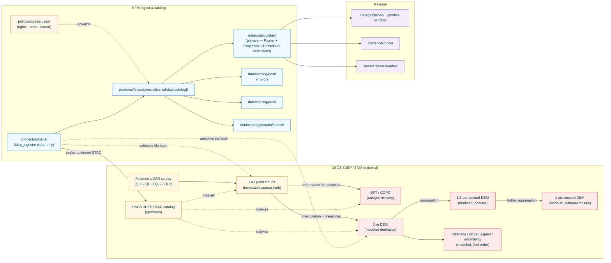

<!-- [KFM_META_BLOCK_V2]
doc_id: kfm://doc/docs-sources-catalog-usgs-3dep-elevation
title: USGS 3D Elevation Program (3DEP)
type: product-page
version: v0.2
status: draft
owners: <PLACEHOLDER — Docs steward + Source steward for usgs>
created: 2026-05-20
updated: 2026-05-23
policy_label: public
related:
  - docs/sources/catalog/usgs/README.md
  - docs/sources/catalog/usgs/IDENTITY.md
  - docs/sources/catalog/usgs/RIGHTS-AND-SENSITIVITY-MAP.md
  - docs/sources/catalog/README.md
  - docs/doctrine/directory-rules.md
  - docs/doctrine/lifecycle-law.md
  - docs/doctrine/trust-membrane.md
  - docs/standards/SENSITIVITY_RUBRIC.md
  - docs/standards/STAC.md
  - docs/standards/PMTILES.md
  - docs/runbooks/spatial-foundation/SOURCE_REFRESH_RUNBOOK.md
  - data/registry/sources/usgs/
  - policy/sources/usgs/
  - schemas/contracts/v1/spatial/
  - schemas/contracts/v1/source/
  - connectors/usgs/
adr_refs:
  - ADR-0001 (schema home)
  - <PROPOSED> ADR-S-04 (source-role vocabulary v1)
  - <PROPOSED> ADR-S-05 (sensitivity tier scheme T0–T4)
  - <PROPOSED> ADR-S-07 (3D admission policy)
  - <PROPOSED> ADR-S-12 (connector cadence + quarantine recovery)
  - <PROPOSED> ADR-S-14 (cross-lane join policy)
tags: [kfm, docs, sources, catalog, usgs, 3dep, elevation, lidar, dem, terrain, raster, cog, spatial-foundation]
notes:
  - "PROPOSED product-page scaffold filled to v0.2; family folder docs/sources/catalog/usgs/ is new in this conversation and not yet enumerated in Directory Rules §6.1 — see Open Questions Q-1."
  - "Heterogeneous source-role per KFM-P30-IDEA-0019: LAZ = observed (immutable source truth), EPT/COPC = derivative analytic delivery, 1m DEM = modeled derivative, hillshade/slope/aspect = modeled second-order derivatives. See §2.1 and §4."
  - "Vertical datum + horizontal CRS are gate-critical for this product per ML-061-015 (terrain artifact manifests) and ML-061-022 (NFHL units check). See §8.2."
  - "STAC is the natural primary catalog (with Raster, Projection, and Pointcloud extensions). DCAT participates as a mirror. Upstream 3DEP already publishes a STAC catalog — KFM ingests from upstream STAC where possible per KFM-P14-PROG-0011."
  - "Cross-domain product: serves Spatial Foundation (2D) AND Planetary/3D. The same source family appears in both domain §D source-family tables in the Atlas."
[/KFM_META_BLOCK_V2] -->

<a id="top"></a>

# USGS 3D Elevation Program (3DEP)

> Terrain, DEMs, LiDAR point clouds, EPT/COPC analytic delivery, and derived raster surfaces (hillshade, slope, aspect, uncertainty) — the **Spatial Foundation** and **Planetary/3D** terrain carrier published by the U.S. Geological Survey.

<!-- Top-of-file badge row. Placeholder targets — replace once badge generator (KFM-P3-FEAT-0005) is wired. -->


**Status:** `PROPOSED — scaffold filled` &nbsp;·&nbsp; **Doc version:** `v0.2` &nbsp;·&nbsp; **Family:** [`usgs`](./README.md) &nbsp;·&nbsp; **Last reviewed:** 2026-05-23

> [!IMPORTANT]
> **This page is a pointer.** Authoritative descriptor fields live in [`data/registry/sources/usgs/`](../../../../data/registry/sources/usgs/). Rights, sensitivity, and any infrastructure-overlay policy live in [`policy/sources/usgs/`](../../../../policy/sources/usgs/) and [`policy/sensitivity/`](../../../../policy/sensitivity/), summarized at the family level in [`RIGHTS-AND-SENSITIVITY-MAP.md`](./RIGHTS-AND-SENSITIVITY-MAP.md). **Do not duplicate descriptor or policy content on this product page.**

> [!CAUTION]
> **Vertical datum and horizontal CRS are gate-critical.** Per `ML-061-015` *"Vertical datum and CRS belong in terrain artifact manifests"* and `ML-061-022` *"NFHL vertical datum and units must be checked before engineering claims"*, every 3DEP-derived tile MUST declare its horizontal CRS, vertical datum (e.g., NAVD88), geoid model where applicable, and units (m vs ft) **explicitly**. Silent mixing of vertical datums or units is denied at Gate D. Analysis CRS and web-delivery CRS are kept separate per `ML-061-096`. Nodata must remain consistent through pyramid overviews per `ML-061-098`. See [§8](#8-geometry-projection-and-vertical-datum-discipline).

---

## 📑 Contents

1. [Overview](#1-overview)
2. [Product identity within the family](#2-product-identity-within-the-family)
3. [Source authority](#3-source-authority)
4. [Catalog profiles used](#4-catalog-profiles-used)
5. [Collection identity](#5-collection-identity)
6. [Provenance fields](#6-provenance-fields)
7. [Temporal handling and acquisition discipline](#7-temporal-handling-and-acquisition-discipline)
8. [Geometry, projection, and vertical-datum discipline](#8-geometry-projection-and-vertical-datum-discipline)
9. [Rights and sensitivity (pointer)](#9-rights-and-sensitivity-pointer)
10. [Reality boundary](#10-reality-boundary)
11. [Validation and catalog closure](#11-validation-and-catalog-closure)
12. [Related contracts and schemas](#12-related-contracts-and-schemas)
13. [Related connectors and pipelines](#13-related-connectors-and-pipelines)
14. [Example](#14-example)
15. [Open questions](#15-open-questions)
16. [Last reviewed](#16-last-reviewed)

---

## 1. Overview

This product page describes how KFM catalogs **USGS 3D Elevation Program (3DEP)** terrain products — the U.S. national framework for elevation data covering bare-earth and first-return surfaces at multiple resolutions. 3DEP includes airborne LiDAR point clouds at known Quality Levels (QL0–QL3), gridded Digital Elevation Models (1 m, 1/3 arc-second, 1 arc-second), and second-order derivatives (hillshade, slope, aspect, uncertainty surfaces).

> [!NOTE]
> **EXTERNAL** *(preserved without re-verification this session).* USGS publishes 3DEP through The National Map (TNM) Download service and a public STAC catalog. KFM ingests from the upstream STAC catalog where feasible (per `KFM-P14-PROG-0011`) and re-emits KFM-namespaced STAC Items with `kfm:provenance` blocks. Specific endpoint URLs, current Quality-Level coverage maps, and acquisition schedules remain **NEEDS VERIFICATION** until re-fetched in a session with web access.

> [!IMPORTANT]
> **KFM's source hierarchy for 3DEP** (per `KFM-P30-IDEA-0019`): LAZ point clouds are the **immutable source truth**; EPT/COPC are the **analytic delivery format** for visualization and analytics; 1 m DEMs are **modeled derivatives**; coarser DEMs and hillshade/slope/aspect are **second-order modeled derivatives**. This hierarchy is preserved through every KFM transform and is gate-checked.



[Back to top](#top)

---

## 2. Product identity within the family

> [!NOTE]
> This page is the **first** product under a new `usgs` source family. Sibling products (each **PROPOSED**, not yet authored) likely include `usgs-nhd.md` (hydrography), `usgs-wbd.md` (watershed boundaries), `usgs-gnis.md` (place names — `C7-09` confirmed authority), `usgs-nlcd.md` (land cover), `usgs-naip.md` (imagery; per `KFM-P14-PROG-0011` is a sibling product), `usgs-earthquakes.md`, and others. Family-wide concerns — authority, identity convention, rights/sensitivity map — live at the **family level** and are not restated here.

| Attribute | Value | Status |
|---|---|---|
| Product name | USGS 3D Elevation Program (3DEP) | **CONFIRMED EXTERNAL** (USGS program name). |
| Source family | `usgs` | **PROPOSED** family-folder convention; see Q-1. |
| KFM source-role | **Heterogeneous** — see [§2.1](#21-sub-product-source-role-decomposition) | **CONFIRMED enum** per Atlas §24.1.1; per-sub-product disposition governed by ADR-S-04. |
| Domains served | **Spatial Foundation** (primary, 2D); **Planetary/3D** (secondary, 3D); downstream feeds **Hydrology**, **Geology**, **Hazards**, **Agriculture**, **Archaeology** | **CONFIRMED** — listed in both Spatial Foundation §D and Planetary/3D §D source-family tables (Atlas Domains v1.1). |
| Primary upstream surface | USGS 3DEP STAC catalog + TNM Download | **EXTERNAL — NEEDS VERIFICATION** of current endpoint URLs. |
| Cardinal evidence objects | `Elevation/DEM manifest`, `COGArtifactManifest`, `RasterAssetManifest`, `TerrainTilesetManifest`, `UncertaintyRaster`/`UncertaintySurface`, `ArrayAssetManifest` | **PROPOSED** per `Master MapLibre Components v2.1` Section K + Atlas Spatial Foundation §E object families. |
| Geometry | **Yes — raster + point cloud** | **CONFIRMED**. |
| Volume | **Very large** (TB–PB at national scale); selective Kansas tile ingest recommended | **CONFIRMED-large**; selective ingest is a design constraint (Q-9). |

### 2.1 Sub-product source-role decomposition

Per `KFM-P30-IDEA-0019` *"Kansas LiDAR should distinguish immutable LAZ source truth from EPT/COPC analytic delivery and 1 m DEM derivatives"*:

| Sub-product | `source_role` | Rationale | Atlas §24.1.1 cell |
|---|---|---|---|
| LAZ point clouds | **`observed`** | Direct LiDAR returns tied to known acquisition time and place; immutable source truth (`ML-061-009`). | "A direct reading, measurement, or first-hand evidentiary record tied to a place and time." |
| EPT / COPC | `observed` (derivative carrier) | Reformatted-for-analytics view of the same returns; preserves observation lineage but optimized for streaming/analysis. | Reading-note caveat: EPT/COPC carry the `derivation_from = LAZ` reference; never promoted to a different role. |
| 1 m DEM (gridded raster) | **`modeled`** | Interpolated from point clouds + breaklines; introduces assumptions. Per `ML-061-010` *"USGS 1 m DEM is a canonical raster surface but not a complete point-cloud substitute."* | "A derived product from inputs, assumptions, or fitted parameters; uncertainty and provenance of inputs must be preserved." |
| 1/3 arc-second DEM | **`modeled`** | Further aggregated mosaic. | Same. |
| 1 arc-second DEM | **`modeled`** | National-mosaic resolution. | Same. |
| Hillshade / slope / aspect | **`modeled`** (second-order) | Computed from a DEM; never substituted for the underlying DEM. | Same. |
| Uncertainty raster | **`modeled`** | Per-cell uncertainty surface. | Same. |

> [!CAUTION]
> **Source-role anti-collapse applies inside this product.** Citing a DEM-derived hillshade *as if it were observed elevation* is the canonical *"Modeled product labeled or queried as observed"* DENY condition (Atlas §24.1.2). KFM derivatives that drop the LAZ → DEM → hillshade lineage from `prov:wasDerivedFrom` violate the anti-collapse rule.

### 2.2 Disambiguation from siblings

| If you want… | Use… | Not this page |
|---|---|---|
| **Imagery** (orthorectified aerial photos) | `<PROPOSED> docs/sources/catalog/usgs/usgs-naip.md` (or USDA/FSA family; `KFM-P14-PROG-0011` co-packages 3DEP + NAIP) | — |
| **Hydrography** (streams, water bodies) | `<PROPOSED> docs/sources/catalog/usgs/usgs-nhd.md` | — |
| **Watershed boundaries** (HUC8/10/12) | `<PROPOSED> docs/sources/catalog/usgs/usgs-wbd.md` | — |
| **Place names** | `<PROPOSED> docs/sources/catalog/usgs/usgs-gnis.md` (per `C7-09`) | — |
| **Land cover** | `<PROPOSED> docs/sources/catalog/usgs/usgs-nlcd.md` (or MRLC distribution) | — |
| **3D Tiles / glTF assets** for a textured terrain scene | `<PROPOSED> docs/sources/catalog/.../3d-tiles.md` (separate `3D Tiles and glTF assets` source family per Atlas Planetary/3D §D) | — |
| **NFHL flood-zone designations** that depend on elevation | `<PROPOSED> docs/sources/catalog/fema/nfhl.md` (separate family — FEMA, not USGS) | — |
| **Engineering-grade flood-elevation claims** | A 3DEP DEM is the wrong direct source; consult the controlling FEMA Flood Insurance Study and verify vertical datum / units per `ML-061-022`. | — |

[Back to top](#top)

---

## 3. Source authority

See [`data/registry/sources/usgs/`](../../../../data/registry/sources/usgs/) for the authoritative `SourceDescriptor`. **Do not duplicate descriptor fields here.** Descriptor canonical schema home is `schemas/contracts/v1/source/source-descriptor.json` per Directory Rules §7.4 / ADR-0001 — **NEEDS VERIFICATION** of exact filename in mounted repo.

Doctrinal anchors for this product:

- **`KFM-P14-PROG-0011`** — 3DEP/TNM lidar and DEM products + USDA/FSA NAIP GeoHub imagery should be packaged as official terrain and imagery source families with **provenance, coverage metadata, and rights checks**.
- **`KFM-P30-IDEA-0019`** — 3DEP LiDAR source hierarchy: LAZ → EPT/COPC → 1 m DEM as immutable source truth → analytic delivery → modeled derivative.
- **`KFM-P30-PROG-0027`** — 3DEP pointcloud STAC profile (PROPOSED).
- **`KFM-P30-FEAT-0008`** — LiDAR Provenance Browser metadata set: acquisition year, datum, QL level, LAZ source, EPT/COPC access, DEM derivation, STAC pointcloud metadata.
- **`KFM-P22-PROG-0043`** — Read-only probe posture.
- **`ML-061-009`** — LAZ remains raw elevation source while EPT/COPC serve visualization and analytics.
- **`ML-061-010`** — USGS 1 m DEM is canonical raster surface but not a point-cloud substitute.
- **`ML-061-015`** — Vertical datum and CRS belong in terrain artifact manifests.
- **`ML-061-022`** — NFHL vertical datum and units must be checked before engineering claims.
- **`ML-061-096`** — Keep analysis CRS separate from web delivery CRS.
- **`ML-061-098`** — Nodata must stay consistent through overviews.

[Back to top](#top)

---

## 4. Catalog profiles used

| Profile | Lane | Used by this product? | Basis |
|---|---|---|---|
| **STAC** Item + Collection with `kfm:provenance` (**primary**) | `data/catalog/stac/` | **PROPOSED — Yes (primary)** | Spatiotemporal raster + point-cloud asset family. `C4-01` `C4-02` apply. Upstream USGS publishes a STAC catalog — KFM ingests from it. |
| **STAC Raster extension** | (STAC properties) | **PROPOSED — Yes** | `bands`, `nodata`, `data_type`, `unit` per Section-K validators in `Master MapLibre Components v2.1`. |
| **STAC Projection extension** | (STAC properties) | **PROPOSED — Yes** | `proj:code`, `proj:bbox`, `proj:geometry`, `proj:shape`, `proj:transform` per `KFM-P27-FEAT-0003`. |
| **STAC Pointcloud extension** | (STAC properties) | **PROPOSED — Yes** (for LAZ + EPT/COPC items) | `pc:count`, `pc:type`, `pc:encoding`, `pc:schemas`, `pc:statistics` per `KFM-P30-PROG-0027`. |
| **DCAT** Dataset + Distribution (mirror) | `data/catalog/dcat/` | **PROPOSED — Yes (mirror)** | `C4-05`; `KFM-P14-IDEA-0002` makes STAC/DCAT/PROV a single harvest surface. |
| **PROV-O / PAV** lineage | `data/catalog/prov/` | **PROPOSED — Yes** | `C8-03`. PROV chain MUST capture LAZ → EPT/COPC and LAZ → DEM lineage explicitly. |
| **Domain projection** (Spatial Foundation) | `data/catalog/domain/spatial/` | **PROPOSED — Yes** | Atlas Spatial Foundation §D source-family entry "USGS 3DEP / terrain". |
| **Domain projection** (Planetary/3D) | `data/catalog/domain/planetary_3d/` | **PROPOSED — Yes** | Atlas Planetary/3D §D source-family entry "USGS 3DEP and terrain sources". |
| **STAC × Darwin Core hybrid** (`C4-03`) | — | **CONFIRMED No** | Not an occurrence record. |

> [!TIP]
> **Reuse upstream STAC where possible.** Per `KFM-P14-PROG-0011`, KFM does not blindly re-publish 3DEP raw geometry; instead the connector consumes the USGS 3DEP STAC catalog as input, attaches `kfm:provenance`, and re-publishes a KFM-namespaced catalog item that references upstream COG/LAZ hrefs. This preserves the upstream as the authoritative carrier and saves multi-TB of duplication.

[Back to top](#top)

---

## 5. Collection identity

- **PROPOSED Collection id patterns:**
  - LAZ point clouds → `kfm-usgs-3dep-lidar-laz`
  - EPT/COPC → `kfm-usgs-3dep-lidar-eptcopc`
  - 1 m DEM → `kfm-usgs-3dep-dem-1m`
  - 1/3 arc-second DEM → `kfm-usgs-3dep-dem-13as`
  - 1 arc-second DEM → `kfm-usgs-3dep-dem-1as`
  - Derivatives → `kfm-usgs-3dep-derivative-{hillshade|slope|aspect|uncertainty}`
- **PROPOSED namespace:** `kfm:` *(per `C4-01`; namespace `kfm:` vs `ks-kfm:` is an open question — see Q-11).*
- **Asset roles** (per STAC raster + pointcloud + projection extensions): **NEEDS VERIFICATION** against [`schemas/contracts/v1/source/`](../../../../schemas/contracts/v1/source/). Likely role set: `data` (COG GeoTIFF or LAZ), `tiles` (PMTiles where applicable), `overviews` (pyramid levels), `metadata` (DCAT JSON-LD), `evidence_bundle` (`application/ld+json`), `source_pointcloud` (LAZ pointer when on a DEM item), `derivation_chain` (JSON describing the lineage).
- **Collection description (PROPOSED):** Must declare the **horizontal CRS**, **vertical datum + geoid model**, **units**, **Quality Level**, **acquisition window**, **upstream USGS attribution**, **USGS no-warranty banner** verbatim, and the **`KFM-P30-IDEA-0019` source-hierarchy statement**.

[Back to top](#top)

---

## 6. Provenance fields

**CONFIRMED shape** (per `C4-01`). Field set draws on `KFM-P30-FEAT-0008` LiDAR Provenance Browser explicit metadata list + the Section-K manifest contracts. Per-product values are **NEEDS VERIFICATION** until the ingester is wired.

| Field | Type | Source / how computed |
|---|---|---|
| `spec_hash` | sha256 of canonical record | `C1-02`; JCS-canonicalized. |
| `evidence_bundle_ref` | `kfm://evidence/<digest>` | `C4-04`. |
| `run_record_ref` | `kfm://run/<run-id>` | `C1-01`. |
| `audit_ref` | `kfm://audit/<attestation-id>` | SLSA / OPA attestation. |
| `policy_digest` | sha256 of policy bundle (incl. units + datum policy) | Per `KFM-P22-PROG-0001` Gate A-G. |
| `usgs_3dep_project_id` | USGS project identifier (work-unit) | **EXTERNAL — NEEDS VERIFICATION** of canonical field name. |
| `quality_level` | enum `QL0 | QL1 | QL2 | QL3` | **CONFIRMED-required** per `KFM-P30-FEAT-0008`. |
| `acquisition_window` | `{ start: ISO date, end: ISO date }` (flight or campaign dates) | **CONFIRMED-required** per `KFM-P30-FEAT-0008`. |
| `horizontal_crs` | EPSG code or full WKT | **CONFIRMED-required** per `ML-061-015`. |
| `vertical_datum` | e.g., `NAVD88` | **CONFIRMED-required** per `ML-061-015`. |
| `geoid_model` | e.g., `GEOID18` (where applicable) | **CONFIRMED-required** when vertical datum requires it. |
| `vertical_units` | enum `m | ft | us_ft` | **CONFIRMED-required** per `ML-061-022` (units check). |
| `horizontal_units` | enum `m | ft | us_ft | degrees` | **CONFIRMED-required**. |
| `nodata_value` | numeric or `nan` | **CONFIRMED-required**; must be consistent through overviews per `ML-061-098`. |
| `data_type` | enum (e.g., `float32`, `int16`) | **CONFIRMED-required** for raster items. |
| `source_pointcloud_ref` | `kfm://...` ref to LAZ source (for DEM items) | **CONFIRMED-required** for modeled derivatives per `KFM-P30-IDEA-0019`. |
| `derivation_chain` | structured (e.g., `LAZ → 1m DEM → hillshade`) | **CONFIRMED-required** per `KFM-P30-FEAT-0008` ("DEM derivation"). |
| `analysis_crs` vs `delivery_crs` | structured (preserved separately) | **CONFIRMED-required** per `ML-061-096`. |
| `usgs_upstream_stac_ref` | URI to upstream USGS 3DEP STAC item | **CONFIRMED-required** when KFM ingests from upstream STAC per `KFM-P14-PROG-0011`. |
| `pc:count` / `pc:statistics` (pointcloud only) | per STAC Pointcloud extension | **PROPOSED-required** for LAZ/EPT/COPC items. |
| `kfm:provenance.uncertainty_raster_ref` | EvidenceRef → `UncertaintyRaster` | **PROPOSED**; required where USGS publishes per-cell uncertainty. |

Per-asset integrity: **`file:checksum`** (SHA-256) on every published distribution (per `C3-02`).

[Back to top](#top)

---

## 7. Temporal handling and acquisition discipline

**CONFIRMED doctrine** (Atlas Spatial Foundation §E temporal-structure-as-first-class-evidence, `KFM-P1-IDEA-0047`): distinct **source / observed / valid / retrieval / release / correction** times are preserved.

| Time | Meaning for this product | Status |
|---|---|---|
| `observed_time` | **LiDAR acquisition window** (flight dates). | **CONFIRMED-required** for LAZ items per `KFM-P30-FEAT-0008`. Inherited by DEM/derivative items via `derivation_chain`. |
| `source_time` | When USGS published the tile in 3DEP. | **EXTERNAL — NEEDS VERIFICATION**. |
| `valid_from` | When the tile became authoritative in 3DEP (typically `source_time`). | **CONFIRMED-required**. |
| `valid_to` | When superseded by re-flown / re-processed data; `null` while current. | **CONFIRMED-required** (nullable). |
| `retrieval_time` | When KFM's connector fetched the asset (or last verified upstream STAC ref). | **CONFIRMED-required** per `C1-01`. |
| `release_time` | When the KFM-derived catalog item was published. | **CONFIRMED-required** at Gate G. |
| `correction_time` | When KFM emits a `CorrectionNotice` (vertical datum re-tagging, units correction, re-derivation). | **CONFIRMED-required** when applicable. |

> [!IMPORTANT]
> **Acquisition time ≠ publication time.** A 3DEP DEM published in year N may have been derived from LiDAR flown in year N−2 or N−3. The catalog item carries the **acquisition window** as `observed_time` for any claim about *when the surface was measured*; `source_time` and `valid_from` belong to the *publication* of the derivative. Mistaking publication date for acquisition date is a Gate-F deny when material to a claim (e.g., change-detection between two epochs).

> [!IMPORTANT]
> **Re-flown areas supersede, not append.** When USGS re-flies an area with a newer/higher Quality Level, the prior tile is **superseded** (the prior item's `valid_to` is set) but is **not deleted** from the KFM catalog. Historical change-detection workflows rely on both items being available.

[Back to top](#top)

---

## 8. Geometry, projection, and vertical-datum discipline

This product's central concern. Five sub-sections — each gate-checked.

### 8.1 Horizontal CRS

| Attribute | Value (PROPOSED) | Status |
|---|---|---|
| Upstream CRS variants | LAZ deliveries often in **UTM** (project-specific zone) with `NAD83`; national DEM mosaics often in **geographic** (`EPSG:4269` NAD83 or `EPSG:4326`); Web Mercator (`EPSG:3857`) for tile services | **EXTERNAL — NEEDS VERIFICATION** per delivery. |
| KFM **analysis CRS** | Preserved from upstream where lossless; never silently reprojected | **CONFIRMED** per `ML-061-096`. |
| KFM **delivery CRS** | `EPSG:3857` for PMTiles / web tiles; `EPSG:4326` for catalog payloads | **PROPOSED**. |
| STAC `proj:*` fields | `proj:code`, `proj:bbox`, `proj:geometry`, `proj:shape`, `proj:transform` required | **PROPOSED-required** per `KFM-P27-FEAT-0003`. |

> [!CAUTION]
> **Analysis CRS and delivery CRS are kept separate.** Per `ML-061-096`, conflating the two — running analytics in Web Mercator, for instance — introduces silent distortion error. The catalog item records both; consumers select based on use.

### 8.2 Vertical datum (gate-critical)

| Attribute | Value (PROPOSED) | Status |
|---|---|---|
| Common vertical datums | `NAVD88` (current standard for North America) | **EXTERNAL — CONFIRMED** as the modern baseline; older deliveries may carry `NGVD29`. |
| Geoid model | `GEOID18`, `GEOID12B`, etc., per delivery | **CONFIRMED-required** where vertical datum requires it. |
| Units | `m` (default) or `ft` / `us_ft` (project-dependent) | **CONFIRMED-required**. |
| Mixing policy | **DENY** silent mixing across tiles in a single derivative | **CONFIRMED gate-blocking** per `ML-061-022`. |

> [!CAUTION]
> **Vertical-datum mixing is denied at Gate D.** Per `ML-061-022` *"NFHL vertical datum and units must be checked before engineering claims."* A KFM-derived terrain artifact that silently mosaics tiles in NAVD88 with tiles in NGVD29 — or meters with feet — is denied at validation. Cross-datum transforms require an explicit `TransformReceipt` carrying source datum, target datum, geoid model used, and per-cell offset.

### 8.3 Quality Levels (QL)

USGS 3DEP defines **Quality Levels** based on point density and accuracy:

| QL | Approximate basis (EXTERNAL — NEEDS VERIFICATION) | KFM disposition |
|---|---|---|
| QL0 | Highest density / accuracy (rare specialty deliveries) | Preserved verbatim. |
| QL1 | Higher than QL2; subset of areas | Preserved verbatim. |
| QL2 | National baseline (≥2 pts/m² typical) | Preserved verbatim. |
| QL3 | Lower density (legacy or area-specific) | Preserved verbatim; carry `legacy_indicator` if applicable. |

> [!NOTE]
> **QL is a first-class metadata field**, not a quality grade KFM should re-interpret. Per `KFM-P30-FEAT-0008`, the LiDAR Provenance Browser displays QL prominently. KFM derivatives that aggregate across QLs MUST preserve the QL spread in the resulting `derivation_chain`.

### 8.4 Nodata and overviews

Per `ML-061-098` *"Nodata must stay consistent through overviews"*:

- The published `nodata_value` MUST equal the upstream nodata.
- Overview pyramid levels MUST preserve nodata semantics (no silent replacement with 0 or any other sentinel).
- COG validation MUST check nodata at full resolution AND at each overview level.

### 8.5 Source hierarchy preservation

Per `KFM-P30-IDEA-0019`:

| Layer | KFM-side role | Cannot be silently substituted for |
|---|---|---|
| LAZ (immutable source truth) | `observed` | EPT/COPC, DEM, or derivative. |
| EPT / COPC (analytic delivery) | `observed` (derivative carrier of LAZ) | LAZ source-truth claims. |
| 1 m DEM (modeled raster) | `modeled` | Point-cloud queries (per `ML-061-010`). |
| Derivatives (hillshade / slope / aspect) | `modeled` (second-order) | DEMs. |

Lineage in `prov:wasDerivedFrom` is **gate-blocking**: a DEM record with no resolvable `source_pointcloud_ref` quarantines.

[Back to top](#top)

---

## 9. Rights and sensitivity (pointer)

**Do not restate policy here.** See [`policy/sources/usgs/`](../../../../policy/sources/usgs/) and the family-level summary at [`RIGHTS-AND-SENSITIVITY-MAP.md`](./RIGHTS-AND-SENSITIVITY-MAP.md).

### 9.1 T0 default with infrastructure override

> [!NOTE]
> **Default tier: T0 (Open).** USGS 3DEP data is published as U.S. federal works (17 U.S.C. §105), no warranty, openly redistributable with attribution. KFM follows the upstream open posture by default.

> [!CAUTION]
> **Infrastructure-overlay override.** High-resolution elevation (QL0 / QL1 / QL2) can reveal sensitive infrastructure footprints (energy substations, water-treatment plants, communications towers, defense installations). Per Atlas §24.5.2, *"Infrastructure — critical asset detail"* defaults to **T4** and *"Infrastructure — condition / vulnerability"* defaults to **T4 with T3 to named authorities only**. **Joins of 3DEP with critical-infrastructure inventories therefore default to T4 at the join**, even though both inputs are public. ADR-S-14 governs the cross-lane join policy.

### 9.2 CARE applicability over Tribal lands

> [!WARNING]
> **Sovereignty review for AOIs over Tribal lands.** While USGS publishes 3DEP openly, some Tribal nations have expressed concerns about very-high-resolution elevation over their territories. CARE principles apply: any KFM derivative that **highlights, aggregates, or features** 3DEP over Tribal lands routes through `sovereignty_review` per the family-level policy and Secretarial Order 3206 carried forward from the sibling `usfws_ecos` family work. KFM does not withhold what USGS publishes; KFM may decline to *feature* or *aggregate* in ways that draw additional attention.

### 9.3 Engineering-claim disclaimer

> [!IMPORTANT]
> **A 3DEP DEM is not an engineering reference.** Per `ML-061-022`, **engineering claims about flood elevation, structure clearance, or right-of-way require the controlling regulatory source** (FEMA NFHL, state DOT, local jurisdiction), not a 3DEP-derived KFM tile. KFM derivatives must label engineering-relevant displays with the *"informational, not legal"* posture and decline to substitute for the controlling carrier.

[Back to top](#top)

---

## 10. Reality boundary

> [!IMPORTANT]
> **The bare-earth surface is a model, not a truth.** Even at QL0, a 3DEP DEM is a modeled bare-earth interpretation of LiDAR returns; the point cloud itself contains first-return and other-return data that the DEM does not represent. Claims about *what the ground looks like* are model claims, not observation claims. Focus-Mode AI answers about elevation MUST **cite the DEM and its derivation chain back to LAZ**, never the DEM alone.

> [!IMPORTANT]
> **Absence ≠ flat.** Tiles outside 3DEP's current Quality-Level coverage are **UNKNOWN**, not "zero relief." Coarser DEMs may fill a tile where higher-resolution coverage is absent; the resolution of the available data is itself a first-class metadata field and must surface to the user.

> [!IMPORTANT]
> **Vertical datum binds the meaning of every elevation value.** An elevation of "342.5" carries no meaning without a datum. Per `ML-061-015`, every terrain artifact carries datum + geoid + units explicitly; KFM derivatives that strip these fields are denied at Gate D.

[Back to top](#top)

---

## 11. Validation and catalog closure

- **Catalog closure required before public release** (Pass-10 / `KFM-P1-IDEA-0020`).
- **Horizontal CRS present** (gate-blocking) — `usgs_3dep_crs_present`.
- **Vertical datum present** (gate-blocking) — `usgs_3dep_vertical_datum_present`. Per `ML-061-015`.
- **Geoid model present where applicable** (gate-blocking) — `usgs_3dep_geoid_model_when_required`.
- **Units explicit** (gate-blocking) — `usgs_3dep_units_explicit`. Per `ML-061-022`.
- **No vertical-datum mixing in a single derivative** (gate-blocking) — `usgs_3dep_no_vertical_datum_mixing`.
- **Quality Level present** (gate-blocking) — `usgs_3dep_quality_level_present`. Per `KFM-P30-FEAT-0008`.
- **Acquisition window present** (gate-blocking) — `usgs_3dep_acquisition_window_present` for LAZ items; inherited by DEM derivatives via `derivation_chain`.
- **Source-pointcloud reference present on DEM items** (gate-blocking) — `usgs_3dep_source_pointcloud_ref_required`. Per `KFM-P30-IDEA-0019`.
- **Derivation chain present on derivative items** (gate-blocking) — `usgs_3dep_derivation_chain_required`.
- **Analysis CRS vs delivery CRS separated** — `usgs_3dep_analysis_vs_delivery_crs_separated`. Per `ML-061-096`.
- **Nodata consistent through overviews** (gate-blocking) — `usgs_3dep_nodata_consistent_through_overviews`. Per `ML-061-098`.
- **Upstream STAC attribution** — `usgs_3dep_upstream_stac_attribution`. Per `KFM-P14-PROG-0011`.
- **COG validation** — `COGValidationReport` per `Master MapLibre Components v2.1` Section K.
- **TerrainTilesetManifest closure** — required for terrain tile releases.
- **RasterAssetManifest closure** — required for raster asset releases.
- **STAC Raster + Projection + Pointcloud lint** (`KFM-P27-FEAT-0003`, `KFM-P30-PROG-0027`).
- **STAC × ReleaseManifest checksum closure** (`KFM-P22-PROG-0037`).
- **DCAT mirror closure** (`KFM-P14-IDEA-0002`, `KFM-P26-PROG-0025`).
- **Source-role anti-collapse** (gate-blocking) — `usgs_3dep_role_anti_collapse`: hillshade cited as DEM, DEM cited as point-cloud query, or any role-up-cast denied at runtime per Atlas §24.1.2.
- **Infrastructure-overlay deny** — `usgs_3dep_infra_join_denied` per [§9.1](#91-t0-default-with-infrastructure-override); critical-infrastructure joins default to DENY pending ADR-S-14.
- **Promotion Gates A–G** (`KFM-P22-PROG-0001`).

> [!TIP]
> **Negative fixtures required:** missing horizontal CRS (Gate D quarantine); missing vertical datum (Gate D quarantine); units missing (Gate D quarantine); cross-datum mosaic without `TransformReceipt` (Gate D deny); QL absent on LAZ item (Gate A quarantine); DEM item with no `source_pointcloud_ref` (Gate A quarantine); hillshade cited as DEM (Gate F deny — anti-collapse); DEM cited as point cloud (Gate F deny — anti-collapse, `ML-061-010`); nodata changed at an overview level (Gate D deny); KFM-derived layer over a known critical-infrastructure footprint without policy review (Gate C deny per §9.1).

[Back to top](#top)

---

## 12. Related contracts and schemas

| Surface | Path (PROPOSED unless noted) | Status |
|---|---|---|
| `SourceDescriptor` semantic + schema | [`contracts/source/`](../../../../contracts/source/) · [`schemas/contracts/v1/source/`](../../../../schemas/contracts/v1/source/) | **PROPOSED** canonical homes per Directory Rules §7.4 / ADR-0001. |
| `CoordinateReferenceProfile` | [`schemas/contracts/v1/spatial/`](../../../../schemas/contracts/v1/spatial/) | **PROPOSED** per Atlas Spatial Foundation §E. |
| `GeographyVersion` | [`schemas/contracts/v1/spatial/`](../../../../schemas/contracts/v1/spatial/) | **PROPOSED** per Atlas Spatial Foundation §E. |
| `ProjectionTransformReceipt` | [`schemas/contracts/v1/spatial/`](../../../../schemas/contracts/v1/spatial/) | **PROPOSED**. |
| `RasterAssetManifest` | [`schemas/contracts/v1/spatial/`](../../../../schemas/contracts/v1/spatial/) | **PROPOSED** per `Master MapLibre Components v2.1` Section K. |
| `COGArtifactManifest` | [`schemas/contracts/v1/spatial/`](../../../../schemas/contracts/v1/spatial/) | **PROPOSED** per Section K. |
| `Elevation/DEM manifest` | [`schemas/contracts/v1/spatial/`](../../../../schemas/contracts/v1/spatial/) | **PROPOSED** per Section K. |
| `TerrainTilesetManifest` | [`schemas/contracts/v1/spatial/`](../../../../schemas/contracts/v1/spatial/) | **PROPOSED** per Section K. |
| `UncertaintyRaster` / `UncertaintySurface` | [`schemas/contracts/v1/spatial/`](../../../../schemas/contracts/v1/spatial/) | **PROPOSED** per Section K + Atlas §E `UncertaintySurface`. |
| `ArrayAssetManifest` | [`schemas/contracts/v1/spatial/`](../../../../schemas/contracts/v1/spatial/) | **PROPOSED** per Section K (Zarr-style arrays). |
| Pointcloud STAC profile (LAZ / EPT / COPC) | [`schemas/contracts/v1/spatial/pointcloud/`](../../../../schemas/contracts/v1/spatial/) | **PROPOSED** per `KFM-P30-PROG-0027`. |
| `COGValidationReport` | [`schemas/contracts/v1/spatial/`](../../../../schemas/contracts/v1/spatial/) | **PROPOSED** per Section K. |
| `EvidenceBundle` / `EvidenceRef` | [`schemas/contracts/v1/evidence/`](../../../../schemas/contracts/v1/evidence/) | **PROPOSED** per `KFM-P26-PROG-0004` / 0005. |
| `RealityBoundaryNote` | [`schemas/contracts/v1/governance/`](../../../../schemas/contracts/v1/governance/) | **PROPOSED**. |

[Back to top](#top)

---

## 13. Related connectors and pipelines

| Stage | Path (PROPOSED) | Notes |
|---|---|---|
| Connector | [`connectors/usgs/3dep_ingester/`](../../../../connectors/usgs/) | Read-only probe per `KFM-P22-PROG-0043`; prefers upstream USGS 3DEP STAC consumption over raw scraping per `KFM-P14-PROG-0011`; emits pre-RAW `EventEnvelope` + `EventRunReceipt` per v0.2 connector contract. HTTP-validator receipt checks (ETag, Last-Modified, content-length) apply to upstream COG / LAZ fetches. |
| Ingest pipeline | [`pipelines/ingest/`](../../../../pipelines/ingest/) | RAW capture into `data/raw/spatial/usgs/3dep/<run_id>/`. |
| Normalize pipeline | [`pipelines/normalize/`](../../../../pipelines/normalize/) | CRS canonicalization (preserving analysis CRS); vertical-datum tagging; units tagging; nodata propagation; QL preservation; derivation-chain capture. |
| Validate pipeline | [`pipelines/validate/`](../../../../pipelines/validate/) | All validators in [§11](#11-validation-and-catalog-closure); `COGValidationReport`; STAC Raster + Projection + Pointcloud lint. |
| Catalog pipeline | [`pipelines/catalog/`](../../../../pipelines/catalog/) | STAC-primary catalog closure with rich PROV-O lineage (LAZ → EPT/COPC → DEM → derivatives). |
| Pipeline specs | [`pipeline_specs/spatial/`](../../../../pipeline_specs/spatial/) | Declarative configuration. |
| Refresh runbook | [`docs/runbooks/spatial-foundation/SOURCE_REFRESH_RUNBOOK.md`](../../../runbooks/spatial-foundation/) | **PROPOSED**; analog to the authored fauna runbook. |
| 3DEP coverage watcher | [`pipelines/watchers/usgs_3dep_coverage/`](../../../../pipelines/watchers/) | **PROPOSED** — polls USGS 3DEP STAC for new Quality-Level coverage in KFM AOIs (Kansas tiles); emits `EventEnvelope` when new tiles publish. |
| Re-fly supersession watcher | [`pipelines/watchers/usgs_3dep_supersession/`](../../../../pipelines/watchers/) | **PROPOSED** — detects when an area is re-flown at higher QL; emits `CorrectionNotice` skeleton against the superseded tile. |

[Back to top](#top)

---

## 14. Example

*Illustrative only — not authoritative. The minimal STAC + `kfm:provenance` shape lives at [`_examples/stac-item-example.json`](./_examples/stac-item-example.json) (file presence **NEEDS VERIFICATION**); a 3DEP-specific example sketch belongs at `_examples/stac-3dep-dem-example.json` (PROPOSED).*

<details>
<summary><b>Click to expand — minimal STAC Item sketch for a KFM-derived 3DEP 1 m DEM tile (illustrative)</b></summary>

```json
{
  "type": "Feature",
  "stac_version": "1.0.0",
  "stac_extensions": [
    "https://stac-extensions.github.io/raster/v1.1.0/schema.json",
    "https://stac-extensions.github.io/projection/v1.1.0/schema.json"
  ],
  "id": "kfm-usgs-3dep-dem-1m-<tile-id>-<vintage>",
  "collection": "kfm-usgs-3dep-dem-1m",
  "geometry": { "type": "Polygon", "coordinates": [[ /* tile footprint */ ]] },
  "bbox": [/* tile bbox */],
  "properties": {
    "datetime": "<source_time ISO8601>",
    "start_datetime": "<acquisition_window.start>",
    "end_datetime": "<acquisition_window.end>",
    "proj:code": "EPSG:6350",
    "proj:bbox": [/* projected bbox */],
    "proj:shape": [10000, 10000],
    "proj:transform": [/* GeoTIFF transform */],
    "raster:bands": [
      { "name": "elevation", "data_type": "float32", "unit": "m", "nodata": -999999.0 }
    ],
    "kfm:source_role": "modeled",
    "kfm:role_authority": "U.S. Geological Survey · 3DEP",
    "kfm:provenance": {
      "spec_hash": "<sha256 of canonical item body>",
      "evidence_bundle_ref": "kfm://evidence/<digest>",
      "run_record_ref": "kfm://run/<run-id>",
      "audit_ref": "kfm://audit/<attestation-id>",
      "policy_digest": "<sha256 of policy bundle>",
      "usgs_3dep_project_id": "<usgs-project-id>",
      "quality_level": "QL2",
      "acquisition_window": { "start": "<ISO>", "end": "<ISO>" },
      "horizontal_crs": "EPSG:6350",
      "vertical_datum": "NAVD88",
      "geoid_model": "GEOID18",
      "vertical_units": "m",
      "horizontal_units": "m",
      "nodata_value": -999999.0,
      "data_type": "float32",
      "source_pointcloud_ref": "kfm://release/usgs/3dep/laz/<laz-tile-id>",
      "derivation_chain": [
        { "step": "LAZ_ingest", "input_ref": "kfm://release/usgs/3dep/laz/<laz-tile-id>" },
        { "step": "interpolation", "method": "TIN+breaklines", "params": { "...": "..." } },
        { "step": "raster_grid", "resolution_m": 1.0 }
      ],
      "analysis_crs": "EPSG:6350",
      "delivery_crs": "EPSG:3857",
      "usgs_upstream_stac_ref": "<USGS-STAC-item-URL>",
      "uncertainty_raster_ref": "kfm://release/usgs/3dep/uncertainty/<tile-id>"
    }
  },
  "assets": {
    "data": { "href": "...", "type": "image/tiff; application=geotiff; profile=cloud-optimized", "roles": ["data"], "file:checksum": "..." },
    "overviews": { "href": "...", "type": "image/tiff; application=geotiff; profile=cloud-optimized", "roles": ["overview"] },
    "metadata": { "href": "...", "type": "application/ld+json", "roles": ["metadata"] },
    "evidence_bundle": { "href": "kfm://evidence/<digest>", "type": "application/ld+json", "roles": ["evidence_bundle"] }
  },
  "links": [
    { "rel": "self", "href": "..." },
    { "rel": "collection", "href": "..." },
    { "rel": "attestation", "href": "kfm://evidence/<digest>" },
    { "rel": "derived_from", "href": "kfm://release/usgs/3dep/laz/<laz-tile-id>" },
    { "rel": "via", "href": "<USGS-STAC-item-URL>", "title": "Upstream USGS 3DEP STAC item" }
  ]
}
```

</details>

[Back to top](#top)

---

## 15. Open questions

| # | Question | Class | Suggested resolution |
|---|---|---|---|
| Q-1 | Is `docs/sources/catalog/<source_family>/<product>.md` the right nesting? `usgs` is a new family folder in this conversation. | **NEEDS VERIFICATION** | ADR-class (Directory Rules §2.4(2)). |
| Q-2 | Naming variance: `usgs` (lowercase, no separator) here vs `usfws_ecos` (snake_case) in the sibling family. | **NEEDS VERIFICATION** | Defer to broader naming ADR (Directory Rules §18 OPEN-DR-04). |
| Q-3 | **Cache vs link-through.** 3DEP volume is very large; should KFM cache COG/LAZ tiles or always reference upstream URLs? | **PROPOSED — gating** | Default = **link-through for LAZ + national-mosaic DEMs; selective cache for 1 m DEM tiles inside KFM AOIs (Kansas tiles)**. ADR-S-12 scope. |
| Q-4 | **Upstream STAC reuse vs full re-publish.** Should KFM mirror USGS 3DEP STAC items 1:1 with added `kfm:provenance`, or transform them more substantially? | **PROPOSED** | Default = **add `kfm:provenance` and lineage refs only**; preserve upstream identifiers as `usgs_upstream_stac_ref`. |
| Q-5 | **Cadence.** 3DEP publication is area-driven and QL-driven, not on a fixed schedule. What watcher cadence is appropriate? | **OPEN** | Default = **weekly poll of upstream STAC for KFM AOIs**; per-tile material-change watcher emits `EventEnvelope` only on new/superseded tiles. ADR-S-12 scope. |
| Q-6 | **CARE applicability over Tribal lands.** Does KFM withhold, link-through-only, or annotate 3DEP coverage that includes Tribal lands? | **OPEN** | Default = **publish per USGS upstream, but route any KFM-side aggregation / featuring / story over Tribal lands through `sovereignty_review`**. |
| Q-7 | **Critical-infrastructure footprint risk.** What is the operational rubric for the infrastructure-overlay override in [§9.1](#91-t0-default-with-infrastructure-override)? | **PROPOSED — gating** | Author the rubric under `policy/sources/usgs/`. ADR-S-14 governs the cross-lane join policy. |
| Q-8 | **Vertical-datum normalization policy.** When KFM mosaics tiles delivered in NAVD88 + GEOID18 with tiles in NAVD88 + GEOID12B, is a `TransformReceipt` sufficient, or does it require steward review? | **OPEN — gating** | Default = `TransformReceipt` required; steward review when the offset exceeds a configured threshold. |
| Q-9 | **Selective Kansas-tile ingest.** What is the AOI specification for KFM's 3DEP coverage — county boundaries, state extent, HUC boundaries, or buffered project areas? | **PROPOSED** | Default = **Kansas state extent + 5 km buffer** for the initial slice; downstream domains may pull additional AOIs. |
| Q-10 | **Should LAZ / EPT-COPC / DEM / derivatives each be their own product page** within `usgs/`, or share this single page? | **PROPOSED** | Default = **single page** (this one) covering 3DEP as one product family; sub-products differentiated via `source_role` + Collection id. Splitting deferred unless cardinality grows. |
| Q-11 | **STAC namespace pin** (`kfm:` vs `ks-kfm:`, per `C4-01`). | **OPEN** | Pin at family / catalog level. |
| Q-12 | **3D Tiles / glTF re-export.** When KFM exports a 3DEP-derived terrain mesh as 3D Tiles or glTF for a Story, does that sit on this page or on a separate `3d-tiles.md` product page (per Atlas Planetary/3D §D)? | **PROPOSED** | Default = **separate sibling page**; this page covers 3DEP source ingest, not re-export carriers. ADR-S-07 (3D admission policy) is relevant. |
| Q-13 | **Engineering-claim posture.** Should KFM's UI display an *"informational, not legal"* banner on every 3DEP-derived elevation surface, or only when the surface is queried for an engineering value? | **PROPOSED** | Default = **persistent banner on every elevation-derived layer**, escalated to a hard interstitial when the user requests engineering-grade values. |

[Back to top](#top)

---

## 16. Last reviewed

2026-05-23 *(scaffold filled; product-page polished against doctrine corpus; mounted repo not inspected this session).*

---

> **Doc version:** v0.2 (draft) &nbsp;·&nbsp; **Family:** [`usgs`](./README.md) &nbsp;·&nbsp; **Catalog root:** [`docs/sources/catalog/`](../README.md) &nbsp;·&nbsp; [Back to top](#top)
