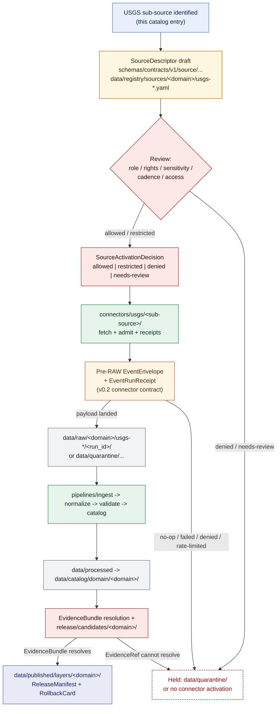

<!-- [KFM_META_BLOCK_V2]
doc_id: kfm://doc/source-catalog-usgs
title: USGS — Source Family Catalog Entry
type: standard
version: v1.1
status: draft
owners: TODO — Docs steward + Hydrology domain owner + Spatial Foundation domain owner
created: 2026-05-13
updated: 2026-05-23
policy_label: public
related:
  - docs/sources/SOURCE_DESCRIPTOR_STANDARD.md
  - docs/sources/catalog/README.md
  - docs/sources/catalog/usgs/usgs-3dep-elevation.md
  - docs/sources/catalog/usfws-ecos.md
  - docs/doctrine/directory-rules.md
  - docs/doctrine/lifecycle-law.md
  - docs/doctrine/truth-posture.md
  - docs/doctrine/trust-membrane.md
  - docs/domains/hydrology/README.md
  - docs/domains/spatial-foundation/README.md
  - docs/domains/geology/README.md
  - docs/domains/hazards/README.md
  - docs/standards/STAC.md
  - docs/standards/DCAT.md
  - docs/standards/PROV.md
  - docs/standards/PMTILES.md
  - docs/standards/SENSITIVITY_RUBRIC.md
  - connectors/usgs/README.md
  - schemas/contracts/v1/source/source_descriptor.schema.json
  - schemas/contracts/v1/spatial/
adr_refs:
  - ADR-0001 (schema home)
  - <PROPOSED> ADR-S-04 (source-role vocabulary v1)
  - <PROPOSED> ADR-S-05 (sensitivity tier scheme T0–T4)
  - <PROPOSED> ADR-S-07 (3D admission policy)
  - <PROPOSED> ADR-S-12 (connector cadence + quarantine recovery)
  - <PROPOSED> ADR-S-14 (cross-lane join policy)
  - <PROPOSED> ADR-S-?? (catalog page nesting convention — flat-file vs family-folder + product-pages; see §2)
tags: [kfm, sources, catalog, usgs, hydrology, spatial-foundation, geology, hazards, archaeology, planetary-3d, agriculture]
notes:
  - "v1.1 — additive minor revision: cross-references to the newly-authored sibling product page docs/sources/catalog/usgs/usgs-3dep-elevation.md; structural-convention divergence flagged in §2 (flat-file usgs.md vs nested-folder usgs/<product>.md); ADR backlog made explicit; v0.2 connector pre-RAW EventEnvelope reflected in §8 diagram; Atlas §24.5.2 per-domain sensitivity tier doctrine threaded into §7."
  - "Catalog entry; not an admission decision. Activation lives in data/registry/sources/. Per-sub-source rights/cadence remain NEEDS VERIFICATION until SourceDescriptor lands."
[/KFM_META_BLOCK_V2] -->

# USGS — Source Family Catalog Entry

> Catalog entry for U.S. Geological Survey (USGS) source families in the Kansas Frontier Matrix (KFM). Records identity, source roles, sensitivity posture, and lane fit — **not** an admission decision and **not** the SourceDescriptor itself.

<!-- Badges: targets are placeholders pending real CI / status endpoints. -->


-purple)


| Field | Value |
|---|---|
| **Status** | `draft` |
| **Doc version** | `v1.1` (additive minor revision of v1; see [§14](#14-changelog)) |
| **Owners** | `TODO` — Docs steward · Hydrology domain owner · Spatial Foundation domain owner |
| **Last updated** | `2026-05-23` |
| **Path (this file, flat-file convention)** | `docs/sources/catalog/usgs.md` *(PROPOSED — see §2 Repo fit and the structural-divergence note there)* |
| **Sibling product pages (nested-folder convention)** | `docs/sources/catalog/usgs/<product>.md` — first authored: [`usgs-3dep-elevation.md`](./usgs/usgs-3dep-elevation.md) |

> [!IMPORTANT]
> **Structural convergence note.** Two structural conventions are currently in active use in this conversation's authored output: this file (flat single-file family-catalog at `docs/sources/catalog/usgs.md`) and per-product pages under a nested folder (`docs/sources/catalog/usgs/<product>.md`, e.g. the now-authored [`usgs-3dep-elevation.md`](./usgs/usgs-3dep-elevation.md)). Both are PROPOSED until reconciled by ADR. See [§2 Repo fit](#2-repo-fit) for the discussion; v1.1 of this page does **not** silently pick one over the other.

---

## Quick jump

- [§1. Scope](#1-scope)
- [§2. Repo fit](#2-repo-fit)
- [§3. Inputs — what belongs here](#3-inputs--what-belongs-here)
- [§4. Exclusions — what does not belong here](#4-exclusions--what-does-not-belong-here)
- [§5. Sub-source registry (catalog index)](#5-sub-source-registry-catalog-index)
- [§5.1. Per-sub-source product pages](#51-per-sub-source-product-pages)
- [§6. Source-role posture (anti-collapse)](#6-source-role-posture-anti-collapse)
- [§7. Rights, sensitivity, freshness](#7-rights-sensitivity-freshness)
- [§8. Source admission flow](#8-source-admission-flow)
- [§9. Lifecycle hand-off](#9-lifecycle-hand-off)
- [§10. Task list — readiness backlog](#10-task-list--readiness-backlog)
- [§10.1. ADR backlog](#101-adr-backlog)
- [§11. FAQ](#11-faq)
- [§12. Related docs](#12-related-docs)
- [§13. Appendix — schema field hooks](#13-appendix--schema-field-hooks)
- [§14. Changelog](#14-changelog)

---

## 1. Scope

**CONFIRMED doctrine.** USGS — the United States Geological Survey — operates several distinct geospatial and hydrologic data programs that KFM admits as a **source family**. Each program is a separate `SourceDescriptor` candidate with its own role, rights, cadence, steward, and sensitivity posture. This page catalogs the family at the doctrine level; it does **not** stand in for any single `SourceDescriptor` and is **not** a `SourceActivationDecision`.

The KFM source registry is, per doctrine, an *admission and authority-control surface, not a bibliography.* This entry exists so reviewers and stewards can locate the USGS family, see its sub-sources at a glance, and understand which lane each belongs to before any connector or pipeline is activated.

> [!NOTE]
> **CONFIRMED scope guard.** Cataloging USGS here does not grant any sub-source admission, activation, or public-release authority. A sub-source remains inactive until a `SourceDescriptor` is created, reviewed for role/rights/sensitivity/cadence/access, and a `SourceActivationDecision` is recorded. Connectors and watchers stay inactive until activation, fixtures, validators, and policy gates exist.

> [!NOTE]
> **v1.1 cross-reference.** Per-sub-source detail (Collection identity, asset roles, provenance fields, geometry/CRS/datum handling, validators, examples) belongs on the per-product page under `docs/sources/catalog/usgs/<product>.md`, **not** on this catalog page. See [§5.1](#51-per-sub-source-product-pages) for the per-sub-source product-page index.

---

## 2. Repo fit

**Path:** `docs/sources/catalog/usgs.md` — **PROPOSED**.

| Aspect | Status | Basis |
|---|---|---|
| `docs/sources/` lane | **CONFIRMED** | Directory Rules §6.1 lists `docs/sources/` for "source-descriptor standards, source families." |
| `catalog/` subfolder | **PROPOSED** | Not explicitly named in Directory Rules; consistent with the lane's purpose (per-family catalog pages). Open a `docs/registers/DRIFT_REGISTER.md` entry if a different convention is preferred. |
| **Nested family folder** (`catalog/usgs/`) | **PROPOSED — coexisting convention** | The per-product page [`usgs-3dep-elevation.md`](./usgs/usgs-3dep-elevation.md) was authored in this conversation under `docs/sources/catalog/usgs/`, paralleling the same pattern used for `docs/sources/catalog/usfws_ecos/{critical-habitat,esa-listing-status,ipac-project-lists,species-profiles}.md`. **See structural-divergence note below.** |
| Domain placement | **CONFIRMED** | Cross-domain source family; therefore *not* under any single `docs/domains/<domain>/`. Directory Rules §12 — multi-domain files live under the lowest common responsibility root without a domain segment. |
| Connector home | **CONFIRMED** | `connectors/usgs/` is named in Directory Rules §7.3. |
| Schema home (descriptor) | **CONFIRMED default** | `schemas/contracts/v1/source/source_descriptor.schema.json` per ADR-0001 (schema home). Specific file presence is **NEEDS VERIFICATION** until the mounted repo is inspected. |

> [!IMPORTANT]
> **PROPOSED — structural-divergence note (v1.1).** This file (`docs/sources/catalog/usgs.md`) and the nested-folder per-product pages (`docs/sources/catalog/usgs/<product>.md`) co-exist as two structurally different conventions. Each is sensible in isolation:
>
> - **Flat single-file convention** (this page, plus the sibling `docs/sources/catalog/usfws-ecos.md` authored earlier in this conversation): one navigational catalog page per source family, listing all sub-sources in a single registry table.
> - **Nested-folder convention** (the four `docs/sources/catalog/usfws_ecos/<product>.md` product pages and the new `docs/sources/catalog/usgs/usgs-3dep-elevation.md`): one product page per sub-source, with per-product Collection identity, provenance fields, validators, etc.
>
> Both are PROPOSED. They are **not redundant** — the family page indexes; the product pages detail — but the relationship and naming convention need ADR resolution. **v1.1 does not pick one**; instead this page treats itself as the **family-level navigational index** and links to per-product pages as they are authored. See [§10.1 ADR backlog](#101-adr-backlog).

**Upstream of this page:**

- `docs/sources/README.md` *(PROPOSED — landing page for the `docs/sources/` lane)*
- `docs/sources/catalog/README.md` *(PROPOSED — landing page for the catalog subfolder)*
- `docs/sources/SOURCE_DESCRIPTOR_STANDARD.md` *(PROPOSED — referenced in the Whole-UI Expansion Report)*

**Downstream of this page:**

- **Per-sub-source product pages** under `docs/sources/catalog/usgs/<product>.md` — see [§5.1](#51-per-sub-source-product-pages)
- `connectors/usgs/README.md` and per-sub-source connector READMEs
- `data/registry/sources/<domain>/usgs-*.yaml` and per-domain registry entries
- `schemas/contracts/v1/source/source_descriptor.schema.json` instances

---

## 3. Inputs — what belongs here

This catalog entry MUST describe, for each USGS sub-source KFM intends to consume:

1. The **canonical sub-source identity** (program name, URL or service endpoint, governing USGS office).
2. The **source role(s)** — `observed`, `regulatory`, `modeled`, `aggregate`, `administrative`, `candidate`, or `synthetic` — as defined in the Master Source-Role Anti-Collapse Register (Atlas v1.1 §24.1.1).
3. The **domain lanes** the sub-source feeds (e.g., Hydrology, Spatial Foundation, Geology, Hazards, Planetary/3D).
4. **Rights / sensitivity / freshness posture** at a doctrine level (NEEDS VERIFICATION at the per-`SourceDescriptor` level).
5. **Admission status**: not started · candidate · activated · restricted · denied · retired.
6. **Product-page status** *(v1.1 addition)*: whether a per-product page exists under `docs/sources/catalog/usgs/<product>.md` for this sub-source.
7. Links to **adjacent governance** (connector, descriptor schema, domain page, drift entries, ADRs).

---

## 4. Exclusions — what does not belong here

This page is **not** the place for:

| If it is… | …it belongs in |
|---|---|
| **Per-product detail** (Collection identity, asset roles, provenance fields, geometry/CRS/datum handling, validators, examples) | The per-sub-source product page under `docs/sources/catalog/usgs/<product>.md` |
| The machine-readable `SourceDescriptor` for a sub-source | `schemas/contracts/v1/source/source_descriptor.schema.json` (shape) + `data/registry/sources/<domain>/<source_id>.yaml` (instance) — both PROPOSED until verified |
| Connector code, retrieval logic, credentials policy | `connectors/usgs/<sub-source>/` |
| Pipeline declarative spec for a USGS ingest | `pipeline_specs/<domain>/` |
| Pipeline executable steps | `pipelines/ingest/` and `pipelines/domains/<domain>/` |
| Activation / restriction / denial decisions | A `SourceActivationDecision` record (review record) |
| Rights or sensitivity rules | `policy/rights/` and `policy/sensitivity/` |
| Domain object meaning | `docs/domains/<domain>/` and `contracts/domains/<domain>/` |
| External standards (e.g., STAC, JSON Schema) | `docs/standards/` |

> [!IMPORTANT]
> **CONFIRMED rule (Directory Rules §7.3).** Connectors MUST NOT publish, mutate canonical truth, or write under `data/processed/`, `data/catalog/`, or `data/published/`. Connector output flows to `data/raw/<domain>/<source_id>/<run_id>/` or `data/quarantine/...`, with source descriptors, checksums, and ingest receipts. *(v1.1 update)* Per the v0.2 connector README contract, connectors also emit a **pre-RAW `EventEnvelope`** + **`EventRunReceipt`** before any RAW write, so failed / denied / rate-limited / no-op fetches remain auditable even when no payload lands. This entry's catalog status does not waive that boundary for any USGS sub-source.

---

## 5. Sub-source registry (catalog index)

The table below catalogs the USGS sub-sources KFM dossiers and the encyclopedia have **named** as in-scope. Sub-source identity, role(s), and feeding domains are CONFIRMED at the doctrine level. Per-sub-source **admission status** is **PROPOSED / NEEDS VERIFICATION** in every row — no row asserts that a connector or `SourceDescriptor` exists in the mounted repo. The **product-page** column tracks whether a per-product page exists yet under `docs/sources/catalog/usgs/`.

| Sub-source | KFM short ID *(PROPOSED)* | Primary role(s) | Feeds domains | Admission status | Product page |
|---|---|---|---|---|---|
| **USGS Water Data APIs** (`api.waterdata.usgs.gov`) — successor to legacy WaterServices/NWIS | `usgs-water-data` | `observed` (gauges, sensor readings); `aggregate` (daily values, summaries) | Hydrology · Hazards (context) | PROPOSED — NEEDS VERIFICATION | **PROPOSED** — not yet authored |
| **Watershed Boundary Dataset (WBD) / HUC** | `usgs-wbd` | `administrative` (HUC accounting units) *(see §6 role-mapping note; "context" alone is not a §24.1.1 enum value)* | Hydrology · Spatial Foundation · Agriculture · Habitat | PROPOSED — NEEDS VERIFICATION | **PROPOSED** — not yet authored |
| **NHDPlus High Resolution (NHDPlus HR) / NHD / 3DHP** | `usgs-nhdplus-hr` | `observed` (hydrography geometry — first-party survey/digitization); `modeled` (Value-Added Attributes such as cumulative drainage, mean annual flow/velocity, flow direction). *(v1.1 note: NHD geometry itself was labeled "context" in v1; that informal label maps to `observed` at the descriptor level — the geometry is a measured/digitized representation, not a model output.)* | Hydrology · Spatial Foundation | PROPOSED — NEEDS VERIFICATION | **PROPOSED** — not yet authored |
| **3D Elevation Program (3DEP)** — terrain, DEMs, LiDAR derivatives | `usgs-3dep` | **Heterogeneous** per `KFM-P30-IDEA-0019`: `observed` (LAZ point clouds — immutable source truth); `observed` derivative carrier (EPT/COPC analytic delivery); `modeled` (1 m DEM and coarser); `modeled` second-order (hillshade, slope, aspect, uncertainty) | Spatial Foundation · Hydrology · Hazards · Archaeology · Planetary/3D | PROPOSED — NEEDS VERIFICATION | **CONFIRMED authored — [`usgs-3dep-elevation.md`](./usgs/usgs-3dep-elevation.md)** *(v0.2)* |
| **The National Map** — discovery/download platform | `usgs-tnm` | `aggregator` of program assets *(carrier; per-asset role applies)* | Spatial Foundation (cross-cutting) | PROPOSED — NEEDS VERIFICATION | **PROPOSED** — not yet authored |
| **Geographic Names Information System (GNIS)** | `usgs-gnis` | `administrative` (official geographic names, populated places) — per **`C7-09`** (USGS GNIS as the U.S.-canonical place-names authority); `candidate` (historical identity ambiguity) | Settlements & Infrastructure · Spatial Foundation · People-DNA-Land · Roads-Rail-Trade | PROPOSED — NEEDS VERIFICATION | **PROPOSED** — not yet authored |
| **USGS Science Data Catalog** — e.g., NHDPlus v2.1 COMID → WBD HU-12 crosswalk | `usgs-sdc` | `modeled` where derivation is documented; `aggregate` for cross-domain mosaic products. *(v1.1 note: "context" alone is not a §24.1.1 enum value; per-product mapping required at descriptor time.)* | Hydrology (crosswalks) · cross-domain | PROPOSED — NEEDS VERIFICATION | **PROPOSED** — not yet authored |
| **USGS Earthquakes** | `usgs-earthquakes` | `observed` (seismic events); `modeled` (PAGER, ShakeMap derivatives) | Hazards · Geology | PROPOSED — NEEDS VERIFICATION | **PROPOSED** — not yet authored |
| **USGS Geologic Maps** | `usgs-geologic-maps` | `administrative` (compiled maps); `observed` where field surveys are first-party | Geology · Natural Resources | PROPOSED — NEEDS VERIFICATION | **PROPOSED** — not yet authored |

> [!NOTE]
> **Source-role assignments above are PROPOSED at the descriptor level.** The Master Source-Role Anti-Collapse Register (Atlas v1.1 §24.1.1) requires that source role be set at admission on the `SourceDescriptor` and preserved through every promotion. Treat the rows above as a starting hypothesis for review, not as final descriptor values. *(v1.1 cleanup: the informal value "context" used in v1 is **not** in the §24.1.1 enum and has been replaced or annotated in each row where it appeared; ADR-S-04 will codify the canonical enum.)*

<details>
<summary><strong>USGS Water Data — current-API migration note (EXTERNAL: none new; project-knowledge basis)</strong></summary>

The KFM `New_Ideas_5-8-26.pdf` packet records that the modern **USGS Water Data APIs** at `api.waterdata.usgs.gov` are replacing the legacy `waterservices.usgs.gov` (NWIS) endpoints, with the legacy surface in phase-out across 2026/2027. Any USGS Water Data `SourceDescriptor` SHOULD pin the modern endpoint, capture the legacy phase-out window as freshness/cadence context, and treat the cutover as a tracked migration. Live API surface and current terms remain **NEEDS VERIFICATION** at activation time.

</details>

---

## 5.1. Per-sub-source product pages

*(New section in v1.1.)* Where a sub-source row in [§5](#5-sub-source-registry-catalog-index) deserves per-product detail — Collection identity, asset roles, provenance fields, geometry/CRS/datum handling, validators, examples — that detail lives on a **per-product page** under `docs/sources/catalog/usgs/<product>.md`. This page indexes them.

| Sub-source | Per-product page path *(PROPOSED unless noted)* | Status |
|---|---|---|
| `usgs-3dep` | [`docs/sources/catalog/usgs/usgs-3dep-elevation.md`](./usgs/usgs-3dep-elevation.md) | **CONFIRMED authored** (v0.2) — covers LAZ, EPT/COPC, 1 m DEM, coarser DEMs, and second-order derivatives under one product page with `source_role` decomposition per sub-product. |
| `usgs-nhdplus-hr` | `docs/sources/catalog/usgs/usgs-nhd.md` | **PROPOSED** — not yet authored. |
| `usgs-wbd` | `docs/sources/catalog/usgs/usgs-wbd.md` | **PROPOSED** — not yet authored. |
| `usgs-gnis` | `docs/sources/catalog/usgs/usgs-gnis.md` | **PROPOSED** — not yet authored; should anchor to `C7-09`. |
| `usgs-water-data` | `docs/sources/catalog/usgs/usgs-water-data.md` | **PROPOSED** — not yet authored; legacy/modern API cutover belongs here. |
| `usgs-earthquakes` | `docs/sources/catalog/usgs/usgs-earthquakes.md` | **PROPOSED** — not yet authored. |
| `usgs-geologic-maps` | `docs/sources/catalog/usgs/usgs-geologic-maps.md` | **PROPOSED** — not yet authored. |
| `usgs-tnm` | *(carrier; may not warrant its own product page)* | **PROPOSED — UNDECIDED**. TNM is a discovery/download surface, not a content source. Recommend treating it as access machinery referenced from product pages rather than a product page of its own. |
| `usgs-sdc` | *(carrier; per-crosswalk product page may apply)* | **PROPOSED — UNDECIDED**. |

> [!NOTE]
> The "carrier vs. content source" distinction matters: TNM and SDC are aggregator/discovery surfaces. Whether each warrants a product page is a design question that the catalog-nesting ADR (see [§10.1](#101-adr-backlog)) should resolve.

---

## 6. Source-role posture (anti-collapse)

**CONFIRMED doctrine (Atlas v1.1 §24.1).** KFM treats `source_role` as a first-class identity attribute on every `SourceDescriptor`. The lifecycle and the governed API both fail closed when roles are conflated. For the USGS family, three anti-collapse patterns deserve specific attention:

| Anti-collapse risk | USGS context | Required guardrail |
|---|---|---|
| **Modeled product labeled as observed** | NHDPlus HR Value-Added Attributes (e.g., cumulative drainage, mean annual flow/velocity) are *derived*, not measured at each reach. 3DEP-derived DEMs, hillshade, slope, aspect are *modeled* from LiDAR returns — only the LAZ point clouds are `observed` (see `KFM-P30-IDEA-0019` and the [3DEP product page](./usgs/usgs-3dep-elevation.md) §2.1 for the per-sub-product decomposition). | Carry `role_model_run_ref` on `SourceDescriptor`; preserve role through every transform; expose role in `EvidenceBundle`. |
| **Administrative compilation cited as observation** | GNIS entries and compiled geologic maps are *administrative compilations*, not first-hand observations of the named place at the cited time. | Cite as administrative context; never collapsed with observation. Use `LifeEvent` vs `AdminEvent` separation in People/Settlements lanes. |
| **Aggregate cited as per-place truth** | USGS Water Data daily-value or annual summaries are *aggregates* over time windows; some catalog products aggregate spatially. | `AggregationReceipt` with explicit `role_aggregation_unit`; DENY join from aggregate cell to single record; ABSTAIN at AI. |

> [!WARNING]
> **CONFIRMED rule.** A USGS dataset does **not** become regulatory simply by being federal. Regulatory flood-zone designations are FEMA NFHL — *not* USGS. Do not relabel USGS WBD/HUC, NHDPlus HR, or USGS Water Data observations as "regulatory" anywhere in this catalog or in any downstream `SourceDescriptor`.

> [!NOTE]
> **v1.1 — informal-label cleanup.** v1 used the informal value "context" in several §5 rows for hydrography geometry and crosswalks. "context" is **not** in the Atlas §24.1.1 enum (`observed | regulatory | modeled | aggregate | administrative | candidate | synthetic`). v1.1 surfaces the mapping per-row and defers the canonical enum disposition to ADR-S-04. No descriptor instance should carry "context" as a `source_role` value.

---

## 7. Rights, sensitivity, freshness

| Posture | Default for the USGS family | Per-sub-source override required |
|---|---|---|
| **Rights / license** | Generally permissive for federal USGS open data (17 U.S.C. §105) | **NEEDS VERIFICATION** per dataset; capture license text and attribution requirement on each `SourceDescriptor`; unknown rights fail closed. |
| **Sensitivity (default)** | Mostly low-sensitivity → **T0 (Open)** per Atlas §24.5.1–24.5.2 | Per-sub-source overrides apply (see below). |
| **Sensitivity — infrastructure overlay** | **T4 at the join** when high-resolution elevation, hydrography, or place data overlays critical infrastructure | Per Atlas §24.5.2 *"Infrastructure — critical asset detail"* row (T4) and *"Infrastructure — condition / vulnerability"* row (T4, T3 to named authorities only). Governed by ADR-S-14 (cross-lane join policy). See the [3DEP product page](./usgs/usgs-3dep-elevation.md) §9.1 for the worked case. |
| **Sensitivity — biodiversity join** | **T4 at the join** when USGS data is joined to precise rare-species occurrence records | Per `KFM-P24-IDEA-0002` (sensitive species deny-by-default) and `KFM-P25-IDEA-0006` (precision degradation). |
| **Sensitivity — Tribal lands** | Routes through **`sovereignty_review`** (CARE applicability, S.O. 3206) | Family-level policy; routes any KFM-side aggregation / featuring / story over Tribal lands through Tribal-government review when triggered. |
| **Freshness / cadence** | Highly source-vintage-specific (NHDPlus HR releases; 3DEP collection vintages; Water Data near-real-time vs daily values; earthquake stream is near-real-time) | Record `cadence`, `retrieval_time`, and `stale-state` thresholds on each `SourceDescriptor`; surface stale/degraded badges on UI. ADR-S-12 governs connector cadence + quarantine recovery. |
| **Source-time vs observed-time vs retrieval-time** | All six temporal fields apply (observed, valid, source, retrieval, release, correction time) — especially when acquisition time (e.g., LiDAR flight date) differs materially from publication time | Keep distinct where material; ABSTAIN if material temporal scope is missing. |

> [!CAUTION]
> **CONFIRMED rule (Sensitive / Deny-by-Default Register).** USGS data is **not** automatically safe to publish at full precision. A USGS `observed` record near a rare species nest, archaeology coordinate, or sensitive infrastructure feature inherits the sensitivity of the joined object. *(v1.1 expansion)* The cross-source join, not the USGS feed alone, is what triggers `RedactionReceipt` and steward review. Atlas §24.5.2 codifies this as a per-domain matrix; per-product pages cite the relevant rows.

> [!IMPORTANT]
> **Engineering-claim disclaimer.** Per `ML-061-022` (NFHL vertical datum and units check), engineering claims about flood elevation, structure clearance, or right-of-way require the controlling regulatory source (FEMA NFHL, state DOT, local jurisdiction), not a USGS-derived KFM tile. The 3DEP product page §9.3 carries this rule and applies it to elevation; analogous discipline applies to hydrography (NHD) and watersheds (WBD) for any engineering use.

---

## 8. Source admission flow

The diagram below reflects KFM's CONFIRMED source registry doctrine (Source registry architecture; Master Action Matrix; Lifecycle gates) plus the **v0.2 pre-RAW `EventEnvelope`** addition. The specific files, route names, and IDs labeled inside the nodes are **PROPOSED** until verified against the mounted repo.



> [!NOTE]
> **v1.1 update.** The Pre-RAW `EventEnvelope` + `EventRunReceipt` (orange node) was added to reflect the v0.2 connector README contract. It captures the connector's *attempt* to fetch — including failed, denied, rate-limited, and no-op outcomes — so quarantine pathways remain auditable even when no RAW payload lands. Paths inside nodes follow Directory Rules §5 and §12 patterns but are not verified against the mounted repo. If the repo names a path differently, raise a `docs/registers/DRIFT_REGISTER.md` entry; do not silently rename here.

---

## 9. Lifecycle hand-off

USGS sub-sources travel the standard KFM lifecycle invariant:

```text
RAW -> WORK / QUARANTINE -> PROCESSED -> CATALOG / TRIPLET -> PUBLISHED
```

| Phase | What this catalog entry guarantees | What it does **not** guarantee |
|---|---|---|
| **RAW** | This page names the sub-source, its role hypothesis, and its lane fit. | That a connector exists, has run, or has emitted a `RawCaptureReceipt`. |
| **WORK / QUARANTINE** | Identifies the *kinds* of failures (rights unknown, sensitivity unresolved, schema mismatch, geometry invalid, **datum/units missing**, **source-hierarchy violated**) that route a USGS payload to quarantine. | Any specific `QuarantineRecord` or its disposition. |
| **PROCESSED** | Notes that `TransformReceipt` and `ValidationReport` are required for any normalized USGS dataset; for 3DEP, `RasterAssetManifest` / `COGArtifactManifest` / `TerrainTilesetManifest` / `Elevation/DEM manifest` apply per `Master MapLibre Components v2.1` Section K. | That a normalized dataset exists. |
| **CATALOG / TRIPLET** | Notes that catalog closure requires resolvable `EvidenceRef` → `EvidenceBundle`. STAC primary for spatial USGS products; DCAT participates as a mirror per `C4-05` and `KFM-P14-IDEA-0002`. | Any `CatalogRecord` entry. |
| **PUBLISHED** | Notes that publication requires `ReleaseManifest`, review where required, and a `RollbackCard` target. | Any released layer or current release state. |

> [!IMPORTANT]
> **CONFIRMED invariant.** Promotion across these phases is a **governed state transition, not a file move.** Watchers may emit observations, receipts, and candidate decisions; they MUST NOT mutate catalog truth, publish directly, overwrite canonical records, or bypass review states.

---

## 10. Task list — readiness backlog

PROPOSED next steps to take this catalog entry from a doctrine-level page to an activated source family. None of the items below claims to already be done. *(v1.1: items 1–9 carried from v1; items 10–14 are new.)*

- [ ] **PROPOSED** — Create `docs/sources/README.md` as the lane landing page and link this catalog from it.
- [ ] **PROPOSED** — Create `docs/sources/catalog/README.md` as the catalog-subfolder landing page indexing both the flat-file family entries and the nested-folder per-product pages.
- [ ] **PROPOSED** — Create `docs/sources/SOURCE_DESCRIPTOR_STANDARD.md` (referenced in the Whole-UI Expansion Report) and link bidirectionally with this entry.
- [ ] **NEEDS VERIFICATION** — Confirm `schemas/contracts/v1/source/source_descriptor.schema.json` exists in the mounted repo; if not, defer descriptor authoring until the schema home is in place per ADR-0001.
- [ ] **PROPOSED** — For each row in §5, draft a `SourceDescriptor` instance under `data/registry/sources/<domain>/` once the schema is verified.
- [ ] **PROPOSED** — Stand up `connectors/usgs/<sub-source>/` skeletons with `README.md` declaring source descriptor reference, output target (`data/raw/...`), pre-RAW `EventEnvelope` emission, and ingest-receipt contract; keep them **inactive** until activation decision, fixtures, validators, and policy gates exist.
- [ ] **PROPOSED** — Author no-network fixtures (valid + invalid) under `tests/fixtures/<domain>/usgs-*/` and a connector-gate validator path.
- [ ] **PROPOSED** — Open `docs/registers/VERIFICATION_BACKLOG.md` entries for every row whose **Admission status** is currently `PROPOSED — NEEDS VERIFICATION`.
- [ ] **PROPOSED** — Surface the USGS Water Data legacy → modern API migration as a tracked drift entry with a freshness/cadence note.
- [ ] **PROPOSED (v1.1)** — Author the per-sub-source product pages listed in [§5.1](#51-per-sub-source-product-pages) (the 3DEP page is **CONFIRMED authored**; the remaining seven are not yet drafted).
- [ ] **PROPOSED (v1.1)** — Reconcile the flat-file vs nested-folder convention via the structural-convention ADR (see [§10.1](#101-adr-backlog)). Pending that ADR, this page remains the family-level navigational index and the per-product pages cover product-level detail.
- [ ] **PROPOSED (v1.1)** — Author `docs/runbooks/spatial-foundation/SOURCE_REFRESH_RUNBOOK.md` (referenced from the 3DEP product page §13) as the operational counterpart to `docs/runbooks/fauna/SOURCE_REFRESH_RUNBOOK.md` authored in this conversation.
- [ ] **PROPOSED (v1.1)** — Move the "context" pseudo-value out of any draft `SourceDescriptor` content; resolve to a §24.1.1 enum value per ADR-S-04.
- [ ] **PROPOSED (v1.1)** — Cross-link this catalog entry from the four `usfws_ecos/` product pages' family-level RIGHTS-AND-SENSITIVITY-MAP so cross-family sensitivity-tier comparisons (T0 vs T1 vs T2 vs T4) are reachable in both directions.

---

## 10.1. ADR backlog

*(New section in v1.1.)* ADRs identified during the authoring of this catalog page and its sibling product pages.

| ADR ID | Topic | Status | Triggered by |
|---|---|---|---|
| **ADR-0001** | Schema home — `schemas/contracts/v1/...` is the canonical machine-schema location. | **CONFIRMED** (referenced throughout). | Pre-existing in repo per project memory. |
| **ADR-S-04** | Source-role vocabulary v1 — canonical enum for `source_role`: `observed | regulatory | modeled | aggregate | administrative | candidate | synthetic`. Resolves the "context" pseudo-value issue. | **PROPOSED** | Atlas §24.1.1; v1 of this page used "context" informally; v1.1 cleanup pending ADR. |
| **ADR-S-05** | Sensitivity tier scheme T0–T4 + per-domain matrix codification. | **PROPOSED** | Atlas §24.5.1–24.5.2; the four `usfws_ecos/` product pages and the 3DEP product page all carry tier defaults that need ADR-level codification. |
| **ADR-S-07** | 3D admission policy — when 3DEP-derived terrain meshes become 3D Tiles / glTF carriers, and how Cesium-side surfaces relate to MapLibre-side surfaces. | **PROPOSED** | The 3DEP product page Q-12 surfaces this; Atlas Planetary/3D §D distinguishes "USGS 3DEP and terrain sources" from "3D Tiles and glTF assets" as separate source families. |
| **ADR-S-12** | Connector cadence + quarantine recovery — formalizes pre-RAW `EventEnvelope` emission, stale thresholds, and quarantine-to-RAW recovery procedure. | **PROPOSED** | v0.2 connector README contract; surfaced in §8 diagram and across all product pages. |
| **ADR-S-14** | Cross-lane join policy — when joins across `source_role` lanes (e.g., `observed` × `regulatory`, or `modeled` × precise rare-species occurrence) trigger tier escalation and what receipts are required. | **PROPOSED** | The four `usfws_ecos/` product pages and the 3DEP product page all reach into this; needed before any T2+ join is published. |
| **ADR-S-?? (catalog nesting)** | Flat single-file family-catalog (`docs/sources/catalog/<family>.md`) vs nested family folder + per-product pages (`docs/sources/catalog/<family>/<product>.md`). | **OPEN — gating future structure** | This conversation has authored output in both conventions; reconciliation pending. See [§2 Repo fit](#2-repo-fit). |
| **ADR-S-?? (filename casing)** | Family-folder casing — `usfws_ecos` (snake_case, used in nested-folder pages) vs `usfws-ecos` (kebab-case, used in flat-file pages) vs `usgs` (single-word, both). | **OPEN** | Surfaced in every product page authored this conversation; same Directory Rules §18 OPEN-DR-04 family. |
| **ADR-S-?? (license_map.json scope)** | License-map placement — per-family (`policy/sources/<family>/license_map.json`) vs repo-wide (`policy/sources/license_map.json`). | **OPEN** | Species-profiles product page Q-7; relevant for any USGS sub-source that embeds third-party imagery (TNM aggregator, NAIP if treated as a USGS-distributed sibling). |

---

## 11. FAQ

**Q. Why is USGS one entry, when it is really many programs?**
USGS is a single *source family* in the registry sense — one organizational identity, one stewardship surface, one rights/attribution starting point. Each program is a distinct `SourceDescriptor` with its own role, cadence, and sensitivity; this catalog page exists so reviewers can see the family at a glance before any one descriptor is admitted.

**Q. Can I treat NHDPlus HR Value-Added Attributes (VAAs) as "observed" because they live alongside the geometry?**
**No.** VAAs are *derived* — cumulative drainage, mean annual flow/velocity, and flow direction are computed from the network model. Use `source_role: modeled` with `role_model_run_ref` set, and never relabel them as observations downstream.

**Q. Is WBD/HUC a regulatory boundary?**
**No.** HUC accounting units are an administrative/topological framework, not a regulatory determination. Regulatory flood-zone authority is FEMA NFHL — a different source family. Do not collapse them in any USGS row.

**Q. Can a USGS Water Data gauge reading be published without further review?**
The doctrine answer is: **not without** a resolvable `EvidenceRef` → `EvidenceBundle`, a passing `ValidationReport`, a `PolicyDecision`, and a `ReleaseManifest`. The data being open does not waive the trust-membrane gates.

**Q. What about USGS data near sensitive features (rare species, archaeology, critical infrastructure)?**
The USGS feed is not the sensitivity source; the **join** is. Treat any precise join near a deny-by-default class as sensitive: apply `RedactionReceipt`, prefer generalization or staged access, and route through steward review. Atlas §24.5.2 codifies the per-domain matrix; ADR-S-14 will govern the cross-lane join policy.

**Q. Why does this file co-exist with `docs/sources/catalog/usgs/usgs-3dep-elevation.md`?** *(New in v1.1.)*
This file is the **family-level navigational index**; the per-product page covers product-level detail (Collection identity, asset roles, validators, examples). The two are complementary, not redundant. The structural convention (flat-file family entry + nested-folder per-product pages) is currently PROPOSED — see [§2 Repo fit](#2-repo-fit) and the ADR backlog [§10.1](#101-adr-backlog).

**Q. The 3DEP row in §5 lists multiple source roles ("Heterogeneous"). Is that a contradiction of the §6 anti-collapse rule?** *(New in v1.1.)*
**No.** Per `KFM-P30-IDEA-0019`, 3DEP carries **distinct objects** with distinct roles — LAZ point clouds are `observed`, EPT/COPC are an observed derivative carrier, 1 m DEMs are `modeled`, and hillshade/slope/aspect are second-order `modeled`. Each object in the resulting catalog carries its **own** `source_role`; what is denied at the trust membrane is *citing one as if it were the other*. The 3DEP product page §2.1 and §11 enforce this with explicit validators.

**Q. Where does this page sit in the authority order?**
Below KFM core invariants, ADRs, and Directory Rules; above per-root READMEs only when no per-root README says otherwise. It is a *navigational* catalog, not an authoritative SourceDescriptor.

---

## 12. Related docs

- `docs/doctrine/directory-rules.md` — placement law, lifecycle invariant, anti-patterns.
- `docs/doctrine/lifecycle-law.md` *(PROPOSED canonical home)* — RAW → … → PUBLISHED.
- `docs/doctrine/truth-posture.md` *(PROPOSED canonical home)* — cite-or-abstain.
- `docs/doctrine/trust-membrane.md` *(PROPOSED canonical home)* — public clients use governed interfaces.
- `docs/sources/README.md` *(PROPOSED)*.
- `docs/sources/catalog/README.md` *(PROPOSED)*.
- `docs/sources/catalog/usfws-ecos.md` — sibling family catalog entry (flat-file convention).
- [`docs/sources/catalog/usgs/usgs-3dep-elevation.md`](./usgs/usgs-3dep-elevation.md) — **CONFIRMED authored** per-product page (nested-folder convention).
- `docs/sources/SOURCE_DESCRIPTOR_STANDARD.md` *(PROPOSED — referenced in the Whole-UI Expansion Report)*.
- `docs/standards/STAC.md` *(PROPOSED)* · `docs/standards/DCAT.md` *(PROPOSED)* · `docs/standards/PROV.md` — STAC/DCAT/PROV profiles for USGS-derived catalog items.
- `docs/standards/PMTILES.md` — tile delivery profile.
- `docs/standards/SENSITIVITY_RUBRIC.md` *(PROPOSED)* — T0–T4 tier scheme codification (pending ADR-S-05).
- `docs/runbooks/spatial-foundation/SOURCE_REFRESH_RUNBOOK.md` *(PROPOSED)* — operational counterpart for spatial-foundation refresh.
- `docs/runbooks/fauna/SOURCE_REFRESH_RUNBOOK.md` — **CONFIRMED authored** (sibling-family runbook); reference template.
- `docs/domains/hydrology/README.md` — primary downstream lane for USGS Water Data, WBD, NHDPlus HR.
- `docs/domains/spatial-foundation/README.md` *(PROPOSED short name)* — primary downstream lane for 3DEP, GNIS, TNM.
- `docs/domains/geology/README.md` — USGS geologic maps, earthquakes (with Hazards).
- `docs/domains/hazards/README.md` — USGS earthquakes, USGS Water (flood-context).
- `connectors/usgs/README.md` — connector home for the family.
- `schemas/contracts/v1/source/source_descriptor.schema.json` — descriptor shape (NEEDS VERIFICATION).
- `schemas/contracts/v1/spatial/` — terrain manifest contracts (`RasterAssetManifest`, `COGArtifactManifest`, `Elevation/DEM manifest`, `TerrainTilesetManifest`, `UncertaintySurface`).
- `docs/adr/ADR-0001-schema-home.md` — schema-home rule under which descriptors live.

---

## 13. Appendix — schema field hooks

**PROPOSED** mapping from this catalog entry to fields a `SourceDescriptor` should carry (illustrative, not authoritative; the canonical shape is whatever `schemas/contracts/v1/source/source_descriptor.schema.json` defines once verified).

<details>
<summary><strong>Descriptor field hooks (PROPOSED — derived from Atlas v1.1 §24.1.3)</strong></summary>

```yaml
# illustrative SourceDescriptor instance fragment — PROPOSED, not validated
source_id: usgs-water-data           # PROPOSED short ID
source_family: usgs                  # this catalog page
source_role: observed                # one of: observed | regulatory | modeled |
                                     #         aggregate | administrative |
                                     #         candidate | synthetic
                                     # ("context" is NOT a valid value; see §6 v1.1 note + ADR-S-04)
role_authority: "U.S. Geological Survey, Water Mission Area"   # required when role
                                                               # in {regulatory, modeled, aggregate}
role_aggregation_unit: null          # required when source_role = aggregate
role_model_run_ref: null             # required when source_role = modeled
role_synthetic_basis: null           # required when source_role = synthetic
role_candidate_disposition: null     # required when source_role = candidate

access:
  endpoint: "https://api.waterdata.usgs.gov/"      # NEEDS VERIFICATION at activation
  legacy_endpoint: "https://waterservices.usgs.gov/"   # phase-out 2026/2027 per New Ideas packet
  auth: none
rights:
  license: "TODO — NEEDS VERIFICATION"
  attribution_required: "TODO"
sensitivity:
  default_tier: T0                   # per Atlas §24.5.1; pending ADR-S-05
  default_class: low                 # legacy field — superseded by default_tier
  join_sensitivity_inherits: true    # join near deny-by-default class -> sensitive
  cross_lane_join_policy_ref: "<ADR-S-14>"   # PROPOSED reference
cadence:
  observation: near-real-time
  daily_values: T+1 day
  stale_thresholds: "TODO"
  cadence_policy_ref: "<ADR-S-12>"   # PROPOSED reference
temporal:
  observed_time: required
  valid_time: required
  source_time: required
  retrieval_time: required
  release_time: required
  correction_time: required          # v1.1: explicit
steward:
  contact: "TODO"
release_class: "TODO — public | restricted | denied"
# v0.2 connector contract additions:
connector_contract:
  pre_raw_event_envelope: required
  http_validator_receipt: required   # ETag, Last-Modified, content-length, manifest checksums
```

Field names follow the Atlas v1.1 §24.1.3 PROPOSED descriptor surface; **NEEDS VERIFICATION** against the mounted `source_descriptor.schema.json`.

</details>

<details>
<summary><strong>Cross-domain feed map (CONFIRMED at the encyclopedia / dossier level)</strong></summary>

| Domain | USGS sub-sources cited in dossiers |
|---|---|
| **Hydrology** | USGS Water Data APIs · WBD/HUC · NHDPlus HR / 3DHP · 3DEP terrain |
| **Spatial Foundation, Cartography, Reference Systems** | USGS 3DEP · The National Map · GNIS *(per `C7-09`)* |
| **Geology and Natural Resources** | USGS geologic maps · 3DEP terrain |
| **Hazards** | USGS earthquakes · USGS Water (context) |
| **Roads, Rail, and Trade Routes** | GNIS · Census/TIGER joins |
| **Settlements, Cities, and Infrastructure** | GNIS · Census/TIGER · The National Map |
| **Archaeology and Cultural Heritage** | 3DEP-derived LiDAR (with sensitivity guards) |
| **Planetary, 3D, Digital Twin, and Synthetic Spatial Systems** | USGS 3DEP · LiDAR collections · *(see ADR-S-07 for boundary with the separate "3D Tiles and glTF assets" source family)* |
| **Agriculture (context)** | WBD/HUC for irrigation/water linkages |

Citations: KFM Encyclopedia Master Domain Atlas (§5) and Appendix D Source family index; KFM Domains Culmination Atlas v1.1 (Hydrology, Spatial Foundation, Geology, Hazards, Planetary/3D sections); `C7-09` (USGS GNIS authority).

</details>

<details>
<summary><strong>Anti-collapse failure modes for this family (CONFIRMED doctrine)</strong></summary>

| Failure mode | Specific USGS risk | Required guardrail |
|---|---|---|
| Modeled labeled as observed | NHDPlus HR VAAs; 3DEP-derived rasters (DEMs, hillshade, slope, aspect) | `role_model_run_ref`; uncertainty surface; role-preserving DTO; for 3DEP, the `derivation_chain` per `KFM-P30-FEAT-0008` |
| Modeled cited as point-cloud query | 1 m DEM cited as if it answers a point-cloud query *(per `ML-061-010`)* | DEM items carry `source_pointcloud_ref` per `KFM-P30-IDEA-0019`; DENY substitution at trust membrane |
| Administrative cited as observation | GNIS entries; compiled geologic maps | Source-role tag preserved; named `LifeEvent` / `AdminEvent` types |
| Aggregate cited as per-place truth | Daily-value / annual-summary water data | `AggregationReceipt` with `role_aggregation_unit`; matrix-cell semantics |
| Candidate exposed on public surface | Unresolved crosswalk rows (e.g., alignment_score &lt; threshold) | Promotion gate; no PUBLISHED edge from WORK/QUARANTINE |
| Synthetic presented as observed | Synthetic terrain surfaces derived from 3DEP | Reality Boundary Note; Representation Receipt; UI badge |
| Federal-source-treated-as-regulatory | USGS WBD or NHDPlus HR labeled as regulatory | `source_role` preserved as administrative/observed/modeled; FEMA NFHL is the regulatory authority for flood-zone designations, not USGS |
| Cross-datum / cross-units silent mosaic *(v1.1)* | 3DEP tiles in NAVD88 + GEOID18 mosaicked with tiles in NGVD29 or in feet | `TransformReceipt` required per `ML-061-022`; DENY at Gate D otherwise |

</details>

<details>
<summary><strong>Per-domain sensitivity tier reference (v1.1; Atlas §24.5.2 — citation only, full text lives in <code>docs/standards/SENSITIVITY_RUBRIC.md</code>)</strong></summary>

| Lane / cell relevant to USGS | Default tier | Notes |
|---|---|---|
| Spatial Foundation — terrain / DEM | **T0** | Federal open data; standard attribution. Override when joined to critical-infrastructure detail. |
| Hydrology — gauge readings / hydrography | **T0** | Standard release with cadence-aware staleness flagging. |
| Hazards — earthquakes (event stream) | **T0** | Standard release. |
| Geology — compiled maps | **T0** with **T1 generalization** for under-determined survey vintages | Per-product judgment. |
| Settlements/Infrastructure — GNIS | **T0** for named places; **T2+** when joined to living-person residence | `C7-09` administrative role. |
| **Critical-infrastructure overlay** *(cross-lane)* | **T4** at the join (T3 to named authorities only) | Atlas §24.5.2 "Infrastructure — critical asset detail" + "condition / vulnerability" rows; governed by ADR-S-14. |
| **Sensitive-occurrence join** *(cross-lane)* | **T4** at the join | Per `KFM-P24-IDEA-0002`, `KFM-P25-IDEA-0006`. |
| **Tribal-lands featuring** *(cross-lane)* | **`sovereignty_review`** required | CARE applicability; S.O. 3206. |

Detail per product lives on the per-product page (e.g., [3DEP product page §9](./usgs/usgs-3dep-elevation.md#9-rights-and-sensitivity-pointer)).

</details>

---

## 14. Changelog

| Version | Date | Changes | Class |
|---|---|---|---|
| **v1** | 2026-05-13 | Initial draft. Full scope, repo fit, sub-source registry, source-role posture, rights/sensitivity/freshness, admission flow, lifecycle hand-off, task list, FAQ, related docs, appendix. | Initial. |
| **v1.1** | 2026-05-23 | Additive minor revision. Highlights: (1) cross-references to the newly-authored sibling product page `usgs/usgs-3dep-elevation.md`; (2) structural-divergence note in §2 acknowledging flat-file vs nested-folder catalog conventions; (3) §5 product-page column added; (4) **new §5.1** per-sub-source product-page index; (5) §6 informal-label cleanup — "context" is not a §24.1.1 enum value; (6) §7 Atlas §24.5.2 per-domain sensitivity tier threading; (7) §8 diagram update — pre-RAW `EventEnvelope` per v0.2 connector contract; (8) §9 expanded with terrain manifest contract references; (9) §10 task-list items 10–14 added (per-product page authoring, ADR reconciliation, runbook, descriptor cleanup, cross-family link); (10) **new §10.1** ADR backlog; (11) §11 FAQ expanded (structural divergence, heterogeneous 3DEP role); (12) §12 related-docs expanded with standards, runbooks, spatial schema home; (13) §13 appendix YAML expanded with v1.1 fields (`default_tier`, `cross_lane_join_policy_ref`, `cadence_policy_ref`, `correction_time`, `connector_contract`); (14) **new §13 sub-section** per-domain sensitivity tier reference; (15) **new §14** changelog. | Additive minor. No content removed; v1 statements preserved or re-cited. |

---

> [!NOTE]
> **Authority caveat.** This page is a navigational catalog. The canonical sources of truth for any claim about USGS sub-sources in KFM remain: KFM doctrine, accepted ADRs, the `SourceDescriptor` schema and instances, and the relevant `EvidenceBundle`. Where this page conflicts with any of those, this page is the one that must change.

---

**Related:** [Directory Rules](../../doctrine/directory-rules.md) · [Source Descriptor Standard](../SOURCE_DESCRIPTOR_STANDARD.md) *(PROPOSED)* · [USGS Connector README](../../../connectors/usgs/README.md) *(PROPOSED)* · [Hydrology Domain](../../domains/hydrology/README.md) · **[3DEP Product Page](./usgs/usgs-3dep-elevation.md)** *(CONFIRMED authored)*

**Last updated:** 2026-05-23

[Back to top](#usgs--source-family-catalog-entry)
